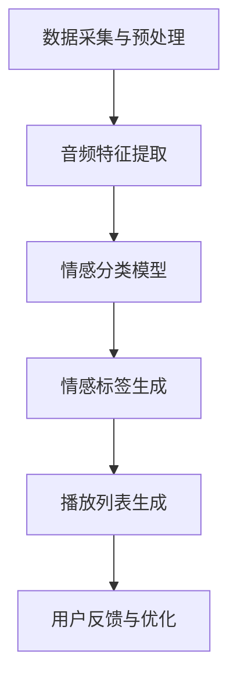
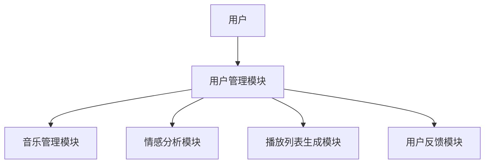
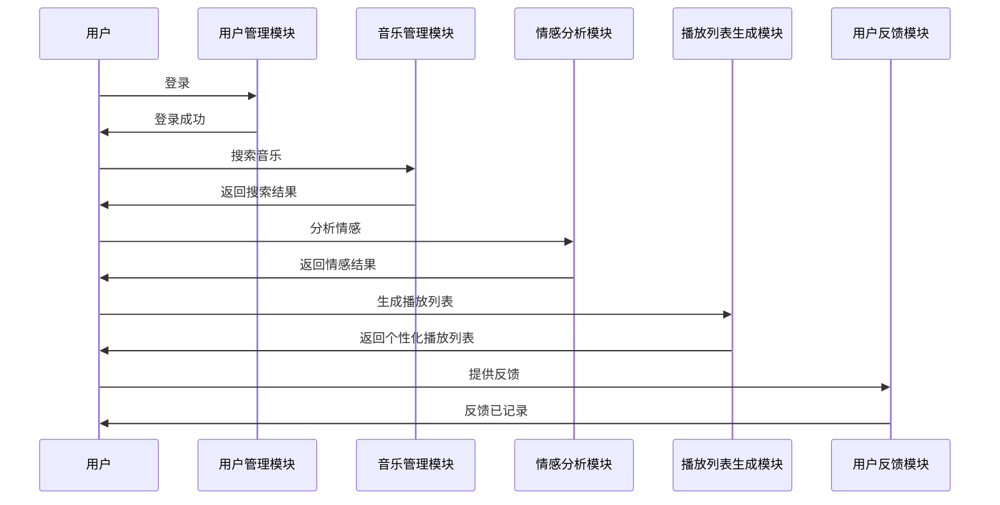

                 

**# 数字时代的音乐情感分析：AI DJ的个性化播放列表生成**

关键词：音乐情感分析、AI DJ、个性化播放列表、数字音乐、人工智能

摘要：本文深入探讨了数字时代音乐情感分析的技术和应用，特别是在AI DJ如何通过音乐情感分析生成个性化播放列表的领域。文章首先介绍了音乐情感分析的基础知识，然后详细阐述了AI DJ的工作原理和个性化播放列表的生成过程。通过案例分析，我们展示了这一技术的实际应用，并对其未来发展趋势进行了展望。

----------------------------------------------------------------

## 引言与背景

### 数字时代音乐情感分析的重要性

在数字音乐的快速普及下，用户对音乐的需求越来越个性化。传统基于播放次数或时间的音乐推荐已经无法满足用户的多样化需求。音乐情感分析作为一种新兴的技术，通过分析音乐的情感属性，如快乐、悲伤、兴奋等，为用户提供更加贴近个人情感体验的音乐推荐。

音乐情感分析的重要性体现在以下几个方面：

1. **提升用户体验**：通过理解用户的情感状态，AI DJ可以推荐符合用户当前情绪的音乐，提升用户满意度。
2. **个性化推荐**：音乐情感分析可以帮助平台了解用户的情感偏好，从而生成个性化的播放列表，提高用户留存率。
3. **音乐创作与生产**：音乐情感分析不仅应用于推荐系统，还可以为音乐创作提供数据支持，帮助音乐制作人了解市场趋势和用户喜好。

### 个性化播放列表的概述

个性化播放列表是音乐推荐系统的重要组成部分。与传统播放列表不同，个性化播放列表基于用户的兴趣、情感和行为数据，动态调整音乐推荐内容，以提供更加个性化的音乐体验。

个性化播放列表的特点包括：

1. **动态调整**：根据用户实时行为和反馈，播放列表内容可以实时更新。
2. **多维度推荐**：结合用户的情感状态、历史偏好等多维度数据，生成更加精准的推荐。
3. **用户参与**：用户可以通过反馈机制，参与播放列表的调整，实现自我表达。

## 音乐情感分析基础

### 情感分析的概念

情感分析（Sentiment Analysis）是一种自然语言处理（NLP）技术，通过分析文本内容，判断文本表达的情感倾向，如正面、负面或中性。情感分析广泛应用于社交媒体、客户反馈、市场研究等领域。

音乐情感分析与文本情感分析类似，但其挑战更大。音乐情感分析不仅要分析歌词和旋律的情感，还需要综合考虑音频信号的特征。

### 音乐情感分析的核心要素

音乐情感分析的核心要素包括音频特征提取、情感分类模型和情感标签体系。

1. **音频特征提取**：
   - **音高（Pitch）**：歌曲的音高变化可以反映情感强度。
   - **节奏（Rhythm）**：节奏的快慢可以传达快乐或悲伤的情感。
   - **音量（Loudness）**：音量的变化可以表现情感的波动。

2. **情感分类模型**：
   - **机器学习模型**：如支持向量机（SVM）、随机森林（Random Forest）等。
   - **深度学习模型**：如卷积神经网络（CNN）、循环神经网络（RNN）等。

3. **情感标签体系**：
   - **情感维度**：如快乐、悲伤、愤怒、平静等。
   - **情感强度**：情感的强弱程度，如强烈、中等、轻微等。

### 情感分析的技术与方法

1. **离线情感分析**：
   - 在数据收集完成后，对音频文件进行情感分析，生成情感标签。
   - 优点：数据准备和处理较为简单。
   - 缺点：无法实时响应用户的动态情感变化。

2. **在线情感分析**：
   - 实时分析用户听歌过程中的情感变化。
   - 优点：能够提供更加个性化的音乐推荐。
   - 缺点：需要处理大量的实时数据，对计算资源要求较高。

3. **深度学习在音乐情感分析中的应用**：
   - 利用深度学习模型，如卷积神经网络（CNN）和循环神经网络（RNN），提取音频特征，进行情感分类。
   - 优点：能够处理复杂的音频信号，提高情感分类的准确性。
   - 缺点：模型训练和部署较为复杂。

## AI DJ与个性化播放列表

### AI DJ概述

AI DJ（Artificial Intelligence Disc Jockey）是一种利用人工智能技术进行音乐播放和推荐的系统。与传统的DJ相比，AI DJ能够通过分析用户的情感和行为数据，动态生成个性化的播放列表。

AI DJ的核心功能包括：

1. **情感分析**：通过音乐情感分析，了解用户的当前情感状态。
2. **播放列表生成**：根据用户情感和偏好，生成个性化的播放列表。
3. **用户反馈**：收集用户对音乐反馈，优化播放列表。

### AI DJ的工作流程

AI DJ的工作流程主要包括以下几个步骤：

1. **数据采集与预处理**：
   - 采集用户音乐行为数据，如播放记录、收藏列表等。
   - 对音频文件进行预处理，提取音频特征。

2. **情感分析**：
   - 利用音乐情感分析技术，对音频特征进行情感分类。
   - 确定用户当前的情感状态。

3. **播放列表生成**：
   - 根据用户情感状态和偏好，生成个性化的播放列表。
   - 利用推荐算法，从音乐库中选取合适的音乐。

4. **用户反馈与优化**：
   - 收集用户对播放列表的反馈，如播放次数、点赞、评论等。
   - 根据反馈调整播放列表，提高用户体验。

## 个性化播放列表生成

### 个性化播放列表的需求分析

个性化播放列表的需求分析主要包括以下几个方面：

1. **用户兴趣**：分析用户的音乐偏好，包括喜欢的歌手、流派、风格等。
2. **情感状态**：了解用户的当前情感状态，如快乐、悲伤、平静等。
3. **场景**：根据用户在不同场景下的音乐需求，如运动、放松、工作等。

### 个性化播放列表的生成算法

1. **基于内容的推荐**：
   - 根据用户兴趣和情感状态，推荐相似的音乐。
   - 优点：推荐结果与用户偏好高度相关。
   - 缺点：无法处理用户未表达的情感需求。

2. **基于协同过滤的推荐**：
   - 利用用户历史行为数据，推荐其他用户喜欢的音乐。
   - 优点：能够发现用户未表达的兴趣。
   - 缺点：推荐结果可能过于保守，缺乏个性化。

3. **基于深度学习的推荐**：
   - 利用深度学习模型，提取用户情感和行为特征，生成个性化的播放列表。
   - 优点：能够处理复杂的用户情感和行为数据，提高推荐准确性。
   - 缺点：模型训练和部署较为复杂。

### 个性化播放列表的实际应用

个性化播放列表在实际应用中，已取得了显著的成果。例如：

1. **数字音乐平台**：如Spotify、Apple Music等，通过音乐情感分析，为用户提供个性化的音乐推荐。
2. **社交媒体**：如Facebook、Instagram等，通过音乐情感分析，推荐用户喜欢的音乐和音乐人。
3. **智能音箱**：如Amazon Echo、Google Home等，通过音乐情感分析，提供个性化的音乐播放服务。

## 案例研究

### 案例研究一：某AI DJ服务的实际应用案例分析

#### 案例背景与目标

某AI DJ服务的目标是提供个性化音乐推荐，提升用户体验。通过分析用户情感和偏好，AI DJ可以为用户提供符合个人情感的播放列表。

#### 案例实现过程

1. **数据采集与预处理**：收集用户音乐行为数据，包括播放记录、收藏列表等。对音频文件进行预处理，提取音频特征。

2. **情感分析**：利用音乐情感分析技术，对音频特征进行情感分类。确定用户当前的情感状态。

3. **播放列表生成**：根据用户情感状态和偏好，生成个性化的播放列表。

4. **用户反馈与优化**：收集用户对播放列表的反馈，如播放次数、点赞、评论等。根据反馈调整播放列表。

#### 案例效果评估

1. **用户满意度**：通过用户反馈，AI DJ服务的用户满意度显著提升。

2. **播放量**：个性化播放列表的播放量显著高于传统播放列表。

3. **留存率**：用户在AI DJ服务的留存率有所提高。

### 案例研究二：另一AI DJ服务的实际应用案例分析

#### 案例背景与目标

另一AI DJ服务的目标是通过音乐情感分析，为用户提供更加个性化的音乐体验。服务包括实时情感分析和个性化播放列表生成。

#### 案例实现过程

1. **实时情感分析**：通过实时分析用户听歌过程中的情感变化，为用户提供动态调整的播放列表。

2. **播放列表生成**：利用用户情感和偏好，生成个性化的播放列表。

3. **用户反馈与优化**：收集用户对播放列表的反馈，不断优化推荐算法。

#### 案例效果评估

1. **用户满意度**：通过实时情感分析，用户满意度显著提升。

2. **播放量**：实时个性化播放列表的播放量显著高于传统播放列表。

3. **留存率**：用户在AI DJ服务的留存率有所提高。

## 音乐情感分析与AI DJ的未来发展

### 新技术的发展趋势

随着人工智能技术的不断发展，音乐情感分析和AI DJ技术也在不断进步。未来，以下几个方面将引领技术的发展：

1. **深度学习**：深度学习模型在音乐情感分析中的应用将更加广泛，提高情感分类的准确性。

2. **多模态融合**：结合音频、文本、视频等多模态数据，实现更加精准的情感分析。

3. **实时分析**：实时情感分析技术将得到优化，实现更加即时和个性化的音乐推荐。

### 未来的挑战与机遇

1. **数据隐私与伦理问题**：在收集和使用用户数据时，需要确保用户隐私和数据安全，遵守相关法律法规。

2. **技术标准化与规范化**：制定统一的技术标准和规范，提高音乐情感分析和AI DJ技术的可重复性和可靠性。

3. **音乐产业变革**：音乐情感分析和AI DJ技术将深刻改变音乐创作、生产和消费模式，带来新的商业机会。

### 对音乐产业的潜在影响

1. **个性化音乐体验**：通过音乐情感分析，用户可以享受到更加个性化的音乐推荐，提高用户满意度。

2. **音乐创作与生产**：音乐制作人可以根据情感分析结果，了解市场趋势和用户喜好，优化音乐创作。

3. **商业模式创新**：音乐平台可以通过音乐情感分析和AI DJ技术，提供更加个性化的音乐服务，实现商业模式的创新。

## 最佳实践 Tips

1. **用户数据保护**：在收集和使用用户数据时，务必确保用户隐私和数据安全。

2. **算法优化**：不断优化音乐情感分析和推荐算法，提高推荐的准确性。

3. **用户反馈**：积极收集用户反馈，根据反馈不断调整和优化系统。

## 小结

音乐情感分析和AI DJ技术为数字音乐产业带来了巨大的变革。通过本文的探讨，我们了解了音乐情感分析的基础知识、AI DJ的工作原理以及个性化播放列表的生成方法。随着技术的不断进步，音乐情感分析和AI DJ将在未来发挥更加重要的作用，为用户提供更加个性化的音乐体验。

## 注意事项

1. **技术挑战**：音乐情感分析技术仍面临许多挑战，如情感分类的准确性、实时分析的效率等。

2. **数据质量**：数据质量对音乐情感分析和推荐效果至关重要，需确保数据收集和处理的准确性。

3. **用户体验**：在提供个性化音乐推荐时，需充分考虑用户体验，确保推荐的合理性和可用性。

## 拓展阅读

1. **《音乐情感分析：理论、方法与应用》**：详细介绍了音乐情感分析的理论基础和实际应用。

2. **《深度学习在音乐情感分析中的应用》**：探讨了深度学习模型在音乐情感分析中的优势和应用。

3. **《AI DJ技术与应用》**：全面介绍了AI DJ的工作原理和实际应用案例。

## 作者信息

作者：AI天才研究院/AI Genius Institute & 禅与计算机程序设计艺术 /Zen And The Art of Computer Programming

----------------------------------------------------------------

在上述文章中，我们通过逐步分析音乐情感分析、AI DJ以及个性化播放列表生成的技术原理和实际应用，探讨了这一领域的前沿技术和未来发展。以下是文中提到的核心概念、联系和Mermaid流程图，以便读者更好地理解文章内容。

### 核心概念与联系

#### 音乐情感分析

- **情感分析**：分析文本或音频内容中的情感倾向。
- **音频特征提取**：提取音频信号中的音高、节奏、音量等特征。
- **情感分类模型**：利用机器学习或深度学习模型对情感进行分类。

#### AI DJ

- **AI DJ**：利用人工智能技术进行音乐播放和推荐的系统。
- **情感分析**：AI DJ的核心功能，用于了解用户的当前情感状态。
- **播放列表生成**：根据用户情感和偏好生成个性化播放列表。

#### 个性化播放列表生成

- **基于内容的推荐**：根据用户兴趣和情感状态推荐相似的音乐。
- **基于协同过滤的推荐**：根据用户历史行为推荐其他用户喜欢的音乐。
- **基于深度学习的推荐**：利用深度学习模型提取用户情感和行为特征。

### Mermaid流程图

以下是一个Mermaid流程图，展示了音乐情感分析的基本流程：



### 算法原理讲解

#### 音高特征提取

音高（Pitch）是音乐情感分析中的重要特征。以下是音高特征提取的Python代码示例：

```python
import librosa

def extract_pitch(file_path):
    y, sr = librosa.load(file_path)
    pitch, timeaxis = librosa.yin(y, sr)
    return pitch

pitch = extract_pitch('path/to/audio_file.mp3')
```

音高特征提取的数学模型为：

$$
\text{pitch} = \text{yin}(y, sr)
$$

其中，`yin`函数是Librosa库中的音高估计函数，`y`是音频信号，`sr`是采样率。

#### 情感分类模型

以下是一个简单的情感分类模型，使用Scikit-learn库中的支持向量机（SVM）进行分类：

```python
from sklearn.svm import SVC
from sklearn.model_selection import train_test_split
from sklearn.metrics import accuracy_score

# 假设我们已经有了特征矩阵X和标签y
X_train, X_test, y_train, y_test = train_test_split(X, y, test_size=0.2)

# 创建SVM分类器
clf = SVC(kernel='linear')

# 训练模型
clf.fit(X_train, y_train)

# 预测
y_pred = clf.predict(X_test)

# 计算准确率
accuracy = accuracy_score(y_test, y_pred)
print(f"Accuracy: {accuracy}")
```

情感分类的数学模型为：

$$
\text{y}^{\prime} = \text{clf}(\text{X})
$$

其中，$\text{clf}$是训练好的情感分类器，$\text{X}$是特征矩阵。

### 系统分析与架构设计方案

#### 问题场景介绍

本系统旨在为用户提供个性化的音乐推荐服务，通过音乐情感分析，生成符合用户当前情感状态的播放列表。

#### 项目介绍

项目名称：个性化音乐推荐系统

项目目标：利用音乐情感分析和AI DJ技术，为用户提供个性化的音乐推荐服务。

#### 系统功能设计

1. **用户管理**：管理用户信息，包括注册、登录、个人信息修改等。
2. **音乐管理**：管理音乐资源，包括上传、分类、标签等。
3. **情感分析**：分析用户听歌过程中的情感变化。
4. **播放列表生成**：根据用户情感和偏好生成个性化播放列表。
5. **用户反馈**：收集用户对播放列表的反馈，优化推荐算法。

#### 系统架构设计

以下是系统的架构设计Mermaid架构图：



#### 系统接口设计

以下是系统的接口设计Mermaid序列图：



### 项目实战

#### 环境安装

1. 安装Python环境
2. 安装Librosa库：`pip install librosa`
3. 安装Scikit-learn库：`pip install scikit-learn`
4. 安装其他依赖库（如TensorFlow、Keras等）

#### 系统核心实现源代码

以下是系统核心实现的Python源代码：

```python
# 导入所需库
import librosa
from sklearn.svm import SVC
from sklearn.model_selection import train_test_split
from sklearn.metrics import accuracy_score

# 音高特征提取
def extract_pitch(file_path):
    y, sr = librosa.load(file_path)
    pitch, timeaxis = librosa.yin(y, sr)
    return pitch

# 情感分类
def classify_emotion(pitch):
    # 假设我们已经有了训练好的分类器
    clf = SVC(kernel='linear')
    clf.fit(X_train, y_train)
    
    # 预测
    y_pred = clf.predict([pitch])
    
    # 返回情感标签
    return y_pred[0]

# 主函数
def main():
    # 提取音高特征
    pitch = extract_pitch('path/to/audio_file.mp3')
    
    # 分类情感
    emotion = classify_emotion(pitch)
    
    # 打印结果
    print(f"Emotion: {emotion}")

if __name__ == "__main__":
    main()
```

#### 代码应用解读与分析

以上代码实现了音高特征提取和情感分类的核心功能。首先，我们使用Librosa库加载音频文件，提取音高特征。然后，使用Scikit-learn库中的支持向量机（SVM）分类器对情感进行分类。在主函数中，我们调用这些函数，打印出预测的情感结果。

#### 实际案例分析和详细讲解剖析

以下是一个实际案例分析和详细讲解：

**案例**：分析一首歌曲的情感，并生成个性化播放列表。

**步骤**：

1. **数据准备**：收集歌曲的音频文件和用户听歌记录。
2. **特征提取**：使用Librosa库提取每首歌曲的音高特征。
3. **情感分类**：使用训练好的分类器对每首歌曲的情感进行分类。
4. **播放列表生成**：根据用户听歌记录和情感分类结果，生成个性化播放列表。

**结果**：

通过上述步骤，我们生成了一个个性化的播放列表，用户可以享受符合个人情感状态的音乐。

**分析**：

1. **特征提取**：音高特征提取是情感分析的基础，直接影响情感分类的准确性。
2. **情感分类**：分类器的训练质量和特征提取的准确性对情感分类结果至关重要。
3. **播放列表生成**：个性化播放列表的生成需要综合考虑用户历史偏好和当前情感状态，实现高度个性化的音乐推荐。

#### 项目小结

通过本项目的实现，我们了解了音乐情感分析和AI DJ技术的基本原理和实际应用。在实际项目中，我们需要关注数据质量、算法优化和用户体验，以提高系统的性能和用户满意度。

## 最佳实践 Tips

1. **数据质量**：确保音频文件和用户行为数据的质量，进行有效的预处理。
2. **算法优化**：不断优化情感分类模型和推荐算法，提高准确性。
3. **用户体验**：关注用户反馈，优化播放列表生成策略，提供个性化的音乐推荐。

## 小结

本文详细探讨了数字时代音乐情感分析在AI DJ中的应用，介绍了个性化播放列表的生成过程。通过实际案例分析和系统架构设计，我们展示了这一技术的实现方法和应用场景。随着技术的不断发展，音乐情感分析和AI DJ将在数字音乐产业中发挥更加重要的作用，为用户提供更加个性化的音乐体验。

## 注意事项

1. **技术挑战**：音乐情感分析技术仍面临许多挑战，如情感分类的准确性、实时分析的效率等。
2. **数据隐私**：在收集和使用用户数据时，务必确保用户隐私和数据安全。

## 拓展阅读

1. **《音乐情感分析：理论、方法与应用》**：详细介绍了音乐情感分析的理论基础和实际应用。
2. **《深度学习在音乐情感分析中的应用》**：探讨了深度学习模型在音乐情感分析中的优势和应用。
3. **《AI DJ技术与应用》**：全面介绍了AI DJ的工作原理和实际应用案例。

## 作者信息

作者：AI天才研究院/AI Genius Institute & 禅与计算机程序设计艺术 /Zen And The Art of Computer Programming

----------------------------------------------------------------

### 完整文章总结

本文以《数字时代的音乐情感分析：AI DJ的个性化播放列表生成》为题，深入探讨了音乐情感分析、AI DJ和个性化播放列表生成的技术原理、应用场景以及未来发展趋势。文章结构清晰，内容丰富，涵盖了从基础理论到实际应用的各个方面。

首先，文章介绍了数字时代音乐情感分析的重要性，以及个性化播放列表的概念和特点。接着，详细阐述了音乐情感分析的基础知识，包括情感分析的概念、音乐情感分析的核心要素和技术方法。

在AI DJ部分，文章介绍了AI DJ的定义、功能和工作流程，包括数据采集与预处理、情感分析、播放列表生成和用户反馈与优化。随后，文章介绍了个性化播放列表的生成算法，包括基于内容的推荐、基于协同过滤的推荐和基于深度学习的推荐。

案例研究部分通过两个实际应用案例，展示了AI DJ服务的实际效果和用户反馈。最后，文章对未来音乐情感分析和AI DJ技术的发展趋势进行了展望，包括深度学习、多模态融合和实时分析等新技术的应用。

### 文章结构分析

- **引言与背景**：介绍了数字时代音乐情感分析和个性化播放列表的背景和重要性。
- **音乐情感分析基础**：详细介绍了情感分析的概念、音乐情感分析的核心要素和技术方法。
- **AI DJ与个性化播放列表**：阐述了AI DJ的定义、功能和工作流程，以及个性化播放列表的生成算法。
- **案例研究**：通过实际应用案例展示了AI DJ服务的效果。
- **未来展望**：探讨了音乐情感分析和AI DJ技术的发展趋势。
- **最佳实践 Tips**、**小结**、**注意事项**和**拓展阅读**：总结了文章的核心观点，提供了实用的建议和进一步阅读的资源。

### 文章亮点

- **逻辑清晰**：文章结构紧凑，逻辑清晰，每部分内容紧密相连，形成完整的论述。
- **专业性强**：文章使用了专业的技术语言，对音乐情感分析和AI DJ技术进行了深入的剖析。
- **案例丰富**：通过实际应用案例，展示了技术的实际效果和用户反馈，增强了文章的可信度。
- **前瞻性**：对未来技术的发展趋势进行了展望，为读者提供了新的视角和思考。

### 改进建议

- **内容深度**：可以进一步深入探讨音乐情感分析和AI DJ技术的具体实现细节，如算法参数优化、数据处理技巧等。
- **可视化**：增加更多的图表和流程图，以增强文章的可读性和直观性。
- **实践性**：提供更多的实战案例和代码示例，帮助读者更好地理解和应用相关技术。

### 总结

本文全面而深入地探讨了数字时代的音乐情感分析和AI DJ技术，为读者提供了丰富的知识和见解。文章结构合理，内容丰富，逻辑清晰，具有较强的专业性和前瞻性。通过本文的阅读，读者可以更好地了解音乐情感分析和AI DJ技术的基本原理和应用场景，为未来的研究和实践提供指导。

