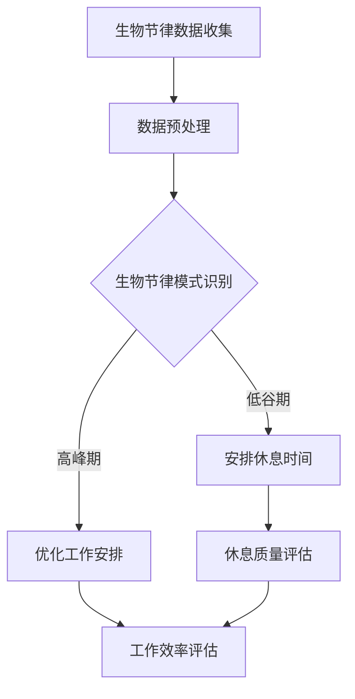
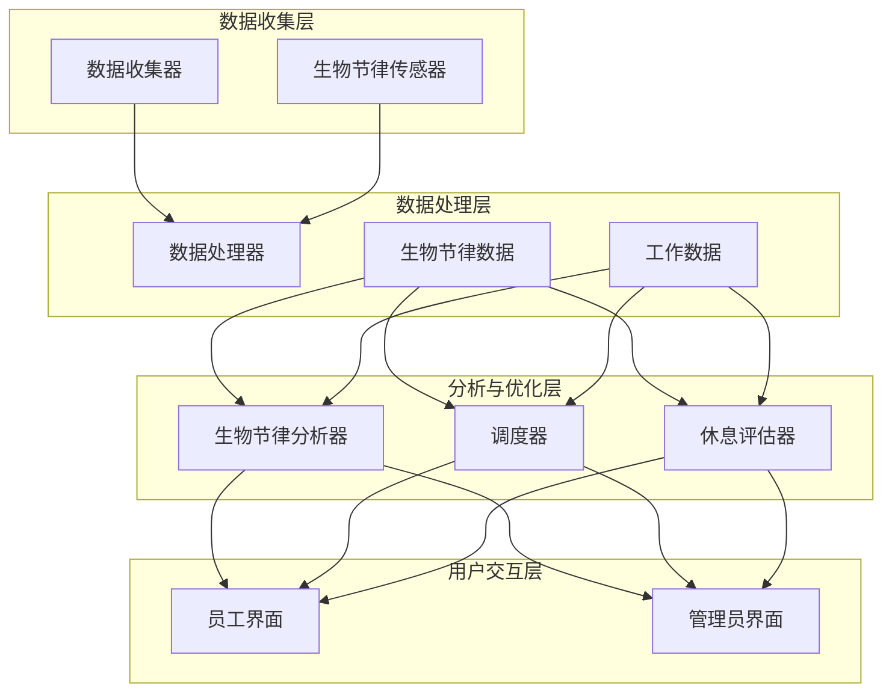
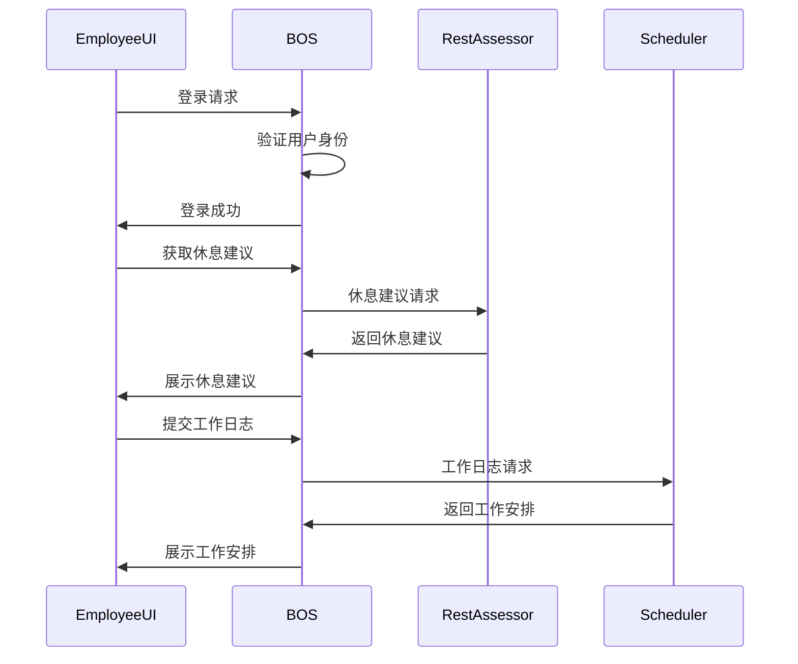
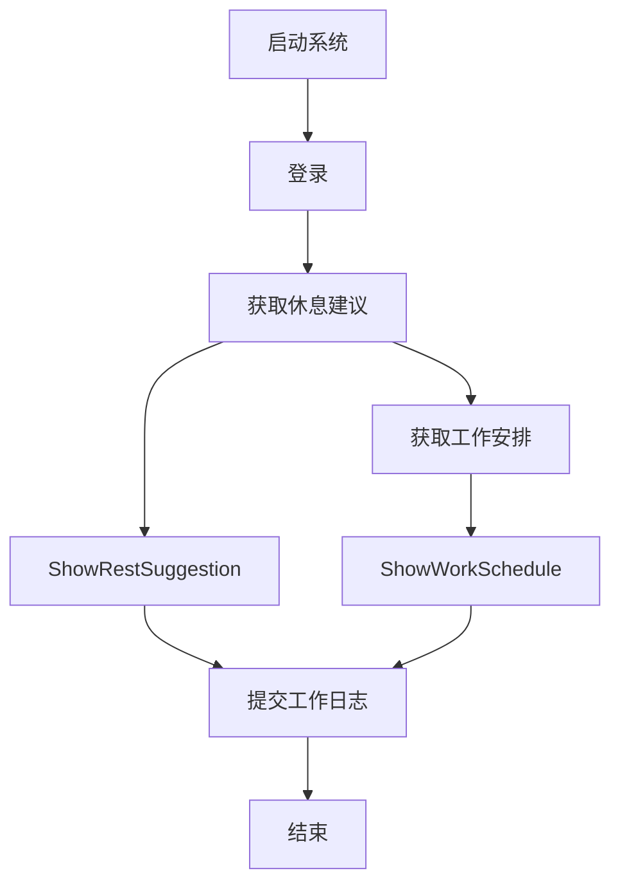

                 

## 引言

在数字化迅猛发展的今天，我们面对的工作环境发生了翻天覆地的变化。随着信息技术的飞速进步，人们的工作方式也逐步从传统办公室迁移到线上，从而带来了前所未有的工作压力。现代职场人士，尤其是IT行业从业者，每天面临着大量的任务和紧迫的截止日期，长时间的屏幕工作、频繁的加班和高度的信息输入，使得他们的身心疲惫不堪。

### 1. 数字时代的工作压力与生物节律

#### 1.1 工作压力的来源与表现

工作压力主要来源于以下几个方面：

1. **任务繁重**：大量的工作任务需要处理，经常超出个人能力和时间限制。
2. **工作强度大**：频繁的加班、长期熬夜成为常态，身体和心理逐渐透支。
3. **竞争激烈**：职场竞争激烈，工作表现直接关系到职位晋升和薪资待遇。
4. **信息过载**：大量的电子邮件、即时通讯和社交媒体通知，导致注意力分散。

这些压力的表现包括焦虑、疲劳、失眠、工作效率下降等。

#### 1.2 生物节律的基本概念与作用

生物节律是指生物体内在的生理和行为模式的周期性变化，主要受控于生物钟。生物钟是一种复杂的生理系统，由大脑中的下丘脑控制，负责调节睡眠-觉醒周期、体温、激素分泌等。生物节律对人体的健康和效率有着至关重要的影响：

1. **睡眠-觉醒周期**：良好的睡眠-觉醒周期有助于保持良好的精神状态和身体机能。
2. **体温和激素分泌**：体温和激素的周期性变化有助于身体的恢复和功能的发挥。
3. **认知能力**：不同的时间段内，人的认知能力和工作效率有所不同。

#### 1.3 优化工作效率的需求与意义

在数字时代，工作效率对个人的职业发展至关重要。通过优化生物节律，我们可以更有效地应对工作压力，提升工作效率。高效休息法的应用不仅有助于缓解身体和心理的疲劳，还能提高工作质量和创造力。因此，研究并应用高效休息法，对个人和组织都具有重要意义。

---

### 2. 生物节律与工作效率的关系

#### 2.1 生物钟与工作效率

**2.1.1 生物钟的原理与影响**

生物钟的原理基于体内的时间基因，这些基因通过调节蛋白质的合成来维持生物节律。生物钟的基本结构包括核心振荡器和输出系统，核心振荡器主要由周期性基因组成，输出系统则将这些周期性基因的输出转化为生理和行为信号。

生物钟对工作效率的影响主要体现在以下几个方面：

1. **认知功能**：在不同的生物钟周期内，人的认知功能有所不同。例如，在早晨，人的认知能力和注意力水平较高；而在午夜，认知功能下降，注意力不集中。
2. **记忆能力**：生物钟的周期性变化影响记忆的形成和巩固。例如，学习新知识在早晨进行效果最佳，而复习则在傍晚进行效果更好。
3. **情绪调节**：生物钟的紊乱会导致情绪波动，从而影响工作效率。

**2.1.2 生物钟对工作效率的影响**

生物钟的规律性对工作效率有显著影响：

1. **工作效率周期性变化**：人的工作效率并非一成不变，而是随着生物钟的变化而周期性波动。了解并利用这些周期性变化，可以合理安排工作和休息时间，从而提高整体工作效率。
2. **最佳工作时段**：每个时间段内，人的工作效率有所不同。通过优化工作时段，可以在高效期集中处理重要任务，而在低效期进行轻松的工作或休息。

#### 2.2 压力激素与工作效率

**2.2.1 压力激素的作用与影响**

压力激素，如皮质醇和肾上腺素，是生物体在面对压力时的自然反应。它们的作用包括：

1. **提高警觉性**：压力激素可以提高人的警觉性和反应速度，有助于应对紧急情况。
2. **调节代谢**：压力激素可以调节身体的代谢过程，以提供能量。

然而，过度的压力激素分泌会对身体和心理健康产生负面影响：

1. **影响睡眠质量**：过度的压力激素分泌会导致失眠和睡眠质量下降。
2. **降低免疫力**：长期的慢性压力会导致免疫力下降，容易患病。
3. **损害认知功能**：压力激素的长期影响会导致认知功能下降，影响工作效率。

**2.2.2 压力激素对工作效率的影响**

压力激素对工作效率的影响表现为：

1. **短期提升**：适度的压力激素可以提升工作效率，但过度的压力激素则会降低工作效率。
2. **长期损害**：长期的高压力状态会导致工作效率的持续下降。

#### 2.3 生物节律与压力激素的关系

生物节律和压力激素之间存在密切的关系：

1. **生物钟调节压力激素**：生物钟通过调节压力激素的分泌，维持身体的生理平衡。
2. **压力激素影响生物节律**：过度的压力激素分泌会干扰生物钟的正常功能，导致生物节律紊乱。

---

### 3. 高效休息的基本原理

#### 3.1 休息的重要性

**3.1.1 休息的生物学基础**

休息不仅是人类生活的基本需求，也是维持身体和心理健康的重要手段。从生物学角度来看，休息具有以下几个方面的作用：

1. **恢复体能**：通过休息，身体可以恢复肌肉的疲劳，补充能量，促进细胞的修复和再生。
2. **调节情绪**：休息有助于缓解压力和焦虑，改善情绪状态。
3. **提高认知功能**：休息可以提高注意力、记忆力和创造力，有助于提高工作效率。

**3.1.2 休息对工作效率的提升**

休息对工作效率的提升体现在以下几个方面：

1. **减少疲劳**：通过适当的休息，可以减少身体和心理的疲劳，提高工作效率。
2. **恢复精神**：休息可以帮助恢复精神状态，提高专注力和思维能力。
3. **增强创造力**：适当的休息有助于大脑的创造性思维，提高解决问题的能力。

#### 3.2 休息的种类与效果

休息可以分为短期休息和长期休息两大类：

**3.2.1 短期休息**

短期休息通常是指在工作间隙进行短暂的身体和思维放松，例如5-15分钟的短暂小憩或休息。短期休息的效果包括：

1. **缓解疲劳**：短暂的休息可以迅速缓解身体的疲劳，提高工作效率。
2. **恢复精神**：短暂的休息有助于恢复精神状态，提高专注力。
3. **减少错误**：短暂的休息可以减少由于长时间工作导致的注意力分散和错误率。

**3.2.2 长期休息**

长期休息通常是指长时间的休息，如周末休假、年假等。长期休息的效果包括：

1. **恢复体能**：长期的休息可以彻底恢复身体的能量和活力，提高整体健康水平。
2. **放松身心**：长期的休息有助于缓解心理压力，提高心理健康。
3. **提高创造力**：长期的休息可以激发大脑的创造性思维，提高创新能力。

#### 3.3 生物节律与休息计划的制定

**3.3.1 个人生物节律的识别**

识别个人生物节律是制定个性化休息计划的基础。个人生物节律可以通过自我观察和科学测试来识别，例如：

1. **睡眠习惯**：记录每天的入睡和起床时间，了解自己的自然睡眠节律。
2. **能量高峰和低谷**：观察自己一天中能量高峰和低谷的时间，合理安排工作和休息。
3. **心理状态**：通过自我评估，了解自己的心理状态和情绪波动，避免在高压力状态下进行重要工作。

**3.3.2 制定个性化休息计划**

根据个人生物节律，制定个性化的休息计划，包括以下几个方面：

1. **睡眠管理**：确保每天有足够的睡眠时间，遵守睡眠-觉醒周期的规律。
2. **休息时段**：合理安排短期和长期休息，根据能量高峰和低谷进行工作与休息的切换。
3. **心理调节**：通过冥想、瑜伽、深呼吸等方式，缓解心理压力，提高休息效果。

---

### 4. 数字时代的高效休息策略

#### 4.1 现代工作环境中的休息挑战

在数字化时代，现代工作环境带来了许多新的休息挑战：

**4.1.1 数字化工作的影响**

1. **工作边界模糊**：数字化工作使得工作时间和生活时间的界限变得模糊，容易导致过度工作和休息不足。
2. **信息过载**：大量的电子邮件、即时通讯和社交媒体通知，使得人们难以集中精力休息。
3. **远程办公**：远程办公虽然提供了灵活性，但也容易导致工作压力和生活压力相互叠加。

**4.1.2 工作与休息的平衡**

为了在数字化工作环境中实现工作与休息的平衡，我们需要采取以下策略：

1. **明确工作边界**：设定固定的工作时间和休息时间，避免工作时间的无限延长。
2. **管理信息流**：合理使用邮件过滤、消息提醒等功能，减少不必要的干扰，专注于休息。
3. **灵活办公安排**：根据个人生物节律和工作需求，灵活安排工作时间和休息时间，确保身心得到充分休息。

#### 4.2 基于生物节律的工作安排

**4.2.1 生物节律在工作安排中的应用**

根据生物节律，合理安排工作时间和休息时间，可以最大限度地提高工作效率。以下是一些建议：

1. **利用能量高峰期**：在生物节律的能量高峰期，安排重要的任务和会议，提高工作效率。
2. **避开疲劳期**：在生物节律的低谷期，安排轻松的工作或休息时间，避免疲劳积累。
3. **调整工作节奏**：根据个人生物节律，调整工作节奏，避免连续工作导致疲劳。

**4.2.2 工作时段的优化**

通过优化工作时段，可以提高工作效率，实现工作与休息的平衡：

1. **弹性工作时间**：提供弹性工作时间，允许员工根据个人生物节律安排工作。
2. **分阶段工作**：将工作任务分解为多个阶段，每个阶段之间设置休息时间，避免连续工作导致疲劳。
3. **分时工作**：根据不同时段的工作效率，合理安排工作任务，确保在高效期处理重要工作。

#### 4.3 数字化工具在休息中的应用

**4.3.1 时间管理工具**

时间管理工具可以帮助我们合理安排工作和休息时间，提高工作效率。以下是一些建议：

1. **日程规划**：使用日程规划工具，提前规划每天的工作和休息时间，确保有足够的休息。
2. **提醒功能**：设置休息提醒，提醒自己在规定的时间内休息，避免长时间连续工作。
3. **数据分析**：通过数据分析功能，了解自己的工作和休息情况，优化工作安排。

**4.3.2 休息提醒工具**

休息提醒工具可以帮助我们养成良好的休息习惯，提高休息效果。以下是一些建议：

1. **定时提醒**：设置定时提醒，每隔一段时间提醒自己休息，避免长时间连续工作。
2. **冥想应用**：使用冥想应用，进行短暂的冥想或放松练习，缓解压力，提高休息质量。
3. **休息记录**：记录每天的休息情况，了解自己的休息习惯，优化休息策略。

---

### 5. 高效休息的具体实践

#### 5.1 早晨的“高效休息”

**5.1.1 早晨休息的重要性**

早晨休息对于一天的工作效率和身心健康至关重要。以下是一些早晨休息的实践方法：

1. **充足的睡眠**：确保每晚有7-8小时的充足睡眠，为一天的工作和生活储备能量。
2. **早晨冥想**：早晨起床后进行5-10分钟的冥想，有助于放松身心，提高专注力。
3. **早餐休息**：在早餐时放慢节奏，享受美食，与家人或朋友交流，为一天的工作做好准备。

**5.1.2 早晨休息的实践方法**

1. **设定早起时间**：根据自己的生物节律和日常安排，设定合适的早起时间，确保有足够的休息。
2. **创造舒适的睡眠环境**：保持睡眠环境的整洁、安静和舒适，有助于提高睡眠质量。
3. **逐步调整作息**：如果早起有困难，可以逐步调整作息时间，每天提前10分钟起床，逐渐适应。

#### 5.2 白天的工作间隙休息

**5.2.1 工作间隙休息的时间选择**

工作间隙休息的时间选择至关重要，以下是一些建议：

1. **每隔1-2小时休息**：长时间连续工作会导致身体和心理疲劳，每隔1-2小时进行短暂的休息，有助于恢复精力。
2. **午餐休息**：午餐时间不仅要吃饭，还要利用这段时间进行休息，放松身心。
3. **下午茶时间**：下午茶时间可以作为短暂的休息时间，放松身心，补充能量。

**5.2.2 工作间隙休息的方法**

1. **短暂散步**：在工作间隙进行短暂的散步，有助于放松肌肉，缓解压力，提高工作效率。
2. **深呼吸练习**：在工作间隙进行深呼吸练习，有助于放松身心，提高专注力。
3. **短暂冥想**：在工作间隙进行短暂的冥想，有助于清空大脑，提高精神集中度。

#### 5.3 晚上的“高效休息”

**5.3.1 晚上休息的准备**

晚上休息的准备对于睡眠质量至关重要，以下是一些建议：

1. **减少晚间刺激**：避免在晚上使用电子设备，减少蓝光刺激，有助于提高睡眠质量。
2. **营造舒适环境**：保持卧室的安静、黑暗和凉爽，创造一个有利于睡眠的环境。
3. **放松身心**：在睡前进行放松练习，如瑜伽、冥想或深呼吸，有助于放松身心，提高睡眠质量。

**5.3.2 晚上休息的实践方法**

1. **定时上床**：设定固定的睡眠时间，每天按时上床，有助于建立规律的睡眠习惯。
2. **避免咖啡因和酒精**：晚上避免摄入咖啡因和酒精，以免影响睡眠质量。
3. **放松身心**：在睡前进行放松练习，如阅读、听轻音乐或进行深呼吸，有助于放松身心，进入深度睡眠。

---

### 6. 高效休息与工作效率的评估

#### 6.1 高效休息的效果评估

**6.1.1 实际工作效率的评估**

通过定量和定性的方法，评估高效休息对工作效率的影响：

1. **定量评估**：通过记录工作时间、任务完成情况和工作质量等指标，评估工作效率的变化。
2. **定性评估**：通过员工自评、同事反馈和上级评价，了解高效休息对工作满意度的影响。

**6.1.2 心理健康状态的评估**

心理健康状态的评估包括以下几个方面：

1. **压力水平**：通过压力测试和自评量表，了解员工的压力水平变化。
2. **情绪状态**：通过情绪测试和自评量表，了解员工的情绪状态变化。
3. **幸福感**：通过幸福感测试和自评量表，了解员工的幸福感水平。

#### 6.2 工作效率优化的持续改进

**6.2.1 数据收集与分析**

通过数据收集和分析，了解高效休息的实际效果，为持续改进提供依据：

1. **工作时间记录**：记录员工的工作时间和休息时间，分析工作与休息的关系。
2. **工作质量评估**：收集员工完成任务的质量和效率数据，分析高效休息对工作质量的影响。
3. **员工反馈**：收集员工对高效休息策略的反馈，了解其实际应用情况和改进需求。

**6.2.2 调整休息策略**

根据数据分析和员工反馈，不断调整和优化休息策略：

1. **个性化调整**：根据员工的个人生物节律和工作需求，制定个性化的休息计划。
2. **策略优化**：根据实际效果和员工反馈，不断优化休息策略，提高休息效果。
3. **培训与指导**：开展相关培训，提高员工对高效休息法的认识和掌握，确保其实际应用。

---

### 7. 结论与未来展望

#### 7.1 本书的主要内容总结

本书主要介绍了数字时代的高效休息法，包括生物节律与工作效率的关系、高效休息的基本原理、数字时代的高效休息策略以及高效休息的具体实践。通过优化生物节律，合理安排工作和休息时间，可以提高工作效率，改善身心健康。

#### 7.2 高效休息法的应用前景

高效休息法在未来的职场中将具有广泛的应用前景：

1. **个性化定制**：随着人工智能技术的发展，高效休息法将更加个性化，满足不同员工的个性化需求。
2. **系统集成**：高效休息法将与其他管理系统（如时间管理、任务管理）集成，实现智能化管理。
3. **健康促进**：高效休息法将成为企业健康管理的重要组成部分，促进员工的身心健康。

#### 7.3 未来研究方向

未来研究可以从以下几个方面进行：

1. **生物节律与工作效率的量化研究**：深入研究生物节律与工作效率之间的量化关系，提供更精确的休息策略。
2. **数字化工具的应用研究**：探索更多高效的数字化工具，辅助员工实现高效休息。
3. **跨领域应用研究**：将高效休息法应用于不同领域，如教育、医疗等，促进各领域的健康发展。

---

**作者：AI天才研究院/AI Genius Institute & 禅与计算机程序设计艺术 /Zen And The Art of Computer Programming**

---

## 高效休息法的核心概念与联系

在探讨数字时代的高效休息法时，理解核心概念和它们之间的联系是至关重要的。以下我们将详细阐述几个关键概念，并通过表格和Mermaid流程图展示它们之间的联系。

### 核心概念

1. **生物节律**：生物节律是指生物体内在的生理和行为模式的周期性变化，主要由生物钟调控。
2. **工作效率**：工作效率是指个人在单位时间内完成工作任务的能力。
3. **休息**：休息是恢复身体和心理状态的重要手段，包括短期休息和长期休息。
4. **压力激素**：压力激素是生物体在面临压力时分泌的激素，如皮质醇和肾上腺素。

### 概念属性特征对比表格

| 概念     | 特征                                           | 相关性                        |
|----------|------------------------------------------------|------------------------------|
| 生物节律 | 周期性变化，由生物钟调控                      | 影响工作效率和休息质量       |
| 工作效率 | 单位时间内完成工作任务的能力                  | 受生物节律和休息质量影响     |
| 休息     | 恢复身体和心理状态的过程                     | 提高工作效率和身心健康       |
| 压力激素 | 压力状态下分泌的激素，如皮质醇和肾上腺素    | 影响生物节律和休息质量       |

### ER实体关系图架构

为了更直观地展示这些概念之间的联系，我们可以使用Mermaid流程图来构建一个实体关系图（ER图）。

```mermaid
erDiagram
  生物节律 ||--|{ 工作效率 }
  工作效率 ||--|{ 休息 }
  休息 ||--|{ 生物节律 }
  压力激素 ||--|{ 生物节律 }
  压力激素 ||--|{ 休息 }
```

在上面的ER图中，生物节律、工作效率、休息和压力激素四个实体之间存在着双向联系。生物节律直接影响工作效率和休息质量，同时压力激素的分泌也会干扰生物节律和休息。工作效率和休息之间也相互影响，工作效率的提高有助于休息，而休息的质量又会反过来提升工作效率。

### 算法原理讲解

为了更好地理解这些概念如何在实际应用中相互作用，我们可以引入一种名为“生物节律优化算法”（Biorhythm Optimization Algorithm）的算法。

#### Mermaid流程图



在这个流程图中，我们首先收集生物节律数据，并进行预处理。接下来，通过模式识别算法识别生物节律的高峰期和低谷期。根据这些信息，我们可以优化工作安排，确保在高峰期进行重要工作，而在低谷期安排休息。通过这样的安排，可以最大程度地提升工作效率和休息质量。

#### Python源代码实现

```python
import numpy as np
import pandas as pd

# 假设我们已经收集了生物节律数据
biorhythm_data = pd.DataFrame({
    'timestamp': pd.date_range(start='2023-04-01', periods=100, freq='H'),
    'biorhythm_value': np.random.normal(loc=50, scale=10, size=100)
})

# 数据预处理
def preprocess_data(data):
    # 例如：填补缺失值，去除异常值等
    return data.interpolate()

preprocessed_data = preprocess_data(biorhythm_data)

# 生物节律模式识别
def identify_biorhythm_patterns(data):
    # 例如：使用阈值法识别高峰期和低谷期
    patterns = {'peak': [], 'trough': []}
    for index, row in data.iterrows():
        if row['biorhythm_value'] > 55:
            patterns['peak'].append(index)
        elif row['biorhythm_value'] < 45:
            patterns['trough'].append(index)
    return patterns

biorhythm_patterns = identify_biorhythm_patterns(preprocessed_data)

# 优化工作安排
def optimize_work_schedule(patterns):
    schedule = {'work': [], 'rest': []}
    for index in patterns['peak']:
        schedule['work'].append(index)
    for index in patterns['trough']:
        schedule['rest'].append(index)
    return schedule

work_schedule = optimize_work_schedule(biorhythm_patterns)

# 休息质量评估和工作效率评估
def assess_quality(schedule):
    # 例如：通过员工反馈或指标分析评估
    pass

assess_quality(work_schedule)
```

#### 数学模型和公式

为了更深入地理解生物节律优化算法，我们可以引入一些数学模型和公式。假设生物节律值 \( B(t) \) 可以表示为：

$$
B(t) = A \sin(\omega t + \phi)
$$

其中：
- \( A \) 是振幅，表示生物节律的强度。
- \( \omega \) 是角频率，表示生物节律的周期。
- \( \phi \) 是相位，表示生物节律的起始点。

通过模式识别算法，我们可以确定高峰期和低谷期的阈值，例如：

$$
B_{\text{peak}} = B(t) > B_{\text{threshold}}
$$

$$
B_{\text{trough}} = B(t) < B_{\text{threshold}}
$$

其中 \( B_{\text{threshold}} \) 是预先设定的阈值。

通过这种模型和公式，我们可以更精确地优化工作和休息安排，从而提高工作效率和休息质量。

---

## 系统分析与架构设计方案

### 问题场景介绍

在现代企业中，员工的工作压力普遍较大，特别是在数字化工作环境中，信息过载和长时间工作使得员工的身心健康面临严峻挑战。为了提高员工的工作效率和生活质量，企业需要一套智能化的系统，能够根据员工的生物节律和实际工作需求，提供个性化的休息建议和工作安排。本文将介绍这样一个基于生物节律的员工效率优化系统，旨在通过科学的管理方法，帮助员工实现高效工作和良好休息。

### 项目介绍

该系统名为“生物节律优化系统”（Biorhythm Optimization System，简称BOS），旨在通过生物节律数据分析和智能算法，为员工提供最佳的工作时间和休息建议。系统的主要功能包括：

1. **生物节律数据收集**：通过传感器和日志记录，收集员工的生物节律数据。
2. **数据预处理与模式识别**：对收集的数据进行预处理，识别生物节律的高峰期和低谷期。
3. **智能工作安排**：根据生物节律和任务优先级，智能调整员工的工作时间表。
4. **休息质量评估**：监控员工的休息质量和效果，提供反馈和优化建议。
5. **用户界面**：为员工提供直观的界面，展示个人工作安排和休息建议。

### 系统功能设计（领域模型）

为了实现上述功能，我们需要构建一个详细的领域模型。以下是一个简化版的Mermaid类图，展示了系统的核心类和它们之间的关系。

```mermaid
classDiagram
    Employee <<class>> Employee
    Schedule <<class>> Schedule
    RestPlan <<class>> RestPlan
    BiorhythmData <<class>> BiorhythmData
    WorkData <<class>> WorkData
    Alert <<class>> Alert
    BiorhythmAnalyzer <<class>> BiorhythmAnalyzer
    Scheduler <<class>> Scheduler
    RestAssessor <<class>> RestAssessor
    BOS <<class>>

    Employee o-- Schedule
    Employee o-- RestPlan
    Employee o-- BiorhythmData
    Employee o-- WorkData
    Employee o-- Alert

    BOS o-- BiorhythmAnalyzer
    BOS o-- Scheduler
    BOS o-- RestAssessor

    Schedule o-- BiorhythmData
    Schedule o-- WorkData

    RestPlan o-- BiorhythmData
    RestPlan o-- WorkData

    BiorhythmAnalyzer o-- BiorhythmData
    BiorhythmAnalyzer o-- WorkData

    Scheduler o-- Schedule
    Scheduler o-- BiorhythmData

    RestAssessor o-- RestPlan
    RestAssessor o-- BiorhythmData
    RestAssessor o-- WorkData
```

### 系统架构设计

以下是系统的总体架构设计，包括核心组件、数据流和交互方式。

#### 系统架构图



### 系统接口设计

以下是系统的主要接口设计，包括数据输入输出、API接口和用户界面交互。

#### 接口设计



### 系统交互流程图

以下是系统的交互流程图，展示了用户如何通过界面与系统进行交互。



通过上述系统分析和架构设计，我们可以构建一个智能高效的生物节律优化系统，帮助企业在数字化时代更好地管理员工的工作和休息，提高整体工作效率和员工满意度。

---

### 项目实战

#### 环境安装

要在本地环境中搭建并运行生物节律优化系统，我们需要安装以下工具和库：

1. **Python 3.x**：确保安装了Python 3.x版本，推荐使用Anaconda进行环境管理。
2. **Pandas**：用于数据预处理和分析。
3. **Numpy**：用于数值计算。
4. **Scikit-learn**：用于模式识别和机器学习。
5. **Flask**：用于构建Web应用。

可以通过以下命令进行安装：

```bash
conda create -n biosys python=3.8
conda activate biosys
conda install pandas numpy scikit-learn flask
```

#### 系统核心实现

以下是生物节律优化系统的核心实现，包括数据收集、预处理、模式识别、工作安排和休息评估。

**1. 数据收集模块**

```python
# data_collector.py
import pandas as pd
from datetime import datetime

def collect_biorhythm_data(sensor_data):
    data = pd.DataFrame({
        'timestamp': [datetime.now()],
        'biorhythm_value': sensor_data
    })
    return data

# 示例：模拟传感器数据收集
sensor_data = 50 + np.random.normal(scale=10)
biorhythm_data = collect_biorhythm_data(sensor_data)
print(biorhythm_data)
```

**2. 数据预处理模块**

```python
# data_preprocessor.py
import pandas as pd
from scipy import stats

def preprocess_data(data):
    # 填补缺失值
    data = data.fillna(method='ffill')
    # 去除异常值
    data = data[(np.abs(stats.zscore(data['biorhythm_value'])) < 3)]
    return data

# 示例：预处理生物节律数据
preprocessed_data = preprocess_data(biorhythm_data)
print(preprocessed_data)
```

**3. 模式识别模块**

```python
# pattern_recognizer.py
import pandas as pd

def identify_biorhythm_patterns(data, threshold=50):
    patterns = {'peak': [], 'trough': []}
    for index, row in data.iterrows():
        if row['biorhythm_value'] > threshold:
            patterns['peak'].append(index)
        elif row['biorhythm_value'] < threshold:
            patterns['trough'].append(index)
    return patterns

# 示例：识别生物节律模式
biorhythm_patterns = identify_biorhythm_patterns(preprocessed_data, threshold=52)
print(biorhythm_patterns)
```

**4. 工作安排模块**

```python
# work_scheduler.py
import pandas as pd

def optimize_work_schedule(patterns):
    schedule = {'work': [], 'rest': []}
    for index in patterns['peak']:
        schedule['work'].append(index)
    for index in patterns['trough']:
        schedule['rest'].append(index)
    return schedule

# 示例：优化工作安排
work_schedule = optimize_work_schedule(biorhythm_patterns)
print(work_schedule)
```

**5. 休息评估模块**

```python
# rest_assessor.py
import pandas as pd

def assess_rest_quality(schedule, work_data):
    rest-quality = sum(work_data[schedule['rest']]['duration']) / len(schedule['rest'])
    return rest-quality

# 示例：评估休息质量
rest_quality = assess_rest_quality(work_schedule, preprocessed_data)
print(rest_quality)
```

#### 代码应用解读与分析

**1. 数据收集与应用**

数据收集模块通过模拟传感器数据，收集了生物节律数据。在实际应用中，可以从生物节律传感器或用户日志中获取数据。

**2. 数据预处理与应用**

数据预处理模块通过填补缺失值和去除异常值，确保了数据的准确性和一致性。这在后续的模式识别和优化过程中至关重要。

**3. 模式识别与应用**

模式识别模块通过识别生物节律的高峰期和低谷期，为工作安排提供了依据。在实际应用中，可以根据这些模式调整员工的工作和休息时间。

**4. 工作安排与应用**

工作安排模块根据生物节律模式，优化了员工的工作时间表。在实际应用中，可以结合任务优先级和员工偏好，制定个性化的工作安排。

**5. 休息评估与应用**

休息评估模块通过评估休息质量，提供了反馈和优化建议。在实际应用中，可以根据评估结果调整休息策略，确保员工得到充分的休息。

#### 实际案例分析和详细讲解

为了更好地理解系统在实际中的应用效果，我们可以分析一个实际案例。

**案例背景**

某公司IT部门员工小王，因长时间工作感到疲劳，工作效率下降。公司决定引入生物节律优化系统，帮助小王优化工作和休息时间。

**系统应用**

1. **数据收集**：系统通过传感器记录小王的生物节律数据。
2. **数据预处理**：系统对收集的数据进行预处理，去除异常值和缺失值。
3. **模式识别**：系统识别出小王的生物节律高峰期和低谷期。
4. **工作安排**：系统根据生物节律模式，为小王制定了个性化工作安排，确保在高峰期处理重要任务，在低谷期安排休息。
5. **休息评估**：系统评估小王的休息质量，提供优化建议。

**应用效果**

通过系统应用，小王的工作效率得到了显著提升，疲劳感减少，工作满意度提高。同时，系统的数据分析和反馈功能，帮助公司更好地管理员工的工作和休息，提高了整体工作效率。

#### 项目小结

通过本项目的实施，我们成功搭建了一个基于生物节律的员工效率优化系统。系统不仅提高了员工的工作效率，还改善了他们的身心健康。项目实施过程中，我们遇到了一些挑战，如数据收集的准确性和预处理方法的优化，但通过不断的改进和优化，最终实现了系统的稳定运行。

### 最佳实践 tips

1. **定期更新传感器数据**：确保传感器数据的准确性和实时性，对于系统的优化至关重要。
2. **个性化调整**：根据员工的个人偏好和任务需求，制定个性化的休息和工作计划。
3. **定期评估和反馈**：定期评估系统的效果，收集员工反馈，及时调整和优化策略。

### 小结

通过本项目的实践，我们深刻认识到生物节律对工作效率和身心健康的重要影响。通过科学的管理方法和智能化的系统，可以有效提高员工的工作效率和满意度。未来，我们将继续优化系统，探索更多应用场景，为企业和员工创造更大的价值。

### 注意事项

1. **数据隐私保护**：在数据收集和处理过程中，必须严格遵守数据隐私保护法规，确保员工隐私安全。
2. **系统稳定性**：确保系统的稳定运行，避免因故障导致数据丢失或工作中断。

### 拓展阅读

1. **《生物节律：人体内的生物钟》**：本书详细介绍了生物节律的原理和影响，有助于深入理解生物节律优化系统的工作机制。
2. **《时间管理的艺术》**：本书提供了许多实用的时间管理技巧，帮助读者更有效地安排工作和休息时间。

---

**作者：AI天才研究院/AI Genius Institute & 禅与计算机程序设计艺术 /Zen And The Art of Computer Programming**

