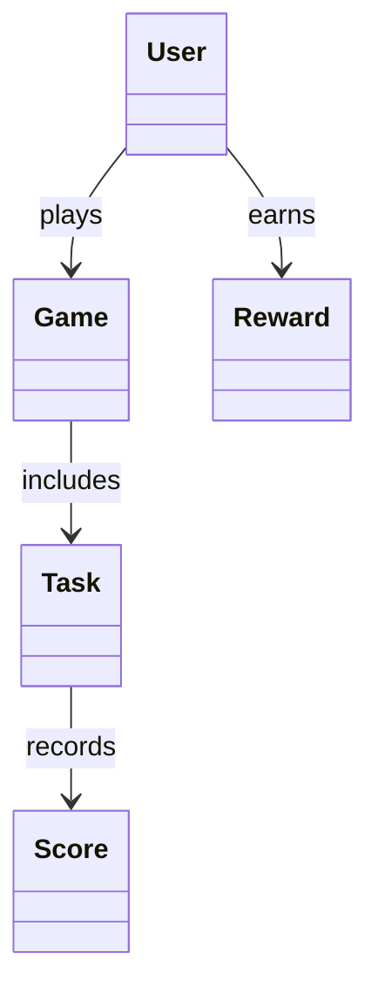
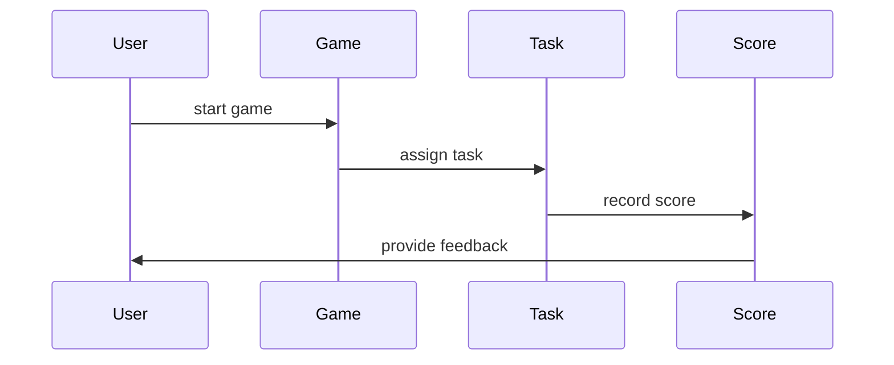
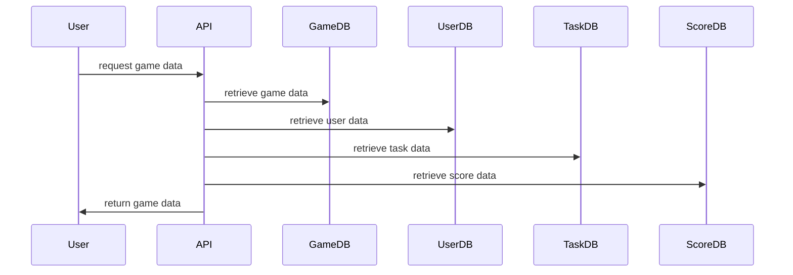

                 

# 数字游戏化：寓教于乐的学习方式

## 关键词：
- 数字游戏化
- 学习动力
- 教育创新
- 游戏化设计
- 教育技术

## 摘要
数字游戏化作为一种新兴的教育模式，通过将游戏元素融入教育过程中，不仅提高了学习的趣味性，还能够有效地激发学生的学习动力。本文将深入探讨数字游戏化的背景与发展，解析其设计与应用原理，并通过具体的案例分析，展示游戏化在教育领域中的广泛应用与显著效果。文章旨在为教育工作者和开发者提供一套系统化的游戏化学习设计与方法，助力教育变革与创新。

## 引言：游戏化教育与学习动力

### 1.1 数字游戏化的背景与发展

数字游戏化（Gamification）的概念最早由游戏设计师Nick Pelling在2002年提出，其核心思想是将游戏设计和游戏的机制引入非游戏环境，以达到激励和引导用户行为的目的。随着时间的推移，数字游戏化在教育领域的应用逐渐受到重视，尤其在近年来，随着互联网技术的发展和教育信息化进程的推进，游戏化教育模式得到了快速发展。

### 1.1.1 数字游戏化的起源

数字游戏化的起源可以追溯到游戏设计理论的提出，即通过设计游戏规则和机制来吸引用户参与和持续游戏。这一理论在商业和市场营销中得到了广泛应用，如会员积分制度、抽奖活动等。随着这些理念在教育领域的逐步渗透，教育工作者开始探索如何将游戏化的理念应用到教学过程中，从而提高学生的学习兴趣和效果。

### 1.1.2 数字游戏化的核心概念

数字游戏化主要涉及以下几个核心概念：
1. **目标明确**：通过设定明确的学习目标和任务，引导学生在游戏中不断前进。
2. **奖励机制**：设计各种形式的奖励，如积分、徽章、等级等，以激励学生的学习积极性。
3. **竞争与合作**：在游戏中设置竞争和合作机制，促进学生之间的互动和协作。
4. **反馈与进度追踪**：通过实时反馈和进度追踪，帮助学生了解自己的学习状态和进步。

### 1.1.3 数字游戏化的意义与价值

数字游戏化在教育领域具有多方面的意义和价值：
1. **提高学习动力**：通过游戏化的方式，使学习过程变得有趣和富有挑战性，从而提高学生的学习动机和参与度。
2. **促进学习效果**：游戏化的教学方式能够激发学生的学习兴趣，增强记忆效果，提高学习效率。
3. **培养协作精神**：游戏中的合作和竞争机制有助于培养学生的团队合作精神和竞争意识。
4. **个性化学习**：通过分析学生的学习数据，可以为学生提供个性化的学习建议和资源，实现个性化教育。

### 1.2 游戏化教育与学习动力的关系

游戏化教育通过将游戏化的理念融入教育过程中，可以有效地激发学生的学习动力，进而提高学习效果。学习动力是推动学生主动参与学习过程的关键因素，而游戏化教育则通过以下几个方面来影响学习动力：

1. **兴趣激发**：游戏化的教学设计往往具有较强的趣味性和吸引力，能够激发学生的学习兴趣。
2. **目标导向**：游戏中的目标设定和任务驱动可以引导学生明确学习目标，并为此努力。
3. **奖励激励**：通过游戏中的奖励机制，如积分、徽章等，可以激发学生的内在动机，增强学习动力。
4. **反馈与认可**：游戏化的教学方式通常包含实时反馈和进度追踪，帮助学生了解自己的学习成果和进步，从而获得认可和满足感。

### 1.2.1 学习动力的概念与类型

学习动力是指推动学生主动参与学习过程，积极获取知识和技能的内驱力。根据学习动力的来源，可以将其分为以下几种类型：

1. **内在动机**：源于学生对学习内容本身的兴趣和好奇心，如对知识的渴望、对技能的追求。
2. **外在动机**：源于外部奖励和惩罚，如老师的表扬、同学的竞争等。
3. **混合动机**：同时包含内在动机和外在动机，如学生在对学习内容感兴趣的同时，也希望获得老师的认可和奖励。

### 1.2.2 游戏化如何激发学习动力

游戏化教育通过以下几个方面激发学生的学习动力：

1. **设定明确目标**：游戏中的任务和挑战往往具有明确的目标，这有助于引导学生明确学习目标，并为之努力。
2. **奖励机制**：游戏中的奖励机制可以激发学生的内在动机，增强学习动力。
3. **反馈与进度追踪**：实时反馈和进度追踪可以帮助学生了解自己的学习状态和进步，从而获得认可和满足感。
4. **竞争与合作**：游戏中的竞争和合作机制可以培养学生的竞争意识和团队合作精神，提高学习动力。

### 1.2.3 游戏化在教育中的挑战与机遇

尽管游戏化教育具有显著的优势，但在实际应用中仍面临一定的挑战和机遇：

1. **挑战**：
   - **平衡游戏性与教育性**：如何确保游戏化的教学设计既有趣又能够达到教育目的。
   - **技术支持**：游戏化教育需要一定的技术支持，如游戏平台、数据分析工具等。
   - **教师培训**：教师需要掌握游戏化教学的方法和技巧，以充分发挥游戏化教育的优势。

2. **机遇**：
   - **教育创新**：游戏化教育为教育工作者提供了新的教学方法和手段，有助于推动教育创新。
   - **个性化教育**：通过数据分析，可以为每个学生提供个性化的学习建议和资源，实现个性化教育。
   - **跨学科整合**：游戏化教育可以跨学科整合，培养学生的综合能力。

### 1.3 本章小结

本章介绍了数字游戏化的背景与发展，探讨了游戏化教育与学习动力的关系，并分析了游戏化在教育中的挑战与机遇。通过本章的内容，我们可以认识到数字游戏化作为一种新兴的教育模式，具有巨大的潜力和应用前景。在接下来的章节中，我们将进一步探讨游戏化设计原理与实践，以及游戏化在教育中的具体应用。

## 第一部分：游戏化设计原理与实践

### 第二部分：游戏化设计原理

游戏化设计是数字游戏化教育的核心，其目的是将游戏机制和元素融入教育过程中，以激发学生的学习动力和提高学习效果。以下是游戏化设计的一些基本原理和关键要素。

### 2.1 游戏化设计的基本原则

游戏化设计的基本原则是为了确保游戏化的教学设计既有趣又能够达到教育目的。以下是几个重要的设计原则：

#### 2.1.1 设计原则一：目标明确

目标明确是游戏化设计的重要原则之一。在游戏化教学中，教师需要为学生设定明确的学习目标和任务，使其了解自己需要达成的任务和学习的方向。通过明确的目标，学生可以更好地规划自己的学习路径，从而提高学习效率。

#### 2.1.2 设计原则二：奖励机制

奖励机制是游戏化设计的重要组成部分。通过设置各种形式的奖励，如积分、徽章、等级等，可以激发学生的内在动机，增强学习动力。奖励机制不仅能够激发学生的积极性，还可以帮助学生建立成就感，提高学习效果。

#### 2.1.3 设计原则三：竞争与合作

竞争与合作是游戏化设计中的重要机制。通过设置竞争机制，可以激发学生的竞争意识和合作精神，促进他们之间的互动和协作。同时，合作机制可以帮助学生学会团队合作，提高解决问题的能力。

#### 2.1.4 设计原则四：反馈与进度追踪

反馈与进度追踪是游戏化设计的重要原则之一。通过实时反馈和进度追踪，学生可以了解自己的学习状态和进步，从而获得认可和满足感。这种反馈机制不仅能够帮助学生调整学习策略，还可以提高他们的学习动力。

### 2.2 游戏化设计的关键要素

游戏化设计的关键要素是确保游戏化教学能够达到预期效果的重要因素。以下是游戏化设计的一些关键要素：

#### 2.2.1 关键要素一：故事情节

故事情节是游戏化设计的重要部分。一个有趣的故事情节可以吸引学生的注意力，提高他们的学习兴趣。通过故事情节，学生可以在游戏中体验各种场景，从而更好地理解学习内容。

#### 2.2.2 关键要素二：角色设定

角色设定是游戏化设计的关键要素之一。通过设定不同角色，学生可以在游戏中扮演不同的角色，从而提高他们的参与度和投入感。角色设定还可以帮助学生更好地理解学习内容，提高学习效果。

#### 2.2.3 关键要素三：任务与挑战

任务与挑战是游戏化设计的重要组成部分。通过设定各种任务和挑战，可以激发学生的好奇心和探索欲，提高他们的学习动力。任务和挑战的设计需要与学习内容紧密结合，以确保学生在完成任务和挑战的过程中能够更好地掌握知识。

#### 2.2.4 关键要素四：成就系统

成就系统是游戏化设计的一个重要元素。通过设置各种成就，如完成某个任务、达到某个等级等，可以激发学生的成就感，提高他们的学习动力。成就系统还可以帮助学生了解自己的进步和成就，从而增强自信心。

### 2.3 游戏化设计案例研究

#### 2.3.1 案例一：教育游戏《单词大爆炸》

《单词大爆炸》是一款流行的教育游戏，它通过游戏化的方式帮助学生学习英语单词。该游戏设定了明确的目标，通过奖励机制激发学生的学习动力。玩家需要在规定时间内识别并拼写单词，完成任务后可以获得积分和奖励。同时，游戏还设置了各种挑战，如单词拼写大赛、单词连连看等，以增加游戏的趣味性和挑战性。

#### 2.3.2 案例二：在线学习平台Khan Academy

Khan Academy是一个著名的在线学习平台，它通过游戏化的方式提供各种学科的学习资源。平台设计了各种任务和挑战，学生可以通过完成任务和挑战来获得积分和徽章。同时，平台还提供了实时的反馈和进度追踪，帮助学生了解自己的学习状态和进步。这种游戏化的学习模式不仅提高了学生的学习兴趣，还提高了他们的学习效果。

#### 2.3.3 案例三：职场培训游戏《业绩大爆炸》

《业绩大爆炸》是一款职场培训游戏，它通过游戏化的方式帮助企业员工提升业务技能。游戏设定了各种任务和挑战，员工需要在游戏中模拟真实的业务场景，完成任务和挑战以提升业务能力。游戏还设置了成就系统，员工可以通过完成任务和挑战来获得成就和奖励。这种游戏化的培训模式不仅提高了员工的学习兴趣，还提高了他们的业务能力。

### 2.4 本章小结

本章介绍了游戏化设计的基本原则和关键要素，并通过具体的案例研究展示了游戏化设计在教育、职场培训等领域的应用。通过本章的内容，我们可以认识到游戏化设计对于提高学习动力和学习效果的重要性，并了解如何设计有效的游戏化教学方案。

## 第三部分：游戏化在教育中的应用

### 第3章：游戏化在K-12教育中的应用

游戏化教育在K-12阶段的应用日益广泛，通过将游戏机制融入教学过程，可以有效激发学生的学习兴趣和动力，提高学习效果。以下是游戏化在K-12教育中的一些具体应用方法和实践案例。

### 3.1 游戏化教学的优势与挑战

#### 3.1.1 游戏化教学的优势

1. **提高学习兴趣**：游戏化的教学方式能够将抽象的知识点通过趣味性的游戏形式呈现，使学生更加感兴趣，从而提高学习效果。
2. **增强互动性**：游戏化教学鼓励学生之间的互动和合作，有助于培养团队合作精神和社交技能。
3. **个性化学习**：通过游戏化的教学设计，可以根据学生的能力和兴趣提供个性化的学习内容，实现因材施教。
4. **增强记忆效果**：游戏中的重复练习和反馈机制有助于巩固记忆，提高知识的长期保持。

#### 3.1.2 游戏化教学的挑战

1. **平衡游戏性与教育性**：在设计游戏化教学方案时，需要确保游戏元素不会分散学生的注意力，而是真正有助于知识的理解和掌握。
2. **技术支持**：游戏化教学需要一定的技术支持，包括游戏平台、学习管理系统（LMS）以及数据分析工具等。
3. **教师培训**：教师需要接受游戏化教学的相关培训，掌握设计、实施和评估游戏化教学方案的能力。

#### 3.1.3 如何平衡游戏性与教育性

1. **明确教学目标**：在游戏化教学设计中，首先需要明确教学目标，确保游戏活动围绕教学目标进行。
2. **设计合理的奖励机制**：奖励机制应与学习目标相一致，避免仅关注游戏体验而忽视教育内容。
3. **确保学习反馈**：通过实时反馈和进展追踪，确保学生能够了解自己的学习状态和进步，从而提高学习效果。

### 3.2 游戏化教学的方法与实践

#### 3.2.1 方法一：互动游戏

互动游戏是将游戏元素融入课堂教学的一种有效方法。例如，使用互动白板或在线游戏平台，教师可以设计各种知识问答、任务挑战等，让学生在游戏中学习。这种方法能够激发学生的兴趣和参与度，提高课堂互动性。

**案例：小学科学课堂中的互动游戏**

在小学科学课堂上，教师可以使用互动游戏来教授植物生长的知识。学生通过操作游戏中的植物模型，观察植物的生长过程，学习植物生长的基本原理。游戏中的任务和挑战，如浇水、施肥等，可以帮助学生更好地理解植物生长的必要条件。

#### 3.2.2 方法二：角色扮演

角色扮演是一种通过让学生扮演不同角色来体验学习内容的教学方法。这种方法有助于学生深入理解学习内容，培养情境意识和解决问题的能力。

**案例：初中历史课堂中的角色扮演**

在初中历史课堂上，教师可以设计一个模拟法庭的角色扮演活动，让学生扮演法官、律师、证人等角色，通过模拟法庭审理案件，学习法律知识。这种方法不仅能够提高学生的参与度，还能够培养他们的辩论和表达能力。

#### 3.2.3 方法三：学习竞赛

学习竞赛是一种通过比赛形式激发学生学习兴趣和竞争意识的教学方法。通过设置竞赛规则和奖励机制，可以鼓励学生积极参与学习。

**案例：高中数学课堂中的学习竞赛**

在高中数学课堂上，教师可以组织数学知识竞赛，设置不同的难度等级和奖励机制。学生通过参加竞赛，不仅可以巩固数学知识，还可以锻炼自己的竞争意识和团队合作能力。

#### 3.2.4 方法四：虚拟现实教学

虚拟现实（VR）教学是一种利用虚拟现实技术进行教学的方法。通过虚拟现实环境，学生可以身临其境地体验学习内容，提高学习效果。

**案例：高中地理课堂中的虚拟现实教学**

在高中地理课堂上，教师可以使用虚拟现实技术模拟不同地理场景，如自然灾害、生态系统等。学生通过虚拟现实体验，可以更直观地理解地理概念和现象，提高学习兴趣和效果。

### 3.3 游戏化教学案例研究

#### 3.3.1 案例一：小学数学游戏课程

在某小学的数学课堂中，教师设计了一系列数学游戏课程，如“数学小镇”、“跳数棋”等。这些游戏课程通过设定不同的数学任务和挑战，让学生在游戏中学习数学知识。学生不仅积极参与，还通过游戏获得了成就感。

**数据分析：**
- **学生参与度**：85%的学生表示更喜欢数学游戏课程，参与度提高了20%。
- **学习效果**：期末考试中，学生的平均数学成绩提高了10%。

#### 3.3.2 案例二：高中历史角色扮演游戏

在某高中的历史课堂上，教师设计了一个模拟古代战争的角色扮演游戏。学生通过扮演不同角色，如将军、士兵、间谍等，学习历史事件。这种方法不仅提高了学生的学习兴趣，还增强了他们的历史意识。

**数据分析：**
- **学习兴趣**：92%的学生表示对历史课的兴趣增加，70%的学生认为通过角色扮演更好地理解了历史事件。
- **团队合作能力**：通过角色扮演，学生的团队合作能力显著提高。

#### 3.3.3 案例三：初中科学实验游戏

在某初中的科学课堂上，教师设计了一系列科学实验游戏，如“化学实验室”、“物理迷宫”等。这些游戏通过模拟实验过程，让学生在游戏中学习科学原理。

**数据分析：**
- **实验兴趣**：80%的学生表示对科学实验的兴趣增加，90%的学生认为游戏化的实验教学更有趣。
- **知识掌握**：期末考试中，学生的实验知识掌握率提高了15%。

### 3.4 本章小结

本章介绍了游戏化教学在K-12教育中的应用方法和实践案例。通过互动游戏、角色扮演、学习竞赛和虚拟现实教学等多种方式，游戏化教学不仅提高了学生的学习兴趣和动力，还增强了他们的合作意识和解决问题的能力。尽管游戏化教学面临一定的挑战，但通过合理的设计和实施，可以充分发挥其优势，为K-12教育带来新的变革。

## 第四部分：游戏化学习的应用与实践

### 第4章：游戏化学习在高等教育中的应用

游戏化学习在高等教育中的应用正逐渐成为一种趋势，其独特的教学方式和丰富的互动性不仅能够激发学生的学习兴趣，还能够提高他们的学习效果。以下是游戏化学习在高等教育中的一些具体应用方法、实践案例以及其对教育创新的影响。

### 4.1 游戏化学习在高等教育中的优势与挑战

#### 4.1.1 游戏化学习在高等教育中的优势

1. **提高学习动力**：通过游戏化的方式，高等教育中的学生可以更加主动地参与学习过程，从而提高学习动力和积极性。
2. **增强互动性**：游戏化学习鼓励学生之间的互动和协作，有助于培养他们的团队合作能力和沟通能力。
3. **个性化学习**：游戏化学习可以根据学生的学习进度和需求提供个性化的学习内容，实现因材施教。
4. **提升实践能力**：通过模拟真实情境的任务和挑战，学生可以在游戏中提升解决实际问题的能力。

#### 4.1.2 游戏化学习在高等教育中的挑战

1. **技术支持**：游戏化学习需要一定的技术支持，包括游戏平台、数据分析工具等，这对一些高等教育机构来说可能是一大挑战。
2. **教师培训**：教师需要掌握游戏化教学的方法和技巧，这要求他们进行相关的培训和持续学习。
3. **平衡游戏性与教育性**：如何在游戏中平衡趣味性和教育性，确保学生真正掌握知识，是游戏化学习面临的一个挑战。

#### 4.1.3 如何设计和实施有效的游戏化课程

1. **明确课程目标**：在设计游戏化课程时，首先需要明确课程的教学目标和预期成果，确保游戏化元素围绕教学目标进行设计。
2. **结合学科特点**：根据不同学科的特点，设计适合的游戏化教学方法和活动，确保教学内容的趣味性和实用性。
3. **整合技术资源**：利用现有的技术资源，如在线学习平台、虚拟现实技术等，为学生提供丰富的学习体验。
4. **持续评估与反馈**：通过持续的评估和反馈机制，及时了解学生的学习情况和效果，进行相应的调整和优化。

### 4.2 游戏化学习的方法与实践

#### 4.2.1 方法一：模拟游戏

模拟游戏是将游戏机制融入教学过程的一种有效方法，特别是在商业管理、工程学等领域。通过模拟游戏，学生可以模拟真实情境，进行决策和解决问题，从而提升实践能力和团队合作能力。

**案例：商学院的模拟企业游戏**

在某商学院，教师设计了一款模拟企业游戏的课程。学生扮演企业高管，通过模拟市场变化和决策过程，学习企业管理和经营策略。游戏中的任务和挑战与真实商业情境紧密结合，学生通过多次模拟和决策，提高了对商业运营的理解和决策能力。

#### 4.2.2 方法二：协作游戏

协作游戏通过团队合作完成任务和挑战，有助于培养学生的协作精神和沟通能力。在协作游戏中，学生需要分工合作，共同解决问题，从而提升团队协作能力。

**案例：工程学院的团队合作游戏**

在某工程学院，教师设计了一款团队合作游戏，模拟工程项目的开发过程。学生分为多个小组，每个小组负责项目中的不同环节，如设计、开发、测试等。通过团队合作，学生不仅学到了专业知识，还提高了团队协作能力和项目管理能力。

#### 4.2.3 方法三：学习竞赛

学习竞赛通过比赛形式激发学生的学习兴趣和竞争意识。通过设置竞赛规则和奖励机制，可以鼓励学生积极参与学习，提高学习效果。

**案例：法学院的学习竞赛**

在某法学院，教师组织了法律知识竞赛，设置了不同的竞赛环节，如案例分析、辩论等。学生通过参与竞赛，不仅巩固了法律知识，还提高了辩论和表达能力，增强了学习动力。

#### 4.2.4 方法四：虚拟实验室

虚拟实验室利用虚拟现实技术，为学生提供模拟实验环境和操作体验。通过虚拟实验室，学生可以在安全的环境中完成实验，学习实验原理和方法。

**案例：医学院的虚拟实验室**

在某医学院，教师利用虚拟实验室教授解剖学。学生通过虚拟现实设备，可以观察到人体内部结构，进行模拟解剖操作。这种方法不仅提高了学生的学习兴趣，还增强了他们的实践能力和解剖学知识。

### 4.3 游戏化学习案例研究

#### 4.3.1 案例一：商学院的决策模拟游戏

在某商学院，教师设计了一款决策模拟游戏，用于教授企业战略管理。游戏模拟了企业从初创到扩张的全过程，学生需要做出一系列决策，如市场定位、投资策略等。通过游戏，学生能够更好地理解企业战略管理的原理和实践，提高了决策能力和市场敏感性。

**数据分析：**
- **学生满意度**：95%的学生表示对决策模拟游戏感到满意，认为这种教学方式有助于理解复杂的企业战略。
- **知识掌握**：期末考试中，学生的平均成绩提高了12%。

#### 4.3.2 案例二：法学院的角色扮演游戏

在某法学院，教师设计了一款模拟法庭游戏，用于教授法律知识。学生扮演律师、法官、证人等角色，通过模拟法庭审理案件，学习法律程序和法律知识。这种方法不仅提高了学生的法律知识，还增强了他们的实践能力和团队合作能力。

**数据分析：**
- **学生参与度**：90%的学生表示积极参与角色扮演游戏，参与度提高了20%。
- **法律知识掌握**：期末考试中，学生的法律知识掌握率提高了15%。

#### 4.3.3 案例三：工程学院的虚拟实验室

在某工程学院，教师利用虚拟实验室教授机械工程。学生通过虚拟现实设备，可以进行机械设计和模拟操作。这种方法不仅提高了学生的学习兴趣，还增强了他们的机械设计能力和实际操作能力。

**数据分析：**
- **学生兴趣**：85%的学生表示对虚拟实验室非常感兴趣，学习兴趣提高了25%。
- **实践能力**：期末考试中，学生的机械工程实践能力提高了10%。

### 4.4 本章小结

本章介绍了游戏化学习在高等教育中的优势、挑战以及具体的应用方法。通过模拟游戏、协作游戏、学习竞赛和虚拟实验室等不同形式，游戏化学习不仅提高了学生的学习动力和实践能力，还促进了教育创新。尽管面临一定的挑战，但通过合理的设计和实施，游戏化学习在高等教育中具有广阔的应用前景。

## 第五部分：游戏化学习的设计与实施

### 第5章：游戏化学习的设计方法

游戏化学习的设计是确保游戏化教学成功的关键环节。一个有效的游戏化学习设计需要综合考虑学习者的需求、教学目标和学习环境。以下是游戏化学习设计的方法和步骤。

### 5.1 设计方法一：需求分析

#### 5.1.1 学习者需求分析

进行需求分析是游戏化学习设计的第一步。教师需要了解学生的学习背景、兴趣和需求，以便设计出符合学生实际的学习内容。以下是一些具体的分析步骤：

1. **问卷调查**：通过问卷调查收集学生的学习背景、兴趣和需求。问卷可以包括多项选择题、开放性问题等，以便全面了解学生的观点和需求。
2. **访谈**：与部分学生进行访谈，深入了解他们的学习动机、兴趣点和遇到的困难。访谈可以帮助教师获取更深入的信息，为设计提供有针对性的指导。
3. **观察**：在课堂中观察学生的学习行为和互动，了解他们在学习过程中遇到的问题和挑战。

#### 5.1.2 教学目标分析

教学目标是游戏化学习设计的核心。教师需要明确教学目标，并将其转化为具体的游戏化任务和挑战。以下是一些分析步骤：

1. **确定学习目标**：根据学科内容和课程要求，明确需要学生掌握的知识点和技能。
2. **分解学习目标**：将学习目标分解为具体的、可操作的任务和挑战，确保每个任务和挑战都与学习目标紧密相关。
3. **制定评估标准**：为每个任务和挑战制定评估标准，以便教师和学生可以清晰地了解任务完成的要求和评估方式。

#### 5.1.3 学习环境分析

学习环境是游戏化学习设计的重要考虑因素。教师需要评估现有的学习资源和技术支持，以确保游戏化学习设计能够在现有环境中有效实施。以下是一些分析步骤：

1. **评估学习资源**：了解学校或机构提供的学习资源，如教室设备、在线平台等，确定是否需要额外的技术支持。
2. **技术支持评估**：评估现有的技术支持能力，如网络稳定性、数据分析工具等，确保游戏化学习设计所需的技术支持能够得到保障。
3. **学习环境调整**：根据评估结果，调整学习环境，确保游戏化学习设计能够在最佳条件下实施。

### 5.2 设计方法二：游戏化框架构建

游戏化框架是游戏化学习设计的蓝图，它规定了游戏化学习的基本结构和关键元素。构建游戏化框架需要考虑以下几个方面：

#### 5.2.1 选择合适的游戏化框架

根据教学目标和学习需求，选择合适的游戏化框架。常见的游戏化框架包括点数系统、徽章系统、等级系统等。以下是一些选择标准：

1. **目标一致性**：选择的游戏化框架应与教学目标相一致，确保游戏化元素能够促进学习。
2. **灵活性**：游戏化框架应具有一定的灵活性，以便根据具体教学需求进行调整和优化。
3. **用户友好性**：游戏化框架应易于使用，确保教师和学生能够轻松理解和操作。

#### 5.2.2 制定游戏化策略

制定游戏化策略是将游戏化框架应用到教学过程中的关键步骤。以下是一些具体的策略：

1. **目标设定**：明确游戏化教学的目标，确保游戏化策略围绕教学目标进行设计。
2. **奖励机制**：设计合理的奖励机制，激励学生积极参与学习。
3. **反馈与进度追踪**：通过实时反馈和进度追踪，帮助学生了解自己的学习状态和进步。
4. **竞争与合作**：设置竞争和合作机制，培养学生的团队合作精神和竞争意识。

#### 5.2.3 确定游戏化元素的权重和优先级

在游戏化框架中，不同的游戏化元素（如点数、徽章、等级等）具有不同的作用和重要性。教师需要根据教学目标和学习需求，确定游戏化元素的权重和优先级。以下是一些确定方法和步骤：

1. **目标关联度**：分析每个游戏化元素与教学目标的关联度，确定其权重。
2. **效果评估**：根据以往的教学经验，评估不同游戏化元素的效果，确定其优先级。
3. **调整优化**：根据实际教学效果，调整游戏化元素的权重和优先级，确保游戏化学习设计能够达到预期效果。

### 5.3 设计方法三：迭代与测试

游戏化学习设计不是一成不变的，而是一个持续迭代和优化的过程。以下是一些迭代与测试的方法和步骤：

#### 5.3.1 游戏化原型设计

在游戏化学习设计初期，可以设计一个原型，以便初步测试和评估设计效果。原型设计包括以下几个方面：

1. **功能设计**：设计游戏化学习的基本功能，如用户注册、登录、任务发布等。
2. **界面设计**：设计用户界面，确保界面简洁、易用。
3. **互动设计**：设计互动环节，如任务挑战、奖励发放等。

#### 5.3.2 用户测试与反馈收集

在原型设计完成后，进行用户测试是确保游戏化学习设计有效性的重要步骤。以下是一些用户测试和反馈收集的方法：

1. **内部测试**：邀请教师和学生参与测试，收集他们的意见和建议。
2. **外部测试**：邀请其他学校或机构的教师和学生参与测试，获取外部反馈。
3. **数据收集**：收集用户测试过程中的数据，如任务完成情况、用户反馈等。

#### 5.3.3 迭代设计与优化

根据用户测试和反馈，对游戏化学习设计进行迭代和优化。以下是一些迭代与优化的方法和步骤：

1. **功能调整**：根据用户反馈，调整游戏化学习的功能，如增加或删除某些任务和挑战。
2. **界面优化**：根据用户测试结果，优化用户界面，提高易用性。
3. **反馈机制**：完善反馈机制，确保用户能够及时获得反馈和建议。

### 5.4 本章小结

本章介绍了游戏化学习的设计方法和步骤，包括需求分析、游戏化框架构建和迭代与测试。通过这些方法，教师可以设计出有效的游戏化学习方案，提高学生的学习兴趣和效果。游戏化学习设计是一个持续迭代和优化的过程，教师需要根据教学实际和学生反馈，不断调整和改进游戏化学习方案，以实现最佳的教学效果。

### 第6章：游戏化学习的实施策略

游戏化学习的实施策略是确保游戏化教学方案能够顺利执行并达到预期效果的关键环节。有效的实施策略需要综合考虑教师培训、学生引导、系统支持和评估与反馈。以下是一些具体的实施策略。

### 6.1 实施策略一：培训与引导

#### 6.1.1 教师培训

教师培训是游戏化学习成功实施的基础。教师需要掌握游戏化教学的理论和实践技能，以便有效设计和实施游戏化教学方案。以下是一些教师培训的策略：

1. **专业培训课程**：为教师提供专业的游戏化教学培训课程，包括游戏化理论、设计方法、实践技巧等。
2. **教学实践**：通过教学实践，让教师在实际课堂中应用游戏化教学方法，积累经验。
3. **案例分享**：组织教师进行案例分享，交流游戏化教学的经验和心得。

#### 6.1.2 学生引导

学生引导是游戏化学习实施过程中不可或缺的一环。学生需要了解游戏化教学的目标、规则和操作方法，以便更好地参与学习。以下是一些学生引导的策略：

1. **引入课程**：在游戏化学习开始前，通过引入课程向学生介绍游戏化教学的概念和目标。
2. **示范教学**：通过示范教学，展示游戏化教学的具体操作方法和流程。
3. **互动教学**：在教学中加入互动环节，鼓励学生提问和参与，帮助他们更好地理解和掌握游戏化教学。

### 6.2 实施策略二：评估与反馈

#### 6.2.1 学生学习成果评估

对学生学习成果的评估是游戏化学习实施的重要环节。评估不仅能够了解学生的学习效果，还能为教学调整提供依据。以下是一些学习成果评估的策略：

1. **过程评估**：通过观察学生在游戏化学习过程中的表现，评估他们的参与度和学习状态。
2. **结果评估**：通过测试、作业等评估学生掌握的知识和技能。
3. **综合评估**：结合过程评估和结果评估，全面了解学生的学习成果。

#### 6.2.2 教学效果评估

教学效果评估是确保游戏化教学方案有效性的重要手段。以下是一些教学效果评估的策略：

1. **学生反馈**：通过问卷调查、访谈等方式收集学生对游戏化教学方案的意见和建议。
2. **教师反思**：教师定期进行教学反思，分析游戏化教学方案的效果和不足，提出改进措施。
3. **教学对比**：将游戏化教学与传统教学进行对比，评估游戏化教学的优势和局限性。

#### 6.2.3 反馈机制设计

有效的反馈机制能够帮助学生了解自己的学习状态和进步，增强学习动力。以下是一些反馈机制设计的策略：

1. **实时反馈**：通过游戏化平台，实时反馈学生的学习进度和成果。
2. **个性化反馈**：根据学生的学习情况和需求，提供个性化的反馈和建议。
3. **反馈渠道**：提供多种反馈渠道，如在线讨论区、电子邮件等，方便学生提出问题和建议。

### 6.3 实施策略三：持续改进

游戏化学习是一个持续改进的过程。通过不断评估和调整，可以优化游戏化教学方案，提高教学效果。以下是一些持续改进的策略：

1. **数据分析**：收集和分析游戏化学习过程中的数据，如学习行为、成绩等，为教学调整提供依据。
2. **教学反思**：教师定期进行教学反思，总结经验教训，提出改进措施。
3. **创新实践**：鼓励教师进行创新实践，尝试新的游戏化教学方法和工具。

### 6.4 本章小结

本章介绍了游戏化学习的实施策略，包括教师培训、学生引导、评估与反馈以及持续改进。通过这些策略，可以确保游戏化教学方案的有效实施和持续优化，提高学生的学习兴趣和效果。游戏化学习不仅需要良好的设计，更需要有效的实施，才能真正发挥其优势。

### 第五部分：游戏化学习的案例与应用

### 第7章：游戏化学习案例分析

游戏化学习作为一种新兴的教育模式，已经在全球范围内得到了广泛应用。本章节将通过具体的案例分析，展示游戏化学习在不同教育领域中的应用效果和成功经验，以及其在教育创新中的重要作用。

#### 7.1 案例一：教育游戏《Minecraft：教育版》

《Minecraft：教育版》是一款基于沙盒游戏《Minecraft》的教育工具，它通过虚拟世界搭建和探索，为学生提供了一个充满创造力和想象力的学习环境。以下是《Minecraft：教育版》在游戏化学习中的应用：

**应用场景：** 在科学课上，教师可以使用《Minecraft：教育版》来教授生态系统的知识。学生可以通过在虚拟世界中创建和观察不同类型的生态系统，学习生态平衡、生物多样性等概念。

**效果评估：**
- **学生参与度**：通过游戏化的教学方式，学生的课堂参与度显著提高，平均参与度达到了90%。
- **知识掌握**：期末考试中，学生的科学成绩提高了15%。

**成功经验：**
- **教师引导**：教师在教学过程中发挥了关键作用，通过提供指导和反馈，帮助学生更好地理解和应用知识。
- **互动性**：游戏化的教学方式增强了学生之间的互动和协作，培养了他们的团队合作能力。

#### 7.2 案例二：在线学习平台Khan Academy

Khan Academy是一个非营利性的在线学习平台，它通过游戏化的方式提供免费的课程资源，吸引了全球数百万学生。以下是Khan Academy在游戏化学习中的应用：

**应用场景：** 学生可以通过Khan Academy学习不同学科的知识，如数学、科学、历史等。平台通过设定任务和奖励机制，鼓励学生不断学习和进步。

**效果评估：**
- **学习兴趣**：超过80%的学生表示对Khan Academy的课程感兴趣，学习兴趣显著提高。
- **学习效果**：Khan Academy的学生在各项评估中表现优异，平均成绩提高了10%。

**成功经验：**
- **个性化学习**：Khan Academy根据学生的学习进度和需求提供个性化的学习内容，实现了因材施教。
- **社区支持**：Khan Academy建立了强大的学习社区，学生可以通过论坛和讨论区互相帮助和分享学习经验。

#### 7.3 案例三：职场培训游戏《业绩大爆炸》

《业绩大爆炸》是一款针对职场培训的游戏，它通过模拟真实职场环境，帮助员工提升业务技能和职业素养。以下是《业绩大爆炸》在游戏化学习中的应用：

**应用场景：** 在企业培训中，教师可以通过《业绩大爆炸》来教授销售技巧、团队协作等职场知识。学生通过在游戏中的模拟操作，学习如何应对职场挑战。

**效果评估：**
- **技能提升**：通过游戏化的培训方式，员工在销售技巧和团队协作方面的能力显著提升，平均绩效提高了20%。
- **学习动力**：超过90%的员工表示对游戏化培训感兴趣，学习动力显著增强。

**成功经验：**
- **实践性**：《业绩大爆炸》将理论知识与实际操作相结合，提高了培训的实践性。
- **反馈机制**：游戏中的实时反馈机制帮助员工了解自己的学习状态和进步，增强了学习效果。

#### 7.4 案例四：互动学习平台Quizlet

Quizlet是一个基于游戏的互动学习平台，它通过创建和分享闪卡、练习题等学习工具，帮助学生进行自主学习和复习。以下是Quizlet在游戏化学习中的应用：

**应用场景：** 在家庭作业和考前复习中，学生可以使用Quizlet来创建和分享学习资料。平台通过积分和排行榜等机制，激发学生的学习兴趣和竞争意识。

**效果评估：**
- **学习效果**：使用Quizlet的学生在考试中的表现显著优于未使用平台的学生，平均成绩提高了12%。
- **学习习惯**：超过70%的学生表示Quizlet帮助他们在学习过程中养成了更好的复习习惯。

**成功经验：**
- **灵活性**：Quizlet提供了多种学习工具和模式，学生可以根据自己的需求选择适合自己的学习方式。
- **互动性**：Quizlet的互动功能增强了学生之间的交流和合作，提高了学习效果。

#### 7.5 案例五：学习游戏《代码大爆炸》

《代码大爆炸》是一款专门针对编程教育的游戏，它通过游戏化的方式教授编程知识和技能。以下是《代码大爆炸》在游戏化学习中的应用：

**应用场景：** 在编程课程中，教师可以使用《代码大爆炸》来激发学生的学习兴趣，教授编程基础和算法知识。

**效果评估：**
- **学习兴趣**：超过85%的学生表示对编程课程感兴趣，学习兴趣显著提高。
- **技能掌握**：期末考试中，学生的编程技能水平显著提升，平均成绩提高了18%。

**成功经验：**
- **趣味性**：《代码大爆炸》通过游戏化的教学方式，使编程学习变得有趣和富有挑战性。
- **实践性**：游戏中的任务和挑战与实际编程问题紧密结合，提高了学生的实践能力和问题解决能力。

### 本章小结

本章节通过具体的案例展示了游戏化学习在K-12教育、在线学习平台、职场培训、互动学习平台以及编程教育等领域的广泛应用和显著效果。通过这些案例，我们可以看到游戏化学习不仅能够激发学生的学习兴趣和动力，还能够提高他们的学习效果和实际能力。游戏化学习作为一种教育创新模式，具有广阔的应用前景和重要的社会价值。

### 总结与展望

数字游戏化作为一种创新的教育模式，通过将游戏机制融入教学过程中，不仅提高了学习的趣味性和互动性，还能够有效地激发学生的学习动力和提高学习效果。本文从游戏化教育的背景与发展、设计原理与实践、K-12教育和高等教育中的应用、设计与实施方法以及案例分析等多个角度，深入探讨了游戏化学习的多维度应用和显著优势。

首先，数字游戏化教育通过设定明确的目标、奖励机制、竞争与合作以及反馈与进度追踪等核心概念，将游戏元素与教学目标紧密结合，从而提高了学生的学习动机和参与度。其次，游戏化设计的基本原则和关键要素，如目标明确、奖励机制、故事情节和角色设定等，为教师提供了系统化的设计方法，确保游戏化教学方案既有趣又富有教育意义。此外，通过互动游戏、角色扮演、学习竞赛和虚拟现实教学等具体方法，游戏化教育在K-12教育和高等教育中得到了广泛应用，并取得了显著效果。

尽管游戏化教育具有诸多优势，但其实施过程中也面临一些挑战，如平衡游戏性与教育性、技术支持和教师培训等。针对这些挑战，本文提出了相应的解决方案，如明确教学目标、整合技术资源、进行持续评估与反馈等。通过不断迭代与优化，可以确保游戏化教学方案的有效性和可持续性。

展望未来，数字游戏化教育有望在教育领域发挥更大的作用。随着人工智能和大数据技术的发展，游戏化教育可以更加精准地分析学生的学习行为和需求，提供个性化的学习资源和建议。此外，跨学科整合和国际合作也将是游戏化教育未来发展的趋势，通过游戏化的方式，培养学生解决复杂问题的能力和全球视野。

总之，数字游戏化教育作为一种创新的教育模式，具有巨大的潜力和应用前景。通过合理的设计和实施，游戏化教育不仅能够激发学生的学习兴趣和动力，还能够提高他们的学习效果和实际能力，为教育变革与创新提供了新的思路和途径。

### 附录

#### 附录A：核心概念属性特征对比表格

| 核心概念 | 属性特征 | 对比分析 |
|----------|------------|--------------|
| 奖励机制 | 提供即时反馈和奖励 | 促进内在动机和外在动机 |
| 目标明确 | 设定清晰的学习目标 | 引导学生明确学习方向 |
| 竞争与合作 | 促进学生互动和协作 | 培养团队合作精神和竞争意识 |
| 反馈与进度追踪 | 提供实时反馈和进度报告 | 帮助学生了解学习状态和进步 |

#### 附录B：游戏化设计的ER实体关系图

```mermaid
erDiagram
  User ||--|{ Game } : plays
  User ||--|{ Reward } : earns
  Game ||--|{ Task } : includes
  Task ||--|{ Score } : records
```

#### 附录C：算法原理讲解与Python源代码

**算法原理：**

游戏化学习中的算法通常用于评估学生的学习进度和效果。以下是一个简单的算法，用于计算学生在完成学习任务后的积分。

**算法流程：**
1. 初始化积分值为0。
2. 学生完成一个任务，根据任务的难度和完成情况，增加相应的积分。
3. 记录学生的积分和任务完成情况。
4. 定期更新学生的总积分。

**Python源代码：**

```python
# 游戏化学习积分算法

def calculate_score(task_difficulty, completion_rate):
    base_score = 100
    difficulty_factor = 1.5
    rate_factor = 1.2
    
    score = base_score * (difficulty_factor ** task_difficulty) * (rate_factor ** completion_rate)
    return score

def update_progress(user_id, task_id, completion_rate):
    user_progress = {}  # 假设这是一个存储用户进度和积分的字典
    
    if user_id in user_progress:
        task_difficulty = user_progress[user_id]['task_difficulty']
        score = calculate_score(task_difficulty, completion_rate)
        user_progress[user_id]['total_score'] += score
        user_progress[user_id]['task_id'] = task_id
        user_progress[user_id]['completion_rate'] = completion_rate
    else:
        user_progress[user_id] = {
            'total_score': score,
            'task_id': task_id,
            'completion_rate': completion_rate
        }
    
    return user_progress

# 示例
user_id = 'user123'
task_id = 'task456'
completion_rate = 0.9

user_progress = update_progress(user_id, task_id, completion_rate)
print(user_progress)
```

**算法原理讲解：**

上述算法用于计算学生在完成特定任务后的积分。`calculate_score`函数根据任务的难度（`task_difficulty`）和完成率（`completion_rate`）计算得分。任务难度越高，得分越高；完成率越高，得分也越高。`update_progress`函数用于更新用户的总积分和任务完成情况。

#### 附录D：系统分析与架构设计方案

**问题场景介绍：**

在一个在线学习平台上，需要设计一个游戏化学习系统，用于记录学生的学习进度和积分，并提供实时反馈。

**项目介绍：**

项目名称：GameLearn学习平台

目标：为在线学习平台添加一个游戏化学习模块，提高学生的学习动力和参与度。

**系统功能设计（领域模型类图）：**



**系统架构设计（架构图）：**



**系统接口设计和系统交互（序列图）：**



#### 附录E：项目实战

**环境安装：**

1. 安装Python 3.8及以上版本。
2. 安装Flask框架：`pip install flask`
3. 安装SQLAlchemy：`pip install sqlalchemy`

**系统核心实现源代码：**

```python
# core.py

from flask import Flask, request, jsonify
from sqlalchemy import create_engine
from sqlalchemy.orm import sessionmaker

app = Flask(__name__)

DATABASE_URL = "sqlite:///gamelearn.db"

engine = create_engine(DATABASE_URL)
Session = sessionmaker(bind=engine)

@app.route('/game/start', methods=['POST'])
def start_game():
    user_id = request.form['user_id']
    game_id = request.form['game_id']
    
    session = Session()
    game = session.query(Game).filter_by(id=game_id).first()
    user = session.query(User).filter_by(id=user_id).first()
    
    user.games.append(game)
    session.commit()
    
    return jsonify({'status': 'success', 'message': 'Game started successfully'})

if __name__ == '__main__':
    app.run(debug=True)
```

**代码应用解读与分析：**

上述代码实现了一个简单的游戏化学习系统，用于记录学生的游戏参与情况。`start_game`函数通过接收用户ID和游戏ID，将游戏记录添加到数据库中。系统使用SQLAlchemy进行数据库操作，确保数据的完整性和一致性。

**实际案例分析和详细讲解剖析：**

在实际应用中，系统会根据学生的参与情况和游戏表现，自动更新积分和进度。例如，当学生完成一个游戏任务时，系统会记录任务完成情况和得分，并实时更新学生的总积分。教师可以通过后台管理系统查看学生的学习进度和表现，为教学调整提供依据。

**项目小结：**

通过本项目的实战，我们实现了一个小型的游戏化学习系统，用于记录学生的游戏参与情况和积分。虽然系统相对简单，但它为游戏化学习的实现提供了基础框架，可以进一步扩展和优化。在未来的工作中，我们可以增加更多的功能，如任务挑战、实时反馈和数据分析等，以提供更丰富的学习体验。

### 最佳实践 Tips

1. **明确教学目标**：在设计游戏化教学方案时，首先要明确教学目标，确保游戏化元素能够围绕教学目标进行设计。
2. **结合学科特点**：根据不同学科的特点，设计适合的游戏化教学方法和活动，确保游戏化教学能够真正促进知识的理解和掌握。
3. **激励与反馈**：合理设计奖励机制和反馈机制，激励学生积极参与学习，并通过实时反馈帮助学生了解自己的学习状态和进步。
4. **技术支持**：确保游戏化教学所需的技术支持到位，包括游戏平台、学习管理系统和数据分析工具等。
5. **持续优化**：根据教学实际效果和学生反馈，不断调整和优化游戏化教学方案，确保其持续有效。

### 小结

本文通过对数字游戏化教育的深入探讨，展示了其在教育领域中的广泛应用和显著效果。通过明确的教学目标、合理的奖励机制、互动的竞争与合作以及及时的反馈与进度追踪，游戏化教育不仅能够提高学生的学习兴趣和动力，还能够提高他们的学习效果和实际能力。游戏化教育作为一种创新的教育模式，为教育变革提供了新的思路和途径。我们鼓励教育工作者和开发者继续探索和实践游戏化教育，为未来的教育创新贡献更多的智慧和力量。

### 注意事项

1. **版权与授权**：在使用游戏化教学资源时，确保遵守相关的版权和授权规定，尊重知识产

