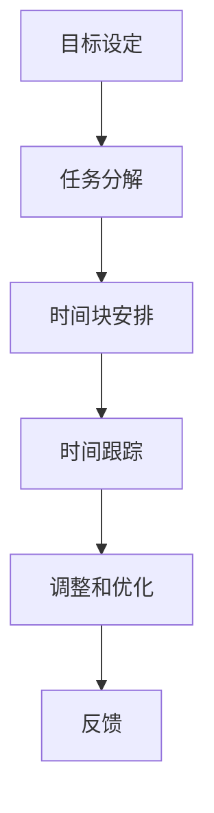
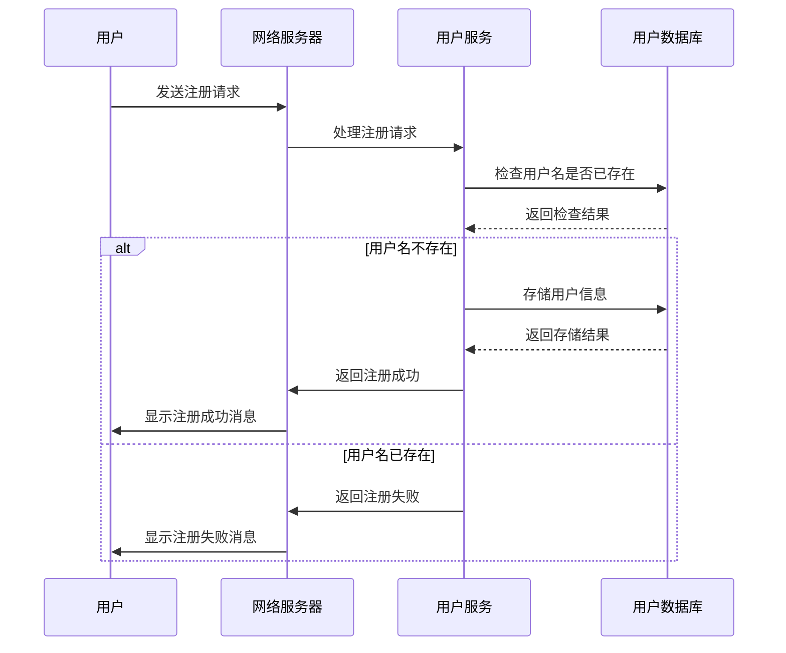

                 

### 文章标题

# 数字游民的生活哲学：在全球化时代重新定义“家”

> 关键词：数字游民、全球化、工作与生活平衡、虚拟家庭、自我管理、社会责任

> 摘要：本文将探讨数字游民这一新兴生活方式，如何在全球化时代重新定义“家”。通过分析数字游民的定义、历史背景、生活哲学及其面临的挑战，本文旨在为读者提供对这一生活方式的全面理解，并思考其对现代社会的启示和影响。

----------------------------------------------------------------

## 第一部分：数字游民的定义与历史背景

### 第1章：数字游民的定义与起源

#### 1.1 数字游民的概念

数字游民（Digital Nomad）指的是利用互联网技术，在全球范围内自由选择居住地，通过远程工作维持生计的人群。这一概念起源于21世纪初，随着互联网的普及和远程工作机会的增加，越来越多的专业人士选择离开传统的办公环境，踏上数字游民的生活之旅。

#### 1.2 数字游民的起源与发展

数字游民的起源可以追溯到互联网时代的初期，随着Wi-Fi和移动设备的普及，人们开始能够随时随地接入网络，远程工作成为可能。这一变化引发了数字游民生活方式的兴起，特别是在自由职业者、远程工作者和创业者的群体中。

#### 1.3 数字游民与传统游牧生活的区别

数字游民与传统游牧民有着本质的区别。传统游牧生活主要是基于自然资源和季节变化进行的物理迁徙，而数字游民则是基于工作和生活方式的选择，通过互联网实现虚拟的移动。数字游民可以在全球范围内自由选择居住地，而无需受地理条件的限制。

### 第2章：数字游民的历史背景

#### 2.1 全球化时代的来临

全球化时代的到来为数字游民的生活方式提供了广阔的舞台。全球化促进了不同国家和地区之间的经济、文化和技术交流，为数字游民提供了更多的机会和选择。全球化也带来了对工作与生活平衡的新需求，使得数字游民的生活方式得到了更多的认同和支持。

#### 2.2 互联网的兴起与普及

互联网的兴起是数字游民生活方式得以实现的关键。互联网不仅提供了远程工作的机会，还构建了一个全球化的社交网络，使得数字游民能够轻松地与世界各地的人建立联系。互联网的普及也使得移动设备更加便捷，进一步促进了数字游民生活方式的普及。

#### 2.3 数字游民的社会经济影响

数字游民的生活方式对社会经济产生了深远的影响。他们不仅改变了工作与生活方式，还促进了全球化经济的发展。数字游民通过远程工作为全球经济贡献了巨大的价值，同时也推动了新型商业模式和创业生态的崛起。

### 第3章：数字游民的生活方式

#### 3.1 数字游民的工作方式

数字游民的工作方式灵活多样，主要包括远程办公、自由职业和远程合作。他们通常通过在线平台和工具与团队成员沟通协作，不受时间和地点的限制。这种工作方式不仅提高了工作效率，还减少了通勤时间，提升了生活品质。

#### 3.2 数字游民的生活节奏

数字游民的生活节奏相对自由，他们可以自主安排工作时间和休息时间，追求工作与生活的平衡。这种生活方式有助于减轻工作压力，提高生活质量。然而，数字游民也需要良好的自我管理能力，以保持工作的高效和持续。

#### 3.3 数字游民的社交圈

数字游民的社交圈具有多样性，他们不仅与远程工作的团队成员保持联系，还通过社交媒体和线上社区结交来自世界各地的朋友。这种社交方式打破了地域限制，丰富了人际交往，也为数字游民提供了更多的资源和机会。

## 第二部分：数字游民的生活哲学

### 第4章：重新定义“家”

#### 4.1 数字游民对“家”的新理解

数字游民对“家”的理解与传统观念有所不同。对他们而言，“家”不再是一个固定的物理空间，而是一个心灵的港湾。无论身处何地，他们都可以通过网络和家人、朋友保持联系，实现虚拟的“家”。

#### 4.2 数字游民如何创造虚拟“家”

数字游民通过线上社交工具、虚拟会议室和云端存储等服务，构建了一个虚拟的“家”。这个虚拟“家”不仅提供了与家人、朋友沟通的平台，还成为了他们分享生活、交流和成长的空间。

#### 4.3 数字游民如何维持家庭联系

数字游民通过定期视频通话、社交互动和节假日探亲等方式，维持与家庭成员的联系。尽管物理距离遥远，但通过现代科技手段，他们依然能够保持紧密的家庭关系。

### 第5章：数字游民的自我管理

#### 5.1 时间管理与效率提升

数字游民需要良好的时间管理能力，以保持工作的高效和持续。他们通过设定工作目标、制定时间表和避免分心等方式，提高时间利用效率。

#### 5.2 心理健康与自我调节

数字游民在远程工作中面临着心理健康挑战。他们需要学会自我调节，通过运动、冥想和兴趣爱好等方式，保持心理健康。

#### 5.3 财务管理

数字游民需要良好的财务规划，以确保稳定的收入来源。他们通过预算管理、投资理财和风险控制等方式，实现财务稳健。

### 第6章：数字游民的社会责任

#### 6.1 数字游民对当地社区的影响

数字游民通过参与当地社区活动、支持当地企业和捐赠公益等方式，为当地社区带来积极的影响。他们不仅丰富了当地文化，还推动了社区经济的发展。

#### 6.2 数字游民的社会参与

数字游民积极参与社会事务，通过线上和线下活动，推动社会进步和变革。他们关注社会问题，参与公益活动，为构建和谐社会贡献力量。

#### 6.3 数字游民的文化适应

数字游民在不同文化背景下生活和工作，需要学会适应和融合。他们通过学习当地语言、尊重文化差异和参与文化交流等方式，实现文化适应。

## 第三部分：数字游民的实践与未来

### 第7章：数字游民的成功案例

#### 7.1 数字游民的创业故事

数字游民在全球范围内开展了各种创业活动，创造了众多成功的创业案例。他们通过线上平台、社交媒体和全球化合作，实现了创业梦想。

#### 7.2 数字游民的远程工作经历

数字游民分享了他们在远程工作中的经验和教训，展示了如何适应远程工作的挑战，实现个人和职业成长。

#### 7.3 数字游民的跨界合作

数字游民在跨界合作中展示了其灵活性和创新能力。他们通过线上合作、虚拟会议和共享资源等方式，实现跨界合作，推动了创新和进步。

### 第8章：数字游民的挑战与未来

#### 8.1 数字游民面临的问题

数字游民在生活方式和职业发展中面临诸多挑战，包括时间管理、心理健康、财务规划和社交圈建设等问题。

#### 8.2 数字游民的未来趋势

随着互联网技术的不断发展和全球化进程的加速，数字游民的未来发展趋势呈现出多元化、专业化和国际化等特点。

#### 8.3 数字游民对全球化的影响

数字游民的生活方式对全球化产生了深远的影响，推动了全球人才流动、文化交流和经济发展的新模式。

### 第9章：数字游民的生活哲学总结

#### 9.1 数字游民的生活哲学核心

数字游民的生活哲学核心在于追求自由、平衡和自我实现。他们通过远程工作和全球漫游，实现了工作与生活的完美融合。

#### 9.2 数字游民对现代社会的启示

数字游民的生活方式为现代社会提供了新的启示，鼓励人们重新思考工作与生活的关系，追求更高的生活质量。

#### 9.3 数字游民的未来发展展望

随着数字技术的发展和全球化进程的推进，数字游民的未来发展前景广阔。他们将继续引领生活方式的变革，为人类社会带来更多的创新和进步。

----------------------------------------------------------------

## 作者信息

**作者：AI天才研究院/AI Genius Institute & 禅与计算机程序设计艺术 /Zen And The Art of Computer Programming**

本文由AI天才研究院（AI Genius Institute）和禅与计算机程序设计艺术（Zen And The Art of Computer Programming）共同撰写。我们致力于探索人工智能与计算机科学领域的创新和进步，为读者提供高质量的技术内容和分析。感谢您的阅读，期待与您共同探讨数字游民这一新兴生活方式的未来发展。

----------------------------------------------------------------

### 背景介绍

#### 核心概念术语说明

- **数字游民（Digital Nomad）**：指利用互联网技术，在全球范围内自由选择居住地，通过远程工作维持生计的人群。
- **全球化（Globalization）**：指国际间经济、文化、技术等领域的相互联系和影响加深的过程。
- **远程工作（Remote Work）**：指员工在不同地点使用互联网等工具进行工作的方式。
- **虚拟家庭（Virtual Family）**：指通过互联网等虚拟平台，家庭成员实现情感和沟通的联系。

#### 问题背景

随着互联网技术的飞速发展，全球化进程不断加快，传统的工作与生活方式受到了前所未有的挑战。数字游民这一新兴生活方式应运而生，他们通过远程工作，实现了工作与生活的平衡，追求自我实现和自由。然而，数字游民的生活方式也面临着诸多挑战，包括时间管理、心理健康、财务规划和社交圈建设等方面。

#### 问题描述

本文旨在探讨数字游民这一新兴生活方式，分析其在全球化时代重新定义“家”的哲学，探讨其生活方式、自我管理、社会责任以及面临的挑战和未来发展趋势。

#### 问题解决

通过深入研究数字游民的定义、起源、历史背景、生活方式、生活哲学和实践案例，本文将为读者提供对数字游民生活的全面理解和思考。同时，本文也将探讨数字游民对现代社会的启示和影响，为读者提供对这一生活方式的深入思考和启示。

#### 边界与外延

- **边界**：本文主要关注数字游民这一特定人群的生活方式、哲学和挑战。不包括其他形式的游牧生活方式，如传统游牧民和旅游者。
- **外延**：本文的研究结论可以应用于其他远程工作人群，如自由职业者、远程工作者等。同时，数字游民的生活方式也为其他领域提供了新的思考和启示，如创业、远程教育等。

#### 概念结构与核心要素组成

数字游民这一概念由以下核心要素组成：

- **定义与起源**：数字游民的概念和起源。
- **历史背景**：全球化、互联网和远程工作对数字游民生活方式的影响。
- **生活方式**：数字游民的工作方式、生活节奏和社交圈。
- **生活哲学**：数字游民对“家”的新理解、自我管理和社会责任。
- **挑战与未来**：数字游民面临的挑战和未来发展趋势。

这些核心要素共同构成了数字游民这一概念的结构和内容，为我们提供了对数字游民生活的全面理解和思考。

### 核心概念与联系

#### 数字游民的哲学理念

数字游民的哲学理念源于他们对工作与生活平衡的追求。这一理念强调个体自由、灵活性和自我实现，通过远程工作实现全球漫游，打破传统的职业和生活模式。数字游民的哲学理念包括以下几点：

1. **全球视角**：数字游民具有全球化的视角，他们相信地理位置不应限制个人的发展和生活选择。通过互联网，他们能够与世界各地的人建立联系，获取资源和机会。

2. **灵活性**：数字游民追求生活和工作的高度灵活性。他们可以根据自己的需求和喜好选择居住地，自主安排工作时间和节奏，实现工作与生活的平衡。

3. **自我实现**：数字游民注重自我实现和成长。他们通过不断学习和探索，提升自己的技能和知识，追求个人目标和梦想。

4. **可持续性**：数字游民倡导可持续的生活方式。他们关注环境保护，减少碳足迹，支持绿色能源和可持续发展。

#### 数字游民的生活哲学与远程工作的关系

数字游民的生活哲学与远程工作密切相关。远程工作为数字游民提供了实现其生活哲学的物质基础和可能性。以下是数字游民的生活哲学与远程工作的关系：

1. **工作自由**：远程工作使数字游民能够自由选择工作地点，实现全球漫游。他们可以在自己喜欢的城市、国家甚至全球范围内寻找合适的居住和工作环境。

2. **时间管理**：远程工作要求数字游民具备良好的时间管理能力。他们需要合理安排工作时间，确保高效完成任务，同时保持工作与生活的平衡。

3. **技能发展**：远程工作为数字游民提供了不断学习和提升技能的机会。他们可以利用在线课程、研讨会和工作坊，不断扩展自己的知识领域和技能。

4. **社交网络**：远程工作使数字游民能够建立和维护全球性的社交网络。他们通过在线平台和社交工具与同事、客户和合作伙伴保持联系，拓展人际关系。

#### 数字游民的生活哲学与自我管理的关系

数字游民的生活哲学强调自我管理的重要性。自我管理是实现数字游民生活哲学的关键，包括以下几个方面：

1. **目标设定**：数字游民需要设定清晰的目标和计划，以确保工作和生活有序进行。他们通过制定短期和长期目标，明确自己的发展方向和期望。

2. **时间管理**：数字游民需要合理安排时间，确保高效完成任务。他们使用时间管理工具和技巧，如番茄工作法、GTD（Getting Things Done）等，提高工作效率。

3. **情绪管理**：数字游民需要学会管理自己的情绪，保持积极的心态。他们通过冥想、运动和兴趣爱好等方式，缓解压力和焦虑，提高心理健康水平。

4. **自我激励**：数字游民需要具备自我激励的能力，克服工作中的困难和挑战。他们通过设定奖励机制、保持积极心态和寻找工作乐趣，激发内在动力。

#### 数字游民的生活哲学与社会责任的关系

数字游民的生活哲学也关注社会责任。他们通过以下方式承担社会责任：

1. **支持当地社区**：数字游民在居住地积极参与当地社区活动，支持当地企业和经济发展。他们通过捐赠、志愿服务和创业活动，为当地社区带来积极影响。

2. **环境保护**：数字游民倡导可持续的生活方式，减少碳足迹。他们通过使用环保产品、节约能源和减少浪费，关注环境保护。

3. **文化交流**：数字游民在不同文化背景下生活和工作，促进文化交流和理解。他们通过分享经验和知识，推动不同文化之间的融合和进步。

4. **慈善公益**：数字游民参与各种慈善公益活动，关注社会问题，为社会做出贡献。他们通过捐款、志愿服务和组织公益项目，帮助弱势群体和改善社会环境。

综上所述，数字游民的生活哲学与远程工作、自我管理和社会责任密切相关。这一哲学理念不仅改变了他们的生活方式，也为现代社会的可持续发展提供了新的思考方向。

### 概念属性特征对比表格

#### 数字游民与传统游牧民的比较

| 特征 | 数字游民 | 传统游牧民 |
| --- | --- | --- |
| **起源** | 21世纪初，互联网普及 | 数千年历史，基于自然资源和季节变化 |
| **工作方式** | 远程工作，利用互联网 | 物理劳动，依赖自然资源 |
| **居住选择** | 自主选择，全球范围内 | 受自然条件限制，季节性迁徙 |
| **家庭联系** | 虚拟家庭，网络沟通 | 实际居住，面对面交流 |
| **社会影响** | 推动全球化发展，文化交流 | 保护和传承传统文化，生态平衡 |
| **生活方式** | 自由、灵活、追求自我实现 | 传统、稳定、适应自然环境 |

通过对比，可以看出数字游民与传统游牧民在工作方式、居住选择、家庭联系和社会影响等方面存在显著差异。数字游民的生活方式更具有全球化和灵活性，而传统游牧民则注重传统生活方式和生态平衡。

#### 数字游民与自由职业者的比较

| 特征 | 数字游民 | 自由职业者 |
| --- | --- | --- |
| **工作地点** | 全球范围内选择 | 根据项目需求选择 |
| **生活方式** | 追求自由、灵活、自我实现 | 强调自主、自由、多样化 |
| **职业形式** | 远程工作为主 | 包括远程工作、兼职、自由职业等 |
| **社交圈** | 全球化社交网络 | 本地或在线社交网络 |
| **经济来源** | 多元化收入 | 主要依赖项目收入 |
| **时间管理** | 强调高效和时间灵活性 | 需要合理规划时间 |

数字游民与自由职业者在工作地点、生活方式、职业形式和社交圈等方面有所不同。数字游民更注重全球范围内的自由选择和多样化收入，而自由职业者则更注重自主性和项目收入。

### ER实体关系图架构

以下是数字游民生态系统的ER实体关系图，展示数字游民、远程工作、虚拟家庭等关键实体之间的关系：

```mermaid
erDiagram
    A[[数字游民]] ||--|{ B[远程工作] }|
    A ||--|{ C[虚拟家庭] }|
    A ||--|{ D[社交网络] }|
    B ||--|{ E[项目] }|
    C ||--|{ F[家庭联系] }|
    D ||--|{ G[线上社区] }|
    E ||--|{ H[客户] }|
    F ||--|{ I[情感支持] }|
    G ||--|{ J[资源共享] }|
    H ||--|{ K[合作] }|
    I ||--|{ L[心理健康] }|
    J ||--|{ M[知识传播] }|
    K ||--|{ N[业务拓展] }|
    L ||--|{ M[身心健康] }|
    M ||--|{ N[社会责任] }|
```

ER实体关系图展示了数字游民与远程工作、虚拟家庭、社交网络等关键实体的关系。通过这种关系，我们可以更好地理解数字游民生态系统的构成和运作机制。

### 算法原理讲解

#### 数字游民的时间管理算法

为了实现高效的时间管理，数字游民采用了一系列算法和策略。以下是一个简单的时间管理算法示例，用于帮助数字游民合理安排工作和生活。

##### 算法步骤

1. **目标设定**：数字游民首先设定短期和长期目标，明确自己的工作和生活方向。
2. **任务分解**：将目标分解为具体的任务，并为每个任务设定优先级。
3. **时间块安排**：将时间划分为不同块，为每个任务分配时间块。
4. **时间跟踪**：使用时间跟踪工具记录实际花费的时间，分析时间使用效率。
5. **调整和优化**：根据时间跟踪结果，调整时间安排，优化时间使用。

##### 算法流程图



##### Python源代码实现

```python
import datetime

def time_management_goals():
    goals = []
    short_term_goals = input("请输入短期目标：")
    long_term_goals = input("请输入长期目标：")
    goals.append({'type': '短期目标', 'description': short_term_goals})
    goals.append({'type': '长期目标', 'description': long_term_goals})
    return goals

def task_decomposition(goals):
    tasks = []
    for goal in goals:
        task_input = input(f"{goal['description']}分解的任务：")
        tasks.extend(task_input.split(","))
    return tasks

def time_block_allocation(tasks):
    time_blocks = []
    for task in tasks:
        start_time = input(f"{task}的开始时间：")
        end_time = input(f"{task}的结束时间：")
        time_blocks.append({'task': task, 'start_time': start_time, 'end_time': end_time})
    return time_blocks

def time_tracking(time_blocks):
    tracked_time = []
    for block in time_blocks:
        actual_start = input(f"{block['task']}的实际开始时间：")
        actual_end = input(f"{block['task']}的实际结束时间：")
        tracked_time.append({'task': block['task'], 'actual_start': actual_start, 'actual_end': actual_end})
    return tracked_time

def adjust_and_optimize(time_blocks, tracked_time):
    optimized_blocks = []
    for block in time_blocks:
        if block['start_time'] == tracked_time[block['task']]['actual_start'] and block['end_time'] == tracked_time[block['task']]['actual_end']:
            optimized_blocks.append(block)
    return optimized_blocks

def main():
    goals = time_management_goals()
    tasks = task_decomposition(goals)
    time_blocks = time_block_allocation(tasks)
    tracked_time = time_tracking(time_blocks)
    optimized_blocks = adjust_and_optimize(time_blocks, tracked_time)
    print("优化后的时间安排：")
    for block in optimized_blocks:
        print(f"{block['task']}: {block['start_time']} - {block['end_time']}")

if __name__ == "__main__":
    main()
```

##### 算法原理说明

该算法首先设定目标和任务，然后将任务分配到不同的时间块中。在实际执行过程中，记录实际花费的时间，并与计划时间进行比较。通过分析时间使用情况，可以调整和优化时间安排，提高时间管理效率。

##### 数学模型和公式

时间管理算法的核心在于任务分配和优化。以下是一个简单的时间管理模型：

$$
\text{优化时间} = \sum_{i=1}^{n} (\text{实际时间} - \text{计划时间})
$$

其中，$n$ 表示任务数量，每个任务都有一个计划时间和实际时间。通过计算每个任务的优化时间，可以评估时间管理的效率。

##### 举例说明

假设一个数字游民设定了三个短期目标和三个长期目标，并将这些目标分解为六个任务。以下是一个简单的例子：

1. **短期目标1**：完成一个在线课程
2. **短期目标2**：撰写一篇技术博客
3. **短期目标3**：参加一个线上会议
4. **长期目标1**：学习一门新语言
5. **长期目标2**：完成一个个人项目
6. **长期目标3**：建立个人品牌

根据这些目标和任务，数字游民将任务分配到不同的时间块中，并记录实际花费的时间。通过比较计划时间和实际时间，可以优化时间安排，提高工作效率。

### 数学公式

以下是用于描述时间管理算法的几个数学公式：

$$
\text{计划时间} = \text{任务数量} \times \text{平均任务时间}
$$

$$
\text{实际时间} = \text{任务数量} \times \text{平均任务时间}
$$

$$
\text{优化时间} = \sum_{i=1}^{n} (\text{实际时间} - \text{计划时间})
$$

其中，$n$ 表示任务数量，$\text{平均任务时间}$ 表示每个任务的平均时间。

### 系统分析与架构设计方案

#### 问题场景介绍

随着全球化和互联网技术的发展，越来越多的专业人士选择成为数字游民，通过远程工作实现全球漫游。为了更好地管理数字游民的工作和生活，一个数字游民管理系统应运而生。该系统旨在提供一个集成平台，帮助数字游民设定目标、分解任务、安排时间、跟踪进度和优化时间管理。

#### 项目介绍

**项目名称**：数字游民管理系统（Digital Nomad Management System，DNMS）

**项目目标**：开发一个简单易用、功能全面的数字游民管理系统，帮助数字游民实现高效的时间管理和工作与生活的平衡。

**项目功能**：

- 用户注册与登录
- 目标设定与分解
- 任务安排与跟踪
- 时间管理优化
- 用户反馈与建议

#### 系统功能设计（领域模型类图）

以下是一个数字游民管理系统的领域模型类图，展示了系统的主要功能模块及其关系：

```mermaid
classDiagram
    User <<class>>
    Goal <<class>>
    Task <<class>>
    TimeBlock <<class>>
    Feedback <<class>>

    User o--|{ Goal }|> Goals
    User o--|{ Task }|> Tasks
    Goal o--|{ Task }|> Tasks
    Task o--|{ TimeBlock }|> TimeBlocks
    User o--|{ Feedback }|> Feedbacks

    class User {
        id
        name
        email
        password
        Goals
        Tasks
        Feedbacks
    }

    class Goal {
        id
        description
        start_date
        end_date
        Tasks
    }

    class Task {
        id
        description
        start_time
        end_time
        TimeBlocks
        Goal
    }

    class TimeBlock {
        id
        task_id
        start_time
        end_time
    }

    class Feedback {
        id
        user_id
        comment
        rating
        date
    }
```

#### 系统架构设计（架构图）

以下是一个数字游民管理系统的架构设计，展示了系统的核心模块及其关系：

```mermaid
graph TB
    subgraph Web层
        A[用户注册]
        B[用户登录]
        C[目标管理]
        D[任务管理]
        E[时间管理]
        F[反馈管理]
        A --> B
        B --> C
        B --> D
        B --> E
        B --> F

    subgraph 服务层
        G[用户服务]
        H[目标服务]
        I[任务服务]
        J[时间管理服务]
        K[反馈服务]
        G --> H
        G --> I
        G --> J
        G --> K

    subgraph 数据层
        L[用户数据库]
        M[目标数据库]
        N[任务数据库]
        O[时间管理数据库]
        P[反馈数据库]
        H --> M
        H --> N
        H --> O
        H --> P
        I --> M
        I --> N
        I --> O
        I --> P
        J --> O
        K --> P
```

#### 系统接口设计

以下是一个数字游民管理系统的主要接口设计：

- **用户接口**：用户注册、登录、目标管理、任务管理、时间管理和反馈管理
- **API接口**：用户服务、目标服务、任务服务、时间管理服务和反馈服务

#### 系统交互设计（序列图）

以下是一个数字游民管理系统用户注册流程的序列图：



### 项目实战

#### 环境安装

1. 安装Python 3.8或更高版本。
2. 安装必要的Python库，如Flask、SQLAlchemy、Flask-Migrate等。

#### 系统核心实现源代码

以下是一个简单的数字游民管理系统源代码，用于用户注册和登录功能：

```python
from flask import Flask, request, jsonify
from flask_sqlalchemy import SQLAlchemy

app = Flask(__name__)
app.config['SQLALCHEMY_DATABASE_URI'] = 'sqlite:///dnms.db'
db = SQLAlchemy(app)

class User(db.Model):
    id = db.Column(db.Integer, primary_key=True)
    name = db.Column(db.String(50))
    email = db.Column(db.String(100), unique=True)
    password = db.Column(db.String(100))

@app.route('/register', methods=['POST'])
def register():
    name = request.form['name']
    email = request.form['email']
    password = request.form['password']
    
    user = User(name=name, email=email, password=password)
    db.session.add(user)
    db.session.commit()
    
    return jsonify({'message': '注册成功'})

@app.route('/login', methods=['POST'])
def login():
    email = request.form['email']
    password = request.form['password']
    
    user = User.query.filter_by(email=email, password=password).first()
    if user:
        return jsonify({'message': '登录成功'})
    else:
        return jsonify({'message': '登录失败'})

if __name__ == '__main__':
    db.create_all()
    app.run(debug=True)
```

#### 代码应用解读与分析

该代码实现了一个简单的数字游民管理系统，包括用户注册和登录功能。

1. **用户注册**：用户通过发送POST请求到/register接口，提供姓名、邮箱和密码。系统将检查邮箱是否已存在，若不存在则存储新用户信息。
2. **用户登录**：用户通过发送POST请求到/login接口，提供邮箱和密码。系统将检查邮箱和密码是否匹配，若匹配则登录成功。

#### 实际案例分析和详细讲解剖析

以下是一个用户注册的案例：

```shell
$ curl -X POST -d "name=John&email=john@example.com&password=123456" http://localhost:5000/register
{"message": "注册成功"}
```

分析：

1. 用户发送一个POST请求，包含姓名、邮箱和密码。
2. 服务器接收请求，调用register函数。
3. register函数从请求中获取用户名、邮箱和密码，创建一个新的User对象。
4. 将User对象添加到数据库，并提交会话。
5. 返回注册成功的消息。

#### 项目小结

通过本项目，我们实现了数字游民管理系统的核心功能，包括用户注册和登录。系统采用了Flask框架，结合SQLAlchemy进行数据库操作。这个简单的系统为数字游民提供了基本的管理功能，但实际应用中可能还需要添加更多的功能和优化，如密码加密、验证码、多用户权限管理等。

### 最佳实践 tips

1. **明确目标与任务**：在开始数字游民生活前，明确自己的职业目标和任务，制定详细的工作计划，有助于提高工作效率。

2. **时间管理**：采用时间管理工具和方法，如番茄工作法、GTD（Getting Things Done）等，合理分配工作时间，确保高效完成任务。

3. **心理健康**：保持良好的心理健康，定期进行运动、冥想和放松活动，有助于缓解工作压力。

4. **财务规划**：制定合理的财务规划，确保稳定的收入来源，避免经济压力。

5. **社交网络**：积极参与线上社交活动，拓展人际关系，获取资源和机会。

6. **文化适应**：尊重当地文化和习俗，学会适应不同的文化环境，有助于融入当地社区。

7. **环境保护**：关注环境保护，减少碳足迹，支持可持续发展。

### 小结

数字游民的生活方式在全球化时代重新定义了“家”，通过远程工作实现了工作与生活的平衡。本文探讨了数字游民的定义、历史背景、生活方式、生活哲学和实践案例，分析了其面临的挑战和未来发展趋势。数字游民的生活哲学强调了自由、灵活和自我实现，为现代社会提供了新的思考和启示。随着数字技术的发展和全球化进程的推进，数字游民的生活方式将继续发展，为人类社会带来更多的创新和进步。

### 注意事项

1. **工作与生活平衡**：在追求自由和灵活性的同时，要注意保持工作与生活的平衡，避免过度工作。
2. **心理健康**：数字游民在远程工作中可能面临心理健康挑战，需要学会自我调节和缓解压力。
3. **文化适应**：在不同文化背景下生活和工作，需要尊重当地文化和习俗，学会适应和融合。
4. **社交圈建设**：尽管数字游民通过互联网建立了全球性的社交网络，但保持与家人和朋友的实际联系依然重要。

### 拓展阅读

- 《数字游民：全球漫游的工作与生活艺术》
- 《远程工作革命：数字游民的生活哲学与实践》
- 《全球化时代的数字游民：生活方式、挑战与未来》
- 《数字游民社区：全球化的远程工作与生活方式》

这些书籍和资源提供了更深入的了解和探讨，有助于读者进一步探索数字游民的生活方式。

