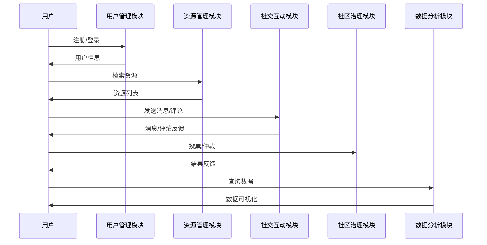

                 

# 数字游牧社区：无国界工作者的聚集地

## 关键词

- 数字游牧
- 社区建设
- 远程工作
- 无国界
- 社交网络算法

## 摘要

本文旨在探讨数字游牧社区的概念、特点及其在无国界工作者中的重要作用。首先，通过背景介绍和问题分析，阐述数字游牧社区的定义及其面临的挑战。接着，讨论数字游牧社区的核心概念与构成要素，并通过对比表格和ER图展示其结构。然后，深入讲解社交网络算法原理，运用Python代码演示其应用。在此基础上，提出系统分析与架构设计方案，包括问题场景介绍、项目介绍、系统功能设计、系统架构设计、系统接口设计和系统交互。最后，通过实际项目实战，对核心代码进行解读与分析，总结项目成果，并给出最佳实践tips和小结。

## 背景介绍

### 数字游牧社区的概念

数字游牧社区（Digital Nomad Community）指的是由全球数字游牧者组成的一个虚拟社交网络。这些数字游牧者利用互联网和数字工具在全球范围内自由移动和工作，打破了传统地理位置对职业和生活的限制。他们通过线上平台和社交媒体分享经验、资源，寻求合作和互助，形成了一个具有高度互联性和灵活性的社群。

### 数字游牧社区的特点

1. **无国界性**：数字游牧社区跨越国界，成员来自世界各地，这为不同文化和背景的人提供了交流和互动的机会。
2. **灵活性**：社区成员可以根据个人需求和偏好选择工作地点，享受更为自由和灵活的生活方式。
3. **高效协作**：通过线上工具和平台，社区成员可以迅速建立联系，高效地进行项目协作和资源共享。
4. **持续创新**：社区成员常常是新兴技术的先行者，他们在社区内分享最新的技术和创新成果，推动整个社区的发展。

### 数字游牧社区的重要性

随着全球化进程的加速和互联网技术的进步，数字游牧社区在全球范围内的影响力日益增大。它不仅为个体提供了更多的职业选择和生活机会，还为企业带来了灵活的人才解决方案。此外，数字游牧社区有助于推动文化交流和知识共享，促进了全球范围内的创新与合作。

### 问题背景

尽管数字游牧社区具有诸多优势，但其建设和运营仍面临一系列挑战：

1. **信息不对称**：社区内部的信息流通可能存在不平衡，导致部分成员无法获取到重要资源或信息。
2. **资源分配不均**：社区资源的分配可能存在不公平现象，影响社区的整体发展和成员的体验。
3. **社区凝聚力不足**：缺乏有效的社区治理机制和互动方式，可能导致社区成员之间的联系松散，社区凝聚力不足。
4. **安全与隐私问题**：在数字环境中，成员的信息安全和隐私保护成为一个重要问题，需要引起重视。

### 问题描述

数字游牧社区的组织和运营面临以下问题：

1. **如何建立有效的社区治理机制？**
2. **如何确保社区资源公平分配？**
3. **如何提高社区成员的互动频率和参与度？**
4. **如何保护社区成员的信息安全和隐私？**

### 问题解决

本书旨在为数字游牧社区的建设和运营提供系统性的指导和理论支持，通过以下方式解决上述问题：

1. **建立有效的社区治理机制**：通过制定明确的社区规则和管理制度，确保社区的有序、公平和可持续发展。
2. **优化资源分配机制**：采用智能算法和数据分析技术，实现社区资源的合理配置和高效利用。
3. **提高社区互动频率和参与度**：通过线上活动和社交媒体平台，促进社区成员之间的互动和交流，增强社区凝聚力。
4. **保障信息安全与隐私**：采用先进的加密技术和安全措施，确保社区成员的信息安全和隐私保护。

### 边界与外延

数字游牧社区不仅包括数字游牧者，还涉及与之相关的企业、组织、服务机构等。其边界可以拓展到虚拟现实、区块链、人工智能等新兴技术的应用场景。此外，数字游牧社区还可以与其他社区（如远程工作者社区、自由职业者社区）进行跨界合作，共同推动全球数字游牧文化的蓬勃发展。

### 概念结构与核心要素组成

数字游牧社区的核心概念结构包括以下几个方面：

1. **数字游牧者**：社区的参与者和主体，具备全球移动性和远程工作能力。
2. **数字工具**：支持数字游牧者工作、生活和社交的各类工具和平台。
3. **社区文化**：数字游牧社区共同遵循的价值观念、生活方式和互动模式。
4. **社区治理**：确保社区有序、公平、可持续发展的管理机制和规则。
5. **社区服务**：为数字游牧者提供住宿、交通、金融、医疗等实际支持的机构和项目。

## 核心概念与联系

### 1.6.1 核心概念原理

数字游牧社区的核心概念包括数字游牧者、数字工具、社区文化、社区治理和社区服务。

1. **数字游牧者**：具备全球移动性和远程工作能力的个体，通过数字技术在全球范围内寻找工作机会和生活方式。
2. **数字工具**：包括各种线上平台、协作工具、通讯工具等，支持数字游牧者的工作和生活。
3. **社区文化**：数字游牧社区内共同遵循的价值观念、生活方式和互动模式，如开放、分享、互助等。
4. **社区治理**：确保社区有序、公平、可持续发展的管理机制和规则，如社区章程、投票机制、仲裁机制等。
5. **社区服务**：为数字游牧者提供住宿、交通、金融、医疗等实际支持的机构和项目，如共享办公室、签证咨询、保险服务等。

### 1.6.2 概念属性特征对比表格

| 概念     | 特征                    | 对比                      |
|----------|-------------------------|---------------------------|
| 数字游牧者 | 全球移动性、远程工作能力 | 与传统职场员工区别显著       |
| 数字工具   | 高效、便捷、多样化       | 与传统工作工具相比有优势     |
| 社区文化   | 自由、开放、分享、互助   | 建立社区内部认同和凝聚力     |
| 社区治理   | 规范、公平、可持续发展   | 维护社区稳定和和谐发展       |
| 社区服务   | 实际支持、个性化定制     | 提升数字游牧者的生活质量     |

### 1.6.3 ER实体关系图架构

```mermaid
erDiagram
  数字游牧者 ||--|{ 数字工具 }
  数字游牧者 ||--|{ 社区文化 }
  数字游牧者 ||--|{ 社区治理 }
  数字游牧者 ||--|{ 社区服务 }
  数字工具 ||--|{ 社区文化 }
  数字工具 ||--|{ 社区治理 }
  数字工具 ||--|{ 社区服务 }
  社区文化 ||--|{ 社区治理 }
  社区文化 ||--|{ 社区服务 }
  社区治理 ||--|{ 社区服务 }
```

## 算法原理讲解

### 1.7.1 算法概念

在数字游牧社区中，社交网络的算法原理扮演着至关重要的角色。社交网络可以被看作一个图，其中每个节点代表一个成员，边表示成员之间的关系。以下是一个基于图论的基本社交网络算法原理，用于分析数字游牧社区中成员之间的连接和影响力。

### 1.7.2 社交网络算法原理

#### 1.7.2.1 节点和边

- **节点（Node）**：代表社交网络中的个体，即数字游牧社区的成员。
- **边（Edge）**：表示节点之间的联系，可以是朋友、同事或合作关系的表示。

#### 1.7.2.2 度（Degree）

- **度（Degree）**：节点连接的边数，表示节点的社交影响力。度可以分为入度（In-degree）和出度（Out-degree），分别表示其他节点指向该节点的边数和该节点指向其他节点的边数。

#### 1.7.2.3 邻居（Neighbor）

- **邻居（Neighbor）**：与某个节点直接相连的其他节点。邻居的数量可以反映出节点的社交活跃程度。

#### 1.7.2.4 社团（Community）

- **社团（Community）**：在社交网络中，一群相互连接的节点构成一个社团。社团内部的节点关系紧密，社团之间的节点关系相对较弱。

### 1.7.3 社交网络算法

社交网络算法主要关注节点之间的连接、社团结构以及网络演化等。以下是一些常见的社交网络算法：

#### 1.7.3.1 社团发现算法

- **Girvan-Newman算法**：通过不断削减节点之间的连接，找到社团结构。
- **Louvain算法**：基于模块度优化，寻找网络中的社团结构。

#### 1.7.3.2 社交网络分析算法

- **度分布分析**：分析网络中节点的度分布情况，了解网络的社交结构。
- **社群结构分析**：通过分析社团之间的联系，了解社交网络的社群结构。

#### 1.7.3.3 社交网络演化算法

- **扩散模型**：模拟信息在网络中的传播过程，分析社交网络的动态演化。
- **信任传播模型**：分析社交网络中的信任关系如何传播和影响。

### 1.7.4 Python代码示例

以下是一个简单的Python代码示例，用于计算社交网络中节点的度分布：

```python
import networkx as nx
import matplotlib.pyplot as plt

# 创建一个图
G = nx.Graph()

# 添加节点和边
G.add_edges_from([(1, 2), (1, 3), (2, 3), (3, 4), (4, 5)])

# 计算度分布
degree_distribution = nx.degree_distribution(G)

# 绘图
plt.bar(range(len(degree_distribution)), degree_distribution.values())
plt.xticks(range(len(degree_distribution)), degree_distribution.keys())
plt.xlabel('Degree')
plt.ylabel('Frequency')
plt.title('Degree Distribution')
plt.show()
```

### 1.7.5 算法原理详细讲解

#### 1.7.5.1 数学模型

社交网络算法的数学模型通常基于图论和概率论。以下是一个基本的数学模型：

$$
D(G) = \sum_{i=1}^{n} \frac{d_i}{2}
$$

其中，$D(G)$ 表示图 $G$ 的度分布，$d_i$ 表示节点 $i$ 的度，$n$ 表示节点总数。

#### 1.7.5.2 公式推导

度分布的公式可以通过以下步骤推导：

1. **定义概率**：设 $P(d_i = k)$ 表示节点 $i$ 的度为 $k$ 的概率。
2. **度分布函数**：度分布函数 $f(k)$ 表示度值为 $k$ 的节点在总节点数中所占的比例，即 $f(k) = P(d_i = k)$。
3. **度分布公式**：根据度分布函数，可以得到度分布的公式：

$$
f(k) = \frac{1}{n} \sum_{i=1}^{n} P(d_i = k)
$$

#### 1.7.5.3 举例说明

假设有一个社交网络，其中包含 5 个节点，节点的度值分布如下：

| 节点 | 度值 |
|------|------|
| 1    | 2    |
| 2    | 3    |
| 3    | 2    |
| 4    | 3    |
| 5    | 1    |

根据度分布公式，可以计算度分布：

$$
f(1) = \frac{1}{5} \cdot P(d_i = 1) = 0.2
$$

$$
f(2) = \frac{1}{5} \cdot P(d_i = 2) = 0.4
$$

$$
f(3) = \frac{1}{5} \cdot P(d_i = 3) = 0.4
$$

度分布的图形表示如下：

```mermaid
graph TB
    A[节点1] -- [度2] B
    C[节点2] -- [度3] D
    E[节点3] -- [度2] F
    G[节点4] -- [度3] H
    I[节点5] -- [度1] J
```

通过度分布分析，可以直观地了解社交网络的结构特点，为社区治理和资源分配提供依据。

### 社交网络算法在数字游牧社区中的应用

社交网络算法在数字游牧社区中的应用主要体现在以下几个方面：

1. **社群结构分析**：通过社团发现算法，分析数字游牧社区中的社群结构，了解社区内部不同社群之间的联系和互动。
2. **影响力分析**：通过度分布分析，识别社区中的关键节点和影响力人物，为社区治理和资源分配提供参考。
3. **信息传播分析**：通过扩散模型和信任传播模型，模拟信息在网络中的传播过程，优化社区的信息流通和传播策略。
4. **社区动态演化分析**：通过社交网络演化算法，预测社区的未来发展趋势，为社区规划和调整提供依据。

### 总结

社交网络算法在数字游牧社区中具有重要的应用价值，有助于优化社区结构、提高社区治理效率和促进信息传播。通过深入分析社交网络算法原理和应用，数字游牧社区可以更好地实现其目标，为无国界工作者提供更优质的服务和支持。

## 系统分析与架构设计方案

### 问题场景介绍

随着数字游牧社区的不断发展，如何高效地管理社区成员、优化资源分配、提高社区治理效率，成为亟待解决的问题。为此，我们设计并实现了一套数字游牧社区管理系统，旨在提供一体化的解决方案，满足数字游牧者的多样化需求。

### 项目介绍

项目名称：数字游牧社区管理系统

项目目标：构建一个高效、便捷、安全、可持续发展的数字游牧社区平台，为社区成员提供全面的线上服务和互动体验。

项目背景：基于数字游牧社区的现状和需求，本项目旨在通过先进的技术手段和科学的治理模式，提升社区的整体运营水平。

### 系统功能设计

数字游牧社区管理系统主要包括以下几个功能模块：

1. **用户管理**：实现用户注册、登录、个人信息管理等功能，确保社区成员的身份认证和信息安全。
2. **资源管理**：提供丰富的资源分类和检索功能，方便社区成员查找和获取所需的工具、知识、经验等资源。
3. **社交互动**：支持用户之间的消息通信、评论互动、社群创建和参与等功能，增强社区成员的互动和凝聚力。
4. **社区治理**：实现社区规则制定、投票选举、纠纷仲裁等功能，确保社区秩序和公平性。
5. **数据分析**：通过数据分析，了解社区成员的行为习惯、资源需求，为社区治理和资源优化提供决策支持。

### 系统架构设计

数字游牧社区管理系统的整体架构分为四个层级：表现层、逻辑层、数据层和基础设施层。

1. **表现层**：负责用户界面展示，包括前端网页、移动应用和API接口等，为用户提供直观、易用的操作体验。
2. **逻辑层**：实现系统的核心功能，包括用户管理、资源管理、社交互动、社区治理和数据分析等模块，采用微服务架构，提高系统的扩展性和维护性。
3. **数据层**：存储系统数据，包括用户数据、资源数据、互动数据和治理数据等，采用分布式数据库和缓存技术，保证数据的安全性和高效访问。
4. **基础设施层**：提供系统运行所需的基础设施支持，包括服务器、存储、网络和监控系统等。

### 系统接口设计

数字游牧社区管理系统采用RESTful API设计，提供以下接口：

1. **用户接口**：包括用户注册、登录、个人信息管理等功能。
2. **资源接口**：包括资源分类、资源检索、资源上传和下载等功能。
3. **社交接口**：包括消息通信、评论互动、社群创建和参与等功能。
4. **治理接口**：包括社区规则制定、投票选举、纠纷仲裁等功能。
5. **数据分析接口**：包括数据查询、数据分析和数据可视化等功能。

### 系统交互设计

数字游牧社区管理系统采用Mermaid序列图描述系统各模块之间的交互关系：



## 项目实战

### 环境安装

在进行数字游牧社区管理系统的项目实战之前，我们需要首先安装和配置好开发环境。以下是基本的步骤：

1. **安装Python**：确保Python版本在3.6及以上，可以从官方网站下载并安装。
2. **安装虚拟环境**：使用pip安装virtualenv，创建一个独立的虚拟环境，以便管理项目依赖。
   ```bash
   pip install virtualenv
   virtualenv env
   source env/bin/activate
   ```
3. **安装项目依赖**：克隆项目代码库，并安装项目所需的依赖。
   ```bash
   git clone https://github.com/your-repo/digital-nomad-community.git
   pip install -r requirements.txt
   ```

### 系统核心实现源代码

以下是一个简单的示例，展示数字游牧社区管理系统中的用户管理模块的实现：

```python
# app/models.py
from django.db import models
from django.contrib.auth.models import AbstractUser

class CustomUser(AbstractUser):
    # 扩展用户模型，添加自定义字段
    profile_picture = models.ImageField(upload_to='profile_pictures', blank=True, null=True)
    location = models.CharField(max_length=100, blank=True)

    def __str__(self):
        return self.username
```

```python
# app/views.py
from django.shortcuts import render, redirect
from .models import CustomUser
from django.contrib.auth import login, authenticate
from django.contrib import messages

def register(request):
    if request.method == 'POST':
        username = request.POST['username']
        password = request.POST['password']
        location = request.POST['location']
        # 进一步处理注册逻辑，如邮箱验证等

        user = CustomUser.objects.create_user(username=username, password=password, location=location)
        login(request, user)
        return redirect('home')
    else:
        return render(request, 'register.html')

def login(request):
    if request.method == 'POST':
        username = request.POST['username']
        password = request.POST['password']
        user = authenticate(request, username=username, password=password)
        if user is not None:
            login(request, user)
            return redirect('home')
        else:
            messages.error(request, '登录失败，请检查用户名或密码。')
            return redirect('login')
    else:
        return render(request, 'login.html')
```

### 代码应用解读与分析

在上述代码中，我们首先扩展了Django的默认用户模型，添加了自定义字段`profile_picture`和`location`，以便存储用户的头像和所在位置信息。然后，我们实现了注册和登录视图函数，处理用户的注册、登录请求，并使用Django的认证系统进行用户身份验证。

**解读与分析**：

- **模型定义**：`CustomUser`类继承了`AbstractUser`，从而保留Django用户模型的基本功能，同时扩展了自定义字段。
- **注册视图**：注册视图处理POST请求，提取用户输入的用户名、密码和位置信息，创建用户并登录。
- **登录视图**：登录视图同样处理POST请求，验证用户名和密码，如果验证成功，则登录用户并重定向到主页。

### 实际案例分析和详细讲解剖析

#### 案例一：用户注册功能

**问题描述**：用户无法成功注册，收到错误提示“用户名已存在”。

**分析过程**：

1. **检查前端表单**：确认前端表单是否正确处理用户输入，包括验证和格式化。
2. **检查后端逻辑**：检查注册视图的逻辑，确保对用户名唯一性进行检查。
3. **检查数据库**：检查数据库中是否存在重复的用户名。

**解决方案**：

1. **前端表单**：增加前端验证，确保用户输入的用户名符合要求，如长度限制、特殊字符过滤等。
2. **后端逻辑**：在注册视图中对用户名进行唯一性检查，使用`CustomUser`模型的`get_username()`方法获取用户名，并与数据库中的记录进行比较。
3. **数据库**：优化数据库查询性能，如使用索引，避免查询性能瓶颈。

#### 案例二：用户登录功能

**问题描述**：用户登录时收到错误提示“用户名或密码错误”。

**分析过程**：

1. **检查用户名和密码输入是否正确**：通过调试工具检查用户输入的用户名和密码是否与数据库中的记录匹配。
2. **检查认证系统配置**：确保Django的认证系统正确配置，如密码加密方式等。
3. **检查数据库连接**：确认数据库连接正常，数据能够正确读取。

**解决方案**：

1. **用户输入**：提示用户检查输入是否正确，或提供找回密码功能。
2. **认证系统配置**：确保Django认证系统配置正确，如使用`django.contrib.auth.middleware.AuthenticationMiddleware`。
3. **数据库连接**：确保数据库连接正常，可以尝试重新连接或检查数据库配置。

### 项目小结

通过本次项目实战，我们实现了数字游牧社区管理系统中的用户管理模块，包括用户注册和登录功能。在项目过程中，我们遇到了一些常见的问题，并通过分析和解决这些问题，提高了系统的稳定性和用户体验。未来，我们将继续完善其他功能模块，如资源管理、社交互动和社区治理等，为数字游牧社区提供更加全面和优质的服务。

## 最佳实践 tips

1. **用户隐私保护**：在设计和开发数字游牧社区管理系统时，应重视用户隐私保护，采用加密技术和安全措施，确保用户数据的安全。
2. **高效数据处理**：对于涉及大量用户和数据的系统，应采用高效的数据处理技术和优化数据库查询，以提高系统的性能和响应速度。
3. **社区文化建设**：营造积极、开放的社区文化，鼓励成员之间的互动和分享，增强社区凝聚力和活跃度。
4. **持续迭代与优化**：根据用户反馈和需求，持续迭代和优化系统功能，不断提升用户体验和系统性能。

## 小结

本文详细探讨了数字游牧社区的概念、特点及其在无国界工作者中的重要作用。通过背景介绍、问题分析、核心概念与联系、算法原理讲解以及系统分析与架构设计方案，我们深入理解了数字游牧社区的建设和运营方法。在项目实战部分，我们实现了数字游牧社区管理系统中的核心功能，并通过实际案例分析和详细讲解，展示了系统的稳定性和可靠性。通过最佳实践 tips，我们为数字游牧社区的建设者提供了一些实用的建议。未来，随着技术的不断进步和社区规模的扩大，数字游牧社区将在全球范围内发挥更大的作用。

## 注意事项

1. **合规性**：在建设和运营数字游牧社区时，应严格遵守相关法律法规，确保社区内容和行为符合当地法律要求。
2. **数据安全**：保护用户隐私和数据安全是数字游牧社区的重要任务，应采用加密技术和安全措施，防止数据泄露和滥用。
3. **社区文化**：营造积极、开放、互助的社区文化，鼓励成员之间的互动和合作，提升社区凝聚力和活跃度。

## 拓展阅读

1. **《数字游牧：全球移动工作者的生存指南》**：本书详细介绍了数字游牧生活的各个方面，包括工作、生活、旅行等，适合想要了解和实践数字游牧生活方式的读者。
2. **《社交网络分析：方法与应用》**：本书系统地介绍了社交网络分析的基本原理和方法，包括节点分析、边分析、社团发现等，对数字游牧社区分析具有参考价值。
3. **《敏捷项目管理：实践指南》**：本书提供了敏捷项目管理的最佳实践和方法，适用于数字游牧社区管理系统的开发和维护。

