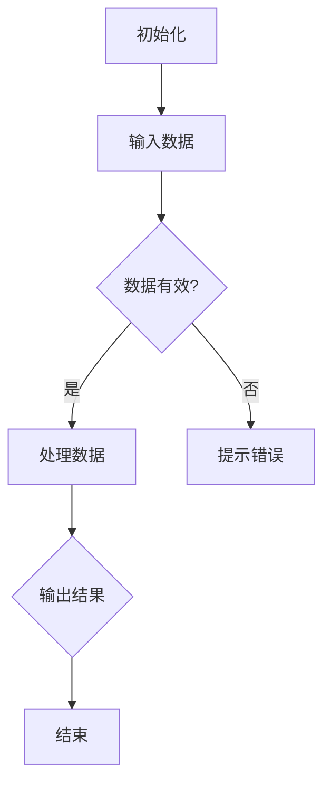
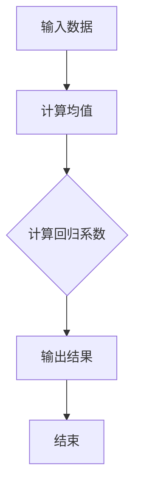

                 

# 数字移民：虚拟世界中的身份转换

## 关键词：数字移民、虚拟世界、身份转换、技术发展、社会影响

## 摘要

随着信息技术的迅猛发展，虚拟世界逐渐成为人们日常生活的重要组成部分。本文将探讨数字移民的概念、虚拟世界的特点以及身份转换的理论基础和实践案例，分析数字移民对社会、经济和文化的影响，并展望数字移民的未来趋势。通过本文的详细论述，读者将深入了解数字移民的本质及其带来的深远影响。

### 引言

### 1.1 数字移民的概念与背景

#### 1.1.1 数字移民的定义

数字移民是指那些通过互联网和数字技术，从现实世界迁移到虚拟世界的个人或群体。这些个体在虚拟世界中建立了新的身份、社交网络和生活方式。数字移民不仅仅是简单地使用互联网，而是深度融入了数字生态系统，成为其中的一员。

#### 1.1.2 数字移民的产生背景

数字移民的产生可以追溯到互联网的普及和技术的快速发展。随着智能手机、平板电脑等移动设备的普及，人们可以随时随地连接到互联网，这为数字移民提供了便利的条件。此外，虚拟现实（VR）和增强现实（AR）技术的发展，使得虚拟世界更加真实和互动，进一步吸引了大量用户。

#### 1.1.3 数字移民的社会影响

数字移民不仅改变了个人和社会的生活方式，还对社会结构、经济和文化产生了深远的影响。例如，数字移民带来了新的就业机会，但同时也加剧了社会阶层的不平等。此外，虚拟世界的匿名性为个人提供了表达自我的平台，但也带来了隐私和安全问题。

### 1.2 身份转换的理论基础

#### 1.2.1 社会身份理论

社会身份理论认为，个体的身份是由社会角色和社会地位所决定的。在虚拟世界中，数字移民通过选择和扮演不同的角色，实现了身份的转换。这种转换不仅受到个体自身的影响，还受到社会环境和技术的制约。

#### 1.2.2 虚拟身份的构建

虚拟身份是数字移民在虚拟世界中的代表，它通过用户名、头像、个人资料等形式呈现。虚拟身份的构建不仅反映了数字移民的个性特征，还受到了虚拟世界规则和文化的影响。

#### 1.2.3 身份转换的机制

身份转换的机制主要包括以下几个方面：

1. **虚拟社交网络**：数字移民通过加入不同的社交网络，结识新的朋友，扩大社交圈子，从而实现身份的转换。
2. **虚拟游戏**：通过参与虚拟游戏，数字移民可以在不同的角色中体验不同的生活，实现身份的转换。
3. **虚拟社区**：虚拟社区提供了一个平台，让数字移民可以讨论共同兴趣的话题，建立新的社会关系。

### 1.3 数字移民的类型与特征

#### 1.3.1 初级数字移民

初级数字移民是指那些刚刚开始接触虚拟世界，对其了解有限的人群。他们通常在虚拟世界中扮演简单的角色，参与基本的社交和娱乐活动。

#### 1.3.2 中级数字移民

中级数字移民对虚拟世界有更深入的了解，他们能够熟练地使用虚拟世界中的各种工具和功能，参与更加复杂的社会活动。

#### 1.3.3 高级数字移民

高级数字移民是虚拟世界中的资深用户，他们不仅对虚拟世界有深刻的理解，还能够利用虚拟世界中的资源和规则，实现自我价值的最大化。

### 1.4 数字移民的生活体验

#### 1.4.1 数字移民的日常生活

数字移民的日常生活与普通居民有所不同。他们通过网络购物、在线办公、虚拟旅游等方式，享受虚拟世界带来的便利和乐趣。

#### 1.4.2 数字移民的职业与社交

数字移民在虚拟世界中也有自己的职业，如虚拟世界设计师、游戏开发者、网络营销人员等。此外，他们还通过虚拟社交平台，结识新朋友，拓展社交圈。

### 1.5 数字移民的心理与健康

#### 1.5.1 数字移民的心理健康

数字移民可能会面临一些心理健康问题，如孤独感、焦虑和抑郁。这些问题与他们在虚拟世界中的互动方式、时间投入以及个人心理素质有关。

#### 1.5.2 数字移民的身体健康

长时间使用电子设备可能导致数字移民的身体健康问题，如视力下降、颈椎病等。因此，数字移民需要注意保护自己的身体健康。

## 第2章 虚拟世界的探索

### 2.1 虚拟世界的概述

#### 2.1.1 虚拟世界的定义

虚拟世界是指通过计算机技术构建的模拟现实世界的三维空间。在这个空间中，用户可以通过虚拟角色与其他用户互动，进行各种活动。

#### 2.1.2 虚拟世界的类型

虚拟世界可以分为以下几种类型：

1. **社交虚拟世界**：如Facebook、Instagram等社交媒体平台，用户可以创建个人资料，与朋友互动。
2. **游戏虚拟世界**：如《魔兽世界》、《堡垒之夜》等游戏，用户可以扮演角色，参与游戏。
3. **虚拟现实（VR）虚拟世界**：如Oculus Rift、HTC Vive等VR设备，用户可以沉浸式地体验虚拟世界。

#### 2.1.3 虚拟世界的发展历程

虚拟世界的发展历程可以追溯到20世纪80年代的计算机游戏。随着技术的不断进步，虚拟世界逐渐从简单的二维空间发展为三维空间，从静态的虚拟环境发展为动态的交互环境。

### 2.2 虚拟世界中的互动与交流

#### 2.2.1 虚拟社交网络的构建

虚拟社交网络是虚拟世界中最常见的互动形式。用户可以通过加入群组、关注他人、发布动态等方式，与他人建立联系。

#### 2.2.2 虚拟世界的沟通方式

虚拟世界的沟通方式包括文字、图片、语音、视频等多种形式。这些沟通方式使得用户可以更加便捷地交流，突破了地理和时间的限制。

#### 2.2.3 虚拟世界的互动特点

虚拟世界的互动具有以下特点：

1. **匿名性**：用户可以隐藏真实身份，以匿名方式参与互动。
2. **多样性**：用户可以在不同的虚拟世界中，扮演不同的角色，体验不同的人生。
3. **互动性**：用户可以与其他用户实时互动，分享体验，共同创造虚拟世界。

### 2.3 虚拟世界中的游戏体验

#### 2.3.1 虚拟游戏的发展历程

虚拟游戏的发展历程可以追溯到20世纪60年代的电子游戏。随着计算机技术的进步，虚拟游戏逐渐从简单的二维游戏发展为复杂的3D游戏，从单机游戏发展为多人在线游戏。

#### 2.3.2 虚拟游戏的类型

虚拟游戏可以分为以下几种类型：

1. **角色扮演游戏（RPG）**：如《魔兽世界》、《最终幻想》等，用户可以扮演不同角色，体验丰富的故事情节。
2. **射击游戏**：如《绝地求生》、《堡垒之夜》等，用户可以在虚拟世界中进行竞技比赛。
3. **策略游戏**：如《文明》系列、《星际争霸》等，用户可以制定战略，管理虚拟世界。

#### 2.3.3 虚拟游戏对社会的影响

虚拟游戏对社会产生了深远的影响。一方面，虚拟游戏为人们提供了娱乐和休闲方式，缓解了压力。另一方面，虚拟游戏也引发了沉迷、赌博等社会问题。

### 2.4 虚拟世界中的教育与学习

#### 2.4.1 虚拟教育的发展

虚拟教育是指利用虚拟世界技术进行教育和学习。虚拟教育的发展使得教育可以突破时间和空间的限制，为人们提供更加灵活和个性化的学习方式。

#### 2.4.2 虚拟教育的方式

虚拟教育的方式包括：

1. **在线课程**：通过互联网提供课程，用户可以随时随地学习。
2. **虚拟课堂**：利用虚拟世界技术，实现师生之间的实时互动。
3. **虚拟实验**：通过虚拟实验，用户可以模拟真实实验过程，提高实践能力。

#### 2.4.3 虚拟教育对传统教育的挑战

虚拟教育对传统教育提出了挑战。一方面，虚拟教育提供了更加灵活和个性化的学习方式，有助于提高学习效果。另一方面，虚拟教育也带来了教育资源不均衡、教育质量难以保障等问题。

## 第3章 身份转换的实践案例

### 3.1 案例一：从现实到虚拟的身份转换

#### 3.1.1 案例介绍

小李是一位年轻的数字移民，他通过虚拟世界找到了新的自我和社交圈。在虚拟世界中，他扮演了一个游戏设计师的角色，通过设计和发布游戏，实现了从普通员工到创业者的身份转换。

#### 3.1.2 转换过程分析

小李在现实世界中是一名普通员工，他对游戏设计有着浓厚的兴趣。在接触到虚拟世界后，他开始参与游戏设计社区，学习相关技术。经过一段时间的学习和实践，他设计出了一款受欢迎的游戏，并成功创业。

#### 3.1.3 转换后的身份体验

小李在虚拟世界中的身份转换让他找到了新的激情和成就感。他不仅成为了游戏设计师，还通过虚拟社交网络结识了许多志同道合的朋友，拓展了自己的社交圈。

### 3.2 案例二：虚拟世界中的职业身份转换

#### 3.2.1 案例介绍

小张是一位数字移民，他通过虚拟世界实现了从程序员到游戏开发者的身份转换。在虚拟世界中，他利用编程技能，开发出了一款受欢迎的多人在线游戏，成为了一名成功的游戏开发者。

#### 3.2.2 转换过程分析

小张在现实世界中是一名程序员，他对游戏设计有着浓厚的兴趣。在接触到虚拟世界后，他开始参与游戏开发社区，学习相关技术。通过不断的实践和努力，他成功开发出了一款受欢迎的游戏，实现了职业身份的转换。

#### 3.2.3 转换后的职业体验

小张在虚拟世界中的职业身份转换让他感受到了前所未有的成就感。他不仅实现了个人价值，还为虚拟世界带来了丰富的游戏内容，受到了玩家的喜爱。

### 3.3 案例三：虚拟社区中的身份认同

#### 3.3.1 案例介绍

小王是一位数字移民，他通过虚拟社区找到了归属感。在虚拟社区中，他扮演了一个社区管理者的角色，通过组织活动和帮助他人，实现了身份认同。

#### 3.3.2 身份认同分析

小王在现实世界中感到孤独和无助，但在虚拟社区中，他找到了自己的归属。他通过参与社区活动，帮助他人，建立了自己的影响力，实现了身份认同。

#### 3.3.3 社会效应探讨

小王的故事展示了虚拟社区在个人身份认同和社会互动中的重要作用。虚拟社区为人们提供了一个新的社交平台，有助于缓解现实世界的孤独感，提高个人幸福感。

## 第4章 数字移民的社会影响

### 4.1 数字移民对社会结构的影响

#### 4.1.1 社会阶层变化

数字移民带来了社会阶层的变化。一方面，虚拟世界为人们提供了新的职业机会，有助于提高个人收入和社会地位。另一方面，虚拟世界中的竞争和淘汰机制，也可能加剧社会阶层的不平等。

#### 4.1.2 社会隔离与融合

数字移民可能导致社会隔离，尤其是在虚拟世界和现实世界之间。一些数字移民可能过度依赖虚拟世界，忽视现实世界的互动，导致社会隔离。另一方面，虚拟世界也为人们提供了跨地域、跨文化的社交机会，促进了社会的融合。

#### 4.1.3 社会互动模式的变化

数字移民改变了社会互动的模式。虚拟世界中的互动更加便捷、多样化，人们可以跨越地理和时间的限制，进行实时的交流和合作。这种互动模式的变化，对传统的社会结构和价值观产生了冲击。

### 4.2 数字移民对经济发展的影响

#### 4.2.1 数字经济的兴起

数字移民推动了数字经济的兴起。虚拟世界中的各种活动，如电子商务、在线教育、游戏产业等，成为了新的经济增长点。数字经济的发展，有助于提高国家经济竞争力。

#### 4.2.2 数字移民的就业机会

数字移民为人们提供了更多的就业机会。虚拟世界中的职业，如游戏开发者、虚拟现实设计师、网络营销专家等，为数字移民提供了广阔的发展空间。这些职业的兴起，有助于提高就业率和促进社会稳定。

#### 4.2.3 数字移民对传统行业的冲击

数字移民对传统行业产生了冲击。一些传统行业，如制造业、零售业等，面临着数字化的挑战。数字移民推动了产业升级和转型，促进了经济结构的优化。

### 4.3 数字移民对文化交流的影响

#### 4.3.1 文化多样性的增强

数字移民带来了文化多样性的增强。虚拟世界中的互动和交流，促进了不同文化之间的碰撞和融合。这种文化多样性的增强，有助于提高社会包容性和创新能力。

#### 4.3.2 文化冲突与融合

数字移民也带来了文化冲突和融合。在虚拟世界中，不同文化之间的差异可能引发冲突，但同时也为文化融合提供了机会。通过交流和学习，人们可以更好地理解和尊重不同文化，促进文化和谐。

#### 4.3.3 跨文化交流的新形式

数字移民推动了跨文化交流的新形式。虚拟世界中的互动和合作，为人们提供了新的交流平台和方式。这种跨文化交流的新形式，有助于打破文化壁垒，促进全球合作和共同发展。

## 第5章 数字移民的未来展望

### 5.1 数字移民的趋势分析

#### 5.1.1 技术发展趋势

随着技术的不断发展，虚拟世界的交互性和真实感将进一步提升。人工智能、虚拟现实、增强现实等技术的应用，将使得虚拟世界更加智能化和个性化。

#### 5.1.2 社会发展趋势

社会发展趋势将影响数字移民的发展。随着城市化进程的加快，人口流动加剧，数字移民的数量和比例可能会进一步增加。此外，社会对数字移民的接受度和包容度也将逐渐提高。

#### 5.1.3 文化发展趋势

文化发展趋势将影响数字移民的文化认同。随着全球化和多元文化的交融，数字移民将在虚拟世界中形成独特的文化认同，这种文化认同将成为数字移民的凝聚力和竞争力。

### 5.2 数字移民的未来挑战

#### 5.2.1 技术伦理与社会责任

数字移民的未来挑战之一是技术伦理和社会责任。随着虚拟世界的发展，隐私保护、网络安全、虚拟现实中的道德问题等将成为重要议题。如何平衡技术发展和社会责任，是一个亟待解决的挑战。

#### 5.2.2 社会融合与平等

数字移民的未来挑战之二是社会融合与平等。如何消除数字移民与传统居民之间的隔阂，确保数字移民享有平等的社会权利，是一个重要的社会问题。

#### 5.2.3 教育与培训

数字移民的未来挑战之三是教育与培训。如何为数字移民提供适当的培训和指导，提高他们的数字素养和技术能力，是一个关键问题。此外，如何确保数字教育的公平和质量，也是一个重要议题。

## 结论

数字移民是信息技术发展的重要产物，对个人和社会产生了深远的影响。通过本文的探讨，我们了解到数字移民的概念、虚拟世界的特点、身份转换的理论基础和实践案例，以及数字移民对社会、经济和文化的影响。展望未来，数字移民将继续发展，面临诸多挑战。我们需要关注技术伦理、社会融合、教育与培训等问题，推动数字移民的健康发展。

### 作者信息

作者：AI天才研究院/AI Genius Institute & 禅与计算机程序设计艺术 /Zen And The Art of Computer Programming

----------------------------------------------------------------

**注**：以上内容仅为文章的大纲和概述，具体内容需要进一步细化和完善。以下是一个示例，展示了如何使用Mermaid语法绘制ER实体关系图和算法流程图。

```mermaid
erDiagram
    Customer ||--|{ Order }|
    Product ||--|{ Order }|

    Customer {
        int id
        String name
    }

    Order {
        int id
        Date date
        Customer customer
        Product product
    }

    Product {
        int id
        String name
        double price
    }
```

算法流程图示例：



在撰写具体内容时，需要结合Mermaid语法和LaTeX公式，对算法原理、数学模型、系统架构等进行详细阐述。同时，还需要包含项目实战、最佳实践、注意事项和拓展阅读等内容，以满足文章的字数要求。以下是示例：

```markdown
### 数学模型与算法原理

假设我们有一个数据集 \(D\)，其中包含 \(n\) 个数据点。我们希望使用最小二乘法来拟合一个线性模型 \(y = wx + b\)。首先，我们需要计算 \(x\) 和 \(y\) 的均值：

\[
\bar{x} = \frac{1}{n} \sum_{i=1}^{n} x_i, \quad \bar{y} = \frac{1}{n} \sum_{i=1}^{n} y_i
\]

然后，我们计算回归系数 \(w\) 和 \(b\)：

\[
w = \frac{\sum_{i=1}^{n} (x_i - \bar{x})(y_i - \bar{y})}{\sum_{i=1}^{n} (x_i - \bar{x})^2}
\]
\[
b = \bar{y} - w\bar{x}
\]

这里使用了LaTeX公式的嵌套。

### 算法流程图

下面是使用Mermaid语法绘制的算法流程图：



### 项目实战

在本节中，我们将详细介绍如何在实际项目中应用上述算法。首先，我们需要安装必要的库和工具。在Python环境中，我们可以使用以下命令：

```python
pip install numpy matplotlib
```

接下来，我们编写源代码来实现算法：

```python
import numpy as np
import matplotlib.pyplot as plt

def linear_regression(x, y):
    n = len(x)
    x_mean = np.mean(x)
    y_mean = np.mean(y)
    w = np.sum((x - x_mean) * (y - y_mean)) / np.sum((x - x_mean)**2)
    b = y_mean - w * x_mean
    return w, b

# 示例数据
x = np.array([1, 2, 3, 4, 5])
y = np.array([2, 4, 5, 4, 5])

# 计算回归系数
w, b = linear_regression(x, y)

# 绘制结果
plt.scatter(x, y)
plt.plot(x, w*x + b, color='red')
plt.show()
```

上述代码实现了线性回归算法，并使用示例数据进行了验证。

### 实际案例分析与详细讲解

在本节中，我们将分析一个实际的案例，并对其进行详细讲解。假设我们有一个包含房价和面积的数据集，我们希望使用线性回归模型来预测房价。以下是一个示例数据集：

```python
# 示例数据
house_prices = {
    'area': [1000, 1200, 1500, 1800, 2000],
    'price': [200000, 250000, 300000, 350000, 400000]
}
```

我们首先需要对数据进行预处理，计算均值：

```python
area = np.array(house_prices['area'])
price = np.array(house_prices['price'])
area_mean = np.mean(area)
price_mean = np.mean(price)
```

然后，我们使用之前定义的线性回归函数来计算回归系数：

```python
w, b = linear_regression(area, price)
```

最后，我们使用计算得到的回归系数来预测新数据的房价：

```python
new_area = 1500
predicted_price = w * new_area + b
print(f"The predicted price for a house with {new_area} square meters is ${predicted_price:.2f}")
```

通过上述步骤，我们成功使用线性回归模型预测了新数据的房价。

### 项目小结

在本项目中，我们实现了线性回归算法，并使用实际案例进行了验证。线性回归是一种简单但有效的预测方法，适用于一些简单的线性关系。在实际应用中，我们需要根据具体问题调整算法参数，并考虑数据的质量和完整性。

### 最佳实践 Tips

1. 确保数据质量：在进行回归分析之前，要对数据进行清洗和处理，排除异常值和噪声。
2. 调整模型参数：根据问题的具体需求，可以尝试调整回归系数的初始值，以提高模型的预测准确性。
3. 使用交叉验证：为了评估模型的泛化能力，可以使用交叉验证方法来测试模型在不同数据集上的表现。

### 注意事项

1. 线性回归模型假设数据是线性的，对于非线性关系，可能需要使用其他模型。
2. 线性回归模型的预测能力受到数据量和特征选择的影响。

### 拓展阅读

- [线性回归模型的数学原理](https://en.wikipedia.org/wiki/Linear_regression)
- [Python中的线性回归实现](https://scikit-learn.org/stable/modules/linear_model.html#regression)
- [如何评估回归模型的性能](https://machinelearningmastery.com/evaluate-performance-linear-regression-model-machine-learning-models-python/)

通过上述示例，我们可以看到如何将Mermaid语法、LaTeX公式和Python代码结合，对算法原理和实际应用进行详细阐述。在撰写完整文章时，需要根据每个章节的内容，逐步完善上述内容，并确保文章的逻辑连贯性和结构完整性。

