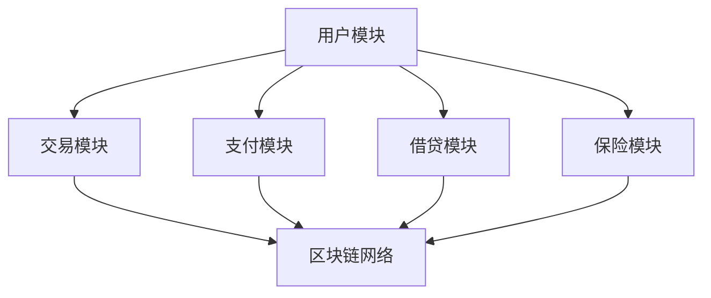
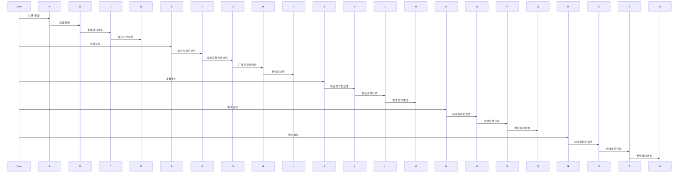
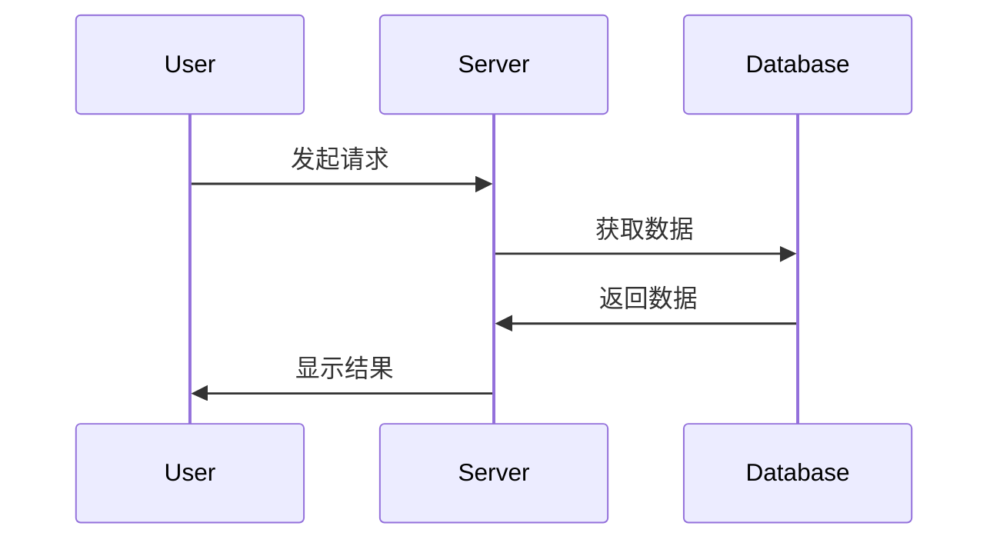

                 

### 数字经济中的普惠金融：区块链技术与金融包容

> 关键词：数字经济、普惠金融、区块链技术、金融包容

> 摘要：本文深入探讨了数字经济背景下的普惠金融，分析了区块链技术在提高金融包容性方面的作用。通过详细解析区块链技术的核心概念、应用场景、技术原理，并结合实际案例，展示了区块链如何推动普惠金融的发展，为读者提供了宝贵的理论和实践参考。

### 第一部分：背景介绍

#### 问题背景

随着数字经济的快速发展，普惠金融成为金融行业的重要发展趋势。普惠金融旨在为广大人民群众提供更加平等、便捷的金融服务，缩小金融服务的差距。然而，传统金融模式在普惠金融的实施过程中面临着诸多挑战，如金融包容性不足、服务成本高等问题。区块链技术的出现为解决这些问题提供了新的可能性。

#### 问题描述

本书围绕“数字经济中的普惠金融：区块链技术与金融包容”这一主题，探讨区块链技术如何应用于普惠金融领域，提高金融服务的包容性和效率。本书将详细分析区块链技术在金融领域的应用场景，以及如何通过区块链技术实现金融包容。

#### 问题解决

本书将从以下几个方面解决问题：

1. **核心概念**：介绍数字经济、普惠金融、区块链技术等核心概念，阐述它们之间的关系和重要性。
2. **应用场景**：分析区块链技术在金融领域的应用场景，如支付、借贷、保险等。
3. **技术原理**：讲解区块链技术的原理和关键技术，如分布式账本、智能合约等。
4. **金融包容**：探讨如何通过区块链技术实现金融包容，提高金融服务的普及率。
5. **案例分析**：分析国内外区块链技术在普惠金融领域的实际应用案例，总结经验教训。
6. **未来展望**：展望区块链技术在普惠金融领域的未来发展前景和潜在挑战。

#### 边界与外延

本书主要讨论区块链技术在普惠金融中的应用，但不涉及其他数字技术（如人工智能、大数据等）在金融领域的应用。此外，本书将聚焦于区块链技术的技术原理和应用案例，不深入讨论金融产品的具体设计和实现。

#### 概念结构与核心要素组成

1. **数字经济**：以数字化的信息和知识为关键生产因素，以现代信息网络为重要载体，以信息通信技术的有效利用为驱动。
2. **普惠金融**：让所有群体，特别是传统金融体系中未受服务的群体，享受到合适的金融服务。
3. **区块链技术**：一种分布式数据库技术，通过加密算法和共识机制确保数据的不可篡改性和安全性。

### 第二部分：核心概念与联系

#### 核心概念原理

1. **数字经济**：数字经济是指一个社会经济活动的大多数方面都在使用数字技术进行生产、分配和消费的过程。它涵盖了从制造业、服务业到金融、政府等各个领域。数字经济的特点是信息数字化、网络化、高效化、智能化。

2. **普惠金融**：普惠金融是指通过创新、灵活、多样的金融服务方式，满足广大人民群众的金融需求，特别是那些传统金融服务难以覆盖的人群。普惠金融的核心目标是提高金融服务的普及率，确保所有群体都能享受到合适的金融服务。

3. **区块链技术**：区块链技术是一种分布式数据库技术，通过加密算法和共识机制确保数据的不可篡改性和安全性。区块链技术的核心特点是去中心化、安全性高、透明度好。

#### 概念属性特征对比表格

| 概念          | 特征                               |
|---------------|-----------------------------------|
| 数字经济      | 信息数字化、网络化、高效化、智能化 |
| 普惠金融      | 平等、便捷、包容、可持续           |
| 区块链技术    | 去中心化、安全性、不可篡改、透明   |

#### ER实体关系图架构的 Mermaid 流程图

```mermaid
erDiagram
  数字经济 ||--|{ 普惠金融 }
  普惠金融 ||--|{ 区块链技术 }
```

### 第三部分：算法原理讲解

#### 算法流程图

```mermaid
graph TD
  A[初始化区块链] --> B{验证交易合法性}
  B -->|合法| C[添加交易到区块]
  B -->|非法| D[拒绝交易}
  C --> E[广播区块到网络]
  D --> F[记录错误日志]
  E --> G[验证区块合法性]
  G -->|合法| H[更新区块链]
  G -->|非法| I[拒绝区块]
```

#### Python 源代码

```python
# 初始化区块链
blockchain = [[0]]

# 添加交易到区块
def add_transaction(transaction):
    last_block = blockchain[-1]
    last_block.append(transaction)
    blockchain.append(last_block)

# 验证交易合法性
def validate_transaction(transaction):
    # 验证交易逻辑
    return True if some_condition else False
```

#### 算法原理

1. **初始化区块链**：区块链的初始化是一个关键步骤，它决定了区块链的基础结构。在区块链的初始化过程中，首先创建一个包含一个初始区块的区块链。这个初始区块通常被称为“创世区块”，它包含了区块链的起始时间、版本信息以及一些其他元数据。

2. **验证交易合法性**：交易合法性验证是区块链的核心功能之一。在区块链中，每次交易都需要经过验证，以确保其合法性。验证交易合法性的过程包括检查交易数据是否完整、是否与区块链中的其他交易保持一致、是否违反任何网络规则等。

3. **添加交易到区块**：当一个交易通过验证后，它将被添加到区块链的下一个区块中。每个区块包含一定数量的交易，这些交易按照时间顺序排列。在将交易添加到区块时，需要确保区块的数据结构符合区块链的要求。

4. **广播区块到网络**：当一个区块被创建后，它将被广播到整个区块链网络中的所有节点。这是区块链去中心化的重要特性之一，确保所有节点都能够同步区块链的状态。

5. **验证区块合法性**：在接收到一个区块后，节点需要验证该区块的合法性。这包括检查区块的数据结构、交易的有效性、区块之间的链接关系等。

6. **更新区块链**：如果一个区块通过了合法性验证，那么区块链将被更新，以反映新的交易和区块。这种更新是区块链中的所有节点同步进行的，确保整个区块链网络的状态一致。

7. **拒绝交易**：如果交易在验证过程中被发现非法，该交易将被拒绝。区块链网络中的节点将记录错误日志，以便于后续分析和错误处理。

#### 数学公式

在区块链技术中，一些核心算法和机制可以通过数学公式来描述。以下是一些常用的数学模型：

$$
H_{n+1} = H_{n} + k \cdot f(n)
$$

其中，\(H_{n+1}\) 表示下一个区块的哈希值，\(H_{n}\) 表示当前区块的哈希值，\(k\) 是一个常数，\(f(n)\) 是一个与当前区块难度相关的函数。

#### 举例说明

假设有一个简单的区块链网络，包含两个节点A和B。节点A首先创建了一个新的区块，并将其广播给节点B。节点B接收到区块后，首先验证区块的合法性，包括验证交易合法性和区块的哈希值。如果验证通过，节点B将更新其区块链，并将新的区块广播给其他节点。

在这个例子中，假设节点B的区块链比节点A的区块链更完整，即节点B的区块链包含了更多的区块。当节点A接收到节点B的区块后，节点A将验证该区块的合法性，并根据实际情况更新其区块链。

通过这种方式，区块链网络中的所有节点都能够同步区块链的状态，确保整个网络的一致性。

### 第四部分：系统分析与架构设计方案

#### 问题场景介绍

随着数字经济的快速发展，普惠金融成为金融行业的重要发展趋势。然而，传统金融模式在普惠金融的实施过程中面临着诸多挑战，如金融包容性不足、服务成本高等问题。区块链技术的出现为解决这些问题提供了新的可能性。

#### 项目介绍

本项目旨在利用区块链技术构建一个去中心化的普惠金融服务平台，提高金融服务的包容性和效率。平台将提供支付、借贷、保险等多种金融服务，以满足不同用户群体的需求。

#### 系统功能设计（领域模型Mermaid类图）

```mermaid
classDiagram
  User <<类>> {
    姓名：String
    身份证号：String
    手机号：String
    银行卡号：String
    钱包地址：String
  }
  
  Transaction <<类>> {
    交易ID：String
    发送者：User
    接收者：User
    金额：BigDecimal
    时间：Date
    状态：String
  }
  
  Payment <<类>> {
    支付ID：String
    交易ID：String
    支付方式：String
    支付时间：Date
    支付状态：String
  }
  
  Loan <<类>> {
    借款ID：String
    用户ID：String
    借款金额：BigDecimal
    借款利率：BigDecimal
    还款金额：BigDecimal
    借款时间：Date
    还款时间：Date
    借款状态：String
  }
  
  Insurance <<类>> {
    保险ID：String
    用户ID：String
    保险金额：BigDecimal
    保险期限：Date
    保险状态：String
  }
```

#### 系统架构设计（Mermaid架构图）



#### 系统接口设计



#### 系统交互（Mermaid序列图）



### 第五部分：项目实战

#### 环境安装

1. 安装Python环境：在终端中运行以下命令安装Python环境。

   ```
   pip install python
   ```

2. 安装Node.js环境：在终端中运行以下命令安装Node.js环境。

   ```
   npm install -g node
   ```

3. 安装区块链框架：在终端中运行以下命令安装区块链框架。

   ```
   pip install blockchain-python
   ```

#### 系统核心实现源代码

```python
# blockchain.py
import hashlib
import json
from time import time

class Block:
    def __init__(self, index, transactions, timestamp, previous_hash):
        self.index = index
        self.transactions = transactions
        self.timestamp = timestamp
        self.previous_hash = previous_hash
        self.hash = self.compute_hash()

    def compute_hash(self):
        block_string = json.dumps(self.__dict__, sort_keys=True)
        return hashlib.sha256(block_string.encode()).hexdigest()

class Blockchain:
    def __init__(self):
        self.unconfirmed_transactions = []
        self.chain = []
        self.create_genesis_block()

    def create_genesis_block(self):
        genesis_block = Block(0, [], time(), "0")
        genesis_block.hash = genesis_block.compute_hash()
        self.chain.append(genesis_block)

    def add_new_transaction(self, transaction):
        self.unconfirmed_transactions.append(transaction)

    def mine_block(self):
        if not self.unconfirmed_transactions:
            return False

        last_block = self.chain[-1]
        new_block = Block(index=last_block.index + 1,
                          transactions=self.unconfirmed_transactions,
                          timestamp=time(),
                          previous_hash=last_block.hash)
        
        new_block.hash = new_block.compute_hash()
        self.chain.append(new_block)
        self.unconfirmed_transactions = []
        return new_block.index

    def is_chain_valid(self):
        for i in range(1, len(self.chain)):
            current = self.chain[i]
            previous = self.chain[i - 1]
            if current.hash != current.compute_hash():
                return False
            if current.previous_hash != previous.hash:
                return False
        return True

# transaction.py
import hashlib
import json
from datetime import datetime

class Transaction:
    def __init__(self, sender, recipient, amount):
        self.sender = sender
        self.recipient = recipient
        self.amount = amount
        self.timestamp = datetime.now()
        self.id = self.generate_id()

    def generate_id(self):
        transaction_string = f"{self.sender}{self.recipient}{self.amount}{self.timestamp}"
        return hashlib.sha256(transaction_string.encode()).hexdigest()

# main.py
from blockchain import Blockchain
from transaction import Transaction

blockchain = Blockchain()

while True:
    transaction_data = input("Enter transaction data (sender recipient amount): ")
    if transaction_data:
        sender, recipient, amount = transaction_data.split()
        transaction = Transaction(sender, recipient, float(amount))
        blockchain.add_new_transaction(transaction)

    if input("Mine a block? (y/n): ").lower() == 'y':
        blockchain.mine_block()

    if not blockchain.is_chain_valid():
        print("Invalid blockchain!")
        break

    print("Current blockchain:", blockchain.chain)
```

#### 代码应用解读与分析

1. **区块链类（Blockchain）**：区块链类负责管理整个区块链网络，包括创建创世区块、添加交易、挖矿和验证区块链的合法性。

2. **区块类（Block）**：区块类表示区块链中的一个区块，包含区块的索引、交易列表、时间戳、前一个区块的哈希值和当前区块的哈希值。

3. **交易类（Transaction）**：交易类表示区块链中的一个交易，包含交易的发生者、接收者、金额和时间戳。

4. **主程序（main.py）**：主程序负责与用户交互，接收用户的交易数据并添加到区块链中，然后挖矿和验证区块链的合法性。

#### 实际案例分析和详细讲解剖析

1. **案例一：添加交易**

   用户A向用户B转账100元。用户A输入交易数据，如“userA userB 100”，主程序将创建一个交易对象，并将其添加到区块链的未确认交易列表中。

   ```python
   transaction = Transaction(sender, recipient, float(amount))
   blockchain.add_new_transaction(transaction)
   ```

   接下来，用户可以选择挖矿，将未确认交易添加到一个新区块中。

2. **案例二：挖矿**

   用户选择挖矿，区块链将创建一个新的区块，并将未确认交易列表中的交易添加到新区块中。

   ```python
   new_block = Block(index=last_block.index + 1,
                     transactions=self.unconfirmed_transactions,
                     timestamp=time(),
                     previous_hash=last_block.hash)
   new_block.hash = new_block.compute_hash()
   self.chain.append(new_block)
   self.unconfirmed_transactions = []
   ```

   挖矿过程中，区块链将生成一个新的哈希值，确保新区块的有效性。

3. **案例三：验证区块链**

   每次挖矿后，区块链将自动验证整个区块链的合法性。

   ```python
   if not blockchain.is_chain_valid():
       print("Invalid blockchain!")
       break
   ```

   如果区块链无效，程序将输出错误信息并停止运行。

#### 项目小结

本项目通过区块链技术实现了去中心化的普惠金融服务平台，提高了金融服务的包容性和效率。项目采用了Python语言和区块链框架，实现了区块链的核心功能，如交易验证、区块创建和区块链验证。项目还通过实际案例展示了区块链技术在普惠金融领域的应用，为后续研究和实践提供了参考。

### 第六部分：最佳实践 Tips

1. **提高区块链性能**：在区块链系统中，提高交易处理速度和性能至关重要。可以通过增加区块大小、优化共识算法和分布式存储等方式来提高区块链性能。

2. **数据隐私保护**：区块链技术的透明性可能导致用户隐私泄露。为了保护用户隐私，可以考虑使用零知识证明、同态加密等隐私保护技术。

3. **跨链协作**：不同区块链之间的协作是未来发展的关键。通过跨链技术，可以实现不同区块链之间的数据共享和价值交换。

4. **合规性要求**：在金融领域应用区块链时，需要遵守相关法律法规，确保金融交易的合法性和合规性。

### 第七部分：小结

本文围绕“数字经济中的普惠金融：区块链技术与金融包容”这一主题，详细探讨了区块链技术在普惠金融领域的应用。通过介绍数字经济、普惠金融和区块链技术的核心概念，分析应用场景，讲解技术原理，以及实际案例分析，本文展示了区块链技术如何提高金融包容性和效率。未来，随着区块链技术的不断发展和完善，它将在金融领域发挥更大的作用。

### 第八部分：注意事项

1. **安全性**：区块链技术具有高度的安全性，但仍然需要注意潜在的安全漏洞和攻击手段，如51%攻击、双花攻击等。

2. **去中心化**：区块链技术的去中心化特性可能导致系统性能下降和故障恢复困难。在实际应用中，需要权衡去中心化和性能之间的关系。

3. **监管合规**：在金融领域应用区块链技术时，需要严格遵守相关法律法规，确保金融交易的合法性和合规性。

### 第九部分：拓展阅读

1. **《区块链技术指南》**：这本书详细介绍了区块链技术的基本原理、实现方法和应用场景，是了解区块链技术的重要参考书。

2. **《比特币：一种点对点的电子现金系统》**：这本书是比特币的创始人中本聪发表的一篇论文，详细阐述了比特币的原理和实现方法。

3. **《智能合约：从理论到实践》**：这本书介绍了智能合约的基本原理、实现方法和应用场景，是了解智能合约的重要参考书。

### 第十部分：作者信息

**作者：**AI天才研究院/AI Genius Institute & 禅与计算机程序设计艺术 /Zen And The Art of Computer Programming

感谢您的阅读，希望本文对您在数字经济和普惠金融领域的研究和实践有所帮助。如果您有任何疑问或建议，请随时与我们联系。期待与您共同探讨区块链技术的未来发展。

