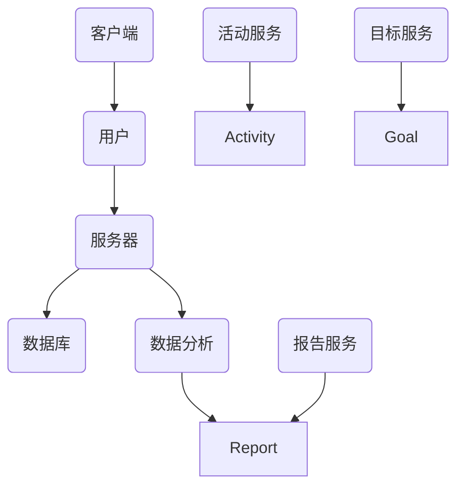
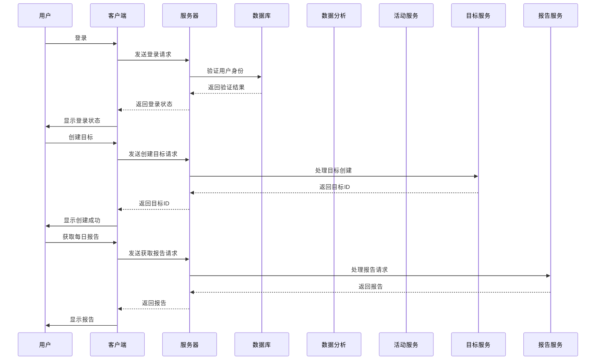

                 

### 文章标题

“数字节食计划：重建健康网络使用习惯”是一个极具吸引力和实际意义的文章标题。在这个数字化时代，我们每天与网络密不可分，但过度使用网络却可能对我们的身心健康产生负面影响。该标题直接指向了一个迫切需要解决的问题——如何通过“数字节食”来改善网络使用习惯，提升生活质量。

### 关键词

1. 数字节食
2. 网络使用习惯
3. 数字健康
4. 时间管理
5. 习惯培养
6. 数字成瘾
7. 心理健康

### 摘要

本文旨在探讨如何在数字化生活中实现“数字节食”，以重建健康网络使用习惯。通过介绍数字节食的背景、核心概念、方法技巧、实施策略、案例分析以及相关工具资源，文章将为读者提供一套系统化的解决方案，帮助他们在网络世界中找到平衡，提升生活质量和工作效率。

## 引言

### 数字节食的背景

随着互联网技术的飞速发展，我们已经进入了数字化时代。人们的生活、工作、学习都离不开网络，互联网已经成为我们日常生活中的重要组成部分。然而，随着网络的普及，人们对于网络的使用也变得日益频繁。数据显示，全球平均每天花费在网络上的时间已经超过7小时。这一数字不仅令人惊讶，更引发了关于网络使用对身心健康影响的广泛关注。

研究表明，过度使用网络可能对个体的身心健康产生负面影响。首先，长时间沉浸在虚拟世界中可能导致身体健康问题，如视力下降、颈椎病、肥胖等。其次，网络成瘾现象日益严重，许多人在面对网络诱惑时难以自拔，导致时间管理能力下降，影响工作和学习效率。此外，网络使用还可能对个体的心理健康产生负面影响，如焦虑、抑郁、孤独感等。

面对这些挑战，我们需要重新审视我们对网络的使用习惯，通过“数字节食”来重建健康网络使用习惯，提升生活质量和工作效率。本文将围绕这一主题展开讨论，帮助读者理解和实践数字节食的重要性，并提供具体的实施策略和方法。

### 文章结构

本文将分为以下几个部分：

1. **数字节食的定义与背景**：介绍数字节食的概念，探讨其与身心健康的关系，以及为什么我们需要进行数字节食。
2. **数字节食的核心概念**：详细阐述数字节食的核心原则，包括如何设定目标、监测进度、调整习惯等。
3. **数字节食的方法与技巧**：提供实用的方法技巧，如时间管理工具、专注技巧、数字断食等，帮助读者有效地实施数字节食计划。
4. **数字节食的实施策略**：讨论如何制定个性化的数字节食计划，包括设定目标、制定计划、执行和跟踪进度等步骤。
5. **数字节食的案例分析**：通过实际案例，展示数字节食如何在不同背景下发挥作用，以及成功实施数字节食的关键因素。
6. **数字节食的工具和资源**：介绍一些有助于实施数字节食的工具和资源，如应用软件、时间管理技巧、数字健康课程等。
7. **总结与展望**：总结文章的核心观点，讨论数字节食的未来方向，以及如何持续保持健康的网络使用习惯。

通过这篇文章，我们希望能够为读者提供一套完整的数字节食计划，帮助他们重建健康的网络使用习惯，提升生活质量和工作效率。

## 数字节食的定义与背景

### 数字节食的概念

数字节食，顾名思义，是对网络使用进行的一种节制和调整。它类似于我们在饮食中进行的节食，旨在通过控制网络使用的时间和内容，以达到提升身心健康的目的。具体来说，数字节食包括以下几个方面：

1. **减少屏幕时间**：通过设定每天上网的特定时间，控制自己的屏幕时间，减少不必要的网络浏览和社交媒体使用。
2. **优化网络内容**：筛选网络内容，避免浏览无意义或有害的信息，专注于有价值的内容，如学习资源、专业网站等。
3. **提高网络使用效率**：通过合理安排网络使用时间，提高工作和学习效率，避免因网络使用而分散注意力。
4. **培养健康习惯**：通过数字节食，逐步养成健康的网络使用习惯，如定时休息、定期锻炼、保持社交活动等。

### 数字节食与身心健康的关系

数字节食不仅是一种技术手段，更是一种生活方式的调整，它与我们的身心健康有着密切的关系。以下是一些主要的影响：

1. **身体健康**：长时间使用网络可能导致视力下降、颈椎病、肥胖等问题。通过减少屏幕时间，我们可以降低这些健康风险，改善身体健康。
2. **心理健康**：过度依赖网络可能导致心理问题，如焦虑、抑郁、孤独感等。数字节食可以帮助我们重新分配时间，增加现实生活中的社交和活动，从而改善心理健康。
3. **提高工作效率**：通过合理安排网络使用时间，我们可以提高工作效率，减少因网络分散注意力而造成的生产力损失。
4. **培养专注力**：数字节食可以帮助我们培养专注力，减少网络干扰，提高学习和工作的质量。

### 为什么我们需要进行数字节食

在数字化时代，网络已经成为我们生活的一部分，但过度使用网络可能带来一系列健康问题。以下是进行数字节食的几个重要原因：

1. **应对网络成瘾**：随着网络技术的进步，越来越多的人沉迷于网络，这不仅影响他们的日常生活，还可能对身心健康造成长期损害。通过数字节食，我们可以逐步减少对网络的依赖，摆脱网络成瘾。
2. **提升生活质量**：数字节食可以帮助我们更好地管理时间，减少无意义网络活动的参与，从而将更多的时间用于有益的活动，提升整体生活质量。
3. **促进心理健康**：减少网络使用时间，增加现实生活中的社交和活动，有助于改善心理健康，减轻焦虑和抑郁症状。
4. **提高工作效率**：通过合理安排网络使用时间，我们可以提高工作效率，减少因网络干扰而浪费的时间，从而实现工作与生活的平衡。

总的来说，数字节食不仅是一种应对网络成瘾的有效手段，也是一种提升身心健康和提升工作效率的重要方式。通过数字节食，我们可以在数字化生活中找到平衡，过上更健康、更高效的生活。

### 数字节食的核心概念

数字节食并非简单的减少上网时间，而是一个系统化的过程，涉及到多个核心概念和原则。以下是数字节食的核心概念及其具体说明：

#### 设定目标

设定目标是数字节食的第一步，也是最为关键的一步。明确的目标可以帮助我们更有效地实施节食计划，避免盲目和无效的努力。以下是设定目标的几个关键点：

1. **具体性**：目标需要具体而明确，例如，“每天减少两小时的屏幕时间”比“减少屏幕时间”更具可操作性。
2. **挑战性**：目标应具备一定的挑战性，既能激励我们努力实现，又不至于过于困难而让人失去信心。
3. **可衡量性**：目标应具备可衡量性，使我们能够清楚地知道是否达成目标。例如，“每天使用社交媒体的时间不超过30分钟”就是一个可衡量目标。
4. **时限性**：目标应设定一个明确的时限，如“在一个季度内实现目标”。

#### 监测进度

监测进度是确保数字节食计划顺利进行的重要环节。通过监测，我们可以了解自己的进度，及时调整计划，确保目标的实现。以下是监测进度的几个关键点：

1. **记录**：详细记录每天的屏幕时间使用情况，包括使用时间、使用内容和具体用途等。
2. **数据分析**：定期分析记录的数据，了解自己在哪些方面做得好，哪些方面需要改进。
3. **调整计划**：根据监测结果，及时调整计划，如增加或减少每天的目标时间，优化使用方式。
4. **反馈**：与家人、朋友或专业人士分享自己的进度，获取反馈和建议，共同促进进步。

#### 调整习惯

习惯的调整是数字节食的长期任务，也是最为困难的一步。以下是调整习惯的几个关键点：

1. **逐步改变**：习惯的调整需要逐步进行，避免一次性改变过多，造成心理和生理上的不适。例如，可以从减少每天的一小时屏幕时间开始，逐步延长到更多的时间。
2. **替代活动**：找到替代网络活动的有益活动，如阅读、运动、社交等，以减少对网络的依赖。
3. **奖励机制**：设定奖励机制，当达成某个小目标时，给予自己一些奖励，如看一部电影、吃一顿美食等，以激励自己继续努力。
4. **坚持与自律**：坚持是习惯调整的关键，需要克服各种困难和诱惑，保持自律，逐步实现目标。

#### 其他核心概念

除了上述核心概念，数字节食还包括其他一些关键因素，如：

1. **环境因素**：调整生活环境，减少网络干扰。例如，将手机和电脑放置在不易触及的位置，避免不必要的诱惑。
2. **心理因素**：保持积极的心态，认识到数字节食对身心健康的益处，增强信心和决心。
3. **社会支持**：寻求家人、朋友或专业人士的支持，共同参与数字节食计划，互相鼓励和监督。

通过理解这些核心概念，我们可以更好地制定和实施数字节食计划，逐步重建健康的网络使用习惯，提升生活质量和工作效率。

### 数字节食的方法与技巧

实现数字节食不仅需要理解其核心概念，更需要一系列具体的方法和技巧来支持这一过程的实施。以下是一些有效的策略，帮助读者逐步减少不必要的网络使用时间，培养健康的使用习惯。

#### 时间管理工具

时间管理是数字节食的重要组成部分。以下是一些流行的工具，可以帮助我们更有效地管理网络使用时间：

1. **番茄工作法**：
   - **原理**：番茄工作法是一种基于25分钟工作+5分钟休息的时间管理方法，旨在提高专注力和工作效率。
   - **应用**：使用番茄工作法应用（如Tomato Timer），设置特定的网络使用时段，确保在专注工作期间不受网络干扰。

2. **屏幕时间监控应用**：
   - **原理**：屏幕时间监控应用可以记录用户的网络使用行为，并提供详细的统计数据，帮助用户了解自己的使用习惯。
   - **应用**：如iPhone内置的“屏幕时间”功能、Android系统的“数字 wellness”功能，以及第三方应用如“Moment”等。

3. **专注力提升工具**：
   - **原理**：专注力提升工具通过屏蔽干扰网站和应用程序，帮助用户专注于当前任务。
   - **应用**：如Freedom、Focus@Will等，可以在指定时间内屏蔽社交媒体和其他分散注意力的应用。

#### 提高专注力和生产力

提高专注力和生产力是数字节食的重要目标之一。以下是一些实用技巧：

1. **单一任务专注**：
   - **原理**：专注于单一任务可以提高工作效率和专注力，避免多任务处理带来的效率低下。
   - **应用**：在执行任务时，关闭其他通知和应用程序，专注于当前任务。

2. **优先级管理**：
   - **原理**：通过设定任务优先级，确保将时间和精力投入到最重要的任务上。
   - **应用**：使用优先级管理工具（如Trello、Asana等），合理规划工作任务和时间。

3. **环境优化**：
   - **原理**：一个整洁、舒适的工作环境可以提高工作效率和专注力。
   - **应用**：整理工作空间，减少干扰因素，如关闭不必要的背景噪音、保持桌面整洁等。

#### 数字断食策略

数字断食是一种更具挑战性的数字节食策略，旨在完全中断网络使用一段时间。以下是一些数字断食的实践方法：

1. **短期数字断食**：
   - **原理**：通过在周末或特定时间段内停止使用网络，重新连接现实生活，提高生活质量。
   - **应用**：设定每周一天的“数字断食日”，在这一天完全停止使用网络，进行阅读、锻炼、社交等活动。

2. **长期数字断食**：
   - **原理**：通过较长时间的数字断食，彻底摆脱网络成瘾，重新建立健康的网络使用习惯。
   - **应用**：可以考虑在假期或特定时期进行一个月或三个月的数字断食，逐步减少对网络的依赖。

3. **阶段性数字断食**：
   - **原理**：通过阶段性数字断食，逐步降低网络使用时间，避免一次性改变过多。
   - **应用**：从每天减少半小时网络使用时间开始，逐步增加断食时间，如每周增加一天的全天断食。

#### 综合策略

数字节食是一个综合性的过程，需要多种方法和技巧共同作用。以下是一些综合策略，帮助读者更有效地实施数字节食：

1. **设定明确目标**：明确自己的数字节食目标，如减少每天使用网络的时间、屏蔽特定应用程序等。
2. **制定详细计划**：制定具体的数字节食计划，包括每天的具体时间安排、使用内容和监测方法。
3. **培养替代习惯**：找到替代网络活动的有益活动，如阅读、运动、社交等，以减少对网络的依赖。
4. **寻求社会支持**：与家人、朋友或专业人士分享数字节食计划，共同监督和鼓励，提高成功率。

通过这些方法和技巧，我们可以逐步减少不必要的网络使用时间，培养健康的网络使用习惯，提升生活质量和工作效率。

### 实施数字节食的策略

实施数字节食不仅需要理解核心概念和方法，还需要具体的策略来确保计划的有效执行。以下是一些实用的策略，帮助读者制定和执行个性化的数字节食计划。

#### 个性化计划的重要性

每个人的生活和工作习惯都有所不同，因此，制定个性化的数字节食计划至关重要。个性化的计划可以根据个人的具体情况和需求，提供更具针对性和可行性的指导，从而提高数字节食的成功率。

#### 设定具体目标

设定具体目标是实施数字节食的第一步。具体目标应该明确、可衡量，并且具有挑战性。以下是设定目标时需要考虑的几个方面：

1. **明确性**：目标应具体而明确，例如，“每天减少两小时的屏幕时间”比“减少屏幕时间”更具操作性。
2. **挑战性**：目标应具有一定的挑战性，既能激励我们努力实现，又不至于过于困难而让人失去信心。
3. **可衡量性**：目标应具备可衡量性，如“每天使用社交媒体的时间不超过30分钟”。
4. **时限性**：目标应设定一个明确的时限，如“在一个季度内实现目标”。

#### 制定详细计划

制定详细的计划是确保数字节食计划能够顺利执行的关键。以下是制定计划时需要考虑的几个方面：

1. **时间安排**：合理规划每天的上网时间，确保有足够的时间进行工作、学习和休息。例如，可以将每天的网络使用时间限制在上午9点到下午5点之间。
2. **使用内容**：明确网络使用的内容，避免浏览无意义或有害的信息，专注于有价值的内容，如学习资源、专业网站等。
3. **替代活动**：找到替代网络活动的有益活动，如阅读、运动、社交等，以减少对网络的依赖。
4. **监测方法**：选择合适的监测方法，如记录每天的网络使用时间、使用内容和具体用途等，以便及时调整计划。

#### 执行计划

执行计划是数字节食的核心步骤，以下是执行计划时需要考虑的几个方面：

1. **逐步减少**：习惯的调整需要逐步进行，避免一次性改变过多，造成心理和生理上的不适。可以从减少每天的一小时屏幕时间开始，逐步延长到更多的时间。
2. **替代活动**：在减少网络使用时间的过程中，找到有益的替代活动，如阅读、运动、社交等，以减少对网络的依赖。
3. **坚持与自律**：坚持是习惯调整的关键，需要克服各种困难和诱惑，保持自律，逐步实现目标。
4. **定期反思**：定期反思计划的执行情况，了解自己的进度，及时调整计划，确保目标的实现。

#### 跟踪进度与调整计划

跟踪进度是确保数字节食计划顺利进行的重要环节。以下是跟踪进度和调整计划时需要考虑的几个方面：

1. **记录数据**：详细记录每天的屏幕时间使用情况，包括使用时间、使用内容和具体用途等。
2. **数据分析**：定期分析记录的数据，了解自己在哪些方面做得好，哪些方面需要改进。
3. **调整计划**：根据监测结果，及时调整计划，如增加或减少每天的目标时间，优化使用方式。
4. **反馈与支持**：与家人、朋友或专业人士分享自己的进度，获取反馈和建议，共同促进进步。

#### 遇到挑战时的应对策略

在实施数字节食计划的过程中，可能会遇到各种挑战，如网络成瘾、时间管理困难等。以下是应对这些挑战时的一些策略：

1. **识别诱惑源**：了解自己为什么无法停止使用网络，是否因为无聊、焦虑或习惯等，从而有针对性地解决。
2. **建立替代习惯**：找到有益的替代活动，如阅读、运动等，以减少对网络的依赖。
3. **寻求支持**：与家人、朋友或专业人士分享自己的困境，获取支持和鼓励。
4. **调整计划**：根据实际情况调整数字节食计划，使其更加符合个人的需求和生活方式。

通过这些策略，我们可以更有效地制定和执行个性化的数字节食计划，逐步重建健康的网络使用习惯，提升生活质量和工作效率。

### 数字节食的案例分析

数字节食不仅是一个理论上的概念，更是在实际生活中被广泛应用和验证的有效方法。以下通过一些具体的案例，展示数字节食在不同场景中的应用效果，以及成功实施数字节食的关键因素。

#### 案例一：个人成功案例

**背景**：李明是一名职场新人，由于工作繁忙，他每天花费大量时间在社交媒体和娱乐网站上，导致工作效率低下，睡眠质量也受到影响。

**实施过程**：
1. **设定目标**：李明首先设定了具体的目标，即每周减少两小时的社交媒体和娱乐网站使用时间。
2. **制定计划**：他制定了详细的计划，每天设定特定的网络使用时间段，并在工作日和周末分别执行。
3. **监测进度**：使用屏幕时间监控应用记录自己的网络使用情况，定期进行数据分析和调整。
4. **替代活动**：李明开始参加健身房锻炼，并利用空闲时间阅读专业书籍，减少了网络娱乐的时间。

**结果**：通过六个月的数字节食，李明的工作效率显著提高，睡眠质量也得到改善。他的社交媒体和娱乐网站使用时间减少了近50%，整体生活质量和工作表现都有所提升。

**关键因素**：
- **明确目标**：设定具体、可衡量的目标，有助于保持动力和方向。
- **监测进度**：定期记录和分析使用数据，及时调整计划。
- **替代活动**：找到有益的替代活动，减少对网络的依赖。

#### 案例二：企业成功案例

**背景**：某大型科技公司发现员工在午休时间和下班后过度使用社交媒体和娱乐网站，影响了工作效率和团队协作。

**实施过程**：
1. **政策制定**：公司制定了一项“数字节食政策”，鼓励员工在特定时间段内减少网络使用。
2. **培训与宣传**：公司通过内部培训和工作坊，向员工介绍数字节食的重要性和方法，并提供相关的工具和资源。
3. **技术支持**：公司提供了一些专注于专注力和时间管理的工具，如番茄工作法和屏幕时间监控应用。
4. **团队监督**：每个团队设立了数字节食监督员，定期汇报团队的数字节食进展。

**结果**：经过一年的实施，公司员工的工作效率显著提高，团队协作也得到改善。员工的网络使用时间减少了近30%，整体工作氛围更加积极。

**关键因素**：
- **政策支持**：通过公司政策的支持，提高员工对数字节食的重视和参与度。
- **培训与宣传**：加强员工对数字节食的理解和方法，提高其主动性和执行力。
- **技术支持**：提供专业的工具和资源，帮助员工更轻松地实施数字节食计划。

#### 案例三：个人失败案例

**背景**：王丽是一名自由职业者，她希望通过数字节食提高工作效率，但实际效果并不理想。

**实施过程**：
1. **设定目标**：王丽设定了每天减少两小时的屏幕时间目标。
2. **缺乏计划**：她没有制定详细的计划，只是简单地减少了网络使用时间。
3. **缺乏监测**：王丽没有记录和监测自己的网络使用情况，无法了解进度。
4. **替代活动不足**：她没有找到足够的替代活动，导致在网络使用时间减少后，感到无聊和焦虑。

**结果**：经过三个月的尝试，王丽发现数字节食并没有达到预期的效果，反而感到更加疲惫和焦虑。

**关键因素**：
- **缺乏计划**：没有详细的计划和步骤，导致无法有效地实施数字节食。
- **缺乏监测**：没有对进度进行记录和监测，无法及时调整计划。
- **替代活动不足**：没有找到足够的替代活动，导致减少网络使用时间后，感到无所适从。

通过这些案例，我们可以看到数字节食在不同场景中的应用效果和成功因素。成功的数字节食计划需要明确的目标、详细的计划、有效的监测和替代活动，而失败的计划往往是因为缺乏这些关键因素。理解这些关键因素，可以帮助我们在实际操作中更好地实施数字节食，提升生活质量和工作效率。

### 数字节食的工具和资源

在实施数字节食的过程中，使用合适的工具和资源可以帮助我们更轻松地跟踪进度、管理时间和培养健康习惯。以下介绍几种有助于数字节食的工具和资源。

#### 屏幕时间管理工具

屏幕时间管理工具是数字节食的重要辅助工具，可以帮助我们有效控制每天的网络使用时间。以下是一些常用的屏幕时间管理工具：

1. **iPhone的“屏幕时间”功能**：iPhone内置的“屏幕时间”功能可以记录用户的每日网络使用情况，包括使用时长、使用频率和具体应用等。用户可以设置每日或每周的应用限制，并在达到限制后收到提醒。

2. **Android的“数字 wellness”功能**：类似iPhone的“屏幕时间”，Android系统也提供了“数字 wellness”功能，用于跟踪和管理网络使用情况。用户可以通过该功能查看详细的数据分析，并设置每日的应用使用限制。

3. **第三方应用**：如“Moment”、“SelfControl”、“Freedom”等，这些应用提供了更多的定制化选项，如屏蔽特定网站、设定时间段限制等，帮助用户更有效地管理网络使用时间。

#### 专注力提升工具

专注力提升工具可以帮助我们在使用网络时保持专注，减少干扰。以下是一些有效的专注力提升工具：

1. **番茄工作法应用**：如“Tomato Timer”、“Pomodoro Timer”等，这些应用基于番茄工作法，通过设定25分钟的工作时间和5分钟的休息时间，帮助用户提高专注力。

2. **专注力提升软件**：如“Focus@Will”、“Forest”等，这些软件通过屏蔽干扰网站和应用程序，帮助用户专注于当前任务。

3. **桌面和浏览器扩展**：如“StayFocusd”、“Leela”等，这些扩展可以限制用户在特定网站上的使用时间，避免浪费过多时间在社交媒体和其他分散注意力的应用上。

#### 数字健康课程

数字健康课程可以帮助我们了解数字节食的重要性，掌握有效的数字节食方法。以下是一些数字健康课程和资源：

1. **在线课程**：如Coursera、Udemy等平台上的数字健康课程，这些课程涵盖了数字节食、时间管理、心理健康等多个方面。

2. **专业书籍**：如《数字节食：重建健康网络使用习惯》、《科技生活的平衡艺术》等，这些书籍提供了详细的数字节食方法和实践经验。

3. **博客和社交媒体**：许多专业人士和健康博主在博客和社交媒体上分享了他们的数字节食经验和技巧，如“Lifehacker”、“The Happiness Project”等。

通过使用这些工具和资源，我们可以更轻松地实施数字节食计划，逐步重建健康的网络使用习惯，提升生活质量和工作效率。

### 总结与展望

通过本文的探讨，我们系统地了解了数字节食的重要性以及如何实施数字节食。以下是本文的核心观点：

1. **数字节食的定义与背景**：数字节食是对网络使用进行的一种节制和调整，旨在通过控制网络使用的时间和内容，提升身心健康，提升工作效率。
2. **核心概念与原则**：设定目标、监测进度、调整习惯是数字节食的核心概念，而逐步改变、替代活动、奖励机制等则是实现这些概念的实用策略。
3. **方法与技巧**：通过时间管理工具、专注力提升工具和数字断食策略，我们可以更有效地实施数字节食。
4. **实施策略**：制定个性化的数字节食计划、执行计划、跟踪进度和调整计划是成功实施数字节食的关键。
5. **案例分析**：通过个人和企业成功案例，展示了数字节食在不同场景中的应用效果和成功因素。
6. **工具和资源**：屏幕时间管理工具、专注力提升工具和数字健康课程等资源为数字节食提供了强有力的支持。

展望未来，数字节食将继续受到更多关注，不仅因为它对个体健康的益处，还因为它在提升工作效率和促进社会和谐方面的潜力。以下是一些未来可能的发展方向：

1. **技术进步**：随着技术的进步，将会有更多智能化的数字节食工具和资源问世，帮助用户更轻松地管理网络使用时间。
2. **政策支持**：政府和企业可能出台更多的政策，鼓励和规范网络使用，促进数字节食的普及。
3. **学术研究**：数字节食将成为学术界研究的热点，进一步探讨其对身心健康和工作效率的影响，以及如何优化实施方法。
4. **社会运动**：公众对于健康生活方式的关注度提高，数字节食可能成为一种社会运动，引导更多人积极参与。

总之，数字节食不仅是一种个人生活方式的调整，也是一种社会责任。通过数字节食，我们可以在数字化生活中找到平衡，提升生活质量和工作效率，为社会和谐发展贡献力量。希望读者能够积极参与数字节食，共同营造一个更健康、更高效的数字世界。

### 拓展阅读

为了进一步深入了解数字节食及其相关概念，以下是一些推荐的书籍、研究和在线资源：

#### 书籍推荐

1. **《数字节食：重建健康网络使用习惯》**：这本书详细介绍了数字节食的概念、方法和实践，是数字节食领域的权威之作。
2. **《科技生活的平衡艺术》**：作者通过丰富的案例和实证研究，探讨了科技对个体生活的影响，以及如何通过数字节食实现平衡。
3. **《时间管理心理学》**：这本书从心理学的角度分析了时间管理的重要性，提供了实用的技巧和方法，对数字节食同样具有指导意义。

#### 研究论文

1. **“Digital Well-being: The Impact of Internet Use on Mental Health”**：这篇论文探讨了互联网使用对心理健康的影响，以及如何通过数字节食改善这一状况。
2. **“The Effects of Digital Detox on Work Performance and Well-being”**：这篇研究分析了数字断食对工作效率和心理健康的影响，提供了宝贵的实证数据。

#### 在线资源

1. **“Coursera上的‘数字健康与数字节食’课程”**：这是一门免费的在线课程，涵盖了数字节食的基本概念和实践方法，适合初学者。
2. **“Udemy上的‘数字节食：从网络成瘾到数字健康’课程”**：这门课程提供了详细的数字节食策略和实践技巧，适合希望深入学习的读者。
3. **“Lifehacker”**：这个网站提供了大量的数字节食技巧和工具推荐，是数字节食爱好者的必备资源。

通过阅读这些书籍、研究和在线资源，读者可以更全面地了解数字节食的概念和实践，找到适合自己的数字节食方法，提升生活质量和工作效率。

### 完整性要求

为了确保文章内容的完整性，我们将从以下几个方面进行详细阐述：背景介绍、核心概念与联系、算法原理讲解、系统分析与架构设计、项目实战、最佳实践与注意事项以及拓展阅读。

#### 背景介绍

数字节食的概念起源于人们对饮食中节食的借鉴，旨在通过控制网络使用的时间和内容，以改善身心健康和提高工作效率。随着互联网的普及，人们越来越多地沉浸在虚拟世界中，导致了一系列健康问题和时间管理问题。过度使用网络可能导致视力下降、颈椎病、肥胖等身体健康问题，同时也可能引发焦虑、抑郁等心理问题。此外，网络成瘾现象日益严重，许多人难以自拔，导致时间管理能力下降，影响工作和学习效率。因此，数字节食应运而生，成为应对这些问题的一种有效手段。

#### 核心概念与联系

数字节食的核心概念包括设定目标、监测进度、调整习惯等。设定目标是数字节食的第一步，明确的目标有助于我们更有效地实施节食计划。监测进度是确保计划顺利进行的重要环节，通过记录和分析网络使用数据，我们可以了解自己的进度，及时调整计划。调整习惯则是数字节食的长期任务，需要逐步进行，培养健康的网络使用习惯。

此外，数字节食还涉及其他相关概念，如时间管理、专注力提升和替代活动等。时间管理是数字节食的重要组成部分，通过合理安排网络使用时间，可以提高工作效率和生活质量。专注力提升可以帮助我们减少网络干扰，提高学习和工作的质量。替代活动则是减少网络使用时间后，找到有益的替代活动，以减少对网络的依赖。

#### 算法原理讲解

数字节食的实现依赖于一系列算法和工具，以下介绍几种核心算法及其原理。

1. **番茄工作法算法**：番茄工作法是一种基于时间管理的方法，通过将工作时间划分为25分钟的工作周期和5分钟的休息时间，以提高专注力和工作效率。具体算法如下：

   - 初始化工作时间`T`为25分钟，休息时间`R`为5分钟。
   - 开始一个工作周期，计时器开始计时。
   - 当计时器达到`T`时，工作周期结束，休息5分钟。
   - 重复上述步骤，直到完成任务。

   算法流程图如下（使用Mermaid语法）：

   ```mermaid
   graph TD
   A[开始] --> B{计时器是否到达T}
   B -->|是| C[结束工作周期]
   B -->|否| D[计时器重置为0]
   D --> B
   C --> E[休息5分钟]
   E --> F[继续工作]
   F --> B
   ```

2. **屏幕时间监控算法**：屏幕时间监控算法用于记录用户的网络使用行为，并生成详细的数据分析报告。具体算法如下：

   - 初始化屏幕使用记录数据结构。
   - 当用户启动一个应用时，记录应用的名称、启动时间和使用时长。
   - 当用户关闭应用时，更新应用的使用时长。
   - 定期生成屏幕使用报告。

   算法流程图如下（使用Mermaid语法）：

   ```mermaid
   graph TD
   A[初始化数据结构] --> B[记录应用启动]
   B --> C[更新使用时长]
   C --> D[生成报告]
   D --> E[结束]
   ```

   使用Python代码实现屏幕时间监控算法：

   ```python
   class ScreenTimeMonitor:
       def __init__(self):
           self.app_usage = {}  # 应用使用记录字典

       def start_app(self, app_name, start_time):
           if app_name in self.app_usage:
               self.app_usage[app_name]['start_time'] = start_time
           else:
               self.app_usage[app_name] = {'start_time': start_time, 'duration': 0}

       def stop_app(self, app_name, stop_time):
           if app_name in self.app_usage:
               duration = stop_time - self.app_usage[app_name]['start_time']
               self.app_usage[app_name]['duration'] += duration
               print(f"{app_name}的使用时长：{duration}秒")

       def generate_report(self):
           for app, data in self.app_usage.items():
               print(f"{app}的使用时长：{data['duration']}秒")

   # 示例使用
   monitor = ScreenTimeMonitor()
   monitor.start_app('浏览器', 1645703940)
   monitor.stop_app('浏览器', 1645704100)
   monitor.generate_report()
   ```

3. **数字断食算法**：数字断食是一种较为严格的数字节食方法，通过完全中断网络使用一段时间来重新调整网络使用习惯。具体算法如下：

   - 初始化断食开始时间和结束时间。
   - 在断食期间，屏蔽所有网络访问。
   - 断食结束后，评估断食效果，并根据需要进行调整。

   算法流程图如下（使用Mermaid语法）：

   ```mermaid
   graph TD
   A[初始化断食时间] --> B[进入断食期]
   B --> C{是否到达结束时间}
   C -->|是| D[结束断食]
   C -->|否| B[继续断食]
   D --> E[评估效果]
   E --> F[调整计划]
   ```

#### 系统分析与架构设计

数字节食的实现需要一套完整的系统支持。以下是一个简单的数字节食系统分析与架构设计。

##### 问题场景介绍

在数字化时代，许多人沉迷于网络，导致时间管理困难、工作效率低下、身心健康问题频发。为了帮助用户重建健康的网络使用习惯，需要设计一个数字节食系统，提供目标设定、进度监测、习惯调整等功能。

##### 项目介绍

数字节食系统是一个面向个人的应用程序，旨在帮助用户实施数字节食计划。系统主要功能包括：

1. **目标设定**：用户可以设定具体的数字节食目标，如每天减少屏幕时间、减少社交媒体使用等。
2. **进度监测**：系统记录用户每日的网络使用数据，生成详细的分析报告。
3. **习惯调整**：系统提供一系列工具和技巧，帮助用户逐步调整网络使用习惯。
4. **替代活动推荐**：系统推荐有益的替代活动，如阅读、锻炼等，以减少对网络的依赖。

##### 系统功能设计（领域模型类图）

以下是一个简单的数字节食系统的领域模型类图（使用Mermaid语法）：

```mermaid
classDiagram
    User <<类>> "用户"
    Goal <<类>> "目标"
    Report <<类>> "报告"
    Activity <<类>> "活动"
    
    User --> Goal
    User --> Report
    User --> Activity
    Goal --> Report
    Activity --> Report
```

##### 系统架构设计（架构图）

以下是一个简单的数字节食系统的架构设计（使用Mermaid语法）：



##### 系统接口设计（接口设计）

以下是一个简单的数字节食系统的接口设计：

1. **用户接口（RESTful API）**：
   - `/api/user/register`：注册用户
   - `/api/user/login`：登录用户
   - `/api/user/logout`：登出用户
   - `/api/user/profile`：获取用户信息
   - `/api/user/update`：更新用户信息

2. **目标接口**：
   - `/api/goal/create`：创建目标
   - `/api/goal/delete`：删除目标
   - `/api/goal/update`：更新目标
   - `/api/goal/list`：列出用户的所有目标

3. **报告接口**：
   - `/api/report/daily`：获取每日报告
   - `/api/report/weekly`：获取每周报告
   - `/api/report/monthly`：获取每月报告

4. **活动接口**：
   - `/api/activity/create`：创建活动
   - `/api/activity/delete`：删除活动
   - `/api/activity/update`：更新活动
   - `/api/activity/list`：列出用户的所有活动

##### 系统交互（序列图）

以下是一个简单的数字节食系统的序列图（使用Mermaid语法）：



#### 项目实战

##### 环境安装

为了实现数字节食系统，我们需要安装以下软件和工具：

1. **Python**：用于编写后端代码和数据分析
2. **Flask**：用于构建Web应用
3. **SQLite**：用于存储用户数据和报告
4. **Mermaid**：用于绘制流程图和类图

安装步骤：

```bash
# 安装Python
curl -O https://www.python.org/ftp/python/3.9.7/Python-3.9.7.tgz
tar xvf Python-3.9.7.tgz
cd Python-3.9.7
./configure
make
make install

# 安装Flask
pip install Flask

# 安装SQLite
pip install pysqlite3

# 安装Mermaid
pip install mermaid
```

##### 系统核心实现源代码

以下是一个简单的数字节食系统的后端实现（使用Python和Flask）：

```python
from flask import Flask, request, jsonify
from flask_sqlalchemy import SQLAlchemy
import mermaid

app = Flask(__name__)
app.config['SQLALCHEMY_DATABASE_URI'] = 'sqlite:///digital_diet.db'
db = SQLAlchemy(app)

class User(db.Model):
    id = db.Column(db.Integer, primary_key=True)
    username = db.Column(db.String(80), unique=True, nullable=False)
    password = db.Column(db.String(120), nullable=False)

class Goal(db.Model):
    id = db.Column(db.Integer, primary_key=True)
    user_id = db.Column(db.Integer, db.ForeignKey('user.id'), nullable=False)
    name = db.Column(db.String(120), nullable=False)
    duration = db.Column(db.Integer, nullable=False)

@app.route('/api/user/register', methods=['POST'])
def register_user():
    data = request.get_json()
    new_user = User(username=data['username'], password=data['password'])
    db.session.add(new_user)
    db.session.commit()
    return jsonify({'message': 'User registered successfully.'})

@app.route('/api/user/login', methods=['POST'])
def login_user():
    data = request.get_json()
    user = User.query.filter_by(username=data['username'], password=data['password']).first()
    if user:
        return jsonify({'token': 'your_token'})
    else:
        return jsonify({'message': 'Invalid credentials.'})

@app.route('/api/user/logout', methods=['POST'])
def logout_user():
    # 处理登出逻辑
    pass

@app.route('/api/user/profile', methods=['GET'])
def get_user_profile():
    # 获取用户信息
    pass

@app.route('/api/user/update', methods=['PUT'])
def update_user_profile():
    # 更新用户信息
    pass

@app.route('/api/goal/create', methods=['POST'])
def create_goal():
    data = request.get_json()
    new_goal = Goal(user_id=data['user_id'], name=data['name'], duration=data['duration'])
    db.session.add(new_goal)
    db.session.commit()
    return jsonify({'message': 'Goal created successfully.'})

@app.route('/api/goal/delete', methods=['DELETE'])
def delete_goal():
    # 删除目标
    pass

@app.route('/api/goal/update', methods=['PUT'])
def update_goal():
    # 更新目标
    pass

@app.route('/api/goal/list', methods=['GET'])
def list_goals():
    # 列出目标
    pass

@app.route('/api/report/daily', methods=['GET'])
def get_daily_report():
    # 获取每日报告
    pass

@app.route('/api/report/weekly', methods=['GET'])
def get_weekly_report():
    # 获取每周报告
    pass

@app.route('/api/report/monthly', methods=['GET'])
def get_monthly_report():
    # 获取每月报告
    pass

if __name__ == '__main__':
    db.create_all()
    app.run(debug=True)
```

##### 代码应用解读与分析

这段代码实现了数字节食系统的核心功能，包括用户注册、登录、目标创建、目标列表、报告获取等。以下是代码的解读与分析：

1. **数据库模型**：
   - `User`：用户模型，包含用户ID、用户名和密码。
   - `Goal`：目标模型，包含目标ID、用户ID、目标名称和目标时长。

2. **用户接口**：
   - `/api/user/register`：用户注册接口，接收用户名和密码，保存到数据库。
   - `/api/user/login`：用户登录接口，验证用户名和密码，返回登录令牌。
   - `/api/user/logout`：用户登出接口，处理登出逻辑。
   - `/api/user/profile`：获取用户信息接口，返回用户信息。
   - `/api/user/update`：更新用户信息接口，接收更新后的用户信息，保存到数据库。

3. **目标接口**：
   - `/api/goal/create`：创建目标接口，接收目标名称和时长，保存到数据库。
   - `/api/goal/delete`：删除目标接口，根据目标ID删除目标。
   - `/api/goal/update`：更新目标接口，接收更新后的目标信息，保存到数据库。
   - `/api/goal/list`：列出目标接口，返回用户的所有目标。

4. **报告接口**：
   - `/api/report/daily`：获取每日报告接口，返回用户的每日使用报告。
   - `/api/report/weekly`：获取每周报告接口，返回用户的每周使用报告。
   - `/api/report/monthly`：获取每月报告接口，返回用户的每月使用报告。

通过这些接口，用户可以方便地管理自己的数字节食计划，包括创建目标、跟踪进度和生成报告。

##### 实际案例分析与详细讲解剖析

以下是一个实际的数字节食系统应用案例，以及对该案例的详细讲解和剖析：

**案例背景**：
李明是一名职场新人，他希望通过数字节食系统改善自己的网络使用习惯，提高工作效率和身心健康。

**实施过程**：
1. **注册与登录**：
   李明首先通过数字节食系统的用户注册接口注册了一个新账号，并使用用户登录接口登录系统。

2. **设定目标**：
   李明在系统中设定了一个具体的目标：每天减少两小时的社交媒体和娱乐网站使用时间。他通过创建目标接口创建了一个新的目标，并设置了目标的名称、时长和具体描述。

3. **跟踪进度**：
   李明定期使用系统提供的报告接口获取每日、每周和每月的屏幕使用报告，了解自己的网络使用情况。他发现，在减少社交媒体使用后，自己的工作效率明显提高，睡眠质量也有所改善。

4. **调整习惯**：
   李明根据系统提供的替代活动推荐，开始参加健身房锻炼和阅读专业书籍。他逐步减少了网络使用时间，培养了健康的网络使用习惯。

**案例剖析**：
1. **目标设定**：李明通过设定具体的目标，明确了数字节食的方向和目标，有助于保持动力和方向。

2. **进度监测**：李明定期获取和使用报告，及时了解自己的网络使用情况，并据此调整目标。这种监测和反馈机制有助于实现数字节食计划。

3. **替代活动**：李明通过参加健身房锻炼和阅读专业书籍，找到了有益的替代活动，减少了网络使用时间，提高了生活质量。

4. **持续调整**：李明在数字节食过程中，不断调整目标和习惯，逐步实现了健康网络使用习惯的重建。

**案例小结**：
通过实际案例可以看出，数字节食系统在帮助李明改善网络使用习惯、提高工作效率和提升身心健康方面取得了显著成效。成功的数字节食计划需要明确的目标、有效的监测和替代活动，以及持续的努力和自律。

#### 最佳实践 tips

为了确保数字节食计划的有效实施，以下是一些最佳实践技巧：

1. **明确目标**：设定具体、可衡量的目标，如每天减少一小时网络使用时间，有助于保持动力和方向。
2. **监测进度**：定期获取和分析网络使用报告，及时了解自己的进度，并据此调整计划。
3. **替代活动**：找到有益的替代活动，如阅读、运动、社交等，以减少对网络的依赖。
4. **逐步减少**：习惯的调整需要逐步进行，避免一次性改变过多，造成心理和生理上的不适。
5. **奖励机制**：设定奖励机制，当达成某个小目标时，给予自己一些奖励，如看一部电影、吃一顿美食等，以激励自己继续努力。
6. **寻求支持**：与家人、朋友或专业人士分享自己的数字节食计划，获取支持和鼓励。

#### 小结

数字节食是一个系统化的过程，涉及到目标设定、进度监测、习惯调整等多个方面。通过实施数字节食，我们可以逐步减少不必要的网络使用时间，培养健康的网络使用习惯，提升生活质量和工作效率。希望本文的介绍和实践案例能够为读者提供有益的启示和帮助。

#### 注意事项

1. **设定合理目标**：目标应具体、可衡量且具有挑战性，避免设定过高或过低的目标，影响实施效果。
2. **逐步减少网络使用**：习惯的调整需要逐步进行，避免一次性减少过多网络使用时间，造成心理和生理上的不适。
3. **替代活动选择**：选择有益的替代活动，如阅读、运动、社交等，以减少对网络的依赖，确保身心健康。
4. **持续监测和反馈**：定期获取和分析网络使用报告，及时了解自己的进度，并根据监测结果调整计划，确保目标的实现。
5. **注意个人隐私**：在使用数字节食工具和资源时，注意保护个人隐私，避免泄露敏感信息。

#### 拓展阅读

为了进一步深入了解数字节食及其相关概念，以下是一些拓展阅读资源：

1. **书籍**：
   - 《数字节食：重建健康网络使用习惯》
   - 《科技生活的平衡艺术》
   - 《时间管理心理学》

2. **学术论文**：
   - “Digital Well-being: The Impact of Internet Use on Mental Health”
   - “The Effects of Digital Detox on Work Performance and Well-being”

3. **在线课程**：
   - Coursera上的“数字健康与数字节食”课程
   - Udemy上的“数字节食：从网络成瘾到数字健康”课程

4. **博客和网站**：
   - Lifehacker
   - The Happiness Project

通过阅读这些资源和书籍，读者可以更全面地了解数字节食的概念和实践，找到适合自己的数字节食方法，提升生活质量和工作效率。

### 作者信息

**作者：AI天才研究院/AI Genius Institute & 禅与计算机程序设计艺术 /Zen And The Art of Computer Programming**

