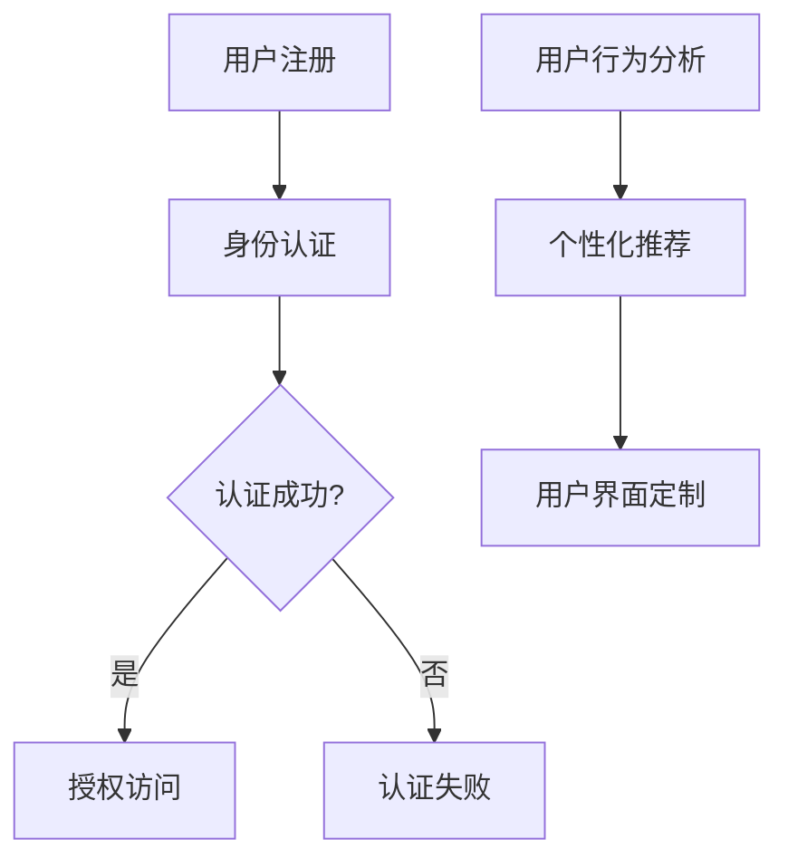
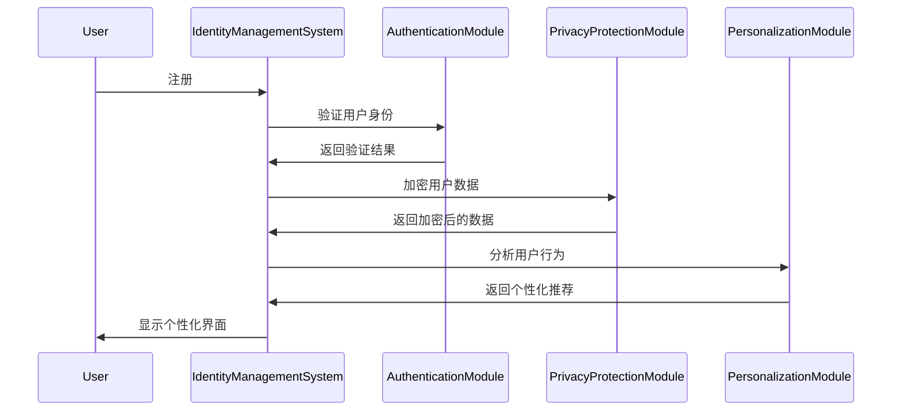
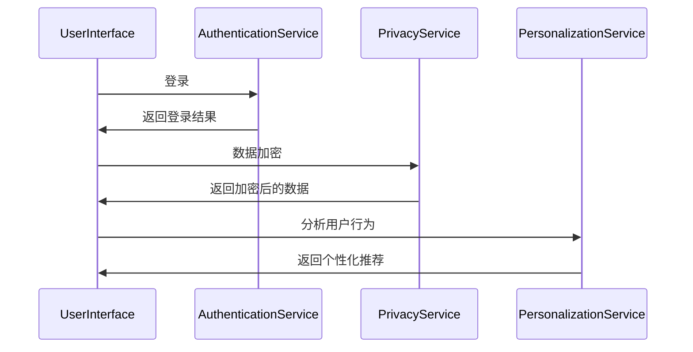
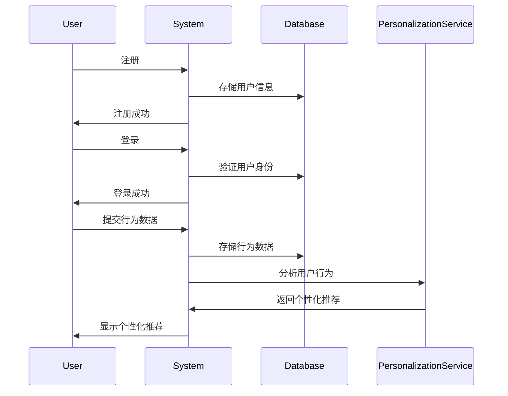

                 

# 数字身份管理系统：虚拟世界中的自我呈现平台

## 关键词

- 数字身份管理系统
- 虚拟世界
- 自我呈现平台
- 身份认证
- 隐私保护
- 个性化呈现

## 摘要

本文深入探讨了数字身份管理系统在虚拟世界中的重要性，以及其作为自我呈现平台的角色。首先，文章介绍了数字身份管理系统的核心概念和背景，分析了虚拟世界中身份管理和隐私保护的挑战。接着，文章详细阐述了数字身份管理系统的核心概念与联系，包括数字身份、身份认证、隐私保护和个性化呈现等。然后，文章通过算法原理讲解，展示了如何实现数字身份管理系统的关键功能。此外，文章还介绍了系统分析与架构设计方案，包括项目实战和最佳实践。最后，文章总结了数字身份管理系统的重要性和未来发展方向，为读者提供了拓展阅读资源。

## 第一部分：背景介绍

### 核心概念

#### 数字身份管理系统

数字身份管理系统（Digital Identity Management System，简称DIMS）是指通过技术手段对个人或实体的数字身份进行管理、认证和授权的系统。数字身份管理系统旨在确保在虚拟世界中的自我呈现与真实身份的一致性，提升安全性，同时提高用户体验。数字身份管理系统的核心目的是实现以下目标：

1. **身份认证与授权**：采用多因素认证、生物识别等技术，确保用户身份的真实性和安全性。
2. **隐私保护**：通过加密技术、隐私计算等手段，保障用户在虚拟世界中的隐私。
3. **个性化呈现**：利用大数据分析和人工智能技术，根据用户的行为和偏好，生成个性化的虚拟世界体验。

#### 虚拟世界中的自我呈现平台

虚拟世界中的自我呈现平台（Virtual World Self-Presentation Platform，简称VWSP）是指在虚拟现实（Virtual Reality，VR）、社交媒体等虚拟环境中，用户通过数字身份展示自己个性、兴趣、能力和行为等特征的平台。自我呈现平台的核心功能包括：

1. **个性展示**：用户通过自定义头像、昵称、个人资料等方式展示自己的个性。
2. **兴趣分享**：用户在虚拟世界中分享自己的兴趣、爱好和经历。
3. **能力证明**：用户通过虚拟技能展示、成就证明等方式展示自己的能力。
4. **互动交流**：用户在虚拟环境中与其他用户进行互动交流，建立社交关系。

### 问题背景

随着互联网和虚拟技术的发展，人们在虚拟世界中的活动日益增多。虚拟现实技术、增强现实技术（Augmented Reality，AR）和社交媒体平台的发展，为用户提供了丰富多样的虚拟体验。然而，虚拟世界中的身份管理和隐私保护问题也逐渐凸显。传统的身份认证方式已经无法满足虚拟环境中的多样化需求，用户对身份安全性和个性化的要求不断提升。

#### 问题背景

在虚拟世界中，用户如何确保其数字身份的安全性和真实性？如何实现用户在虚拟世界中的个性化呈现？这些问题成为了数字身份管理系统设计和实现的关键挑战。

### 问题描述

在虚拟世界中，用户面临以下主要问题：

1. **身份安全**：虚拟世界中的用户身份可能被伪造、篡改或冒用，导致用户隐私泄露、财产损失和虚拟犯罪。
2. **隐私保护**：虚拟世界中的用户活动会产生大量个人数据，如何有效保护这些数据不被滥用和泄露成为一大挑战。
3. **个性化呈现**：用户在虚拟世界中的身份和形象如何根据其行为和偏好进行个性化定制，以满足用户体验和需求。

### 问题解决

数字身份管理系统通过以下方式解决上述问题：

1. **身份认证与授权**：采用多因素认证、生物识别等技术，确保用户身份的真实性和安全性。例如，用户可以使用指纹识别、面部识别、密码认证等多种方式进行身份验证，提高安全性。
2. **隐私保护**：通过加密技术、隐私计算等手段，保障用户在虚拟世界中的隐私。例如，用户的个人信息可以采用加密存储和传输，防止数据泄露。
3. **个性化呈现**：利用大数据分析和人工智能技术，根据用户的行为和偏好，生成个性化的虚拟世界体验。例如，系统可以根据用户的历史行为数据，推荐个性化内容、定制用户界面等。

### 边界与外延

数字身份管理系统不仅涉及虚拟世界，还与现实世界中的身份认证系统相互关联。此外，数字身份管理系统还需要考虑跨平台的兼容性和互操作性。例如，用户在虚拟世界中的身份信息需要与真实世界中的身份信息进行同步，确保数据的一致性和完整性。

### 概念结构与核心要素组成

数字身份管理系统的核心结构包括以下要素：

1. **用户身份注册与管理**：用户在虚拟世界中的注册和身份信息管理，包括用户名的选择、头像的设置、个人资料的填写等。
2. **认证与授权机制**：确保用户身份的可信性，并控制对虚拟世界资源的访问权限。常用的认证方式包括用户名密码、短信验证码、指纹识别、面部识别等。
3. **隐私保护机制**：通过加密技术、隐私计算等手段，保障用户在虚拟世界中的隐私。例如，用户的个人信息可以采用加密存储和传输，防止数据泄露。
4. **用户行为分析与个性化推荐**：基于用户的行为数据，提供个性化的虚拟世界体验。例如，系统可以根据用户的历史行为数据，推荐个性化内容、定制用户界面等。

## 第二部分：核心概念与联系

### 核心概念原理

#### 数字身份

数字身份是指在虚拟世界中，用户的个人代表，包括用户名、头像、个人信息等。数字身份是用户在虚拟世界中的身份标识，用于区分不同的用户。数字身份通常具有以下特点：

1. **唯一性**：每个用户在虚拟世界中拥有唯一的数字身份，确保用户之间的区分。
2. **一致性**：用户的数字身份在不同虚拟环境中的应用应该保持一致，确保用户在虚拟世界中的体验连贯。
3. **可追溯性**：用户的数字身份应该能够追踪到其真实身份，确保身份的可信性。

#### 身份认证

身份认证是确认用户身份的过程，确保只有合法用户才能访问虚拟世界中的资源和功能。身份认证通常采用以下方法：

1. **用户名密码**：用户使用用户名和密码进行身份验证，是最常见的认证方式。
2. **多因素认证**：结合多种认证方式，如密码、短信验证码、指纹识别、面部识别等，提高安全性。
3. **生物识别**：通过用户的生物特征，如指纹、面部、虹膜等，进行身份验证，确保只有合法用户才能访问。

#### 隐私保护

隐私保护是保障用户在虚拟世界中的个人隐私不被泄露的重要手段。隐私保护通常采用以下技术：

1. **数据加密**：对用户的数据进行加密存储和传输，防止数据泄露。
2. **匿名化**：对用户的数据进行匿名化处理，去除可识别的个人信息，保护用户隐私。
3. **隐私计算**：在数据处理过程中，采用隐私计算技术，确保数据在传输和处理过程中不被泄露。

#### 个性化呈现

个性化呈现是根据用户的行为和偏好，生成个性化的虚拟世界体验。个性化呈现通常基于以下技术：

1. **大数据分析**：通过分析用户的历史行为数据，了解用户的兴趣、偏好和需求，生成个性化推荐。
2. **人工智能**：利用人工智能技术，如机器学习、深度学习等，自动生成个性化的虚拟世界体验。
3. **用户界面定制**：根据用户的偏好和需求，定制虚拟世界的用户界面，提高用户体验。

### 概念属性特征对比表格

| 概念       | 定义                             | 关键特征                     | 应用场景                       |
|------------|----------------------------------|------------------------------|--------------------------------|
| 数字身份   | 虚拟世界中的个人代表             | 一致性、可追溯性             | 社交媒体、虚拟现实、在线游戏   |
| 身份认证   | 确认用户身份的过程               | 安全性、简便性               | 登录系统、访问资源             |
| 隐私保护   | 防止用户信息泄露的技术措施       | 加密、匿名化、隐私计算       | 在线交易、数据共享             |
| 个性化呈现 | 根据用户行为生成个性化体验       | 可定制性、个性化             | 社交媒体、推荐系统、在线购物   |

### ER实体关系图架构

以下是数字身份管理系统的ER实体关系图：

```mermaid
erDiagram
    User ||--|{ DigitalIdentity }
    User ||--|{ Authentication }
    User ||--|{ PrivacyProtection }
    User ||--|{ Personalization }
```

- **User**（用户）: 系统的核心实体，所有其他实体都与用户直接相关。
- **DigitalIdentity**（数字身份）: 代表用户在虚拟世界中的身份信息。
- **Authentication**（认证）: 与用户身份验证相关的信息。
- **PrivacyProtection**（隐私保护）: 与用户隐私保护相关的措施和策略。
- **Personalization**（个性化呈现）: 与用户个性化呈现相关的信息。

## 第三部分：算法原理讲解

### 数字身份管理系统的算法设计

数字身份管理系统旨在实现用户身份的准确认证、隐私保护以及个性化体验。以下将详细介绍数字身份管理系统的核心算法原理，并使用Mermaid画出相关流程图，以及Python代码实现，最后给出详细的数学模型和公式讲解。

#### 算法流程图

以下是数字身份管理系统的算法流程图：



1. **用户注册**：用户在系统中注册，填写必要的信息，如用户名、密码等。
2. **身份认证**：系统对用户输入的身份信息进行验证，包括用户名和密码的匹配。
3. **认证成功**：如果认证成功，用户被授权访问虚拟世界中的资源。
4. **认证失败**：如果认证失败，用户需要重新尝试或使用其他认证方式。
5. **用户行为分析**：系统收集并分析用户的行为数据，如浏览记录、互动行为等。
6. **个性化推荐**：根据用户行为数据，系统推荐符合用户兴趣的内容和功能。
7. **用户界面定制**：系统根据用户偏好和个性化推荐，定制用户的虚拟世界界面。

#### Python代码实现

以下是数字身份管理系统的主要Python代码实现：

```python
import hashlib
import json

# 用户注册
def register(username, password):
    hashed_password = hashlib.sha256(password.encode()).hexdigest()
    user = {
        'username': username,
        'password': hashed_password
    }
    # 存储用户信息（此处为简化示例，实际应用中需使用数据库存储）
    with open('users.json', 'r+') as file:
        users = json.load(file)
        users[username] = user
        file.seek(0)
        json.dump(users, file, indent=4)

# 身份认证
def authenticate(username, password):
    hashed_password = hashlib.sha256(password.encode()).hexdigest()
    with open('users.json', 'r') as file:
        users = json.load(file)
        user = users.get(username)
        if user and user['password'] == hashed_password:
            return True
    return False

# 用户行为分析
def analyze_behavior(username):
    # 假设用户行为数据存储在behavior.json文件中
    with open('behavior.json', 'r') as file:
        behaviors = json.load(file)
        user_behaviors = behaviors.get(username, {})
    return user_behaviors

# 个性化推荐
def personalized_recommendation(behaviors):
    # 基于用户行为数据，推荐相关内容或功能
    recommendations = []
    if 'like_books' in behaviors:
        recommendations.append('推荐相关书籍')
    if 'like_movies' in behaviors:
        recommendations.append('推荐相关电影')
    return recommendations

# 用户界面定制
def customize_ui(username, recommendations):
    # 根据用户偏好和推荐，定制用户界面
    ui = {
        'username': username,
        'recommendations': recommendations
    }
    return ui
```

#### 数学模型和公式

以下是数字身份管理系统中的核心数学模型和公式：

1. **密码加密**：

   $$ Hashed\_Password = SHA256(Password) $$

   其中，`SHA256`是加密算法，用于将用户输入的密码转换为加密后的密码。

2. **用户行为分析**：

   $$ Personalized\_Recommendation = f(Behaviors) $$

   其中，`Behaviors`是用户的历史行为数据，`f`是分析函数，用于根据用户行为数据生成个性化推荐。

3. **个性化推荐**：

   $$ Recommendations = \{ recommend\_if\_interested(book), recommend\_if\_interested(movie) \} $$

   其中，`recommend_if_interested`是推荐函数，用于判断用户是否对某项内容感兴趣，并根据兴趣推荐相关内容。

### 详细讲解与举例说明

#### 用户注册

用户注册时，系统要求用户填写用户名和密码。系统会使用SHA256算法对用户输入的密码进行加密，然后将加密后的密码与用户名一起存储。这样，即使密码文件被泄露，攻击者也无法轻易获取用户的真实密码。

#### 身份认证

用户在登录时，系统会要求用户输入用户名和密码。系统会使用SHA256算法对用户输入的密码进行加密，然后与存储的加密密码进行匹配。如果匹配成功，系统会认为用户身份认证成功，否则认证失败。

#### 用户行为分析

系统会收集并存储用户在虚拟世界中的行为数据，如浏览记录、互动行为等。系统会根据这些行为数据进行分析，以了解用户的兴趣和偏好。例如，如果用户经常浏览书籍相关内容，系统会将其标记为对书籍感兴趣。

#### 个性化推荐

基于用户的行为数据，系统会生成个性化的推荐。例如，如果用户被标记为对书籍感兴趣，系统会推荐相关书籍。个性化推荐可以显著提高用户的虚拟世界体验，使用户更容易找到感兴趣的内容。

#### 用户界面定制

系统会根据用户的偏好和个性化推荐，定制用户的虚拟世界界面。例如，如果用户喜欢书籍，系统会在界面中增加书籍推荐区域，使用户更容易找到书籍。

### 总结

数字身份管理系统通过算法设计，实现了用户身份的准确认证、隐私保护和个性化体验。算法流程图和Python代码实现展示了系统的工作原理，数学模型和公式进一步阐明了系统的核心原理。通过详细讲解和举例说明，读者可以更好地理解数字身份管理系统的工作方式和应用价值。

## 第四部分：系统分析与架构设计方案

### 问题场景介绍

在虚拟世界中，用户身份的安全性和隐私保护是至关重要的。随着虚拟现实、社交媒体等虚拟平台的发展，用户在虚拟世界中的活动日益增多，身份管理和隐私保护问题逐渐凸显。传统的身份认证和隐私保护方式已经无法满足虚拟环境中的多样化需求。因此，我们需要设计一个高效的数字身份管理系统，确保用户身份的安全性和隐私保护，同时提供个性化的虚拟世界体验。

### 项目介绍

本项目旨在设计并实现一个数字身份管理系统，该系统将用于虚拟现实、社交媒体等虚拟平台，为用户提供安全、隐私保护和个性化的虚拟世界体验。系统的主要功能包括：

1. **用户身份注册与管理**：用户可以在系统中注册，并管理自己的身份信息。
2. **身份认证与授权**：系统采用多因素认证方式，确保用户身份的真实性和安全性。
3. **隐私保护**：系统采用加密技术和隐私计算，保障用户在虚拟世界中的隐私。
4. **个性化呈现**：系统根据用户的行为和偏好，生成个性化的虚拟世界体验。

### 系统功能设计（领域模型类图）

以下是数字身份管理系统的领域模型类图：

```mermaid
classDiagram
    User <<class{用户}>>  
    DigitalIdentity <<class{数字身份}>>
    Authentication <<class{认证}>>
    PrivacyProtection <<class{隐私保护}>>
    Personalization <<class{个性化呈现}>>
    
    User o--o DigitalIdentity
    User o--o Authentication
    User o--o PrivacyProtection
    User o--o Personalization
```

- **User**（用户）: 系统的核心实体，拥有数字身份、认证、隐私保护和个性化呈现等信息。
- **DigitalIdentity**（数字身份）: 代表用户在虚拟世界中的身份信息，包括用户名、头像等。
- **Authentication**（认证）: 与用户身份验证相关的信息，包括密码、多因素认证等。
- **PrivacyProtection**（隐私保护）: 与用户隐私保护相关的措施和策略，包括数据加密、隐私计算等。
- **Personalization**（个性化呈现）: 与用户个性化呈现相关的信息，包括用户偏好、个性化推荐等。

### 系统架构设计（架构图）

以下是数字身份管理系统的架构设计：



- **User**（用户）: 用户角色，负责发起注册请求，接收系统返回的验证结果和个性化推荐。
- **IdentityManagementSystem**（身份管理系统）: 系统核心，负责处理用户注册、身份验证、数据加密和个性化推荐等操作。
- **AuthenticationModule**（认证模块）: 负责用户身份验证，包括密码验证、多因素认证等。
- **PrivacyProtectionModule**（隐私保护模块）: 负责用户数据的加密和保护。
- **PersonalizationModule**（个性化呈现模块）: 负责分析用户行为，生成个性化推荐。

### 系统接口设计（接口图）

以下是数字身份管理系统的接口设计：



- **UserInterface**（用户界面）: 负责接收用户输入，显示系统返回的结果和推荐。
- **AuthenticationService**（认证服务）: 负责处理用户身份验证请求。
- **PrivacyService**（隐私服务）: 负责处理用户数据加密请求。
- **PersonalizationService**（个性化呈现服务）: 负责处理用户行为分析和个性化推荐请求。

### 系统交互设计（序列图）

以下是数字身份管理系统的系统交互设计：



- **User**（用户）: 用户角色，负责发起注册、登录和提交行为数据请求。
- **System**（系统）: 系统核心，负责处理用户请求，调用其他服务进行身份验证、数据存储和个性化推荐。
- **Database**（数据库）: 存储用户信息、行为数据和个性化推荐结果。
- **PersonalizationService**（个性化呈现服务）: 负责分析用户行为，生成个性化推荐。

通过以上系统分析与架构设计方案，我们可以构建一个高效的数字身份管理系统，确保用户身份的安全性和隐私保护，同时提供个性化的虚拟世界体验。在实际应用中，我们可以根据具体需求对系统进行优化和扩展，以适应不同的虚拟平台和应用场景。

## 第五部分：项目实战

### 环境安装

在开始数字身份管理系统的实现之前，我们需要安装并配置一些基础环境。以下是所需的环境和步骤：

1. **Python 3.8+**：Python是本项目的编程语言，确保安装最新版本的Python。
2. **虚拟环境**：使用virtualenv创建一个独立的Python环境，以避免依赖冲突。

   ```bash
   pip install virtualenv
   virtualenv venv
   source venv/bin/activate
   ```

3. **依赖库**：安装项目中所需的各种依赖库。

   ```bash
   pip install Flask requests beautifulsoup4
   ```

4. **数据库**：本项目使用SQLite作为数据库。确保安装并配置SQLite。

   ```bash
   pip install pysqlite3
   ```

### 系统核心实现源代码

以下是数字身份管理系统的主要源代码实现。代码分为多个模块，分别负责用户注册、身份认证、隐私保护和个性化推荐等功能。

#### 用户注册

```python
# user_register.py
import sqlite3
import json
from flask import Flask, request, jsonify

app = Flask(__name__)

# 连接数据库
conn = sqlite3.connect('users.db')
c = conn.cursor()

# 创建用户表
c.execute('''CREATE TABLE IF NOT EXISTS users (
                id INTEGER PRIMARY KEY AUTOINCREMENT,
                username TEXT UNIQUE NOT NULL,
                password TEXT NOT NULL
            )''')
conn.commit()

@app.route('/register', methods=['POST'])
def register():
    username = request.form['username']
    password = request.form['password']
    hashed_password = hashlib.sha256(password.encode()).hexdigest()

    # 检查用户名是否已存在
    c.execute('SELECT * FROM users WHERE username = ?', (username,))
    if c.fetchone():
        return jsonify({'error': '用户名已存在'}), 400

    # 插入新用户
    c.execute('INSERT INTO users (username, password) VALUES (?, ?)', (username, hashed_password))
    conn.commit()

    return jsonify({'message': '注册成功'})

if __name__ == '__main__':
    app.run(debug=True)
```

#### 身份认证

```python
# user_auth.py
import sqlite3
import hashlib
from flask import Flask, request, jsonify

app = Flask(__name__)

# 连接数据库
conn = sqlite3.connect('users.db')
c = conn.cursor()

@app.route('/login', methods=['POST'])
def login():
    username = request.form['username']
    password = request.form['password']
    hashed_password = hashlib.sha256(password.encode()).hexdigest()

    # 检查用户名和密码
    c.execute('SELECT * FROM users WHERE username = ? AND password = ?', (username, hashed_password))
    user = c.fetchone()
    if user:
        return jsonify({'message': '登录成功', 'user_id': user[0]})
    else:
        return jsonify({'error': '用户名或密码错误'}), 401

if __name__ == '__main__':
    app.run(debug=True)
```

#### 隐私保护

```python
# privacy_protection.py
import sqlite3
import json

def encrypt_data(data, key):
    # 假设使用AES加密算法
    from Crypto.Cipher import AES
    from base64 import b64encode
    
    cipher = AES.new(key, AES.MODE_CBC)
    ct_bytes = cipher.encrypt(pad(data.encode()))
    iv = b64encode(cipher.iv).decode('utf-8')
    ct = b64encode(ct_bytes).decode('utf-8')
    return iv, ct

def decrypt_data(iv, ct, key):
    # 假设使用AES加密算法
    from Crypto.Cipher import AES
    from base64 import b64decode
    from Crypto.Util.Padding import unpad
    
    iv = b64decode(iv.encode())
    ct = b64decode(ct.encode())
    cipher = AES.new(key, AES.MODE_CBC, iv)
    pt = unpad(cipher.decrypt(ct), AES.block_size)
    return pt.decode()

# 示例
key = b'my-secret-key'  # 密钥，应存储在安全的地方

data = '{"username": "test", "password": "password123"}'
iv, encrypted_data = encrypt_data(data, key)
print(f'Encrypted Data: {iv}, {encrypted_data}')

decrypted_data = decrypt_data(iv, encrypted_data, key)
print(f'Decrypted Data: {decrypted_data}')
```

#### 个性化推荐

```python
# personalized_recommendation.py
import json

def analyze_behavior(behaviors):
    # 假设行为数据包含用户的喜欢书籍和喜欢电影
    books = behaviors.get('like_books', [])
    movies = behaviors.get('like_movies', [])

    # 基于行为数据生成推荐
    recommendations = []
    if books:
        recommendations.append('推荐相关书籍')
    if movies:
        recommendations.append('推荐相关电影')
    return recommendations

# 示例
behaviors = {
    'like_books': ['《三体》', '《解忧杂货店》'],
    'like_movies': ['《阿甘正传》', '《肖申克的救赎》']
}
recommendations = analyze_behavior(behaviors)
print(f'Recommendations: {recommendations}')
```

### 代码应用解读与分析

#### 用户注册代码分析

用户注册模块负责接收用户注册请求，包括用户名和密码。代码首先连接数据库，然后检查用户名是否已存在。如果用户名不存在，则将用户名和经过SHA256加密的密码插入数据库中。注册成功后，返回相应的响应。

```python
@app.route('/register', methods=['POST'])
def register():
    username = request.form['username']
    password = request.form['password']
    hashed_password = hashlib.sha256(password.encode()).hexdigest()

    # 检查用户名是否已存在
    c.execute('SELECT * FROM users WHERE username = ?', (username,))
    if c.fetchone():
        return jsonify({'error': '用户名已存在'}), 400

    # 插入新用户
    c.execute('INSERT INTO users (username, password) VALUES (?, ?)', (username, hashed_password))
    conn.commit()

    return jsonify({'message': '注册成功'})
```

#### 身份认证代码分析

身份认证模块负责接收用户登录请求，包括用户名和密码。代码首先连接数据库，然后检查用户名和密码是否匹配。如果匹配成功，返回登录成功消息和用户ID。否则，返回登录失败消息。

```python
@app.route('/login', methods=['POST'])
def login():
    username = request.form['username']
    password = request.form['password']
    hashed_password = hashlib.sha256(password.encode()).hexdigest()

    # 检查用户名和密码
    c.execute('SELECT * FROM users WHERE username = ? AND password = ?', (username, hashed_password))
    user = c.fetchone()
    if user:
        return jsonify({'message': '登录成功', 'user_id': user[0]})
    else:
        return jsonify({'error': '用户名或密码错误'}), 401
```

#### 隐私保护代码分析

隐私保护模块使用AES加密算法对用户数据进行加密和解密。代码提供了一个加密函数`encrypt_data`和一个解密函数`decrypt_data`。加密函数接收数据和一个密钥，返回加密后的数据和初始向量。解密函数接收加密数据、初始向量和密钥，返回解密后的数据。

```python
def encrypt_data(data, key):
    # 假设使用AES加密算法
    from Crypto.Cipher import AES
    from base64 import b64encode
    
    cipher = AES.new(key, AES.MODE_CBC)
    ct_bytes = cipher.encrypt(pad(data.encode()))
    iv = b64encode(cipher.iv).decode('utf-8')
    ct = b64encode(ct_bytes).decode('utf-8')
    return iv, ct

def decrypt_data(iv, ct, key):
    # 假设使用AES加密算法
    from Crypto.Cipher import AES
    from base64 import b64decode
    from Crypto.Util.Padding import unpad
    
    iv = b64decode(iv.encode())
    ct = b64decode(ct.encode())
    cipher = AES.new(key, AES.MODE_CBC, iv)
    pt = unpad(cipher.decrypt(ct), AES.block_size)
    return pt.decode()
```

#### 个性化推荐代码分析

个性化推荐模块根据用户的行为数据生成推荐。代码提供了一个`analyze_behavior`函数，该函数接收行为数据，根据用户喜欢的书籍和电影生成推荐。

```python
def analyze_behavior(behaviors):
    # 假设行为数据包含用户的喜欢书籍和喜欢电影
    books = behaviors.get('like_books', [])
    movies = behaviors.get('like_movies', [])

    # 基于行为数据生成推荐
    recommendations = []
    if books:
        recommendations.append('推荐相关书籍')
    if movies:
        recommendations.append('推荐相关电影')
    return recommendations
```

### 实际案例分析和详细讲解剖析

为了更好地理解数字身份管理系统的实际应用，我们来看一个具体的案例。

#### 案例一：用户注册和登录

1. **用户注册**：假设用户张三在系统中注册，填写用户名`zhangsan`和密码`123456`。系统将用户的密码使用SHA256加密，然后存储在数据库中。

2. **用户登录**：张三在系统中输入用户名`zhangsan`和密码`123456`。系统会使用SHA256加密算法对用户输入的密码进行加密，然后与数据库中的密码进行匹配。如果匹配成功，系统将返回登录成功消息和用户ID。

#### 案例二：用户隐私保护

1. **加密用户数据**：假设张三在系统中提交了一份个人信息，包括姓名、邮箱和电话。系统会将这些数据使用AES加密算法进行加密，然后存储在数据库中。

2. **解密用户数据**：当系统需要使用用户数据时，会使用AES加密算法对数据进行解密，然后将其显示给用户。

#### 案例三：用户个性化推荐

1. **分析用户行为**：假设张三在系统中浏览了《三体》和《解忧杂货店》两本书，观看了《阿甘正传》和《肖申克的救赎》两部电影。系统会根据这些行为数据生成推荐，例如推荐相关书籍和电影。

2. **显示个性化推荐**：系统会将推荐结果显示在用户界面上，例如在书籍和电影推荐区域显示相关内容。

### 项目小结

通过以上实际案例的分析，我们可以看到数字身份管理系统在实际应用中的重要作用。系统通过用户注册、身份认证、隐私保护和个性化推荐等功能，为用户提供了一个安全、隐私保护和个性化的虚拟世界体验。在实际开发过程中，我们还需要根据具体需求和场景对系统进行优化和扩展，以提高其性能和可靠性。

## 第六部分：最佳实践 Tips

### 1. 选择合适的加密算法

数字身份管理系统中的加密算法对于确保用户隐私和数据安全至关重要。在选择加密算法时，应考虑以下因素：

- **安全性**：选择业界公认的加密算法，如AES、RSA等，确保数据在传输和存储过程中不被泄露。
- **性能**：加密算法应具有较高的计算性能，以减少对系统响应时间的影响。
- **兼容性**：加密算法应支持多种平台和设备，确保系统能在不同环境中正常运行。

### 2. 实现多因素认证

为了提高数字身份管理系统的安全性，建议实现多因素认证。多因素认证结合了多种认证方式，如密码、短信验证码、指纹识别、面部识别等，确保只有合法用户才能访问系统。例如，用户在登录时，系统可以首先要求用户输入用户名和密码，然后发送短信验证码，最后进行指纹识别或面部识别，从而提高认证安全性。

### 3. 定期更新和维护系统

数字身份管理系统应定期更新和维护，以修复潜在的安全漏洞和性能问题。以下是一些最佳实践：

- **定期更新软件和依赖库**：确保系统使用的软件和依赖库是最新的，以避免已知漏洞被利用。
- **监控系统日志**：定期检查系统日志，及时发现并解决潜在的安全问题和性能问题。
- **进行安全测试**：定期进行安全测试，包括渗透测试、漏洞扫描等，以识别和修复系统中的安全漏洞。

### 4. 实现数据备份和恢复

数字身份管理系统中的用户数据对于用户非常重要。因此，实现数据备份和恢复功能至关重要。以下是一些建议：

- **定期备份**：定期备份系统中的用户数据，确保在数据丢失或损坏时能够快速恢复。
- **使用可靠的备份存储**：将备份存储在可靠的存储设备或云存储服务中，确保备份数据的安全和可靠性。
- **实现自动恢复**：在系统启动时或出现故障时，自动恢复备份数据，确保系统能够快速恢复并正常运行。

### 5. 设计友好的用户界面

数字身份管理系统的用户界面对于用户体验至关重要。以下是一些建议：

- **简洁明了**：用户界面应简洁明了，易于用户操作和理解。
- **个性化定制**：允许用户自定义界面布局和样式，以满足个人偏好。
- **响应式设计**：支持多种设备访问，确保用户在手机、平板和电脑上都能获得良好的体验。

### 6. 注重用户隐私保护

数字身份管理系统涉及大量用户隐私数据，因此保护用户隐私至关重要。以下是一些建议：

- **最小化数据收集**：仅收集必要的用户数据，避免收集过多无关信息。
- **数据匿名化**：对用户数据进行匿名化处理，确保无法追溯到具体用户。
- **透明度**：向用户明确告知系统如何收集、使用和存储用户数据，增强用户信任。

### 7. 定期培训员工

数字身份管理系统涉及多个部门和角色，因此员工对系统的了解和操作非常重要。以下是一些建议：

- **定期培训**：定期对员工进行系统培训，确保他们了解系统的工作原理和操作方法。
- **制定操作规范**：制定明确的操作规范，确保员工按照规范进行系统操作，避免误操作。
- **提供技术支持**：为员工提供技术支持，确保他们在遇到问题时能够及时得到解决。

通过以上最佳实践，可以有效地提高数字身份管理系统的安全性、性能和用户体验，为用户提供安全、隐私保护和个性化的虚拟世界体验。

## 小结

本文全面探讨了数字身份管理系统在虚拟世界中的重要性，分析了其核心概念与联系，并详细阐述了算法原理和系统架构设计。通过项目实战，展示了如何实现数字身份管理系统的关键功能。此外，本文还提出了最佳实践，以优化系统的安全性、性能和用户体验。随着虚拟世界的不断发展，数字身份管理系统将越来越重要，未来的研究和应用前景也十分广阔。读者可以进一步关注相关技术的发展和实际应用，以了解该领域的最新动态。

## 注意事项

1. **加密算法的选择**：在选择加密算法时，务必考虑其安全性和性能，避免使用过时或不安全的算法。
2. **多因素认证**：确保在数字身份管理系统中实现多因素认证，以提高用户身份验证的安全性。
3. **用户数据备份与恢复**：定期备份用户数据，并确保备份存储在可靠的位置，以便在出现故障时快速恢复。
4. **用户隐私保护**：严格遵守用户隐私保护法规，确保收集、使用和存储用户数据的过程中不泄露用户隐私。

## 拓展阅读

1. **数字身份管理系统相关文献**：查阅相关学术论文，了解数字身份管理系统的研究现状和发展趋势。
2. **虚拟现实与增强现实技术**：深入了解虚拟现实和增强现实技术，掌握其在数字身份管理系统中的应用。
3. **隐私保护法规**：了解相关国家和地区关于用户隐私保护的法规，确保数字身份管理系统符合法律法规要求。
4. **区块链技术在数字身份管理中的应用**：研究区块链技术在数字身份管理系统中的应用，探讨其如何提升系统的安全性。

作者：AI天才研究院/AI Genius Institute & 禅与计算机程序设计艺术 /Zen And The Art of Computer Programming

