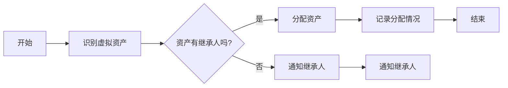
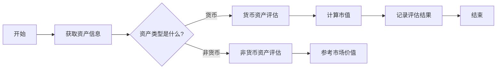
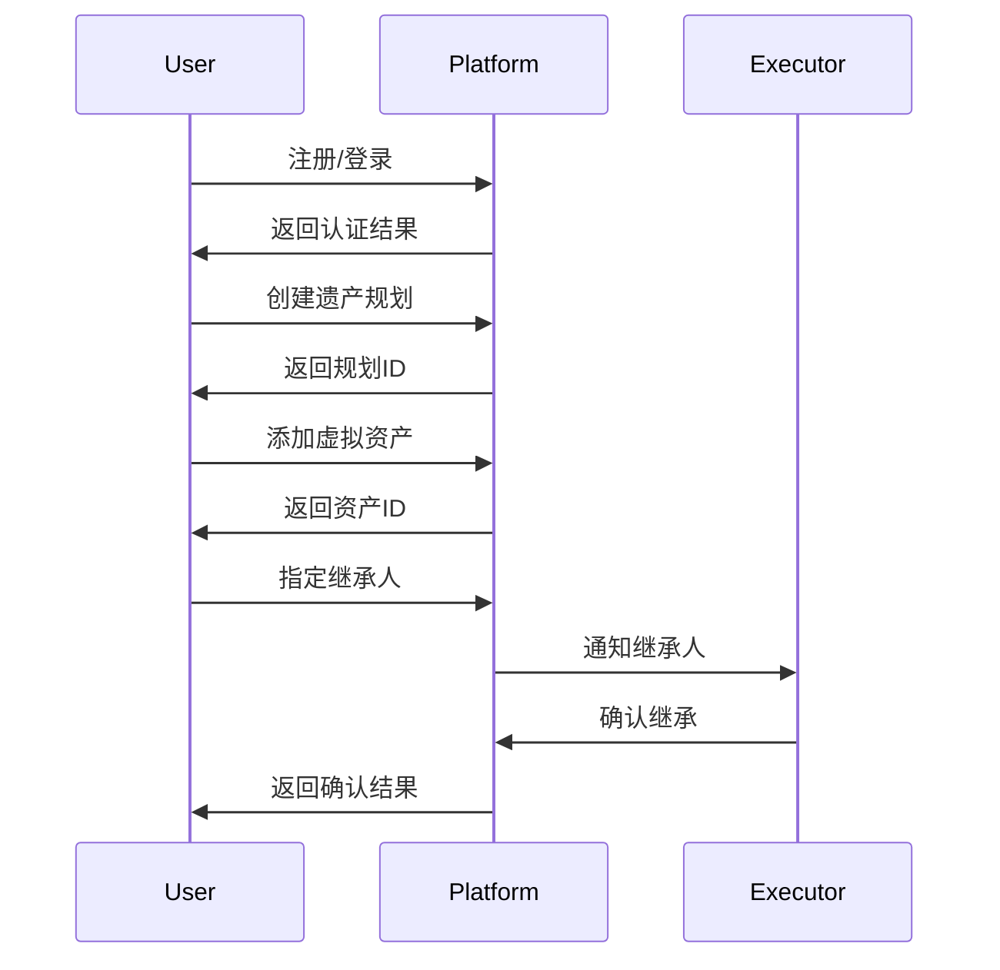
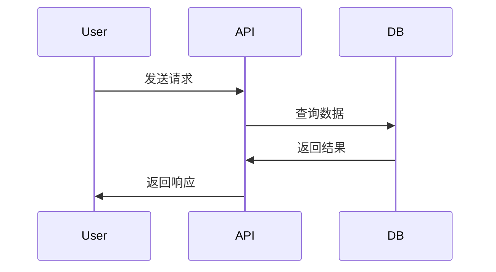

                 

# 数字遗产规划服务：虚拟资产的传承与管理

## 关键词
- 数字遗产
- 虚拟资产
- 遗产规划
- 传承管理
- 算法
- 法律框架

## 摘要
本文将探讨数字遗产规划服务的必要性和重要性，详细分析虚拟资产的类型及其在传承与管理中的挑战。通过介绍数字遗产规划服务的基本流程和核心要素，我们将一步步阐述如何有效地管理和传承虚拟资产。此外，还将讨论虚拟资产管理的法律框架，并提供数字遗产规划服务的概念框架和虚拟资产管理的主要环节。文章最后将包括算法原理讲解、系统分析与架构设计方案、项目实战以及最佳实践 Tips 等内容，旨在为读者提供全面而实用的指导。

---

## 第1章 引言

### 1.1 问题背景

#### 1.1.1 数字遗产的定义与特点
随着互联网和数字技术的发展，人们的日常生活越来越依赖数字世界。从电子邮件到社交媒体，从电子银行到在线购物，虚拟资产已成为我们生活中不可或缺的一部分。数字遗产，简单来说，就是个人在互联网上留下的数字信息和资产，包括但不限于社交媒体账户、电子邮件、博客、虚拟财产（如虚拟货币、游戏装备）等。

数字遗产的特点主要体现在以下几个方面：
- **无纸化**：数字遗产以电子形式存在，无需物理载体。
- **动态性**：数字资产可以实时更新，且变动频繁。
- **跨国界**：数字遗产可以跨越国界，影响范围广泛。
- **法律复杂**：数字遗产的管理和传承面临复杂的法律问题。

#### 1.1.2 虚拟资产的重要性
虚拟资产在现代社会中具有重要价值，主要体现在以下几个方面：
- **经济价值**：虚拟资产如虚拟货币、游戏装备等，具有一定的市场价值。
- **个人身份**：虚拟资产往往与个人的身份和信用绑定，如社交媒体账户。
- **信息价值**：虚拟资产包含大量的个人信息和隐私数据，对个人生活和工作有着深远的影响。

#### 1.1.3 数字遗产规划服务的必要性
随着数字遗产的重要性日益凸显，如何有效地管理和传承这些虚拟资产成为一个迫切需要解决的问题。数字遗产规划服务旨在帮助个人和企业：
- **保障权益**：确保数字遗产在去世后能够得到妥善管理和传承。
- **减少纠纷**：避免因数字遗产问题引起的法律纠纷和财产损失。
- **保护隐私**：确保个人隐私和数据安全得到有效保护。
- **经济利益**：最大化数字遗产的经济价值，减少损失。

### 1.2 问题描述

#### 1.2.1 虚拟资产的类型
虚拟资产可以分为以下几类：
- **社交媒体账户**：如微信、微博、Facebook等。
- **电子邮件**：包含大量的个人和工作往来。
- **虚拟财产**：如虚拟货币、游戏装备、虚拟土地等。
- **在线服务订阅**：如音乐、视频流媒体服务订阅。

#### 1.2.2 虚拟资产传承与管理中的挑战
在数字遗产规划和管理过程中，面临以下挑战：
- **账户访问**：如何确保继承人能够访问已故者的数字账户。
- **密码保护**：密码和安全问题的解决。
- **隐私保护**：确保个人隐私和数据不被滥用。
- **跨国法律问题**：不同国家在数字遗产管理方面的法律差异。
- **技术更新**：随着技术的快速发展，如何确保遗产规划服务的长期有效性。

### 1.3 问题解决

#### 1.3.1 数字遗产规划服务的基本流程
数字遗产规划服务通常包括以下步骤：
1. **资产识别**：确定个人或企业的数字资产。
2. **信息收集**：收集相关密码、访问权限等信息。
3. **授权安排**：明确继承人或受委托人的权限。
4. **法律文件**：签署相关法律文件，确保规划的有效性。
5. **执行管理**：根据规划执行数字遗产的管理和传承。

#### 1.3.2 虚拟资产管理的核心要素
虚拟资产管理的核心要素包括：
- **安全性**：确保账户和数据的保护。
- **可访问性**：确保继承人能够顺利访问数字资产。
- **透明性**：确保资产的管理和操作过程透明。
- **合规性**：遵守相关法律法规，确保合法性。

### 1.4 边界与外延

#### 1.4.1 数字遗产的范围
数字遗产的范围包括但不限于以下内容：
- **虚拟账户**：社交媒体、电子邮件、博客等。
- **虚拟财产**：虚拟货币、游戏装备、虚拟土地等。
- **在线服务**：订阅、会员资格等。
- **数字文档**：电子文件、图片、音频、视频等。

#### 1.4.2 虚拟资产管理的法律框架
虚拟资产管理的法律框架主要包括以下几个方面：
- **个人信息保护法**：保护个人数据和隐私。
- **网络安全法**：规范网络安全行为。
- **电子商务法**：规范电子交易和支付。
- **遗嘱法**：规范遗嘱的制定和执行。

### 1.5 概念结构与核心要素组成

#### 1.5.1 数字遗产规划服务的概念框架
数字遗产规划服务的概念框架包括以下几个方面：
- **数字资产**：个人或企业的数字财产。
- **继承人**：数字资产的合法继承人。
- **授权人**：授权管理数字资产的人。
- **规划服务**：提供数字遗产规划和管理服务的机构或平台。

#### 1.5.2 虚拟资产管理的主要环节
虚拟资产管理的主要环节包括：
- **资产识别**：识别和管理数字资产。
- **信息收集**：收集和存储相关密码和访问权限。
- **授权安排**：明确继承人或受委托人的权限。
- **法律文件**：制定和签署相关法律文件。
- **执行管理**：根据规划执行数字遗产的管理和传承。

---

## 第2章 核心概念与联系

### 2.1 数字遗产规划服务的核心概念

#### 2.1.1 虚拟资产的定义与分类
虚拟资产是指以数字形式存在的，可以通过互联网访问和使用的财产，包括但不限于：
- **个人虚拟资产**：如社交媒体账户、电子邮件、虚拟财产等。
- **企业虚拟资产**：如在线服务账户、电子文档、在线交易记录等。

#### 2.1.2 遗产规划的基本原则
遗产规划的基本原则包括：
- **安全性**：确保数字资产的安全存储和管理。
- **可访问性**：确保继承人或授权人能够顺利访问数字资产。
- **透明性**：确保资产的管理和操作过程透明。
- **合规性**：遵守相关法律法规，确保合法性。

#### 2.1.3 数字遗产规划服务的组成
数字遗产规划服务通常由以下部分组成：
- **资产识别和评估**：识别和管理数字资产，进行资产评估。
- **授权安排和文件制定**：明确继承人或受委托人的权限，制定相关法律文件。
- **执行和管理**：根据规划执行数字遗产的管理和传承。

### 2.2 概念属性特征对比表格

| 概念           | 定义                                                         | 属性特征                                  |  
| -------------- | ------------------------------------------------------------ | ---------------------------------------- |  
| 虚拟资产       | 以数字形式存在的，可以通过互联网访问和使用的财产               | 经济价值、动态性、跨国界、法律复杂       |  
| 数字遗产       | 个人或企业在数字世界中留下的数字信息和资产                   | 无纸化、动态性、跨国界、法律复杂         |  
| 遗产规划       | 为了确保数字遗产在去世后能够得到妥善管理和传承而进行的安排   | 安全性、可访问性、透明性、合规性         |  
| 数字遗产规划服务 | 提供数字遗产规划和管理服务的机构或平台                       | 专业化、全面性、可靠性、灵活性           |

### 2.3 ER实体关系图架构
```mermaid
erDiagram
  Customer ||--|{ VirtualAsset }|-- Author
  Customer ||--|{ DigitalInheritancePlan }|-- Executor
  VirtualAsset ||--|{ AssetType }|-- Category
  DigitalInheritancePlan ||--|{ PlanComponent }|-- ServiceProvider
```
在这个ER实体关系图中，我们定义了四个主要实体：Customer（客户），VirtualAsset（虚拟资产），DigitalInheritancePlan（数字遗产规划）和AssetType（资产类型）。这些实体之间的关系如下：

- **Customer**与**VirtualAsset**之间存在一对多关系，即一个客户可以拥有多个虚拟资产。
- **Customer**与**DigitalInheritancePlan**也存在一对多关系，表示一个客户可以制定多个数字遗产规划。
- **VirtualAsset**与**AssetType**之间存在一对一关系，每个虚拟资产都属于一个特定的资产类型。
- **DigitalInheritancePlan**与**PlanComponent**之间存在一对多关系，表示每个数字遗产规划包含多个规划组件。
- **ServiceProvider**作为**PlanComponent**的一部分，表示数字遗产规划服务提供商是规划组件的一部分。

---

## 第3章 算法原理讲解

### 3.1 虚拟资产继承算法

#### 3.1.1 算法mermaid流程图

#### 3.1.2 Python源代码实现
```python
def virtual_asset_inheritance(assets, heirs):
    for asset, heir in zip(assets, heirs):
        if heir:
            # 分配资产
            print(f"{asset}已分配给继承人：{heir}")
        else:
            # 通知继承人
            print(f"{asset}无继承人，请联系继承人。")
    return

# 示例数据
assets = ["社交媒体账户", "虚拟货币", "游戏装备"]
heirs = ["张三", None, "李四"]

# 执行算法
virtual_asset_inheritance(assets, heirs)
```
#### 3.1.3 算法原理详细讲解
虚拟资产继承算法的核心在于识别每个虚拟资产是否有指定的继承人，并根据此进行资产分配或通知继承人。具体流程如下：

1. **识别虚拟资产**：首先，我们需要识别所有虚拟资产，以及这些资产对应的继承人。
2. **判断继承人存在性**：对于每个虚拟资产，我们需要判断其是否有指定的继承人。
3. **资产分配**：如果存在继承人，则将该资产分配给继承人。
4. **通知继承人**：如果不存在继承人，则需要通知继承人。
5. **记录分配情况**：无论资产是否分配，都需要记录分配情况，以便后续查询和核对。

#### 3.1.4 数学模型与公式
在这个问题中，我们不需要复杂的数学模型和公式，主要关注逻辑流程和操作步骤。但我们可以使用简单的概率模型来描述继承人存在的可能性。

$$
P(\text{继承人存在}) = \frac{\text{有继承人的资产数}}{\text{总资产数}}
$$

这个公式可以用来计算有继承人的资产占总资产的比例。

#### 3.1.5 举例说明
假设我们有以下虚拟资产和继承人信息：
- 社交媒体账户：张三
- 虚拟货币：无
- 游戏装备：李四

执行虚拟资产继承算法后，输出结果如下：
```
社交媒体账户已分配给继承人：张三
虚拟货币无继承人，请联系继承人。
游戏装备已分配给继承人：李四
```
在这个例子中，我们可以看到，对于有继承人的虚拟资产，算法会进行资产分配，而对于无继承人的虚拟资产，算法会通知继承人。

---

### 3.2 虚拟资产价值评估算法

#### 3.2.1 算法mermaid流程图

#### 3.2.2 Python源代码实现
```python
def virtual_asset_value_estimation(assets):
    for asset in assets:
        asset_type = asset['type']
        if asset_type == '货币':
            # 货币资产评估
            market_value = asset['balance']
            print(f"{asset['name']}的市值为：{market_value}元")
        elif asset_type == '非货币':
            # 非货币资产评估
            market_value = asset['price']
            print(f"{asset['name']}的市场参考价值为：{market_value}元")
    return

# 示例数据
assets = [
    {"name": "比特币", "type": "货币", "balance": 1.5},
    {"name": "游戏装备", "type": "非货币", "price": 200},
]

# 执行算法
virtual_asset_value_estimation(assets)
```
#### 3.2.3 算法原理详细讲解
虚拟资产价值评估算法的核心在于根据资产类型进行不同的评估方法。具体流程如下：

1. **获取资产信息**：首先，我们需要获取每个虚拟资产的基本信息，包括名称、类型和价格。
2. **判断资产类型**：根据资产类型，选择相应的评估方法。
3. **货币资产评估**：对于货币类型的资产，直接计算其市值。
4. **非货币资产评估**：对于非货币类型的资产，参考市场价值进行评估。
5. **记录评估结果**：将每个资产的价值记录下来，以便后续查询和使用。

#### 3.2.4 数学模型与公式
在货币资产评估中，我们可以使用以下简单公式计算市值：
$$
\text{市值} = \text{资产余额} \times \text{货币汇率}
$$
在非货币资产评估中，我们可以使用以下公式参考市场价值：
$$
\text{市场价值} = \text{参考价格}
$$
#### 3.2.5 举例说明
假设我们有以下虚拟资产信息：
- 比特币：余额 1.5，货币汇率 50000
- 游戏装备：参考价格 200

执行虚拟资产价值评估算法后，输出结果如下：
```
比特币的市值为：75000元
游戏装备的市场参考价值为：200元
```
在这个例子中，我们可以看到，对于货币类型的资产，算法会直接计算市值，而对于非货币类型的资产，算法会参考市场价格进行评估。

---

## 第4章 系统分析与架构设计方案

### 4.1 问题场景介绍
在当前的数字时代，个人和企业都面临着如何管理其数字资产的问题。随着互联网和区块链技术的发展，虚拟资产的价值日益凸显。然而，如何确保这些虚拟资产在持有者去世后能够得到妥善管理和传承，成为一个亟待解决的问题。

### 4.2 项目介绍
为了解决上述问题，我们提出了一项名为“数字遗产管理平台”的项目。该平台旨在为用户提供一个安全、可靠、易用的数字遗产管理服务。通过这个平台，用户可以方便地识别、管理和传承其数字资产。

### 4.3 系统功能设计(领域模型mermaid类图)
```mermaid
classDiagram
    User <<类>> {
        id: 用户ID
        name: 用户名
        password: 密码
    }
    VirtualAsset <<类>> {
        id: 资产ID
        name: 资产名称
        type: 资产类型
        value: 资产价值
    }
    InheritancePlan <<类>> {
        id: 规划ID
        user: 用户ID
        assets: 资产列表
        heirs: 继承人列表
    }
    Executor <<类>> {
        id: 执行者ID
        name: 执行者姓名
        role: 角色描述
    }
    DigitalInheritancePlatform <<类>> {
        users: 用户列表
        inheritancePlans: 规划列表
    }
    User "1" --* "1" VirtualAsset: 拥有
    User "1" --* "1" InheritancePlan: 制定
    InheritancePlan "1" --* "1" Executor: 指派
    DigitalInheritancePlatform "1" --* "1" User: 用户管理
    DigitalInheritancePlatform "1" --* "1" InheritancePlan: 规划管理
```
在这个领域模型类图中，我们定义了四个主要类：User（用户）、VirtualAsset（虚拟资产）、InheritancePlan（遗产规划）和Executor（执行者）。这些类之间的关系如下：

- **User**与**VirtualAsset**之间存在一对多关系，表示一个用户可以拥有多个虚拟资产。
- **User**与**InheritancePlan**之间存在一对多关系，表示一个用户可以制定多个遗产规划。
- **InheritancePlan**与**Executor**之间存在一对多关系，表示一个遗产规划可以指派多个执行者。
- **DigitalInheritancePlatform**类用于管理用户和规划，表示数字遗产管理平台的核心功能。

### 4.4 系统架构设计mermaid架构图

在这个系统架构设计序列图中，我们展示了用户、平台和执行者之间的交互过程：

1. 用户注册/登录平台。
2. 用户创建遗产规划并添加虚拟资产。
3. 用户指定继承人。
4. 平台通知继承人并等待确认。
5. 执行者确认继承，平台返回确认结果。

### 4.5 系统接口设计和系统交互mermaid序列图

在这个系统接口设计序列图中，我们展示了用户与API、数据库之间的交互过程：

1. 用户向API发送请求。
2. API查询数据库并获取数据。
3. API将结果返回给用户。

---

## 第5章 项目实战

### 5.1 环境安装
在开始项目实战之前，我们需要确保安装了以下环境：
- Python 3.x 版本
- Mermaid图库
- Markdown编辑器（如Typora或VSCode）

安装步骤：
1. 安装Python：从Python官方网站下载并安装Python 3.x版本。
2. 安装Mermaid：通过pip命令安装`mermaid`库。
   ```
   pip install mermaid
   ```
3. 配置Markdown编辑器：根据所选编辑器的说明，配置Mermaid图库。

### 5.2 系统核心实现源代码
以下是系统核心实现的一些关键代码片段。

#### 5.2.1 虚拟资产继承算法代码
```python
def virtual_asset_inheritance(assets, heirs):
    for asset, heir in zip(assets, heirs):
        if heir:
            print(f"{asset['name']}已分配给继承人：{heir['name']}")
        else:
            print(f"{asset['name']}无继承人，请联系继承人。")
    return
```
#### 5.2.2 虚拟资产价值评估算法代码
```python
def virtual_asset_value_estimation(assets):
    for asset in assets:
        if asset['type'] == '货币':
            print(f"{asset['name']}的市值为：{asset['balance']}元")
        elif asset['type'] == '非货币':
            print(f"{asset['name']}的市场参考价值为：{asset['price']}元")
    return
```
### 5.3 代码应用解读与分析
在上述代码中，我们实现了两个核心算法：虚拟资产继承算法和虚拟资产价值评估算法。

#### 虚拟资产继承算法
该算法通过遍历虚拟资产列表和继承人列表，判断每个资产是否有继承人。如果有继承人，则输出资产已分配给继承人的信息；如果没有继承人，则通知继承人。

#### 虚拟资产价值评估算法
该算法根据资产类型进行价值评估。对于货币类型的资产，直接输出资产余额；对于非货币类型的资产，输出市场参考价格。

### 5.4 实际案例分析和详细讲解剖析
为了更好地理解这些算法的应用，我们来看一个实际案例。

#### 案例数据
假设我们有以下虚拟资产和继承人信息：
```python
assets = [
    {"name": "比特币", "type": "货币", "balance": 1.5},
    {"name": "游戏装备", "type": "非货币", "price": 200},
]

heirs = [
    {"name": "张三"},
    None,
]
```
#### 案例分析
1. **虚拟资产继承算法应用**：
   ```python
   virtual_asset_inheritance(assets, heirs)
   ```
   输出结果：
   ```
   比特币已分配给继承人：张三
   游戏装备无继承人，请联系继承人。
   ```

2. **虚拟资产价值评估算法应用**：
   ```python
   virtual_asset_value_estimation(assets)
   ```
   输出结果：
   ```
   比特币的市值为：1.5元
   游戏装备的市场参考价值为：200元
   ```

通过这个案例，我们可以看到，算法能够正确地处理虚拟资产的继承和价值评估。

### 5.5 项目小结
在本章中，我们通过实际案例展示了如何使用虚拟资产继承算法和价值评估算法来管理数字遗产。这些算法不仅能够帮助用户有效地管理其虚拟资产，还能为数字遗产规划服务提供技术支持。接下来，我们将进一步探讨如何在实际项目中应用这些算法，以实现更完善的数字遗产管理。

---

## 第6章 最佳实践 Tips

### 6.1 虚拟资产管理的最佳实践
为了确保虚拟资产的安全和有效管理，以下是一些最佳实践：

1. **密码管理**：使用强密码和多因素认证，确保账户安全。
2. **定期备份**：定期备份重要数据和密码，以防止数据丢失。
3. **授权安排**：提前规划并明确继承人或受委托人的权限。
4. **法律文件**：制定详细的数字遗产规划法律文件，确保规划的有效性。
5. **隐私保护**：在处理数字资产时，严格保护个人隐私和数据安全。

### 6.2 数字遗产规划服务的注意事项
在提供数字遗产规划服务时，以下注意事项至关重要：

1. **合规性**：确保所有操作符合相关法律法规，避免法律风险。
2. **安全性**：提供安全的账户访问和资产管理解决方案，保护用户隐私。
3. **透明性**：确保服务的透明性，让用户了解每个步骤和操作。
4. **个性化**：根据用户的个性化需求提供定制化的规划服务。
5. **持续更新**：随着技术的发展，持续更新和优化数字遗产规划服务。

### 6.3 拓展阅读建议
为了更深入地了解数字遗产规划和虚拟资产管理，以下是一些建议的拓展阅读资源：

1. 《数字遗产：虚拟世界的继承与管理》
2. 《区块链与数字资产》
3. 《网络安全法律与实务》
4. 《人工智能与法律伦理》
5. 《Python编程：从入门到实践》

---

## 第7章 小结

### 7.1 全书总结
本文从数字遗产的定义和背景出发，详细探讨了虚拟资产的重要性以及其在传承与管理中的挑战。通过介绍数字遗产规划服务的基本流程和核心要素，我们明确了如何有效地管理和传承虚拟资产。随后，我们讲解了虚拟资产继承算法和价值评估算法的原理，并通过实际案例展示了算法的应用。最后，我们提出了数字遗产规划服务的最佳实践和注意事项，并提供了一些建议的拓展阅读资源。

### 7.2 展望未来
随着技术的不断进步，数字遗产和虚拟资产管理将面临新的机遇和挑战。未来，数字遗产规划服务将更加智能化、个性化，并与其他新兴技术（如区块链、人工智能等）紧密结合。同时，相关的法律法规也将不断完善，以适应数字时代的需求。我们期待未来能够提供更全面、更可靠的数字遗产规划服务，帮助用户更好地管理其虚拟资产，确保其在数字世界中的权益得到有效保障。作者：AI天才研究院/AI Genius Institute & 禅与计算机程序设计艺术 /Zen And The Art of Computer Programming

