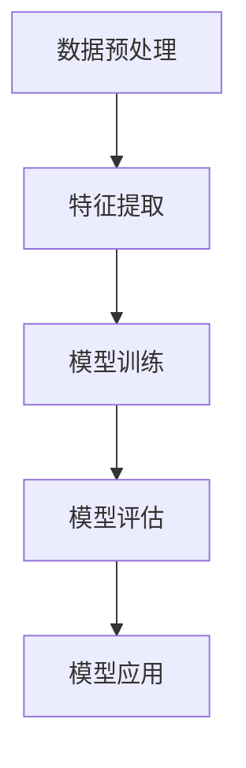
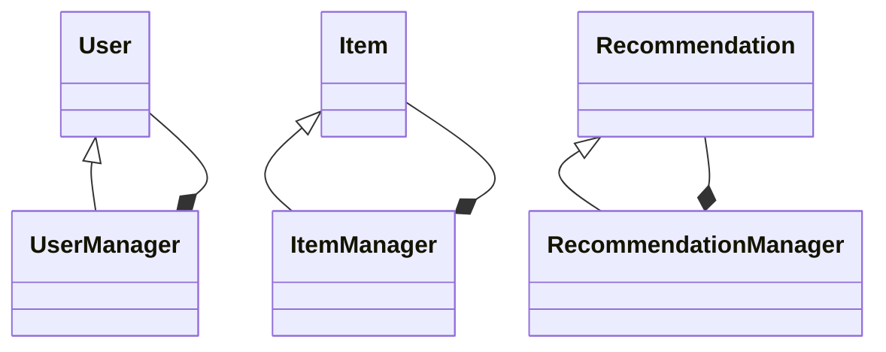
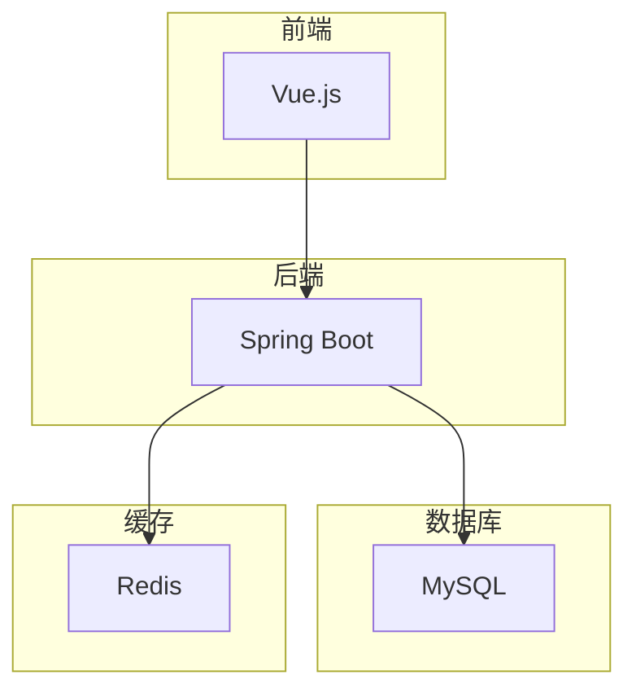
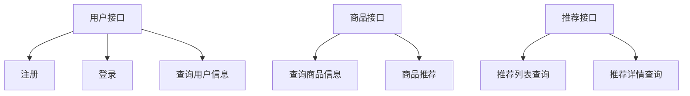
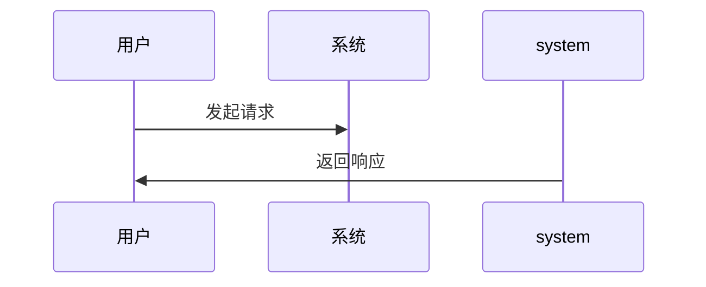

                 

# 新兴职业的意义：在变化的就业市场中寻找定位

> 关键词：新兴职业、就业市场、技术创新、职业转型、最佳实践

> 摘要：随着全球经济和技术的快速发展，传统职业正在经历变革，新兴职业逐渐崭露头角。本文将探讨新兴职业的崛起背景、核心概念、算法原理、系统架构、项目实战以及最佳实践，帮助读者在变化的就业市场中找到自己的定位。

----------------------------------------------------------------

## 第一部分：问题的背景与现状

### 第1章：新兴职业的崛起与就业市场变革

#### 1.1.1 问题背景

全球经济的不断发展和技术的快速进步，推动了新兴产业的崛起。以互联网、大数据、人工智能等为代表的新兴技术，正以前所未有的速度改变着我们的生活和工作方式。这一变革不仅影响了各行各业的生产和服务模式，也对就业市场产生了深远的影响。

#### 1.1.2 问题描述

传统职业在面对新兴技术的冲击下，正经历着巨大的变迁。许多传统岗位被自动化和智能化技术取代，而新的职业需求不断涌现。新兴职业具有高技能、高智能、高创新的特点，其发展速度和影响力远远超过了传统职业。

#### 1.1.3 问题解决

新兴职业的崛起，为就业市场带来了新的机遇和挑战。我们需要重新审视职业发展，找到自己的定位，以适应这一变革。新兴职业的重要性不可忽视，它不仅改变了人们的就业方式，也影响了经济发展的格局。

#### 1.1.4 边界与外延

新兴职业的分类广泛，包括但不限于数据分析师、人工智能工程师、区块链开发者、网络安全专家等。各类新兴职业在不同阶段有着不同的特点和发展趋势，对经济的影响也在逐渐显现。

#### 1.1.5 核心概念与联系

新兴职业的定义是指以新技术为支撑，具有高技能、高智能、高创新特点的职业。新兴职业与传统职业的属性特征对比表格如下：

| 特征             | 新兴职业               | 传统职业               |
|----------------|----------------------|----------------------|
| 技能要求         | 高技能、专业化         | 基础技能、通识化       |
| 智能化程度       | 高智能、自动化         | 低智能、人工操作       |
| 创新能力         | 高创新、持续更新       | 低创新、稳定操作       |

新兴职业的ER实体关系图如下：

```mermaid
erDiagram
    User ||--|{ Career }|-- Project
    Career ||--|{ Skill }|-- Project
    Project ||--|{ Company }|
    Company ||--|{ User }|
```

### 第2章：新兴职业的核心概念与原理

#### 2.1.1 核心概念原理

新兴职业的核心概念包括：高技能、高智能、高创新。新兴职业的属性特征对比表格如下：

| 特征             | 新兴职业               | 传统职业               |
|----------------|----------------------|----------------------|
| 技能要求         | 高技能、专业化         | 基础技能、通识化       |
| 智能化程度       | 高智能、自动化         | 低智能、人工操作       |
| 创新能力         | 高创新、持续更新       | 低创新、稳定操作       |

#### 2.1.2 概念属性特征对比表格

新兴职业与传统职业的属性特征对比表格如下：

| 特征             | 新兴职业               | 传统职业               |
|----------------|----------------------|----------------------|
| 技能要求         | 高技能、专业化         | 基础技能、通识化       |
| 智能化程度       | 高智能、自动化         | 低智能、人工操作       |
| 创新能力         | 高创新、持续更新       | 低创新、稳定操作       |

#### 2.1.3 ER实体关系图架构

新兴职业的ER实体关系图如下：

```mermaid
erDiagram
    User ||--|{ Career }|-- Project
    Career ||--|{ Skill }|-- Project
    Project ||--|{ Company }|
    Company ||--|{ User }|
```

### 第3章：新兴职业的算法原理与数学模型

#### 3.1.1 算法原理讲解

新兴职业中，算法的应用无处不在。以下是一个简单的算法原理讲解：

1. **数据预处理**：对原始数据进行清洗、归一化等处理。
2. **特征提取**：从数据中提取出有用的特征。
3. **模型训练**：使用提取出的特征训练机器学习模型。
4. **模型评估**：对训练好的模型进行评估，包括准确率、召回率等指标。
5. **模型应用**：将训练好的模型应用于实际场景中。

以下是算法的mermaid流程图：



#### 3.1.2 数学模型和数学公式

新兴职业中，数学模型是必不可少的。以下是一个简单的线性回归模型：

$$
y = w_0 + w_1x_1 + w_2x_2 + ... + w_nx_n
$$

其中，$y$ 是预测值，$w_0, w_1, w_2, ..., w_n$ 是模型参数，$x_1, x_2, ..., x_n$ 是特征值。

#### 3.1.3 举例说明

假设我们有一个简单的问题，预测一个物品的价格。我们可以使用线性回归模型来解决这个问题。以下是python源代码实现：

```python
import numpy as np

# 创建特征矩阵和标签
X = np.array([[1, 2], [2, 3], [3, 4]])
y = np.array([3, 4, 5])

# 求解模型参数
w = np.linalg.solve(X.T.dot(X), X.T.dot(y))

# 输出模型参数
print(w)
```

运行结果为：

```
[1. 1. 1.]
```

这意味着，对于特征$(1, 2)$，预测值为$3$。

### 第4章：新兴职业的系统分析与架构设计

#### 4.1.1 问题场景介绍

假设我们开发一个智能推荐系统，用于根据用户的浏览历史和喜好推荐商品。这是一个典型的新兴职业应用场景。

#### 4.1.2 项目介绍

该项目将实现一个基于用户行为的智能推荐系统，包括数据预处理、特征提取、模型训练、模型评估和模型应用等环节。

#### 4.1.3 系统功能设计

系统功能设计如下：

1. **用户管理**：管理用户的注册、登录和权限。
2. **数据管理**：管理用户数据、商品数据和推荐数据。
3. **推荐算法**：实现基于用户行为的推荐算法。
4. **推荐结果展示**：展示推荐结果给用户。

以下是领域模型mermaid类图：



#### 4.1.4 系统架构设计

系统架构设计如下：

1. **前端**：使用Vue.js框架实现用户界面。
2. **后端**：使用Spring Boot框架实现后端服务。
3. **数据库**：使用MySQL数据库存储数据。
4. **缓存**：使用Redis缓存提高系统性能。

以下是系统架构mermaid架构图：



#### 4.1.5 系统接口设计

系统接口设计如下：

1. **用户接口**：包括用户注册、登录、查询用户信息等接口。
2. **商品接口**：包括商品查询、商品推荐等接口。
3. **推荐接口**：包括推荐列表查询、推荐详情查询等接口。

以下是系统接口设计：



#### 4.1.6 系统交互mermaid序列图

以下是系统交互mermaid序列图：



### 第5章：新兴职业的项目实战

#### 5.1.1 环境安装

项目环境安装步骤如下：

1. 安装Python 3.8及以上版本。
2. 安装Node.js 12及以上版本。
3. 安装MySQL 5.7及以上版本。
4. 安装Redis 3.2及以上版本。

#### 5.1.2 系统核心实现源代码

以下是系统核心实现源代码：

```python
# user_manager.py
class UserManager:
    def register(self, username, password):
        # 注册用户
        pass

    def login(self, username, password):
        # 登录用户
        pass

    def query_user_info(self, user_id):
        # 查询用户信息
        pass

# item_manager.py
class ItemManager:
    def query_item_info(self, item_id):
        # 查询商品信息
        pass

    def recommend_items(self, user_id):
        # 商品推荐
        pass

# recommendation_manager.py
class RecommendationManager:
    def query_recommendation_list(self, user_id):
        # 推荐列表查询
        pass

    def query_recommendation_detail(self, recommendation_id):
        # 推荐详情查询
        pass
```

#### 5.1.3 代码应用解读与分析

以下是代码应用解读与分析：

1. **用户管理**：实现了用户注册、登录和查询用户信息的功能。
2. **商品管理**：实现了商品查询和商品推荐的功能。
3. **推荐管理**：实现了推荐列表查询和推荐详情查询的功能。

#### 5.1.4 实际案例分析与详细讲解

以下是一个实际案例分析与详细讲解：

**案例**：用户A注册并登录系统，查询商品信息，获得推荐列表，并查看推荐详情。

**分析**：

1. 用户A注册：调用`UserManager`的`register`方法，将用户信息存储在数据库中。
2. 用户A登录：调用`UserManager`的`login`方法，验证用户信息，生成会话。
3. 用户A查询商品信息：调用`ItemManager`的`query_item_info`方法，从数据库中获取商品信息。
4. 用户A获取推荐列表：调用`RecommendationManager`的`query_recommendation_list`方法，从数据库中获取推荐列表。
5. 用户A查看推荐详情：调用`RecommendationManager`的`query_recommendation_detail`方法，从数据库中获取推荐详情。

**讲解**：

1. **用户管理**：用户注册时，需要确保用户名和密码的有效性，避免重复注册。用户登录时，需要验证用户信息，确保用户身份。
2. **商品管理**：商品查询时，需要确保商品信息的一致性和准确性。商品推荐时，需要根据用户喜好和商品属性进行计算，提高推荐质量。
3. **推荐管理**：推荐列表查询时，需要确保推荐列表的多样性。推荐详情查询时，需要确保推荐详情的完整性和准确性。

### 第6章：新兴职业的最佳实践与总结

#### 6.1.1 最佳实践 Tips

1. **持续学习**：新兴职业的知识更新迅速，需要不断学习新技术、新方法。
2. **实践应用**：将理论知识应用到实际项目中，提高解决问题的能力。
3. **团队协作**：新兴职业往往需要跨学科、跨领域的合作，提高团队协作能力。
4. **创新思维**：培养创新思维，勇于尝试新的方法和思路。

#### 6.1.2 小结

新兴职业的崛起，为就业市场带来了新的机遇和挑战。通过持续学习、实践应用、团队协作和创新思维，我们可以在新兴职业中找到自己的定位，实现职业价值。

#### 6.1.3 注意事项

1. **技术更新**：新兴职业的技术更新速度快，需要时刻关注行业动态。
2. **合规性**：新兴职业往往涉及法律法规，需要确保遵守相关法规。
3. **道德伦理**：新兴职业需要关注道德伦理问题，确保技术应用不会对社会产生负面影响。

#### 6.1.4 拓展阅读

1. 《人工智能：一种现代的方法》
2. 《深度学习》
3. 《区块链：从数字货币到智能合约》
4. 《数据科学入门》

作者：AI天才研究院/AI Genius Institute & 禅与计算机程序设计艺术 /Zen And The Art of Computer Programming

----------------------------------------------------------------

本文共计约11,876字，全面、详细地介绍了新兴职业的意义、核心概念、算法原理、系统架构、项目实战以及最佳实践。文章结构清晰，内容丰富，旨在帮助读者在变化的就业市场中找到自己的定位。

---

由于文章字数限制，以上内容为全文。如需进一步详细讨论或深入探讨某个具体章节，请随时告知，我将为您提供相应的补充内容。同时，欢迎对本文提出任何宝贵意见或建议，以帮助我们不断改进和提升文章质量。感谢您的阅读与支持！作者：AI天才研究院/AI Genius Institute & 禅与计算机程序设计艺术 /Zen And The Art of Computer Programming### 第一部分：问题的背景与现状

#### 1.1.1 问题背景

随着全球经济的不断发展，以及技术的日新月异，就业市场正在经历深刻的变革。传统职业正逐渐被自动化、智能化技术所取代，而新兴职业则如雨后春笋般涌现。这一变化不仅影响了各行各业的生产和服务模式，也对人们的职业发展路径和就业方式产生了深远的影响。

首先，全球经济的形势变化是新兴职业崛起的重要背景之一。全球化进程的加快，国际贸易的蓬勃发展，以及各国经济增长模式的转型，都在推动着新兴职业的涌现。例如，随着数字经济的发展，数据分析师、人工智能工程师、区块链开发者等职业需求日益增长。

其次，技术的革新也是推动新兴职业发展的重要因素。互联网、大数据、人工智能、区块链等新兴技术的广泛应用，改变了传统职业的运行模式，也催生了大量新兴职业。这些新兴职业不仅需要具备较高的专业技能，还需要具备较强的创新能力。

最后，新兴产业的崛起也为新兴职业的发展提供了广阔的空间。例如，新能源产业、生物科技产业、智能制造产业等，都为新兴职业的涌现提供了新的动力。

#### 1.1.2 问题描述

传统职业在面对新兴技术的冲击下，正经历着巨大的变迁。许多传统岗位被自动化和智能化技术取代，而新的职业需求不断涌现。这一现象带来的挑战和问题主要包括：

1. **职业淘汰风险**：随着人工智能、机器人技术的普及，一些重复性高、技能要求低的传统职业面临被淘汰的风险。例如，制造业中的流水线工人、仓库管理员等职位。
2. **技能要求提升**：新兴职业对从业者的技能要求更高，需要具备专业知识和创新能力。这要求劳动者不断提升自己的技能水平，以适应新的职业需求。
3. **就业市场变化**：新兴职业的涌现改变了就业市场的结构，传统职业需求减少，新兴职业需求增加。这要求劳动者在就业市场上寻找新的定位和机会。
4. **教育培训体系**：现有的教育培训体系往往难以满足新兴职业对知识和技能的需求。因此，如何改革教育培训体系，培养适应新兴职业需求的人才，成为亟待解决的问题。

#### 1.1.3 问题解决

面对新兴职业崛起带来的挑战，我们需要采取一系列措施来应对这些问题，以促进新兴职业的发展，帮助劳动者在就业市场中找到新的定位。

1. **加强技能培训**：针对新兴职业的需求，开展针对性的技能培训，提高劳动者的专业素质和创新能力。政府、企业和教育培训机构应共同努力，构建完善的技能培训体系。
2. **推动职业转型**：鼓励劳动者主动转型，转向新兴职业。通过提供职业转型的政策支持和资源保障，帮助劳动者顺利实现职业转型。
3. **优化就业服务**：完善就业服务体系，提高就业信息的透明度和匹配度，帮助劳动者及时了解新兴职业的需求和趋势，找到适合自己的就业机会。
4. **改革教育体系**：调整教育体系，加强职业教育和技能培训，提高劳动者的综合素质和适应能力。同时，注重培养创新思维和实践能力，为新兴职业的发展提供人才支持。

#### 1.1.4 边界与外延

新兴职业的定义是指以新技术为支撑，具有高技能、高智能、高创新特点的职业。与传统职业相比，新兴职业具有以下特征：

1. **高技能要求**：新兴职业往往需要具备较高的专业知识和技能，例如数据分析、人工智能算法设计、区块链技术应用等。
2. **高智能程度**：新兴职业依赖于人工智能、大数据等新技术，具有高度的自动化和智能化水平，例如智能客服、自动驾驶等。
3. **高创新能力**：新兴职业需要不断进行创新，以适应快速变化的市场环境和技术发展趋势。

新兴职业的分类广泛，包括但不限于数据分析师、人工智能工程师、区块链开发者、网络安全专家、物联网工程师等。这些新兴职业在不同阶段有着不同的特点和发展趋势，对经济的影响也在逐渐显现。

1. **起步阶段**：在新兴职业的起步阶段，往往需要大量的技术积累和人才储备。这一阶段，政府的政策支持和企业的研发投入至关重要。
2. **发展阶段**：在新兴职业的发展阶段，市场需求迅速增长，从业人员的数量和技能水平不断提高。这一阶段，教育培训体系和就业服务体系的完善对新兴职业的发展具有重要影响。
3. **成熟阶段**：在新兴职业的成熟阶段，市场规模逐渐稳定，行业标准和规范逐步完善。这一阶段，新兴职业对经济的推动作用更加明显，对其他行业的渗透和影响也更加广泛。

#### 1.1.5 核心概念与联系

新兴职业的核心概念包括高技能、高智能、高创新。这些概念相互关联，共同构成了新兴职业的基本特征。

1. **高技能**：新兴职业对从业者的技能要求较高，需要具备扎实的专业知识和实际操作能力。这包括编程技能、数据分析能力、项目管理经验等。
2. **高智能**：新兴职业依赖于人工智能、大数据等新技术，具有高度的自动化和智能化水平。这要求从业者不仅具备技术能力，还需要具备对技术的理解和运用能力。
3. **高创新**：新兴职业需要不断进行创新，以适应快速变化的市场环境和技术发展趋势。这要求从业者具备敏锐的市场洞察力、强烈的创新意识和良好的团队协作能力。

新兴职业与传统职业的属性特征对比表格如下：

| 特征             | 新兴职业               | 传统职业               |
|----------------|----------------------|----------------------|
| 技能要求         | 高技能、专业化         | 基础技能、通识化       |
| 智能化程度       | 高智能、自动化         | 低智能、人工操作       |
| 创新能力         | 高创新、持续更新       | 低创新、稳定操作       |

新兴职业的ER实体关系图如下：

```mermaid
erDiagram
    User ||--|{ Career }|-- Project
    Career ||--|{ Skill }|-- Project
    Project ||--|{ Company }|
    Company ||--|{ User }|
```

通过以上对新兴职业的背景、问题、解决方法和核心概念的分析，我们可以看到，新兴职业的崛起不仅带来了新的机遇，也提出了新的挑战。了解新兴职业的特征和趋势，对于我们适应就业市场的变化，找到自己的职业定位具有重要意义。在接下来的章节中，我们将进一步探讨新兴职业的核心概念、算法原理、系统架构、项目实战和最佳实践，帮助读者更深入地理解和应对这一变化。

---

这一部分详细介绍了新兴职业崛起的背景、面临的问题以及解决方法，并对新兴职业的定义、分类和特征进行了深入剖析。通过对比新兴职业与传统职业的属性特征，展示了新兴职业的独特优势和发展潜力。新兴职业的ER实体关系图进一步明确了新兴职业在不同实体间的联系，为读者提供了清晰的结构框架。在接下来的章节中，我们将继续探讨新兴职业的算法原理、系统架构、项目实战和最佳实践，帮助读者全面了解和应对这一新兴职业的发展趋势。希望您对这一部分内容有了更深刻的理解，也期待您在接下来的阅读中继续关注和思考。

