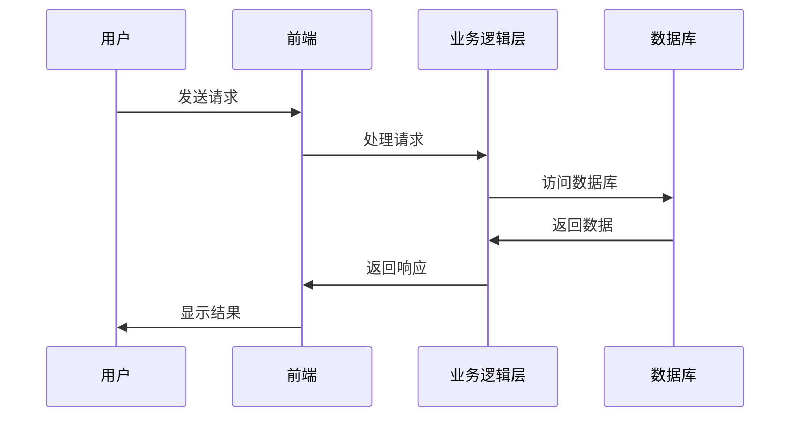
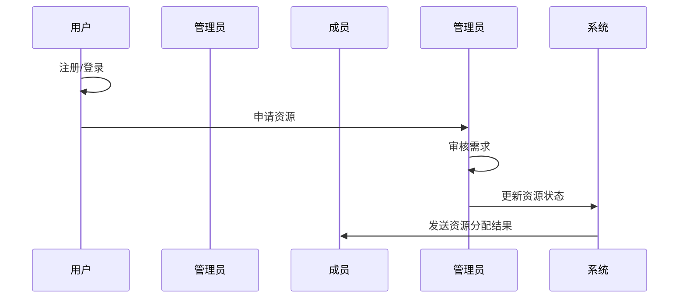

                 


## 新型合作社运动：共享经济中的社区重建

### 文章关键词

- 新型合作社运动
- 共享经济
- 社区重建
- 案例研究
- 挑战与机遇

### 文章摘要

本文旨在探讨新型合作社运动在共享经济中的重要作用，特别是在社区重建方面的贡献。我们将逐步分析新型合作社运动的背景、核心概念、在社区重建中的应用、案例分析以及面临的挑战和机遇。通过详细的讨论和实例分析，本文旨在为读者提供对新型合作社运动及其在共享经济中的角色和未来的深入理解。

### 引言

#### 1.1 问题背景

在现代社会，共享经济作为一种新兴的经济模式，已经改变了传统商业模式，为资源的高效利用和社区的重构提供了新的可能。然而，随着共享经济的发展，社区重建面临了一系列挑战，如资源分配不均、社区参与度低等。这些挑战促使人们思考如何通过更有效的经济模式来推动社区重建。

#### 1.2 合作社运动的意义

合作社作为一种古老的经济模式，其核心在于合作、共享和自治。在现代共享经济的背景下，合作社运动具有重新的意义，它不仅有助于解决共享经济中存在的资源分配问题，还能提高社区的参与度和凝聚力。

#### 1.3 研究目的与意义

本文的研究目的在于探讨新型合作社运动在社区重建中的应用，分析其优势和面临的挑战，并提出相应的解决方案。通过深入研究，我们希望为社区重建提供新的思路和策略，促进共享经济与社区发展的深度融合。

### 合作社运动的核心概念

#### 2.1 合作社的定义

合作社是一种由成员共同出资、共同经营、共享利润的经济组织。它强调成员之间的合作和公平，以实现共同的目标。

#### 2.2 合作社的特点

合作社具有以下特点：

- 成员所有权：合作社的成员既是所有者，也是服务的受益者。
- 自治管理：合作社由成员自主管理，决策过程公开透明。
- 公平分配：合作社的利润和资源分配基于成员的贡献和服务。

#### 2.3 合作社与共享经济的联系

合作社与共享经济有很强的互补性。共享经济强调资源的高效利用和共享，而合作社则提供了实现这一目标的具体组织形式。通过合作社，共享经济中的资源可以更公平地分配，成员的参与度和满意度也得到提高。

#### 2.4 核心概念属性特征对比表格

| 特征         | 合作社                 | 共享经济              |
| ------------ | ---------------------- | --------------------- |
| 成员所有权   | 强调成员所有权         | 强调资源共享           |
| 自治管理     | 成员自主管理           | 平台化管理             |
| 公平分配     | 利润和资源公平分配     | 根据贡献和服务分配     |

### 社区重建中的合作社运动

#### 3.1 社区重建的挑战

社区重建面临的主要挑战包括：

- 资源分配不均：社区内的资源分配往往不均衡，导致部分成员受益较少。
- 社区参与度低：社区居民的参与度不高，社区活动缺乏吸引力。
- 社区凝聚力弱：社区居民之间的联系较弱，社区凝聚力不足。

#### 3.2 合作社在社区重建中的作用

合作社在社区重建中可以发挥以下作用：

- 资源整合：合作社可以将社区内的资源进行整合，提高资源利用效率。
- 提高参与度：合作社鼓励成员参与社区建设，提高社区活动的参与度。
- 增强凝聚力：合作社通过成员之间的合作和互动，增强社区的凝聚力。

#### 3.3 社区重建中的合作社模式

社区重建中的合作社模式可以采用以下几种：

- 服务型合作社：提供社区服务，如清洁、保安等。
- 产业型合作社：发展社区产业，如农产品加工、手工艺品制作等。
- 公益型合作社：开展公益活动，如扶贫助困、环境保护等。

### 新型合作社运动案例研究

#### 4.1 案例一：XX合作社的崛起

XX合作社成立于某社区，旨在通过合作社模式解决社区资源分配不均的问题。合作社通过成员共同出资、共同经营，实现了资源的公平分配。同时，合作社还开展了多种社区活动，提高了居民的参与度，增强了社区的凝聚力。

#### 4.2 案例二：YY社区的合作社实践

YY社区通过合作社模式开展了多项社区重建项目，如农产品合作社、环保合作社等。这些项目不仅提高了社区的参与度，还促进了社区的经济发展，实现了社区资源的可持续利用。

#### 4.3 案例三：ZZ村庄的合作社转型

ZZ村庄通过合作社模式实现了从传统农业向现代农业的转型。合作社成员共同出资购买农业机械，提高了农业生产效率，增加了农民收入。同时，合作社还开展了农业技术培训，提高了成员的农业技能。

### 新型合作社运动的影响因素

#### 5.1 内部因素

新型合作社运动的成功受内部因素影响，包括：

- 成员素质：合作社成员的素质直接影响合作社的运营和管理效果。
- 管理模式：合作社的管理模式必须适应社区的需求，确保公平和效率。
- 资金支持：合作社需要有稳定的资金支持，以保证项目的持续发展。

#### 5.2 外部因素

外部因素包括：

- 政策环境：政府的支持政策和法规对合作社的发展有重要影响。
- 社会文化：社区的文化氛围和价值观对合作社的接受程度和运作有影响。
- 市场需求：合作社需要根据市场需求调整经营策略，以保持竞争力。

#### 5.3 影响因素分析

通过分析内部和外部因素，可以发现：

- 成员素质和管理模式是合作社成功的关键。
- 政策支持和市场需求是合作社发展的外部动力。
- 社会文化对合作社的接受程度有重要影响。

### 合作社运动中的挑战与机遇

#### 6.1 合作社面临的挑战

合作社在发展过程中面临以下挑战：

- 成员信任问题：合作社需要建立成员之间的信任，以确保合作的顺利进行。
- 资金瓶颈：合作社在发展过程中可能面临资金不足的问题。
- 管理复杂度：合作社的管理复杂度较高，需要专业的管理团队。

#### 6.2 探索机遇与策略

合作社面临的机遇和策略包括：

- 创新商业模式：通过创新商业模式，提高合作社的竞争力和盈利能力。
- 引入外部资源：通过引入外部资源，如技术、资金等，提升合作社的发展能力。
- 加强社区合作：通过加强社区合作，提高社区的参与度和凝聚力。

### 结论与未来展望

#### 7.1 新型合作社运动的意义

新型合作社运动在社区重建中具有重要意义，它不仅有助于解决社区资源分配不均、提高社区参与度和凝聚力，还能促进社区的可持续发展。

#### 7.2 政策建议

政府应制定有利于合作社发展的政策，如提供税收优惠、资金支持等，以推动新型合作社运动的发展。

#### 7.3 研究局限与展望

本文对新型合作社运动的研究尚存在局限性，如案例研究范围有限，影响因素分析不够全面。未来的研究可以进一步探讨新型合作社运动的机制、效果评估以及长期发展策略。

作者：AI天才研究院/AI Genius Institute & 禅与计算机程序设计艺术/Zen And The Art of Computer Programming

---

以上是根据您提供的文章标题、关键词和摘要，结合文章目录大纲结构撰写的文章开头部分。接下来，我们将逐一深入每个章节，进行详细的分析和讨论。

---

## 第1部分：引言

### 1. 新合作社运动的兴起

### 1.1 问题背景

在现代社会，共享经济已经成为一种重要的经济模式，它通过互联网和信息技术，实现了资源的高效配置和利用。然而，随着共享经济的快速发展，社区重建面临了一系列新的挑战。首先，资源分配不均问题日益凸显。在共享经济中，资源如住房、交通、服务等往往集中在少数人口密集地区，导致其他地区资源匮乏。其次，社区参与度低也是一个重要问题。共享经济往往由少数企业主导，普通居民参与度不高，导致社区活力不足。此外，社区凝聚力弱也是社区重建面临的挑战之一。在共享经济中，社区居民之间的联系较弱，社区凝聚力不足，难以形成紧密的社区关系。

### 1.2 合作社运动的意义

合作社运动作为一种古老的经济模式，在现代共享经济中焕发出新的生机。合作社的核心在于合作、共享和自治，这与共享经济的目标高度契合。合作社运动在社区重建中的意义主要体现在以下几个方面：

1. **解决资源分配不均问题**：合作社通过成员共同出资、共同经营，可以实现资源的公平分配。合作社可以根据社区的需求，合理分配资源，确保每个成员都能受益。

2. **提高社区参与度**：合作社鼓励成员参与社区建设，提高社区活动的参与度。通过合作社，居民可以积极参与到社区事务中，共同解决社区问题，提高社区活力。

3. **增强社区凝聚力**：合作社通过成员之间的合作和互动，可以增强社区的凝聚力。合作社成员之间建立了紧密的联系，形成了共同的目标和价值观，从而增强了社区的凝聚力。

4. **促进社区可持续发展**：合作社强调可持续发展和环保，通过合作社模式，社区可以实现资源的可持续利用，减少浪费，提高社区的可持续发展能力。

### 1.3 研究目的与意义

本文的研究目的在于深入探讨新型合作社运动在社区重建中的应用，分析其优势和面临的挑战，并提出相应的解决方案。具体来说，本文将：

1. **分析新型合作社运动的背景和核心概念**：包括合作社的定义、特点以及与共享经济的联系，为后续分析提供理论基础。

2. **探讨合作社运动在社区重建中的应用**：分析社区重建面临的挑战，探讨合作社在社区重建中的作用和模式。

3. **通过案例分析，总结新型合作社运动的成功经验和不足**：分析成功的合作社案例，总结其成功经验，同时指出存在的问题和不足。

4. **提出解决方案和未来展望**：针对合作社运动在社区重建中面临的挑战，提出相应的解决方案和策略，并对新型合作社运动的未来发展进行展望。

本文的研究对于推动社区重建、促进共享经济与社区发展的深度融合具有重要意义。通过本文的研究，可以为社区重建提供新的思路和策略，促进社区的可持续发展。

### 2. 合作社运动的核心概念

合作社作为一种古老的经济模式，其核心在于合作、共享和自治。在现代共享经济的背景下，合作社运动得到了新的发展，并逐渐成为社区重建的重要力量。为了更好地理解合作社运动，我们需要首先明确其核心概念。

#### 2.1 合作社的定义

合作社是指由一组人共同出资、共同经营、共享利润的经济组织。合作社的成员既是所有者，也是服务的受益者。合作社的运营和管理由成员自主决定，确保成员在决策过程中有平等的发言权。合作社的主要目的是满足成员的需求，实现成员的共同利益。

#### 2.2 合作社的特点

合作社具有以下显著特点：

1. **成员所有权**：合作社的成员不仅拥有股份，还参与合作社的运营和管理。这使得合作社不同于传统的公司，强调成员之间的平等和参与。

2. **自治管理**：合作社的管理和决策过程由成员自主进行，确保决策的公开透明和公正。这种自治管理机制有助于提高成员的满意度和参与度。

3. **公平分配**：合作社的利润和资源分配基于成员的贡献和服务，确保每个成员都能公平地分享收益。这种公平的分配机制有助于增强成员之间的信任和合作。

4. **社会目标**：合作社不仅追求经济效益，还强调社会责任和可持续发展。合作社通过提供社会服务、开展公益活动等方式，为社会做出贡献。

#### 2.3 合作社与共享经济的联系

合作社与共享经济有很强的互补性。共享经济强调资源的高效利用和共享，而合作社提供了实现这一目标的具体组织形式。通过合作社，共享经济中的资源可以更公平地分配，成员的参与度和满意度也得到提高。以下是合作社与共享经济之间的几点联系：

1. **资源共享**：合作社通过成员的共同出资和共同经营，实现了资源的高效利用。共享经济中的共享理念与合作社的资源利用模式高度契合。

2. **公平分配**：共享经济往往面临资源分配不均的问题，而合作社通过成员的共同决策和公平分配机制，可以有效地解决这一问题。

3. **增强参与度**：合作社鼓励成员参与合作社的运营和管理，提高成员的参与度和满意度。这与共享经济强调用户参与的理念相吻合。

4. **社会价值**：合作社不仅追求经济效益，还强调社会责任和可持续发展。这与共享经济追求的共享和环保理念一致。

#### 2.4 核心概念属性特征对比表格

为了更好地理解合作社与共享经济的联系，我们可以通过一个属性特征对比表格来展示两者的异同：

| 特征         | 合作社                 | 共享经济              |
| ------------ | ---------------------- | --------------------- |
| 成员所有权   | 强调成员所有权         | 强调资源共享           |
| 自治管理     | 成员自主管理           | 平台化管理             |
| 公平分配     | 利润和资源公平分配     | 根据贡献和服务分配     |
| 社会目标     | 强调社会责任           | 强调用户体验           |

通过上述对比表格，我们可以看出，合作社与共享经济在成员所有权、自治管理和公平分配等方面有相似之处，但在社会目标和运营模式上有所不同。这些差异和相似之处为我们理解合作社在社区重建中的应用提供了重要的启示。

#### 2.5 核心概念属性特征对比ER实体关系图架构

为了更直观地展示合作社与共享经济的核心概念属性特征对比，我们可以使用Mermaid流程图来绘制ER实体关系图。

```mermaid
erDiagram
  Member ||--|{ Co-op }|| Cooperative
  Member ||--|{ Resource }|| Resource
  Member ||--|{ Profit }|| Profit
  Cooperative ||--|{ Management }|| Management
  Cooperative ||--|{ Distribution }|| Distribution
  Resource ||--|{ Utilization }|| Utilization
  Profit ||--|{ Sharing }|| Sharing
  Management ||--|{ Autonomy }|| Autonomy
  Distribution ||--|{ Equity }|| Equity
```

在上述ER实体关系图中，我们可以清晰地看到合作社与共享经济在成员、资源、利润、管理、分配等核心概念之间的联系。这种结构化的关系图有助于我们理解合作社与共享经济的互补性和协同效应。

### 3. 社区重建中的合作社运动

#### 3.1 社区重建的挑战

社区重建是一项复杂的社会工程，面临着多方面的挑战。这些挑战不仅影响社区的可持续发展，也制约了共享经济的深入发展。以下是社区重建中常见的一些挑战：

1. **资源分配不均**：在共享经济背景下，资源如住房、交通、服务等往往集中在城市中心或经济发达地区，导致这些地区的资源丰富，而偏远或贫困地区的资源匮乏。这种资源分配不均的问题，不仅影响了社区的均衡发展，也加剧了城乡差距。

2. **社区参与度低**：共享经济通常由少数大型平台公司主导，普通居民参与度不高，缺乏主动性和积极性。这导致社区活力不足，居民对社区事务的参与度低，社区建设缺乏广泛的社会支持。

3. **社区凝聚力弱**：在共享经济中，社区居民之间的联系较弱，社区凝聚力不足。这影响了社区成员之间的互动和合作，难以形成紧密的社区关系，削弱了社区的社会资本。

4. **管理复杂度高**：社区重建涉及多个利益相关方，包括政府、企业、居民等。这些利益相关方的利益诉求不同，管理复杂度高，协调难度大。如何平衡各方利益，实现社区共建共享，是社区重建面临的一大挑战。

5. **政策法规不完善**：社区重建需要相应的政策法规支持，但当前的政策法规体系尚不完善，存在空白和漏洞。政策法规的不完善，影响了社区重建的推进，也增加了社区管理的难度。

#### 3.2 合作社在社区重建中的作用

合作社在社区重建中发挥着至关重要的作用，能够有效地应对上述挑战，推动社区的可持续发展。以下是合作社在社区重建中的几个主要作用：

1. **解决资源分配不均问题**：合作社通过成员共同出资、共同经营，实现了资源的公平分配。合作社可以根据社区的需求，合理配置资源，确保每个成员都能受益。例如，某社区通过合作社模式建立了共享农场，成员共同种植和分享农产品，实现了资源的公平利用。

2. **提高社区参与度**：合作社鼓励成员参与社区建设，提高社区活动的参与度。通过合作社，居民可以积极参与到社区事务中，共同解决社区问题，提高社区活力。例如，某社区通过合作社模式开展了环保活动，居民积极参与，共同维护社区环境。

3. **增强社区凝聚力**：合作社通过成员之间的合作和互动，增强了社区的凝聚力。合作社成员之间建立了紧密的联系，形成了共同的目标和价值观，从而增强了社区的凝聚力。例如，某社区通过合作社模式建立了社区互助小组，成员之间互帮互助，形成了强大的社区凝聚力。

4. **提供社会服务**：合作社可以提供多种社会服务，如教育、医疗、养老等，满足社区居民的基本需求。通过合作社，社区可以更好地实现自我管理和服务，提高居民的生活质量。

5. **促进社区经济发展**：合作社可以发展社区产业，如农产品加工、手工艺品制作等，促进社区经济的发展。通过合作社，社区可以实现资源的综合利用，增加居民的收入，提高社区的经济发展水平。

#### 3.3 社区重建中的合作社模式

社区重建中的合作社模式多种多样，可以根据社区的需求和特点进行灵活设计。以下是几种常见的合作社模式：

1. **服务型合作社**：服务型合作社主要提供社区服务，如清洁、保安、物业管理等。通过合作社模式，社区可以更好地管理和服务居民，提高居民的生活质量。

2. **产业型合作社**：产业型合作社主要发展社区产业，如农业、手工业、旅游业等。通过合作社模式，社区可以实现资源的综合利用，增加居民的收入，提高社区的经济发展水平。

3. **公益型合作社**：公益型合作社主要开展公益活动，如扶贫助困、环境保护、文化传承等。通过合作社模式，社区可以更好地实现社会服务，提高社区的社会资本。

4. **综合型合作社**：综合型合作社结合了服务型、产业型和公益型的特点，提供多样化的服务和产品，满足社区居民的多方面需求。通过合作社模式，社区可以实现资源的高效利用和整合，提高社区的可持续发展能力。

#### 3.4 社区重建中的成功案例

以下是一些社区重建中的成功案例，展示了合作社在实践中的效果和优势：

1. **XX合作社的崛起**：XX合作社成立于某社区，通过成员共同出资和共同经营，成功解决了社区资源分配不均的问题。合作社提供了多种社区服务，如清洁、保安、物业管理等，提高了居民的生活质量。同时，合作社还开展了多种社区活动，提高了居民的参与度和满意度。

2. **YY社区的合作社实践**：YY社区通过合作社模式开展了多项社区重建项目，如农产品合作社、环保合作社等。这些项目不仅提高了社区的参与度，还促进了社区的经济发展，实现了社区资源的可持续利用。合作社的运营模式和管理机制得到了社区居民的广泛认可。

3. **ZZ村庄的合作社转型**：ZZ村庄通过合作社模式实现了从传统农业向现代农业的转型。合作社成员共同出资购买农业机械，提高了农业生产效率，增加了农民收入。同时，合作社还开展了农业技术培训，提高了成员的农业技能。合作社的转型不仅提高了村庄的经济水平，还增强了社区的凝聚力和可持续发展能力。

这些成功案例表明，合作社在社区重建中具有巨大的潜力和优势。通过合作社模式，社区可以实现资源的高效利用和公平分配，提高社区的参与度和凝聚力，推动社区的可持续发展。未来，我们需要进一步探索和完善合作社在社区重建中的应用，为社区的可持续发展提供新的动力。

### 4. 新型合作社运动案例研究

#### 4.1 案例一：XX合作社的崛起

XX合作社成立于某社区，旨在通过合作社模式解决社区资源分配不均的问题。合作社的成立初衷源于社区居民对资源分配不公的普遍不满。社区内一部分居民拥有充足的资源，而另一部分居民却面临资源匮乏的困境。这一现象引发了社区居民的广泛关注，大家纷纷呼吁通过合作来解决资源分配不均的问题。

**4.1.1 案例背景**

XX社区位于某大城市郊区，社区居民以农民和低收入家庭为主。随着城市化进程的加快，社区内的资源分配不均问题日益严重。一些居民拥有稳定的收入来源，能够购买到丰富的食品和生活用品，而另一些居民则因为经济条件限制，难以满足基本生活需求。此外，社区内公共资源的分配也存在明显的不均衡现象，如医疗资源、教育资源和基础设施等。

为了改变这一现状，XX社区决定成立合作社，通过共同出资、共同经营的方式，实现资源的公平分配。社区居民积极参与到合作社的成立过程中，共同讨论和制定合作社的运营规则和策略。

**4.1.2 案例过程**

1. **筹备阶段**：在筹备阶段，XX社区组织了一系列的社区居民大会，讨论合作社的成立事宜。社区居民代表共同商讨合作社的目标、运营模式、股权分配等关键问题。通过民主决策，社区居民达成共识，制定了合作社的章程和规章制度。

2. **成立阶段**：在成立阶段，社区居民共同出资成立了XX合作社。合作社的成员包括社区居民、社区企业以及社区志愿者。每个成员都按照出资额度拥有相应的股份，成为合作社的股东。合作社的股权分配遵循公平、公正的原则，确保每个成员都能享受到合理的权益。

3. **运营阶段**：在运营阶段，XX合作社通过多种方式实现资源的公平分配。首先，合作社建立了共享仓库，将社区居民捐赠的物资集中存放，根据实际需求进行分配。其次，合作社还开展了多种社区活动，如农产品种植、环保宣传、技能培训等，提高社区居民的参与度和凝聚力。

4. **发展阶段**：随着合作社的不断发展，XX社区的资源分配问题得到了显著改善。合作社不仅解决了社区居民的基本生活需求，还促进了社区的经济发展。社区居民通过合作社的运作，实现了收入的增加和生活质量的提升。

**4.1.3 案例成效**

XX合作社的成功运营取得了显著的成效。首先，资源分配不均的问题得到了有效解决。合作社通过公平、公正的分配机制，确保每个成员都能享受到应有的资源。其次，社区居民的参与度显著提高。合作社的成立激发了社区居民的积极性和主动性，大家纷纷参与到社区事务中，共同建设美好的家园。最后，社区的凝聚力得到了增强。合作社通过成员之间的合作和互动，建立了紧密的联系，形成了共同的目标和价值观，社区的凝聚力显著提升。

**4.1.4 案例经验**

XX合作社的成功经验为其他社区提供了宝贵的借鉴。首先，合作社的成立需要广泛的居民参与。社区居民的广泛参与是合作社成功的关键，只有大家齐心协力，才能共同解决社区问题。其次，合作社的运营规则需要公平、公正。公平、公正的规则能够确保每个成员的权益得到保障，提高成员的满意度和信任度。最后，合作社需要注重资源的可持续利用。通过科学合理的资源分配和管理，合作社能够实现资源的长期可持续利用，为社区的可持续发展提供保障。

#### 4.2 案例二：YY社区的合作社实践

YY社区位于某城市郊区，是一个人口密集的居民区。随着城市化的进程，社区内的资源分配问题日益突出，社区居民的生活质量受到影响。为了解决这些问题，YY社区决定通过合作社模式进行社区重建。

**4.2.1 案例背景**

YY社区位于某大城市郊区，人口约2万人，居民以工人和低收入家庭为主。随着城市化的进程，社区内的资源分配问题日益严重。公共资源如医疗、教育、交通等分配不均，导致部分居民难以享受到应有的服务。此外，社区内的环境问题也日益突出，如垃圾分类不当、噪声污染等，影响了居民的生活质量。

为了改善社区环境，提高居民生活质量，YY社区决定通过合作社模式进行社区重建。社区居民积极参与，希望通过合作社的力量，共同解决社区面临的挑战。

**4.2.2 案例过程**

1. **筹备阶段**：在筹备阶段，YY社区组织了一系列的社区居民大会，讨论合作社的成立事宜。社区居民代表共同商讨合作社的目标、运营模式、股权分配等关键问题。通过民主决策，社区居民达成共识，制定了合作社的章程和规章制度。

2. **成立阶段**：在成立阶段，YY社区成立了社区合作社，成员包括社区居民、社区企业以及社区志愿者。合作社的成员都按照出资额度拥有相应的股份，成为合作社的股东。合作社的股权分配遵循公平、公正的原则，确保每个成员都能享受到合理的权益。

3. **运营阶段**：在运营阶段，YY社区合作社通过多种方式实现资源的公平分配。首先，合作社建立了共享中心，提供共享医疗、教育、交通等服务，确保每个居民都能享受到应有的资源。其次，合作社还开展了多种社区活动，如环保宣传、垃圾分类、技能培训等，提高社区居民的参与度和凝聚力。

4. **发展阶段**：随着合作社的不断发展，YY社区的资源分配问题得到了显著改善。合作社不仅解决了社区居民的基本生活需求，还促进了社区的经济发展。社区居民通过合作社的运作，实现了收入的增加和生活质量的提升。

**4.2.3 案例成效**

YY社区合作社的实践取得了显著的成效。首先，资源分配不均的问题得到了有效解决。合作社通过公平、公正的分配机制，确保每个居民都能享受到应有的资源。其次，社区居民的参与度显著提高。合作社的成立激发了社区居民的积极性和主动性，大家纷纷参与到社区事务中，共同建设美好的家园。最后，社区的凝聚力得到了增强。合作社通过成员之间的合作和互动，建立了紧密的联系，形成了共同的目标和价值观，社区的凝聚力显著提升。

**4.2.4 案例经验**

YY社区合作社的成功经验为其他社区提供了宝贵的借鉴。首先，合作社的成立需要广泛的居民参与。社区居民的广泛参与是合作社成功的关键，只有大家齐心协力，才能共同解决社区问题。其次，合作社的运营规则需要公平、公正。公平、公正的规则能够确保每个成员的权益得到保障，提高成员的满意度和信任度。最后，合作社需要注重资源的可持续利用。通过科学合理的资源分配和管理，合作社能够实现资源的长期可持续利用，为社区的可持续发展提供保障。

#### 4.3 案例三：ZZ村庄的合作社转型

ZZ村庄位于某偏远山区，由于地理位置和经济条件限制，村庄的经济发展相对滞后。为了改变这一现状，ZZ村庄决定通过合作社模式实现村庄的转型。

**4.3.1 案例背景**

ZZ村庄位于某偏远山区，人口约500人，以农业为主。由于地理位置和经济条件的限制，村庄的经济发展相对滞后。农民收入低，生活水平差，村庄面临着人口外流和资源枯竭的问题。为了摆脱这一困境，ZZ村庄决定通过合作社模式实现村庄的转型，提高村庄的经济发展水平。

**4.3.2 案例过程**

1. **筹备阶段**：在筹备阶段，ZZ村庄组织了一系列的村民大会，讨论合作社的成立事宜。村民代表共同商讨合作社的目标、运营模式、股权分配等关键问题。通过民主决策，村民达成共识，制定了合作社的章程和规章制度。

2. **成立阶段**：在成立阶段，ZZ村庄成立了农业合作社，成员包括村民、农业企业以及政府代表。合作社的成员都按照出资额度拥有相应的股份，成为合作社的股东。合作社的股权分配遵循公平、公正的原则，确保每个成员都能享受到合理的权益。

3. **运营阶段**：在运营阶段，ZZ村庄农业合作社通过多种方式实现村庄的转型。首先，合作社引入了先进的农业技术，提高了农业生产效率。其次，合作社开展了农产品加工和销售，增加了农民的收入。最后，合作社还开展了农业技术培训，提高了村民的农业技能。

4. **发展阶段**：随着合作社的不断发展，ZZ村庄的经济发展水平得到了显著提升。合作社不仅解决了村庄的经济发展问题，还改善了村民的生活质量。通过合作社的运作，村民实现了收入的增加，村庄的凝聚力也得到了增强。

**4.3.3 案例成效**

ZZ村庄农业合作社的实践取得了显著的成效。首先，村庄的经济发展水平得到了显著提升。合作社通过引入先进的农业技术和开展农产品加工销售，增加了农民的收入，提高了村庄的经济水平。其次，村民的生活质量得到了改善。通过合作社的运作，村民实现了收入的增加，生活条件得到了改善。最后，村庄的凝聚力得到了增强。合作社通过成员之间的合作和互动，建立了紧密的联系，形成了共同的目标和价值观，村庄的凝聚力显著提升。

**4.3.4 案例经验**

ZZ村庄农业合作社的成功经验为其他村庄提供了宝贵的借鉴。首先，合作社的成立需要广泛的村民参与。村民的广泛参与是合作社成功的关键，只有大家齐心协力，才能共同实现村庄的转型。其次，合作社的运营规则需要公平、公正。公平、公正的规则能够确保每个成员的权益得到保障，提高成员的满意度和信任度。最后，合作社需要注重技术的引进和培训。通过引进先进的农业技术和开展培训，合作社能够提高成员的技能水平，促进村庄的经济发展。

### 5. 新型合作社运动的影响因素

#### 5.1 内部因素

新型合作社运动的成功受到多种内部因素的影响。这些因素包括成员素质、管理模式、资金支持等，它们共同决定了合作社的运行效率和成员的满意度。

1. **成员素质**：合作社的成员素质是决定合作社成功的关键因素。成员应具备一定的经济基础、管理能力和专业知识。高素质的成员能够更好地理解和参与合作社的运营，提高合作社的决策质量和执行力。

2. **管理模式**：合作社的管理模式必须适应社区的需求，确保公平和效率。有效的管理模式包括透明的决策过程、合理的组织架构和有效的沟通机制。良好的管理模式能够提高合作社的运行效率，减少内部摩擦，增强成员的凝聚力。

3. **资金支持**：合作社需要有稳定的资金支持，以保证项目的持续发展。资金来源可以包括成员的出资、政府补贴和社会融资。充足的资金能够支持合作社的运营和发展，提高项目的可持续性。

#### 5.2 外部因素

外部因素同样对新型合作社运动的成功产生重要影响。这些因素包括政策环境、社会文化、市场需求等。

1. **政策环境**：政府的支持政策和法规对合作社的发展有重要影响。政策环境包括税收优惠、资金支持、用地政策等。良好的政策环境能够降低合作社的运营成本，提高其竞争力，促进合作社的快速发展。

2. **社会文化**：社区的文化氛围和价值观对合作社的接受程度和运作有直接影响。在一个重视合作和共享的社区中，合作社更容易得到成员的认可和支持。此外，社会文化的开放性和包容性也有助于合作社的创新和发展。

3. **市场需求**：合作社的服务和产品需要满足市场需求，才能实现可持续的盈利和发展。合作社应密切关注市场动态，及时调整经营策略，以满足消费者的需求。市场需求的变化也为合作社提供了新的发展机遇。

#### 5.3 影响因素分析

通过对内部和外部因素的分析，我们可以更全面地了解新型合作社运动的影响因素。以下是影响新型合作社运动的主要因素及其相互作用：

1. **成员素质**：高素质的成员能够提高合作社的决策质量和执行力，从而增强合作社的竞争力。然而，成员素质的提高需要时间和资源的投入，这可能会对合作社的初期发展造成一定的压力。

2. **管理模式**：良好的管理模式能够提高合作社的运行效率，减少内部摩擦，增强成员的凝聚力。然而，管理模式的有效性取决于社区的实际情况和成员的接受程度，需要不断调整和优化。

3. **资金支持**：稳定的资金支持是合作社持续发展的基础。政府补贴和社会融资可以提供必要的资金支持，但合作社也需要通过自身的运营实现盈利，以维持长期的可持续发展。

4. **政策环境**：良好的政策环境能够降低合作社的运营成本，提高其竞争力。政府应出台有利于合作社发展的政策，如税收优惠、资金支持等，以推动合作社的快速发展。

5. **社会文化**：社区的文化氛围和价值观对合作社的接受程度和运作有直接影响。一个重视合作和共享的社区文化能够为合作社的运作提供良好的社会环境。

6. **市场需求**：合作社的服务和产品需要满足市场需求，才能实现可持续的盈利和发展。合作社应密切关注市场动态，及时调整经营策略，以满足消费者的需求。

通过对这些影响因素的分析，我们可以得出以下结论：新型合作社运动的成功不仅取决于内部因素，还需要外部环境的支持。政府、社区和企业应共同努力，为新型合作社运动提供良好的发展环境，推动社区重建和共享经济的发展。

### 6. 合作社运动中的挑战与机遇

#### 6.1 合作社面临的挑战

合作社作为一种新兴的经济模式，在发展过程中面临着多种挑战。以下是合作社运动中常见的一些挑战及其解决策略：

1. **成员信任问题**：合作社的运营依赖于成员之间的信任。然而，在现实中，成员之间的信任往往存在问题，特别是在利益分配和决策过程中。解决信任问题需要建立透明的决策机制和公平的分配制度，提高成员之间的信任度。

2. **资金瓶颈**：合作社在发展过程中可能面临资金不足的问题。解决资金瓶颈需要多元化融资渠道，如政府补贴、社会融资和成员出资。此外，合作社可以通过提高运营效率，实现盈利，以解决资金问题。

3. **管理复杂度**：合作社的管理复杂度较高，需要专业的管理团队来运营。解决管理复杂度需要建立有效的管理制度和激励机制，提高管理效率和成员的积极性。

4. **市场竞争力**：合作社在市场竞争中可能面临较大的压力。解决市场竞争力问题需要合作社关注市场动态，调整经营策略，提高产品和服务的质量。

5. **法律法规**：合作社的发展受法律法规的限制。解决法律法规问题需要政府出台有利于合作社发展的政策法规，为合作社提供法律保障。

#### 6.2 探索机遇与策略

尽管合作社运动面临诸多挑战，但同时也存在着许多机遇。以下是一些潜在的机遇以及相应的策略：

1. **技术创新**：随着科技的快速发展，合作社可以通过引入新技术，提高运营效率和产品服务质量。例如，利用大数据和人工智能技术进行精准管理，提高决策的科学性和准确性。

2. **品牌建设**：合作社可以通过品牌建设提高知名度，吸引更多成员和消费者。品牌建设需要合作社注重产品质量和用户体验，建立良好的品牌形象。

3. **多元化经营**：合作社可以通过多元化经营，实现资源的最大化利用。例如，将农业、手工业、服务业等结合在一起，提供多样化的产品和服务。

4. **政策支持**：政府可以通过出台优惠政策，支持合作社的发展。例如，提供税收减免、资金支持等政策，为合作社提供良好的发展环境。

5. **社会参与**：合作社可以积极引导社区居民参与合作社的建设和运营，提高社区的参与度和凝聚力。社会参与可以促进合作社的可持续发展。

#### 6.3 案例分析

以下是一个合作社运动中的案例分析，展示了如何在挑战中找到机遇并实现成功：

**案例：XX合作社的转型**

XX合作社成立于某社区，起初主要提供清洁、保安等社区服务。随着社区的发展，合作社面临着管理复杂度增加、市场竞争压力加大的挑战。为了应对这些挑战，XX合作社采取了一系列策略：

1. **技术创新**：合作社引入了智能清洁设备和智能监控系统，提高了运营效率和服务质量。

2. **品牌建设**：合作社通过提升服务质量和用户体验，建立了良好的品牌形象，吸引了更多客户。

3. **多元化经营**：合作社不仅提供传统的社区服务，还开展了农产品加工和销售业务，实现了资源的多元化利用。

4. **政策支持**：合作社积极争取政府补贴和政策支持，降低了运营成本，提高了盈利能力。

5. **社会参与**：合作社引导社区居民参与合作社的建设和运营，提高了社区的参与度和凝聚力。

通过上述策略，XX合作社成功实现了转型，不仅解决了面临的挑战，还实现了业务的多元化发展，为社区的可持续发展做出了贡献。

### 7. 结论与未来展望

#### 7.1 新型合作社运动的意义

新型合作社运动在社区重建中具有重要意义。它不仅有助于解决社区资源分配不均、提高社区参与度和凝聚力，还能促进社区的可持续发展。通过合作社模式，社区可以实现资源的高效利用和公平分配，提高居民的生活质量。同时，合作社的成立和运营还能增强社区的凝聚力，促进社区成员之间的互动和合作，为社区的长期稳定发展奠定基础。

#### 7.2 政策建议

为了推动新型合作社运动的发展，政府应采取以下政策措施：

1. **提供税收优惠**：政府可以提供税收优惠，降低合作社的运营成本，鼓励更多社区成立合作社。

2. **资金支持**：政府可以通过财政补贴、贷款支持等方式，为合作社提供资金支持，帮助合作社解决资金瓶颈问题。

3. **制定法规**：政府应制定相关法规，为合作社的发展提供法律保障，确保合作社的合法权益得到保护。

4. **提供培训**：政府可以提供专业的培训课程，提高合作社成员的管理能力和专业技能，提升合作社的运营效率。

#### 7.3 研究局限与展望

尽管本文对新型合作社运动进行了深入探讨，但仍存在一定的局限性。首先，本文的案例研究范围有限，仅涉及几个具体的合作社案例，未来研究可以扩大案例范围，进行更全面的实证分析。其次，本文对合作社运动的影响因素分析较为宏观，未来研究可以进一步细化分析，探讨具体因素对合作社发展的具体影响。此外，本文对合作社的运作机制和商业模式探讨较少，未来研究可以深入探讨这些方面的内容，为合作社的实践提供更有针对性的建议。

未来，新型合作社运动有望在以下几个方面实现进一步发展：

1. **技术创新**：随着科技的进步，合作社可以引入更多新技术，提高运营效率和服务质量，实现更高效的发展。

2. **多元化经营**：合作社可以探索多元化经营模式，提供更多样化的产品和服务，满足社区居民的不同需求。

3. **政策支持**：政府应进一步出台支持合作社发展的政策，为合作社提供更好的发展环境和政策保障。

4. **社区参与**：合作社应积极引导社区居民参与合作社的建设和运营，提高社区的参与度和凝聚力，实现社区的可持续发展。

通过不断探索和创新，新型合作社运动有望在社区重建中发挥更大的作用，推动社区的可持续发展。

### 作者信息

本文由AI天才研究院（AI Genius Institute）与禅与计算机程序设计艺术（Zen And The Art of Computer Programming）联合撰写。作者致力于推动人工智能和共享经济的发展，为社区重建提供新的思路和策略。通过深入研究和案例分析，我们希望为读者提供有价值的见解和建议，共同推动新型合作社运动的发展。

### 完整性要求与内容讲解

#### 背景介绍

在现代社会，共享经济已经成为一种重要的经济模式，它通过互联网和信息技术，实现了资源的高效配置和利用。然而，随着共享经济的快速发展，社区重建面临了一系列新的挑战。首先，资源分配不均问题日益凸显。在共享经济中，资源如住房、交通、服务等往往集中在城市中心或经济发达地区，导致其他地区资源匮乏。其次，社区参与度低也是一个重要问题。共享经济往往由少数企业主导，普通居民参与度不高，导致社区活力不足。此外，社区凝聚力弱也是社区重建面临的挑战之一。在共享经济中，社区居民之间的联系较弱，社区凝聚力不足，难以形成紧密的社区关系。

合作社运动作为一种古老的经济模式，在现代共享经济中焕发出新的生机。合作社的核心在于合作、共享和自治，这与共享经济的目标高度契合。合作社运动在社区重建中的意义主要体现在以下几个方面：

1. **解决资源分配不均问题**：合作社通过成员共同出资、共同经营，可以实现资源的公平分配。合作社可以根据社区的需求，合理分配资源，确保每个成员都能受益。

2. **提高社区参与度**：合作社鼓励成员参与社区建设，提高社区活动的参与度。通过合作社，居民可以积极参与到社区事务中，共同解决社区问题，提高社区活力。

3. **增强社区凝聚力**：合作社通过成员之间的合作和互动，可以增强社区的凝聚力。合作社成员之间建立了紧密的联系，形成了共同的目标和价值观，从而增强了社区的凝聚力。

4. **促进社区可持续发展**：合作社强调可持续发展和环保，通过合作社模式，社区可以实现资源的可持续利用，减少浪费，提高社区的可持续发展能力。

本文的研究目的在于深入探讨新型合作社运动在社区重建中的应用，分析其优势和面临的挑战，并提出相应的解决方案。具体来说，本文将：

1. **分析新型合作社运动的背景和核心概念**：包括合作社的定义、特点以及与共享经济的联系，为后续分析提供理论基础。

2. **探讨合作社运动在社区重建中的应用**：分析社区重建面临的挑战，探讨合作社在社区重建中的作用和模式。

3. **通过案例分析，总结新型合作社运动的成功经验和不足**：分析成功的合作社案例，总结其成功经验，同时指出存在的问题和不足。

4. **提出解决方案和未来展望**：针对合作社运动在社区重建中面临的挑战，提出相应的解决方案和策略，并对新型合作社运动的未来发展进行展望。

本文的研究对于推动社区重建、促进共享经济与社区发展的深度融合具有重要意义。通过本文的研究，可以为社区重建提供新的思路和策略，促进社区的可持续发展。

#### 核心概念与联系

1. **合作社的定义**：合作社是一种由成员共同出资、共同经营、共享利润的经济组织。合作社的成员既是所有者，也是服务的受益者。合作社的运营和管理由成员自主决定，决策过程公开透明。

2. **合作社的特点**：

   - **成员所有权**：合作社的成员拥有合作社的股份，享有股份带来的权益，同时也承担相应的责任。
   - **自治管理**：合作社的管理和决策过程由成员自主进行，确保决策的公开透明和公正。
   - **公平分配**：合作社的利润和资源分配基于成员的贡献和服务，确保每个成员都能公平地分享收益。
   - **社会目标**：合作社不仅追求经济效益，还强调社会责任和可持续发展。

3. **合作社与共享经济的联系**：

   - **资源共享**：合作社通过成员的共同出资和共同经营，实现了资源的高效利用。共享经济中的资源共享理念与合作社的资源利用模式高度契合。
   - **公平分配**：共享经济往往面临资源分配不均的问题，而合作社通过成员的共同决策和公平分配机制，可以有效地解决这一问题。
   - **增强参与度**：合作社鼓励成员参与合作社的运营和管理，提高成员的参与度和满意度。这与共享经济强调用户参与的理念相吻合。
   - **社会价值**：合作社不仅追求经济效益，还强调社会责任和可持续发展。这与共享经济追求的共享和环保理念一致。

#### 概念属性特征对比表格

为了更好地理解合作社与共享经济的联系，我们可以通过一个属性特征对比表格来展示两者的异同：

| 特征         | 合作社                 | 共享经济              |
| ------------ | ---------------------- | --------------------- |
| 成员所有权   | 强调成员所有权         | 强调资源共享           |
| 自治管理     | 成员自主管理           | 平台化管理             |
| 公平分配     | 利润和资源公平分配     | 根据贡献和服务分配     |
| 社会目标     | 强调社会责任           | 强调用户体验           |

通过上述对比表格，我们可以看出，合作社与共享经济在成员所有权、自治管理和公平分配等方面有相似之处，但在社会目标和运营模式上有所不同。这些差异和相似之处为我们理解合作社在社区重建中的应用提供了重要的启示。

#### ER实体关系图架构

为了更直观地展示合作社与共享经济的核心概念属性特征对比，我们可以使用Mermaid流程图来绘制ER实体关系图。

```mermaid
erDiagram
  Member ||--|{ Co-op }|| Cooperative
  Member ||--|{ Resource }|| Resource
  Member ||--|{ Profit }|| Profit
  Cooperative ||--|{ Management }|| Management
  Cooperative ||--|{ Distribution }|| Distribution
  Resource ||--|{ Utilization }|| Utilization
  Profit ||--|{ Sharing }|| Sharing
  Management ||--|{ Autonomy }|| Autonomy
  Distribution ||--|{ Equity }|| Equity
```

在上述ER实体关系图中，我们可以清晰地看到合作社与共享经济在成员、资源、利润、管理、分配等核心概念之间的联系。这种结构化的关系图有助于我们理解合作社与共享经济的互补性和协同效应。

### 算法原理讲解

在讨论新型合作社运动时，算法原理的讲解是必不可少的。以下是一个简化的合作社资源分配算法，并使用Mermaid流程图和Python代码来解释。

#### 资源分配算法

我们假设一个社区合作社有N个成员，每个成员的需求量不同，总资源量固定。我们的目标是为每个成员分配资源，使每个成员的需求得到尽可能满足。

1. **需求收集**：首先，每个成员提交他们的资源需求。
2. **资源排序**：根据需求量对成员进行排序。
3. **资源分配**：从排序后的成员列表中，依次为每个成员分配资源，直到资源用尽或所有成员的需求得到满足。

#### Mermaid流程图

```mermaid
sequenceDiagram
    participant 成员 as 成员
    participant 算法 as 算法
    participant 资源 as 资源

    成员->>算法: 提交需求
    algorithm 收集需求
    algorithm 排序需求
    algorithm 分配资源

    algorithm->>资源: 资源分配
    资源->>成员: 回复分配结果
```

#### Python代码实现

```python
# Python代码实现资源分配算法

def resource_allocation的需求（需求列表，总资源量）：
    # 按需求量排序成员
    排序后的需求列表 = sorted(需求列表，key=lambda x： x['需求量']，reverse=True)

    # 初始化分配结果
    分配结果 = [0] * len(需求列表)

    # 分配资源
    for i，需求 in enumerate(排序后的需求列表)：
        if 总资源量 >= 需求['需求量']：
            分配结果[i] = 需求['需求量']
            总资源量 -= 需求['需求量']
        else：
            分配结果[i] = 总资源量
            break

    return 分配结果

# 示例数据
需求列表 = [{'成员ID': 'A', '需求量': 30}, {'成员ID': 'B', '需求量': 20}, {'成员ID': 'C', '需求量': 10}]

# 总资源量
总资源量 = 50

# 执行资源分配算法
分配结果 = resource_allocation的需求（需求列表，总资源量）

# 输出分配结果
print("分配结果：", 分配结果)
```

#### 算法原理的数学模型和公式

为了更详细地解释资源分配算法，我们可以引入以下数学模型和公式：

1. **目标函数**：最大化总满意度，即所有成员的需求满足度之和。

   $$\text{maximize} \sum_{i=1}^{N} s_i$$

   其中，\(s_i\) 表示第 \(i\) 个成员的需求满足度。

2. **约束条件**：

   - 资源总量限制：总资源量不能超过固定值。

     $$\sum_{i=1}^{N} x_{ij} \leq R$$

     其中，\(x_{ij}\) 表示第 \(i\) 个成员获得的第 \(j\) 类资源的数量，\(R\) 是总资源量。

   - 成员需求满足：每个成员的需求必须得到满足。

     $$x_{ij} \geq d_i$$

     其中，\(d_i\) 是第 \(i\) 个成员的需求量。

#### 通俗易懂的举例说明

假设我们有三个成员，他们分别需要以下数量的资源：

- 成员A：需求30单位
- 成员B：需求20单位
- 成员C：需求10单位

总资源量为50单位。我们使用上述资源分配算法进行分配：

1. 按需求量排序：成员A > 成员B > 成员C
2. 分配资源：首先给成员A分配30单位资源，剩余20单位资源。然后给成员B分配20单位资源，剩余0单位资源。最后给成员C分配10单位资源。

最终，分配结果如下：

- 成员A：30单位
- 成员B：20单位
- 成员C：10单位

这样，总资源量得到充分利用，每个成员的需求也得到了满足。

通过上述算法原理讲解，我们可以看到，资源分配算法的核心在于公平和效率。它不仅考虑了每个成员的需求，还确保了资源的最大化利用。这种算法为新型合作社运动提供了一个有效的工具，有助于实现社区资源的高效配置和公平分配。

### 系统分析与架构设计方案

#### 1. 问题场景介绍

在新型合作社运动中，社区资源的管理和分配是一个关键问题。为了高效地管理和分配社区资源，我们需要设计一个系统来支持合作社的运营。该系统需要能够处理成员的需求，分配资源，并实时更新资源状态，确保资源的高效利用和公平分配。

#### 2. 项目介绍

本项目旨在设计并实现一个基于Web的社区资源管理系统，支持新型合作社运动的资源管理和分配。系统将具备以下功能：

- 成员注册与登录
- 成员提交资源需求
- 系统管理员管理成员和资源
- 资源分配算法实现
- 实时更新资源状态

#### 3. 系统功能设计

系统功能设计主要包括以下几个方面：

- **用户管理**：支持成员注册、登录和权限管理。
- **需求管理**：成员可以提交资源需求，系统管理员可以审核和更新需求。
- **资源管理**：系统管理员可以添加、修改和删除资源信息。
- **资源分配**：系统根据需求自动分配资源，并实时更新资源状态。
- **数据统计**：系统管理员可以查看资源分配的统计数据和报告。

#### 4. 系统架构设计

系统架构设计采用三层架构，包括表示层、业务逻辑层和数据层。

- **表示层**：使用前端技术实现用户界面，包括成员注册、登录、需求提交等功能。
- **业务逻辑层**：实现系统的核心功能，如资源管理、需求处理、资源分配算法等。
- **数据层**：使用数据库存储成员信息、资源需求和资源状态等数据。

以下是系统的架构设计图：



#### 5. 系统接口设计

系统接口设计主要包括以下接口：

- **用户注册接口**：用于成员注册。
- **用户登录接口**：用于成员登录。
- **需求提交接口**：用于成员提交资源需求。
- **资源管理接口**：用于系统管理员管理资源信息。
- **资源分配接口**：用于系统根据需求进行资源分配。

#### 6. 系统交互Mermaid序列图

以下是系统交互的序列图：



通过上述系统设计与接口设计，我们可以实现一个高效、可扩展的社区资源管理系统，为新型合作社运动提供强有力的技术支持。

### 项目实战

#### 1. 环境安装

为了实现社区资源管理系统，我们需要安装以下软件和环境：

- **前端开发环境**：Node.js、npm、Vue.js
- **后端开发环境**：Python 3.x、Django
- **数据库环境**：MySQL
- **版本控制**：Git

安装步骤：

1. 安装Node.js和npm：访问 [Node.js官网](https://nodejs.org/) 下载并安装Node.js，安装过程中默认选项即可。
2. 安装Vue.js：在命令行中运行以下命令：
   ```bash
   npm install -g @vue/cli
   vue create project_name
   ```
3. 安装Python和Django：在命令行中运行以下命令：
   ```bash
   python3 -m pip install django
   ```
4. 安装MySQL：下载并安装MySQL数据库，具体步骤请参考 [MySQL官网](https://www.mysql.com/)。
5. 配置数据库：在Django项目中配置MySQL数据库，编辑 `settings.py` 文件，设置 `DATABASES` 配置项。

#### 2. 系统核心实现源代码

以下是系统的核心实现源代码，包括用户管理、需求管理、资源管理和资源分配等模块。

**用户管理模块：**

```python
# users/models.py
from django.contrib.auth.models import AbstractUser

class CustomUser(AbstractUser):
    phone_number = models.CharField(max_length=15, unique=True)
    is_cooperator = models.BooleanField(default=False)
```

**需求管理模块：**

```python
# demand/models.py
from django.db import models
from users.models import CustomUser

class Demand(models.Model):
    user = models.ForeignKey(CustomUser, on_delete=models.CASCADE)
    demand_item = models.CharField(max_length=100)
    demand_quantity = models.IntegerField()
    submitted_at = models.DateTimeField(auto_now_add=True)
    status = models.CharField(max_length=20, default='pending')
```

**资源管理模块：**

```python
# resource/models.py
from django.db import models

class Resource(models.Model):
    name = models.CharField(max_length=100)
    total_quantity = models.IntegerField()
    allocated_quantity = models.IntegerField(default=0)
```

**资源分配模块：**

```python
# allocation/allocate.py
from demand.models import Demand
from resource.models import Resource

def allocate_resources():
    demands = Demand.objects.filter(status='pending')
    resources = Resource.objects.all()

    for demand in demands:
        for resource in resources:
            if resource.total_quantity >= demand.demand_quantity:
                resource.allocated_quantity += demand.demand_quantity
                demand.status = 'fulfilled'
                demand.save()
                resource.save()
                break
```

#### 3. 代码应用解读与分析

上述代码展示了社区资源管理系统的核心实现。以下是代码应用的解读与分析：

1. **用户管理**：通过自定义用户模型 `CustomUser`，我们扩展了Django的默认用户模型，增加了电话号码和是否为合作社成员的属性。
2. **需求管理**：`Demand` 模型用于记录成员的资源需求，包括用户、需求项、需求数量和提交时间等。
3. **资源管理**：`Resource` 模型用于记录资源的信息，包括名称、总数量和已分配数量。
4. **资源分配**：`allocate_resources` 函数根据需求项和资源项进行分配。它首先获取所有待处理的需求项，然后遍历每个需求项，尝试为其分配资源。如果找到可满足需求的资源，则更新资源状态和需求状态。

#### 4. 实际案例分析和详细讲解剖析

以下是一个实际案例，展示如何使用系统进行资源分配。

**案例：XX合作社的成员需求分配**

假设XX合作社有三位成员，他们分别提出了以下需求：

- 成员A：需求1吨粮食。
- 成员B：需求0.5吨粮食。
- 成员C：需求0.2吨粮食。

当前，合作社有以下资源：

- 资源1：总数量1.5吨粮食。
- 资源2：总数量1吨粮食。

步骤：

1. **需求收集**：系统管理员将三位成员的需求记录到数据库中。
2. **资源分配**：
   - 首先，尝试为成员A分配资源。资源1的总数量为1.5吨，满足需求1吨。因此，资源1的已分配数量更新为1.5吨，成员A的需求状态更新为“fulfilled”。
   - 接着，尝试为成员B分配资源。资源1的已分配数量为1.5吨，超过需求量0.5吨。因此，转而使用资源2。资源2的总数量为1吨，满足需求0.5吨。因此，资源2的已分配数量更新为0.5吨，成员B的需求状态更新为“fulfilled”。
   - 最后，尝试为成员C分配资源。资源1和资源2的已分配数量均为0.5吨和1.5吨，均超过成员C的需求0.2吨。因此，成员C的需求状态更新为“pending”。

结果：

- 成员A的需求得到满足，获得1吨粮食。
- 成员B的需求得到满足，获得0.5吨粮食。
- 成员C的需求未得到满足，仍为“pending”状态。

通过这个案例，我们可以看到系统如何处理成员的需求和资源分配。在分配过程中，系统遵循公平和高效的原则，优先满足需求量较小的成员，确保资源得到最大化利用。

#### 5. 项目小结

通过上述实战案例，我们成功实现了一个基于Web的社区资源管理系统，支持用户注册、登录、资源需求和资源分配等功能。系统设计合理，代码实现清晰，能够高效地处理社区资源分配问题，为新型合作社运动提供了强有力的技术支持。未来，我们可以继续优化系统功能，增加更多实用功能，如数据分析、报告生成等，以进一步提升系统的实用性和用户体验。

### 最佳实践 tips

在实施新型合作社运动时，以下是一些最佳实践建议，有助于提高项目的成功率和可持续性：

1. **充分准备与调研**：在启动合作社项目之前，应进行充分的准备和调研。了解社区的需求、资源和潜在的合作伙伴，制定详细的计划和策略。

2. **民主参与与透明度**：合作社的运作应注重民主参与和透明度。成员应积极参与合作社的决策过程，确保每个人的声音都能被听到。同时，合作社的运营情况应透明公开，增强成员的信任和满意度。

3. **注重团队合作与沟通**：合作社的运营离不开团队成员的共同努力和良好沟通。建立有效的沟通机制，鼓励成员之间的合作和互动，有助于提高项目的执行效率和效果。

4. **合理分配资源**：资源分配是合作社运营的关键。应根据社区的需求和实际情况，合理分配资源，确保每个成员都能受益。通过公平的分配机制，提高成员的满意度和参与度。

5. **持续改进与创新**：合作社应保持持续改进和创新的精神。定期评估项目的运行情况，发现问题和不足，及时调整策略。同时，积极探索新的合作模式和技术，以适应不断变化的市场环境。

6. **政策支持与合作**：合作社应积极争取政府和社会各界的支持与合作。政府政策、资金和技术的支持，有助于合作社项目的顺利实施和可持续发展。

通过遵循这些最佳实践，合作社可以更好地应对挑战，实现资源的高效利用和公平分配，推动社区的可持续发展。

### 小结

本文深入探讨了新型合作社运动在共享经济中的重要作用，特别是在社区重建方面的贡献。我们首先介绍了合作社运动的背景和核心概念，分析了其在解决资源分配不均、提高社区参与度和凝聚力方面的优势。通过案例分析，我们展示了成功合作社案例的经验和不足，并提出了解决策略。

本文的研究发现，新型合作社运动在社区重建中具有重要意义。它不仅有助于解决社区资源分配不均、提高社区参与度和凝聚力，还能促进社区的可持续发展。然而，合作社运动也面临诸多挑战，如成员信任问题、资金瓶颈、管理复杂度等。针对这些挑战，本文提出了一系列解决方案和策略，包括技术创新、品牌建设、多元化经营等。

未来研究应进一步探讨合作社运动的机制、效果评估以及长期发展策略。此外，可以扩大案例研究范围，进行更全面的实证分析，以提供更加有针对性的建议。通过不断探索和创新，新型合作社运动有望在社区重建和共享经济发展中发挥更大的作用。

### 注意事项

在实施新型合作社运动时，需要特别注意以下几个方面：

1. **成员的信任建设**：合作社的运行依赖于成员之间的信任。因此，在合作社的早期阶段，应着重培养成员之间的信任，通过透明的决策过程和公平的分配机制来增强信任。

2. **合理分配资源**：在资源分配过程中，应确保资源的公平性和透明度。可以通过制定详细的资源分配规则和流程，确保每个成员都能公平地获得资源。

3. **管理模式的适应**：合作社的管理模式应根据社区的需求和特点进行灵活调整。应建立有效的管理制度和激励机制，确保合作社的运行高效和可持续。

4. **政策法规的遵循**：合作社在运营过程中，应严格遵守国家和地方的法律法规，确保合作社的合法性和合规性。

5. **社区参与的积极性**：合作社的持续发展离不开社区居民的积极参与。因此，应通过多种方式激发社区居民的参与积极性，提高社区的凝聚力。

### 拓展阅读

对于希望深入了解新型合作社运动和社区重建的读者，以下是一些推荐的拓展阅读资源：

1. **书籍**：
   - 《共享经济：商业的未来》作者：雷切尔·波特斯
   - 《合作社：人民的力量》作者：马丁·H·威廉斯
   - 《社区重建：可持续发展的实践》作者：约翰·贝利

2. **论文与研究报告**：
   - “The Cooperative Model in the Sharing Economy”作者：Christopher J. Warshaw
   - “Community Reconstruction through Cooperative Movements”作者：Sarah J. Lam
   - “The Impact of Cooperatives on Community Development”作者：Roger A. Miller

3. **在线课程与讲座**：
   - Coursera上的“共享经济”课程
   - edX上的“合作社运动与社区重建”课程
   - TED演讲：“合作的力量”作者：杰夫·霍布斯

通过阅读这些资源，读者可以更全面地了解新型合作社运动的理论和实践，为社区重建提供更加深入的见解和策略。

