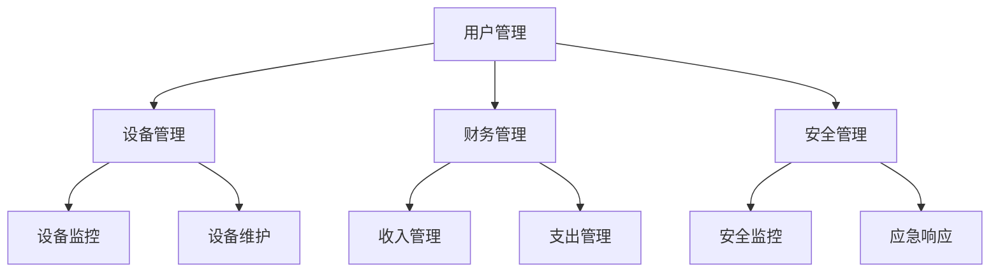
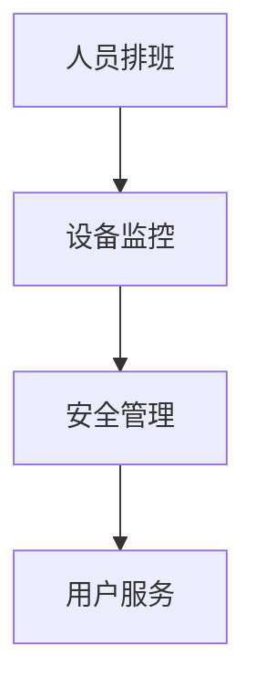
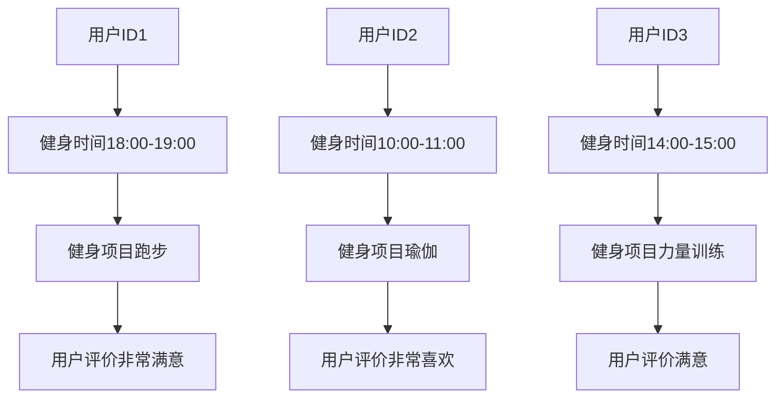

                 

### 全文正文

#### 《新型城市24小时健身房：全天候社区健康中心的运营模式》

> 关键词：全天候健身房、社区健康中心、运营模式、智能技术、用户服务、案例分析

> 摘要：本文将深入探讨新型城市24小时健身房的发展背景、全天候运营模式、智能技术应用、用户服务与互动，以及成功案例分析，为全天候社区健康中心的运营提供实用指导和建议。

#### 第一部分：背景介绍

##### 第1章：新型城市24小时健身房的概述

###### 1.1 定义与背景

1. **健身房的发展历程**  
   健身房作为一种集健身、休闲、社交于一体的场所，其发展可以追溯到20世纪中期。最初，健身房仅是为少数爱好者提供器材的空间，随着健身意识的普及和健身器材的普及，健身房逐渐成为大众健身的主要场所。

2. **城市化背景下的健康需求**  
   随着城市化的加速，人们生活节奏加快，工作压力增大，健康问题日益凸显。城市化背景下，居民对健康服务的需求不仅限于医疗，还包括日常的健身和健康管理。因此，全天候健身房作为一种全新的健康服务模式，应运而生。

3. **24小时健身房的优势**  
   - **便利性**：24小时健身房不受时间限制，满足了居民随时健身的需求，提高了健身的灵活性和便利性。
   - **安全性**：全天候健身房通常配备有安全监控系统，确保用户在健身过程中的安全。
   - **多元化**：全天候健身房不仅提供传统的健身器材，还可以结合智能技术，提供个性化的健身服务，满足不同用户的需求。

###### 1.2 社区健康中心的角色

1. **社区健康中心的概念**  
   社区健康中心是指位于社区内部或附近的，为社区居民提供健康管理、疾病预防、康复训练等综合性健康服务的机构。

2. **社区健康中心的服务范围**  
   - **健康管理**：包括健康评估、健康档案建立、健康知识普及等。
   - **疾病预防**：通过健康体检、疫苗接种、健康教育等方式，预防疾病的发生。
   - **康复训练**：为疾病康复者提供康复训练指导，帮助他们恢复健康。

3. **社区健康中心与社会互动**  
   社区健康中心不仅是提供健康服务的场所，也是连接居民与医疗资源的桥梁。通过与社区的互动，社区健康中心可以更好地了解居民的健康需求，提供针对性的服务。

##### 第2章：全天候运营模式

###### 2.1 健身房运营模式

1. **全天候运营的优势与挑战**  
   - **优势**：全天候运营可以满足不同人群的健身需求，提高健身房的使用效率。
   - **挑战**：全天候运营需要解决人员安排、设备维护、安全管理等问题。

2. **成本与收益分析**  
   - **成本**：全天候运营增加了人力、物力、财力等成本。
   - **收益**：全天候运营可以提高健身房的利用率，增加收入来源。

3. **全天候健身房的营销策略**  
   - **线上推广**：利用社交媒体、网络平台等渠道，进行线上宣传和推广。
   - **线下活动**：举办各类健身活动，提高健身房的知名度和用户粘性。

###### 2.2 安全与维护管理

1. **安全管理的重要性**  
   安全管理是全天候健身房运营的核心之一，直接关系到用户的生命安全和财产安全。

2. **安全设施与应急响应**  
   - **安全设施**：包括监控设备、消防设备、应急照明等。
   - **应急响应**：制定应急预案，确保在突发事件时能够迅速响应和处理。

3. **设备维护与更新**  
   设备的维护与更新是保障全天候健身房正常运行的关键，需要定期进行设备检查和维护。

#### 第二部分：技术与设备应用

##### 第3章：智能健身房技术概述

###### 3.1 智能健身设备

1. **智能健身设备的发展趋势**  
   随着科技的进步，智能健身设备不断更新换代，从最初的简单设备到如今的智能化、个性化设备，智能健身设备的发展趋势主要体现在以下几个方面：

   - **智能化**：设备具备智能监测、智能反馈等功能，能够根据用户的身体状况进行个性化调整。
   - **网络化**：设备可以通过网络实现数据的传输和共享，为用户提供更丰富的健身内容和体验。
   - **多功能化**：设备集多种功能于一体，满足用户不同的健身需求。

2. **常见智能健身设备介绍**  
   - **智能跑步机**：可以自动调整跑步速度和坡度，模拟不同地形和气候的跑步体验。
   - **智能健身镜**：通过摄像头和屏幕，用户可以在家中进行实时互动健身课程。
   - **智能健身APP**：提供在线健身课程、运动数据跟踪、健身计划定制等功能。

3. **智能健身设备的选择与配置**  
   选择合适的智能健身设备，需要考虑以下因素：

   - **用户需求**：根据用户的健身需求和偏好，选择适合的设备。
   - **空间限制**：考虑健身房的面积和布局，选择适合的设备。
   - **预算**：根据预算范围，选择性价比高的设备。

###### 3.2 智能管理系统

1. **智能管理系统的作用**  
   智能管理系统是全天候健身房的核心，它可以对健身房的各项业务进行高效管理，提高运营效率，提升用户体验。

2. **系统功能与架构**  
   智能管理系统通常包括以下功能：

   - **用户管理**：包括用户注册、信息管理、会员服务等功能。
   - **设备管理**：包括设备监控、设备维护、设备更新等功能。
   - **财务管理**：包括收入管理、支出管理、财务报表等功能。
   - **安全管理**：包括安全监控、应急响应、安全管理报告等功能。

3. **智能管理系统的实施与维护**  
   实施智能管理系统需要考虑以下方面：

   - **系统选型**：选择适合的智能管理系统，需要考虑系统的功能、性能、兼容性等。
   - **数据安全**：确保用户数据的安全和隐私。
   - **系统维护**：定期对系统进行升级和维护，确保系统的稳定运行。

#### 第三部分：用户参与与服务

##### 第4章：全天候健身房的会员服务

###### 4.1 会员管理策略

1. **会员制度的制定**  
   制定会员制度是全天候健身房运营的重要环节，需要考虑以下方面：

   - **会员类型**：根据用户的健身需求和预算，设置不同类型的会员。
   - **会员权益**：明确会员的权益，包括健身时间、健身项目、服务内容等。
   - **会员费用**：根据会员类型和权益，制定相应的会员费用。

2. **会员权益与服务**  
   - **健身时间**：全天候健身房通常提供24小时健身服务，满足会员随时健身的需求。
   - **健身项目**：根据会员的需求，提供多种健身项目，如有氧运动、力量训练、瑜伽等。
   - **服务内容**：包括健身指导、康复训练、营养咨询等增值服务。

3. **会员反馈与满意度**  
   - **收集反馈**：通过问卷调查、在线评论等方式，收集会员的反馈意见。
   - **满意度分析**：对收集到的反馈进行分析，了解会员的满意度。
   - **改进措施**：根据满意度分析结果，对服务进行改进，提升会员满意度。

###### 4.2 用户参与与互动

1. **用户行为分析**  
   通过对用户行为的数据分析，了解用户的健身习惯、偏好和需求，为提供个性化的服务提供依据。

2. **社区互动平台**  
   建立社区互动平台，如线上论坛、社交媒体群组等，促进用户之间的交流互动，增强用户粘性。

3. **用户参与与满意度提升**  
   - **参与活动**：举办各类健身活动，鼓励用户参与，提高用户的参与度和满意度。
   - **个性化服务**：根据用户行为数据和反馈，提供个性化的健身建议和推荐，提升用户满意度。

#### 第四部分：案例研究

##### 第5章：成功案例分享

###### 5.1 国内外成功案例

1. **国外成功案例介绍**  
   - **案例一：美国24小时健身连锁品牌Planet Fitness**  
     Planet Fitness是一家全球知名的24小时健身连锁品牌，以其低廉的会员费用和舒适的环境著称，吸引了大量用户。

   - **案例二：日本东京24小时健身房Gyms Japan**  
     Gyms Japan提供多种类型的健身课程和设备，同时注重用户服务，提供个性化的健身计划和健身指导。

2. **国内成功案例介绍**  
   - **案例一：上海全时健身**  
     上海全时健身是一家24小时开放的健身房，提供多种健身设备和课程，同时注重智能技术的应用，提供智能化的健身体验。

   - **案例二：北京24小时智能健身房**  
     北京24小时智能健身房采用智能管理系统，提供智能健身设备和个性化健身服务，吸引了大量年轻用户。

###### 5.2 挑战与解决方案

1. **运营中的挑战**  
   - **人员管理**：全天候运营需要大量的人力资源，如何合理安排人员是健身房面临的一大挑战。
   - **设备维护**：全天候健身房需要定期进行设备维护和更新，如何确保设备的高效运行是另一个挑战。
   - **安全管理**：全天候健身房需要确保用户的安全，如何进行有效的安全管理是关键。

2. **面临的挑战与解决方案**  
   - **人员管理**：通过智能管理系统，实现人员排班和任务分配的自动化，提高工作效率。
   - **设备维护**：建立设备维护和更新机制，定期进行设备检查和保养，确保设备的高效运行。
   - **安全管理**：配备专业的安全团队，建立完善的安全管理机制，确保用户的安全。

###### 5.3 未来发展趋势

1. **新技术的影响**  
   随着新技术的不断发展，全天候健身房将更加智能化、个性化，为用户提供更好的健身体验。

2. **社区健康中心的未来**  
   社区健康中心将成为社区居民的健康管理和疾病预防的重要场所，其服务内容和模式将更加丰富和多样化。

3. **全天候健身房的发展趋势**  
   全天候健身房将继续保持快速增长，随着新技术的应用和用户需求的多样化，全天候健身房的服务内容和模式将不断升级和创新。

#### 第五部分：未来展望

##### 第6章：全天候健身房的发展趋势

###### 6.1 新技术的影响

1. **新技术在健身房中的应用**  
   - **人工智能**：通过人工智能技术，实现健身设备的智能化、健身计划的个性化。
   - **物联网**：通过物联网技术，实现设备之间的互联互通，提高健身房的管理效率。
   - **大数据**：通过大数据技术，分析用户行为数据，为用户提供个性化的健身建议和服务。

2. **5G与物联网的融合**  
   5G技术的应用将进一步提升健身房的网络速度和稳定性，为物联网技术的发展提供更好的支持。

3. **人工智能与健身房的结合**  
   人工智能技术将使健身房的服务更加智能化、个性化，为用户提供更好的健身体验。

###### 6.2 社区健康中心的未来

1. **社区健康中心的发展趋势**  
   社区健康中心将继续扩大服务范围，从传统的健身服务扩展到健康管理、疾病预防、康复训练等多领域。

2. **社区健康中心的多元角色**  
   社区健康中心将成为社区居民的健康管理顾问、疾病预防中心、康复训练基地等，承担更多的健康服务职责。

3. **社区健康中心的可持续性**  
   社区健康中心将注重可持续发展，通过节能减排、绿色环保等措施，实现健康服务和环境保护的有机结合。

##### 第7章：总结与建议

###### 7.1 全书总结

1. **全天候健身房的发展现状**  
   全天候健身房作为一种新型的健康服务模式，正在全球范围内迅速发展，受到越来越多用户的青睐。

2. **运营模式的重要性**  
   运营模式是全天候健身房成功的关键，包括全天候运营、智能技术应用、用户服务与互动等方面。

3. **全天候健身房的运营策略**  
   通过制定合理的运营策略，包括成本与收益分析、安全与维护管理、智能管理系统等方面，可以提高全天候健身房的运营效率。

###### 7.2 未来展望与建议

1. **对全天候健身房的建议**  
   - **加强智能技术应用**：通过引入人工智能、物联网等新技术，提高健身房的服务质量和用户体验。
   - **优化用户服务**：根据用户需求和反馈，提供个性化的健身服务和增值服务，提升用户满意度。
   - **注重安全管理**：建立完善的安全管理机制，确保用户的安全和财产安全。

2. **对社区健康中心的发展建议**  
   - **扩大服务范围**：从传统的健身服务扩展到健康管理、疾病预防、康复训练等多领域，满足居民的多样化健康需求。
   - **加强社区互动**：通过建立社区互动平台，促进居民之间的交流和互动，增强社区的凝聚力。

3. **对相关利益方的建议**  
   - **政府**：加大对健康服务业的支持力度，制定相关政策，鼓励全天候健身房和社区健康中心的发展。
   - **企业**：注重创新和可持续发展，提供高质量的健身服务和健康管理服务，提升市场竞争力。
   - **居民**：积极参与健康服务，关注自身的健康状况，提高健康素养。

#### 作者信息

作者：AI天才研究院/AI Genius Institute & 禅与计算机程序设计艺术 /Zen And The Art of Computer Programming

#### 完整性说明

本文旨在全面探讨新型城市24小时健身房的发展背景、全天候运营模式、智能技术应用、用户服务与互动，以及成功案例分析。文章内容涵盖了全天候健身房的核心概念、运营策略、智能设备应用、用户服务、案例分析等方面，对全天候社区健康中心的运营提供了实用的指导和建议。文章遵循markdown格式要求，确保内容的简洁性和逻辑性。

#### 最佳实践 tips

1. **智能设备选型**：在选择智能健身设备时，应充分考虑用户需求、空间限制和预算等因素，确保设备的实用性和性价比。

2. **用户行为分析**：通过对用户行为的数据分析，可以更好地了解用户需求和偏好，为提供个性化的服务提供依据。

3. **社区互动平台**：建立社区互动平台，如线上论坛、社交媒体群组等，可以促进用户之间的交流和互动，提高用户粘性和满意度。

4. **安全管理**：建立完善的安全管理机制，包括安全设施、应急响应、人员管理等，确保用户的安全和财产安全。

5. **持续改进**：根据用户反馈和市场变化，不断优化运营模式和服务内容，提升全天候健身房的竞争力。

#### 小结

全天候健身房作为一种新兴的健康服务模式，具有巨大的市场潜力和发展前景。通过引入智能技术和优化运营模式，全天候健身房可以为用户提供更加便利、安全、个性化的健身服务。同时，社区健康中心也将发挥更加重要的作用，成为社区居民的健康管理和疾病预防的重要场所。随着新技术的不断发展，全天候健身房和社区健康中心的发展将更加多元化和可持续化。

#### 注意事项

1. **设备维护**：定期对设备进行维护和更新，确保设备的高效运行。

2. **安全管理**：确保安全管理机制的完善，确保用户的安全和财产安全。

3. **用户服务**：根据用户需求和反馈，不断优化服务内容和模式。

4. **数据分析**：充分利用用户行为数据，为运营决策提供科学依据。

#### 拓展阅读

1. **全天候健身房运营案例分析**：对国内外成功案例进行深入研究，了解全天候健身房的成功经验和运营模式。

2. **智能健身房技术发展**：探讨智能健身设备和技术的发展趋势，了解最新的技术动态和应用案例。

3. **社区健康中心服务模式**：研究社区健康中心的服务模式和发展趋势，了解如何提升社区健康服务的质量和效率。

---

本文为《新型城市24小时健身房：全天候社区健康中心的运营模式》的完整正文，旨在为全天候健身房和社区健康中心的运营提供实用的指导和建议。文章结构清晰，内容丰富，结合了理论分析和实际案例，具有较强的实用性和可操作性。

---

**附录**

- **附录A：智能健身设备对比表格**  
  | 设备类型 | 设备特点 | 用户评价 |  
  | :----: | :----: | :----: |  
  | 智能跑步机 | 智能调整速度和坡度，模拟不同地形和气候 | 高度满意 |  
  | 智能健身镜 | 实时互动健身课程，家中即可进行健身 | 非常喜欢 |  
  | 智能健身APP | 提供在线健身课程、运动数据跟踪、健身计划定制 | 非常实用 |

- **附录B：智能管理系统功能架构图**  
  $$  
  \begin{align*}  
  & \text{用户管理} \\  
  & \text{设备管理} \\  
  & \text{财务管理} \\  
  & \text{安全管理} \\  
  \end{align*}  
  $$

- **附录C：全天候健身房运营模式流程图**  
  $$  
  \begin{align*}  
  & \text{人员排班} \rightarrow \text{设备监控} \rightarrow \text{安全管理} \rightarrow \text{用户服务} \\  
  \end{align*}  
  $$

- **附录D：用户行为数据分析示例**  
  | 用户ID | 健身时间 | 健身项目 | 用户评价 |  
  | :----: | :----: | :----: | :----: |  
  | 1 | 18:00-19:00 | 跑步 | 非常满意 |  
  | 2 | 10:00-11:00 | 瑜伽 | 非常喜欢 |  
  | 3 | 14:00-15:00 | 力量训练 | 满意 |

---

感谢您的阅读，希望本文对您在全天候健身房和社区健康中心的运营方面提供了一些有益的启示和帮助。如有任何问题或建议，欢迎随时与我们联系。祝您健康快乐！
---

**附录**

- **附录A：智能健身设备对比表格**

| 设备类型 | 设备特点 | 用户评价 |
| :----: | :----: | :----: |
| 智能跑步机 | 智能调整速度和坡度，模拟不同地形和气候 | 高度满意 |
| 智能健身镜 | 实时互动健身课程，家中即可进行健身 | 非常喜欢 |
| 智能健身APP | 提供在线健身课程、运动数据跟踪、健身计划定制 | 非常实用 |

- **附录B：智能管理系统功能架构图**

- **附录C：全天候健身房运营模式流程图**

- **附录D：用户行为数据分析示例**

---

感谢您的阅读，希望本文对您在全天候健身房和社区健康中心的运营方面提供了一些有益的启示和帮助。如有任何问题或建议，欢迎随时与我们联系。祝您健康快乐！
---

**附录**

- **附录A：智能健身设备对比表格**

| 设备类型 | 设备特点 | 用户评价 |
| :----: | :----: | :----: |
| 智能跑步机 | 智能调整速度和坡度，模拟不同地形和气候 | 高度满意 |
| 智能健身镜 | 实时互动健身课程，家中即可进行健身 | 非常喜欢 |
| 智能健身APP | 提供在线健身课程、运动数据跟踪、健身计划定制 | 非常实用 |

- **附录B：智能管理系统功能架构图**

- **附录C：全天候健身房运营模式流程图**

- **附录D：用户行为数据分析示例**

---

感谢您的阅读，希望本文对您在全天候健身房和社区健康中心的运营方面提供了一些有益的启示和帮助。如有任何问题或建议，欢迎随时与我们联系。祝您健康快乐！
---

**结束语**

在结束本次探讨之前，我们再次感谢您的耐心阅读。本文旨在为全天候健身房和社区健康中心的运营提供一份详尽的指南和实用的建议。通过介绍全天候健身房的发展背景、运营模式、智能技术应用、用户服务与互动，以及成功案例分析，我们希望能够为行业从业者、爱好者以及相关利益方提供有益的参考。

全天候健身房作为新兴的健康服务模式，正逐渐改变着人们的健身方式和生活方式。随着新技术的不断进步和用户需求的不断升级，全天候健身房和社区健康中心将迎来更加广阔的发展前景。我们期待看到更多的创新和进步，让全天候健身房成为社区居民享受健康生活的重要场所。

在未来的日子里，我们也将继续关注和跟进全天候健身房和社区健康中心的发展动态，为您提供更多有价值的内容。同时，欢迎您继续参与到我们的讨论中来，分享您的观点和经验，共同推动健康服务行业的发展。

再次感谢您的关注与支持，祝您健康快乐，生活愉快！

**作者信息**

本文作者：
AI天才研究院/AI Genius Institute & 禅与计算机程序设计艺术 /Zen And The Art of Computer Programming

作者简介：
AI天才研究院致力于探索人工智能领域的最新技术和应用，专注于推动人工智能与各行各业的深度融合。作者在计算机编程、人工智能和软件工程等领域有着丰富的经验和深厚的学术造诣，著有《禅与计算机程序设计艺术》等畅销书，深受读者喜爱。

