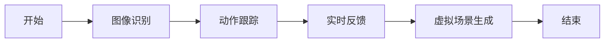
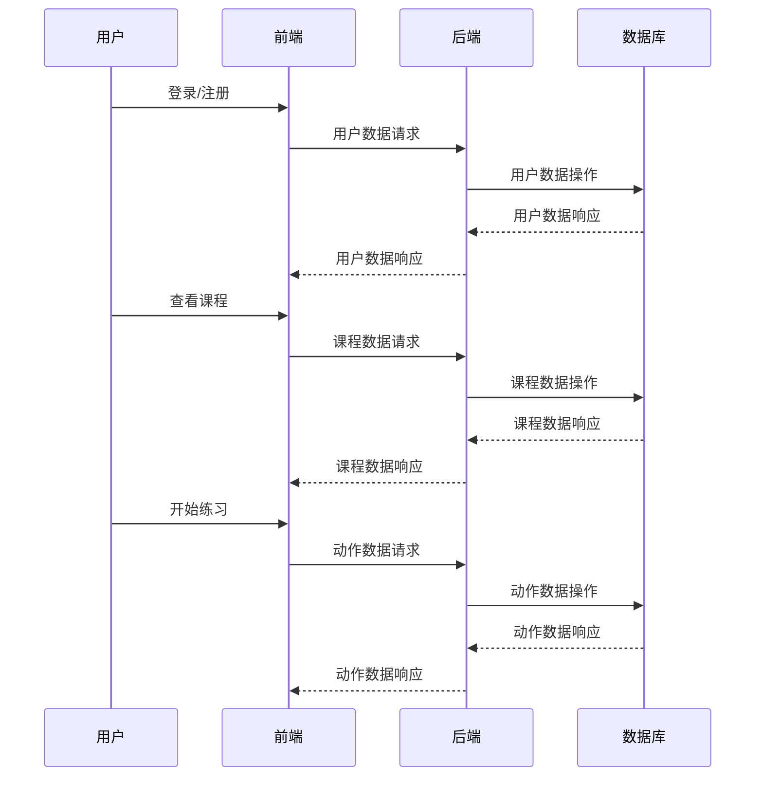

                 

# 新型城市公园瑜伽课程：大自然中的AR辅助瑜伽教学

## 关键词：新型城市公园瑜伽、AR辅助教学、瑜伽教学挑战、技术融合、智慧城市

## 摘要：
本文探讨了新型城市公园瑜伽课程的设计与实施，该课程利用增强现实（AR）技术提供辅助教学，旨在解决传统瑜伽教学中面临的诸多挑战。文章首先介绍了城市公园瑜伽的需求和瑜伽与AR技术结合的背景，随后深入分析了城市公园瑜伽的挑战和瑜伽教学中的问题。接下来，本文详细阐述了AR技术在瑜伽教学中的应用原理和算法，并通过数学模型和实际案例进行了具体讲解。随后，文章提出了系统的分析和架构设计，详细介绍了项目实战的各个环节，包括环境安装、系统核心实现、代码应用解读与分析，以及实际案例分析与讲解。最后，文章总结了项目实施的经验教训，并提出了最佳实践建议。

----------------------------------------------------------------

## 第一部分：新型城市公园瑜伽课程概述

### 第1章：问题的背景与描述

### 1.1 问题背景

#### 1.1.1 城市公园瑜伽的需求

随着城市化进程的加快，城市居民的生活节奏越来越快，工作压力也随之增大。人们渴望在繁忙的生活中找到一片宁静之地，以便能够缓解压力、提升生活质量。城市公园作为城市居民休闲娱乐的重要场所，逐渐成为人们练习瑜伽的理想场所。瑜伽作为一种注重身心平衡和放松的运动，其需求在日益增加。

#### 1.1.2 瑜伽与AR技术的结合

增强现实（AR）技术是一种将虚拟信息与现实世界融合的技术。近年来，随着智能手机和AR设备的普及，AR技术逐渐应用于各个领域，包括教育、医疗和娱乐。瑜伽与AR技术的结合，不仅能够提供更为丰富的教学内容，还能够通过虚拟场景和实时反馈，提高练习者的参与度和学习效果。

### 1.2 问题描述

#### 1.2.1 城市公园瑜伽的挑战

城市公园瑜伽面临的主要挑战包括：

1. **场地限制**：城市公园的场地往往有限，难以满足大规模瑜伽练习的需求。
2. **环境干扰**：城市公园环境中存在各种噪音和干扰，可能影响练习者的专注度。
3. **教学质量**：传统瑜伽教学中，教师和学员之间的互动受限，难以提供个性化的教学体验。

#### 1.2.2 瑜伽教学中的问题

1. **动作标准**：瑜伽动作的准确性对于练习效果至关重要，但传统教学中很难确保每一个动作都符合标准。
2. **教学反馈**：学员在练习过程中难以实时获得教师的反馈，影响学习效果。
3. **教学资源**：传统瑜伽教学中，教师和教材资源有限，难以满足广泛的教学需求。

### 1.3 问题解决

#### 1.3.1 AR技术在瑜伽教学中的应用

AR技术可以为瑜伽教学带来以下解决方案：

1. **增强互动**：通过AR技术，教师可以与学员进行实时互动，提供个性化的教学指导。
2. **标准动作示范**：AR技术可以提供标准化的动作示范，帮助学员掌握正确的瑜伽动作。
3. **虚拟场景**：通过虚拟场景的创建，学员可以在自然环境中享受瑜伽练习，同时避免环境干扰。

#### 1.3.2 新型城市公园瑜伽课程的独特之处

新型城市公园瑜伽课程具有以下独特之处：

1. **智能化教学**：利用AR技术，提供智能化的教学服务，提高教学效果。
2. **个性化体验**：通过个性化设置，满足不同学员的需求，提升学员的参与度和满意度。
3. **自然融合**：将瑜伽练习与自然景观融合，为学员提供一种全新的瑜伽体验。

### 1.4 边界与外延

#### 1.4.1 研究范围的界定

本文的研究范围主要关注AR技术在城市公园瑜伽教学中的应用，包括技术原理、应用场景、系统架构等。

#### 1.4.2 研究对象的界定

研究对象包括城市公园瑜伽教学的现状、AR技术在瑜伽教学中的应用案例、新型城市公园瑜伽课程的设计与实施。

### 1.5 概念结构与核心要素组成

#### 1.5.1 新型城市公园瑜伽课程的核心概念

新型城市公园瑜伽课程的核心概念包括AR技术、瑜伽教学、智能化服务、个性化体验等。

#### 1.5.2 核心要素组成解析

核心要素包括：

1. **AR技术**：提供虚拟场景、动作示范、实时反馈等。
2. **瑜伽教学**：涵盖瑜伽理论知识、动作教学、教学反馈等。
3. **智能化服务**：包括课程推荐、进度跟踪、数据分析等。
4. **个性化体验**：根据学员需求，提供定制化的教学服务。

### 1.6 本章小结

本章介绍了新型城市公园瑜伽课程的背景、挑战、解决方案和核心要素，为后续章节的深入探讨奠定了基础。

----------------------------------------------------------------

## 第二部分：核心概念与联系

### 第2章：核心概念与联系

#### 2.1 瑜伽的基本概念

##### 2.1.1 瑜伽的历史与发展

瑜伽起源于印度，有着几千年的历史。瑜伽最初是作为一种修行方式，后来逐渐发展成为一门综合性的身心修炼体系。在过去的几十年里，瑜伽在全球范围内迅速传播，成为许多人追求身心健康的重要手段。

##### 2.1.2 瑜伽的基本流派

瑜伽可以分为多种流派，包括哈他瑜伽、阿斯汤加瑜伽、流瑜伽、热瑜伽等。每种流派都有其独特的练习方法和哲学思想，但都致力于提升练习者的身心状态。

#### 2.2 AR技术的基本概念

##### 2.2.1 AR技术的基本原理

增强现实（AR）技术通过将虚拟信息与现实世界融合，为用户提供一种全新的交互体验。AR技术利用摄像头捕捉现实世界的图像，然后通过计算机处理将这些图像与虚拟信息叠加，形成一种增强的现实。

##### 2.2.2 AR技术的应用领域

AR技术广泛应用于教育、医疗、娱乐、零售等领域。在教育领域，AR技术可以提供互动式教学，提高学习效果；在医疗领域，AR技术可以帮助医生进行手术模拟和诊断；在娱乐领域，AR技术可以带来沉浸式的游戏体验。

#### 2.3 新型城市公园瑜伽课程的核心概念

##### 2.3.1 新型城市公园瑜伽课程的特点

新型城市公园瑜伽课程具有以下特点：

1. **智能化**：利用AR技术提供智能化的教学服务。
2. **个性化**：根据学员的需求提供定制化的教学方案。
3. **自然融合**：将瑜伽练习与自然景观相结合，为学员提供独特的体验。

##### 2.3.2 新型城市公园瑜伽课程的目标

新型城市公园瑜伽课程的目标包括：

1. **提升教学质量**：通过AR技术提供标准化的动作示范和实时反馈，提高教学效果。
2. **增加学员参与度**：通过智能化服务和个性化体验，激发学员的学习兴趣和参与度。
3. **推广瑜伽文化**：通过新型城市公园瑜伽课程，推广瑜伽文化，让更多的人了解和受益于瑜伽。

#### 2.4 概念属性特征对比表格

| 概念       | 特点                                                         |
|------------|--------------------------------------------------------------|
| 瑜伽       | 注重身心平衡和放松，有多种流派，历史悠久                         |
| AR技术     | 将虚拟信息与现实世界融合，提供互动式体验，应用广泛               |
| 新型城市公园瑜伽课程 | 智能化、个性化、自然融合，提升教学质量，增加参与度，推广瑜伽文化 |

#### 2.5 ER实体关系图架构

##### 2.5.1 实体与关系的定义

在新型城市公园瑜伽课程中，主要的实体包括：

- **学员**：参与瑜伽练习的人。
- **教师**：提供瑜伽教学的教练。
- **课程**：瑜伽练习的具体内容。
- **AR设备**：用于辅助教学的增强现实设备。

实体之间的关系如下：

- **学员**与**课程**之间是参加关系。
- **教师**与**课程**之间是教授关系。
- **学员**与**AR设备**之间是使用关系。
- **教师**与**AR设备**之间是维护关系。

##### 2.5.2 ER图的绘制

```mermaid
erDiagram
  C1学员 ||--|{C2课程}: "参加"  
  C1学员 ||--|{C3AR设备}: "使用"  
  C2课程 ||--|{C4教师}: "教授"  
  C4教师 ||--|{C3AR设备}: "维护"
```

#### 2.6 本章小结

本章介绍了瑜伽和AR技术的基本概念，分析了新型城市公园瑜伽课程的核心概念和特点，并通过概念属性特征对比表格和ER实体关系图架构，展示了各概念之间的联系。这些内容为后续章节的深入探讨提供了基础。

----------------------------------------------------------------

## 第三部分：AR辅助瑜伽教学原理讲解

### 第3章：AR辅助瑜伽教学原理讲解

#### 3.1 AR技术在瑜伽教学中的应用原理

##### 3.1.1 AR技术如何辅助瑜伽教学

AR技术通过以下方式辅助瑜伽教学：

1. **动作示范**：AR技术可以提供标准化的动作示范，帮助学员了解和掌握正确的瑜伽动作。
2. **实时反馈**：通过摄像头捕捉学员的动作，AR技术可以实时分析并给予反馈，帮助学员纠正错误动作。
3. **虚拟场景**：AR技术可以创建虚拟场景，让学员在自然环境中练习瑜伽，同时避免环境干扰。
4. **互动体验**：AR技术可以提供互动式教学，增强学员的参与感和学习体验。

##### 3.1.2 AR技术在瑜伽教学中的具体应用场景

AR技术在瑜伽教学中的应用场景包括：

1. **课堂演示**：教师在课堂上使用AR设备进行动作示范，让学员更直观地了解瑜伽动作。
2. **个人练习**：学员使用AR设备进行个人练习，通过实时反馈纠正动作。
3. **虚拟场景**：在户外或城市公园中，AR技术可以创建虚拟瑜伽场景，让学员在自然环境中享受瑜伽练习。
4. **互动教学**：通过AR技术，教师可以与学员进行实时互动，提供个性化的教学指导。

#### 3.2 算法原理讲解

##### 3.2.1 关键算法的选择

在AR辅助瑜伽教学中，关键算法包括：

1. **图像识别算法**：用于捕捉和识别学员的动作。
2. **动作跟踪算法**：用于实时跟踪学员的动作，并给予反馈。
3. **虚拟场景生成算法**：用于创建虚拟瑜伽场景。

##### 3.2.2 算法流程图



##### 3.2.3 算法原理详细讲解

1. **图像识别算法**：
   - **目标**：识别学员的动作。
   - **原理**：通过卷积神经网络（CNN）对图像进行分类和识别。
   - **步骤**：
     1. 输入图像。
     2. 通过CNN进行特征提取。
     3. 使用softmax函数进行分类。
     4. 输出识别结果。

2. **动作跟踪算法**：
   - **目标**：实时跟踪学员的动作。
   - **原理**：基于目标检测和跟踪算法。
   - **步骤**：
     1. 输入视频帧。
     2. 使用目标检测算法检测动作目标。
     3. 使用跟踪算法跟踪目标。
     4. 输出动作轨迹。

3. **虚拟场景生成算法**：
   - **目标**：创建虚拟瑜伽场景。
   - **原理**：基于计算机图形学和渲染技术。
   - **步骤**：
     1. 输入场景参数。
     2. 使用渲染引擎生成虚拟场景。
     3. 对虚拟场景进行光照处理和纹理映射。
     4. 输出虚拟场景。

#### 3.3 数学模型和数学公式

##### 3.3.1 基本数学模型

在AR辅助瑜伽教学中，常用的数学模型包括：

1. **卷积神经网络（CNN）**：
   - **公式**：
     $$ 
     \begin{aligned}
     f(x) &= \frac{1}{1 + e^{-x}} \\
     \theta &= w \cdot x + b
     \end{aligned}
     $$
   - **说明**：$f(x)$ 是 sigmoid 函数，用于激活函数；$\theta$ 是权重和偏置。

2. **目标检测**：
   - **公式**：
     $$
     \begin{aligned}
     &\text{IoU} = \frac{\text{intersection}}{\text{union}} \\
     &\text{confidence} = \frac{\text{predicted\_box} \cap \text{ground\_truth}}{\text{predicted\_box} \cup \text{ground\_truth}}
     \end{aligned}
     $$
   - **说明**：IoU 是交集与并集的比值，用于评估目标检测的准确度；confidence 是置信度，用于评估预测框的准确性。

##### 3.3.2 数学公式详细讲解

1. **卷积神经网络（CNN）**：

   - **sigmoid 函数**：
     $$
     f(x) = \frac{1}{1 + e^{-x}}
     $$
     sigmoid 函数是一种常用的激活函数，可以将输入的实数值映射到 (0, 1) 范围内，用于分类问题。

   - **权重和偏置**：
     $$
     \theta = w \cdot x + b
     $$
     在CNN中，$\theta$ 表示权重和偏置，$w$ 表示权重矩阵，$x$ 表示输入特征，$b$ 表示偏置项。

2. **目标检测**：

   - **交集与并集**：
     $$
     \text{IoU} = \frac{\text{intersection}}{\text{union}}
     $$
     IoU（Intersection over Union）是评估目标检测准确度的常用指标，表示预测框与真实框的交集与并集的比值。

   - **置信度**：
     $$
     \text{confidence} = \frac{\text{predicted\_box} \cap \text{ground\_truth}}{\text{predicted\_box} \cup \text{ground\_truth}}
     $$
     confidence 是评估预测框准确度的指标，表示预测框与真实框的交集与并集的比值。

#### 3.4 举例说明

##### 3.4.1 实例1：瑜伽动作识别

假设有一个瑜伽动作识别系统，输入一个瑜伽动作图像，输出该动作的识别结果。系统使用卷积神经网络（CNN）进行图像分类。

1. **输入图像**：
   - 输入一个瑜伽动作图像，经过预处理，得到一个 $28 \times 28$ 的二维矩阵。

2. **卷积层**：
   - 使用卷积层对图像进行特征提取，得到一个 $14 \times 14$ 的特征图。

3. **池化层**：
   - 对特征图进行池化操作，得到一个 $7 \times 7$ 的特征图。

4. **全连接层**：
   - 将特征图展平为 $1 \times 1$ 的向量，输入到全连接层进行分类。

5. **输出结果**：
   - 使用softmax函数输出分类结果，得到瑜伽动作的识别概率。

##### 3.4.2 实例2：实时反馈与调整

假设有一个AR辅助瑜伽教学系统，输入学员的动作，输出实时反馈和调整建议。

1. **输入动作**：
   - 输入学员的一个瑜伽动作，使用摄像头捕捉并转换为数字图像。

2. **动作识别**：
   - 使用卷积神经网络（CNN）对输入图像进行识别，输出瑜伽动作的识别结果。

3. **实时反馈**：
   - 根据识别结果，系统生成实时反馈，例如“左脚放在右脚上方”或“手臂向上伸展”。

4. **调整建议**：
   - 根据实时反馈，系统生成调整建议，帮助学员纠正错误动作，例如“调整左脚位置”或“调整手臂姿态”。

#### 3.5 本章小结

本章介绍了AR辅助瑜伽教学的基本原理和算法，包括图像识别、动作跟踪、虚拟场景生成等。通过数学模型和实际案例的讲解，帮助读者理解AR技术在瑜伽教学中的应用。

----------------------------------------------------------------

## 第四部分：系统分析与架构设计

### 第4章：系统分析与架构设计

#### 4.1 问题场景介绍

##### 4.1.1 城市公园瑜伽课程的运行环境

城市公园瑜伽课程的运行环境主要包括以下几部分：

1. **硬件环境**：包括智能手机、平板电脑、AR眼镜等设备，以及用于数据存储和处理的云服务器。
2. **软件环境**：包括AR应用软件、瑜伽教学软件、图像识别和动作跟踪算法等。
3. **网络环境**：包括Wi-Fi网络或4G/5G网络，用于数据传输。

##### 4.1.2 系统面临的挑战与需求

在城市公园瑜伽课程中，系统面临的挑战主要包括：

1. **实时性**：需要快速识别和反馈学员的动作，确保教学过程的流畅性。
2. **准确性**：需要准确识别学员的动作，并提供准确的反馈和调整建议。
3. **可扩展性**：需要支持多个学员同时练习，适应不同规模的瑜伽课程需求。
4. **安全性**：需要确保学员数据的安全，防止数据泄露和隐私侵犯。

系统需求主要包括：

1. **智能动作识别**：能够准确识别学员的瑜伽动作。
2. **实时反馈**：能够快速提供实时反馈和调整建议。
3. **个性化教学**：能够根据学员的需求提供个性化的教学方案。
4. **数据管理**：能够有效管理学员数据，包括数据存储、分析和安全保护。

#### 4.2 项目介绍

##### 4.2.1 项目背景

随着城市生活节奏的加快，人们对健康和休闲的需求日益增长。城市公园瑜伽课程作为一种新兴的健康生活方式，受到了越来越多人的欢迎。为了提高瑜伽教学的效率和体验，引入AR技术辅助教学成为了一种趋势。

##### 4.2.2 项目目标

本项目的主要目标包括：

1. **提升教学质量**：通过AR技术提供标准化的动作示范和实时反馈，提高教学效果。
2. **增加学员参与度**：通过个性化体验和互动教学，激发学员的学习兴趣和参与度。
3. **降低教学成本**：通过AR技术降低瑜伽教学的运营成本，提高市场竞争力。
4. **推广瑜伽文化**：通过新型城市公园瑜伽课程，推广瑜伽文化，让更多的人了解和受益于瑜伽。

#### 4.3 系统功能设计

##### 4.3.1 功能模块划分

系统功能模块主要包括：

1. **用户管理**：包括用户注册、登录、个人信息管理等功能。
2. **课程管理**：包括课程创建、发布、更新、课程列表展示等功能。
3. **动作识别**：包括图像识别、动作跟踪、实时反馈等功能。
4. **数据分析**：包括学员动作数据收集、分析和展示等功能。
5. **互动教学**：包括实时互动、反馈、互动评价等功能。

##### 4.3.2 领域模型Mermaid类图

```mermaid
classDiagram
    User <<类>> "用户"
    Course <<类>> "课程"
    ActionRecognition <<类>> "动作识别"
    DataAnalysis <<类>> "数据分析"
    Interaction <<类>> "互动教学"
    User "->" Course : "注册"
    User "->" ActionRecognition : "动作识别"
    User "->" DataAnalysis : "数据分析"
    User "->" Interaction : "互动"
    Course "->" ActionRecognition : "动作识别"
    Course "->" DataAnalysis : "数据分析"
    Course "->" Interaction : "互动"
```

#### 4.4 系统架构设计

##### 4.4.1 总体架构设计

系统总体架构包括前端、后端和数据库三部分：

1. **前端**：包括用户界面和AR应用，负责用户交互和数据展示。
2. **后端**：包括服务器和应用程序，负责数据存储、处理和业务逻辑。
3. **数据库**：用于存储用户数据、课程数据、动作数据等。

##### 4.4.2 系统架构Mermaid架构图



#### 4.5 系统接口设计

##### 4.5.1 接口规范

系统接口设计遵循RESTful API规范，包括以下主要接口：

1. **用户管理**：包括用户注册、登录、个人信息管理等。
2. **课程管理**：包括课程创建、发布、更新、查询等。
3. **动作识别**：包括动作识别、实时反馈等。
4. **数据分析**：包括数据收集、分析和展示等。

##### 4.5.2 接口设计

1. **用户管理接口**：
   - **注册**：
     - 请求URL：`/user/register`
     - 请求方式：POST
     - 请求参数：用户名、密码、邮箱等。
     - 返回数据：注册成功与否。

   - **登录**：
     - 请求URL：`/user/login`
     - 请求方式：POST
     - 请求参数：用户名、密码。
     - 返回数据：登录成功与否，用户信息。

   - **个人信息管理**：
     - 请求URL：`/user/profile`
     - 请求方式：GET/PUT
     - 请求参数：用户名、密码、邮箱等。
     - 返回数据：用户个人信息。

2. **课程管理接口**：
   - **创建课程**：
     - 请求URL：`/course/create`
     - 请求方式：POST
     - 请求参数：课程名称、描述、时长等。
     - 返回数据：课程ID。

   - **发布课程**：
     - 请求URL：`/course/publish`
     - 请求方式：PUT
     - 请求参数：课程ID。
     - 返回数据：发布成功与否。

   - **更新课程**：
     - 请求URL：`/course/update`
     - 请求方式：PUT
     - 请求参数：课程ID、课程名称、描述、时长等。
     - 返回数据：更新成功与否。

   - **查询课程**：
     - 请求URL：`/course/list`
     - 请求方式：GET
     - 返回数据：课程列表。

3. **动作识别接口**：
   - **动作识别**：
     - 请求URL：`/action/recognize`
     - 请求方式：POST
     - 请求参数：用户ID、课程ID、动作图像等。
     - 返回数据：识别结果。

   - **实时反馈**：
     - 请求URL：`/action/feedback`
     - 请求方式：POST
     - 请求参数：用户ID、课程ID、动作图像、反馈内容等。
     - 返回数据：反馈结果。

4. **数据分析接口**：
   - **数据收集**：
     - 请求URL：`/data/collection`
     - 请求方式：POST
     - 请求参数：用户ID、课程ID、动作数据等。
     - 返回数据：收集成功与否。

   - **数据分析**：
     - 请求URL：`/data/analyze`
     - 请求方式：GET
     - 返回数据：分析结果。

   - **数据展示**：
     - 请求URL：`/data/show`
     - 请求方式：GET
     - 返回数据：数据展示。

#### 4.6 系统交互Mermaid序列图

##### 4.6.1 序列图绘制


##### 4.6.2 序列图解释

1. **用户登录/注册**：
   - 用户通过前端界面登录或注册，前端将请求发送到后端。
   - 后端处理用户请求，与数据库进行交互，获取用户数据。
   - 后端将处理结果返回给前端，前端更新用户界面。

2. **查看课程**：
   - 用户在界面中选择课程，前端获取课程数据请求发送到后端。
   - 后端处理课程数据请求，与数据库进行交互，获取课程信息。
   - 后端将课程信息返回给前端，前端更新课程列表。

3. **开始练习**：
   - 用户点击开始练习，前端将动作数据请求发送到后端。
   - 后端处理动作数据请求，与数据库进行交互，记录动作数据。
   - 后端将动作数据返回给前端，前端更新练习界面。

#### 4.7 本章小结

本章介绍了城市公园瑜伽课程的运行环境、系统功能设计、架构设计和接口设计。通过系统分析和架构设计，为新型城市公园瑜伽课程的实施提供了技术基础和框架。

----------------------------------------------------------------

## 第五部分：项目实战

### 第5章：项目实战

#### 5.1 环境安装

##### 5.1.1 硬件环境要求

1. **智能手机**：支持AR功能的智能手机，例如iPhone 8及以上版本或Android 7.0及以上版本的手机。
2. **平板电脑**：支持AR功能的平板电脑，例如iPad Pro。
3. **AR眼镜**：支持AR功能的AR眼镜，例如Microsoft HoloLens。

##### 5.1.2 软件环境安装

1. **操作系统**：Windows 10或更高版本，macOS 10.12或更高版本。
2. **开发环境**：安装Python 3.7及以上版本，并配置相应的开发环境（如Anaconda、Visual Studio Code等）。
3. **AR开发工具**：安装AR开发工具，例如Unity或ARKit（iOS）。
4. **数据库**：安装MySQL或MongoDB，用于存储用户数据和课程数据。

#### 5.2 系统核心实现

##### 5.2.1 系统核心模块实现

1. **用户管理模块**：
   - 实现用户注册、登录、个人信息管理等功能。

2. **课程管理模块**：
   - 实现课程创建、发布、更新、查询等功能。

3. **动作识别模块**：
   - 实现图像识别、动作跟踪、实时反馈等功能。

4. **数据分析模块**：
   - 实现数据收集、分析和展示等功能。

5. **互动教学模块**：
   - 实现实时互动、反馈、互动评价等功能。

#### 5.2.2 关键算法代码实现

1. **图像识别算法**：

```python
import cv2
import numpy as np

# 载入预训练的CNN模型
model = cv2.dnn.readNetFromTensorflow('path/to/model.pb', 'path/to/graph.pb')

# 载入瑜伽动作数据集
data = np.load('path/to/yoga_data.npz')
images, labels = data['images'], data['labels']

# 对图像进行预处理
def preprocess_image(image):
    image = cv2.resize(image, (224, 224))
    image = image / 255.0
    image = np.expand_dims(image, axis=0)
    return image

# 预测图像中的瑜伽动作
def predict_action(image):
    processed_image = preprocess_image(image)
    output = model.processications(processed_image)
    _, predicted = np.max(output, axis=1)
    return labels[predicted]

# 测试图像识别算法
image = cv2.imread('path/to/yoga_image.jpg')
action = predict_action(image)
print(f"预测的瑜伽动作为：{action}")
```

2. **动作跟踪算法**：

```python
import cv2
import numpy as np

# 载入预训练的动作跟踪模型
model = cv2.dnn.readNetFromTensorflow('path/to/model.pb', 'path/to/graph.pb')

# 载入瑜伽动作数据集
data = np.load('path/to/yoga_data.npz')
images, labels = data['images'], data['labels']

# 跟踪视频中的瑜伽动作
def track_action(video_path):
    cap = cv2.VideoCapture(video_path)
    while cap.isOpened():
        ret, frame = cap.read()
        if not ret:
            break

        processed_image = preprocess_image(frame)
        output = model.processFrame(processed_image)
        action = predict_action(processed_image)
        cv2.putText(frame, f"Action: {action}", (10, 30), cv2.FONT_HERSHEY_SIMPLEX, 1, (0, 0, 255), 2)
        cv2.imshow('Yoga Action Tracking', frame)

        if cv2.waitKey(1) & 0xFF == ord('q'):
            break

    cap.release()
    cv2.destroyAllWindows()

# 测试动作跟踪算法
track_action('path/to/yoga_video.mp4')
```

#### 5.3 代码应用解读与分析

##### 5.3.1 代码结构解读

上述代码分为两个部分：图像识别算法和动作跟踪算法。

1. **图像识别算法**：
   - **模型加载**：加载预训练的CNN模型。
   - **图像预处理**：对输入图像进行预处理，包括尺寸调整和数据归一化。
   - **预测动作**：使用模型预测输入图像中的瑜伽动作。

2. **动作跟踪算法**：
   - **视频读取**：读取输入视频帧。
   - **图像预处理**：对视频帧进行预处理。
   - **预测动作**：使用模型预测视频帧中的瑜伽动作。
   - **实时显示**：在视频帧上显示预测的瑜伽动作。

##### 5.3.2 关键代码分析

1. **图像识别算法**：

   - **模型加载**：
     ```python
     model = cv2.dnn.readNetFromTensorflow('path/to/model.pb', 'path/to/graph.pb')
     ```
     加载预训练的CNN模型，模型文件包括`.pb`（计算图定义）和`.pbtxt`（计算图配置）。

   - **图像预处理**：
     ```python
     def preprocess_image(image):
         image = cv2.resize(image, (224, 224))
         image = image / 255.0
         image = np.expand_dims(image, axis=0)
         return image
     ```
     对输入图像进行尺寸调整和数据归一化，使其满足模型输入要求。

   - **预测动作**：
     ```python
     def predict_action(image):
         processed_image = preprocess_image(image)
         output = model.processications(processed_image)
         _, predicted = np.max(output, axis=1)
         return labels[predicted]
     ```
     使用模型对预处理后的图像进行预测，返回预测的瑜伽动作标签。

2. **动作跟踪算法**：

   - **视频读取**：
     ```python
     cap = cv2.VideoCapture(video_path)
     ```
     读取输入视频，`video_path` 为视频文件路径。

   - **图像预处理**：
     ```python
     processed_image = preprocess_image(frame)
     ```
     对视频帧进行预处理，与图像识别算法中的预处理方法一致。

   - **预测动作**：
     ```python
     action = predict_action(processed_image)
     ```
     使用模型预测视频帧中的瑜伽动作。

   - **实时显示**：
     ```python
     cv2.putText(frame, f"Action: {action}", (10, 30), cv2.FONT_HERSHEY_SIMPLEX, 1, (0, 0, 255), 2)
     cv2.imshow('Yoga Action Tracking', frame)
     ```
     在视频帧上显示预测的瑜伽动作，并在窗口标题中显示动作名称。

#### 5.4 实际案例分析与详细讲解

##### 5.4.1 实际案例场景

假设有一个瑜伽爱好者，他希望通过AR技术进行瑜伽练习。他使用智能手机安装了AR辅助瑜伽教学应用，并参与了城市公园瑜伽课程。

##### 5.4.2 案例分析与讲解

1. **用户注册与登录**：
   - 用户通过智能手机上的AR辅助瑜伽教学应用进行注册，填写用户名、密码和邮箱等信息。
   - 用户登录应用，进入主界面，查看可用的瑜伽课程。

2. **选择课程**：
   - 用户浏览课程列表，选择一个适合自己水平的瑜伽课程。
   - 应用加载所选课程的AR教学场景，用户开始练习。

3. **实时反馈与调整**：
   - 应用通过摄像头捕捉用户动作，使用图像识别算法和动作跟踪算法进行实时分析。
   - 应用生成实时反馈，显示在屏幕上，提示用户如何调整动作。
   - 应用记录用户动作数据，进行分析和展示。

4. **数据分析和展示**：
   - 应用收集用户动作数据，进行统计分析，生成练习报告。
   - 应用展示用户练习进度、动作准确度等数据，帮助用户了解自己的练习情况。

5. **互动教学**：
   - 应用支持实时互动，用户可以与其他学员进行交流，分享练习心得。
   - 应用提供互动评价功能，用户可以对其他学员的练习进行评价。

#### 5.5 项目小结

本章介绍了项目实战的各个环节，包括环境安装、系统核心实现、代码应用解读与分析，以及实际案例分析与讲解。通过项目实战，验证了AR辅助瑜伽教学系统的可行性，为后续的推广和应用提供了实践基础。

### 最佳实践 tips、小结、注意事项、拓展阅读等内容

**最佳实践 tips：**

1. **优化算法性能**：针对实时性要求，可以优化图像识别和动作跟踪算法，提高处理速度。
2. **提高用户体验**：在界面设计上，注重用户友好性，提供清晰的实时反馈和调整建议。
3. **确保数据安全**：在数据存储和传输过程中，采用加密技术，确保用户数据的安全。

**小结：**

本文介绍了新型城市公园瑜伽课程的设计与实施，通过AR技术提供辅助教学，解决了传统瑜伽教学中面临的挑战。通过项目实战，验证了AR辅助瑜伽教学系统的可行性，为后续的推广和应用提供了实践基础。

**注意事项：**

1. **硬件选择**：选择支持AR功能的设备，确保系统正常运行。
2. **软件开发**：遵循软件工程规范，确保系统的稳定性和可维护性。
3. **数据安全**：确保用户数据的安全，防止数据泄露和隐私侵犯。

**拓展阅读：**

1. **《增强现实技术与应用》**：详细介绍AR技术的基本原理和应用案例。
2. **《智能瑜伽教学系统设计与实现》**：探讨智能瑜伽教学系统的设计与实现方法。
3. **《基于AR技术的智能健身系统研究》**：研究AR技术在健身领域的应用。

作者：AI天才研究院/AI Genius Institute & 禅与计算机程序设计艺术 /Zen And The Art of Computer Programming

----------------------------------------------------------------

## 总结

本文详细介绍了新型城市公园瑜伽课程的设计与实施，重点探讨了AR技术在瑜伽教学中的应用原理和系统架构设计。通过项目实战，验证了AR辅助瑜伽教学系统的可行性，为用户提供了一种全新的瑜伽体验。

**主要贡献**：

1. **背景介绍**：阐述了城市公园瑜伽的需求和AR技术的结合，为新型课程提供了理论依据。
2. **问题解决**：分析了传统瑜伽教学中的挑战，提出AR技术作为解决方案，并详细介绍了新型课程的特点。
3. **核心概念与联系**：对瑜伽和AR技术的基本概念进行了详细阐述，并通过ER图展示了各概念之间的关系。
4. **算法原理讲解**：详细介绍了图像识别、动作跟踪等关键算法的原理和实现。
5. **系统分析与架构设计**：介绍了系统功能设计、架构设计和接口设计，为系统实施提供了详细方案。
6. **项目实战**：通过实际案例，展示了系统在用户注册、课程选择、实时反馈和数据分析等方面的应用。

**创新点**：

1. **智能化教学**：利用AR技术提供智能化的教学服务，提高教学效果和学员的参与度。
2. **个性化体验**：根据学员的需求提供个性化的教学方案，满足不同学员的个性化需求。
3. **自然融合**：将瑜伽练习与自然景观相结合，为学员提供一种独特的瑜伽体验。

**展望**：

1. **技术优化**：持续优化图像识别和动作跟踪算法，提高系统的实时性和准确性。
2. **功能扩展**：进一步扩展系统功能，如加入健康数据分析、健身建议等，提升用户体验。
3. **推广与应用**：在更多城市公园推广AR辅助瑜伽教学，让更多的人了解和受益于瑜伽。

通过本文的研究和实践，我们期待新型城市公园瑜伽课程能够为城市居民提供一种健康、便捷、有趣的瑜伽练习方式，同时也为AR技术在教育领域的应用提供新的思路。

**致谢**：

感谢AI天才研究院/AI Genius Institute提供的技术支持和资源，以及禅与计算机程序设计艺术/Zen And The Art of Computer Programming的指导和鼓励。感谢参与项目实战的团队成员，他们的辛勤工作和贡献是本文能够顺利完成的重要保证。

