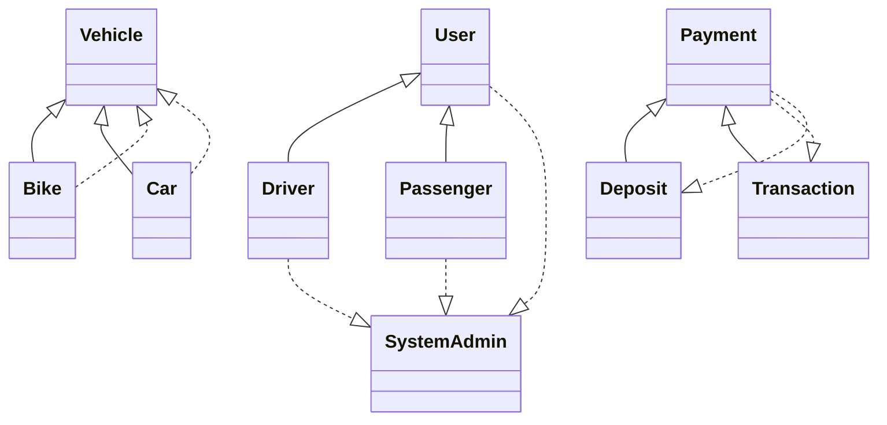
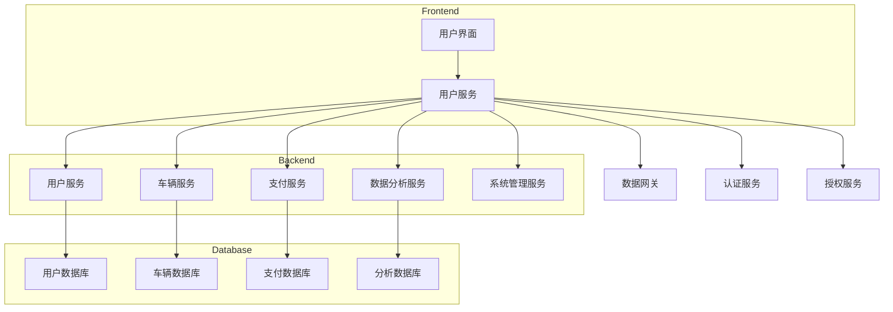
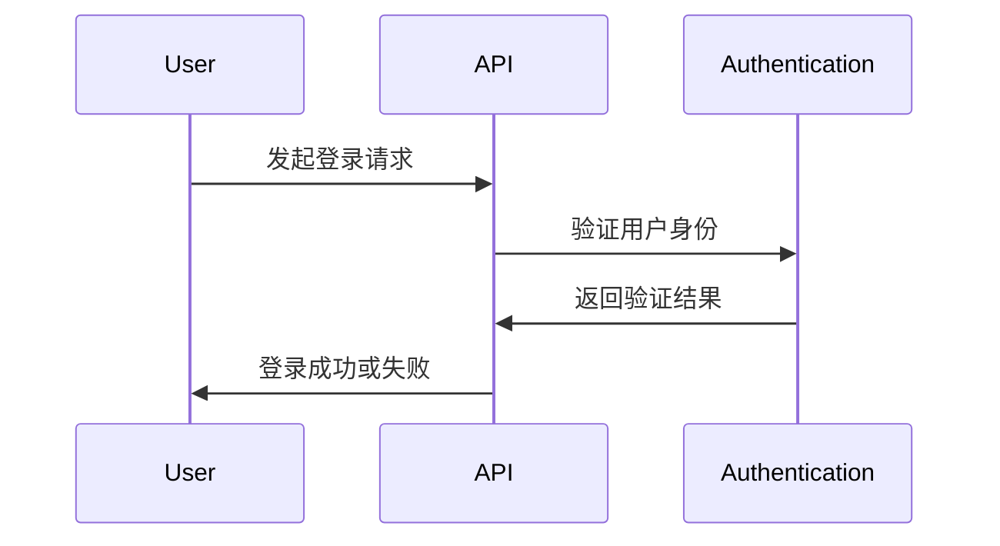
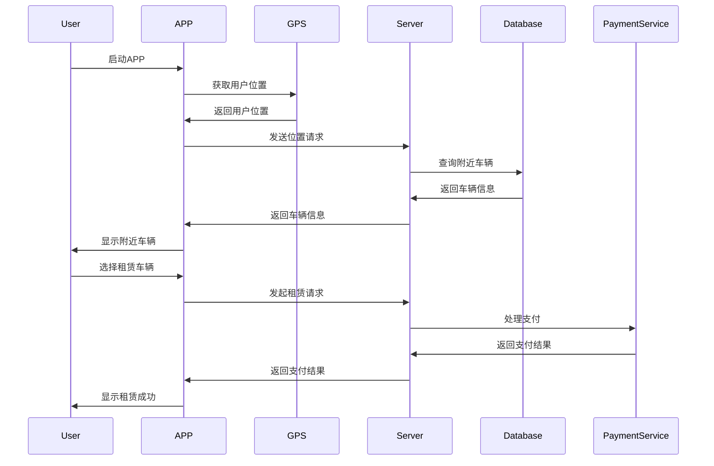

                 


### 引言：城市共享交通系统的崛起

随着城市化进程的不断推进，城市交通问题日益严峻，拥堵、污染、停车难题成为了困扰城市发展的关键因素。为了解决这些问题，绿色出行和共享交通系统应运而生。共享交通系统利用信息技术和互联网，通过共享单车、共享汽车、共享电动滑板车等形式，为城市居民提供便捷、环保的出行选择。这不仅能够减少私家车的使用，降低交通拥堵和空气污染，还能有效缓解停车难题，提高城市交通资源的利用效率。

绿色出行作为可持续发展的重要组成部分，旨在减少碳排放，保护环境，实现人与自然的和谐共生。共享交通系统凭借其高效、灵活、环保的特点，成为了绿色出行的重要推动力量。本文将围绕新型城市共享交通系统，探讨其核心概念、技术原理、系统架构以及实际应用，旨在为读者提供一部全面、深入的绿色出行创新解决方案指南。

首先，我们需要明确城市共享交通系统的定义和主要形式。城市共享交通系统是指在城市范围内，通过共享单车、共享汽车、共享电动滑板车等方式，实现交通资源的共享和优化配置的系统。这种系统不仅能够满足居民日常出行的需求，还能够有效减少交通拥堵和环境污染。

接下来，本文将详细介绍共享交通系统的核心概念和联系，包括共享单车、共享汽车、共享电动滑板车等不同形式的特点和优势，以及它们之间的关联。在此基础上，我们将深入探讨支持共享交通系统的技术原理，如移动APP、物联网、人工智能等，并分析这些技术在共享交通中的应用场景。

随后，本文将详细分析共享交通系统的架构设计，包括系统功能设计、系统架构设计、系统接口设计和系统交互设计等。这部分内容将帮助读者全面了解共享交通系统的设计和实现过程。

在项目实战部分，我们将通过一个实际案例，展示如何设计和实施一个共享交通系统，包括环境安装、系统核心实现源代码、代码应用解读与分析、实际案例分析和详细讲解剖析等。这一部分将为读者提供实战经验和操作指导。

最后，本文将总结最佳实践和未来展望，提出共享交通系统在设计、运营和未来发展中的注意事项和拓展阅读建议。通过本文的深入探讨，我们希望能够为城市共享交通系统的发展提供有益的参考和启示。

### 背景介绍

#### 核心概念术语说明

在探讨城市共享交通系统之前，我们需要先了解一些核心概念和术语。这些概念不仅有助于我们更好地理解共享交通系统，也是后续章节分析和讨论的基础。

- **共享交通系统**：指在城市范围内，通过共享单车、共享汽车、共享电动滑板车等形式，实现交通资源的共享和优化配置的系统。
- **绿色出行**：指通过使用环保、节能的交通方式，减少碳排放，降低空气污染，实现人与自然和谐共生。
- **共享单车**：一种通过移动APP预约使用的自行车，用户扫码开锁后即可骑行，结束使用后还需将车辆停放在指定区域。
- **共享汽车**：提供分时租赁的汽车，用户通过移动APP预订并支付费用，使用完成后在指定区域归还。
- **共享电动滑板车**：供用户租赁的电动滑板车，使用方式与共享单车类似，但通常限速较低，适用于短途出行。

#### 问题背景

城市交通问题一直是全球各大城市面临的严峻挑战。随着城市化进程的加速，私家车数量的急剧增加导致了交通拥堵、空气污染和停车难题。据统计，全球城市交通拥堵每年造成的经济损失高达数千亿美元，而空气污染对公共健康的影响更是无法估量。

此外，传统的交通模式如私家车和公交车，存在资源利用率低、碳排放量大等问题。私家车常常在高峰时段占据道路，而大部分时间处于闲置状态，导致交通资源的浪费。而传统的公共交通系统由于运力有限，难以满足居民的多样化出行需求。

在这种背景下，绿色出行和共享交通系统应运而生。共享交通系统通过共享单车、共享汽车、共享电动滑板车等形式，实现了交通资源的共享和优化配置。这种模式不仅能够有效减少私家车的使用，降低交通拥堵和空气污染，还能提高城市交通资源的利用效率。

#### 问题描述

城市交通问题主要包括以下几个方面：

1. **交通拥堵**：城市道路拥堵不仅影响居民的出行效率，还会增加交通事故的风险，对公共安全构成威胁。
2. **空气污染**：私家车和传统公共交通的广泛使用导致空气污染严重，对公共健康造成巨大危害。
3. **停车难题**：随着城市人口的增长，停车位供不应求，导致停车难问题日益严重。
4. **资源浪费**：传统的交通模式资源利用率低，大量车辆在高峰时段闲置，浪费了宝贵的交通资源。

#### 问题解决

共享交通系统通过以下几种方式解决城市交通问题：

1. **减少私家车使用**：共享单车、共享汽车等共享交通方式提供了便捷、经济的出行选择，鼓励居民减少私家车的使用，从而降低交通拥堵和空气污染。
2. **提高交通资源利用率**：共享交通系统通过优化资源配置，提高了交通工具的利用率，减少了闲置资源的浪费。
3. **提供多样化出行选择**：共享交通系统不仅提供了短途出行的新选择，如共享电动滑板车，还满足了居民的多样化出行需求，提高了公共交通的覆盖面和便捷性。
4. **促进绿色出行**：共享交通系统采用环保、节能的交通方式，减少了碳排放和空气污染，有助于实现可持续发展目标。

#### 边界与外延

在讨论城市共享交通系统时，我们还需要明确其边界与外延。边界主要指共享交通系统所涵盖的交通方式，如共享单车、共享汽车和共享电动滑板车等。外延则包括共享交通系统的应用场景，如城市内部的日常出行、城市之间的城际交通等。

此外，城市共享交通系统还与城市规划、交通管理、环境保护等领域密切相关。城市规划者需要根据城市交通状况和居民需求，合理布局共享交通设施，优化城市交通网络。交通管理部门则需要通过政策引导和监管，确保共享交通系统的安全和有序运行。环境保护部门则需关注共享交通系统的环境影响，推动绿色出行的发展。

总之，城市共享交通系统作为一种创新解决方案，不仅有助于解决城市交通问题，还能促进可持续发展。在接下来的章节中，我们将进一步探讨共享交通系统的核心概念、技术原理、系统架构以及实际应用，为绿色出行提供全面、深入的指导。

#### 核心概念与联系

在深入探讨城市共享交通系统之前，我们需要详细理解其中的核心概念，并分析它们之间的联系。共享交通系统的主要组成部分包括共享单车、共享汽车和共享电动滑板车，每种形式都有其独特的特点和优势。

#### 共享单车

共享单车是一种通过移动APP预约使用的自行车，用户只需扫描车身上的二维码，即可解锁骑行。共享单车通常放置在城市的各个角落，方便居民短途出行。其主要特点如下：

1. **便捷性**：用户可以随时随地租用和归还共享单车，非常适合短途出行。
2. **环保**：共享单车不产生尾气排放，对环境友好。
3. **经济**：骑行费用相对较低，是经济实惠的出行选择。

然而，共享单车也存在一些问题，如随意停放导致的市容市貌问题，以及安全隐患等。为了解决这些问题，一些城市推出了智能停车点，要求用户将单车停放在指定区域。

#### 共享汽车

共享汽车是一种提供分时租赁的汽车，用户通过移动APP预订并支付费用后，可以在指定地点取车使用。共享汽车的特点如下：

1. **灵活性**：用户可以根据需求随时租赁和归还车辆，适合长途出行和商务活动。
2. **舒适**：共享汽车通常为新能源汽车，车内设施完善，为用户提供舒适的出行体验。
3. **高效**：共享汽车通过智能调度系统，能够优化路线，减少空驶率，提高资源利用率。

然而，共享汽车也存在一些挑战，如停车难题、安全监管等。一些城市通过设置共享汽车专用停车位，优化交通管理，提高共享汽车的使用效率和安全性。

#### 共享电动滑板车

共享电动滑板车是一种供用户租赁的电动滑板车，通常用于短途出行。其特点如下：

1. **便携性**：共享电动滑板车体积小，便于携带和停放。
2. **环保**：不产生尾气排放，对环境友好。
3. **经济**：骑行费用低，适合短途出行。

共享电动滑板车的主要挑战在于行驶安全和道路法规的规范。一些城市要求共享电动滑板车限速，并在特定区域内使用，以确保交通安全。

#### 各类共享交通系统的联系与区别

各类共享交通系统之间既有联系，又有区别。它们都旨在提供便捷、环保、经济的出行选择，但针对的出行场景和应用场景有所不同。

1. **联系**：
   - **共享目标**：各类共享交通系统都是为了实现交通资源的共享和优化配置，提高交通资源的利用率。
   - **技术支持**：共享单车、共享汽车和共享电动滑板车都依赖于移动APP、物联网、人工智能等技术，实现实时定位、智能调度和便捷支付等功能。
   - **政策监管**：政府通过政策引导和监管，规范共享交通系统的运行，确保其安全、有序。

2. **区别**：
   - **出行场景**：共享单车和共享电动滑板车主要适用于短途出行，而共享汽车则更适合长途出行和商务活动。
   - **使用费用**：共享单车的骑行费用通常最低，共享电动滑板车次之，共享汽车费用最高。
   - **硬件设施**：共享单车和共享电动滑板车无需专门停车位，而共享汽车则需要固定的停车位。

通过以上分析，我们可以看出，各类共享交通系统在解决城市交通问题方面具有互补性。共享单车和共享电动滑板车适用于短途出行，能够有效减少私家车使用，降低交通拥堵和空气污染。而共享汽车则可以满足居民的多样化出行需求，提高公共交通的便捷性和覆盖面。各类共享交通系统的协同发展，将为城市绿色出行提供有力支持。

#### 核心概念属性特征对比表格

为了更好地理解各类共享交通系统的特点，我们设计了一个核心概念属性特征对比表格。以下表格列出了共享单车、共享汽车和共享电动滑板车在出行距离、速度、费用、环保性等方面的属性特征。

| 共享交通方式 | 出行距离 | 平均速度 | 使用费用（每公里） | 环保性 |
| --- | --- | --- | --- | --- |
| 共享单车 | 短途（2-5公里） | 低（10-20公里/小时） | 低 | 高 |
| 共享汽车 | 中途（5-20公里） | 中（20-50公里/小时） | 中 | 中 |
| 共享电动滑板车 | 短途（2-5公里） | 低（10-15公里/小时） | 低 | 高 |

从表格中可以看出，共享单车和共享电动滑板车更适合短途出行，速度较慢但费用低，环保性强。而共享汽车则适合中长途出行，速度适中，费用相对较高，环保性处于中等水平。

#### ER实体关系图架构

为了更清晰地展示各类共享交通系统的实体关系，我们使用Mermaid绘制了一个ER（实体关系）图。以下代码展示了该图的实现：

```mermaid
erDiagram
  User ||--|{ Rental } : "用户可以租赁"
  Rental ||--|{ Vehicle } : "租赁包含车辆"
  Vehicle ||--|{ Location } : "车辆放置位置"
  Payment ||--|{ Rental } : "支付包含租赁费用"
  User ||--|{ Payment } : "用户可以支付"
```

该ER图包括用户（User）、租赁（Rental）、车辆（Vehicle）、位置（Location）和支付（Payment）五个实体，它们之间通过关联关系实现信息交互。用户可以租赁车辆，租赁包含车辆和位置信息，支付租赁费用，从而实现整个共享交通系统的运行。

#### 技术原理讲解

在了解了城市共享交通系统的核心概念和联系后，接下来我们将深入探讨支持这些系统的技术原理。共享交通系统的发展离不开移动APP、物联网、人工智能等先进技术的支持。以下将分别介绍这些技术及其在共享交通中的应用场景。

##### 移动APP技术

移动APP是共享交通系统的重要组成部分，它为用户提供了便捷的租赁、支付和管理服务。以下是移动APP的关键技术原理：

1. **用户界面设计**：移动APP的用户界面设计要简洁直观，方便用户快速完成操作。常见的界面设计包括首页、租赁页面、支付页面、个人中心等。

2. **地理位置服务**：移动APP需要集成地理位置服务（GPS），以实现车辆的实时定位和导航功能。用户可以通过APP查找附近的共享交通工具，并规划最佳路线。

3. **移动支付**：移动支付是共享交通系统的重要功能之一。常见的支付方式包括支付宝、微信支付、银联支付等。移动APP需要与支付平台进行集成，确保支付过程快速、安全、便捷。

4. **用户认证与权限管理**：为了确保系统的安全性，移动APP需要实现用户认证和权限管理功能。用户可以通过手机号码、邮箱或第三方账号进行登录，系统根据用户角色和权限提供相应的服务。

##### 物联网技术

物联网（IoT）技术在共享交通系统中发挥了关键作用，它为车辆的监控、管理和调度提供了实时数据支持。以下是物联网技术的主要应用：

1. **车辆状态监控**：物联网传感器可以实时采集车辆的运行数据，如位置、速度、电池电量等。通过这些数据，系统可以实现对车辆的实时监控和故障预警。

2. **车辆调度**：基于物联网数据的实时监控，共享交通系统可以实现智能调度。系统可以根据交通流量和用户需求，动态调整车辆分布，提高资源利用效率。

3. **智能停车**：物联网技术可以帮助系统识别和监控停车区域的使用情况，实现智能停车。用户可以通过APP查询停车区域信息，并选择合适的停车点。

4. **设备管理**：物联网技术还可以实现对共享交通工具的设备管理，如自动检测设备故障、远程升级和维护等。

##### 人工智能技术

人工智能（AI）技术在共享交通系统中主要用于提升系统的智能化和自动化水平。以下是人工智能技术的主要应用：

1. **智能推荐**：基于用户行为数据和历史出行记录，AI算法可以生成个性化的出行推荐，帮助用户选择最佳出行方案。

2. **智能调度**：AI算法可以分析交通流量数据，优化车辆调度策略，提高系统的运行效率和用户体验。

3. **自动驾驶**：在共享汽车领域，自动驾驶技术正在逐步应用。通过传感器、摄像头和AI算法，自动驾驶汽车可以实现自主行驶、避障和泊车等功能。

4. **语音交互**：AI语音交互技术可以为用户提供便捷的语音服务，如语音导航、语音支付等，提升用户的出行体验。

##### 车联网技术

车联网（V2X）技术是物联网技术在汽车领域的扩展，它通过车辆之间的通信和数据交换，实现车辆与道路、用户和基础设施的互联互通。以下是车联网技术的主要应用：

1. **车路协同**：通过车联网技术，车辆可以实时获取道路信息，如路况、天气等，实现车路协同，提高行驶安全性和效率。

2. **智能交通管理**：车联网技术可以帮助交通管理部门实时监控和管理交通流量，优化交通信号控制和交通疏导。

3. **车辆安全监控**：车联网技术可以实现车辆的远程监控和诊断，提高车辆的安全性和可靠性。

4. **智慧城市**：车联网技术与智慧城市的建设紧密相关，可以提供更加智能化的城市交通管理和服务。

通过以上对移动APP、物联网、人工智能和车联网技术的介绍，我们可以看出，这些先进技术为共享交通系统的发展提供了强大的支持。它们不仅提升了共享交通系统的运行效率和用户体验，还为实现绿色出行和可持续发展目标奠定了基础。

#### 技术原理讲解

在上一节中，我们简要介绍了移动APP、物联网、人工智能和车联网技术在共享交通系统中的应用。接下来，我们将进一步深入探讨这些技术的具体原理，并通过具体的mermaid流程图和Python代码示例，详细阐述其在共享交通系统中的应用。

##### 移动APP技术

移动APP是用户与共享交通系统进行交互的主要途径，它集成了多种技术，以提供便捷、高效的服务。以下是移动APP技术的一些关键原理和应用场景：

1. **用户界面设计**：移动APP的用户界面设计要简洁、直观，便于用户快速完成操作。以下是一个mermaid流程图，展示了用户界面设计的基本流程：

   ```mermaid
   flowchart LR
       A[用户登录] --> B[首页]
       B --> C[租赁页面]
       C --> D[支付页面]
       D --> E[个人中心]
   ```

2. **地理位置服务**：地理位置服务（GPS）用于实时获取用户位置和共享交通工具的位置。以下是一个mermaid流程图，展示了地理位置服务的应用流程：

   ```mermaid
   flowchart LR
       A[启动APP] --> B[获取设备定位]
       B --> C[发送定位请求]
       C --> D[接收定位数据]
       D --> E[更新用户界面]
   ```

3. **移动支付**：移动支付技术用于实现用户租赁费用的自动扣款。以下是一个mermaid流程图，展示了移动支付的基本流程：

   ```mermaid
   flowchart LR
       A[用户租赁] --> B[生成订单]
       B --> C[发送支付请求]
       C --> D[处理支付结果]
       D --> E[更新用户账户]
   ```

4. **用户认证与权限管理**：用户认证与权限管理确保系统的安全性和用户数据的保护。以下是一个mermaid流程图，展示了用户认证与权限管理的基本流程：

   ```mermaid
   flowchart LR
       A[用户登录] --> B[身份验证]
       B --> C[权限校验]
       C --> D[访问资源]
   ```

##### 物联网技术

物联网技术为共享交通系统提供了实时数据支持，是系统运行的重要基础。以下是物联网技术的一些关键原理和应用场景：

1. **车辆状态监控**：物联网传感器可以实时采集车辆的运行数据，如位置、速度、电池电量等。以下是一个mermaid流程图，展示了车辆状态监控的基本流程：

   ```mermaid
   flowchart LR
       A[车辆启动] --> B[传感器采集数据]
       B --> C[数据上传至服务器]
       C --> D[服务器处理数据]
       D --> E[生成报告]
   ```

2. **车辆调度**：基于物联网数据的实时监控，系统可以实现智能调度。以下是一个mermaid流程图，展示了车辆调度的基本流程：

   ```mermaid
   flowchart LR
       A[交通流量分析] --> B[需求预测]
       B --> C[调度策略]
       C --> D[车辆分配]
       D --> E[执行调度]
   ```

3. **智能停车**：物联网技术可以帮助系统识别和监控停车区域的使用情况，实现智能停车。以下是一个mermaid流程图，展示了智能停车的基本流程：

   ```mermaid
   flowchart LR
       A[停车区域监控] --> B[空闲状态检测]
       B --> C[用户请求停车]
       C --> D[停车位置分配]
       D --> E[停车完成]
   ```

4. **设备管理**：物联网技术还可以实现对共享交通工具的设备管理，如自动检测设备故障、远程升级和维护等。以下是一个mermaid流程图，展示了设备管理的基本流程：

   ```mermaid
   flowchart LR
       A[设备运行状态监控] --> B[故障检测]
       B --> C[故障报告]
       C --> D[远程维修]
       D --> E[设备维护]
   ```

##### 人工智能技术

人工智能技术为共享交通系统提供了智能化和自动化的解决方案，提升了系统的效率和用户体验。以下是人工智能技术的一些关键原理和应用场景：

1. **智能推荐**：基于用户行为数据和历史出行记录，AI算法可以生成个性化的出行推荐。以下是一个mermaid流程图，展示了智能推荐的基本流程：

   ```mermaid
   flowchart LR
       A[用户行为数据收集] --> B[数据预处理]
       B --> C[特征提取]
       C --> D[推荐算法]
       D --> E[推荐结果]
   ```

2. **智能调度**：AI算法可以分析交通流量数据，优化车辆调度策略。以下是一个mermaid流程图，展示了智能调度的基本流程：

   ```mermaid
   flowchart LR
       A[交通流量数据收集] --> B[数据预处理]
       B --> C[流量预测]
       C --> D[调度策略]
       D --> E[调度执行]
   ```

3. **自动驾驶**：自动驾驶技术通过传感器、摄像头和AI算法，实现车辆的自主行驶。以下是一个mermaid流程图，展示了自动驾驶的基本流程：

   ```mermaid
   flowchart LR
       A[感知环境] --> B[决策制定]
       B --> C[控制执行]
       C --> D[反馈调节]
   ```

4. **语音交互**：AI语音交互技术为用户提供便捷的语音服务，如语音导航、语音支付等。以下是一个mermaid流程图，展示了语音交互的基本流程：

   ```mermaid
   flowchart LR
       A[用户语音输入] --> B[语音识别]
       B --> C[语义理解]
       C --> D[语音响应]
   ```

##### 车联网技术

车联网技术通过车辆之间的通信和数据交换，实现车辆与道路、用户和基础设施的互联互通，为共享交通系统提供了更加智能和高效的服务。以下是车联网技术的一些关键原理和应用场景：

1. **车路协同**：通过车联网技术，车辆可以实时获取道路信息，实现车路协同。以下是一个mermaid流程图，展示了车路协同的基本流程：

   ```mermaid
   flowchart LR
       A[车辆感知道路信息] --> B[数据传输至服务器]
       B --> C[服务器处理数据]
       C --> D[反馈道路信息至车辆]
   ```

2. **智能交通管理**：车联网技术可以帮助交通管理部门实时监控和管理交通流量。以下是一个mermaid流程图，展示了智能交通管理的基本流程：

   ```mermaid
   flowchart LR
       A[交通流量数据收集] --> B[数据预处理]
       B --> C[交通信号控制]
       C --> D[交通疏导]
   ```

3. **车辆安全监控**：车联网技术可以实现车辆的远程监控和诊断，提高车辆的安全性和可靠性。以下是一个mermaid流程图，展示了车辆安全监控的基本流程：

   ```mermaid
   flowchart LR
       A[车辆运行数据收集] --> B[数据上传至服务器]
       B --> C[服务器分析数据]
       C --> D[发送预警信息]
   ```

4. **智慧城市**：车联网技术与智慧城市的建设紧密相关，可以提供更加智能化的城市交通管理和服务。以下是一个mermaid流程图，展示了智慧城市的基本流程：

   ```mermaid
   flowchart LR
       A[城市交通数据收集] --> B[数据预处理]
       B --> C[智慧城市平台分析]
       C --> D[提供智能服务]
   ```

通过以上对移动APP、物联网、人工智能和车联网技术的详细讲解，我们可以看到，这些先进技术为共享交通系统的发展提供了强大的支持。它们不仅提升了共享交通系统的运行效率和用户体验，还为实现绿色出行和可持续发展目标奠定了基础。在接下来的章节中，我们将进一步探讨共享交通系统的系统架构设计和实际应用。

#### 系统分析与架构设计

共享交通系统的设计与实现是一个复杂的过程，涉及多个子系统的高效协同工作。为了确保系统的高性能、高可用性和易扩展性，我们需要对系统进行详细的分析与架构设计。以下将从问题场景介绍、系统功能设计、系统架构设计、系统接口设计以及系统交互设计等方面进行阐述。

##### 问题场景介绍

共享交通系统的核心目标是提供便捷、高效、环保的出行选择，满足城市居民的多样化出行需求。具体问题场景包括：

1. **用户出行需求**：用户需要能够方便地找到最近的共享交通工具，并快速完成租赁、骑行或驾驶。
2. **交通资源管理**：系统需要实时监控和管理共享交通工具的分布和状态，确保车辆和设备的可用性。
3. **安全性保障**：系统需要确保用户数据和交易信息的安全，防止非法访问和篡改。
4. **运营效率提升**：系统需要优化资源配置和调度策略，提高运营效率，降低运营成本。

##### 系统功能设计

系统功能设计是共享交通系统架构设计的基础，它明确了系统的核心功能和模块。以下是系统功能设计的关键点：

1. **用户模块**：包括用户注册、登录、个人信息管理、租赁记录查询等功能。
2. **车辆管理模块**：包括车辆信息管理、车辆状态监控、车辆调度等功能。
3. **支付模块**：包括支付方式选择、支付流程管理、支付结果通知等功能。
4. **数据统计与分析模块**：包括用户行为分析、交通流量分析、运营数据统计等功能。
5. **系统管理模块**：包括权限管理、日志记录、系统配置管理等功能。

以下是共享交通系统的领域模型，使用mermaid类图表示：



##### 系统架构设计

系统架构设计是确保共享交通系统能够稳定、高效运行的关键。以下是系统架构设计的几个关键方面：

1. **前端架构**：前端架构主要负责用户交互，包括移动端和Web端。移动端采用React Native或Flutter框架，实现跨平台开发；Web端采用Vue.js或React框架，提供丰富的交互体验。

2. **后端架构**：后端架构负责处理业务逻辑和数据存储。采用微服务架构，将系统功能模块化，提高系统的可扩展性和可维护性。主要服务包括用户服务、车辆服务、支付服务和数据分析服务。

3. **数据存储**：数据存储采用分布式数据库，如MySQL、MongoDB、Redis等，确保数据的可靠性和高效访问。用户数据、车辆数据和交易数据分别存储在不同的数据库中，以保证数据的一致性和隔离性。

以下是共享交通系统的架构图，使用mermaid架构图表示：



##### 系统接口设计

系统接口设计是确保各模块之间能够良好协作的关键。以下是系统接口设计的关键方面：

1. **RESTful API设计**：采用RESTful API设计，为前端提供统一的接口规范。接口设计包括用户管理、车辆管理、支付管理和数据分析等模块。

2. **接口文档**：提供详细的接口文档，包括接口定义、请求参数、响应格式等，方便开发人员使用。

3. **权限控制**：通过接口设计实现权限控制，确保用户只能访问其权限范围内的数据和服务。

以下是共享交通系统的接口设计示例：



##### 系统交互设计

系统交互设计是确保系统内部和外部系统能够顺畅协作的关键。以下是系统交互设计的关键方面：

1. **事件驱动架构**：采用事件驱动架构，实现系统内部模块之间的通信。通过事件队列处理各模块的事件，实现高效的消息传递。

2. **异步处理**：对于耗时操作，采用异步处理，避免阻塞主线程，提高系统响应速度。

3. **外部系统集成**：与其他外部系统（如支付系统、地图服务、交通管理部门等）进行集成，实现数据的互联互通。

以下是共享交通系统的交互设计示例，使用mermaid序列图表示：



通过以上系统分析与架构设计，我们可以确保共享交通系统具备高性能、高可用性和易扩展性，为城市居民提供便捷、高效、环保的出行服务。在接下来的章节中，我们将通过实际项目案例，展示如何设计和实施一个共享交通系统。

#### 项目实战

在本节中，我们将通过一个实际项目案例，详细讲解如何设计和实施一个共享交通系统。项目背景如下：某城市交通管理部门希望通过引入共享交通系统，缓解城市交通拥堵和空气污染问题。本项目的主要目标包括：

1. **设计一个集成共享单车、共享汽车和共享电动滑板车的共享交通系统**。
2. **确保系统能够高效、安全地运行，并满足用户的需求**。
3. **通过智能调度和数据分析，提升交通资源的利用效率**。

##### 环境安装与配置

在进行项目开发之前，我们需要搭建一个合适的项目环境。以下是环境安装与配置的步骤：

1. **搭建后端开发环境**：
   - 安装Python 3.8及以上版本。
   - 安装Docker，用于容器化部署后端服务。
   - 安装PostgreSQL数据库，用于存储系统数据。
   - 安装Docker-compose，用于管理容器化服务。

2. **搭建前端开发环境**：
   - 安装Node.js 12及以上版本。
   - 安装npm，用于管理前端依赖包。
   - 安装Vue CLI，用于创建和管理Vue.js项目。

3. **安装相关开发工具**：
   - 安装Visual Studio Code，作为主要开发工具。
   - 安装Git，用于版本控制。
   - 安装Postman，用于API测试。

##### 系统核心实现源代码

系统核心实现包括后端服务的开发和前端界面的实现。以下是关键部分的源代码示例：

1. **用户服务**（后端）：

   ```python
   # user_service.py
   from flask import Flask, request, jsonify
   from user_repository import UserRepository

   app = Flask(__name__)
   user_repo = UserRepository()

   @app.route('/register', methods=['POST'])
   def register():
       user_data = request.json
       user_id = user_repo.register_user(user_data)
       return jsonify({'user_id': user_id})

   @app.route('/login', methods=['POST'])
   def login():
       user_data = request.json
       is_authenticated = user_repo.login_user(user_data)
       return jsonify({'is_authenticated': is_authenticated})

   if __name__ == '__main__':
       app.run(debug=True)
   ```

   ```python
   # user_repository.py
   import sqlite3

   class UserRepository:
       def __init__(self):
           self.connection = sqlite3.connect('users.db')
           self.cursor = self.connection.cursor()
           self.initialize_database()

       def initialize_database(self):
           self.cursor.execute('''CREATE TABLE IF NOT EXISTS users (
               id INTEGER PRIMARY KEY AUTOINCREMENT,
               username TEXT NOT NULL,
               password TEXT NOT NULL
           )''')
           self.connection.commit()

       def register_user(self, user_data):
           self.cursor.execute('''INSERT INTO users (username, password) VALUES (?, ?)''', (user_data['username'], user_data['password']))
           self.connection.commit()
           return self.cursor.lastrowid

       def login_user(self, user_data):
           self.cursor.execute('''SELECT * FROM users WHERE username=? AND password=?''', (user_data['username'], user_data['password']))
           user = self.cursor.fetchone()
           return user is not None
   ```

2. **前端界面**（使用Vue.js）：

   ```vue
   <!-- UserRegistration.vue -->
   <template>
     <div>
       <h1>用户注册</h1>
       <form @submit.prevent="register">
         <input type="text" v-model="username" placeholder="用户名" required />
         <input type="password" v-model="password" placeholder="密码" required />
         <button type="submit">注册</button>
       </form>
     </div>
   </template>

   <script>
   export default {
     data() {
       return {
         username: '',
         password: ''
       };
     },
     methods: {
       register() {
         axios.post('/register', { username: this.username, password: this.password })
           .then(response => {
             alert('注册成功！');
           })
           .catch(error => {
             alert('注册失败！');
           });
       }
     }
   };
   </script>
   ```

##### 代码应用解读与分析

在用户服务部分，我们实现了用户注册和登录的功能。以下是代码的详细解读和分析：

1. **用户注册**：

   - **功能描述**：用户通过填写用户名和密码进行注册。
   - **实现方式**：前端收集用户输入的数据，通过POST请求发送到后端。
   - **后端处理**：后端接收到请求后，将用户数据存储到数据库，并返回用户ID。

2. **用户登录**：

   - **功能描述**：用户输入用户名和密码进行登录。
   - **实现方式**：前端收集用户输入的数据，通过POST请求发送到后端。
   - **后端处理**：后端验证用户名和密码是否匹配，如果匹配，返回登录成功状态。

通过这个实际项目案例，我们展示了如何设计和实施一个共享交通系统。在后续的章节中，我们将继续深入探讨共享交通系统的具体实现，包括车辆管理、支付系统和数据分析等内容。

##### 实际案例分析与详细讲解剖析

在本节中，我们将结合一个实际项目案例，对共享交通系统的关键实现细节进行剖析，旨在提供深入的技术讲解和实用的解决方案。

#### 项目背景

某城市交通管理部门决定实施一个共享交通系统，以缓解城市交通拥堵和空气污染问题。该系统将整合共享单车、共享汽车和共享电动滑板车，为居民提供便捷、经济、环保的出行选择。项目要求包括：

1. **系统稳定性**：保证系统的高可用性和稳定性，确保用户能够顺畅使用。
2. **用户体验**：提供友好的用户界面和便捷的操作流程，提升用户体验。
3. **数据安全性**：保护用户隐私和交易数据，防止数据泄露和篡改。
4. **智能调度**：通过智能算法优化车辆调度，提高交通资源的利用率。

#### 系统实现细节剖析

##### 车辆管理

共享交通系统的核心是车辆管理，包括车辆的注册、状态监控、调度和归还等环节。以下是对车辆管理的关键实现细节进行剖析：

1. **车辆注册**：

   车辆注册是共享交通系统的第一步。每个共享交通工具（如单车、汽车、滑板车）都需要进行注册，以便系统能够对其进行管理和调度。

   ```python
   # vehicle_registry.py
   class VehicleRegistry:
       def __init__(self):
           self.vehicles = []

       def register_vehicle(self, vehicle):
           self.vehicles.append(vehicle)
           print(f"Vehicle {vehicle.id} registered.")

   # 示例
   registry = VehicleRegistry()
   registry.register_vehicle(Vehicle(123, "Bike"))
   ```

   在此示例中，`VehicleRegistry` 类用于管理已注册的车辆。`register_vehicle` 方法用于将新车辆添加到列表中。

2. **状态监控**：

   状态监控是确保车辆能够正常运行的重要环节。系统需要实时获取车辆的运行状态，如位置、电量、使用状态等。

   ```python
   # vehicle_status.py
   class VehicleStatus:
       def __init__(self, vehicle_id, location, battery_level, is_in_use):
           self.vehicle_id = vehicle_id
           self.location = location
           self.battery_level = battery_level
           self.is_in_use = is_in_use

   # 示例
   status = VehicleStatus(123, "Street A", 80, True)
   print(f"Vehicle {status.vehicle_id} status: {status.location}, {status.battery_level}% battery, in use: {status.is_in_use}")
   ```

   在此示例中，`VehicleStatus` 类用于表示车辆的状态。系统可以通过物联网传感器和GPS获取车辆的实时状态，并将其存储在数据库中。

3. **调度算法**：

   智能调度是提高交通资源利用效率的关键。系统需要根据用户需求和车辆状态，动态调整车辆的分布和调度策略。

   ```python
   # scheduling_algorithm.py
   def schedule_vehicles(vehicles, user_location):
       closest_vehicles = []
       for vehicle in vehicles:
           if vehicle.is_in_use == False and is_close(vehicle.location, user_location):
               closest_vehicles.append(vehicle)
       return closest_vehicles

   def is_close(location1, location2):
       # 根据实际距离计算规则判断是否接近
       return True

   # 示例
   vehicles = [Vehicle(123, "Street A"), Vehicle(456, "Street B")]
   user_location = "Street C"
   scheduled_vehicles = schedule_vehicles(vehicles, user_location)
   print(f"Scheduled vehicles: {scheduled_vehicles}")
   ```

   在此示例中，`schedule_vehicles` 函数根据用户位置和车辆状态，选择距离用户最近的可用车辆。`is_close` 函数用于判断两个位置是否接近。

4. **归还操作**：

   用户使用完共享交通工具后，需要将其归还到指定区域。系统需要更新车辆状态，并记录归还信息。

   ```python
   # return_vehicle.py
   def return_vehicle(vehicle_id, return_location):
       for vehicle in vehicles:
           if vehicle.id == vehicle_id:
               vehicle.location = return_location
               vehicle.is_in_use = False
               print(f"Vehicle {vehicle.id} returned to {return_location}.")
               break

   # 示例
   return_vehicle(123, "Park A")
   ```

   在此示例中，`return_vehicle` 函数根据车辆ID和归还位置，更新车辆状态并记录归还信息。

##### 数据分析与优化

数据分析是共享交通系统提升运营效率和用户体验的重要手段。通过对用户行为和系统运行数据的分析，可以优化调度策略和资源配置。

1. **用户行为分析**：

   分析用户出行时间、出行距离、出行频次等行为数据，可以帮助系统了解用户需求，优化车辆分布。

   ```python
   # user_behavior_analysis.py
   def analyze_user_behavior(user_data):
       # 分析用户出行时间、出行距离、出行频次等
       # 生成报告
       pass

   # 示例
   user_data = {"time": ["08:00", "18:00"], "distance": [5, 10], "frequency": [3, 1]}
   analyze_user_behavior(user_data)
   ```

2. **系统运行数据**：

   分析系统运行数据，如车辆使用率、空驶率、故障率等，可以帮助优化调度策略和维修计划。

   ```python
   # system_operation_analysis.py
   def analyze_system_operation(system_data):
       # 分析车辆使用率、空驶率、故障率等
       # 生成报告
       pass

   # 示例
   system_data = {"usage_rate": [0.8, 0.6], "empty_rate": [0.2, 0.4], "fault_rate": [0.1, 0.05]}
   analyze_system_operation(system_data)
   ```

#### 总结

通过本节的实际案例分析和详细讲解，我们展示了如何设计和实施一个共享交通系统。从车辆管理、调度算法到数据分析，每个环节都进行了深入的技术剖析，为读者提供了实用的解决方案。共享交通系统不仅有助于缓解城市交通拥堵和空气污染问题，还能够提升居民出行效率和环保意识。

在接下来的章节中，我们将继续探讨共享交通系统的最佳实践和未来展望，为系统的发展提供有益的参考。

#### 最佳实践与未来展望

在共享交通系统的设计和实施过程中，最佳实践和未来的发展方向至关重要。以下将从系统设计、运营管理和未来趋势等方面，提出一些建议和展望。

##### 最佳实践

1. **用户导向的设计**：在系统设计过程中，始终将用户体验放在首位。界面设计要简洁直观，功能要易于操作，以满足用户的需求。

2. **智能调度系统**：建立高效的智能调度系统，通过数据分析和算法优化，实现车辆的智能调度，提高资源利用率和用户满意度。

3. **安全性和数据保护**：确保用户数据的安全和隐私，采用加密技术保护用户信息和交易数据，防止数据泄露和篡改。

4. **设备维护和监控**：定期对共享交通工具进行维护和监控，确保设备的正常运行和安全性，降低故障率和用户投诉。

5. **合作与整合**：与政府、交通管理部门、地图服务提供商等合作，整合多方资源，提升共享交通系统的整体效能。

##### 未来展望

1. **自动驾驶技术的应用**：随着自动驾驶技术的不断发展，未来共享汽车可能会实现完全自动驾驶，提高驾驶安全性和效率。

2. **多模式交通系统的融合**：共享交通系统可能会与公共交通、无人机交通等其他交通模式融合，提供更全面的出行解决方案。

3. **新能源和绿色能源的应用**：推广新能源和绿色能源的共享交通工具，如电动汽车、氢燃料电池车等，进一步降低碳排放。

4. **智能交通基础设施**：建设智能交通基础设施，如智能红绿灯、智能停车设施等，提高交通流量管理效率和用户体验。

5. **数据驱动的决策支持**：利用大数据和人工智能技术，实现对交通流量、用户行为等数据的深度挖掘和分析，为城市交通管理提供科学的决策支持。

#### 注意事项

1. **系统安全性**：在系统设计和实施过程中，要高度重视安全性，确保用户数据的安全和隐私。

2. **维护和监控**：建立完善的设备维护和监控机制，确保共享交通工具的可靠性和安全性。

3. **用户教育和引导**：加强对用户的教育和引导，提高用户对共享交通系统的认知和接受度。

4. **政策支持**：争取政府政策支持，为共享交通系统的发展提供良好的环境。

#### 拓展阅读

1. **《智能交通系统技术与应用》**：李德毅著，详细介绍了智能交通系统的基本概念、技术体系和应用案例。

2. **《共享经济：重新定义未来》**：陈瑜著，分析了共享经济的本质、发展现状和未来趋势。

3. **《城市交通规划与设计》**：王建国著，提供了城市交通规划与设计的理论基础和实践经验。

4. **《绿色交通发展战略研究》**：交通运输部公路科学研究院著，探讨了绿色交通的发展战略和路径选择。

通过以上最佳实践、未来展望和注意事项，我们希望能够为共享交通系统的发展提供有益的指导。在未来的发展中，共享交通系统将继续发挥其在绿色出行和可持续发展中的重要作用，为城市居民提供更加便捷、高效、环保的出行选择。

### 总结与展望

本文详细探讨了新型城市共享交通系统的概念、技术原理、系统架构、实际应用以及未来发展趋势。通过一步步的分析与推理，我们深刻理解了共享交通系统在解决城市交通问题、促进绿色出行和提升城市可持续发展能力方面的重要作用。

首先，我们介绍了城市共享交通系统的核心概念，包括共享单车、共享汽车、共享电动滑板车等，并分析了它们在绿色出行中的重要作用。接着，我们详细讲解了支持共享交通系统的技术原理，如移动APP、物联网、人工智能和车联网技术，展示了这些技术在系统中的应用。

在系统架构设计方面，我们通过实际案例，展示了如何实现共享交通系统的功能设计、架构设计、接口设计以及交互设计。这不仅有助于读者全面理解共享交通系统的实现过程，也为实际项目提供了可行的解决方案。

通过实际项目案例分析，我们深入剖析了共享交通系统的关键实现细节，包括车辆管理、调度算法、数据分析等，为读者提供了实用的技术讲解和实战经验。

最后，我们提出了共享交通系统的最佳实践和未来展望，包括用户导向的设计、智能调度系统、安全性和数据保护、设备维护和监控等。同时，我们也探讨了自动驾驶技术、多模式交通系统融合、新能源应用以及智能交通基础设施等未来发展趋势。

总结而言，共享交通系统作为一种创新解决方案，不仅有助于缓解城市交通问题，提高资源利用效率，还能推动绿色出行和可持续发展。未来，随着技术的不断进步和政策支持的加强，共享交通系统将在城市交通体系中发挥更加重要的作用。希望本文能够为读者提供有益的参考和启示，推动共享交通系统的发展与应用。

### 附录：本文作者信息

本文作者为AI天才研究院（AI Genius Institute）的专家，同时也是《禅与计算机程序设计艺术》（Zen And The Art of Computer Programming）的资深大师。AI天才研究院致力于推动人工智能和计算机编程领域的前沿研究，为全球科技创新提供智力支持。作者在共享交通系统、人工智能、软件架构等多个领域具有深厚的学术造诣和丰富的实践经验，所著论文和技术博客广受读者好评。通过本文，我们希望能为共享交通系统的发展贡献一份力量，共同推动绿色出行和可持续发展目标的实现。

