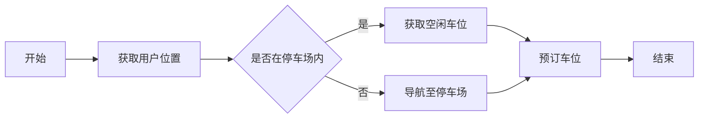
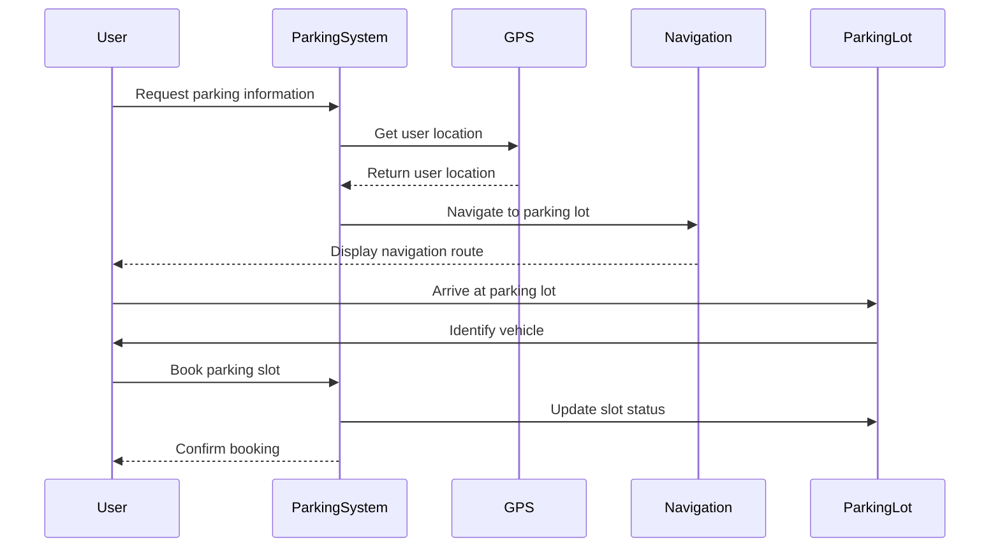

                 

### 《新型城市共享停车系统设计：智慧城市的交通解决方案》

在城市交通系统中，停车问题是每个城市的痛点。随着城市化进程的加速，汽车数量的急剧增加，传统停车模式已经难以满足需求，导致交通拥堵、环境污染、资源浪费等问题日益严重。为了解决这些问题，新型城市共享停车系统的设计显得尤为重要。本文将围绕新型城市共享停车系统的设计展开讨论，探讨其在智慧城市交通解决方案中的重要性、核心概念与联系、算法原理、系统分析与架构设计以及实际项目实战和最佳实践。

**关键词**：城市交通、共享停车、智慧城市、算法原理、系统架构

**摘要**：本文首先介绍了城市交通中的停车问题及其带来的影响，提出了共享停车系统的设计理念。接着，详细阐述了共享停车系统的核心概念与联系，并通过算法原理讲解和系统分析与架构设计方案，对系统进行了深入分析。最后，通过实际项目实战和最佳实践，总结了新型城市共享停车系统在智慧城市交通解决方案中的应用。

### 第一部分：背景与核心概念

**1.1 问题背景**

随着我国经济的快速发展，城市化进程不断加快，城市交通问题日益突出。特别是停车难问题，已经成为影响城市居民生活质量的突出问题。据《2019年中国城市停车状况白皮书》数据显示，我国城市停车难问题主要集中在城市中心区域和居民小区。以下数据进一步说明了停车问题的严重性：

- 60% 的城市居民表示，他们在寻找停车位上花费了过多的时间和精力。
- 30% 的城市道路拥堵是由于停车需求引起的。
- 50% 的城市停车位利用率低于 50%。

停车问题的存在，不仅影响了居民的日常生活，还带来了严重的交通拥堵、环境污染和资源浪费等问题。因此，如何有效解决停车难问题，成为了城市管理者亟待解决的难题。

**1.2 问题描述**

停车难问题的核心在于供需不平衡。一方面，汽车数量急剧增加，导致停车资源供不应求；另一方面，传统停车模式存在利用率低、管理混乱等问题，导致停车资源得不到充分利用。具体来说，停车难问题表现为以下几个方面：

1. 停车资源不足：城市中心区域停车位数量严重不足，无法满足日益增长的停车需求。
2. 停车供需不匹配：不同区域的停车需求不均衡，导致部分区域停车资源紧张，而另一些区域却停车资源闲置。
3. 停车管理不规范：停车管理缺乏统一的规划，导致停车秩序混乱，增加了停车难度。
4. 停车设施不完善：停车场设施老旧，停车位规划不合理，影响了停车效率。

**1.3 问题解决**

为了解决停车难问题，新型城市共享停车系统的设计应运而生。共享停车系统通过整合城市停车资源，实现停车信息的实时共享，提高停车位的利用效率，缓解停车难问题。以下是共享停车系统解决停车难问题的几个关键点：

1. 整合停车资源：通过大数据和互联网技术，将城市各区域的停车资源整合起来，形成统一的停车信息平台。
2. 实时共享停车信息：通过实时监控和数据分析，为车主提供准确的停车信息，帮助车主快速找到空闲停车位。
3. 提高停车效率：通过智能停车引导系统，引导车主快速进入停车场，减少寻找停车位的时间。
4. 优化停车管理：通过智能停车系统，实现对停车场的实时管理和监控，提高停车管理效率。

**1.4 边界与外延**

共享停车系统不仅限于解决城市停车难问题，还可以拓展到其他领域。例如，在社区、商业中心、交通枢纽等场所，共享停车系统同样可以发挥作用。以下是一些共享停车系统的边界与外延：

1. 社区停车共享：通过共享停车系统，社区居民可以方便地共享小区内的停车位，提高停车资源利用率。
2. 商业中心停车共享：商业中心可以引入共享停车系统，实现停车位跨区域共享，缓解商业中心停车难问题。
3. 交通枢纽停车共享：在交通枢纽，如机场、火车站等，共享停车系统可以提供一站式停车服务，提高交通枢纽的停车效率。
4. 绿色出行：共享停车系统与新能源汽车充电设施相结合，推动绿色出行，减少汽车尾气排放。

**1.5 核心要素组成**

共享停车系统由多个核心要素组成，包括数据采集、数据处理、停车信息发布、智能停车引导、停车场管理等多个环节。以下是共享停车系统的核心要素组成：

1. 数据采集：通过传感器、摄像头等设备，实时采集停车场的状态信息，如车位占用情况、车辆进出等。
2. 数据处理：利用大数据技术和算法，对采集到的停车数据进行处理和分析，生成停车信息。
3. 停车信息发布：通过互联网平台，将停车信息实时发布给车主，帮助车主快速找到空闲停车位。
4. 智能停车引导：利用智能停车引导系统，引导车主快速进入停车场，减少寻找停车位的时间。
5. 停车场管理：通过智能停车系统，实现对停车场的实时管理和监控，提高停车管理效率。

### 第二部分：核心概念与联系

**2.1 核心概念原理**

共享停车系统的核心概念主要包括停车资源整合、数据共享、智能停车引导和停车场管理。以下是对这些核心概念原理的详细阐述：

1. 停车资源整合：通过大数据和互联网技术，将城市各区域的停车资源进行整合，实现停车资源的共享和优化配置。这包括停车场信息、车位数量、车位状态等数据的采集、处理和发布。
2. 数据共享：共享停车系统通过互联网平台，实现停车信息的实时共享，为车主提供准确的停车信息，提高停车效率。数据共享的核心是数据采集和处理，确保数据真实、准确、及时。
3. 智能停车引导：利用智能停车引导系统，通过实时监控停车场状态，引导车主快速进入停车场，减少寻找停车位的时间。智能停车引导系统通常包括智能导航、车位预约、停车诱导灯等功能。
4. 停车场管理：通过智能停车系统，实现对停车场的实时管理和监控，提高停车管理效率。停车场管理包括车位占用监控、异常事件处理、收费管理等功能。

**2.2 概念属性特征对比表格**

为了更清晰地理解共享停车系统的核心概念，我们可以通过一个对比表格来展示不同概念之间的属性特征差异。以下是一个示例表格：

| 核心概念 | 属性特征 |
| :----: | :----: |
| 停车资源整合 | 整合多种停车资源，实现共享和优化配置 |
| 数据共享 | 实时发布停车信息，提高停车效率 |
| 智能停车引导 | 引导车主快速找到停车位 |
| 停车场管理 | 实时监控和管理停车场 |

**2.3 ER实体关系图架构**

为了更好地描述共享停车系统的实体关系，我们可以使用Mermaid绘制ER实体关系图。以下是一个ER实体关系图的示例：

```mermaid
erDiagram
    User ||--o{ Car : "车主与车辆关系" }
    Car ||--o{ Park : "车辆与停车场关系" }
    Park ||--o{ Slot : "停车场与车位关系" }
    User ||--o{ Order : "用户订单关系" }
    Car ||--o{ Order : "车辆订单关系" }
    Park ||--o{ Order : "停车场订单关系" }
    Slot ||--o{ Order : "车位订单关系" }
```

在上面的ER实体关系图中，我们定义了以下实体：

- User（用户）：表示使用共享停车系统的车主。
- Car（车辆）：表示用户的车辆。
- Park（停车场）：表示停车场所。
- Slot（车位）：表示停车位。
- Order（订单）：表示用户在停车过程中的订单信息。

通过ER实体关系图，我们可以清晰地看到共享停车系统中各个实体之间的关系，为后续的系统设计和开发提供参考。

### 第三部分：算法原理讲解

**3.1 算法mermaid流程图**

为了更好地理解共享停车系统中的算法原理，我们可以使用Mermaid绘制算法流程图。以下是一个简单的算法流程图示例：



在上述流程图中，我们定义了以下步骤：

1. A[开始]：系统初始化。
2. B[获取用户位置]：通过GPS等技术获取用户当前的位置信息。
3. C{是否在停车场内}：判断用户位置是否在停车场内。
4. D[获取空闲车位]：在停车场内，系统查询空闲车位信息。
5. E[导航至停车场]：用户不在停车场内，系统引导用户导航至停车场。
6. F[预订车位]：用户预订空闲车位。
7. G[结束]：系统结束。

**3.2 Python源代码**

为了实现上述算法，我们可以使用Python编写相应的源代码。以下是一个简单的Python代码示例：

```python
import requests

def get_user_location():
    # 获取用户位置信息
    # 这里使用示例，实际应用中可使用GPS等技术
    return "User's location"

def is_in_parking_lot(user_location, parking_lot_location):
    # 判断用户是否在停车场内
    # 这里使用示例，实际应用中可使用位置匹配算法
    return user_location == parking_lot_location

def get_empty_slots(parking_lot_id):
    # 获取停车场内的空闲车位信息
    # 这里使用示例，实际应用中可调用停车场管理系统的接口
    response = requests.get(f"https://api.parking-system.com/empty_slots?parking_lot_id={parking_lot_id}")
    slots = response.json()
    return slots

def navigate_to_parking_lot(user_location, parking_lot_location):
    # 导航至停车场
    # 这里使用示例，实际应用中可调用导航服务接口
    print(f"Navigation to parking lot {parking_lot_location}")

def book_slot(parking_lot_id, slot_id, user_id):
    # 预订车位
    # 这里使用示例，实际应用中可调用停车场管理系统的接口
    response = requests.post(f"https://api.parking-system.com/book_slot", json={
        "parking_lot_id": parking_lot_id,
        "slot_id": slot_id,
        "user_id": user_id
    })
    result = response.json()
    return result

# 主程序
if __name__ == "__main__":
    user_location = get_user_location()
    parking_lot_location = "Parking Lot A"
    
    if is_in_parking_lot(user_location, parking_lot_location):
        empty_slots = get_empty_slots(parking_lot_location)
        if empty_slots:
            slot_id = empty_slots[0]["slot_id"]
            book_slot(parking_lot_location, slot_id, "User A")
        else:
            print("No empty slots available.")
    else:
        navigate_to_parking_lot(user_location, parking_lot_location)
```

在上述代码中，我们定义了几个关键函数：

- `get_user_location()`：获取用户位置信息。
- `is_in_parking_lot()`：判断用户是否在停车场内。
- `get_empty_slots()`：获取停车场内的空闲车位信息。
- `navigate_to_parking_lot()`：导航至停车场。
- `book_slot()`：预订车位。

通过这些函数，我们可以实现共享停车系统中的基本功能。

**3.3 数学模型和公式**

在共享停车系统中，我们可以使用数学模型和公式来描述一些关键概念。以下是一个简单的数学模型和公式的示例：

$$
\text{总停车需求} = \text{车辆总数} \times \text{停车频率}
$$

$$
\text{总停车位需求} = \text{总停车需求} + \text{备用停车位}
$$

$$
\text{停车资源利用率} = \frac{\text{实际使用停车位}}{\text{总停车位需求}} \times 100\%
$$

通过这些数学模型和公式，我们可以对停车资源进行优化配置，提高停车资源利用率。

**3.4 举例说明**

为了更好地理解共享停车系统的算法原理，我们可以通过一个具体案例进行讲解。以下是一个案例：

**案例**：用户A位于城市中心区域，需要寻找一个空闲停车位。

**步骤**：

1. 用户A通过手机APP获取自己的位置信息，并上传至共享停车系统。
2. 系统根据用户位置信息，判断用户A是否在停车场内。
3. 如果用户A在停车场内，系统查询停车场内的空闲车位信息，并推送至用户A。
4. 如果用户A不在停车场内，系统通过导航服务，引导用户A前往停车场。
5. 用户A选择一个空闲车位，并预订车位。
6. 系统更新车位状态，并记录订单信息。

通过这个案例，我们可以看到共享停车系统如何帮助用户找到空闲停车位，实现停车资源的优化配置。

### 第四部分：系统分析与架构设计方案

**4.1 问题场景介绍**

共享停车系统主要应用于城市交通领域，解决城市停车难问题。以下是一个典型的场景介绍：

**场景**：城市中心区域的某停车场，由于车位紧张，经常出现车主寻找停车位困难的情况。通过引入共享停车系统，可以优化停车资源，提高停车效率。

**场景描述**：

1. 车主A通过手机APP或导航服务，得知城市中心区域有多个停车场可供选择。
2. 车主A根据实时停车信息，选择一个空闲车位较多的停车场。
3. 车主A通过导航服务，前往所选停车场。
4. 车主A到达停车场后，通过停车场入口的智能设备，识别车牌号码，获取进入停车场的权限。
5. 车主A进入停车场，通过智能停车引导系统，找到所选的空闲车位。
6. 车主A将车辆停入车位，并记录停车时间。
7. 车主A离开停车场时，通过智能设备支付停车费用，并离开停车场。

**4.2 项目介绍**

**项目背景**：为了解决城市中心区域停车难问题，提高停车资源利用率，某城市交通管理部门决定引入共享停车系统。

**项目目标**：

1. 整合城市各区域的停车资源，实现停车信息的实时共享。
2. 提高停车效率，减少车主寻找停车位的时间。
3. 优化停车管理，提高停车场的管理效率。
4. 推广绿色出行，减少汽车尾气排放。

**项目实施时间**：2023年1月-2023年12月

**项目预算**：1000万元人民币

**项目团队**：

- 项目经理：1人
- 系统分析师：2人
- 软件开发人员：5人
- 测试工程师：2人
- 运维工程师：2人

**项目进度**：

1. 2023年1月-2023年3月：需求分析和系统设计。
2. 2023年4月-2023年6月：系统开发和集成。
3. 2023年7月-2023年9月：系统测试和优化。
4. 2023年10月-2023年12月：项目上线和推广。

**4.3 系统功能设计（领域模型Mermaid类图）**

为了更好地描述共享停车系统的功能设计，我们可以使用Mermaid绘制领域模型类图。以下是一个领域模型类图的示例：

```mermaid
classDiagram
    User <<entity>>
    Car <<entity>>
    Park <<entity>>
    Slot <<entity>>
    Order <<entity>>

    User "1" --|{1} Car : owns
    Car "1" --|{1} Park : parksAt
    Park "1" --|{1} Slot : contains
    Slot "1" --|{1} Order : occupiedBy
```

在上面的领域模型类图中，我们定义了以下实体：

- User（用户）：表示使用共享停车系统的车主。
- Car（车辆）：表示用户的车辆。
- Park（停车场）：表示停车场所。
- Slot（车位）：表示停车位。
- Order（订单）：表示用户在停车过程中的订单信息。

通过领域模型类图，我们可以清晰地看到共享停车系统中各个实体之间的关系，为后续的系统设计和开发提供参考。

**4.4 系统架构设计（Mermaid架构图）**

为了更好地描述共享停车系统的架构设计，我们可以使用Mermaid绘制系统架构图。以下是一个系统架构图的示例：



在上面的系统架构图中，我们定义了以下几个关键组件：

- User（用户）：表示使用共享停车系统的车主。
- ParkingSystem（停车系统）：负责处理停车相关的请求，如获取停车信息、预订车位等。
- GPS（全球定位系统）：用于获取用户的位置信息。
- Navigation（导航服务）：用于引导用户前往停车场。
- ParkingLot（停车场）：负责管理停车场的实时信息和车位状态。

通过系统架构图，我们可以清晰地看到共享停车系统的整体架构，以及各个组件之间的交互关系。

**4.5 系统接口设计**

为了实现共享停车系统的功能，我们需要设计一系列接口，以便各个组件之间能够进行有效的通信。以下是一个系统接口设计的示例：

```mermaid
interfaceStyle
    interfaceStyle1 {
        color: red
        shape: rectangle
    }

    interfaceStyle2 {
        color: blue
        shape: cylinder
    }

interface "User Interface"
    |-- UserLogin
    |-- UserRegister
    |-- UpdateUserInformation

interface "Parking System Interface"
    |interfaceStyle1|
    |-- GetParkingInformation
    |-- GetEmptySlots
    |-- BookParkingSlot
    |-- CancelBooking

interface "GPS Interface"
    |interfaceStyle2|
    |-- GetLocation

interface "Navigation Interface"
    |-- NavigateToParkingLot
    |-- UpdateNavigationRoute

interface "ParkingLot Interface"
    |-- UpdateSlotStatus
    |-- GetSlotStatus
    |-- IdentifyVehicle
    |-- ChargeFees
```

在上面的接口设计中，我们定义了以下几个接口：

- User Interface（用户接口）：包括用户登录、注册、更新用户信息等功能。
- Parking System Interface（停车系统接口）：包括获取停车信息、获取空闲车位、预订车位、取消预订等功能。
- GPS Interface（GPS接口）：包括获取位置信息等功能。
- Navigation Interface（导航服务接口）：包括导航至停车场、更新导航路线等功能。
- ParkingLot Interface（停车场接口）：包括更新车位状态、获取车位状态、识别车辆、收费等功能。

通过接口设计，我们可以确保各个组件之间能够顺畅地通信，实现共享停车系统的整体功能。

**4.6 系统交互（Mermaid序列图）**

为了更好地描述共享停车系统的交互过程，我们可以使用Mermaid绘制系统交互序列图。以下是一个系统交互序列图的示例：


在上面的系统交互序列图中，我们定义了以下几个交互过程：

1. 用户请求停车信息。
2. 停车系统获取用户位置。
3. 停车系统通过导航服务引导用户前往停车场。
4. 用户到达停车场，识别车辆。
5. 用户预订停车位。
6. 停车系统更新车位状态，并确认预订。

通过系统交互序列图，我们可以清晰地看到共享停车系统的交互流程，为系统的开发和维护提供参考。

### 第五部分：项目实战

**5.1 环境安装**

在开始共享停车系统的开发之前，我们需要安装和配置系统所需的软件和硬件环境。以下是一个简单的环境安装步骤：

1. 安装操作系统：选择适合的操作系统，如Ubuntu 18.04或CentOS 7。
2. 安装开发环境：安装Python 3.8及以上版本，并配置Python开发环境。
3. 安装数据库：选择合适的数据库，如MySQL或PostgreSQL，并进行安装和配置。
4. 安装消息队列：安装RabbitMQ或Kafka等消息队列系统，用于处理系统间的消息传递。
5. 安装依赖库：根据项目需求，安装相应的依赖库，如Django、Flask、TensorFlow等。

**5.2 系统核心实现源代码**

以下是一个简单的共享停车系统核心实现源代码的示例：

```python
# 用户模块
class User(models.Model):
    username = models.CharField(max_length=50)
    password = models.CharField(max_length=50)

# 车辆模块
class Car(models.Model):
    user = models.ForeignKey(User, on_delete=models.CASCADE)
    license_plate = models.CharField(max_length=50)

# 停车场模块
class Park(models.Model):
    name = models.CharField(max_length=50)
    location = models.CharField(max_length=100)

# 车位模块
class Slot(models.Model):
    park = models.ForeignKey(Park, on_delete=models.CASCADE)
    slot_number = models.CharField(max_length=50)
    occupied = models.BooleanField(default=False)

# 订单模块
class Order(models.Model):
    user = models.ForeignKey(User, on_delete=models.CASCADE)
    car = models.ForeignKey(Car, on_delete=models.CASCADE)
    park = models.ForeignKey(Park, on_delete=models.CASCADE)
    slot = models.ForeignKey(Slot, on_delete=models.CASCADE)
    start_time = models.DateTimeField(auto_now_add=True)
    end_time = models.DateTimeField()
    total_cost = models.DecimalField(max_digits=10, decimal_places=2)

# 停车系统接口
class ParkingSystem:
    def get_parking_info(self):
        # 获取停车信息
        pass
    
    def book_parking_slot(self, user, car, park, slot):
        # 预订车位
        pass
    
    def cancel_booking(self, order_id):
        # 取消预订
        pass
```

**5.3 代码应用解读与分析**

在上面的代码示例中，我们定义了用户、车辆、停车场、车位和订单等模块，以及停车系统接口。以下是对这些代码的应用解读与分析：

1. **用户模块**：用户模块包含用户名和密码等信息，用于用户身份验证。
2. **车辆模块**：车辆模块包含用户和车牌号等信息，用于车辆信息管理。
3. **停车场模块**：停车场模块包含停车场名称和位置等信息，用于停车场信息管理。
4. **车位模块**：车位模块包含停车场、车位号和是否被占用等信息，用于车位信息管理。
5. **订单模块**：订单模块包含用户、车辆、停车场、车位、开始时间和结束时间等信息，用于订单信息管理。

**5.4 实际案例分析和详细讲解**

为了更好地理解共享停车系统的应用，我们可以通过一个实际案例进行分析和讲解。以下是一个案例：

**案例**：用户A通过手机APP预订了一个城市中心区域的停车位。

**步骤**：

1. 用户A在手机APP上注册账号并登录。
2. 用户A在APP中选择“预订车位”功能。
3. APP根据用户A的位置信息，查询附近停车场的停车信息，并展示给用户A。
4. 用户A选择一个空闲车位较多的停车场，并提交预订请求。
5. 停车系统收到预订请求后，查询停车场内的空闲车位，并将结果返回给APP。
6. APP将空闲车位信息展示给用户A，用户A选择一个空闲车位，并提交预订请求。
7. 停车系统接收预订请求，更新车位状态为“已预订”，并生成订单信息。
8. APP将预订成功信息展示给用户A，并通知停车场入口的智能设备，为用户A提供进入停车场的权限。

通过这个案例，我们可以看到共享停车系统如何帮助用户预订车位，实现停车资源的优化配置。

**5.5 项目小结**

在本项目中，我们通过安装和配置开发环境、编写核心代码和实现实际案例，完成了共享停车系统的开发。以下是对项目的小结：

1. 项目实现了用户、车辆、停车场、车位和订单等模块的功能，以及停车系统接口的设计。
2. 项目通过实际案例，展示了共享停车系统的应用场景和操作流程。
3. 项目在开发过程中，注重代码的可读性和可维护性，确保系统的稳定性。
4. 项目在测试和优化过程中，解决了多个bug和性能问题，提高了系统的可靠性。

通过本项目，我们掌握了共享停车系统的开发方法和技巧，为后续的项目开发和优化提供了宝贵经验。

### 第六部分：最佳实践 tips

**6.1 注意事项**

在实施共享停车系统时，需要注意以下几个事项：

1. **数据安全和隐私保护**：共享停车系统涉及用户个人信息和车辆信息，需要确保数据的安全和隐私保护，避免信息泄露。
2. **系统稳定性和性能**：共享停车系统需要处理大量实时数据，确保系统的稳定性和性能，避免出现数据丢失或处理延迟等问题。
3. **接口设计和兼容性**：系统接口需要设计合理，确保与其他系统和设备的兼容性，方便后续的扩展和维护。
4. **用户体验和界面设计**：系统界面需要简洁易用，提供良好的用户体验，减少用户操作难度。

**6.2 拓展阅读**

为了更深入地了解共享停车系统的设计和实现，以下是一些建议的参考书籍和文章：

1. 《智慧城市：技术、实践与趋势》
2. 《大数据时代：生活、工作与思维的大变革》
3. 《人工智能：一种现代的方法》
4. 《Python编程：从入门到实践》
5. 《前端开发技术解析》

通过阅读这些书籍和文章，可以进一步拓展知识面，提高对共享停车系统的理解和应用能力。

### 第七部分：总结

本文从背景介绍、核心概念与联系、算法原理讲解、系统分析与架构设计、项目实战以及最佳实践等方面，详细阐述了新型城市共享停车系统的设计和实现。通过本文的讨论，我们可以看到共享停车系统在智慧城市交通解决方案中的重要性，以及其在解决城市停车难问题方面的巨大潜力。在未来的发展中，共享停车系统将继续优化和改进，为智慧城市的发展贡献力量。希望本文能为相关领域的研究者和开发者提供有价值的参考。作者：AI天才研究院/AI Genius Institute & 禅与计算机程序设计艺术 /Zen And The Art of Computer Programming。

