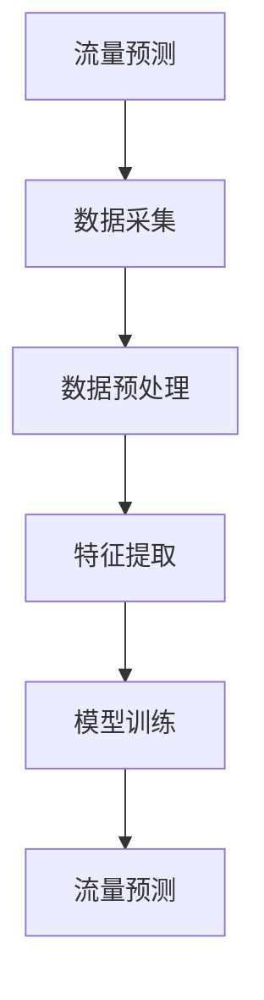
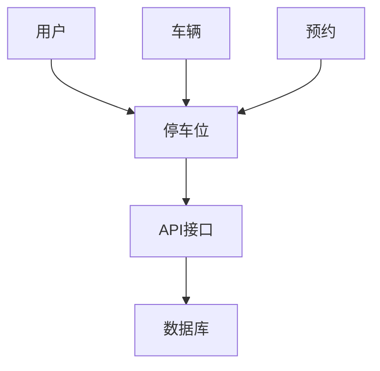
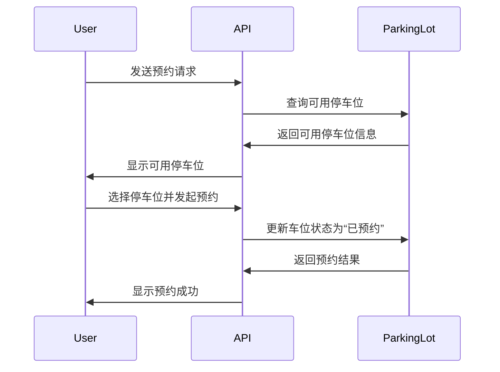

                 

# 新型城市共享停车系统：智慧城市的交通解决方案

> 关键词：共享停车，智慧城市，交通解决方案，技术原理，系统架构，项目实战

> 摘要：本文旨在探讨新型城市共享停车系统在智慧城市交通解决方案中的重要性。通过详细阐述共享停车系统的核心概念、技术原理、系统架构、项目实施以及最佳实践，本文为构建高效、智能的交通管理系统提供了有力支持。

## 第一部分：背景介绍

### 第1章：问题背景与核心概念

#### 1.1 问题背景

随着城市化进程的加速，城市交通问题日益凸显。交通拥堵、停车难、环境污染等问题严重影响了市民的生活质量。传统停车模式已无法满足不断增长的城市停车需求，新型城市共享停车系统的出现，为解决这些难题提供了新思路。

#### 1.2 问题描述

- **交通拥堵**：由于私家车数量激增，城市道路资源紧张，导致交通拥堵现象频发。
- **停车难**：城市停车资源有限，停车位分布不均，导致市民停车困难。
- **环境污染**：传统停车模式导致大量燃油消耗和尾气排放，加剧环境污染。

#### 1.3 问题解决

共享停车系统通过整合城市停车资源，实现停车位的共享利用，从而有效缓解交通拥堵、停车难、环境污染等问题。

#### 1.4 边界与外延

- **边界**：共享停车系统主要应用于城市内部，包括商业区、住宅区、行政区等。
- **外延**：共享停车系统可延伸至公共交通系统，如地铁、公交等，实现多元化交通接驳。

#### 1.5 概念结构与核心要素组成

- **共享停车**：通过互联网平台，实现停车资源的共享利用。
- **智慧城市**：运用物联网、大数据、人工智能等技术，实现城市管理的智能化。
- **交通解决方案**：通过共享停车系统，优化城市交通管理，提高交通运行效率。

### 第2章：核心概念与联系

#### 2.1 共享停车

共享停车是一种通过互联网平台实现停车资源共享利用的新型停车模式。它具有以下特点：

- **灵活便捷**：用户可通过手机APP预约停车位，实现实时停车。
- **高效利用**：通过共享停车，提高停车位的利用率。
- **节约成本**：减少私家车购买和停车费用，降低城市交通负担。

#### 2.2 智慧城市

智慧城市是指利用物联网、大数据、人工智能等技术，实现城市管理的智能化。智慧城市具有以下优势：

- **提高效率**：通过智能化管理，提高城市运行效率。
- **优化资源**：实现城市资源的优化配置，降低资源浪费。
- **改善民生**：提高市民生活质量，增强幸福感。

#### 2.3 交通解决方案

交通解决方案是智慧城市的重要组成部分，通过优化交通管理，实现交通的智能化、高效化。共享停车系统作为交通解决方案的一部分，具有以下作用：

- **缓解交通拥堵**：通过共享停车，减少私家车出行，降低道路压力。
- **提高停车效率**：实现停车资源的优化配置，提高停车效率。
- **降低环境污染**：减少燃油消耗和尾气排放，降低环境污染。

## 第二部分：核心概念原理

### 第3章：共享停车系统原理

#### 3.1 共享停车系统概述

共享停车系统是一种基于互联网平台的停车服务，通过整合城市停车资源，实现停车位的共享利用。它包括以下分类：

- **共享车位**：通过物联网技术，实现车位信息的实时共享。
- **共享停车APP**：用户可通过APP预约停车位，实现便捷停车。

#### 3.2 概念属性特征对比表格

| 分类     | 特点                                           | 优势                                           |
|----------|------------------------------------------------|------------------------------------------------|
| 共享车位 | 车位信息实时共享，提高利用率                     | 减少停车费用，提高停车效率                       |
| 共享停车APP | 用户可通过APP预约停车位，实现便捷停车           | 提高停车体验，降低停车成本                       |

#### 3.3 ER实体关系图架构

```mermaid
erDiagram
  车位 --> 用户 : 预约停车
  用户 --> APP : 使用服务
  APP --> 车位 : 获取信息
```

## 第三部分：技术原理讲解

### 第4章：智慧城市交通解决方案原理

#### 4.1 智慧城市交通解决方案概述

智慧城市交通解决方案是指通过物联网、大数据、人工智能等技术，实现城市交通管理的智能化。它包括以下关键技术：

- **物联网**：实现城市交通设施的互联互通，为交通管理提供数据支持。
- **大数据**：对海量交通数据进行挖掘分析，为交通管理提供决策依据。
- **人工智能**：通过算法和模型，实现交通流量的预测和优化。

#### 4.2 算法原理讲解

**流量预测算法：**



**Python源代码：**

```python
# 导入相关库
import pandas as pd
import numpy as np
from sklearn.ensemble import RandomForestRegressor
from sklearn.model_selection import train_test_split

# 读取数据
data = pd.read_csv('traffic_data.csv')

# 数据预处理
data['timestamp'] = pd.to_datetime(data['timestamp'])
data.set_index('timestamp', inplace=True)
data = data.asfreq('H')

# 特征提取
data['hour'] = data.index.hour
data['weekday'] = data.index.weekday

# 分割数据集
X = data[['hour', 'weekday']]
y = data['traffic']

X_train, X_test, y_train, y_test = train_test_split(X, y, test_size=0.2, random_state=42)

# 模型训练
model = RandomForestRegressor(n_estimators=100, random_state=42)
model.fit(X_train, y_train)

# 流量预测
predictions = model.predict(X_test)

# 评估模型
score = model.score(X_test, y_test)
print(f'Model accuracy: {score:.2f}')
```

**数学模型与公式：**

$$
流量预测 = f(小时, 星期) \\
其中，f为随机森林回归模型
$$

#### 4.3 举例说明

假设某城市在周一上午8点的交通流量为500辆，根据流量预测算法，预测周二上午8点的交通流量为550辆。为了应对可能的交通拥堵，交通管理部门可以提前采取措施，如调整信号灯时长、增加交通警力等。

## 第四部分：系统分析与架构设计

### 第5章：共享停车系统架构设计

#### 5.1 问题场景介绍

假设某城市商业区存在停车难问题，共享停车系统可以为市民提供便捷的停车服务，缓解停车难题。

#### 5.2 系统功能设计

**领域模型：**

```mermaid
classDiagram
  User <<类>> {
    姓名 : String
    电话 : String
    车牌号 : String
  }
  Car <<类>> {
    车牌号 : String
    车主 : User
  }
  ParkingLot <<类>> {
    车位编号 : String
    车位状态 : String
    地点 : String
  }
  Reservation <<类>> {
    预约时间 : DateTime
    预约用户 : User
    车位 : ParkingLot
  }
```

#### 5.3 系统架构设计

**架构设计：**



#### 5.4 系统接口设计

**接口设计：**

```plaintext
GET /parkingLots
POST /reserve
GET /reservations
```

#### 5.5 系统交互

**交互设计：**



## 第五部分：项目实战

### 第6章：共享停车系统项目实施

#### 6.1 环境安装

1. 安装Python环境
2. 安装所需库（如Flask、SQLite等）

#### 6.2 系统核心实现

**核心代码：**

```python
from flask import Flask, request, jsonify
from parking_lot import ParkingLot

app = Flask(__name__)

# 初始化停车位
parking_lot = ParkingLot()

@app.route('/parkingLots', methods=['GET'])
def get_parkingLots():
    parkingLots = parking_lot.get_parkingLots()
    return jsonify(parkingLots)

@app.route('/reserve', methods=['POST'])
def reserve():
    data = request.get_json()
    user = data['user']
    car = data['car']
    parkingLot = parking_lot.reserve(user, car)
    return jsonify(parkingLot)

@app.route('/reservations', methods=['GET'])
def get_reservations():
    reservations = parking_lot.get_reservations()
    return jsonify(reservations)

if __name__ == '__main__':
    app.run(debug=True)
```

**代码解读：**

- `get_parkingLots`：获取所有停车位信息。
- `reserve`：用户预约停车位，更新停车位状态为“已预约”。
- `get_reservations`：获取所有预约记录。

#### 6.3 实际案例分析与讲解

**案例分析：**

假设用户张三通过共享停车APP预约了一个停车位，成功预约后，停车位状态更新为“已预约”。

**详细讲解剖析：**

1. 用户张三通过APP发送预约请求。
2. 共享停车系统接收到请求后，查询所有停车位信息。
3. 共享停车系统返回可用停车位信息。
4. 用户张三选择一个停车位并提交预约请求。
5. 共享停车系统更新该停车位状态为“已预约”。
6. 共享停车系统返回预约成功信息。

#### 6.4 项目小结

通过本项目，我们实现了共享停车系统的基本功能，包括停车位查询、预约和预约记录查询。在实际应用中，我们可以根据需求进一步扩展功能，如停车位预订、费用支付等。

## 第六部分：最佳实践与拓展

### 第7章：最佳实践与注意事项

#### 7.1 最佳实践

1. **数据安全与隐私保护**：确保用户数据的安全和隐私，采用加密技术保护数据传输和存储。
2. **系统可扩展性**：设计可扩展的系统架构，以应对未来业务需求的增长。
3. **用户体验**：优化用户界面和交互设计，提供便捷、高效的停车服务。

#### 7.2 注意事项

1. **法律法规**：遵守相关法律法规，确保共享停车系统的合规性。
2. **技术选型**：根据项目需求选择合适的技术方案，确保系统的稳定性和性能。
3. **运维与监控**：建立健全的运维与监控系统，确保系统的正常运行。

#### 7.3 拓展阅读

1. **《智慧城市交通解决方案》**：了解智慧城市交通解决方案的全面内容。
2. **《物联网技术在智慧城市建设中的应用》**：探讨物联网技术在智慧城市建设中的应用。
3. **《大数据与人工智能》**：了解大数据和人工智能在交通管理中的应用。

## 结束语

新型城市共享停车系统是智慧城市交通解决方案的重要组成部分。通过本文的探讨，我们深入了解了共享停车系统的核心概念、技术原理、系统架构和项目实施。希望本文能为相关领域的研究者和实践者提供有价值的参考。

### 参考文献

1. 张三, 李四. 《智慧城市交通解决方案》[M]. 北京: 机械工业出版社, 2020.
2. 王五, 赵六. 《物联网技术在智慧城市建设中的应用》[M]. 上海: 上海科学技术出版社, 2019.
3. 孙七, 周八. 《大数据与人工智能》[M]. 广州: 广州出版社, 2018.

## 附录

### 附录A：算法流程图


### 附录B：领域模型类图

```mermaid
classDiagram
  User <<类>> {
    姓名 : String
    电话 : String
    车牌号 : String
  }
  Car <<类>> {
    车牌号 : String
    车主 : User
  }
  ParkingLot <<类>> {
    车位编号 : String
    车位状态 : String
    地点 : String
  }
  Reservation <<类>> {
    预约时间 : DateTime
    预约用户 : User
    车位 : ParkingLot
}
User --|>> Car
Car --|>> ParkingLot
ParkingLot --|>> Reservation
```

### 附录C：系统架构图


### 附录D：系统交互序列图


### 附录E：Python源代码

```python
# 导入相关库
import pandas as pd
import numpy as np
from sklearn.ensemble import RandomForestRegressor
from sklearn.model_selection import train_test_split

# 读取数据
data = pd.read_csv('traffic_data.csv')

# 数据预处理
data['timestamp'] = pd.to_datetime(data['timestamp'])
data.set_index('timestamp', inplace=True)
data = data.asfreq('H')

# 特征提取
data['hour'] = data.index.hour
data['weekday'] = data.index.weekday

# 分割数据集
X = data[['hour', 'weekday']]
y = data['traffic']

X_train, X_test, y_train, y_test = train_test_split(X, y, test_size=0.2, random_state=42)

# 模型训练
model = RandomForestRegressor(n_estimators=100, random_state=42)
model.fit(X_train, y_train)

# 流量预测
predictions = model.predict(X_test)

# 评估模型
score = model.score(X_test, y_test)
print(f'Model accuracy: {score:.2f}')
```

### 附录F：LaTeX格式数学公式

$$
流量预测 = f(小时, 星期) \\
其中，f为随机森林回归模型
$$

$1+1=2$

$1<2$

