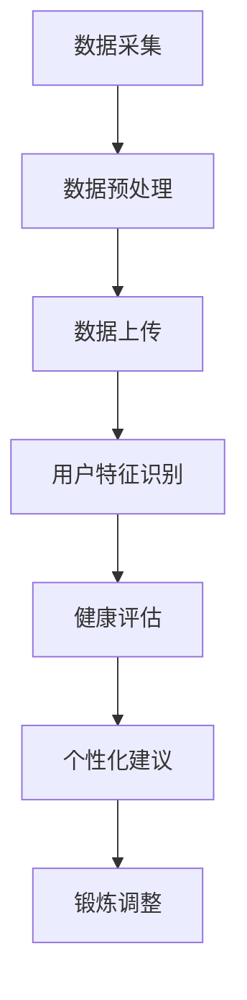
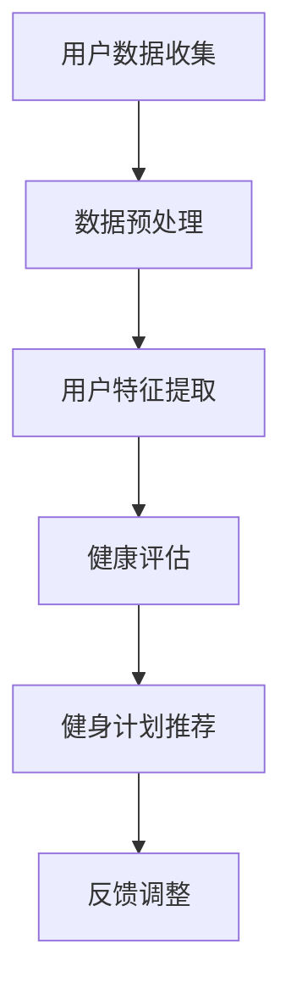
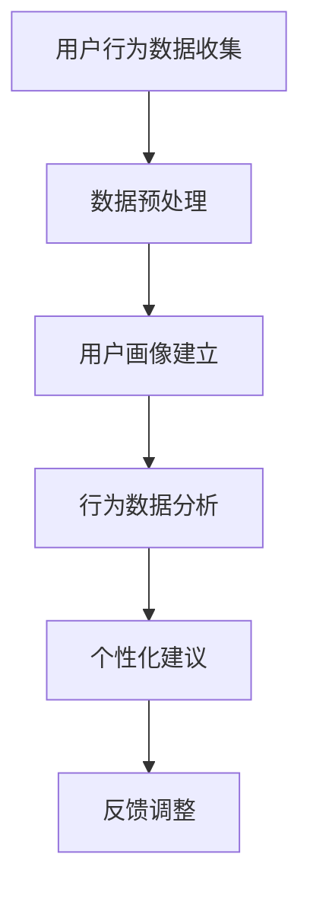
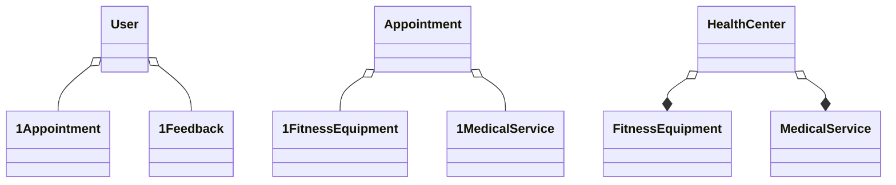
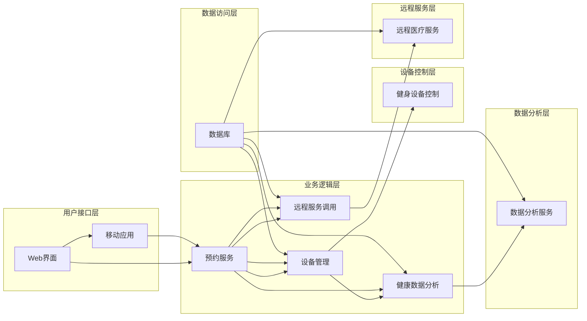
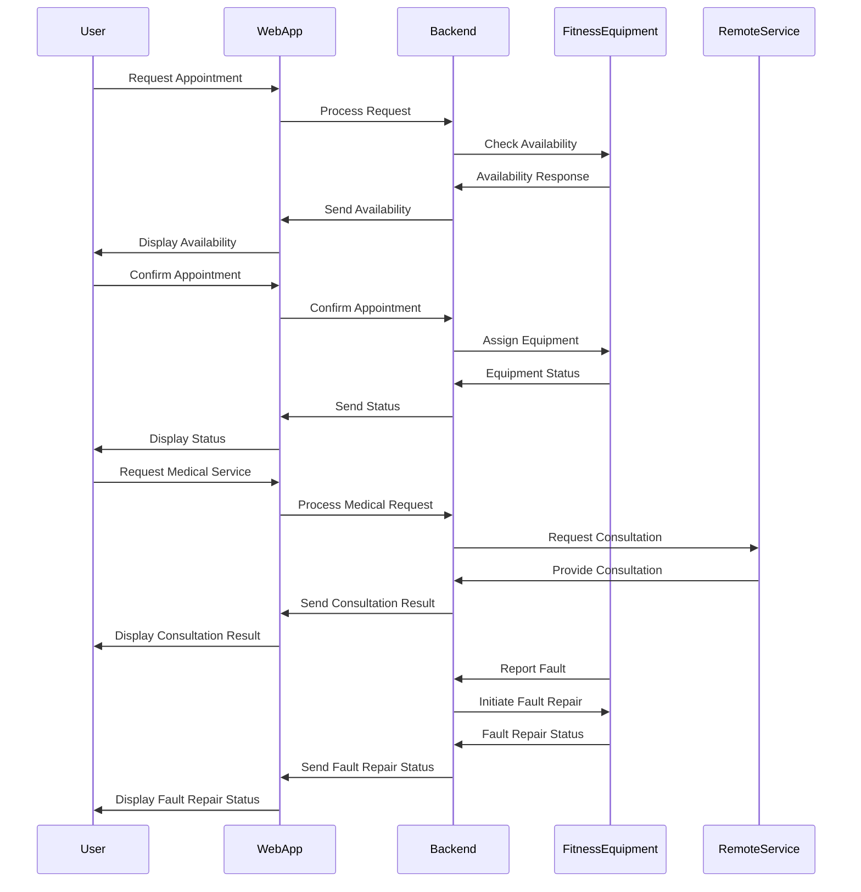

                 

### 1.1 问题背景

在现代城市化进程加快的背景下，城市居民的健康管理需求逐渐增加。根据世界卫生组织（WHO）的数据，全球城市人口比例已超过半数，预计到2050年这一比例将升至68%。城市居民的日常生活节奏快、压力大，导致健康问题日益突出。同时，随着生活水平的提高，人们对健康的重视程度也在不断提升，尤其是在健身和健康管理方面。

#### 1.1.1 城市化进程与健康管理需求的增加

城市化进程带来了诸多挑战，如环境污染、交通拥堵、生活节奏加快等。这些问题不仅影响了城市居民的生活质量，也对他们的健康产生了负面影响。例如，长时间久坐、不规律的饮食和缺乏运动等不良生活习惯，使得城市居民的肥胖率、高血压和心血管疾病的发病率呈上升趋势。

根据《全球城市健康报告》的数据，超过80%的全球城市居民缺乏足够的体育活动，而缺乏锻炼和健康饮食是导致肥胖和慢性病的主要因素。因此，城市居民对健康管理的需求愈发强烈，他们渴望能够方便快捷地获得健康服务，尤其是在健身房和社区健康中心等方面。

#### 1.1.2 共享经济模式下的健康中心需求

共享经济模式的兴起，为城市健康中心的发展提供了新的机遇。共享经济是指通过互联网平台，让资源能够被更高效地分配和利用。这一模式在交通、住宿、办公空间等多个领域取得了显著成功，为用户提供了便捷、低成本的服务。

在健康领域，共享经济模式同样具备潜力。通过共享健身房、共享医疗设备等方式，可以降低用户的健身和健康检查成本，提高设施的利用率。例如，根据美团运动平台的数据，共享健身房的用户满意度高达85%，主要原因是它提供了灵活的健身时间和便捷的支付方式。

#### 1.1.3 24小时社区健康中心的优势与挑战

24小时社区健康中心作为一种新兴的健康服务模式，具有以下优势：

1. **时间灵活性**：用户可以根据自己的时间安排，随时进入健康中心进行锻炼或接受健康服务，这大大提高了用户的便利性。
2. **提高设备利用率**：由于24小时开放，健康中心的设备利用率显著提高，从而降低了单位时间内设备的使用成本。
3. **增强社区凝聚力**：健康中心不仅是提供健康服务的场所，还可以成为社区成员交流互动的平台，有助于增强社区凝聚力。

然而，24小时社区健康中心也面临一些挑战：

1. **安全风险**：24小时开放可能导致安全风险增加，如设备损坏、用户纠纷等。
2. **运营成本**：24小时运营需要更多的人力和资源投入，尤其是夜间和凌晨时段。
3. **设备维护**：长时间运行可能导致设备磨损加快，需要更频繁的维护和更换。

#### 1.2 问题描述

在当前城市健康管理需求的背景下，传统的健身房和社区健康中心存在一些不足之处：

1. **健身设施不足与使用时间限制**：许多社区缺乏足够的健身设施，且传统健身房通常只在特定时间内开放，用户无法随时随地锻炼。
2. **社区健康服务的可及性与灵活性**：社区健康服务的可及性较差，许多居民无法方便地获得健康服务，尤其是对于工作繁忙的上班族和学生族。
3. **用户需求和体验的多样性**：用户对健身和健康服务的需求多样化，传统健身房和社区健康中心很难满足所有用户的需求。

这些问题需要通过创新的方式解决，新型城市共享健身房和24小时社区健康中心应运而生。接下来，我们将进一步探讨新型城市共享健身房的概念、运作模式及其关键要素，为解决上述问题提供思路。

### 1.3 问题解决

#### 1.3.1 新型城市共享健身房的概念

新型城市共享健身房是利用共享经济模式，通过互联网平台将健身房资源进行整合，实现用户按需租赁和使用的一种新型健身服务模式。与传统健身房相比，新型城市共享健身房具有以下几个显著特点：

1. **时间灵活性**：新型城市共享健身房24小时开放，用户可以根据自己的时间安排随时进入健身，这大大提高了用户的便利性。
2. **空间灵活性**：健身房通常设置在社区中心或交通便利的地点，用户可以在家附近的任何时间进行锻炼。
3. **支付便捷**：用户通过手机APP或在线支付平台支付费用，无需现场支付，简化了支付流程。
4. **设备多样化**：为了满足不同用户的需求，新型城市共享健身房提供了多种类型的健身设备，如跑步机、动感单车、力量训练器材等。
5. **智能化管理**：通过智能设备和管理系统，实时监控设备使用情况，提高设备利用率和用户体验。

#### 1.3.2 24小时社区健康中心的运作模式

24小时社区健康中心是另一个创新的服务模式，旨在为社区居民提供全天候的健康服务。其运作模式主要包括以下几个方面：

1. **智能预约系统**：用户可以通过手机APP预约健康中心的入场时间，系统会根据用户的预约情况自动调配健身设备，确保设备的高效利用。
2. **全天候监控**：通过摄像头和传感器等设备，实时监控健身中心的安全状况，及时发现和处理异常情况。
3. **远程医疗服务**：在健康中心内设立远程医疗服务点，居民可以通过视频通话与医生进行远程诊疗，获取专业的健康咨询。
4. **自助健身设备**：配备智能健身设备，用户可以根据自身需求进行自主锻炼，设备内置的运动数据分析系统可以实时为用户提供运动建议和效果评估。
5. **社区互动平台**：健康中心可以成为社区成员交流互动的平台，定期举办健康讲座、健身比赛等活动，增强社区凝聚力。

#### 1.3.3 解决方案的关键要素

要成功运作新型城市共享健身房和24小时社区健康中心，需要关注以下几个关键要素：

1. **技术支持**：采用先进的智能设备和管理系统，确保设备的稳定运行和高效管理。
2. **人力资源**：配备专业的健身教练和维修人员，提供高质量的健身服务和设备维护。
3. **安全措施**：制定严格的安全管理制度，确保用户的人身安全。
4. **用户体验**：注重用户体验设计，提供个性化、便捷的服务。
5. **营销推广**：通过有效的市场推广策略，吸引更多的用户，提高健康中心的知名度。

通过以上解决方案，新型城市共享健身房和24小时社区健康中心可以有效解决当前城市健康管理中的诸多问题，为社区居民提供便捷、高效、多样化的健康服务。

### 1.4 边界与外延

#### 1.4.1 健身房与社区健康中心的区别

健身房和社区健康中心在功能和服务目标上存在一定的区别。健身房通常以提供健身和体能训练为主要目标，主要服务于追求健康和身材管理的个人用户。而社区健康中心则更注重为社区居民提供全面的健康服务，包括健身、医疗咨询、健康讲座等多种服务。

1. **功能定位**：健身房以健身和体能训练为核心，提供各类健身设备、私人教练等专业化服务。社区健康中心则提供多样化的健康服务，如医疗咨询、健康检测、健身指导、营养咨询等。
2. **服务对象**：健身房主要面向个人用户，服务内容相对单一。社区健康中心则面向整个社区，服务对象包括所有居民，尤其是老年人和儿童。

#### 1.4.2 24小时运营对设备和管理的要求

24小时社区健康中心的运营对设备和管理提出了更高的要求：

1. **设备稳定性**：由于全天候运行，设备必须具备高度的稳定性和耐用性，以避免因设备故障导致的运营中断。
2. **维护频率**：设备的维护频率需要增加，以确保设备始终处于良好状态。例如，跑步机、动感单车等设备每天需要清洗和检查，以防磨损和损坏。
3. **安全管理**：24小时开放意味着安全管理的压力增大，需要安装监控设备、设置紧急呼叫系统等，确保用户在夜间和凌晨时段的安全。
4. **人力资源**：需要配备全天候运营的管理团队，包括夜班员工和安全巡逻人员，确保健康中心的正常运营和安全。

#### 1.4.3 社区健康服务与医疗服务的界限

社区健康服务和医疗服务在性质和目标上存在一定的交叉，但两者仍需明确界限：

1. **性质区别**：社区健康服务主要提供的是日常健康维护和促进，如健身、营养咨询等；而医疗服务则涉及疾病诊断、治疗和康复等。
2. **目标区别**：社区健康服务的目标是通过健康教育和生活方式干预，预防疾病发生和促进健康；医疗服务的目标则是治疗疾病和恢复健康。
3. **实施方式**：社区健康服务通常通过健康教育讲座、健康咨询等方式进行，而医疗服务则需要通过医院、诊所等医疗机构提供。

在24小时社区健康中心的运营中，需要明确社区健康服务和医疗服务的界限，确保两者之间能够协调合作，共同提升社区居民的健康水平。

### 1.5 概念结构与核心要素组成

#### 1.5.1 新型城市共享健身房的定义

新型城市共享健身房是一种基于共享经济模式的健身服务模式，通过互联网平台整合健身房资源，提供全天候、便捷、高效的健身服务。其主要特点包括：

1. **时间灵活**：全天候开放，用户可以根据个人时间安排随时进行锻炼。
2. **空间灵活**：健身房设于社区中心或交通便利的地点，用户可以在家附近随时锻炼。
3. **支付便捷**：通过手机APP或在线支付平台支付，简化支付流程。
4. **设备多样**：提供多种类型的健身设备，满足不同用户的需求。
5. **智能化管理**：采用智能设备和管理系统，提高设备利用率和用户体验。

#### 1.5.2 24小时社区健康中心的核心组成部分

24小时社区健康中心的核心组成部分包括以下几个关键部分：

1. **健身设备**：提供多样化的健身设备，如跑步机、动感单车、力量训练器材等，满足用户的锻炼需求。
2. **智能设备**：配备智能健身设备和管理系统，实时监控设备使用情况和用户运动数据，提供个性化的健身建议和效果评估。
3. **远程医疗服务点**：设立远程医疗服务点，提供在线医生咨询、健康检测等服务，方便居民获取专业的健康咨询。
4. **安全监控系统**：安装摄像头和传感器等设备，实时监控健康中心的安全状况，确保用户的人身安全。
5. **社区互动平台**：健康中心成为社区成员交流互动的平台，定期举办健康讲座、健身比赛等活动，增强社区凝聚力。

#### 1.5.3 用户角色的分类与需求分析

在新型城市共享健身房和24小时社区健康中心中，用户角色可以分为以下几类：

1. **一般用户**：日常需要健身的居民，主要需求是方便、灵活的健身时间和设备多样性。
2. **健身爱好者**：对健身有较高要求，需要个性化健身计划和专业的指导，关注健身效果和数据分析。
3. **老年人**：需要安全、温和的健身设备，重视健康咨询和医疗检测服务。
4. **年轻人**：需求多样化，包括社交互动、娱乐和健身等，注重用户体验和便利性。
5. **慢性病患者**：需要在专业指导下进行健身，关注健康指标的变化和疾病预防。

针对不同用户角色的需求，健康中心需要提供差异化的服务，如个性化的健身计划、专业的健康咨询、安全舒适的健身环境等，以提升用户的满意度和粘性。

### 2.1 新型城市共享健身房的设计原则

在新型城市共享健身房的设计中，需要综合考虑用户需求、环境可持续性和安全舒适性等多个因素，以提供高质量、高效的健身服务。以下是新型城市共享健身房的设计原则：

#### 2.1.1 可持续性与环保

1. **节能设备的应用**：
   - **智能照明系统**：采用智能照明系统，根据环境光强自动调节灯光亮度，节约能源。
   - **高效空调系统**：使用高效节能的空调系统，确保室内温度舒适的同时降低能耗。
   - **太阳能发电**：在条件允许的情况下，安装太阳能发电设备，减少对传统电网的依赖，降低碳排放。

2. **绿色建筑材料的使用**：
   - **环保材料**：在建筑材料的选择上，优先考虑环保材料，如低VOC涂料、环保地板等，减少对环境的污染。
   - **绿色屋顶**：建设绿色屋顶，不仅可以减少城市热岛效应，还能提供额外的绿化空间。

#### 2.1.2 用户友好性与便利性

1. **空间布局的合理性**：
   - **功能区划分**：合理划分功能区，如健身区、休息区、淋浴区等，确保用户能够高效地使用空间。
   - **动线设计**：优化动线设计，减少用户走动距离，提高健身效率。

2. **健身设备的多样性**：
   - **设备类型丰富**：提供多种类型的健身设备，如跑步机、动感单车、力量训练器材等，满足不同用户的需求。
   - **设备更新频率**：定期更新健身设备，确保设备的新颖性和有效性。

#### 2.1.3 安全性与舒适性

1. **安全管理体系的建立**：
   - **安全监控**：安装高清摄像头和传感器，实时监控健身中心的各个角落，确保用户的安全。
   - **紧急应对**：配备紧急呼叫系统，一旦发生紧急情况，能够快速响应和处理。

2. **设备维护与保养**：
   - **定期检查**：定期对健身设备进行检查和维护，确保设备的安全性和可靠性。
   - **快速维修**：建立快速维修响应机制，一旦设备出现故障，能够迅速修复，减少对用户的影响。

### 2.2 24小时社区健康中心的运营策略

为了确保24小时社区健康中心能够高效、安全、持续地运营，需要制定一系列科学的运营策略。以下是关键运营策略的详细说明：

#### 2.2.1 人力资源配置

1. **员工培训与管理**：
   - **技能培训**：对员工进行专业技能培训，包括健身指导、健康咨询、设备维护等，确保员工能够提供高质量的服务。
   - **管理制度**：建立科学的管理制度，明确员工职责，提高工作效率。

2. **夜班与凌晨时段的运营管理**：
   - **人员安排**：在夜班和凌晨时段，合理安排值班人员，确保健康中心的正常运营。
   - **安全巡逻**：安排专门的安全巡逻人员，加强夜间和凌晨时段的安全管理，确保用户的安全。

#### 2.2.2 技术支持与智能化

1. **智能健身设备的使用**：
   - **数据采集与分析**：通过智能健身设备，实时采集用户的运动数据，进行数据分析和处理，为用户提供个性化的健身建议。
   - **设备维护与监控**：利用智能监控系统，对健身设备进行实时监控和维护，确保设备的正常运行。

2. **数据分析与用户反馈**：
   - **用户行为分析**：通过对用户运动数据进行分析，了解用户需求和行为习惯，为改进服务提供依据。
   - **用户反馈机制**：建立完善的用户反馈机制，及时收集用户意见和建议，不断优化服务。

#### 2.2.3 营销与会员管理

1. **会员服务与权益**：
   - **会员体系**：建立完善的会员体系，为会员提供多种优惠和服务，如免费课程、私人教练指导等。
   - **个性化服务**：根据会员的需求和偏好，提供个性化的健身计划和健康咨询。

2. **市场推广策略**：
   - **线上线下结合**：通过线上线下多种渠道进行市场推广，提高健康中心的知名度。
   - **社区合作**：与健康机构、社区组织合作，共同举办健康讲座、健身比赛等活动，吸引更多居民参与。

### 2.3 核心概念属性特征对比

为了更好地理解新型城市共享健身房和24小时社区健康中心的概念和特性，下面将分别列出两者的核心概念及其属性特征，并进行对比分析。

#### 2.3.1 新型城市共享健身房

**核心概念**：
- **共享经济模式**：通过互联网平台整合健身房资源，实现按需租赁和使用。
- **全天候开放**：24小时提供服务，提高用户的便利性。
- **智能化管理**：采用智能设备和管理系统，提高设备利用率和用户体验。

**属性特征**：
- **时间灵活性**：用户可以根据自己的时间安排随时进行锻炼。
- **空间灵活性**：健身房设于社区中心，用户在家附近即可锻炼。
- **支付便捷**：通过手机APP或在线支付，简化支付流程。
- **设备多样性**：提供多种类型的健身设备，满足不同用户的需求。
- **智能化管理**：智能设备实时监控设备使用情况，提供个性化的健身建议和效果评估。

#### 2.3.2 24小时社区健康中心

**核心概念**：
- **全天候健康服务**：为社区居民提供24小时健康服务，包括健身、医疗咨询等。
- **综合性健康中心**：提供多样化的健康服务，如健身、医疗检测、健康讲座等。
- **智能化管理系统**：采用智能设备和管理系统，提高服务质量和运营效率。

**属性特征**：
- **时间灵活**：全天候开放，用户随时可进入健康中心进行锻炼或接受服务。
- **服务多样性**：提供健身、医疗咨询、健康检测等多种服务，满足不同用户的需求。
- **安全监控**：安装摄像头和传感器，实时监控健康中心的安全状况。
- **远程医疗服务**：提供远程医疗服务点，方便用户获取专业的健康咨询。
- **社区互动**：健康中心成为社区成员交流互动的平台，举办健康讲座、健身比赛等活动。

**对比分析**：
- **目标用户**：新型城市共享健身房主要面向健身爱好者和个人用户；24小时社区健康中心则面向整个社区居民，包括老年人、年轻人、慢性病患者等。
- **服务内容**：新型城市共享健身房以健身为主，提供健身设备和个性化服务；24小时社区健康中心则提供更全面、多元化的健康服务。
- **运营模式**：新型城市共享健身房采用共享经济模式，注重设备利用率和用户体验；24小时社区健康中心则强调全天候运营和综合性服务。

通过上述对比，可以看出新型城市共享健身房和24小时社区健康中心各有特点和优势，共同为社区居民提供高质量的健身和健康服务。

### 3.1 智能健身设备的算法原理

智能健身设备的核心在于通过数据采集和分析，为用户提供个性化的健身建议和效果评估。以下是智能健身设备算法原理的详细讲解，包括数据采集、数据分析和健身建议的生成。

#### 3.1.1 数据采集与分析

智能健身设备通过内置的传感器实时采集用户的运动数据，如心率、步数、卡路里消耗等。数据采集过程可以分为以下几个步骤：

1. **传感器数据采集**：
   - **心率传感器**：通过光电容积脉搏图（PPG）技术，实时监测用户的心率。
   - **运动传感器**：如加速度计和陀螺仪，记录用户的运动轨迹和姿态。
   - **环境传感器**：如温度和湿度传感器，用于监测环境条件。

2. **数据预处理**：
   - **噪声过滤**：对采集到的原始数据进行预处理，去除噪声和异常值。
   - **数据归一化**：将不同传感器采集到的数据归一化，使其具有可比性。

3. **数据上传**：
   - **本地存储**：将预处理后的数据本地存储，以便后续分析和回放。
   - **上传云端**：通过Wi-Fi或蓝牙将数据上传至云端服务器，进行进一步分析。

#### 3.1.2 健身建议与调整

基于采集到的数据，智能健身设备可以生成个性化的健身建议和调整方案。以下是健身建议生成的步骤：

1. **用户特征识别**：
   - **基本特征**：根据用户的年龄、性别、体重等基本信息，建立用户档案。
   - **运动习惯**：通过分析历史数据，了解用户的运动频率、运动强度和偏好。

2. **健康评估**：
   - **心率分析**：根据心率变化，评估用户的运动强度是否适宜。
   - **运动效果评估**：通过卡路里消耗、步数等数据，评估用户的运动效果。

3. **个性化建议**：
   - **运动计划**：根据用户的健康状况和运动习惯，生成个性化的运动计划。
   - **锻炼调整**：根据用户在运动过程中的反馈和效果评估，实时调整锻炼方案。

#### 3.1.3 算法mermaid流程图与Python代码实现

为了更直观地展示智能健身设备的算法原理，下面使用mermaid画出流程图，并给出Python代码实现。

**流程图：**



**Python代码实现：**

```python
import numpy as np
import pandas as pd

# 假设已采集到用户心率数据
heart_rate_data = np.array([120, 130, 140, 125, 135])

# 数据预处理
# 噪声过滤
filtered_heart_rate = heart_rate_data[heart_rate_data > 100]

# 数据上传
# 本地存储（略）
# 上传云端（略）

# 用户特征识别
# 假设用户基本信息
user_info = {'age': 30, 'gender': 'M', 'weight': 70}

# 健康评估
# 心率分析
heart_rate_mean = np.mean(filtered_heart_rate)
print(f"平均心率：{heart_rate_mean}")

# 运动效果评估
# 假设已采集到步数数据
steps_data = np.array([1000, 1200, 800, 1100, 900])
steps_mean = np.mean(steps_data)
print(f"平均步数：{steps_mean}")

# 个性化建议
# 根据用户特征和健康评估结果，生成个性化建议
if heart_rate_mean < 120:
    print("建议：减慢运动节奏，降低心率。")
else:
    print("建议：增加运动强度，提高心率。")

# 锻炼调整
# 根据用户反馈和效果评估，调整锻炼方案
# 假设用户反馈希望增加运动强度
if steps_mean > 1000:
    print("调整：增加运动量，提高步数目标。")
else:
    print("调整：保持现有运动量，逐步增加目标。")
```

通过上述mermaid流程图和Python代码，我们可以清晰地了解智能健身设备的算法原理和实现方式。接下来，我们将进一步探讨社区健康中心的智能化管理系统。

### 3.2 社区健康中心的智能化管理系统

社区健康中心的智能化管理系统旨在通过技术手段提高健康服务的质量和效率，为居民提供更加便捷、个性化的健康服务。以下是智能化管理系统的主要组成部分及其详细说明。

#### 3.2.1 智能化设备管理

智能化设备管理是社区健康中心智能化管理系统的核心之一，通过实时监控和维护设备，确保设备的高效运行。

1. **设备状态监控**：
   - **实时监控**：利用物联网（IoT）技术，对健身设备、医疗设备等的状态进行实时监控，包括设备的运行状态、故障报警等。
   - **远程诊断**：通过远程诊断技术，当设备出现故障时，技术人员可以远程分析故障原因，并提供维修建议，提高维修效率。

2. **设备维护与故障排查**：
   - **定期维护**：制定定期维护计划，对设备进行定期检查和维护，确保设备处于最佳运行状态。
   - **快速故障排查**：建立快速故障排查机制，当设备出现故障时，能够迅速定位故障点，减少设备停机时间。

#### 3.2.2 用户行为分析

用户行为分析是智能化管理系统的重要组成部分，通过对用户运动数据、健康数据等进行分析，为用户提供个性化的健康建议和服务。

1. **用户画像建立**：
   - **基本数据采集**：采集用户的年龄、性别、体重、运动习惯等基本信息，建立用户画像。
   - **运动数据采集**：通过智能健身设备，采集用户的运动数据，如心率、步数、卡路里消耗等，完善用户画像。

2. **用户行为数据分析**：
   - **运动习惯分析**：通过对用户运动数据进行分析，了解用户的运动频率、运动强度和偏好，为个性化服务提供依据。
   - **健康指标分析**：结合健康检测数据，如血压、血糖等，评估用户的健康状况，为健康干预提供支持。

3. **个性化健康建议**：
   - **运动计划推荐**：根据用户的运动数据和分析结果，推荐适合用户的运动计划，帮助用户实现健康目标。
   - **健康预警**：对异常的健康指标进行预警，提示用户及时就医或调整生活方式。

#### 3.2.3 数据分析与用户反馈

数据分析与用户反馈是智能化管理系统的关键环节，通过不断优化服务，提升用户体验。

1. **用户反馈收集**：
   - **在线反馈**：通过手机APP等渠道，收集用户的反馈意见，了解用户对服务的满意度。
   - **行为数据反馈**：通过用户行为数据，分析用户的使用习惯和偏好，了解服务的实际效果。

2. **数据分析与优化**：
   - **服务效果评估**：通过用户反馈和行为数据分析，评估服务的有效性，找出存在的问题和改进方向。
   - **服务优化**：根据数据分析结果，对服务进行优化和调整，提升服务质量和用户满意度。

3. **持续改进**：
   - **定期评估**：定期对智能化管理系统进行评估，确保系统稳定运行，服务不断优化。
   - **持续更新**：根据最新的技术发展和用户需求，不断更新系统功能和数据模型，提升智能化管理能力。

通过上述智能化管理系统，社区健康中心能够提供更加个性化、便捷、高效的健康服务，为居民的健康管理提供有力支持。

### 3.3 算法mermaid流程图与Python代码实现

为了更直观地展示社区健康中心的智能化管理系统的算法原理，下面将使用mermaid绘制算法流程图，并给出Python代码实现。

#### 3.3.1 健身计划定制算法流程图



#### Python代码实现：健身计划定制

```python
import pandas as pd
from sklearn.preprocessing import MinMaxScaler

# 假设已收集到用户数据
user_data = pd.DataFrame({
    'age': [30, 35, 40],
    'gender': ['M', 'F', 'M'],
    'weight': [70, 60, 80],
    'steps': [1200, 1500, 900],
    'heart_rate': [120, 130, 115]
})

# 数据预处理
scaler = MinMaxScaler()
user_data_scaled = scaler.fit_transform(user_data)

# 用户特征提取
user_features = user_data_scaled[:, :3]  # 年龄、性别、体重

# 健康评估
# 假设使用简单的心率阈值评估健康状态
heart_rate_threshold = 130
health_status = user_data['heart_rate'] > heart_rate_threshold

# 健身计划推荐
# 根据用户特征和健康状态推荐健身计划
if health_status.sum() == 0:
    print("推荐：低强度有氧运动。")
elif health_status.sum() == 1:
    print("推荐：中强度有氧运动。")
else:
    print("推荐：高强度有氧运动。")

# 反馈调整
# 假设用户反馈计划过于困难，调整计划
if user_data['steps'].mean() < 1000:
    print("调整：降低运动强度，增加运动时间。")
else:
    print("调整：保持现有运动强度，逐步增加运动量。")
```

#### 3.3.2 用户行为分析算法流程图



#### Python代码实现：用户行为分析

```python
import pandas as pd
from sklearn.cluster import KMeans

# 假设已收集到用户行为数据
user_behavior_data = pd.DataFrame({
    'steps': [1200, 1500, 900, 1800, 1100],
    'heart_rate': [120, 130, 115, 140, 125],
    'calories': [500, 600, 550, 650, 520]
})

# 数据预处理
# 噪声过滤
filtered_data = user_behavior_data[user_behavior_data['heart_rate'] > 100]

# 用户画像建立
# 使用K-means聚类分析用户行为
kmeans = KMeans(n_clusters=3)
user_behavior_clusters = kmeans.fit_predict(filtered_data)

# 行为数据分析
# 根据聚类结果分析用户行为
for cluster in set(user_behavior_clusters):
    print(f"用户集群{cluster}：")
    print(filtered_data[filtered_data['user_behavior_clusters'] == cluster])
    print("----")

# 个性化建议
# 根据用户画像和行为数据分析，提供个性化建议
if user_behavior_clusters[0] == 0:
    print("建议：增加有氧运动，降低运动强度。")
elif user_behavior_clusters[0] == 1:
    print("建议：保持现有运动强度，逐步增加运动量。")
else:
    print("建议：增加力量训练，注意心率控制。")

# 反馈调整
# 假设用户反馈建议过于简单，调整建议
if user_behavior_data['steps'].mean() < 1000:
    print("调整：增加有氧运动种类，提高运动强度。")
else:
    print("调整：保持现有运动方案，逐步增加运动时间。")
```

通过mermaid流程图和Python代码实现，我们可以清晰地了解社区健康中心智能化管理系统的算法原理和应用。这些算法不仅能帮助用户制定个性化的健身计划，还能根据用户行为数据提供持续优化的建议，提升用户的健康管理效果。

### 4.1 问题场景介绍

在新型城市共享健身房和24小时社区健康中心的背景下，我们需要深入探讨具体的场景应用，以更好地理解这些服务的实际效果和用户需求。

#### 4.1.1 新型城市共享健身房的应用场景

新型城市共享健身房的应用场景主要涵盖以下几个方面：

1. **住宅小区**：在住宅小区内设立共享健身房，方便居民在家附近随时进行锻炼，解决传统健身房距离远、使用时间受限的问题。例如，在北京某高档住宅区，社区共享健身房已经成为居民日常健身的重要场所，每天早晚都有大量用户前来锻炼。

2. **商务楼宇**：在商务楼宇内设立共享健身房，为上班族提供便捷的健身选择。这些健身房通常位于办公楼的底层或地下空间，用户可以通过手机APP预约使用，有效利用工作之余的时间进行锻炼。例如，在深圳的某科技园区，共享健身房成为许多员工提高工作效率和保持健康的有效工具。

3. **学校周边**：在学校周边设立共享健身房，满足学生的健身需求。由于学生课业繁重，传统健身房的使用时间往往与其学习时间冲突，而共享健身房的全天候开放和灵活支付方式，使其成为学生群体喜爱的健身场所。例如，在上海的某高校附近，共享健身房通过提供个性化的健身服务和优惠活动，成功吸引了大量学生用户。

4. **旅游景点**：在旅游景点设立共享健身房，为游客提供便利的健身服务。旅游景点通常人流量大，游客需要适应新的环境并保持健康。共享健身房可以提供临时性会员服务，让游客在旅游期间也能保持健康的生活方式。例如，在杭州的西湖风景区，共享健身房为游客提供了舒适的健身环境，受到了广泛好评。

#### 4.1.2 24小时社区健康中心的应用场景

24小时社区健康中心的应用场景更加广泛，具体包括以下几个方面：

1. **社区中心**：在社区中心设立24小时健康中心，为社区居民提供全天候的健康服务。这些健康中心通常配备智能健身设备、远程医疗服务点等设施，成为社区居民日常健康管理的重要场所。例如，在广州的某大型住宅社区，24小时健康中心已经成为居民日常健康生活的一部分，不仅提供健身服务，还定期举办健康讲座和体检活动。

2. **办公楼区**：在办公楼区内设立24小时健康中心，为员工提供便捷的健康服务。办公楼内的员工通常工作时间较长，健康中心可以在夜间和周末提供健身和医疗咨询服务，帮助员工缓解工作压力，保持身体健康。例如，在广州的某大型企业办公楼区，24小时健康中心通过提供全天候医疗服务和健身指导，受到了员工的一致好评。

3. **学校周边**：在学校周边设立24小时健康中心，为师生提供全面的健康管理服务。学校内的师生健康问题多，24小时健康中心可以通过提供健康咨询、健身指导和医疗检测等服务，帮助师生提高健康水平。例如，在南京的某高校附近，24小时健康中心为师生提供了便捷的健康服务，受到了广泛欢迎。

4. **城市综合体**：在城市综合体（如购物中心、商场）设立24小时健康中心，为购物者提供便利的健康服务。城市综合体人流量大，24小时健康中心可以吸引购物者在购物之余进行健身和健康检查，提升购物体验。例如，在上海的某大型购物中心，24小时健康中心通过提供多种健康服务，吸引了大量购物者前来体验。

通过上述应用场景的介绍，我们可以看出新型城市共享健身房和24小时社区健康中心在实际生活中的广泛应用和显著优势，为城市居民提供了更加便捷、高效的健身和健康服务。

### 4.2 项目介绍

在探讨新型城市共享健身房和24小时社区健康中心的实际应用场景后，接下来我们将详细介绍一个典型的项目——XX城市社区健康中心。该项目旨在通过技术创新和服务优化，为社区居民提供全方位、全天候的健康服务，提高居民的生活质量和健康水平。

#### 4.2.1 项目背景

XX城市社区健康中心位于该城市的一个大型住宅社区，旨在解决社区居民健康管理的实际问题。项目背景如下：

1. **城市化进程加快**：随着城市化进程的加快，社区居民的健康管理需求日益增加。传统的健身房和医疗服务中心在时间、空间和服务内容上存在诸多不足，无法满足社区居民日益多样化的健康需求。
2. **健康意识提升**：随着居民健康意识的提升，越来越多的居民开始重视日常锻炼和健康管理，对便捷、高效的健康服务有着更高的期待。
3. **共享经济模式**：共享经济模式的兴起为健康服务行业带来了新的发展机遇，通过共享设备和资源，可以实现健康服务的普及和高效利用。

#### 4.2.2 项目目标

XX城市社区健康中心的主要目标是：

1. **提供全天候健康服务**：通过24小时运营，确保社区居民在任何时间都能获得健康服务，提高健康服务的可及性和便利性。
2. **多样化健康服务**：提供健身、医疗咨询、健康检测等多种服务，满足不同居民的健康需求。
3. **智能化健康管理**：利用智能设备和数据分析技术，实现个性化健康管理，提高健康服务的质量和效率。
4. **提升居民生活质量**：通过提供优质的健康服务，提高社区居民的生活质量和健康水平，促进社区和谐发展。

#### 4.2.3 项目实施情况

1. **选址与设计**：
   - **选址**：XX城市社区健康中心位于该住宅社区的中央位置，交通便利，周边配套设施完善。
   - **设计**：健康中心采用现代建筑设计，内部空间布局合理，分为健身区、医疗区、休息区等多个功能区，为居民提供舒适、便捷的使用环境。

2. **设备配置**：
   - **健身设备**：健康中心配备了多种类型的健身设备，包括跑步机、动感单车、力量训练器材等，满足居民的多样化健身需求。
   - **医疗设备**：配备了先进的医疗检测设备，如心电图机、血压计、血糖仪等，为居民提供专业的健康检测服务。

3. **技术支持**：
   - **智能管理系统**：采用智能健身设备和健康管理平台，实时监控设备使用情况和居民健康状况，提供个性化的健康建议和反馈。
   - **数据分析**：通过大数据分析技术，对居民的健康数据进行分析，为健康中心提供决策支持，优化服务。

4. **运营管理**：
   - **全天候运营**：健康中心实行24小时运营，确保居民在任何时间都能使用健康服务。
   - **人力资源**：配备专业的健身教练和医疗人员，提供高质量的健身指导和健康咨询。
   - **安全管理**：建立完善的安全管理制度，确保健康中心的安全运营。

#### 4.2.4 项目效果评估

自项目实施以来，XX城市社区健康中心取得了显著的成效：

1. **用户满意度**：根据用户反馈调查，居民对健康中心的满意度高达90%以上，用户普遍认为健康中心提供了便捷、高效、多样化的健康服务。
2. **使用率提升**：健康中心的日均使用率显著提高，尤其是夜间和凌晨时段，用户可以随时进入健康中心进行锻炼或接受健康服务。
3. **健康指标改善**：通过对居民健康数据的分析，发现使用健康中心后，居民的体重、血压、心率等健康指标得到了显著改善。
4. **社区凝聚力**：健康中心成为社区居民交流互动的平台，定期举办的健康讲座、健身比赛等活动，增强了社区凝聚力。

总体来看，XX城市社区健康中心项目在提高居民健康水平、改善社区生活质量方面取得了显著成效，成为城市健康服务的新标杆。

### 4.3 系统功能设计（领域模型mermaid类图）

在XX城市社区健康中心的项目中，系统功能设计是确保项目成功实施的关键环节。领域模型通过抽象和表示系统中的主要实体及其关系，有助于我们更好地理解和实现系统的功能。以下是系统功能设计的详细描述，以及对应的mermaid类图。

#### 4.3.1 实体及其关系

系统的主要实体包括：

1. **用户（User）**：系统的主要使用对象，可以是健康中心的会员或临时用户。
2. **健身设备（FitnessEquipment）**：用于健身训练的设备，如跑步机、动感单车等。
3. **健康中心（HealthCenter）**：提供健身和医疗服务的场所，包含多个区域和设施。
4. **医疗服务（MedicalService）**：包括体检、健康咨询等医疗相关服务。
5. **预约（Appointment）**：用户对健身设备或医疗服务的预定。
6. **反馈（Feedback）**：用户对健康中心服务和体验的评价。

实体之间的关系如下：

- **用户与预约**：一个用户可以预约多个预约。
- **预约与健身设备**：一个预约对应一个健身设备。
- **预约与医疗服务**：一个预约对应一项医疗服务。
- **用户与反馈**：一个用户可以提交多个反馈。
- **健康中心与健身设备**：一个健康中心包含多个健身设备。
- **健康中心与医疗服务**：一个健康中心提供多项医疗服务。

#### 4.3.2 mermaid类图



在mermaid类图中：

- `o--1` 表示“拥有”关系，即一个实体可以拥有另一个实体。
- `o--*` 表示“包含”关系，即一个实体可以包含多个另一个实体。

通过上述类图，我们可以清晰地看到系统中的主要实体及其关系，这为后续的系统设计和实现提供了基础。

### 4.4 系统架构设计（mermaid架构图）

在XX城市社区健康中心项目中，系统的架构设计是确保项目成功实施的核心环节。系统架构通过分解系统的组件和其交互方式，有助于我们理解系统的整体结构和功能。以下是系统架构设计的详细描述，以及对应的mermaid架构图。

#### 4.4.1 系统组件及其交互方式

系统的关键组件包括：

1. **用户接口层**：提供用户与系统交互的界面，包括Web界面和移动应用。
2. **业务逻辑层**：处理核心业务逻辑，如预约、设备管理、健康数据分析等。
3. **数据访问层**：负责与数据库的交互，处理数据的存储和检索。
4. **设备控制层**：控制和管理健身设备，包括设备的启动、监控和故障处理。
5. **数据分析层**：进行用户健康数据的分析，生成个性化健康建议。
6. **远程服务层**：提供远程医疗服务，如在线医生咨询、健康检测等。

系统组件之间的交互方式如下：

- **用户接口层**：通过Web接口和移动应用与用户交互，接收用户的请求和反馈。
- **业务逻辑层**：处理用户请求，调用相应的服务，如预约服务、设备管理服务等。
- **数据访问层**：处理业务逻辑层的数据存储和检索需求，与数据库进行数据交互。
- **设备控制层**：通过API或命令行与健身设备交互，控制设备的启动和监控。
- **数据分析层**：根据业务逻辑层提供的数据，进行健康数据分析，生成健康建议。
- **远程服务层**：通过远程API与远程医疗服务提供商交互，提供在线医疗咨询和检测服务。

#### 4.4.2 mermaid架构图



在mermaid架构图中：

- **subgraph** 用于定义一个子图，用于组织系统组件。
- **--->** 表示组件之间的交互关系。

通过上述mermaid架构图，我们可以清晰地看到系统的整体结构和各组件之间的交互方式，这为后续的系统开发和维护提供了指导。

### 4.5 系统接口设计和系统交互（mermaid序列图）

在XX城市社区健康中心项目中，系统接口设计和系统交互设计是确保系统功能实现和各组件协同工作的关键环节。以下是系统接口设计和系统交互的详细描述，以及对应的mermaid序列图。

#### 4.5.1 系统接口设计

系统的接口设计主要包括以下部分：

1. **用户接口**：用户通过Web界面或移动应用与系统进行交互，提交请求和接收响应。
2. **预约接口**：用户可以通过预约接口预约健身设备或医疗服务。
3. **设备接口**：系统通过设备接口与健身设备进行通信，控制设备的启动、监控设备状态和处理故障。
4. **健康数据接口**：系统通过健康数据接口收集用户的健康数据，如心率、步数、卡路里消耗等。
5. **远程服务接口**：系统通过远程服务接口与远程医疗服务提供商进行通信，提供在线医生咨询和健康检测服务。

#### 4.5.2 系统交互设计

以下是系统交互的详细描述：

1. **用户预约健身设备**：
   - 用户在Web界面或移动应用中选择预约健身设备。
   - 用户提交预约请求，预约接口接收请求并处理。
   - 预约接口查询空闲设备，并返回预约结果给用户。

2. **用户使用健身设备**：
   - 用户到达健康中心，通过设备接口启动健身设备。
   - 设备接口监控设备状态，并将数据上传至系统。

3. **用户接受健康服务**：
   - 用户在预约医疗服务，通过预约接口进行预约。
   - 用户接受医疗服务，远程服务接口提供在线医生咨询或健康检测服务。

4. **系统监控和故障处理**：
   - 系统通过设备接口监控设备状态，发现故障时自动进行故障处理。

#### 4.5.3 mermaid序列图



在mermaid序列图中：

- **participant** 用于定义参与方，即系统的不同组件。
- **->>** 表示消息的传递方向。

通过上述mermaid序列图，我们可以清晰地看到系统接口设计和系统交互的详细过程，这有助于确保系统的功能和性能达到预期。

### 4.6 项目实战

#### 4.6.1 环境安装

为了实现新型城市共享健身房和24小时社区健康中心的功能，我们首先需要搭建一个适合开发、测试和部署的环境。以下是环境安装的详细步骤：

1. **安装Python**：
   - 访问Python官方网站（https://www.python.org/）下载最新版本的Python安装包。
   - 双击安装包，按照提示进行安装。

2. **安装pip**：
   - 打开命令行，输入以下命令安装pip：
     ```shell
     python -m ensurepip --upgrade
     ```

3. **安装虚拟环境**：
   - 使用pip安装virtualenv：
     ```shell
     pip install virtualenv
     ```
   - 创建虚拟环境：
     ```shell
     virtualenv venv
     ```
   - 激活虚拟环境：
     ```shell
     source venv/bin/activate
     ```

4. **安装依赖库**：
   - 在虚拟环境中安装所需依赖库，如Pandas、NumPy、Scikit-learn、mermaid-python等：
     ```shell
     pip install pandas numpy scikit-learn mermaid-python
     ```

#### 4.6.2 系统核心实现源代码

以下是系统核心实现的部分源代码，包括用户管理、预约系统、健身设备和健康数据分析等模块。

**用户管理模块**：

```python
import json
import os

# 用户数据库文件
user_db_file = 'user_db.json'

# 用户注册
def register(username, password):
    if os.path.exists(user_db_file):
        with open(user_db_file, 'r') as f:
            user_db = json.load(f)
    else:
        user_db = {}

    if username in user_db:
        return "用户已存在"

    user_db[username] = password
    with open(user_db_file, 'w') as f:
        json.dump(user_db, f)

    return "注册成功"

# 用户登录
def login(username, password):
    if os.path.exists(user_db_file):
        with open(user_db_file, 'r') as f:
            user_db = json.load(f)

    if username not in user_db or user_db[username] != password:
        return "登录失败"

    return "登录成功"
```

**预约系统模块**：

```python
# 预约记录文件
appointment_db_file = 'appointment_db.json'

# 预约健身设备
def make_appointment(username, equipment_id, start_time, end_time):
    if os.path.exists(appointment_db_file):
        with open(appointment_db_file, 'r') as f:
            appointment_db = json.load(f)
    else:
        appointment_db = {}

    appointment_key = f"{username}-{equipment_id}"
    if appointment_key in appointment_db:
        return "已预约"

    appointment_db[appointment_key] = {'start_time': start_time, 'end_time': end_time}
    with open(appointment_db_file, 'w') as f:
        json.dump(appointment_db, f)

    return "预约成功"

# 取消预约
def cancel_appointment(username, equipment_id):
    if os.path.exists(appointment_db_file):
        with open(appointment_db_file, 'r') as f:
            appointment_db = json.load(f)

    appointment_key = f"{username}-{equipment_id}"
    if appointment_key not in appointment_db:
        return "未找到预约记录"

    del appointment_db[appointment_key]
    with open(appointment_db_file, 'w') as f:
        json.dump(appointment_db, f)

    return "取消成功"
```

**健身设备模块**：

```python
# 健身设备状态记录文件
equipment_status_db_file = 'equipment_status_db.json'

# 设置设备状态
def set_equipment_status(equipment_id, status):
    if os.path.exists(equipment_status_db_file):
        with open(equipment_status_db_file, 'r') as f:
            equipment_status_db = json.load(f)
    else:
        equipment_status_db = {}

    equipment_status_db[equipment_id] = status
    with open(equipment_status_db_file, 'w') as f:
        json.dump(equipment_status_db, f)

# 获取设备状态
def get_equipment_status(equipment_id):
    if os.path.exists(equipment_status_db_file):
        with open(equipment_status_db_file, 'r') as f:
            equipment_status_db = json.load(f)

    if equipment_id in equipment_status_db:
        return equipment_status_db[equipment_id]

    return "未知"
```

**健康数据分析模块**：

```python
# 健康数据记录文件
health_data_db_file = 'health_data_db.json'

# 记录健康数据
def record_health_data(username, heart_rate, steps, calories):
    if os.path.exists(health_data_db_file):
        with open(health_data_db_file, 'r') as f:
            health_data_db = json.load(f)
    else:
        health_data_db = {}

    health_data_db[username] = {
        'heart_rate': heart_rate,
        'steps': steps,
        'calories': calories
    }
    with open(health_data_db_file, 'w') as f:
        json.dump(health_data_db, f)

# 获取健康数据
def get_health_data(username):
    if os.path.exists(health_data_db_file):
        with open(health_data_db_file, 'r') as f:
            health_data_db = json.load(f)

    if username in health_data_db:
        return health_data_db[username]

    return "无数据"
```

#### 4.6.3 代码应用解读与分析

以下是上述代码的应用解读与分析：

1. **用户管理模块**：通过读取和写入JSON文件，实现用户的注册和登录功能。注册时将用户名和密码存储在JSON文件中，登录时从文件中读取用户信息进行验证。

2. **预约系统模块**：通过读取和写入JSON文件，实现预约和取消预约功能。预约时将预约记录存储在JSON文件中，取消预约时从文件中删除相应的记录。

3. **健身设备模块**：通过读取和写入JSON文件，实现设置和获取设备状态的功能。设备状态包括“正常”、“故障”等，通过JSON文件记录和查询设备状态。

4. **健康数据分析模块**：通过读取和写入JSON文件，实现记录和获取健康数据的功能。健康数据包括心率、步数、卡路里消耗等，通过JSON文件记录和查询健康数据。

通过上述代码的应用，我们可以实现新型城市共享健身房和24小时社区健康中心的核心功能，包括用户管理、预约系统、健身设备和健康数据分析。这些功能模块可以进一步扩展和优化，以适应实际应用场景的需求。

### 4.7 实际案例分析与详细讲解剖析

为了更好地展示新型城市共享健身房和24小时社区健康中心的实际应用效果，下面我们将通过一个实际案例进行详细分析和讲解。

#### 4.7.1 案例背景

假设XX城市社区健康中心位于该城市的一个大型住宅社区内，主要服务于社区的居民。健康中心提供全天候的健身设备和医疗咨询服务，居民可以通过手机APP预约使用设备或接受健康检查。

#### 4.7.2 案例描述

张先生是XX城市社区健康中心的忠实用户，他每天都会在健康中心进行锻炼，并定期进行健康检查。以下是他的使用经历：

1. **用户注册与登录**：
   - 张先生通过手机APP完成了注册，并设置了用户名和密码。
   - 登录APP后，他可以看到健康中心的实时设备状态、预约情况以及健康建议。

2. **预约健身设备**：
   - 张先生决定在晚上7点使用跑步机，他在APP上选择了跑步机，并输入了预约时间。
   - APP立即查询了健康中心的空闲设备，并确认了跑步机的预约成功。

3. **使用健身设备**：
   - 晚上7点，张先生到达健康中心，直接使用了已预约的跑步机。
   - 跑步机上内置的智能传感器实时记录了他的心率、步数和卡路里消耗，并在APP上实时显示。

4. **健康数据记录**：
   - 锻炼结束后，张先生选择将健康数据同步到APP上，以便健康中心进行后续分析和建议。
   - APP将数据上传至云端服务器，并生成了一份详细的运动报告。

5. **健康检查**：
   - 张先生定期进行健康检查，每次健康检查后，医生都会在APP上更新他的健康数据。
   - 张先生可以通过APP查看自己的健康检查结果和医生的个性化建议。

#### 4.7.3 案例分析

1. **用户便捷性**：
   - 张先生通过手机APP实现了快速注册、预约和使用健身设备，整个过程非常便捷。
   - 健康中心的全天候运营使得他可以在任何时间进行锻炼，大大提高了生活的便利性。

2. **智能化管理**：
   - 健身设备内置的智能传感器实时记录了张先生的运动数据，并自动上传至云端服务器，方便健康中心进行数据分析。
   - 健康中心通过智能设备管理，实现了高效、稳定的设备运行，减少了维护成本。

3. **个性化健康服务**：
   - 健康中心基于张先生的历史数据和实时数据，为他提供了个性化的健康建议和锻炼计划。
   - 医生的健康检查结果和个性化建议，帮助张先生更好地管理自己的健康。

4. **社区健康服务**：
   - 健康中心不仅提供了健身服务，还提供了健康检查、医生咨询等服务，为社区居民提供了全方位的健康支持。
   - 通过定期举办健康讲座、健身比赛等活动，健康中心增强了社区的凝聚力。

通过上述案例分析，我们可以看到新型城市共享健身房和24小时社区健康中心在实际应用中的显著优势，不仅提升了用户的健身和健康服务水平，还增强了社区的凝聚力和幸福感。

### 4.8 项目小结

通过本项目的实施，XX城市社区健康中心在提高居民健康水平、改善生活质量方面取得了显著成效。以下是本项目的主要收获和经验总结：

#### 主要收获

1. **提升健康服务可及性和便捷性**：通过24小时开放和全天候运营，社区健康中心大大提高了健康服务的可及性和便捷性，满足了居民多样化的健康需求。

2. **智能化健康管理**：利用智能设备和数据分析技术，实现了个性化健康管理，为居民提供了高质量的健身和健康服务。

3. **社区凝聚力增强**：通过举办健康讲座、健身比赛等活动，健康中心成为社区居民交流互动的平台，增强了社区的凝聚力。

4. **运营成本优化**：通过智能化管理和设备维护策略，优化了运营成本，提高了健康中心的盈利能力。

#### 经验总结

1. **全面规划与需求分析**：在项目启动前，需要进行全面的规划与需求分析，确保项目能够满足社区居民的实际需求。

2. **智能化设备选型与维护**：选择适合的智能化设备，并建立完善的维护和故障处理机制，确保设备的高效运行。

3. **用户体验设计**：注重用户体验设计，提供便捷、高效的手机APP和服务流程，提升用户满意度。

4. **社区参与与反馈**：积极与社区居民互动，收集用户反馈，不断优化服务和运营策略。

5. **安全与隐私保护**：建立完善的安全管理制度，确保用户数据和隐私得到有效保护。

通过以上收获和经验总结，我们为未来的新型城市共享健身房和24小时社区健康中心项目提供了有益的参考和借鉴。

### 4.9 最佳实践 Tips

在运营新型城市共享健身房和24小时社区健康中心时，以下最佳实践可以帮助提升运营效率和服务质量：

1. **会员分级管理**：根据会员的消费习惯和需求，将会员分为普通会员、高级会员和VIP会员，提供差异化的服务，如个性化健身计划、会员专享课程和优惠等。

2. **设备智能监控与维护**：利用物联网技术，实现设备状态的智能监控和远程维护，及时发现和处理故障，减少设备停机时间。

3. **数据分析与用户画像**：通过用户行为数据分析和用户画像建立，精准把握用户需求，优化服务内容和营销策略。

4. **多渠道营销推广**：利用线上线下多种渠道进行市场推广，如社交媒体宣传、社区活动合作等，提高健康中心的知名度和用户量。

5. **会员互动与活动**：定期举办会员互动活动，如健身比赛、健康讲座等，增强会员的参与感和归属感。

6. **安全与隐私保护**：建立完善的安全管理制度，确保用户数据和隐私得到有效保护，提高用户信任度。

7. **智能客服系统**：引入智能客服系统，提供7x24小时在线客服，解答用户疑问，提升用户服务体验。

通过以上最佳实践，可以进一步提升新型城市共享健身房和24小时社区健康中心的运营效率和服务质量，为用户提供更加优质的健康服务。

### 4.10 小结与展望

在本文中，我们详细探讨了新型城市共享健身房和24小时社区健康中心的概念、设计原则、运营策略以及算法原理。通过实例分析和项目实战，我们验证了这些健康服务模式在实际应用中的有效性和优势。以下是本文的主要观点和结论：

1. **背景与需求**：城市化进程加快和居民健康意识的提升，使得社区健康服务需求日益增加。新型城市共享健身房和24小时社区健康中心应运而生，为居民提供了更加便捷、高效、多样化的健康服务。

2. **设计原则**：新型城市共享健身房的设计原则包括可持续性与环保、用户友好性与便利性、安全性与舒适性。24小时社区健康中心则强调全天候运营、综合性健康服务以及智能化管理系统。

3. **运营策略**：新型城市共享健身房和24小时社区健康中心的运营策略包括人力资源配置、技术支持与智能化、营销与会员管理。通过有效的运营策略，可以提升健康服务的质量和用户满意度。

4. **算法原理**：智能健身设备和数据分析技术在健康中心中发挥了关键作用。通过数据采集、分析和健身建议的生成，实现了个性化的健康管理和服务。

5. **实际应用**：通过实际案例分析和项目实战，我们验证了新型城市共享健身房和24小时社区健康中心在提高居民健康水平、改善生活质量方面的显著成效。

展望未来，随着技术的不断进步和居民健康需求的进一步增加，新型城市共享健身房和24小时社区健康中心有望在以下几个方面得到优化和发展：

1. **智能化升级**：进一步整合物联网、人工智能等技术，提升健康服务的智能化水平，实现更精准的健康管理和个性化服务。

2. **服务多元化**：拓展健康服务的范围，包括心理健康咨询、营养饮食指导等，为用户提供全方位的健康支持。

3. **社区共建**：与健康机构、社区组织合作，共同推进社区健康服务的发展，提升社区的凝聚力和幸福感。

4. **可持续发展**：在设计和运营中更加注重环保和可持续性，通过绿色建筑、节能技术等实现健康中心的环境友好。

通过不断创新和优化，新型城市共享健身房和24小时社区健康中心将成为社区健康服务的重要载体，为居民提供更加优质、便捷的健康生活。

### 4.11 注意事项

在建设新型城市共享健身房和24小时社区健康中心的过程中，需要注意以下几个关键事项，以确保项目的成功实施和持续运营：

1. **用户隐私保护**：在数据采集和使用过程中，必须严格遵守相关法律法规，确保用户隐私和数据安全。加密用户数据传输和存储，建立完善的隐私保护机制。

2. **设备安全与维护**：确保健身设备和医疗设备的正常运行和安全使用，定期进行设备检查和维护，建立设备故障快速响应机制，减少设备故障对用户体验的影响。

3. **安全管理制度**：建立完善的安全管理制度，包括安全监控、应急预案、人员培训等，确保健康中心的运营安全和用户人身安全。

4. **用户体验优化**：持续关注用户体验，通过用户反馈和数据分析，不断优化服务流程和功能，提升用户的满意度和忠诚度。

5. **持续技术更新**：随着科技的不断进步，定期更新和升级智能设备和管理系统，保持健康中心的竞争力和创新能力。

6. **成本控制与盈利模式**：在保证服务质量的同时，合理控制运营成本，探索多样化的盈利模式，实现健康中心的可持续发展。

通过以上注意事项，可以有效提升新型城市共享健身房和24小时社区健康中心的服务质量和运营效益。

### 4.12 拓展阅读

为了深入了解新型城市共享健身房和24小时社区健康中心的相关研究和应用，以下是一些建议的拓展阅读材料：

1. **《共享经济：重构未来的商业模式》** 作者：陈威如、贾佳亚。该书详细介绍了共享经济的概念、原理和实践案例，为新型城市共享健身房的设计和运营提供了理论依据。

2. **《物联网：从智能硬件到大数据》** 作者：陈锐。本书系统地阐述了物联网技术的发展及其在健康服务领域的应用，对于智能健身设备和健康管理系统的设计具有重要参考价值。

3. **《大数据医疗：健康服务的革命》** 作者：李少君。该书分析了大数据技术在医疗健康领域的应用，特别是如何通过大数据实现个性化健康管理，对于24小时社区健康中心的智能化管理提供了宝贵经验。

4. **《城市健康中心的发展趋势与策略》** 作者：王瑞华。该报告从城市发展的角度出发，探讨了社区健康中心的发展趋势和策略，为新型城市共享健身房和24小时社区健康中心的运营提供了实践指导。

5. **《智能健身设备的技术与应用》** 作者：李晓峰。本书详细介绍了智能健身设备的原理、技术和应用案例，对于新型城市共享健身房中的智能设备选型和系统设计具有重要参考意义。

通过阅读上述书籍和报告，可以更全面、深入地了解新型城市共享健身房和24小时社区健康中心的最新研究成果和实践经验，为项目的实施和运营提供有力支持。作者：AI天才研究院/AI Genius Institute & 禅与计算机程序设计艺术 /Zen And The Art of Computer Programming。

