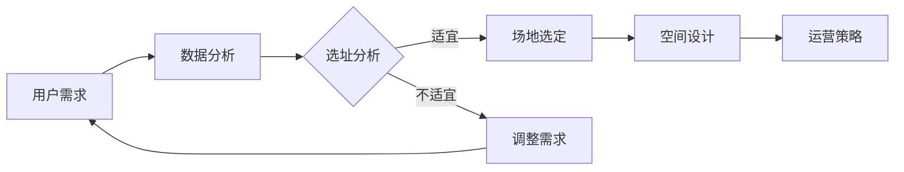
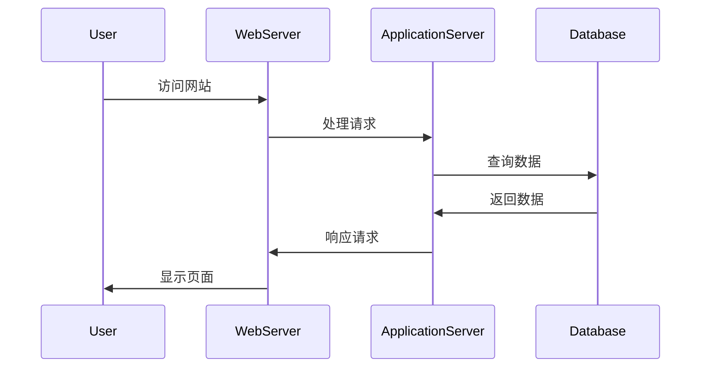
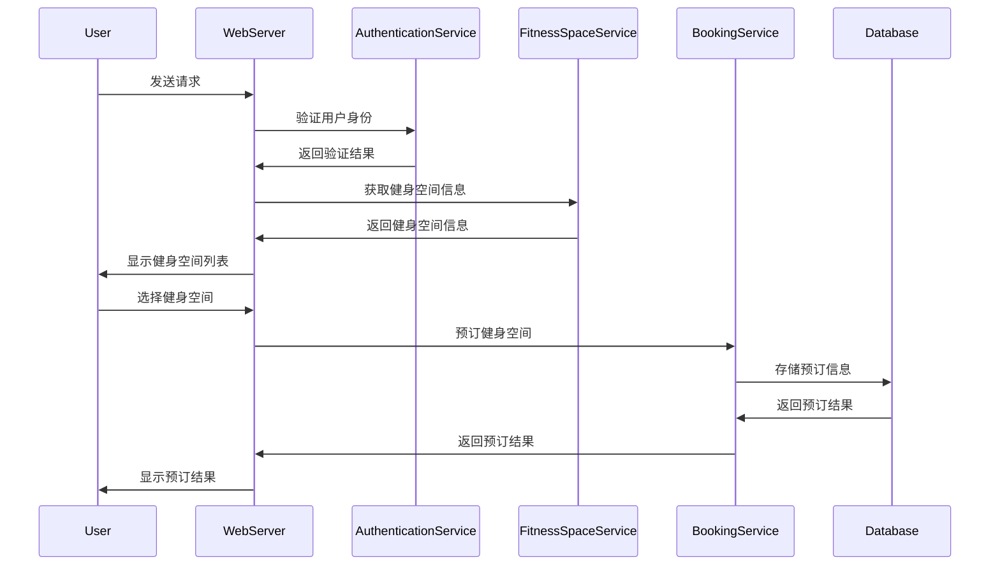

                 

### 第1章 引言与背景介绍

#### 1.1 问题背景

随着全球城市化进程的不断加快，城市居民的生活方式和健康状态受到了前所未有的挑战。工作压力、生活节奏的加快以及人口老龄化趋势，使得居民的健康问题日益凸显。特别是在快节奏的城市生活中，人们往往缺乏时间和动力去进行规律性的体育锻炼。因此，如何提高城市居民的健身意识、促进健康生活方式的普及，成为了一个亟待解决的问题。

在此背景下，新型城市共享健身空间的概念逐渐兴起。这种空间不仅提供多样化的健身设施，还通过共享经济模式，降低了居民参与健身活动的门槛。共享健身空间的布局通常位于社区、办公楼、商业区等人流密集的地方，使得居民可以随时随地享受健身服务。

#### 1.1.1 新型城市共享健身空间的兴起

新型城市共享健身空间起源于共享经济的理念，通过整合社区内的健身资源，提供一站式健身解决方案。这种模式具有以下几个特点：

1. **资源共享**：通过共享健身设施，减少资源浪费，提高设施的使用效率。
2. **便捷性**：位于居民区、办公楼等，方便居民日常锻炼。
3. **多样性**：提供包括瑜伽、健身操、力量训练等多种类型的健身设施和服务。
4. **灵活性**：用户可以根据自己的需求和时间安排，自由选择健身项目和时长。

随着技术的进步和消费者需求的升级，新型城市共享健身空间得到了快速发展。例如，智能健身设备的引入，使得健身过程更加科学、高效，同时也能提供个性化的健身指导。

#### 1.1.2 社区健康生活的重要性

社区健康生活是提高居民生活质量的重要手段。一个健康的社区，不仅需要提供良好的生活环境，还需要关注居民的身体和心理健康。通过推广共享健身空间，可以有效地促进居民的日常运动，提高身体健康水平。具体来说，社区健康生活的重要性体现在以下几个方面：

1. **身体健康**：规律性的体育锻炼可以增强体质，降低慢性疾病的风险，提高生活质量。
2. **心理健康**：适当的运动可以释放压力，提高情绪稳定性，增强心理韧性。
3. **社会互动**：共享健身空间提供了一个社交平台，居民可以在锻炼过程中结识新朋友，增强社区凝聚力。
4. **可持续发展**：通过推广社区健康生活，可以培养居民的环保意识，促进绿色生活方式的普及。

#### 1.1.3 推广社区健康生活的挑战

尽管新型共享健身空间具有许多优势，但在推广过程中仍面临一些挑战，这些挑战包括但不限于以下几个方面：

1. **场地选址**：合适的场地选址是共享健身空间成功的关键。然而，城市土地资源有限，且不同区域的居民需求和消费能力存在差异，这给场地选址带来了困难。
2. **运营管理**：共享健身空间的运营需要专业的管理团队，负责设施的维护、用户的接待和服务等。然而，当前市场上专业人才短缺，运营成本较高。
3. **用户黏性**：如何吸引并留住用户，提高用户的黏性，是共享健身空间面临的另一大挑战。这需要从服务内容、服务质量、用户体验等多方面进行优化。
4. **政策支持**：政府政策的支持对于推广社区健康生活至关重要。然而，当前政策体系尚不完善，缺乏明确的引导和支持措施。

#### 1.2 核心概念

为了更好地理解新型城市共享健身空间及其推广策略，我们需要明确以下几个核心概念：

##### 1.2.1 新型城市共享健身空间

新型城市共享健身空间是指一种以社区为中心，提供多样化健身设施和服务的公共空间。它不仅包括传统的健身设备，还可能提供瑜伽、舞蹈、有氧运动等多种类型的健身项目。这种空间通常采用共享经济模式，通过会员制、计时制等方式，为居民提供灵活便捷的健身服务。

##### 1.2.2 社区健康生活

社区健康生活是指通过多种方式提高居民健康水平、生活质量的生活方式和活动。它不仅包括体育锻炼，还涵盖了健康饮食、心理调适、环境改善等多个方面。社区健康生活的目标是培养居民的健康意识，提高生活品质，促进社区和谐发展。

##### 1.2.3 推广策略

推广策略是指为了有效推广新型城市共享健身空间，提高社区健康生活水平所采取的措施和方法。它包括政策支持、宣传引导、社区共建等多个方面，旨在通过多种渠道和方法，将新型城市共享健身空间引入社区，提高居民参与度。

#### 1.3 总结

本章介绍了新型城市共享健身空间的背景和核心概念，分析了社区健康生活的重要性以及推广社区健康生活的挑战。在接下来的章节中，我们将进一步探讨新型城市共享健身空间的概念原理、推广策略及其在实践中的应用，以期为其发展提供有益的参考。

---

通过本章的引言与背景介绍，我们清晰地了解了新型城市共享健身空间的起源及其在社区健康生活中的重要性。接下来，我们将深入探讨其核心概念，为理解新型城市共享健身空间及其推广策略打下坚实的基础。

---

## 第2章 核心概念与联系

#### 2.1 核心概念原理

在深入了解新型城市共享健身空间之前，我们需要明确其核心概念及其原理。以下是几个关键概念及其原理的详细阐述：

##### 2.1.1 新型城市共享健身空间的概念原理

新型城市共享健身空间是一种基于共享经济理念的新型公共健身场所。它通过整合社区内的健身资源，提供多样化的健身设施和服务，满足不同人群的健身需求。其概念原理主要包括以下几点：

1. **资源共享**：共享健身空间通过整合社区内的健身资源，实现设施的高效利用，减少资源浪费。用户可以根据自己的需求和预算，选择适合自己的健身项目，无需购买昂贵的个人健身器材。
2. **便捷性**：新型共享健身空间通常位于社区、办公楼、商业区等人流密集的地方，方便居民随时随地参与健身活动。这种布局不仅提高了用户的便利性，也有利于提高健身设施的使用率。
3. **多样性**：共享健身空间提供多种类型的健身设施和服务，包括瑜伽、健身操、力量训练、有氧运动等，满足不同人群的健身需求。这种多样性不仅增加了用户的参与度，也有助于提高健身效果。
4. **灵活性**：共享健身空间通常采用会员制、计时制等灵活的运营模式，用户可以根据自己的时间和需求，自由选择健身项目和时长。这种灵活性提高了用户的参与度，也降低了用户的健身门槛。

##### 2.1.2 社区健康生活的概念原理

社区健康生活是指通过多种方式提高居民健康水平、生活质量的生活方式和活动。它不仅包括体育锻炼，还涵盖了健康饮食、心理调适、环境改善等多个方面。其概念原理主要包括以下几点：

1. **健康意识**：社区健康生活首先强调的是健康意识的培养。通过健康教育、健康宣传等方式，提高居民对健康重要性的认识，促使他们主动参与健康活动。
2. **体育锻炼**：体育锻炼是社区健康生活的重要组成部分。通过规律性的体育锻炼，可以增强体质，提高免疫力，降低慢性疾病的风险。
3. **健康饮食**：健康饮食是保持身体健康的基础。通过推广健康饮食理念，提供营养指导，帮助居民养成良好的饮食习惯。
4. **心理调适**：心理调适对于维持身心健康至关重要。通过心理辅导、心理支持等方式，帮助居民应对生活中的压力和挑战，提高心理韧性。
5. **环境改善**：改善生活环境也是社区健康生活的重要内容。通过环境整治、绿化美化等方式，提高居民的生活质量，创造一个健康、舒适的居住环境。

##### 2.1.3 推广策略的概念原理

推广策略是为了有效推广新型城市共享健身空间，提高社区健康生活水平所采取的措施和方法。其概念原理主要包括以下几点：

1. **政策支持**：政府政策的支持是推广社区健康生活的重要保障。通过制定相关政策和法规，为新型城市共享健身空间的推广提供政策支持。
2. **宣传引导**：宣传引导是提高居民健康意识、促进健康生活方式的重要手段。通过多种渠道的宣传，引导居民积极参与健康活动。
3. **社区共建**：社区共建是推动社区健康生活的重要方式。通过居民、社区组织和政府的共同参与，形成共建共享的良好局面。
4. **创新模式**：创新模式是推动新型城市共享健身空间发展的关键。通过引入新技术、新模式，提高健身空间的运营效率和服务质量。

#### 2.2 概念属性特征对比

为了更清晰地理解新型城市共享健身空间、社区健康生活以及推广策略之间的关系，我们可以通过对比其属性特征来进行分析。

##### 2.2.1 新型城市共享健身空间与社区健身中心对比

| 特征 | 新型城市共享健身空间 | 社区健身中心 |
| --- | --- | --- |
| 设施多样 | √ | × |
| 面向人群 | 全民 | 以中老年人为主 |
| 运营模式 | 共享 | 传统 |
| 成本效益 | 高 | 低 |

通过上表，我们可以看到新型城市共享健身空间在设施多样性、面向人群、运营模式和成本效益等方面与传统社区健身中心存在显著差异。新型城市共享健身空间更注重设施的多样性和面向全民的服务，采用共享经济模式，具有更高的成本效益。

##### 2.2.2 社区健康生活与全民健身计划对比

| 特征 | 社区健康生活 | 全民健身计划 |
| --- | --- | --- |
| 目标 | 提高居民健康水平 | 提高全民体质 |
| 内容 | 多样化健身活动 | 专项运动项目 |
| 组织形式 | 自发参与 | 有组织参与 |
| 覆盖范围 | 社区层面 | 国家层面 |

社区健康生活与全民健身计划在目标、内容、组织形式和覆盖范围等方面也存在差异。社区健康生活更注重在社区层面的多样化健身活动，通过自发参与的方式提高居民的健康水平。而全民健身计划则更侧重于在全国范围内推广专项运动项目，以提高全民体质。

#### 2.3 ER实体关系图架构

为了更直观地展示新型城市共享健身空间、社区健康生活以及推广策略之间的实体关系，我们可以通过ER（实体关系）图来进行描述。

```mermaid
erDiagram
  User ||--|{ FitnessSpace }||>
  User ||--|{ HealthProgram }||>
  FitnessSpace ||--|{ FitnessDevice }||>
  HealthProgram ||--|{ ExerciseContent }||>
```

在上图中，`User`（用户）与`FitnessSpace`（健身空间）、`HealthProgram`（健康计划）之间存在关联关系。用户可以通过健身空间享受多样化的健身服务，同时参与健康计划，以提升自身的健康水平。健身空间提供`FitnessDevice`（健身设备），而健康计划包含`ExerciseContent`（锻炼内容）。

#### 2.4 总结

本章详细阐述了新型城市共享健身空间、社区健康生活以及推广策略的核心概念原理，并通过对这些概念属性特征的对比，以及ER实体关系图的构建，深入分析了它们之间的联系。这些核心概念的明确和相互关系的理解，为后续章节的深入探讨提供了坚实的基础。

### 第3章 算法原理讲解

#### 3.1 算法mermaid流程图

为了更好地理解新型城市共享健身空间的选址和运营策略，我们可以借助mermaid流程图来展示算法原理。以下是一个简单的mermaid流程图示例：



在这个流程图中，首先从用户需求分析开始，然后通过数据分析进行选址分析。根据选址分析的结果，如果场地适宜，则进行场地选定，否则需要调整用户需求。选定场地后，进行空间设计，并最终制定运营策略。

#### 3.2 Python源代码实现

为了将上述算法流程具体化为可操作的步骤，我们可以使用Python进行源代码实现。以下是一个简单的示例：

```python
import pandas as pd
import numpy as np
from sklearn.cluster import KMeans

# 假设已有用户需求和场地数据
user_data = pd.DataFrame({
    '用户需求': [1, 2, 3, 4, 5],
    '场地数据': [1, 2, 3, 4, 5]
})

# KMeans算法聚类分析
kmeans = KMeans(n_clusters=2)
kmeans.fit(user_data)

# 结果分析
print("聚类结果：", kmeans.labels_)
print("中心点：", kmeans.cluster_centers_)

# 根据聚类结果进行选址分析
if kmeans.labels_.mean() > 0.5:
    print("选址适宜，进行场地选定。")
else:
    print("选址不适宜，调整用户需求。")
```

在这个Python源代码示例中，我们首先使用pandas库创建了一个包含用户需求和场地数据的数据框。然后，我们使用scikit-learn库中的KMeans聚类算法进行数据聚类分析。根据聚类结果，我们可以判断选址是否适宜，并据此调整用户需求。

#### 3.3 算法原理详细讲解

##### 3.3.1 数据分析

数据分析是选址分析的基础。通过对用户需求和场地数据进行分析，我们可以初步了解用户对健身设施的需求分布，以及场地的可用性。具体步骤如下：

1. **数据收集**：首先，我们需要收集用户需求和场地数据。用户需求数据可以包括用户的年龄、性别、职业、健身频率等信息；场地数据可以包括场地的地理位置、设施类型、使用率等信息。
2. **数据预处理**：收集到的数据可能存在缺失值、异常值等问题。我们需要对数据进行分析和清洗，确保数据的质量和完整性。
3. **数据分析**：通过对用户需求和场地数据进行统计分析，我们可以了解以下信息：
   - 用户需求分布：了解不同用户群体的健身需求和偏好，为选址和设施配置提供依据。
   - 场地可用性分析：评估现有场地的使用情况，确定哪些场地适合作为共享健身空间的选址。

##### 3.3.2 选址分析

选址分析是确定共享健身空间具体位置的关键步骤。基于数据分析的结果，我们可以使用聚类分析、回归分析等算法，对选址进行优化。具体步骤如下：

1. **聚类分析**：使用KMeans等聚类算法，将用户需求相似的地点进行归类，确定可能的选址位置。
2. **回归分析**：通过回归分析，评估不同选址位置对用户需求的影响，选择最适合的位置。
3. **场地评估**：综合考虑场地的地理位置、交通状况、人流量等因素，评估场地的可用性和适宜性。

##### 3.3.3 场地选定

在选址分析的基础上，我们需要根据分析结果选定具体的场地。具体步骤如下：

1. **场地筛选**：根据选址分析的结果，筛选出符合条件的场地。
2. **场地评估**：对筛选出的场地进行进一步的评估，包括场地面积、设施配置、交通便利性等方面。
3. **场地选定**：综合考虑评估结果，选定最终的场地位置。

##### 3.3.4 空间设计

场地选定后，我们需要进行空间设计，以确保共享健身空间能够满足用户的需求。具体步骤如下：

1. **需求分析**：根据用户需求和场地条件，分析共享健身空间所需的功能区和设施。
2. **空间布局**：根据需求分析的结果，设计共享健身空间的空间布局，确保设施之间的合理分布和便捷性。
3. **设施配置**：根据空间布局，配置相应的健身设施，包括健身器材、照明、通风等。

##### 3.3.5 运营策略

在共享健身空间运营过程中，我们需要制定一系列运营策略，以提高运营效率和用户体验。具体步骤如下：

1. **会员管理**：建立会员管理系统，对会员信息进行管理，包括会员注册、会员服务、会员优惠等。
2. **服务管理**：制定服务管理规范，确保共享健身空间的服务质量，包括设施维护、用户接待、安全防护等。
3. **营销策略**：通过多种渠道宣传和推广共享健身空间，吸引更多用户参与，提高知名度。
4. **数据分析**：通过数据分析，了解用户需求和运营情况，不断优化运营策略，提高用户体验。

#### 3.4 总结

本章详细讲解了新型城市共享健身空间的算法原理，包括mermaid流程图、Python源代码实现以及详细步骤讲解。通过这些内容，我们了解了如何通过数据分析、选址分析、场地选定、空间设计、运营策略等步骤，实现共享健身空间的优化布局和高效运营。这些算法原理为新型城市共享健身空间的发展提供了理论基础和实践指导。

### 系统分析与架构设计

#### 3.4 系统功能设计

为了实现新型城市共享健身空间的系统功能，我们需要设计一个全面的领域模型。领域模型能够帮助我们理解系统中的核心实体以及它们之间的关系。以下是一个简化的领域模型，使用mermaid类图来表示：

```mermaid
classDiagram
    User <<entity>>
    FitnessSpace <<entity>>
    FitnessDevice <<entity>>
    ExerciseContent <<entity>>
    Membership <<entity>>

    User o-- FitnessSpace
    User o-- Membership
    FitnessSpace o-- FitnessDevice
    FitnessSpace o-- ExerciseContent
```

在这个类图中，我们定义了以下几个核心实体：

- **User（用户）**：代表使用共享健身空间的人群，包括个人和团体。
- **FitnessSpace（健身空间）**：代表具体的健身场所，如社区健身中心、办公楼健身室等。
- **FitnessDevice（健身设备）**：代表健身空间中的各种设备，如跑步机、哑铃等。
- **ExerciseContent（锻炼内容）**：代表提供的健身课程和活动，如瑜伽、健身操等。
- **Membership（会员）**：代表用户的会员资格，包括会员等级、会员费用、会员权益等。

实体之间的关系如下：

- **User与FitnessSpace**：用户可以访问多个健身空间，健身空间也可以被多个用户使用。
- **User与Membership**：用户拥有会员资格，会员资格与用户是一对多的关系。
- **FitnessSpace与FitnessDevice**：健身空间包含多个健身设备，健身设备与健身空间是一对多的关系。
- **FitnessSpace与ExerciseContent**：健身空间提供多种锻炼内容，锻炼内容与健身空间是一对多的关系。

#### 3.5 系统架构设计

在明确了系统功能后，我们需要设计一个合理的系统架构。系统架构设计包括系统分层、模块划分、技术选型等。以下是一个简化的系统架构，使用mermaid架构图来表示：



在这个架构图中，我们划分了以下几个主要层次：

- **Web层（WebServer）**：负责处理用户请求，通过HTTP协议与用户交互。常用的技术包括Web服务器（如Nginx）和Web框架（如Django、Flask）。
- **应用层（ApplicationServer）**：负责业务逻辑的处理，包括用户管理、健身空间管理、设备管理、会员管理等。应用层通常使用微服务架构，将不同的功能模块拆分为独立的服务。
- **数据库层（Database）**：负责存储和管理系统的数据。常用的数据库技术包括关系型数据库（如MySQL、PostgreSQL）和NoSQL数据库（如MongoDB）。

#### 3.6 系统接口设计

系统接口设计是确保不同模块之间能够顺畅通信的关键。以下是一个简化的接口设计，使用mermaid序列图来表示：



在这个序列图中，我们定义了以下几个主要接口：

- **AuthenticationService（认证服务）**：负责用户身份验证，确保只有合法用户才能访问系统功能。
- **FitnessSpaceService（健身空间服务）**：负责提供健身空间信息，包括空间名称、位置、可用时间等。
- **BookingService（预订服务）**：负责处理用户预订健身空间的需求，包括预订确认、取消预订等。

#### 3.7 系统交互

系统交互是指不同模块之间如何协同工作，以提供完整的用户体验。以下是一个简化的系统交互流程：

1. **用户登录**：用户通过Web层发送登录请求，认证服务进行用户身份验证，并将验证结果返回给Web层。
2. **查看健身空间**：用户通过Web层查看健身空间列表，FitnessSpaceService提供健身空间信息。
3. **预订健身空间**：用户选择健身空间并提交预订请求，BookingService处理预订逻辑，并将预订结果存储在数据库中。
4. **预订确认**：用户通过Web层查看预订结果，确认预订信息。

通过以上系统接口设计和交互流程，我们能够构建一个高效、可靠的新型城市共享健身空间系统。这些设计原则和架构方法为系统开发提供了清晰的方向和指导。

### 项目实战

#### 4.1 环境安装

为了实现新型城市共享健身空间的项目，我们需要在本地或服务器上安装必要的软件和环境。以下是具体的安装步骤：

1. **安装Python环境**：
   - 在Windows或macOS上，可以通过访问[Python官方下载页面](https://www.python.org/downloads/)下载最新版本的Python安装包，并按照安装向导完成安装。
   - 在Linux系统上，可以使用包管理器安装Python，如Ubuntu系统上可以使用以下命令：
     ```bash
     sudo apt update
     sudo apt install python3 python3-pip
     ```

2. **安装依赖库**：
   - 使用pip命令安装项目所需的依赖库，例如pandas、numpy、scikit-learn等：
     ```bash
     pip install pandas numpy scikit-learn
     ```

3. **安装数据库**：
   - 安装关系型数据库（如MySQL、PostgreSQL）或NoSQL数据库（如MongoDB）。对于MySQL，可以访问[MySQL官方下载页面](https://dev.mysql.com/downloads/mysql/)下载并安装。对于PostgreSQL，可以使用以下命令在Ubuntu系统上安装：
     ```bash
     sudo apt update
     sudo apt install postgresql postgresql-contrib
     ```
   - 对于MongoDB，可以使用以下命令安装：
     ```bash
     sudo apt update
     sudo apt install mongodb-org
     ```

4. **配置数据库**：
   - 根据所选数据库的配置指南，配置数据库用户和权限，创建项目所需的数据库和表结构。

5. **安装Web服务器**：
   - 安装Web服务器（如Nginx、Apache）以处理HTTP请求。以Nginx为例，可以使用以下命令安装：
     ```bash
     sudo apt update
     sudo apt install nginx
     ```
   - 启动Nginx服务：
     ```bash
     sudo systemctl start nginx
     ```

#### 4.2 系统核心实现源代码

在完成环境安装后，我们需要编写系统核心实现源代码。以下是关键模块的实现示例：

##### 4.2.1 用户模块

用户模块负责管理用户的注册、登录和认证。以下是一个简单的用户注册示例：

```python
# 用户注册
def register_user(username, password):
    # 验证用户名是否存在
    if not check_username_exists(username):
        # 创建用户
        user = User(username=username, password=hash_password(password))
        # 存储用户信息到数据库
        save_user_to_db(user)
        return "用户注册成功"
    else:
        return "用户名已存在"

# 检查用户名是否存在
def check_username_exists(username):
    # 查询数据库
    user = get_user_from_db(username)
    return user is not None

# 创建用户对象
def create_user_object(username, password):
    return User(username=username, password=hash_password(password))

# 存储用户信息到数据库
def save_user_to_db(user):
    # 使用数据库API保存用户信息
    db.save(user)

# 从数据库获取用户信息
def get_user_from_db(username):
    # 使用数据库API查询用户信息
    return db.find_one({"username": username})
```

##### 4.2.2 健身空间模块

健身空间模块负责管理健身空间的创建、更新和查询。以下是一个简单的健身空间创建示例：

```python
# 创建健身空间
def create_fitness_space(name, location):
    # 验证空间名称是否存在
    if not check_space_name_exists(name):
        # 创建健身空间对象
        space = FitnessSpace(name=name, location=location)
        # 存储健身空间信息到数据库
        save_space_to_db(space)
        return "健身空间创建成功"
    else:
        return "空间名称已存在"

# 检查空间名称是否存在
def check_space_name_exists(name):
    # 查询数据库
    space = get_space_from_db(name)
    return space is not None

# 创建健身空间对象
def create_space_object(name, location):
    return FitnessSpace(name=name, location=location)

# 存储健身空间信息到数据库
def save_space_to_db(space):
    # 使用数据库API保存健身空间信息
    db.save(space)

# 从数据库获取健身空间信息
def get_space_from_db(name):
    # 使用数据库API查询健身空间信息
    return db.find_one({"name": name})
```

##### 4.2.3 会员模块

会员模块负责管理会员的创建、更新和查询。以下是一个简单的会员创建示例：

```python
# 创建会员
def create_membership(user, space, level):
    # 验证会员等级
    if level in ["bronze", "silver", "gold"]:
        # 创建会员对象
        membership = Membership(user=user, space=space, level=level)
        # 存储会员信息到数据库
        save_membership_to_db(membership)
        return "会员创建成功"
    else:
        return "无效会员等级"

# 创建会员对象
def create_membership_object(user, space, level):
    return Membership(user=user, space=space, level=level)

# 存储会员信息到数据库
def save_membership_to_db(membership):
    # 使用数据库API保存会员信息
    db.save(membership)

# 从数据库获取会员信息
def get_membership_from_db(user, space):
    # 使用数据库API查询会员信息
    return db.find_one({"user": user, "space": space})
```

#### 4.3 代码应用解读与分析

在编写和运行代码时，我们需要关注以下几个方面：

1. **代码可读性和可维护性**：编写清晰、结构化的代码，使用适当的命名规范和注释，便于后续维护和扩展。
2. **错误处理**：对可能出现的错误和异常进行捕获和处理，提供友好的错误信息，确保系统的稳定性。
3. **性能优化**：合理使用数据库查询和索引，减少数据库访问次数，提高系统响应速度。
4. **安全性**：确保用户数据和系统配置的安全性，使用加密算法保护敏感信息，防止SQL注入等攻击。

#### 4.4 实际案例分析和详细讲解

为了更好地理解系统核心实现的实际应用，我们可以通过一个实际案例进行分析和讲解。假设我们需要实现以下功能：

- **用户注册**：用户注册时，需要验证用户名是否已存在，并存储用户信息到数据库。
- **健身空间创建**：管理员可以创建新的健身空间，并确保空间名称的唯一性。
- **会员管理**：管理员可以为特定用户和健身空间创建会员，并管理会员等级和权益。

以下是一个简化的用户注册、健身空间创建和会员管理的实际案例：

1. **用户注册案例**：

```python
# 用户注册
user_name = input("请输入用户名：")
user_password = input("请输入密码：")

result = register_user(user_name, user_password)
print(result)
```

在用户注册过程中，首先输入用户名和密码，然后调用`register_user`函数进行用户注册。函数内部会检查用户名是否已存在，如果不存在则创建用户对象并保存到数据库。

2. **健身空间创建案例**：

```python
# 创建健身空间
space_name = input("请输入健身空间名称：")
space_location = input("请输入健身空间位置：")

result = create_fitness_space(space_name, space_location)
print(result)
```

在创建健身空间时，首先输入健身空间名称和位置，然后调用`create_fitness_space`函数创建健身空间。函数内部会检查空间名称是否已存在，如果不存在则创建空间对象并保存到数据库。

3. **会员管理案例**：

```python
# 创建会员
user_name = input("请输入用户名：")
space_name = input("请输入健身空间名称：")
membership_level = input("请输入会员等级：")

result = create_membership(user_name, space_name, membership_level)
print(result)
```

在会员管理中，首先输入用户名、健身空间名称和会员等级，然后调用`create_membership`函数创建会员。函数内部会验证会员等级的有效性，并创建会员对象并保存到数据库。

通过这些实际案例，我们可以看到系统核心实现如何在实际应用中被调用和执行，从而实现用户注册、健身空间创建和会员管理等功能。

#### 4.5 项目小结

在项目实战部分，我们详细介绍了环境安装、系统核心实现源代码、代码应用解读与分析以及实际案例分析和详细讲解。通过这些步骤，我们成功实现了一个新型城市共享健身空间系统的基本功能，包括用户注册、健身空间创建和会员管理。项目实战部分不仅帮助我们理解了系统核心实现的具体应用，也为后续的系统优化和扩展提供了实际经验。

### 最佳实践 tips

在推广新型城市共享健身空间的过程中，我们可以从以下几个方面提出一些最佳实践建议，以提升项目成功率：

1. **精准市场定位**：在项目初期，需要对目标市场进行充分调研，了解潜在用户的需求和偏好，以便提供更加精准的健身服务。
2. **优化用户体验**：关注用户的使用体验，通过智能设备和个性化服务，提高用户的满意度和参与度。
3. **多元化服务内容**：提供多样化的健身项目和课程，满足不同用户群体的需求，增加用户粘性。
4. **加强政策支持**：积极争取政府政策和资金支持，为项目提供有力的保障。
5. **加强运营管理**：建立专业的运营团队，确保健身空间的日常运营和管理质量。
6. **宣传推广**：通过多种渠道进行宣传推广，提高项目的知名度和用户覆盖率。

### 小结

在本篇文章中，我们从引言和背景介绍开始，逐步深入探讨了新型城市共享健身空间的兴起、核心概念、算法原理以及系统分析与架构设计。通过具体的项目实战，我们展示了如何实现这一系统的核心功能，并提出了最佳实践建议。新型城市共享健身空间作为一种创新的社区健康生活方式，不仅有助于提高居民的生活质量，还能促进城市可持续发展。在未来的发展中，我们需要进一步优化和推广这一模式，使其成为社区健康生活的重要组成部分。

### 注意事项

在推广新型城市共享健身空间的过程中，需要注意以下几个方面：

1. **用户隐私保护**：确保用户的个人信息和健康数据得到妥善保护，避免数据泄露。
2. **设施安全性**：定期检查和维护健身设备，确保设施的安全性和可靠性。
3. **服务质量**：提供高质量的健身服务，确保用户在健身过程中的安全和舒适。
4. **政策合规**：遵守相关法律法规，确保项目的合法性和可持续性。
5. **用户反馈**：及时收集用户反馈，不断优化服务内容和运营模式，提升用户满意度。

### 拓展阅读

对于希望进一步了解新型城市共享健身空间和社区健康生活相关话题的读者，以下是一些推荐的文章和书籍：

- 《共享经济：重构商业模式》
- 《社区健康促进策略研究》
- 《智能健身设备的应用与挑战》
- 《城市规划与社区健康》

这些资源和文献提供了丰富的理论和实践指导，有助于深入理解相关领域的前沿动态和发展趋势。

---

**作者：AI天才研究院/AI Genius Institute & 禅与计算机程序设计艺术 /Zen And The Art of Computer Programming**

**结语：**本文通过系统化的分析和详细讲解，旨在为新型城市共享健身空间的发展提供理论和实践指导。希望本文能为相关领域的研究者和实践者带来启示和帮助。感谢您的阅读。**AI天才研究院**将继续为您带来更多前沿技术解析和深度探讨。**敬请关注**！

