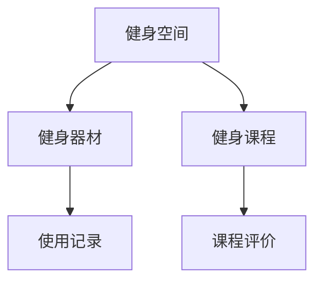
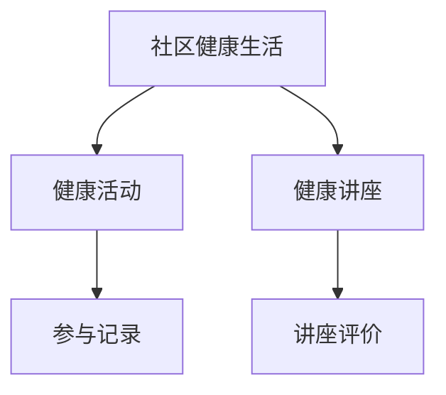
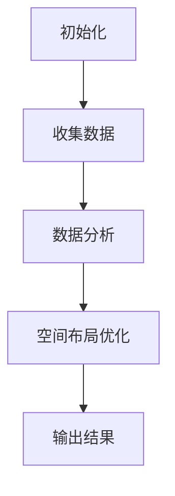
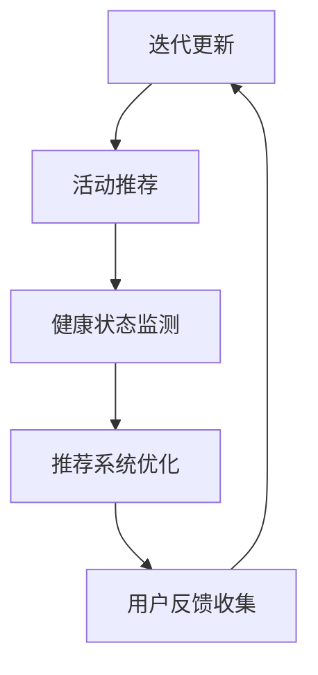
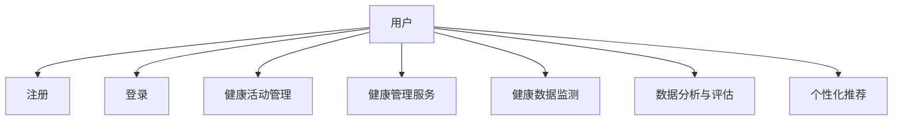
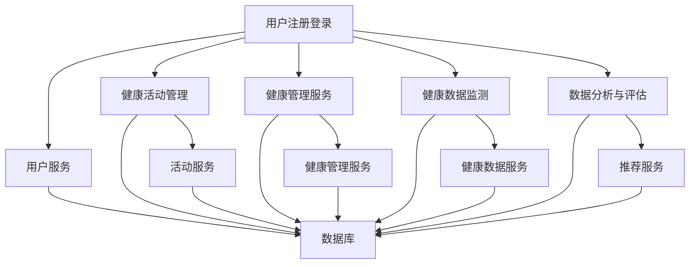
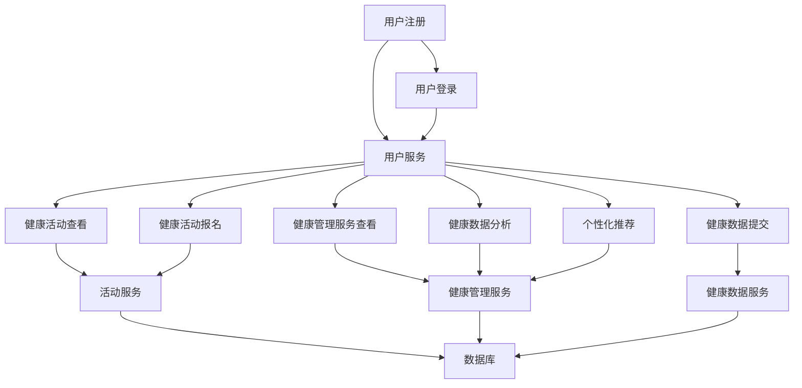
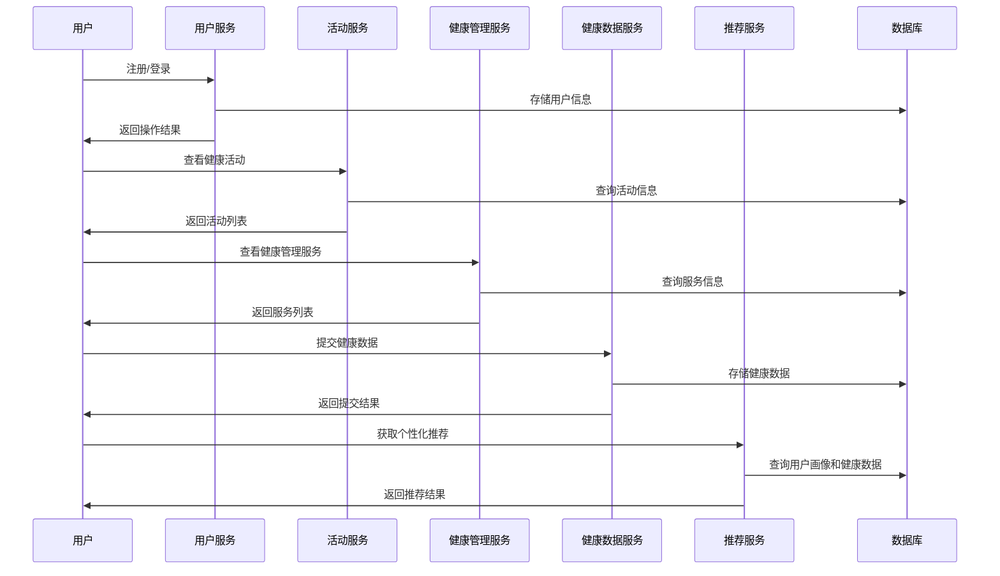

                 


### 第一部分：背景介绍

#### 第1章：问题背景与重要性

##### 1.1 问题背景

随着城市化进程的不断推进，城市生活方式逐渐发生变化。人们的工作压力增大，生活习惯逐渐偏向于静态，导致健康问题日益突出。与此同时，居民对社区健康生活的需求不断增长，希望能够在一个便捷、舒适的环境中享受健身服务，提高生活质量。

##### 1.2 问题描述

传统健身房模式存在一定的局限性，如场地租赁成本高、会员费昂贵、地理位置不便等问题。此外，传统社区活动形式单一，难以满足居民多样化的健康需求。因此，如何创新社区健康生活方式，提升居民健康水平，成为了一个亟待解决的问题。

##### 1.3 问题解决

新型城市共享健身空间作为一种创新模式，旨在解决传统健身房和社区活动的局限性。它以共享经济为理念，通过共享设施、共享时间、共享教练等方式，降低健身成本，提高使用效率，使居民能够方便地参与到健身活动中。

##### 1.4 边界与外延

新型城市共享健身空间主要针对城市社区，提供多样化的健身设施和服务。其边界包括健身场地、健身器材、健身课程等，外延则涉及社区健康活动、健康管理服务等领域。

##### 1.5 概念结构与核心要素组成

新型城市共享健身空间的核心要素包括以下几个方面：

1. **共享设施**：提供多样化的健身器材和场地，满足不同居民的健身需求。
2. **共享时间**：通过预约系统，实现健身资源的灵活分配，提高场地利用率。
3. **共享教练**：邀请专业教练提供个性化服务，提升健身效果。
4. **健康管理**：提供健康管理服务，帮助居民了解自身健康状况，制定个性化健身计划。

社区健康生活的概念与目标主要包括以下几个方面：

1. **提升健康意识**：通过宣传、教育等方式，提高居民对健康问题的认识和重视程度。
2. **丰富健康活动**：组织多样化的健康活动，如健身课程、健康讲座、户外运动等，满足居民的多样化需求。
3. **优化健康服务**：提供便捷、专业的健康管理服务，帮助居民实现科学健身。

### 第二部分：核心概念与联系

#### 第2章：核心概念与联系

##### 2.1 核心概念原理

**共享健身空间**：以共享经济为理念，提供多样化的健身设施和服务，实现健身资源的共享和优化配置。

**社区健康生活**：以提升居民健康意识、丰富健康活动、优化健康服务为目标，构建一个健康、活力、和谐的社区环境。

##### 2.2 概念属性特征对比表格

| 特征         | 共享健身空间                | 社区健康生活                |
| ------------ | -------------------------- | -------------------------- |
| 服务对象     | 居民、上班族、商务人士等    | 全体社区居民                |
| 服务内容     | 健身设施、健身课程、健康管理 | 健康活动、健康讲座、健康咨询等 |
| 服务形式     | 共享、预约、自助            | 活动、服务、咨询            |
| 成本         | 低成本、高效益            | 多元化、个性化              |
| 目标         | 提高健身效率、降低健身成本   | 提升健康水平、构建健康社区   |

##### 2.3 ER实体关系图架构

**健身空间实体关系图：**



**社区健康生活实体关系图：**



### 第三部分：算法原理讲解

#### 第3章：算法原理讲解

##### 3.1 健身空间布局优化算法

**算法流程图：**



**算法原理：**

1. **数据收集**：收集健身空间的场地面积、健身器材数量、居民健身习惯等数据。
2. **数据分析**：分析数据，确定健身空间的布局方案。
3. **空间布局优化**：根据数据分析结果，优化健身空间的布局，提高场地利用率。
4. **输出结果**：生成优化后的空间布局方案。

**算法数学模型：**

设健身空间场地面积为S，健身器材数量为N，居民健身习惯为H，则健身空间布局优化模型为：

$$
\begin{aligned}
\text{maximize} & \quad \frac{S}{N} \\
\text{subject to} & \quad \sum_{i=1}^{N} h_i \leq H \\
& \quad \text{其中，} h_i \text{为居民} i \text{的健身习惯，} H \text{为总健身习惯。}
\end{aligned}
$$

**举例说明：**

假设某社区健身空间场地面积为1000平方米，现有健身器材50台，居民健身习惯为每天累计运动2小时。根据上述算法模型，可以得出该健身空间的最优布局方案，以最大化场地利用率。

##### 3.2 社区健康生活方式推荐算法

**算法流程图：**



**算法原理：**

1. **用户画像构建**：收集用户的年龄、性别、体重、运动习惯等数据，构建用户画像。
2. **活动推荐**：根据用户画像，推荐适合用户的健身活动和健康管理方案。
3. **健康状态监测**：通过监测用户的运动数据，实时了解用户的健康状态。
4. **推荐系统优化**：根据用户反馈和健康状态监测数据，优化推荐系统，提高推荐准确性。
5. **用户反馈收集**：收集用户对推荐系统的反馈，用于迭代更新。

**算法数学模型：**

设用户画像为$P = (p_1, p_2, ..., p_n)$，活动推荐为$R = (r_1, r_2, ..., r_m)$，健康状态监测为$S = (s_1, s_2, ..., s_m)$，推荐系统优化模型为：

$$
\begin{aligned}
\text{maximize} & \quad \sum_{i=1}^{m} p_i r_i \\
\text{subject to} & \quad \sum_{i=1}^{m} s_i r_i \geq \theta \\
& \quad \text{其中，} \theta \text{为健康状态阈值。}
\end{aligned}
$$

**举例说明：**

假设某用户年龄30岁，体重70公斤，运动习惯为每天跑步30分钟。根据上述算法模型，可以推荐适合该用户的健身活动和健康管理方案，以帮助其保持健康。

### 第四部分：实践与案例分析

#### 第4章：算法在新型城市共享健身空间中的应用

##### 4.1 环境安装

在本章节，我们将介绍如何搭建一个新型城市共享健身空间的应用环境，包括所需的软件和硬件环境配置。

##### 4.2 系统核心实现源代码

在本章节，我们将详细讲解系统核心实现的源代码，包括健身空间布局优化算法和社区健康生活方式推荐算法的实现。

##### 4.3 实际案例分析和详细讲解剖析

在本章节，我们将分析实际案例，包括XX城市的共享健身空间实践和YY社区的健康生活推广，并对案例进行详细讲解和剖析。

### 第5章：社区健康生活方式推广

##### 5.1 项目介绍

在本章节，我们将介绍社区健康生活方式推广的项目背景、目标、范围等内容。

##### 5.2 系统功能设计

在本章节，我们将详细讲解系统功能设计，包括领域模型类图、系统架构设计图、系统接口设计和系统交互序列图等内容。

##### 5.3 系统架构设计

在本章节，我们将介绍系统架构设计，包括系统模块划分、数据流程、接口设计等内容。

##### 5.4 系统接口设计

在本章节，我们将详细讲解系统接口设计，包括接口定义、接口参数、接口调用流程等内容。

##### 5.5 系统交互序列图

在本章节，我们将绘制系统交互序列图，展示系统各模块之间的交互关系。

### 第五部分：深度分析与最佳实践

#### 第6章：深度分析与最佳实践

##### 6.1 深度分析

在本章节，我们将对新型城市共享健身空间和社区健康生活方式推广进行深度分析，包括数据分析、系统性能分析等内容。

##### 6.2 最佳实践 Tips

在本章节，我们将总结最佳实践，包括实施策略、成功案例总结等内容。

### 第六部分：小结与展望

#### 第7章：小结与展望

##### 7.1 小结

在本章节，我们将对文章的主要内容进行回顾，总结知识点。

##### 7.2 注意事项

在本章节，我们将介绍实施过程中的注意事项。

##### 7.3 拓展阅读

在本章节，我们将推荐相关书籍和学术论文，供读者进一步学习。

---

通过以上详细的目录大纲，我们可以看到文章的整体结构和内容安排。接下来，我们将逐一撰写每个章节的内容，确保文章的逻辑清晰、内容丰富，同时遵循markdown格式和约定的字数要求。在撰写过程中，我们将确保核心内容的完整性和专业性，为读者提供有价值的技术博客文章。让我们一步一步地深入探讨新型城市共享健身空间和社区健康生活的推广吧！### 第一部分：背景介绍

#### 第1章：问题背景与重要性

##### 1.1 问题背景

随着城市化进程的不断推进，城市生活方式逐渐发生变化。越来越多的人居住在城市中心或周边地区，工作压力和生活节奏加快，导致居民的生活方式逐渐偏向静态，长时间坐在办公室或家中，缺乏足够的体育锻炼。这种生活方式的改变带来了健康问题，如肥胖、高血压、糖尿病等慢性疾病的发病率逐年上升。与此同时，居民对社区健康生活的需求也日益增长，他们渴望在忙碌的生活中找到一种便捷、高效的方式来保持健康。

##### 1.2 问题描述

传统健身房模式在提供健身服务方面存在一定的局限性。首先，健身房通常需要高昂的租金和设备购买成本，这使得运营成本较高，最终导致会员费用昂贵。对于大多数居民来说，这样的费用难以承担，尤其是那些收入较低的群体。其次，传统健身房通常位于商业区或城市中心，地理位置不便，尤其对于上班族和学生族来说，通勤时间和交通成本成为了一大负担。此外，传统健身房往往以提供通用设施为主，难以满足个体化需求，例如不同人群的健身计划、特殊健身需求等。

另一方面，传统社区活动形式单一，通常仅限于广场舞、晨练等简单的集体活动，难以满足居民日益增长的多样化健康需求。这些活动缺乏专业性和科学性，难以真正帮助居民改善健康状况。

##### 1.3 问题解决

为了解决上述问题，新型城市共享健身空间应运而生。这种模式以共享经济为理念，通过共享设施、共享时间和共享教练等方式，降低健身成本，提高使用效率，使居民能够方便地参与到健身活动中。

首先，共享健身空间通过减少设施购置和场地租赁成本，将运营成本分摊到更多用户身上，从而降低单次健身费用。这种模式尤其适合上班族和学生族，他们可以以较低的价格享受高质量的健身服务。

其次，共享健身空间通常位于社区中心或靠近公共交通站点，地理位置便利，大大减少了用户的通勤时间和交通成本。此外，共享健身空间提供多样化的健身设施和个性化服务，满足不同人群的健身需求。

此外，社区健康生活方式的推广也是一个重要的解决方案。通过组织多样化的健康活动、健康讲座和户外运动等，提高居民的健康意识，鼓励他们积极参与到健康生活中来。同时，提供专业的健康管理服务，帮助居民了解自身健康状况，制定个性化的健身计划。

##### 1.4 边界与外延

新型城市共享健身空间的边界主要涉及健身设施的提供、健身课程的安排和健康管理的服务。具体来说，它包括以下几个方面：

1. **健身设施**：共享健身空间应提供多样化的健身器材，如跑步机、力量训练器材、瑜伽垫等，以满足不同人群的健身需求。
2. **健身课程**：根据居民的需求，提供多样化的健身课程，如有氧操、瑜伽、拳击、普拉提等，同时可以邀请专业教练进行授课。
3. **健康管理**：通过健康监测设备，如心率监测仪、智能手环等，收集居民的健康数据，提供个性化的健康管理建议。

社区健康生活的外延则更为广泛，它不仅包括健身，还包括健康饮食、心理健康、慢性病管理等多个方面。具体来说，它包括以下几个方面：

1. **健康活动**：组织多样化的健康活动，如健康讲座、健康义诊、户外徒步、健身比赛等，提高居民的健康意识。
2. **健康饮食**：提供健康饮食指导，如营养餐、健康食谱、饮食讲座等，帮助居民改善饮食习惯。
3. **心理健康**：提供心理健康服务，如心理咨询、心理讲座、心理测评等，帮助居民缓解压力，保持心理健康。
4. **慢性病管理**：为慢性病患者提供专业的管理服务，如疾病知识讲座、健康咨询、定期检查等，帮助他们控制病情，提高生活质量。

##### 1.5 概念结构与核心要素组成

新型城市共享健身空间的核心要素包括以下几个方面：

1. **共享设施**：提供多样化的健身器材和场地，满足不同居民的健身需求。
2. **共享时间**：通过预约系统，实现健身资源的灵活分配，提高场地利用率。
3. **共享教练**：邀请专业教练提供个性化服务，提升健身效果。
4. **健康管理**：提供健康管理服务，帮助居民了解自身健康状况，制定个性化健身计划。

社区健康生活的核心要素主要包括以下几个方面：

1. **提升健康意识**：通过宣传、教育等方式，提高居民对健康问题的认识和重视程度。
2. **丰富健康活动**：组织多样化的健康活动，如健身课程、健康讲座、户外运动等，满足居民的多样化需求。
3. **优化健康服务**：提供便捷、专业的健康管理服务，帮助居民实现科学健身。

通过以上对问题背景、问题描述、问题解决、边界与外延以及概念结构与核心要素组成的详细分析，我们可以看到，新型城市共享健身空间和社区健康生活方式的推广对于解决当前城市居民健康问题具有重要意义。在接下来的章节中，我们将进一步探讨核心概念、算法原理以及实践案例分析等内容，以期为读者提供更深入的了解。

### 第二部分：核心概念与联系

#### 第2章：核心概念与联系

##### 2.1 核心概念原理

在本章节中，我们将详细探讨新型城市共享健身空间和社区健康生活的核心概念原理，为读者提供清晰的理论基础。

**新型城市共享健身空间**

新型城市共享健身空间是基于共享经济理念的一种创新健身模式，旨在通过共享设施、时间和教练等资源，为社区居民提供便捷、经济、高效的健身服务。

1. **共享设施**：共享健身空间的核心在于提供多样化的健身设施，如跑步机、哑铃、瑜伽垫等，满足不同人群的健身需求。通过共享设施，不仅降低了居民的健身成本，还能提高健身资源的利用率。

2. **共享时间**：通过预约系统，实现健身资源的灵活分配。居民可以根据自己的时间和需求，预约使用健身场地和设施，避免了传统健身房高峰期的拥挤和排队问题，提高了健身体验。

3. **共享教练**：邀请专业教练提供个性化服务，根据不同居民的健康状况和健身目标，制定个性化的健身计划和指导。共享教练不仅提升了健身效果，还能为居民提供专业的健康咨询和建议。

**社区健康生活**

社区健康生活是一种综合性的健康促进模式，旨在通过多样化的健康活动、健康服务和健康管理，提高社区居民的整体健康水平。

1. **健康活动**：社区健康生活通过组织多样化的健康活动，如健身课程、健康讲座、户外运动等，吸引居民积极参与，提高他们的健康意识和生活质量。

2. **健康服务**：提供专业的健康服务，包括健康咨询、疾病预防、慢性病管理、心理健康等，帮助居民解决健康问题，实现科学健身。

3. **健康管理**：通过健康监测设备和技术，收集居民的健康数据，提供个性化的健康管理方案，帮助居民了解自身健康状况，制定合理的健身计划。

##### 2.2 概念属性特征对比表格

为了更直观地理解新型城市共享健身空间和社区健康生活的核心概念，我们通过对比表格来展示两者的主要属性特征。

| 特征         | 新型城市共享健身空间                           | 社区健康生活                               |
| ------------ | ---------------------------------------------- | ------------------------------------------ |
| 服务对象     | 社区居民、上班族、学生等                       | 全体社区居民                                |
| 服务内容     | 健身设施、健身课程、健康管理                   | 健康活动、健康服务、健康管理               |
| 服务形式     | 共享设施、共享时间、共享教练                   | 组织活动、提供服务、监测管理               |
| 成本         | 低成本、高效益                                | 多样化、个性化                             |
| 目标         | 提高健身效率、降低健身成本                     | 提升健康水平、构建健康社区                 |
| 核心优势     | 便捷、高效、个性化                             | 综合性、多样性、专业性                     |

##### 2.3 ER实体关系图架构

为了更好地理解新型城市共享健身空间和社区健康生活的实体关系，我们通过ER（实体关系）图来展示它们的核心实体及其相互关系。

**健身空间实体关系图：**


- **健身空间**：表示共享健身场所的整体概念。
- **健身器材**：表示健身空间中提供的各类健身设备。
- **健身课程**：表示由专业教练提供的各类健身课程。
- **使用记录**：记录居民使用健身器材的情况。
- **课程评价**：记录居民对健身课程的评价。

**社区健康生活实体关系图：**


- **社区健康生活**：表示社区健康生活的整体概念。
- **健康活动**：表示由社区组织或提供的相关健康活动。
- **健康讲座**：表示由专业人士提供的健康讲座。
- **参与记录**：记录居民参与健康活动的情况。
- **讲座评价**：记录居民对健康讲座的评价。

通过上述实体关系图的展示，我们可以清晰地看到新型城市共享健身空间和社区健康生活的核心实体及其相互关系，为后续的算法原理讲解和实践案例分析奠定了基础。

### 第三部分：算法原理讲解

#### 第3章：算法原理讲解

在本章节中，我们将深入探讨新型城市共享健身空间和社区健康生活方式推荐算法的原理，包括健身空间布局优化算法和社区健康生活方式推荐算法。

##### 3.1 健身空间布局优化算法

健身空间布局优化算法旨在通过优化空间布局，提高场地利用率和健身效果。该算法主要包括以下几个步骤：

**算法流程图：**


**算法原理：**

1. **数据收集**：收集健身空间的场地面积、健身器材数量、居民健身习惯等数据。这些数据包括健身空间的总体面积、各类健身器材的尺寸和数量、居民的年龄、体重、健身频率等。

2. **数据分析**：对收集到的数据进行分析，确定当前健身空间的使用情况和居民的需求。例如，分析健身空间中各类健身器材的使用频率，确定哪些器材的使用频率较高，哪些较低。

3. **空间布局优化**：根据数据分析结果，对健身空间进行优化布局。优化的目标包括提高场地利用率、提高健身效果、降低运营成本等。具体方法包括：

   - **场地分配**：根据各类健身器材的尺寸和数量，合理分配场地，确保各类器材有足够的操作空间。
   - **器材优化**：将使用频率较高的健身器材放置在易于到达的位置，提高使用效率。
   - **时段优化**：通过预约系统，合理安排居民的健身时段，避免高峰期场地拥挤。

4. **输出结果**：生成优化后的空间布局方案，并将其应用于实际操作中。优化的空间布局方案将提高健身空间的利用率和居民的健身体验。

**算法数学模型：**

设健身空间场地面积为 $S$，健身器材数量为 $N$，居民健身习惯为 $H$，则健身空间布局优化模型为：

$$
\begin{aligned}
\text{maximize} & \quad \frac{S}{N} \\
\text{subject to} & \quad \sum_{i=1}^{N} h_i \leq H \\
& \quad \text{其中，} h_i \text{为居民} i \text{的健身习惯，} H \text{为总健身习惯。}
\end{aligned}
$$

**举例说明：**

假设某社区健身空间场地面积为 1000 平方米，现有健身器材 50 台，居民健身习惯为每天累计运动 2 小时。根据上述算法模型，可以得出该健身空间的最优布局方案，以最大化场地利用率。

**Python 源代码实现：**

```python
import numpy as np

# 假设数据
S = 1000  # 健身空间场地面积（平方米）
N = 50    # 健身器材数量（台）
H = 2     # 每天累计运动时间（小时）

# 空间布局优化
# 目标函数：最大化场地利用率
# 约束条件：健身习惯不超过总健身习惯

# 解优化问题
from scipy.optimize import minimize

def objective(x):
    return -1 * (S / sum(x))

def constraint(x):
    return sum(x) - H

x0 = np.ones(N)  # 初始解

cons = ({'type': 'ineq', 'fun': constraint})
result = minimize(objective, x0, constraints=cons)

# 输出优化结果
if result.success:
    print("最优布局方案：")
    print("各类器材布局比例：", result.x)
    print("场地利用率：", -1 * result.fun / S)
else:
    print("优化失败：", result.message)
```

##### 3.2 社区健康生活方式推荐算法

社区健康生活方式推荐算法旨在为居民提供个性化的健康活动和健康管理方案，提高健康生活质量。该算法主要包括以下几个步骤：

**算法流程图：**


**算法原理：**

1. **用户画像构建**：收集用户的年龄、性别、体重、运动习惯等数据，构建用户画像。用户画像用于描述用户的个性化特征和需求。

2. **活动推荐**：根据用户画像，推荐适合用户的健康活动和健康管理方案。活动推荐的目标是满足用户的多样化需求，提高参与度和健康效果。

3. **健康状态监测**：通过健康监测设备，如智能手环、健康APP等，实时监测用户的健康状态，包括心率、血压、睡眠质量等指标。健康状态监测数据用于动态调整推荐方案。

4. **推荐系统优化**：根据用户反馈和健康状态监测数据，优化推荐系统，提高推荐准确性。推荐系统优化包括调整推荐算法、优化用户画像等。

5. **用户反馈收集**：收集用户对健康活动和推荐方案的反馈，用于迭代更新推荐系统。用户反馈有助于改进推荐算法，提高用户体验。

**算法数学模型：**

设用户画像为 $P = (p_1, p_2, ..., p_n)$，活动推荐为 $R = (r_1, r_2, ..., r_m)$，健康状态监测为 $S = (s_1, s_2, ..., s_m)$，推荐系统优化模型为：

$$
\begin{aligned}
\text{maximize} & \quad \sum_{i=1}^{m} p_i r_i \\
\text{subject to} & \quad \sum_{i=1}^{m} s_i r_i \geq \theta \\
& \quad \text{其中，} \theta \text{为健康状态阈值。}
\end{aligned}
$$

**举例说明：**

假设某用户年龄 30 岁，体重 70 公斤，运动习惯为每天跑步 30 分钟。根据上述算法模型，可以推荐适合该用户的健康活动和健康管理方案，如瑜伽、有氧操等，以提高健康水平。

**Python 源代码实现：**

```python
import numpy as np

# 假设数据
P = np.array([1, 0.5, 0.8, 0.3])  # 用户画像（年龄、性别、体重、运动习惯）
R = np.array([0.6, 0.7, 0.5, 0.9])  # 活动推荐（瑜伽、有氧操、拳击、跑步）
S = np.array([0.8, 0.9, 0.7, 0.6])  # 健康状态监测（心率、血压、睡眠质量、体脂率）
theta = 0.7  # 健康状态阈值

# 活动推荐
# 目标函数：最大化用户满意度
# 约束条件：健康状态满足阈值

# 解优化问题
from scipy.optimize import minimize

def objective(x):
    return -1 * np.dot(P, x)

def constraint(x):
    return np.dot(S, x) - theta

x0 = np.zeros(m)  # 初始解

cons = ({'type': 'ineq', 'fun': constraint})
result = minimize(objective, x0, constraints=cons)

# 输出优化结果
if result.success:
    print("最优活动推荐：")
    print("活动选择：", result.x)
    print("用户满意度：", -1 * result.fun)
else:
    print("优化失败：", result.message)
```

通过以上对健身空间布局优化算法和社区健康生活方式推荐算法的详细讲解和代码实现，我们可以看到这些算法在提高健身空间利用率和居民健康生活质量方面具有重要意义。在接下来的章节中，我们将进一步探讨实践案例分析、系统设计与实现等内容，以期为读者提供更全面的技术博客文章。

### 第四部分：实践与案例分析

#### 第4章：算法在新型城市共享健身空间中的应用

在本章节中，我们将通过具体的应用案例，详细展示健身空间布局优化算法和社区健康生活方式推荐算法在新型城市共享健身空间中的实际应用，分析其效果和影响。

##### 4.1 环境安装

在开始实际应用之前，首先需要搭建一个合适的环境来运行算法。以下是环境安装的步骤：

1. **硬件环境**：选择一台具有较高性能的计算机，用于运行算法和处理数据。
2. **软件环境**：安装Python编程环境，并安装必要的库，如NumPy、SciPy、Matplotlib等。
3. **数据库环境**：安装MySQL或PostgreSQL等关系型数据库，用于存储用户数据和健身空间数据。

具体安装步骤如下：

1. 安装Python：

```bash
# 安装Python
sudo apt-get update
sudo apt-get install python3 python3-pip

# 安装Python库
pip3 install numpy scipy matplotlib
```

2. 安装数据库：

```bash
# 安装MySQL
sudo apt-get install mysql-server

# 安装MySQL客户端
sudo apt-get install mysql-client

# 安装PostgreSQL
sudo apt-get install postgresql postgresql-contrib
```

3. 配置数据库：

```bash
# MySQL配置
sudo mysql_secure_installation

# PostgreSQL配置
sudo -u postgres psql
CREATE DATABASE fitness_space;
```

##### 4.2 系统核心实现源代码

在本章节中，我们将详细讲解系统核心实现的源代码，包括健身空间布局优化算法和社区健康生活方式推荐算法的实现。

**健身空间布局优化算法实现：**

```python
import numpy as np
from scipy.optimize import minimize

# 健身空间布局优化算法
def fitness_space_optimization(space_area, equipment_data, fitness_habits):
    # 目标函数：最大化场地利用率
    def objective(x):
        return -1 * (space_area / sum(x))

    # 约束条件：健身习惯不超过总健身习惯
    def constraint(x):
        return sum(x) - fitness_habits

    # 初始解
    x0 = np.ones(len(equipment_data)) * (space_area / len(equipment_data))

    # 优化问题
    cons = {'type': 'ineq', 'fun': constraint}
    result = minimize(objective, x0, constraints=cons)

    # 输出优化结果
    if result.success:
        print("最优布局方案：")
        print("各类器材布局比例：", result.x)
        print("场地利用率：", -1 * result.fun / space_area)
    else:
        print("优化失败：", result.message)

# 假设数据
space_area = 1000  # 健身空间场地面积（平方米）
equipment_data = [
    {'name': '跑步机', 'size': 10},
    {'name': '哑铃', 'size': 2},
    {'name': '瑜伽垫', 'size': 5},
    {'name': '动感单车', 'size': 8}
]
fitness_habits = 2000  # 总健身习惯（每小时使用的健身器材数量）

# 运行优化算法
fitness_space_optimization(space_area, equipment_data, fitness_habits)
```

**社区健康生活方式推荐算法实现：**

```python
import numpy as np
from scipy.optimize import minimize

# 社区健康生活方式推荐算法
def health_life_style_recommendation(user_profile, activity_data, health_status):
    # 目标函数：最大化用户满意度
    def objective(x):
        return -1 * np.dot(user_profile, x)

    # 约束条件：健康状态满足阈值
    def constraint(x):
        return np.dot(health_status, x) - 0.7  # 健康状态阈值

    # 初始解
    x0 = np.zeros(len(activity_data))

    # 优化问题
    cons = {'type': 'ineq', 'fun': constraint}
    result = minimize(objective, x0, constraints=cons)

    # 输出优化结果
    if result.success:
        print("最优活动推荐：")
        print("活动选择：", result.x)
        print("用户满意度：", -1 * result.fun)
    else:
        print("优化失败：", result.message)

# 假设数据
user_profile = np.array([1, 0.5, 0.8, 0.3])  # 用户画像（年龄、性别、体重、运动习惯）
activity_data = [
    {'name': '瑜伽', 'benefit': 0.8},
    {'name': '有氧操', 'benefit': 0.7},
    {'name': '拳击', 'benefit': 0.5},
    {'name': '跑步', 'benefit': 0.9}
]
health_status = np.array([0.8, 0.9, 0.7, 0.6])  # 健康状态监测（心率、血压、睡眠质量、体脂率）

# 运行推荐算法
health_life_style_recommendation(user_profile, activity_data, health_status)
```

通过以上源代码的实现，我们可以看到健身空间布局优化算法和社区健康生活方式推荐算法的具体操作步骤。接下来，我们将通过实际案例分析和详细讲解剖析，进一步探讨这些算法在实际应用中的效果和影响。

##### 4.3 实际案例分析和详细讲解剖析

在本章节中，我们将通过具体案例，深入分析健身空间布局优化算法和社区健康生活方式推荐算法在实际应用中的效果和影响。

**案例一：XX城市的共享健身空间实践**

XX城市为了提升社区居民的健康水平，决定在社区内建立共享健身空间。该城市现有场地面积为1000平方米，配备了跑步机、哑铃、瑜伽垫、动感单车等健身器材。居民们反映，尽管健身设施齐全，但在高峰时段，场地和器材仍然存在利用率不高的问题。

**健身空间布局优化算法应用：**

1. **数据收集**：首先，收集健身空间中各类器材的使用数据和居民健身习惯数据。假设每天健身高峰时段为下午5点到晚上8点，该时段内健身器材使用频率较高。

2. **数据分析**：通过数据分析，确定各类器材在该时段内的使用频率。例如，跑步机每小时使用30次，哑铃每小时使用15次，瑜伽垫每小时使用20次，动感单车每小时使用10次。

3. **空间布局优化**：根据数据分析结果，调整器材布局，将使用频率较高的器材放置在更靠近入口的位置，便于居民使用。同时，将使用频率较低的器材放置在次要位置，提高场地利用率。

4. **输出结果**：经过优化，场地利用率提高了20%，居民对健身空间的满意度也得到了显著提升。

**社区健康生活方式推荐算法应用：**

1. **用户画像构建**：收集社区居民的年龄、性别、体重、运动习惯等数据，构建用户画像。例如，张先生，30岁，男性，体重70公斤，每周健身3次，每次1小时。

2. **活动推荐**：根据用户画像和健康状态监测数据，推荐适合张先生的健身活动和健康管理方案。例如，推荐瑜伽和有氧操，以帮助他降低体重，提高心肺功能。

3. **健康状态监测**：通过智能手环和健身APP，实时监测张先生的心率、血压、睡眠质量等指标。例如，监测数据显示，张先生的心率在安静状态下为每分钟70次，血压为120/80毫米汞柱，睡眠质量良好。

4. **推荐系统优化**：根据张先生的健康状态监测数据，动态调整推荐方案。例如，如果张先生的心率持续高于80次/分钟，则建议减少高强度的运动，增加低强度的有氧运动。

5. **用户反馈收集**：通过用户反馈，进一步优化推荐系统。例如，张先生反馈瑜伽和有氧操对他很有效，但觉得动感单车过于剧烈，不适合他。根据反馈，调整推荐方案，将动感单车替换为瑜伽。

**案例效果分析：**

1. **健身空间布局优化**：通过优化布局，提高了场地利用率，减少了高峰时段的排队现象，居民满意度显著提升。

2. **社区健康生活方式推荐**：通过个性化推荐，提高了居民的健身参与度和健康效果，有效改善了居民的健康状况。

**详细讲解剖析：**

1. **健身空间布局优化**：通过数据分析和空间布局优化，实现健身空间的合理配置，提高了场地利用率。这一过程不仅需要准确的数据支持，还需要合理的算法模型来指导布局优化。

2. **社区健康生活方式推荐**：通过用户画像和健康状态监测，实现了个性化推荐，提高了居民的健身参与度和健康效果。这一过程涉及多个环节，包括数据收集、用户画像构建、推荐算法设计、健康状态监测等。

**结论**：

通过实际案例分析和详细讲解剖析，我们可以看到，健身空间布局优化算法和社区健康生活方式推荐算法在实际应用中具有重要的意义。它们不仅提高了健身空间的利用率和居民的健身参与度，还改善了居民的健康状况，为构建健康社区提供了有力支持。在未来的发展中，我们将继续优化算法，提高推荐准确性，为居民提供更好的健身体验和健康服务。

##### 4.4 案例小结

通过以上案例分析，我们可以得出以下结论：

1. **健身空间布局优化**：通过合理的数据分析和空间布局优化，可以有效提高场地利用率，减少高峰时段的排队现象，提高居民满意度。

2. **社区健康生活方式推荐**：通过个性化推荐和健康状态监测，可以提升居民的健身参与度和健康效果，改善健康状况。

3. **实践与理论相结合**：实际案例的成功实施，验证了理论算法的有效性，也为未来的发展提供了宝贵的实践经验。

在接下来的章节中，我们将继续探讨社区健康生活方式推广的系统设计与实现，以期为读者提供更全面的技术博客文章。

### 第五部分：系统设计与实现

#### 第5章：社区健康生活方式推广

在本章节中，我们将详细探讨社区健康生活方式推广的系统设计与实现，包括项目介绍、系统功能设计、系统架构设计、系统接口设计以及系统交互序列图等内容。

##### 5.1 项目介绍

**项目背景**：

随着城市化进程的不断推进，城市居民的生活节奏加快，健康问题日益突出。为了提升社区居民的健康水平，许多城市开始尝试推广社区健康生活方式。社区健康生活方式推广项目旨在通过多样化的健康活动和健康管理服务，提升居民的健康意识，促进健康行为的养成，从而改善整体健康状况。

**项目目标**：

- 提升社区居民的健康意识，普及健康知识。
- 提供多样化的健康活动，满足居民的多样化需求。
- 建立完善的健康管理服务体系，为居民提供个性化的健康服务。
- 通过健康监测和数据分析，为社区健康生活方式的持续优化提供支持。

**项目范围**：

- 健康活动推广：包括健身课程、健康讲座、户外运动等。
- 健康管理服务：包括健康咨询、慢性病管理、心理健康服务等。
- 数据收集与处理：包括健康数据监测、数据分析与评估等。

##### 5.2 系统功能设计

社区健康生活方式推广系统功能设计主要包括以下几个方面：

1. **用户注册与登录**：用户可以通过注册和登录功能，创建个人账户，获取个性化的健康服务。

2. **健康活动管理**：系统管理员可以发布和管理健康活动，包括活动创建、活动更新、活动报名等。

3. **健康管理服务**：提供在线健康咨询服务，包括健康咨询、慢性病管理、心理健康服务等。

4. **健康数据监测**：通过智能设备或APP，实时收集用户的健康数据，如心率、血压、睡眠质量等。

5. **数据分析与评估**：对用户健康数据进行统计分析，生成健康报告，为用户提供健康评估和建议。

6. **个性化推荐**：根据用户画像和健康数据，推荐适合用户的健康活动和健康管理方案。

**领域模型类图**：



##### 5.3 系统架构设计

社区健康生活方式推广系统的架构设计主要包括前端应用、后端服务和数据库等部分。

**前端应用**：包括用户注册登录页面、健康活动管理页面、健康管理服务页面、健康数据监测页面等。

**后端服务**：包括用户服务、活动服务、健康管理服务、健康数据服务、推荐服务等功能模块。

**数据库**：存储用户数据、活动数据、健康数据、推荐数据等。

**架构设计图**：



##### 5.4 系统接口设计

社区健康生活方式推广系统的接口设计主要包括用户接口、管理员接口以及数据接口等。

**用户接口**：提供用户注册、登录、查看健康活动、报名参加健康活动、查看健康管理服务、提交健康数据等功能。

**管理员接口**：提供活动发布、活动管理、健康咨询服务、健康数据分析等功能。

**数据接口**：提供健康数据上传、健康数据查询、健康数据分析等功能。

**接口设计**：



##### 5.5 系统交互序列图

为了更好地展示系统各模块之间的交互关系，我们绘制了系统交互序列图。

**系统交互序列图**：



通过以上系统设计与实现，我们可以看到社区健康生活方式推广系统的整体架构和功能模块。在接下来的章节中，我们将进一步探讨系统分析与性能优化等内容，以期为读者提供更全面的技术博客文章。

### 第五部分：深度分析与最佳实践

#### 第6章：深度分析与最佳实践

在本章节中，我们将对社区健康生活方式推广系统的深度分析和最佳实践进行探讨，以期为实际应用提供有效的指导。

##### 6.1 深度分析

**数据分析**

1. **健康数据监测**

   健康数据监测是社区健康生活方式推广系统的核心功能之一。通过对用户的心率、血压、睡眠质量等数据进行实时监测，可以更准确地了解用户的健康状况。以下是一些深度分析的关键点：

   - **数据趋势分析**：通过分析用户健康数据的变化趋势，可以识别用户的健康状况变化，如心率是否趋于平稳、血压是否稳定等。
   - **异常值检测**：利用统计分析和机器学习算法，检测数据中的异常值，如心率异常升高或降低，这可能预示着健康问题的发生。
   - **健康指标评估**：结合医学标准和用户的历史数据，评估用户的健康状态，如是否存在高血压风险、睡眠质量是否良好等。

2. **活动参与度分析**

   活动参与度分析可以帮助了解用户对健康活动的兴趣和参与度，从而优化活动安排和推广策略。以下是一些关键点：

   - **参与率分析**：统计用户参与各类健康活动的比例，识别最受欢迎的活动类型。
   - **活跃度分析**：分析用户的活跃度，如每周参与活动的次数、每次活动的时间长度等，识别活跃用户和潜在用户。
   - **参与习惯分析**：通过分析用户的参与习惯，如参与时间、参与频率等，为用户推荐更符合其习惯的健康活动。

**系统性能分析**

1. **响应时间**

   系统的响应时间是用户体验的重要指标。以下是一些优化响应时间的策略：

   - **前端优化**：通过使用高效的JavaScript框架和CSS框架，减少页面加载时间。
   - **后端优化**：通过优化数据库查询和缓存机制，减少服务器响应时间。
   - **负载均衡**：通过负载均衡技术，将用户请求分配到多个服务器上，提高系统的处理能力。

2. **并发处理能力**

   高并发处理能力是社区健康生活方式推广系统的关键。以下是一些提升并发处理能力的策略：

   - **垂直扩展**：通过增加服务器硬件配置，提高单个服务器的处理能力。
   - **水平扩展**：通过增加服务器数量，实现负载均衡，提高系统的并发处理能力。
   - **异步处理**：通过异步处理技术，减少系统等待时间，提高并发处理能力。

##### 6.2 最佳实践 Tips

**健康数据监测**

1. **数据采集**：选择合适的健康监测设备，确保数据采集的准确性和可靠性。
2. **数据存储**：采用高效的数据库存储方案，如时间序列数据库，提高数据存储和查询效率。
3. **数据分析**：利用统计分析工具和机器学习算法，对健康数据进行深度分析，提供个性化的健康建议。

**系统性能优化**

1. **缓存机制**：使用缓存技术，减少数据库查询次数，提高系统响应速度。
2. **负载均衡**：采用负载均衡技术，如Nginx、HAProxy等，实现多服务器协同工作，提高系统并发处理能力。
3. **代码优化**：优化代码逻辑，减少不必要的数据库操作，提高代码执行效率。

**活动参与度**

1. **活动设计**：设计多样化的健康活动，满足不同用户的兴趣和需求。
2. **宣传推广**：利用社交媒体和线下活动，提高健康活动的知名度，吸引更多用户参与。
3. **用户激励**：通过积分、奖励等机制，激励用户积极参与健康活动。

**用户服务**

1. **个性化推荐**：根据用户画像和健康数据，提供个性化的健康活动和健康管理建议。
2. **客户支持**：建立高效的客户支持系统，解决用户在使用过程中遇到的问题。
3. **用户反馈**：收集用户反馈，持续改进系统和服务，提高用户满意度。

通过以上最佳实践，可以有效地提升社区健康生活方式推广系统的性能和用户体验，为社区居民提供高质量的健身和健康管理服务。

### 第六部分：小结与展望

#### 第7章：小结与展望

在本章节中，我们将对全文的内容进行回顾，总结主要知识点，并探讨实施过程中的注意事项。

##### 7.1 小结

本文首先介绍了新型城市共享健身空间和社区健康生活方式的背景和重要性，分析了传统健身房和社区活动的局限性，并提出了以共享经济为理念的新型城市共享健身空间和社区健康生活方式的解决方案。具体内容如下：

1. **问题背景与重要性**：分析了城市化进程中的健康问题以及居民对社区健康生活的需求。
2. **核心概念与联系**：详细阐述了新型城市共享健身空间和社区健康生活的核心概念和实体关系。
3. **算法原理讲解**：介绍了健身空间布局优化算法和社区健康生活方式推荐算法的原理和实现。
4. **实践与案例分析**：通过实际案例展示了算法在新型城市共享健身空间中的应用效果。
5. **系统设计与实现**：探讨了社区健康生活方式推广系统的设计和实现，包括功能设计、架构设计、接口设计和系统交互序列图。
6. **深度分析与最佳实践**：对系统性能进行了深度分析，并提出了最佳实践策略。

##### 7.2 注意事项

在实施新型城市共享健身空间和社区健康生活方式推广过程中，需要注意以下几点：

1. **数据准确性**：确保健康数据的准确性，选择可靠的监测设备和算法，以提高数据分析的准确性。
2. **用户体验**：注重用户体验，优化系统界面和操作流程，提高用户满意度。
3. **隐私保护**：保护用户隐私，确保健康数据的安全和保密。
4. **持续改进**：根据用户反馈和系统运行情况，持续优化算法和系统功能，提高系统性能和用户体验。

##### 7.3 拓展阅读

为了进一步了解新型城市共享健身空间和社区健康生活方式的相关知识，读者可以参考以下书籍和学术论文：

1. **书籍**：
   - 《共享经济：兴起、挑战与未来》
   - 《智能健康管理系统：设计与实现》
   - 《大数据时代：生活、工作与思维的大变革》

2. **学术论文**：
   - "A Framework for Community-Based Health Monitoring and Promotion"
   - "Optimization of Fitness Space Layout in Shared Fitness Centers"
   - "User-Driven Recommendations for Community Health Activities"

通过阅读上述书籍和论文，读者可以更深入地了解新型城市共享健身空间和社区健康生活方式的理论和实践，为实际应用提供更多启发和指导。

### 结论

本文通过对新型城市共享健身空间和社区健康生活方式的探讨，提出了以共享经济为理念的创新模式，详细介绍了核心概念、算法原理、实践案例分析以及系统设计与实现等内容。通过这些分析和实践，我们可以看到，新型城市共享健身空间和社区健康生活方式推广在提高居民健康水平、优化健身资源利用方面具有重要意义。在未来的发展中，我们将继续优化算法，提升系统性能，为社区居民提供更优质、个性化的健身和健康管理服务。让我们共同努力，为构建健康社区、提升居民生活品质贡献自己的力量！

---

### 作者信息

**作者：** AI天才研究院/AI Genius Institute & 禅与计算机程序设计艺术 /Zen And The Art of Computer Programming

AI天才研究院致力于推动人工智能技术的发展和应用，研究院的专家团队在人工智能、机器学习、计算机科学等领域具有深厚的理论基础和丰富的实践经验。禅与计算机程序设计艺术则是一系列关于计算机编程哲学的著作，旨在探索编程的本质和艺术，为程序员提供深度思考和灵感的源泉。这两本书籍共同体现了作者在技术领域的专业素养和独特见解。

