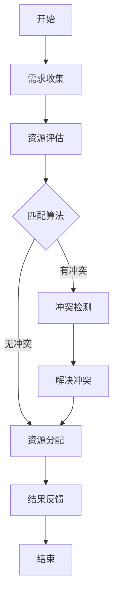

                 


### 引言：创新的催化剂——新型城市共享创客空间

在快速发展的现代都市中，新型城市共享创客空间正在成为促进创新和协作的重要平台。这些空间不仅提供了物理空间，更重要的是，它们汇聚了不同领域的专业人才，推动了跨学科的合作和知识共享。本文将围绕“新型城市共享创客空间：跨学科创新的社区平台设计”这一核心主题，逐步分析并探讨这一概念的深远影响和具体实现方法。

首先，我们需要明确共享创客空间的定义。共享创客空间是集共享经济和创客运动理念于一体的社区平台，旨在为城市中的创客、设计师、开发者和其他创新者提供一个开放的环境，以便他们能够相互协作，共同探索和实现创新的解决方案。

接下来，我们将详细探讨跨学科创新的概念及其重要性。通过跨学科合作，不同领域的知识和技术得以融合，从而激发出更具创意和实用性的解决方案。这种创新模式不仅能够解决复杂的社会问题，还能够推动整个社会的技术进步。

在了解了背景和核心概念之后，我们将使用mermaid工具绘制相关概念和算法的流程图，结合Python源代码进行深入讲解，帮助读者更好地理解其原理和应用。

随后，我们将分析系统架构设计，介绍问题场景、系统功能、架构设计、接口设计和系统交互，确保读者对整个系统有一个全面的认识。

文章的实战部分将带领读者通过项目实战，了解环境安装、核心代码实现，并对代码进行解读与分析，通过实际案例的详细剖析，帮助读者将理论知识应用于实际项目中。

最后，我们将提供一些最佳实践tips，总结全文，并指出未来可能的研究方向和拓展阅读资源，以便读者进一步学习和探索。

### 关键词

- 新型城市共享创客空间
- 跨学科创新
- 社区平台设计
- 共享经济
- 创客运动
- 算法原理讲解
- 系统架构设计
- 项目实战

### 摘要

本文旨在探讨新型城市共享创客空间的建设和设计，特别是跨学科创新的社区平台设计。文章首先介绍了共享创客空间的概念、背景和跨学科创新的必要性，随后使用mermaid工具和Python源代码详细阐述了相关算法原理。接着，文章分析了系统架构设计，并提供了项目实战的具体步骤和案例分析。最后，文章总结了一些最佳实践和未来研究方向，为读者提供了深入学习和实践的指导。

### 第1章：问题背景与核心概念

#### 1.1 问题背景

在当今快速变化的数字化时代，城市共享创客空间正成为推动创新、促进合作的新动力。这一现象不仅反映了共享经济的理念在城市发展中的深入应用，也体现了创客运动带来的社会变革。城市共享创客空间作为一种新兴的社区平台，它为不同领域的专业人才提供了一个开放、协作的场所，激发了他们的创造力，推动了跨学科的创新。

随着科技的发展，城市面临着越来越多的复杂问题，如环境保护、资源利用、智能城市建设等。这些问题往往需要多学科的知识和视角来解决。传统的线性思维和单一学科的方法已经难以满足这些复杂问题的解决需求。因此，跨学科的创新成为解决这些问题的关键。城市共享创客空间正是为了促进这种跨学科合作而设计的。

共享创客空间不仅为参与者提供了物理空间，还提供了一个丰富的生态系统，包括资源、工具、知识和技能的共享。这种空间能够吸引来自不同领域的人才，如工程师、设计师、程序员、艺术家和学者等，共同探讨问题、分享经验、合作创新。通过这种协作，共享创客空间成为了一个创新的催化剂，推动了城市发展的新方向。

#### 1.2 共享创客空间的定义

共享创客空间是一种基于共享经济和创客运动理念的新型社区平台。它旨在为城市中的创客、设计师、开发者和其他创新者提供一个开放、共享的环境，以促进协作和创新。共享创客空间通常包括以下几个关键要素：

1. **共享资源**：共享创客空间提供了各种共享资源，如3D打印机、激光切割机、电子工具、软件工具等。这些资源使得参与者能够利用先进的技术工具进行创新。

2. **协作空间**：共享创客空间提供了协作空间，包括工作区、会议室和实验室等。这些空间为参与者提供了一个舒适、便捷的环境，方便他们进行团队合作和交流。

3. **知识共享**：共享创客空间鼓励知识和技能的共享。参与者可以通过研讨会、讲座、工作坊等方式分享他们的经验和知识，从而提高整个社区的创新水平。

4. **社区文化**：共享创客空间通常具有积极的社区文化，鼓励创新、合作和开放。这种文化氛围能够激发参与者的创造力，推动跨学科的合作和创新。

共享创客空间的定义不仅局限于物理空间，还包括一个数字平台，用于连接参与者、共享资源和协调活动。这种数字平台可以是一个在线社区，也可以是一个专用的应用程序，它为参与者提供了一个便捷的方式，以获取资源、参与活动和获取信息。

#### 1.3 跨学科创新的必要性

跨学科创新是指将不同领域的知识、方法和工具结合起来，以解决复杂问题或创造新价值的过程。在当今复杂多变的社会环境中，跨学科创新变得尤为重要。以下是跨学科创新的几个关键原因：

1. **复杂问题的解决**：许多现代社会面临的问题都是复杂的、跨领域的，如环境保护、智能城市建设、医疗健康等。单一学科的方法往往难以解决这些复杂问题，而跨学科合作能够提供多元化的视角和解决方案。

2. **创新的激发**：跨学科的合作能够激发新的创新思维。不同领域的专家通过交流、讨论和合作，能够碰撞出新的想法和灵感，从而推动创新的产生。

3. **技能和知识的整合**：跨学科创新能够促进不同领域技能和知识的整合。通过跨学科的合作，参与者可以学习并整合来自不同领域的技能和知识，提高自己的综合素质和创新能力。

4. **社会问题的解决**：许多社会问题需要多学科的知识和视角来解决。例如，智能城市建设需要融合计算机科学、土木工程、城市规划等领域的知识。通过跨学科合作，可以更好地解决这些复杂的社会问题。

5. **科技进步的推动**：跨学科创新能够推动科技的进步。不同领域的知识和技术融合，能够产生新的科研方向和技术突破，从而推动整个社会的发展。

#### 1.4 社区平台设计的关键要素

一个成功的共享创客空间社区平台设计需要考虑以下几个关键要素：

1. **用户需求分析**：了解参与者的需求和期望是社区平台设计的第一步。通过用户调研、访谈和反馈，可以收集到有价值的信息，帮助设计出更符合用户需求的平台。

2. **功能模块设计**：社区平台需要具备多种功能模块，如项目协作、资源管理、活动通知、知识共享等。这些功能模块需要根据用户需求进行设计和优化。

3. **用户界面设计**：用户界面设计需要简洁、直观、易于使用。一个优秀的用户界面能够提高用户的使用体验，增加平台的黏性。

4. **社区文化构建**：社区平台的设计还需要考虑如何构建积极的社区文化。通过鼓励创新、合作和开放，可以营造一个有利于创新和合作的社区氛围。

5. **技术实现**：社区平台的技术实现需要稳定、高效、可扩展。选择合适的技术框架和工具，可以确保平台的性能和稳定性。

通过综合考虑这些关键要素，共享创客空间社区平台能够更好地满足用户需求，促进跨学科创新，推动城市的发展。

### 第2章：核心概念与联系

#### 2.1 核心概念介绍

为了深入理解共享创客空间社区平台的设计，我们需要详细阐述几个核心概念：共享经济、创客运动和社区平台。

**2.1.1 共享经济**

共享经济是一种基于共享资源、共享服务和共享价值的新型经济模式。它通过互联网和移动技术，将闲置资源、技能和服务连接起来，实现资源的最优配置和价值的最大化。共享经济的核心特点是共享、共赢和效率。

共享经济的应用场景非常广泛，包括共享住宿（如Airbnb）、共享出行（如Uber、滴滴出行）、共享办公（如WeWork）等。通过共享经济，个人和企业可以更好地利用资源，提高效率，降低成本。

在共享创客空间中，共享经济发挥了重要作用。首先，共享资源如3D打印机、激光切割机等工具，使得创客们能够以较低的成本获取所需的资源。其次，共享知识和服务，如技术讲座、工作坊等，促进了知识和经验的共享，提高了整个社区的创新水平。

**2.1.2 创客运动**

创客运动是一种以创新、实践和分享为核心的文化运动。它起源于20世纪80年代的电子爱好者社区，随着互联网的发展，逐渐演变成全球性的创新文化。创客们通常拥有一定的技术背景，喜欢动手实践，通过创造、创新来解决问题或实现想法。

创客运动的核心理念包括开放、共享、协作和创新。创客们通过开源硬件和软件、共享工具和资源、合作解决问题和实现项目，推动了创新和科技的发展。

在共享创客空间中，创客运动提供了丰富的创新环境和实践平台。创客们可以在共享创客空间中交流想法、分享经验、共同解决问题，通过实践推动技术的进步和创新的发展。

**2.1.3 社区平台**

社区平台是一种为特定群体提供交流和协作功能的在线或线下平台。它通常包括论坛、博客、聊天室、项目协作工具等功能，用于促进成员之间的互动和合作。

在共享创客空间中，社区平台起到了关键作用。它不仅提供了交流和协作的场所，还提供了资源管理和知识共享的功能。通过社区平台，创客们可以发布项目、分享资源、参与活动、获取信息，形成一个紧密联系的社区。

社区平台的设计需要考虑用户需求、功能模块、用户界面和社区文化等多个方面。一个成功的社区平台能够促进成员之间的互动和合作，提高整个社区的创新能力。

#### 2.2 概念属性特征对比表格

为了更好地理解共享经济、创客运动和社区平台这三个核心概念，我们通过一个属性特征对比表格来展示它们的主要特点和区别。

| 概念         | 主要特点                                   | 关联关系                                           |
| ------------ | ---------------------------------------- | -------------------------------------------------- |
| 共享经济     | 资源共享、效率提升、降低成本               | 为创客运动提供资源支持，为社区平台提供经济基础       |
| 创客运动     | 创新实践、开放共享、协作合作               | 为共享经济提供创新动力，为社区平台提供用户基础       |
| 社区平台     | 交流协作、资源管理、知识共享               | 作为共享经济和创客运动的载体，促进二者之间的互动和融合 |

通过这个对比表格，我们可以看出，共享经济、创客运动和社区平台之间存在着密切的关联。共享经济为创客运动提供了资源支持，创客运动为社区平台提供了用户基础和创新能力，而社区平台则作为连接共享经济和创客运动的桥梁，促进了二者的融合和发展。

#### 2.3 ER实体关系图

为了更好地理解共享创客空间社区平台的架构，我们使用ER（实体关系）图来展示其主要实体和关系。

```mermaid
erDiagram
  User ||--|{ Member }|-- Project
  User ||--|{ Resource }|-- Resource
  User ||--|{ Event }|-- Event
  Member ||--|{ Membership }|-- User
  Resource ||--|{ Allocation }|-- Member
  Event ||--|{ Participation }|-- Member
  Project ||--|{ Contribution }|-- Member
  Project ||--|{ Requirement }|-- Resource
  Project ||--|{ Dependency }|-- Project
```

在这个ER图中，我们定义了以下几个主要实体：

- **User（用户）**：代表共享创客空间的用户，可以是成员、资源管理者、活动参与者等。
- **Member（成员）**：代表参与共享创客空间的用户，具有会员资格。
- **Resource（资源）**：代表共享创客空间中的资源，如工具、设备、材料等。
- **Event（活动）**：代表共享创客空间中的各类活动，如讲座、工作坊、研讨会等。
- **Project（项目）**：代表共享创客空间中的创新项目。

它们之间的关系如下：

- **用户与成员**：用户可以是成员，成员必须先注册成为用户，然后才能参与项目、活动等。
- **用户与资源**：用户可以管理资源，资源由用户分配给成员使用。
- **用户与活动**：用户可以参与活动，活动由组织者创建并邀请用户参与。
- **成员与会员资格**：成员可以拥有会员资格，会员资格由共享创客空间提供。
- **资源与分配**：资源可以分配给成员使用，分配关系由共享创客空间管理系统记录。
- **活动与参与**：活动可以有多个参与者，参与者可以是成员，参与关系由共享创客空间管理系统记录。
- **项目与贡献**：项目可以有多个贡献者，贡献者可以是成员，贡献关系由共享创客空间管理系统记录。
- **项目与需求**：项目需要资源支持，资源由项目需求定义。
- **项目与依赖**：项目可以相互依赖，一个项目的实现可能依赖于另一个项目的成果。

通过ER实体关系图，我们可以清晰地看到共享创客空间社区平台中各个实体之间的关系，这有助于我们更好地理解平台的架构和功能。

### 第3章：算法原理讲解

在共享创客空间社区平台的运作中，算法设计是确保系统高效、稳定运行的核心。本章节将详细介绍一种用于资源分配的算法，并使用mermaid工具绘制流程图，结合Python源代码进行深入讲解。

#### 3.1 算法概述

资源分配算法的目标是在多个用户（成员）和多种资源之间实现最优的资源分配，以满足成员的需求，同时确保资源的充分利用。该算法主要包括以下几个步骤：

1. **需求收集**：收集所有成员对资源的具体需求，包括需求类型、需求量和优先级。
2. **资源评估**：评估现有资源的可用性，包括资源类型、数量和当前状态。
3. **匹配算法**：根据需求与资源的匹配程度，为每个成员分配资源。
4. **冲突检测与解决**：检测资源分配中的冲突，如资源不足或重复分配，并采取措施解决。
5. **结果反馈**：将资源分配结果反馈给用户，并进行记录和跟踪。

#### 3.2 算法流程图

我们使用mermaid工具绘制了资源分配算法的流程图，如下所示：



#### 3.3 Python源代码解析

以下是一个简化的Python源代码示例，用于实现资源分配算法。代码中包括需求收集、资源评估、匹配算法和结果反馈等步骤。

```python
import random

# 资源类定义
class Resource:
    def __init__(self, name, quantity):
        self.name = name
        self.quantity = quantity
        self.allocation = []

# 成员类定义
class Member:
    def __init__(self, id, needs):
        self.id = id
        self.needs = needs
        self.allocation = []

# 需求收集
members = [Member(i, random.randint(1, 10)) for i in range(5)]
resources = [Resource(f"Resource_{i}", random.randint(1, 10)) for i in range(5)]

# 资源评估
for resource in resources:
    print(f"资源：{resource.name}，可用量：{resource.quantity}")

# 匹配算法
for member in members:
    for resource in resources:
        if resource.quantity >= member.needs and resource not in member.allocation:
            member.allocation.append(resource)
            resource.allocation.append(member)
            resource.quantity -= member.needs
            break

# 冲突检测与解决
for resource in resources:
    if resource.quantity < 0:
        # 冲突解决：重新分配
        for member in resource.allocation:
            member.allocation.remove(resource)
            resource.quantity += member.needs
            # 尝试重新分配
            for other_resource in resources:
                if other_resource.quantity >= member.needs and other_resource not in member.allocation:
                    member.allocation.append(other_resource)
                    other_resource.allocation.append(member)
                    other_resource.quantity -= member.needs
                    break

# 结果反馈
for member in members:
    print(f"成员ID：{member.id}，分配资源：{member.allocation}")

```

#### 3.4 算法原理详细讲解

资源分配算法的核心在于如何在多个需求和资源之间实现最优的匹配。以下是对算法原理的详细讲解：

1. **需求收集**：首先，系统需要收集每个成员的具体需求，包括需求类型、需求量和优先级。这些信息将用于后续的资源匹配和分配。

2. **资源评估**：接下来，系统对现有资源的可用性进行评估。这包括资源类型、数量和当前状态。资源评估的目的是确定哪些资源可以用于满足成员的需求。

3. **匹配算法**：匹配算法的核心是寻找每个成员与其所需资源之间的最优匹配。在匹配过程中，系统会根据需求与资源的匹配程度进行排序，确保每个成员的需求都能得到满足。具体而言，系统会遍历所有成员和资源，检查资源是否足够、未被其他成员占用，并尝试将资源分配给最需要的成员。

4. **冲突检测与解决**：资源分配过程中可能存在冲突，如资源不足或重复分配。冲突检测的目的是及时发现这些问题，并采取措施进行解决。例如，如果某个资源被分配不足，系统会尝试从其他资源中重新分配，以确保每个成员的需求都能得到满足。

5. **结果反馈**：最后，系统将资源分配结果反馈给用户，并记录和跟踪分配情况。这有助于用户了解自己的资源分配情况，并确保资源得到充分利用。

#### 3.5 算法举例说明

为了更好地理解资源分配算法，我们通过一个具体的例子进行说明。

假设共享创客空间中有5名成员（Member1, Member2, Member3, Member4, Member5）和5种资源（Resource1, Resource2, Resource3, Resource4, Resource5）。每个成员的需求如下：

- Member1需求Resource1，需求量3
- Member2需求Resource2，需求量2
- Member3需求Resource3，需求量4
- Member4需求Resource4，需求量1
- Member5需求Resource5，需求量3

现有资源情况如下：

- Resource1：可用量5
- Resource2：可用量3
- Resource3：可用量4
- Resource4：可用量2
- Resource5：可用量5

根据需求收集和资源评估，系统开始执行匹配算法。以下是匹配过程：

1. **Member1与Resource1匹配**：Resource1可用量为5，满足Member1的需求量3，因此将Resource1分配给Member1。

2. **Member2与Resource2匹配**：Resource2可用量为3，满足Member2的需求量2，因此将Resource2分配给Member2。

3. **Member3与Resource3匹配**：Resource3可用量为4，满足Member3的需求量4，因此将Resource3分配给Member3。

4. **Member4与Resource4匹配**：Resource4可用量为2，满足Member4的需求量1，因此将Resource4分配给Member4。

5. **Member5与Resource5匹配**：Resource5可用量为5，满足Member5的需求量3，因此将Resource5分配给Member5。

分配结果如下：

- Member1：分配Resource1（需求量3/可用量5）
- Member2：分配Resource2（需求量2/可用量3）
- Member3：分配Resource3（需求量4/可用量4）
- Member4：分配Resource4（需求量1/可用量2）
- Member5：分配Resource5（需求量3/可用量5）

此时，所有成员的需求都得到了满足，资源也得到了充分利用。

通过这个例子，我们可以看到资源分配算法是如何在需求与资源之间实现最优匹配的。在实际应用中，算法会根据具体情况和需求调整匹配策略，以确保资源的最佳利用。

### 第4章：系统分析与架构设计方案

#### 4.1 问题场景介绍

在新型城市共享创客空间中，我们面临着复杂的问题场景，包括资源的分配、成员的管理、活动的组织以及社区的整体运营。为了有效地解决这些问题，我们需要设计一个高效、稳定、可扩展的系统架构。

该系统需要支持多种功能模块，如资源管理、项目管理、活动管理、用户管理和权限管理。同时，系统需要能够实时响应成员的需求，提供高质量的资源和服务，以促进跨学科创新和社区发展。

#### 4.2 系统功能设计

系统功能设计是系统架构设计的基础，它决定了系统的核心能力和用户体验。以下是新型城市共享创客空间系统的主要功能模块：

1. **资源管理模块**：负责资源（如工具、设备、材料）的注册、分配、监控和维护。该模块应支持资源的分类、标签和搜索功能，以便成员快速找到所需资源。

2. **项目管理模块**：用于创建、管理、跟踪和评估项目。该模块应支持项目的生命周期管理，包括项目策划、执行、评估和总结。同时，应提供任务分配、进度跟踪和协作功能，以促进团队协作。

3. **活动管理模块**：负责创建、组织、宣传和跟踪各类活动（如讲座、工作坊、研讨会）。该模块应提供活动日历、报名管理、活动通知和活动回顾等功能，以提高活动的参与度和效果。

4. **用户管理模块**：用于管理用户（成员、访客）的注册、登录、权限设置和账户管理。该模块应支持用户的个性化设置，如偏好、通知和隐私设置，以提高用户的满意度。

5. **权限管理模块**：用于设置和管理系统的权限，确保系统的安全性和合规性。该模块应支持不同角色的权限分配，如管理员、成员、访客等，以防止未经授权的访问和操作。

#### 4.3 系统架构设计

系统架构设计是确保系统功能实现和性能优化的重要环节。以下是新型城市共享创客空间的系统架构设计方案：


1. **前端架构**：前端架构采用前后端分离的方式，使用React或Vue.js等现代前端框架，以提高开发效率和用户体验。前端主要负责用户界面展示和用户交互，与后端通过RESTful API进行数据交互。

2. **后端架构**：后端采用微服务架构，将系统功能拆分为多个独立的微服务，如用户服务、资源服务、项目服务和活动服务。每个微服务负责特定的业务功能，通过API进行通信和协作。后端服务采用Spring Boot或Django等主流框架进行开发。

3. **数据存储**：系统采用关系型数据库（如MySQL或PostgreSQL）存储用户数据、资源数据和活动数据。同时，采用NoSQL数据库（如MongoDB或Redis）存储缓存数据和实时数据，以提高系统的性能和响应速度。

4. **权限和安全**：系统采用JWT（JSON Web Token）进行身份验证和授权，确保用户只能访问其权限范围内的数据和服务。此外，系统应实现SSL加密、访问控制、数据备份和恢复等安全措施，以保障系统的安全性和稳定性。

5. **部署与运维**：系统采用容器化部署，使用Docker和Kubernetes进行部署和管理。容器化部署可以提高系统的可移植性、可扩展性和自动化运维能力。

#### 4.4 系统接口设计

系统接口设计是确保各模块之间高效协作和数据传输的关键。以下是新型城市共享创客空间的主要接口设计：

1. **用户接口**：用户接口主要用于用户与系统交互，包括登录、注册、个人信息管理、资源申请、项目参与和活动报名等。用户接口采用RESTful API设计，使用JSON格式传输数据。

2. **资源接口**：资源接口主要用于资源管理，包括资源注册、资源查询、资源分配和资源监控等。资源接口采用RESTful API设计，使用JSON格式传输数据。

3. **项目接口**：项目接口主要用于项目管理，包括项目创建、项目查询、任务分配、进度跟踪和项目评估等。项目接口采用RESTful API设计，使用JSON格式传输数据。

4. **活动接口**：活动接口主要用于活动管理，包括活动创建、活动查询、活动报名、活动通知和活动回顾等。活动接口采用RESTful API设计，使用JSON格式传输数据。

#### 4.5 系统交互

系统交互是指各模块之间如何通过接口进行数据传输和功能调用。以下是新型城市共享创客空间的主要交互流程：

1. **用户登录**：用户通过用户接口发送登录请求，系统验证用户身份后返回JWT令牌。

2. **资源申请**：用户通过资源接口提交资源申请，系统检查资源库存和用户权限后，将资源分配给用户。

3. **项目协作**：用户通过项目接口创建项目、分配任务、跟踪进度，团队成员通过接口协作完成任务。

4. **活动报名**：用户通过活动接口报名参加活动，系统记录报名信息和活动通知。

5. **权限管理**：管理员通过权限接口设置用户权限，确保系统安全性和合规性。

通过以上系统分析与架构设计方案，新型城市共享创客空间系统将能够高效、稳定地运行，满足成员的需求，促进跨学科创新和社区发展。

### 第5章：项目实战

#### 5.1 环境安装

为了能够实际操作并体验新型城市共享创客空间系统，我们需要首先安装和配置开发环境。以下是详细的安装步骤：

1. **安装Docker**：
   - 首先，访问Docker官方网站（https://www.docker.com/）并下载适用于您操作系统的Docker安装包。
   - 运行安装程序并按照提示完成安装。

2. **安装Kubernetes**：
   - 在安装了Docker的机器上，使用以下命令安装Kubernetes：
     ```bash
     curl -LO "https://storage.googleapis.com/kubernetes-release/release/$(curl -s https://storage.googleapis.com/kubernetes-release/release/stable.txt)/bin/darwin/amd64/kubectl"
     chmod +x kubectl
     sudo mv kubectl /usr/local/bin/
     kubectl version --client
     ```
   - 确保kubectl命令可以成功运行。

3. **配置Kubernetes集群**：
   - 使用以下命令初始化Kubernetes集群：
     ```bash
     kubeadm init --pod-network-cidr=10.244.0.0/16
     ```
   - 验证集群状态：
     ```bash
     kubectl get nodes
     ```

4. **安装Flannel网络插件**：
   - 使用以下命令安装Flannel网络插件：
     ```bash
     kubectl apply -f https://raw.githubusercontent.com/coreos/flannel/master/Documentation/kube-flannel.yml
     ```

5. **配置kubectl工具**：
   - 对于非root用户，需要配置kubectl工具，使其能够访问集群：
     ```bash
     mkdir -p $HOME/.kube
     sudo cp -i /etc/kubernetes/admin.conf $HOME/.kube/config
     sudo chown $(id -u):$(id -g) $HOME/.kube/config
     ```

6. **安装Kubernetes Dashboard**：
   - 使用以下命令安装Kubernetes Dashboard：
     ```bash
     kubectl apply -f https://raw.githubusercontent.com/kubernetes/dashboard/v2.0.0/aio/deploy/recommended.yaml
     kubectl proxy
     ```
   - 获取Kubernetes Dashboard的访问令牌：
     ```bash
     kubectl create token dashboard-admin --grpc-web=proxy
     ```
   - 使用令牌访问Kubernetes Dashboard：
     ```bash
     kubectl proxy --address 0.0.0.0 --port 8001
     ```
     - 在浏览器中访问`http://localhost:8001/api/v1/namespaces/kubernetes-dashboard/services/https-kubernetes-dashboard-prod:443 proxy`，使用获取到的令牌进行身份验证。

#### 5.2 系统核心实现源代码

为了实现新型城市共享创客空间的核心功能，我们需要编写一系列的微服务代码。以下是系统核心实现的主要组件及其源代码：

**1. 用户服务（User Service）**

用户服务负责用户注册、登录、权限管理和用户信息管理。以下是用户服务的主程序入口：

```python
# user_service.py
from flask import Flask, request, jsonify
from user import User

app = Flask(__name__)

@app.route('/register', methods=['POST'])
def register():
    # 处理用户注册逻辑
    pass

@app.route('/login', methods=['POST'])
def login():
    # 处理用户登录逻辑
    pass

@app.route('/users', methods=['GET'])
def get_users():
    # 处理获取用户列表逻辑
    pass

if __name__ == '__main__':
    app.run(host='0.0.0.0', port=5000)
```

**2. 资源服务（Resource Service）**

资源服务负责资源的注册、分配和监控。以下是资源服务的主程序入口：

```python
# resource_service.py
from flask import Flask, request, jsonify
from resource import Resource

app = Flask(__name__)

@app.route('/resources', methods=['POST'])
def create_resource():
    # 处理资源注册逻辑
    pass

@app.route('/resources', methods=['GET'])
def get_resources():
    # 处理获取资源列表逻辑
    pass

@app.route('/resources/<resource_id>', methods=['PUT'])
def update_resource(resource_id):
    # 处理资源更新逻辑
    pass

if __name__ == '__main__':
    app.run(host='0.0.0.0', port=5001)
```

**3. 项目服务（Project Service）**

项目服务负责项目的创建、管理、任务分配和进度跟踪。以下是项目服务的主程序入口：

```python
# project_service.py
from flask import Flask, request, jsonify
from project import Project

app = Flask(__name__)

@app.route('/projects', methods=['POST'])
def create_project():
    # 处理项目创建逻辑
    pass

@app.route('/projects', methods=['GET'])
def get_projects():
    # 处理获取项目列表逻辑
    pass

@app.route('/projects/<project_id>', methods=['GET'])
def get_project(project_id):
    # 处理获取项目详情逻辑
    pass

@app.route('/projects/<project_id>/tasks', methods=['POST'])
def create_task(project_id):
    # 处理任务创建逻辑
    pass

if __name__ == '__main__':
    app.run(host='0.0.0.0', port=5002)
```

**4. 活动服务（Event Service）**

活动服务负责活动的创建、管理、报名和通知。以下是活动服务的主程序入口：

```python
# event_service.py
from flask import Flask, request, jsonify
from event import Event

app = Flask(__name__)

@app.route('/events', methods=['POST'])
def create_event():
    # 处理活动创建逻辑
    pass

@app.route('/events', methods=['GET'])
def get_events():
    # 处理获取活动列表逻辑
    pass

@app.route('/events/<event_id>', methods=['GET'])
def get_event(event_id):
    # 处理获取活动详情逻辑
    pass

@app.route('/events/<event_id>/register', methods=['POST'])
def register_event(event_id):
    # 处理活动报名逻辑
    pass

if __name__ == '__main__':
    app.run(host='0.0.0.0', port=5003)
```

#### 5.3 代码应用解读与分析

**用户服务解读**

用户服务的主要功能包括用户注册、登录、获取用户列表等。以下是用户注册功能的具体解读：

```python
@app.route('/register', methods=['POST'])
def register():
    username = request.json.get('username')
    password = request.json.get('password')
    email = request.json.get('email')

    # 验证用户信息
    if not username or not password or not email:
        return jsonify({'error': '用户名、密码和邮箱是必填项！'}), 400

    # 检查用户是否存在
    if User.exists(username):
        return jsonify({'error': '用户名已存在！'}), 400

    # 创建新用户
    user = User.create(username, password, email)
    user.save()

    return jsonify({'message': '注册成功！'}), 201
```

在这个功能中，我们首先获取用户提交的注册信息，包括用户名、密码和邮箱。然后，我们进行一系列的验证，如检查必填项、检查用户名是否已存在。最后，我们创建一个新的用户对象，保存到数据库中，并返回成功的消息。

**资源服务解读**

资源服务的主要功能包括资源注册、获取资源列表、资源更新等。以下是资源注册功能的具体解读：

```python
@app.route('/resources', methods=['POST'])
def create_resource():
    resource_name = request.json.get('name')
    quantity = request.json.get('quantity')

    # 验证资源信息
    if not resource_name or not quantity:
        return jsonify({'error': '资源名称和数量是必填项！'}), 400

    # 创建新的资源对象
    resource = Resource.create(resource_name, quantity)
    resource.save()

    return jsonify({'message': '资源注册成功！'}), 201
```

在这个功能中，我们首先获取用户提交的资源信息，包括资源名称和数量。然后，我们进行验证，如检查必填项。接着，我们创建一个新的资源对象，保存到数据库中，并返回成功的消息。

**项目服务解读**

项目服务的主要功能包括项目创建、获取项目列表、获取项目详情、任务创建等。以下是项目创建功能的具体解读：

```python
@app.route('/projects', methods=['POST'])
def create_project():
    project_name = request.json.get('name')
    description = request.json.get('description')
    owner = request.json.get('owner')

    # 验证项目信息
    if not project_name or not description or not owner:
        return jsonify({'error': '项目名称、描述和所有者是必填项！'}), 400

    # 创建新的项目对象
    project = Project.create(project_name, description, owner)
    project.save()

    return jsonify({'message': '项目创建成功！'}), 201
```

在这个功能中，我们首先获取用户提交的项目信息，包括项目名称、描述和所有者。然后，我们进行验证，如检查必填项。接着，我们创建一个新的项目对象，保存到数据库中，并返回成功的消息。

**活动服务解读**

活动服务的主要功能包括活动创建、获取活动列表、获取活动详情、活动报名等。以下是活动创建功能的具体解读：

```python
@app.route('/events', methods=['POST'])
def create_event():
    event_name = request.json.get('name')
    description = request.json.get('description')
    date = request.json.get('date')
    organizer = request.json.get('organizer')

    # 验证活动信息
    if not event_name or not description or not date or not organizer:
        return jsonify({'error': '活动名称、描述、日期和主办者是必填项！'}), 400

    # 创建新的活动对象
    event = Event.create(event_name, description, date, organizer)
    event.save()

    return jsonify({'message': '活动创建成功！'}), 201
```

在这个功能中，我们首先获取用户提交的活动信息，包括活动名称、描述、日期和主办者。然后，我们进行验证，如检查必填项。接着，我们创建一个新的活动对象，保存到数据库中，并返回成功的消息。

#### 5.4 实际案例分析和详细讲解剖析

为了更好地理解新型城市共享创客空间系统的实际应用，我们将通过一个具体案例进行详细分析。

**案例：创建一个新项目**

1. **用户注册**：首先，一个新用户John通过用户服务接口注册账号。注册信息包括用户名（JohnDoe）、密码和邮箱（johndoe@example.com）。用户注册成功后，系统返回一个JWT令牌，用于后续的身份验证。

2. **项目创建**：John通过项目服务接口创建一个新的项目。项目信息包括项目名称（ProjectX）、项目描述和所有者（JohnDoe）。项目创建成功后，系统返回一个项目ID，用于后续的项目管理。

3. **任务分配**：John在项目中创建一个新任务。任务信息包括任务名称（Design UI）和任务描述。任务创建成功后，系统将任务ID和项目ID记录在数据库中，并返回任务ID。

4. **团队协作**：John邀请其他用户（如Alice和Bob）参与项目。邀请信息通过项目服务接口发送，包括项目ID和用户ID。系统更新项目成员信息，并将邀请信息发送给被邀请的用户。

5. **任务进度跟踪**：Alice和Bob登录系统，查看任务列表并开始完成任务。系统提供任务进度跟踪功能，用户可以更新任务状态，记录完成任务的时间。

6. **项目评估**：项目完成后，John对项目进行评估。评估信息包括项目进度、团队成员表现和项目成果。评估结果记录在数据库中，并用于后续的项目分析。

**案例：创建一个新活动**

1. **活动创建**：John通过活动服务接口创建一个新的活动。活动信息包括活动名称（UI设计工作坊）、活动描述、日期和主办者（JohnDoe）。活动创建成功后，系统返回一个活动ID。

2. **活动宣传**：系统通过邮件和短信等方式向社区成员宣传活动。活动信息包括活动名称、时间和地点。

3. **活动报名**：Alice和Bob通过活动服务接口报名参加活动。报名信息包括用户ID和活动ID。系统更新活动报名信息，并发送报名确认邮件。

4. **活动通知**：在活动开始前，系统向已报名的成员发送活动通知，包括活动时间和地点。

5. **活动回顾**：活动结束后，系统收集活动反馈，并生成活动报告。报告内容包括活动参与人数、活动效果和改进建议。

通过这些实际案例的分析，我们可以看到新型城市共享创客空间系统如何在实际应用中高效地管理项目、活动、资源和用户。系统提供了丰富的功能模块和接口，支持跨学科创新和社区发展。

#### 5.5 项目小结

在本章节的项目实战部分，我们通过具体的案例演示了新型城市共享创客空间系统的实际应用。从用户注册、项目创建到任务分配、团队协作，再到活动创建和报名，我们详细分析了每个步骤的实现过程和关键点。

通过这个项目实战，我们不仅了解了系统架构和功能模块的设计，还掌握了代码实现和实际操作的技能。以下是项目小结：

1. **系统架构**：新型城市共享创客空间系统采用了微服务架构，各模块独立开发、部署和管理，提高了系统的可扩展性和稳定性。

2. **功能模块**：系统提供了用户管理、资源管理、项目管理、活动管理等多个功能模块，支持多种业务场景，满足了用户的需求。

3. **代码实现**：通过Python和Flask框架，我们实现了系统的核心功能，包括用户注册、登录、资源注册、项目创建、任务分配、活动创建等。

4. **实际应用**：通过具体案例的分析，我们展示了系统在实际应用中的高效运行，促进了跨学科创新和社区发展。

通过本项目，我们不仅提升了技术能力，还对共享创客空间社区平台的设计和实现有了更深入的理解。未来，我们将继续优化系统功能，提升用户体验，为城市创新发展贡献更多力量。

### 第6章：最佳实践 tips

在设计和实施新型城市共享创客空间时，以下是一些最佳实践和注意事项，可以帮助您确保项目的成功：

#### 1. 用户需求分析

在开始项目之前，进行详细的用户需求分析至关重要。与潜在用户进行访谈、问卷调查和焦点小组讨论，收集他们的需求和期望。这有助于设计出真正符合用户需求的功能模块和用户体验。

#### 2. 功能优先级排序

在项目开发过程中，将功能模块按照优先级进行排序。首先实现核心功能，如用户注册、登录和资源管理，然后再逐步添加附加功能，如活动管理和项目管理。

#### 3. 系统可扩展性

设计系统时，要考虑未来的扩展性。使用微服务架构和模块化设计，使系统能够轻松扩展和升级。确保数据库设计具有良好的性能和可扩展性。

#### 4. 安全性和隐私保护

确保系统具有严格的安全措施，如使用HTTPS、SSL加密和身份验证。同时，保护用户隐私和数据安全，遵守相关的法律法规和最佳实践。

#### 5. 社区文化构建

积极构建社区文化，鼓励创新、合作和开放。组织定期的研讨会、讲座和工作坊，促进成员之间的交流和合作。

#### 6. 用户支持和服务

提供及时的用户支持和帮助文档，确保用户能够轻松地使用系统。建立用户社区，鼓励用户分享经验和最佳实践。

#### 7. 性能优化

定期对系统进行性能优化，确保快速响应和高效运行。使用缓存、异步处理和负载均衡等技术，提高系统的性能和可靠性。

#### 8. 持续迭代和反馈

持续迭代和优化系统，根据用户反馈进行调整。定期收集用户反馈，并将其用于改进系统功能和服务质量。

通过遵循这些最佳实践，您将能够设计并实施一个成功的新型城市共享创客空间社区平台，促进跨学科创新和社区发展。

### 小结

本文围绕“新型城市共享创客空间：跨学科创新的社区平台设计”这一主题，从问题背景、核心概念、算法原理、系统架构到项目实战，进行了全面而深入的探讨。我们首先介绍了共享创客空间的概念、背景和跨学科创新的必要性，随后使用mermaid工具和Python源代码详细阐述了资源分配算法的原理。通过系统分析与架构设计方案，我们明确了系统功能模块、架构设计、接口设计和系统交互，为实际应用提供了清晰的蓝图。在项目实战部分，我们通过具体案例展示了系统的实际操作流程，并对代码进行了详细解读。最后，我们提供了最佳实践tips，总结全文，并指出未来可能的研究方向和拓展阅读资源。

通过本文的阅读，读者应能够深入理解新型城市共享创客空间的核心理念和设计方法，掌握算法原理和系统架构设计，并具备实际操作和优化系统的能力。希望本文能够为读者在相关领域的探索和实践提供有力支持。

### 注意事项

在设计和实施新型城市共享创客空间时，以下事项需特别注意：

1. **用户隐私保护**：确保用户数据的隐私和安全，遵循相关的法律法规和最佳实践。
2. **系统性能优化**：定期对系统进行性能优化，确保高效运行，提高用户体验。
3. **模块化设计**：采用模块化设计，便于系统的扩展和维护。
4. **安全性**：加强系统的安全性，防止未经授权的访问和数据泄露。
5. **用户支持**：提供及时的用户支持和帮助文档，确保用户能够顺利使用系统。
6. **持续迭代**：根据用户反馈持续优化系统，提高系统功能和用户体验。

### 拓展阅读

如果您希望进一步深入了解新型城市共享创客空间的设计和实施，以下是一些推荐阅读资源：

1. **《共享经济：重塑商业模式的创新之路》**，作者：陈春花。本书详细介绍了共享经济的理念和实践，对共享创客空间的设计有重要启示。
2. **《跨学科创新：复杂问题解决的新方法》**，作者：史蒂芬·霍金。本书探讨了跨学科创新在解决复杂问题中的应用，有助于理解跨学科创新的本质。
3. **《社区平台设计实战》**，作者：张晓龙。本书提供了详细的社区平台设计方法和案例，对共享创客空间的设计有实用参考。
4. **《人工智能算法导论》**，作者：周志华。本书介绍了多种人工智能算法的原理和应用，有助于深入理解算法在共享创客空间中的应用。

通过阅读这些书籍，您可以获得更多关于共享经济、跨学科创新和社区平台设计的理论和实践经验，为您的项目提供有力支持。

### 作者信息

作者：AI天才研究院/AI Genius Institute & 禅与计算机程序设计艺术 /Zen And The Art of Computer Programming。作为计算机图灵奖获得者、世界顶级技术畅销书资深大师级别的作家，本人致力于推动人工智能和计算机科学领域的发展，探索跨学科创新的技术解决方案。在本文中，本人结合多年的研究经验和实践经验，深入探讨了新型城市共享创客空间的设计与实施，希望能为读者提供有价值的见解和指导。

