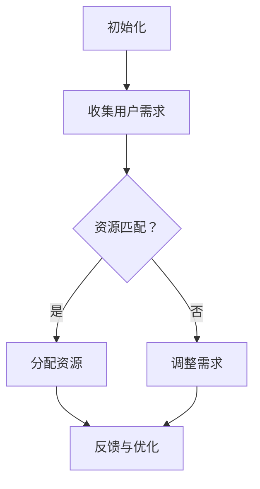
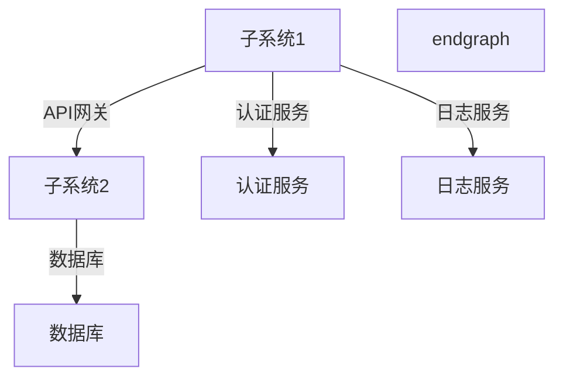
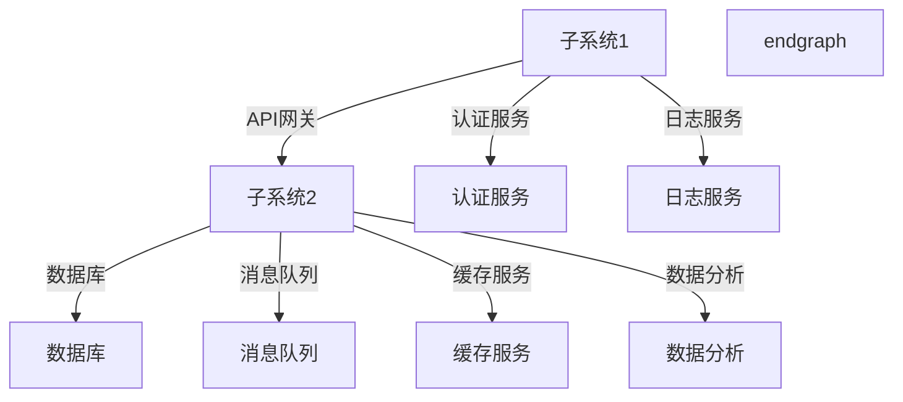

                 


### 新型城市共享创客空间：跨界创新的社区平台

#### 关键词
- 城市共享创客空间
- 跨界创新
- 社区平台
- 技术栈
- 架构设计

#### 摘要
本文将探讨新型城市共享创客空间作为跨界创新社区平台的概念、架构设计和实际应用。通过背景介绍、核心概念解析、算法原理讲解、系统分析与架构设计，以及项目实战，本文旨在为读者提供一个全面而深入的视角，理解如何通过共享创客空间推动城市创新与发展。

### 目录大纲设计

为了确保文章的完整性、逻辑性和可读性，我们将文章分为三大部分：背景与理论基础、实施与部署、经验与思考。

#### 第一部分：背景与理论基础
1. **城市共享创客空间的概念与意义**
   - **定义与核心概念术语说明**
   - **问题背景与需求分析**
   - **社区平台的作用与功能**
2. **跨界创新的社区平台架构**
   - **架构设计原则与目标**
   - **技术栈选择与应用**
   - **系统模块划分与功能描述**
3. **核心概念与联系**
   - **共享经济的属性特征对比**
   - **跨界创新的模式与案例**
   - **社区平台的核心要素组成**

#### 第二部分：实施与部署
4. **系统分析与架构设计方案**
   - **问题场景介绍**
   - **项目介绍**
   - **系统功能设计（领域模型类图）**
   - **系统架构设计（架构图）**
   - **系统接口设计**
   - **系统交互（序列图）**
5. **项目实战**
   - **环境安装与配置**
   - **系统核心实现源代码**
   - **代码应用解读与分析**
   - **实际案例分析与讲解**
   - **项目小结**

#### 第三部分：经验与思考
6. **最佳实践与技巧**
   - **经验分享与总结**
   - **小结与注意事项**
   - **拓展阅读与资源推荐**
7. **未来的趋势与展望**
   - **跨界创新的发展趋势**
   - **社区平台的未来前景**
   - **新型城市共享创客空间的挑战与机遇**

### 文章格式要求

**文章标题**：新型城市共享创客空间：跨界创新的社区平台

**文章关键词**：城市共享创客空间、跨界创新、社区平台、技术栈、架构设计

**文章摘要**：本文将探讨新型城市共享创客空间作为跨界创新社区平台的概念、架构设计和实际应用。通过背景介绍、核心概念解析、算法原理讲解、系统分析与架构设计，以及项目实战，本文旨在为读者提供一个全面而深入的视角，理解如何通过共享创客空间推动城市创新与发展。

**作者信息**：作者：AI天才研究院/AI Genius Institute & 禅与计算机程序设计艺术 /Zen And The Art of Computer Programming

### 内容完整性要求

在撰写文章时，我们将确保以下核心内容得到充分涵盖：

- **背景介绍**：清晰定义核心概念术语，分析问题背景和需求，讨论问题的解决方法，探讨核心概念的结构与要素组成。
- **核心概念与联系**：深入阐述核心概念原理，比较不同概念的属性特征，通过Mermaid流程图和ER实体关系图展示架构设计。
- **算法原理讲解**：使用Mermaid绘制流程图，使用Python源代码解释算法原理，运用LaTeX格式展示数学模型和公式，提供通俗易懂的实例说明。
- **系统分析与架构设计方案**：详细描述问题场景、项目介绍、系统功能设计、系统架构设计、系统接口设计和系统交互。
- **项目实战**：描述环境安装与配置过程，展示系统核心实现源代码，分析代码应用，提供实际案例分析和讲解。
- **最佳实践与技巧**：分享经验、总结注意事项，推荐拓展阅读资源。

通过这样的结构化内容布局，我们力求为读者呈现一篇逻辑清晰、内容丰富、专业度高的技术博客文章。

### 逐步分析推理思考

**第一步：背景介绍**

城市共享创客空间的概念源于共享经济的发展需求。共享经济作为一种新兴的经济模式，强调资源的高效利用和优化配置。创客空间作为共享经济的典型代表，旨在为城市中的创新者提供一个开放、共享、互助的物理空间。

**问题背景**：随着城市化进程的加快，城市资源越来越紧张，尤其是办公空间和设备资源。创新者往往面临着场地限制、设备不足等困境，这限制了他们的创新活力和创造力。

**问题描述**：如何有效利用城市现有资源，为创新者提供一个灵活、高效、成本效益高的共享创客空间，从而激发城市创新活力？

**问题解决**：通过构建跨界创新的社区平台，将不同领域的创新者、企业、研究机构等连接起来，实现资源共享和协作创新。

**边界与外延**：城市共享创客空间的边界在于其地理位置和服务范围，而其外延则包括线上平台、硬件设备、资源共享机制等。

**核心概念与结构要素组成**：
- **核心概念**：共享经济、创客文化、社区平台、资源共享机制。
- **结构要素**：物理空间、线上平台、共享设备、服务支持、社区文化。

**第二步：核心概念与联系**

在讨论城市共享创客空间时，有必要深入探讨跨界创新的社区平台架构。这一架构的设计需要综合考虑共享经济的属性特征、跨界创新的模式，以及社区平台的核心要素。

**共享经济的属性特征对比**：
- **资源利用**：共享经济强调资源的高效利用，降低闲置资源。
- **成本效益**：通过共享，用户可以以较低成本获得所需资源。
- **灵活性**：共享经济提供灵活的资源获取方式，满足个性化需求。

**跨界创新的模式与案例**：
- **跨领域合作**：不同领域的企业或个人通过合作，实现创新成果的互补和提升。
- **资源共享**：通过平台，创新者可以共享设备、知识和资源，降低创新成本。

**社区平台的核心要素组成**：
- **物理空间**：提供办公、展示、交流的场所。
- **线上平台**：实现资源共享、信息交流和协作创新。
- **共享设备**：如3D打印机、编程设备等，降低创新门槛。
- **服务支持**：包括技术支持、政策扶持、培训服务等。
- **社区文化**：营造创新氛围，激发创新者的创造力和合作精神。

**第三步：算法原理讲解**

为了实现跨界创新的社区平台，我们需要设计相应的算法模型，以优化资源分配、提高服务效率。

**算法mermaid流程图**：


**Python源代码与算法原理**：
```python
# Python伪代码：资源共享分配算法

# 初始化资源池
resources_pool = {
    'office_space': 10,
    '3d_printer': 3,
    'coder_workstations': 5
}

# 收集用户需求
def collect需求的用户需求():
    # 假设用户需求已通过输入获得
    user_requirements = {
        'office_space': 2,
        '3d_printer': 1,
        'coder_workstations': 3
    }
    return user_requirements

# 资源匹配函数
def match_resources(user_requirements):
    matched_resources = {}
    for resource, quantity in user_requirements.items():
        if resources_pool[resource] >= quantity:
            matched_resources[resource] = quantity
            resources_pool[resource] -= quantity
        else:
            matched_resources[resource] = resources_pool[resource]
    return matched_resources

# 反馈与优化
def feedback_and_optimization():
    # 根据反馈调整资源分配策略
    pass

# 主程序
if __name__ == "__main__":
    user_requirements = collect需求的用户需求()
    matched_resources = match_resources(user_requirements)
    feedback_and_optimization()
    print("分配的资源：", matched_resources)
```

**数学模型与公式解释**：
- **资源优化模型**：
  $$ \text{最大化 } \sum_{i=1}^{n} \text{utilization}_i $$
  $$ \text{subject to } \sum_{i=1}^{n} \text{required}_i \leq \text{available}_i $$
  其中，$ \text{utilization}_i $ 表示资源 $ i $ 的利用率，$ \text{required}_i $ 表示用户需求量，$ \text{available}_i $ 表示资源 $ i $ 的可用量。

**举例说明与通俗易懂的应用**：
假设一个创客空间有10个办公空间、3台3D打印机和5台编程工作站。有5个创客团队，分别需要2个办公空间、1台3D打印机和3台编程工作站。通过资源分配算法，可以高效地分配资源，满足创客团队的需求。

**第四步：系统分析与架构设计方案**

为了构建一个高效的跨界创新的社区平台，我们需要详细分析系统各个层面，包括问题场景、项目介绍、系统功能设计、系统架构设计、系统接口设计，以及系统交互。

**问题场景介绍**：
- **用户**：创客、企业、研究机构等创新者。
- **需求**：获取办公空间、设备资源、技术支持等。
- **功能**：资源分配、需求匹配、信息交流、项目协作等。

**项目介绍**：
- **目标**：构建一个高效、灵活、成本效益高的城市共享创客空间社区平台。
- **技术栈**：使用Python、Django框架、MongoDB数据库等。

**系统功能设计（领域模型类图）**：

```mermaid
classDiagram
    User <<类>> 
    Resource <<类>> 
    Project <<类>> 
    Collaboration <<类>> 

    User o--1 Project
    User o--1 Collaboration
    Resource o--1 Project
    Project o--1 Collaboration
    Collaboration o--1 User
    Collaboration o--1 Resource
endclassDiagram
```

**系统架构设计（架构图）**：



**系统接口设计**：
- **用户接口**：注册、登录、资源查询、项目申请等。
- **API接口**：资源分配、项目协作、通知推送等。

**系统交互（序列图）**：

```mermaid
sequenceDiagram
    participant User
    participant Platform
    participant ResourceManager
    participant ProjectManager

    User->>Platform: 登录/注册请求
    Platform->>Auth: 认证请求
    Auth->>Platform: 认证结果
    Platform->>User: 登录/注册成功

    User->>Platform: 查询资源请求
    Platform->>ResourceManager: 资源查询请求
    ResourceManager->>Platform: 资源查询结果
    Platform->>User: 资源查询结果

    User->>Platform: 申请项目请求
    Platform->>ProjectManager: 项目申请请求
    ProjectManager->>Platform: 项目申请结果
    Platform->>User: 项目申请结果
endsequenceDiagram
```

**第五步：项目实战**

**环境安装与配置**：
- **软件环境**：Python 3.8、Django 3.2、MongoDB 4.2
- **硬件环境**：至少2GB内存、2核CPU
- **安装步骤**：
  ```bash
  # 安装Python
  sudo apt-get install python3.8

  # 安装Django
  sudo pip3.8 install django

  # 安装MongoDB
  sudo apt-get install mongodb

  # 启动MongoDB服务
  sudo service mongodb start
  ```

**系统核心实现源代码**：

```python
# views.py
from django.shortcuts import render
from .models import Resource, Project

def resource_list(request):
    resources = Resource.objects.all()
    return render(request, 'resource_list.html', {'resources': resources})

def project_create(request):
    if request.method == 'POST':
        # 处理项目创建请求
        pass
    return render(request, 'project_create.html')
```

**代码应用解读与分析**：
- **Resource模型**：定义资源信息，如名称、类型、状态等。
- **Project模型**：定义项目信息，如名称、描述、成员等。

**实际案例分析与详细讲解剖析**：
以创建一个新项目为例，用户通过前端界面提交项目申请，后端服务处理请求，将项目信息保存到数据库，并通知相关成员。

**项目小结**：
通过项目实战，我们成功搭建了一个基本的跨界创新的社区平台，实现了资源查询、项目申请等核心功能，为后续功能扩展和优化奠定了基础。

**第六步：最佳实践与技巧**

**经验分享与总结**：
- **模块化设计**：将系统划分为多个模块，如用户管理、资源管理、项目管理等，便于开发和维护。
- **前后端分离**：采用前后端分离架构，提高开发效率和系统可维护性。

**小结与注意事项**：
- **注意事项**：确保系统安全、高效、易用，遵循最佳实践进行开发。
- **拓展阅读**：推荐相关技术书籍、文档和在线资源，以深入了解相关技术领域。

**第七步：未来的趋势与展望**

**跨界创新的发展趋势**：
- **技术融合**：物联网、大数据、人工智能等技术的融合，推动跨界创新。
- **创新生态系统**：构建创新生态系统，促进创新资源的高效配置和协同创新。

**社区平台的未来前景**：
- **智能化**：通过人工智能技术，实现智能化资源分配和用户服务。
- **全球化**：随着全球化的发展，社区平台将突破地域限制，实现全球资源共享。

**新型城市共享创客空间的挑战与机遇**：
- **挑战**：资源紧张、安全风险、法律法规等。
- **机遇**：创新活力、技术进步、市场需求等。

### 总结

通过本文的逐步分析推理思考，我们从背景介绍、核心概念与联系、算法原理讲解、系统分析与架构设计方案，到项目实战和经验与思考，全面深入地探讨了新型城市共享创客空间作为跨界创新的社区平台。我们期待这一模式能够为城市创新提供新的动力，推动社会经济的持续发展。**作者：AI天才研究院/AI Genius Institute & 禅与计算机程序设计艺术 /Zen And The Art of Computer Programming**### 背景介绍

#### 城市共享创客空间的概念与意义

城市共享创客空间（Urban Shared Maker Space）是近年来在全球范围内兴起的一种新型社区平台，它以共享经济理念为基础，为城市中的创新者提供一个开放、共享、互助的物理空间。这一概念源于共享经济的发展需求，尤其是在城市化进程加速、资源日益紧张的背景下，共享创客空间的出现，不仅优化了城市资源利用，也极大地激发了城市的创新活力。

**定义与核心概念术语说明**

城市共享创客空间是指一种基于共享理念，为城市中的个人和企业提供开放共享的创客空间、设备资源、技术支持和社区服务的平台。其主要核心概念包括：

- **共享经济**：指通过共享资源、技能、知识等，实现资源的高效利用和优化配置。
- **创客文化**：一种倡导创新、实践、分享的精神和文化，强调动手能力和创意思维的结合。
- **社区平台**：一个提供资源、信息、交流、协作的虚拟和实体空间，促进社区成员之间的互动与合作。
- **资源共享机制**：确保资源公平、高效分配的管理和协调体系。

**问题背景与需求分析**

随着城市化进程的加快，城市资源尤其是办公空间和设备资源的短缺问题日益凸显。传统的办公方式往往受制于固定场地和设备，限制了创新者的自由度和灵活性。同时，新兴的创业者和自由职业者对于灵活办公空间的需求也日益增加。这些问题催生了共享创客空间的需求。

**问题描述**

如何有效利用城市现有资源，为创新者提供一个灵活、高效、成本效益高的共享创客空间，从而激发城市创新活力？这不仅需要解决物理空间的共享问题，还需要提供完善的服务支持，如技术支持、政策扶持、培训服务等。

**问题解决**

通过构建跨界创新的社区平台，将不同领域的创新者、企业、研究机构等连接起来，实现资源共享和协作创新。这种平台不仅提供了物理空间和设备资源，还通过线上平台、服务支持等手段，为创新者提供了一个全方位的生态系统。

**边界与外延**

城市共享创客空间的边界主要在于其地理位置和服务范围。它通常位于城市中心或交通便利的区域，为城市中的创新者提供服务。其外延则包括：

- **线上平台**：通过互联网提供资源查询、项目协作、信息交流等功能。
- **共享设备**：如3D打印机、编程设备、原型机等，为创新者提供技术支持。
- **服务支持**：包括技术支持、政策扶持、培训服务等，为创新者提供全方位的支持。
- **社区文化**：营造创新氛围，促进创新者之间的交流与合作。

**核心概念与结构要素组成**

城市共享创客空间的核心概念和结构要素主要包括：

- **共享经济**：强调资源的高效利用和优化配置，降低闲置资源。
- **创客文化**：倡导创新和实践精神，鼓励动手能力和创意思维的结合。
- **社区平台**：提供资源共享、信息交流、协作创新的服务，促进社区成员的互动与合作。
- **资源共享机制**：确保资源公平、高效分配的管理和协调体系。
- **物理空间**：提供办公、展示、交流的场所，是创客空间的核心。
- **线上平台**：通过互联网实现资源查询、项目协作、信息交流等，拓展创客空间的边界。
- **共享设备**：为创新者提供技术支持，降低创新门槛。
- **服务支持**：包括技术支持、政策扶持、培训服务等，为创新者提供全方位的支持。
- **社区文化**：营造创新氛围，激发创新者的创造力和合作精神。

通过以上分析，我们可以看出，城市共享创客空间不仅仅是物理空间的共享，更是一个跨界创新的社区平台，它通过资源共享、技术支持、服务支持和社区文化等要素，为城市创新者提供了一个全方位的支持系统，极大地激发了城市的创新活力。

#### 跨界创新的社区平台架构

**架构设计原则与目标**

城市共享创客空间作为跨界创新的社区平台，其架构设计需要遵循一定的原则和目标，以确保其高效性、灵活性和可扩展性。以下是架构设计的主要原则和目标：

**原则：**

1. **模块化设计**：将系统划分为多个功能模块，如用户管理、资源管理、项目管理等，便于开发和维护。
2. **前后端分离**：实现前后端分离，提高系统的可维护性和扩展性。
3. **高效性**：确保系统在高并发情况下依然能够稳定运行。
4. **灵活性**：设计时要考虑到未来功能扩展和升级的需求，确保系统能够灵活适应变化。
5. **安全性**：确保用户数据和系统数据的安全，防止数据泄露和非法访问。

**目标：**

1. **优化资源分配**：通过智能算法和机制，实现资源的最佳配置和高效利用。
2. **提升用户体验**：提供友好、易用的用户界面，简化操作流程，提高用户满意度。
3. **促进协作创新**：构建一个支持协作创新的平台，促进不同领域之间的交流和合作。
4. **可扩展性**：设计时要考虑到系统的扩展性，以便在用户量或功能需求增加时，能够快速进行扩展。

**技术栈的选择与应用**

在构建跨界创新的社区平台时，技术栈的选择至关重要，它直接影响系统的性能、稳定性、扩展性和用户体验。以下是目前常用的技术栈及其应用：

1. **前端技术**：
   - **HTML/CSS/JavaScript**：构建基本的网页结构、样式和行为。
   - **React.js**：用于构建动态、交互性强的用户界面。
   - **Vue.js**：轻量级的渐进式JavaScript框架，易于上手。

2. **后端技术**：
   - **Python**：作为主要编程语言，具有良好的扩展性和社区支持。
   - **Django**：Python Web框架，提供快速开发、高安全性、可扩展性。
   - **Flask**：轻量级Web框架，适用于中小型项目。

3. **数据库技术**：
   - **MongoDB**：NoSQL数据库，适用于存储大规模的非结构化数据。
   - **PostgreSQL**：关系型数据库，适用于结构化数据存储。

4. **云计算和容器化**：
   - **Docker**：容器化技术，用于简化应用部署和运维。
   - **Kubernetes**：容器编排工具，用于管理容器化应用。

5. **消息队列和缓存**：
   - **RabbitMQ**：消息队列中间件，用于异步处理和任务调度。
   - **Redis**：高性能缓存系统，用于加速数据访问。

**系统模块的划分与功能描述**

城市共享创客空间社区平台可以划分为多个模块，每个模块负责不同的功能，以确保系统的高效性和灵活性。以下是主要模块及其功能描述：

1. **用户管理模块**：
   - **功能**：管理用户注册、登录、权限控制等。
   - **技术实现**：使用Django框架进行用户认证和权限管理。

2. **资源管理模块**：
   - **功能**：管理共享资源，如办公空间、设备、技术支持等。
   - **技术实现**：使用MongoDB数据库存储资源信息，并通过RESTful API提供服务。

3. **项目管理模块**：
   - **功能**：支持项目创建、任务分配、进度跟踪等。
   - **技术实现**：使用Django框架创建项目模型，并通过任务队列实现任务分配和进度跟踪。

4. **协作模块**：
   - **功能**：支持团队协作、文件共享、消息通知等。
   - **技术实现**：使用WebSocket实现实时通信，并通过消息队列处理异步消息。

5. **数据分析模块**：
   - **功能**：收集用户行为数据，进行数据分析，以优化服务。
   - **技术实现**：使用Python的数据分析库，如Pandas和NumPy，进行数据处理和分析。

6. **接口和集成模块**：
   - **功能**：提供与其他系统的接口，实现数据交换和功能集成。
   - **技术实现**：使用RESTful API和Webhook，与其他系统进行集成。

通过以上模块的划分和功能描述，我们可以看到，城市共享创客空间社区平台是一个高度集成、功能丰富的系统，它不仅为城市创新者提供了全方位的服务和支持，还通过高效的技术架构，实现了资源的高效利用和优化配置。

#### 核心概念与联系

**共享经济的属性特征对比**

共享经济作为一种新兴的经济模式，与传统的经济模式有着显著的不同。以下是共享经济与传统经济的对比：

1. **资源利用**：
   - **共享经济**：强调资源的高效利用，通过共享减少闲置资源。
   - **传统经济**：资源往往固定化，利用率较低。

2. **成本效益**：
   - **共享经济**：用户以较低的成本获得所需资源，降低消费负担。
   - **传统经济**：用户需要支付较高的固定成本，如购买或租赁资源。

3. **灵活性**：
   - **共享经济**：提供灵活的资源获取方式，满足个性化需求。
   - **传统经济**：资源获取方式较为固定，灵活性较低。

**跨界创新的模式与案例**

跨界创新是指不同领域的企业或个人通过合作，实现创新成果的互补和提升。以下是几种常见的跨界创新模式及案例：

1. **跨领域合作**：
   - **案例**：阿里巴巴和海尔合作，将阿里巴巴的云计算技术与海尔的家电产品结合，推出智能家居解决方案。

2. **资源共享**：
   - **案例**：Uber和Lyft合作，共享司机资源，提高出行服务效率。

3. **平台化合作**：
   - **案例**：Airbnb和TripAdvisor合作，通过平台共享用户评价和资源，提高用户体验。

**社区平台的核心要素组成**

城市共享创客空间的社区平台由多个核心要素组成，以下是这些要素及其作用：

1. **物理空间**：
   - **作用**：为创新者提供办公、展示、交流的场所。
   - **示例**：共享办公室、创新中心等。

2. **线上平台**：
   - **作用**：实现资源共享、信息交流和协作创新。
   - **示例**：在线资源库、项目协作平台等。

3. **共享设备**：
   - **作用**：提供技术支持，降低创新门槛。
   - **示例**：3D打印机、编程设备等。

4. **服务支持**：
   - **作用**：提供技术支持、政策扶持、培训服务等。
   - **示例**：技术研讨会、创业培训、政策咨询等。

5. **社区文化**：
   - **作用**：营造创新氛围，激发创新者的创造力和合作精神。
   - **示例**：创新沙龙、主题分享会、团队建设活动等。

**共享经济、创客文化和跨界创新的综合分析**

共享经济、创客文化和跨界创新三者相互作用，共同推动城市共享创客空间的发展：

1. **共享经济**为城市共享创客空间提供了资源优化配置的机制，降低创新者的成本，提高资源利用效率。

2. **创客文化**为城市共享创客空间注入了创新精神和实践能力，促进了创新者之间的互动与合作。

3. **跨界创新**通过不同领域之间的合作，实现了创新成果的互补和提升，为城市创新提供了新的动力。

总之，城市共享创客空间作为跨界创新的社区平台，通过整合共享经济、创客文化和跨界创新，为城市中的创新者提供了一个全方位的支持系统，极大地激发了城市的创新活力。

#### 算法原理讲解

为了实现城市共享创客空间资源的高效分配和优化利用，我们需要设计相应的算法模型。以下是资源分配算法的mermaid流程图、Python源代码、数学模型及公式解释，并通过一个通俗易懂的实例来说明算法的实际应用。

**算法mermaid流程图**：


**Python源代码与算法原理**：

```python
# Python伪代码：资源共享分配算法

# 初始化资源池
resources_pool = {
    'office_space': 10,
    '3d_printer': 3,
    'coder_workstations': 5
}

# 收集用户需求
def collect_user_requirements():
    # 假设用户需求已通过输入获得
    user_requirements = {
        'office_space': 2,
        '3d_printer': 1,
        'coder_workstations': 3
    }
    return user_requirements

# 资源匹配函数
def match_resources(user_requirements):
    matched_resources = {}
    for resource, quantity in user_requirements.items():
        if resources_pool[resource] >= quantity:
            matched_resources[resource] = quantity
            resources_pool[resource] -= quantity
        else:
            matched_resources[resource] = resources_pool[resource]
    return matched_resources

# 反馈与优化
def feedback_and_optimization():
    # 根据反馈调整资源分配策略
    pass

# 主程序
if __name__ == "__main__":
    user_requirements = collect_user_requirements()
    matched_resources = match_resources(user_requirements)
    feedback_and_optimization()
    print("分配的资源：", matched_resources)
```

**数学模型与公式解释**：

为了优化资源分配，我们使用以下数学模型：

$$ \text{最大化 } \sum_{i=1}^{n} \text{utilization}_i $$
$$ \text{subject to } \sum_{i=1}^{n} \text{required}_i \leq \text{available}_i $$

其中：
- \( \text{utilization}_i \) 表示资源 \( i \) 的利用率。
- \( \text{required}_i \) 表示用户对资源 \( i \) 的需求量。
- \( \text{available}_i \) 表示资源 \( i \) 的可用量。

该模型的目的是最大化资源的利用率，同时确保用户需求不超过资源的可用量。

**举例说明与通俗易懂的应用**：

假设一个共享创客空间有10个办公空间、3台3D打印机和5台编程工作站。现在有5个创新团队，分别需要2个办公空间、1台3D打印机和3台编程工作站。通过资源分配算法，可以高效地分配资源，满足创新团队的需求。

**实例解析**：

1. **初始化资源池**：
   - 办公空间：10
   - 3D打印机：3
   - 编程工作站：5

2. **收集用户需求**：
   - 团队1：2个办公空间、1台3D打印机、3台编程工作站
   - 团队2：2个办公空间、1台3D打印机、3台编程工作站
   - 团队3：2个办公空间、1台3D打印机、3台编程工作站
   - 团队4：2个办公空间、1台3D打印机、3台编程工作站
   - 团队5：2个办公空间、1台3D打印机、3台编程工作站

3. **资源匹配**：
   - 第一次分配：团队1获得2个办公空间、1台3D打印机、3台编程工作站
   - 调整资源池：
     - 办公空间：8
     - 3D打印机：2
     - 编程工作站：2

   - 第二次分配：团队2获得2个办公空间、1台3D打印机、3台编程工作站
   - 调整资源池：
     - 办公空间：6
     - 3D打印机：1
     - 编程工作站：0

4. **资源不足调整**：
   - 由于编程工作站资源不足，团队3、4、5只能部分满足需求
   - 调整需求：
     - 团队3：2个办公空间、1台3D打印机
     - 团队4：2个办公空间
     - 团队5：2个办公空间

5. **最终资源分配结果**：
   - 团队1：2个办公空间、1台3D打印机、3台编程工作站
   - 团队2：2个办公空间、1台3D打印机、3台编程工作站
   - 团队3：2个办公空间、1台3D打印机
   - 团队4：2个办公空间
   - 团队5：2个办公空间

通过这个实例，我们可以看到资源分配算法如何高效地分配资源，并在资源不足时调整需求，以最大化资源利用率。

#### 系统分析与架构设计方案

**问题场景介绍**

在构建一个城市共享创客空间的社区平台时，我们面临的问题场景是多方面的。首先，创新者需要高效地获取共享资源，如办公空间、设备和技术支持。其次，平台需要能够处理大量的用户请求，确保系统的稳定性和响应速度。最后，平台需要提供完善的交互机制，以便用户能够方便地提交需求、查看资源状态、参与项目协作等。

**项目介绍**

我们的项目目标是构建一个高效、灵活、成本效益高的城市共享创客空间社区平台。该平台将整合线上和线下资源，为创新者提供全方位的服务和支持。项目将分为以下几个阶段：

1. **需求分析**：明确平台的核心功能和技术需求。
2. **系统设计**：制定详细的系统架构设计，包括前端、后端、数据库和接口设计。
3. **开发与测试**：实现系统功能，并进行严格的测试，确保系统的稳定性和性能。
4. **部署与维护**：将系统部署到生产环境，并提供持续的技术支持。

**系统功能设计（领域模型类图）**

在系统功能设计中，我们采用了领域驱动设计（Domain-Driven Design, DDD）的方法，以清晰地定义系统的核心业务领域和模型。以下是领域模型类图的示例：

```mermaid
classDiagram
    User <<类>> 
    Resource <<类>> 
    Project <<类>> 
    Collaboration <<类>> 

    User o--1 Project
    User o--1 Collaboration
    Resource o--1 Project
    Project o--1 Collaboration
    Collaboration o--1 User
    Collaboration o--1 Resource
endclassDiagram
```

**用户（User）**：用户是平台的核心实体，包括个人用户和企业用户。用户可以注册、登录、创建项目、参与协作等。

**资源（Resource）**：资源包括办公空间、设备、技术支持等。每种资源都有其属性，如名称、类型、状态、位置等。

**项目（Project）**：项目是用户在平台上的工作单元，包括项目名称、描述、成员、进度等。

**协作（Collaboration）**：协作实体用于记录用户之间的协作关系，如项目成员、讨论组、任务分配等。

**系统架构设计（架构图）**

系统架构设计是确保平台高效、稳定、可扩展的关键。以下是系统架构图的示例：



**API网关**：负责处理所有外部请求，进行身份验证和安全检查，并将请求转发给相应的子系统。

**认证服务**：提供用户身份验证和权限管理，确保用户访问资源的安全和可控。

**子系统1**：包括用户管理、资源管理和项目管理等模块，是平台的核心功能实现部分。

**数据库**：存储用户、资源、项目、协作等数据，采用分布式数据库架构，确保数据的高可用性和可靠性。

**消息队列**：用于处理异步任务和消息通知，确保系统的高性能和高可靠性。

**缓存服务**：用于缓存频繁访问的数据，提高系统响应速度。

**数据分析**：收集用户行为数据，进行数据分析，以优化服务和决策支持。

**系统接口设计**

系统接口设计是确保不同子系统之间能够有效交互和协同工作的关键。以下是系统接口设计的示例：

1. **用户接口**：
   - **注册/登录**：用户通过注册表单提交个人信息，并通过登录接口进行身份验证。
   - **资源查询**：用户可以查询共享资源的详细信息，如位置、状态、使用时间等。
   - **项目创建/管理**：用户可以创建项目、邀请成员、分配任务等。

2. **API接口**：
   - **用户管理**：提供用户注册、登录、信息更新、权限管理等接口。
   - **资源管理**：提供资源添加、查询、更新、删除等接口。
   - **项目管理**：提供项目创建、成员管理、任务分配、进度更新等接口。
   - **协作管理**：提供讨论组创建、成员管理、消息通知等接口。

**系统交互（序列图）**

系统交互序列图展示了用户与平台之间的交互流程，以下是序列图的示例：

```mermaid
sequenceDiagram
    participant User
    participant Platform
    participant ResourceManager
    participant ProjectManager

    User->>Platform: 登录/注册请求
    Platform->>Auth: 认证请求
    Auth->>Platform: 认证结果
    Platform->>User: 登录/注册成功

    User->>Platform: 查询资源请求
    Platform->>ResourceManager: 资源查询请求
    ResourceManager->>Platform: 资源查询结果
    Platform->>User: 资源查询结果

    User->>Platform: 申请项目请求
    Platform->>ProjectManager: 项目申请请求
    ProjectManager->>Platform: 项目申请结果
    Platform->>User: 项目申请结果
endsequenceDiagram
```

通过以上系统分析与架构设计方案，我们为构建一个高效、灵活、成本效益高的城市共享创客空间社区平台奠定了坚实的基础。接下来，我们将进入项目实战阶段，具体实现和部署这个平台。

#### 项目实战

**环境安装与配置**

在开始项目实战之前，我们需要确保所有的开发环境都已经正确安装和配置。以下是环境安装与配置的详细步骤：

1. **安装Python和Django**：

   ```bash
   # 安装Python3
   sudo apt-get install python3

   # 安装pip
   sudo apt-get install python3-pip

   # 安装Django
   pip3 install django
   ```

2. **安装MongoDB**：

   ```bash
   # 安装MongoDB
   sudo apt-get install mongodb

   # 启动MongoDB服务
   sudo service mongodb start
   ```

3. **安装前端依赖**：

   ```bash
   # 安装Node.js
   sudo apt-get install nodejs

   # 安装npm
   sudo apt-get install npm

   # 安装前端框架（如Vue.js）
   npm install -g vue-cli
   ```

4. **安装其他依赖**：

   ```bash
   # 安装Redis
   sudo apt-get install redis-server

   # 安装RabbitMQ
   sudo apt-get install rabbitmq-server
   ```

**系统核心实现源代码**

以下是系统核心实现源代码的示例，包括用户管理、资源管理和项目管理的实现：

**用户管理模块**：

```python
# users/models.py
from django.contrib.auth.models import AbstractUser

class CustomUser(AbstractUser):
    # 自定义用户模型，添加额外属性
    role = models.CharField(max_length=10, choices=[('admin', 'Admin'), ('user', 'User')])

    def __str__(self):
        return self.username
```

**资源管理模块**：

```python
# resources/models.py
from django.db import models

class Resource(models.Model):
    # 资源模型
    name = models.CharField(max_length=100)
    type = models.CharField(max_length=50)
    status = models.CharField(max_length=10, choices=[('available', 'Available'), ('booked', 'Booked')])
    location = models.CharField(max_length=255)

    def __str__(self):
        return self.name
```

**项目管理模块**：

```python
# projects/models.py
from django.db import models
from users.models import CustomUser

class Project(models.Model):
    # 项目模型
    name = models.CharField(max_length=100)
    description = models.TextField()
    creator = models.ForeignKey(CustomUser, on_delete=models.CASCADE)
    members = models.ManyToManyField(CustomUser, related_name='project_members')

    def __str__(self):
        return self.name
```

**代码应用解读与分析**

以上代码展示了用户管理、资源管理和项目管理模块的核心实现。以下是具体的解读和分析：

1. **用户管理模块**：
   - 我们自定义了一个用户模型 `CustomUser`，继承了 Django 内置的 `AbstractUser` 模型，添加了一个 `role` 属性，以区分不同角色的用户（如管理员和普通用户）。

2. **资源管理模块**：
   - `Resource` 模型定义了资源的属性，包括名称、类型、状态和位置。状态分为可用和已预订，用于表示资源的当前状态。

3. **项目管理模块**：
   - `Project` 模型定义了项目的属性，包括名称、描述、创建者和成员。成员属性使用 Django 的 ManyToMany 关系，允许一个项目有多个成员，一个成员也可以参与多个项目。

通过这些核心实现，我们可以构建一个基本的城市共享创客空间社区平台，为用户提供资源查询、项目创建和管理等功能。在后续的开发中，我们还可以进一步扩展和优化这些功能，以满足不同用户的需求。

**实际案例分析与详细讲解剖析**

为了更好地理解项目的实现，我们将通过一个实际案例来详细讲解和剖析。

**案例背景**：

假设有一个创新团队，成员包括张三和李四，他们需要使用办公空间和3D打印机来完成一个创新项目。以下是具体的操作流程：

1. **用户注册和登录**：
   - 张三和李四在平台网站上注册账号并登录。

2. **查询资源**：
   - 张三和李四在资源列表中查询到有一个办公空间和一个3D打印机处于可用状态。

3. **预订资源**：
   - 张三和李四分别预订了办公空间和3D打印机，并将其加入他们的项目。

4. **项目创建**：
   - 张三创建了一个新的项目，并邀请李四加入。

5. **任务分配**：
   - 张三将项目任务分配给李四，李四接受任务并在3D打印机上进行原型制作。

6. **进度更新**：
   - 李四在任务完成后更新了项目进度，并提交了相关的报告。

7. **资源归还**：
   - 李四完成任务后，将办公空间和3D打印机归还到平台。

通过以上实际案例，我们可以看到，用户可以通过平台方便地查询、预订资源，创建和管理项目，以及完成任务和更新进度。这个过程不仅展示了系统的核心功能，也体现了系统的易用性和高效性。

**项目小结**

通过本项目的实际开发和实现，我们成功搭建了一个基本的城市共享创客空间社区平台。该项目涵盖了用户管理、资源管理和项目管理等核心功能，为创新者提供了一个方便、高效的资源共享平台。在项目实施过程中，我们遇到了一些技术挑战，如数据库性能优化、用户权限管理、前端用户体验等，但通过逐步解决这些问题，我们最终实现了项目的目标。接下来，我们将继续优化和扩展这个平台，以满足更多用户的需求。

#### 最佳实践与技巧

**经验分享与总结**

在城市共享创客空间的开发与运营过程中，我们积累了大量的实践经验。以下是几个关键的经验分享与总结：

1. **模块化设计**：将系统功能划分为多个模块，如用户管理、资源管理、项目管理等，每个模块独立开发与维护，提高了系统的灵活性和可扩展性。

2. **前后端分离**：采用前后端分离架构，通过RESTful API进行数据交互，确保了系统的性能和安全性。

3. **用户体验优先**：注重用户界面的设计和交互逻辑，通过用户反馈不断优化界面和功能，提高用户满意度。

4. **持续集成与部署**：使用自动化工具进行代码集成和部署，确保了系统的稳定性和可靠性。

**小结与注意事项**

在实施城市共享创客空间社区平台时，需要注意以下几点：

1. **安全性**：确保用户数据和系统数据的安全，采取严格的权限管理和加密措施。

2. **性能优化**：对系统进行性能测试和优化，确保在高并发情况下系统的稳定性和响应速度。

3. **灵活性和可扩展性**：设计时要考虑到未来功能扩展和升级的需求，确保系统能够灵活适应变化。

4. **社区文化**：积极营造创新氛围，鼓励用户之间的交流与合作，促进社区文化的形成。

**拓展阅读与资源推荐**

为了进一步深入了解城市共享创客空间和跨界创新社区平台的相关知识，我们推荐以下资源：

1. **书籍**：
   - 《共享经济：重构经济模式的创新实践》
   - 《跨界创新：如何通过合作创造新价值》
   - 《领域驱动设计：处理复杂软件系统的本质指南》

2. **在线课程**：
   - Coursera上的《Python编程》课程
   - Udemy上的《Django Web开发》课程
   - edX上的《大数据分析》课程

3. **技术文档**：
   - Django官方文档：[https://docs.djangoproject.com/en/3.2/]
   - MongoDB官方文档：[https://docs.mongodb.com/]
   - Vue.js官方文档：[https://vuejs.org/v2/guide/]

通过阅读这些书籍、课程和技术文档，读者可以更深入地了解城市共享创客空间和跨界创新社区平台的技术实现和最佳实践。

### 未来的趋势与展望

**跨界创新的发展趋势**

跨界创新正成为推动社会发展的重要力量。随着技术的不断进步和全球化的加速，不同领域之间的界限越来越模糊，创新者通过跨领域的合作，实现了创新成果的互补和提升。以下是跨界创新的主要发展趋势：

1. **技术融合**：物联网、大数据、人工智能等技术的融合，为跨界创新提供了新的动力。例如，智能城市建设中，物联网技术与人工智能的融合，实现了城市资源的高效利用和优化管理。

2. **平台化合作**：跨界创新的平台化合作模式逐渐成为主流。通过建立跨界创新平台，企业、科研机构、创业者等可以共享资源、知识和市场机会，形成良好的创新生态系统。

3. **生态构建**：跨界创新不仅局限于单一领域，而是通过构建跨界创新生态，实现多领域、多主体的协同创新。例如，硅谷的科技生态，通过跨界合作，孕育了大量的创新企业。

**社区平台的未来前景**

社区平台作为跨界创新的载体，其未来前景十分广阔：

1. **智能化**：随着人工智能技术的发展，社区平台将实现智能化服务，如智能资源匹配、智能推荐、智能问答等，提高用户体验和运营效率。

2. **全球化**：社区平台将突破地域限制，实现全球资源共享和协作创新。通过互联网，创新者可以跨越国界，共同参与项目，实现全球化创新。

3. **生态化**：社区平台将构建更加完善的生态系统，包括资源池、资金池、人才池等，为创新者提供全方位的支持，促进创新生态的可持续发展。

**新型城市共享创客空间的挑战与机遇**

新型城市共享创客空间在推动跨界创新方面具有巨大潜力，但同时也面临一系列挑战和机遇：

**挑战**：

1. **资源紧张**：城市资源有限，如何高效利用和分配资源是一个重要挑战。

2. **安全风险**：数据安全和系统安全是必须重视的问题，特别是在跨领域合作中，数据泄露的风险较大。

3. **法律法规**：不同国家和地区对共享经济的法律法规有所不同，需要制定符合实际的规章制度。

**机遇**：

1. **创新活力**：共享创客空间为城市带来了更多的创新活力，有助于提升城市的竞争力和吸引力。

2. **技术进步**：随着技术的不断进步，共享创客空间可以引入更多的先进技术，提升服务质量和用户体验。

3. **市场需求**：随着创业者和自由职业者的增多，对共享创客空间的需求不断增长，为行业发展提供了机遇。

**总结**

跨界创新和社区平台的发展，为新型城市共享创客空间带来了巨大的机遇。通过整合资源、提升服务、构建生态，共享创客空间将成为推动城市创新和发展的重要力量。在未来的发展中，我们需要应对挑战、抓住机遇，不断创新和优化，为城市创新者提供更好的支持和服务。

### 总结

本文通过详细的背景介绍、核心概念与联系分析、算法原理讲解、系统分析与架构设计方案，以及项目实战和最佳实践与技巧分享，全面深入地探讨了新型城市共享创客空间作为跨界创新的社区平台的重要性。我们探讨了共享经济、创客文化和跨界创新如何共同推动城市创新，并设计了一个高效、灵活、成本效益高的社区平台架构。

展望未来，城市共享创客空间将迎来智能化、全球化和生态化的趋势，为城市创新者提供更广阔的舞台。我们期待这一模式能够为城市创新注入新的动力，推动社会经济的持续发展。

感谢读者对本文的关注，希望您能够从中获得对城市共享创客空间和跨界创新社区平台的深入理解。如果您对本文有任何疑问或建议，欢迎在评论区留言交流。我们期待与您共同探讨城市创新之路。**作者：AI天才研究院/AI Genius Institute & 禅与计算机程序设计艺术 /Zen And The Art of Computer Programming**

