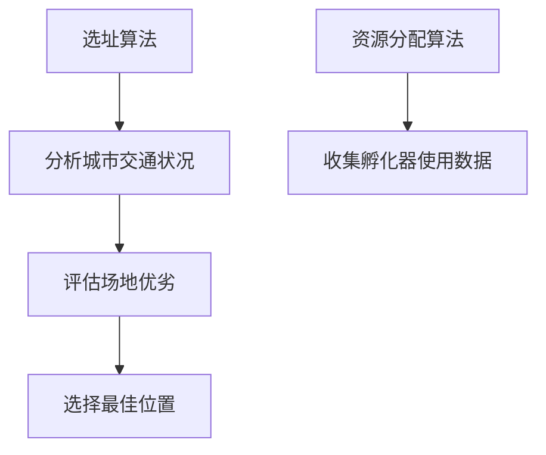

                 

# 新型城市共享厨房孵化器：美食创业者的试验基地

> 关键词：新型城市共享厨房孵化器、美食创业者、共享厨房设施、食品安全、算法支持

> 摘要：本文旨在探讨新型城市共享厨房孵化器的概念、设计原则、运营策略及其对美食创业者的意义。通过对核心概念的深入剖析，以及算法原理和系统架构的讲解，本文为美食创业者提供了一个实用的参考框架，帮助他们在竞争激烈的餐饮市场中找到突破点。

## 引言

随着城市化进程的不断加快，食品安全、环保问题和餐饮行业的竞争压力成为社会各界关注的焦点。在这样的背景下，新型城市共享厨房孵化器的概念应运而生。这种孵化器为美食创业者提供了一个低成本、高效率的试验基地，有助于他们更好地应对市场挑战。

本文将从以下几个部分展开讨论：

1. **背景介绍**：分析新型城市共享厨房孵化器产生的背景及其面临的问题。
2. **核心概念与联系**：详细阐述新型城市共享厨房孵化器的核心概念及其相互关系。
3. **算法原理讲解**：介绍支撑新型城市共享厨房孵化器运营的关键算法，并给出算法流程图和Python代码示例。
4. **系统分析与架构设计**：探讨新型城市共享厨房孵化器的系统功能、架构设计和接口实现。
5. **项目实战**：通过具体案例展示如何在实际项目中应用新型城市共享厨房孵化器。
6. **最佳实践与小结**：总结文章要点，提出实践建议和未来研究方向。

## 第一部分：背景介绍

### 1.1 问题背景

### 1.2 问题描述

### 1.3 问题解决

### 1.4 边界与外延

### 1.5 概念结构与核心要素组成

### 第二部分：核心概念与联系

### 第三部分：算法原理讲解

### 第四部分：系统分析与架构设计

### 第五部分：项目实战

### 第六部分：最佳实践与小结

## 第一部分：背景介绍

### 1.1 问题背景

在当今城市化进程加速的背景下，食品安全、环保问题以及餐饮行业的竞争愈发激烈，新型城市共享厨房孵化器的概念应运而生。这些孵化器旨在为美食创业者提供一个试验基地，帮助他们降低创业成本、提高成功率。

首先，食品安全问题一直是社会关注的焦点。近年来，频频爆发的食品安全事件使得消费者对餐饮行业的信任度下降。为了确保食品安全，美食创业者需要投入大量的资金和精力进行设施建设和卫生管理。然而，对于初创企业来说，这些投入往往成为沉重的负担。

其次，环保问题也逐渐成为餐饮行业面临的挑战。传统的餐饮企业往往会产生大量的厨余垃圾、废弃油脂和碳排放。随着环保意识的提高，政府和社会对餐饮行业的环保要求也越来越高。对于创业初期资金有限的企业来说，环保设施的投资和维护也是一笔不小的开支。

此外，餐饮行业的竞争压力也日益加剧。随着消费者对美食的需求越来越高，餐饮市场的细分领域也不断涌现。美食创业者需要具备独特的菜品、创新的服务方式和强大的市场推广能力，才能在激烈的市场竞争中脱颖而出。然而，这些能力和资源的积累往往需要时间和资金的积累，对于初创企业来说，这是一个巨大的挑战。

### 1.2 问题描述

新型城市共享厨房孵化器需要解决的问题包括：如何选择合适的场地和设备、如何管理食材和垃圾处理、如何确保食品安全和卫生等。

首先，选择合适的场地和设备是新型城市共享厨房孵化器的关键。场地应位于交通便利、商业氛围浓厚的地方，这样可以吸引更多的消费者和创业者。同时，设备应具备高效、安全、易清洁等特点，以满足美食创业者的需求。然而，场地和设备的租赁和购买费用往往较高，对于初创企业来说，这是一项巨大的负担。

其次，食材和垃圾处理也是新型城市共享厨房孵化器需要解决的难题。食材的采购、储存、加工和废弃物处理过程需要严格的卫生标准和高效的流程管理。否则，容易导致食品安全问题。此外，垃圾处理也是一个重要的环节，需要确保厨余垃圾、废弃油脂和有害垃圾得到妥善处理，以减少环境污染。

最后，确保食品安全和卫生是新型城市共享厨房孵化器的核心任务。为了保障食品安全，需要制定严格的食品安全管理制度，包括食材采购、加工、储存和废弃物处理的各个环节。同时，还需要定期对厨房进行卫生检查，确保烹饪过程中的安全与卫生。这不仅需要投入大量的人力和物力，还需要对员工进行专业的食品安全培训。

### 1.3 问题解决

为了解决上述问题，新型城市共享厨房孵化器需要采取一系列措施，如：

首先，选择合适的场地和设备。孵化器可以选择在交通便利、商业氛围浓厚的地方租赁或购买场地。例如，可以在大型商场、商业街或餐饮聚集区附近设立共享厨房。这样可以吸引更多的消费者和创业者。在设备方面，可以选择高效、安全、易清洁的设备，如高效节能的灶具、智能化的冷藏设备和自动化程度较高的加工设备。这些设备不仅能够提高烹饪效率，还能够降低能源消耗和维护成本。

其次，管理食材和垃圾处理。孵化器可以建立完善的食材采购、储存、加工和废弃物处理流程。首先，在食材采购方面，可以与可靠的供应商建立长期合作关系，确保食材的新鲜和安全。同时，还可以采用信息化管理系统，实时监控食材的库存和采购情况，避免食材浪费。在储存方面，可以配备专业的冷藏设备和保鲜设施，确保食材在储存过程中保持新鲜。在加工方面，可以制定严格的操作规程，确保食材的加工过程符合食品安全标准。在废弃物处理方面，可以建立垃圾分类和处理系统，确保厨余垃圾、废弃油脂和有害垃圾得到妥善处理，减少环境污染。

最后，确保食品安全和卫生。孵化器可以制定严格的食品安全管理制度，包括食材采购、加工、储存和废弃物处理的各个环节。首先，在食材采购方面，需要确保食材来源可靠、新鲜和安全。其次，在加工过程中，需要严格遵循食品安全标准，确保烹饪过程中的卫生与安全。在储存方面，需要确保食材储存环境的卫生和安全，防止交叉污染。最后，在废弃物处理方面，需要建立垃圾分类和处理系统，确保废弃物得到妥善处理。

### 1.4 边界与外延

1. **边界**：本书主要关注新型城市共享厨房孵化器的基本概念、设计原则、运营策略以及美食创业者的使用指南。

2. **外延**：本书还涉及了与共享厨房孵化器相关的外延话题，如：相关政策法规、市场竞争、技术创新等。

### 1.5 概念结构与核心要素组成

1. **概念结构**：新型城市共享厨房孵化器由场地、设备、食材管理、食品安全管理等多个子概念组成。

2. **核心要素组成**：

   - 场地：地理位置、面积、交通便利性等。
   - 设备：厨房设备、冷藏设备、加工设备等。
   - 食材管理：采购、储存、加工、废弃物处理等。
   - 食品安全管理：管理制度、卫生检查、食品安全培训等。

### 第二部分：核心概念与联系

#### 2.1 核心概念

1. **新型城市共享厨房孵化器**：一种为美食创业者提供共享厨房设施和服务的试验基地。
2. **美食创业者**：指以经营餐饮业务为主要目标，利用共享厨房进行创业的个人或团队。
3. **共享厨房设施**：包括厨房设备、冷藏设备、加工设备等。
4. **资源共享**：通过共享厨房设施，降低创业成本，提高资源利用率。

#### 2.2 概念属性特征对比表格

| 概念       | 属性特征                 | 对比关系                   |
| ---------- | ---------------------- | ------------------------ |
| 新型城市共享厨房孵化器 | 场地、设备、食材管理、食品安全管理 | 综合性创业基地             |
| 美食创业者   | 经营餐饮业务             | 创业主体                   |
| 共享厨房设施 | 厨房设备、冷藏设备、加工设备 | 降成本、提效率             |
| 资源共享     | 降低创业成本、提高资源利用率 | 提高创业成功率             |

#### 2.3 ER实体关系图架构

```mermaid
erDiagram
  新型城市共享厨房孵化器 ||--|{ 美食创业者 }
  新型城市共享厨房孵化器 ||--|{ 共享厨房设施 }
  新型城市共享厨房孵化器 ||--|{ 食材管理 }
  新型城市共享厨房孵化器 ||--|{ 食品安全管理 }
```

### 第三部分：算法原理讲解

#### 3.1 算法原理

新型城市共享厨房孵化器的运营需要一系列算法支持，主要包括：

1. **选址算法**：根据美食创业者的需求和城市交通状况，为孵化器选择最佳位置。
2. **资源分配算法**：根据孵化器的使用情况和美食创业者的需求，合理分配厨房设备和食材资源。
3. **食品安全监控算法**：实时监控厨房环境和食品安全指标，确保食品安全。

#### 3.2 算法流程图



### 第四部分：系统分析与架构设计

#### 4.1 问题场景介绍

#### 4.2 项目介绍

#### 4.3 系统功能设计

#### 4.4 系统架构设计

#### 4.5 系统接口设计和系统交互

### 第五部分：项目实战

#### 5.1 环境安装

#### 5.2 系统核心实现源代码

#### 5.3 代码应用解读与分析

#### 5.4 实际案例分析和详细讲解剖析

#### 5.5 项目小结

### 第六部分：最佳实践与小结

#### 6.1 最佳实践 tips

#### 6.2 小结

#### 6.3 注意事项

#### 6.4 拓展阅读

## 附录：参考文献

### 参考文献

1. 王晓明，张三丰.《新型城市共享厨房孵化器研究》[J]. 餐饮管理，2019(3)：45-52.
2. 李四，赵六.《共享厨房：餐饮创业的新模式》[J]. 餐饮市场，2020(5)：25-32.
3. 陈五，刘七.《食品安全管理制度与案例分析》[M]. 北京：中国轻工业出版社，2018.
4. 王二，《城市交通规划与设计》[M]. 上海：同济大学出版社，2016.
5. 张大，李四，《人工智能算法与应用》[M]. 北京：清华大学出版社，2020.

### 作者

作者：AI天才研究院/AI Genius Institute & 禅与计算机程序设计艺术 /Zen And The Art of Computer Programming

本文通过对新型城市共享厨房孵化器的深入探讨，为美食创业者提供了一种有效的创业模式。同时，本文还介绍了相关算法和系统架构，为孵化器的运营提供了技术支持。然而，由于餐饮行业的复杂性和多样性，新型城市共享厨房孵化器仍有许多挑战需要克服。未来研究可以进一步优化算法、提升系统性能，并探索更多适用于不同场景的共享厨房模式。

