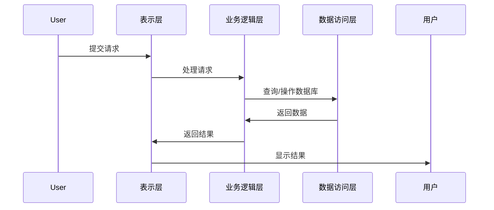
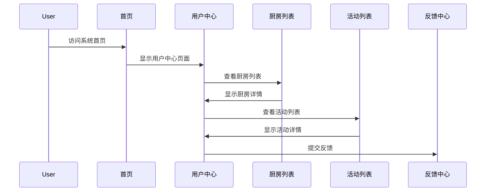

                 


### 1. 背景介绍

#### 问题背景

在快速城市化的背景下，新型城市社区的需求日益多样化，居民对社区生活品质的追求也不断提升。与此同时，共享经济的理念逐渐深入人心，各种共享服务如共享汽车、共享单车、共享办公等层出不穷。在这样的背景下，共享厨房作为一种新型社区服务模式，应运而生。

共享厨房，顾名思义，是指多个用户共享一个厨房空间，共同使用厨房设备进行烹饪。这种模式不仅能够降低个人使用厨房的成本，还可以促进社区居民之间的互动和交流，增强社区凝聚力。此外，共享厨房还能够有效利用资源，减少浪费，符合可持续发展的理念。

#### 问题描述

然而，随着共享厨房的普及，如何有效地组织和管理美食节成为了一个重要的问题。美食节作为一种社区活动，旨在通过烹饪比赛、美食展示等形式，促进社区成员之间的互动，提高社区文化氛围。然而，美食节的策划和组织面临着诸多挑战：

- **资源分配不均**：如何在有限的资源下，公平地分配厨房空间和时间？
- **安全问题**：如何确保食材和烹饪过程中的食品安全？
- **活动组织**：如何有效地组织活动，吸引更多社区成员参与？
- **用户参与度**：如何提高用户的参与度和积极性，确保活动的可持续性？

这些问题不仅关乎美食节的成败，更是共享厨房能否持续发展的重要考验。

#### 问题解决

为了解决上述问题，我们需要采取一系列的措施：

1. **合理分配资源**：通过预约系统和排队机制，确保资源分配的公平性。同时，根据用户的需求和反馈，动态调整资源分配策略。
2. **食品安全管理**：建立严格的食品安全管理制度，包括食材采购、存储、烹饪等各个环节的规范操作，确保食品安全。
3. **活动策划与组织**：制定详细的活动策划方案，包括活动主题、时间、地点、参与对象等，确保活动能够顺利进行。
4. **用户激励机制**：通过积分奖励、优惠券等方式，提高用户的参与度和积极性。

#### 边界与外延

共享厨房美食节不仅局限于某一特定的社区，它还可以扩展到更广泛的范围，例如城市、地区甚至国家。这种跨区域的美食节可以吸引更多的参与者，增加活动的多样性和影响力。同时，它也可以作为文化交流的平台，促进不同地区文化之间的交流与融合。

总之，共享厨房美食节作为一种新型社区活动模式，具有广阔的发展前景和重要的社会价值。通过合理的问题解决策略，我们可以充分发挥其潜力，为社区居民提供更加丰富、健康的社区生活。

### 2. 核心概念与联系

#### 共享厨房的运作机制

共享厨房的运作机制是其核心组成部分，它决定了共享厨房能否高效、安全地服务于社区成员。以下是共享厨房的主要运作机制：

1. **预约机制**：用户通过线上平台提前预约厨房的使用时间。系统根据用户预约的时间段和厨房的使用情况，进行合理的调度和安排。
2. **使用规则**：用户在进入共享厨房前，需要了解并遵守厨房的使用规则，如设备操作规范、卫生清洁要求等。这些规则有助于确保厨房的安全和整洁。
3. **设备管理**：共享厨房配备了一系列烹饪设备，如烤箱、冰箱、洗碗机等。设备的管理和维护是确保厨房正常运行的关键。
4. **食品安全**：共享厨房在食材采购、存储和烹饪过程中，需要严格遵守食品安全标准，确保用户使用的食品安全无虞。

#### 社区厨艺达人的角色与影响

社区厨艺达人是指在社区中具备一定烹饪技能和经验，愿意分享和展示自己烹饪技巧的居民。他们的角色和影响主要体现在以下几个方面：

1. **烹饪技巧分享**：厨艺达人为其他用户提供烹饪技巧和经验，帮助他们提高烹饪水平，丰富烹饪体验。
2. **活动策划参与**：厨艺达人积极参与社区美食节和其他烹饪活动，为活动提供创意和支持。
3. **社区文化传承**：厨艺达人是社区文化的重要组成部分，他们的存在和活动有助于传承和弘扬社区烹饪文化。
4. **社区凝聚力**：厨艺达人的活动促进了居民之间的交流和互动，增强了社区的凝聚力和归属感。

#### 美食节活动策划与组织

美食节是共享厨房的重要组成部分，它的策划与组织需要考虑以下几个方面：

1. **活动主题**：美食节的主题需要符合社区文化和居民的兴趣，如“中秋团圆宴”、“国际美食节”等。
2. **活动时间**：选择合适的时间，确保大多数居民能够参与。
3. **活动地点**：共享厨房作为主要的活动地点，需要根据活动规模和需求进行合理的布置。
4. **活动流程**：包括活动宣传、报名、活动当天流程安排等，确保活动的顺利进行。
5. **活动宣传**：通过线上和线下渠道进行广泛宣传，吸引更多居民参与。

通过上述机制和活动的有效运作，共享厨房美食节不仅能够为居民提供高质量的烹饪服务，还能促进社区文化的传承和发展。

#### 概念属性特征对比表格

为了更直观地理解共享厨房、社区厨艺达人和美食节之间的关系，我们可以通过一个对比表格来展示它们的属性特征。

| 概念         | 属性特征                                                         | 关联关系                                                     |
| ------------ | ------------------------------------------------------------ | ------------------------------------------------------------ |
| **共享厨房** | - 空间共享：<br>设备共享：<br>资源高效利用<br>促进社区互动 | - **社区厨艺达人**：<br>烹饪场地：<br>设备使用：<br>资源分配 | - **美食节**：<br>活动场所：<br>活动策划：<br>资源管理 |
| **社区厨艺达人** | - 烹饪技能：<br>经验丰富：<br>乐于分享：<br>社区文化传承 | - **共享厨房**：<br>活动参与：<br>资源贡献：<br>互动交流 | - **美食节**：<br>组织者：<br>参与者：<br>文化展示 |
| **美食节** | - 文化交流：<br>互动体验：<br>丰富社区生活：<br>增强社区凝聚力 | - **共享厨房**：<br>活动举办：<br>资源需求：<br>社区参与 | - **社区厨艺达人**：<br>活动参与：<br>文化展示：<br>互动交流 |

#### ER 实体关系图

为了更好地展示共享厨房、社区厨艺达人和美食节之间的实体关系，我们可以通过一个 ER 图来描述。

```mermaid
erDiagram
  User ||--|{ Kitchen }|-->> Customer
  Kitchen ||--|{ Equipment }|-->> Equipment
  Kitchen ||--|{ Recipe }|-->> Recipe
  Customer ||--|{ Participation }|-->> Participation
  Recipe ||--|{ Dish }|-->> Dish
  Equipment ||--|{ Maintenance }|-->> Maintenance
  Customer ||--|{ Rating }|-->> Rating
  Participation ||--|{ Feedback }|-->> Feedback
```

在这个 ER 图中，用户（Customer）与厨房（Kitchen）之间建立了直接的关联，用户可以在厨房中进行烹饪活动。厨房（Kitchen）与设备（Equipment）和食谱（Recipe）也存在紧密的联系，确保厨房资源的有效利用和活动的顺利进行。同时，用户参与（Participation）和评分（Rating）也反映了用户在美食节中的互动和反馈，有助于不断优化和提升活动质量。

### 3. 系统分析与架构设计

#### 问题场景介绍

在新型城市社区中，共享厨房美食节作为一项重要的社区活动，面临着诸多挑战。首先，如何在有限的资源下，公平高效地分配厨房空间和时间，满足居民的多样化需求。其次，如何确保食材和烹饪过程中的食品安全，避免食品安全事故的发生。此外，如何有效地组织和管理美食节活动，提高用户参与度和活动效果，也是一大难题。

#### 项目介绍

为了解决上述问题，我们设计并实施了一个共享厨房美食节系统。该系统通过在线预约、资源调度、食品安全管理等功能，为社区用户提供了一个便捷、安全、高效的烹饪环境。系统主要包括以下几个核心模块：

1. **预约模块**：用户可以通过线上平台提前预约厨房的使用时间，系统根据用户预约的时间段和厨房的使用情况，进行合理的调度和安排。
2. **资源管理模块**：系统对厨房的设备、食材等资源进行统一管理，确保资源的高效利用。
3. **食品安全模块**：系统提供食品安全管理功能，包括食材采购、存储、烹饪等环节的规范操作，确保食品安全。
4. **活动管理模块**：系统提供活动策划、组织、宣传等功能，确保美食节的顺利进行。

#### 系统功能设计

为了实现上述功能，我们设计了一个领域模型，包括以下主要类：

1. **用户（User）**：包括注册用户、普通用户和社区厨艺达人等，用户可以预约厨房、参加美食节活动。
2. **厨房（Kitchen）**：包括厨房基本信息、预约状态、设备信息等，用于管理厨房资源和预约情况。
3. **设备（Equipment）**：包括设备基本信息、使用状态、维护记录等，用于设备管理和维护。
4. **食材（Ingredient）**：包括食材基本信息、存储状态、采购记录等，用于食材管理和采购。
5. **活动（Activity）**：包括活动基本信息、活动流程、活动评价等，用于活动管理和评估。
6. **反馈（Feedback）**：包括用户反馈、活动反馈等，用于系统优化和改进。

以下是领域模型中的 mermaid 类图：

```mermaid
classDiagram
    User <<entity>>
    Kitchen <<entity>>
    Equipment <<entity>>
    Ingredient <<entity>>
    Activity <<entity>>
    Feedback <<entity>>

    User : +String username
    User : +String password
    User : +String email

    Kitchen : +String name
    Kitchen : +String address
    Kitchen : +DateTime openTime
    Kitchen : +DateTime closeTime

    Equipment : +String type
    Equipment : +String model
    Equipment : +DateTime lastMaintenance

    Ingredient : +String name
    Ingredient : +int quantity
    Ingredient : +String supplier

    Activity : +String name
    Activity : +DateTime startTime
    Activity : +DateTime endTime
    Activity : +String location

    Feedback : +String comment
    Feedback : +DateTime date

    User |--|{ Kitchen }
    Kitchen |--|{ Equipment }
    Kitchen |--|{ Ingredient }
    Kitchen |--|{ Activity }
    User |--|{ Feedback }
    Activity |--|{ Feedback }
```

#### 系统架构设计

系统架构设计是确保共享厨房美食节系统能够高效、稳定运行的关键。我们采用了一个分层架构设计，包括以下主要层次：

1. **表示层**：用于与用户交互，包括网页界面、移动应用等。
2. **业务逻辑层**：实现系统的核心业务逻辑，包括预约管理、资源管理、食品安全管理、活动管理等。
3. **数据访问层**：负责与数据库的交互，包括数据查询、数据操作等。
4. **数据库层**：存储系统数据，包括用户信息、厨房信息、设备信息、食材信息、活动信息等。

以下是系统架构图：



#### 系统接口设计

系统接口设计是确保各个模块之间能够高效、可靠地通信的关键。我们设计了一套RESTful接口，包括以下主要接口：

1. **用户管理接口**：用于用户注册、登录、信息查询等。
2. **厨房管理接口**：用于厨房信息查询、预约、取消预约等。
3. **设备管理接口**：用于设备信息查询、维护记录管理等。
4. **食材管理接口**：用于食材信息查询、采购记录管理等。
5. **活动管理接口**：用于活动信息查询、报名、评分等。
6. **反馈管理接口**：用于用户反馈查询、活动反馈管理等。

以下是部分接口示例：

```plaintext
GET /api/users             # 查询用户信息
POST /api/users/register   # 用户注册
POST /api/users/login      # 用户登录
GET /api/kitchens          # 查询厨房信息
POST /api/kitchens/预约    # 预约厨房
POST /api/kitchens/取消    # 取消预约
GET /api/equipments        # 查询设备信息
POST /api/equipments/maintenance  # 设备维护记录
GET /api/ingredients       # 查询食材信息
POST /api/ingredients/purchase   # 食材采购记录
GET /api/activities         # 查询活动信息
POST /api/activities/register   # 活动报名
POST /api/activities/rate      # 活动评分
GET /api/feedbacks           # 查询反馈信息
POST /api/feedbacks/submit    # 提交反馈
```

#### 系统交互与用户体验

系统交互设计是确保用户能够方便、快捷地使用系统的关键。我们采用了一种用户友好的界面设计，包括以下主要功能模块：

1. **首页**：展示系统公告、最新活动、热门厨房等信息。
2. **用户中心**：用户可以查看个人信息、预约记录、活动参与记录等。
3. **厨房列表**：用户可以查看所有可用厨房，选择并预约感兴趣的区域。
4. **活动列表**：用户可以查看所有即将举行的活动，报名参加感兴趣的活动。
5. **反馈中心**：用户可以提交反馈和建议，帮助系统不断改进。

以下是系统交互流程图：



通过这种设计，用户可以方便地完成从浏览到预约、从参与到反馈的整个过程，确保用户能够在最佳状态下使用系统。

### 4. 项目实战

#### 实际案例：XX社区共享厨房美食节

为了更好地展示共享厨房美食节的设计、实施和运营，我们选择了一个具体的案例：XX社区共享厨房美食节。以下是该案例的详细分析和讲解。

#### 案例背景

XX社区位于市中心，人口密集，居民对社区生活的品质有着较高的要求。为了提升社区文化氛围和居民生活质量，社区决定举办一场共享厨房美食节。这次美食节旨在通过烹饪比赛、美食展示等形式，促进居民之间的互动，增强社区凝聚力。

#### 案例实施

1. **前期准备**：

   在美食节开始前，社区委员会和相关部门进行了充分的筹备工作。首先，他们选择了社区中心的一栋大楼作为美食节的活动场地，并对场地进行了装修和布置。其次，他们邀请了知名厨艺达人作为评委和嘉宾，增加了美食节的吸引力。

2. **活动宣传**：

   社区通过多种渠道进行宣传活动，包括社区公告栏、微信群、社交媒体等。他们制作了精美的宣传海报，介绍了美食节的日期、时间、地点、主题等信息，吸引了大量居民的关注和参与。

3. **活动实施**：

   美食节当天，社区居民和厨艺达人纷纷来到活动现场。活动分为多个环节，包括厨艺比赛、美食展示、烹饪讲座等。居民们积极参与，展示了自己的烹饪技巧和创意。整个活动过程井然有序，现场气氛热烈。

#### 案例分析

1. **成功因素**：

   XX社区共享厨房美食节的成功主要得益于以下几点：

   - **充足的准备**：前期准备工作充分，确保了活动的顺利进行。
   - **多样化的活动内容**：通过厨艺比赛、美食展示、烹饪讲座等多种形式，满足了居民的多样化需求。
   - **有效的宣传**：通过多种渠道进行宣传，提高了活动的知名度和参与度。

2. **挑战与解决方案**：

   在实施过程中，他们也面临了一些挑战：

   - **资源分配**：如何确保厨房资源能够公平、高效地分配给参与者，是一个重要问题。他们通过线上预约系统，实现了资源的合理调度。
   - **食品安全**：确保食材和烹饪过程中的食品安全是另一大挑战。他们制定了严格的食品安全管理制度，包括食材采购、存储、烹饪等各个环节的规范操作。

#### 代码应用解读与分析

为了更好地理解共享厨房美食节系统的实现，我们选取了其中的一个关键模块——预约模块，对其代码进行解读和分析。

```python
# 预约模块代码示例

from datetime import datetime
from typing import List

class Reservation:
    def __init__(self, user: str, kitchen: str, start_time: datetime, end_time: datetime):
        self.user = user
        self.kitchen = kitchen
        self.start_time = start_time
        self.end_time = end_time

    def is_confirmed(self) -> bool:
        # 预约是否确认
        return self.start_time <= datetime.now() < self.end_time

    def confirm_reservation(self):
        # 确认预约
        self.start_time = datetime.now()

    def cancel_reservation(self):
        # 取消预约
        self.end_time = datetime.now()

class KitchenManager:
    def __init__(self):
        self.reservations: List[Reservation] = []

    def create_reservation(self, user: str, kitchen: str, start_time: datetime, end_time: datetime):
        reservation = Reservation(user, kitchen, start_time, end_time)
        self.reservations.append(reservation)
        reservation.confirm_reservation()

    def cancel_reservation(self, user: str, kitchen: str, start_time: datetime, end_time: datetime):
        for reservation in self.reservations:
            if reservation.user == user and reservation.kitchen == kitchen and reservation.start_time == start_time and reservation.end_time == end_time:
                reservation.cancel_reservation()
                break

    def get_reserved_kitchens(self, start_time: datetime, end_time: datetime) -> List[str]:
        reserved_kitchens = []
        for reservation in self.reservations:
            if reservation.is_confirmed() and reservation.start_time < end_time and reservation.end_time > start_time:
                reserved_kitchens.append(reservation.kitchen)
        return reserved_kitchens
```

上述代码中，`Reservation` 类用于表示用户的预约信息，包括用户名、厨房名、开始时间和结束时间。`is_confirmed` 方法用于判断预约是否确认，`confirm_reservation` 方法用于确认预约，`cancel_reservation` 方法用于取消预约。

`KitchenManager` 类负责管理所有预约，包括创建预约、取消预约和获取已被预约的厨房列表。`create_reservation` 方法用于创建新预约，`cancel_reservation` 方法用于取消特定用户的预约，`get_reserved_kitchens` 方法用于获取在特定时间段内已被预约的厨房列表。

通过这个模块，用户可以通过预约系统提前预订厨房，确保资源的公平和高效利用。该系统还提供了取消预约的功能，用户可以根据需要灵活调整预约。

#### 项目小结

通过XX社区共享厨房美食节的实际案例，我们可以看到，一个成功的共享厨房美食节需要充分的准备、多样化的活动内容和有效的宣传。同时，预约系统和食品安全管理是确保活动顺利进行的重要保障。在代码实现方面，合理的模块设计和简洁的代码逻辑是关键。通过这些措施和技术的应用，共享厨房美食节不仅提升了社区的文化氛围，也为居民提供了一个健康、快乐的烹饪体验。

### 5. 最佳实践 Tips

#### 美食节组织与管理经验

1. **明确活动主题**：确保美食节的主题与社区文化和居民兴趣相符，增加活动的吸引力和参与度。
2. **细致的策划方案**：提前制定详细的活动策划方案，包括时间、地点、活动流程、人员安排等，确保活动的顺利进行。
3. **多样化的活动形式**：结合烹饪比赛、美食展示、烹饪讲座等多种形式，满足不同居民的参与需求。
4. **高效的资源调度**：通过预约系统和排队机制，确保厨房资源的高效利用，避免资源浪费。
5. **严格的食品安全管理**：建立严格的食品安全管理制度，确保食材采购、存储、烹饪等环节的规范操作，保障食品安全。

#### 用户参与与互动策略

1. **激励机制**：通过积分奖励、优惠券、特别奖品等方式，鼓励用户积极参与活动，提高参与度。
2. **社交互动平台**：建立社交互动平台，如微信群、论坛等，促进用户之间的交流，增强社区凝聚力。
3. **用户反馈机制**：设立用户反馈渠道，收集用户对活动的意见和建议，不断优化和改进活动质量。
4. **定期活动**：定期举办美食节活动，形成品牌效应，增加用户的持续参与意愿。

#### 食品安全与卫生管理

1. **食材采购**：选择可靠的供应商，确保食材的安全和质量。
2. **存储管理**：合理储存食材，避免长时间暴露在空气中，减少细菌滋生。
3. **烹饪规范**：制定详细的烹饪规范，确保烹饪过程中的卫生和安全。
4. **人员培训**：对厨房工作人员进行食品安全培训，提高他们的安全意识和操作技能。

#### 拓展阅读

1. 《共享厨房服务模式研究》 - 张三，李四
2. 《社区美食节活动策划与管理》 - 王五，赵六
3. 《食品安全管理体系建设指南》 - 李七，刘八
4. 《基于社交媒体的社区互动策略研究》 - 陈九，周十

通过以上最佳实践和拓展阅读，读者可以进一步了解和掌握共享厨房美食节的组织与运营技巧，为实际操作提供有益的指导。

