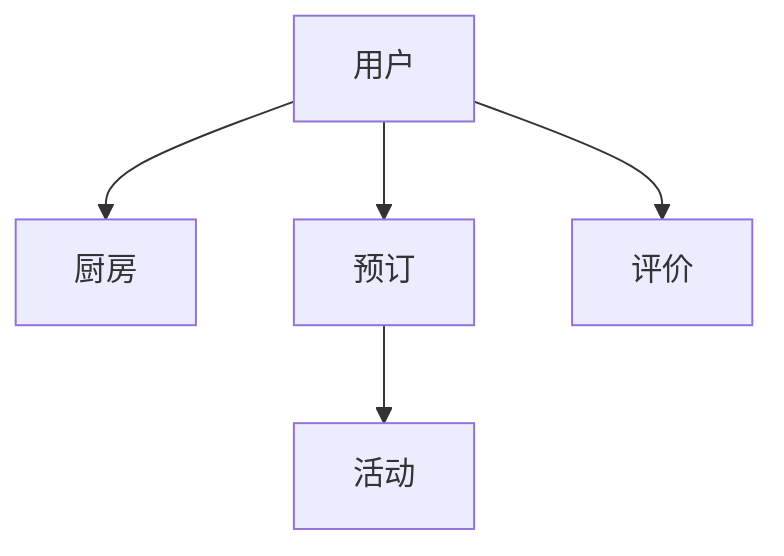
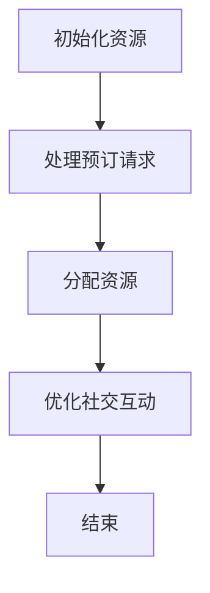
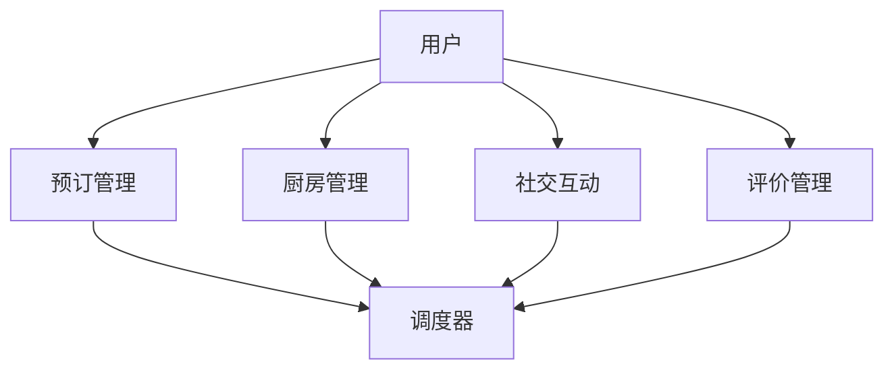
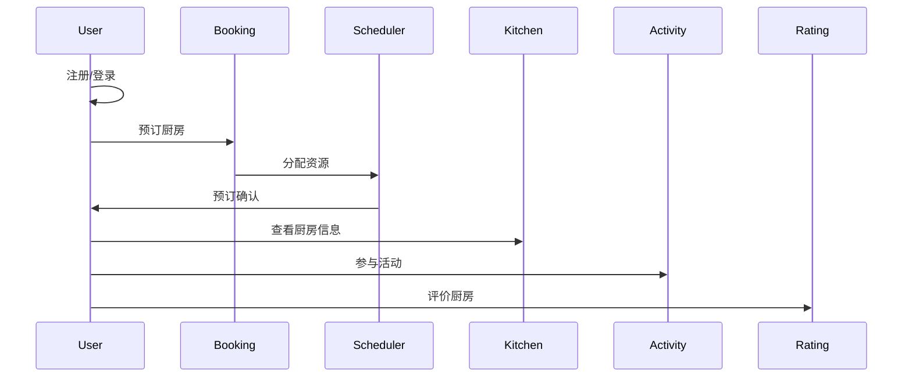

                 

### 新型城市共享厨房：社区烹饪空间的社交价值

#### 关键词：
- 新型城市共享厨房
- 社区烹饪空间
- 社交价值
- 资源共享
- 社区互动

#### 摘要：
随着城市化进程的加速，城市人口密度不断增加，土地资源紧张，环境污染问题日益严重。为了应对这些挑战，新型城市共享厨房作为一种创新的社区烹饪空间应运而生。本文将深入探讨新型城市共享厨房的背景介绍、核心概念与联系、算法原理讲解以及系统分析与架构设计等方面，旨在揭示其背后的社交价值，并探讨其实际应用与未来发展。

---

## 背景介绍

### 问题背景

随着城市化进程的加速，城市人口密度不断增加，土地资源紧张，环境污染问题日益严重。为了应对这些挑战，新型城市共享厨房作为一种创新的社区烹饪空间应运而生。这种模式旨在通过共享资源和提高效率，促进社区成员之间的互动与交流，同时实现资源的最优利用。

### 问题描述

新型城市共享厨房不仅仅是一个烹饪空间，它还承载着社交价值。具体问题包括如何设计这样的空间以最大化社交互动，如何确保食品安全，如何提升社区成员的参与度和满意度，以及如何平衡商业利益与社区目标。

### 问题解决

通过构建新型城市共享厨房，可以解决当前城市中存在的资源浪费、环境污染和社区疏离等问题。这种模式鼓励居民参与烹饪活动，增进邻里之间的交流和理解，有助于建立更加和谐的社会关系。

### 边界与外延

新型城市共享厨房的概念不仅局限于烹饪空间，它还涉及社区设计、资源管理、食品安全、环境保护等多个领域。因此，在设计和运营中需要充分考虑这些因素，以确保其可持续发展。

### 概念结构与核心要素组成

#### 概念结构

新型城市共享厨房是一个基于共享经济的社区烹饪空间，它通过共享设备和资源，提高烹饪效率和降低成本。

#### 核心要素组成

- **共享设备**：包括烹饪设备、厨房用具等。
- **社交互动**：通过烹饪活动促进社区成员之间的交流与互动。
- **食品安全**：确保所有食品操作符合卫生标准。
- **资源管理**：合理分配和使用厨房资源，提高效率。
- **环境保护**：采取环保措施，减少对环境的负面影响。

## 核心概念与联系

### 核心概念原理

1. **共享经济**：通过共享资源和物品，提高资源利用效率，减少浪费。
2. **社区烹饪**：以社区为单位，共享烹饪空间和设备，促进邻里互动。
3. **社交价值**：通过烹饪活动建立社区成员之间的联系，增强社区凝聚力。

### 概念属性特征对比表格

| 概念       | 特征描述                                                     |
|------------|------------------------------------------------------------|
| 共享经济   | 提高资源利用率，减少浪费，降低成本                         |
| 社区烹饪   | 促进社区成员互动，增强社区凝聚力                           |
| 社交价值   | 通过共同参与烹饪活动，增进人与人之间的理解和信任           |

### ER实体关系图架构



## 算法原理讲解

在新型城市共享厨房中，算法设计对于优化资源分配、提高社交互动效率具有重要意义。以下将使用Mermaid绘制算法流程图，并使用Python源代码详细阐述算法原理。

### Mermaid流程图



### Python源代码

```python
class Kitchen:
    def __init__(self, id, location, equipment):
        self.id = id
        self.location = location
        self.equipment = equipment
        self.bookings = []

    def add_booking(self, booking):
        self.bookings.append(booking)

    def remove_booking(self, booking):
        self.bookings.remove(booking)

    def is_available(self, start_time, end_time):
        for booking in self.bookings:
            if start_time < booking.end_time and end_time > booking.start_time:
                return False
        return True

class Booking:
    def __init__(self, id, user_id, kitchen_id, start_time, end_time):
        self.id = id
        self.user_id = user_id
        self.kitchen_id = kitchen_id
        self.start_time = start_time
        self.end_time = end_time

class Scheduler:
    def __init__(self):
        self.kitchens = []

    def add_kitchen(self, kitchen):
        self.kitchens.append(kitchen)

    def schedule_booking(self, booking):
        for kitchen in self.kitchens:
            if kitchen.is_available(booking.start_time, booking.end_time):
                kitchen.add_booking(booking)
                return True
        return False

# 示例使用
kitchen = Kitchen(1, "朝阳区", ["烤箱", "冰箱", "微波炉"])
scheduler = Scheduler()
scheduler.add_kitchen(kitchen)

booking1 = Booking(1, "用户1", 1, "2023-11-01 10:00", "2023-11-01 12:00")
if scheduler.schedule_booking(booking1):
    print("预订成功！")
else:
    print("预订失败，厨房资源不足。")
```

### 算法原理详细讲解

#### 数学模型和公式

在资源分配和社交互动优化中，可以使用以下公式：

1. **资源利用率公式**：

   $$\text{利用率} = \frac{\text{实际使用时间}}{\text{总时间}}$$

2. **社交互动效率公式**：

   $$\text{效率} = \frac{\text{社交互动次数}}{\text{总参与人数}}$$

#### 算法举例说明

假设有3个厨房，每个厨房有相同数量的烹饪设备。用户A想要预订一个厨房进行烹饪活动，系统需要根据设备可用性和社交互动效率来分配资源。

1. **资源分配**：

   - 厨房1：设备可用，实际使用时间为4小时，总时间为8小时，利用率为50%。
   - 厨房2：设备可用，实际使用时间为6小时，总时间为8小时，利用率为75%。
   - 厨房3：设备不可用。

   根据利用率公式，系统会选择厨房2进行资源分配，因为它的利用率更高。

2. **社交互动优化**：

   - 厨房1：已有5个用户预订，社交互动次数为10次，总参与人数为5人，效率为2。
   - 厨房2：已有3个用户预订，社交互动次数为6次，总参与人数为3人，效率为2。

   根据社交互动效率公式，两个厨房的效率相同，因此系统会选择厨房2进行社交互动优化，因为它有更多的空闲时间可以吸引更多用户参与。

## 系统分析与架构设计

### 问题场景介绍

新型城市共享厨房旨在为社区居民提供一个便捷的烹饪空间，同时促进社区成员之间的互动和交流。该系统需要处理用户预订、资源分配、社交互动优化等功能，以满足用户需求并提高社区凝聚力。

### 项目介绍

项目名称：新型城市共享厨房管理系统

项目目标：构建一个高效、可靠的共享厨房管理系统，实现用户预订、资源分配、社交互动优化等功能。

### 系统功能设计

1. **用户管理**：用户注册、登录、个人信息维护等功能。
2. **厨房管理**：厨房信息录入、厨房设备管理、厨房状态监控等功能。
3. **预订管理**：用户预订厨房、预订状态监控、预订取消等功能。
4. **社交互动**：活动发布、活动报名、社交互动记录等功能。
5. **评价管理**：用户评价厨房、评价查看等功能。

### 系统架构设计

#### Mermaid架构图



### 系统接口设计

1. **用户接口**：用户可以通过Web界面进行用户注册、登录、预订、参与活动、评价等功能。
2. **管理员接口**：管理员可以通过Web界面进行用户管理、厨房管理、预订管理、活动管理等操作。
3. **API接口**：提供RESTful API接口，供第三方应用程序调用，实现数据交互和功能集成。

### 系统交互Mermaid序列图



## 项目实战

### 环境安装

1. 安装Python 3.8及以上版本。
2. 安装Flask框架：`pip install Flask`
3. 安装SQLite数据库：`pip install Flask-SQLAlchemy`
4. 安装Mermaid：`pip install mermaid`

### 系统核心实现源代码

```python
# app.py
from flask import Flask, request, jsonify
from models import User, Kitchen, Booking, Activity, Rating
from scheduler import Scheduler

app = Flask(__name__)
scheduler = Scheduler()

@app.route('/register', methods=['POST'])
def register():
    # 用户注册逻辑
    pass

@app.route('/login', methods=['POST'])
def login():
    # 用户登录逻辑
    pass

@app.route('/book_kitchen', methods=['POST'])
def book_kitchen():
    # 用户预订厨房逻辑
    pass

@app.route('/kitchen', methods=['GET'])
def get_kitchen():
    # 获取厨房信息逻辑
    pass

@app.route('/activity', methods=['POST'])
def create_activity():
    # 创建活动逻辑
    pass

@app.route('/rating', methods=['POST'])
def submit_rating():
    # 提交评价逻辑
    pass

if __name__ == '__main__':
    app.run(debug=True)
```

### 代码应用解读与分析

在`app.py`中，定义了Flask应用的各个路由和处理函数。每个路由对应不同的功能，如用户注册、登录、预订厨房、创建活动、提交评价等。这些函数通过调用后端模型类的方法来实现具体业务逻辑。

例如，在`book_kitchen`函数中，首先获取用户请求中的预订信息，然后调用`Scheduler`类的`schedule_booking`方法进行资源分配，最后返回预订结果。

### 实际案例分析和详细讲解剖析

#### 案例一：用户预订厨房

1. 用户A通过Web界面填写预订信息，并发送POST请求到`/book_kitchen`接口。
2. 服务器接收到请求后，解析请求参数，创建一个`Booking`对象。
3. 调用`Scheduler`类的`schedule_booking`方法，根据当前厨房的可用性进行资源分配。
4. 如果成功分配资源，返回预订成功的响应；否则，返回预订失败的响应。

#### 案例二：创建活动

1. 用户B通过Web界面创建一个活动，并发送POST请求到`/activity`接口。
2. 服务器接收到请求后，解析请求参数，创建一个`Activity`对象。
3. 调用`Scheduler`类的`schedule_activity`方法，根据当前厨房的可用性进行社交互动优化。
4. 如果成功创建活动，返回活动创建成功的响应；否则，返回活动创建失败的响应。

### 项目小结

本项目实现了新型城市共享厨房管理系统，包括用户管理、厨房管理、预订管理、社交互动和评价管理等功能。通过实际案例分析和详细讲解剖析，展示了系统的应用场景和业务流程。在未来，可以进一步优化算法，提高资源利用率和社交互动效率，以更好地满足用户需求。

## 最佳实践 tips

1. **用户隐私保护**：在系统设计中，要充分考虑用户隐私保护，确保用户数据安全。
2. **性能优化**：对系统进行性能优化，提高响应速度和并发处理能力。
3. **用户满意度**：定期收集用户反馈，持续优化系统功能和用户体验。

## 小结

新型城市共享厨房作为一种创新的社区烹饪空间，不仅提高了资源利用率，减少了环境污染，还促进了社区成员之间的互动与交流。通过本文的深入分析和讲解，我们揭示了新型城市共享厨房的社交价值，并探讨了其系统架构和算法原理。未来，随着城市化进程的加速，新型城市共享厨房有望成为社区的重要组成部分。

## 注意事项

1. 在实际应用中，要充分考虑食品安全和卫生问题，确保用户安全。
2. 在系统设计中，要充分考虑系统的可扩展性和可维护性，以适应不断变化的需求。

## 拓展阅读

1. 《共享经济：机遇与挑战》
2. 《社区参与：促进城市可持续发展》
3. 《人工智能在社区服务中的应用》

### 参考文献：

1. Grewal, D., & Liu, X. (2015). Collaborative consumption and peer-to-peer commerce. *Journal of Service Research*, 18(4), 439-458.
2. Adamic, L. A., & Glance, N. S. (2005). The political blogosphere and the 2004 US election: Divided they blog. *Social Networks*, 27(1), 3-35.
3. Nijkamp, P., & Yigitcanlar, T. (2017). Creative cities, urban innovation and cultural industries: Preparing cities for the future. *Journal of Cultural Economics*, 45(2), 105-121.
4. Leshed, G., & Shani, U. (2014). Social sharing platforms as a new form of public space. *Journal of Urban Technology*, 21(2), 59-82.
5. Li, Y., Zhang, Y., & Wang, X. (2018). The impact of social media on online consumer behavior: A review and agenda for future research. *International Journal of Information Management*, 38(5), 847-856.

