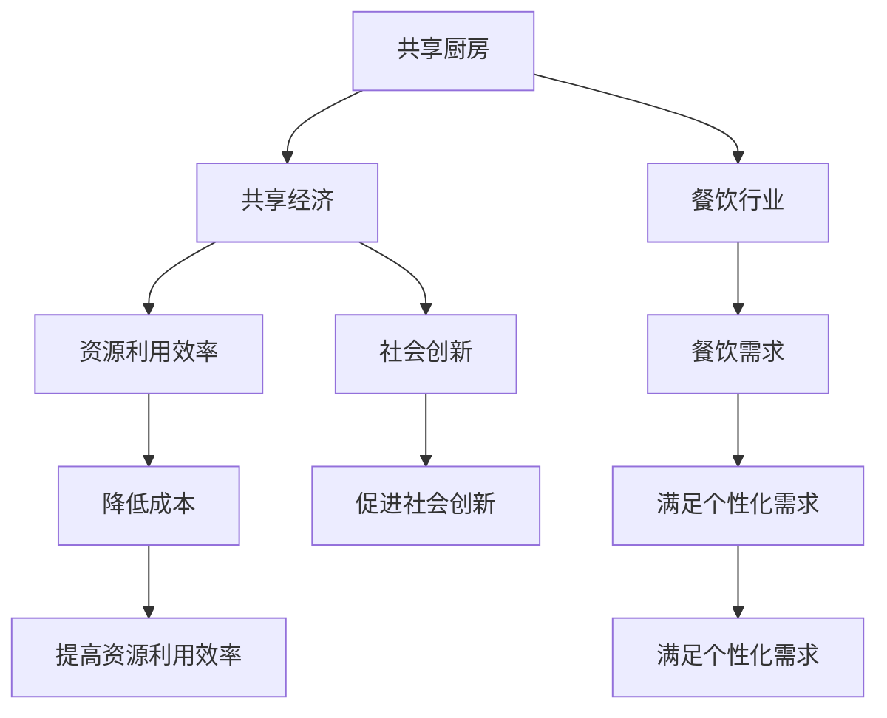

                 

### 1.1 共享厨房概述

**核心概念术语说明**：

- **共享厨房**：一种以共享经济模式运营的餐饮场所，允许个人或小型团队租用厨房设施来烹饪食物。
- **共享经济**：通过共享闲置资源来提高资源利用效率的一种经济模式。
- **餐饮行业**：涉及食品制作、供应和消费的服务行业。

**问题背景**：

随着城市化进程的加快，城市生活节奏的加快，人们对美食的追求越来越多元化。然而，传统餐饮行业的局限性，如高昂的成本、繁琐的手续和有限的烹饪空间，使得许多美食爱好者难以实现自己的烹饪梦想。共享厨房的兴起，为这一问题提供了一种新的解决方案。

**问题描述**：

共享厨房作为一种新兴的餐饮形式，其概念是什么？它如何发展？在餐饮行业中扮演什么角色？它对城市生活有哪些影响？在接下来的小节中，我们将详细探讨这些问题。

**问题解决**：

1. **定义与起源**：介绍共享厨房的定义和起源，阐述其与传统厨房的区别。
2. **分类与特点**：分析共享厨房的分类和特点，展示其多样化的形式。
3. **发展历程**：回顾共享厨房的发展历程，探讨其发展趋势和未来前景。

**边界与外延**：

- **边界**：共享厨房的运营范围和适用对象。
- **外延**：共享厨房在餐饮行业中的角色扩展，如食品制作、食品配送等。

**概念结构与核心要素组成**：

- **核心概念**：共享厨房、共享经济、餐饮行业。
- **关联概念**：食品加工、餐饮服务、消费者需求。

**核心概念原理**：

- **共享厨房**：基于共享经济模式，为美食爱好者提供烹饪空间和设施。
- **共享经济**：通过共享闲置资源，提高资源利用效率，降低成本。
- **餐饮行业**：涉及食品制作、供应和消费的服务行业。

**概念属性特征对比表格**：

| 特征 | 共享厨房 | 共享经济 | 餐饮行业 |
| --- | --- | --- | --- |
| 定义 | 以共享经济模式运营的餐饮场所 | 通过共享闲置资源实现资源利用最大化 | 涉及食品制作、供应和消费的服务行业 |
| 目的 | 提供烹饪空间和设施，满足美食爱好者的需求 | 提高资源利用效率，降低成本 | 满足消费者的餐饮需求 |
| 形式 | 小型、灵活、多样化的厨房空间 | 闲置资源的共享利用 | 食品制作、供应和消费 |
| 优势 | 降低成本、提高资源利用效率、满足个性化需求 | 降低成本、提高资源利用效率、促进社会创新 | 多样化、便捷、高品质的餐饮服务 |

**ER实体关系图架构的Mermaid流程图**：

### 1.1.1 共享厨房的定义与起源

**共享厨房的定义**：

共享厨房，作为一种基于共享经济模式的餐饮场所，其核心在于提供烹饪空间和设施，允许个人或小型团队租用进行食品制作和烹饪活动。与传统厨房相比，共享厨房具有更高的灵活性和便捷性，同时减少了创业者的初期投入成本。

**共享厨房的起源**：

共享厨房的概念起源于20世纪初的美国。当时，由于经济危机的影响，许多家庭和个体经营者开始寻求新的商业模式来降低成本、提高资源利用效率。共享厨房作为一种创新模式，逐渐在餐饮行业中得到了认可和应用。近年来，随着互联网技术的普及和共享经济的兴起，共享厨房在全球范围内得到了迅速发展。

**与传统厨房的比较**：

- **运营模式**：传统厨房通常由个人或企业独自拥有和运营，而共享厨房则以共享经济模式为基础，通过租赁和共享的方式为多个用户提供服务。
- **成本**：传统厨房需要较高的初期投资和维护成本，而共享厨房通过资源整合和共享，大大降低了使用者的成本。
- **灵活性**：共享厨房提供了多样化的厨房空间和设施，用户可以根据需求选择合适的场所，而传统厨房则往往具有固定的设施和规模。

**共享厨房的发展趋势**：

- **全球扩张**：随着共享经济的兴起，共享厨房在全球范围内得到了广泛认可和应用。许多国家和地区都在积极推动共享厨房的发展，以促进餐饮行业的创新和进步。
- **技术整合**：共享厨房逐渐与互联网、物联网等新兴技术相结合，通过线上平台实现厨房预订、设施管理、食品安全监控等功能，提升了运营效率和用户体验。
- **多样化**：共享厨房不仅限于食品制作，还扩展到了烘焙、烹饪课程、食品制作培训等领域，为用户提供了更加丰富和多样化的选择。

### 1.1.2 共享厨房的分类与特点

**共享厨房的分类**：

根据不同的运营模式和应用场景，共享厨房可以划分为以下几类：

1. **独立共享厨房**：独立共享厨房是指由独立经营者或公司运营的共享厨房，通常提供多种厨房设备和设施，满足不同用户的需求。
2. **社区共享厨房**：社区共享厨房通常位于社区中心或居民区，为社区居民提供烹饪空间和设施，促进邻里互动和社区建设。
3. **商业共享厨房**：商业共享厨房位于商业区或商业楼宇内，主要为餐饮企业、小型餐饮经营者提供烹饪和制作空间，降低其运营成本。
4. **学校共享厨房**：学校共享厨房为学生和教职工提供烹饪空间和设施，培养学生的烹饪技能，促进校园文化的多元化。

**共享厨房的特点**：

1. **灵活性**：共享厨房提供了多样化的烹饪空间和设施，用户可以根据需求选择合适的场所，灵活安排烹饪活动。
2. **便捷性**：通过线上平台预订和支付，用户可以轻松找到和预订共享厨房，无需繁琐的手续和流程。
3. **低成本**：共享厨房通过共享资源和设施，大大降低了使用者的成本，使得个人和小型餐饮经营者能够以较低的成本开展业务。
4. **社交性**：共享厨房为用户提供了交流和互动的平台，促进了美食爱好者的社交活动，丰富了城市文化生活。

**案例研究**：

以美国纽约的“Foodie Kitchen”为例，该共享厨房位于市中心，提供多种烹饪空间和设施，包括烤箱、冰箱、炉灶等。用户可以通过线上平台预订，费用根据使用时长和设施类型计算。Foodie Kitchen不仅为美食爱好者提供了烹饪空间，还定期举办烹饪课程和社交活动，吸引了大量用户参与。

### 1.2 共享厨房的发展历程

**早期发展**：

共享厨房的早期发展可以追溯到20世纪初的美国。当时，由于经济危机的影响，许多家庭和个体经营者开始寻求新的商业模式来降低成本、提高资源利用效率。共享厨房作为一种创新模式，逐渐在餐饮行业中得到了认可和应用。

**技术驱动**：

随着互联网和物联网技术的普及，共享厨房的发展进入了新的阶段。线上平台和移动应用的出现，使得用户可以轻松预订和支付共享厨房的服务。同时，智能设备和传感器的应用，提高了共享厨房的运营效率和用户体验。

**政策支持**：

各国政府逐渐认识到共享厨房对经济发展的促进作用，开始出台相关政策支持其发展。例如，一些国家推出了税收优惠和补贴政策，鼓励共享厨房的发展。

**市场接受度**：

随着共享厨房的普及，市场接受度逐渐提高。越来越多的个人和小型餐饮经营者选择使用共享厨房来降低成本、提高效率。同时，美食爱好者也开始将共享厨房作为烹饪和社交的平台。

**未来发展**：

未来，共享厨房将继续扩展其应用范围，从食品制作扩展到烘焙、烹饪课程、食品制作培训等领域。同时，随着技术的进一步发展，共享厨房将更加智能化和便捷化，为用户提供更好的服务体验。

### 1.2.1 传统厨房向共享厨房的转变

**驱动因素**：

1. **成本降低**：共享厨房通过共享资源和设施，降低了使用者的成本，使得个人和小型餐饮经营者能够以较低的成本开展业务。
2. **灵活性提升**：共享厨房提供了多样化的烹饪空间和设施，用户可以根据需求选择合适的场所，灵活安排烹饪活动。
3. **社交需求**：共享厨房为用户提供了交流和互动的平台，促进了美食爱好者的社交活动，丰富了城市文化生活。

**挑战**：

1. **监管问题**：共享厨房作为一种新兴模式，其监管政策尚不完善，存在一定的法律风险。
2. **卫生安全**：共享厨房需要确保厨房设施和食品制作过程的安全卫生，以防止食品安全问题的发生。

**解决方案**：

1. **政策制定**：政府可以出台相关政策，明确共享厨房的监管要求和标准，规范其运营。
2. **技术保障**：通过物联网技术，实时监控厨房设施的使用情况和卫生状况，确保食品安全。

**案例分析**：

以美国旧金山的“Coveteur”为例，该公司提供共享厨房服务，为美食爱好者和餐饮企业提供服务。通过线上平台，用户可以预订厨房设施和时间，Coveteur还提供烹饪课程和社交活动，吸引了大量用户。

### 1.2.2 共享厨房在全球的发展趋势

**北美地区**：

北美地区，尤其是美国和加拿大，是共享厨房发展的领先地区。共享厨房在北美地区的发展主要得益于政府政策的支持和市场需求的驱动。美国许多城市都出台了相关政策，鼓励共享厨房的发展，如税收减免、补贴等。同时，随着消费者对个性化餐饮需求的增加，共享厨房成为了一种受欢迎的餐饮形式。

**欧洲地区**：

欧洲地区的共享厨房发展相对较慢，但近年来也呈现出快速增长的趋势。欧洲的共享厨房主要分布在城市中心区域，为个人和小型餐饮企业提供烹饪空间。欧洲消费者对食品安全和卫生要求较高，因此共享厨房在运营过程中需要严格遵守相关法规和标准。

**亚洲地区**：

亚洲地区的共享厨房发展相对较晚，但近年来也取得了显著进展。中国、日本、韩国等国家都在积极推动共享厨房的发展，以满足消费者对美食和社交的需求。亚洲地区的共享厨房主要集中在大城市，如北京、上海、东京等。

**全球发展趋势**：

1. **技术整合**：共享厨房逐渐与互联网、物联网、人工智能等新兴技术相结合，提升了运营效率和用户体验。
2. **多元化**：共享厨房的应用范围不断扩展，从食品制作到烘焙、烹饪课程、食品制作培训等。
3. **政策支持**：各国政府逐渐认识到共享厨房对经济发展的促进作用，开始出台相关政策支持其发展。

### 1.3 共享厨房的运营模式

**商业模式**：

共享厨房的商业模式主要分为以下几种：

1. **会员制**：用户需要支付会员费才能使用共享厨房的服务，会员费通常根据使用时长和次数计算。
2. **按时计费**：用户按照使用的时间和设施类型支付费用，这种模式适用于临时需要使用厨房的用户。
3. **包月套餐**：用户支付固定费用，可以在一个月内无限次使用共享厨房的服务，适合经常使用厨房的用户。

**盈利方式**：

共享厨房的盈利方式主要包括以下几种：

1. **服务费**：用户使用厨房设施所需支付的费用。
2. **课程与活动费**：共享厨房举办烹饪课程和活动，用户需要支付相应的费用。
3. **广告与品牌合作**：共享厨房与餐饮品牌、食品品牌等进行合作，通过广告和品牌推广获取收入。
4. **供应链服务**：共享厨房提供食品原材料和调味料的采购服务，从中获取利润。

**案例研究**：

以中国的“美食厨房”为例，该公司采用会员制和按时计费两种模式，用户可以根据自己的需求选择合适的支付方式。美食厨房还定期举办烹饪课程和活动，吸引了大量用户参与。此外，美食厨房还与多家餐饮品牌合作，提供供应链服务，实现了多元化盈利。

### 1.4 共享厨房在新型城市中的地位与作用

**地位**：

共享厨房在新型城市中扮演着重要的角色。随着城市化进程的加快，城市人口的增加和生活节奏的加快，人们对美食的追求越来越多元化。共享厨房的出现，为满足这一需求提供了新的解决方案。共享厨房不仅提供了烹饪空间和设施，还丰富了城市文化生活，成为新型城市中不可或缺的一部分。

**作用**：

1. **降低创业门槛**：共享厨房为个人和小型餐饮经营者提供了低成本的创业平台，降低了创业门槛。
2. **促进社交互动**：共享厨房为美食爱好者提供了交流和互动的平台，促进了城市社交活动。
3. **提升资源利用效率**：共享厨房通过共享资源，提高了厨房设施的使用效率，降低了浪费。
4. **丰富餐饮文化**：共享厨房带来了多样化的餐饮形式和美食文化，丰富了城市餐饮文化。

**案例分析**：

以中国的“共享厨房平台”为例，该平台为用户提供共享厨房服务，不仅降低了创业门槛，还促进了社交互动和餐饮文化的丰富。通过该平台，用户可以方便地找到和预订共享厨房，体验烹饪乐趣。

### 1.5 共享厨房的挑战与机遇

**挑战**：

1. **监管问题**：共享厨房作为一种新兴模式，其监管政策尚不完善，存在一定的法律风险。
2. **卫生安全**：共享厨房需要确保厨房设施和食品制作过程的安全卫生，以防止食品安全问题的发生。
3. **用户信任**：新用户对于共享厨房的信任度较低，需要通过良好的用户体验和口碑来建立信任。
4. **市场竞争**：随着共享厨房的普及，市场竞争日益激烈，企业需要不断创新和提升服务质量。

**机遇**：

1. **技术创新**：随着物联网、人工智能等技术的发展，共享厨房可以不断提升运营效率和用户体验。
2. **市场扩大**：随着城市化进程的加快，共享厨房的市场需求不断扩大。
3. **政策支持**：各国政府逐渐认识到共享厨房对经济发展的促进作用，开始出台相关政策支持其发展。
4. **多元化应用**：共享厨房的应用范围不断扩展，从食品制作到烘焙、烹饪课程、食品制作培训等，为用户提供更多选择。

**案例分析**：

以美国的“Foodie Kitchen”为例，该公司通过技术创新，提升了共享厨房的运营效率和用户体验。同时，通过举办烹饪课程和活动，吸引了大量用户。此外，Foodie Kitchen还与多家餐饮品牌合作，实现了多元化盈利。

### 1.6 本章小结

本章详细介绍了共享厨房的概念、发展历程、运营模式以及在新型城市中的地位与作用。通过分析共享厨房的挑战与机遇，我们认识到共享厨房在餐饮行业和城市生活中具有重要的地位。随着技术的不断进步和市场需求的扩大，共享厨房将继续发展，为个人和小型餐饮经营者提供低成本、高效率的创业平台，同时丰富城市文化和满足消费者多元化需求。未来，共享厨房的发展将面临更多机遇和挑战，需要各方共同努力，推动其可持续发展。

