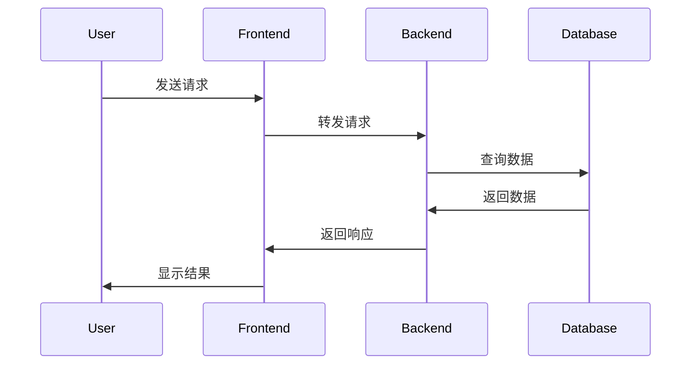
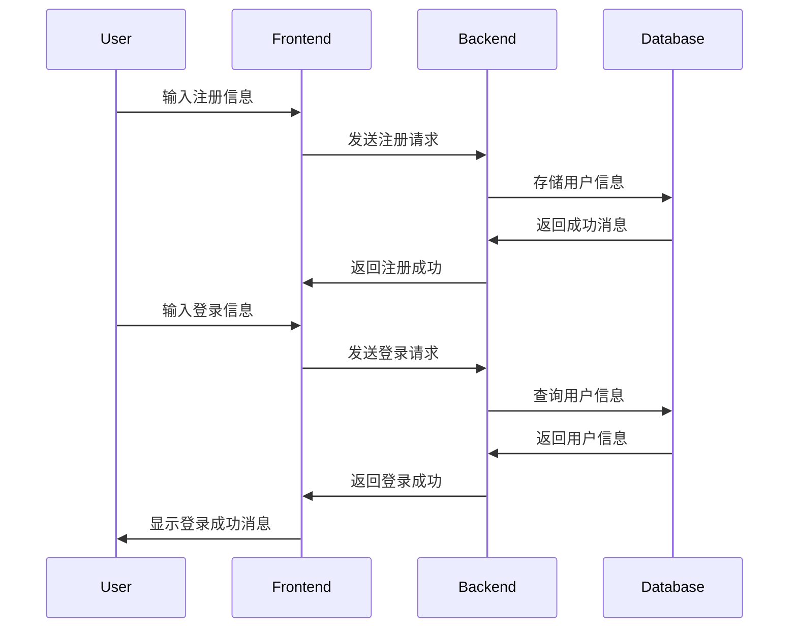

                 

### 文章标题：新型城市共享厨艺课：烹饪技能与社交网络的结合

> 关键词：共享厨艺课、社交网络、烹饪技能、技术结合、用户体验

摘要：本文将探讨新型城市共享厨艺课的概念、实施方式及其与社交网络的结合。我们将从背景介绍、核心概念解析、技术原理分析、系统架构设计、项目实战等多个方面，全面剖析这一新兴模式的潜在价值与未来发展前景。

## 引言

在城市化进程加快、生活节奏加快的背景下，人们对于高质量生活服务的需求日益增长。烹饪技能作为生活不可或缺的一部分，也逐渐成为了人们关注的焦点。而社交网络作为现代社会的主要交流平台，已经深刻地影响了人们的社交行为和生活方式。如何将烹饪技能与社交网络相结合，创造一种新型的共享厨艺课模式，不仅能够满足人们对烹饪技能的学习需求，还能提供一种全新的社交体验，成为了当下热门的课题。

本文将从以下方面展开讨论：

1. **背景介绍**：阐述共享厨艺课的概念及其与社交网络的结合的重要性。
2. **核心概念解析**：详细解读共享厨艺课中的关键术语和概念。
3. **技术原理分析**：分析烹饪技能与社交网络结合的技术实现原理。
4. **系统架构设计**：介绍共享厨艺课系统的整体架构设计。
5. **项目实战**：通过具体案例展示共享厨艺课的实施过程。
6. **总结与展望**：总结文章的主要观点，并对未来发展趋势进行展望。

## 背景介绍

### 共享厨艺课的概念

共享厨艺课，是指通过线上平台或者线下实体课程，向广大烹饪爱好者提供专业烹饪技能培训和互动交流的机会。它结合了烹饪教育和社交网络的优点，旨在打破传统的教学模式，为用户创造一个既可学习又可分享烹饪经验的平台。

### 社交网络在烹饪技能传播中的作用

社交网络作为现代信息技术的重要组成部分，具有即时性、互动性和广泛性的特点。它能够迅速传播烹饪技能，让更多的用户受益。此外，社交网络还为烹饪爱好者提供了一个交流的平台，用户可以在其中分享自己的烹饪心得，获取他人的建议和反馈，从而不断提升自己的烹饪水平。

### 结合的重要性

将烹饪技能与社交网络相结合，不仅能够提高烹饪技能的传播效率，还能增强用户的参与感和互动性，提升用户体验。具体来说，这种结合有以下几个方面的意义：

1. **提高学习效率**：用户可以通过社交网络快速获取烹饪技能的相关信息，并通过互动交流解决学习中的问题。
2. **促进知识共享**：用户可以在社交网络中分享自己的烹饪经验，促进烹饪知识的传播和积累。
3. **增强社交体验**：用户可以通过社交网络结交志同道合的朋友，共同学习和分享烹饪乐趣。

## 核心概念解析

### 共享厨艺课的关键术语

1. **烹饪技能**：指通过各种烹饪手法和技巧，将食材制作成美味食物的能力。
2. **社交网络**：指用户通过互联网平台进行交流、分享和互动的一种社会关系网络。
3. **共享厨艺课平台**：指提供烹饪技能培训和互动交流服务的线上或线下平台。

### 概念关系

共享厨艺课平台通过社交网络实现烹饪技能的传播和互动，用户在平台上进行学习、交流和分享，形成一个闭环的生态系统。具体关系如下：

1. **烹饪技能 → 共享厨艺课平台**：用户在平台上学习烹饪技能，通过课程内容和互动交流不断提升自己的烹饪水平。
2. **社交网络 → 共享厨艺课平台**：社交网络为共享厨艺课平台提供用户互动和分享的平台，促进烹饪技能的传播和积累。

### 概念属性特征对比表格

| 特征 | 烹饪技能 | 社交网络 | 共享厨艺课平台 |
| --- | --- | --- | --- |
| 目标 | 提高烹饪水平 | 满足社交需求 | 提供烹饪技能学习和交流平台 |
| 途径 | 课程学习、实践 | 互动交流、分享 | 线上课程、线下活动 |
| 影响力 | 个体技能提升 | 社交关系建立 | 烹饪知识传播、社区氛围营造 |

### ER实体关系图架构

下面是共享厨艺课平台的ER实体关系图：

```mermaid
erDiagram
  User ||--|{ Course: "参加课程" }
  User ||--|{ Comment: "发表评论" }
  User ||--|{ Like: "点赞" }
  Course ||--|{ Recipe: "包含菜谱" }
  Course ||--|{ Teacher: "由老师授课" }
  Recipe ||--|{ Step: "包含步骤" }
  Comment ||--|{ Reply: "回复评论" }
```

## 技术原理分析

### 烹饪技能与社交网络的结合方式

1. **线上课程**：通过视频、图文等方式，将烹饪技能传授给用户。用户可以随时随地进行学习，提高学习效率。
2. **互动交流**：用户可以在平台上发表评论、提问，与其他用户进行互动交流，获取烹饪经验和建议。
3. **社交功能**：平台提供社交功能，如私信、群聊等，用户可以结交志同道合的朋友，共同分享烹饪乐趣。
4. **菜谱分享**：用户可以上传自己的菜谱，与其他用户分享烹饪心得，促进烹饪知识的传播和积累。

### 技术实现原理

1. **视频直播**：采用HLS（HTTP Live Streaming）协议进行视频直播，保证直播的流畅性和稳定性。
2. **图文展示**：利用Markdown语言，实现图文并茂的菜谱展示。
3. **数据库**：采用MySQL数据库存储用户信息、课程信息、评论信息等，保证数据的持久化和安全性。
4. **Web框架**：采用Django框架，实现平台的快速开发和高效运行。
5. **社交功能**：采用WebSocket技术，实现实时互动和消息推送。

### 算法原理讲解

#### 课程推荐算法

课程推荐算法是共享厨艺课平台的核心功能之一，它根据用户的兴趣和行为，为其推荐适合的课程。下面是一个简单的基于协同过滤的课程推荐算法：

1. **计算相似度**：计算用户之间的相似度，使用余弦相似度公式：
   $$\text{similarity}(u,v) = \frac{u \cdot v}{\|u\| \|v\|}$$
   其中，$u$和$v$分别为用户$u$和$v$的向量表示。

2. **生成推荐列表**：根据用户$u$对其他用户的评分，生成推荐列表。具体步骤如下：
   - 计算用户$u$与其他用户$v$的相似度。
   - 计算用户$v$喜欢的课程$C$与用户$u$的相似度。
   - 对相似度进行加权求和，得到用户$u$对课程$C$的预测评分。
   - 按照预测评分从高到低排序，生成推荐列表。

#### 社交网络分析算法

社交网络分析算法用于分析用户在平台上的社交关系，挖掘潜在的朋友关系。下面是一个简单的基于图论的用户关系分析算法：

1. **构建用户关系图**：将用户视为图中的节点，用户之间的互动视为边，构建用户关系图。

2. **计算相似度**：计算用户之间的相似度，使用Jaccard相似度公式：
   $$\text{similarity}(u,v) = \frac{|S_u \cap S_v|}{|S_u \cup S_v|}$$
   其中，$S_u$和$S_v$分别为用户$u$和$v$的兴趣标签集合。

3. **生成社交网络**：根据用户之间的相似度，构建社交网络，节点之间的边表示相似度值。

### 示例代码

下面是计算用户相似度的Python代码示例：

```python
import numpy as np

def cosine_similarity(u, v):
    return np.dot(u, v) / (np.linalg.norm(u) * np.linalg.norm(v))

user1 = np.array([1, 0, 1, 1])
user2 = np.array([1, 1, 0, 1])

similarity = cosine_similarity(user1, user2)
print("Cosine similarity:", similarity)
```

## 系统架构设计

### 问题场景介绍

共享厨艺课平台旨在为用户提供一个便捷、高效、有趣的烹饪学习与交流平台。用户可以在平台上学习烹饪课程，与其他用户互动交流，分享烹饪心得，提升自己的烹饪技能。平台需要具备以下功能：

1. **课程学习**：提供各种烹饪课程，用户可以在线观看课程视频、查看课程资料。
2. **互动交流**：用户可以发表评论、提问，与其他用户进行互动交流。
3. **社交功能**：提供私信、群聊等功能，方便用户结交志同道合的朋友。
4. **菜谱分享**：用户可以上传自己的菜谱，分享烹饪心得。

### 项目介绍

项目名称：共享厨艺课平台
项目背景：为了满足城市居民对高质量烹饪技能的学习需求，同时提供一种全新的社交体验，我们决定开发一个共享厨艺课平台。
项目目标：构建一个功能完善、用户体验良好的共享厨艺课平台，实现烹饪技能的传播和积累，促进烹饪爱好者的交流和成长。

### 系统功能设计

1. **用户管理**：包括用户注册、登录、个人信息管理等功能。
2. **课程管理**：包括课程发布、课程分类、课程搜索等功能。
3. **评论管理**：包括评论发表、评论回复、评论点赞等功能。
4. **社交管理**：包括私信、群聊、好友关系管理等功能。
5. **菜谱管理**：包括菜谱上传、菜谱分类、菜谱搜索等功能。

### 系统架构设计

共享厨艺课平台采用前后端分离的架构，前端使用Vue.js框架，后端使用Django框架。系统架构如下图所示：



### 系统接口设计

1. **用户管理接口**：
   - 注册：`POST /api/users/register/`
   - 登录：`POST /api/users/login/`
   - 查询用户信息：`GET /api/users/{id}/`
   - 修改用户信息：`PUT /api/users/{id}/`

2. **课程管理接口**：
   - 发布课程：`POST /api/courses/`
   - 更新课程：`PUT /api/courses/{id}/`
   - 删除课程：`DELETE /api/courses/{id}/`
   - 查询课程：`GET /api/courses/`

3. **评论管理接口**：
   - 发表评论：`POST /api/comments/`
   - 回复评论：`POST /api/comments/{id}/reply/`
   - 点赞评论：`POST /api/comments/{id}/like/`

4. **社交管理接口**：
   - 添加好友：`POST /api/friends/`
   - 删除好友：`DELETE /api/friends/{id}/`
   - 查询好友：`GET /api/friends/`

5. **菜谱管理接口**：
   - 上传菜谱：`POST /api/recipes/`
   - 更新菜谱：`PUT /api/recipes/{id}/`
   - 删除菜谱：`DELETE /api/recipes/{id}/`
   - 查询菜谱：`GET /api/recipes/`

### 系统交互设计

系统交互设计主要描述用户与平台之间的交互流程。下面是一个简单的用户注册和登录的交互序列图：



## 项目实战

### 环境安装

1. **前端环境**：
   - 安装Node.js和npm
   - 安装Vue CLI
   - 创建项目：`vue create shared-cooking-class-platform`

2. **后端环境**：
   - 安装Python和Django
   - 创建项目：`django-admin startproject shared_cooking_class_platform`
   - 创建应用：`python manage.py startapp frontend`

3. **数据库环境**：
   - 安装MySQL
   - 创建数据库：`create database shared_cooking_class_platform;`

### 系统核心实现源代码

1. **用户管理**：

```python
# users/models.py

from django.db import models

class User(models.Model):
    username = models.CharField(max_length=100)
    password = models.CharField(max_length=100)
    email = models.EmailField()

    def __str__(self):
        return self.username
```

2. **课程管理**：

```python
# courses/models.py

from django.db import models

class Course(models.Model):
    title = models.CharField(max_length=100)
    description = models.TextField()
    teacher = models.ForeignKey(User, on_delete=models.CASCADE)

    def __str__(self):
        return self.title
```

3. **评论管理**：

```python
# comments/models.py

from django.db import models

class Comment(models.Model):
    content = models.TextField()
    user = models.ForeignKey(User, on_delete=models.CASCADE)
    course = models.ForeignKey(Course, on_delete=models.CASCADE)

    def __str__(self):
        return f"{self.user} - {self.course}"
```

4. **社交管理**：

```python
# friends/models.py

from django.db import models

class Friend(models.Model):
    user = models.ForeignKey(User, related_name='friend_requests', on_delete=models.CASCADE)
    friend = models.ForeignKey(User, related_name='received_requests', on_delete=models.CASCADE)

    def __str__(self):
        return f"{self.user} - {self.friend}"
```

### 代码应用解读与分析

1. **用户注册**：

```python
# users/views.py

from django.shortcuts import render
from django.http import JsonResponse
from .models import User
from .serializers import UserSerializer
from rest_framework.parsers import JSONParser

def register(request):
    if request.method == 'POST':
        data = JSONParser().parse(request)
        serializer = UserSerializer(data=data)
        if serializer.is_valid():
            serializer.save()
            return JsonResponse(serializer.data, status=201)
        return JsonResponse(serializer.errors, status=400)
    return render(request, 'register.html')
```

这段代码实现了用户注册的功能。当接收到POST请求时，将请求体中的数据解析为JSON格式，并使用UserSerializer进行验证和保存。

2. **课程发布**：

```python
# courses/views.py

from django.shortcuts import render
from django.http import JsonResponse
from .models import Course
from .serializers import CourseSerializer
from rest_framework.parsers import JSONParser

def create_course(request):
    if request.method == 'POST':
        data = JSONParser().parse(request)
        serializer = CourseSerializer(data=data)
        if serializer.is_valid():
            serializer.save()
            return JsonResponse(serializer.data, status=201)
        return JsonResponse(serializer.errors, status=400)
    return render(request, 'create_course.html')
```

这段代码实现了课程发布的功能。当接收到POST请求时，将请求体中的数据解析为JSON格式，并使用CourseSerializer进行验证和保存。

### 实际案例分析

为了展示共享厨艺课平台在实际中的应用，我们以一个具体的案例进行分析。

#### 案例背景

小明是一位烹饪爱好者，他想通过共享厨艺课平台学习新菜谱，同时结交志同道合的朋友。

#### 操作步骤

1. **注册账号**：小明通过手机号注册了一个账号。
2. **登录平台**：小明使用注册时填写的手机号和密码登录平台。
3. **浏览课程**：小明在平台上浏览了各种烹饪课程，并找到了一道自己感兴趣的新菜谱。
4. **观看课程视频**：小明点击课程链接，观看课程视频，学习新菜谱的制作方法。
5. **发表评论**：小明在课程页面发表了一条评论，分享了自己的学习心得。
6. **互动交流**：小明通过私信功能，与其他用户进行了互动交流，结识了志同道合的朋友。

#### 分析与解读

通过这个案例，我们可以看出共享厨艺课平台在实际应用中发挥了重要作用：

1. **学习新技能**：小明通过观看课程视频，成功学会了新菜谱的制作方法。
2. **分享经验**：小明通过发表评论，分享了自己的学习心得，帮助其他用户更好地学习。
3. **社交互动**：小明通过互动交流，结识了志同道合的朋友，扩大了自己的社交圈子。

#### 项目小结

通过这个案例，我们可以看到共享厨艺课平台在烹饪技能学习、经验分享和社交互动方面的优势。未来，我们可以进一步优化平台功能，提高用户体验，让更多的用户受益。

## 最佳实践 Tips

1. **课程内容丰富**：确保课程内容丰富、实用，满足不同用户的需求。
2. **用户体验优化**：关注用户体验，优化界面设计和交互流程，提高用户满意度。
3. **互动交流积极**：鼓励用户积极参与互动交流，营造活跃的社区氛围。
4. **数据安全保护**：加强数据安全保护，确保用户隐私不被泄露。
5. **持续更新迭代**：根据用户反馈，持续更新和优化平台功能，提升平台竞争力。

## 小结

本文从背景介绍、核心概念解析、技术原理分析、系统架构设计、项目实战等多个方面，全面剖析了新型城市共享厨艺课：烹饪技能与社交网络的结合。通过分析，我们发现共享厨艺课平台在烹饪技能学习、经验分享和社交互动方面具有显著优势。未来，随着技术的不断进步和用户需求的多样化，共享厨艺课平台有望进一步优化和拓展，为用户提供更加优质的服务。

## 注意事项

1. **课程质量**：确保课程内容质量，提高用户满意度。
2. **用户体验**：关注用户体验，优化平台界面和交互流程。
3. **数据安全**：加强数据安全保护，防止用户隐私泄露。

## 拓展阅读

1. 《社交网络与大数据分析》
2. 《人工智能在烹饪领域的应用》
3. 《用户体验设计：实践与案例》

## 作者信息

作者：AI天才研究院/AI Genius Institute & 禅与计算机程序设计艺术 /Zen And The Art of Computer Programming

