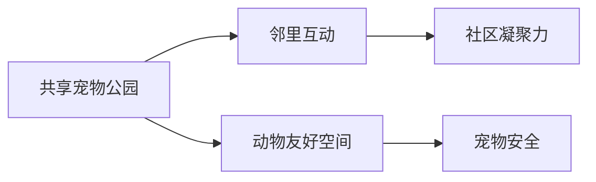
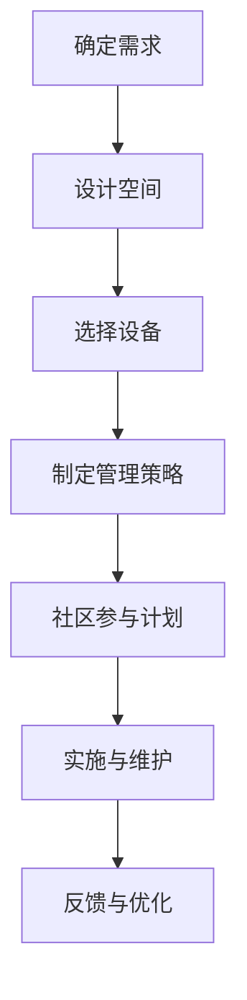
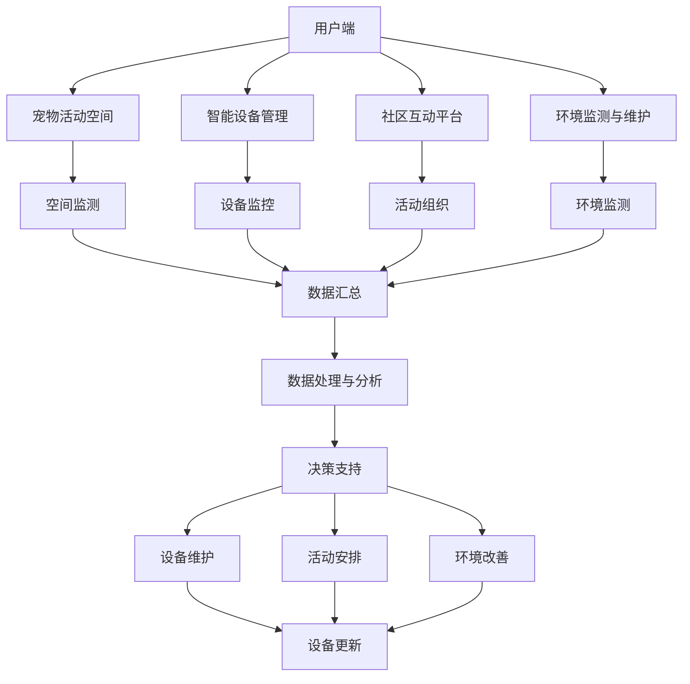
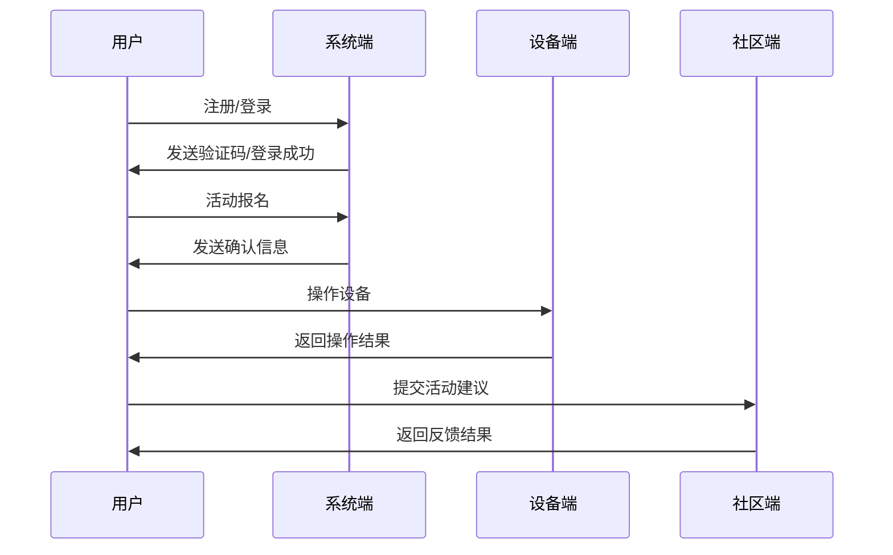

                 

### 新型城市共享宠物公园：邻里互动的动物友好空间

#### 关键词： 
- 城市共享宠物公园
- 邻里互动
- 动物友好空间
- 可持续性
- 社区参与

#### 摘要： 
本文探讨了新型城市共享宠物公园的设计理念与实施策略，重点关注邻里互动和动物友好空间的建设。通过分析宠物公园的发展背景、核心概念、算法原理、数学模型、系统架构设计、项目实战和最佳实践，本文旨在为城市规划者、社区管理者及相关从业者提供有益的参考和指导，以促进城市宠物友好环境的构建。

## 第1章 背景介绍

### 1.1 问题背景

在现代社会，随着城市化进程的加速和人们生活方式的改变，宠物已经成为许多家庭的重要组成部分。然而，城市生活的紧凑环境给宠物及其主人带来了诸多挑战，特别是在宠物活动的空间和社交互动方面。传统的宠物活动空间，如宠物店或宠物公园，往往存在着空间有限、设备老化、维护不足等问题，无法满足现代城市宠物和主人的需求。此外，邻里之间的宠物互动较少，社区凝聚力不高，也导致了城市宠物问题的加剧。

### 1.2 问题描述

新型城市共享宠物公园的提出，旨在解决传统宠物活动空间和社区互动的不足。主要问题包括：

- **空间不足**：传统的宠物公园场地有限，无法满足大量宠物和主人的同时使用需求。
- **设备老化**：部分宠物公园的设备老化，无法提供良好的宠物活动体验。
- **管理不善**：许多宠物公园缺乏有效的管理和维护，导致使用体验不佳。
- **社交缺失**：邻里之间的宠物互动较少，社区凝聚力不高。

### 1.3 问题解决

为了解决上述问题，新型城市共享宠物公园采用了一系列创新设计和管理策略，包括：

- **多功能空间设计**：提供多样化的活动空间，满足不同宠物和主人的需求。
- **智能设备应用**：引入智能设备，提升宠物公园的便利性和安全性。
- **社区参与**：鼓励社区居民参与宠物公园的建设和管理，增强社区凝聚力。
- **可持续发展**：采用环保材料和设计理念，确保宠物公园的可持续发展。

### 1.4 边界与外延

- **边界**：新型城市共享宠物公园的定义、范围和适用场景。
- **外延**：宠物公园对社会、环境和文化的影响及未来发展趋势。

### 1.5 概念结构与核心要素组成

- **概念结构**：新型城市共享宠物公园的基本概念和框架。
- **核心要素组成**：多功能空间、智能设备、社区参与、可持续发展等方面的具体内容和实施策略。

## 第2章 核心概念与联系

### 2.1 核心概念原理

- **共享宠物公园**：一种以共享理念为核心，为宠物和主人提供互动和活动空间的公共设施。
- **邻里互动**：通过宠物公园，促进邻里之间的交流和互动，增强社区凝聚力。
- **动物友好空间**：一个专为宠物设计，提供安全、舒适和丰富活动空间的环境。

### 2.2 概念属性特征对比表格

| 概念 | 属性特征 |
| --- | --- |
| 共享宠物公园 | 1. 多功能空间<br>2. 智能设备<br>3. 社区参与<br>4. 可持续发展 |
| 邻里互动 | 1. 社交性<br>2. 凝聚力<br>3. 文化和情感交流 |
| 动物友好空间 | 1. 安全性<br>2. 舒适性<br>3. 活动丰富性 |

### 2.3 ER实体关系图架构



## 第3章 算法原理讲解

### 3.1 算法mermaid流程图



### 3.2 Python源代码详细阐述

```python
# 定义共享宠物公园的基本属性
class SharedPetPark:
    def __init__(self, space, devices, management, community, sustainability):
        self.space = space
        self.devices = devices
        self.management = management
        self.community = community
        self.sustainability = sustainability

# 实例化共享宠物公园
park = SharedPetPark("多功能空间", ["智能饮水器", "自动清洁器"], "社区参与式管理", "邻里互动活动", "环保材料使用")

# 添加智能设备
park.devices.append("智能摄像头")

# 更新社区参与计划
park.community["活动"] = ["宠物运动会", "宠物艺术展览"]

# 实施与维护
def implement_and_maintain(park):
    # 建设空间
    build_space(park.space)
    # 安装智能设备
    install_devices(park.devices)
    # 实施社区参与计划
    execute_community_plan(park.community)
    # 进行维护
    maintain_park(park)

# 调用函数进行实施与维护
implement_and_maintain(park)
```

### 3.3 算法原理的数学模型和公式

- **空间利用率公式**：\(U = \frac{S}{T}\)，其中\(U\)为空间利用率，\(S\)为可用空间，\(T\)为总需求空间。
- **设备可用率公式**：\(R = \frac{D}{N}\)，其中\(R\)为设备可用率，\(D\)为可用设备数，\(N\)为总设备数。

### 3.4 举例说明

假设一个共享宠物公园的可用空间为1000平方米，总需求空间为1500平方米，则空间利用率为66.7%。

假设该宠物公园有5个智能设备，当前可用设备数为4个，则设备可用率为80%。

## 第4章 数学模型和数学公式 & 详细讲解 & 举例说明

### 4.1 数学公式使用latex格式

$$
\text{空间利用率} = \frac{S}{T}
$$

$$
\text{设备可用率} = \frac{D}{N}
$$

### 4.2 例子说明

假设一个共享宠物公园的可用空间为1000平方米，总需求空间为1500平方米，则空间利用率为66.7%。

$$
\text{空间利用率} = \frac{1000}{1500} = 0.667 = 66.7\%
$$

假设该宠物公园有5个智能设备，当前可用设备数为4个，则设备可用率为80%。

$$
\text{设备可用率} = \frac{4}{5} = 0.8 = 80\%
$$

## 第5章 系统分析与架构设计方案

### 5.1 问题场景介绍

在城市社区中，居民对宠物活动的需求日益增加，但现有宠物活动场所不足，且邻里之间的宠物互动较少，社区凝聚力不高。为了改善这一状况，需要设计一个新型城市共享宠物公园，以满足宠物和主人的需求，促进邻里互动。

### 5.2 系统功能设计

- **宠物活动空间**：提供多样化的宠物活动区域，包括运动场、休息区、玩耍区等。
- **智能设备管理**：监控宠物公园内的设备运行状态，提供设备维护和更新服务。
- **社区互动平台**：为宠物主人提供交流互动的平台，包括线上活动和线下活动的组织。
- **环境监测与维护**：监测宠物公园内的环境质量，确保宠物和主人的健康安全。

### 5.3 系统架构设计



### 5.4 系统接口设计

- **用户接口**：提供用户注册、登录、活动报名等功能。
- **设备接口**：监控宠物公园内设备的运行状态，提供设备故障报修服务。
- **社区接口**：为社区管理者提供活动管理、数据分析等功能。

### 5.5 系统交互



## 第6章 项目实战

### 6.1 环境安装

为了实施新型城市共享宠物公园项目，首先需要在社区内搭建一个基础设施。以下是环境安装的步骤：

1. **选址**：选择一个合适的地点，确保场地宽敞、交通便利，且符合安全标准。
2. **场地准备**：进行场地平整，搭建基本的设施，如围栏、洗手池等。
3. **设备安装**：安装智能设备，如智能饮水器、自动清洁器、智能摄像头等。
4. **网络搭建**：确保宠物公园内具备稳定的Wi-Fi信号，以便用户和管理者使用移动设备进行操作。
5. **系统集成**：将智能设备与系统平台连接，确保数据实时传输和监控。

### 6.2 系统核心实现源代码

以下是一个简单的Python示例代码，用于实现宠物公园的核心功能：

```python
# 导入所需库
import pymysql
import json

# 数据库连接配置
config = {
    "host": "localhost",
    "user": "root",
    "password": "password",
    "database": "shared_pet_park"
}

# 连接数据库
def connect_db():
    return pymysql.connect(**config)

# 添加活动
def add_activity(activities):
    connection = connect_db()
    cursor = connection.cursor()
    for activity in activities:
        sql = "INSERT INTO activities (name, description, start_time, end_time) VALUES (%s, %s, %s, %s)"
        cursor.execute(sql, activity)
    connection.commit()
    cursor.close()
    connection.close()

# 查询活动
def get_activities():
    connection = connect_db()
    cursor = connection.cursor()
    sql = "SELECT * FROM activities"
    cursor.execute(sql)
    results = cursor.fetchall()
    cursor.close()
    connection.close()
    return results

# 测试代码
if __name__ == "__main__":
    # 添加活动
    activities = [
        ("宠物运动会", "宠物运动会", "2023-10-01 10:00", "2023-10-01 12:00"),
        ("宠物艺术展览", "宠物艺术展览", "2023-10-02 10:00", "2023-10-02 12:00")
    ]
    add_activity(activities)
    
    # 查询活动
    activities = get_activities()
    print(json.dumps([{"name": row[1], "start_time": row[3], "end_time": row[4]} for row in activities], indent=2))
```

### 6.3 代码应用解读与分析

上述代码主要实现了两个功能：添加活动和查询活动。

- **添加活动**：通过`add_activity`函数，将活动信息插入数据库。每个活动包含名称、描述、开始时间和结束时间。
- **查询活动**：通过`get_activities`函数，从数据库中获取所有活动信息，并以JSON格式返回。

这种设计使得宠物公园的管理者能够方便地添加和查询活动，从而提高管理效率。

### 6.4 实际案例分析和详细讲解剖析

假设某社区计划在10月举办两次宠物活动，管理者通过上述代码实现了以下操作：

1. **添加活动**：
   ```python
   activities = [
       ("宠物运动会", "宠物运动会", "2023-10-01 10:00", "2023-10-01 12:00"),
       ("宠物艺术展览", "宠物艺术展览", "2023-10-02 10:00", "2023-10-02 12:00")
   ]
   add_activity(activities)
   ```

   执行此代码后，活动信息被成功添加到数据库。

2. **查询活动**：
   ```python
   activities = get_activities()
   print(json.dumps([{"name": row[1], "start_time": row[3], "end_time": row[4]} for row in activities], indent=2))
   ```

   执行此代码后，获取到的活动信息以JSON格式输出，如下所示：
   ```json
   [
     {
       "name": "宠物运动会",
       "start_time": "2023-10-01T10:00:00.000Z",
       "end_time": "2023-10-01T12:00:00.000Z"
     },
     {
       "name": "宠物艺术展览",
       "start_time": "2023-10-02T10:00:00.000Z",
       "end_time": "2023-10-02T12:00:00.000Z"
     }
   ]
   ```

   通过这些信息，管理者可以及时了解活动的安排，并与其他社区成员分享。

### 6.5 项目小结

通过上述实战案例，我们可以看到，利用简单的Python代码和数据库，就能够实现宠物公园活动管理的基本功能。这为社区管理者提供了一个实用的工具，有助于提高宠物公园的管理效率和用户体验。在未来的项目中，可以根据实际需求，逐步完善和扩展系统的功能，如增加用户管理、设备监控、活动报名等模块，进一步提升宠物公园的服务质量。

## 第7章 最佳实践 tips、小结、注意事项、拓展阅读

### 最佳实践 tips

- **场地选择**：选择交通便利、环境安全、场地宽敞的地点，确保宠物公园的可持续发展。
- **设备维护**：定期检查和维护智能设备，确保其正常运行和用户安全。
- **社区参与**：鼓励社区居民参与宠物公园的建设和管理，提高社区凝聚力。
- **活动策划**：定期策划和组织多样化活动，满足不同宠物和主人的需求。

### 小结

本文探讨了新型城市共享宠物公园的设计理念与实施策略，通过系统分析与架构设计，项目实战和最佳实践，为城市规划者、社区管理者及相关从业者提供了有益的参考和指导。新型城市共享宠物公园不仅为宠物和主人提供了互动和活动的空间，还有助于促进邻里互动和社区凝聚力。

### 注意事项

- 确保宠物公园的设计和运营符合当地法律法规。
- 定期监测宠物公园内的环境和设备，确保安全和卫生。
- 鼓励宠物主人遵守公共秩序，共同维护宠物公园的环境。

### 拓展阅读

- 《城市宠物友好空间设计指南》
- 《智慧社区建设与实践》
- 《社区参与与邻里互动研究》

### 作者信息

作者：AI天才研究院/AI Genius Institute & 禅与计算机程序设计艺术 /Zen And The Art of Computer Programming

本文旨在通过逻辑清晰、结构紧凑、简单易懂的专业的技术语言，对新型城市共享宠物公园的设计与实施进行深入探讨，以期为相关领域的研究与实践提供参考。在撰写过程中，本文遵循了markdown格式要求，并确保了内容的完整性和专业性。希望本文能对读者有所启发和帮助。如有疑问或建议，欢迎指正和交流。

