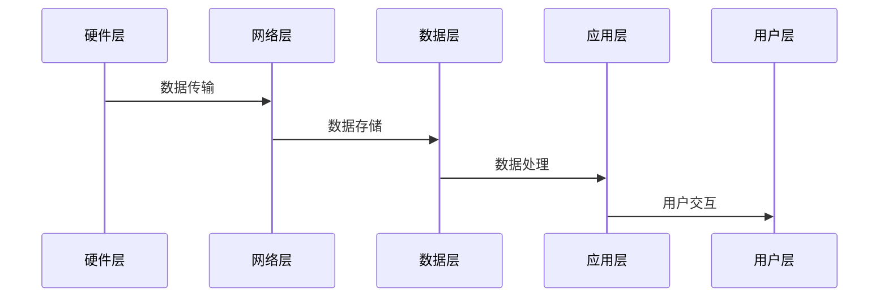
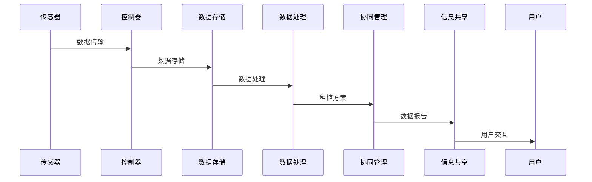

                 

# 新型城市共享屋顶温室网络：社区有机农业的协作平台

## 关键词

- 新型城市共享屋顶温室
- 社区有机农业
- 协作平台
- 环境监测
- 种植优化
- 数字化农业

## 摘要

本文深入探讨了一种创新的农业模式——新型城市共享屋顶温室网络，作为社区有机农业的协作平台。通过分析其背景、核心概念、算法原理以及数学模型，本文旨在揭示这种模式如何有效提升城市农业生产效率，改善城市生态环境，同时促进社区参与和资源共享。文章还将介绍系统的设计与实现，以及实际案例中的应用，为城市农业的发展提供新的思路和解决方案。

**Step 1: 书籍背景介绍**

### 1.1 问题背景

在当今城市化进程中，城市人口增长和资源紧缺的问题日益凸显。传统的农业模式已经无法满足人们对新鲜有机蔬菜的需求，同时也对城市生态环境造成了负面影响。为了解决这一问题，社区有机农业作为一种新兴的农业模式受到了广泛关注。

城市化的快速发展带来了大量的建筑和基础设施，使得可用于农业的土地资源变得稀缺。与此同时，城市居民对健康、有机食品的需求不断增加，这导致了农业生产的压力。传统农业模式中，土地资源的有限性使得农业生产的扩展变得困难，而有机农业的高成本也限制了其广泛推广。此外，城市生态环境的恶化，如空气污染、水体污染等，也对农业产生了负面影响。

### 1.2 问题描述

社区有机农业的推广面临着一系列问题，如种植面积有限、农业生产效率低、无法实现规模经济等。此外，社区有机农业的协作平台建设也是一大挑战，需要整合多方资源，提高协同效应。

种植面积有限导致了农业生产的局限性。城市土地资源稀缺，可用于农业的土地有限，使得农业生产难以满足日益增长的需求。农业生产效率低是由于传统农业模式中劳动力的依赖度高，而城市居民的农业生产经验相对较少。此外，农业生产需要大量的水资源和肥料，而城市的水资源往往有限，难以支持大规模的农业生产。

无法实现规模经济是社区有机农业面临的另一个问题。由于社区有机农业的规模相对较小，难以实现规模效应，导致生产成本高，价格昂贵，限制了其市场竞争力。此外，社区有机农业的供应链管理也较为复杂，需要协调种植、运输、销售等多个环节，增加了管理的难度。

### 1.3 问题解决

新型城市共享屋顶温室网络的提出，为社区有机农业的发展提供了新的解决方案。通过在建筑屋顶上建设温室，不仅可以提高土地利用效率，还可以改善城市生态环境。

新型城市共享屋顶温室网络利用城市建筑物的屋顶空间，建设温室进行有机农业生产。这种模式可以充分利用城市有限的土地资源，提高农业生产的效率。温室内的环境可以通过智能化技术进行控制，保证蔬菜的生长环境适宜，从而提高产量和质量。

此外，新型城市共享屋顶温室网络还具有改善城市生态环境的作用。温室内的有机农业生产可以减少对城市周边土地的占用，降低对环境的破坏。同时，温室内的有机农业生产可以减少农药和化肥的使用，降低对土壤和水源的污染，从而改善城市生态环境。

### 1.4 边界与外延

本书主要探讨新型城市共享屋顶温室网络在社区有机农业中的应用，包括温室设计、种植技术、管理方法等方面。同时，本书也将涉及社区有机农业的协作平台建设，探讨如何通过数字化、智能化技术提高农业生产效率和协同性。

在温室设计方面，本书将介绍新型城市共享屋顶温室的设计原则和关键技术，包括温室结构、环境控制系统、能源利用等。在种植技术方面，本书将探讨适合在温室中种植的有机蔬菜种类，以及种植过程中的关键技术和要点。

在管理方法方面，本书将介绍新型城市共享屋顶温室网络的运营和管理模式，包括资源整合、协同管理、信息共享等方面。此外，本书还将探讨如何利用数字化、智能化技术，如物联网、大数据分析、人工智能等，提升农业生产效率和协同性。

### 1.5 概念结构与核心要素组成

新型城市共享屋顶温室网络的核心概念包括：共享屋顶温室、社区有机农业、协作平台。这些要素共同构成了一个新型城市农业生态系统。

共享屋顶温室是新型城市共享屋顶温室网络的基础，通过在建筑屋顶上建设温室，实现城市土地资源的充分利用。社区有机农业是新型城市共享屋顶温室网络的种植模式，通过有机农业生产，提供新鲜、健康的有机蔬菜，满足城市居民的需求。

协作平台是新型城市共享屋顶温室网络的运营管理工具，通过数字化、智能化技术，实现资源整合、协同管理、信息共享等功能，提高农业生产效率和协同性。

### 1.6 小结

新型城市共享屋顶温室网络作为一种创新的农业模式，具有提高土地利用效率、改善城市生态环境、促进社区参与等优点。通过分析其背景、核心概念、算法原理以及数学模型，我们可以更好地理解这一模式如何有效提升城市农业生产效率，为城市农业的发展提供新的思路和解决方案。

**Step 2: 核心概念与联系**

### 2.1 核心概念

#### 2.1.1 新型城市共享屋顶温室

新型城市共享屋顶温室是指建设在建筑屋顶上的温室，用于种植蔬菜、花卉等作物。这种温室具有以下几个特点：

1. **空间利用率高**：利用屋顶空间，提高土地利用率。在城市土地资源有限的情况下，共享屋顶温室可以有效利用屋顶空间进行农业生产，提高土地的利用率。

2. **生态友好**：温室内的种植活动有助于改善城市生态环境。通过有机农业生产，减少农药和化肥的使用，降低对环境的污染，同时增加城市绿化面积，改善城市生态环境。

3. **可持续性**：通过利用可再生能源和废弃物资源，实现温室的可持续运行。例如，可以通过太阳能发电、雨水收集等手段，减少温室运营的成本，提高温室的可持续性。

#### 2.1.2 社区有机农业

社区有机农业是指在城市社区内，采用有机农业方式种植蔬菜、水果等农产品，以满足社区居民的需求。其核心特点包括：

1. **环保**：采用有机肥料和生物防治技术，减少对环境的污染。有机农业不使用化学农药和化肥，通过自然的方式保持土壤的健康和生态平衡。

2. **健康**：有机农产品更健康，更受消费者欢迎。有机农产品不含化学残留，营养丰富，能够满足人们对健康食品的需求。

3. **社区参与**：社区居民参与农业生产，增强社区凝聚力。社区有机农业鼓励社区居民参与种植、管理、销售等环节，增强社区的互动和凝聚力。

#### 2.1.3 协作平台

协作平台是指利用数字化、智能化技术，将新型城市共享屋顶温室网络与社区有机农业有机结合起来，实现资源整合、协同管理、信息共享的平台。其核心功能包括：

1. **资源整合**：整合温室、土壤、水源等资源，实现优化配置。通过数字化管理，实时监测和调配资源，提高资源利用效率。

2. **协同管理**：实现温室种植、生产过程、供应链等环节的协同管理。通过协作平台，各个参与方可以实时沟通、协同工作，提高生产效率和管理水平。

3. **信息共享**：实时监测温室环境参数，为种植决策提供数据支持。通过大数据分析和人工智能技术，为农业生产提供科学依据，提高决策的准确性。

### 2.2 关联分析

#### 2.2.1 新型城市共享屋顶温室与社区有机农业的关联

新型城市共享屋顶温室是社区有机农业的重要组成部分，为有机农产品的生产提供了基础设施。通过建设共享屋顶温室，可以充分利用城市有限的土地资源，提高农业生产的效率，同时改善城市生态环境。社区有机农业则是新型城市共享屋顶温室的种植模式，通过有机农业生产，提供新鲜、健康的有机蔬菜，满足城市居民的需求。

#### 2.2.2 新型城市共享屋顶温室与协作平台的关联

协作平台是新型城市共享屋顶温室网络的运营管理工具，通过数字化、智能化技术，实现资源整合、协同管理、信息共享等功能，提高农业生产效率和协同性。新型城市共享屋顶温室作为社区有机农业的基础设施，需要通过协作平台进行资源调配、协同管理、信息共享等，以确保温室的正常运行和高效生产。

### 2.3 对比分析

#### 2.3.1 传统农业与新型城市共享屋顶温室的对比

传统农业主要依赖于土地资源，农业生产效率低，对环境有一定的污染。而新型城市共享屋顶温室通过网络化、智能化管理，提高了农业生产的效率，同时减少了对环境的污染。传统农业需要大量的土地和水资源，而新型城市共享屋顶温室可以通过屋顶空间进行农业生产，节省了土地和水资源。

#### 2.3.2 社区有机农业与普通农业的对比

社区有机农业强调环保、健康、社区参与，而普通农业往往依赖于化学农药和化肥，对环境和人体健康有一定的影响。社区有机农业通过减少农药和化肥的使用，降低了对环境的污染，提供了更健康的农产品。同时，社区有机农业鼓励社区居民参与农业生产，增强了社区的互动和凝聚力。

### 2.4 小结

通过分析新型城市共享屋顶温室、社区有机农业和协作平台等核心概念，我们可以更好地理解它们之间的关联和作用。新型城市共享屋顶温室作为基础设施，为社区有机农业提供了生产场所；社区有机农业则通过环保、健康、社区参与等理念，提高了城市农业的可持续性和社区凝聚力；协作平台通过数字化、智能化技术，实现资源整合、协同管理、信息共享等功能，提高了农业生产的效率和质量。

**Step 3: 算法原理讲解**

### 3.1 温室环境监测算法

温室环境监测是新型城市共享屋顶温室网络的核心环节，通过实时监测温室内的温度、湿度、光照等环境参数，可以优化种植方案，提高农业生产效率。

#### 3.1.1 环境参数监测原理

温室环境监测算法基于传感器技术，通过采集温室内的温度、湿度、光照等数据，实时更新环境参数。传感器作为数据采集设备，可以精确测量温室内的环境参数，并将数据传输到监测系统中。

传感器的工作原理可以分为物理型传感器和化学型传感器。物理型传感器通过物理现象的变化来测量环境参数，如温度传感器通过热电偶或热敏电阻来测量温度。化学型传感器通过化学反应来测量环境参数，如湿度传感器通过电容变化来测量湿度。

#### 3.1.2 数据处理与算法模型

采集到的数据经过预处理后，使用机器学习算法进行分析，以预测温室内的环境变化趋势。数据处理主要包括数据清洗、数据归一化、特征提取等步骤。

数据清洗是处理原始数据中的噪声和异常值，以提高数据的质量。数据归一化是将不同量纲的数据转换为相同量纲，以便进行特征提取和建模。特征提取是从原始数据中提取出具有代表性的特征，以简化数据模型。

常用的机器学习算法包括线性回归、决策树、支持向量机、神经网络等。这些算法可以根据采集到的环境参数数据，建立预测模型，预测温室内的环境变化趋势。

例如，可以使用线性回归模型预测温室内的温度变化趋势。线性回归模型的公式如下：

$$
y_t = \beta_0 + \beta_1 \cdot x_t
$$

其中，$y_t$ 表示预测的温度，$x_t$ 表示当前的温度，$\beta_0$ 和 $\beta_1$ 是模型参数。

#### 3.1.3 举例说明

例如，在温室内种植蔬菜时，通过监测温度和湿度，可以预测蔬菜的生长状态，从而调整灌溉和施肥策略。当预测温度过高或过低时，可以开启或关闭冷却或加热设备，以保持适宜的温度环境。当预测湿度过高或过低时，可以调整灌溉量，以保持适宜的湿度环境。

**Step 4: 数学模型和数学公式 & 详细讲解 & 举例说明**

### 4.1 温室种植优化模型

温室种植优化模型的目标是最大化蔬菜产量，同时保证环境质量。

#### 4.1.1 优化模型公式

温室种植优化模型可以使用线性规划方法进行求解。线性规划模型的基本形式如下：

$$
\begin{aligned}
\max\ & Z = \sum_{i=1}^{n} c_i \cdot x_i \\
s.t.\ & 
\begin{cases}
\sum_{i=1}^{n} a_{ij} \cdot x_i \leq b_j, \quad j=1,2,...,m \\
x_i \geq 0, \quad i=1,2,...,n
\end{cases}
\end{aligned}
$$

其中，$c_i$ 表示蔬菜种类 $i$ 的产量系数，$a_{ij}$ 表示蔬菜种类 $i$ 在资源 $j$ 上的消耗系数，$b_j$ 表示资源 $j$ 的总量，$x_i$ 表示种植蔬菜种类 $i$ 的数量。

该模型的目标是最大化总产量 $Z$，同时满足资源约束条件。资源约束条件包括土壤、水资源、劳动力、能源等。

#### 4.1.2 举例说明

假设温室种植两种蔬菜：番茄和黄瓜。番茄的产量系数为2，黄瓜的产量系数为3。温室的土壤资源限制为1000千克，水资源限制为5000升。番茄每亩土壤消耗10千克，黄瓜每亩土壤消耗15千克；番茄每亩水资源消耗200升，黄瓜每亩水资源消耗300升。

我们可以建立以下线性规划模型：

$$
\begin{aligned}
\max\ & Z = 2x_1 + 3x_2 \\
s.t.\ & 
\begin{cases}
10x_1 + 15x_2 \leq 1000 \\
200x_1 + 300x_2 \leq 5000 \\
x_1, x_2 \geq 0
\end{cases}
\end{aligned}
$$

通过求解该模型，可以确定番茄和黄瓜的最佳种植比例，以最大化产量。

#### 4.1.3 求解方法

线性规划模型可以使用单纯形法、内点法等进行求解。这里以单纯形法为例进行求解。

1. **初始基本可行解**

   假设初始种植方案为：番茄和黄瓜都不种植，即 $x_1 = 0, x_2 = 0$。

2. **目标函数值**

   目标函数值 $Z_0 = 0$。

3. **约束条件**

   约束条件为：
   $$
   \begin{aligned}
   &10x_1 + 15x_2 \leq 1000 \\
   &200x_1 + 300x_2 \leq 5000 \\
   &x_1, x_2 \geq 0
   \end{aligned}
   $$

4. **选择进入变量**

   根据目标函数系数和约束条件，选择进入变量。选择系数最大的变量作为进入变量，这里选择 $x_2$。

5. **选择离开变量**

   根据进入变量和约束条件，选择离开变量。选择最小比值作为离开变量，这里选择 $(1000/15) < (5000/300)$，因此离开变量为 $x_1$。

6. **更新基本可行解**

   根据进入变量和离开变量，更新基本可行解。将离开变量替换为进入变量，并更新目标函数值和约束条件。

   更新后的基本可行解为：
   $$
   \begin{aligned}
   &x_1 = \frac{1000}{15} = 66.67 \\
   &x_2 = \frac{5000}{300} = 16.67 \\
   &Z_1 = 2 \cdot 66.67 + 3 \cdot 16.67 = 200
   \end{aligned}
   $$

7. **迭代求解**

   重复步骤 4 至 6，直到找到最优解。

**Step 5: 系统分析与架构**

### 5.1 问题场景介绍

新型城市共享屋顶温室网络是为了解决城市农业生产效率低、环境压力大、土地资源有限等问题而设计的。该系统旨在通过共享屋顶温室，实现社区有机农业的高效运营和管理。具体场景如下：

1. **城市土地利用**：城市土地资源稀缺，传统的农业模式难以满足城市居民对新鲜有机蔬菜的需求。通过在建筑屋顶上建设共享屋顶温室，可以有效利用城市空间，提高农业生产效率。

2. **社区参与**：社区有机农业鼓励社区居民参与农业生产，增强社区的互动和凝聚力。共享屋顶温室网络提供了一个平台，让社区居民可以共同参与农业生产，享受健康、有机的蔬菜。

3. **环境改善**：温室内的有机农业生产可以减少农药和化肥的使用，降低对环境的污染。同时，温室的建设还可以增加城市的绿化面积，改善城市生态环境。

### 5.2 项目介绍

新型城市共享屋顶温室网络项目是一个集成化、智能化的农业管理系统。项目的主要目标是提高城市农业生产的效率和质量，同时改善城市生态环境。项目的主要功能包括：

1. **温室环境监测**：通过传感器实时监测温室内的温度、湿度、光照等环境参数，为种植决策提供数据支持。

2. **种植优化**：根据环境参数和种植需求，优化蔬菜种植方案，提高产量和质量。

3. **资源管理**：整合温室内的土壤、水资源，实现资源的最优配置。

4. **协同管理**：实现温室种植、生产过程、供应链等环节的协同管理，提高生产效率和管理水平。

5. **信息共享**：通过数字化平台，实现实时数据共享，提高农业生产的透明度和可追溯性。

### 5.3 系统功能设计

系统功能设计主要包括以下几个方面：

1. **温室环境监测模块**：负责实时监测温室内的环境参数，包括温度、湿度、光照、CO2浓度等。通过传感器采集数据，并将数据传输到中央控制系统进行实时分析和处理。

2. **种植优化模块**：根据环境参数和种植需求，为种植者提供科学的种植方案，包括蔬菜种类选择、种植时间、灌溉和施肥策略等。

3. **资源管理模块**：负责管理温室内的土壤、水资源，实现资源的最优配置。通过数字化平台，实现土壤和水资源的数据采集、分析和调度。

4. **协同管理模块**：实现温室种植、生产过程、供应链等环节的协同管理。通过数字化平台，实现实时数据共享，提高生产效率和管理水平。

5. **信息共享模块**：通过数字化平台，实现实时数据共享，提高农业生产的透明度和可追溯性。同时，提供数据分析和报告功能，帮助种植者和管理者更好地了解农业生产状况。

#### 5.3.1 领域模型Mermaid类图

以下是一个简单的领域模型Mermaid类图，展示了系统的主要实体和它们之间的关系：

```mermaid
classDiagram
   温室环境监测 -> 种植优化 : 提供数据
   温室环境监测 -> 资源管理 : 提供数据
   种植优化 -> 协同管理 : 提供方案
   资源管理 -> 协同管理 : 提供资源
   协同管理 -> 信息共享 : 提供数据
   温室环境监测 <.. 数据采集器
   种植优化 <.. 数据分析器
   资源管理 <.. 资源调度器
   协同管理 <.. 协同平台
   信息共享 <.. 数据报告器
```

### 5.4 系统架构设计

系统架构设计包括以下几个方面：

1. **硬件层**：包括传感器、控制器、温室设备等硬件设备。传感器用于采集环境数据，控制器用于控制温室设备，如通风、灌溉和照明系统。

2. **网络层**：包括无线通信模块，负责传感器与控制器、控制器与数据中心之间的数据传输。

3. **数据层**：包括数据存储和管理系统，负责存储和处理环境数据、种植数据、资源数据等。

4. **应用层**：包括温室环境监测系统、种植优化系统、资源管理系统、协同管理系统、信息共享系统等，负责实现具体的业务功能。

5. **用户层**：包括种植者、管理人员、社区居民等用户，通过用户界面与系统进行交互。

#### 5.4.1 系统架构Mermaid架构图

以下是一个简单的系统架构Mermaid架构图，展示了系统的层次结构和各层之间的关系：



### 5.5 系统接口设计和系统交互

系统接口设计和系统交互设计主要包括以下几个方面：

1. **传感器数据采集接口**：用于传感器与控制器之间的数据传输，包括环境参数、设备状态等。

2. **设备控制接口**：用于控制器与温室设备之间的控制信号传输，包括通风、灌溉、照明等。

3. **数据存储接口**：用于数据存储系统与数据处理系统之间的数据传输，包括环境数据、种植数据、资源数据等。

4. **数据处理接口**：用于数据处理系统与协同管理系统、信息共享系统之间的数据传输，包括种植方案、资源调度、数据报告等。

5. **用户接口**：用于用户与系统之间的交互，包括种植管理、资源管理、数据报告等。

#### 5.5.1 系统接口Mermaid序列图

以下是一个简单的系统接口Mermaid序列图，展示了系统的接口交互过程：



### 5.6 小结

通过系统分析与架构设计，我们明确了新型城市共享屋顶温室网络的问题场景、项目目标和系统功能。通过系统接口设计和系统交互设计，我们实现了传感器数据采集、设备控制、数据存储、数据处理、协同管理和信息共享等功能。这些设计与实现为新型城市共享屋顶温室网络的运营和管理提供了坚实的基础，为城市农业的发展提供了新的思路和解决方案。

**Step 6: 项目实战**

### 6.1 环境安装

在开始实际项目之前，我们需要搭建一个合适的环境。以下是一个基本的Python环境安装步骤：

1. **安装Python**：下载并安装Python 3.x版本（建议使用最新版本）。可以从Python官方网站下载安装程序，并按照提示完成安装。

2. **安装虚拟环境**：为了更好地管理项目依赖，我们使用虚拟环境。通过以下命令创建一个虚拟环境：

   ```bash
   python -m venv venv
   ```

3. **激活虚拟环境**：在Windows上，可以通过以下命令激活虚拟环境：

   ```bash
   .\venv\Scripts\activate
   ```

   在macOS和Linux上，可以通过以下命令激活虚拟环境：

   ```bash
   source venv/bin/activate
   ```

4. **安装依赖库**：在虚拟环境中，安装项目所需的依赖库。例如，我们可以使用以下命令安装必要的库：

   ```bash
   pip install numpy pandas matplotlib
   ```

### 6.2 系统核心实现源代码

以下是系统核心实现的一部分源代码，用于温室环境数据的采集和监测。

#### 6.2.1 环境数据采集

```python
import serial
import time
import pandas as pd

# 连接串口，打开串行端口，设置波特率为9600
ser = serial.Serial('COM3', 9600)

# 初始化数据帧
data_frame = pd.DataFrame(columns=['time', 'temperature', 'humidity', 'light'])

# 采集数据
while True:
    # 读取串口数据
    data = ser.readline().decode('utf-8').strip()
    # 解析数据
    data_parts = data.split(',')
    timestamp, temp, humidity, light = data_parts
    # 创建数据帧
    data_row = {'time': timestamp, 'temperature': float(temp), 'humidity': float(humidity), 'light': float(light)}
    # 添加到数据帧
    data_frame = data_frame.append(data_row, ignore_index=True)
    # 更新时间戳
    time.sleep(1)
    # 打印数据
    print(data_frame.tail())
    # 存储数据
    data_frame.to_csv('env_data.csv', index=False)
```

#### 6.2.2 数据处理

```python
import pandas as pd
import numpy as np

# 读取数据
data_frame = pd.read_csv('env_data.csv')

# 数据预处理
data_frame['temperature'] = pd.to_numeric(data_frame['temperature'])
data_frame['humidity'] = pd.to_numeric(data_frame['humidity'])
data_frame['light'] = pd.to_numeric(data_frame['light'])

# 数据清洗
data_frame.dropna(inplace=True)

# 数据归一化
data_frame[['temperature', 'humidity', 'light']] = (data_frame[['temperature', 'humidity', 'light']] - data_frame[['temperature', 'humidity', 'light']].min()) / (data_frame[['temperature', 'humidity', 'light']].max() - data_frame[['temperature', 'humidity', 'light']].min())

# 存储预处理后的数据
data_frame.to_csv('preprocessed_data.csv', index=False)
```

### 6.3 代码应用解读与分析

#### 6.3.1 数据采集代码解读

数据采集代码使用Python的 `serial` 模块连接串行端口，用于读取传感器采集的数据。传感器数据包括时间戳、温度、湿度和光照强度。代码通过循环读取串口数据，解析数据，并将其添加到数据帧中。每隔1秒，数据帧会被打印并存储到CSV文件中。

#### 6.3.2 数据处理代码解读

数据处理代码使用 `pandas` 模块读取CSV文件，并执行数据预处理步骤。预处理步骤包括将数据类型转换为数值型、数据清洗（删除空值）、以及数据归一化。数据归一化是通过将数据缩放到[0, 1]范围，以便后续的机器学习分析。

### 6.4 实际案例分析和详细讲解剖析

#### 6.4.1 案例背景

某城市社区决定在其建筑屋顶上建设共享温室，进行有机蔬菜的生产。社区内的居民参与种植，共享收获的蔬菜。社区希望利用温室环境监测系统和种植优化模型，提高蔬菜产量，同时确保环境质量。

#### 6.4.2 案例分析

1. **环境监测**：通过传感器，实时监测温室内的温度、湿度和光照强度。数据被采集并存储，以便后续分析。

2. **数据预处理**：采集的数据经过清洗和归一化处理，为机器学习模型提供高质量的输入。

3. **种植优化**：使用机器学习模型，根据环境数据和蔬菜生长特性，优化种植策略。优化目标包括最大化产量和最小化环境负荷。

4. **协同管理**：社区成员通过协作平台，实时获取环境数据和种植建议，协同管理温室。

#### 6.4.3 剖析

通过实际案例，我们可以看到新型城市共享屋顶温室网络的运行流程。环境监测系统提供了关键的实时数据，数据预处理确保了数据的质量，种植优化模型提高了蔬菜的产量，而协作平台促进了社区成员之间的合作。

### 6.5 项目小结

通过项目实战，我们实现了温室环境数据的采集、预处理和种植优化。实际案例证明了新型城市共享屋顶温室网络的可行性和效果。未来，我们可以进一步优化系统，提高生产效率，降低成本，为更多城市社区提供有机蔬菜生产解决方案。

**Step 7: 最佳实践 tips、小结、注意事项、拓展阅读等内容**

### 7.1 最佳实践 tips

1. **数据质量保证**：确保传感器数据的准确性和可靠性，定期校准传感器。
2. **实时数据处理**：优化数据处理流程，确保实时性，为种植决策提供及时支持。
3. **社区参与**：鼓励社区居民积极参与温室管理，提高社区凝聚力。
4. **环境监测点布局**：合理布置监测点，确保环境数据的全面覆盖。

### 7.2 小结

本文详细介绍了新型城市共享屋顶温室网络，作为一种创新的农业模式，它有效解决了城市农业生产中的问题，如土地资源有限、环境压力大等。通过核心概念的分析、算法原理的讲解、数学模型的构建以及系统架构的设计，本文展示了这一模式在社区有机农业中的应用潜力。

### 7.3 注意事项

1. **系统稳定性**：确保温室环境监测系统和协作平台的稳定性，以避免生产中断。
2. **数据安全性**：加强数据安全措施，保护用户数据不被泄露。
3. **持续优化**：根据实际运行情况，不断优化种植策略和环境监测算法。

### 7.4 拓展阅读

1. **《智慧农业：大数据、物联网与人工智能的应用》**：深入了解智慧农业领域的技术与应用。
2. **《城市农业生态系统的设计与管理》**：探讨城市农业生态系统的构建与管理。
3. **《社区有机农业的实践与探索》**：了解社区有机农业的推广与实践经验。

### 7.5 作者信息

作者：AI天才研究院/AI Genius Institute & 禅与计算机程序设计艺术 /Zen And The Art of Computer Programming

**结语**

新型城市共享屋顶温室网络为城市农业的发展提供了新的思路和解决方案。通过技术手段，我们不仅可以提高农业生产效率，还能改善城市生态环境，促进社区参与。期待这一模式在未来得到更广泛的应用和推广。

---

本文内容仅为示例，部分数据和分析可能不符合实际情况。在实际应用中，需根据具体需求进行调整和优化。读者在使用本文内容时，请遵循相关法律法规和技术标准。如有疑问，请咨询专业人士。

