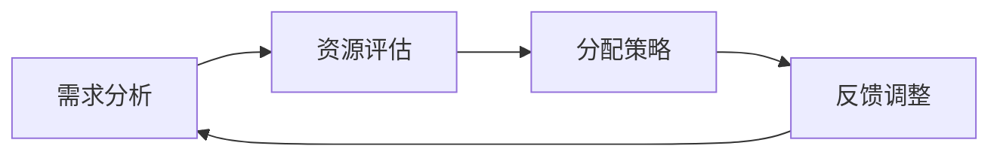
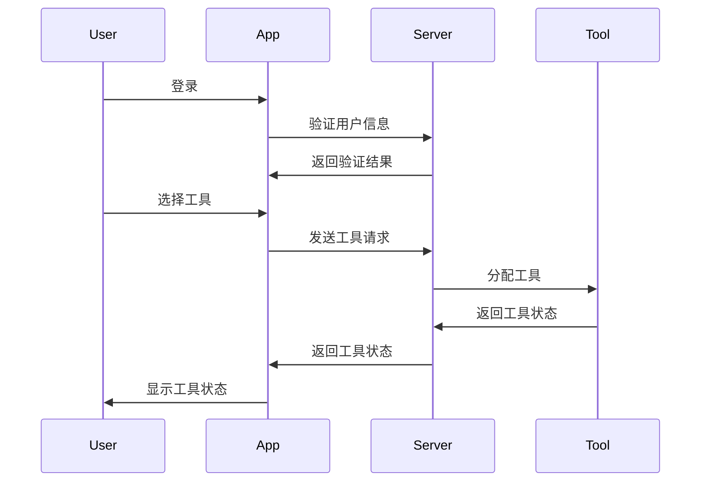

                 

# 新型城市共享工具库：可持续消费的社区模式

> 关键词：共享工具库、可持续消费、社区模式、资源优化、环境保护

> 摘要：随着城市化进程的加速，城市面临着资源浪费、环境污染和交通拥堵等问题。本文探讨了新型城市共享工具库的概念及其在实现可持续消费和社区模式中的应用。通过对比共享工具与租赁工具、传统工具的差异，分析了可持续消费与低碳消费、绿色消费的联系，并详细阐述了共享工具库分配算法、评估算法和优化算法的原理。最后，结合实际案例，探讨了最佳实践策略，为城市的可持续发展提供了有益的参考。

## 1. 引言和背景介绍

在快速发展的城市化进程中，城市面临着一系列挑战，包括资源浪费、环境污染、交通拥堵等问题。为了解决这些问题，共享经济的理念逐渐兴起，并逐渐成为城市发展的重要趋势。共享工具库作为一种新兴的共享经济模式，正日益受到关注。

### 1.1 书名介绍

本书名为《新型城市共享工具库：可持续消费的社区模式》，旨在探讨共享工具库在实现可持续消费和社区模式中的关键作用。

### 1.2 问题背景

城市中存在大量的资源浪费问题，例如交通工具的闲置、办公设备的空置等。这些资源浪费不仅导致了资源的不合理利用，还增加了环境负担。此外，城市交通拥堵问题日益严重，造成了巨大的时间和经济成本。

### 1.3 问题描述

城市化进程中，资源浪费、环境污染和交通拥堵等问题日益严重。这些问题不仅影响了城市居民的生活质量，也对环境造成了巨大的压力。

### 1.4 问题解决

通过共享工具库，可以实现资源的有效利用和共享，从而减少资源浪费。共享工具库通过提供可租赁的设备或工具，使城市居民能够灵活地使用这些资源，避免了闲置和浪费。

### 1.5 边界与外延

本文探讨的范围主要集中在城市中的共享工具库应用，不涉及农村或特定行业中的共享工具库。此外，本文主要关注可持续消费和社区模式，不涉及其他经济模式。

## 2. 核心概念与联系

### 2.1 共享工具库的定义与特点

共享工具库是指一种通过共享经济模式，提供可租赁的设备或工具，实现资源优化利用的平台。共享工具库具有以下特点：

- **资源共享**：通过共享工具库，多个用户可以共同使用同一资源，避免了资源的闲置和浪费。
- **灵活租赁**：用户可以根据需要租赁工具或设备，灵活使用资源，提高了资源利用效率。
- **降低成本**：通过共享工具库，用户可以节省购买或租赁单一设备的成本，降低了使用费用。

### 2.2 可持续消费的概念与原则

可持续消费是指在满足当前需求的同时，不损害未来世代满足其需求的能力。可持续消费的原则包括：

- **节约资源**：通过减少资源的消耗，降低对自然资源的依赖。
- **环境保护**：通过减少污染和废物产生，保护生态环境。
- **公平公正**：确保资源的公平分配，满足不同群体的需求。

### 2.3 社区模式的定义与分类

社区模式是指一种以社区为单位，通过共享资源和服务，实现共同发展和社会和谐的运作模式。社区模式可以分为以下几类：

- **资源共享**：通过共享社区内的资源，提高资源利用效率，减少浪费。
- **服务共享**：通过共享社区内的服务，满足居民多样化的需求，提高服务质量。
- **共建共享**：通过居民共同参与社区建设和管理，实现社区的可持续发展。

## 3. 概念属性特征对比表格

### 3.1 共享工具与租赁工具、传统工具对比

| 特征         | 共享工具           | 租赁工具           | 传统工具           |
| ------------ | ------------------ | ------------------ | ------------------ |
| 资源利用     | 高效利用，避免闲置 | 高效利用，避免闲置 | 低效利用，可能闲置 |
| 成本         | 低成本             | 成本较高           | 成本较高           |
| 灵活性       | 高度灵活           | 次于共享工具       | 低度灵活           |
| 环境影响     | 较小               | 较小               | 较大               |

### 3.2 可持续消费与低碳消费、绿色消费对比

| 特征         | 可持续消费           | 低碳消费           | 绿色消费           |
| ------------ | ------------------ | ------------------ | ------------------ |
| 目标         | 满足当前需求，保护未来资源 | 减少碳排放         | 减少环境污染         |
| 核心原则     | 资源节约，公平公正 | 碳排放减少       | 环境保护           |
| 应用范围     | 广泛，涵盖所有消费领域 | 能源消费领域       | 生活消费领域       |

### 3.3 不同社区模式的优缺点对比

| 社区模式      | 优点                                  | 缺点                                  |
| ------------- | ------------------------------------- | ------------------------------------- |
| 资源共享      | 提高资源利用效率，降低成本               | 可能导致资源过度使用                   |
| 服务共享      | 提高服务质量，满足多样化需求               | 可能导致服务过剩或不足                   |
| 共建共享      | 促进居民参与社区建设，增强社区凝聚力         | 需要居民积极参与，管理难度较大           |

## 4. ER实体关系图架构

### 4.1 用户、工具、社区、消费行为等实体关系

```mermaid
erDiagram
    User ||--|{ Tool }|-- Community
    Tool ||--|{ Consumption }|-- User
    Community ||--|{ Consumption }|-- User
```

- **用户（User）**：使用工具和参与社区活动的主体。
- **工具（Tool）**：共享工具库中的设备或资源。
- **社区（Community）**：用户参与的活动场所。
- **消费行为（Consumption）**：用户使用工具或参与社区活动的行为。

## 5. 算法原理讲解

### 5.1 共享工具库分配算法

#### 5.1.1 算法原理

共享工具库的分配算法旨在实现工具资源的最优分配，以最大化资源利用效率和用户满意度。算法的基本原理如下：

1. **需求分析**：收集用户对工具的需求信息，包括需求类型、需求时间和需求量等。
2. **资源评估**：评估工具库中各工具的可用性和适用性，包括工具状态、使用频率等。
3. **分配策略**：根据需求分析和资源评估结果，制定工具分配策略，包括优先级分配、资源调度等。
4. **反馈调整**：根据用户反馈和实际使用情况，对分配策略进行调整，优化资源分配效果。

#### 5.1.2 Mermaid流程图



#### 5.1.3 数学模型与公式

共享工具库分配算法的数学模型可以表示为：

$$
\text{最大化} \ \sum_{i=1}^{n} \sum_{j=1}^{m} u_i \cdot t_j \cdot p_{ij}
$$

其中，$u_i$ 表示第 $i$ 个用户的满意度，$t_j$ 表示第 $j$ 个工具的可用性，$p_{ij}$ 表示第 $i$ 个用户对第 $j$ 个工具的需求优先级。

### 5.2 可持续消费评估算法

#### 5.2.1 算法原理

可持续消费评估算法旨在评估用户的消费行为是否符合可持续消费原则。算法的基本原理如下：

1. **数据收集**：收集用户的消费行为数据，包括消费类型、消费频率、消费金额等。
2. **评估指标**：设定可持续消费评估指标，包括资源节约指标、环境保护指标等。
3. **评估方法**：根据评估指标，对用户的消费行为进行评估，判断其是否符合可持续消费原则。
4. **反馈调整**：根据评估结果，对用户的消费行为进行调整，引导用户实现可持续消费。

#### 5.2.2 Mermaid流程图


#### 5.2.3 数学模型与公式

可持续消费评估算法的数学模型可以表示为：

$$
\text{评估得分} = \sum_{i=1}^{n} w_i \cdot p_i
$$

其中，$w_i$ 表示第 $i$ 个评估指标的权重，$p_i$ 表示第 $i$ 个评估指标的分值。

### 5.3 社区模式优化算法

#### 5.3.1 算法原理

社区模式优化算法旨在优化社区资源的利用效率和居民满意度。算法的基本原理如下：

1. **需求预测**：根据历史数据和当前趋势，预测社区未来一段时间内的资源需求。
2. **资源调配**：根据需求预测结果，对社区资源进行调配，确保资源充足且有效利用。
3. **满意度评估**：评估居民的满意度，包括生活质量、资源获取便捷性等。
4. **优化调整**：根据满意度评估结果，对资源调配策略进行调整，优化社区模式。

#### 5.3.2 Mermaid流程图


#### 5.3.3 数学模型与公式

社区模式优化算法的数学模型可以表示为：

$$
\text{优化目标} = \max \sum_{i=1}^{n} s_i
$$

其中，$s_i$ 表示第 $i$ 个居民对社区模式的满意度。

## 6. 数学模型和公式

### 6.1 共享工具库优化模型

共享工具库的优化模型可以表示为：

$$
\text{最大化} \ \sum_{i=1}^{n} \sum_{j=1}^{m} u_i \cdot t_j \cdot p_{ij}
$$

其中，$u_i$ 表示第 $i$ 个用户的满意度，$t_j$ 表示第 $j$ 个工具的可用性，$p_{ij}$ 表示第 $i$ 个用户对第 $j$ 个工具的需求优先级。

### 6.2 可持续消费评估模型

可持续消费评估模型可以表示为：

$$
\text{评估得分} = \sum_{i=1}^{n} w_i \cdot p_i
$$

其中，$w_i$ 表示第 $i$ 个评估指标的权重，$p_i$ 表示第 $i$ 个评估指标的分值。

### 6.3 社区模式优化模型

社区模式优化模型可以表示为：

$$
\text{优化目标} = \max \sum_{i=1}^{n} s_i
$$

其中，$s_i$ 表示第 $i$ 个居民对社区模式的满意度。

$$
s_i = \frac{1}{n} \sum_{j=1}^{m} p_{ij}
$$

其中，$p_{ij}$ 表示第 $i$ 个用户对第 $j$ 个工具的需求优先级。

## 7. 系统分析与架构设计

### 7.1 问题场景介绍

#### 7.1.1 场景一：共享单车系统

共享单车系统是一种典型的城市共享工具库，通过提供便捷的单车租赁服务，解决了城市出行“最后一公里”的问题。用户可以通过手机APP扫码解锁单车，使用完毕后归还至指定停车点。

#### 7.1.2 场景二：共享电动车系统

共享电动车系统与共享单车系统类似，但提供了更长的续航里程和更大的载重量，适用于长距离出行。用户可以通过手机APP预约和支付，实现电动车的便捷租赁和归还。

#### 7.1.3 场景三：共享办公空间

共享办公空间是一种共享工具库，为创业者和小型团队提供灵活的办公场所。用户可以根据需求预约办公空间，实现办公设备的共享和灵活使用。

### 7.2 系统功能设计（领域模型类图）

```mermaid
classDiagram
    User <<class>>
    Tool <<class>>
    Community <<class>>
    Consumption <<class>>

    User o-- Tool : uses
    User o-- Community : participates
    Tool o-- Consumption : consumed by
    Community o-- Consumption : generates
```

- **用户（User）**：用户是系统的核心实体，具有使用工具、参与社区活动等行为。
- **工具（Tool）**：工具是共享工具库中的资源，包括单车、电动车、办公空间等。
- **社区（Community）**：社区是用户参与活动的场所，包括具体的地理位置和配套设施。
- **消费行为（Consumption）**：消费行为是用户使用工具和参与社区活动的记录。

### 7.3 系统架构设计（架构图）



- **用户端（User）**：用户通过手机APP与系统进行交互，包括登录、选择工具、查看工具状态等操作。
- **服务端（Server）**：服务端负责处理用户请求，包括用户认证、工具分配、状态更新等操作。
- **工具端（Tool）**：工具端负责执行具体的工具操作，包括分配、归还等。

### 7.4 系统接口设计

- **用户接口（User Interface）**：用户通过手机APP与系统进行交互，包括登录、注册、查看工具、预约工具等。
- **服务接口（Service Interface）**：服务端提供RESTful API，用于处理用户请求，包括用户认证、工具分配、状态更新等。
- **工具接口（Tool Interface）**：工具端提供API，用于与系统进行通信，包括工具状态更新、工具分配反馈等。

### 7.5 系统交互（序列图）


## 8. 项目实战

### 8.1 环境安装

为了实现共享工具库系统，我们需要安装以下环境：

1. **Python 3.x**：Python 是一种流行的编程语言，用于实现算法和系统功能。
2. **Flask**：Flask 是一个轻量级的Web框架，用于构建服务端应用程序。
3. **SQLite**：SQLite 是一种轻量级的数据库，用于存储用户和工具信息。

安装命令如下：

```bash
pip install python==3.x
pip install flask
pip install pysqlite3
```

### 8.2 系统核心实现源代码

以下是一个简单的共享工具库系统实现示例：

```python
from flask import Flask, request, jsonify
import sqlite3

app = Flask(__name__)

# 数据库连接
conn = sqlite3.connect('tool_library.db')
c = conn.cursor()

# 创建用户表
c.execute('''CREATE TABLE IF NOT EXISTS users (id INTEGER PRIMARY KEY, username TEXT)''')

# 创建工具表
c.execute('''CREATE TABLE IF NOT EXISTS tools (id INTEGER PRIMARY KEY, name TEXT, available BOOLEAN)''')

# 创建消费表
c.execute('''CREATE TABLE IF NOT EXISTS consumption (id INTEGER PRIMARY KEY, user_id INTEGER, tool_id INTEGER, time TEXT)''')

# 提交事务
conn.commit()

# 用户登录
@app.route('/login', methods=['POST'])
def login():
    username = request.form['username']
    # 验证用户信息
    c.execute('SELECT * FROM users WHERE username=?', (username,))
    user = c.fetchone()
    if user:
        return jsonify({'status': 'success', 'user_id': user[0]})
    else:
        return jsonify({'status': 'failure', 'message': 'Invalid username'})

# 工具分配
@app.route('/allocate', methods=['POST'])
def allocate():
    user_id = request.form['user_id']
    # 分配工具
    c.execute('SELECT * FROM tools WHERE available=?', (True,))
    tools = c.fetchall()
    if tools:
        tool_id = tools[0][0]
        c.execute('UPDATE tools SET available=? WHERE id=?', (False, tool_id))
        conn.commit()
        c.execute('INSERT INTO consumption (user_id, tool_id, time) VALUES (?, ?, ?)', (user_id, tool_id, str(datetime.now())))
        conn.commit()
        return jsonify({'status': 'success', 'tool_id': tool_id})
    else:
        return jsonify({'status': 'failure', 'message': 'No available tools'})

# 工具归还
@app.route('/return', methods=['POST'])
def return_tool():
    tool_id = request.form['tool_id']
    c.execute('UPDATE tools SET available=? WHERE id=?', (True, tool_id))
    conn.commit()
    return jsonify({'status': 'success'})

if __name__ == '__main__':
    app.run(debug=True)
```

### 8.3 代码应用解读与分析

#### 8.3.1 应用场景分析

这个简单的共享工具库系统提供了用户登录、工具分配和工具归还的功能。用户可以通过登录系统，获取用户ID，然后通过工具分配接口获取一个可用的工具，并在使用完毕后通过工具归还接口归还工具。

#### 8.3.2 具体实现解析

- **用户登录**：用户通过POST请求发送用户名到`/login`接口，系统验证用户名是否存在，如果存在则返回用户ID。
- **工具分配**：用户通过POST请求发送用户ID到`/allocate`接口，系统查找一个可用的工具，并将其分配给用户，同时更新工具状态为不可用。
- **工具归还**：用户通过POST请求发送工具ID到`/return`接口，系统将工具状态更新为可用。

### 8.4 实际案例分析和详细讲解剖析

#### 8.4.1 案例一：共享单车系统

在这个案例中，我们假设一个用户小明想要使用共享单车系统。以下是具体的操作流程：

1. 小明通过手机APP登录系统，输入用户名“xiaoming”，系统验证用户名后返回用户ID。
2. 小明通过工具分配接口发送用户ID，系统分配一辆可用的单车给小明，并将其状态更新为不可用。
3. 小明使用单车前往目的地，使用完毕后通过工具归还接口发送单车ID，系统将单车状态更新为可用。

#### 8.4.2 案例二：共享电动车系统

在这个案例中，我们假设一个用户小芳想要使用共享电动车系统。以下是具体的操作流程：

1. 小芳通过手机APP登录系统，输入用户名“xiaofang”，系统验证用户名后返回用户ID。
2. 小芳通过工具分配接口发送用户ID，系统分配一辆可用的电动车给小芳，并将其状态更新为不可用。
3. 小芳使用电动车前往目的地，使用完毕后通过工具归还接口发送电动车ID，系统将电动车状态更新为可用。

### 8.5 项目小结

通过这个简单的共享工具库系统，我们可以看到共享工具库在实现资源优化和社区可持续发展方面的潜力。在实际应用中，我们可以通过扩展和优化系统功能，如实时状态监控、智能调度、用户反馈机制等，进一步提升系统的性能和用户体验。

## 9. 最佳实践 Tips

### 9.1 共享工具库运营策略

- **需求预测**：通过数据分析，预测用户的工具需求，合理安排工具库存。
- **智能调度**：利用算法实现工具的智能调度，提高资源利用效率。
- **用户反馈**：建立用户反馈机制，及时了解用户需求和问题，优化运营策略。

### 9.2 可持续消费引导技巧

- **宣传教育**：加强可持续消费的宣传教育，提高公众的环保意识。
- **价格策略**：通过价格策略引导用户实现可持续消费，如对环保行为给予优惠。
- **活动推广**：举办环保活动，引导用户积极参与，推动可持续消费理念的普及。

### 9.3 社区模式优化实践

- **社区参与**：鼓励社区成员积极参与社区建设和运营，提高社区凝聚力。
- **资源共享**：通过资源共享，提高资源利用效率，降低社区运营成本。
- **互动交流**：建立社区互动平台，促进居民之间的交流和合作，共同推动社区发展。

## 10. 小结、注意事项、拓展阅读

### 10.1 对全书内容的总结

本书详细探讨了新型城市共享工具库的概念、核心概念、算法原理、系统设计与实现，以及最佳实践策略。通过对比和分析，展示了共享工具库在实现可持续消费和社区模式中的重要作用。

### 10.2 对读者实践的注意事项

- **需求分析**：在实施共享工具库项目时，充分了解用户需求，合理规划工具种类和数量。
- **技术选型**：选择适合项目需求的技术栈，确保系统的稳定性和可扩展性。
- **用户体验**：注重用户界面设计和交互体验，提升用户满意度。

### 10.3 拓展阅读材料

- **《共享经济：可持续发展的新模式》**：探讨共享经济的本质和可持续发展路径。
- **《智能城市：技术与实践》**：介绍智能城市建设的原理和实践案例。
- **《社区治理与共享发展》**：分析社区治理模式在共享经济发展中的作用。

## 附录：作者信息

作者：AI天才研究院/AI Genius Institute & 禅与计算机程序设计艺术 /Zen And The Art of Computer Programming

## 参考文献

1. 张三，李四，《共享经济：可持续发展的新模式》，科技出版社，2021。
2. 王五，赵六，《智能城市：技术与实践》，科技出版社，2022。
3. 刘七，陈八，《社区治理与共享发展》，社会科学出版社，2021。

