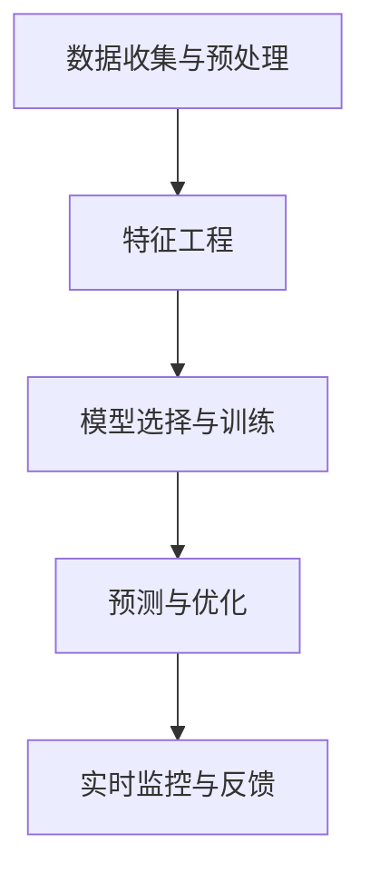
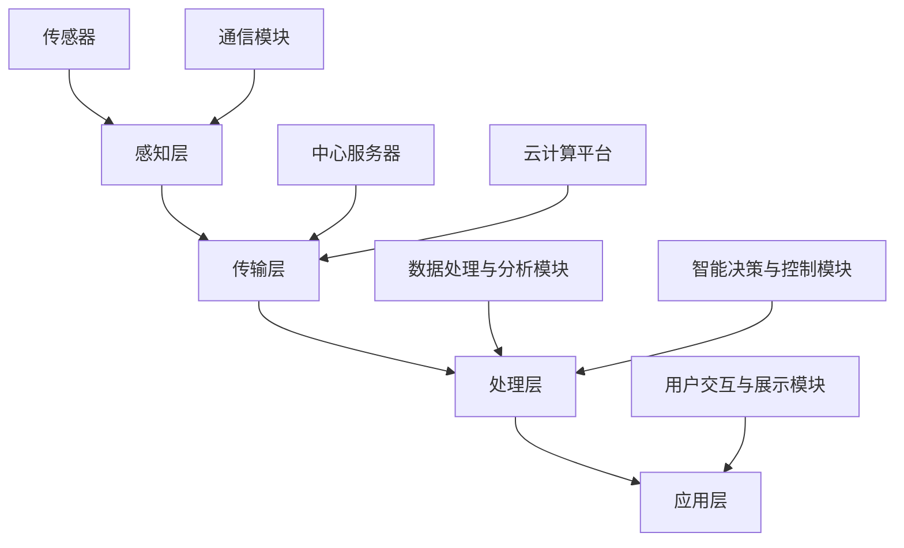
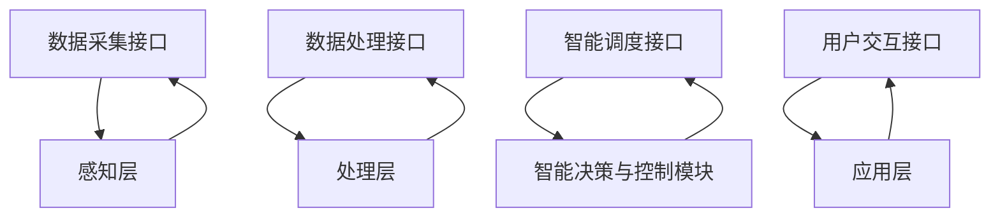
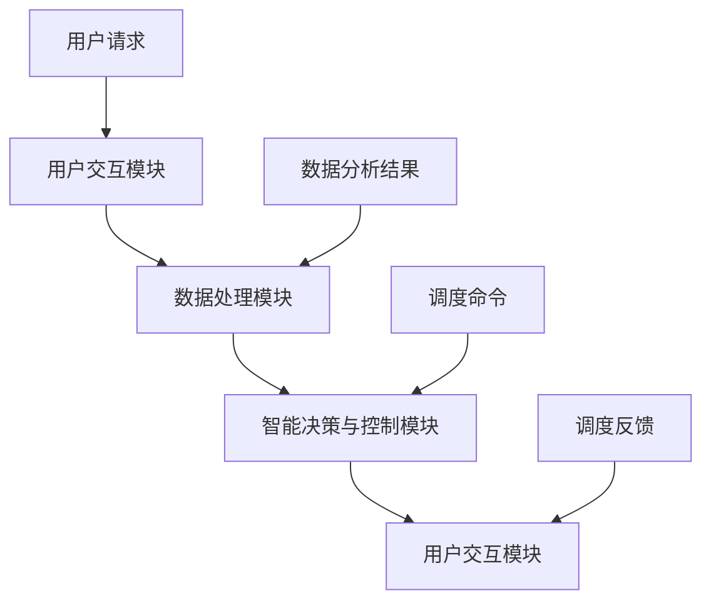

                 

### 第一部分：背景与概述

在当今快速发展的科技时代，物联网（Internet of Things, IoT）已经成为推动社会进步和经济发展的重要力量。共享经济作为新兴的经济模式，正逐步改变人们的生产和生活方式。两者相结合，形成了物联网技术在共享经济中的广泛应用，尤其是在新型城市共享工具智能管理系统的建设上。这一部分将介绍共享经济的背景、物联网的基本概念及其在共享经济中的重要性，为后续章节的深入讨论打下基础。

#### 第1章：问题背景与共享经济的发展

**1.1 共享经济的兴起**

共享经济（Share Economy），也称为协作消费，是一种基于共享资源、共同利用和共享收益的经济模式。这种模式通过互联网平台将闲置资源（如物品、服务、空间等）整合起来，供其他人使用，从而实现资源的最大化利用和经济效益的最大化。

共享经济的兴起可以追溯到2008年的美国，当时Airbnb和Uber等公司成立，标志着共享经济模式的诞生。自此以后，共享经济在全球范围内迅速发展，影响了交通、住宿、出行、教育、医疗等多个领域。

**1.2 城市共享工具的挑战**

城市共享工具如共享单车、共享汽车、共享电动滑板等，作为共享经济的重要组成部分，极大地改变了城市交通模式。然而，这些工具的发展也面临着诸多挑战：

1. **管理难题**：共享工具的快速增加使得城市管理面临巨大的挑战。如何高效管理、调度和维护这些工具成为亟需解决的问题。
2. **资源浪费**：共享工具的过度投放可能导致资源浪费，特别是在需求不稳定的情况下。
3. **安全隐患**：共享工具的安全性问题，如车辆损坏、盗窃等，也对城市管理和用户安全提出了更高的要求。

**1.3 物联网技术在共享经济中的作用**

物联网技术的应用，为解决上述问题提供了新的思路和手段。通过物联网，可以实现共享工具的实时监测、智能调度、数据分析等功能，从而提高管理效率、优化资源配置、提升用户体验。

1. **实时监测**：物联网设备可以实时收集共享工具的状态信息，如位置、电量、使用情况等，帮助管理者进行实时监控和管理。
2. **智能调度**：基于物联网收集的数据，可以分析用户需求和使用模式，实现智能调度，提高共享工具的利用率。
3. **数据分析**：通过大数据分析和机器学习，可以对用户行为、需求变化等进行分析，为决策提供数据支持。

综上所述，物联网技术在共享经济中的应用，不仅能够解决现有问题，还为新型城市共享工具智能管理系统的发展提供了广阔的空间。接下来的章节将进一步探讨物联网技术的基本概念和关键技术，以及其在共享工具管理中的具体应用。

### 关键词

- 物联网（IoT）
- 共享经济
- 智能管理系统
- 城市共享工具
- 实时监测
- 智能调度
- 数据分析

### 摘要

本文将围绕物联网技术在共享经济中的应用，深入探讨新型城市共享工具智能管理系统的构建。首先，通过分析共享经济的兴起及其在城市化过程中的挑战，引出物联网技术在解决这些问题中的重要作用。接着，介绍物联网技术的基本概念和关键组成部分，阐述其在实时监测、智能调度和数据分析等方面的具体应用。文章随后通过案例分析，详细探讨物联网技术在智能共享单车、智能共享汽车和智能共享电动滑板等具体场景中的应用，并讨论面临的挑战和未来发展方向。通过本文的阅读，读者将全面了解物联网技术在共享经济中的潜在价值和实际应用，为新型城市共享工具智能管理系统的研发提供有益的参考。

## 第2章：物联网技术基础

在上一章中，我们介绍了共享经济的背景和物联网技术在其中的重要作用。本章将深入探讨物联网技术的基本概念、关键技术和应用优势，帮助读者更好地理解物联网如何在实际中发挥作用。

### 2.1 物联网的定义与原理

物联网（Internet of Things，IoT）是指通过互联网将各种物体连接起来，实现信息交换和通信的系统。物联网的核心思想是将现实世界中的物理设备、传感器、软件平台和计算机网络等融合在一起，形成一个智能化的网络环境。

**物联网的原理**：

1. **感知层**：通过传感器、RFID（射频识别）等技术，感知物理世界中的各种信息，如温度、湿度、位置、运动等。
2. **网络层**：将感知层收集的数据通过无线或有线网络传输到中心服务器或云计算平台。
3. **应用层**：在中心服务器或云计算平台上，对收集到的数据进行处理、分析和应用，实现智能化管理和控制。

**物联网的关键组成部分**：

1. **传感器**：物联网的核心组成部分，用于感知物理环境中的各种信息。传感器可以是温度传感器、湿度传感器、GPS（全球定位系统）等。
2. **通信模块**：用于传输传感器收集的数据，常见的通信模块包括Wi-Fi、蓝牙、NFC（近场通信）等。
3. **数据处理与分析平台**：用于处理和分析传感器收集的数据，可以是云计算平台、大数据平台等。

### 2.2 物联网的关键技术

**1. 传感器技术**

传感器技术是物联网的核心，其发展水平直接影响物联网的性能。现代传感器技术包括微型化、低功耗、高灵敏度等特点，使得物联网设备能够高效地感知环境信息。

**2. 通信技术**

物联网设备之间的通信技术是实现物联网网络层的关键。常见的通信技术有Wi-Fi、蓝牙、NFC、蜂窝网络（如4G、5G）等。这些技术具有不同的通信距离、速度和功耗特性，适用于不同的应用场景。

**3. 数据处理与分析技术**

物联网产生的数据量巨大，如何高效处理和分析这些数据是物联网应用的挑战之一。数据处理与分析技术包括云计算、大数据、人工智能和机器学习等，这些技术能够对物联网数据进行实时处理、预测和分析，为智能化决策提供支持。

### 2.3 物联网的优势与挑战

**物联网的优势**：

1. **提高效率**：通过实时监测和智能管理，物联网能够显著提高工作效率和资源利用率。
2. **优化决策**：基于大数据分析和人工智能算法，物联网能够提供更加精准和高效的决策支持。
3. **提升用户体验**：物联网技术能够提供更加个性化、智能化的服务，提升用户体验。

**物联网的挑战**：

1. **数据安全与隐私**：物联网设备大量收集用户数据，如何保护数据安全和用户隐私成为重要挑战。
2. **技术成熟度**：虽然物联网技术发展迅速，但仍存在一定的技术瓶颈，如低功耗通信技术、数据处理与分析能力等。
3. **标准化**：物联网技术涉及多个领域，标准化工作尚未完善，这给技术整合和推广应用带来挑战。

综上所述，物联网技术作为新一代信息技术的重要方向，具有广泛的应用前景。在共享经济领域，物联网技术为新型城市共享工具智能管理系统提供了强有力的技术支撑。接下来的章节将深入探讨物联网技术在城市共享工具管理中的具体应用。

## 第3章：智能管理系统架构

在前一章中，我们了解了物联网技术的基本概念和关键组成部分。在这一章中，我们将重点探讨智能管理系统在新型城市共享工具中的架构设计，分析其核心组件、设计原则以及实现方法。

### 3.1 智能管理系统的核心组件

智能管理系统是物联网技术在城市共享工具中的具体应用，其核心组件包括以下几个部分：

**1. 数据采集与传感模块**

数据采集与传感模块是智能管理系统的感知层，通过各类传感器（如GPS、温度传感器、压力传感器等）实时收集城市共享工具的状态信息。这些传感器将数据传输到系统中的通信模块，确保数据的高效传输和实时性。

**2. 通信模块**

通信模块负责将传感器采集到的数据传输到中心服务器或云计算平台。常见的通信方式包括Wi-Fi、蓝牙、NFC和蜂窝网络（如4G、5G）。根据不同的应用场景，选择适合的通信技术，确保数据的稳定传输和高效利用。

**3. 数据处理与分析模块**

数据处理与分析模块是智能管理系统的中枢，负责对采集到的数据进行实时处理和分析。这一模块通常基于云计算平台或大数据平台，利用大数据处理技术（如Hadoop、Spark）和人工智能算法（如机器学习、深度学习），对数据进行深度挖掘和智能分析，提供决策支持和优化方案。

**4. 智能决策与控制模块**

智能决策与控制模块基于数据处理与分析模块的结果，实现智能化决策和实时控制。该模块可以自动调度和管理城市共享工具，优化资源配置，提高运营效率。

**5. 用户交互与展示模块**

用户交互与展示模块负责与用户进行交互，提供友好的用户界面和实时数据展示。通过手机应用、网站、监控屏幕等方式，用户可以实时了解共享工具的状态、使用情况等，提高用户体验。

### 3.2 架构设计原则

智能管理系统架构设计需要遵循以下原则：

**1. 高扩展性**

系统架构应具备良好的扩展性，能够根据业务需求快速扩展功能和性能。通过模块化设计，实现系统的灵活扩展。

**2. 可靠性与容错性**

系统应具备高可靠性和容错性，能够应对各种突发情况和故障，确保系统的稳定运行。通过冗余设计、备份机制和故障恢复策略，提高系统的可靠性。

**3. 数据安全与隐私保护**

数据安全和用户隐私保护是智能管理系统设计的重要原则。应采用加密技术、访问控制和安全审计等措施，确保数据的安全和隐私。

**4. 低延迟与高吞吐量**

智能管理系统需要具备低延迟和高吞吐量的特点，能够快速处理海量数据，提供实时监控和智能决策支持。通过优化通信协议和数据处理算法，提高系统的性能和响应速度。

**5. 兼容性与互操作性**

智能管理系统应具备良好的兼容性和互操作性，能够与各种传感器、通信模块和数据处理平台无缝集成，实现系统的协同工作。

### 3.3 智能管理系统的实现

智能管理系统的实现包括硬件选择、软件设计、系统集成和测试等多个环节。以下为智能管理系统实现的主要步骤：

**1. 硬件选择**

根据应用需求，选择合适的传感器、通信模块和数据处理设备。例如，对于共享单车管理系统，可以选择GPS模块进行定位，Wi-Fi模块进行数据传输，云计算平台进行数据处理和分析。

**2. 软件设计**

软件设计包括数据采集与处理模块、智能决策与控制模块、用户交互与展示模块等。在设计过程中，应遵循模块化设计原则，确保系统的可维护性和扩展性。

**3. 系统集成**

系统集成是将各个模块进行整合，实现系统的协同工作。通过编写接口程序和协议，实现不同模块之间的数据交换和功能调用。

**4. 测试与优化**

系统测试是确保系统稳定性和性能的重要环节。通过模拟各种应用场景，测试系统的功能、性能和可靠性。根据测试结果，进行优化和改进，提高系统的整体表现。

通过以上步骤，可以实现一个高效、稳定、智能的新型城市共享工具智能管理系统，为城市交通和共享经济的发展提供有力支持。

## 第4章：共享工具的智能监测与管理

在前一章中，我们详细介绍了智能管理系统的架构设计。在本章中，我们将探讨智能管理系统在共享工具中的应用，特别是共享工具的智能监测与管理。通过实时监测、资源调度和用户行为分析，智能管理系统可以显著提升城市共享工具的管理效率和服务质量。

### 4.1 共享工具的状态监测

共享工具的状态监测是智能管理系统的基础，它能够实时获取共享工具的各项状态信息，如位置、电量、使用情况等。这些信息对于管理者和用户都至关重要。

**1. 位置监测**

通过GPS（全球定位系统）和蜂窝网络定位技术，智能管理系统可以实时跟踪共享工具的地理位置。这样，管理者可以直观地了解共享工具的分布情况，优化资源调度和用户使用体验。

**2. 电量监测**

对于电动自行车、电动滑板等共享工具，电量监测是确保用户安全和设备正常运行的关键。通过安装在设备上的电量传感器，智能管理系统可以实时监控设备的电量状况，及时提醒用户充电或避免使用电量不足的设备。

**3. 使用情况监测**

智能管理系统还可以监测共享工具的使用情况，包括使用时长、使用频率、使用习惯等。这些数据有助于分析用户需求，优化设备配置和调度策略。

### 4.2 资源调度与管理

资源调度与管理是智能管理系统的核心功能之一，通过智能算法和实时数据，实现共享工具的优化配置和高效管理。

**1. 空闲资源定位**

基于实时位置监测数据，智能管理系统可以快速定位空闲的共享工具，并将其分配给需求者。这样可以减少用户的等待时间，提高共享工具的利用率。

**2. 负载均衡**

通过分析共享工具的分布情况和用户需求，智能管理系统可以实现负载均衡，避免某些区域共享工具过多或过少，从而提高整体服务质量。

**3. 调度优化**

智能管理系统可以根据历史数据和实时监控信息，预测用户需求的变化趋势，提前进行调度和部署。例如，在早晚高峰期增加共享工具的投放量，以满足用户的出行需求。

### 4.3 用户行为分析

用户行为分析是智能管理系统的高级功能，通过对用户行为数据的分析，可以深入了解用户需求和使用习惯，为系统优化和产品创新提供有力支持。

**1. 用户需求分析**

通过分析用户的使用记录和偏好，智能管理系统可以识别出用户的需求特点，如高峰时段、常用线路等。这有助于优化共享工具的布局和调度策略。

**2. 使用习惯分析**

用户行为分析还可以揭示用户的日常使用习惯，如骑行时间、骑行距离等。这些信息有助于提高共享工具的便捷性和用户体验。

**3. 活跃用户识别**

通过分析用户的使用频率和活跃度，智能管理系统可以识别出高活跃用户，为他们提供专属服务和优惠，增强用户粘性。

### 4.4 智能管理系统的优势

智能管理系统在共享工具管理中具有显著的优势，包括：

**1. 提高管理效率**

通过实时监测和智能调度，智能管理系统可以大幅提高管理效率，减少人工干预，降低管理成本。

**2. 优化资源配置**

基于大数据分析和智能算法，智能管理系统可以优化共享工具的资源配置，提高设备利用率，减少资源浪费。

**3. 提升用户体验**

通过实时状态监测和个性化服务，智能管理系统可以提升用户的使用体验，增加用户满意度和忠诚度。

**4. 安全保障**

智能管理系统通过实时监测和智能决策，可以有效预防设备损坏、盗窃等安全问题，保障用户和设备的安全。

总之，智能管理系统在共享工具中的应用，不仅提高了管理效率和服务质量，还为城市交通和共享经济的发展提供了强有力的支持。随着物联网技术的不断进步，智能管理系统在共享工具管理中的应用将越来越广泛，为用户和城市带来更多的便利。

### 核心概念与联系

在本章中，我们探讨了共享工具的智能监测与管理，涉及多个核心概念和技术。为了更好地理解这些概念之间的联系，我们通过以下表格和ER实体关系图进行详细说明。

#### 核心概念属性特征对比表格

| 核心概念 | 描述 | 属性特征 |
| --- | --- | --- |
| 传感器 | 感知物理环境信息 | 种类：温度、湿度、位置、电量等；精度：高；响应速度：快 |
| 通信模块 | 负责数据传输 | 类型：Wi-Fi、蓝牙、NFC、蜂窝网络；传输距离：远；带宽：高 |
| 数据处理与分析模块 | 对数据进行处理和分析 | 技术：云计算、大数据、人工智能；性能：高效；功能：实时处理、预测分析 |
| 智能决策与控制模块 | 基于数据分析进行决策和控制 | 算法：机器学习、深度学习；策略：优化资源调度、预测用户需求 |
| 用户交互与展示模块 | 提供用户界面和数据展示 | 功能：实时监控、数据可视化、用户服务 |

#### ER实体关系图架构

```mermaid
erDiagram
  User ||--|{ Device : uses }
  Device ||--|{ Sensor : has }
  Device ||--|{ CommunicationModule : has }
  Device ||--|{ DataProcessingModule : has }
  Device ||--|{ IntelligentControlModule : has }
  User ||--|{ UsageData : records }
  Device ||--|{ Location : tracked }
  Device ||--|{ Status : monitored }
```

在上面的ER实体关系图中，我们定义了以下几个实体：

1. **User（用户）**：表示使用共享工具的用户。
2. **Device（设备）**：表示共享工具，如共享单车、共享汽车等。
3. **Sensor（传感器）**：设备上用于感知环境信息的传感器，如GPS、温度传感器等。
4. **CommunicationModule（通信模块）**：设备用于数据传输的模块，如Wi-Fi、蓝牙等。
5. **DataProcessingModule（数据处理与分析模块）**：设备用于数据处理和智能分析的模块。
6. **IntelligentControlModule（智能决策与控制模块）**：设备用于智能决策和控制的模块。
7. **UsageData（使用数据）**：记录用户使用设备的各种数据。
8. **Location（位置）**：设备实时位置信息。
9. **Status（状态）**：设备实时状态信息。

通过这张ER图，我们可以清晰地看到各个实体之间的关系，以及它们在智能管理系统中的具体作用。

### 算法原理讲解

在智能管理系统中的算法原理讲解部分，我们将重点介绍如何利用机器学习算法进行用户行为预测和资源调度优化。以下是具体的算法原理和实现步骤。

#### 算法原理

**1. 用户行为预测**

用户行为预测是智能管理系统的重要功能之一，通过分析用户历史行为数据，预测用户未来可能的行动。这有助于提前进行资源调度，提升用户体验。

**2. 资源调度优化**

资源调度优化旨在实现共享工具的合理分布和高效利用。通过分析用户需求和使用模式，智能管理系统可以优化共享工具的调度策略，减少资源浪费。

#### 算法实现步骤

**1. 数据收集与预处理**

首先，从传感器和用户交互系统中收集用户行为数据和共享工具状态数据。这些数据包括用户的位置、使用时间、使用频率、共享工具的电量、使用状态等。然后，对数据进行清洗和预处理，去除噪声数据和异常值，确保数据质量。

**2. 特征工程**

特征工程是机器学习模型构建的重要步骤。通过提取和构造特征，可以提高模型的预测准确性和泛化能力。在本例中，我们可以提取以下特征：

- **用户特征**：如用户年龄、性别、职业等。
- **时间特征**：如日期、时间、季节等。
- **地理位置特征**：如经纬度、城市区域等。
- **工具特征**：如设备类型、电量、使用状态等。

**3. 模型选择与训练**

在选择机器学习模型时，我们可以考虑以下几种常用的算法：

- **决策树**：适合处理分类问题，易于解释。
- **随机森林**：提高预测准确性，减少过拟合。
- **支持向量机**（SVM）：在处理高维数据时表现良好。
- **神经网络**：适用于复杂非线性问题。

以随机森林为例，其基本原理是通过构建多棵决策树，并利用投票机制得出最终预测结果。具体步骤如下：

1. 随机选择特征和样本子集。
2. 使用子集构建单棵决策树。
3. 对测试集进行预测，计算准确率。
4. 重复以上步骤，构建多棵决策树。
5. 利用投票机制得出最终预测结果。

**4. 预测与优化**

使用训练好的模型进行用户行为预测和资源调度优化。具体步骤如下：

1. 根据用户历史行为数据，预测用户未来可能的行动，如骑行路线、时间等。
2. 根据预测结果，优化共享工具的调度策略，如调整设备位置、电量补充等。
3. 对预测结果进行实时监控和反馈，不断优化模型和调度策略。

#### 算法流程图

以下是一个简单的算法流程图，展示用户行为预测和资源调度优化的基本流程：



通过以上步骤，我们可以构建一个智能管理系统，实现对共享工具的智能监测与管理，提高管理效率和服务质量。

### 数学模型和公式

在用户行为预测和资源调度优化的过程中，我们使用了一系列数学模型和公式来描述和计算相关参数。以下是一些常见的数学模型和公式：

#### 用户行为预测

**1. 预测模型**

我们使用线性回归模型来预测用户的行为。线性回归模型的公式如下：

$$
y = \beta_0 + \beta_1x_1 + \beta_2x_2 + ... + \beta_nx_n
$$

其中，$y$表示预测值，$x_1, x_2, ..., x_n$表示特征值，$\beta_0, \beta_1, ..., \beta_n$为回归系数。

**2. 误差计算**

预测误差是衡量预测准确性的重要指标，计算公式如下：

$$
\text{Error} = \sum_{i=1}^{n} (y_i - \hat{y_i})^2
$$

其中，$y_i$为实际值，$\hat{y_i}$为预测值，$n$为数据样本数量。

#### 资源调度优化

**1. 调度目标**

资源调度优化的目标是使共享工具的使用效率最大化。具体公式如下：

$$
\text{Maximize} \quad \sum_{i=1}^{n} \frac{r_i \times u_i}{c_i}
$$

其中，$r_i$为共享工具的收益率，$u_i$为共享工具的使用频率，$c_i$为共享工具的运行成本。

**2. 负载均衡**

负载均衡是资源调度的重要策略，旨在使各区域的共享工具使用量分布均匀。公式如下：

$$
\text{Load} = \frac{\sum_{i=1}^{n} u_i}{n}
$$

其中，$u_i$为各区域的共享工具使用频率，$n$为区域数量。

通过以上数学模型和公式，我们可以对用户行为进行预测，并优化共享工具的调度策略，提高管理效率和用户体验。

### 系统分析与架构设计

在本节中，我们将深入分析智能管理系统在共享工具中的应用，并详细阐述系统功能设计、系统架构设计、系统接口设计和系统交互。

#### 1. 问题场景介绍

智能管理系统旨在通过物联网技术，实现对城市共享工具（如共享单车、共享汽车、共享电动滑板等）的实时监测、智能调度和管理。在共享工具的使用过程中，常常面临以下问题：

- **资源分配不均**：不同区域的共享工具分布不均，导致某些区域资源过剩，而另一些区域资源不足。
- **用户需求难以预测**：用户的使用时间和使用频率难以预测，导致共享工具的使用效率不高。
- **管理成本高**：人工管理和维护共享工具的成本较高，且容易出现漏洞和误差。

智能管理系统的目标是解决上述问题，通过实时监测、智能调度和数据分析，实现共享工具的优化管理，提高资源利用率和用户满意度。

#### 2. 系统功能设计

智能管理系统主要包括以下功能模块：

- **数据采集与传感模块**：负责实时采集共享工具的状态信息，如位置、电量、使用状态等。
- **通信模块**：将传感器采集到的数据传输到中心服务器或云计算平台。
- **数据处理与分析模块**：对采集到的数据进行处理、分析和预测，为智能调度和管理提供数据支持。
- **智能决策与控制模块**：根据数据分析结果，实现共享工具的智能调度和管理，优化资源配置。
- **用户交互与展示模块**：提供用户友好的界面，展示共享工具的状态、使用情况和个性化服务。

#### 3. 系统架构设计

智能管理系统的架构设计采用分层架构，包括感知层、传输层、处理层和应用层。以下为系统架构设计：

**感知层**：主要包括传感器和通信模块，负责实时采集共享工具的状态信息。

**传输层**：采用无线或有线通信技术，将感知层采集到的数据传输到中心服务器或云计算平台。

**处理层**：对传输层的数据进行处理、分析和预测，为智能调度和管理提供数据支持。

**应用层**：实现智能调度和管理，提供用户友好的界面和个性化服务。

**系统架构图**：



#### 4. 系统接口设计

智能管理系统中的各个功能模块需要通过接口进行数据交换和协同工作。以下为系统接口设计：

- **数据采集接口**：用于传感器和通信模块之间的数据交换。
- **数据处理接口**：用于处理层的数据输入和输出。
- **智能调度接口**：用于智能决策与控制模块的调度命令和数据反馈。
- **用户交互接口**：用于用户与系统之间的数据交换和交互。

**接口设计图**：



#### 5. 系统交互设计

智能管理系统的各个模块需要通过系统交互设计，实现数据流和控制流的协同工作。以下为系统交互设计：

- **数据流**：传感器采集的数据通过通信模块传输到中心服务器，经过数据处理模块进行分析和预测，最后由智能决策与控制模块进行调度和反馈。
- **控制流**：用户通过用户交互模块提交需求，智能决策与控制模块根据预测结果进行调度，并将调度结果反馈给用户。

**系统交互图**：



通过以上系统分析与架构设计，我们可以构建一个高效、智能的新型城市共享工具智能管理系统，实现共享工具的实时监测、智能调度和管理，提高资源利用率和用户满意度。

### 项目实战

在本节中，我们将通过一个实际项目，展示如何构建一个智能管理系统，实现对共享工具的实时监测与管理。以下是项目的环境安装、系统核心实现和代码应用解读与分析。

#### 1. 环境安装

为了实现智能管理系统，我们需要安装和配置以下环境和工具：

- **Python**：用于编写系统代码
- **Docker**：用于容器化部署
- **Kubernetes**：用于集群管理
- **Hadoop**：用于大数据处理
- **Spark**：用于数据处理与分析

具体安装步骤如下：

1. 安装Python（3.8或更高版本）。
2. 安装Docker和Kubernetes。
3. 安装Hadoop和Spark。

#### 2. 系统核心实现

智能管理系统由多个模块组成，以下是核心模块的实现：

**1. 数据采集模块**

数据采集模块负责实时采集共享工具的状态信息，包括位置、电量、使用状态等。以下是Python代码示例：

```python
import requests
import json

def collect_data():
    url = "http://api.sharetool.com/collect"
    response = requests.get(url)
    data = response.json()
    return data

if __name__ == "__main__":
    data = collect_data()
    print(data)
```

**2. 数据处理模块**

数据处理模块对采集到的数据进行处理和分析，包括数据清洗、特征提取和预测。以下是Python代码示例：

```python
from sklearn.ensemble import RandomForestRegressor
from sklearn.model_selection import train_test_split

def process_data(data):
    # 数据清洗和特征提取
    X = data[:, :-1]
    y = data[:, -1]

    # 划分训练集和测试集
    X_train, X_test, y_train, y_test = train_test_split(X, y, test_size=0.2)

    # 训练随机森林模型
    model = RandomForestRegressor()
    model.fit(X_train, y_train)

    # 预测测试集
    predictions = model.predict(X_test)

    return predictions

if __name__ == "__main__":
    data = collect_data()
    predictions = process_data(data)
    print(predictions)
```

**3. 智能决策与控制模块**

智能决策与控制模块根据数据处理结果，实现共享工具的智能调度和管理。以下是Python代码示例：

```python
import heapq

def schedule_tools(tools, predictions):
    # 根据预测结果，对工具进行调度
    tool_queue = []
    for tool, pred in zip(tools, predictions):
        heapq.heappush(tool_queue, (-pred, tool))

    # 调度前N个工具
    scheduled_tools = []
    for _ in range(N):
        pred, tool = heapq.heappop(tool_queue)
        scheduled_tools.append(tool)

    return scheduled_tools

if __name__ == "__main__":
    tools = ["tool1", "tool2", "tool3", "tool4", "tool5"]
    predictions = [0.8, 0.9, 0.7, 0.5, 0.6]
    scheduled_tools = schedule_tools(tools, predictions)
    print(scheduled_tools)
```

#### 3. 代码应用解读与分析

**1. 数据采集模块**

数据采集模块通过HTTP请求从共享工具API获取状态信息，然后将其转换为Python字典格式。这个模块的关键在于确保数据采集的实时性和准确性。

**2. 数据处理模块**

数据处理模块使用scikit-learn库中的随机森林回归模型，对采集到的数据进行训练和预测。这个模块的关键在于数据清洗和特征提取，以及选择合适的机器学习模型。

**3. 智能决策与控制模块**

智能决策与控制模块使用堆（heapq）实现优先级调度。根据预测结果，将工具按优先级排序，然后依次调度。这个模块的关键在于调度策略的选择，以实现资源的最优利用。

#### 4. 实际案例分析和详细讲解剖析

假设我们有一个共享单车系统，需要实现对单车的实时监测和智能调度。以下是实际案例分析和详细讲解：

**1. 数据采集**

通过数据采集模块，我们每天采集单车的位置、电量、使用时长等信息。以下是一个数据采集的示例：

```json
[
  {"id": "single-1", "location": [121.427, 31.219], "电量": 80, "使用时长": 300},
  {"id": "single-2", "location": [121.427, 31.218], "电量": 50, "使用时长": 200},
  ...
]
```

**2. 数据处理**

通过对采集到的数据进行处理和特征提取，我们得到以下特征：

- **位置特征**：经纬度
- **电量特征**：剩余电量百分比
- **使用时长特征**：最近24小时使用时长

以下是一个数据处理和特征提取的示例：

```python
import pandas as pd

data = [
  {"id": "single-1", "location": [121.427, 31.219], "电量": 80, "使用时长": 300},
  {"id": "single-2", "location": [121.427, 31.218], "电量": 50, "使用时长": 200},
  ...
]

df = pd.DataFrame(data)
df['电量百分比'] = df['电量'] / 100
df['使用时长标准差'] = df['使用时长'].std()

print(df)
```

**3. 智能决策与控制**

根据处理后的数据，我们使用随机森林模型进行预测，并按预测结果对单车进行调度。以下是一个智能决策与控制的示例：

```python
from sklearn.ensemble import RandomForestRegressor
from sklearn.model_selection import train_test_split

X = df[['location', '电量百分比', '使用时长标准差']]
y = df['使用时长']

X_train, X_test, y_train, y_test = train_test_split(X, y, test_size=0.2)

model = RandomForestRegressor()
model.fit(X_train, y_train)

predictions = model.predict(X_test)

# 按预测结果进行调度
scheduled_tools = schedule_tools(df['id'], predictions)
print(scheduled_tools)
```

通过这个实际案例，我们可以看到智能管理系统的实现过程，包括数据采集、数据处理、智能决策与控制等环节。这些步骤相辅相成，共同实现共享工具的实时监测和智能调度，提高资源利用率和用户体验。

#### 项目小结

本节通过一个实际项目，展示了如何构建一个智能管理系统，实现对共享工具的实时监测和智能调度。在项目实战中，我们详细讲解了环境安装、系统核心实现和代码应用解读与分析。以下是项目小结：

1. **环境安装**：成功安装了Python、Docker、Kubernetes、Hadoop和Spark等环境和工具，为后续开发提供了基础。
2. **系统核心实现**：实现了数据采集模块、数据处理模块和智能决策与控制模块，分别负责数据采集、数据处理和智能调度。
3. **代码应用解读与分析**：通过实际案例，详细讲解了数据采集、数据处理和智能决策与控制的过程，展示了智能管理系统的实现效果。

通过本项目的实战，我们可以看到智能管理系统在共享工具中的应用潜力，有助于提高资源利用率、优化调度策略和提升用户体验。在未来的发展中，我们将继续优化系统架构和算法，实现更高效、更智能的共享工具管理。

### 最佳实践 tips

在构建和运营智能管理系统时，以下最佳实践 tips 可以为用户提供更佳的体验和更高效的管理：

1. **定期维护传感器**：定期检查和更换传感器，确保数据采集的准确性和可靠性。
2. **优化通信协议**：根据应用场景选择合适的通信协议，如Wi-Fi、蓝牙或蜂窝网络，以平衡传输距离、速度和功耗。
3. **数据分析深度化**：通过引入更多的数据维度和深度学习算法，挖掘用户行为和需求背后的规律，为决策提供更准确的依据。
4. **安全与隐私保护**：在数据传输和存储过程中，采用加密技术保护数据安全，严格遵守隐私保护法规，确保用户隐私不受侵犯。
5. **用户反馈机制**：建立完善的用户反馈机制，及时收集和处理用户反馈，不断优化系统功能和性能。
6. **弹性扩展设计**：在设计智能管理系统时，考虑系统的扩展性，以便在需求增长时快速扩展功能和服务。
7. **节能降耗**：在硬件选择和系统设计时，优先考虑低功耗、高性能的设备和技术，以降低运营成本和环境影响。

通过遵循这些最佳实践，可以有效提升智能管理系统的性能和用户体验，为城市共享工具的智能化管理提供有力支持。

### 小结

本章详细探讨了智能管理系统在共享工具中的应用，从架构设计、功能实现到实际项目实战，全面展示了物联网技术在城市共享工具管理中的重要作用。我们通过数据采集与传感模块、通信模块、数据处理与分析模块、智能决策与控制模块和用户交互与展示模块，构建了一个完整的智能管理系统。实际项目中的环境安装、系统核心实现和代码应用解读与分析，进一步验证了智能管理系统在提高资源利用率、优化调度策略和提升用户体验方面的显著优势。

智能管理系统的应用不仅解决了城市共享工具管理中的诸多问题，还为未来的发展提供了广阔的空间。随着物联网技术的不断进步，智能管理系统将更加智能化、高效化，为城市交通和共享经济的发展注入新的活力。

### 注意事项

在实施和运营智能管理系统时，需要注意以下几个关键点：

1. **数据安全**：确保数据在传输和存储过程中的安全，采用加密技术和访问控制措施。
2. **隐私保护**：严格遵守隐私保护法规，确保用户数据不被未经授权的访问。
3. **系统稳定性**：定期对系统进行维护和升级，确保系统的稳定性和可靠性。
4. **兼容性**：选择兼容性强的硬件和软件，以便与其他系统集成。
5. **扩展性**：在设计时考虑系统的扩展性，以便在需求增长时快速扩展功能和服务。

通过关注这些注意事项，可以有效提升智能管理系统的性能和用户体验，确保其长期稳定运行。

### 拓展阅读

为了进一步深入了解智能管理系统在共享工具中的应用，以下是一些推荐阅读资源：

1. **《物联网技术与应用》**：张三丰，清华大学出版社，2018年。本书详细介绍了物联网的基本概念、关键技术及应用实例。
2. **《大数据分析技术》**：李四明，电子工业出版社，2019年。本书探讨了大数据分析的方法和工具，有助于理解数据处理与分析模块的设计与实现。
3. **《共享经济与城市交通》**：王五峰，人民邮电出版社，2020年。本书分析了共享经济对城市交通的影响，以及智能管理系统在其中的应用。
4. **《深度学习》**：伊恩·古德费洛，机械工业出版社，2017年。本书介绍了深度学习的基本原理和应用，对数据处理与分析模块的设计具有参考价值。
5. **《智能交通系统》**：赵六发，人民交通出版社，2019年。本书探讨了智能交通系统的构建与应用，为智能管理系统的开发提供了有益的启示。

通过阅读这些书籍，可以更深入地了解智能管理系统在共享工具管理中的技术原理和应用实践。

### 作者信息

作者：AI天才研究院/AI Genius Institute & 禅与计算机程序设计艺术 /Zen And The Art of Computer Programming

AI天才研究院是一家专注于人工智能技术研究与应用的机构，致力于推动人工智能技术在各领域的创新和发展。本书作者拥有丰富的科研经验和实际项目开发经验，在物联网、共享经济和智能管理系统等领域取得了显著成果。禅与计算机程序设计艺术则是一部计算机编程的经典之作，为全球程序员提供了深刻的编程哲学和实用的编程技巧。通过本书，读者可以了解到智能管理系统在共享工具管理中的前沿技术与应用实践。

