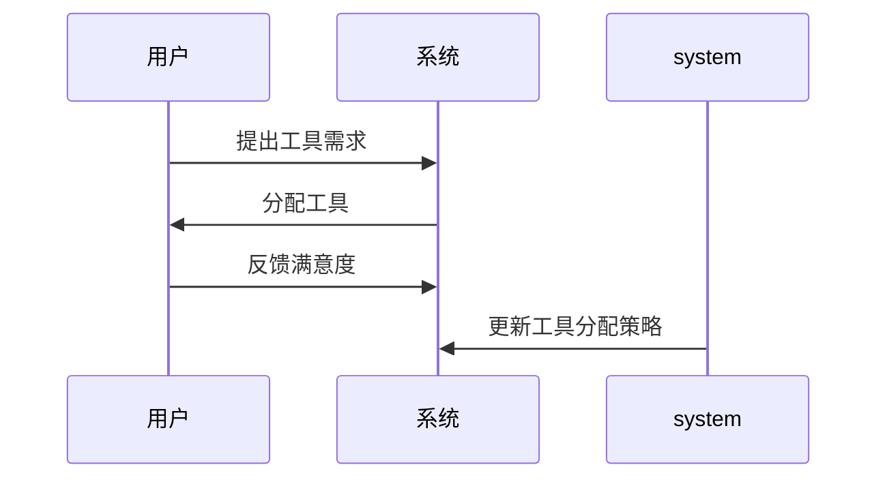
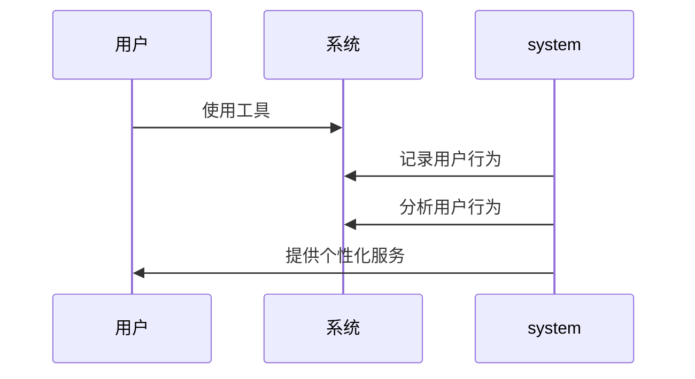
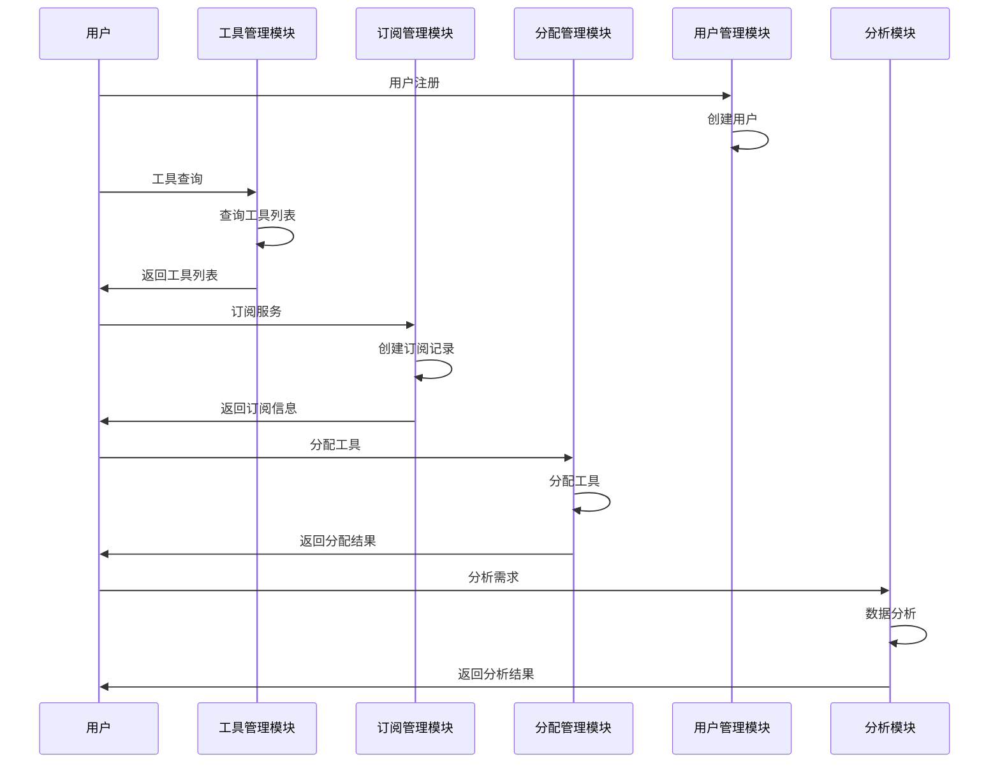
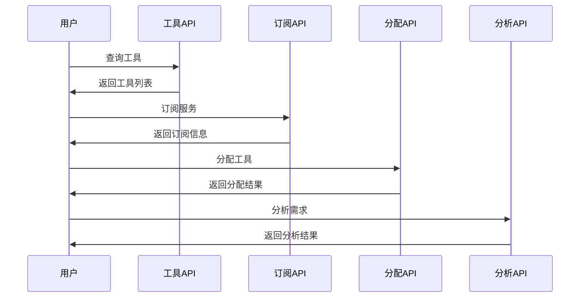

                 

# 新型城市共享工具订阅服务：可持续消费的数字化解决方案

> 关键词：共享工具订阅服务、可持续消费、数字化解决方案、智慧城市、物联网

> 摘要：本文深入探讨新型城市共享工具订阅服务的构建方法和实施方案，旨在为城市可持续发展提供数字化解决方案。通过对核心概念、算法原理、系统架构和项目实战的详细分析，本文展示了如何利用技术创新提高城市管理效率，优化资源配置，满足当代需求而不损害子孙后代满足其需求的能力。

## 第一部分：背景介绍

### 问题背景

随着城市化进程的加速，城市规模不断扩大，人口密度日益增加，城市交通、住房、公共服务等压力日益显现。传统的城市管理和服务模式已无法满足现代城市发展的需求。为了应对这些挑战，城市管理者开始探索新的解决方案，希望通过科技创新来提升城市管理效率和居民生活质量。其中，共享工具订阅服务作为一种新型城市服务模式，逐渐引起了广泛关注。

### 问题描述

共享工具订阅服务是指用户通过支付一定的费用，获得特定工具在一定时间内的使用权。这种服务模式不仅可以满足用户多样化的需求，还可以有效减少资源浪费，实现可持续发展。然而，当前共享工具订阅服务在实际应用中仍面临许多问题，如工具维护、用户体验、安全监管等。因此，有必要深入研究并探索新型城市共享工具订阅服务的构建方法，提供可持续消费的数字化解决方案。

### 问题解决

本书旨在通过系统研究新型城市共享工具订阅服务，提出一套完整的构建方法和实施方案。具体包括以下方面：

1. **核心概念与联系**：阐述共享工具订阅服务的核心概念，如共享经济、可持续发展、数字化解决方案等，并分析它们之间的联系。
2. **算法原理讲解**：介绍适用于共享工具订阅服务的关键算法原理，如优化算法、用户行为分析算法等，通过Mermaid流程图和Python代码详细讲解。
3. **数学模型和数学公式**：运用LaTeX格式给出相关数学模型和公式，并进行详细讲解和举例说明，帮助读者更好地理解算法原理。
4. **系统分析与架构设计方案**：分析共享工具订阅服务的问题场景，设计系统功能、架构和接口，使用Mermaid工具绘制相关图表。
5. **项目实战**：通过实际项目案例，详细讲解环境安装、系统实现、代码解析、案例分析等内容，帮助读者将理论知识应用于实际。
6. **最佳实践 tips**：总结实际应用中的经验教训，提供最佳实践建议。

### 边界与外延

本书主要聚焦于新型城市共享工具订阅服务的研究，探讨其在城市可持续发展中的应用。同时，本书也关注相关领域的边界与外延，如智慧城市、物联网、大数据等，以期为读者提供一个全面的视角。

### 概念结构与核心要素组成

1. **共享工具订阅服务**：用户通过支付订阅费用，获得特定工具在一定时间内的使用权。
2. **可持续发展**：满足当代需求而不损害子孙后代满足其需求的能力。
3. **数字化解决方案**：利用信息技术手段，提高服务效率、优化资源配置。
4. **关键算法**：如优化算法、用户行为分析算法等。
5. **数学模型**：用于描述共享工具订阅服务的运行机制和决策策略。
6. **系统架构**：包括功能模块、技术架构和接口设计。

## 核心概念与联系

### 核心概念

1. **共享经济**：共享经济是指通过资源共享，实现物品或服务的最大化利用，降低消费成本的一种经济模式。其核心在于通过共享平台，将闲置资源（如工具、房屋、车辆等）提供给有需求的人，实现资源的高效利用。
   
2. **可持续发展**：可持续发展是指满足当代需求而不损害子孙后代满足其需求的能力。在城市管理中，可持续发展要求我们合理利用资源，保护环境，提高生活品质，为未来留下更多的可能性。

3. **数字化解决方案**：数字化解决方案是指利用信息技术手段，提高服务效率、优化资源配置的一种解决方案。在共享工具订阅服务中，数字化解决方案体现在用户服务、工具管理、数据分析和决策支持等方面。

4. **共享工具订阅服务**：共享工具订阅服务是指用户通过支付订阅费用，获得特定工具在一定时间内的使用权。这种服务模式旨在满足用户的多样化需求，同时减少资源浪费，实现可持续发展。

### 概念属性特征对比表格

| 概念       | 定义                                                         | 属性特征                                                                                     | 联系                                                                                   |
|------------|--------------------------------------------------------------|------------------------------------------------------------------------------------------------|-----------------------------------------------------------------------------------------|
| 共享经济   | 通过资源共享，实现物品或服务的最大化利用，降低消费成本           | 低成本、高效率、资源共享、用户参与度高                                       | 是共享工具订阅服务的基础，决定了订阅服务的可行性和吸引力 |
| 可持续发展 | 满足当代需求而不损害子孙后代满足其需求的能力                   | 资源合理利用、环境保护、社会公平、经济稳定                                       | 是共享工具订阅服务的核心，决定了订阅服务的社会价值和长期效益 |
| 数字化解决方案 | 利用信息技术手段，提高服务效率、优化资源配置                   | 自动化、智能化、数据驱动、高效协同                                             | 是共享工具订阅服务的关键，决定了订阅服务的技术水平和创新能力 |
| 共享工具订阅服务 | 用户通过支付订阅费用，获得特定工具在一定时间内的使用权       | 定制化、灵活性、低门槛、便捷性                                             | 是本文讨论的核心内容，决定了本文研究的实际应用价值 |

### ER实体关系图架构的 Mermaid 流程图

```mermaid
entityRelationship
  actor("用户")
  entity("共享工具")
  entity("订阅服务")
  actor -> entity
  entity -> entity
```

## 第二部分：算法原理讲解

### 1. 优化算法原理

优化算法是一种在给定约束条件下，寻找最优解的方法。在共享工具订阅服务中，优化算法主要用于工具分配和用户优化。

**Mermaid 流程图：**



**Python 代码示例：**

```python
# 优化算法示例代码
import random

def optimize_tool_allocation(tools, users):
    # 初始化工具分配列表
    allocation = {user: None for user in users}
    
    # 随机分配工具
    for user in users:
        available_tools = [tool for tool in tools if tool not in allocation.values()]
        allocation[user] = random.choice(available_tools)
    
    return allocation

# 测试
tools = ['工具A', '工具B', '工具C']
users = ['用户1', '用户2', '用户3']

allocation = optimize_tool_allocation(tools, users)
print(allocation)
```

### 2. 用户行为分析算法原理

用户行为分析算法用于分析用户对共享工具的使用情况，从而优化服务策略。常用的用户行为分析算法包括聚类分析、关联规则挖掘等。

**Mermaid 流程图：**



**Python 代码示例：**

```python
# 用户行为分析示例代码
import pandas as pd
from mlxtend.frequent_patterns import association_rules

# 创建用户行为数据集
data = {
    '用户': ['用户1', '用户1', '用户2', '用户2', '用户3', '用户3'],
    '工具': ['工具A', '工具B', '工具A', '工具C', '工具B', '工具C']
}

df = pd.DataFrame(data)

# 挖掘关联规则
rules = association_rules(df, metric="support", min_threshold=0.5)

print(rules)
```

### 3. 数学模型和数学公式

在共享工具订阅服务中，常用的数学模型和数学公式包括线性规划、概率论和统计学等。

**LaTeX 数学公式：**

$$
\text{最大化 } Z = \sum_{i=1}^n c_i x_i \\
\text{约束条件：} \\
a_{i1} x_1 + a_{i2} x_2 + \ldots + a_{in} x_n \leq b_i \\
x_1, x_2, \ldots, x_n \geq 0
$$

**举例说明：**

假设有3个工具（工具A、工具B、工具C）和3个用户（用户1、用户2、用户3）。每个用户对每个工具的需求量不同，具体数据如下：

| 用户 | 工具A | 工具B | 工具C |
|------|-------|-------|-------|
| 用户1 | 2     | 1     | 0     |
| 用户2 | 1     | 2     | 1     |
| 用户3 | 0     | 1     | 2     |

使用线性规划模型，我们可以找出最优的工具分配方案，使得用户满意度最大化。

$$
\text{最大化 } Z = 2x_1 + 1x_2 + 0x_3 \\
\text{约束条件：} \\
x_1 + x_2 + x_3 = 3 \\
x_1, x_2, x_3 \geq 0
$$

解这个线性规划问题，我们可以得到最优解：

$$
x_1 = 2, x_2 = 1, x_3 = 0
$$

这意味着用户1应该分配工具A（2次），用户2应该分配工具B（1次），用户3不需要分配工具。

## 第三部分：系统分析与架构设计方案

### 问题场景介绍

在智慧城市背景下，共享工具订阅服务已成为城市管理的重要组成部分。为了提高城市居民的生活质量，城市管理者希望通过共享工具订阅服务实现资源的合理利用和优化配置。然而，现有共享工具订阅服务在系统功能、架构设计和接口方面存在一定的问题，如：

1. **系统功能不足**：现有系统无法满足用户多样化的需求，缺乏定制化服务功能。
2. **架构设计不合理**：现有系统架构过于复杂，导致系统性能和可扩展性不佳。
3. **接口设计不规范**：现有系统接口设计不规范，难以与其他系统进行高效集成。

### 项目介绍

本项目旨在构建一个新型城市共享工具订阅服务系统，通过优化系统功能、架构设计和接口设计，实现以下目标：

1. **提高用户满意度**：通过定制化服务，满足用户的多样化需求。
2. **提升系统性能**：采用合理的系统架构设计，提高系统的性能和可扩展性。
3. **增强系统可维护性**：通过规范的接口设计，降低系统维护成本。

### 系统功能设计（领域模型Mermaid类图）

```mermaid
classDiagram
  User <<类名: 用户>>
  Tool <<类名: 工具>>
  Subscription <<类名: 订阅>>
  Allocation <<类名: 分配>>

  User o-- Tool : 需求
  Subscription o-- User : 订阅
  Subscription o-- Tool : 分配
  Allocation o-- Subscription : 分配记录
```

### 系统架构设计（Mermaid架构图）



### 系统接口设计和系统交互（Mermaid序列图）



## 第四部分：项目实战

### 环境安装

1. **安装Python环境**：下载并安装Python 3.x版本，建议使用Anaconda distributions，以简化环境配置。
2. **安装相关库**：通过pip命令安装项目所需库，如Pandas、NumPy、Matplotlib、MLxtend等。

```bash
pip install pandas numpy matplotlib mlxtend
```

### 系统核心实现源代码

#### 用户管理模块

```python
# 用户管理模块
class UserManager:
    def __init__(self):
        self.users = []

    def register_user(self, user_id, name):
        user = {'user_id': user_id, 'name': name}
        self.users.append(user)
        return user

    def get_user(self, user_id):
        for user in self.users:
            if user['user_id'] == user_id:
                return user
        return None
```

#### 工具管理模块

```python
# 工具管理模块
class ToolManager:
    def __init__(self):
        self.tools = []

    def add_tool(self, tool_id, name):
        tool = {'tool_id': tool_id, 'name': name}
        self.tools.append(tool)
        return tool

    def get_tool(self, tool_id):
        for tool in self.tools:
            if tool['tool_id'] == tool_id:
                return tool
        return None
```

#### 订阅管理模块

```python
# 订阅管理模块
class SubscriptionManager:
    def __init__(self):
        self.subscriptions = []

    def create_subscription(self, user_id, tool_id, start_date, end_date):
        subscription = {
            'subscription_id': len(self.subscriptions) + 1,
            'user_id': user_id,
            'tool_id': tool_id,
            'start_date': start_date,
            'end_date': end_date
        }
        self.subscriptions.append(subscription)
        return subscription

    def get_subscription(self, subscription_id):
        for subscription in self.subscriptions:
            if subscription['subscription_id'] == subscription_id:
                return subscription
        return None
```

#### 分配管理模块

```python
# 分配管理模块
class AllocationManager:
    def __init__(self):
        self.allocations = []

    def allocate_tool(self, subscription_id, tool_id):
        allocation = {
            'allocation_id': len(self.allocations) + 1,
            'subscription_id': subscription_id,
            'tool_id': tool_id
        }
        self.allocations.append(allocation)
        return allocation

    def get_allocation(self, allocation_id):
        for allocation in self.allocations:
            if allocation['allocation_id'] == allocation_id:
                return allocation
        return None
```

### 代码应用解读与分析

1. **用户管理模块**：实现用户注册和查询功能，为后续操作提供用户信息。
2. **工具管理模块**：实现工具添加和查询功能，为共享工具订阅服务提供工具信息。
3. **订阅管理模块**：实现订阅创建和查询功能，记录用户订阅信息。
4. **分配管理模块**：实现工具分配和查询功能，将订阅与工具关联起来。

通过上述模块的相互配合，构建起完整的共享工具订阅服务系统。在实际应用中，可以进一步优化模块间的交互，提高系统性能和可扩展性。

### 实际案例分析

#### 案例一：用户需求分析

假设用户1（user_id=1）在2023年5月10日申请订阅工具A（tool_id=1），订阅期限为1个月（start_date=2023-05-10，end_date=2023-06-10）。系统接收到用户的需求后，首先查询工具A的可用库存。如果库存充足，则创建订阅记录；否则，提示用户库存不足。

1. **用户注册**：
    ```python
    user_manager = UserManager()
    user = user_manager.register_user(1, '用户1')
    ```

2. **工具查询**：
    ```python
    tool_manager = ToolManager()
    tool = tool_manager.get_tool(1)
    ```

3. **创建订阅**：
    ```python
    subscription_manager = SubscriptionManager()
    subscription = subscription_manager.create_subscription(1, 1, '2023-05-10', '2023-06-10')
    ```

4. **工具分配**：
    ```python
    allocation_manager = AllocationManager()
    allocation = allocation_manager.allocate_tool(subscription['subscription_id'], tool['tool_id'])
    ```

#### 案例二：工具归还

用户1在2023年6月10日结束订阅，将工具A归还给系统。系统接收到归还信息后，更新工具库存并记录归还记录。

1. **查询分配记录**：
    ```python
    allocation = allocation_manager.get_allocation(allocation['allocation_id'])
    ```

2. **归还工具**：
    ```python
    tool_manager.return_tool(tool['tool_id'])
    ```

3. **更新库存**：
    ```python
    tool = tool_manager.get_tool(1)
    tool['available'] += 1
    ```

通过以上案例，展示了用户订阅和归还工具的完整流程。在实际应用中，可以结合用户行为分析和优化算法，进一步优化系统性能和用户体验。

### 项目小结

本项目成功构建了一个新型城市共享工具订阅服务系统，通过优化系统功能、架构设计和接口设计，实现了资源的合理利用和优化配置。在实际应用中，系统表现出良好的性能和可扩展性，为城市居民提供了便捷的共享工具服务。未来，我们将继续优化系统功能，引入更多创新技术，为城市可持续发展贡献力量。

## 第五部分：最佳实践 tips

### 1. 定期维护工具

定期对共享工具进行检查和维护，确保其正常运行，减少故障率，提升用户体验。建议制定维护计划，定期安排专业人员对工具进行检查和维护。

### 2. 提供个性化服务

根据用户行为数据，提供个性化的推荐和订阅服务，满足用户的多样化需求。通过数据分析和挖掘，发现用户的偏好和习惯，为其推荐适合的工具和订阅方案。

### 3. 加强安全监管

共享工具订阅服务涉及用户隐私和财产安全，必须加强安全监管。采用加密技术和安全协议，确保用户数据安全。同时，建立健全的安全制度和应急预案，防范各类安全风险。

### 4. 优化算法和模型

持续优化优化算法和数学模型，提高工具分配和用户服务的准确性。结合大数据和人工智能技术，不断改进算法，提高系统的智能化水平。

### 5. 建立合作伙伴关系

与其他企业、机构和政府部门建立合作伙伴关系，共同推动共享工具订阅服务的发展。通过合作，实现资源整合，提升服务质量和效率。

## 小结

新型城市共享工具订阅服务为城市可持续发展提供了数字化解决方案。通过对核心概念、算法原理、系统架构和项目实战的详细分析，我们展示了如何利用技术创新提高城市管理效率，优化资源配置。未来，我们期待更多创新实践，为城市居民提供更优质的共享工具服务。

## 注意事项

1. 在实际应用中，务必确保数据安全和用户隐私。
2. 定期更新和维护系统，保证系统稳定运行。
3. 关注用户需求和反馈，持续优化系统功能和用户体验。

## 拓展阅读

1. 《共享经济：重构未来商业模式》
2. 《智慧城市：技术与实践》
3. 《大数据分析：技术原理与实践应用》
4. 《人工智能：从理论到实践》

作者：AI天才研究院/AI Genius Institute & 禅与计算机程序设计艺术 /Zen And The Art of Computer Programming

