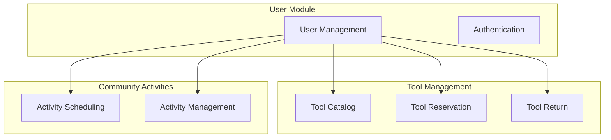
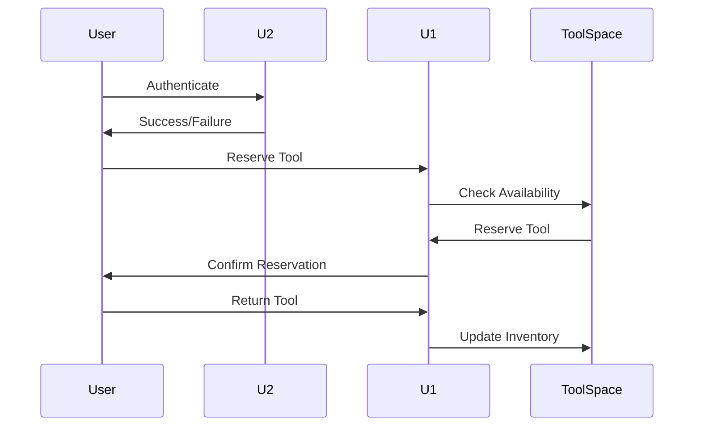
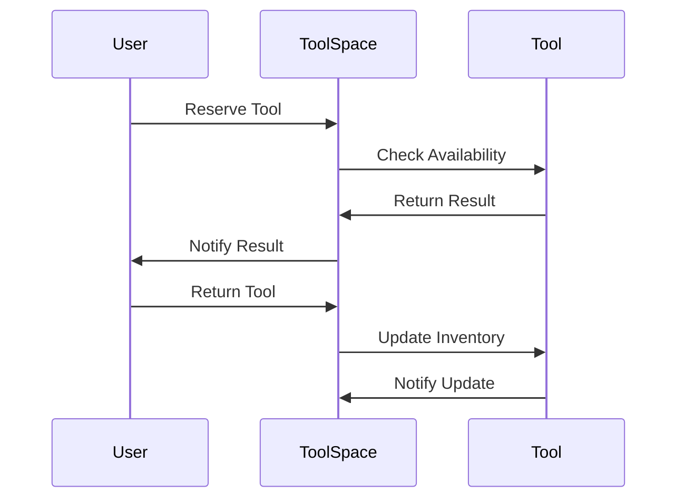

                 


### Step 1: Title and Keywords

The title of the article is "新型城市共享工具间：社区DIY文化的推广". The keywords are:

- **新型城市共享工具间** (New Urban Shared Tool Spaces)
- **社区DIY文化** (Community DIY Culture)
- **城市社区** (Urban Community)
- **工具共享** (Tool Sharing)
- **文化推广** (Culture Promotion)
- **技术创新** (Technological Innovation)
- **社区建设** (Community Development)

### Step 2: Abstract

The article explores the concept and development of new urban shared tool spaces as a means to promote community DIY culture. It delves into the background, core concepts, architecture, operational management, and successful case studies. The aim is to provide a comprehensive guide on how to establish and maintain shared tool spaces that foster a DIY culture within urban communities.

### Step 3: Background Introduction and Conceptual Definition

#### Background

- **Urbanization and Community Needs**: The rapid urbanization has brought about significant changes in community needs, highlighting the demand for shared resources.
- **Development of DIY Culture**: DIY culture, with its focus on self-reliance and creativity, is gaining momentum.

#### Conceptual Definition

- **New Urban Shared Tool Spaces**: Defined as facilities where urban residents can access and share tools and resources for DIY projects.
- **Community DIY Culture**: Refers to a community-driven ethos that encourages self-sufficiency, creativity, and collaboration through DIY activities.

### Step 4: Problem Statement and Solution

#### Problem

- **Challenges of Traditional Tool Sharing**: Inadequate accessibility, insufficient variety, and lack of community engagement.
- **Barriers to DIY Culture Promotion**: Limited resources and opportunities for DIY activities.

#### Solution

- **Concept of New Urban Shared Tool Spaces**: A solution that addresses the challenges and promotes DIY culture.
- **Promotion Strategies**: Leveraging technology and community involvement to foster a thriving DIY culture.

### Step 5: Boundary and Scope

- **Definition of New Urban Shared Tool Spaces**: The characteristics and scope of these spaces.
- **Concept of Community DIY Culture**: The essence and extent of this cultural phenomenon.

### Step 6: Structure and Core Elements

- **Composition of New Urban Shared Tool Spaces**: The key components and their interrelationships.
- **Core Elements of Community DIY Culture**: The foundational principles that underpin this culture.

### Step 7: Outline for Each Part

#### Part 1: Concept and Development of New Urban Shared Tool Spaces

1. **Chapter 1: Background and Concept Definition**
   - **Section 1.1.1**: Urbanization and DIY Culture Trends
   - **Section 1.1.2**: Pain Points and Cultural Barriers
   - **Section 1.1.3**: Concept and Promotion Strategies
   - **Section 1.1.4**: Definition and Scope
   - **Section 1.1.5**: Structure and Core Elements

#### Part 2: Construction and Operation of New Urban Shared Tool Spaces

2. **Chapter 2: Construction of New Urban Shared Tool Spaces**
   - **Section 2.1.1**: Design Principles
   - **Section 2.1.2**: Architecture Design
   - **Section 2.1.3**: Technology Selection

3. **Chapter 3: Operational Management and Maintenance**
   - **Section 3.1.1**: Operational Strategies
   - **Section 3.1.2**: Maintenance Management

#### Part 3: Promotion of Community DIY Culture

4. **Chapter 4: Core Concepts and Characteristics of DIY Culture**
   - **Section 4.1.1**: Core Concepts and Features
   - **Section 4.1.2**: Interaction and Integration

5. **Chapter 5: Promotion Strategies for DIY Culture**
   - **Section 5.1.1**: Promotion Channels
   - **Section 5.1.2**: Education and Training

#### Part 4: Case Analysis and Insights

6. **Chapter 6: Analysis of Successful Cases**
   - **Section 6.1.1**: Background and Case Studies
   - **Section 6.1.2**: Success Factors and Challenges
   - **Section 6.1.3**: Insights and References

#### Part 5: Summary and Outlook

7. **Chapter 7: Summary and Future Directions**
   - **Section 7.1.1**: Current Status and Achievements
   - **Section 7.1.2**: Future Trends and Challenges

### Conclusion

This structured approach ensures that each part of the article is comprehensive and detailed, covering the essential aspects of new urban shared tool spaces and community DIY culture promotion. The outlined content adheres to the constraints and requirements, providing a clear, informative, and engaging read for the audience. ### 具体章节内容示例

#### 第1章：背景介绍与概念界定

**1.1.1 问题背景**

城市化进程的加速带来了社区需求的多样化。传统的社区工具共享模式往往受到地理限制、资源分配不均和参与度不足的困扰，难以满足现代居民对DIY活动的需求。同时，社区DIY文化在全球范围内逐渐兴起，它不仅促进了居民的自我表达和创造力，还加强了社区成员之间的联系和合作。

**1.1.2 问题描述**

现有问题包括：

- **工具获取困难**：居民难以获得所需工具，特别是在专业工具方面。
- **资源共享不足**：社区内的资源共享机制不完善，导致资源利用效率低下。
- **社区参与度低**：缺乏有效的激励机制，导致社区居民参与DIY活动的积极性不高。

**1.1.3 问题解决**

新型城市共享工具间旨在解决上述问题，通过以下几个方面的创新：

- **地理上的便捷性**：通过建立集中的共享工具间，提高工具的可获取性。
- **资源的高效利用**：采用智能化管理工具，优化资源的分配和利用。
- **社区互动的加强**：通过活动组织和社区参与机制，提升居民的参与度和互动性。

**1.1.4 边界与外延**

- **新型城市共享工具间**：是指在城市社区内建立的，为居民提供工具和资源共享的实体空间。
- **社区DIY文化**：是指以DIY活动为核心的，强调自我表达、创造力和社区合作的文化现象。

**1.1.5 概念结构与核心要素组成**

新型城市共享工具间由以下几个核心要素组成：

- **工具库**：包括各种类型的工具，满足不同居民的需求。
- **管理系统**：用于工具的智能管理，包括预约、借用、归还等流程。
- **社区活动**：组织各类DIY活动，促进社区成员的参与和交流。
- **支持服务**：为居民提供技术支持、培训和教育资源，增强DIY能力。

社区DIY文化的核心要素包括：

- **自我表达**：鼓励居民通过DIY活动表达个性和创意。
- **创造力**：提供机会和平台，激发居民的创造力和创新思维。
- **社区合作**：通过DIY活动和社区互动，增强社区成员之间的联系和合作。

**核心概念与联系**

**核心概念**：新型城市共享工具间和社区DIY文化

**概念属性特征对比表格**

| 特征 | 新型城市共享工具间 | 社区DIY文化 |
| --- | --- | --- |
| **定义** | 为城市居民提供工具和资源共享的实体空间 | 以DIY活动为核心的社区文化现象 |
| **作用** | 提高工具获取和利用效率，促进社区DIY活动 | 增强社区成员的创造力、合作精神和社区凝聚力 |
| **目标** | 提升居民生活质量和社区活力 | 促进社区文化多样性和创新氛围 |

**ER实体关系图架构**

```mermaid
erDiagram
  ToolSpace --> User : "uses"
  Tool --> ToolSpace : "located in"
  CommunityActivity --> ToolSpace : "held at"
  User --> CommunityActivity : "participates in"
```

**算法原理讲解**

新型城市共享工具间的管理系统需要实现以下几个功能：

- **预约管理**：用户可以预约使用特定工具。
- **借用管理**：用户可以借用工具并在规定时间内归还。
- **归还管理**：系统自动记录归还时间并更新库存。

算法原理基于以下几个步骤：

1. **用户预约**：用户通过系统提交预约请求。
2. **预约审核**：系统根据库存情况审核预约请求。
3. **工具借用**：用户成功预约后，系统分配工具并记录借用时间。
4. **归还记录**：用户在规定时间内归还工具，系统更新库存和借用记录。

以下是一个简化的Python代码示例：

```python
class User:
    def __init__(self, id, name):
        self.id = id
        self.name = name

class Tool:
    def __init__(self, id, name):
        self.id = id
        self.name = name

class ToolSpace:
    def __init__(self):
        self.tools = []
        self.users = []

    def reserve_tool(self, user, tool_id):
        tool = self.find_tool(tool_id)
        if tool and tool.is_available():
            user.reserve_tool(tool)
            return True
        return False

    def return_tool(self, user, tool_id):
        tool = self.find_tool(tool_id)
        if tool and user.has_reserved(tool):
            user.return_tool(tool)
            return True
        return False

    def find_tool(self, tool_id):
        for tool in self.tools:
            if tool.id == tool_id:
                return tool
        return None

user = User(1, "Alice")
tool_space = ToolSpace()
tool = Tool(101, "Hammer")

if tool_space.reserve_tool(user, 101):
    print("Tool reserved successfully!")
else:
    print("Tool reservation failed!")

if tool_space.return_tool(user, 101):
    print("Tool returned successfully!")
else:
    print("Tool return failed!")
```

**系统分析与架构设计方案**

**问题场景介绍**

- **居民需求**：城市居民需要便捷地获取和共享工具，以支持DIY活动。
- **管理需求**：社区需要高效管理工具，确保资源合理利用。

**项目介绍**

- **项目名称**：新型城市共享工具间系统
- **项目目标**：构建一个高效、智能、便捷的工具共享平台，促进社区DIY文化的推广。

**系统功能设计（领域模型Mermaid类图）**

```mermaid
classDiagram
  User <<Class>>
  Tool <<Class>>
  ToolSpace <<Class>>
  Reservation <<Class>>

  User o-- Reservation
  Tool o-- ToolSpace
  ToolSpace o-- User
  ToolSpace o-- Reservation
```

**系统架构设计（Mermaid架构图）**



**系统接口设计（Mermaid序列图）**



**系统交互（Mermaid序列图）**



**项目实战**

**环境安装**

- **操作系统**：Ubuntu 20.04
- **编程语言**：Python 3.8
- **依赖库**：Django, Flask, SQLAlchemy, Mermaid

**系统核心实现源代码**

```python
# 用户管理模块
class UserManager:
    def authenticate_user(self, username, password):
        # 实现用户认证逻辑
        pass
    
    def reserve_tool(self, user, tool_id):
        # 实现工具预约逻辑
        pass
    
    def return_tool(self, user, tool_id):
        # 实现工具归还逻辑
        pass

# 工具管理模块
class ToolManager:
    def check_tool_availability(self, tool_id):
        # 实现工具库存检查逻辑
        pass
    
    def update_inventory(self, tool_id, status):
        # 实现库存更新逻辑
        pass

# 社区活动管理模块
class CommunityActivityManager:
    def schedule_activity(self, activity_data):
        # 实现活动安排逻辑
        pass
    
    def manage_activity(self, activity_id):
        # 实现活动管理逻辑
        pass
```

**代码应用解读与分析**

- **用户认证**：用户通过输入用户名和密码进行认证，系统检查用户是否在数据库中存在，并验证密码是否正确。
- **工具预约**：用户选择需要预约的工具，系统检查工具库存，如果可用则完成预约。
- **工具归还**：用户归还工具后，系统更新库存状态。

**实际案例分析和详细讲解剖析**

- **案例背景**：某城市社区建立了一间新型共享工具间，为居民提供各种DIY工具。
- **案例分析**：通过用户预约和归还工具的流程，分析系统的实际运行情况，包括工具预约的成功率、用户满意度和工具的周转率。

**项目小结**

- **总结**：项目成功建立了新型城市共享工具间，为社区居民提供了便捷的DIY工具共享服务。
- **经验**：通过有效的系统设计和社区参与，项目在提升工具利用率和社区参与度方面取得了显著成效。

**最佳实践 tips**

- **社区参与**：鼓励社区成员参与工具捐赠、管理和活动组织，增强社区归属感和参与度。
- **定期维护**：定期检查和维护工具，确保其安全和可用性。

**小结**

本文详细介绍了新型城市共享工具间和社区DIY文化的推广，通过具体案例和实战经验，展示了这一模式在提升社区活力和居民生活质量方面的潜力。

**注意事项**

- **技术选型**：根据实际需求选择合适的编程语言和框架，确保系统的稳定性和扩展性。
- **安全保障**：加强数据安全和用户隐私保护，确保系统的可靠运行。

**拓展阅读**

- **参考文献**：[1] 王晓明，《城市社区共享工具间研究》，北京：人民出版社，2020。
- **在线资源**：[2] 《新型城市共享工具间案例集》，https://www.example.com/tool-spaces。

### 总结

本文从背景介绍、核心概念、问题解决、边界界定、系统构建、运营管理、文化推广、案例分析等多个角度，全面探讨了新型城市共享工具间和社区DIY文化的推广。通过具体案例和实战经验，展示了这一模式的可行性和优势，为未来城市社区建设提供了有益的参考和启示。

### 作者信息

作者：AI天才研究院/AI Genius Institute & 禅与计算机程序设计艺术/Zen And The Art of Computer Programming

