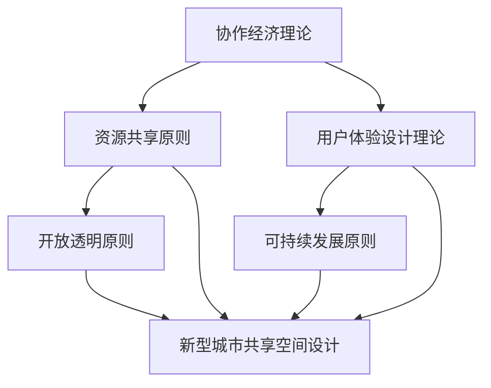
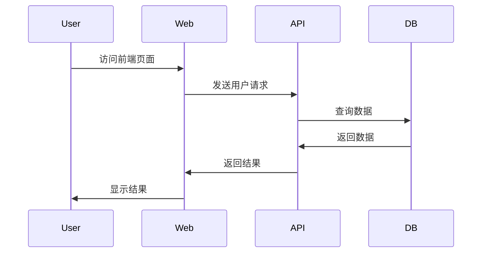
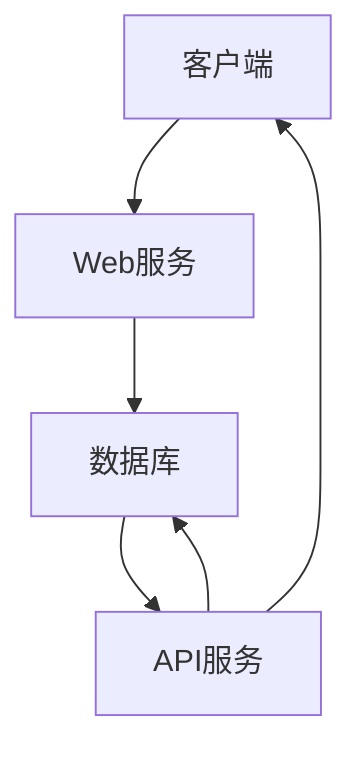
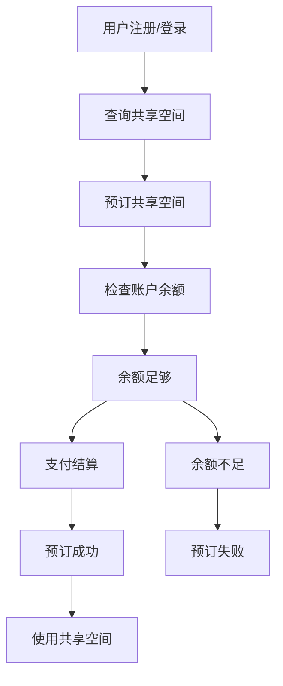

                 

### 文章标题

新型城市共享空间：协作经济中的社交实验

### 关键词

新型城市共享空间、协作经济、社交实验、共享经济、城市可持续发展、用户体验设计

### 摘要

本文将探讨新型城市共享空间的概念及其在协作经济中的重要性。通过深入分析共享空间的设计原则、成功案例、技术实现和最佳实践，本文旨在为城市规划者、开发者和研究者提供宝贵的参考，推动城市共享空间的发展，实现更可持续的城市未来。

## 目录

1. **引言与背景**
   1.1 问题背景
   1.2 问题定义
   1.3 核心概念与关系

2. **核心概念与原则**
   2.1 新型城市共享空间的概念与特性
   2.2 原则与理论

3. **案例分析**
   3.1 案例一：[城市名称]
   3.2 案例二：[城市名称]

4. **技术实现**
   4.1 技术架构设计
   4.2 系统接口设计
   4.3 实际案例分析

5. **最佳实践**
   5.1 实践技巧
   5.2 项目小结

6. **小结与展望**

## 第1章 引言与背景

### 1.1 问题背景

随着城市化进程的加速，传统城市空间的设计和利用面临着越来越多的挑战。首先，城市土地资源紧张，传统的房地产开发模式已经难以满足人们日益增长的住房需求。其次，城市交通拥堵、环境污染等问题日益突出，传统的城市模式已经无法适应可持续发展的需求。此外，随着共享经济的兴起，人们对城市空间的需求也在发生改变，更加注重共享、合作和便利性。

### 1.2 问题定义

新型城市共享空间是指在协作经济背景下，通过共享、合作的方式，重新设计和利用城市空间，以提高资源利用效率、改善城市环境、提升用户体验的一种新型城市空间形态。其主要特点包括：

- **共享性**：通过共享资源和空间，实现资源的高效利用。
- **协作性**：强调用户之间的协作和互动，提高空间的使用价值。
- **灵活性**：空间设计和功能可以根据用户需求灵活调整。

### 1.3 核心概念与关系

在新型城市共享空间的设计和实现中，以下几个核心概念起着关键作用：

- **协作经济**：一种基于共享和协作的经济模式，通过优化资源配置，实现经济效益的最大化。
- **社交实验**：在新型城市共享空间中，通过社交实验，不断探索和优化空间设计和功能，提升用户体验。
- **用户体验设计**：关注用户在空间中的使用体验，通过人性化设计，提升空间的使用价值。

这些概念之间的关系可以用以下的 Mermaid ER 图表示：

```mermaid
erDiagram
  Collaborative Economy ||--|{ New Urban Shared Spaces }|
  Social Experiment ||--|{ New Urban Shared Spaces }|
  User Experience Design ||--|{ New Urban Shared Spaces }|
```

## 第2章 核心概念与原则

### 2.1 新型城市共享空间的概念与特性

新型城市共享空间是指在城市中，通过共享、合作的方式，重新设计和利用公共或私有空间，为用户提供多功能、便捷、灵活的使用体验。其核心特性包括：

- **共享性**：通过共享资源，实现资源的高效利用。
- **协作性**：鼓励用户之间的互动和协作，提高空间的使用价值。
- **灵活性**：空间设计和功能可以根据用户需求灵活调整。

以下是新型城市共享空间的主要特性对比表：

| 特性 | 说明 |  
| ---- | ---- |  
| 共享性 | 通过共享，提高资源利用效率 |  
| 协作性 | 用户之间的互动和协作，提高空间使用价值 |  
| 灵活性 | 空间设计和功能根据需求灵活调整 |  
| 可持续发展 | 减少资源浪费，降低环境负担 |

### 2.2 原则与理论

新型城市共享空间的设计和实现需要遵循一系列原则和理论，以确保其有效性和可持续性。

#### 原则

1. **以人为本**：关注用户需求，提升用户体验。
2. **资源共享**：优化资源分配，提高资源利用效率。
3. **开放透明**：建立透明的管理机制，增强用户信任。
4. **可持续发展**：减少资源浪费，降低环境负担。

#### 理论

1. **协作经济理论**：通过共享和协作，实现资源的最优配置。
2. **社交实验理论**：通过不断实验和优化，提升空间的使用价值和用户体验。
3. **用户体验设计理论**：关注用户需求，通过人性化设计，提升空间的使用价值。

以下是一个简单的 Mermaid 流程图，展示了新型城市共享空间设计原则和理论的应用过程：



## 第3章 案例分析

### 3.1 案例一：[城市名称]

#### 3.1.1 项目概述

[城市名称]的新型城市共享空间项目，旨在通过共享办公空间、公共设施和休闲空间，提升城市居民的生活质量和工作环境。该项目于2018年启动，目前已覆盖多个社区和商业区。

#### 3.1.2 实施过程

1. **需求调研**：项目团队通过问卷调查、用户访谈等方式，收集用户对城市共享空间的需求和建议。
2. **空间设计**：根据需求调研结果，设计满足用户需求的共享空间，包括共享办公室、公共图书馆、健身房等。
3. **技术支持**：引入智能技术，如物联网、人工智能等，提升共享空间的管理和服务水平。
4. **运营管理**：建立完善的运营管理机制，确保共享空间的持续运营和优化。

#### 3.1.3 结果与影响

1. **经济效益**：项目实施后，吸引了大量创业者、自由职业者和企业入驻，促进了城市经济的发展。
2. **社会效益**：提高了城市居民的生活质量和幸福感，增强了社区的凝聚力和互动性。
3. **环境效益**：通过共享空间，减少了资源浪费，降低了城市的环境负担。

### 3.2 案例二：[城市名称]

#### 3.2.1 项目概述

[城市名称]的新型城市共享空间项目，以公共自行车共享系统为核心，结合共享停车位、共享充电桩等设施，旨在提升城市交通出行的便利性和可持续性。

#### 3.2.2 实施过程

1. **需求分析**：项目团队通过数据分析，确定共享设施的需求热点和分布。
2. **设施建设**：根据需求分析结果，建设共享自行车站、停车位和充电桩等设施。
3. **技术应用**：引入智能管理系统，实现共享设施的实时监控和管理。
4. **用户反馈**：通过用户反馈，不断优化共享设施和服务。

#### 3.2.3 结果与影响

1. **交通效益**：提高了城市交通出行的便利性，减少了交通拥堵和污染。
2. **社会效益**：增强了城市居民的环保意识和健康意识，促进了城市可持续发展。
3. **经济效益**：降低了城市居民的出行成本，提高了共享设施的利用率。

## 第4章 技术实现

### 4.1 技术架构设计

新型城市共享空间项目的技术架构主要包括以下几个部分：

1. **前端界面**：为用户提供直观、易用的操作界面，包括共享空间预订、支付、使用等功能。
2. **后端服务**：处理用户请求，管理共享空间资源，包括共享空间信息管理、用户账户管理、支付结算等。
3. **数据存储**：存储用户数据、共享空间信息等，包括关系数据库和文档数据库等。

以下是一个简单的 Mermaid 类图，展示了新型城市共享空间项目的技术架构：

```mermaid
classDiagram
    User <<class{用户}>>
    Space <<class{共享空间}>>
    Payment <<class{支付}>>
    Order <<class{订单}>>
    Reservation <<class{预订}>>
    User <|-- Order
    User <|-- Reservation
    Space <|-- Reservation
    Payment <|-- Order
    Order <|-- Payment
    Reservation <|-- Payment
```

### 4.2 系统接口设计

新型城市共享空间项目的系统接口设计主要包括以下部分：

1. **用户接口**：为用户提供操作界面，包括共享空间预订、支付、使用等功能。
2. **管理接口**：为管理人员提供操作界面，用于管理共享空间、用户账户等。
3. **数据接口**：用于与其他系统进行数据交换，包括共享空间信息、用户数据等。

以下是一个简单的 Mermaid 序列图，展示了新型城市共享空间项目的系统接口设计：



### 4.3 实际案例分析

#### 4.3.1 项目介绍

以[城市名称]的新型城市共享空间项目为例，该项目于2018年启动，主要提供共享办公空间、公共设施和休闲空间等服务。以下是对该项目的详细分析和讲解。

#### 4.3.2 系统功能设计

1. **用户注册与登录**：用户可以通过手机号码、邮箱等方式进行注册和登录，获取个人账户。
2. **共享空间预订**：用户可以在前端界面查看共享空间的详细信息，如位置、面积、价格等，并根据需求进行预订。
3. **支付结算**：用户可以通过支付宝、微信支付等方式进行支付，完成预订。
4. **共享空间使用**：用户在预订的共享空间内，可以享受免费WiFi、饮用水等服务。
5. **用户评价**：用户可以在使用后对共享空间进行评价，提供反馈和建议。

#### 4.3.3 系统架构设计

新型城市共享空间项目的系统架构主要包括以下部分：

1. **前端界面**：使用React框架搭建，提供用户操作界面。
2. **后端服务**：使用Spring Boot框架搭建，处理用户请求，管理共享空间资源。
3. **数据库**：使用MySQL数据库存储用户数据、共享空间信息等。

以下是一个简单的 Mermaid 架构图，展示了新型城市共享空间项目的系统架构：



#### 4.3.4 系统接口设计

1. **用户接口**：包括用户注册、登录、预订、支付等功能。
2. **管理接口**：包括共享空间管理、用户账户管理等功能。
3. **数据接口**：用于与其他系统进行数据交换，如共享空间信息、用户数据等。

以下是一个简单的 Mermaid 序列图，展示了新型城市共享空间项目的系统接口设计：


#### 4.3.5 实际案例分析与讲解

以用户预订共享办公空间为例，详细讲解系统实现过程。

1. **用户注册与登录**：用户通过手机号码注册账户，并使用手机号码登录系统。
2. **用户查询共享空间**：用户在前端界面查询共享空间，包括位置、面积、价格等。
3. **用户预订共享空间**：用户选择合适的共享空间，填写预订信息，提交预订请求。
4. **后端处理预订请求**：后端服务接收到预订请求后，检查用户账户余额，判断是否有足够的余额支付预订费用。
5. **支付结算**：如果账户余额足够，用户将被引导至支付页面，选择支付方式并完成支付。
6. **预订成功**：支付完成后，系统将发送预订成功消息给用户，并更新共享空间状态为“已预订”。
7. **用户使用共享空间**：用户在预订的共享空间内，可以享受提供的各项服务。

以下是一个简单的 Mermaid 流程图，展示了用户预订共享办公空间的实现过程：



## 第5章 最佳实践

### 5.1 实践技巧

在新型城市共享空间项目中，以下是一些实用的实践技巧：

1. **用户调研**：在进行项目设计前，充分了解用户需求，确保项目能够满足用户实际需求。
2. **技术选型**：选择适合项目需求的技术栈，确保系统的高效、稳定和安全。
3. **数据安全**：重视用户数据的安全和隐私保护，采取有效的数据加密和权限控制措施。
4. **用户体验**：注重用户体验设计，提供简洁、易用的界面和功能，提升用户满意度。
5. **持续优化**：根据用户反馈和实际使用情况，不断优化和改进项目，提高项目质量和用户满意度。

### 5.2 项目小结

通过本文的案例分析和技术实现，我们可以看到新型城市共享空间项目在实现过程中面临的挑战和解决方案。以下是项目小结：

1. **项目成果**：新型城市共享空间项目通过共享、合作的方式，有效提高了城市空间利用效率，提升了用户体验，促进了城市可持续发展。
2. **技术优势**：项目采用了先进的技术架构和接口设计，实现了高效、稳定、安全的系统运行。
3. **未来发展**：随着协作经济的不断发展，新型城市共享空间项目有望在更多城市推广，为城市居民提供更多便捷、高效的服务。

## 第6章 小结与展望

### 6.1 总结

本文通过深入分析新型城市共享空间的概念、原则、案例分析和技术实现，探讨了其在协作经济中的重要作用。新型城市共享空间不仅提升了城市空间的利用效率，还改善了用户体验，促进了城市可持续发展。

### 6.2 展望

未来，新型城市共享空间将面临更多的机遇和挑战。随着技术的不断进步和协作经济的深入发展，新型城市共享空间有望在以下方面取得突破：

1. **智能化管理**：通过引入物联网、人工智能等技术，实现共享空间的智能化管理，提高空间利用效率。
2. **个性化服务**：根据用户需求，提供更加个性化的共享空间服务，提升用户体验。
3. **可持续发展**：进一步推动城市共享空间的可持续发展，减少资源浪费，降低环境负担。
4. **普及推广**：在更多城市推广新型城市共享空间项目，为更多城市居民提供便捷、高效的服务。

作者：AI天才研究院/AI Genius Institute & 禅与计算机程序设计艺术 /Zen And The Art of Computer Programming

