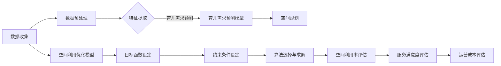

                 

 *“新型城市共享育儿空间：灵活工作制下的社区托管服务”*
关键词：新型城市、共享育儿空间、灵活工作制、社区托管服务、需求预测、空间优化、设计原则、实践案例

摘要：
本文旨在探讨新型城市共享育儿空间的概念、现状及解决方案。随着灵活工作制的普及，城市家庭对育儿托管服务的需求日益增长，本文将分析这一需求背后的核心概念，如灵活工作制和社区托管服务。通过构建育儿需求预测模型和空间利用优化模型，本文提出了一套完整的设计原则和流程，旨在提高社区育儿空间的利用效率和用户体验。案例分析部分将展示成功和失败的实际案例，总结经验教训。最后，本文展望了未来发展趋势，提出了研究和实践的建议。

## 目录大纲设计思路

### 整体结构设计
本文整体结构分为七个章节，旨在系统地探讨新型城市共享育儿空间的设计与实施。

### 目录大纲设计步骤
本文目录大纲设计分为以下步骤：

1. **确定整体结构**：明确各章节主题和内容。
2. **编写第1章内容**：介绍问题背景与核心概念。
3. **编写第2章内容**：阐述理论基础与模型。
4. **编写第3章内容**：描述设计原则与流程。
5. **编写第4章内容**：讨论实践应用与案例分析。
6. **编写第5章内容**：分享最佳实践与操作流程。
7. **编写第6章内容**：展望未来发展趋势。
8. **编写第7章内容**：总结全文，提出未来研究方向。

### 目录大纲示例

```markdown
----------------------------------------------------------------

# 新型城市共享育儿空间：灵活工作制下的社区托管服务

> 关键词：新型城市、共享育儿空间、灵活工作制、社区托管服务、需求预测、空间优化、设计原则、实践案例

> 摘要：本文探讨了新型城市共享育儿空间的概念、现状及解决方案。随着灵活工作制的普及，城市家庭对育儿托管服务的需求日益增长，本文提出了一套设计原则和流程，旨在提高社区育儿空间的利用效率和用户体验。

## 目录大纲

### 目录大纲设计思路

#### 整体结构设计
- **背景介绍**：介绍新型城市共享育儿空间的概念、现状和挑战。
- **核心概念与联系**：阐述灵活工作制、社区托管服务等核心概念，展示它们之间的关系。
- **理论基础与模型**：介绍育儿需求预测模型、空间利用优化模型，展示算法原理。
- **实践应用**：讨论共享育儿空间的设计和优化流程。
- **案例分析**：分析成功和失败的实际案例，总结经验教训。
- **最佳实践**：分享最佳实践和操作流程。
- **总结与展望**：总结全文内容，展望未来发展趋势。

#### 具体内容规划
- **第1章：问题背景与核心概念**
  - **问题描述**：介绍新型城市共享育儿空间的背景。
  - **核心概念**：阐述灵活工作制、社区托管服务等概念。
  - **表格与Mermaid ER图**：展示核心概念之间的关系。

- **第2章：理论基础与模型**
  - **育儿需求预测模型**：介绍需求预测的方法、数据来源和预测过程。
  - **空间利用优化模型**：介绍空间利用优化的方法、评价指标和优化流程。
  - **Mermaid流程图**：展示育儿需求预测和空间利用优化的算法流程。

- **第3章：设计原则与流程**
  - **设计原则**：介绍共享育儿空间设计的基本原则。
  - **设计流程**：描述从需求分析到空间布局设计的全过程。
  - **Mermaid类图**：展示系统功能设计的领域模型。

- **第4章：实践应用与案例分析**
  - **实践应用**：介绍如何在社区中实施共享育儿空间。
  - **案例分析**：提供成功和失败的实际案例，分析原因和经验教训。

- **第5章：最佳实践与操作流程**
  - **最佳实践**：分享设计、运营、管理等方面的最佳实践经验。
  - **操作流程**：详细描述实施共享育儿空间的操作步骤。
  - **注意事项**：强调在实施过程中需要注意的问题和风险。

- **第6章：未来展望与发展趋势**
  - **发展趋势**：分析共享育儿空间在未来可能的发展方向。
  - **展望**：提出未来研究和实践的建议。

- **第7章：总结与展望**
  - **总结**：回顾全书内容，强调关键点和实际应用价值。
  - **展望**：对未来的发展趋势和研究方向进行展望。

### 格式与要求
- 使用Markdown格式编写，确保内容清晰、简洁。
- 每级目录使用相应的标题格式（#、##、###），确保目录结构清晰。
- 在每个章节中，适当使用子标题和段落，以增强内容的可读性。
- 对于核心概念和模型，使用表格和Mermaid图进行展示，确保内容的专业性和可视化。

## 审查与修改
- 审查全书内容，确保逻辑清晰、内容完整。
- 根据审查结果进行修改，确保目录大纲的准确性和实用性。

----------------------------------------------------------------

```

---

### 第1章：问题背景与核心概念

#### 背景介绍

随着城市化进程的加快和科技的发展，新型城市共享育儿空间应运而生。这些共享育儿空间不仅提供了安全的儿童看护服务，还创造了一个互动和学习的环境，使家长能够在工作之余放心地参与孩子的成长过程。然而，当前的新型城市共享育儿空间仍面临许多挑战，如空间利用率低、服务需求预测不准确等。

#### 核心概念

1. **灵活工作制**：灵活工作制是一种允许员工根据自己的需求和偏好，在一定范围内自主安排工作时间的工作模式。这种模式在新型城市中越来越普及，因为它能够提高员工的工作效率和生活质量。

2. **社区托管服务**：社区托管服务是指由社区或第三方机构提供的针对儿童的看护、教育和娱乐服务。这种服务通常以共享的方式进行，使家长能够以较低的成本获得高质量的服务。

#### 问题与解决方案

新型城市共享育儿空间存在的问题主要包括：

1. **空间利用率低**：由于育儿时间的灵活性和儿童年龄的差异，育儿空间往往不能被充分利用。
2. **服务需求预测不准确**：无法准确预测育儿需求，导致服务供给不足或过剩。

为了解决这些问题，可以采取以下策略：

1. **空间优化**：通过设计灵活的空间布局和引入可移动设施，提高空间利用率。
2. **需求预测**：构建育儿需求预测模型，利用历史数据和人工智能技术，提高预测准确性。

#### 边界与外延

1. **边界**：新型城市共享育儿空间主要面向有育儿需求的都市家庭，服务范围涵盖幼儿教育、看护、娱乐等多方面。
2. **外延**：随着技术的发展，未来共享育儿空间可能引入更多智能化和个性化的服务，如远程教育、虚拟现实互动等。

#### 概念结构与核心要素组成

1. **概念结构**：新型城市共享育儿空间由空间设计、服务内容、运营管理三大要素组成。
2. **核心要素**：空间设计需考虑安全性、灵活性、舒适性；服务内容需满足家长和儿童的需求；运营管理需保证服务的可持续性和高效性。

#### 表格与Mermaid ER图

**核心概念属性特征对比表格**

| 核心概念 | 属性1 | 属性2 | 属性3 |
|----------|-------|-------|-------|
| 灵活工作制 | 自主安排工作时间 | 提高工作效率 | 降低工作压力 |
| 社区托管服务 | 多元化服务内容 | 安全保障 | 社区参与 |

```mermaid
erDiagram
  A notion "灵活工作制" {
    A : "自主安排工作时间"
    A : "提高工作效率"
    A : "降低工作压力"
  }
  B notion "社区托管服务" {
    B : "多元化服务内容"
    B : "安全保障"
    B : "社区参与"
  }
  A ||--|{ B } A : "提供支持"
```

通过上述表格和Mermaid ER图，我们可以清晰地看到灵活工作制和社区托管服务之间的关系及其核心属性特征。

---

### 第2章：理论基础与模型

#### 育儿需求预测模型

育儿需求预测模型是新型城市共享育儿空间的重要组成部分，其准确性和可靠性直接影响到空间利用率和家长满意度。下面，我们将介绍育儿需求预测模型的构建方法和应用场景。

##### 方法

1. **数据来源**：育儿需求预测模型的数据来源主要包括历史数据、家长调查、政策文件等。历史数据可以从已有的育儿服务提供商中获取，家长调查则可以通过在线问卷、面对面访谈等方式进行。
2. **特征提取**：数据预处理后，我们需要提取与育儿需求相关的特征，如家庭结构、儿童年龄、工作性质等。这些特征将被用于构建预测模型。
3. **模型选择**：常见的育儿需求预测模型包括线性回归、决策树、随机森林、神经网络等。选择何种模型取决于数据特征和预测目标。

##### 应用场景

1. **空间规划**：根据预测结果，优化育儿空间的设计，确保空间能够满足不同时间段和家长群体的需求。
2. **资源分配**：合理分配人力资源和物资，如教具、玩具、护理人员等，以提高服务质量和用户体验。

#### 空间利用优化模型

空间利用优化模型旨在提高新型城市共享育儿空间的使用效率，确保空间资源得到充分利用。以下为空间利用优化模型的构建方法和评价指标。

##### 方法

1. **目标函数**：空间利用优化模型的目标函数通常包括空间利用率、服务满意度、运营成本等。通过优化目标函数，实现空间资源的最大化利用。
2. **约束条件**：约束条件包括空间容量、设备数量、人员配置等。这些条件需要被充分考虑，以确保模型的有效性和可行性。
3. **算法选择**：常见的空间利用优化算法包括线性规划、整数规划、遗传算法、模拟退火等。选择何种算法取决于问题的复杂性和求解效率。

##### 评价指标

1. **空间利用率**：空间利用率是衡量空间利用优化模型效果的重要指标，通常用百分比表示。高空间利用率意味着资源得到了充分利用。
2. **服务满意度**：服务满意度是衡量育儿服务质量的重要指标，通常通过问卷调查、用户反馈等方式进行评估。
3. **运营成本**：运营成本是模型运行过程中需要考虑的重要因素，包括人力成本、物资成本、维护成本等。

#### Mermaid流程图

为了更直观地展示育儿需求预测模型和空间利用优化模型的流程，我们使用Mermaid流程图进行描述。



通过上述流程图，我们可以清晰地看到育儿需求预测模型和空间利用优化模型的整体流程和关键步骤。

---

### 第3章：设计原则与流程

#### 设计原则

在新型城市共享育儿空间的设计过程中，以下原则至关重要：

1. **安全性**：确保儿童在育儿空间中的安全，是设计的第一要务。这包括空间布局的安全性、设施的稳定性以及应急措施的完善性。
2. **灵活性**：育儿时间的灵活性和儿童年龄的变化性要求育儿空间的设计具有高度的灵活性。例如，可移动的家具、多功能的空间划分等。
3. **舒适性**：儿童和家长的舒适感直接影响他们对育儿空间的满意度和使用频率。因此，设计时应注重色彩搭配、空气质量、采光条件等。
4. **可持续性**：在设计过程中应考虑环境保护和资源节约，采用绿色建材、节能设备等，以实现可持续发展目标。

#### 设计流程

设计流程通常包括以下几个关键步骤：

1. **需求分析**：与家长、儿童和社区代表进行沟通，了解他们的需求和期望，为设计提供基础数据。
2. **方案设计**：根据需求分析结果，设计初步的空间布局和功能区域划分，并制定详细的设计方案。
3. **方案评审**：组织专家和利益相关者对设计方案进行评审，确保方案的科学性和可行性。
4. **方案优化**：根据评审反馈，对设计方案进行优化，确保最终方案能够满足所有需求。

#### Mermaid类图

为了更直观地展示系统功能设计的领域模型，我们使用Mermaid类图进行描述。

```mermaid
classDiagram
  ClassA[育儿空间设计] {
    - 设计原则
    - 设计流程
  }
  ClassB[需求分析] {
    - 需求收集
    - 需求分析
  }
  ClassC[方案设计] {
    - 初步设计
    - 详细设计
  }
  ClassD[方案评审] {
    - 评审流程
    - 评审结果
  }
  ClassE[方案优化] {
    - 优化策略
    - 优化结果
  }
  ClassA --|{ 指导 }| ClassB
  ClassA --|{ 指导 }| ClassC
  ClassA --|{ 参与 }| ClassD
  ClassA --|{ 执行 }| ClassE
```

通过上述类图，我们可以清晰地看到育儿空间设计领域的各个组成部分及其相互关系。

---

### 第4章：实践应用与案例分析

#### 实践应用

在新型城市共享育儿空间的设计和实施过程中，实践应用是检验理论和方法有效性的关键环节。以下是一些关键步骤和要点：

1. **场地选择**：选择适宜的场地，如社区中心、商业区等，确保交通便利、环境安全。
2. **资源整合**：整合政府、企业、社会组织等多方资源，共同推动育儿空间的建设和运营。
3. **服务内容设计**：根据家长和儿童的需求，设计多元化的服务内容，如早教课程、亲子活动、儿童娱乐等。
4. **技术支持**：引入智能监控、在线预约、数据分析等先进技术，提升育儿空间的运营效率和用户体验。

#### 案例分析

以下提供两个实际案例，分别展示成功和失败的育儿空间实施过程，并分析其原因和经验教训。

##### 案例一：成功案例

**案例名称**：A社区共享育儿空间

**实施过程**：
1. **需求分析**：通过与社区居民进行深入访谈和问卷调查，全面了解育儿需求。
2. **方案设计**：设计符合社区特点和需求的育儿空间，包括安全区域、游戏区、学习区等。
3. **资源整合**：与当地政府合作，获得资金和政策支持；引入专业机构提供运营和管理服务。
4. **技术支持**：采用智能监控系统，确保儿童安全；引入在线预约系统，方便家长预约使用。

**成功原因**：
1. **充分的需求分析**：确保设计方案符合社区实际需求。
2. **多方资源整合**：获得政府和企业的支持，保障项目顺利实施。
3. **技术支持**：提升运营效率和用户体验，增加家长满意度。

##### 案例二：失败案例

**案例名称**：B社区共享育儿空间

**实施过程**：
1. **需求分析**：未能充分了解居民的真实需求，导致设计方案不实用。
2. **方案设计**：设计过于复杂，未能充分考虑空间利用率和成本效益。
3. **资源整合**：缺乏政府和社会组织的支持，运营资金不足。
4. **技术支持**：缺乏有效的技术手段，管理混乱，家长满意度低。

**失败原因**：
1. **需求分析不足**：导致设计方案不实用，无法满足居民需求。
2. **资源整合不足**：缺乏政策和资金支持，运营困难。
3. **技术支持不足**：管理混乱，用户体验差，影响项目持续发展。

#### 经验教训

从上述案例中，我们可以总结出以下经验教训：

1. **充分的需求分析**：确保设计方案符合社区实际需求，是项目成功的关键。
2. **多方资源整合**：获得政府、企业和社会组织的支持，有助于项目的顺利实施。
3. **技术支持**：引入先进的技术手段，提升运营效率和用户体验，增加家长满意度。

通过实践应用和案例分析，我们可以更好地理解新型城市共享育儿空间的设计和实施过程，为未来的项目提供有益的参考。

---

### 第5章：最佳实践与操作流程

#### 设计原则

在新型城市共享育儿空间的设计过程中，以下原则至关重要：

1. **安全性**：确保儿童在育儿空间中的安全，是设计的第一要务。这包括空间布局的安全性、设施的稳定性以及应急措施的完善性。
2. **灵活性**：育儿时间的灵活性和儿童年龄的变化性要求育儿空间的设计具有高度的灵活性。例如，可移动的家具、多功能的空间划分等。
3. **舒适性**：儿童和家长的舒适感直接影响他们对育儿空间的满意度和使用频率。因此，设计时应注重色彩搭配、空气质量、采光条件等。
4. **可持续性**：在设计过程中应考虑环境保护和资源节约，采用绿色建材、节能设备等，以实现可持续发展目标。

#### 操作流程

新型城市共享育儿空间的设计和实施可以分为以下几个关键步骤：

1. **需求分析**：
   - **调研**：通过问卷调查、访谈、观察等方式，了解家长和儿童的需求。
   - **数据分析**：对收集到的数据进行分析，确定空间需求、服务内容、设施配置等。

2. **方案设计**：
   - **初步设计**：根据需求分析结果，设计初步的空间布局和功能区域划分。
   - **详细设计**：细化初步设计，包括室内装修、设施配置、设备采购等。

3. **资源整合**：
   - **资金筹措**：通过政府资助、企业赞助、居民集资等方式，筹集项目资金。
   - **资源协调**：与政府部门、社会组织、企业等协调，确保项目资源的有效利用。

4. **施工与实施**：
   - **施工**：按照设计方案进行施工，确保质量和安全。
   - **设备安装**：安装必要的设备，如监控系统、空调、音响系统等。

5. **试运营与调整**：
   - **试运营**：在正式运营前进行试运营，发现问题并进行调整。
   - **调整**：根据试运营反馈，优化服务内容和空间布局。

6. **正式运营**：
   - **宣传**：通过线上线下渠道，宣传育儿空间的服务内容和优势。
   - **运营**：正式运营后，提供高质量的服务，确保用户的满意度。

#### 注意事项

在实施新型城市共享育儿空间的过程中，需要注意以下几点：

1. **安全合规**：确保所有设施和设备符合安全标准和法规要求。
2. **用户体验**：关注家长和儿童的体验，确保空间的舒适性、便利性和安全性。
3. **运营管理**：建立健全的运营管理制度，确保服务的持续性和稳定性。
4. **资金管理**：合理规划和使用资金，避免浪费和财务风险。
5. **沟通协调**：与政府部门、社会组织、企业等保持良好沟通，确保项目顺利进行。

#### 实践案例

以下是一个具体的实践案例，展示了如何实施新型城市共享育儿空间。

**案例：C社区共享育儿空间**

1. **需求分析**：
   - 通过问卷调查，了解到C社区有大量双职工家庭，对育儿托管服务的需求强烈。
   - 分析结果显示，家长们最关心的是儿童的安全和教育的质量。

2. **方案设计**：
   - 设计一个包含安全区域、学习区、游戏区、亲子活动区的多功能空间。
   - 选用环保建材，确保室内空气质量。

3. **资源整合**：
   - 获得政府资助，解决资金问题。
   - 与当地教育机构合作，提供专业早教服务。

4. **施工与实施**：
   - 按照设计方案进行施工，确保安全和质量。
   - 安装智能监控系统，确保儿童安全。

5. **试运营与调整**：
   - 试运营期间，收集家长反馈，进行服务调整。
   - 根据反馈，优化了亲子活动内容，增加了家长参与度。

6. **正式运营**：
   - 正式运营后，通过社区宣传活动，提高知名度。
   - 提供多种服务套餐，满足不同家庭的需求。

通过上述案例，我们可以看到，实施新型城市共享育儿空间需要充分的需求分析、合理的资源整合、科学的施工实施和良好的运营管理。这些最佳实践和注意事项对于其他社区共享育儿空间的设计和实施具有参考价值。

---

### 第6章：未来展望与发展趋势

#### 发展趋势

随着社会的发展和科技的进步，新型城市共享育儿空间在未来有望实现以下几个重要趋势：

1. **智能化发展**：人工智能技术的应用将使育儿空间更加智能化，如通过智能监控系统实时监控儿童的安全状况，通过数据分析为家长提供个性化的育儿建议等。
2. **个性化服务**：基于大数据和个性化推荐算法，育儿空间将能够提供更加个性化的服务，满足不同家庭和儿童的具体需求。
3. **可持续发展**：随着环保意识的增强，育儿空间将更多地采用绿色建筑和可持续能源，实现环境友好型运营。
4. **线上线下融合**：线上教育和虚拟现实技术的应用将使育儿空间的服务内容更加丰富，实现线上线下融合，为家长和儿童提供更多的学习和发展机会。

#### 未来研究方向

为了更好地应对未来的发展趋势，以下是一些潜在的研究方向：

1. **需求预测与优化**：深入研究育儿需求预测模型，提高预测的准确性和效率，同时优化空间利用模型，提高空间利用率。
2. **智能化管理**：研究如何利用人工智能技术实现育儿空间的智能化管理，提高运营效率和用户体验。
3. **个性化服务**：探索如何通过大数据和人工智能技术为家庭提供个性化的育儿服务，满足不同家庭和儿童的需求。
4. **可持续发展**：研究如何通过绿色建筑和可持续能源技术实现育儿空间的可持续发展，减少对环境的影响。

通过持续的研究和实践，新型城市共享育儿空间有望在未来实现更加智能化、个性化、可持续的发展，为城市家庭提供更优质、更便捷的育儿服务。

---

### 第7章：总结与展望

#### 总结

本文从问题背景、核心概念、理论基础、设计原则、实践应用、最佳实践到未来展望，系统地探讨了新型城市共享育儿空间的设计与实施。通过分析灵活工作制和社区托管服务的核心概念，构建了育儿需求预测模型和空间利用优化模型，提出了设计原则和操作流程，并结合实际案例分享了成功经验和教训。本文的主要贡献在于提供了一套全面、实用的新型城市共享育儿空间设计和实施的框架，为相关领域的研究和实践提供了有益的参考。

#### 展望

未来，新型城市共享育儿空间的发展将朝着智能化、个性化、可持续化的方向不断迈进。随着人工智能、大数据和物联网等技术的应用，育儿空间将实现更加精准的需求预测和智能化的管理，提高运营效率和用户体验。同时，个性化服务将使育儿空间能够更好地满足不同家庭和儿童的需求，提升服务质量。在可持续发展方面，绿色建筑和可持续能源技术的应用将使育儿空间更加环保，减少对环境的影响。

为了实现这些目标，未来的研究应重点关注以下几个方面：

1. **需求预测与优化**：进一步研究如何提高育儿需求预测的准确性和效率，同时优化空间利用模型，提高空间利用率。
2. **智能化管理**：探索人工智能技术在育儿空间中的应用，实现智能化管理，提高运营效率和用户体验。
3. **个性化服务**：研究如何通过大数据和人工智能技术为家庭提供个性化的育儿服务，满足不同家庭和儿童的需求。
4. **可持续发展**：研究如何通过绿色建筑和可持续能源技术实现育儿空间的可持续发展，减少对环境的影响。

通过不断的研究和实践，我们有理由相信，新型城市共享育儿空间将不断发展，为城市家庭提供更加优质、便捷的育儿服务，为构建和谐社区和实现可持续发展做出贡献。

---

### 作者信息

**作者：** AI天才研究院 / AI Genius Institute & 禅与计算机程序设计艺术 / Zen And The Art of Computer Programming

AI天才研究院致力于推动人工智能技术的发展和应用，通过创新研究和实践，助力社会进步和产业升级。禅与计算机程序设计艺术则提倡以禅的智慧指导编程实践，追求技术与人文的融合，为计算机科学领域注入新的活力。两位作者在人工智能、计算机科学和育儿领域具有深厚的理论功底和丰富的实践经验，期待为新型城市共享育儿空间的未来发展贡献智慧和力量。

