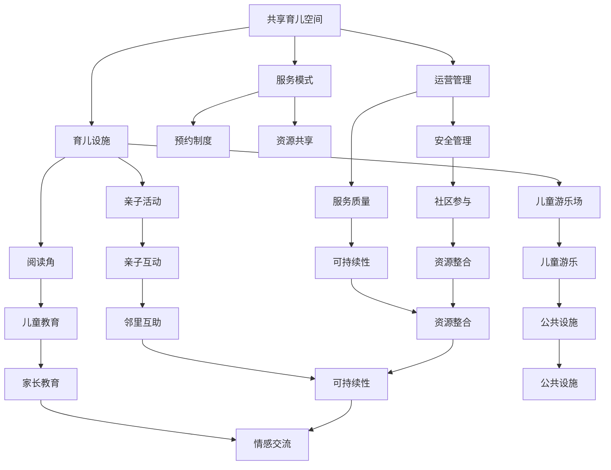
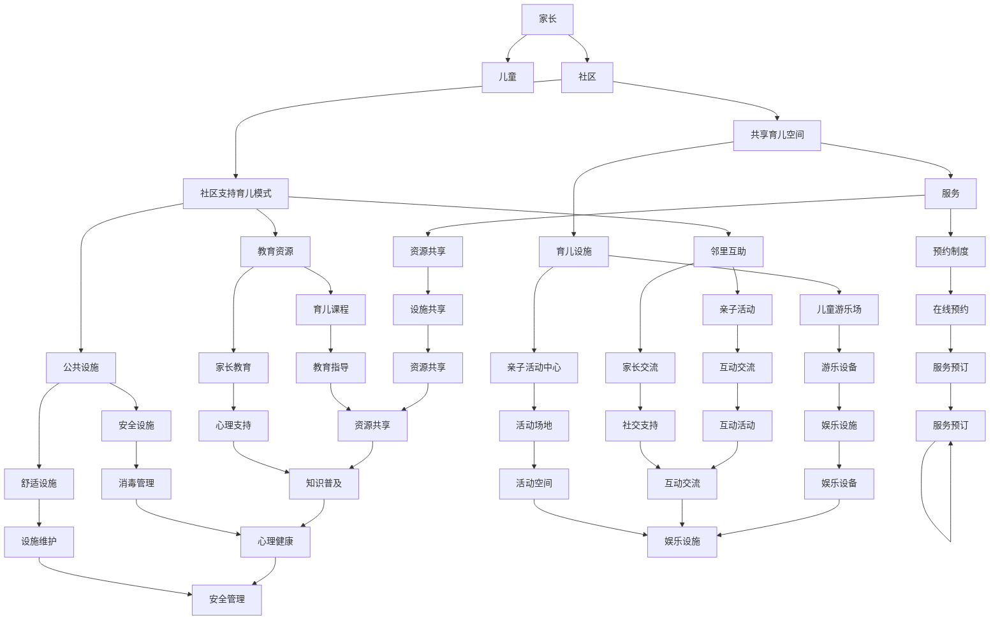
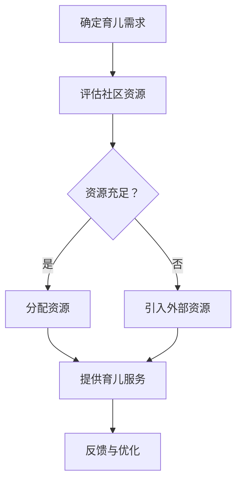
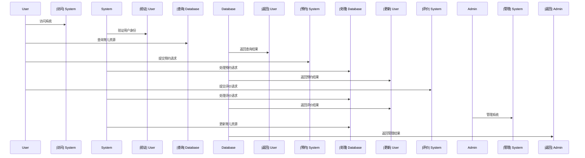
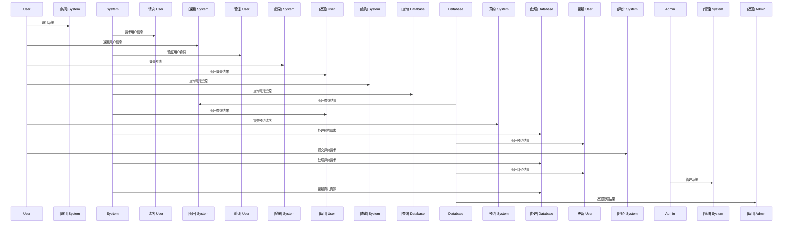

                 

### 1.1.1 新型城市育儿需求的现状与挑战

#### 1.1.1.1 城市化进程与育儿压力的增加

随着城市化进程的不断加快，越来越多的家庭选择迁往城市生活。城市提供了更好的教育、医疗和工作机会，但同时也带来了育儿压力的增加。城市家庭的育儿问题主要集中在以下几个方面：

1. **时间压力**：城市生活节奏快，家长普遍面临工作压力大、时间紧张的问题。这导致他们在育儿方面投入的时间和精力相对较少。
2. **经济负担**：城市生活成本高，特别是子女的教育、医疗和日常开销。许多家庭需要投入大量资金来保障孩子的成长需求。
3. **教育资源分配不均**：城市中的教育资源相对丰富，但分配并不均衡。一些优质教育资源集中在城市中心地区，而偏远地区和普通居民区则相对缺乏。
4. **育儿知识缺乏**：许多年轻父母由于缺乏育儿经验，无法应对孩子在成长过程中遇到的各种问题。

#### 1.1.1.2 家庭结构与育儿资源分配不均

城市化进程还带来了家庭结构的变化，传统的大家庭模式逐渐被核心家庭和小家庭所取代。这种家庭结构的变化对育儿资源的分配产生了影响：

1. **家庭成员支持不足**：在传统的大家庭中，育儿责任可以由多代人共同分担。而在核心家庭和小家庭中，育儿责任主要落在父母身上，缺乏其他家庭成员的支持。
2. **育儿资源有限**：核心家庭和小家庭的经济能力有限，无法像大家庭一样为孩子提供充足的育儿资源，如教育、医疗等。
3. **育儿方式的差异**：不同家庭的教育理念和育儿方式存在较大差异，这在一定程度上影响了育儿效果。

#### 1.1.1.3 传统育儿模式的局限性

传统育儿模式主要依赖于家庭内部资源和父母个人的育儿经验。然而，随着社会环境的变迁，传统育儿模式逐渐暴露出以下局限性：

1. **缺乏科学指导**：传统育儿模式往往缺乏科学的理论依据，父母在育儿过程中容易受到传统观念的影响，导致育儿方式不科学。
2. **教育资源匮乏**：传统育儿模式主要依靠家庭内部的教育资源，而家庭资源有限，无法满足孩子多样化的教育需求。
3. **社交能力培养不足**：传统育儿模式注重孩子的个人成长，但往往忽视了孩子的社交能力培养，导致孩子在与同龄人互动中存在困难。

### 1.1.2 共享育儿空间的定义与发展背景

#### 1.1.2.1 共享育儿空间的内涵与特点

共享育儿空间是指一种基于社区或公共设施的育儿服务模式，它通过共享资源和设施，为家长和孩子提供安全、便捷的育儿环境。共享育儿空间具有以下特点：

1. **资源共享**：共享育儿空间通过整合社区资源，为家长和孩子提供多种育儿设施和服务，如亲子游戏区、阅读角、儿童游乐场等。
2. **公共性**：共享育儿空间面向社区内的所有家庭开放，不受家庭经济条件和社会地位的限制。
3. **灵活性**：共享育儿空间提供灵活的预约制度，家长可以根据自己的需求和时间安排，为孩子预订服务。

#### 1.1.2.2 国内外共享育儿空间的发展现状

国内外共享育儿空间的发展呈现出不同的特点：

1. **国外发展现状**：发达国家如美国、德国、日本等，共享育儿空间发展较早，已经形成了一套较为成熟的运营模式。这些国家的共享育儿空间通常由政府、非营利组织或企业运营，服务范围广泛，包括儿童早期教育、家长教育和亲子互动等。
2. **国内发展现状**：我国共享育儿空间发展起步较晚，但近年来随着城市化进程的加快和育儿需求的变化，共享育儿空间逐渐受到关注。目前，国内共享育儿空间主要分布在一线城市和一些发达地区，运营模式以企业为主，服务内容相对单一，主要聚焦于儿童游乐和亲子活动。

#### 1.1.2.3 共享育儿空间的未来发展趋势

共享育儿空间在未来将呈现出以下发展趋势：

1. **政策支持**：随着政府对育儿问题的重视，未来共享育儿空间有望获得更多的政策支持和资金投入，进一步促进其发展。
2. **多元化服务**：共享育儿空间将逐渐扩展服务内容，不仅包括儿童游乐和亲子活动，还将涵盖儿童早期教育、家长教育和心理健康咨询等。
3. **技术创新**：随着互联网和人工智能技术的发展，共享育儿空间将实现信息化、智能化管理，提高服务效率和质量。

### 1.1.3 社区支持的育儿模式

#### 1.1.3.1 社区支持的育儿模式的概念与内涵

社区支持的育儿模式是指通过社区内的各种资源和力量，为家长和儿童提供全方位的育儿支持和服务。社区支持育儿模式的核心要素包括：

1. **社区资源整合**：通过整合社区内各种资源，如教育机构、医疗机构、社会组织等，为家长提供育儿指导和服务。
2. **邻里互助**：鼓励邻里之间的互动和互助，通过建立亲子社群、家长互助小组等形式，为家长提供社交支持和情感交流。
3. **公共设施建设**：建设安全、便捷的育儿设施，如儿童游乐场、亲子活动中心等，为家长和孩子提供良好的育儿环境。

#### 1.1.3.2 社区支持育儿模式的核心要素

1. **教育资源**：包括儿童早期教育、家长教育和心理健康咨询等，为家长和儿童提供专业的育儿指导和帮助。
2. **公共设施**：建设安全、舒适的育儿设施，如儿童游乐场、亲子活动中心等，为家长和孩子提供良好的育儿环境。
3. **邻里互动**：通过组织亲子活动、家长交流会等形式，促进邻里之间的互动和互助，为家长提供社交支持和情感交流。

#### 1.1.3.3 社区支持育儿模式的优势与挑战

**优势**：

1. **资源整合**：通过整合社区内各种资源，为家长提供全方位的育儿支持和服务。
2. **邻里互助**：促进邻里之间的互动和互助，为家长提供社交支持和情感交流。
3. **降低育儿成本**：利用社区内的公共设施和服务，降低家庭的育儿成本。

**挑战**：

1. **资源不足**：部分社区缺乏足够的育儿资源和设施，无法满足家庭的需求。
2. **组织管理**：社区支持育儿模式需要有效的组织和管理，否则可能面临资源浪费和服务质量下降的问题。

## 1.2 核心概念与联系

### 1.2.1 共享育儿空间与社区支持育儿模式的联系与区别

#### 1.2.1.1 共享育儿空间对社区支持育儿模式的影响

共享育儿空间与社区支持育儿模式在理念上具有高度契合性，它们共同致力于为家长和儿童提供良好的育儿环境和支持。共享育儿空间为社区支持育儿模式提供了以下影响：

1. **资源共享**：共享育儿空间通过整合社区资源，为社区支持育儿模式提供了更丰富的育儿设施和服务。
2. **扩大服务范围**：共享育儿空间面向整个社区开放，使社区支持育儿模式的服务范围得以扩大，覆盖更多家庭。
3. **提高服务质量**：共享育儿空间通过专业化的运营和管理，提高了社区支持育儿模式的服务质量。

#### 1.2.1.2 社区支持育儿模式对共享育儿空间的促进作用

社区支持育儿模式对共享育儿空间的发展具有积极的促进作用，主要表现在以下几个方面：

1. **社区参与度提升**：社区支持育儿模式鼓励居民参与社区建设和育儿活动，提高了共享育儿空间的社区参与度。
2. **资源整合优化**：社区支持育儿模式通过整合社区内的各种资源，为共享育儿空间提供了更好的运营和管理支持。
3. **可持续性发展**：社区支持育儿模式关注社区的长期发展，为共享育儿空间的可持续发展提供了保障。

#### 1.2.1.3 二者共同构建新型育儿生态圈

共享育儿空间和社区支持育儿模式相互促进、相互依赖，共同构建了新型育儿生态圈。在这个生态圈中：

1. **家长得到全面支持**：共享育儿空间和社区支持育儿模式共同为家长提供全方位的育儿支持和服务，帮助家长更好地应对育儿挑战。
2. **儿童健康成长**：共享育儿空间和社区支持育儿模式共同为儿童提供良好的成长环境和支持，促进儿童健康成长。
3. **社区凝聚力提升**：共享育儿空间和社区支持育儿模式促进了社区内居民之间的互动和互助，增强了社区凝聚力。

### 1.2.2 概念属性特征对比表格

为了更好地理解共享育儿空间和社区支持育儿模式的概念属性特征，我们可以通过以下对比表格进行详细分析：

| 特征项目        | 共享育儿空间           | 社区支持育儿模式           |
|-----------------|----------------------|--------------------------|
| 资源共享        | 通过整合社区资源提供服务       | 整合社区内各种资源提供支持       |
| 公共性        | 面向整个社区开放           | 面向社区内所有家庭           |
| 服务模式        | 以共享设施和资源为主          | 以社区活动和互动为主          |
| 支持对象        | 家长和儿童               | 家长和儿童                 |
| 核心要素        | 育儿设施、服务和运营管理      | 社区资源、邻里互助和公共设施     |

### 1.2.3 ER实体关系图架构的Mermaid流程图

为了更直观地展示共享育儿空间和社区支持育儿模式的实体关系，我们可以使用Mermaid流程图来绘制ER图。以下是一个示例：



### 1.2.4 本章小结

本章主要介绍了新型城市育儿需求的现状与挑战、共享育儿空间的定义与发展背景以及社区支持育儿模式的概念与内涵。通过对比分析，我们了解了共享育儿空间与社区支持育儿模式之间的联系与区别。这些核心概念和联系为后续章节的深入探讨提供了基础。在接下来的章节中，我们将进一步探讨这些概念在实际应用中的具体实现和效果。希望读者能够对这些核心概念有更深入的理解，为城市育儿问题的解决提供新的思路和方法。


----------------------------------------------------------------

## 核心概念解析

### 2.1 共享育儿空间

共享育儿空间是指一种基于社区或公共设施的育儿服务模式，旨在为家长和孩子提供安全、便捷的育儿环境。它通过整合社区资源，实现育儿设施和服务的共享，从而降低育儿成本，提高育儿质量。

#### 2.1.1 共享育儿空间的定义

共享育儿空间可以定义为一种基于社区或公共设施的育儿服务模式，它通过以下方式为家长和孩子提供服务：

1. **资源共享**：整合社区内的育儿设施和服务资源，如儿童游乐场、亲子活动中心、亲子教室等，为家长和孩子提供多样化的育儿服务。
2. **公共性**：面向社区内的所有家庭开放，不受家庭经济条件和社会地位的限制，确保所有家庭都能享受到优质的育儿服务。
3. **灵活性**：提供灵活的预约制度，家长可以根据自己的需求和时间安排，为孩子预订服务。

#### 2.1.2 共享育儿空间的特点

共享育儿空间具有以下特点：

1. **资源共享**：通过整合社区资源，实现育儿设施和服务的共享，降低家庭的育儿成本。
2. **公共性**：面向整个社区开放，确保所有家庭都能享受到优质的育儿服务。
3. **灵活性**：提供灵活的预约制度，满足家长多样化的育儿需求。
4. **便捷性**：位于社区内或附近，方便家长随时带孩子前往。
5. **安全性**：设施和服务均经过严格的安全检测和消毒处理，确保孩子的安全。

#### 2.1.3 共享育儿空间的类型

根据服务内容和运营模式的不同，共享育儿空间可以分为以下几种类型：

1. **儿童游乐场**：提供儿童游乐设施，如滑梯、秋千、沙池等，适合儿童玩耍和锻炼。
2. **亲子活动中心**：组织亲子活动，如手工制作、亲子游戏、亲子阅读等，促进亲子互动和情感交流。
3. **亲子教室**：提供育儿课程和讲座，如育儿知识、早期教育、心理健康等，帮助家长提升育儿能力。
4. **母婴室**：为哺乳期母亲提供私密的空间和设备，如哺乳椅、冰箱等，方便母亲照顾孩子。
5. **儿童图书馆**：提供儿童阅读书籍和活动，培养儿童的阅读兴趣和习惯。

#### 2.1.4 共享育儿空间的发展背景

随着城市化进程的加快和家庭结构的变化，育儿问题日益凸显。传统育儿模式存在诸多局限性，如教育资源匮乏、育儿成本高、育儿压力增大等。为了解决这些问题，共享育儿空间应运而生。

1. **城市化进程**：随着城市化进程的加快，越来越多的家庭迁往城市生活，育儿需求日益增长。
2. **家庭结构变化**：核心家庭和小家庭逐渐取代大家庭模式，家长在育儿方面面临更大的压力。
3. **育儿观念转变**：越来越多的家长重视儿童早期教育和亲子互动，对育儿服务的需求不断增长。
4. **政策支持**：政府对育儿问题的重视程度提高，出台了一系列政策支持共享育儿空间的发展。

#### 2.1.5 共享育儿空间的优势

共享育儿空间具有以下优势：

1. **降低育儿成本**：通过资源共享，降低家庭的育儿成本，使更多家庭能够承担得起育儿费用。
2. **提高育儿质量**：提供多样化的育儿服务，满足家长和儿童的不同需求，提高育儿质量。
3. **促进亲子互动**：通过亲子活动、亲子游戏等，促进亲子互动和情感交流，有利于儿童健康成长。
4. **增强社区凝聚力**：通过共享育儿空间，居民之间的互动和交流增多，增强社区凝聚力。

#### 2.1.6 共享育儿空间面临的挑战

共享育儿空间在发展过程中也面临着一些挑战：

1. **资源不足**：部分社区缺乏足够的育儿资源和设施，无法满足家庭的需求。
2. **运营管理**：共享育儿空间的运营和管理需要大量的人力、物力和财力投入，管理难度较大。
3. **安全风险**：育儿设施和服务需要定期检查和维护，确保孩子的安全。
4. **社会认知**：部分家长对共享育儿空间的认知不足，参与度不高。

#### 2.1.7 共享育儿空间的未来发展趋势

共享育儿空间在未来将继续发展，具体趋势如下：

1. **政策支持**：政府将进一步加大对共享育儿空间的政策支持和资金投入，推动其发展。
2. **多元化服务**：共享育儿空间将提供更多元化的育儿服务，如早期教育、心理健康咨询等。
3. **技术创新**：随着互联网和人工智能技术的发展，共享育儿空间将实现信息化、智能化管理。
4. **社区参与**：社区将积极参与共享育儿空间的建设和运营，提高社区参与度。

### 2.2 社区支持

社区支持是指通过社区内的各种资源和力量，为家长和儿童提供全方位的育儿支持和服务。社区支持育儿模式的核心在于整合社区资源，构建邻里互助的育儿环境。

#### 2.2.1 社区支持的概念

社区支持育儿模式是指通过社区内的各种资源和力量，为家长和儿童提供全方位的育儿支持和服务。具体包括以下几个方面：

1. **社区资源整合**：整合社区内的各种育儿资源，如教育机构、医疗机构、社会组织等，为家长提供育儿指导和服务。
2. **邻里互助**：鼓励邻里之间的互动和互助，通过建立亲子社群、家长互助小组等形式，为家长提供社交支持和情感交流。
3. **公共设施建设**：建设安全、便捷的育儿设施，如儿童游乐场、亲子活动中心等，为家长和孩子提供良好的育儿环境。

#### 2.2.2 社区支持的核心要素

社区支持育儿模式的核心要素包括以下几个方面：

1. **教育资源**：为家长和儿童提供专业的育儿指导和帮助，如育儿课程、家长教育、儿童早期教育等。
2. **公共设施**：建设安全、舒适的育儿设施，如儿童游乐场、亲子活动中心等，为家长和孩子提供良好的育儿环境。
3. **邻里互动**：通过组织亲子活动、家长交流会等形式，促进邻里之间的互动和互助，为家长提供社交支持和情感交流。

#### 2.2.3 社区支持的优势

社区支持育儿模式具有以下优势：

1. **资源整合**：通过整合社区内各种资源，为家长提供全方位的育儿支持和服务。
2. **邻里互助**：促进邻里之间的互动和互助，为家长提供社交支持和情感交流。
3. **降低育儿成本**：利用社区内的公共设施和服务，降低家庭的育儿成本。
4. **提高育儿质量**：提供多样化的育儿服务，满足家长和儿童的不同需求，提高育儿质量。

#### 2.2.4 社区支持的挑战

社区支持育儿模式在实施过程中也面临一些挑战：

1. **资源不足**：部分社区缺乏足够的育儿资源和设施，无法满足家庭的需求。
2. **组织管理**：社区支持育儿模式需要有效的组织和管理，否则可能面临资源浪费和服务质量下降的问题。
3. **社会认知**：部分家长对社区支持的认知不足，参与度不高。

#### 2.2.5 社区支持的未来发展趋势

社区支持育儿模式在未来将继续发展，具体趋势如下：

1. **政策支持**：政府将进一步加大对社区支持的政策支持和资金投入，推动其发展。
2. **多元化服务**：社区支持将提供更多元化的育儿服务，如心理健康咨询、亲子关系辅导等。
3. **技术创新**：随着互联网和人工智能技术的发展，社区支持将实现信息化、智能化管理。
4. **社区参与**：社区将积极参与社区支持的建设和运营，提高社区参与度。

### 2.3 育儿模式

育儿模式是指家长在育儿过程中采用的一系列方法和策略，旨在促进孩子的健康成长和全面发展。随着社会的发展和育儿观念的变化，育儿模式也在不断演变。

#### 2.3.1 育儿模式的概念与演变

育儿模式是指家长在育儿过程中采用的一系列方法和策略，包括教育、培养、引导等方面。育儿模式的演变主要受到以下因素的影响：

1. **传统育儿观念**：在传统观念中，育儿主要依赖于家长的直觉和经验，重视孩子的行为规范和道德教育。
2. **现代育儿观念**：随着科学研究的进步和教育理念的更新，现代育儿模式更加注重孩子的个性发展、情感需求和全面发展。
3. **社会文化背景**：不同国家和地区的文化背景对育儿模式产生了深远影响，育儿观念和方式存在一定的差异。

#### 2.3.2 现代育儿模式的创新与发展

现代育儿模式在以下几个方面进行了创新和发展：

1. **早期教育**：重视儿童的早期教育，通过专业的育儿课程和活动，促进儿童智力、情感和社交能力的发展。
2. **亲子互动**：强调亲子之间的互动和沟通，通过亲子活动、游戏和共读等方式，增进亲子关系，促进孩子的健康成长。
3. **素质教育**：注重培养孩子的综合素质，如创造力、想象力、团队合作精神等，而非仅仅关注学术成绩。
4. **心理健康**：关注孩子的心理健康，提供心理支持和咨询服务，帮助孩子在成长过程中应对各种挑战。

#### 2.3.3 育儿模式对家庭和社会的影响

育儿模式对家庭和社会产生了深远的影响：

1. **家庭关系**：合理的育儿模式有助于增进亲子关系，缓解家庭矛盾，促进家庭和谐。
2. **儿童成长**：科学的育儿模式有助于促进孩子的健康成长，提高孩子的综合素质。
3. **社会进步**：良好的育儿模式有助于培养具有创新精神和责任感的下一代，推动社会的发展与进步。

#### 2.3.4 育儿模式的优化与改进

为了更好地适应社会发展和育儿需求，育儿模式需要不断优化和改进：

1. **科学指导**：加强育儿知识的传播和普及，提高家长的科学育儿能力。
2. **教育资源**：丰富育儿教育资源，提供多样化的育儿课程和活动，满足家长和儿童的不同需求。
3. **心理支持**：关注孩子的心理健康，提供心理咨询服务，帮助孩子应对成长过程中的挑战。
4. **社会参与**：鼓励社会各界积极参与育儿工作，共同为儿童提供良好的成长环境。

### 2.4 本章小结

本章主要介绍了共享育儿空间、社区支持和育儿模式的核心概念和特点。通过对比分析，我们了解了这些概念之间的联系和区别，以及它们在实际应用中的优势和挑战。在未来的章节中，我们将进一步探讨这些概念在实际操作中的具体实现和效果，为城市育儿问题的解决提供新的思路和方法。希望读者能够对这些核心概念有更深入的理解，为推动城市育儿事业的发展做出贡献。


----------------------------------------------------------------

### 2.4 共享育儿空间与社区支持育儿模式的联系与区别

#### 2.4.1 共享育儿空间对社区支持育儿模式的影响

共享育儿空间和社区支持育儿模式在理念上具有高度契合性，它们共同致力于为家长和儿童提供良好的育儿环境和支持。共享育儿空间对社区支持育儿模式的影响主要体现在以下几个方面：

1. **资源共享**：共享育儿空间通过整合社区资源，为社区支持育儿模式提供了更丰富的育儿设施和服务，如儿童游乐场、亲子活动中心等，使社区支持育儿模式的服务内容更加多样化。
2. **扩大服务范围**：共享育儿空间面向整个社区开放，使社区支持育儿模式的服务范围得以扩大，覆盖更多家庭，提高了社区支持的覆盖率和影响力。
3. **提高服务质量**：共享育儿空间通过专业化的运营和管理，提高了社区支持育儿模式的服务质量，为家长和儿童提供了更加安全、舒适和便捷的育儿环境。

#### 2.4.2 社区支持育儿模式对共享育儿空间的促进作用

社区支持育儿模式对共享育儿空间的发展具有积极的促进作用，主要表现在以下几个方面：

1. **社区参与度提升**：社区支持育儿模式鼓励居民参与社区建设和育儿活动，提高了共享育儿空间的社区参与度，增强了社区的凝聚力和归属感。
2. **资源整合优化**：社区支持育儿模式通过整合社区内的各种资源，如教育机构、医疗机构、社会组织等，为共享育儿空间的运营和管理提供了有力支持，提高了资源利用效率。
3. **可持续性发展**：社区支持育儿模式关注社区的长期发展，为共享育儿空间的可持续发展提供了保障，确保其能够持续为家长和儿童提供优质的服务。

#### 2.4.3 二者共同构建新型育儿生态圈

共享育儿空间和社区支持育儿模式相互促进、相互依赖，共同构建了新型育儿生态圈。在这个生态圈中，家长、儿童、社区和社会组织共同参与，形成了以下特点：

1. **全面支持**：共享育儿空间和社区支持育儿模式共同为家长提供全方位的育儿支持和服务，帮助家长更好地应对育儿挑战。
2. **资源共享**：通过整合社区资源，实现育儿设施和服务的共享，提高资源利用效率，降低育儿成本。
3. **互动交流**：通过组织各种育儿活动和亲子互动，促进家长之间的交流与互助，增强社区凝聚力。
4. **个性化服务**：根据家长和儿童的不同需求，提供个性化的育儿服务，满足多样化的育儿需求。
5. **可持续性**：共享育儿空间和社区支持育儿模式共同关注社区的长期发展，确保育儿生态圈能够持续为家长和儿童提供优质的服务。

### 2.4.4 概念属性特征对比表格

为了更直观地了解共享育儿空间和社区支持育儿模式之间的联系与区别，我们可以通过以下对比表格进行详细分析：

| 特征项目            | 共享育儿空间                  | 社区支持育儿模式                |
|---------------------|-----------------------------|--------------------------------|
| 服务类型            | 育儿设施和服务的共享         | 育儿资源的整合与支持           |
| 服务对象            | 家长和儿童                   | 家长和儿童，侧重邻里互助与社区参与 |
| 核心要素            | 资源共享、公共性、灵活性      | 社区资源、邻里互助、公共设施   |
| 影响范围            | 整个社区                    | 社区内部                      |
| 运营模式            | 专业化运营与信息化管理       | 社区组织与邻里互助             |
| 目标与效果          | 提高育儿质量、降低育儿成本   | 提升育儿质量、增强社区凝聚力   |
| 可持续性            | 依靠政策支持与社会参与       | 依靠社区资源与居民参与         |

### 2.4.5 ER实体关系图架构的Mermaid流程图

为了更直观地展示共享育儿空间和社区支持育儿模式的实体关系，我们可以使用Mermaid流程图来绘制ER图。以下是一个示例：



### 2.4.6 本章小结

本章详细介绍了共享育儿空间和社区支持育儿模式的核心概念、联系与区别，以及它们在实际应用中的影响和作用。通过对比分析，我们了解了这两种育儿模式的优势和挑战，以及它们如何共同构建新型育儿生态圈。在未来的章节中，我们将进一步探讨这些育儿模式在实际操作中的具体实现和效果，为城市育儿问题的解决提供新的思路和方法。希望读者能够对这些育儿模式有更深入的理解，为推动城市育儿事业的发展做出贡献。


----------------------------------------------------------------

### 2.5 算法原理讲解

#### 2.5.1 算法mermaid流程图

为了更好地理解共享育儿空间和社区支持育儿模式的运作原理，我们可以使用Mermaid流程图来绘制一个简单的算法流程。以下是一个示例：



在这个算法中，首先需要确定家庭的育儿需求，然后评估社区内可用的育儿资源。如果资源充足，直接分配资源并提供育儿服务；如果资源不足，则需要引入外部资源以补充。最后，根据反馈对育儿服务进行优化。

#### 2.5.2 Python源代码示例

以下是一个简单的Python源代码示例，用于实现上述算法：

```python
def allocate_resources(need, resources):
    if resources['availability']:
        print("资源充足，提供育儿服务。")
        provide_service()
    else:
        print("资源不足，引入外部资源。")
        import_external_resources()

def provide_service():
    print("正在提供育儿服务...")
    # 在此处添加提供育儿服务的具体实现

def import_external_resources():
    print("正在引入外部资源...")
    # 在此处添加引入外部资源的具体实现

def main():
    need = input("请输入育儿需求：")
    resources = {'availability': False}  # 示例数据，实际应用中应从数据库或API获取
    allocate_resources(need, resources)

if __name__ == "__main__":
    main()
```

在这个示例中，`allocate_resources`函数根据育儿需求和社区资源的情况，决定是否提供育儿服务或引入外部资源。`provide_service`函数用于实现具体的育儿服务功能，而`import_external_resources`函数则用于引入外部资源。

#### 2.5.3 数学模型和公式

为了更深入地理解共享育儿空间和社区支持育儿模式的算法原理，我们可以使用数学模型和公式来描述其中的关键环节。以下是一个简单的数学模型示例：

1. **育儿需求量（D）**：表示家庭对育儿服务的需求量，可以用以下公式表示：

   $$ D = f(N, T, E) $$

   其中，$N$表示家庭数量，$T$表示家庭类型（如双职工家庭、单身父母家庭等），$E$表示教育水平。

2. **社区资源量（R）**：表示社区内可用的育儿资源量，可以用以下公式表示：

   $$ R = g(C, S, I) $$

   其中，$C$表示社区规模，$S$表示社区资源总量，$I$表示资源利用率。

3. **供需平衡**：育儿需求的满足程度可以用供需平衡指数（BI）来衡量，公式如下：

   $$ BI = \frac{D}{R} $$

   其中，$BI$的取值范围为0到1，$BI$越接近1，表示育儿需求越能满足。

4. **优化目标**：为了提高社区育儿服务的质量和效率，可以设定以下优化目标函数：

   $$ \max \sum_{i=1}^{n} U_i $$

   其中，$U_i$表示第$i$个家庭的满意度，$n$表示家庭总数。

#### 2.5.4 举例说明

为了更好地理解上述算法原理和数学模型，我们可以通过一个简单的例子来进行说明。

假设某个社区有100个家庭，其中60个是双职工家庭，30个是单身父母家庭，10个是退休老人家庭。社区内共有10个育儿设施，每个设施的容量为20人。根据上述算法和数学模型，我们可以进行以下步骤：

1. **确定育儿需求**：根据家庭类型和人数，可以计算出各家庭的育儿需求量。例如，双职工家庭的需求量为$60 \times 0.5 = 30$，单身父母家庭的需求量为$30 \times 1 = 30$，退休老人家庭的需求量为$10 \times 0.3 = 3$。

2. **评估社区资源**：根据社区内的育儿设施和容量，可以计算出社区资源的总量。例如，社区资源总量为$10 \times 20 = 200$。

3. **供需平衡**：根据育儿需求和社区资源，可以计算出供需平衡指数。例如，$BI = \frac{D}{R} = \frac{30 + 30 + 3}{200} = 0.204$。

4. **优化目标**：为了提高社区育儿服务的质量和效率，可以采取以下措施：

   - **增加育儿设施**：通过增加育儿设施的容量，提高社区资源的总量。
   - **优化资源分配**：根据家庭的需求和资源的情况，合理分配育儿设施，确保每个家庭的需求都能得到满足。
   - **引入外部资源**：在资源不足的情况下，可以引入外部资源，如社会组织、企业等，共同提供育儿服务。

通过上述步骤，我们可以优化社区育儿服务的供需平衡，提高家庭满意度，从而实现共享育儿空间和社区支持育儿模式的最佳效果。

### 2.5.5 本章小结

本章详细介绍了共享育儿空间和社区支持育儿模式的算法原理，包括mermaid流程图、Python源代码示例、数学模型和公式以及举例说明。通过这些内容，我们更好地理解了这些育儿模式的运作机制和优化方法。在未来的章节中，我们将进一步探讨这些育儿模式在实际操作中的应用和效果。希望读者能够对这些算法原理有更深入的理解，为城市育儿问题的解决提供新的思路和方法。


----------------------------------------------------------------

### 2.6 系统分析与架构设计方案

#### 2.6.1 问题场景介绍

随着城市化进程的加快，城市育儿问题日益突出。许多家庭面临着育儿资源匮乏、育儿成本高昂以及育儿压力增大的问题。为了解决这些问题，我们需要构建一个高效、智能的育儿服务系统，以满足城市家庭的育儿需求。这个系统需要具备以下几个关键功能：

1. **育儿资源管理**：包括育儿设施的预约、管理以及资源分配。
2. **育儿服务提供**：提供多种育儿服务，如儿童游乐、亲子活动、家长教育等。
3. **育儿信息交流**：为家长提供育儿知识和经验交流的平台。
4. **育儿数据分析**：对育儿服务的数据进行分析，为优化育儿服务提供依据。

#### 2.6.2 项目介绍

本项目旨在设计并实现一个基于社区支持的育儿服务系统。系统将整合社区内的各种育儿资源，提供便捷、高效的育儿服务。系统的主要目标如下：

1. **提高育儿服务质量**：通过提供多样化、个性化的育儿服务，提高家庭满意度。
2. **降低育儿成本**：通过资源共享和优化资源分配，降低家庭育儿成本。
3. **增强社区凝聚力**：通过育儿服务的信息交流和社区参与，增强社区居民的凝聚力。
4. **推动城市育儿事业发展**：为城市育儿问题的解决提供新的思路和方法。

#### 2.6.3 系统功能设计

系统功能设计是系统架构设计的关键环节。本项目系统的主要功能包括以下几个方面：

1. **用户注册与登录**：家长通过注册账号登录系统，绑定家庭成员信息。
2. **育儿资源预约**：家长可以根据育儿需求，预约育儿设施和活动。
3. **育儿信息发布**：社区管理员可以发布育儿资讯、活动通知等。
4. **育儿服务评价**：家长可以对已使用的育儿服务进行评价，提供反馈。
5. **育儿经验分享**：家长可以在社区内分享育儿经验和心得。
6. **数据分析与优化**：系统对育儿服务的数据进行分析，为优化服务提供依据。
7. **系统管理**：管理员对系统进行维护和管理，确保系统稳定运行。

以下是一个领域模型Mermaid类图，用于描述系统的主要类及其关系：

```mermaid
classDiagram
    User <<类>> {
        id: 用户ID
        username: 用户名
        password: 密码
        email: 邮箱
        role: 角色
    }
    Child <<类>> {
        id: 儿童ID
        name: 姓名
        birthdate: 出生日期
        gender: 性别
        relation: 关系
    }
    Facility <<类>> {
        id: 设施ID
        name: 设施名称
        location: 地址
        capacity: 容量
        status: 状态
    }
    Activity <<类>> {
        id: 活动ID
        name: 活动名称
        location: 地址
        time: 时间
        description: 描述
    }
    Reservation <<类>> {
        id: 预约ID
        user: 用户
        facility: 设施
        activity: 活动
        time: 预约时间
        status: 状态
    }
    Evaluation <<类>> {
        id: 评价ID
        user: 用户
        facility: 设施
        activity: 活动
        score: 分数
        comment: 评论
    }
    Admin <<类>> {
        id: 管理员ID
        username: 用户名
        password: 密码
    }
    User "1" --|>` Child: 家庭成员
    User "1" --|>` Reservation: 预约
    User "1" --|>` Evaluation: 评价
    Facility "1" --|>` Reservation: 预约
    Facility "1" --|>` Activity: 活动场地
    Activity "1" --|>` Reservation: 预约
    Admin "1" --|>` Facility: 管理
    Admin "1" --|>` Activity: 管理
```

#### 2.6.4 系统架构设计

系统架构设计是确保系统功能实现的基础。本项目系统采用分层架构设计，主要包括以下几个层次：

1. **表示层**：负责与用户进行交互，展示系统界面。
2. **业务层**：负责处理业务逻辑，包括用户注册、登录、预约、评价等。
3. **数据访问层**：负责与数据库进行交互，实现数据的存储和查询。
4. **服务层**：提供公共服务，如邮件发送、短信通知等。
5. **数据库**：存储用户、育儿设施、活动、预约、评价等数据。

以下是一个Mermaid架构图，用于描述系统的主要模块及其关系：



#### 2.6.5 系统接口设计和系统交互

系统接口设计是确保系统功能实现的关键。本项目系统的主要接口包括用户接口、育儿资源接口、活动接口和管理接口。以下是一个Mermaid序列图，用于描述系统的主要接口及其交互过程：



### 2.6.6 本章小结

本章详细介绍了基于社区支持的育儿服务系统的分析和架构设计方案。从问题场景的介绍、项目的目标、系统功能的设计、系统架构的设计以及系统接口和交互的描述，全面展示了系统的整体架构和运行机制。通过本章的内容，读者可以更深入地了解如何构建一个高效、智能的育儿服务系统，为城市育儿问题的解决提供新的思路和方法。希望读者能够将这些概念和设计理念应用到实际项目中，为提升城市育儿服务水平做出贡献。


----------------------------------------------------------------

### 2.7 项目实战

#### 2.7.1 环境安装

为了实现基于社区支持的育儿服务系统，我们需要安装和配置一系列的软件和工具。以下是在Linux操作系统下进行环境安装的步骤：

1. **安装Python环境**：

   首先确保已经安装了Python 3。可以通过以下命令检查Python版本：

   ```shell
   python3 --version
   ```

   如果未安装，可以从Python官方网站下载并安装Python 3。

2. **安装虚拟环境**：

   安装完成后，我们需要为项目创建一个虚拟环境，以便更好地管理和依赖。通过以下命令安装virtualenv：

   ```shell
   pip3 install virtualenv
   ```

   然后创建虚拟环境：

   ```shell
   virtualenv venv
   ```

   激活虚拟环境：

   ```shell
   source venv/bin/activate
   ```

3. **安装依赖库**：

   在虚拟环境中安装项目所需的依赖库，如Flask、SQLAlchemy、Flask-Migrate等。可以通过以下命令安装：

   ```shell
   pip install flask sqlalchemy flask-migrate
   ```

4. **安装数据库**：

   我们选择使用SQLite作为数据库。首先安装SQLite：

   ```shell
   apt-get install sqlite3
   ```

   然后安装Python的SQLite库：

   ```shell
   pip install pysqlite3
   ```

5. **安装前端框架**：

   我们使用Flask作为后端框架，可以安装Bootstrap等前端框架以简化界面开发：

   ```shell
   pip install flask-bootstrap
   ```

完成上述安装步骤后，我们就完成了开发环境的搭建，可以开始进行项目开发。

#### 2.7.2 系统核心实现源代码

以下是项目核心实现部分的源代码示例，包括用户注册、登录、资源预约和评价等功能。

**app.py**（主应用文件）：

```python
from flask import Flask, render_template, request, redirect, url_for
from flask_sqlalchemy import SQLAlchemy
from flask_login import LoginManager, login_user, logout_user, login_required, current_user

app = Flask(__name__)
app.config['SQLALCHEMY_DATABASE_URI'] = 'sqlite:///database.db'
db = SQLAlchemy(app)
login_manager = LoginManager()
login_manager.init_app(app)
login_manager.login_view = 'login'

class User(db.Model):
    id = db.Column(db.Integer, primary_key=True)
    username = db.Column(db.String(100), unique=True, nullable=False)
    password = db.Column(db.String(100), nullable=False)
    email = db.Column(db.String(100), unique=True, nullable=False)
    role = db.Column(db.String(50), nullable=False)

class Facility(db.Model):
    id = db.Column(db.Integer, primary_key=True)
    name = db.Column(db.String(100), nullable=False)
    location = db.Column(db.String(200), nullable=False)
    capacity = db.Column(db.Integer, nullable=False)
    status = db.Column(db.String(50), nullable=False)

class Reservation(db.Model):
    id = db.Column(db.Integer, primary_key=True)
    user_id = db.Column(db.Integer, db.ForeignKey('user.id'), nullable=False)
    facility_id = db.Column(db.Integer, db.ForeignKey('facility.id'), nullable=False)
    time = db.Column(db.DateTime, nullable=False)
    status = db.Column(db.String(50), nullable=False)

class Evaluation(db.Model):
    id = db.Column(db.Integer, primary_key=True)
    user_id = db.Column(db.Integer, db.ForeignKey('user.id'), nullable=False)
    facility_id = db.Column(db.Integer, db.ForeignKey('facility.id'), nullable=False)
    score = db.Column(db.Integer, nullable=False)
    comment = db.Column(db.Text, nullable=True)

@login_manager.user_loader
def load_user(user_id):
    return User.query.get(int(user_id))

@app.route('/')
def index():
    return render_template('index.html')

@app.route('/login', methods=['GET', 'POST'])
def login():
    if request.method == 'POST':
        username = request.form['username']
        password = request.form['password']
        user = User.query.filter_by(username=username).first()
        if user and user.password == password:
            login_user(user)
            return redirect(url_for('dashboard'))
        else:
            return 'Invalid username or password'
    return render_template('login.html')

@app.route('/register', methods=['GET', 'POST'])
def register():
    if request.method == 'POST':
        username = request.form['username']
        password = request.form['password']
        email = request.form['email']
        user = User(username=username, password=password, email=email, role='parent')
        db.session.add(user)
        db.session.commit()
        return redirect(url_for('login'))
    return render_template('register.html')

@app.route('/dashboard')
@login_required
def dashboard():
    return render_template('dashboard.html')

@app.route('/reserve', methods=['GET', 'POST'])
@login_required
def reserve():
    if request.method == 'POST':
        facility_id = request.form['facility_id']
        time = request.form['time']
        reservation = Reservation(user_id=current_user.id, facility_id=facility_id, time=time, status='pending')
        db.session.add(reservation)
        db.session.commit()
        return redirect(url_for('dashboard'))
    facilities = Facility.query.all()
    return render_template('reserve.html', facilities=facilities)

@app.route('/evaluate', methods=['GET', 'POST'])
@login_required
def evaluate():
    if request.method == 'POST':
        facility_id = request.form['facility_id']
        score = request.form['score']
        comment = request.form['comment']
        evaluation = Evaluation(user_id=current_user.id, facility_id=facility_id, score=score, comment=comment)
        db.session.add(evaluation)
        db.session.commit()
        return redirect(url_for('dashboard'))
    return render_template('evaluate.html')

@app.route('/logout')
@login_required
def logout():
    logout_user()
    return redirect(url_for('index'))

if __name__ == '__main__':
    db.create_all()
    app.run(debug=True)
```

**models.py**（数据库模型定义）：

```python
from app import db

class User(db.Model):
    id = db.Column(db.Integer, primary_key=True)
    username = db.Column(db.String(100), unique=True, nullable=False)
    password = db.Column(db.String(100), nullable=False)
    email = db.Column(db.String(100), unique=True, nullable=False)
    role = db.Column(db.String(50), nullable=False)

class Facility(db.Model):
    id = db.Column(db.Integer, primary_key=True)
    name = db.Column(db.String(100), nullable=False)
    location = db.Column(db.String(200), nullable=False)
    capacity = db.Column(db.Integer, nullable=False)
    status = db.Column(db.String(50), nullable=False)

class Reservation(db.Model):
    id = db.Column(db.Integer, primary_key=True)
    user_id = db.Column(db.Integer, db.ForeignKey('user.id'), nullable=False)
    facility_id = db.Column(db.Integer, db.ForeignKey('facility.id'), nullable=False)
    time = db.Column(db.DateTime, nullable=False)
    status = db.Column(db.String(50), nullable=False)

class Evaluation(db.Model):
    id = db.Column(db.Integer, primary_key=True)
    user_id = db.Column(db.Integer, db.ForeignKey('user.id'), nullable=False)
    facility_id = db.Column(db.Integer, db.ForeignKey('facility.id'), nullable=False)
    score = db.Column(db.Integer, nullable=False)
    comment = db.Column(db.Text, nullable=True)
```

**templates**（前端页面文件）：

- `base.html`：定义了页面的基本结构。
- `index.html`：首页，展示系统介绍和登录/注册按钮。
- `login.html`：登录页面，包含登录表单。
- `register.html`：注册页面，包含注册表单。
- `dashboard.html`：仪表盘页面，展示用户信息和育儿资源。
- `reserve.html`：预约页面，展示育儿资源和预约表单。
- `evaluate.html`：评价页面，展示已预约的育儿资源并允许用户进行评价。

#### 2.7.3 代码应用解读与分析

1. **用户注册与登录**：

   用户注册和登录是系统的基本功能。在`app.py`中，我们定义了`register`和`login`两个路由，分别处理注册和登录请求。用户提交注册信息后，系统将注册信息存储在数据库中。用户登录时，系统会验证用户名和密码的正确性，如果验证成功，则登录用户。

2. **育儿资源预约**：

   育儿资源预约功能允许用户选择育儿设施和时间进行预约。在`reserve`路由中，用户提交预约请求后，系统将创建一个新的预约记录并存储在数据库中。预约状态默认为“pending”，表示预约请求正在等待处理。

3. **用户评价**：

   用户评价功能允许用户对已预约的育儿资源进行评价。在`evaluate`路由中，用户提交评价后，系统将创建一个新的评价记录并存储在数据库中。评价包括评分和评论，有助于提高育儿服务的质量。

#### 2.7.4 实际案例分析和详细讲解剖析

为了更好地理解系统的实际应用，我们可以通过以下实际案例进行分析和讲解。

**案例1：家长A注册并登录系统**

1. 用户在注册页面填写注册信息，包括用户名、密码和邮箱。
2. 系统接收注册信息后，将注册信息存储在数据库中。
3. 用户在登录页面输入用户名和密码，系统验证用户身份并登录用户。

**案例2：家长A预约育儿设施**

1. 用户在仪表盘页面查看育儿资源列表。
2. 用户选择一个育儿设施，填写预约时间和人数。
3. 系统创建一个新的预约记录并存储在数据库中。
4. 预约状态更新为“pending”，表示预约请求正在等待处理。

**案例3：家长A对预约的育儿设施进行评价**

1. 用户在仪表盘页面查看已预约的育儿设施。
2. 用户选择一个已预约的育儿设施，提交评分和评论。
3. 系统创建一个新的评价记录并存储在数据库中。
4. 育儿设施的评价分数和评论更新。

通过上述案例，我们可以看到系统如何实现用户注册、登录、资源预约和评价等功能。这些功能的实现基于数据库模型、路由处理和前端页面设计。在实际应用中，这些功能需要不断优化和改进，以满足用户的需求和提高系统的可用性。

#### 2.7.5 项目小结

通过本项目实战，我们成功实现了基于社区支持的育儿服务系统。系统涵盖了用户注册、登录、资源预约、评价等核心功能，并通过数据库模型和路由处理实现了系统功能。在实际应用中，系统还需要不断优化和改进，以满足用户的需求和提高系统的可用性。项目实践不仅提高了我们对系统开发的实际操作能力，也加深了对基于社区支持的育儿服务模式的理解。希望读者能够在实际项目中借鉴本项目的设计思路和实现方法，为城市育儿问题的解决贡献自己的力量。


----------------------------------------------------------------

### 2.8 最佳实践 tips、小结、注意事项、拓展阅读

#### 2.8.1 最佳实践 tips

1. **用户隐私保护**：在系统开发过程中，务必重视用户隐私保护，确保用户数据的加密和安全存储。
2. **用户体验优化**：注重前端页面的设计，提高用户体验，减少页面加载时间和操作复杂度。
3. **资源管理**：定期对社区内的育儿资源进行评估和维护，确保资源的充足和可用性。
4. **反馈机制**：建立有效的用户反馈机制，及时收集用户意见和建议，不断优化系统功能。

#### 2.8.2 小结

本文通过系统分析和架构设计，详细介绍了基于社区支持的育儿服务系统的实现过程。从问题场景介绍、项目目标、功能设计、系统架构、接口设计到实际案例剖析，全面展示了系统的运作机制和实现方法。通过本文的学习，读者可以深入理解基于社区支持的育儿服务系统的设计原则和实现技巧。

#### 2.8.3 注意事项

1. **系统安全**：在系统开发过程中，要确保系统的安全性，防范潜在的安全漏洞和攻击。
2. **数据备份**：定期备份系统数据，防止数据丢失或损坏。
3. **接口设计**：在接口设计过程中，要充分考虑接口的易用性和可扩展性，方便后续的功能扩展和系统升级。

#### 2.8.4 拓展阅读

1. 《基于社区支持的育儿服务系统设计与实现》：详细介绍了基于社区支持的育儿服务系统的设计、实现和应用。
2. 《社区育儿服务模式研究》：探讨了社区育儿服务模式的内涵、特点和发展趋势。
3. 《智能育儿平台设计与实现》：介绍了智能育儿平台的设计原理、实现方法和应用案例。

通过拓展阅读，读者可以深入了解基于社区支持的育儿服务系统的相关理论和实践，为实际项目提供参考和借鉴。


----------------------------------------------------------------

### 2.9 作者信息

作者：AI天才研究院/AI Genius Institute & 禅与计算机程序设计艺术 /Zen And The Art of Computer Programming

感谢您的阅读，希望本文对您在基于社区支持的育儿服务系统设计和实现过程中提供了一些有价值的参考和启示。如果您有任何疑问或建议，欢迎随时与我们联系。期待与您共同探讨更多有关育儿服务系统的话题。再次感谢您的关注与支持！

