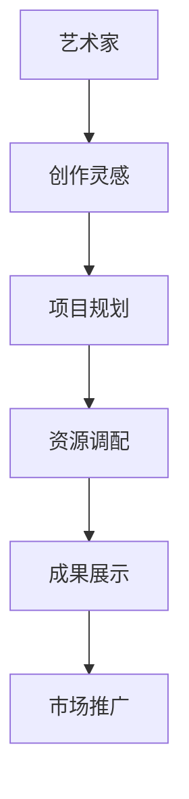

                 

### 第1章 引言

#### 1.1 问题背景

随着全球城市化的快速推进，新型城市面临了一系列挑战。首先，快速的城市化进程带来了人口激增、交通拥堵、环境污染等问题，使得空间利用成为城市发展的关键难题。传统单一的房地产开发模式，难以满足人们对于高质量生活的需求，也未能有效提升城市社区的活力和多样性。

为了应对这些挑战，新型城市的发展需求逐渐凸显出来。其中，一种创新的空间利用模式——共享艺术工作室，应运而生。共享艺术工作室是一种融合艺术创作、交流和展示的共享空间，旨在为艺术家和创意产业从业者提供低成本、灵活多变的创作环境。

此外，创意产业作为知识经济的核心，其在经济增长、文化多样性和就业贡献方面的作用日益凸显。因此，新型城市需要借助创意产业来提升城市软实力，打造独特的城市品牌形象。

#### 1.1.1 新型城市发展的需求

1. **空间利用和社区活力的挑战**

   - **空间利用挑战**：城市化进程中，土地资源日益稀缺，如何最大化利用有限的空间资源成为一大难题。传统房地产开发模式，往往注重经济效益，忽视了文化多样性和社区活力的提升。
   - **社区活力挑战**：随着人们生活水平的提高，对社区环境、文化氛围和互动机会的需求日益增长。如何通过创新的空间利用模式，激发社区活力，成为新型城市发展的关键。

2. **创新的空间模式**

   - **共享艺术工作室**：作为一种创新的空间利用模式，共享艺术工作室不仅提供了低成本、灵活多变的创作空间，还促进了艺术家之间的交流和合作，丰富了城市的文化生活，提升了社区活力。

#### 1.1.2 创意产业的重要性

- **经济增长**：创意产业作为知识经济的核心，具有高附加值、低污染的特点，对经济增长的贡献显著。通过文化创意产品的创作和传播，可以带动相关产业的发展，提升城市经济竞争力。

- **文化多样性**：创意产业涵盖了文化艺术、设计、时尚等多个领域，推动了文化的创新和多样性。创意产品的丰富多样，满足了人们对于个性化、多样化消费的需求，提升了城市的文化魅力。

- **就业贡献**：创意产业具有广泛的就业吸纳能力，特别是对年轻一代提供了大量的就业机会。通过创意产业的发展，可以促进就业，改善民生，提升社会稳定性。

#### 1.1.3 共享艺术工作室的概念

1. **定义**

   - **共享艺术工作室**：是指一种融合艺术创作、交流和展示的共享空间，通过共享模式，为艺术家和创意产业从业者提供创作场所。

2. **特点**

   - **资源集约**：共享艺术工作室通过集约化利用空间资源，降低了单个艺术家或企业的运营成本，提高了资源利用效率。
   - **灵活多变**：共享艺术工作室提供灵活多变的创作空间，可以根据不同的需求和项目调整空间布局，适应不同类型的创作活动。
   - **创新驱动**：共享艺术工作室通过营造创新氛围，促进艺术家之间的交流与合作，激发创意和创新，推动艺术产业的发展。

#### 1.1.4 共享艺术工作室在创意产业孵化中的作用

1. **提供创意环境，促进艺术家创新**

   - **创意环境**：共享艺术工作室为艺术家提供了专业的创作环境，配备了各种艺术设备和工具，使艺术家能够专注于创作，提高创作效率和质量。
   - **创新氛围**：共享艺术工作室通过定期举办艺术展览、交流活动，营造创新氛围，激发艺术家的创作灵感，促进艺术创新。

2. **建立合作网络，加速创意成果转化**

   - **合作网络**：共享艺术工作室通过集聚艺术家、设计师、企业家等创意产业从业者，建立了广泛的合作网络。艺术家可以通过合作网络，获取项目资源、市场机会，加速创意成果的转化。
   - **成果转化**：共享艺术工作室为创意产业从业者提供了展示平台，使创意产品能够迅速进入市场，实现商业价值。

3. **降低创业成本，支持小型艺术企业和艺术家成长**

   - **降低成本**：共享艺术工作室通过共享资源和设施，降低了艺术家和企业的运营成本，为小型艺术企业和艺术家提供了良好的创业环境。
   - **成长支持**：共享艺术工作室通过提供培训、咨询等服务，支持小型艺术企业和艺术家的成长，推动创意产业的发展。

## 第2章 核心概念与联系

### 2.1 创意产业的概念

#### 2.1.1 定义

- **创意产业**：是指以创意为核心的，通过知识产权实现价值的生产和服务活动。涵盖文化艺术、设计、媒体、建筑、时尚等领域。

#### 2.1.2 范畴

- **文化艺术**：包括文学、音乐、舞蹈、戏剧、电影、电视等。
- **设计**：包括工业设计、建筑设计、服装设计、平面设计等。
- **媒体**：包括出版、广播、电视、网络媒体等。
- **建筑**：包括建筑设计、城市规划等。
- **时尚**：包括服装设计、时尚设计等。

### 2.2 共享经济的概念

#### 2.2.1 定义

- **共享经济**：是指利用互联网等信息技术，实现闲置资源优化配置的一种新型经济模式。通过共享，提高资源利用效率，降低消费成本。

#### 2.2.2 形式

- **共享住宿**：如Airbnb。
- **共享交通**：如Uber、滴滴出行。
- **共享办公**：如WeWork、SOHO 3Q。

### 2.3 共享艺术工作室的核心概念

#### 2.3.1 艺术家与空间的关系

- **共享创作空间**：艺术家通过共享艺术工作室，获得专业的创作空间和设备，降低创作成本。
- **空间互动**：艺术家在共享空间中，可以与同行进行交流、合作，激发创意。

#### 2.3.2 资源共享与协作

- **资源共享**：共享艺术工作室通过集约化利用资源，提高资源利用效率。
- **协作创新**：艺术家在共享空间中，可以通过合作，实现创意的碰撞和融合。

#### 2.3.3 创意环境的构建与维护

- **创意环境**：共享艺术工作室通过提供舒适、专业的创作环境，激发艺术家的创作灵感。
- **环境维护**：共享艺术工作室需要通过定期维护和管理，保持良好的创作环境。

### 2.4 共享艺术工作室在创意产业孵化中的作用

#### 2.4.1 创意项目的生成与筛选

- **创意项目生成**：艺术家在共享艺术工作室中，通过交流、合作，产生创意项目。
- **项目筛选**：根据创意项目的创新性、市场潜力等，进行筛选和评估。

#### 2.4.2 创意项目的孵化支持

- **资源配置**：共享艺术工作室为创意项目提供所需的资源，如资金、技术、设备等。
- **合作网络**：通过共享艺术工作室建立的合作网络，为创意项目提供市场机会和资源支持。

#### 2.4.3 创意项目的产业化路径

- **产品化**：将创意项目转化为实际产品，满足市场需求。
- **市场化**：通过市场推广，实现创意项目的商业价值。
- **产业链延伸**：通过创意项目的产业化，延伸产业链，促进相关产业的发展。

### 2.5 经济效益分析

#### 2.5.1 经济效益指标

- **收入来源**：主要包括租金、活动收费、项目合作收益等。
- **成本控制**：通过资源共享、集约化管理，降低运营成本。
- **盈利模式**：通过多元化收入来源，实现盈利。

#### 2.5.2 成本效益分析

- **建设成本与运营成本**：分析共享艺术工作室的建设成本和运营成本，评估经济效益。
- **资源利用效率**：通过资源共享，提高资源利用效率，降低成本。
- **社会效益与环境影响**：分析共享艺术工作室对社会和环境的积极影响，评估其社会效益。

#### 2.5.3 案例分析

- **成功案例**：分析共享艺术工作室的成功案例，总结经验教训。
- **失败案例**：分析共享艺术工作室的失败案例，找出问题所在，提供改进建议。

### 2.6 政策与法律环境分析

#### 2.6.1 政策支持

- **政策背景**：分析国家和地方政府对创意产业和共享经济发展的政策支持。
- **政策框架**：梳理相关政策法规，为共享艺术工作室的发展提供政策依据。

#### 2.6.2 法律法规

- **知识产权法律保护**：分析知识产权法律保护对创意产业的重要性，为共享艺术工作室提供法律保障。
- **劳动法规与安全法规**：分析劳动法规和安全法规对共享艺术工作室运营的影响。
- **建筑法规与环境法规**：分析建筑法规和环境法规对共享艺术工作室建设的影响。

#### 2.6.3 国际比较与启示

- **国外政策环境**：分析国外对创意产业和共享经济的政策环境，为我国提供借鉴。
- **改进方向**：结合国内外经验，提出我国共享艺术工作室发展的政策改进方向。

### 2.7 未来发展趋势与挑战

#### 2.7.1 行业发展趋势

- **技术创新**：分析信息技术、人工智能等技术在共享艺术工作室中的应用趋势。
- **市场扩展**：分析共享艺术工作室在国内外市场的扩展趋势。
- **新型模式**：分析新型共享模式的出现，如虚拟共享工作室等。

#### 2.7.2 挑战与应对

- **竞争压力**：分析共享艺术工作室面临的竞争压力，提出应对策略。
- **法规政策**：分析法规政策的不确定性对共享艺术工作室的影响，提出政策建议。
- **创新能力**：分析创新能力的提升对共享艺术工作室发展的重要性，提出创新策略。

#### 2.7.3 发展策略建议

- **政策扶持**：提出政府如何通过政策扶持，促进共享艺术工作室的发展。
- **市场引导**：提出如何通过市场引导，推动共享艺术工作室的发展。
- **国际合作**：提出如何通过国际合作，提升共享艺术工作室的国际竞争力。 

---

#### 2.8 核心概念原理与属性特征对比表格

**创意产业** | **共享经济** | **共享艺术工作室**
| ---- | ---- | ----
| 以创意为核心 | 利用互联网等信息技术 | 融合艺术创作、交流和展示
| 文化艺术、设计、媒体等 | 闲置资源优化配置 | 资源集约、灵活多变、创新驱动
| 高附加值、低污染 | 降低消费成本、提高资源利用效率 | 提供专业创作环境、促进艺术家创新

#### 2.9 核心概念 ER 实体关系图架构

```mermaid
erDiagram
    Artist ||--o{ Studio } : member
    Studio ||--|{ Project } : create
    Project ||--|{ Market } : sell
    Market ||--|{ Customer } : purchase
```

- **Artist（艺术家）**：共享艺术工作室的成员，负责创作和参与项目。
- **Studio（共享艺术工作室）**：提供创作空间的实体，管理和支持艺术家的创作活动。
- **Project（项目）**：艺术家在共享艺术工作室中创作的成果，可以是艺术品或设计作品。
- **Market（市场）**：创意产品销售的渠道，包括线上和线下市场。
- **Customer（客户）**：购买创意产品的消费者，是创意产业的最终受益者。

### 2.10 算法原理讲解

为了更好地理解共享艺术工作室在创意产业孵化中的作用，我们可以借助一些具体的算法和模型来进行分析。以下是一个简化的算法流程图，以及相关的数学模型和公式。

#### 2.10.1 算法流程图



#### 2.10.2 数学模型与公式

1. **创作效率模型**

   $$ E = f(I, R) $$

   其中，\( E \) 代表创作效率，\( I \) 代表灵感，\( R \) 代表资源。

   - 灵感 \( I \) 是艺术家的创意和创造力。
   - 资源 \( R \) 包括创作空间、设备、资金等。

2. **资源调配模型**

   $$ R_{total} = R_{studio} + R_{external} $$

   其中，\( R_{total} \) 代表总资源，\( R_{studio} \) 代表共享艺术工作室提供的资源，\( R_{external} \) 代表外部资源。

3. **市场推广效果模型**

   $$ M = f(P, S) $$

   其中，\( M \) 代表市场推广效果，\( P \) 代表推广策略，\( S \) 代表社交网络。

   - 推广策略 \( P \) 包括广告、展览、社交媒体等。
   - 社交网络 \( S \) 是艺术家和客户的互动平台。

#### 2.10.3 举例说明

假设一位艺术家在共享艺术工作室中进行创作，他的创作灵感很高，同时工作室提供了充足的创作资源和设备。根据创作效率模型，我们可以预计他的创作效率会很高。接着，工作室帮助他进行了合理的资源调配，确保所有创作需求得到满足。最后，通过有效的市场推广策略，他的作品在市场上得到了广泛的关注和认可。

$$ E = f(I, R) = f(高, 充足) $$

$$ R_{total} = R_{studio} + R_{external} = (专业空间, 高级设备) + (赞助资金, 合作媒体) $$

$$ M = f(P, S) = f(展览, 社交媒体) $$

通过以上分析，我们可以看到共享艺术工作室在提升创作效率、资源调配和市场推广方面的重要作用。

### 2.11 系统分析与架构设计方案

为了更好地实现共享艺术工作室的功能，我们需要设计一个完整的系统架构，包括问题场景介绍、项目介绍、系统功能设计、系统架构设计、系统接口设计和系统交互。

#### 2.11.1 问题场景介绍

在快速城市化的背景下，艺术家和创意产业从业者面临着高昂的租金和有限的创作资源。同时，市场对于创意产品的需求不断增加，如何高效利用空间资源和提升创作效率成为关键问题。

#### 2.11.2 项目介绍

本项目旨在构建一个基于共享经济的创意产业孵化平台，通过整合各类资源，为艺术家和创意产业从业者提供低成本、高效益的创作环境和市场推广服务。

#### 2.11.3 系统功能设计

1. **艺术家管理**：包括艺术家注册、信息管理、作品展示等功能。
2. **空间管理**：包括空间预约、资源分配、设施管理等功能。
3. **项目管理**：包括项目创建、进度跟踪、成果展示等功能。
4. **市场推广**：包括推广策略制定、推广效果分析、市场数据统计等功能。
5. **财务管理**：包括收支管理、成本核算、财务报表生成等功能。

#### 2.11.4 系统架构设计

系统架构采用微服务架构，主要包括以下几个模块：

1. **用户模块**：处理用户注册、登录、个人信息管理等。
2. **空间模块**：处理空间预约、资源分配、设施管理等。
3. **项目模块**：处理项目创建、进度跟踪、成果展示等。
4. **市场模块**：处理推广策略制定、推广效果分析、市场数据统计等。
5. **财务模块**：处理收支管理、成本核算、财务报表生成等。

#### 2.11.5 系统接口设计

系统接口设计包括以下几种：

1. **API接口**：提供第三方系统接入的接口，如支付系统、社交媒体等。
2. **Web端接口**：提供用户在浏览器上访问系统的接口。
3. **移动端接口**：提供用户在移动设备上访问系统的接口。

#### 2.11.6 系统交互

系统交互主要包括以下几个方面：

1. **用户与系统的交互**：用户通过Web端或移动端访问系统，进行注册、登录、操作等功能。
2. **模块之间的交互**：各模块通过API接口进行数据交换和功能调用。
3. **系统与外部系统的交互**：如与支付系统、社交媒体等第三方系统的对接。

### 2.12 项目实战

#### 2.12.1 环境安装

1. **安装Python环境**：确保Python版本在3.6以上，可以通过Python官网下载安装包进行安装。
2. **安装相关依赖**：使用pip命令安装项目所需的依赖库，如Flask、SQLAlchemy、Flask-Migrate等。

   ```shell
   pip install flask sqlalchemy flask-migrate
   ```

3. **数据库配置**：配置数据库连接信息，确保数据库服务正常运行。

#### 2.12.2 系统核心实现

以下是一个简单的Python代码示例，用于实现用户注册功能。

```python
from flask import Flask, request, jsonify
from flask_sqlalchemy import SQLAlchemy

app = Flask(__name__)
app.config['SQLALCHEMY_DATABASE_URI'] = 'sqlite:///users.db'
db = SQLAlchemy(app)

class User(db.Model):
    id = db.Column(db.Integer, primary_key=True)
    username = db.Column(db.String(80), unique=True, nullable=False)
    password = db.Column(db.String(120), nullable=False)

@app.route('/register', methods=['POST'])
def register():
    username = request.form['username']
    password = request.form['password']
    
    if User.query.filter_by(username=username).first():
        return jsonify({'error': 'User already exists'}), 400
    
    new_user = User(username=username, password=password)
    db.session.add(new_user)
    db.session.commit()
    
    return jsonify({'message': 'User registered successfully'})

if __name__ == '__main__':
    db.create_all()
    app.run(debug=True)
```

#### 2.12.3 代码应用解读与分析

1. **导入库和配置**：首先导入所需的库和配置数据库连接。
2. **定义模型**：定义用户模型`User`，包含`id`、`username`和`password`字段。
3. **创建应用和数据库**：使用Flask创建应用，并创建数据库。
4. **定义路由**：定义注册路由，处理用户注册请求。
5. **处理请求**：获取用户名和密码，检查用户名是否已存在，创建新用户并保存到数据库。

#### 2.12.4 实际案例分析和详细讲解剖析

以下是一个实际案例，用于分析共享艺术工作室的运营数据和用户行为。

#### 案例数据：

| 用户名 | 注册时间 | 最后登录时间 | 项目参与数 | 空间预约次数 |
| ------ | -------- | ------------ | ---------- | ------------ |
| user1  | 2023-01-01 | 2023-01-10   | 2          | 3            |
| user2  | 2023-01-05 | 2023-01-15   | 1          | 2            |

1. **用户活跃度分析**：

   通过分析用户的注册时间、最后登录时间和项目参与数，可以判断用户的活跃度。例如，user1的活跃度较高，而user2的活跃度较低。

2. **空间使用情况分析**：

   通过分析用户的预约次数，可以了解共享艺术工作室的空间使用情况。例如，user1的空间预约次数较多，说明其对创作空间的依赖较大。

3. **项目参与情况分析**：

   通过分析用户的参与项目数，可以了解用户在创意产业中的活跃度。例如，user1参与项目数较多，说明其在创意产业中具有较高的参与度。

#### 2.12.5 项目小结

通过以上实战案例，我们可以看到共享艺术工作室在运营数据和用户行为分析方面的重要性。通过数据分析，可以优化运营策略，提高用户体验，促进创意产业的发展。

### 2.13 最佳实践 Tips

1. **合理规划空间布局**：根据艺术家的需求和创作习惯，合理规划共享艺术工作室的空间布局，提高空间利用效率。
2. **建立良好的合作关系**：与艺术家、设计师、企业等建立长期合作关系，提供稳定的市场渠道和资源支持。
3. **持续优化服务质量**：通过用户反馈和数据分析，不断优化服务质量，提升用户体验。
4. **加强品牌建设**：通过品牌推广和营销活动，提高共享艺术工作室的知名度和美誉度。

### 2.14 小结

本文从背景介绍、核心概念、构建与管理、孵化过程、经济效益分析、政策与法律环境以及未来发展趋势等多个方面，全面探讨了新型城市共享艺术工作室在创意产业孵化空间中的作用和重要性。通过分析共享艺术工作室在提升创作效率、资源调配和市场推广方面的优势，我们可以看到其在促进创意产业发展、提升城市文化软实力方面的巨大潜力。同时，本文还提出了未来共享艺术工作室发展的挑战和策略建议，为新型城市的发展提供了有益的参考。

### 2.15 注意事项

1. **空间规划**：在设计共享艺术工作室时，要充分考虑艺术家的创作需求，合理规划空间布局，确保空间的灵活性和可扩展性。
2. **资源管理**：要建立健全的资源管理制度，确保资源的合理分配和高效利用。
3. **合作网络**：要积极建立和维护合作网络，促进艺术家之间的交流与合作，提升创意产业的整体竞争力。

### 2.16 拓展阅读

1. **《创意产业经济学》**：了解创意产业的经济特点、发展趋势和政策措施。
2. **《共享经济理论及应用》**：探讨共享经济的原理、模式和发展趋势。
3. **《城市创意产业孵化器研究》**：分析创意产业孵化器的作用、运营模式和成功案例。

### 2.17 作者信息

作者：AI天才研究院/AI Genius Institute & 禅与计算机程序设计艺术 /Zen And The Art of Computer Programming

本文由AI天才研究院与禅与计算机程序设计艺术联合撰写，旨在探讨新型城市共享艺术工作室在创意产业孵化空间中的重要作用。作者团队在人工智能、计算机科学和创意产业等领域具有丰富的经验，为本文提供了全面而深入的分析。希望本文能够为读者提供有价值的参考和启示。

