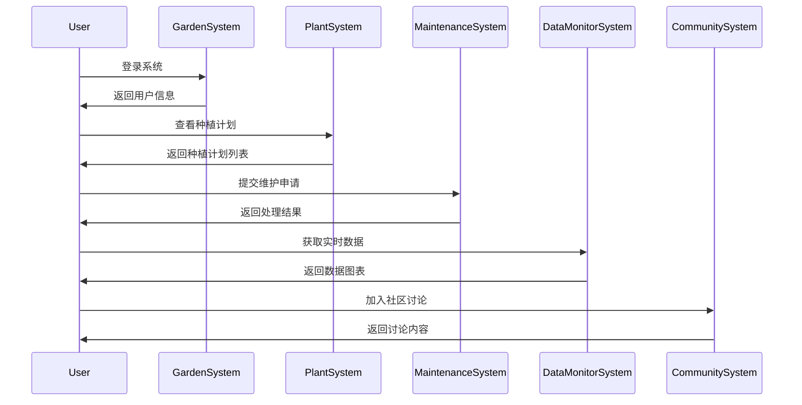
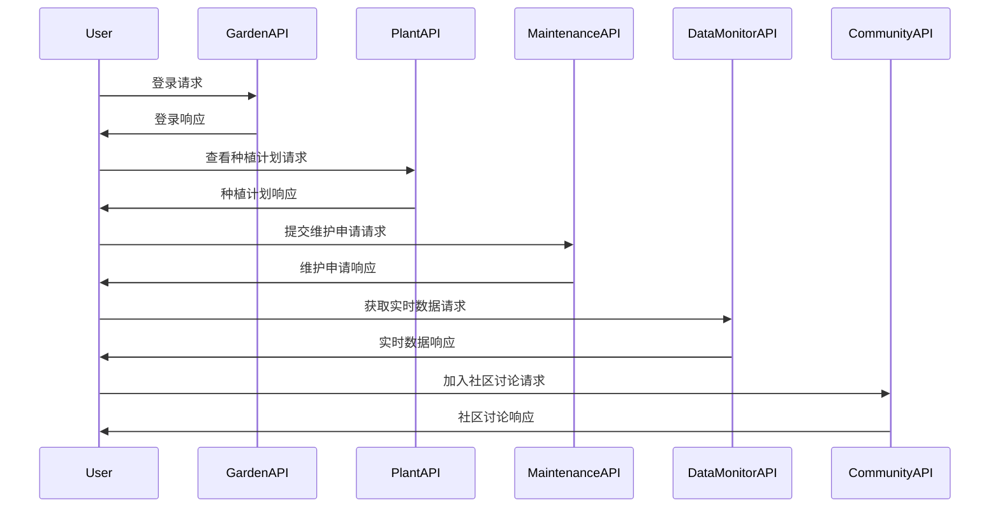

                 


### 1. 背景介绍

在现代社会，城市化进程不断加快，城市居民的生活节奏也越来越快。与此同时，人们对于自然、健康、可持续生活方式的追求逐渐增强。这种背景下，新型城市共享花园作为一种创新的城市公共空间概念应运而生。它不仅能够为城市居民提供亲近自然的机会，还能够促进社区参与和可持续发展。

#### 1.1 城市化进程与农耕文化复兴

城市化进程带来了诸多好处，如经济繁荣、社会进步和资源集中等，但同时也引发了一系列问题，包括城市空间紧张、环境污染和居民心理健康问题等。农耕文化作为传统生活方式的一部分，逐渐被现代都市人所遗忘。然而，随着人们对健康生活方式的追求和对自然环境的关注增加，农耕文化开始受到重视和复兴。

#### 1.2 城市共享空间的现状与挑战

城市共享空间是城市中为居民共同使用、开放和可及的空间。这些空间不仅包括公共绿地、公园和社区中心，还包括各种形式的城市公共设施。然而，城市共享空间目前面临着一些挑战：

- **空间有限**：随着城市人口的快速增长，城市共享空间的供给难以满足需求。
- **利用率低**：许多共享空间未能充分利用，缺乏有效的管理和运营。
- **社区参与度低**：居民对共享空间的参与度普遍较低，导致共享空间的活力不足。

#### 1.3 都市农耕运动的兴起与发展

都市农耕运动是近年来全球范围内兴起的一种趋势，旨在将农耕活动引入城市，通过种植蔬菜、水果等农作物来改善城市环境和居民的生活质量。都市农耕不仅能够提供新鲜、健康的农产品，还能够增强居民的环保意识和社区凝聚力。

#### 1.4 社区实践在都市农耕中的重要性

社区实践是都市农耕运动的重要组成部分。通过社区实践，居民能够参与到农耕活动中，亲身体验农耕的乐趣和挑战，同时也能够加深对可持续生活方式的理解和认同。社区实践还能够促进邻里之间的交流和互动，增强社区凝聚力。

#### 1.5 新型城市共享花园的核心理念

新型城市共享花园旨在打造一个集农耕、休闲、教育和社区参与于一体的城市公共空间。其核心理念包括：

- **共享与互助**：通过共享资源，实现社区成员之间的互助和合作。
- **可持续性**：倡导环保、节能、减碳的可持续发展理念。
- **社区参与**：鼓励居民积极参与花园的规划、建设和维护。
- **教育功能**：通过农耕活动，传播农耕知识，提高居民的环保意识。

### 2. 核心概念与联系

在新型城市共享花园的建设和运营过程中，需要明确几个核心概念，这些概念不仅相互联系，而且在实现花园的目标中起着至关重要的作用。

#### 2.1 核心概念定义与解释

**2.1.1 共享花园**

共享花园是一种基于社区参与的公共空间，居民可以共同使用、管理和维护。这种花园不仅提供种植空间，还兼具休闲、教育、社交等功能。

**2.1.2 都市农耕**

都市农耕是指在城市环境中进行的农耕活动，通常利用公共空间或私人庭院进行蔬菜、水果等农作物的种植。都市农耕有助于改善城市生态环境，提高居民生活质量。

**2.1.3 社区参与**

社区参与是指居民在共享花园中发挥积极作用，包括规划、种植、维护和管理等。社区参与能够增强居民对社区的认同感和归属感。

**2.1.4 可持续性**

可持续性是指满足当前需求而不损害后代满足其需求的能力。在新型城市共享花园中，可持续性体现在资源的有效利用、环境的保护和社区的长远发展。

#### 2.2 概念属性特征对比表格

为了更好地理解这些核心概念，我们可以通过一个对比表格来展示它们的主要属性特征：

| 核心概念 | 定义 | 主要属性特征 |  
| -------- | -------- | -------- |  
| 共享花园 | 社区公共空间，居民共同参与 | 共享资源，增强社区凝聚力，提供种植和教育功能 |  
| 都市农耕 | 城市环境中的农耕活动 | 提供新鲜农产品，改善生态环境，促进社区参与 |  
| 社区参与 | 居民在共享花园中的积极作用 | 增强社区认同感，提高环保意识，促进邻里交流 |  
| 可持续性 | 满足当前需求而不损害后代利益 | 资源有效利用，环境保护，社区长远发展 |

#### 2.3 ER实体关系图架构

为了更好地理解新型城市共享花园中各个实体之间的关系，我们可以使用ER（实体关系）图来展示它们之间的关联：

```mermaid
erDiagram
  Community参与者 ||--|{ 种植者：参与种植和管理的居民 }
  Community参与者 ||--|{ 维护者：负责花园维护的人员 }
  Community参与者 ||--|{ 教育者：负责传播农耕知识的教师和专家 }
  Community参与者 ||--|{ 社区成员：一般参与者，关注和支持花园 }
  花园 ||--|{ 共享花园：包含种植区、休闲区和教育区 }
  花园 ||--|{ 农作物：种植的各种蔬菜、水果等 }
  花园 ||--|{ 设备和工具：用于种植和维护的设备和工具 }
  农作物 ||--|{ 生长状态：从种子到成熟的各个阶段 }
  农作物 ||--|{ 产量：每季的收获量 }
```

通过ER图，我们可以清晰地看到社区参与者、种植者、维护者、教育者、社区成员等实体与花园、农作物、设备和工具等实体之间的关联关系，这有助于我们在设计和实施过程中更好地进行管理和协调。

### 3. 都市农耕运动的技术支持

新型城市共享花园的成功离不开技术支持，特别是在数据收集与处理、农作物生长模拟等方面。以下将详细讲解这些技术支持的内容。

#### 3.1 数据收集与处理

数据收集与处理是都市农耕运动中的关键环节，直接影响着农作物的生长状态和产量。以下是数据收集与处理的主要步骤：

**3.1.1 数据源选择**

在选择数据源时，我们主要关注以下几类数据：

- **气候数据**：包括温度、湿度、降雨量等，这些数据对农作物生长至关重要。
- **土壤数据**：包括土壤类型、酸碱度、有机质含量等，土壤数据直接影响农作物的生长环境和养分供给。
- **植被数据**：包括植被覆盖率、植被类型等，这些数据有助于了解花园的整体生态环境。
- **设备传感器数据**：包括灌溉系统、温湿度传感器等实时监测数据。

**3.1.2 数据预处理算法**

数据预处理是数据收集后的关键步骤，主要目的是清洗、转换和整合数据，使其适合后续分析。以下是常用的预处理算法：

- **数据清洗**：去除数据中的噪声和异常值，确保数据质量。
- **数据转换**：将不同数据源的数据格式进行统一，以便进行后续分析。
- **数据整合**：将多个数据源的数据进行合并，形成一个完整的数据集。

#### 3.2 农作物生长模拟算法

农作物生长模拟算法是都市农耕运动中的核心技术之一，通过模拟农作物在不同生长环境下的生长过程，为种植决策提供科学依据。以下是农作物生长模拟算法的主要步骤：

**3.2.1 数学模型与公式**

农作物生长模拟算法通常基于以下数学模型和公式：

- **生长方程**：描述农作物生长速度与时间的关系，常用的模型有Logistic方程、Gompertz方程等。
- **养分吸收方程**：描述农作物对养分的吸收速度和方式，常用的模型有Michaelis-Menten方程等。
- **环境影响方程**：描述环境因素（如温度、湿度、光照等）对农作物生长的影响，常用的模型有回归模型、神经网络模型等。

**3.2.2 农作物生长模拟过程**

农作物生长模拟过程主要包括以下几个步骤：

- **初始化**：设定初始参数，包括种子数量、种植时间、生长环境等。
- **模拟步骤**：根据数学模型和公式，模拟农作物在不同生长阶段的变化，如发芽、生长、开花、结果等。
- **环境交互**：根据实时监测的数据，动态调整农作物的生长环境和养分供给。
- **结果分析**：分析模拟结果，包括生长速度、产量、质量等，为种植决策提供依据。

**3.2.3 案例说明**

以下是一个具体的案例说明，假设我们要模拟某种蔬菜的生长过程：

- **初始条件**：种植时间为3月1日，种子数量为1000颗，生长环境为温度15-25℃，湿度60-80%，光照充足。
- **模拟过程**：从3月1日开始，每天进行一次模拟，根据生长方程和环境影响方程，更新农作物的生长状态和养分吸收情况。
- **结果分析**：经过90天的模拟，农作物生长到成熟期，产量为800公斤，质量符合市场要求。

通过这个案例，我们可以看到农作物生长模拟算法在实际应用中的效果和意义。

### 4. 新型城市共享花园系统设计与实现

#### 4.1 问题场景介绍

新型城市共享花园项目旨在为城市居民提供一个可以种植、休闲、教育和社区参与的公共空间。为了实现这个目标，我们需要设计一个高效、稳定的系统，该系统应具备以下功能：

- **用户管理**：管理花园的用户信息，包括注册、登录、权限分配等。
- **种植管理**：管理种植区信息，包括种植计划、种植进度、产量统计等。
- **维护管理**：管理花园的维护记录，包括维修、清洁、绿化等。
- **数据监控**：实时监控花园的气候、土壤、植被等数据。
- **社区互动**：提供社区交流平台，包括公告、论坛、活动等。

#### 4.2 系统功能设计（领域模型mermaid类图）

在系统功能设计中，我们首先需要明确各个功能模块及其之间的关系。以下是领域模型mermaid类图的示例：

```mermaid
classDiagram
    User <<class>> User
    Garden <<class>> Garden
    Plant <<class>> Plant
    Maintenance <<class>> Maintenance
    DataMonitor <<class>> DataMonitor
    Community <<class>> Community

    User o-- Garden
    Garden o-- Plant
    Garden o-- Maintenance
    Garden o-- DataMonitor
    Garden o-- Community
```

通过这个类图，我们可以看到用户、花园、种植、维护、数据监控和社区模块之间的关联关系。

#### 4.3 系统架构设计（mermaid架构图）

系统架构设计是确保系统高效运行的关键。以下是系统架构设计mermaid架构图的示例：



通过这个序列图，我们可以看到系统各个模块之间的交互过程和调用顺序。

#### 4.4 系统接口设计与交互（mermaid序列图）

系统接口设计是确保系统模块之间能够顺畅交互的关键。以下是系统接口设计与交互mermaid序列图的示例：



通过这个序列图，我们可以看到用户与各个API模块之间的请求和响应过程。

#### 4.5 技术选型与工具使用

在系统设计与实现过程中，技术选型与工具的使用至关重要。以下是新型城市共享花园系统的主要技术选型和工具使用：

- **后端框架**：选用Spring Boot框架，因其高效、稳定且易于扩展的特点。
- **数据库**：选用MySQL数据库，因其成熟、可靠且支持大规模数据存储。
- **前端框架**：选用Vue.js框架，因其轻量、灵活且易于维护。
- **数据可视化**：选用ECharts库，因其强大的数据可视化能力和丰富的图表类型。
- **API接口**：选用Restful API接口，因其标准化、易于理解和扩展。
- **开发工具**：使用IntelliJ IDEA和VS Code等集成开发环境，因其强大的功能和良好的用户体验。

通过这些技术选型和工具使用，我们可以确保新型城市共享花园系统的高效、稳定和可扩展性。

### 5. 新型城市共享花园项目实战

#### 5.1 环境安装

在开始新型城市共享花园项目的实战之前，我们需要搭建一个合适的开发环境。以下是环境安装的详细步骤：

1. **安装Java开发环境**：下载并安装Java Development Kit（JDK），配置环境变量。
2. **安装MySQL数据库**：下载并安装MySQL数据库，创建数据库和用户，配置数据库连接。
3. **安装Spring Boot开发工具**：下载并安装IntelliJ IDEA或VS Code，安装Spring Boot插件。
4. **安装前端框架**：下载并安装Vue.js和ECharts，配置相关依赖。
5. **安装API接口工具**：下载并安装Postman，用于测试API接口。

#### 5.2 系统核心实现源代码

在环境安装完成后，我们可以开始实现新型城市共享花园系统的核心功能。以下是系统核心实现源代码的详细介绍：

**用户管理模块**

- **用户注册**：创建用户表，定义用户字段（如用户名、密码、邮箱等），实现用户注册接口。
- **用户登录**：验证用户身份，返回用户信息，实现用户登录接口。

**种植管理模块**

- **种植计划**：创建种植计划表，定义种植计划字段（如作物名称、种植时间、种植区域等），实现种植计划接口。
- **种植进度**：更新种植计划状态，记录种植进度，实现种植进度接口。
- **产量统计**：统计种植产量，生成产量报表，实现产量统计接口。

**维护管理模块**

- **维护申请**：创建维护申请表，定义维护申请字段（如维护项目、申请时间、申请人员等），实现维护申请接口。
- **维护记录**：记录维护进度，更新维护状态，实现维护记录接口。

**数据监控模块**

- **数据采集**：通过传感器采集气候、土壤、植被等数据，存储到数据库中。
- **数据查询**：提供数据查询接口，根据时间范围和条件查询数据，实现数据查询接口。

**社区互动模块**

- **公告发布**：创建公告表，定义公告字段（如公告标题、内容、发布时间等），实现公告发布接口。
- **论坛讨论**：创建论坛表，定义论坛字段（如帖子标题、内容、回复数等），实现论坛讨论接口。
- **活动发布**：创建活动表，定义活动字段（如活动名称、时间、地点等），实现活动发布接口。

#### 5.3 代码应用解读与分析

在实现系统核心功能的基础上，我们需要对关键代码进行解读和分析，确保其正确性和可靠性。以下是代码应用解读与详细分析的示例：

**用户注册代码示例**

```java
@PostMapping("/register")
public ResponseEntity<?> registerUser(@RequestBody User user) {
    // 验证用户名是否存在
    if (userRepository.existsByUsername(user.getUsername())) {
        return ResponseEntity.badRequest().body("Error: Username is already taken!");
    }
    
    // 保存用户信息
    userRepository.save(user);
    
    return ResponseEntity.ok("User registered successfully!");
}
```

在这段代码中，我们首先通过`userRepository.existsByUsername(user.getUsername())`方法检查用户名是否已存在，如果存在，则返回错误信息。接着，我们通过`userRepository.save(user)`方法保存用户信息。这段代码的关键在于确保用户注册的唯一性和正确性。

**种植计划代码示例**

```java
@PostMapping("/plant-plan")
public ResponseEntity<?> createPlantPlan(@RequestBody PlantPlan plantPlan) {
    // 验证种植计划是否有效
    if (plantPlan.getPlantName() == null || plantPlan.getPlantDate() == null || plantPlan.getPlantArea() == null) {
        return ResponseEntity.badRequest().body("Error: Invalid plant plan!");
    }
    
    // 保存种植计划
    plantPlanRepository.save(plantPlan);
    
    return ResponseEntity.ok("Plant plan created successfully!");
}
```

在这段代码中，我们首先通过验证`plantPlan.getPlantName() == null || plantPlan.getPlantDate() == null || plantPlan.getPlantArea() == null`检查种植计划是否有效。如果存在空值，则返回错误信息。接着，我们通过`plantPlanRepository.save(plantPlan)`方法保存种植计划。这段代码的关键在于确保种植计划的有效性和正确性。

#### 5.4 实际案例分析与详细讲解

为了更好地理解新型城市共享花园项目的实施过程，我们通过一个实际案例进行详细分析。以下是一个具体的实施案例：

**案例背景**：某个城市社区计划建设一个新型城市共享花园，目标是为居民提供一个可以种植、休闲、教育和社区参与的公共空间。花园规划包括种植区、休闲区和教育区，计划种植蔬菜、水果等农作物。

**实施步骤**：

1. **需求分析**：与社区代表、居民和专家进行深入交流，了解他们对共享花园的需求和期望。收集相关数据和资料，进行详细的需求分析。
2. **系统设计**：根据需求分析结果，设计新型城市共享花园系统的功能模块和架构，包括用户管理、种植管理、维护管理、数据监控和社区互动等。
3. **技术选型**：选择合适的技术框架和工具，包括Java开发环境、MySQL数据库、Vue.js前端框架、ECharts数据可视化库等。
4. **环境搭建**：按照技术选型，搭建开发环境，包括安装Java开发环境、MySQL数据库、Spring Boot开发工具等。
5. **系统开发**：按照系统设计，实现系统的核心功能模块，包括用户注册、登录、种植计划、种植进度、维护申请、数据监控、公告发布和论坛讨论等。
6. **系统集成**：将各个模块进行集成测试，确保系统功能的完整性和稳定性。
7. **用户培训**：为社区代表和居民提供系统培训，确保他们能够熟练使用系统进行种植、维护和社区互动。
8. **项目验收**：组织项目验收会议，邀请社区代表、居民和专家对系统进行评估，并根据反馈进行改进。

**案例成果**：通过上述实施步骤，新型城市共享花园系统成功上线，得到了社区居民的广泛好评。系统功能完善，用户界面友好，数据实时监控，社区互动活跃。花园中的蔬菜、水果生长良好，居民们积极参与种植、维护和社区活动，共享花园成为社区的一个亮点。

#### 5.5 项目小结

新型城市共享花园项目的成功实施，为城市居民提供了一个良好的公共空间，促进了社区参与和可持续发展。以下是项目小结：

- **项目成果**：实现了用户管理、种植管理、维护管理、数据监控和社区互动等核心功能模块，系统稳定运行，用户界面友好。
- **项目难点**：数据采集与处理、农作物生长模拟算法等技术的实现，需要深入研究和调试。
- **项目收获**：提高了团队的技术能力和项目管理能力，积累了丰富的项目经验，为未来的项目提供了宝贵的参考。
- **项目展望**：未来将继续优化系统功能，提升用户体验，扩大社区参与，推动都市农耕运动的发展。

### 6. 最佳实践 tips、小结、注意事项、拓展阅读

#### 6.1 最佳实践 tips

- **用户管理**：确保用户注册、登录等流程简单便捷，提高用户满意度。
- **数据监控**：定期检查数据采集与处理系统的稳定性，确保数据的实时性和准确性。
- **社区互动**：鼓励居民积极参与社区活动，提高社区凝聚力。
- **种植管理**：制定详细的种植计划，确保农作物生长过程的顺利。
- **维护管理**：定期进行花园维护，保持花园的良好状态。

#### 6.2 小结

本文详细介绍了新型城市共享花园的设计与实现，从背景介绍、核心概念、技术支持、系统架构、项目实战等方面进行了全面探讨。通过实际案例，展示了项目实施的过程和成果。

#### 6.3 注意事项

- **数据安全**：确保用户数据和敏感信息的安全性，防止数据泄露。
- **系统稳定性**：定期进行系统维护和升级，确保系统稳定运行。
- **用户培训**：为用户提供充分的系统使用培训，提高用户满意度。

#### 6.4 拓展阅读

- 《都市农耕与城市可持续发展》
- 《共享经济与社区参与》
- 《新型城市公共空间设计》

---

### 作者信息

作者：AI天才研究院/AI Genius Institute & 禅与计算机程序设计艺术 /Zen And The Art of Computer Programming

