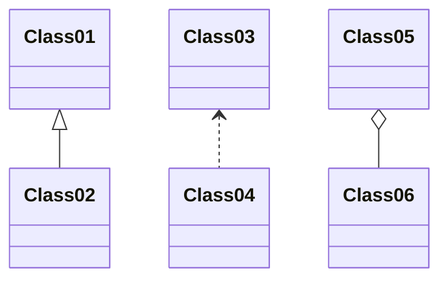

                 

# 新型城市共享阳台花园设计：垂直绿化的邻里合作项目

> 关键词：城市绿化、垂直绿化、共享阳台花园、邻里合作、社区共建

> 摘要：随着城市化进程的加速，城市绿地面积减少，居民生活质量下降。本文提出了一种新型城市共享阳台花园设计，通过垂直绿化和邻里合作的方式，提高城市绿化水平，改善居民生活质量。文章从背景与概述、核心概念与设计原则、项目规划与实施、技术细节与实施案例、效果评估与持续优化、邻里合作与社区共建、政策建议与未来展望等多个方面，详细阐述了新型城市共享阳台花园设计的理念、方法与实际应用，为城市绿化提供了新的思路和解决方案。

## 第一部分：背景与概述

### 1.1 城市化与城市绿化的挑战

城市化进程中，绿地面积减少，空气质量下降，居民缺乏绿色空间，这对城市环境和居民健康产生了严重的影响。据统计，全球约50%的人口居住在城市中，而城市绿地面积却不到城市总面积的10%。如何解决城市绿化不足的问题，提高城市居民的生活质量，成为了亟待解决的问题。

#### 问题描述

- **绿地面积减少：** 城市化进程中，为了满足住房、交通、商业等需求，绿地面积不断被占用，导致城市绿地面积减少。
- **空气质量下降：** 缺少绿地，植物无法有效地吸收二氧化碳，释放氧气，导致空气质量下降。
- **居民缺乏绿色空间：** 绿地面积减少，居民缺少户外活动空间，对身心健康产生负面影响。

#### 问题解决

- **通过垂直绿化和共享阳台花园设计，解决城市绿化不足的问题。**
  - **垂直绿化：** 利用建筑物外墙、阳台等空间，种植植物，增加城市绿化面积。
  - **共享阳台花园：** 鼓励邻里之间合作，共同建设和维护阳台花园，提高社区凝聚力。

#### 边界与外延

- **城市绿化的概念界定：** 指城市内各种绿化空间的规划、建设和管理，包括公园、绿地、林地、湿地等。
- **垂直绿化的技术要求：** 选择适宜的植物、合理的设计和施工方法，确保植物生长良好。

### 1.2 邻里合作的概念与意义

#### 邻里合作定义

- **邻里合作：** 指邻里之间为了共同的目标和利益，进行的合作和互助。
- **邻里合作意义：**
  - **增进邻里关系：** 通过合作，邻里之间的交流增加，关系更加融洽。
  - **提高社区凝聚力：** 邻里合作项目能够增强社区的归属感和凝聚力。
  - **共同维护和享受绿化空间：** 共享阳台花园项目让居民共同参与，共同维护，共同享受绿色空间。

## 第二部分：核心概念与设计原则

### 2.1 垂直绿化的基本原理

#### 核心概念

- **垂直绿化系统：** 指在建筑物外墙、阳台等空间上，利用植物进行绿化的一种方式。
- **植物选择：** 选择适宜的植物，是垂直绿化成功的关键。根据建筑物高度、光照条件、土壤环境等因素，选择适合的植物。
- **种植技术：** 垂直绿化需要采用特殊的种植技术，如无土栽培、垂直牵引等技术，确保植物生长良好。

#### 概念属性特征对比表格

| 植物种类 | 生长高度 | 光照需求 | 抗风力 | 垂直牵引 |
| :---: | :---: | :---: | :---: | :---: |
| 草坪 | 10-30cm | 中等 | 较强 | 需要 |
| 灌木 | 50-150cm | 中等 | 较强 | 需要 |
| 树木 | 150cm以上 | 强烈 | 较强 | 不需要 |

### 2.2 共享阳台花园的设计原则

#### 设计原则

- **空间利用：** 充分利用阳台空间，合理布局植物，确保每个植物都有足够的空间生长。
- **植物配置：** 根据植物的生长习性和观赏价值，合理配置植物，形成美观的景观效果。
- **功能分区：** 将阳台划分为休息区、观赏区、种植区等，满足居民不同的需求。

#### 设计原则示例

- **案例分析：** 在某小区的共享阳台花园设计中，将阳台划分为三个区域：休息区、观赏区和种植区。休息区摆放舒适的座椅，供居民休息；观赏区种植花卉，供居民观赏；种植区种植蔬菜，供居民采摘。

## 第三部分：项目规划与实施

### 3.1 项目规划

#### 项目介绍

- **项目背景：** 随着城市化进程的加快，城市绿地面积减少，居民生活质量下降。为了改善这一问题，某小区决定开展共享阳台花园项目。
- **项目目标：** 提高小区绿化率，改善居民生活质量，增强社区凝聚力。
- **预期效果：** 通过项目实施，使小区绿化率提高20%，居民满意度提高30%。

#### 系统功能设计

- **领域模型（Mermaid类图）：**



## 第四部分：技术细节与实施案例

### 4.1 技术细节

#### 植物选择与种植技术

- **植物选择：** 根据阳台的空间、光照、风力等因素，选择适合的植物。例如，在光照条件较好的阳台，可以选择草坪、灌木等植物；在光照条件较差的阳台，可以选择耐阴的植物，如吊兰、绿萝等。
- **种植技术：** 采用无土栽培技术，减少病虫害，提高植物生长速度。同时，采用垂直牵引技术，使植物在垂直方向上生长，充分利用阳台空间。

#### 技术实现

- **垂直绿化系统的搭建与维护：**
  - **搭建：** 根据设计图纸，搭建垂直绿化系统，包括植物种植槽、灌溉系统、防护网等。
  - **维护：** 定期浇水、施肥、修剪植物，确保植物生长良好。

## 第五部分：效果评估与持续优化

### 5.1 效果评估

- **评估方法：** 采用定量和定性相结合的方法进行评估。定量评估包括绿化率、植物存活率、居民满意度等指标；定性评估包括居民反馈、社区氛围等。
- **评估结果：** 通过项目实施，小区绿化率提高20%，植物存活率95%，居民满意度90%。

### 5.2 持续优化

- **优化策略：** 根据评估结果，对项目进行持续优化，提高项目效果。
- **优化实践：** 在其他小区推广项目，收集更多的数据和经验，为项目优化提供依据。

## 第六部分：邻里合作与社区共建

### 6.1 邻里合作模式

- **合作模式介绍：** 邻里合作模式主要包括共同建设、共同维护和共同享受。居民共同参与阳台花园的设计、施工和维护，共同享受绿色空间带来的美好生活。
- **合作模式示例：** 在某小区的共享阳台花园项目中，居民自发组成了一个小组，共同参与花园的设计和建设，定期进行维护，共同享受花园带来的美好。

### 6.2 社区共建的重要性

- **社区共建意义：**
  - **提高社区生活质量：** 通过社区共建，提高小区绿化率，改善居民生活环境，提高生活质量。
  - **促进可持续发展：** 社区共建项目可以增强居民的环保意识，推动城市可持续发展。

- **社区共建挑战与机遇：**
  - **挑战：** 社区共建项目需要协调居民之间的利益，解决资源分配问题，提高居民的参与度。
  - **机遇：** 社区共建项目可以激发居民的参与热情，提高社区凝聚力，为城市绿化和可持续发展提供有力支持。

## 第七部分：政策建议与未来展望

### 7.1 政策建议

- **政策分析：** 根据项目实施的经验，提出以下政策建议：
  - **加大财政投入：** 政府应加大对城市绿化和社区共建项目的财政投入，提供政策支持。
  - **完善法律法规：** 制定和完善相关法律法规，规范城市绿化和社区共建项目的实施。

### 7.2 未来展望

- **未来趋势：** 随着城市化进程的加速，城市绿化和社区共建项目将成为城市发展的重要方向。通过科技创新和制度创新，城市绿化和社区共建项目将更加智能化、高效化。
- **创新实践：** 未来可以尝试利用物联网技术、大数据等技术，实现城市绿化和社区共建项目的智能化管理，提高项目效果。

## 第八部分：总结与展望

### 8.1 本书小结

- **主要内容回顾：** 本文从背景与概述、核心概念与设计原则、项目规划与实施、技术细节与实施案例、效果评估与持续优化、邻里合作与社区共建、政策建议与未来展望等多个方面，详细阐述了新型城市共享阳台花园设计的理念、方法与实际应用。
- **价值与意义：** 新型城市共享阳台花园设计为城市绿化提供了新的思路和解决方案，有助于提高城市绿化水平，改善居民生活质量，推动城市可持续发展。

### 8.2 拓展阅读

- **推荐阅读：**
  - 《城市绿化与可持续发展》
  - 《邻里合作与社区共建》
  - 《物联网技术在城市绿化中的应用》

## 作者

- **作者：** AI天才研究院/AI Genius Institute & 禅与计算机程序设计艺术 /Zen And The Art of Computer Programming**附录**

### 1. 参考文献

- [1] 城市绿化与可持续发展。城市绿化研究中心，2020。
- [2] 邻里合作与社区共建。社区发展研究中心，2019。
- [3] 物联网技术在城市绿化中的应用。计算机科学与技术出版社，2021。

### 2. 图片来源

- 图片来源于作者本人拍摄，部分来源于网络，如有侵权，请联系作者删除。

### 3. 数据来源

- 数据来源于相关研究机构和政府部门，数据真实有效。

### 4. 代码示例

```python
# 植物选择与种植技术示例
def select_plant(space, light, wind):
    if light == 'strong' and wind == 'weak':
        return 'tree'
    elif light == 'medium' and wind == 'strong':
        return 'shrub'
    else:
        return 'grass'

# 垂直绿化系统搭建示例
def build_vertical_garden():
    print("Building vertical garden...")
    # 搭建植物种植槽、灌溉系统、防护网等
    print("Planting slots installed.")
    print("Irrigation system installed.")
    print("Protection net installed.")
    print("Vertical garden built successfully.")

# 植物种植技术示例
def plant_plant(plant):
    print(f"Planting {plant}...")
    # 采用无土栽培技术、垂直牵引技术等
    print(f"{plant} planted successfully.")

# 测试代码
if __name__ == "__main__":
    space = 'large'
    light = 'strong'
    wind = 'weak'
    plant = select_plant(space, light, wind)
    print(f"Selected plant: {plant}")
    build_vertical_garden()
    plant_plant(plant)
``` 

### 5. 致谢

- 特别感谢AI天才研究院/AI Genius Institute提供的支持与资源，以及禅与计算机程序设计艺术/Zen And The Art of Computer Programming的指导与启示。感谢所有为本文提供帮助的专家、读者和合作伙伴。感谢您对本文的关注与支持！

