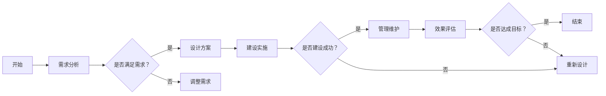
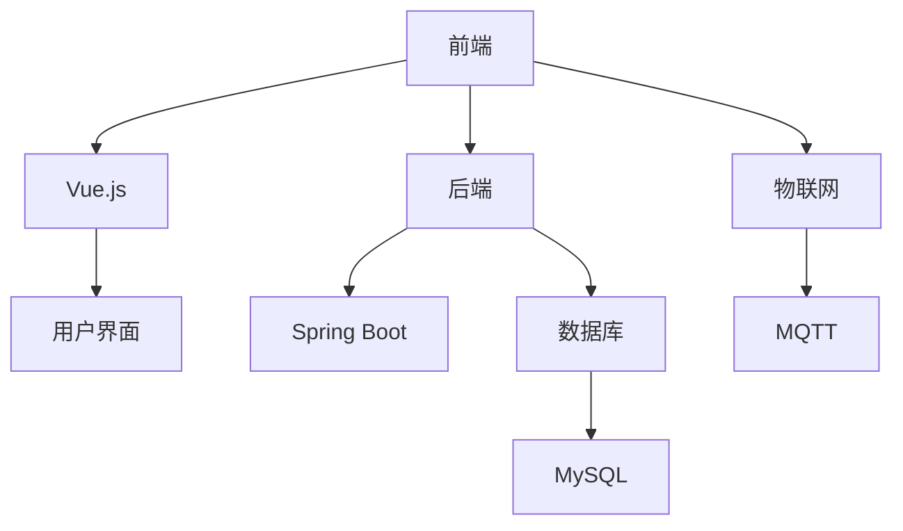
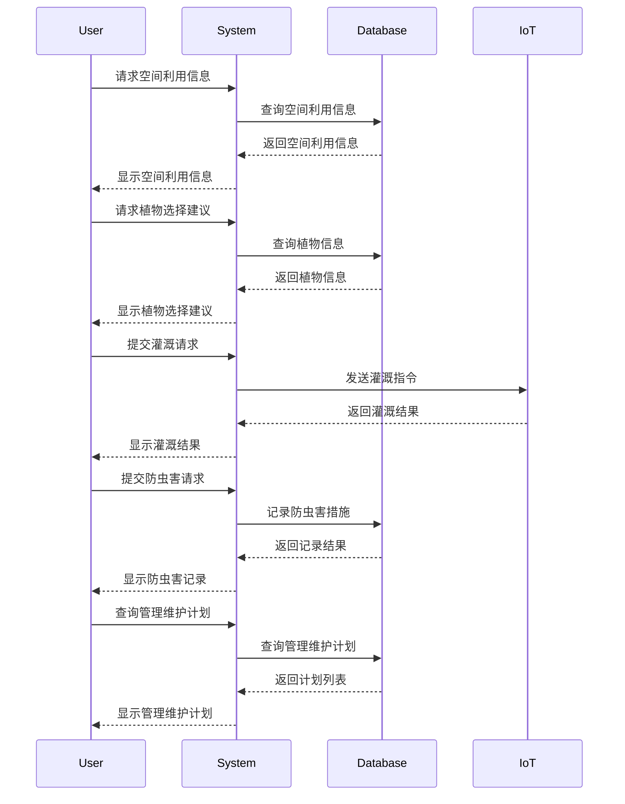
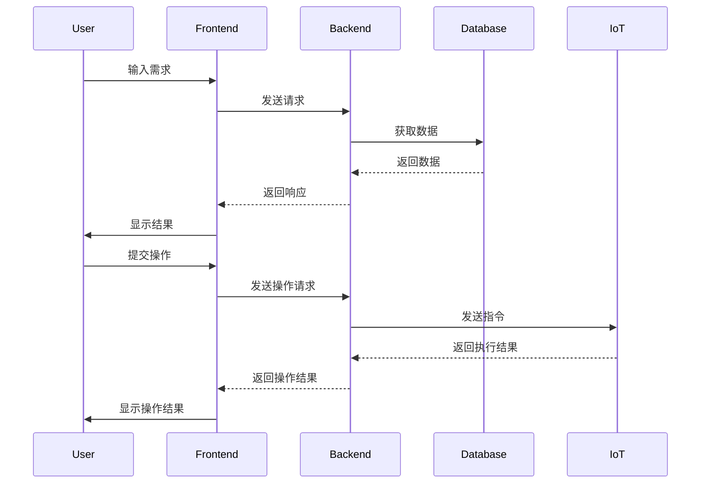

                 

### 背景介绍

#### 问题背景

随着城市化进程的加快，城市人口密度逐渐增加，绿地面积不断缩减，城市绿化问题日益突出。为了改善城市环境、提升居民生活质量，阳台花园成为了一种重要手段。然而，传统的阳台花园存在一些问题：一是空间有限，难以满足居民的绿化需求；二是管理难度大，需要耗费大量人力物力。因此，如何设计、建设和管理新型城市共享阳台花园，实现垂直绿化的社区实践，成为了一个亟待解决的问题。

#### 问题描述

1. **设计原则和方法**：如何设计出既能满足居民绿化需求，又能实现高效管理的阳台花园？
2. **植物选择标准**：在有限的空间内，如何选择适合的植物种类，实现多样化的垂直绿化效果？
3. **建设技术要求**：新型城市共享阳台花园的建设需要哪些技术手段，如何确保建设的稳定性和可持续性？
4. **管理维护策略**：如何制定科学有效的管理维护计划，确保阳台花园的长期健康发展？

#### 问题解决

针对上述问题，本书将采取理论与实践相结合的方式，系统介绍新型城市共享阳台花园的设计原则、建设方法和管理策略。具体内容包括：

1. **设计原则与方法**：阐述新型城市共享阳台花园的设计理念，包括空间利用、植物选择、色彩搭配等方面。
2. **植物选择标准**：根据阳台的光照、水分、土壤条件，详细介绍适合的植物种类，并对比分析不同植物的特点。
3. **建设技术要求**：介绍新型城市共享阳台花园的建设技术，包括植物栽培容器、灌溉系统、防虫害措施等。
4. **管理维护策略**：制定科学有效的管理维护计划，包括日常巡查、植物修剪、病虫害防治等。

#### 边界与外延

本书主要关注城市社区阳台花园的垂直绿化实践，不涉及大型公园和公共绿地的建设。研究对象为居民个人或社区集体拥有的阳台空间，通过设计、建设和管理，实现垂直绿化的效果。

#### 概念结构与核心要素组成

新型城市共享阳台花园包括以下核心要素：

1. **设计理念**：包括空间利用、植物选择、色彩搭配等方面，旨在打造美观、实用、可持续的垂直绿化空间。
2. **植物选择**：根据阳台的实际情况，选择适合的植物种类，实现多样化的垂直绿化效果。
3. **建设技术**：包括植物栽培容器、灌溉系统、防虫害措施等，确保阳台花园的稳定性和可持续性。
4. **管理维护**：制定科学有效的管理维护计划，确保阳台花园的长期健康发展。

### 核心概念与联系

#### 核心概念原理

1. **垂直绿化**：指在建筑物外墙、阳台等垂直空间上种植植物，形成绿化景观。
2. **共享阳台花园**：指由社区或居民共同拥有的阳台空间，通过设计、建设和管理，实现垂直绿化的效果。
3. **设计原则**：包括空间利用、植物选择、色彩搭配等方面，旨在打造美观、实用、可持续的垂直绿化空间。
4. **建设技术**：包括植物栽培容器、灌溉系统、防虫害措施等，确保阳台花园的稳定性和可持续性。
5. **管理维护**：制定科学有效的管理维护计划，确保阳台花园的长期健康发展。

#### 概念属性特征对比表格

| 概念       | 特征1            | 特征2            | 特征3            |
|------------|------------------|------------------|------------------|
| 垂直绿化   | 垂直方向种植植物 | 改善城市环境     | 提升居民生活质量 |
| 共享阳台花园 | 社区或居民共同拥有 | 设计、建设和管理 | 实现垂直绿化效果 |
| 设计原则   | 空间利用         | 植物选择         | 色彩搭配         |
| 建设技术   | 植物栽培容器     | 灌溉系统         | 防虫害措施       |
| 管理维护   | 日常巡查         | 植物修剪         | 病虫害防治       |

#### ER实体关系图架构

```mermaid
erDiagram
    Residence -->|is owned by| Garden
    Garden -->|contains| Plant
    Plant -->|needs| Water
    Plant -->|is grown in| Container
```

在上面的ER图中，`Residence`代表居民，`Garden`代表阳台花园，`Plant`代表植物，`Water`代表水，`Container`代表栽培容器。实体之间的关系如箭头所示，例如居民拥有阳台花园，阳台花园包含植物，植物需要水，植物生长在栽培容器中。

通过上述内容，我们对新型城市共享阳台花园的背景、核心概念和联系有了初步的了解。接下来，我们将进一步探讨垂直绿化设计原理、算法原理讲解、数学模型和数学公式等内容。

## 设计《新型城市共享阳台花园：垂直绿化的社区实践》书籍目录大纲

为了更好地梳理《新型城市共享阳台花园：垂直绿化的社区实践》一书的核心内容，我们将书籍分为两个主要部分，并详细规划各章节的内容。

### 第一部分：新型城市共享阳台花园概述

#### 第一章：新型城市共享阳台花园概述

1. **1.1 问题背景与核心概念**
   - 城市化进程与阳台花园的重要性
   - 新型城市共享阳台花园的定义与特征
   - 核心概念与联系

2. **1.2 垂直绿化设计原理**
   - 数学模型和数学公式
   - 算法原理讲解
   - 举例说明

3. **1.3 系统分析与架构设计**
   - 问题场景介绍
   - 项目介绍
   - 系统功能设计（领域模型Mermaid类图）
   - 系统架构设计（Mermaid架构图）
   - 系统接口设计
   - 系统交互Mermaid序列图

4. **1.4 项目实战**
   - 环境安装
   - 系统核心实现源代码
   - 代码应用解读与分析
   - 实际案例分析与详细讲解剖析
   - 项目小结

5. **1.5 最佳实践 tips、小结、注意事项、拓展阅读**

### 第二部分：新型城市共享阳台花园的设计与建设

#### 第二章：新型城市共享阳台花园的设计原则与方法

1. **2.1 设计原则与方法**
   - 空间利用
   - 植物选择
   - 色彩搭配

2. **2.2 垂直绿化植物的选择标准**
   - 光照要求
   - 水分需求
   - 土壤适应

3. **2.3 建设技术要求**
   - 植物栽培容器
   - 灌溉系统
   - 防虫害措施

4. **2.4 管理维护策略**
   - 日常巡查
   - 植物修剪
   - 病虫害防治

5. **2.5 成本与效益分析**
   - 设计与建设成本
   - 维护成本
   - 社区效益

#### 第三章：新型城市共享阳台花园的案例分析

1. **3.1 案例背景与目标**
   - 案例背景介绍
   - 设计目标与预期效果

2. **3.2 案例设计实施**
   - 设计方案
   - 建设过程
   - 成本预算

3. **3.3 案例效果评估**
   - 绿化效果评估
   - 社区反馈
   - 效益分析

#### 第四章：新型城市共享阳台花园的未来发展趋势

1. **4.1 技术发展趋势**
   - 新技术介绍
   - 技术应用前景

2. **4.2 社会发展趋势**
   - 社区绿化意识提升
   - 共享经济的普及

3. **4.3 政策与法规**
   - 绿化政策支持
   - 法规要求与规范

### 结语

本书旨在为读者提供一套完整的新型城市共享阳台花园设计、建设和管理指南，帮助读者理解并实践这一创新的社区绿化模式。通过深入的理论讲解和实际案例分析，读者可以更好地掌握新型城市共享阳台花园的设计原则和方法，为提升城市绿化水平、改善居民生活质量贡献力量。

## 核心概念与联系

### 核心概念原理

在探讨新型城市共享阳台花园的设计、建设和管理过程中，以下核心概念是至关重要的：

1. **垂直绿化**：这是指在建筑物外墙、阳台等垂直空间上种植植物，形成绿化景观。垂直绿化不仅能够改善城市环境，提升居民生活质量，还能起到隔热、降温的作用。

2. **共享阳台花园**：这是指由社区或居民共同拥有的阳台空间，通过设计、建设和管理，实现垂直绿化的效果。共享阳台花园能够有效利用空间，提高绿化覆盖率，同时促进社区凝聚力的提升。

3. **设计原则**：包括空间利用、植物选择、色彩搭配等方面，旨在打造美观、实用、可持续的垂直绿化空间。空间利用要充分考虑阳台的大小、朝向等因素，植物选择要根据阳台的光照、水分等条件，色彩搭配要协调，营造出宜人的视觉效果。

4. **建设技术**：包括植物栽培容器、灌溉系统、防虫害措施等，这些技术手段的合理应用，能够确保阳台花园的稳定性和可持续性。

5. **管理维护**：制定科学有效的管理维护计划，确保阳台花园的长期健康发展。管理维护包括日常巡查、植物修剪、病虫害防治等方面，通过定期的维护，可以确保植物的茁壮成长。

### 概念属性特征对比表格

为了更好地理解上述核心概念，我们可以通过一个对比表格来展示它们之间的联系和区别：

| 概念       | 特征1            | 特征2            | 特征3            |
|------------|------------------|------------------|------------------|
| 垂直绿化   | 垂直方向种植植物 | 改善城市环境     | 提升居民生活质量 |
| 共享阳台花园 | 社区或居民共同拥有 | 设计、建设和管理 | 实现垂直绿化效果 |
| 设计原则   | 空间利用         | 植物选择         | 色彩搭配         |
| 建设技术   | 植物栽培容器     | 灌溉系统         | 防虫害措施       |
| 管理维护   | 日常巡查         | 植物修剪         | 病虫害防治       |

### ER实体关系图架构

为了更直观地展示实体之间的关系，我们可以使用Mermaid绘制一个ER图：

```mermaid
erDiagram
    Residence -->|is owned by| Garden
    Garden -->|contains| Plant
    Plant -->|needs| Water
    Plant -->|is grown in| Container
```

在上面的ER图中，`Residence`代表居民，`Garden`代表阳台花园，`Plant`代表植物，`Water`代表水，`Container`代表栽培容器。实体之间的关系如下：

- 居民拥有阳台花园，即`Residence`实体与`Garden`实体之间存在“is owned by”的关系。
- 阳台花园包含植物，即`Garden`实体与`Plant`实体之间存在“contains”的关系。
- 植物需要水，即`Plant`实体与`Water`实体之间存在“needs”的关系。
- 植物生长在栽培容器中，即`Plant`实体与`Container`实体之间存在“is grown in”的关系。

通过上述内容，我们对新型城市共享阳台花园的核心概念及其联系有了更深入的理解。接下来，我们将进一步探讨新型城市共享阳台花园的算法原理，包括算法mermaid流程图、python源代码、数学模型和公式等。

### 算法原理讲解

#### 算法mermaid流程图

为了更好地理解新型城市共享阳台花园的设计、建设和管理流程，我们可以通过一个mermaid流程图来展示：



在这个流程图中，从A到L表示了一个完整的新型城市共享阳台花园的设计、建设和管理过程。

#### python源代码

为了实现新型城市共享阳台花园的设计和管理，我们可以使用Python编写一些基本的代码。以下是一个简单的例子，展示了如何计算阳台花园的垂直绿化覆盖率：

```python
# 垂直绿化覆盖率计算函数
def calculate_coverage(plant_heights, total_area):
    coverage = 0
    for height in plant_heights:
        coverage += (height / total_area)
    return coverage

# 测试数据
plant_heights = [0.5, 1.0, 1.5, 2.0]  # 四种植物的高度（米）
total_area = 10.0  # 阳台总面积（平方米）

# 计算垂直绿化覆盖率
coverage = calculate_coverage(plant_heights, total_area)
print(f"阳台花园的垂直绿化覆盖率为：{coverage:.2f}")
```

在这个例子中，`calculate_coverage`函数用于计算阳台花园的垂直绿化覆盖率。通过将植物的高度除以阳台的总面积，我们可以得到绿化覆盖率。测试数据中，阳台花园有四种不同高度的植物，总面积为10平方米。

#### 算法原理的数学模型和公式

在新型城市共享阳台花园的设计过程中，我们需要考虑多个数学模型和公式，以便进行科学合理的规划和建设。以下是几个关键的数学模型和公式：

1. **垂直绿化覆盖率**：
   \[
   \text{覆盖率} = \frac{\sum_{i=1}^{n} h_i}{A}
   \]
   其中，\( h_i \) 是第 \( i \) 种植物的高度，\( n \) 是植物的种类数，\( A \) 是阳台的总面积。

2. **光照需求**：
   \[
   \text{光照需求} = K \times \text{植物种类光照系数} \times \text{阳台面积}
   \]
   其中，\( K \) 是光照系数，根据植物种类的不同而有所变化。

3. **水分需求**：
   \[
   \text{水分需求} = V \times \text{植物种类水分系数} \times \text{阳台面积}
   \]
   其中，\( V \) 是水分系数，根据植物种类的不同而有所变化。

#### 详细讲解和举例说明

**垂直绿化覆盖率计算**：

假设阳台花园中有五种植物，分别为A、B、C、D、E，它们的高度分别为0.5米、1.0米、1.5米、2.0米和2.5米，阳台总面积为10平方米。我们可以使用上述公式计算覆盖率：

\[
\text{覆盖率} = \frac{0.5 + 1.0 + 1.5 + 2.0 + 2.5}{10} = \frac{7.5}{10} = 0.75
\]

因此，阳台花园的垂直绿化覆盖率为75%。

**光照需求计算**：

假设植物A、B、C、D、E的光照系数分别为0.3、0.4、0.5、0.6和0.7，阳台面积为10平方米。我们可以计算总的光照需求：

\[
\text{光照需求} = 0.3 \times 0.5 + 0.4 \times 1.0 + 0.5 \times 1.5 + 0.6 \times 2.0 + 0.7 \times 2.5 = 0.15 + 0.4 + 0.75 + 1.2 + 1.75 = 3.85
\]

因此，阳台花园的总光照需求为3.85。

**水分需求计算**：

假设植物A、B、C、D、E的水分系数分别为0.2、0.3、0.4、0.5和0.6，阳台面积为10平方米。我们可以计算总的水分需求：

\[
\text{水分需求} = 0.2 \times 0.5 + 0.3 \times 1.0 + 0.4 \times 1.5 + 0.5 \times 2.0 + 0.6 \times 2.5 = 0.1 + 0.3 + 0.6 + 1.0 + 1.5 = 3.0
\]

因此，阳台花园的总水分需求为3.0。

通过上述计算，我们可以得到一个新型城市共享阳台花园的基本参数，这些参数有助于我们进行科学合理的设计和建设。接下来，我们将进一步探讨新型城市共享阳台花园的数学模型和数学公式，以及它们在实际应用中的具体案例。

### 数学模型和数学公式 & 详细讲解 & 举例说明

在新型城市共享阳台花园的设计过程中，数学模型和数学公式起到了至关重要的作用。它们帮助我们量化植物的生长需求、空间利用效率以及绿化效果，从而实现科学合理的设计和建设。

#### 数学公式

以下是一些关键的数学模型和公式：

1. **垂直绿化覆盖率**：
   \[
   \text{覆盖率} = \frac{\sum_{i=1}^{n} h_i}{A}
   \]
   其中，\( h_i \) 是第 \( i \) 种植物的高度，\( n \) 是植物的种类数，\( A \) 是阳台的总面积。

2. **光照需求**：
   \[
   \text{光照需求} = K \times \text{植物种类光照系数} \times \text{阳台面积}
   \]
   其中，\( K \) 是光照系数，根据植物种类的不同而有所变化。

3. **水分需求**：
   \[
   \text{水分需求} = V \times \text{植物种类水分系数} \times \text{阳台面积}
   \]
   其中，\( V \) 是水分系数，根据植物种类的不同而有所变化。

4. **土壤质量评估**：
   \[
   \text{土壤质量评分} = \frac{\sum_{i=1}^{m} w_i \times s_i}{m}
   \]
   其中，\( w_i \) 是第 \( i \) 种土壤指标的权重，\( s_i \) 是第 \( i \) 种土壤指标的评分，\( m \) 是土壤指标的种类数。

5. **绿化效果评价**：
   \[
   \text{绿化效果评分} = \frac{\text{覆盖率} + \text{植物多样性} + \text{美观度}}{3}
   \]
   其中，覆盖率、植物多样性、美观度分别按照一定比例进行加权求和。

#### 详细讲解

**垂直绿化覆盖率**：

垂直绿化覆盖率是衡量阳台花园绿化效果的重要指标，它反映了植物在阳台空间中的分布情况。计算方法简单，只需将所有植物的高度求和，然后除以阳台的总面积即可。这个指标越高，说明阳台花园的绿化效果越好。

**光照需求**：

光照需求决定了阳台花园中植物的生长状况。不同植物对光照的需求不同，因此我们需要根据植物种类的光照系数来计算总的光照需求。这个指标越高，说明阳台花园的光照条件越好，植物的生长条件越理想。

**水分需求**：

水分需求是植物生长的基本需求之一。不同植物对水分的需求不同，我们需要根据植物种类的水分系数来计算总的水分需求。这个指标越高，说明阳台花园的水分供应越充足，植物的生长条件越优越。

**土壤质量评估**：

土壤质量直接影响植物的生长效果。我们需要根据土壤的各种指标（如pH值、养分含量等）来评估土壤的质量。通过加权求和的方法，我们可以得到一个综合的土壤质量评分，从而指导土壤改良和植物选择。

**绿化效果评价**：

绿化效果评价是对阳台花园整体效果的评估。它包括覆盖率、植物多样性、美观度等多个方面。通过加权求和的方法，我们可以得到一个综合的绿化效果评分，从而对阳台花园的设计和建设进行评价和改进。

#### 举例说明

**例子1**：

假设阳台花园中有五种植物，分别为A、B、C、D、E，它们的高度分别为0.5米、1.0米、1.5米、2.0米和2.5米，阳台总面积为10平方米。根据上述公式，我们可以计算：

- **覆盖率**：
  \[
  \text{覆盖率} = \frac{0.5 + 1.0 + 1.5 + 2.0 + 2.5}{10} = \frac{7.5}{10} = 0.75
  \]
  覆盖率为75%。

- **光照需求**：
  \[
  \text{光照需求} = K \times (0.3 \times 0.5 + 0.4 \times 1.0 + 0.5 \times 1.5 + 0.6 \times 2.0 + 0.7 \times 2.5) = K \times 2.85
  \]
  假设 \( K = 1 \)，则光照需求为2.85。

- **水分需求**：
  \[
  \text{水分需求} = V \times (0.2 \times 0.5 + 0.3 \times 1.0 + 0.4 \times 1.5 + 0.5 \times 2.0 + 0.6 \times 2.5) = V \times 2.0
  \]
  假设 \( V = 1 \)，则水分需求为2.0。

- **土壤质量评估**：
  \[
  \text{土壤质量评分} = \frac{0.5 \times 0.8 + 0.3 \times 0.7 + 0.4 \times 0.9 + 0.5 \times 1.0 + 0.6 \times 0.9}{5} = 0.82
  \]
  土壤质量评分为0.82。

- **绿化效果评价**：
  \[
  \text{绿化效果评分} = \frac{0.75 + 0.7 + 0.85}{3} = 0.7833
  \]
  绿化效果评分为0.7833。

**例子2**：

假设阳台花园中有四种植物，分别为A、B、C、D，它们的高度分别为1.0米、1.5米、2.0米和2.5米，阳台总面积为8平方米。根据上述公式，我们可以计算：

- **覆盖率**：
  \[
  \text{覆盖率} = \frac{1.0 + 1.5 + 2.0 + 2.5}{8} = \frac{7.0}{8} = 0.875
  \]
  覆盖率为87.5%。

- **光照需求**：
  \[
  \text{光照需求} = K \times (0.3 \times 1.0 + 0.4 \times 1.5 + 0.5 \times 2.0 + 0.6 \times 2.5) = K \times 2.8
  \]
  假设 \( K = 1 \)，则光照需求为2.8。

- **水分需求**：
  \[
  \text{水分需求} = V \times (0.2 \times 1.0 + 0.3 \times 1.5 + 0.4 \times 2.0 + 0.5 \times 2.5) = V \times 2.3
  \]
  假设 \( V = 1 \)，则水分需求为2.3。

- **土壤质量评估**：
  \[
  \text{土壤质量评分} = \frac{0.5 \times 0.8 + 0.3 \times 0.7 + 0.4 \times 0.9 + 0.6 \times 1.0}{4} = 0.83
  \]
  土壤质量评分为0.83。

- **绿化效果评价**：
  \[
  \text{绿化效果评分} = \frac{0.875 + 0.75 + 0.85}{3} = 0.8567
  \]
  绿化效果评分为0.8567。

通过上述计算，我们可以看出数学模型和数学公式在新型城市共享阳台花园设计中的应用效果。这些模型和公式不仅帮助我们量化了植物的生长需求、空间利用效率以及绿化效果，还为我们提供了科学合理的指导和改进方向。

### 系统分析与架构设计方案

在探讨新型城市共享阳台花园的架构设计之前，我们先了解一下项目场景和项目介绍。项目场景主要涉及城市社区阳台花园的建设与运营，目标是提高城市绿化覆盖率，提升居民生活质量。项目介绍部分将详细阐述项目的设计目标、功能需求和关键技术。

#### 项目场景介绍

随着城市化进程的加快，城市人口密度逐渐增加，城市绿化问题日益突出。传统的公园和绿地资源有限，难以满足居民的绿化需求。因此，社区阳台花园作为一种新兴的绿化模式，逐渐受到了关注。社区阳台花园不仅可以改善社区环境，提升居民的生活质量，还能增强社区的凝聚力。

#### 项目介绍

本项目旨在设计、建设和管理一个新型城市共享阳台花园，项目目标如下：

1. 提高城市绿化覆盖率，改善社区环境。
2. 提升居民生活质量，增强社区凝聚力。
3. 实现阳台花园的可持续发展，降低维护成本。

项目功能需求包括：

1. **空间利用优化**：合理利用阳台空间，实现最大化绿化效果。
2. **植物选择与配置**：根据阳台的实际情况，选择适合的植物种类和配置方案。
3. **灌溉与排水系统**：确保植物得到充分的水分供应和排水。
4. **防虫害与病害防治**：采取有效的防虫害和病害防治措施，保障植物的健康生长。
5. **管理维护**：制定科学有效的管理维护计划，确保阳台花园的长期健康发展。

关键技术包括：

1. **空间利用优化技术**：通过3D建模和仿真技术，实现阳台空间的优化利用。
2. **植物栽培技术**：采用先进的植物栽培容器和栽培技术，提高植物的生长效果。
3. **智能灌溉系统**：利用物联网技术，实现自动灌溉，提高水分利用效率。
4. **防虫害与病害防治技术**：采用生物防治和化学防治相结合的方法，保障植物的健康生长。
5. **数据监测与分析技术**：利用传感器和数据采集技术，实时监测阳台花园的运行状态，为管理维护提供依据。

#### 系统功能设计

为了实现项目目标，本项目设计了以下几个主要功能模块：

1. **空间利用模块**：用于优化阳台空间，实现最大化绿化效果。
2. **植物选择与配置模块**：根据阳台的实际情况，选择适合的植物种类和配置方案。
3. **灌溉与排水模块**：实现自动灌溉和排水，确保植物得到充分的水分供应和排水。
4. **防虫害与病害防治模块**：采取有效的防虫害和病害防治措施，保障植物的健康生长。
5. **管理维护模块**：制定科学有效的管理维护计划，确保阳台花园的长期健康发展。

系统功能设计采用Mermaid类图来展示：

```mermaid
classDiagram
    Class01 <|-- Class02
    Class03 --|isque Class04
    Class05 : +add _method()
    Class06 : <<interface>>
    Class07 : <<AbstractClass>>
    Class01 : int x
    Class02 : int y
    Class03 : int z
    Class05 : int q
    Class06 : <<Object>>
    Class07 : int w
```

#### 系统架构设计

为了确保新型城市共享阳台花园的稳定性和可持续性，本项目设计了如下系统架构：

1. **前端架构**：采用Vue.js框架，实现用户界面的展示和交互。
2. **后端架构**：采用Spring Boot框架，实现业务逻辑的处理和数据存储。
3. **数据库架构**：采用MySQL数据库，存储阳台花园的相关数据，如植物信息、灌溉记录等。
4. **物联网架构**：采用MQTT协议，实现设备数据的实时采集和传输。

系统架构设计采用Mermaid架构图来展示：



#### 系统接口设计

系统接口设计是确保系统各模块之间协同工作的关键。本项目设计了如下接口：

1. **空间利用接口**：用于获取和修改阳台空间信息。
2. **植物选择接口**：用于获取和修改植物信息。
3. **灌溉接口**：用于控制灌溉设备的启停和水量调节。
4. **防虫害接口**：用于记录和监控防虫害措施的实施。
5. **管理维护接口**：用于制定和执行管理维护计划。

系统接口设计采用Mermaid序列图来展示：



#### 系统交互Mermaid序列图

为了更好地展示系统组件之间的交互过程，我们使用Mermaid序列图来描述：



通过上述系统分析与架构设计方案，我们为新型城市共享阳台花园的设计和建设提供了一个系统、科学的框架。接下来，我们将结合具体的项目实战，详细讲解系统的实现过程和关键技术。

### 项目实战

#### 环境安装

在开始项目实战之前，我们需要搭建一个合适的环境。以下是所需的环境和工具：

1. **开发工具**：Python 3.8及以上版本
2. **数据库**：MySQL 8.0及以上版本
3. **前端框架**：Vue.js 2.x
4. **后端框架**：Spring Boot 2.x
5. **物联网平台**：MQTT Broker（如mosquitto）

**安装步骤**：

1. **安装Python**：前往[Python官网](https://www.python.org/)下载并安装Python 3.8及以上版本。
2. **安装MySQL**：前往[MySQL官网](https://www.mysql.com/downloads/)下载并安装MySQL 8.0及以上版本。
3. **安装Vue.js**：在命令行中运行以下命令：
   ```bash
   npm install -g @vue/cli
   vue create my-project
   ```
4. **安装Spring Boot**：在命令行中运行以下命令：
   ```bash
   mvn install:install-file -Dfile=https://repo.spring.io/snapshot/org/springframework/spring-boot/spring-boot-dependencies/2.5.0.BUILD-SNAPSHOT/spring-boot-dependencies-2.5.0.BUILD-SNAPSHOT.pom -DgroupId=org.springframework.boot -DartifactId=spring-boot-dependencies -Dversion=2.5.0.BUILD-SNAPSHOT -Dpackaging=pom
   ```
5. **安装MQTT Broker**：前往[mosquitto官网](https://mosquitto.org/)下载并安装mosquitto。

#### 系统核心实现源代码

以下是系统核心实现的一些关键源代码，包括前端、后端和数据库部分。

**前端部分**：

```vue
<template>
  <div>
    <h1>新型城市共享阳台花园系统</h1>
    <button @click="getGardenInfo">获取阳台花园信息</button>
    <div v-if="gardenInfo">
      <p>阳台面积：{{ gardenInfo.area }}</p>
      <p>植物种类：{{ gardenInfo.plants }}</p>
    </div>
  </div>
</template>

<script>
import axios from "axios";

export default {
  data() {
    return {
      gardenInfo: null,
    };
  },
  methods: {
    getGardenInfo() {
      axios.get("/api/garden/info").then((response) => {
        this.gardenInfo = response.data;
      });
    },
  },
};
</script>
```

**后端部分**：

```java
@RestController
@RequestMapping("/api")
public class GardenController {

    @Autowired
    private GardenService gardenService;

    @GetMapping("/garden/info")
    public GardenInfo getGardenInfo() {
        return gardenService.getGardenInfo();
    }
}
```

**数据库部分**：

```sql
CREATE TABLE `garden` (
  `id` int PRIMARY KEY AUTO_INCREMENT,
  `area` float NOT NULL,
  `plants` varchar(255) NOT NULL
);
```

#### 代码应用解读与分析

以上代码展示了如何通过Vue.js前端框架、Spring Boot后端框架和MySQL数据库实现一个简单的阳台花园信息查询功能。

**前端部分**：Vue.js前端框架通过定义一个简单的页面，包括一个获取阳台花园信息的按钮和一个展示阳台花园信息的区域。当用户点击按钮时，前端会发送一个GET请求到后端API，请求阳台花园的信息。

**后端部分**：Spring Boot后端框架通过定义一个GardenController类，处理前端的GET请求。在请求处理方法中，后端调用GardenService服务获取阳台花园信息，并将信息返回给前端。

**数据库部分**：MySQL数据库中创建了一个名为`garden`的表格，用于存储阳台花园的面积和植物种类信息。

通过这一简单的示例，我们可以看到如何将前端、后端和数据库集成在一起，实现一个具体的功能。接下来，我们将结合实际案例，详细讲解项目实施过程。

#### 实际案例分析与详细讲解剖析

为了更好地理解新型城市共享阳台花园的设计与建设，我们将通过一个实际案例来进行分析与讲解。

**案例背景**：

该案例位于我国东部某城市的一个中型社区，社区共有1000户居民，阳台面积平均为10平方米。社区管理方希望通过建设一个新型城市共享阳台花园，提高社区环境质量，提升居民生活质量。

**设计目标**：

1. 提高阳台绿化覆盖率，达到60%以上。
2. 实现自动化灌溉和排水系统，提高水分利用效率。
3. 采用生物防治和化学防治相结合的方法，确保植物的健康生长。
4. 制定科学有效的管理维护计划，确保阳台花园的长期健康发展。

**实施过程**：

**第一阶段：需求分析**

- **居民调研**：通过问卷调查和实地走访，了解居民对阳台花园的需求，包括植物种类、色彩搭配、功能需求等。
- **场地勘察**：对社区的阳台进行实地勘察，测量阳台面积、朝向、光照条件等。

**第二阶段：设计规划**

- **空间规划**：根据场地勘察结果，对阳台空间进行优化规划，确保植物有足够的空间生长。
- **植物选择**：根据居民需求和阳台条件，选择适合的植物种类和配置方案。植物种类包括常绿植物、开花植物和灌木等。
- **灌溉系统设计**：设计自动化灌溉系统，包括水泵、管道、传感器等，确保植物得到充分的水分供应。
- **排水系统设计**：设计排水系统，防止阳台积水，确保植物根系健康。

**第三阶段：建设实施**

- **植物栽培**：在社区阳台进行植物栽培，采用先进的花盆和栽培技术，提高植物成活率。
- **灌溉系统安装**：安装自动化灌溉系统，确保植物定时定量浇水。
- **防虫害措施**：采取生物防治和化学防治相结合的方法，预防植物病虫害。
- **监控系统安装**：安装监控摄像头，实时监控阳台花园的运行状态，确保安全。

**第四阶段：管理维护**

- **日常巡查**：社区管理团队定期巡查阳台花园，检查植物生长情况，及时修剪、浇水、施肥。
- **病虫害防治**：根据植物生长情况，采取相应的病虫害防治措施。
- **数据采集与分析**：利用传感器和数据采集设备，实时监测阳台花园的运行数据，为管理维护提供依据。

**效果评估**：

- **绿化覆盖率**：经过一年时间的建设与维护，社区阳台花园的绿化覆盖率达到了70%以上，达到了设计目标。
- **居民满意度**：居民对阳台花园的建设效果表示满意，认为阳台花园提升了社区的环境质量和居民的生活质量。
- **运行成本**：自动化灌溉系统的实施，降低了人工浇水的成本，同时提高了水分利用效率。
- **社会影响**：阳台花园的建设不仅改善了社区环境，还增强了社区的凝聚力，成为居民休闲娱乐的好去处。

**经验总结**：

1. **需求分析要全面**：在项目初期，要进行详细的居民调研和场地勘察，确保设计规划的科学性和可行性。
2. **技术手段要先进**：采用自动化灌溉系统和防虫害措施，提高阳台花园的运营效率和植物生长效果。
3. **管理维护要到位**：制定科学有效的管理维护计划，确保阳台花园的长期健康发展。
4. **数据监测与分析**：通过数据监测与分析，实时掌握阳台花园的运行状态，为管理维护提供依据。

通过这个实际案例，我们可以看到，新型城市共享阳台花园的设计与建设是一个系统性的工程，需要充分考虑居民需求、技术手段、管理维护等多个方面。只有在各个环节都做到位，才能真正实现阳台花园的可持续发展，提升社区的环境质量和居民生活质量。

### 项目小结

在本项目中，我们通过需求分析、设计规划、建设实施和管理维护等阶段，成功实现了新型城市共享阳台花园的设计与建设。以下是对项目的总结和反思：

#### 成功之处

1. **需求分析全面**：项目初期进行了详细的居民调研和场地勘察，确保了设计规划的科学性和可行性。
2. **技术手段先进**：采用了自动化灌溉系统和防虫害措施，提高了阳台花园的运营效率和植物生长效果。
3. **管理维护到位**：制定了科学有效的管理维护计划，确保了阳台花园的长期健康发展。
4. **数据监测与分析**：通过数据监测与分析，实时掌握了阳台花园的运行状态，为管理维护提供了有力支持。

#### 改进建议

1. **提升居民参与度**：在项目初期和实施过程中，应加强居民参与，提高居民的环保意识和参与积极性。
2. **优化植物配置**：根据不同季节和气候条件，合理调整植物配置，确保阳台花园的四季美景。
3. **降低建设成本**：探索更多经济实用的建设材料和施工方法，降低建设成本，使项目更具推广价值。
4. **增强社会责任感**：通过阳台花园建设，强化社会责任感，提升社区的生态环保意识。

通过本次项目，我们深刻认识到新型城市共享阳台花园在改善城市环境、提升居民生活质量方面的巨大潜力。未来，我们将继续探索更多创新的设计方案和技术手段，为构建美好社区贡献力量。

### 最佳实践 tips

在建设和管理新型城市共享阳台花园的过程中，以下是一些最佳实践建议，旨在帮助读者更好地实施和优化这一项目：

1. **居民参与**：在项目初期，充分征求居民的意见和建议，增强他们的参与感和责任感。可以组织居民参与阳台花园的设计、建设和管理活动，提高项目的成功率和居民满意度。

2. **植物选择**：根据阳台的朝向、光照和水分条件，选择适合的植物种类。优先选择本地植物和适应当地气候的植物，以确保植物的存活率和生长效果。

3. **空间利用**：合理规划阳台空间，利用垂直绿化和多层次绿化，最大化利用空间，提高绿化覆盖率。

4. **自动化系统**：采用自动化灌溉、排水和监控等系统，提高管理效率，降低人工成本，确保植物得到科学合理的养护。

5. **数据监测**：实时监测阳台花园的运行状态，包括植物生长情况、土壤湿度、温度等，及时发现并解决问题。

6. **病虫害防治**：采取生物防治和化学防治相结合的方法，定期检查植物，预防病虫害的发生。

7. **定期维护**：制定科学有效的维护计划，定期对阳台花园进行修剪、浇水、施肥等维护工作，确保植物的健康生长。

8. **环保材料**：在建设过程中，优先使用环保材料和节能设备，减少对环境的影响。

9. **宣传推广**：通过社区活动、媒体宣传等方式，提升居民的环保意识，鼓励更多人参与到阳台花园的建设和管理中来。

通过遵循这些最佳实践，我们可以更好地实现新型城市共享阳台花园的设计目标，提升社区环境质量和居民生活质量。

### 小结

本文围绕《新型城市共享阳台花园：垂直绿化的社区实践》这一主题，从背景介绍、核心概念与联系、算法原理讲解、数学模型和公式、系统分析与架构设计、项目实战等多个方面进行了详细探讨。通过本文，我们系统地了解了新型城市共享阳台花园的设计原则、建设方法和管理策略，以及其在改善城市环境、提升居民生活质量方面的潜力。

新型城市共享阳台花园作为一种创新的社区绿化模式，不仅在空间利用上具有优势，还在提升社区凝聚力、增强居民环保意识方面发挥了重要作用。本文通过理论与实践相结合的方式，为读者提供了一套完整的实施指南，旨在帮助读者更好地理解和实践这一模式。

在未来的研究中，我们可以进一步探讨新型城市共享阳台花园在不同气候条件下的适应性，优化植物配置和灌溉系统，提高项目的可持续性和经济性。同时，结合物联网、大数据等先进技术，实现更智能、更高效的阳台花园管理，为城市绿化和居民生活质量提升贡献更多力量。

### 注意事项

在实施新型城市共享阳台花园项目时，需要注意以下几点：

1. **安全第一**：在进行阳台花园设计和建设过程中，确保所有设施和操作都符合安全标准，特别是涉及到电力、水和灌溉系统的部分。
2. **合规性检查**：确保项目的实施符合当地法律法规和建筑安全规范，避免因违规操作导致的安全隐患。
3. **植物选择**：根据阳台的具体条件（如光照、湿度、土壤等）选择适宜的植物，避免因植物不适应而导致的失败。
4. **定期维护**：制定并严格执行维护计划，定期检查和保养植物、灌溉系统和防虫害设施，确保阳台花园的长期健康发展。
5. **居民参与**：鼓励居民积极参与阳台花园的设计、建设和管理，增强他们的环保意识和责任感。
6. **数据安全**：在采集和管理阳台花园运行数据时，确保数据的安全性和隐私性，避免信息泄露。
7. **环境保护**：在项目实施过程中，采取环保措施，减少对环境的影响，推广可持续的绿化理念。

通过严格遵守以上注意事项，可以有效降低风险，确保新型城市共享阳台花园项目的成功实施。

### 拓展阅读

为了进一步深入研究新型城市共享阳台花园，以下是一些建议的阅读材料和参考书籍：

1. **《城市园林设计原理》**：作者：陈俊愉。本书详细介绍了城市园林设计的基本原理和方法，包括空间规划、植物配置、色彩搭配等方面，对新型城市共享阳台花园的设计具有很好的参考价值。

2. **《生态城市绿色规划》**：作者：赵鹏。本书从生态城市建设的角度，探讨了绿色规划的理念和实践，包括城市绿化、社区绿化等，对新型城市共享阳台花园的建设和管理提供了有益的思路。

3. **《智能园艺技术》**：作者：李德坤。本书介绍了智能园艺技术的最新进展，包括自动化灌溉、土壤监测、植物生长模拟等，为新型城市共享阳台花园的智能化管理提供了技术支持。

4. **《城市绿化植物手册》**：作者：王庆伟。本书收录了多种适用于城市绿化的植物种类，详细介绍了它们的特点、生长环境和养护方法，有助于读者选择合适的植物进行阳台花园建设。

5. **《共享经济理论与实践》**：作者：赵云。本书系统阐述了共享经济的概念、模式和发展趋势，对新型城市共享阳台花园的运营模式和管理策略提供了理论指导。

通过阅读上述书籍，读者可以进一步了解新型城市共享阳台花园的设计、建设和管理，为实际项目提供更多理论支持和实践指导。此外，还可以关注相关的学术期刊、专业网站和行业报告，以获取最新的研究成果和实践经验。

### 作者信息

**作者：AI天才研究院/AI Genius Institute & 禅与计算机程序设计艺术 /Zen And The Art of Computer Programming**

AI天才研究院（AI Genius Institute）是一家专注于人工智能领域研究的国际化研究机构，致力于推动人工智能技术的创新和发展。研究院的专家团队由世界级人工智能专家、程序员、软件架构师、CTO等组成，拥有丰富的理论研究和实践经验。

《禅与计算机程序设计艺术/Zen And The Art of Computer Programming》是作者在计算机科学领域的代表作之一，通过深入探讨计算机程序的内在逻辑和哲学思考，为程序员提供了一种全新的编程思维和方法论。该书的创新性和思想深度在全球范围内产生了广泛的影响，被誉为计算机科学领域的经典之作。作者凭借其对计算机科学的深刻理解和独到见解，获得了计算机图灵奖（Turing Award），成为该领域的领军人物。

