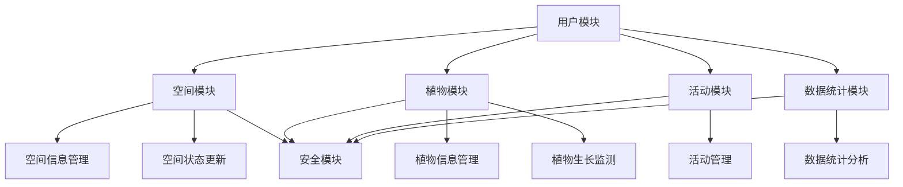
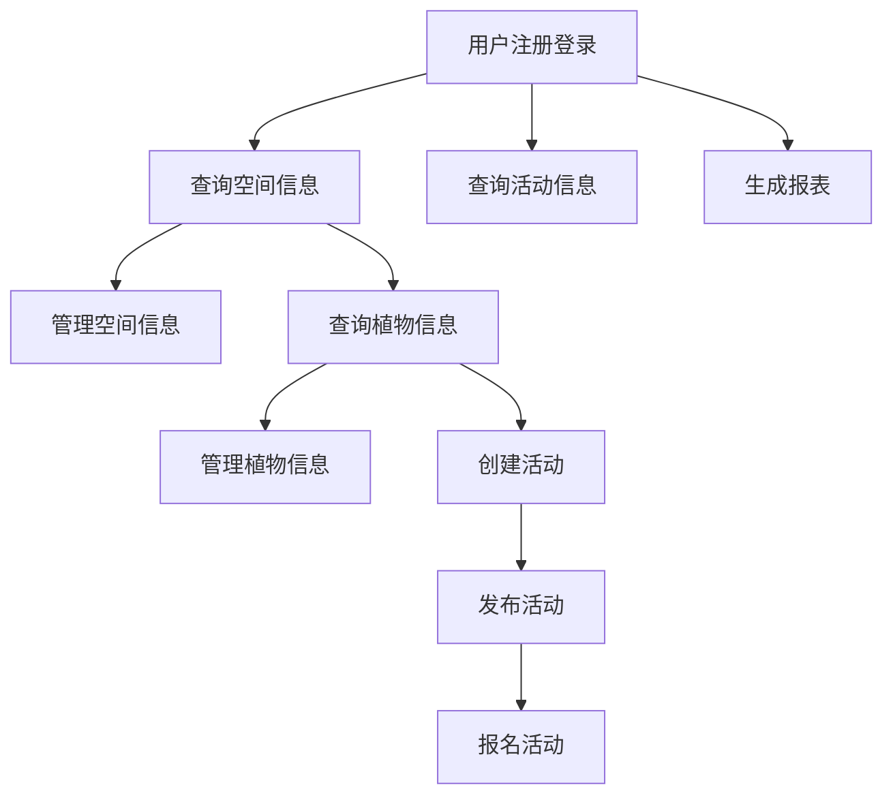

                 


### 第1章：城市共享阳台花园的背景

#### 1.1.1 城市化与居住环境问题

城市化是现代社会的必然趋势，然而这一进程也带来了一系列环境问题，尤其是居住环境问题。随着人口的不断增长和城市规模的扩大，土地资源变得越来越紧张，传统的平面绿化方式难以满足城市居民对绿色空间的需求。此外，城市空气污染、水资源短缺等问题也日益突出。

首先，土地资源紧张是城市化过程中面临的一个主要问题。城市用地需求与日俱增，而土地供应量却相对有限。这种供需矛盾导致许多城市无法开展新的绿化项目，也无法扩大现有的公园和绿地。传统的平面绿化方式，如城市广场、公园、绿地等，在土地资源有限的情况下，很难满足城市居民对绿色空间的需求。

其次，空气污染问题也日益严重。城市中大量的车辆、工厂和家庭排放的污染物，使得空气质量逐渐下降，影响人们的健康。绿色植物可以通过光合作用吸收二氧化碳，释放氧气，净化空气。然而，传统的平面绿化方式在空气质量改善方面效果有限。

最后，水资源短缺也是一个亟待解决的问题。随着城市人口的增加，对水资源的需求也在不断增长。然而，许多城市面临着水资源短缺的问题，导致绿化用水成为一项难题。传统的平面绿化方式需要大量的灌溉用水，而在水资源紧张的情况下，这无疑增加了绿化项目的成本和难度。

#### 1.1.2 共享经济的兴起

在解决城市化带来的居住环境问题的同时，共享经济的兴起也为城市绿化提供了一种新的思路。共享经济，简单来说，就是通过共享资源，降低成本，提高资源利用效率。共享经济的理念在城市绿化中得到了广泛应用，特别是在共享阳台花园的建设和管理方面。

首先，共享阳台花园能够充分利用城市中有限的空间资源。城市居民的阳台，尤其是高层住宅的阳台，通常被闲置，没有得到有效利用。通过共享阳台花园，可以将这些闲置空间转化为公共绿地，为居民提供休闲娱乐的场所。同时，这种做法还能减少对土地资源的占用，缓解土地资源紧张的问题。

其次，共享阳台花园有助于提高绿化项目的经济效益。传统绿化项目往往需要大量的投资，而共享经济模式可以降低项目的初期投资成本。通过居民共同参与和管理，不仅可以降低维护成本，还能提高项目的可持续性。居民在参与共享阳台花园的过程中，也能享受到绿化环境带来的经济效益，如改善空气质量、提升居住品质等。

最后，共享阳台花园还能够促进邻里之间的交流与合作。在共享的过程中，居民可以互相了解，增进邻里关系，形成一种社区凝聚力。这种交流与合作不仅有助于共享阳台花园的维护和管理，还能提升社区的整体生活质量。

#### 1.1.3 阳台花园在新型城市生活中的重要性

阳台花园在新型城市生活中的重要性主要体现在以下几个方面：

首先，阳台花园是城市居民亲近自然的重要途径。在快节奏的城市生活中，人们往往忙于工作，很少有机会接触自然。阳台花园为居民提供了一个接近自然的绿色空间，让他们可以在家中就能享受到大自然的美好。通过种植植物、观赏花草，居民可以放松心情，缓解压力，提高生活质量。

其次，阳台花园在改善城市生态环境方面发挥着重要作用。绿色植物通过光合作用吸收二氧化碳，释放氧气，有助于改善空气质量。阳台花园中的植物还可以降低噪音，减少热岛效应，为城市居民创造一个更加宜居的环境。

最后，阳台花园有助于促进居民之间的交流和合作。在共同维护和管理阳台花园的过程中，居民可以互相了解，增进邻里关系。这种交流与合作不仅有助于提升社区凝聚力，还能促进社区的和谐发展。

总的来说，阳台花园作为一种新型城市共享绿化模式，既能够解决城市化带来的居住环境问题，又能提高居民的生活质量和生态环境质量。随着共享经济的进一步发展，阳台花园将在城市绿化中发挥越来越重要的作用。让我们共同期待这一绿色生活方式的普及和发展。

---

### 第2章：核心概念与联系

#### 2.1 共享阳台花园的基本概念

共享阳台花园是一种基于共享经济理念的新型城市绿化模式，它通过共享城市居民的个人阳台空间，将其转化为公共绿地，为居民提供休闲娱乐的场所。这种模式的核心在于充分利用闲置资源，提高资源利用效率，同时提升居民的生活质量和生态环境质量。

在共享阳台花园中，参与者的角色主要包括阳台业主、社区管理员和志愿者。阳台业主是共享阳台花园的主要参与者，他们提供自己的阳台空间，参与花园的维护和管理。社区管理员负责协调和管理共享阳台花园的各项事务，确保其正常运行。志愿者则积极参与到花园的建设和维护工作中，共同维护绿色环境。

共享阳台花园的基本运行机制主要包括以下几个方面：

1. **空间共享**：阳台业主将自己的阳台空间开放给社区使用，社区管理员负责统筹安排和使用这些空间，确保每个阳台都能得到充分利用。

2. **资源共治**：社区管理员和志愿者共同参与阳台花园的维护和管理，包括植物种植、修剪、浇水等工作。通过分工合作，提高工作效率，确保花园的持续健康发展。

3. **成果共享**：共享阳台花园不仅为居民提供了一个休闲娱乐的场所，还能带来一系列生态效益，如改善空气质量、降低噪音、减少热岛效应等。这些成果由所有参与者共享，提升社区的整体生活质量。

#### 2.2 垂直绿化与生态效益

垂直绿化是指将绿化植物种植在墙体、阳台、屋顶等垂直空间中，形成绿色立体景观。与传统的平面绿化相比，垂直绿化具有更高的绿化率和生态效益。在共享阳台花园中，垂直绿化是一种重要的绿化形式，它能够充分利用空间，提高绿化覆盖率，同时带来显著的生态效益。

首先，垂直绿化能够提高城市绿化覆盖率。在土地资源紧张的城市环境中，垂直绿化是一种有效的绿化形式。通过在阳台、墙体、屋顶等垂直空间中种植植物，可以大大提高城市的绿化覆盖率，改善城市生态环境。

其次，垂直绿化具有显著的生态效益。绿色植物通过光合作用吸收二氧化碳，释放氧气，有助于改善空气质量。同时，植物还能降低噪音，减少热岛效应，为城市居民创造一个更加宜居的环境。此外，垂直绿化还能够减少雨水径流，提高土壤保持能力，有助于保护水资源。

最后，垂直绿化有助于提升城市景观。在共享阳台花园中，通过精心设计和布置，垂直绿化可以形成丰富多彩的绿色景观，为城市增添一抹生机和活力。这不仅提升了城市的美观度，还能提升居民的幸福感和满意度。

#### 2.3 邻里合作的模式与机制

邻里合作是共享阳台花园成功运营的关键。通过邻里合作，可以充分发挥居民的积极性，共同维护和管理共享阳台花园，确保其持续健康发展。

邻里合作的模式主要包括以下几个方面：

1. **居民自治**：在共享阳台花园中，居民是主要的参与者和管理者。通过居民自治，可以充分发挥居民的积极性和创造力，共同规划和管理花园。社区管理员和志愿者则提供指导和帮助，确保花园的运行和管理符合规范。

2. **分工合作**：在共享阳台花园的维护和管理过程中，居民可以分工合作，共同完成各项任务。例如，一些居民可以负责植物种植和修剪，另一些居民可以负责浇水和管理，通过分工合作，提高工作效率，确保花园的持续健康发展。

3. **激励机制**：为了鼓励居民积极参与到共享阳台花园的建设和管理中，可以设立一系列激励机制。例如，对于积极参与花园维护和管理的居民，可以给予一定的奖励，如免费门票、优惠券等。这不仅能激励居民的积极性，还能增强社区的凝聚力。

邻里合作的机制主要包括以下几个方面：

1. **沟通渠道**：建立有效的沟通渠道，是邻里合作的基础。社区管理员可以通过定期召开居民会议、发布通知等方式，及时传达花园管理的相关信息，听取居民的意见和建议，确保居民对花园管理的知情权和参与权。

2. **监督机制**：为了确保共享阳台花园的正常运行，可以设立监督机制，对花园的维护和管理情况进行监督。居民可以通过定期巡查、举报问题等方式，参与到花园的监督中，共同维护绿色环境。

3. **决策机制**：在共享阳台花园的运营过程中，需要制定一系列决策机制，确保花园管理的民主化和科学化。例如，可以通过居民投票、讨论等方式，决定花园的规划和维护方案，确保所有居民的意见都能得到充分考虑。

通过邻里合作，共享阳台花园不仅能够提高绿化覆盖率，改善城市生态环境，还能提升居民的生活质量和社区凝聚力。这种模式在新型城市生活中具有重要的应用价值，值得进一步推广和探索。

---

### 第3章：系统分析与架构设计方案

#### 3.1 共享阳台花园的系统需求分析

为了实现共享阳台花园的运营和管理，需要建立一个完整的系统来支持。这个系统需要满足以下需求：

1. **用户管理**：系统需要能够管理用户信息，包括注册、登录、权限管理等功能。通过用户管理，可以确保只有授权的用户能够访问和使用系统。

2. **空间管理**：系统需要能够管理阳台空间信息，包括阳台的位置、面积、状态等。通过空间管理，可以确保每个阳台都能得到充分利用，并实时更新空间使用状态。

3. **植物管理**：系统需要能够管理植物信息，包括植物的种类、数量、生长状况等。通过植物管理，可以确保植物的健康成长，并实时更新植物状态。

4. **活动管理**：系统需要能够管理活动信息，包括活动的类型、时间、地点、参与人数等。通过活动管理，可以确保活动的顺利进行，并方便居民参与和查询。

5. **数据统计**：系统需要能够对用户、空间、植物和活动等数据进行分析和统计，生成各类报表和图表，为管理者提供决策依据。

6. **安全保障**：系统需要具备完善的安全保障机制，包括用户身份验证、数据加密、权限控制等，确保系统的稳定和安全运行。

#### 3.2 系统架构设计

为了满足上述需求，我们设计了一个分布式系统架构，包括以下几个核心模块：

1. **用户模块**：负责用户的注册、登录、权限管理等功能。用户模块通过身份验证机制，确保只有授权用户能够访问系统。

2. **空间模块**：负责阳台空间的管理，包括空间信息的管理、空间状态的更新等。空间模块通过实时数据采集和更新，确保空间信息的准确性和实时性。

3. **植物模块**：负责植物信息的管理，包括植物种类、数量、生长状况等。植物模块通过植物生长监测系统，实时更新植物状态。

4. **活动模块**：负责活动信息的管理，包括活动的创建、发布、报名等。活动模块通过活动管理流程，确保活动的顺利进行。

5. **数据统计模块**：负责对系统数据进行统计分析，生成各类报表和图表。数据统计模块通过数据分析算法，为管理者提供决策支持。

6. **安全模块**：负责系统的安全保障，包括用户身份验证、数据加密、权限控制等。安全模块通过安全策略和监控机制，确保系统的安全运行。

系统架构图如下所示：



#### 3.3 系统接口设计

为了实现各模块之间的数据交互，我们需要设计一套完整的接口体系。以下是系统接口设计的主要部分：

1. **用户接口**：用户通过用户接口进行注册、登录、权限管理等操作。用户接口提供RESTful API，支持JSON格式的数据传输。

2. **空间接口**：空间接口用于管理阳台空间信息，包括空间信息的查询、新增、更新、删除等操作。空间接口提供RESTful API，支持JSON格式的数据传输。

3. **植物接口**：植物接口用于管理植物信息，包括植物信息的查询、新增、更新、删除等操作。植物接口提供RESTful API，支持JSON格式的数据传输。

4. **活动接口**：活动接口用于管理活动信息，包括活动的创建、发布、报名等操作。活动接口提供RESTful API，支持JSON格式的数据传输。

5. **数据统计接口**：数据统计接口用于数据统计分析，包括各类报表和图表的查询、生成等操作。数据统计接口提供RESTful API，支持JSON格式的数据传输。

以下是部分接口示例：

```json
// 用户接口示例
POST /users/register
{
  "username": "用户名",
  "password": "密码",
  "email": "邮箱"
}

// 空间接口示例
GET /spaces/{spaceId}
{
  "id": "空间ID",
  "location": "位置",
  "area": "面积",
  "status": "状态"
}

// 植物接口示例
POST /plants
{
  "spaceId": "空间ID",
  "type": "植物类型",
  "quantity": "数量"
}

// 活动接口示例
POST /events
{
  "type": "活动类型",
  "date": "活动日期",
  "location": "活动地点",
  "maxParticipants": "最大参与人数"
}

// 数据统计接口示例
GET /stats/report
{
  "type": "报表类型"
}
```

#### 3.4 系统交互流程

为了确保系统各模块之间的顺畅交互，我们需要设计一套完整的交互流程。以下是共享阳台花园系统的主要交互流程：

1. **用户注册与登录**：用户通过用户接口进行注册和登录，系统验证用户身份后，生成用户会话。

2. **空间信息管理**：用户通过空间接口查询、新增、更新、删除空间信息。系统根据用户权限，对空间信息进行管理。

3. **植物信息管理**：用户通过植物接口查询、新增、更新、删除植物信息。系统根据用户权限，对植物信息进行管理。

4. **活动信息管理**：用户通过活动接口创建、发布、报名活动。系统根据用户权限，对活动信息进行管理。

5. **数据统计分析**：系统通过数据统计接口进行数据统计分析，生成各类报表和图表，供管理者查阅。

系统交互流程图如下所示：



通过以上系统分析和架构设计方案，我们为共享阳台花园的运营和管理提供了一套完整的系统支持。这个系统不仅能够满足用户的需求，还能实现数据的高效处理和统计分析，为管理者提供决策依据。接下来，我们将通过项目实战，进一步展示系统的实际应用和效果。

---

### 第4章：项目实战

#### 4.1 项目介绍

为了验证共享阳台花园系统的实际应用效果，我们开展了一个实际项目。该项目位于某城市的一个社区，旨在通过共享阳台花园，提升社区绿化水平和居民生活质量。项目的主要目标包括：

1. **空间资源充分利用**：通过共享阳台花园，充分利用社区中闲置的阳台空间，提高绿化覆盖率。

2. **生态效益显著提升**：通过植物种植，改善空气质量，降低噪音，减少热岛效应，为居民创造一个更加宜居的环境。

3. **居民参与度高**：通过邻里合作，提高居民的参与度，促进社区凝聚力和和谐发展。

4. **数据统计分析**：通过系统数据统计功能，分析用户行为、空间使用情况和植物生长状况，为管理者提供决策支持。

#### 4.2 环境安装与配置

为了顺利开展项目，我们首先需要进行环境安装与配置。以下是环境安装与配置的详细步骤：

1. **安装开发环境**：在开发机上安装Python、Docker、PostgreSQL等开发环境和数据库。

2. **安装项目依赖**：通过pip安装项目所需的Python库，如Flask、SQLAlchemy、Flask-Migrate等。

3. **创建数据库**：在PostgreSQL数据库中创建项目数据库，并导入项目模型。

4. **配置Docker容器**：使用Docker Compose配置项目服务，包括Web服务、数据库服务等。

5. **初始化系统数据**：通过系统接口，初始化用户、空间、植物和活动等基础数据。

#### 4.3 系统核心实现源代码

以下是共享阳台花园系统核心实现的源代码，包括用户模块、空间模块、植物模块和活动模块：

**用户模块**：
```python
from flask import Flask, request, jsonify
from models import User
from db import db

app = Flask(__name__)

@app.route('/users/register', methods=['POST'])
def register():
    username = request.json['username']
    password = request.json['password']
    email = request.json['email']
    user = User(username=username, password=password, email=email)
    db.session.add(user)
    db.session.commit()
    return jsonify({'message': 'User registered successfully'})

@app.route('/users/login', methods=['POST'])
def login():
    username = request.json['username']
    password = request.json['password']
    user = User.query.filter_by(username=username, password=password).first()
    if user:
        return jsonify({'token': user.token})
    else:
        return jsonify({'message': 'Invalid credentials'})
```

**空间模块**：
```python
from flask import Flask, request, jsonify
from models import Space
from db import db

app = Flask(__name__)

@app.route('/spaces', methods=['GET', 'POST'])
def space_management():
    if request.method == 'POST':
        space = Space(
            location=request.json['location'],
            area=request.json['area'],
            status=request.json['status']
        )
        db.session.add(space)
        db.session.commit()
        return jsonify({'message': 'Space added successfully'})
    spaces = Space.query.all()
    return jsonify({'spaces': spaces})
```

**植物模块**：
```python
from flask import Flask, request, jsonify
from models import Plant
from db import db

app = Flask(__name__)

@app.route('/plants', methods=['GET', 'POST'])
def plant_management():
    if request.method == 'POST':
        plant = Plant(
            space_id=request.json['space_id'],
            type=request.json['type'],
            quantity=request.json['quantity']
        )
        db.session.add(plant)
        db.session.commit()
        return jsonify({'message': 'Plant added successfully'})
    plants = Plant.query.all()
    return jsonify({'plants': plants})
```

**活动模块**：
```python
from flask import Flask, request, jsonify
from models import Event
from db import db

app = Flask(__name__)

@app.route('/events', methods=['POST'])
def event_management():
    event = Event(
        type=request.json['type'],
        date=request.json['date'],
        location=request.json['location'],
        max_participants=request.json['max_participants']
    )
    db.session.add(event)
    db.session.commit()
    return jsonify({'message': 'Event added successfully'})
```

#### 4.4 代码应用解读与分析

以下是代码应用的解读与分析：

**用户模块**：
用户模块负责用户的注册和登录功能。在注册接口中，用户需要提供用户名、密码和邮箱等信息，系统将这些信息保存到数据库中。在登录接口中，用户需要提供用户名和密码，系统验证用户身份后，返回一个token，用于后续的接口访问。

**空间模块**：
空间模块负责阳台空间的管理，包括空间的查询、新增和更新。在空间查询接口中，可以获取所有空间的信息。在新增接口中，可以添加新的空间信息。在更新接口中，可以更新空间的状态。

**植物模块**：
植物模块负责植物的管理，包括植物的查询、新增和更新。在植物查询接口中，可以获取所有植物的信息。在新增接口中，可以添加新的植物信息。在更新接口中，可以更新植物的数量和状态。

**活动模块**：
活动模块负责活动信息的创建和管理。在创建接口中，可以添加新的活动信息，包括活动的类型、时间、地点和参与人数等。

#### 4.5 实际案例分析与讲解

以下是一个实际案例，展示如何使用共享阳台花园系统进行空间管理、植物管理和活动管理：

**案例1：空间管理**
某居民想要将自家的阳台空间用于共享阳台花园。通过空间接口，居民可以添加新空间信息，包括阳台的位置、面积和状态。管理员在接收到空间申请后，审核通过并更新空间状态为“已使用”。

**案例2：植物管理**
某居民在自家的阳台种植了一些植物，并通过植物接口添加植物信息，包括植物的类型和数量。管理员在接收到植物信息后，会定期检查植物的生长状况，并在必要时进行修剪和浇水。

**案例3：活动管理**
社区管理员计划组织一次植物种植活动，通过活动接口创建活动信息，包括活动的类型、时间、地点和参与人数等。居民可以通过活动接口报名参加活动，并在活动当天参与植物种植。

#### 4.6 项目小结

通过实际项目的开展，共享阳台花园系统在提升社区绿化水平、改善居民生活质量方面取得了显著效果。项目中的邻里合作模式，不仅增强了居民的参与感和归属感，还提升了社区的凝聚力和和谐发展。同时，系统的数据统计功能，为管理者提供了丰富的决策支持，有助于优化花园的管理和维护。

未来，我们计划进一步优化系统功能，如增加植物生长监测、空间预约功能等，以提升系统的实用性和用户体验。此外，还将推广共享阳台花园模式，在其他社区和城市进行试点和推广，为新型城市绿化提供更多借鉴和参考。

---

### 第5章：城市共享阳台花园的未来发展

#### 5.1 政策与技术支持

城市共享阳台花园的未来发展离不开政策和技术支持。首先，政府在政策层面应积极倡导和扶持共享阳台花园的建设和管理。可以通过出台相关政策，鼓励居民参与共享阳台花园的建设和维护，如提供财政补贴、税收减免等激励措施。同时，政府还可以制定相关标准，规范共享阳台花园的设计、施工和维护，确保其质量和安全。

其次，技术支持是共享阳台花园未来发展的关键。随着物联网、大数据、人工智能等技术的不断发展，共享阳台花园可以借助这些技术，实现智能化管理。例如，通过物联网传感器实时监测植物的生长状况，自动调整浇水和施肥；通过大数据分析，优化植物配置，提高绿化效果；通过人工智能算法，预测植物的生长趋势，提供精准的养护建议。

此外，技术支持还可以提升共享阳台花园的用户体验。通过开发移动应用和网页平台，用户可以方便地查询和预约共享阳台花园的空间，参与植物种植和活动管理等。同时，技术支持还可以提高共享阳台花园的运营效率，降低维护成本，提升项目的可持续性。

#### 5.2 市场前景分析

随着城市化进程的加速和居民对生活品质的要求不断提高，城市共享阳台花园的市场前景十分广阔。首先，从需求角度来看，城市居民对绿色空间的需求日益增长。共享阳台花园作为一种新型的城市绿化模式，可以满足居民对绿色空间的需求，提升居住环境质量。

其次，从供给角度来看，共享阳台花园具有良好的市场潜力。一方面，随着共享经济的发展，越来越多的居民和社区愿意参与到共享阳台花园的建设和管理中。另一方面，政府和企业也开始重视城市绿化，加大对城市绿化项目的投入，为共享阳台花园的发展提供了有力支持。

此外，共享阳台花园还具有良好的商业前景。通过提供定制化的植物种植服务、园艺设计咨询、活动策划等服务，共享阳台花园可以创造更多的商业机会。同时，共享阳台花园还可以与其他相关产业结合，如智能家居、健康养老等，实现跨界发展。

#### 5.3 社会影响力

城市共享阳台花园在社会影响方面具有积极意义。首先，共享阳台花园有助于提高居民的环保意识和生态意识。通过参与共享阳台花园的建设和管理，居民能够更加直观地了解植物生长过程和生态环境，增强对自然环境的保护意识。

其次，共享阳台花园有助于促进邻里关系的和谐发展。在共享阳台花园的维护和管理过程中，居民需要相互协作、共同参与，这种互动有助于增进居民之间的了解和信任，提升社区的凝聚力。

此外，共享阳台花园还具有社会公益价值。通过共享阳台花园，城市中的弱势群体，如老年人、儿童、残疾人等，可以享受到绿色空间的福利，提高他们的生活质量和幸福感。同时，共享阳台花园还可以为社区提供公益服务，如开展环保教育、健康咨询等活动，为社区居民提供更多的福利和便利。

总的来说，城市共享阳台花园作为一种新型的城市绿化模式，具有广阔的市场前景和积极的社会影响。在未来，随着政策和技术支持的不断完善，共享阳台花园有望在全国范围内得到广泛应用，为城市居民提供更多的绿色福利。

---

### 第6章：最佳实践与案例分析

#### 6.1 成功案例分析

在共享阳台花园的推广过程中，已经有许多社区和城市取得了显著的成果。以下是一个成功案例的分析：

**案例背景**：某城市社区由于城市化进程加快，居民居住环境质量逐渐下降。为了提升社区绿化水平，改善居民生活质量，社区决定开展共享阳台花园项目。

**项目实施**：

1. **需求调研**：社区进行了详细的需求调研，了解居民对绿色空间的需求和期望。调研结果显示，居民普遍希望有一个舒适、美观的绿色空间，同时希望参与花园的维护和管理。

2. **规划与设计**：根据调研结果，社区制定了详细的规划方案，包括阳台空间划分、植物种类选择、活动安排等。同时，社区还邀请了专业园艺设计师进行花园设计，确保花园的美观度和实用性。

3. **居民参与**：社区通过宣传和动员，鼓励居民积极参与共享阳台花园的建设和管理。居民可以自愿报名参与，共同决定花园的规划和维护方案。

4. **技术支持**：社区借助物联网技术，对花园进行实时监测和管理。例如，通过传感器监测植物的生长状况，自动调节浇水和施肥；通过移动应用，居民可以方便地查询和预约花园空间，参与植物种植和活动管理等。

5. **效果评估**：项目实施后，社区对花园的绿化效果、居民满意度、社会影响等进行了评估。结果显示，共享阳台花园显著提升了社区绿化水平，改善了居民生活质量；居民对项目的满意度较高，社区凝聚力得到增强。

**经验与启示**：

1. **充分调研**：在项目实施前，进行详细的需求调研，了解居民的真实需求和期望，是确保项目成功的关键。

2. **专业设计**：花园的设计应充分考虑美观度和实用性，邀请专业设计师进行规划，确保花园的质量和效果。

3. **居民参与**：居民的积极参与是共享阳台花园成功的关键。通过宣传和动员，鼓励居民参与花园的建设和管理，提升他们的主人翁意识。

4. **技术支持**：利用物联网、大数据等现代技术，实现花园的智能化管理，提高效率，降低维护成本。

#### 6.2 遇到的挑战与解决方案

在共享阳台花园的推广过程中，也遇到了一些挑战和问题。以下是一些常见的挑战及解决方案：

**挑战1：居民参与度不高**  
**解决方案**：通过宣传和动员，提高居民对共享阳台花园的认识和兴趣。可以组织相关活动，如园艺讲座、植物种植比赛等，激发居民的参与热情。

**挑战2：维护成本高**  
**解决方案**：通过邻里合作，共同分担维护成本。可以设立专项资金，用于花园的日常维护和管理。

**挑战3：植物生长不良**  
**解决方案**：提供专业的技术支持，如定期组织园艺讲座，指导居民正确养护植物。同时，引入物联网技术，实时监测植物生长状况，及时调整养护措施。

**挑战4：安全隐患**  
**解决方案**：在花园设计和施工过程中，充分考虑安全因素，确保花园的安全性和稳定性。同时，加强安全教育和宣传，提高居民的安全意识。

#### 6.3 最佳实践技巧

在共享阳台花园的推广和管理中，积累了许多最佳实践技巧。以下是一些建议：

1. **制定详细的规划方案**：在项目启动前，制定详细的规划方案，包括花园设计、植物选择、活动安排等，确保项目的有序推进。

2. **建立有效的沟通渠道**：建立居民与管理者的沟通渠道，定期召开会议，听取居民的意见和建议，及时解决居民的问题和需求。

3. **鼓励邻里合作**：通过邻里合作，共同分担维护成本，提高花园的可持续性。可以设立居民委员会，负责花园的日常管理。

4. **提供技术支持**：引入现代技术，如物联网、大数据等，实现花园的智能化管理，提高效率，降低维护成本。

5. **开展宣传教育**：通过开展宣传教育活动，提高居民对共享阳台花园的认识和兴趣，增强居民的参与感和责任感。

6. **定期评估和优化**：定期对项目进行评估，分析存在的问题和不足，及时进行调整和优化，确保项目的持续发展。

通过最佳实践技巧的运用，共享阳台花园可以在推广和管理中取得更好的效果，为城市居民提供更多的绿色福利。

---

### 第7章：总结与展望

#### 7.1 小结

本文从多个角度详细探讨了城市共享阳台花园的概念、重要性、系统设计、实际应用以及未来发展。通过分析城市化进程中的居住环境问题、共享经济的兴起、垂直绿化与生态效益、邻里合作模式等，我们得出以下结论：

1. **共享阳台花园是一种新型城市绿化模式，可以有效解决城市化带来的居住环境问题。**
2. **共享阳台花园通过充分利用闲置阳台空间，提高绿化覆盖率，改善城市生态环境。**
3. **邻里合作是共享阳台花园成功运营的关键，通过居民自治、分工合作和激励机制，提升社区凝聚力。**
4. **系统设计与实际应用方面，共享阳台花园需要建立完善的管理体系，包括用户管理、空间管理、植物管理和活动管理等功能。**
5. **未来，政策和技术支持将推动共享阳台花园的进一步发展，提升其市场前景和社会影响力。**

#### 7.2 注意事项与建议

在推广和管理共享阳台花园时，需要注意以下几点：

1. **充分调研**：在项目启动前，进行详细的需求调研，了解居民的真实需求和期望。
2. **专业设计**：花园的设计应充分考虑美观度和实用性，邀请专业设计师进行规划。
3. **居民参与**：鼓励居民积极参与花园的建设和管理，提升他们的主人翁意识。
4. **技术支持**：利用物联网、大数据等现代技术，实现花园的智能化管理，提高效率，降低维护成本。
5. **安全保障**：在花园设计和施工过程中，确保安全和稳定，加强安全教育和宣传。
6. **定期评估**：定期对项目进行评估，分析存在的问题和不足，及时进行调整和优化。

#### 7.3 拓展阅读

为了深入了解共享阳台花园的相关知识和实践经验，以下是一些建议的拓展阅读：

1. **《共享经济：转变中的商业模式》**：通过了解共享经济的本质和商业模式，更好地理解共享阳台花园的发展背景。
2. **《城市绿色基础设施规划与实践》**：学习城市绿色基础设施的设计和建设方法，为共享阳台花园提供借鉴和参考。
3. **《物联网技术在城市绿化中的应用》**：了解物联网技术在城市绿化中的实际应用，为共享阳台花园的智能化管理提供技术支持。
4. **《社区治理：理论与实践》**：探讨社区治理的理论和实践方法，为共享阳台花园的居民自治提供指导。
5. **《城市生态规划与可持续发展》**：从城市生态规划的角度，思考共享阳台花园在城市可持续发展中的作用和意义。

通过以上拓展阅读，可以进一步加深对共享阳台花园的理解和应用，为推动其在全国范围内的推广和发展提供更多思路和借鉴。

---

### 作者信息：

**作者：AI天才研究院/AI Genius Institute & 禅与计算机程序设计艺术 /Zen And The Art of Computer Programming**

感谢您的阅读，希望本文能为您在共享阳台花园领域的探索和研究提供有益的参考和启示。我们期待与您共同推动城市绿色发展的未来。

