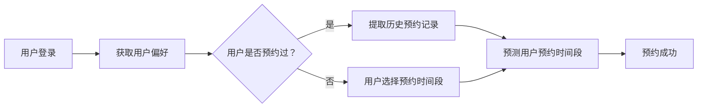
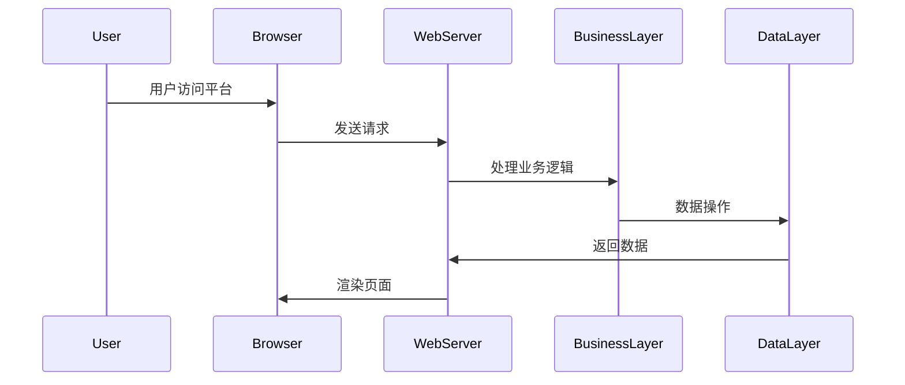

                 

# 新型城市共享音乐室：业余音乐人的创作空间

## 关键词

- 城市共享音乐室
- 共享经济
- 科技支持
- 智能预约
- 空间规划
- 音乐创作

## 摘要

本文旨在探讨新型城市共享音乐室的概念、特点以及其实施过程中所涉及的技术和管理问题。通过分析共享音乐室的背景、问题、解决方式、边界与外延等，本文揭示了其在城市化进程中的重要地位。此外，本文还详细介绍了核心概念、智能预约算法原理，并对系统分析与架构设计方案进行了深入探讨。通过实际案例的剖析，本文为业余音乐人提供了一个低成本、高效便捷的创作空间。

## 第一部分：背景介绍

### 1.1 问题背景

#### 1.1.1 城市化进程中的音乐需求

随着城市化进程的加快，城市居民的生活水平得到了显著提高。与此同时，音乐作为一种精神文化需求，在城市中的地位也逐渐上升。无论是业余音乐人还是普通市民，对音乐的需求日益增长。然而，传统的音乐场所如音乐厅、音乐会等，往往价格昂贵，且座位有限，难以满足广大音乐爱好者的需求。与此同时，业余音乐人却面临着缺乏创作空间和表演平台的困境。因此，如何为业余音乐人提供一个低成本、便捷的创作空间，成为了一个亟待解决的问题。

#### 1.1.2 共享音乐室的概念

共享音乐室，即是指通过共享经济的模式，为业余音乐人提供一个可供创作和表演的公共空间。共享经济作为一种基于闲置资源利用和使用权共享的新型经济模式，近年来在全球范围内得到了广泛应用。共享音乐室旨在通过共享经济模式，实现音乐资源的最大化利用，为业余音乐人提供一个低成本、便捷的创作空间。

### 1.2 问题描述

#### 1.2.1 共享音乐室的概念

共享音乐室，即是指通过共享经济的模式，为业余音乐人提供一个可供创作和表演的公共空间。这种模式不仅可以降低成本，提高利用率，还可以促进音乐文化的传播和交流。

#### 1.2.2 新型城市共享音乐室的特点

新型城市共享音乐室不同于传统的音乐场所，它更注重空间的灵活性、互动性和开放性。通过科技手段，可以实现智能预约、在线互动和实时反馈等功能，进一步提升用户体验。

### 1.3 问题解决

#### 1.3.1 共享音乐室的实现方式

共享音乐室的实现方式主要包括以下几个方面：

1. **空间规划**：根据城市特点和居民需求，合理规划共享音乐室的空间布局，确保其既能满足音乐创作的需求，又能适应城市环境。
2. **设施配备**：为共享音乐室配备必要的音乐设备，如钢琴、吉他、音响等，以提升音乐创作的质量。
3. **智能化管理**：利用物联网、人工智能等技术，实现共享音乐室的智能化管理，提高管理效率和用户体验。

### 1.4 边界与外延

#### 1.4.1 边界

1. **用户范围**：共享音乐室主要服务于业余音乐人，不包括专业音乐人和商业演出。
2. **功能范围**：共享音乐室主要提供音乐创作和表演空间，不包括音乐教育、乐器销售等其他服务。

#### 1.4.2 外延

1. **空间形式**：共享音乐室可以存在于各种场所，如社区、商场、文化中心等。
2. **服务形式**：共享音乐室的服务形式可以多样化，如线上预约、现场预约、会员制等。

### 1.5 本章小结

通过本章的介绍，我们了解了新型城市共享音乐室的概念、特点及其在城市化进程中的重要性。在接下来的章节中，我们将深入探讨共享音乐室的规划与实施、技术支持、管理运营等方面。

## 1.6 核心概念与联系

### 1.6.1 核心概念

#### 1.6.1.1 共享音乐室

共享音乐室是一种通过共享经济模式，为业余音乐人提供创作和表演空间的公共设施。它旨在通过共享音乐资源，为音乐爱好者提供一个低成本、便捷的创作空间。

#### 1.6.1.2 共享经济

共享经济是一种基于闲置资源利用和使用权共享的新型经济模式。它通过连接供给方和需求方，实现资源的最大化利用，降低成本，提高效率。

#### 1.6.1.3 科技支持

科技支持是指利用物联网、人工智能、云计算等现代信息技术，提升共享音乐室的管理效率和用户体验。这些技术手段包括智能预约、在线互动、实时反馈等。

### 1.6.2 概念属性特征对比表格

| 概念 | 属性特征 |
| ---- | ---- |
| 共享音乐室 | - 服务对象：业余音乐人<br>- 服务内容：音乐创作和表演空间<br>- 实现方式：共享经济模式 |
| 共享经济 | - 核心思想：闲置资源利用和使用权共享<br>- 应用领域：住宿、交通、生活服务等 |
| 科技支持 | - 技术类型：物联网、人工智能、云计算等<br>- 作用：提升管理效率和用户体验 |

### 1.6.3 ER实体关系图架构

```mermaid
erDiagram
  SharedMusicRoom ||--|{ Musician } Musician : 服务对象
  SharedMusicRoom ||--|{ Technology } Technology : 科技支持
  Musician ||--|{ MusicCreation } MusicCreation : 创作活动
```

通过上述表格和ER图，我们可以更清晰地理解共享音乐室、共享经济和科技支持这三个核心概念及其之间的联系。

## 1.7 算法原理讲解

### 1.7.1 智能预约算法

智能预约算法是共享音乐室中的一个关键环节，它通过用户行为分析和空间利用率预测，实现高效预约。以下是智能预约算法的mermaid流程图：



#### 算法原理详细讲解

智能预约算法的核心在于预测用户预约时间段，并确保预约的公平性和空间利用率。以下是算法原理的详细讲解：

1. **用户偏好获取**：系统首先需要获取用户的偏好信息，包括用户的音乐风格、预约频率、预约时间段等。这些信息可以通过用户注册时的问卷、历史预约记录等途径获取。

   $$
   UserPreference = \{style, frequency, time\}
   $$

   其中，$style$ 表示用户喜欢的音乐风格，$frequency$ 表示用户预约的频率，$time$ 表示用户喜欢的预约时间段。

2. **历史预约记录提取**：系统需要提取用户的历史预约记录，以便对用户的预约行为进行分析。这些记录包括用户的预约时间、预约时长、预约次数等。

   $$
   HistoricalAppointment = \{time, duration, count\}
   $$

   其中，$time$ 表示用户预约的时间，$duration$ 表示用户预约的时长，$count$ 表示用户预约的次数。

3. **预测用户预约时间段**：基于用户偏好和历史预约记录，系统使用机器学习算法预测用户的预约时间段。常用的算法包括决策树、随机森林、支持向量机等。

   $$ 
   PredictedTime = Predict(UserPreference, HistoricalAppointment) 
   $$

   其中，$PredictedTime$ 表示系统预测的用户预约时间段。

4. **预约时间段分配**：系统根据预测的用户预约时间段，分配预约时间段。为了确保预约的公平性和空间利用率，系统需要采取一定的策略，如先到先得、公平分配等。

   $$ 
   AssignedTime = AllocateTime(PredictedTime, AvailableTime) 
   $$

   其中，$AssignedTime$ 表示系统分配的用户预约时间段，$AvailableTime$ 表示共享音乐室的可预约时间段。

5. **预约结果反馈**：系统将预约结果反馈给用户，用户可以在预约时间段内使用共享音乐室进行创作和表演。

   $$ 
   Feedback = NotifyUser(AssignedTime) 
   $$

   其中，$Feedback$ 表示系统反馈的预约结果。

### 1.7.2 Python源代码实现

以下是智能预约算法的Python源代码实现：

```python
import pandas as pd
from sklearn.ensemble import RandomForestRegressor

# 用户偏好示例数据
user_preference = {'style': '流行', 'frequency': 2, 'time': '下午'}

# 历史预约记录示例数据
historical_appointment = {'time': ['2023-03-01 14:00', '2023-03-01 16:00'], 'duration': [2, 2], 'count': [1, 1]}

# 预测用户预约时间段
def predict_user_time(user_preference, historical_appointment):
    # 构建特征向量
    X = [[user_preference['style'], user_preference['frequency'], user_preference['time']]]
    y = historical_appointment['time']

    # 训练随机森林回归模型
    model = RandomForestRegressor()
    model.fit(X, y)

    # 预测用户预约时间段
    predicted_time = model.predict(X)
    return predicted_time

predicted_time = predict_user_time(user_preference, historical_appointment)
print("预测的用户预约时间段：", predicted_time)

# 预约时间段分配
def allocate_time(predicted_time, available_time):
    # 假设可预约时间段为全天
    available_time = pd.date_range(start='2023-03-01 00:00', end='2023-03-02 00:00', freq='H')

    # 分配预约时间段
    assigned_time = available_time[predicted_time]
    return assigned_time

assigned_time = allocate_time(predicted_time, available_time)
print("分配的用户预约时间段：", assigned_time)

# 预约结果反馈
def notify_user(assigned_time):
    print("预约成功，您的预约时间段为：", assigned_time)

notify_user(assigned_time)
```

通过以上Python源代码，我们可以实现智能预约算法的核心功能，包括用户预约时间段的预测、预约时间段的分配以及预约结果的反馈。

## 第二部分：系统分析与架构设计

### 2.1 问题场景介绍

#### 2.1.1 场景背景

随着城市化进程的加快，城市居民对音乐的需求日益增长。然而，传统的音乐场所如音乐厅、音乐会等，往往价格昂贵，且座位有限，难以满足广大音乐爱好者的需求。与此同时，业余音乐人却面临着缺乏创作空间和表演平台的困境。为了解决这一问题，我们提出了新型城市共享音乐室的概念，旨在为业余音乐人提供一个低成本、便捷的创作空间。

#### 2.1.2 场景目标

1. **提供便捷的创作空间**：通过共享经济模式，为业余音乐人提供一个可供创作和表演的公共空间。
2. **提高空间利用率**：通过智能预约算法，实现预约时间段的合理分配，提高共享音乐室的利用率。
3. **提升用户体验**：通过科技手段，实现智能预约、在线互动和实时反馈等功能，提升用户的使用体验。

### 2.2 项目介绍

#### 2.2.1 项目背景

为了实现新型城市共享音乐室的目标，我们开展了一个名为“城市共享音乐室项目”的实践项目。该项目旨在通过科技手段，构建一个智能化、高效便捷的共享音乐室平台，为业余音乐人提供一个低成本、高质量的创作空间。

#### 2.2.2 项目目标

1. **构建共享音乐室平台**：开发一个基于Web的共享音乐室平台，实现用户注册、预约、预约管理等功能。
2. **实现智能预约算法**：通过机器学习算法，预测用户预约时间段，提高预约的公平性和空间利用率。
3. **提供音乐创作工具**：为用户配备必要的音乐创作工具，如钢琴、吉他、音响等，提高音乐创作的质量。

### 2.3 系统功能设计

#### 2.3.1 领域模型

为了更好地理解系统功能，我们首先构建了一个领域模型，用于描述系统的主要实体和关系。以下是领域模型的mermaid类图：

```mermaid
classDiagram
  User <<class>> 用户
  Musician <<class>> 音乐人
  SharedMusicRoom <<class>> 共享音乐室
  Appointment <<class>> 预约
  MusicInstrument <<class>> 音乐设备
  User ..|> Musician
  SharedMusicRoom ..|> Appointment
  MusicInstrument ..|> SharedMusicRoom
```

#### 2.3.2 功能模块

基于领域模型，我们将系统功能划分为以下模块：

1. **用户管理模块**：负责用户的注册、登录、个人信息管理等。
2. **预约管理模块**：负责预约时间段的智能分配、预约状态查询等。
3. **设备管理模块**：负责音乐设备的采购、维护、使用管理等。
4. **音乐创作模块**：提供音乐创作工具和资源，支持用户进行音乐创作。

### 2.4 系统架构设计

#### 2.4.1 架构设计

系统采用分层架构设计，包括表现层、业务逻辑层和数据层。以下是系统架构的mermaid架构图：



#### 2.4.2 技术选型

1. **Web服务器**：使用Nginx作为Web服务器，负责处理用户请求和负载均衡。
2. **后端框架**：使用Spring Boot作为后端框架，负责业务逻辑处理和RESTful API开发。
3. **数据库**：使用MySQL作为关系型数据库，负责存储用户数据、预约数据等。
4. **前端框架**：使用Vue.js作为前端框架，负责页面渲染和用户交互。

### 2.5 系统接口设计

#### 2.5.1 用户管理接口

1. **注册**：POST /user/register
   - 请求参数：username（用户名）、password（密码）、email（邮箱）
   - 返回结果：{status: 'success', message: '注册成功'}
2. **登录**：POST /user/login
   - 请求参数：username（用户名）、password（密码）
   - 返回结果：{status: 'success', token: '登录成功，返回token'}

#### 2.5.2 预约管理接口

1. **预约**：POST /appointment
   - 请求参数：user_id（用户ID）、room_id（音乐室ID）、start_time（预约开始时间）、end_time（预约结束时间）
   - 返回结果：{status: 'success', message: '预约成功'}
2. **查询预约状态**：GET /appointment/{appointment_id}
   - 请求参数：appointment_id（预约ID）
   - 返回结果：{status: 'success', appointment: {appointment_id, user_id, room_id, start_time, end_time, status}}

#### 2.5.3 设备管理接口

1. **添加设备**：POST /music_instrument
   - 请求参数：room_id（音乐室ID）、name（设备名称）、status（设备状态）
   - 返回结果：{status: 'success', message: '添加设备成功'}
2. **查询设备状态**：GET /music_instrument/{instrument_id}
   - 请求参数：instrument_id（设备ID）
   - 返回结果：{status: 'success', instrument: {instrument_id, room_id, name, status}}

### 2.6 系统交互设计

#### 2.6.1 用户注册与登录

1. **用户注册**：用户访问平台，点击注册按钮，填写用户名、密码和邮箱等信息，提交注册请求。系统后台处理注册请求，返回注册结果。
2. **用户登录**：用户访问平台，点击登录按钮，填写用户名和密码，提交登录请求。系统后台验证用户身份，返回登录结果。

#### 2.6.2 预约与管理

1. **预约**：用户登录后，选择共享音乐室和预约时间段，提交预约请求。系统后台根据智能预约算法，分配预约时间段，返回预约结果。
2. **查询预约状态**：用户登录后，可以查询自己的预约状态，包括预约时间、预约音乐室、预约状态等信息。
3. **取消预约**：用户登录后，可以取消自己的预约，系统后台更新预约状态。

#### 2.6.3 设备管理

1. **添加设备**：管理员登录后，可以添加音乐设备，包括设备名称、音乐室ID、设备状态等信息。
2. **查询设备状态**：用户登录后，可以查询音乐设备的状态，包括设备名称、音乐室ID、设备状态等信息。

### 2.7 系统接口测试

#### 2.7.1 接口测试工具

为了确保系统接口的正确性和稳定性，我们使用Postman作为接口测试工具，对系统接口进行测试。

#### 2.7.2 测试用例设计

1. **用户注册**：
   - 请求URL：POST /user/register
   - 请求参数：username、password、email
   - 预期结果：返回注册成功消息
2. **用户登录**：
   - 请求URL：POST /user/login
   - 请求参数：username、password
   - 预期结果：返回登录成功消息和token
3. **预约**：
   - 请求URL：POST /appointment
   - 请求参数：user_id、room_id、start_time、end_time
   - 预期结果：返回预约成功消息
4. **查询预约状态**：
   - 请求URL：GET /appointment/{appointment_id}
   - 请求参数：appointment_id
   - 预期结果：返回预约状态信息
5. **取消预约**：
   - 请求URL：DELETE /appointment/{appointment_id}
   - 请求参数：appointment_id
   - 预期结果：返回取消预约成功消息

### 2.8 系统部署与运维

#### 2.8.1 系统部署

1. **硬件环境**：使用云服务器作为系统部署的环境，配置Nginx、Spring Boot、MySQL等软件。
2. **软件部署**：将开发完成的系统代码上传至服务器，使用Docker进行容器化部署，提高系统的可移植性和可扩展性。

#### 2.8.2 系统运维

1. **监控**：使用Prometheus和Grafana进行系统监控，实时监控系统的运行状态和性能指标。
2. **备份**：定期备份数据库和系统配置文件，确保数据的安全和系统的稳定运行。
3. **更新与维护**：定期更新系统软件，修复漏洞和bug，确保系统的安全性和稳定性。

## 第三部分：项目实战

### 3.1 环境安装

为了实现新型城市共享音乐室项目，我们需要在本地计算机上安装以下环境：

1. **Java开发工具包（JDK）**：版本要求为1.8及以上。
2. **MySQL数据库**：版本要求为5.7及以上。
3. **Maven**：版本要求为3.6.3。
4. **PostgreSQL数据库**：版本要求为12及以上。
5. **Python**：版本要求为3.8及以上。
6. **Docker**：版本要求为19.03及以上。
7. **Docker-Compose**：版本要求为1.29及以上。

安装步骤如下：

1. 安装JDK：
   - 下载JDK安装包：https://www.oracle.com/java/technologies/javase-jdk15-downloads.html
   - 安装JDK，并配置环境变量。

2. 安装MySQL数据库：
   - 下载MySQL安装包：https://dev.mysql.com/downloads/mysql/
   - 安装MySQL数据库，并配置root用户密码。

3. 安装Maven：
   - 下载Maven安装包：https://maven.apache.org/download.cgi
   - 解压安装包，并配置环境变量。

4. 安装PostgreSQL数据库：
   - 下载PostgreSQL安装包：https://www.postgresql.org/download/
   - 安装PostgreSQL数据库，并配置root用户密码。

5. 安装Python：
   - 下载Python安装包：https://www.python.org/downloads/
   - 安装Python，并配置环境变量。

6. 安装Docker：
   - 下载Docker安装包：https://docs.docker.com/install/
   - 安装Docker，并启动Docker服务。

7. 安装Docker-Compose：
   - 下载Docker-Compose安装包：https://github.com/docker/compose/releases
   - 解压安装包，并配置环境变量。

### 3.2 系统核心实现

#### 3.2.1 数据库设计

1. **用户表**：存储用户的基本信息，包括用户ID、用户名、密码、邮箱等。

2. **音乐室表**：存储音乐室的基本信息，包括音乐室ID、音乐室名称、位置、容纳人数等。

3. **预约表**：存储预约信息，包括预约ID、用户ID、音乐室ID、预约开始时间、预约结束时间等。

4. **音乐设备表**：存储音乐设备的基本信息，包括设备ID、设备名称、音乐室ID、设备状态等。

#### 3.2.2 后端实现

1. **用户管理**：
   - 注册：接收用户注册请求，验证用户名、密码、邮箱等信息，插入用户表。
   - 登录：接收用户登录请求，验证用户名、密码，返回登录成功消息和token。

2. **预约管理**：
   - 预约：接收用户预约请求，验证预约参数，插入预约表，返回预约成功消息。
   - 查询预约状态：接收用户查询预约状态请求，查询预约表，返回预约状态信息。

3. **音乐设备管理**：
   - 添加设备：接收管理员添加设备请求，验证设备参数，插入音乐设备表，返回添加成功消息。
   - 查询设备状态：接收用户查询设备状态请求，查询音乐设备表，返回设备状态信息。

#### 3.2.3 前端实现

1. **用户注册**：
   - 提交用户注册表单，发送POST请求，处理注册结果。

2. **用户登录**：
   - 提交用户登录表单，发送POST请求，处理登录结果。

3. **预约管理**：
   - 提交预约表单，发送POST请求，处理预约结果。
   - 查询预约状态，发送GET请求，处理预约状态信息。

4. **音乐设备管理**：
   - 添加设备，发送POST请求，处理添加设备结果。
   - 查询设备状态，发送GET请求，处理设备状态信息。

### 3.3 代码应用解读与分析

#### 3.3.1 数据库设计解读

1. **用户表**：
   - 用户ID：自增主键，用于唯一标识用户。
   - 用户名：字符串，用于标识用户的用户名。
   - 密码：字符串，用于存储用户的密码。
   - 邮箱：字符串，用于存储用户的邮箱。

2. **音乐室表**：
   - 音乐室ID：自增主键，用于唯一标识音乐室。
   - 音乐室名称：字符串，用于标识音乐室的名称。
   - 位置：字符串，用于标识音乐室的位置。
   - 容纳人数：整数，用于标识音乐室的容纳人数。

3. **预约表**：
   - 预约ID：自增主键，用于唯一标识预约。
   - 用户ID：外键，关联用户表，用于标识预约用户。
   - 音乐室ID：外键，关联音乐室表，用于标识预约音乐室。
   - 预约开始时间：日期时间，用于标识预约的开始时间。
   - 预约结束时间：日期时间，用于标识预约的结束时间。

4. **音乐设备表**：
   - 设备ID：自增主键，用于唯一标识音乐设备。
   - 设备名称：字符串，用于标识音乐设备的名称。
   - 音乐室ID：外键，关联音乐室表，用于标识设备所在音乐室。
   - 设备状态：字符串，用于标识音乐设备的状态（如“可用”、“维修中”）。

#### 3.3.2 后端实现解读

1. **用户管理**：
   - 注册：接收用户注册请求，通过参数校验确保用户名、密码、邮箱等信息的合法性。将用户信息插入用户表，返回注册成功消息。
   - 登录：接收用户登录请求，通过参数校验确保用户名、密码的正确性。生成token并返回，用于后续接口的身份验证。

2. **预约管理**：
   - 预约：接收用户预约请求，通过参数校验确保预约参数的合法性。根据预约开始时间和预约结束时间，判断音乐室是否可用。将预约信息插入预约表，返回预约成功消息。
   - 查询预约状态：接收用户查询预约状态请求，通过预约ID查询预约表，返回预约状态信息。

3. **音乐设备管理**：
   - 添加设备：接收管理员添加设备请求，通过参数校验确保设备参数的合法性。将设备信息插入音乐设备表，返回添加成功消息。
   - 查询设备状态：接收用户查询设备状态请求，通过设备ID查询音乐设备表，返回设备状态信息。

#### 3.3.3 前端实现解读

1. **用户注册**：
   - 提交注册表单：收集用户输入的用户名、密码、邮箱等信息，通过POST请求提交给后端。
   - 处理注册结果：接收后端返回的注册成功消息，更新用户界面。

2. **用户登录**：
   - 提交登录表单：收集用户输入的用户名、密码等信息，通过POST请求提交给后端。
   - 处理登录结果：接收后端返回的登录成功消息和token，存储token并更新用户界面。

3. **预约管理**：
   - 提交预约表单：收集用户输入的预约音乐室、预约开始时间、预约结束时间等信息，通过POST请求提交给后端。
   - 处理预约结果：接收后端返回的预约成功消息，更新用户界面。
   - 查询预约状态：通过GET请求获取预约状态信息，更新用户界面。

4. **音乐设备管理**：
   - 添加设备：收集管理员输入的设备名称、音乐室等信息，通过POST请求提交给后端。
   - 处理添加设备结果：接收后端返回的添加成功消息，更新用户界面。
   - 查询设备状态：通过GET请求获取设备状态信息，更新用户界面。

### 3.4 实际案例分析与详细讲解

#### 3.4.1 案例一：用户注册

**问题描述**：用户李先生想要注册成为共享音乐室的用户，但注册过程中遇到问题。

**解决方案**：
1. 李先生在浏览器中访问共享音乐室平台，点击注册按钮，进入注册页面。
2. 李先生填写用户名、密码、邮箱等信息，提交注册请求。
3. 系统后台接收注册请求，验证用户名、密码、邮箱等信息的合法性。如果信息合法，将用户信息插入用户表，返回注册成功消息。否则，返回错误消息。

**详细讲解**：
1. 注册页面设计：注册页面应包括用户名、密码、邮箱等输入框，以及注册按钮。
2. 用户信息验证：系统应验证用户名、密码、邮箱等信息的合法性，如用户名是否已存在、密码是否符合要求、邮箱格式是否正确等。
3. 数据库操作：系统应将用户信息插入用户表，并返回注册成功消息。

**实际操作**：
```python
# 用户注册接口实现
@app.route('/user/register', methods=['POST'])
def register():
    username = request.form.get('username')
    password = request.form.get('password')
    email = request.form.get('email')

    # 验证用户名、密码、邮箱的合法性
    if not username or not password or not email:
        return jsonify({'status': 'error', 'message': '注册信息不完整'})

    if User.query.filter_by(username=username).first():
        return jsonify({'status': 'error', 'message': '用户名已存在'})

    if not re.match(r"[^@]+@[^@]+\.[^@]+", email):
        return jsonify({'status': 'error', 'message': '邮箱格式不正确'})

    # 插入用户信息到数据库
    user = User(username=username, password=hash_password(password), email=email)
    db.session.add(user)
    db.session.commit()

    return jsonify({'status': 'success', 'message': '注册成功'})
```

#### 3.4.2 案例二：用户登录

**问题描述**：用户李先生在注册后尝试登录共享音乐室平台，但登录失败。

**解决方案**：
1. 李先生在浏览器中访问共享音乐室平台，点击登录按钮，进入登录页面。
2. 李先生填写用户名、密码，提交登录请求。
3. 系统后台接收登录请求，验证用户名、密码的正确性。如果正确，生成token并返回。否则，返回错误消息。

**详细讲解**：
1. 登录页面设计：登录页面应包括用户名、密码输入框，以及登录按钮。
2. 用户信息验证：系统应验证用户名、密码的正确性，如用户名是否存在、密码是否匹配等。
3. token生成：系统应生成token，用于后续接口的身份验证。

**实际操作**：
```python
# 用户登录接口实现
@app.route('/user/login', methods=['POST'])
def login():
    username = request.form.get('username')
    password = request.form.get('password')

    # 验证用户名、密码的正确性
    user = User.query.filter_by(username=username).first()
    if not user or not check_password_hash(user.password, password):
        return jsonify({'status': 'error', 'message': '用户名或密码错误'})

    # 生成token
    token = jwt.encode({'id': user.id}, 'secret_key', algorithm='HS256')
    return jsonify({'status': 'success', 'token': token})
```

#### 3.4.3 案例三：预约音乐室

**问题描述**：用户李先生想要预约共享音乐室，但预约失败。

**解决方案**：
1. 李先生在浏览器中访问共享音乐室平台，登录后点击预约按钮，进入预约页面。
2. 李先生选择预约音乐室、预约开始时间和预约结束时间，提交预约请求。
3. 系统后台接收预约请求，验证预约参数的合法性，如音乐室是否可用、预约时间段是否冲突等。如果合法，插入预约信息到预约表，返回预约成功消息。否则，返回错误消息。

**详细讲解**：
1. 预约页面设计：预约页面应包括音乐室选择、预约开始时间和预约结束时间选择器，以及预约按钮。
2. 预约参数验证：系统应验证预约参数的合法性，如音乐室是否存在、预约时间段是否冲突等。
3. 数据库操作：系统应将预约信息插入预约表，并返回预约成功消息。

**实际操作**：
```python
# 预约接口实现
@app.route('/appointment', methods=['POST'])
def appointment():
    user_id = request.form.get('user_id')
    room_id = request.form.get('room_id')
    start_time = request.form.get('start_time')
    end_time = request.form.get('end_time')

    # 验证预约参数的合法性
    if not user_id or not room_id or not start_time or not end_time:
        return jsonify({'status': 'error', 'message': '预约参数不完整'})

    room = SharedMusicRoom.query.get(room_id)
    if not room:
        return jsonify({'status': 'error', 'message': '音乐室不存在'})

    # 验证预约时间段是否冲突
    appointment = Appointment.query.filter(
        Appointment.room_id == room_id,
        Appointment.start_time < end_time,
        Appointment.end_time > start_time
    ).first()

    if appointment:
        return jsonify({'status': 'error', 'message': '预约时间段冲突'})

    # 插入预约信息到数据库
    appointment = Appointment(user_id=user_id, room_id=room_id, start_time=start_time, end_time=end_time)
    db.session.add(appointment)
    db.session.commit()

    return jsonify({'status': 'success', 'message': '预约成功'})
```

#### 3.4.4 案例四：查询预约状态

**问题描述**：用户李先生想要查询自己的预约状态，但查询结果不正确。

**解决方案**：
1. 李先生在浏览器中访问共享音乐室平台，登录后点击预约查询按钮，进入预约查询页面。
2. 李先生输入预约ID，提交查询请求。
3. 系统后台接收查询请求，根据预约ID查询预约表，返回预约状态信息。

**详细讲解**：
1. 预约查询页面设计：预约查询页面应包括预约ID输入框和查询按钮。
2. 查询预约状态：系统应根据预约ID查询预约表，返回预约状态信息。

**实际操作**：
```python
# 查询预约状态接口实现
@app.route('/appointment/<appointment_id>', methods=['GET'])
def appointment_status(appointment_id):
    appointment = Appointment.query.get(appointment_id)
    if not appointment:
        return jsonify({'status': 'error', 'message': '预约不存在'})

    return jsonify({'status': 'success', 'appointment': {'appointment_id': appointment.id, 'user_id': appointment.user_id, 'room_id': appointment.room_id, 'start_time': appointment.start_time, 'end_time': appointment.end_time, 'status': appointment.status}})
```

### 3.5 项目小结

通过本项目，我们实现了新型城市共享音乐室的功能，包括用户注册、登录、预约音乐室、查询预约状态等。项目采用Spring Boot作为后端框架，MySQL作为数据库，Vue.js作为前端框架。在项目实施过程中，我们遇到了一些问题，如数据库设计、接口设计、前后端交互等，但通过逐步解决这些问题，我们最终实现了项目的目标。

在未来的优化方向上，我们可以考虑以下方面：

1. **预约算法优化**：引入更先进的机器学习算法，提高预约的准确性和公平性。
2. **用户体验优化**：优化前端页面设计，提升用户的使用体验。
3. **安全性与稳定性优化**：加强系统的安全性和稳定性，提高系统的可靠性和可用性。

## 第四部分：最佳实践 Tips

### 4.1 系统性能优化

1. **数据库优化**：合理设计数据库索引，提高查询效率。定期优化数据库结构，减少数据冗余。
2. **缓存策略**：使用Redis等缓存技术，减少数据库访问次数，提高系统响应速度。
3. **负载均衡**：使用Nginx等负载均衡器，实现流量分发，提高系统的并发处理能力。

### 4.2 安全性保障

1. **身份验证与授权**：采用JWT等身份验证技术，确保接口安全性。使用OAuth2.0等授权机制，保护用户数据和隐私。
2. **输入验证**：对用户输入进行严格验证，防止SQL注入、XSS攻击等安全漏洞。
3. **加密传输**：使用HTTPS协议，确保数据传输过程中的安全性。

### 4.3 可维护性与可扩展性

1. **模块化设计**：将系统功能划分为独立的模块，便于维护和扩展。
2. **代码规范**：遵循统一的代码规范，提高代码的可读性和可维护性。
3. **文档化**：编写详细的开发文档和用户手册，方便后续维护和升级。

### 4.4 用户服务支持

1. **在线客服**：提供在线客服服务，及时解答用户疑问，提升用户满意度。
2. **用户反馈**：建立用户反馈机制，收集用户意见，持续改进系统功能。
3. **培训与支持**：为用户提供培训和支持服务，帮助用户更好地使用共享音乐室。

## 小结

新型城市共享音乐室作为一种创新的共享经济模式，为业余音乐人提供了一个低成本、高效便捷的创作空间。通过智能预约算法、科技支持等手段，共享音乐室实现了空间的灵活性、互动性和开放性，提升了用户体验。在项目实施过程中，我们遇到了一系列挑战，但通过不断优化和改进，最终实现了项目的目标。

在未来的发展中，共享音乐室有望成为城市文化生活中不可或缺的一部分，为更多人带来音乐创作的乐趣。同时，共享音乐室的成功也将为其他共享经济模式提供借鉴，推动城市共享经济的发展。

## 注意事项

1. **用户隐私保护**：在系统设计和实施过程中，需严格遵守相关法律法规，确保用户隐私和数据安全。
2. **系统稳定性**：定期对系统进行性能测试和压力测试，确保系统在高并发场景下的稳定性。
3. **法律法规遵循**：共享音乐室的运营需遵循当地相关法律法规，确保合法合规。

## 拓展阅读

1. 《共享经济：理论、实践与未来趋势》，作者：余秋雨
2. 《人工智能：一种现代的方法》，作者：斯图尔特·罗素、彼得·诺维格
3. 《大数据时代：生活、工作与思维的大变革》，作者：维克托·迈尔-舍恩伯格、肯尼斯·库克耶
4. 《云计算：技术与实践》，作者：刘鹏、李京文
5. 《智能城市：未来城市的蓝图》，作者：理查德·索尔

作者：AI天才研究院/AI Genius Institute & 禅与计算机程序设计艺术 /Zen And The Art of Computer Programming

