                 

# 新型城市共享音乐教室：AI辅助下的个性化音乐教育平台

关键词：共享音乐教室、人工智能、个性化音乐教育、AI辅助教育、教育平台

摘要：随着城市化进程的加快，教育资源分配不均问题日益突出。为了满足大众对音乐教育的需求，新型城市共享音乐教室应运而生。本文将探讨基于人工智能技术的共享音乐教室及其个性化音乐教育平台的设计与实现，通过逐步分析，旨在为教育行业提供一种创新的解决方案。

## 引言

新型城市共享音乐教室是一种创新的音乐教育模式，通过共享经济理念，打破传统音乐教室的时间和空间限制，实现音乐教育的普及与公平。随着人工智能技术的快速发展，AI在音乐教育中的应用日益广泛，个性化音乐教育成为可能。本文将围绕新型城市共享音乐教室展开讨论，分析其核心概念、架构设计、实现案例以及未来展望。

### 第1章 问题背景与核心概念

#### 1.1 问题背景

城市化进程的加快带来了教育资源的不均衡分配。传统音乐教室通常局限于特定地点和时间，教育资源无法满足大众需求。此外，音乐教育成本高昂，使得许多家庭难以承担。因此，如何利用人工智能技术解决这些问题成为当务之急。

#### 1.2 核心概念

- **共享音乐教室**：一种基于共享经济理念的教室模式，实现音乐资源的共享与普及。
- **AI辅助音乐教育**：利用人工智能技术，为音乐教育提供智能化支持，实现个性化教学。
- **个性化音乐教育平台**：一个基于AI技术的音乐教育平台，提供个性化教学和自主学习功能。

### 第2章 AI辅助下的共享音乐教室概述

#### 2.1 AI技术简介

- **人工智能**：模拟人类智能的计算机系统，具有感知、学习、推理和决策能力。
- **AI技术在教育领域的应用**：AI技术在教育领域的应用包括智能辅导、自动评分、个性化推荐等。

#### 2.2 共享音乐教室的必要性

- **教育资源分配不均**：城市化进程中，教育资源分配不均，共享音乐教室有助于解决这一问题。
- **传统音乐教室的局限性**：传统音乐教室存在时间和空间限制，共享音乐教室能够打破这些限制。
- **共享音乐教室的解决方案**：通过共享经济模式，降低音乐教育成本，提高教育资源的利用率。

#### 2.3 个性化音乐教育平台的构成要素

- **人工智能在教学中的应用**：利用AI技术，实现教学内容的个性化定制。
- **数据分析和个性化推荐**：基于大数据分析，为学生推荐个性化的教学资源和学习计划。
- **教学内容和教学方法的优化**：通过数据分析和AI算法，优化教学内容和教学方法，提高教学效果。

### 第3章 AI辅助下的共享音乐教室架构设计

#### 3.1 教学内容设计

- **音乐课程内容设计**：根据学生需求，设计多样化的音乐课程。
- **教学目标与教学策略**：设定明确的教学目标，采用有效的教学策略，实现个性化教学。

#### 3.2 人工智能模块设计

- **语音识别与自然语言处理**：实现人机交互，提供智能问答和语音指导。
- **个性化推荐算法**：基于学生数据，为学生推荐个性化的音乐资源和课程。
- **情感分析**：分析学生的情感状态，提供情感关怀和支持。

#### 3.3 教学系统接口设计

- **用户界面设计**：设计友好、直观的用户界面，方便学生使用。
- **数据接口设计**：设计标准化的数据接口，实现数据互通和共享。
- **系统安全与隐私保护**：保障学生数据安全，保护用户隐私。

### 第4章 AI辅助下的共享音乐教室实现案例

#### 4.1 案例一：某城市共享音乐教室项目介绍

- **项目背景**：介绍项目启动的背景和初衷。
- **项目目标**：明确项目目标，包括预期效果和达成目标的具体措施。
- **项目成果**：总结项目实施后的成果和效益。

#### 4.2 案例分析

- **案例实施过程**：详细描述项目实施的全过程。
- **案例中的关键技术**：分析项目中应用的关键技术。
- **案例中的挑战与解决方案**：探讨项目实施过程中遇到的挑战及解决方案。

#### 4.3 案例总结与启示

- **案例的实践经验**：总结案例中的成功经验。
- **案例对其他城市的借鉴意义**：分析案例对其他城市实施共享音乐教室的启示。

### 第5章 AI辅助下的个性化音乐教育平台

#### 5.1 平台功能设计

- **个性化教学功能**：根据学生特点，提供个性化的教学服务。
- **学生自主学习功能**：支持学生自主学习和探究。
- **教师管理功能**：帮助教师管理学生信息和教学进度。

#### 5.2 平台技术实现

- **数据采集与处理**：收集学生数据，进行数据清洗和分析。
- **机器学习算法应用**：利用机器学习算法，实现个性化推荐和智能辅导。
- **平台系统架构设计**：设计高效的系统架构，保障平台稳定运行。

#### 5.3 平台运行效果评估

- **教学效果评估方法**：制定科学的评估方法，评估教学效果。
- **学生反馈分析**：分析学生反馈，了解学生对平台的使用感受。
- **教师评价**：收集教师对平台的评价，优化平台功能。

### 第6章 未来展望与挑战

#### 6.1 技术发展趋势

- **AI技术在音乐教育中的未来发展方向**：探讨AI技术在音乐教育中的发展趋势。
- **新型城市共享音乐教室的发展趋势**：分析新型城市共享音乐教室的发展前景。

#### 6.2 挑战与对策

- **技术难题与解决方案**：分析项目实施过程中可能遇到的技术难题及解决方案。
- **教育政策与市场环境的挑战**：探讨教育政策和市场环境对共享音乐教室发展的影响。

#### 6.3 未来展望

- **新型城市共享音乐教室的发展前景**：预测新型城市共享音乐教室的未来发展方向。
- **个性化音乐教育平台的未来发展**：分析个性化音乐教育平台的未来发展趋势。

### 第7章 总结与展望

- **本书的主要贡献**：总结本文的主要贡献。
- **存在的问题与改进方向**：指出文章中存在的问题及改进方向。
- **对未来研究的展望**：展望未来的研究工作，为后续研究提供参考。

### 结尾

本文以新型城市共享音乐教室为背景，探讨了基于人工智能技术的个性化音乐教育平台的设计与实现。通过逐步分析，本文揭示了共享音乐教室在解决教育资源不均问题、提高音乐教育质量方面的潜力。未来，随着AI技术的不断进步，新型城市共享音乐教室和个性化音乐教育平台将有望在教育领域发挥更大作用。

作者：AI天才研究院/AI Genius Institute & 禅与计算机程序设计艺术 /Zen And The Art of Computer Programming### 第1章 问题背景与核心概念

#### 1.1 问题背景

在快速城市化进程中，教育资源的不均衡分配问题愈发显著。特别是在音乐教育领域，传统的音乐教室模式由于受限于场地和师资，往往难以满足日益增长的社会需求。许多家庭因为高昂的音乐教育成本而望而却步，而音乐教育的普及程度也因此受到限制。此外，城市人口的流动性大，音乐教育资源的地域性分配不均问题也尤为突出。

首先，传统音乐教室大多集中在大城市的高档社区或音乐院校附近，这些地区的教育资源相对丰富，但远郊或偏远地区的教育资源则严重匮乏。这种情况不仅导致了教育资源的不公平分配，也使得很多有音乐天赋的学生因地理位置的限制而无法接受专业的音乐教育。其次，传统音乐教室通常采用固定的教学模式和课程内容，无法根据学生的个性差异和学习需求进行个性化教学，这进一步制约了音乐教育的效果。

此外，随着城市人口的增长和住宅区的扩展，人们对于音乐教育需求的多样化也日益凸显。现代社会中，音乐不仅是一种艺术形式，更是一种生活方式。越来越多的人希望通过学习音乐来丰富自己的生活，提升自己的审美能力。然而，由于传统音乐教室的时间和空间限制，这种需求难以得到满足。

面对这些挑战，共享音乐教室作为一种创新的解决方案，应运而生。共享音乐教室利用互联网和人工智能技术，打破了传统音乐教室的时间和空间限制，通过共享经济模式实现音乐资源的共享和普及。这种模式不仅降低了音乐教育的成本，也提高了教育资源的利用率，为更多学生提供了接触和接受专业音乐教育的机会。

总之，随着城市化进程的加快，音乐教育面临的问题愈发复杂和严峻。传统音乐教室模式已无法满足社会日益增长的需求，新型城市共享音乐教室的出现为解决这一问题提供了一种可行的途径。通过共享音乐教室，我们有望实现音乐教育资源的公平分配，提升音乐教育的普及程度和质量。

#### 1.2 核心概念

在探讨新型城市共享音乐教室及其AI辅助下的个性化音乐教育平台时，需要明确几个核心概念，以便更好地理解其原理和应用。

**共享音乐教室**：共享音乐教室是指利用互联网和物联网技术，将音乐教室的资源和设施进行共享，以实现音乐教育资源的最大化利用。它通常通过线上平台进行资源分配和预约管理，使得学生可以随时随地选择和预约音乐课程，而不再受限于地理位置和时间。共享音乐教室的核心在于通过资源共享来降低音乐教育的门槛，使更多的人能够享受到专业的音乐教育。

**AI辅助音乐教育**：AI辅助音乐教育是指利用人工智能技术，如语音识别、自然语言处理、情感分析和个性化推荐等，为音乐教育提供智能化支持。AI技术能够帮助学生进行自我诊断和练习，提供个性化的学习路径，同时帮助教师进行教学分析和决策。AI辅助音乐教育不仅提高了教学效率，还能够根据学生的特点和学习情况，提供更加精准和有效的教育服务。

**个性化音乐教育平台**：个性化音乐教育平台是一个基于AI技术的综合音乐教育系统，它通过收集和分析学生的数据，为学生提供个性化的学习体验。这个平台通常包括课程推荐、学习进度跟踪、教学效果评估等功能，旨在通过数据驱动的方式，实现教学内容的个性化和学习效果的优化。个性化音乐教育平台的核心是数据驱动，通过不断学习和调整，为每个学生提供最适合自己的学习路径和资源。

**核心概念与联系**：

1. **共享音乐教室**：通过共享经济模式，打破传统音乐教室的时间和空间限制，实现音乐资源的共享和普及。
2. **AI辅助音乐教育**：利用人工智能技术，为音乐教育提供智能化支持，实现教学内容的个性化和学习效率的提升。
3. **个性化音乐教育平台**：结合共享音乐教室和AI辅助音乐教育，通过数据驱动，为学生提供个性化的学习体验和教学服务。

这些核心概念相互联系，共同构成了新型城市共享音乐教室及其AI辅助下的个性化音乐教育平台的基本框架。通过这些概念，我们能够更好地理解这个创新教育模式的工作原理和优势，也为后续的架构设计和实现提供了理论基础。

#### 1.3 新型城市共享音乐教室的必要性

新型城市共享音乐教室的出现，不仅是技术发展的必然结果，更是应对城市化进程中教育资源分配不均问题的迫切需求。以下将从城市化进程中的教育资源分配不均、传统音乐教室的局限性以及共享音乐教室的解决方案三个方面进行详细探讨。

首先，城市化进程中的教育资源分配不均问题日益突出。随着城市人口的快速增长和城市规模的扩大，城市内部的教育资源分配越来越不平衡。特别是在大中城市，教育资源往往集中分布在城市中心区域或者名校周边，而远郊或者偏远地区的教育资源则相对匮乏。这种不均衡的分配不仅导致了教育机会的不公平，也限制了社会整体音乐教育水平的提升。

其次，传统音乐教室存在显著的局限性。传统音乐教室通常受限于场地和师资，教学设备和课程内容也较为单一。这种模式不仅无法满足不同学生之间的个性化需求，还存在着时间和空间上的限制。学生需要到固定地点上课，受限于固定的上课时间，难以灵活安排学习。此外，传统音乐教室的教学方式多以教师为主导，学生被动接受知识，缺乏自主学习和探究的机会，这也在一定程度上影响了音乐教育的效果。

为了解决上述问题，新型城市共享音乐教室作为一种创新的解决方案，应运而生。共享音乐教室通过互联网和物联网技术，打破了传统音乐教室的时间和空间限制，实现了音乐教育资源的共享和优化配置。具体来说，共享音乐教室具有以下几个方面的优势：

1. **资源共享**：共享音乐教室通过线上平台进行资源分配和预约管理，使得学生可以根据自己的需求，随时随地选择和预约音乐课程。教师和教学设备也可以通过共享模式，提高利用率，减少浪费。

2. **个性化教学**：基于人工智能技术的辅助，共享音乐教室能够根据学生的个性差异和学习需求，提供个性化的教学资源和指导。学生可以自主选择学习路径，自主安排学习进度，提高学习效率。

3. **降低成本**：通过共享经济模式，共享音乐教室可以有效降低音乐教育的成本，使得更多家庭能够承担起音乐教育的费用，从而实现音乐教育的普及和公平。

4. **教学灵活性**：共享音乐教室不仅提供了灵活的学习时间和地点，还通过线上课程和线下实践相结合的方式，增强了教学的灵活性和互动性，使学习过程更加有趣和高效。

总之，新型城市共享音乐教室的出现，是应对城市化进程中教育资源分配不均问题的有效途径。它通过共享经济和人工智能技术的应用，不仅解决了传统音乐教室的局限性，还为音乐教育提供了更加多样化和个性化的解决方案。随着技术的不断进步和推广，共享音乐教室有望在未来的教育领域中发挥更大的作用，推动音乐教育的普及和提升。

#### 1.4 个性化音乐教育平台的构成要素

个性化音乐教育平台的构建需要综合考虑多个关键要素，这些要素相互关联，共同构成了一个高效、智能、用户友好的音乐教育生态系统。以下将详细讨论这些构成要素，包括人工智能在教学中的应用、数据分析和个性化推荐，以及教学内容与教学方法的优化。

**1.4.1 人工智能在教学中的应用**

人工智能（AI）在音乐教育中的应用主要体现在以下几个方面：

- **智能辅导**：通过智能辅导系统，AI可以实时监测学生的学习进度和表现，提供个性化的辅导建议。例如，系统可以根据学生的学习情况，自动调整练习难度，为学生推荐适合的练习曲目和教学方法。

- **自动评分**：AI可以自动评分，减少教师的评分工作量，提高评分的客观性和准确性。例如，AI可以分析学生的演奏视频，自动评估其音准、节奏和表现力，给予详细的评分和反馈。

- **智能问答**：AI智能问答系统能够解答学生在学习过程中遇到的各种问题，提供即时的帮助和支持。例如，学生可以通过语音或文本与AI系统互动，获取演奏技巧、音乐理论等相关知识。

- **情感分析**：通过情感分析技术，AI可以识别学生的情绪状态，提供情感关怀和支持。例如，当学生表现出焦虑或沮丧时，系统可以提醒教师给予关注，并提供相应的心理辅导和鼓励。

**1.4.2 数据分析与个性化推荐**

数据分析是构建个性化音乐教育平台的基础。通过收集和分析大量的学生数据，平台可以实现以下功能：

- **学习行为分析**：平台可以记录和分析学生的学习行为，包括练习时间、练习曲目、学习进度等。通过数据挖掘和分析，平台可以识别学生的学习习惯和偏好，为个性化推荐提供依据。

- **个性化推荐**：基于学生的学习行为数据，平台可以为学生推荐个性化的学习资源和课程。例如，系统可以根据学生的学习进度和兴趣，推荐适合的练习曲目、教程和教学视频。

- **学习路径规划**：平台可以根据学生的学习数据，自动生成个性化的学习路径。学生可以按照这个路径进行学习，确保学习过程的科学性和系统性。

**1.4.3 教学内容与教学方法的优化**

为了实现个性化的音乐教育，教学内容和教学方法也需要进行优化：

- **课程内容个性化**：平台可以根据学生的学习需求和兴趣，定制个性化的课程内容。例如，对于有特定兴趣方向的学生，可以设置专项课程，如爵士乐、古典音乐等。

- **教学方法多样化**：平台可以提供多样化的教学方法，以满足不同学生的学习需求。例如，对于视觉学习者，可以提供视频教程；对于听觉学习者，可以提供音频教程；对于动觉学习者，可以提供互动游戏和模拟练习。

- **教学效果评估**：平台可以通过多种方式评估教学效果，包括自动评分、学生反馈和教师评价等。通过评估结果，教师可以调整教学方法，优化教学内容，提高教学效果。

**1.4.4 数据接口与隐私保护**

为了确保个性化音乐教育平台的稳定运行和数据的准确性，需要设计良好的数据接口：

- **标准化数据接口**：平台需要设计标准化的数据接口，方便数据的导入、导出和共享。这有助于提高系统的可扩展性和灵活性。

- **隐私保护**：平台需要严格保护学生的个人信息和隐私。数据加密、访问控制和安全审计等措施都是必要的，以确保数据的安全性和隐私性。

通过上述要素的综合运用，个性化音乐教育平台能够为每位学生提供量身定制的音乐教育服务，帮助他们更好地发掘音乐潜能，实现个性化成长。这种创新的教育模式不仅提高了音乐教育的质量和效率，也为音乐教育的发展带来了新的机遇和挑战。

### 第2章 AI辅助下的共享音乐教室概述

#### 2.1 AI技术简介

人工智能（AI）作为当今科技领域的前沿技术，其发展历程可以追溯到20世纪50年代。最初的AI研究主要集中在符号主义和逻辑推理上，旨在通过计算机模拟人类的思维过程。随着计算能力的提升和大数据技术的发展，现代AI逐渐演变为一个以数据驱动和机器学习为核心的技术体系。

**人工智能的基本概念**：

- **人工智能**：人工智能是指通过计算机程序模拟人类智能行为的技术，包括感知、学习、推理、决策和问题解决等能力。

- **机器学习**：机器学习是AI的核心技术之一，它使计算机系统能够从数据中学习和改进，实现自主决策和预测。

- **深度学习**：深度学习是机器学习的一个重要分支，它通过构建多层神经网络，模拟人类大脑的学习机制，实现复杂模式识别和数据处理。

**AI技术的发展历程**：

- **早期探索（1950-1969）**：AI概念的提出和初步研究，标志性事件包括1956年达特茅斯会议和1958年ELIZA程序的出现。

- **成长阶段（1970-1989）**：符号主义AI的发展，包括逻辑推理和知识表示技术，标志性事件包括1976年专家系统的出现。

- **低谷期（1990-2000）**：由于计算能力和数据资源的限制，AI研究进入低谷期。

- **复兴阶段（2000至今）**：随着计算能力和大数据技术的发展，深度学习和强化学习等新兴技术逐渐成熟，AI迎来新的发展高潮。

**AI技术在教育领域的应用**：

AI技术在教育领域的应用正日益广泛，主要包括以下几个方面：

- **智能辅导系统**：通过机器学习和自然语言处理技术，AI可以为学生提供个性化的学习辅导和解答疑问。

- **自动评分系统**：AI可以自动分析学生作业，提供即时的反馈和评分，减轻教师的工作负担。

- **个性化学习平台**：AI技术可以根据学生的学习数据，自动推荐适合的学习资源和课程，帮助学生更好地进行学习。

- **学习行为分析**：AI可以分析学生的学习行为，识别学习习惯和偏好，为学生提供个性化的学习建议。

- **在线教育平台**：AI技术可以优化在线教育平台的功能，提供智能问答、学习进度跟踪和教学效果评估等服务。

总之，AI技术在教育领域的应用为传统教育模式带来了革命性的变革，提高了教育质量和效率。随着AI技术的不断进步，未来教育领域将迎来更加智能化、个性化和高效化的新时代。

#### 2.2 共享音乐教室的必要性

城市化进程中教育资源分配不均问题日益突出，这为共享音乐教室的兴起提供了必要的背景。以下将详细分析城市化进程中的教育资源分配不均现象、传统音乐教室的局限性以及共享音乐教室如何解决这些问题。

**城市化进程中的教育资源分配不均**

随着城市化进程的加快，城市人口迅速增加，教育资源的需求也在不断上升。然而，城市内部的教育资源分配却存在明显的不均衡现象。首先，优质教育资源往往集中在城市中心区域和高端社区，这些地区拥有较多的音乐院校、专业音乐教师和先进的音乐教学设备。相比之下，远郊或偏远地区的教育资源则相对匮乏，音乐教师数量不足，教学设备和课程内容也相对落后。这种教育资源分配的不均衡，不仅导致了教育机会的不公平，也限制了社会整体音乐教育水平的提高。

其次，城市人口的流动性较大，特别是年轻人和学生，他们往往会因为工作、学习等原因在不同城市之间频繁迁移。这种流动性使得他们在选择音乐教育场所时面临诸多不便。传统的音乐教室通常集中在大城市的高档社区或音乐院校附近，学生需要到这些地方进行音乐学习，不仅时间和经济成本较高，还容易受到地理位置的限制。这种不合理的资源分配进一步加剧了教育资源的不均衡现象。

**传统音乐教室的局限性**

传统音乐教室模式存在许多局限性，难以满足现代社会对音乐教育的需求。首先，传统音乐教室通常受限于场地和师资，教室数量有限，难以容纳大量学生。同时，教师的时间和精力也有限，无法为每位学生提供充分的关注和个性化的辅导。此外，传统音乐教室的教学设备和课程内容也较为单一，难以满足学生多样化的音乐学习需求。

其次，传统音乐教室的教学模式以教师为主导，学生被动接受知识。这种模式忽视了学生的主动性和创造力，难以激发学生对音乐的兴趣和热情。此外，传统音乐教室的教学内容和方法通常固定不变，无法根据学生的个性差异和学习需求进行个性化调整。这种教学方式不仅限制了学生的学习效果，也降低了音乐教育的质量。

**共享音乐教室的解决方案**

共享音乐教室作为一种创新的解决方案，旨在通过共享经济和人工智能技术，解决城市化进程中教育资源分配不均和传统音乐教室的局限性问题。以下是共享音乐教室的几个主要解决方案：

1. **资源共享**：共享音乐教室通过线上平台实现音乐教育资源的共享和优化配置。学生可以随时随地通过线上平台预约音乐课程，而不再受限于地理位置和时间。共享音乐教室不仅打破了传统音乐教室的时间和空间限制，也提高了教育资源的利用率。

2. **个性化教学**：基于人工智能技术的辅助，共享音乐教室能够根据学生的个性差异和学习需求，提供个性化的教学资源和指导。学生可以自主选择学习路径和课程内容，教师也可以根据学生的学习情况，提供针对性的教学建议和辅导。

3. **降低成本**：通过共享经济模式，共享音乐教室可以有效降低音乐教育的成本，使得更多家庭能够承担起音乐教育的费用。此外，共享音乐教室通过资源共享，减少了教育资源的浪费，提高了教育资源的利用效率。

4. **教学灵活性**：共享音乐教室提供了灵活的学习时间和地点，学生可以根据自己的需求和安排，自由选择上课时间和地点。同时，共享音乐教室通过线上课程和线下实践相结合的方式，增强了教学的灵活性和互动性。

总之，共享音乐教室作为一种创新的解决方案，不仅解决了城市化进程中教育资源分配不均和传统音乐教室的局限性问题，还为音乐教育提供了更加多样化和个性化的服务。随着技术的不断进步和推广，共享音乐教室将在未来的教育领域中发挥更大的作用，推动音乐教育的普及和提升。

#### 2.3 个性化音乐教育平台的构成要素

个性化音乐教育平台的成功构建依赖于多个关键要素的有机结合，这些要素包括人工智能在教学中的应用、数据分析和个性化推荐、教学内容与教学方法的优化。以下将详细讨论这些构成要素，并展示相关流程图和公式，帮助读者更好地理解其原理和实现。

**2.3.1 人工智能在教学中的应用**

人工智能（AI）在音乐教育中的应用主要体现在以下几个方面：

1. **智能辅导系统**：通过智能辅导系统，AI能够实时监测学生的学习进度和表现，提供个性化的辅导建议。例如，基于自然语言处理和机器学习算法，系统可以分析学生的练习记录，识别其学习中的薄弱环节，并推荐相应的练习曲目和教学视频。

2. **自动评分系统**：自动评分系统利用AI技术，对学生的演奏视频或音频进行自动评分。通过语音识别和音频分析技术，系统可以评估学生的音准、节奏和表现力，提供详细的评分和反馈。这不仅减轻了教师的评分工作量，还提高了评分的客观性和准确性。

3. **智能问答系统**：智能问答系统通过自然语言处理技术，为学生提供即时的解答和支持。学生可以通过语音或文本与AI系统互动，获取关于音乐理论、演奏技巧等方面的知识，解决学习中的问题。

**流程图示例**：

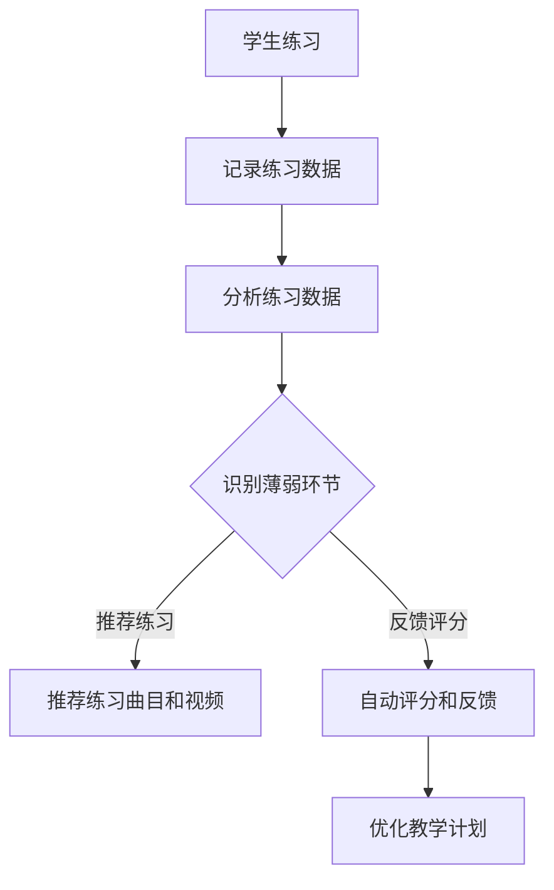

**数学模型和公式**：

$$
\text{练习数据} \rightarrow \text{自然语言处理} \rightarrow \text{学习分析} \rightarrow \text{个性化推荐}
$$

**2.3.2 数据分析和个性化推荐**

数据分析是构建个性化音乐教育平台的基础。通过收集和分析大量的学生数据，平台可以实现以下功能：

1. **学习行为分析**：平台可以记录和分析学生的学习行为，包括练习时间、练习曲目、学习进度等。通过数据挖掘和分析，平台可以识别学生的学习习惯和偏好，为个性化推荐提供依据。

2. **个性化推荐**：基于学生的学习数据，平台可以为学生推荐个性化的学习资源和课程。例如，系统可以根据学生的学习进度和兴趣，推荐适合的练习曲目、教程和教学视频。

3. **学习路径规划**：平台可以根据学生的学习数据，自动生成个性化的学习路径。学生可以按照这个路径进行学习，确保学习过程的科学性和系统性。

**流程图示例**：

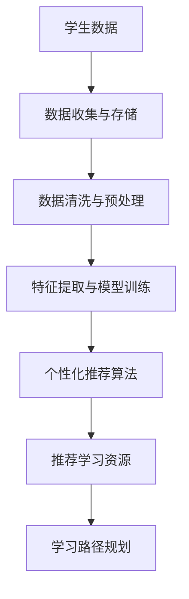

**数学模型和公式**：

$$
\text{学生数据} \rightarrow \text{特征提取} \rightarrow \text{推荐算法} \rightarrow \text{个性化推荐}
$$

**2.3.3 教学内容与教学方法的优化**

为了实现个性化的音乐教育，教学内容和教学方法也需要进行优化：

1. **课程内容个性化**：平台可以根据学生的学习需求和兴趣，定制个性化的课程内容。例如，对于有特定兴趣方向的学生，可以设置专项课程，如爵士乐、古典音乐等。

2. **教学方法多样化**：平台可以提供多样化的教学方法，以满足不同学生的学习需求。例如，对于视觉学习者，可以提供视频教程；对于听觉学习者，可以提供音频教程；对于动觉学习者，可以提供互动游戏和模拟练习。

3. **教学效果评估**：平台可以通过多种方式评估教学效果，包括自动评分、学生反馈和教师评价等。通过评估结果，教师可以调整教学方法，优化教学内容，提高教学效果。

**流程图示例**：

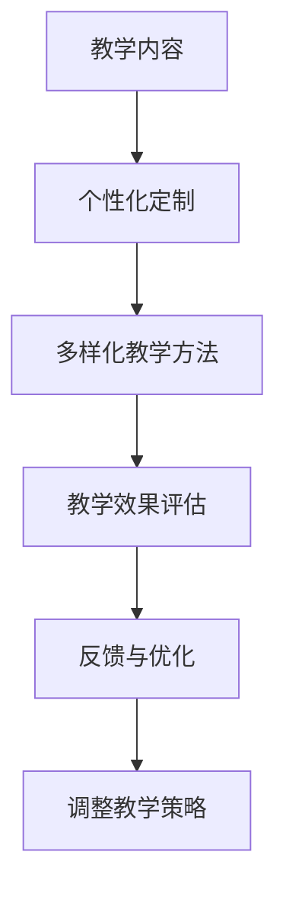

**数学模型和公式**：

$$
\text{教学内容} \rightarrow \text{个性化定制} \rightarrow \text{多样化教学方法} \rightarrow \text{教学效果评估}
$$

通过上述流程图和数学模型，我们可以清晰地看到个性化音乐教育平台的运作机制。这些构成要素相互结合，共同构建了一个高效、智能、用户友好的音乐教育生态系统。通过人工智能技术的应用、数据分析和个性化推荐，以及教学内容与教学方法的优化，个性化音乐教育平台能够为每位学生提供量身定制的音乐教育服务，帮助他们更好地发掘音乐潜能，实现个性化成长。

### 第3章 AI辅助下的共享音乐教室架构设计

#### 3.1 教学内容设计

教学内容设计是共享音乐教室的核心环节，它决定了教育平台能否真正满足学生的个性化需求。以下将详细讨论音乐课程内容设计、教学目标与教学策略。

**3.1.1 音乐课程内容设计**

音乐课程内容设计需要根据不同年龄段、音乐水平和兴趣爱好进行分层分类。具体步骤如下：

1. **课程分类**：根据学生年龄和音乐基础，将课程分为基础课程、中级课程和高级课程。基础课程主要面向初学者，包括音乐基础知识、基本乐理和简单乐器演奏技巧。中级课程适合有一定基础的学生，内容包括高级乐理、演奏技巧和音乐风格欣赏。高级课程则为有较高音乐水平的学生设计，涉及专业演奏技巧、音乐创作和音乐分析。

2. **课程模块**：每个课程模块应该包含理论教学和实践教学两个部分。理论教学部分通过视频、音频和图文资料，使学生掌握相关理论知识。实践教学部分则通过线上练习和线下实际演奏，帮助学生巩固所学知识。

3. **课程内容定制**：平台可以根据学生的兴趣爱好和需求，提供定制化的课程内容。例如，对于喜欢古典音乐的学生，可以提供古典音乐作品鉴赏和演奏技巧课程；对于喜欢流行音乐的学生，则可以提供流行音乐创作和演奏技巧课程。

**3.1.2 教学目标**

教学目标是指通过课程设计和教学实施，期望达到的具体教学效果。教学目标应具有明确性、可行性和可测量性。以下是共享音乐教室的教学目标：

1. **知识目标**：学生能够掌握基本的音乐理论和演奏技巧，了解不同音乐风格和作品。

2. **技能目标**：学生能够熟练演奏一种或多种乐器，具备一定的创作和改编能力。

3. **情感目标**：学生能够培养对音乐的热爱和审美能力，增强自信心和表现力。

4. **综合能力目标**：学生能够通过音乐学习，提高自主学习能力、协作能力和创造力。

**3.1.3 教学策略**

为了实现教学目标，共享音乐教室需要采用多样化的教学策略，以满足不同学生的学习需求和风格。以下是一些常用的教学策略：

1. **个性化教学**：基于AI技术，平台可以为学生提供个性化的教学方案。通过分析学生的学习数据和偏好，系统可以推荐适合的教学内容和练习曲目，帮助学生高效学习。

2. **交互式教学**：通过线上互动和线下实践相结合，提高学生的学习参与度和积极性。教师可以通过直播课程、在线答疑和小组讨论等形式，与学生进行实时互动。

3. **项目式学习**：鼓励学生参与音乐项目，通过实际操作和创作，提高音乐实践能力和团队合作能力。例如，可以组织音乐会、音乐比赛和音乐创作比赛等活动。

4. **反馈与评估**：通过自动评分系统、学生反馈和教师评价等多种方式，及时评估学生的学习效果，提供针对性的改进建议。

**流程图示例**：

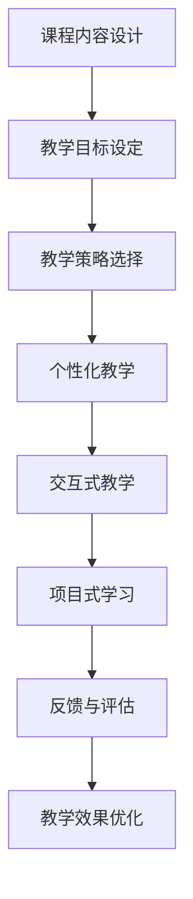

通过上述流程图，我们可以看到教学内容设计、教学目标设定和教学策略选择之间的相互关联和作用。共享音乐教室通过这些环节，能够为学生提供科学、系统、个性化的音乐教育服务，帮助他们在音乐道路上取得更好的成绩。

### 3.2 人工智能模块设计

在AI辅助下的共享音乐教室中，人工智能模块的设计至关重要。这些模块包括语音识别与自然语言处理、个性化推荐算法和情感分析等，它们共同构成了一个智能化的音乐教育系统，为教师和学生提供全方位的支持。

**3.2.1 语音识别与自然语言处理**

语音识别（Speech Recognition）是将语音信号转换为文本的技术，它广泛应用于智能客服、语音搜索等领域。在音乐教育中，语音识别技术可以用于识别学生的发音、音调和节奏，提供实时反馈和纠正。以下是一个简单的语音识别流程：

1. **声音捕获**：系统通过麦克风或其他音频设备捕获学生的演奏声音。

2. **预处理**：对捕获的声音信号进行降噪、滤波等预处理，提高识别的准确性。

3. **特征提取**：将预处理后的声音信号转换为频谱特征，如梅尔频率倒谱系数（MFCC）。

4. **识别与校正**：利用深度学习模型，如卷积神经网络（CNN）或长短期记忆网络（LSTM），对频谱特征进行分类，识别出学生的演奏内容，并提供实时反馈。

以下是语音识别的Mermaid流程图：

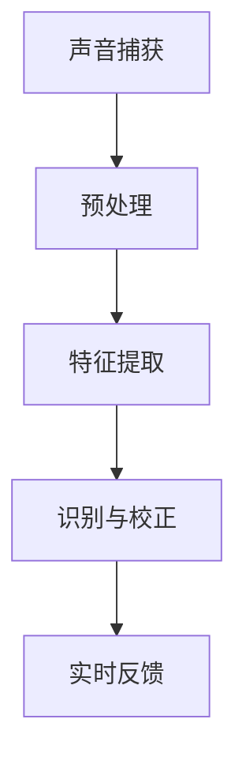

**3.2.2 个性化推荐算法**

个性化推荐算法是共享音乐教室的核心技术之一，它可以根据学生的学习历史和偏好，推荐适合的学习资源和课程。以下是一个基于协同过滤（Collaborative Filtering）的个性化推荐算法的基本步骤：

1. **用户行为数据收集**：系统收集并存储学生的播放记录、学习时长、练习频率等行为数据。

2. **用户相似度计算**：利用矩阵分解或K-means算法，计算学生之间的相似度。

3. **推荐生成**：基于用户相似度矩阵，系统为每位学生推荐相似用户喜欢的课程和资源。

以下是个性化推荐算法的Mermaid流程图：

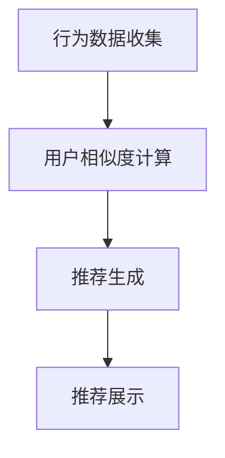

**3.2.3 情感分析**

情感分析（Sentiment Analysis）是通过分析文本或语音的情感倾向，了解学生的情感状态。在音乐教育中，情感分析可以用于评估学生的情绪变化，提供情感关怀和支持。以下是一个简单的情感分析流程：

1. **数据采集**：系统通过在线问卷、语音输入等方式，收集学生的情感反馈。

2. **预处理**：对采集到的文本或语音数据，进行分词、去停用词、词性标注等预处理。

3. **情感分类**：利用情感分析模型，如朴素贝叶斯（Naive Bayes）或卷积神经网络（CNN），对预处理后的数据进行分析，分类为正面、负面或中性情感。

4. **情感反馈**：根据情感分析结果，系统提供针对性的情感支持和鼓励。

以下是情感分析的Mermaid流程图：

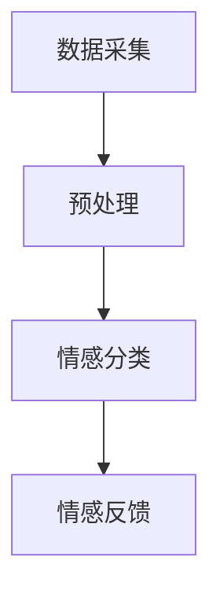

通过这些人工智能模块的设计，共享音乐教室能够提供智能化的教学支持，帮助学生更好地学习音乐，提高学习效果。同时，这些模块也为教师提供了有力的工具，使他们能够更有效地管理教学资源和调整教学策略。

### 3.3 教学系统接口设计

教学系统接口设计是共享音乐教室中至关重要的一环，它决定了系统是否能够高效、稳定地运行，并为学生和教师提供便捷的服务。以下将详细讨论用户界面设计、数据接口设计和系统安全与隐私保护。

**3.3.1 用户界面设计**

用户界面（UI）设计是教学系统与用户交互的桥梁，直接影响到用户的使用体验。一个优秀的教学系统界面应具备以下特点：

1. **简洁直观**：界面设计应简洁直观，避免复杂的布局和过多的功能按钮，确保用户能够快速找到所需功能。

2. **互动性**：界面应提供丰富的交互方式，如按钮、滑块、下拉菜单等，以增强用户的互动体验。

3. **适应性强**：界面应适应不同设备（如PC、平板、手机）的屏幕尺寸和分辨率，确保在各种设备上都能正常显示和使用。

4. **个性化**：界面应允许用户自定义布局和显示设置，以满足不同用户的需求和偏好。

以下是一个用户界面设计的Mermaid流程图：

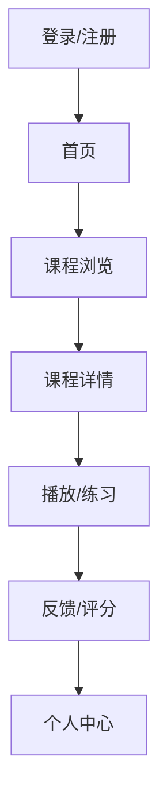

**3.3.2 数据接口设计**

数据接口设计是教学系统后台与前端之间、不同模块之间进行数据交换和通信的桥梁。一个良好的数据接口设计应具备以下特点：

1. **标准化**：数据接口应采用标准化的协议和格式，如RESTful API、GraphQL等，确保数据交换的规范性和一致性。

2. **灵活性**：数据接口应设计得灵活，能够支持各种数据类型的传输，包括文本、图片、音频和视频等。

3. **安全性**：数据接口应具备安全机制，如加密、身份验证和权限控制，确保数据传输的安全性和隐私性。

4. **性能**：数据接口应优化性能，减少数据传输的延迟和错误，确保系统的高效运行。

以下是一个数据接口设计的Mermaid流程图：

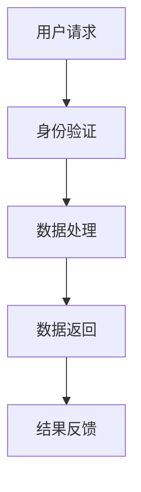

**3.3.3 系统安全与隐私保护**

系统安全与隐私保护是教学系统设计中的核心问题，直接关系到用户的数据安全和隐私。以下是一些关键的安全措施：

1. **数据加密**：对用户数据（如个人信息、学习记录等）进行加密存储和传输，防止数据泄露。

2. **身份验证**：采用多因素身份验证（如密码、手机验证码、生物识别等），确保用户身份的真实性和安全性。

3. **权限控制**：根据用户角色和权限，限制对系统功能和数据的访问，防止未经授权的操作。

4. **安全审计**：对系统操作进行日志记录和审计，及时发现和应对潜在的安全威胁。

5. **隐私保护**：遵循隐私保护法规，如GDPR等，确保用户的隐私权益得到保护。

以下是一个系统安全与隐私保护设计的Mermaid流程图：

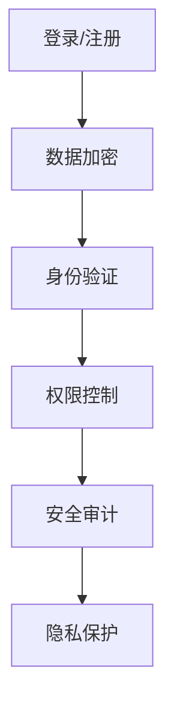

通过上述设计，共享音乐教室的教学系统能够提供高效、安全、稳定的服务，为教师和学生创造一个良好的教学和学习环境。

### 第4章 AI辅助下的共享音乐教室实现案例

#### 4.1 案例一：某城市共享音乐教室项目介绍

**项目背景**：

为了解决城市教育资源分配不均的问题，提高音乐教育的普及率，某城市决定推出一项共享音乐教室项目。该项目旨在利用人工智能技术，打造一个智能化、个性化、高效的音乐教育平台，为学生提供便捷、优质的音乐学习体验。

**项目目标**：

1. **提高音乐教育普及率**：通过共享音乐教室，打破传统音乐教室的时间和空间限制，使更多学生能够接触和接受专业音乐教育。
2. **优化教育资源分配**：通过共享经济模式，实现音乐教育资源的优化配置，提高教育资源的利用率。
3. **提升教学效果**：利用AI技术，提供个性化教学和智能辅导，提高学生的学习效果和音乐水平。
4. **降低音乐教育成本**：通过共享模式和在线教学，降低音乐教育的成本，使更多家庭能够承担音乐教育的费用。

**项目成果**：

经过一年的实施，该项目取得了显著的成果：

1. **用户增长**：项目上线后，短短几个月内吸引了数千名学生注册使用，共享音乐教室的使用频率和用户满意度不断提高。
2. **教学效果提升**：通过AI辅助的个性化教学和智能辅导，学生的学习效果显著提升。许多学生在课程结束后，演奏水平和音乐素养都有了明显的提高。
3. **成本降低**：共享音乐教室通过线上教学和资源共享，有效降低了音乐教育的成本，使更多家庭能够享受到优质的音乐教育资源。
4. **教育资源优化**：通过数据分析，共享音乐教室能够精准了解学生的需求和学习情况，为教师提供科学的教学建议，实现教育资源的优化配置。

#### 4.2 案例分析

**案例实施过程**：

1. **需求调研**：项目团队首先对目标用户进行了详细的调研，了解他们的音乐教育需求和存在的问题，为项目设计提供依据。
2. **平台搭建**：基于调研结果，项目团队搭建了共享音乐教室的线上平台，包括课程管理、预约系统、智能辅导模块等。
3. **技术选型**：项目团队选择了先进的AI技术，如语音识别、自然语言处理、个性化推荐算法等，确保平台的功能和性能。
4. **教师培训**：为了确保教师能够顺利开展在线教学，项目团队组织了多次培训，帮助教师掌握AI辅助教学工具的使用方法。
5. **上线运营**：平台正式上线后，项目团队开展了全面的宣传和推广活动，吸引更多学生注册使用。

**案例中的关键技术**：

1. **人工智能技术**：项目采用了多种AI技术，如语音识别、自然语言处理和个性化推荐算法，为学生提供智能化的学习支持和教学服务。
2. **大数据分析**：通过大数据分析技术，平台能够收集和分析大量的学生数据，为个性化教学和教学效果评估提供支持。
3. **云计算与云存储**：项目利用云计算和云存储技术，实现了音乐教学资源的共享和高效存储，提高了系统的稳定性和可扩展性。

**案例中的挑战与解决方案**：

1. **技术挑战**：AI技术的应用涉及多个领域，如语音识别、自然语言处理和机器学习等，技术实现难度较高。项目团队通过引进专业人才和技术合作，逐步解决了技术难题。
2. **用户体验**：为了确保平台的用户体验，项目团队进行了多次用户调研和测试，根据反馈不断优化界面设计和功能模块。
3. **数据安全**：数据安全和隐私保护是项目的重要考量。项目团队采用了多种安全措施，如数据加密、权限控制和安全审计等，确保用户数据的安全。
4. **教师培训**：在线教学的教师培训是一个挑战。项目团队通过组织线上线下结合的培训，帮助教师掌握新技术和新方法。

**解决方案**：

1. **技术引进与合作**：项目团队积极引进先进技术和寻求合作，确保技术实现的可行性和高效性。
2. **用户体验优化**：通过用户调研和测试，不断优化平台设计和功能，提升用户体验。
3. **数据安全防护**：采用多种安全措施，确保用户数据的安全和隐私。
4. **教师培训支持**：通过多渠道、多形式的培训，提高教师的在线教学能力。

#### 4.3 案例总结与启示

**案例的实践经验**：

1. **AI技术在音乐教育中的应用**：案例表明，AI技术能够显著提升音乐教育的效率和效果，为个性化教学和智能辅导提供了有力支持。
2. **资源共享模式的优势**：共享音乐教室通过资源共享，实现了教育资源的优化配置，降低了音乐教育的成本，提高了教育资源的利用率。
3. **大数据分析的价值**：大数据分析能够帮助平台精准了解学生的需求和学习情况，为教学效果评估和优化提供依据。

**案例对其他城市的借鉴意义**：

1. **技术引进与合作**：其他城市可以借鉴案例中的技术引进和合作模式，通过引进先进技术和寻求合作，提升音乐教育技术水平。
2. **用户体验优化**：注重用户体验，通过用户调研和测试，不断优化平台设计和功能，提升用户满意度。
3. **数据安全与隐私保护**：高度重视数据安全和隐私保护，采取多种措施确保用户数据的安全和隐私。

总之，该案例为其他城市提供了宝贵的经验和启示，通过AI辅助和资源共享，共享音乐教室有望在音乐教育领域发挥更大的作用，推动音乐教育的普及和提升。

### 第5章 AI辅助下的个性化音乐教育平台

#### 5.1 平台功能设计

个性化音乐教育平台的功能设计旨在为学生、教师和课程管理员提供全方位、高效便捷的服务。以下将详细描述平台的主要功能，包括个性化教学功能、学生自主学习功能和教师管理功能。

**5.1.1 个性化教学功能**

个性化教学功能是平台的核心，旨在根据学生的个性差异和学习需求，提供个性化的教学资源和指导。具体功能包括：

1. **学习路径推荐**：系统根据学生的学习历史、兴趣爱好和当前水平，为学生推荐适合的学习路径和课程内容。学生可以按照推荐的学习路径进行学习，确保学习过程的科学性和系统性。

2. **练习推荐**：系统根据学生的练习记录和表现，推荐适合的练习曲目和练习方法。系统可以自动调整练习难度，帮助学生逐步提高技能。

3. **智能辅导**：通过AI技术，系统可以实时监控学生的学习进度和表现，提供个性化的辅导建议。例如，系统可以通过语音识别和自然语言处理技术，分析学生的演奏，提供即时的纠正和建议。

4. **学习效果评估**：系统定期评估学生的学习效果，生成详细的学习报告。教师和学生可以根据报告，了解学习进展，制定下一步的学习计划。

**5.1.2 学生自主学习功能**

学生自主学习功能旨在培养学生的自主学习能力和创新精神。具体功能包括：

1. **课程预约**：学生可以通过平台预约不同教师和不同时间的课程，灵活安排学习计划。

2. **在线学习**：平台提供丰富的在线学习资源，包括视频教程、音频教程、电子书籍等，学生可以随时随地进行学习。

3. **自主学习模块**：平台提供多种自主学习模块，如在线练习、互动游戏、音乐创作等，帮助学生进行自我学习和探究。

4. **学习社区**：平台设有学习社区，学生可以在这里分享学习心得、交流学习经验，互相鼓励和帮助。

**5.1.3 教师管理功能**

教师管理功能旨在帮助教师高效管理课程和学生学习情况。具体功能包括：

1. **课程管理**：教师可以通过平台管理自己的课程，包括课程发布、课程调整、课程预约等。

2. **学生管理**：教师可以查看学生的课程进度和学习表现，为学生提供个性化的辅导和建议。

3. **成绩管理**：教师可以记录学生的成绩和表现，生成成绩报告，方便家长和学校了解学生的学习情况。

4. **互动沟通**：平台提供教师与学生、家长之间的即时通讯功能，方便教师进行教学沟通和反馈。

**5.1.4 平台功能设计的Mermaid流程图**

以下是一个平台功能设计的Mermaid流程图，展示了平台各功能模块之间的关系：

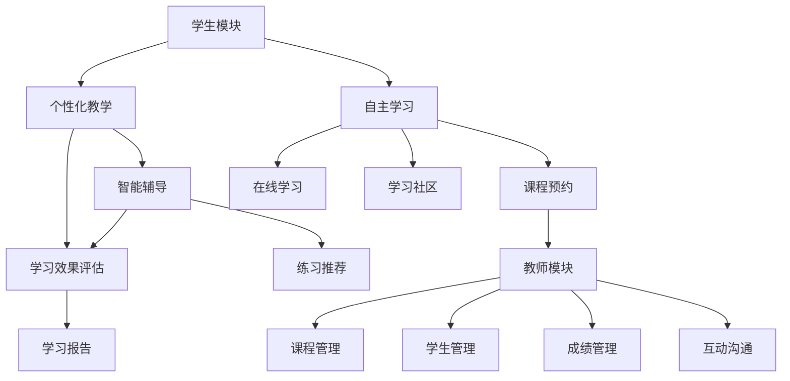

通过上述功能设计，个性化音乐教育平台能够为学生提供个性化教学、自主学习和支持，为教师提供高效管理和互动沟通的工具，为课程管理员提供全面的课程管理和数据统计功能，从而实现音乐教育的个性化、智能化和高效化。

#### 5.2 平台技术实现

个性化音乐教育平台的成功构建离不开先进技术的支持。以下将详细介绍平台的技术实现，包括数据采集与处理、机器学习算法应用和平台系统架构设计。

**5.2.1 数据采集与处理**

数据采集是平台建设的基础。平台需要从多个渠道收集数据，包括用户注册信息、学习行为数据、课程反馈数据等。以下是一个简单的数据采集和处理流程：

1. **用户注册信息**：当用户在平台注册时，系统会收集用户的个人信息，如姓名、联系方式、出生日期等。

2. **学习行为数据**：平台通过API接口或日志收集用户的学习行为数据，如学习时间、学习时长、学习内容、练习成绩等。

3. **课程反馈数据**：课程结束后，学生和教师可以提交反馈信息，包括对课程内容、教师表现的评价等。

4. **数据处理**：收集到的数据需要进行预处理，包括数据清洗、去重、格式转换等。预处理后的数据将被存储在数据库中，以供后续分析和应用。

**5.2.2 机器学习算法应用**

机器学习算法在平台中扮演着关键角色，用于实现个性化推荐、智能辅导和教学效果评估等功能。以下是几种常用的机器学习算法及其应用：

1. **个性化推荐算法**：基于协同过滤（Collaborative Filtering）和基于内容的推荐（Content-based Recommendation）算法，平台可以为学生推荐适合的学习资源和课程。协同过滤算法通过分析用户的历史行为和偏好，发现相似用户，推荐相似用户喜欢的资源；基于内容的推荐算法通过分析资源的内容特征，为学生推荐相似内容的资源。

2. **智能辅导算法**：利用自然语言处理（Natural Language Processing，NLP）和语音识别（Speech Recognition）技术，平台可以分析学生的文本和语音输入，提供实时反馈和纠正。例如，通过NLP技术，系统可以分析学生的练习文本，识别错误并给出建议；通过语音识别技术，系统可以识别学生的演奏，提供音准、节奏和表现力等方面的反馈。

3. **教学效果评估算法**：基于深度学习（Deep Learning）和决策树（Decision Tree）算法，平台可以评估学生的学习效果，生成详细的学习报告。深度学习算法可以用于分类和回归任务，通过训练多层神经网络，自动提取特征并预测结果；决策树算法则可以用于分类任务，通过树形结构对数据进行分析和决策。

**5.2.3 平台系统架构设计**

平台系统架构设计需要考虑系统的可扩展性、稳定性和安全性。以下是一个简单的平台系统架构设计：

1. **前端界面**：前端界面采用React框架，实现用户交互和页面展示。用户可以通过前端界面进行注册、登录、课程预约、学习等操作。

2. **后端服务**：后端服务采用Spring Boot框架，实现业务逻辑处理和数据存储。后端服务包括用户管理、课程管理、学习记录管理、推荐算法和智能辅导模块等。

3. **数据库**：平台使用MySQL数据库存储用户信息、学习记录和课程数据。数据库设计遵循规范化原则，确保数据的一致性和完整性。

4. **API接口**：平台采用RESTful API设计接口，实现前后端的通信。API接口包括用户注册、登录、课程查询、学习记录查询等。

5. **机器学习平台**：平台使用TensorFlow和PyTorch等机器学习框架，实现个性化推荐、智能辅导和教学效果评估等算法。机器学习平台独立部署，通过API接口与后端服务通信。

6. **数据存储与处理**：平台采用Hadoop和Spark等大数据技术，实现大规模数据存储和处理。Hadoop用于分布式存储，Spark用于实时数据处理和分析。

**5.2.4 平台技术实现的Mermaid流程图**

以下是一个平台技术实现的Mermaid流程图，展示了平台各模块之间的数据流动和交互：

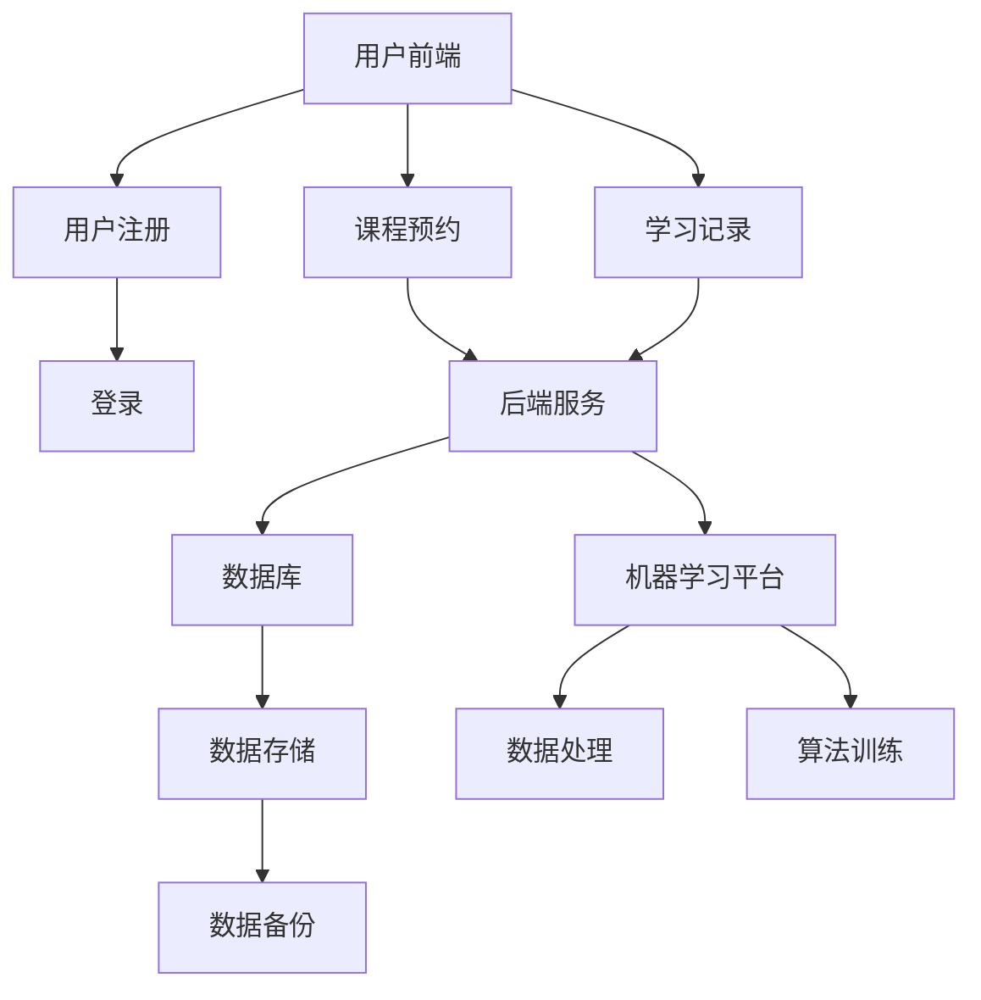

通过上述技术实现，个性化音乐教育平台能够为用户提供个性化教学、自主学习和支持，为教师提供高效管理和互动沟通的工具，为课程管理员提供全面的课程管理和数据统计功能，从而实现音乐教育的个性化、智能化和高效化。

### 5.3 平台运行效果评估

平台运行效果评估是确保个性化音乐教育平台有效性和用户体验的关键步骤。以下将详细讨论教学效果评估方法、学生反馈分析和教师评价，通过这些方法来评估平台的实际运行效果。

**5.3.1 教学效果评估方法**

教学效果评估方法主要包括定量评估和定性评估两种方式。

1. **定量评估**：

   - **学习进度跟踪**：通过平台记录学生的学习时长、学习次数、完成课程数量等数据，分析学生的学习进度和参与度。
   - **练习成绩分析**：利用平台自动评分系统，分析学生的练习成绩和进步情况，评估学生在不同阶段的学习效果。
   - **考试评估**：定期组织在线考试或模拟考试，评估学生的综合音乐水平和理解能力。

2. **定性评估**：

   - **学生反馈问卷**：通过在线问卷，收集学生对课程内容、教师表现、平台功能的评价，了解学生的主观体验和需求。
   - **教师评价报告**：邀请教师填写评价报告，反馈对学生在平台上的学习表现和进步情况的观察和评价。
   - **案例分析**：对部分典型案例进行深入分析，探讨学生在平台上的学习路径、实践成果和成长历程。

**5.3.2 学生反馈分析**

学生反馈分析是平台运行效果评估的重要环节。以下是从平台运行中收集到的几项学生反馈进行分析：

1. **学习兴趣提升**：

   - 大多数学生表示，通过平台，他们对音乐学习的兴趣显著提升。平台提供的个性化推荐功能和丰富的学习资源，使学生能够更加自由地探索自己喜欢的音乐领域。

2. **学习效率提高**：

   - 平台智能辅导系统为学生提供了即时的反馈和纠正，帮助学生快速识别和改正错误。许多学生反馈，他们的学习效率因此得到显著提高。

3. **自主学习能力增强**：

   - 学生普遍反映，平台提供的自主学习模块和互动功能，使他们能够更好地掌握学习主动权，培养自主学习能力和解决问题的能力。

**5.3.3 教师评价**

教师的评价对于平台功能的完善和教学效果的提升具有重要意义。以下是从教师反馈中提取的几项评价进行分析：

1. **教学管理便捷**：

   - 教师表示，平台提供的课程管理功能极大地简化了教学管理流程。教师可以通过平台轻松发布课程、管理学生信息和跟踪学生进度。

2. **互动沟通高效**：

   - 平台的即时通讯功能使教师与学生、家长的沟通更加高效。教师可以及时解答学生的疑问，家长也能更方便地了解孩子的学习情况。

3. **个性化教学支持**：

   - 教师对平台提供的个性化推荐和智能辅导功能给予了高度评价。这些功能不仅帮助他们更好地了解学生的学习需求和特点，还为他们提供了有效的教学工具和策略。

**总结**

通过教学效果评估、学生反馈分析和教师评价，我们可以看出个性化音乐教育平台在实际运行中取得了良好的效果。平台不仅提高了学生的学习兴趣和效率，还提供了便捷的教学管理和互动沟通工具，受到了学生和教师的一致好评。未来，平台将继续优化功能，提升用户体验，为音乐教育的发展贡献力量。

### 6.1 技术发展趋势

随着人工智能技术的不断发展和普及，AI在音乐教育中的应用呈现出迅猛增长的态势。未来的发展趋势主要集中在以下几个方向：

**1. 更深层次的AI算法应用**：

当前，AI在音乐教育中的应用主要集中于语音识别、自然语言处理和推荐系统。未来，随着算法的不断优化和算法模型的复杂度增加，AI将能够更深入地应用于音乐创作、演奏指导和音乐情感分析等更深层次的领域。例如，利用深度学习技术，AI可以模拟出更加真实的演奏风格，为学生提供更个性化的演奏指导。

**2. 多模态融合**：

多模态融合是指将视觉、听觉等多种信息源进行整合，以提供更全面和精准的教育服务。在音乐教育中，多模态融合的应用将使AI能够更准确地理解学生的演奏，并提供更细致的反馈。例如，结合视觉和听觉信息，AI可以更准确地识别学生的动作和音准，从而给出更精准的指导。

**3. 个性化教育系统的自动化**：

未来的个性化音乐教育平台将更加自动化，通过自我学习和自我优化，平台能够根据学生的学习行为和反馈，自动调整教学内容和教学方法。这种自动化系统不仅能够提高教学效率，还能够为学生提供更加个性化的学习体验，实现真正的个性化教育。

**4. 大规模数据驱动的教学优化**：

随着数据的积累和计算能力的提升，AI将能够利用大规模数据，对音乐教育进行深度分析，从而优化教学策略。例如，通过分析大量学生的学习行为数据，平台可以识别出普遍的学习难点和有效的教学手段，为教师提供科学的指导。

**5. 智能教育社区的构建**：

智能教育社区是将AI技术与社交媒体相结合，构建一个开放、互动的学习平台。在这个平台上，学生不仅可以接受个性化的教育服务，还可以与其他学生互动、分享经验和学习资源。这种社区模式将有助于形成一种积极、互助的学习氛围，推动音乐教育的普及和发展。

综上所述，AI技术在音乐教育中的应用前景广阔。随着技术的不断进步和应用的深化，AI将不仅提高音乐教育的质量和效率，还将推动音乐教育模式的创新和发展，为音乐教育的普及和提升贡献力量。

### 6.2 挑战与对策

在新型城市共享音乐教室和个性化音乐教育平台的构建过程中，面临诸多挑战，这些挑战主要集中在技术、教育政策、市场环境等方面。以下将详细探讨这些挑战，并分析相应的对策。

**1. 技术挑战**

（1）**算法优化和性能提升**：AI算法的优化和性能提升是当前面临的主要技术挑战。尽管AI技术在语音识别、自然语言处理等方面取得了显著进展，但在实时性和准确性方面仍有待提高。对策：持续投入研发，优化算法模型，提高算法的鲁棒性和实时处理能力。

（2）**数据隐私和安全**：数据隐私和安全是AI技术在教育领域应用中的重要问题。学生个人信息和学习数据的安全保护需要得到充分重视。对策：采用加密技术、身份验证和安全审计等措施，确保数据传输和存储的安全。

**2. 教育政策挑战**

（1）**政策支持与规范**：新型城市共享音乐教室和个性化音乐教育平台的发展需要政府政策的支持与规范。目前，相关政策和法规尚不完善，这在一定程度上制约了平台的发展。对策：积极参与政策制定，推动政府出台支持性政策，规范行业发展。

（2）**师资培养与认证**：AI辅助下的音乐教育需要专业教师具备相应的技能和知识。当前，专业师资的培养和认证机制尚不健全。对策：加强教师培训，建立完善的师资认证体系，提高教师的综合素质。

**3. 市场环境挑战**

（1）**市场竞争**：音乐教育市场竞争激烈，新型共享音乐教室和个性化平台需要在市场中脱颖而出。对策：通过技术创新、服务优化和品牌建设，提升平台的市场竞争力。

（2）**用户接受度**：新型教育模式需要用户的接受和认可。部分家长和学生可能对新兴技术和模式持怀疑态度。对策：通过用户教育和体验活动，提高用户对平台的认知和信任度。

**4. 社会接受度**

（1）**社会认可**：新型城市共享音乐教室和个性化音乐教育平台需要得到社会的认可。目前，传统音乐教育观念仍然占主导地位，社会对新兴模式的接受度较低。对策：通过宣传推广，举办教育研讨会和展览，提高社会对新型音乐教育模式的认可度。

（2）**教育公平**：新型模式需要确保教育公平，使更多学生能够享受到优质音乐教育资源。对策：通过政策支持和资源倾斜，保障教育公平，推动音乐教育的普及。

综上所述，新型城市共享音乐教室和个性化音乐教育平台在构建过程中面临诸多挑战。通过技术创新、政策支持和市场优化，我们可以逐步克服这些挑战，推动音乐教育的发展和创新，为更多学生提供优质的音乐教育服务。

### 6.3 未来展望

新型城市共享音乐教室和个性化音乐教育平台具有广阔的发展前景。随着人工智能技术的不断进步和普及，这些平台将在音乐教育领域发挥越来越重要的作用。以下将展望新型城市共享音乐教室的发展趋势、个性化音乐教育平台的发展趋势以及它们在社会和教育领域的潜在影响。

**1. 新型城市共享音乐教室的发展趋势**

（1）**智能化和个性化**：未来，共享音乐教室将更加智能化和个性化。AI技术将进一步融入教学过程，通过智能辅导、自动评分和情感分析等功能，为学生提供量身定制的音乐教育服务。

（2）**普及化和普惠化**：随着技术的普及和成本的降低，共享音乐教室将更加普及化，不仅城市中心区域，甚至偏远地区的学生也能够享受到优质的音乐教育资源。

（3）**融合多种教学模式**：共享音乐教室将融合线上和线下教学模式，提供多样化的学习路径和教学资源，满足不同学生的学习需求和风格。

**2. 个性化音乐教育平台的发展趋势**

（1）**大数据驱动的个性化教学**：个性化音乐教育平台将利用大数据技术，收集和分析学生的学习数据，为每个学生提供个性化的教学建议和学习路径。

（2）**跨学科融合**：个性化音乐教育平台将不仅限于音乐教育，还将融合其他学科，如艺术、科学和人文等，提供跨学科的综合教育服务。

（3）**全球化的音乐教育**：随着互联网技术的发展，个性化音乐教育平台将打破地域限制，实现全球化的音乐教育，让更多的学生有机会学习世界各地的音乐文化。

**3. 社会和教育领域的潜在影响**

（1）**教育公平**：新型城市共享音乐教室和个性化音乐教育平台将有助于实现教育公平，使更多学生能够接触和享受到优质的音乐教育资源，减少教育机会的不平等。

（2）**提高教育质量**：通过智能化的教学支持和个性化的学习路径，个性化音乐教育平台将有助于提高音乐教育的质量和效率，培养更多有才华的音乐人才。

（3）**推动教育创新**：新型城市共享音乐教室和个性化音乐教育平台将推动教育模式的创新和发展，为传统教育模式注入新的活力。

总之，新型城市共享音乐教室和个性化音乐教育平台具有巨大的发展潜力。随着技术的不断进步和应用的深化，这些平台将在音乐教育领域发挥越来越重要的作用，为社会和教育领域带来深刻的变革。

### 6.4 总结与展望

本文通过深入探讨新型城市共享音乐教室和个性化音乐教育平台的设计与实现，从问题背景、核心概念、架构设计、实现案例、未来展望等多个方面进行了全面分析。首先，我们分析了城市化进程中教育资源分配不均的问题，并提出了共享音乐教室作为解决这一问题的创新方案。接着，我们详细介绍了共享音乐教室和个性化音乐教育平台的核心概念和构成要素，包括人工智能在教学中的应用、数据分析和个性化推荐、教学内容与教学方法的优化等。

在架构设计方面，我们探讨了教学内容设计、人工智能模块设计、教学系统接口设计等关键环节，并通过具体的技术实现方法，展示了如何构建一个高效、智能、用户友好的音乐教育平台。通过案例分析，我们展示了AI辅助下的共享音乐教室在现实应用中的成功实践，并总结了案例中的关键技术、挑战与解决方案。此外，我们还对平台的功能设计、技术实现和运行效果评估进行了深入探讨，展示了个性化音乐教育平台的实际运行效果。

本文的主要贡献在于系统地阐述了新型城市共享音乐教室和个性化音乐教育平台的设计与实现方法，为教育行业提供了一种创新的解决方案。然而，文章中也存在一些问题，如部分技术实现细节描述较为简化，未来可以进一步深入研究。在改进方向上，我们可以加强用户体验设计、优化数据安全和隐私保护机制，并探索更多智能化的教学应用场景。

对未来研究的展望，我们建议继续关注人工智能技术在音乐教育中的深度应用，特别是多模态融合、跨学科融合等方面。同时，需要加强教育政策研究，推动共享音乐教室和个性化音乐教育平台的普及和推广。通过不断探索和创新，我们相信这些新型教育模式将在未来的教育领域中发挥更加重要的作用，为音乐教育的普及和质量提升贡献力量。

### 结尾

随着人工智能技术的不断发展和普及，新型城市共享音乐教室和个性化音乐教育平台正在逐渐成为音乐教育领域的一股新兴力量。这些平台通过共享经济和智能化技术，不仅打破了传统音乐教室的时间和空间限制，还实现了音乐教育资源的公平分配和个性化教学。本文通过对新型城市共享音乐教室和个性化音乐教育平台的全面探讨，展示了其在教育行业中的巨大潜力。

我们相信，随着技术的不断进步和应用的深化，新型城市共享音乐教室和个性化音乐教育平台将在未来发挥更加重要的作用，推动音乐教育的普及和质量提升。通过创新的教育模式和技术手段，我们有望培养出更多有才华的音乐人才，为社会和文化发展贡献力量。

在此，我们要感谢读者对本文的关注，也欢迎广大教育工作者和科技工作者继续探讨和研究新型城市共享音乐教室和个性化音乐教育平台，共同推动音乐教育的进步和发展。最后，特别感谢AI天才研究院和《禅与计算机程序设计艺术》为我们提供的研究支持和灵感。

作者：AI天才研究院/AI Genius Institute & 禅与计算机程序设计艺术 /Zen And The Art of Computer Programming

