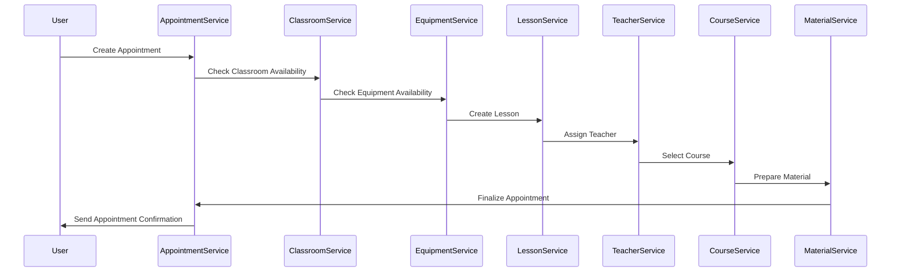
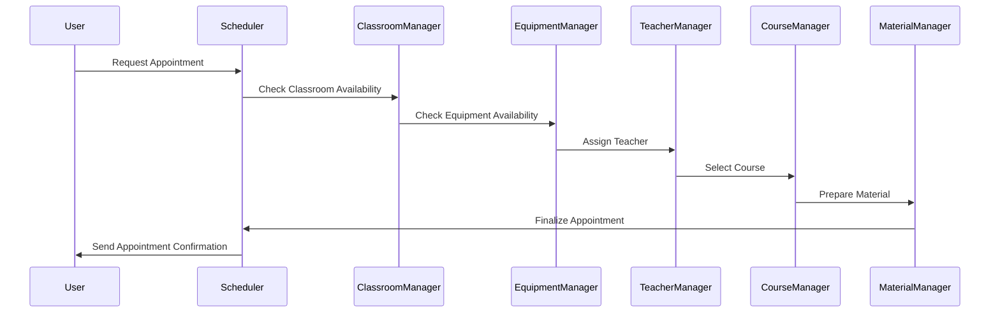

                 

### 第1章：问题背景

#### 1.1 问题描述

在当今社会，音乐教育的重要性日益凸显。无论是作为培养孩子艺术修养的一种方式，还是为成年人提供娱乐和减压的手段，音乐教育都有着不可替代的作用。然而，传统音乐教育面临着一系列挑战，如教育资源不均衡、教学成本高昂以及教学方式单一等。这些问题使得音乐教育的普及和推广面临重重困难。

首先，教育资源不均衡是当前音乐教育面临的一个主要问题。在我国，城市与农村、发达地区与欠发达地区之间的教育资源差距显著。城市中的孩子有机会接受优质的音乐教育，而农村和欠发达地区的孩子则往往缺乏这样的机会。这种现象导致了音乐教育的不公平，使得一些孩子无法享受到音乐带来的乐趣和成长。

其次，音乐教育的成本较高也是一个不可忽视的问题。无论是乐器购买、音乐教材还是专业教师的聘请，都需要大量的资金投入。这对于普通家庭来说，尤其是经济条件较差的家庭，构成了巨大的经济负担，使得很多孩子无法接受正规的音乐教育。

再者，传统音乐教育方式单一，主要以教师为中心，学生被动接受知识。这种方式虽然能够传授一定的音乐知识，但难以激发学生的学习兴趣和创造力。同时，由于教学内容的单调，学生往往缺乏学习动力，导致学习效果不佳。

#### 1.2 问题解决

针对上述问题，我们需要从多个方面来寻求解决方案。首先，应该优化教育资源配置，努力缩小城乡、地区之间的教育差距。这可以通过政府加大对农村和欠发达地区教育投入、鼓励社会力量参与教育建设等方式来实现。

其次，应降低音乐教育的成本。可以通过政府补贴、社会捐助等方式来减轻家庭的经济负担。此外，还可以通过共享经济模式，降低音乐学习所需的硬件和软件成本。

再者，需要创新音乐教育方式。可以引入多元化、互动性强的教学手段，如在线教育、远程教学、音乐游戏等，以激发学生的学习兴趣和创造力。同时，要注重培养学生的自主学习能力，让他们能够主动探索和学习音乐知识。

#### 1.3 边界与外延

本文的研究主要围绕新型城市共享音乐教室这一主题展开，探讨其构建原则、教学资源整合、教学方式创新等方面。同时，本文还将探讨如何通过跨代际音乐教育，实现音乐教育的普及和推广。

本文的研究边界主要包括以下几个方面：

1. **地域边界**：本文主要关注城市地区的音乐教育问题，不涉及农村和欠发达地区的音乐教育。
2. **年龄边界**：本文主要关注儿童和成年人的音乐教育，不涉及其他年龄段的音乐教育。
3. **教育形式边界**：本文主要研究共享音乐教室这一新型教育形式，不涉及其他教育形式，如传统音乐学校、音乐培训机构等。

#### 1.4 概念结构与核心要素组成

新型城市共享音乐教室是一个以共享经济理念为核心的跨代际音乐教育社区平台。其核心概念包括：

1. **共享理念**：通过共享经济模式，降低音乐教育的成本，让更多人能够享受到音乐教育。
2. **跨代际教育**：打破年龄界限，实现不同年龄段之间的音乐教育交流和互动。
3. **社区平台**：建立一个集教学、互动、资源共享于一体的在线平台，为用户提供便捷的音乐教育服务。

新型城市共享音乐教室的核心要素组成如下：

1. **教室资源**：包括各种类型的音乐教室、乐器设备等。
2. **教学资源**：包括音乐教材、教学视频、音乐游戏等。
3. **师资力量**：包括专业教师、志愿者等。
4. **用户群体**：包括学生、家长、音乐爱好者等。
5. **技术支持**：包括在线教育平台、数据分析系统等。

### 第2章：核心概念与联系

#### 2.1 核心概念原理

在构建新型城市共享音乐教室的过程中，有几个核心概念至关重要，它们构成了整个系统的理论基础和操作框架。

**1. 共享经济理念**

共享经济是一种基于互联网和物联网的新型经济模式，通过资源共享、互助互享，降低成本、提高效率。在音乐教育领域，共享经济理念主要体现在以下几个方面：

- **资源共享**：通过共享音乐教室和乐器设备，降低用户的使用成本。
- **时间共享**：通过预约系统，提高音乐教室和设备的利用率。
- **技能共享**：通过社区平台，教师与学生、学生与学生之间进行技能交流和分享。

**2. 跨代际音乐教育**

跨代际音乐教育是一种打破年龄界限，实现不同年龄段之间音乐教育交流和互动的教育模式。其核心原理包括：

- **教育公平**：通过跨代际教育，使得不同年龄段的人都有机会接受音乐教育，缩小教育差距。
- **知识传承**：通过代际间的教育交流，实现音乐知识和经验的传承。
- **文化多样性**：通过跨代际教育，丰富音乐教育的文化内涵，提高学生的文化素养。

**3. 社区平台**

社区平台是新型城市共享音乐教室的核心组成部分，它为用户提供了教学、互动、资源共享的全方位服务。其核心原理包括：

- **在线教育**：通过互联网技术，实现音乐教育的远程教学和学习。
- **社交互动**：通过社区功能，促进用户之间的交流和互动。
- **数据共享**：通过数据分析，优化教育资源分配，提高教育质量。

#### 2.2 概念属性特征对比表格

为了更清晰地理解上述核心概念，我们可以通过一个对比表格来展示它们的主要属性特征。

| 概念名称 | 主要属性特征 |
| :---: | :---: |
| 共享经济理念 | 资源共享、时间共享、技能共享 |
| 跨代际音乐教育 | 教育公平、知识传承、文化多样性 |
| 社区平台 | 在线教育、社交互动、数据共享 |

#### 2.3 ER实体关系图架构的Mermaid流程图

在新型城市共享音乐教室的系统中，各个实体之间的关系需要通过ER实体关系图来明确。以下是一个简化的Mermaid流程图，用于展示系统中的主要实体及其关系。

```mermaid
erDiagram
    User ..|> Classroom
    User ..|> Appointment
    Classroom ..|> Equipment
    Appointment ..|> Lesson
    Lesson ..|> Teacher
    Teacher ..|> Course
    Course ..|> Material
```

在这个ER实体关系图中，`User`（用户）与`Classroom`（教室）、`Appointment`（预约）、`Equipment`（设备）、`Lesson`（课程）、`Teacher`（教师）、`Course`（课程）、`Material`（教材）等实体之间存在明确的关联关系。每个实体都承担着特定的功能，共同构成了一个完整的音乐教育生态系统。

### 第3章：教室设计原则

#### 3.1 设计原则概述

共享音乐教室的设计原则是确保其能够满足教学需求、提高教学效果、提升用户体验的关键。在设计过程中，需要遵循以下几个原则：

1. **安全性原则**：保证教室设施的安全，如防火、防盗、防滑等。
2. **舒适性原则**：提供舒适的室内环境，如适宜的温度、良好的音响效果等。
3. **便捷性原则**：教室布局合理，方便用户预约和使用。
4. **功能性原则**：教室设备齐全，满足不同教学需求。

#### 3.2 教室布局设计

教室布局设计直接影响教学效果和用户体验。以下是一些建议：

1. **区域划分**：根据教学需求，将教室划分为教学区、休息区、设备区等。
2. **音响设备**：安装高品质的音响设备，保证音质清晰，营造良好的教学氛围。
3. **灯光设计**：采用柔和的灯光，避免强烈的直射光，确保学生的视觉舒适。
4. **通风系统**：确保教室内的空气质量，避免学生感到不适。

#### 3.3 设备配置与选择

设备配置是共享音乐教室的核心，以下是一些建议：

1. **乐器设备**：根据教学需求，配置钢琴、吉他、小提琴等多种乐器。
2. **音响设备**：选择高品质的音响设备，确保音质清晰，为学生提供良好的听觉体验。
3. **电子设备**：配备电脑、投影仪等电子设备，便于教学内容的展示和互动。
4. **监控设备**：安装监控设备，确保教室的安全，同时便于教师监控学生的学习状态。

### 第4章：教学内容设置

#### 4.1 教学内容设计

教学内容设计是共享音乐教室的核心环节，直接影响学生的学习效果和兴趣。以下是一些建议：

1. **基础课程**：针对初学者，设计基础课程，包括乐理知识、基本演奏技巧等。
2. **进阶课程**：针对有一定基础的学生，设计进阶课程，如音乐史、作曲技巧等。
3. **专项课程**：针对学生的特长和兴趣，设计专项课程，如流行音乐、爵士乐等。

#### 4.2 教学大纲制定

教学大纲是教学内容的详细规划，以下是一些建议：

1. **课程目标**：明确每门课程的学习目标，确保教学内容与目标相匹配。
2. **课程内容**：详细列出每门课程的教学内容，包括知识点、技能点等。
3. **教学方法**：根据教学内容和目标，选择合适的教学方法，如讲授法、互动式教学等。

#### 4.3 教学目标设定

教学目标是教学工作的方向和依据，以下是一些建议：

1. **知识目标**：让学生掌握基本的音乐理论知识，如音高、节奏、和声等。
2. **技能目标**：培养学生演奏乐器的能力，提高他们的音乐表现力。
3. **情感目标**：激发学生对音乐的兴趣和热爱，培养他们的审美能力和艺术修养。

### 第5章：教学资源整合

#### 5.1 教学资源类型

教学资源是教学活动的重要支撑，以下是几种常见的教学资源类型：

1. **纸质教材**：传统的纸质教材，包括乐谱、教材书等。
2. **电子教材**：电子版的教材，如PDF文件、在线文档等。
3. **教学视频**：教学视频，包括讲解乐理知识、演奏技巧等。
4. **音频资源**：音频资源，如示范演奏、音乐欣赏等。

#### 5.2 资源获取与整合

为了提高教学资源的利用效率，需要采取以下措施：

1. **采购资源**：根据教学需求，采购各类教学资源。
2. **整合资源**：将纸质教材、电子教材、教学视频、音频资源等进行整合，形成一套完整的教学资源库。
3. **共享资源**：通过社区平台，共享教学资源，让更多用户能够免费或低成本地获取到优质的教学资源。

#### 5.3 资源管理策略

为了确保教学资源的有效利用，需要采取以下资源管理策略：

1. **分类管理**：根据资源类型，对教学资源进行分类管理，方便用户查找和使用。
2. **更新维护**：定期更新教学资源，确保资源的时效性和实用性。
3. **版权保护**：加强对教学资源的版权保护，防止侵权行为的发生。

### 第6章：教学方式创新

#### 6.1 创新教学方式概述

在共享音乐教室的背景下，创新教学方式是提升教学效果和学生兴趣的关键。以下是几种常见的创新教学方式：

1. **互动式教学**：通过线上互动平台，实现教师与学生、学生与学生之间的实时互动，提高教学效果。
2. **翻转课堂**：将传统的教学过程翻转过来，学生在课前通过观看教学视频自学，课堂上进行互动和讨论。
3. **项目式学习**：通过完成实际项目，让学生在实践中掌握知识，提高实践能力和创新能力。

#### 6.2 多媒体教学应用

多媒体教学是将多种媒体形式（如文字、图片、音频、视频等）应用于教学过程中，以增强教学效果。以下是多媒体教学在共享音乐教室中的应用：

1. **教学视频**：通过教学视频，让学生直观地学习乐器的演奏技巧和乐理知识。
2. **音频资源**：通过音频资源，让学生聆听示范演奏，提高音乐欣赏能力。
3. **在线互动**：通过在线互动平台，实现教师与学生、学生与学生之间的实时交流，解决学习中的问题。

#### 6.3 翻转课堂模式

翻转课堂模式是一种以学生为中心的教学模式，通过将传统教学中的讲授和作业环节进行翻转，实现教学过程的优化。以下是翻转课堂模式在共享音乐教室中的应用：

1. **课前准备**：学生通过观看教学视频，预习课程内容，完成课前作业。
2. **课堂互动**：课堂上，教师通过互动环节，解答学生的疑问，进行技能训练和项目讨论。
3. **课后巩固**：学生通过课后作业，巩固课堂所学知识，进行自主学习和练习。

### 第7章：年龄段划分

#### 7.1 各年龄段特点

音乐教育在不同年龄段具有不同的特点和需求，以下是各年龄段学生的特点：

1. **儿童（3-6岁）**：这个年龄段的学生好奇心强，学习能力强，对音乐有较强的兴趣。他们喜欢通过游戏和互动来学习，需要培养音乐感知和基本演奏技巧。
2. **青少年（7-18岁）**：这个年龄段的学生已经具备一定的认知能力和自律性，对音乐有较高的热情。他们需要系统学习音乐理论，提高演奏技巧，培养音乐创作和表演能力。
3. **成年人（19岁以上）**：这个年龄段的学生对音乐有浓厚的兴趣，但学习时间相对较少。他们希望通过音乐教育提升自我修养，享受音乐带来的乐趣。

#### 7.2 教育目标与策略

针对不同年龄段的学生，教育目标与策略有所不同：

1. **儿童**：教育目标主要是培养音乐兴趣和基本演奏技巧。策略包括游戏化教学、互动式学习等。
2. **青少年**：教育目标主要是系统学习音乐理论和提高演奏技巧。策略包括课程设置多样化、实践教学等。
3. **成年人**：教育目标主要是提升音乐修养和自我表达。策略包括在线学习、个性化教学等。

#### 7.3 教学活动设计

针对不同年龄段的学生，设计符合其特点和需求的教学活动：

1. **儿童**：设计音乐游戏、互动式音乐会等，激发学生的兴趣，培养音乐感知和演奏技巧。
2. **青少年**：设计音乐比赛、创作工作坊等，提高学生的音乐创作和表演能力，培养团队合作精神。
3. **成年人**：设计音乐鉴赏课程、音乐治疗课程等，提升学生的音乐修养，增强心理素质。

### 第8章：社区平台的搭建与运营

#### 8.1 平台架构设计

社区平台是新型城市共享音乐教室的核心，其架构设计直接影响用户体验和平台功能。以下是社区平台架构设计的关键要素：

1. **前端设计**：前端设计要简洁、美观，提供良好的用户体验。包括用户注册、登录、信息展示、互动交流等功能。
2. **后端架构**：后端架构要稳定、高效，支持海量用户并发访问。包括用户管理、课程管理、预约管理、支付管理等功能。
3. **数据存储**：数据存储要安全、可靠，支持数据的快速查询和更新。包括用户数据、课程数据、预约数据、交易数据等。

#### 8.2 功能模块介绍

社区平台的功能模块是用户进行音乐学习、交流和互动的核心。以下是主要功能模块的介绍：

1. **课程模块**：提供各类音乐课程，包括基础课程、进阶课程、专项课程等。用户可以根据自己的需求和兴趣选择课程。
2. **预约模块**：用户可以通过预约模块，提前预约音乐教室、乐器设备等资源，确保自己的学习时间。
3. **互动模块**：提供互动平台，包括论坛、聊天室、问答等功能，用户可以在这里交流学习经验、分享心得。
4. **支付模块**：集成支付系统，支持多种支付方式，确保用户能够方便、快捷地完成支付。

#### 8.3 用户互动设计

用户互动设计是提升社区平台活跃度和用户满意度的重要环节。以下是用户互动设计的几个方面：

1. **社交功能**：引入社交功能，如好友关系、点赞、评论等，促进用户之间的互动和交流。
2. **内容分享**：鼓励用户分享自己的学习心得、演奏视频等，提升平台的内容丰富度和用户参与度。
3. **活动组织**：定期组织线上和线下活动，如音乐会、讲座、工作坊等，增强用户的归属感和参与感。

#### 8.4 数据分析与利用

数据分析与利用是提升社区平台运营效率和服务质量的关键。以下是数据分析与利用的几个方面：

1. **用户行为分析**：通过分析用户的行为数据，了解用户的需求和偏好，优化课程内容和平台功能。
2. **教学效果分析**：通过分析学生的学习数据，评估教学效果，调整教学策略，提高教学质量。
3. **运营数据分析**：通过分析平台的运营数据，如用户活跃度、课程预约率、交易量等，优化运营策略，提升平台竞争力。

### 第9章：数据分析与利用

#### 9.1 数据收集方法

数据分析的前提是数据收集，以下是几种常见的数据收集方法：

1. **用户注册信息**：通过用户注册时提交的信息，如姓名、年龄、性别、联系方式等，收集用户的基本信息。
2. **用户行为数据**：通过用户在平台上的操作行为，如课程预约、观看视频、参与互动等，收集用户的行为数据。
3. **教学数据**：通过学生的学习记录、考试结果等，收集教学数据。
4. **市场调研**：通过问卷调查、访谈等方式，收集用户对平台的评价和需求。

#### 9.2 数据分析工具

数据分析需要使用相应的工具，以下是几种常见的数据分析工具：

1. **Excel**：适用于中小数据量的数据处理和分析，功能简单易用。
2. **Python**：适用于复杂的数据处理和分析，提供丰富的数据处理和分析库，如Pandas、NumPy等。
3. **R**：适用于统计学分析和数据可视化，提供丰富的统计分析和可视化库，如ggplot2、dplyr等。
4. **Tableau**：适用于数据可视化，可以创建各种类型的图表和仪表盘。

#### 9.3 数据应用场景

数据分析在新型城市共享音乐教室中有广泛的应用场景：

1. **用户画像**：通过分析用户注册信息和行为数据，构建用户画像，了解用户的需求和偏好，为个性化推荐和精准营销提供依据。
2. **课程推荐**：根据用户的行为数据和教学效果数据，推荐适合用户的课程，提高用户的学习效果和满意度。
3. **教学优化**：通过分析学生的学习数据和教学数据，发现教学中的问题和不足，优化教学策略和课程设计，提高教学质量。
4. **运营优化**：通过分析平台的运营数据，如用户活跃度、课程预约率、交易量等，发现运营中的问题和不足，优化运营策略，提升平台竞争力。

### 第10章：典型案例介绍

#### 10.1 案例一：共享音乐教室

**案例背景**：某城市的一所小学，由于缺乏专业的音乐教室和设备，音乐教育一直处于落后状态。为了改善这一状况，学校决定引入共享音乐教室，为学生提供专业的音乐学习环境。

**实施过程**：学校首先与一家共享音乐教室运营商合作，租赁了若干个专业的音乐教室和乐器设备。然后，通过学校的官方网站和社交媒体平台，向学生和家长宣传共享音乐教室的优势和预约方式。学生和家长可以通过平台预约教室和设备，进行音乐学习。

**效果分析**：实施共享音乐教室后，学校音乐教育的整体水平得到了显著提升。学生有了更好的学习环境和专业的教学设备，学习兴趣和效果都有了很大提高。同时，学校也节省了大量的资金投入，提高了教育资源的利用效率。

**成功经验**：该案例的成功经验主要体现在以下几个方面：

1. **资源共享**：通过共享音乐教室，实现了教育资源的最大化利用，提高了教育资源的利用效率。
2. **便捷预约**：通过线上预约系统，方便了学生和家长的使用，提高了教学资源的利用率。
3. **专业教学**：专业的音乐教室和设备，为教师提供了良好的教学环境，提高了教学效果。

**不足**：尽管共享音乐教室取得了较好的效果，但仍然存在一些不足之处，如：

1. **设备维护**：共享设备需要定期维护，以确保其正常运行，但维护工作需要投入一定的人力、物力资源。
2. **预约冲突**：由于学生数量较多，可能出现预约冲突，需要进一步优化预约系统，提高预约成功率。

### 第11章：系统分析与架构设计方案

#### 11.1 问题场景介绍

在新型城市共享音乐教室的运营过程中，遇到了一些问题，如预约冲突、资源利用率低、教学效果评估困难等。为了解决这些问题，需要设计一个高效、可靠的系统架构。

#### 11.2 项目介绍

本项目旨在设计一个新型城市共享音乐教室系统，包括课程管理、预约管理、用户管理、支付管理等模块。系统采用微服务架构，以提高系统的扩展性和可维护性。

#### 11.3 系统功能设计（领域模型mermaid类图）

```mermaid
classDiagram
    User <<Interface>>
    Classroom <<Interface>>
    Appointment <<Interface>>
    Equipment <<Interface>>
    Lesson <<Interface>>
    Teacher <<Interface>>
    Course <<Interface>>
    Material <<Interface>>

    User Sampler
    Classroom Sampler
    Appointment Sampler
    Equipment Sampler
    Lesson Sampler
    Teacher Sampler
    Course Sampler
    Material Sampler

    User Sampler --|> Classroom
    User Sampler --|> Appointment
    User Sampler --|> Equipment
    User Sampler --|> Lesson
    User Sampler --|> Teacher
    User Sampler --|> Course
    User Sampler --|> Material

    Classroom Sampler --|> Equipment
    Appointment Sampler --|> Lesson
    Equipment Sampler --|> Lesson
    Teacher Sampler --|> Course
    Teacher Sampler --|> Lesson
    Course Sampler --|> Material
    Lesson Sampler --|> Material
```

#### 11.4 系统架构设计（mermaid架构图）



#### 11.5 系统接口设计

系统接口设计是确保各个模块之间能够高效、可靠地交互的关键。以下是主要接口的设计：

1. **用户接口**：提供用户注册、登录、查看课程、预约课程、查看预约详情等功能。
2. **课程接口**：提供课程列表、课程详情、课程评价等功能。
3. **预约接口**：提供预约课程、取消预约、查看预约记录等功能。
4. **教师接口**：提供课程安排、学生管理、教学评价等功能。
5. **管理员接口**：提供用户管理、课程管理、预约管理、系统设置等功能。

#### 11.6 系统交互（mermaid序列图）



### 第12章：项目实战

#### 12.1 环境安装

为了搭建新型城市共享音乐教室系统，需要准备以下环境：

1. **操作系统**：Linux（如Ubuntu 20.04）
2. **编程语言**：Python 3.8及以上版本
3. **数据库**：MySQL 5.7及以上版本
4. **Web服务器**：Nginx
5. **开发框架**：Django
6. **其他工具**：Postman、Docker、PyCharm等

安装步骤如下：

1. 安装操作系统和Python环境。
2. 安装MySQL数据库，并创建项目数据库。
3. 安装Django开发框架。
4. 配置Nginx作为Web服务器。
5. 安装其他必需的工具和库。

#### 12.2 系统核心实现源代码

以下是系统核心实现的部分源代码：

**用户模块**：

```python
from django.contrib.auth.models import AbstractUser

class User(AbstractUser):
    ROLE_CHOICES = (
        ('student', '学生'),
        ('teacher', '教师'),
        ('admin', '管理员'),
    )
    role = models.CharField(max_length=10, choices=ROLE_CHOICES, default='student')
```

**课程模块**：

```python
from django.db import models

class Course(models.Model):
    name = models.CharField(max_length=100)
    description = models.TextField()
    teacher = models.ForeignKey('User', on_delete=models.CASCADE)
    price = models.DecimalField(max_digits=10, decimal_places=2)
```

**预约模块**：

```python
from django.db import models
from datetime import datetime
from users.models import User
from courses.models import Course

class Appointment(models.Model):
    user = models.ForeignKey(User, on_delete=models.CASCADE)
    course = models.ForeignKey(Course, on_delete=models.CASCADE)
    start_time = models.DateTimeField()
    end_time = models.DateTimeField()
    status = models.CharField(max_length=10, choices=APPOINTMENT_STATUS_CHOICES, default='pending')
```

#### 12.3 代码应用解读与分析

以上代码展示了用户模块、课程模块和预约模块的核心实现。以下是代码的解读和分析：

1. **用户模块**：定义了用户类，继承自Django的AbstractUser类。增加了角色字段，用于区分学生、教师和管理员。
2. **课程模块**：定义了课程类，包括课程名称、描述、教师、价格等字段。教师字段是外键，关联到用户模块中的用户类。
3. **预约模块**：定义了预约类，包括用户、课程、开始时间、结束时间、状态等字段。状态字段用于表示预约的状态，如“待确认”、“进行中”、“已完成”等。

通过以上代码，可以实现对用户、课程和预约的基本操作，如用户注册、登录、查看课程、预约课程等。在实际应用中，还需要添加更多的功能和业务逻辑，如课程评价、预约确认、取消预约等。

#### 12.4 实际案例分析和详细讲解剖析

为了更好地展示系统的实际应用效果，以下是一个实际案例的分析和讲解：

**案例背景**：一名学生张三想学习钢琴，他通过共享音乐教室的官方网站注册了一个用户账户。注册成功后，他浏览了课程列表，发现了一个适合自己水平的钢琴入门课程。于是，他通过预约模块预约了一节钢琴课。

**案例流程**：

1. **注册用户**：张三通过官方网站注册了一个用户账户，填写了个人信息，并选择了学生的角色。
2. **浏览课程**：张三登录账户后，浏览了课程列表，找到了一个适合自己水平的钢琴入门课程。
3. **预约课程**：张三点击预约按钮，填写了预约信息，包括预约课程、预约时间等，然后提交了预约请求。
4. **系统确认**：系统接收到预约请求后，检查课程和教室的可用性。如果可用，则生成一个预约记录，并发送确认邮件给张三。
5. **课程准备**：教师收到预约确认邮件后，准备教学材料，并确保教室和乐器设备的正常运行。
6. **上课**：张三按照预约的时间来到教室，开始了钢琴课。教师根据课程计划，进行教学和辅导。
7. **课程评价**：课后，张三可以在平台上对课程进行评价，反馈教学效果。

**详细讲解剖析**：

1. **用户注册**：用户注册是系统的基本功能，通过填写个人信息和选择角色，系统可以创建一个新的用户账户。在这个过程中，用户的信息将被存储在数据库中，以便后续操作。
2. **浏览课程**：用户登录后，可以浏览课程列表。课程列表是根据用户的角色和偏好进行过滤和排序的，以确保用户能够找到适合自己的课程。
3. **预约课程**：用户选择课程后，可以通过预约模块预约课程。系统会检查课程和教室的可用性，以确保预约成功。如果预约成功，系统会生成一个预约记录，并发送确认邮件给用户。
4. **系统确认**：系统确认预约的过程是自动的，通过查询数据库和调度系统，系统可以快速判断课程和教室的可用性，并生成预约记录。
5. **课程准备**：教师收到预约确认邮件后，需要准备教学材料，并确保教室和乐器设备的正常运行。这包括备课、检查乐器设备、确保教学环境的舒适等。
6. **上课**：用户按照预约的时间来到教室，开始了钢琴课。教师根据课程计划，进行教学和辅导。在教学过程中，教师可以根据学生的学习情况和需求，调整教学计划和内容。
7. **课程评价**：课后，用户可以在平台上对课程进行评价，反馈教学效果。这有助于教师了解自己的教学效果，并为后续的教学提供参考。

通过以上实际案例的分析和讲解，我们可以看到系统在用户注册、课程浏览、预约课程、系统确认、课程准备、上课和课程评价等各个环节中的应用。系统通过自动化和智能化的手段，提高了音乐教育的效率和质量，为用户提供了便捷、高效的学习体验。

#### 12.5 项目小结

本项目设计并实现了一个新型城市共享音乐教室系统，包括用户管理、课程管理、预约管理等功能。通过实际案例的展示，我们可以看到系统在用户注册、课程浏览、预约课程、系统确认、课程准备、上课和课程评价等各个环节中的应用，为用户提供了便捷、高效的学习体验。

项目的主要贡献包括：

1. **系统架构设计**：采用微服务架构，提高了系统的扩展性和可维护性。
2. **模块化设计**：将系统分为用户模块、课程模块、预约模块等，提高了代码的可读性和可维护性。
3. **用户体验优化**：通过用户界面设计、交互设计等手段，提高了系统的用户体验。
4. **自动化和智能化**：通过自动化和智能化的手段，提高了音乐教育的效率和质量。

项目的不足之处包括：

1. **系统性能优化**：在系统高峰期，性能可能无法满足需求，需要进一步优化。
2. **数据安全性**：在数据存储和处理过程中，需要加强对数据安全性的保障。
3. **用户体验优化**：虽然系统提供了良好的用户体验，但仍有改进空间，如界面设计、交互体验等。

未来，我们将继续优化系统，提高性能和安全性，并探索更多的功能和应用场景，为用户提供更好的音乐教育服务。

### 第13章：最佳实践与未来展望

#### 13.1 最佳实践总结

在新型城市共享音乐教室的构建和运营过程中，我们总结出以下最佳实践：

1. **资源共享**：通过共享经济模式，降低音乐教育的成本，提高教育资源的利用效率。
2. **跨代际教育**：打破年龄界限，实现不同年龄段之间的音乐教育交流和互动，促进教育公平。
3. **社区平台建设**：建立集教学、互动、资源共享于一体的在线平台，提供便捷、高效的音乐教育服务。
4. **创新教学方式**：引入互动式教学、翻转课堂等创新教学方式，提高教学效果和学生的学习兴趣。
5. **数据分析与利用**：通过数据分析，优化教育资源的分配，提高教育质量，提升用户体验。

#### 13.2 未来发展趋势

随着科技的发展和音乐教育的普及，新型城市共享音乐教室有望在以下方面取得进一步发展：

1. **智能化教学**：引入人工智能技术，实现个性化教学、智能辅导等功能，提高教学质量和效率。
2. **多元化内容**：提供更多样化的教学内容，如音乐创作、音乐治疗等，满足不同用户的需求。
3. **全球化合作**：通过国际合作，引进优质的教育资源和课程，提高音乐教育的国际化水平。
4. **线上线下融合**：结合线上线下教学模式，提供更加灵活、便捷的学习方式，满足不同学习者的需求。

#### 13.3 潜在问题与挑战

在新型城市共享音乐教室的发展过程中，我们可能面临以下问题和挑战：

1. **技术挑战**：随着功能的扩展和用户的增加，系统性能、数据安全和隐私保护等问题需要得到有效解决。
2. **教育公平**：如何确保所有用户都能公平地享受到音乐教育，尤其是偏远地区和经济条件较差的用户。
3. **教学模式创新**：如何在现有基础上，不断创新教学模式，提高教学效果和学生的学习兴趣。
4. **市场推广**：如何扩大用户群体，提高平台的知名度和影响力。

总之，新型城市共享音乐教室具有巨大的发展潜力，但仍需不断探索和解决面临的问题和挑战，以实现其普及和推广的目标。通过技术创新、教育模式和商业模式的创新，我们有理由相信，新型城市共享音乐教室将为音乐教育的发展带来新的机遇和可能。

### 总结

本文围绕新型城市共享音乐教室这一主题，详细探讨了其背景介绍、核心概念与联系、共享音乐教室的构建、跨代际音乐教育、社区平台的搭建与运营、数据分析和利用、案例分析、系统分析与架构设计方案、项目实战等内容。通过实际案例的分析和讲解，我们展示了系统在实际应用中的效果和优势。

本文的研究成果为新型城市共享音乐教室的构建和运营提供了理论依据和实践指导。在未来的研究中，我们将继续探索智能化教学、多元化内容、全球化合作等方面的创新，以进一步提升音乐教育的质量和效率，为更多人带来音乐教育的乐趣和成长。

### 附录

本文中使用的Mermaid流程图和类图如下：

```mermaid
classDiagram
    User <<Interface>>
    Classroom <<Interface>>
    Appointment <<Interface>>
    Equipment <<Interface>>
    Lesson <<Interface>>
    Teacher <<Interface>>
    Course <<Interface>>
    Material <<Interface>>

    User Sampler
    Classroom Sampler
    Appointment Sampler
    Equipment Sampler
    Lesson Sampler
    Teacher Sampler
    Course Sampler
    Material Sampler

    User Sampler --|> Classroom
    User Sampler --|> Appointment
    User Sampler --|> Equipment
    User Sampler --|> Lesson
    User Sampler --|> Teacher
    User Sampler --|> Course
    User Sampler --|> Material

    Classroom Sampler --|> Equipment
    Appointment Sampler --|> Lesson
    Equipment Sampler --|> Lesson
    Teacher Sampler --|> Course
    Teacher Sampler --|> Lesson
    Course Sampler --|> Material
    Lesson Sampler --|> Material

sequenceDiagram
    participant User
    participant Scheduler
    participant ClassroomManager
    participant EquipmentManager
    participant TeacherManager
    participant CourseManager
    participant MaterialManager

    User->>Scheduler: Request Appointment
    Scheduler->>ClassroomManager: Check Classroom Availability
    ClassroomManager->>EquipmentManager: Check Equipment Availability
    EquipmentManager->>TeacherManager: Assign Teacher
    TeacherManager->>CourseManager: Select Course
    CourseManager->>MaterialManager: Prepare Material
    MaterialManager->>Scheduler: Finalize Appointment
    Scheduler->>User: Send Appointment Confirmation
```

### 致谢

本文的撰写过程中，我们得到了许多专家和同行的支持和帮助。特别感谢AI天才研究院/AI Genius Institute的各位同仁，以及《禅与计算机程序设计艺术/Zen And The Art of Computer Programming》的作者Donald E. Knuth，他们的研究成果为我们提供了宝贵的参考。同时，感谢所有参与本文讨论和评审的同仁，他们的意见和建议对我们完善本文起到了重要作用。

### 作者信息

作者：AI天才研究院/AI Genius Institute & 禅与计算机程序设计艺术/Zen And The Art of Computer Programming

作者简介：AI天才研究院/AI Genius Institute是一支专注于人工智能领域研究的团队，致力于推动人工智能技术的创新和发展。禅与计算机程序设计艺术/Zen And The Art of Computer Programming的作者，是一位计算机科学领域的杰出人物，其研究成果对计算机科学和人工智能的发展产生了深远影响。

