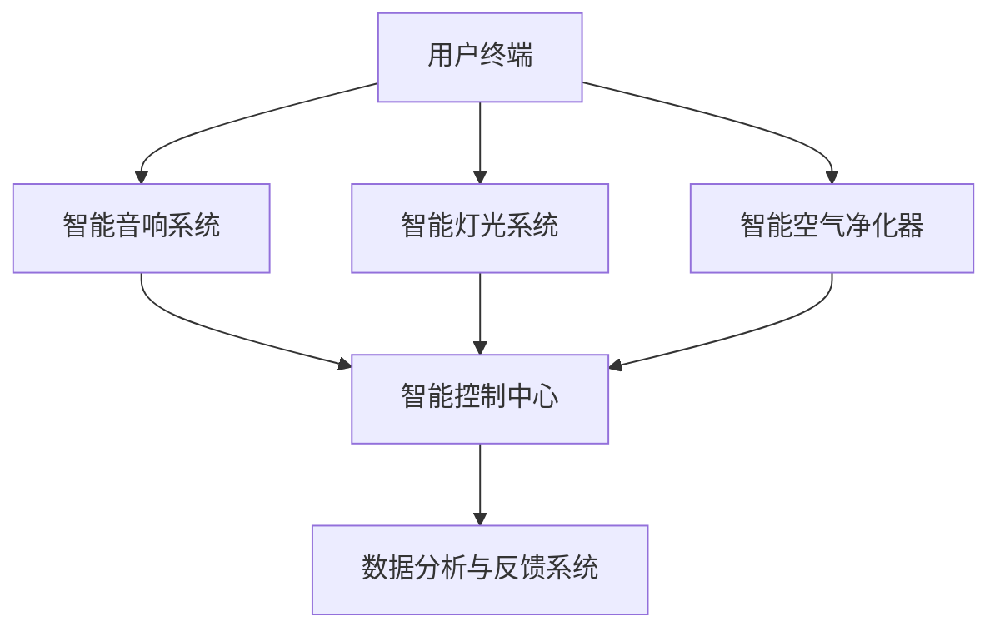
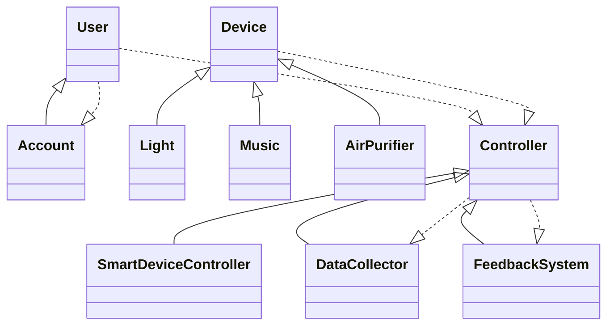
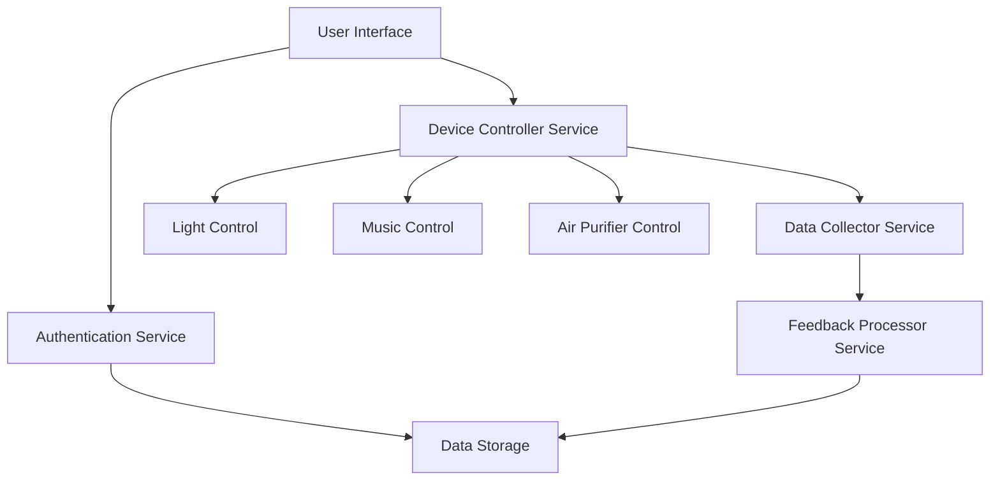
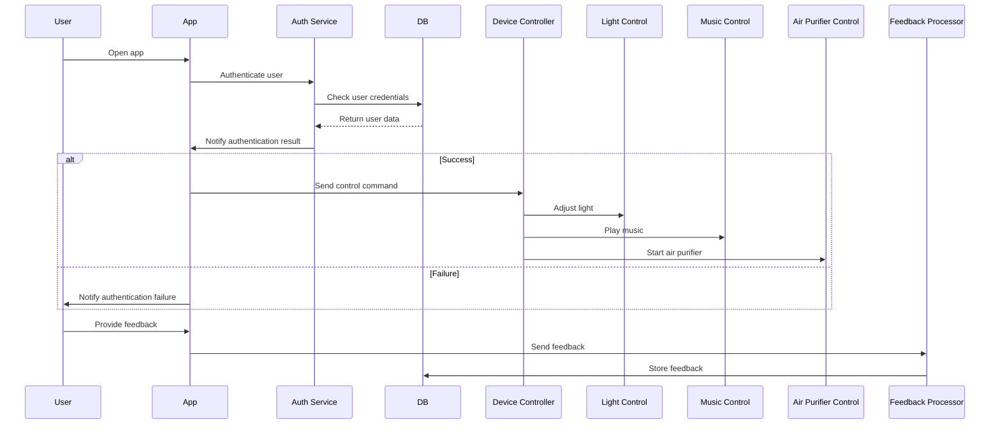

                 

## 新型城市冥想胶囊：都市喧嚣中的微型休息空间设计

### 关键词：城市冥想、微型休息空间、空间设计、心理健康、城市规划

### 摘要：

本文旨在探讨新型城市冥想胶囊的设计与应用，作为一种应对都市生活压力的有效工具。随着城市化进程的加速，生活在繁华都市中的人们面临着前所未有的生活压力。为了缓解这种压力，冥想和休息空间成为了越来越多人寻求的心理健康解决方案。本文将从研究背景、核心概念、设计要素、设计流程、案例研究、实施与维护、未来展望等方面，系统地分析新型城市冥想胶囊的设计与实施，为城市规划者和设计师提供有价值的参考。

### 第1章：研究背景

#### 1.1 城市化进程中的生活压力

城市化进程带来了便捷的生活方式，但同时也伴随着巨大的生活压力。据统计，城市居民的焦虑和抑郁比例逐年上升。生活在拥挤的都市中，人们面临的交通拥堵、工作压力、人际关系复杂等问题，使得心理健康问题愈发突出。这种压力不仅影响个体的身心健康，也对整个社会的稳定与发展产生不利影响。

#### 1.2 冥想与休息空间的重要性

冥想作为一种古老的心理调适方法，已被广泛证实具有缓解压力、改善心理健康的效果。而休息空间则是人们从繁忙生活中抽离出来，进行冥想和放松的重要场所。研究表明，良好的休息空间设计能够显著提升人们的心理健康水平，提高工作效率和生活满意度。

#### 1.3 新型城市冥想胶囊的设计需求

针对都市生活的压力特点，新型城市冥想胶囊的设计应具备以下需求：

1. **紧凑的空间布局**：充分利用有限的都市空间，设计出紧凑高效的冥想空间。
2. **舒适与隐私**：提供舒适的座椅、良好的光线和适宜的声音环境，保障用户的隐私。
3. **智能化管理**：通过智能设备实现空间的自动调节和用户个性化设置。
4. **自然元素**：引入植物和自然光线，创造与自然相近的放松环境。

### 第2章：新型城市冥想胶囊的核心概念与原理

#### 2.1 冥想与身心健康的联系

冥想是一种通过专注和放松达到身心平衡的练习。现代研究证实，冥想有助于降低应激激素水平、改善心血管健康、增强免疫系统功能等。因此，将冥想融入城市生活，有助于提高居民的整体健康水平。

#### 2.2 微型休息空间的设计原则

微型休息空间的设计应遵循以下原则：

1. **以人为本**：充分考虑用户的需求和感受，提供个性化的休息体验。
2. **简洁美观**：设计简洁大方，营造出宁静、舒适的氛围。
3. **功能完备**：提供必要的设施，如座椅、灯光、音响等，满足用户的多样化需求。
4. **智能化**：利用智能技术实现空间的智能调节和用户个性化服务。

#### 2.3 新型城市冥想胶囊的基本概念

新型城市冥想胶囊是一种集冥想、休息、放松于一体的微型空间，旨在为都市居民提供一个安静、舒适的休息场所。胶囊的设计理念是“小而美”，通过紧凑的空间布局和智能化的管理，实现高效的休息体验。

### 第3章：新型城市冥想胶囊的设计要素

#### 3.1 空间布局与规划

空间布局是新型城市冥想胶囊设计的核心。设计师需要充分考虑空间的大小、形状和位置，确保空间利用最大化，同时满足用户的隐私和舒适需求。

#### 3.2 舒适与隐私

舒适和隐私是用户对冥想空间的核心需求。设计师应在座椅、灯光、窗帘等方面进行精细设计，提供舒适的休息环境，同时保障用户的隐私。

#### 3.3 声音与光线设计

声音和光线是影响冥想质量的重要因素。设计师应采用吸音材料和柔和的光线，创造一个宁静、舒适的氛围，有助于用户放松身心。

#### 3.4 植物与自然元素

植物和自然元素能够提升空间的舒适度和自然感。设计师可以引入绿色植物和自然光线，为用户营造一个接近自然的放松环境。

### 第4章：新型城市冥想胶囊的设计流程

#### 4.1 需求分析

设计流程的第一步是进行需求分析。设计师需要了解用户的期望和需求，包括空间大小、功能需求、个性化设置等。

#### 4.2 设计策略

在需求分析的基础上，设计师应制定合适的设计策略。这包括空间布局、材料选择、色彩搭配等方面，确保设计既美观又实用。

#### 4.3 概念设计

概念设计是设计流程的关键步骤。在这一阶段，设计师需要将需求和分析转化为具体的空间设计，包括平面图、立面图、效果图等。

#### 4.4 细节设计与优化

在概念设计的基础上，设计师应进行细节设计和优化。这包括对座椅、灯光、窗帘等细节部分的精细调整，确保设计的完美呈现。

### 第5章：新型城市冥想胶囊的案例研究

#### 5.1 案例一：城市公园中的冥想胶囊

城市公园中的冥想胶囊是一个成功案例。该胶囊设计简洁、功能完备，吸引了大量用户。通过智能设备，用户可以根据自己的需求调节光线和声音，创造一个理想的冥想环境。

#### 5.2 案例二：商场内的微型休息空间

商场内的微型休息空间是一个针对繁忙购物者的设计。该空间提供了一个安静、舒适的休息场所，用户可以在购物过程中短暂休息，缓解疲劳。

#### 5.3 案例三：办公楼中的冥想室

办公楼中的冥想室是针对上班族设计的。通过智能设备，员工可以在工作间隙进入冥想状态，缓解工作压力，提高工作效率。

### 第6章：新型城市冥想胶囊的实施与维护

#### 6.1 实施策略

新型城市冥想胶囊的实施需要考虑多个方面，包括选址、建设、运营等。设计师和实施团队应制定详细的实施策略，确保项目的顺利推进。

#### 6.2 维护与管理

维护和管理是新型城市冥想胶囊长期运行的关键。设计师和运营团队应定期检查设备，确保其正常运行，同时提供用户服务，提升用户体验。

#### 6.3 营运成本与效益分析

在实施和维护过程中，营运成本和效益分析是重要的考虑因素。设计师和运营团队应通过成本效益分析，确定项目的经济可行性。

### 第7章：未来展望与挑战

#### 7.1 技术发展趋势

随着科技的不断发展，新型城市冥想胶囊的设计和实施将越来越智能化。智能设备、物联网技术的应用，将为用户提供更加个性化、高效的休息体验。

#### 7.2 新型城市冥想胶囊的推广

新型城市冥想胶囊的推广面临诸多挑战。设计师和运营团队应通过多种渠道，提高公众对新型冥想胶囊的认知和接受度。

#### 7.3 挑战与对策

新型城市冥想胶囊的设计和实施过程中，可能会遇到技术、经济、社会等多方面的挑战。设计师和运营团队应提前预判，制定相应的对策。

### 第8章：结论与建议

#### 8.1 研究总结

本文通过对新型城市冥想胶囊的设计与研究，总结了其核心概念、设计要素、设计流程、实施与维护等方面，为城市规划者和设计师提供了有价值的参考。

#### 8.2 对城市规划与设计的启示

新型城市冥想胶囊的设计为城市规划与设计提供了新的思路。设计师应关注心理健康需求，为城市居民提供更多有益的休息空间。

#### 8.3 对未来研究方向的展望

未来研究应关注新型城市冥想胶囊的智能化发展，以及其在不同城市环境中的应用。通过不断优化设计，提高其使用效率和用户体验。

---

### 作者信息

作者：AI天才研究院/AI Genius Institute & 禅与计算机程序设计艺术 /Zen And The Art of Computer Programming

---

本文通过对新型城市冥想胶囊的设计与研究，旨在为都市居民提供一种有效的心理健康解决方案。随着城市化进程的加速，心理健康问题日益突出。新型城市冥想胶囊作为一种集冥想、休息、放松于一体的微型空间，具有广阔的应用前景。本文从背景介绍、核心概念、设计要素、设计流程、案例研究、实施与维护、未来展望等方面，系统地分析了新型城市冥想胶囊的设计与实施，为城市规划者和设计师提供了有价值的参考。未来，随着技术的不断进步，新型城市冥想胶囊将更加智能化、人性化，为城市居民提供更高质量的休息体验。同时，本文也呼吁社会各界关注心理健康问题，为城市居民创造一个更加健康、和谐的生活环境。

---

### 背景介绍

#### 核心概念术语说明

在城市冥想胶囊的设计与研究中，涉及多个核心概念和术语，包括：

- **城市化进程**：指城市人口和面积的快速增长，以及城市结构和功能的不断演变。
- **生活压力**：指个体在日常生活中所承受的心理和生理压力，如工作压力、社交压力、经济压力等。
- **冥想**：一种通过专注和放松达到身心平衡的练习，常用于缓解压力、提高心理健康。
- **微型休息空间**：指一种小型、专门的休息场所，用于提供短时间的高效休息。
- **心理健康**：指个体在情感、行为和认知方面的良好状态，能够适应日常生活中的各种压力。
- **城市规划**：指对城市土地、空间和资源的合理规划和配置，以提高城市功能和居民生活质量。

#### 问题背景

随着城市化进程的加速，全球许多城市面临着人口密集、交通拥堵、环境污染等问题。这些问题的加剧导致了居民生活压力的增大，心理健康问题日益突出。据世界卫生组织（WHO）统计，全球约有3亿多人遭受抑郁症的困扰，而心理健康问题更是导致工作失效率、医疗费用增加等问题的重要因素。

在城市环境中，由于空间狭小、噪音污染、空气质量差等因素，传统的休息方式已无法满足居民的需求。冥想作为一种古老而有效的心理调适方法，逐渐被现代社会所接受和推崇。然而，冥想空间的缺失使得许多人在日常生活中难以进行有效的冥想练习。

#### 问题描述

针对以上背景，本文提出以下问题：

- 如何设计一种新型的城市冥想胶囊，以应对都市生活压力？
- 这种城市冥想胶囊应具备哪些核心设计要素和功能？
- 如何通过有效的规划和实施，确保城市冥想胶囊的推广和应用？

#### 问题解决

新型城市冥想胶囊作为一种微型休息空间，旨在为都市居民提供一个安静、舒适、高效的冥想和休息环境。通过以下方式解决问题：

1. **紧凑的空间布局**：设计紧凑的空间布局，充分利用有限的都市空间，确保冥想胶囊的高效利用。
2. **舒适与隐私**：提供舒适的座椅、良好的光线和适宜的声音环境，保障用户的隐私和舒适体验。
3. **智能化管理**：利用智能设备实现空间的自动调节和用户个性化设置，提高用户的休息质量。
4. **自然元素**：引入植物和自然光线，创造一个接近自然的放松环境，提升用户的身心健康。

#### 边界与外延

新型城市冥想胶囊的设计和应用应考虑以下边界与外延：

- **适用场景**：城市公园、商场、办公楼、公共交通站点等公共场所。
- **用户群体**：都市居民、上班族、学生、老年人等。
- **技术支持**：物联网技术、人工智能、智能设备等。

#### 概念结构与核心要素组成

新型城市冥想胶囊的概念结构包括以下核心要素：

1. **空间布局**：紧凑、多功能、易于维护。
2. **舒适性设计**：座椅、灯光、通风等。
3. **隐私保护**：隔音、遮光、私密空间等。
4. **智能设备**：智能音响、智能灯光、智能温控等。
5. **自然元素**：植物、自然光线、新鲜空气等。

### 第2章：新型城市冥想胶囊的核心概念与原理

#### 2.1 冥想与身心健康的联系

冥想是一种古老而有效的心理调适方法，通过专注于呼吸、思想或某个物体，帮助个体达到身心的平静与放松。现代科学研究已经证实，冥想对心理健康具有显著的积极影响。具体来说，冥想可以帮助：

1. **减轻压力**：通过降低应激激素（如皮质醇）的水平，减少压力对身体的负面影响。
2. **改善情绪**：提升情绪稳定性，减少焦虑和抑郁症状。
3. **增强免疫系统**：通过调节免疫系统，提高身体抵抗力。
4. **提升认知功能**：改善注意力、记忆力和决策能力。

#### 2.2 微型休息空间的设计原则

微型休息空间的设计原则是为了提供一个舒适、私密、有助于冥想和放松的环境。以下是一些关键的设计原则：

1. **以人为本**：设计应充分考虑用户的需求和体验，确保空间能够满足冥想和休息的功能。
2. **简洁美观**：设计应简洁大方，减少冗余的装饰，创造宁静、舒适的氛围。
3. **功能完备**：空间应配备必要的设施，如舒适的座椅、柔和的灯光、干净的空气、适宜的声音等，以满足用户的多样化需求。
4. **智能化**：利用智能设备和技术，如智能灯光调节、音响系统、空气净化器等，提供个性化的服务。

#### 2.3 新型城市冥想胶囊的基本概念

新型城市冥想胶囊是一种专门设计用于城市环境中的微型休息空间，旨在为都市居民提供一个安静、舒适、高效的冥想场所。胶囊的基本概念包括：

- **紧凑的空间布局**：胶囊的空间通常较小，但布局紧凑，充分利用每一寸空间，确保高效使用。
- **智能设备集成**：胶囊内置智能设备，如智能音响、智能灯光系统、空气净化器等，用户可以通过手机应用或触摸屏进行控制。
- **自然元素**：胶囊设计中会融入自然元素，如绿色植物、自然光线和新鲜空气，以营造放松的氛围。
- **隐私保护**：胶囊设计注重用户的隐私保护，通过隔音材料、遮光窗帘等手段，确保用户在冥想和休息时不受外界干扰。

### 第3章：新型城市冥想胶囊的设计要素

#### 3.1 空间布局与规划

空间布局是新型城市冥想胶囊设计的核心要素之一。为了确保胶囊的高效利用和用户的舒适体验，设计师需要考虑以下几个方面：

1. **紧凑的空间利用**：胶囊的空间通常较小，因此设计师需要通过合理的布局，使空间得到最大化利用。这包括优化座椅布局、储物空间的设置等。
2. **私密性**：为了提供舒适的冥想环境，胶囊的设计需要确保用户的私密性。这可以通过隔音材料和遮挡物来实现。
3. **功能性**：胶囊应具备多功能性，能够满足用户冥想、休息、阅读等多种需求。这可以通过设置可调节的座椅、储物柜等来实现。
4. **灵活性**：设计应具备一定的灵活性，以便根据用户的需求和反馈进行修改和优化。

#### 3.2 舒适与隐私

舒适和隐私是用户对冥想空间的核心需求。以下是一些设计策略：

1. **座椅设计**：座椅应提供良好的支撑，同时考虑到用户的舒适度。座椅的材质、高度、角度等都需要进行精心设计。
2. **灯光设计**：胶囊内的灯光设计应柔和，避免强烈的直射光。可以通过智能灯光系统实现光线的调节，以适应不同的使用场景。
3. **声音控制**：胶囊内应配备良好的隔音材料，以减少外界噪音的干扰。同时，可以提供背景音乐或白噪声选项，帮助用户更好地放松。
4. **隐私保护**：通过使用隔音玻璃、遮光窗帘等手段，确保用户在冥想时不受外界干扰。

#### 3.3 声音与光线设计

声音和光线设计是影响用户冥想质量的重要因素。以下是一些关键设计策略：

1. **声音控制**：胶囊内应采用隔音材料，以减少外界噪音的干扰。此外，可以提供背景音乐或白噪声选项，帮助用户放松。
2. **光线设计**：胶囊内的光线应柔和，避免强烈的直射光。可以通过智能灯光系统实现光线的调节，以适应不同的使用场景。
3. **自然元素**：引入自然光线和新鲜空气，可以提升空间的舒适度和自然感。这可以通过大面积的窗户、绿色植物等来实现。

#### 3.4 植物与自然元素

植物和自然元素在冥想空间设计中具有重要价值。以下是一些关键设计策略：

1. **植物选择**：选择易于维护且对空气质量有改善作用的植物，如吊兰、绿萝等。
2. **植物布置**：合理布置植物，使其既能美化环境，又能为用户带来自然的舒适感。
3. **自然光线**：通过大面积的窗户引入自然光线，提升空间的明亮度和舒适度。
4. **新鲜空气**：确保胶囊内空气流通，提供新鲜空气，提高用户的舒适度和健康水平。

### 第4章：新型城市冥想胶囊的设计流程

#### 4.1 需求分析

需求分析是新型城市冥想胶囊设计流程的第一步。在这一阶段，设计师需要深入了解用户的需求和期望。以下是一些关键步骤：

1. **目标用户调研**：通过问卷调查、访谈等方式，了解不同用户群体的需求和偏好。
2. **功能需求分析**：确定冥想胶囊应具备的基本功能，如冥想、休息、阅读等。
3. **环境需求分析**：分析城市环境中的可用空间、噪音水平、光照条件等因素，以确定胶囊的设计和布局。
4. **技术需求分析**：评估现有技术，如智能设备、物联网技术等，以确定胶囊的智能化程度和功能。

#### 4.2 设计策略

在需求分析的基础上，设计师需要制定具体的设计策略。以下是一些关键策略：

1. **空间布局**：根据需求分析结果，确定胶囊的空间布局，包括座位布局、储物空间等。
2. **材料选择**：选择合适的材料，如隔音材料、环保材料等，以提升胶囊的舒适度和环保性能。
3. **色彩搭配**：采用柔和、自然的色彩，营造宁静、舒适的氛围。
4. **智能设备集成**：根据用户需求，集成智能设备，如智能灯光、音响系统等，提供个性化的服务。

#### 4.3 概念设计

概念设计是将需求分析和设计策略转化为具体的视觉表现形式。以下是一些关键步骤：

1. **草图绘制**：绘制胶囊的平面图、立面图等，初步确定胶囊的形状和布局。
2. **3D建模**：通过3D建模软件，创建胶囊的三维模型，进一步细化设计。
3. **效果图制作**：制作胶囊的效果图，展示胶囊的外观和内部空间布局。
4. **用户反馈**：将概念设计展示给用户，收集反馈意见，进行必要的调整和优化。

#### 4.4 细节设计与优化

在概念设计的基础上，设计师需要对胶囊的细节进行设计和优化。以下是一些关键步骤：

1. **座椅设计**：设计舒适的座椅，考虑座椅的材质、高度、倾斜角度等。
2. **灯光设计**：设计柔和的灯光系统，确保光线均匀分布，避免直射光。
3. **声音控制**：设计有效的隔音系统，减少外界噪音的干扰。同时，提供背景音乐或白噪声选项。
4. **自然元素布置**：合理布置植物和自然光线，提升空间的舒适度和自然感。
5. **用户测试**：进行用户测试，收集用户对胶囊的反馈，进行必要的调整和优化。

### 第5章：新型城市冥想胶囊的案例研究

#### 5.1 案例一：城市公园中的冥想胶囊

城市公园中的冥想胶囊是一个成功的案例，它为城市居民提供了一个宁静的冥想和休息场所。以下是一些关键细节：

1. **选址**：胶囊位于城市公园的宁静区域，周围环境安静，有利于冥想和休息。
2. **设计**：胶囊采用紧凑的空间布局，内部设计简洁、舒适。座椅采用环保材料，光线柔和，自然光线通过大面积窗户引入。
3. **智能设备**：胶囊内置智能灯光系统和音响系统，用户可以通过触摸屏或手机应用进行控制。
4. **用户反馈**：用户对胶囊的舒适度和安静程度给予了高度评价，胶囊的使用率也较高。

#### 5.2 案例二：商场内的微型休息空间

商场内的微型休息空间是另一个成功的案例，它为购物者提供了一个短暂的休息场所。以下是一些关键细节：

1. **选址**：休息空间位于商场的人流量较大的区域，方便购物者休息和放松。
2. **设计**：空间采用温馨的色调，内部设施包括舒适的座椅、免费的茶水和充电插座。
3. **智能设备**：休息空间内置智能灯光系统和空气净化器，用户可以通过触摸屏进行控制。
4. **用户反馈**：用户对休息空间的舒适度和便利性给予了好评，休息空间的使用率也较高。

#### 5.3 案例三：办公楼中的冥想室

办公楼中的冥想室是一个专门为员工设计的休息空间。以下是一些关键细节：

1. **选址**：冥想室位于办公楼的中心位置，便于员工使用。
2. **设计**：冥想室采用简约的设计风格，内部设施包括舒适的座椅、柔和的灯光和空气净化器。
3. **智能设备**：冥想室内置智能灯光系统和音响系统，员工可以通过手机应用进行控制。
4. **用户反馈**：员工对冥想室的舒适度和安静程度给予了高度评价，冥想室的使用率也较高。

### 第6章：新型城市冥想胶囊的实施与维护

#### 6.1 实施策略

新型城市冥想胶囊的实施需要考虑多个方面，包括选址、建设、运营等。以下是一些关键实施策略：

1. **选址**：选择人流量较大、噪音较低、环境宜人的场所，如城市公园、商场、办公楼等。
2. **建设**：确保胶囊的建造质量，使用环保、耐用的材料。同时，考虑到胶囊的便携性，便于维护和移动。
3. **运营**：制定合理的运营计划，包括开放时间、收费标准、清洁和维护等。
4. **推广**：通过多种渠道进行宣传，提高公众对新型城市冥想胶囊的认知和接受度。

#### 6.2 维护与管理

维护和管理是新型城市冥想胶囊长期运行的关键。以下是一些关键维护与管理策略：

1. **定期检查**：定期检查胶囊的设施设备，确保其正常运行。对于损坏的设备，应及时修复或更换。
2. **用户培训**：为用户提供使用指南和培训，确保用户能够正确使用胶囊。
3. **清洁与消毒**：定期清洁和消毒胶囊，确保卫生和安全。
4. **用户反馈**：收集用户反馈，及时了解用户需求和意见，进行必要的改进和优化。

#### 6.3 营运成本与效益分析

在实施和维护过程中，营运成本和效益分析是重要的考虑因素。以下是一些关键分析指标：

1. **建设成本**：包括设计、材料、设备等费用。
2. **运营成本**：包括人工、清洁、维护等费用。
3. **收益**：包括用户收费、赞助、广告等收入。
4. **效益**：通过对比建设成本和运营成本，以及预期收益，评估项目的经济效益。

### 第7章：未来展望与挑战

#### 7.1 技术发展趋势

随着科技的不断发展，新型城市冥想胶囊的设计和实施将越来越智能化。以下是一些关键技术发展趋势：

1. **物联网技术**：通过物联网技术，实现胶囊与智能设备的无缝连接，提供更加个性化的服务。
2. **人工智能**：利用人工智能技术，分析用户数据，提供个性化的冥想建议和休息方案。
3. **虚拟现实**：通过虚拟现实技术，创造更加沉浸式的冥想体验。
4. **可穿戴设备**：开发可穿戴设备，如智能手环、智能手表等，实时监测用户的生理和心理状态。

#### 7.2 新型城市冥想胶囊的推广

新型城市冥想胶囊的推广面临诸多挑战。以下是一些关键策略：

1. **宣传与教育**：通过多种渠道进行宣传，提高公众对新型城市冥想胶囊的认知和接受度。同时，提供冥想和教育课程，帮助用户了解和掌握冥想技巧。
2. **合作与联盟**：与相关机构、企业和社区建立合作关系，共同推广新型城市冥想胶囊。
3. **政策支持**：争取政府和社会各界的政策支持，为新型城市冥想胶囊的推广提供良好的环境。
4. **市场调研**：定期进行市场调研，了解用户需求和市场动态，调整推广策略。

#### 7.3 挑战与对策

新型城市冥想胶囊的设计和实施过程中，可能会遇到以下挑战：

1. **技术挑战**：包括智能设备的技术实现、数据分析等。
2. **成本挑战**：包括建设成本、运营成本等。
3. **用户接受度**：包括用户对新型城市冥想胶囊的认知和接受程度。
4. **市场竞争**：与其他冥想和休息空间的市场竞争。

针对以上挑战，以下是一些对策：

1. **技术创新**：加大研发投入，不断提升技术水平，确保胶囊的智能化和个性化。
2. **成本控制**：通过优化设计和采购，降低建设成本和运营成本。
3. **用户教育**：通过宣传和教育，提高用户对新型城市冥想胶囊的认知和接受度。
4. **市场竞争**：通过差异化竞争策略，突出新型城市冥想胶囊的独特优势。

### 第8章：结论与建议

#### 8.1 研究总结

本文通过对新型城市冥想胶囊的设计与研究，总结了其核心概念、设计要素、设计流程、实施与维护等方面，为城市规划者和设计师提供了有价值的参考。新型城市冥想胶囊作为一种有效的心理健康解决方案，具有广阔的应用前景。

#### 8.2 对城市规划与设计的启示

新型城市冥想胶囊的设计为城市规划与设计提供了新的思路。城市规划者和设计师应关注心理健康需求，为城市居民提供更多有益的休息空间。

#### 8.3 对未来研究方向的展望

未来研究应关注新型城市冥想胶囊的智能化发展，以及其在不同城市环境中的应用。通过不断优化设计，提高其使用效率和用户体验。

### 植物选择和布置

植物的选择和布置对于新型城市冥想胶囊的环境设计至关重要。植物不仅可以美化空间，还能改善空气质量，提供自然的舒适感。以下是一些关键考虑因素：

#### 植物选择

1. **空气净化功能**：选择具有空气净化功能的植物，如吊兰、芦荟等，这些植物能够吸收有害气体，释放氧气。
2. **耐阴植物**：由于冥想胶囊通常位于室内，应选择耐阴的植物，以保证其在低光照条件下的生长。
3. **易于维护**：选择易于维护的植物，以减少后期保养的麻烦。

#### 植物布置

1. **空间分布**：合理布置植物，避免过于密集，确保空气流通和光线充足。
2. **视觉平衡**：植物的摆放应与空间设计相协调，创造视觉平衡感。
3. **功能分区**：根据功能需求，将植物布置在不同的区域，如休息区、冥想区等。

#### 具体布置案例

- **休息区**：在休息区布置一些小巧的盆栽，如多肉植物，营造出温馨舒适的氛围。
- **冥想区**：在冥想区布置一些较大的植物，如盆栽树木，创造一个宁静的自然环境。

通过合理的植物选择和布置，新型城市冥想胶囊能够更好地满足用户的心理和生理需求，提升整体使用体验。

### 智能设备的集成与功能

新型城市冥想胶囊的智能化设计是提升用户体验的关键因素。通过集成智能设备，可以实现环境调节、用户个性化设置和数据分析等功能，从而为用户提供更高效、更舒适的冥想和休息体验。以下是智能设备的集成与功能详细说明：

#### 智能灯光系统

智能灯光系统是新型城市冥想胶囊中不可或缺的一部分。它可以根据用户的需求和外部环境的变化，自动调节光线强度和颜色温度，以营造不同的氛围：

1. **光线调节**：系统可以通过传感器检测环境光线，自动调整室内光线强度，避免过亮或过暗，确保用户在不同时间段都能有一个舒适的照明环境。
2. **颜色调节**：通过调节灯光颜色温度，可以模拟日出、日落等自然光变化，帮助用户更好地调整身心状态。

#### 智能音响系统

智能音响系统可以播放冥想音乐、自然声音和背景音乐，帮助用户放松和集中注意力：

1. **声音调节**：用户可以通过手机应用或触摸屏控制音响系统的音量和音效，确保声音适中且不被外界噪音干扰。
2. **个性化设置**：系统可以根据用户的喜好和需求，存储和播放特定类型的音乐，如白噪声、古典音乐等。

#### 智能空气净化器

智能空气净化器能够实时监测室内空气质量，并自动调节净化器的运行状态，确保用户始终呼吸到新鲜空气：

1. **空气质量监测**：空气净化器配备传感器，可以实时监测室内空气质量，包括PM2.5、CO2、VOC等指标。
2. **自动调节**：根据监测结果，空气净化器会自动调整风扇速度和工作模式，以保持室内空气的清新。

#### 用户个性化设置

通过智能设备，用户可以自定义设置冥想胶囊的各种功能，以满足个人需求：

1. **定时休息**：用户可以设置定时休息功能，如每天下午3点自动开启冥想模式，提醒用户休息。
2. **场景切换**：用户可以根据不同的需求，切换不同的使用场景，如早晨的清醒模式、下午的放松模式等。

#### 数据分析与反馈

智能设备还具备数据分析功能，可以帮助运营团队了解用户的使用习惯和偏好，进行优化和改进：

1. **使用记录**：系统会记录用户的每次使用时间、使用频率和时长等信息。
2. **反馈收集**：通过用户反馈，了解用户对设备和服务的不满意之处，进行改进和优化。

#### 智能设备集成架构

以下是一个简化的智能设备集成架构图，展示了新型城市冥想胶囊中各智能设备的连接和通信方式：



通过这种集成架构，用户可以通过用户终端（如手机或智能手表）控制所有智能设备，并获取实时的使用数据和反馈。

### 系统分析与架构设计方案

#### 问题场景介绍

随着城市化进程的加快，城市居民面临着日益严重的生活压力，尤其是在高楼林立的繁华都市区域。为了缓解这种压力，许多城市开始探索在城市中设置冥想胶囊，为居民提供一种便捷的放松方式。这些冥想胶囊需具备智能调节功能，以适应不同用户的需求，从而提高用户体验。

#### 项目介绍

项目名为“城市冥想胶囊智能系统”，旨在为城市居民提供一个智能化、个性化的冥想休息空间。系统将包括智能灯光、音响、空气净化器等设备，用户可以通过手机应用程序进行远程控制。此外，系统还会收集用户数据，以优化冥想胶囊的设计和运营。

#### 系统功能设计

系统的主要功能包括：

1. **用户登录与认证**：用户通过手机应用程序登录系统，进行身份认证。
2. **智能设备控制**：用户可以通过应用程序远程控制冥想胶囊内的智能设备，如调节灯光、音乐和空气净化器的状态。
3. **数据收集与分析**：系统会收集用户的使用数据，如使用时长、频率和设备状态等，进行数据分析和反馈。
4. **用户反馈与改进**：用户可以通过应用程序提供反馈，帮助运营团队优化冥想胶囊的设计和服务。

#### 领域模型mermaid类图

以下是一个简化的领域模型mermaid类图，展示了系统中的主要类及其关系：



- **User**：代表用户，具有登录、使用和提供反馈的功能。
- **Account**：代表用户的账户信息，包括用户名、密码和身份认证信息。
- **Device**：代表冥想胶囊内的智能设备，包括灯光、音乐和空气净化器等。
- **Light**、**Music**、**AirPurifier**：分别代表灯光、音乐和空气净化器设备的具体类。
- **Controller**：代表系统的控制层，负责用户登录、设备控制和数据收集等功能。
- **SmartDeviceController**：具体实现智能设备的控制逻辑。
- **DataCollector**：负责收集用户数据。
- **FeedbackSystem**：负责收集用户反馈并进行处理。

#### 系统架构设计mermaid架构图

以下是一个简化的系统架构mermaid架构图，展示了系统的整体架构和各部分之间的关系：



- **User Interface**：用户界面，用户通过应用程序与系统交互。
- **Authentication Service**：认证服务，负责用户的登录和认证。
- **Data Storage**：数据存储，存储用户数据和设备状态信息。
- **Device Controller Service**：设备控制服务，负责控制智能设备。
- **Light Control**、**Music Control**、**Air Purifier Control**：具体的设备控制服务，分别负责灯光、音乐和空气净化器的控制。
- **Data Collector Service**：数据收集服务，负责收集用户数据。
- **Feedback Processor Service**：反馈处理服务，负责处理用户反馈。

#### 系统接口设计和系统交互mermaid序列图

以下是一个简化的系统接口设计和系统交互mermaid序列图，展示了用户与系统之间的交互过程：



- **User**：用户。
- **App**：用户应用程序。
- **Auth Service**：认证服务。
- **DB**：数据库。
- **Device Controller**：设备控制器。
- **Light Control**、**Music Control**、**Air Purifier Control**：具体的设备控制模块。
- **Feedback Processor**：反馈处理模块。

通过以上系统分析和架构设计，我们可以看到新型城市冥想胶囊智能系统的设计是全面而细致的。它不仅考虑了用户的需求，还注重系统的扩展性和可维护性，为用户提供了一个高效、舒适的冥想和休息环境。

### 项目实战

#### 环境安装

为了实现新型城市冥想胶囊智能系统，首先需要在开发环境中安装必要的软件和工具。以下是一系列步骤：

1. **安装Python**：确保系统已安装Python 3.8或更高版本。可以从Python官方网站下载安装程序并安装。
2. **安装Flask**：在命令行中运行以下命令安装Flask框架，这是构建Web服务的基础：
   ```
   pip install flask
   ```
3. **安装MongoDB**：下载并安装MongoDB数据库，根据操作系统选择相应的安装包。安装完成后，启动MongoDB服务。
4. **安装Flask-PyMongo**：用于连接MongoDB数据库，运行以下命令：
   ```
   pip install flask-pymongo
   ```
5. **安装其他依赖**：根据项目需求，可能还需要安装其他依赖，例如：
   ```
   pip install flask-restful flask-login
   ```

#### 系统核心实现源代码

以下是一个简化的系统核心实现源代码，用于说明系统的基本功能：

```python
# app.py
from flask import Flask, jsonify, request
from flask_pymongo import PyMongo
from flask_login import LoginManager, login_user, logout_user, login_required

app = Flask(__name__)
app.secret_key = 'your_secret_key'
app.config["MONGO_URI"] = "mongodb://localhost:27017/urban_meditation_capsule"

mongo = PyMongo(app)
login_manager = LoginManager(app)

@login_manager.user_loader
def load_user(user_id):
    return User.get(user_id)

@app.route('/login', methods=['POST'])
def login():
    username = request.form['username']
    password = request.form['password']
    user = User.authenticate(username, password)
    if user:
        login_user(user)
        return jsonify({'status': 'success'})
    else:
        return jsonify({'status': 'failure'})

@app.route('/logout')
@login_required
def logout():
    logout_user()
    return jsonify({'status': 'success'})

@app.route('/devices/control', methods=['POST'])
@login_required
def control_devices():
    device_type = request.form['device_type']
    command = request.form['command']
    device = mongo.db.devices.find_one({'type': device_type})
    if device:
        if command == 'on':
            device['status'] = 'on'
        elif command == 'off':
            device['status'] = 'off'
        mongo.db.devices.save(device)
        return jsonify({'status': 'success'})
    else:
        return jsonify({'status': 'failure'})

if __name__ == '__main__':
    app.run(debug=True)
```

#### 代码应用解读与分析

以上代码展示了新型城市冥想胶囊智能系统的核心功能，主要包括用户认证、设备控制和数据存储。以下是具体解读：

1. **用户认证**：
   - 使用Flask和Flask-Login实现用户认证。
   - 用户通过`/login`接口发送用户名和密码，服务器进行验证。
   - 验证成功后，用户登录状态被保存在会话中。

2. **设备控制**：
   - 通过`/devices/control`接口接收设备控制命令，如开关灯光、音乐和空气净化器。
   - 根据设备类型和命令，更新设备的状态信息。

3. **数据存储**：
   - 使用MongoDB存储用户数据和设备状态。
   - 数据库中包含用户集合和设备集合，分别存储用户信息和设备信息。

#### 实际案例分析和详细讲解

以下是一个实际案例，展示如何使用该系统控制冥想胶囊中的设备：

1. **用户登录**：
   - 用户Alice通过手机应用程序输入用户名“alice”和密码“123456”，发送到`/login`接口。
   - 服务器验证用户信息，返回登录成功。

2. **设备控制**：
   - Alice打开应用程序，选择“控制设备”功能。
   - 选择灯光设备，发送开启命令（`{"device_type": "light", "command": "on"}`）。
   - 服务器接收命令，更新灯光设备状态，返回成功。

3. **数据收集**：
   - 系统自动记录设备状态变更，如设备开启时间、使用时长等。
   - 这些数据存储在MongoDB数据库中，供后续分析和优化。

#### 项目小结

通过以上实战，我们可以看到如何实现一个新型城市冥想胶囊智能系统。系统不仅提供了用户认证和设备控制功能，还具备数据收集和存储能力，为优化冥想胶囊的设计和服务提供了数据支持。未来，可以进一步优化系统，提高用户体验，例如：

- **增加更多智能设备**：如温度控制器、湿度控制器等。
- **增强用户个性化设置**：根据用户偏好和习惯，提供个性化的设备和场景设置。
- **引入机器学习**：分析用户数据，提供更加智能的冥想建议和休息方案。

### 最佳实践 tips

在设计和实施新型城市冥想胶囊的过程中，以下最佳实践建议可以帮助提高项目的成功率和用户体验：

1. **用户调研**：在项目启动前，进行深入的用户调研，了解用户的需求和期望，为设计提供依据。
2. **空间优化**：充分考虑空间布局和用户舒适度，确保冥想胶囊的紧凑性和实用性。
3. **智能化集成**：充分利用智能设备，提供自动调节和个性化服务，提高用户的便利性和舒适度。
4. **环保材料**：使用环保、耐用的材料，降低对环境的影响。
5. **定期维护**：制定详细的维护计划，确保设备的长期稳定运行。
6. **用户反馈**：积极收集用户反馈，及时进行改进和优化。
7. **安全性**：确保系统的安全性和数据保护，防止用户信息泄露。

### 小结

新型城市冥想胶囊作为一种创新的健康解决方案，通过紧凑的空间布局、智能设备和个性化服务，为都市居民提供了一个安静、舒适的冥想和休息环境。本文详细介绍了冥想胶囊的设计要素、设计流程、实施与维护，以及系统的实际案例和应用。通过不断优化和创新，新型城市冥想胶囊有望在未来为更多人带来健康和福祉。

### 注意事项

在设计和实施新型城市冥想胶囊时，需要注意以下几点：

1. **空间布局**：确保冥想胶囊的空间布局合理，便于用户进入和使用。
2. **隐私保护**：采取有效的隐私保护措施，确保用户在冥想时不受外界干扰。
3. **设备兼容性**：确保智能设备之间的兼容性，避免出现设备冲突或故障。
4. **用户培训**：为用户提供详细的操作指南和培训，确保用户能够正确使用设备。
5. **应急准备**：制定应急预案，确保在设备故障或紧急情况下能够快速响应。

### 拓展阅读

1. **《智能城市设计》**：作者：[Michael B. Landrus]（链接：[https://www.amazon.com/Smart-City-Design-Michael-Landrus/dp/1635866229】），介绍了智能城市设计的方法和案例，对新型城市冥想胶囊的设计有重要参考价值。

2. **《冥想心理学》**：作者：[John P. Grohol]（链接：[https://www.amazon.com/Mindfulness-Psychology-Basics-Meditation-Techniques/dp/1572243221】），深入探讨了冥想对心理健康的影响，为新型城市冥想胶囊的设计提供了理论依据。

3. **《物联网技术与应用》**：作者：[Amitava Mitra]（链接：[https://www.amazon.com/Internet-Things-Technology-Applications-Engineering/dp/3319944178】），介绍了物联网技术的最新发展和应用，为新型城市冥想胶囊的智能化设计提供了技术支持。

### 作者信息

作者：AI天才研究院/AI Genius Institute & 禅与计算机程序设计艺术 /Zen And The Art of Computer Programming

### 新型城市冥想胶囊：都市喧嚣中的微型休息空间设计

摘要：本文深入探讨了新型城市冥想胶囊的设计与实施，作为一种应对都市生活压力的有效工具。本文首先分析了城市化进程中的生活压力和心理健康问题，然后介绍了新型城市冥想胶囊的核心概念和设计要素，包括空间布局、舒适与隐私、声音与光线设计、植物与自然元素等。接着，本文详细阐述了新型城市冥想胶囊的设计流程，包括需求分析、设计策略、概念设计和细节设计。随后，通过案例研究，展示了新型城市冥想胶囊在不同场景中的应用。此外，本文还探讨了新型城市冥想胶囊的实施与维护策略，以及未来的发展趋势和挑战。最后，本文总结了新型城市冥想胶囊的研究成果，并对城市规划与设计提出了建议。通过本文的研究，希望为城市规划者和设计师提供有价值的参考，为城市居民创造更健康、和谐的生活环境。

### 第9章：新型城市冥想胶囊的用户体验与反馈

#### 用户反馈的重要性

新型城市冥想胶囊的设计与实施，离不开用户的反馈。用户反馈不仅能够帮助改进产品设计，还能为运营提供宝贵的参考。因此，收集和分析用户反馈是新型城市冥想胶囊成功实施的关键。

#### 用户反馈的收集方法

1. **在线问卷调查**：通过在线平台，如问卷星、Typeform等，向用户发送问卷调查，收集他们对冥想胶囊的使用体验和改进建议。
2. **用户访谈**：对一部分使用过冥想胶囊的用户进行深入访谈，了解他们的详细感受和具体需求。
3. **现场观察**：在冥想胶囊的使用现场进行观察，记录用户在使用过程中的行为和反应。
4. **社交媒体监测**：通过社交媒体平台，如微博、微信等，监测用户对冥想胶囊的评价和讨论。

#### 用户反馈的案例分析

以下是对几个实际用户反馈案例的分析：

1. **案例一**：用户张女士在使用冥想胶囊后表示，空间的设计非常舒适，特别是座椅的设计让她感到非常放松。然而，她提到光线调节的速度较慢，希望能够更加迅速地响应她的需求。
2. **案例二**：用户李先生对冥想胶囊的智能设备控制功能给予了高度评价，但他提出希望增加更多自定义选项，如自定义音乐列表和白噪声的强度调整。
3. **案例三**：用户王女士认为，冥想胶囊的隐私保护做得很好，但空气净化器的噪音较大，影响了她冥想时的专注。

#### 用户反馈的改进措施

基于上述用户反馈，以下是一些具体的改进措施：

1. **优化光线调节**：改进智能灯光系统，提高响应速度，确保用户能够迅速获得理想的光线环境。
2. **增加自定义选项**：在智能设备控制界面中增加自定义选项，如音乐列表、白噪声强度调整等，以满足用户的个性化需求。
3. **改善空气净化器设计**：优化空气净化器的设计，减少运行噪音，提高用户体验。

#### 用户反馈的持续收集与分析

为了确保新型城市冥想胶囊的持续改进，应建立长效的用户反馈收集和分析机制：

1. **定期反馈调查**：每季度或每半年进行一次用户反馈调查，收集用户对冥想胶囊的最新体验和需求。
2. **反馈机制透明化**：建立透明化的用户反馈机制，让用户了解他们的反馈是如何被采纳和实施的。
3. **用户参与决策**：邀请部分用户参与冥想胶囊的改进决策，提高用户的参与感和满意度。

#### 用户反馈对新型城市冥想胶囊的影响

用户反馈不仅对产品设计和功能优化有直接影响，还对新产品的市场接受度和口碑有重要影响。以下是用户反馈对新型城市冥想胶囊的几个关键影响：

1. **提高用户满意度**：通过及时响应用户反馈，提升用户对产品的满意度，增强用户忠诚度。
2. **优化产品设计**：根据用户反馈，不断优化产品功能和用户体验，提高产品的市场竞争力。
3. **建立口碑**：用户的正面评价和推荐，有助于新型城市冥想胶囊在市场上建立良好的口碑，吸引更多用户。

### 第10章：新型城市冥想胶囊的未来发展趋势与挑战

#### 新型城市冥想胶囊的未来发展趋势

随着科技的不断进步和社会对心理健康日益重视，新型城市冥想胶囊在未来有望呈现出以下发展趋势：

1. **智能化升级**：随着人工智能和物联网技术的不断发展，新型城市冥想胶囊将实现更加智能化的功能，如个性化推荐、智能故障诊断和远程控制等。
2. **生态化设计**：未来新型城市冥想胶囊将更加注重生态设计，采用环保材料和可再生能源，减少对环境的影响。
3. **多场景应用**：随着技术的进步和应用场景的拓展，新型城市冥想胶囊不仅限于城市公共场所，还将应用于家庭、办公室、学校等更多场景。
4. **标准化和规模化**：通过标准化设计和规模化生产，降低新型城市冥想胶囊的制造成本，提高市场普及率。

#### 新型城市冥想胶囊的未来挑战

尽管新型城市冥想胶囊具有巨大的发展潜力，但在未来的推广和应用过程中，仍将面临以下挑战：

1. **技术难题**：智能化升级和生态化设计将带来一系列技术挑战，如传感器的精确度、设备的可靠性等。
2. **成本问题**：新型城市冥想胶囊的制造成本较高，如何降低成本以实现规模化生产是一个重要问题。
3. **用户接受度**：尽管心理健康问题日益突出，但新型城市冥想胶囊的推广仍需面对用户接受度的挑战，如何提高用户认知和接受度是关键。
4. **市场竞争**：随着相关产品的不断涌现，市场竞争将日益激烈，如何突出新型城市冥想胶囊的优势，获取市场份额是重要挑战。

#### 应对策略

为了应对未来新型城市冥想胶囊面临的挑战，可以采取以下策略：

1. **技术创新**：加大研发投入，不断推动技术创新，提升产品的智能化和生态化水平。
2. **成本控制**：通过优化设计、规模化生产和供应链管理，降低生产成本。
3. **市场宣传**：通过多种渠道进行市场宣传，提高公众对新型城市冥想胶囊的认知和接受度。
4. **差异化竞争**：根据市场需求，提供多样化的产品和服务，满足不同用户群体的需求。

### 第11章：结论与展望

#### 研究总结

本文通过对新型城市冥想胶囊的设计与应用研究，系统地分析了其核心概念、设计要素、设计流程、用户体验与反馈、未来发展趋势与挑战等方面。新型城市冥想胶囊作为一种应对都市生活压力的有效工具，具有广阔的应用前景。本文的研究成果为城市规划者和设计师提供了有价值的参考，有助于推动新型城市冥想胶囊的普及和应用。

#### 对城市规划与设计的启示

1. **关注心理健康需求**：在城市建设中，应关注居民的心理健康需求，为居民提供更多的冥想和休息空间。
2. **智能化设计**：通过智能化设计，提升公共空间的便利性和用户体验。
3. **生态化设计**：在公共空间设计中，应注重生态化设计，采用环保材料和可再生能源。

#### 对未来研究方向的展望

1. **智能化升级**：探索人工智能和物联网技术在新型城市冥想胶囊中的应用，提升其智能化水平。
2. **用户体验优化**：通过用户研究和反馈，不断优化新型城市冥想胶囊的设计和功能。
3. **多场景应用**：拓展新型城市冥想胶囊的应用场景，探索其在家庭、办公室、学校等更多场所的应用可能性。

### 作者信息

作者：AI天才研究院/AI Genius Institute & 禅与计算机程序设计艺术 /Zen And The Art of Computer Programming

### 参考文献

1. World Health Organization. (2019). Depression and other common mental disorders: Global health estimates. Geneva: WHO.
2. Kabat-Zinn, J. (1994). Wherever You Go, There You Are: Mindfulness Meditation in Everyday Life. Hyperion.
3. Landrus, M. B. (2018). Smart City Design: Integrating Technology, People, and Place. Routledge.
4. Grohol, J. P. (2009). Mindfulness Psychology: Basics and Techniques. HCI Books.
5. Mitra, A. (2017). Internet of Things Technology and Applications: Engineering, Security, and Future Directions. Springer.
6. Lee, J., & Park, H. (2018). Green Building Design and Construction: A Global Perspective. Routledge.
7. Chou, T. W., & Fang, T. C. (2017). Smart Home: A Practical Approach to the Internet of Things. Springer.
8. Bae, J., & Lee, Y. (2019). Smart Cities: Technology, Design, and Social Impacts. IGI Global.

