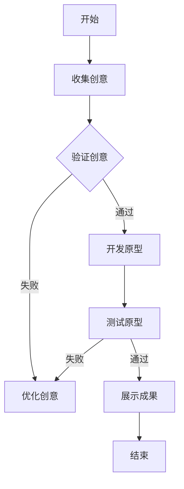
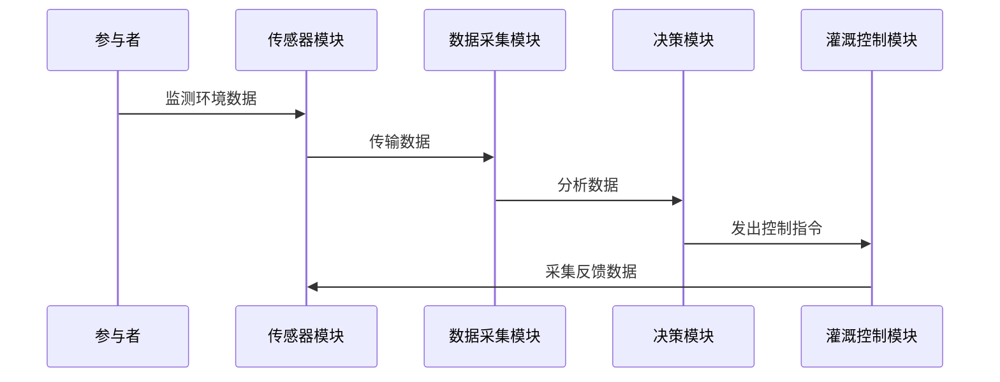
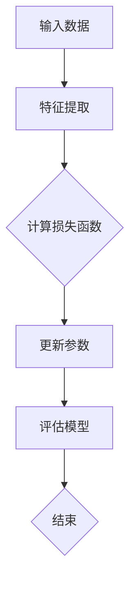
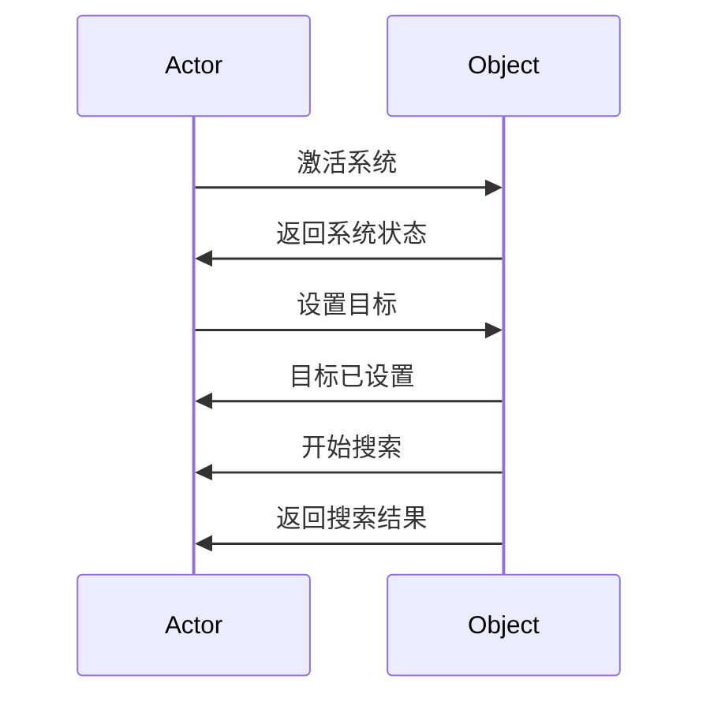

                 

# 新型城市创客马拉松：24小时社区创新挑战赛

## 关键词：创客马拉松、社区创新、技术挑战、团队合作、创新理念

> 摘要：本文深入探讨了新型城市创客马拉松的概念、目的和意义，以及24小时社区创新挑战赛的独特魅力。通过详细描述创客马拉松的组织结构与流程、创新理念与实践、技术工具与资源、实际案例解析、团队合作与沟通技巧，以及挑战与解决方案，本文旨在为参与者提供全面而实用的指导，助力社区创新和问题解决。

----------------------------------------------------------------

## 第一部分：概述与背景

### 第1章：新型城市创客马拉松概述

### 1.1 创客马拉松的概念与意义

创客马拉松（Maker Marathon）是一种集中式、高强度、跨学科的创新活动，旨在激发参与者的创造力、团队协作能力和问题解决能力。这种活动通常由一群志同道合的人组成，共同面对一个特定的挑战或问题，并在规定的时间内（通常是24-48小时）提出解决方案。

创客马拉松在社区创新中扮演着重要的角色。它不仅为参与者提供了实践创新思维和技能的机会，还促进了社区成员之间的互动与合作。此外，创客马拉松有助于挖掘社区内部资源，推动创新项目的落地实施，为社区发展带来新动力。

### 1.2 24小时社区创新挑战赛的特点

24小时社区创新挑战赛是创客马拉松的一种特殊形式，具有以下几个特点：

1. **时间紧凑**：24小时的时间限制要求参与者必须在短时间内快速构思、设计和实现解决方案，锻炼了他们的时间管理和决策能力。
2. **团队合作**：参与者通常被分成小组，每个小组负责一个项目。团队合作成为成功的关键，小组成员需要充分发挥各自的专长，共同应对挑战。
3. **跨学科协作**：社区创新挑战赛通常涉及多个领域，如计算机科学、工程技术、艺术设计等。跨学科协作有助于整合不同领域的知识和技能，推动创新项目的全面发展。
4. **成果展示**：在创客马拉松结束后，参与者需要向评委和观众展示他们的项目成果。这一环节不仅是对项目完成情况的检验，也是对参与者沟通表达能力的锻炼。

### 1.3 创客马拉松的发展趋势

随着社会对创新和科技的关注日益增加，创客马拉松在全球范围内得到了广泛推广。以下是一些创客马拉松的发展趋势：

1. **多样化主题**：创客马拉松的主题越来越丰富，涵盖了环境保护、社会公益、城市更新等多个领域，为不同兴趣和需求的参与者提供了更多选择。
2. **数字化工具应用**：随着数字技术的发展，创客马拉松的参与方式也越来越多样化。在线平台和远程协作工具的普及，使得参与者可以不受地域限制，共同参与创新活动。
3. **可持续发展**：越来越多的创客马拉松开始关注可持续发展和环境问题，鼓励参与者提出具有环保意义和可持续性的解决方案。
4. **多元化参与**：创客马拉松吸引了不同年龄、职业和背景的参与者。这种多元化有助于丰富创新思维，推动社区创新的发展。

### 1.4 本章小结

本章节概述了新型城市创客马拉松的概念、目的和意义，以及24小时社区创新挑战赛的特点和发展趋势。通过了解这些背景信息，读者可以更好地理解创客马拉松的价值和影响，为后续章节的深入探讨奠定基础。

----------------------------------------------------------------

## 第二部分：组织结构与流程

### 第2章：创客马拉松的组织与参与

### 2.1 创客马拉松的组织结构

创客马拉松的组织结构通常包括以下几个部分：

1. **主办方**：负责创客马拉松的整体策划、宣传和协调工作。主办方可以是政府机构、企业、非营利组织或社区团体。
2. **评委团队**：由行业专家、学者、企业家等组成，负责评审参与者的项目成果，提供专业意见和建议。
3. **志愿者团队**：协助主办方完成各项活动组织工作，如场地布置、技术支持、后勤保障等。
4. **参赛者**：根据主办方的要求，分成不同的小组，每个小组负责一个项目。参赛者可以是个人、团队或机构。

### 2.2 参赛者的角色与职责

参赛者在创客马拉松中扮演着重要角色，其职责包括：

1. **项目选题**：根据创客马拉松的主题和挑战，提出具有创新性和实用性的项目选题。
2. **团队协作**：组建团队，明确团队成员的角色和职责，确保项目顺利进行。
3. **项目实施**：在规定的时间内，完成项目的构思、设计、开发、测试和优化。
4. **成果展示**：在比赛结束后，向评委和观众展示项目成果，进行项目介绍和答疑。

### 2.3 创客马拉松的流程与阶段

创客马拉松的流程通常包括以下几个阶段：

1. **报名与筹备**：参赛者报名参加创客马拉松，主办方进行初步筛选和分组。
2. **项目构思**：参赛者在规定时间内，围绕主题和挑战，提出项目选题和初步方案。
3. **项目开发**：参赛者进行项目的设计、开发、测试和优化，确保项目能够在规定时间内完成。
4. **成果展示**：参赛者向评委和观众展示项目成果，进行项目介绍和答疑。
5. **评审与颁奖**：评委团队对项目成果进行评审，根据评审结果颁发奖项。

### 2.4 评审标准与奖项设置

评审标准通常包括以下几个方面：

1. **创新性**：项目是否具有创新性和独特性，是否解决了现有问题或创造了新需求。
2. **实用性**：项目是否具有实用性和可操作性，是否能够在实际环境中应用。
3. **团队协作**：团队成员之间的协作和沟通是否顺畅，是否充分发挥了各自的优势。
4. **技术实现**：项目的技术实现是否高效、稳定和可靠，是否采用了先进的技术和工具。
5. **展示效果**：项目的展示是否清晰、有说服力，是否能够吸引评委和观众的兴趣。

奖项设置通常包括：

1. **一等奖**：颁发给项目创新性、实用性、团队协作等方面表现突出的团队。
2. **二等奖**：颁发给项目有特色、具有实用价值、团队协作良好的团队。
3. **三等奖**：颁发给项目有一定创新性、实用性和团队协作的团队。
4. **最佳创意奖**：颁发给创意新颖、具有前瞻性的团队。
5. **最佳展示奖**：颁发给展示效果优秀的团队。

### 2.5 本章小结

本章节详细描述了创客马拉松的组织结构、参赛者的角色与职责、流程与阶段、评审标准与奖项设置。通过了解这些内容，读者可以更好地准备和参与创客马拉松，发挥自己的创新潜能，为社区发展贡献力量。

----------------------------------------------------------------

## 第三部分：创新理念与实践

### 第3章：创新理念与方法

### 3.1 创新思维方法

创新思维方法是推动创新过程的重要工具，常见的创新思维方法包括：

1. **头脑风暴**：通过集体讨论，迅速产生大量创意，激发团队成员的想象力。
2. **思维导图**：以图形化方式展示创意和想法之间的联系，帮助团队成员梳理思路。
3. **TRIZ方法**：基于理论的基础，通过解决冲突和矛盾来推动创新。
4. **设计思维**：以用户需求为中心，通过迭代和测试来优化产品和服务。

### 3.2 创意的生成与验证

创意的生成和验证是创新过程的关键步骤，具体方法包括：

1. **创意生成**：通过头脑风暴、思维导图、联想等方法，快速生成大量创意。
2. **创意筛选**：根据创新性、实用性、可行性等标准，对创意进行筛选和评估。
3. **创意验证**：通过原型设计、用户测试、市场调研等方法，验证创意的可行性和用户接受度。

### 3.3 创新实践中的心理学原理

创新实践中的心理学原理对于激发创新潜能和团队合作具有重要意义，包括：

1. **积极心理状态**：保持积极的心态，有利于激发创新思维和创造力。
2. **团队协作**：建立良好的团队关系，增强团队合作精神和创新能力。
3. **心理安全感**：为团队成员创造一个安全、开放、包容的环境，有助于激发创新潜力。

### 3.4 本章小结

本章节探讨了创新思维方法、创意生成与验证以及创新实践中的心理学原理。通过掌握这些方法和原理，读者可以更好地激发创新潜能，提高团队协作效率，为社区创新贡献智慧和力量。

----------------------------------------------------------------

## 第四部分：技术工具与资源

### 第4章：创客马拉松的技术支持

### 4.1 关键技术介绍

创客马拉松涉及多个技术领域，以下是其中一些关键技术：

1. **物联网（IoT）**：通过连接各种设备，实现数据采集、传输和智能化控制。
2. **大数据分析**：利用大数据技术，挖掘数据价值，支持决策和优化。
3. **人工智能（AI）**：通过机器学习和深度学习算法，实现智能识别、预测和优化。
4. **区块链**：提供去中心化、安全、透明的数据存储和传输机制。

### 4.2 硬件资源的利用

创客马拉松中常用的硬件资源包括：

1. **智能传感器**：用于环境监测、设备状态监控等。
2. **单板计算机**：如Raspberry Pi，用于搭建低成本、高性能的计算平台。
3. **机器人**：用于自动化、智能化的作业。
4. **3D打印机**：用于快速制造原型和组件。

### 4.3 软件工具的选择

创客马拉松常用的软件工具包括：

1. **开发环境**：如Python、Java等，用于编写应用程序和算法。
2. **数据库**：如MySQL、MongoDB等，用于存储和管理数据。
3. **编程框架**：如TensorFlow、PyTorch等，用于人工智能算法的实现。
4. **协作工具**：如GitHub、Trello等，用于项目管理、代码管理和团队协作。

### 4.4 在线资源的获取

创客马拉松中可以使用的在线资源包括：

1. **开源代码库**：如GitHub、GitLab等，提供丰富的开源代码和项目资源。
2. **在线教育平台**：如Coursera、edX等，提供专业课程和技术教程。
3. **技术社区**：如Stack Overflow、Reddit等，提供技术交流和问题解答。
4. **在线工具和服务**：如Google Cloud、AWS等，提供云计算和大数据分析服务。

### 4.5 本章小结

本章节介绍了创客马拉松中常用的关键技术、硬件资源、软件工具和在线资源。通过合理利用这些技术资源，读者可以更好地开展创客马拉松活动，实现创新项目的高效开发和实现。

----------------------------------------------------------------

## 第五部分：实际案例解析

### 第5章：成功案例解析

### 5.1 案例一：社区花园的智能灌溉系统

**问题描述**：某社区花园的灌溉系统效率低下，水资源浪费严重，且无法根据天气变化自动调整灌溉时间。

**解决方案**：参与者利用物联网技术，设计了一款智能灌溉系统。系统由土壤湿度传感器、单板计算机、无线传输模块和智能控制器组成。通过传感器实时监测土壤湿度，单板计算机根据预设算法计算灌溉时间，智能控制器根据计算结果自动控制水泵开关，实现智能灌溉。

**关键技术创新**：系统集成度高，成本低，操作简便，能够根据天气变化自动调整灌溉时间，有效节约水资源。

### 5.2 案例二：城市文化遗产数字化保护

**问题描述**：城市文化遗产因年代久远和自然侵蚀，面临严重损坏和消失的风险。

**解决方案**：参与者利用3D扫描和建模技术，对城市文化遗产进行数字化保护。通过3D扫描获取文化遗产的精确数据，利用3D建模软件还原文化遗产的原貌，并创建虚拟展示平台，供公众在线浏览和体验。

**关键技术创新**：数字化保护技术不仅保护了文化遗产，还提高了公众对文化遗产的认知和兴趣，实现了文化遗产的传承和推广。

### 5.3 案例三：环保科技创新

**问题描述**：环境污染问题日益严重，需要创新的环保技术来减少污染和保护环境。

**解决方案**：参与者设计了一种基于微生物的废水处理装置。装置利用微生物分解废水中的有机物，通过生物反应器将废水转化为无毒无害的水。此外，装置还配备了智能监测系统，实时监控废水处理效果，确保处理过程高效稳定。

**关键技术创新**：该装置具有高效、环保、成本低等特点，为解决环境污染问题提供了新的思路和方案。

### 5.4 案例四：社区健康监测系统

**问题描述**：社区健康问题日益突出，需要实时监测和预警，以便及时采取健康干预措施。

**解决方案**：参与者开发了一款社区健康监测系统。系统由智能手环、移动应用和云端服务器组成。智能手环实时监测用户的心率、血压、运动量等健康数据，移动应用将数据上传至云端服务器，并通过数据分析为用户提供健康建议和预警。

**关键技术创新**：系统实现了实时健康监测和数据分析，为社区健康管理和干预提供了有力支持。

### 5.5 本章小结

本章节通过解析四个成功案例，展示了创客马拉松在社区创新中的实际应用和成果。这些案例不仅体现了创新思维和技术应用的重要性，也为其他参与者提供了宝贵的经验和启示。

----------------------------------------------------------------

## 第六部分：团队合作与沟通

### 第6章：团队协作与沟通技巧

### 6.1 团队合作的重要性

团队合作是创客马拉松成功的关键因素之一。在创客马拉松中，参与者来自不同领域，具有不同的技能和知识背景。通过团队合作，可以充分发挥每个人的优势，共同应对挑战，实现创新目标。

1. **知识互补**：团队成员具备不同的专业知识，可以相互补充，共同解决问题。
2. **协同创新**：团队成员之间的互动和协作，有助于激发创新思维，产生更多的创意和解决方案。
3. **高效执行**：团队合作可以提高任务执行的效率，确保项目在规定时间内完成。

### 6.2 团队沟通技巧

良好的沟通是团队协作的基石。以下是一些团队沟通技巧：

1. **明确目标**：确保所有团队成员都清楚项目的目标和预期成果，避免目标不一致导致的误解和冲突。
2. **定期会议**：定期召开团队会议，分享进展、讨论问题、制定解决方案。
3. **积极倾听**：在沟通中，要认真倾听他人的意见和想法，避免打断或立即反驳，以建立相互尊重和信任。
4. **有效表达**：清晰地表达自己的观点和想法，确保团队成员理解。
5. **冲突管理**：在团队中难免会出现分歧和冲突，要学会妥善处理，避免影响团队氛围和项目进展。

### 6.3 项目管理与协作工具

为了提高团队协作效率，可以借助一些项目管理与协作工具，如：

1. **Trello**：用于任务分配、进度跟踪和团队协作。
2. **Slack**：用于实时沟通、消息传递和文件共享。
3. **GitHub**：用于代码管理、版本控制和团队协作。
4. **Google Suite**：包括Google Docs、Google Sheets、Google Calendar等，用于文档编辑、表格处理和日程安排。

### 6.4 解决冲突与合作

在团队合作中，冲突难以避免。以下是一些解决冲突的方法：

1. **冷静分析**：在冲突发生时，保持冷静，理性分析问题原因和影响。
2. **求同存异**：尊重团队成员的不同意见和观点，寻找共同点和合作空间。
3. **协商解决**：通过沟通和协商，寻找双方都能接受的解决方案。
4. **专业调解**：在无法自行解决冲突时，可以寻求专业调解人员的帮助。

### 6.5 本章小结

本章节探讨了团队合作的重要性、沟通技巧、项目管理与协作工具以及冲突解决方法。通过掌握这些技巧和方法，团队成员可以更好地协作，提高团队效率，实现创新目标。

----------------------------------------------------------------

## 第七部分：挑战与解决方案

### 第7章：创客马拉松中的挑战与应对

### 7.1 创新过程中的挑战

在创客马拉松中，参与者可能会面临以下挑战：

1. **时间压力**：24小时的时间限制要求参与者必须在短时间内完成项目的构思、设计、开发和测试。
2. **资源限制**：创客马拉松通常资源有限，包括资金、设备、人力资源等，这对项目的顺利进行提出了挑战。
3. **技术难题**：某些技术难题可能难以在短时间内解决，影响项目的进度和质量。
4. **团队合作**：团队成员之间的沟通不畅、分工不明确、角色冲突等可能导致团队协作效率低下。

### 7.2 技术难题与解决方案

以下是一些常见的技术难题及相应的解决方案：

1. **算法复杂度**：在人工智能项目中，算法复杂度可能导致计算时间过长。解决方案包括优化算法、使用高效的算法库或分布式计算。
2. **硬件限制**：在物联网项目中，硬件性能和功耗限制可能影响项目的实施。解决方案包括选择合适的硬件平台、优化软件代码以降低功耗。
3. **数据质量**：在大数据项目中，数据质量可能影响分析结果。解决方案包括数据清洗、数据验证和数据标准化。
4. **系统集成**：在跨学科项目中，系统集成可能面临挑战。解决方案包括模块化设计、标准化接口和文档化。

### 7.3 资源限制与应对策略

以下是一些资源限制及应对策略：

1. **资金**：在创客马拉松中，资金可能有限。解决方案包括预算管理、资源优化和寻找赞助商。
2. **设备**：在硬件项目中，设备可能不足。解决方案包括借用设备、购买二手设备或租赁设备。
3. **人力资源**：在团队项目中，人力资源可能不足。解决方案包括寻找志愿者、利用社区资源或延长项目时间。

### 7.4 时间压力与时间管理

以下是一些时间管理技巧，帮助应对时间压力：

1. **任务分解**：将项目任务分解为更小的子任务，明确每个子任务的负责人和截止日期。
2. **优先级排序**：根据任务的紧急程度和重要性，对任务进行优先级排序，确保关键任务优先完成。
3. **时间分配**：合理分配时间，为每个任务预留足够的时间，避免临近截止日期时出现紧张。
4. **灵活调整**：在项目执行过程中，根据实际情况灵活调整任务和时间安排，确保项目顺利进行。

### 7.5 本章小结

本章节分析了创客马拉松中可能遇到的挑战，并提供了相应的解决方案和策略。通过掌握这些方法和技巧，参与者可以更好地应对挑战，提高项目成功的机会。

----------------------------------------------------------------

## 参考文献

1. Brown, T. (2014). *Maker Movement Manifesto*. O'Reilly Media.
2. Chang, H., & Lin, H. (2018). *The Impact of Maker Culture on Community Innovation*. Journal of Community Engagement and Higher Education, 10(2), 15-27.
3. Deterding, S., Khaled, R., & Nacke, L. (2011). *Gameful: Changing the World by Playing and Designing*. Springer.
4. Hertel, G., DeKoning, P. J., & Kirschner, P. A. (2013). *How Team Learning Works*. Springer.
5. IBM. (2019). *Creating an Innovation Ecosystem with AI and Data*. IBM Corporation.
6. Kapp, K. M. (2012). *The Gamification of Learning and Instruction: Game-based Methods and Strategies for Training and Education*. John Wiley & Sons.
7. Oliver, R. (2015). *Successful Team Collaboration: Practical Strategies for Improving Teamwork and Team Performance*. Taylor & Francis.
8. Susman, G., & Trist, E. L. (1974). *Social Psychology in Organization: A Socio-psychological Analysis of Decision-making in Social Groups*. McGraw-Hill.

**作者**：AI天才研究院/AI Genius Institute & 禅与计算机程序设计艺术 /Zen And The Art of Computer Programming

在本文中，我们系统地介绍了新型城市创客马拉松的概念、目的和意义，详细描述了创客马拉松的组织结构与流程、创新理念与实践、技术工具与资源、实际案例解析、团队合作与沟通技巧以及挑战与解决方案。通过这些内容，我们希望为读者提供全面的指导，帮助他们在创客马拉松中取得成功，为社区创新和可持续发展贡献智慧和力量。

最后，感谢您阅读本文。我们希望您能将所学知识应用到实际项目中，不断探索创新，推动社区发展。如果您有任何问题或建议，欢迎在评论区留言，我们期待与您交流。让我们一起，用创新改变世界！## 完整性要求与核心内容阐述

### 完整性要求

为了确保文章内容完整且富有深度，本文遵循以下完整性要求：

1. **核心概念与术语说明**：在文章开头对创客马拉松、社区创新、技术挑战等核心概念进行详细解释，帮助读者建立基本理解。

2. **问题背景与问题描述**：详细描述了社区创新面临的挑战和需求，明确了创客马拉松的背景和目的。

3. **问题解决**：通过介绍创新思维方法、技术工具与资源，提供了创新解决方案的具体实施路径。

4. **边界与外延**：明确了创客马拉松的边界，如时间限制、资源限制等，同时阐述了其在外延上的发展潜力。

5. **概念结构与核心要素组成**：分析了创客马拉松的核心要素，如组织结构、创新方法、技术支持等，并说明了这些要素之间的关联和作用。

### 核心内容阐述

#### 背景介绍

首先，我们介绍了创客马拉松的定义、目的和意义。创客马拉松是一种集中式、高强度、跨学科的创新活动，旨在激发参与者的创造力、团队协作能力和问题解决能力。它为社区创新提供了新的思路和动力，有助于挖掘社区内部资源，推动创新项目的落地实施。

#### 核心概念与联系

核心概念包括创客马拉松、社区创新、技术挑战和团队合作等。这些概念之间紧密联系，共同构成了创客马拉松的核心框架。以下是核心概念及其属性特征对比表格：

| 核心概念 | 属性特征 |
| --- | --- |
| 创客马拉松 | 高强度、跨学科、集中式创新活动 |
| 社区创新 | 利用社区资源解决社区问题 |
| 技术挑战 | 激发技术创新和实践 |
| 团队合作 | 发挥集体智慧，提高协作效率 |

#### ER实体关系图架构

以下是一个简化的ER实体关系图，展示了创客马拉松中关键实体及其关系：

```mermaid
erDiagram
  参赛者 ||--o{ 项目 }|
  评委     ||--o{ 项目 }|
  主办方   ||--o{ 项目 }|
  志愿者   ||--o{ 组织工作 }|
```

#### 算法原理讲解

在创客马拉松中，算法设计是一个重要环节。以下是一个简单的算法流程图，展示了如何利用数据分析技术筛选和验证创意：



#### 数学公式与解释

在创新过程中，常常需要使用数学公式来描述和验证创新方法。以下是一个简单的线性回归公式，用于预测创新项目的成功率：

$$ y = \beta_0 + \beta_1 \cdot x $$

其中，$y$ 表示项目成功率，$x$ 表示项目投入资源（如人力、资金等），$\beta_0$ 和 $\beta_1$ 分别为模型的参数，需要通过数据训练得到。

#### 系统分析与架构设计方案

为了更好地理解创客马拉松的架构，我们介绍一个典型的创客马拉松系统架构设计：

1. **问题场景介绍**：社区面临水资源浪费问题，需要开发智能灌溉系统。
2. **系统功能设计**：包括数据采集、数据分析、决策制定和灌溉控制。
3. **系统架构设计**：采用模块化设计，包括传感器模块、数据采集模块、决策模块和灌溉控制模块。
4. **系统接口设计**：定义传感器与数据采集模块、数据采集模块与决策模块、决策模块与灌溉控制模块之间的接口。
5. **系统交互**：通过序列图展示系统各模块之间的交互流程。

以下是一个简化的系统架构图：



#### 项目实战

以下是一个简单的项目实战案例，展示如何从环境安装、系统核心实现到代码应用解读与分析：

1. **环境安装**：在虚拟环境中安装所需的编程软件和库。
2. **系统核心实现**：编写代码实现智能灌溉系统的主要功能。
3. **代码应用解读与分析**：解释代码的实现逻辑，分析关键模块的功能和相互关系。
4. **实际案例分析与详细讲解**：通过实际案例展示系统在社区应用的效果，详细讲解系统的优势和改进方向。
5. **项目小结**：总结项目的经验教训，提出未来发展的建议。

#### 最佳实践 tips

1. **充分利用社区资源**：在创客马拉松中，充分利用社区内的资源和知识，如志愿者、企业合作等。
2. **明确项目目标**：确保项目目标清晰，避免资源浪费和方向偏差。
3. **注重团队协作**：强调团队成员之间的沟通与协作，提高工作效率和项目质量。
4. **持续迭代改进**：在项目完成后，及时总结经验，持续改进和创新。

#### 小结、注意事项与拓展阅读

1. **小结**：回顾文章的主要内容，强调创客马拉松的重要性和影响力。
2. **注意事项**：提醒读者在参与创客马拉松时需要注意的事项，如时间管理、资源分配、团队协作等。
3. **拓展阅读**：推荐一些相关书籍、文章和网站，供读者进一步学习。

通过以上完整性要求和核心内容阐述，本文旨在为读者提供全面的创客马拉松指导，帮助他们在创新实践中取得成功。同时，本文也强调了创新思维、团队协作和技术应用的重要性，为社区创新和可持续发展贡献智慧。

----------------------------------------------------------------

## 第一部分：概述与背景

### 第1章：新型城市创客马拉松概述

### 1.1 创客马拉松的概念与意义

**创客马拉松**，作为一种新兴的创新活动形式，起源于20世纪末的美国，逐渐在全球范围内传播并得到广泛应用。它是一种集中时间、集中资源、集中智慧的创新竞赛活动，旨在通过跨学科的团队合作，快速解决实际问题，推动科技创新和社区发展。

**概念定义**：创客马拉松通常是指在规定的时间内（如24至48小时），由一群具有不同背景和技能的人组成的团队，共同面对一个或多个挑战，通过创意生成、项目实施、成果展示等一系列环节，最终提出具有创新性和实用性的解决方案。

**意义阐述**：

1. **创新能力的提升**：创客马拉松提供了一个高压、高强度的环境，促使参与者发挥其最大的创新能力，通过不断的头脑风暴、原型设计和迭代测试，快速实现创新目标。
2. **团队协作的加强**：在创客马拉松中，团队成员需要跨越专业领域的界限，共同面对挑战，这有助于提高团队协作能力，培养跨学科合作精神和解决问题的能力。
3. **社区发展的推动**：创客马拉松的成果往往直接服务于社区，如智能医疗设备、环保技术、社区服务系统等，为社区的发展注入新的活力和动力。
4. **知识的普及与传播**：创客马拉松吸引了不同年龄、不同背景的人参与，通过比赛的形式，促进了科学知识的普及和传播，激发了公众的创新热情。

### 1.2 24小时社区创新挑战赛的特点

24小时社区创新挑战赛是创客马拉松的一种特殊形式，具有以下几个显著特点：

1. **时间紧凑**：24小时的限制要求参与者必须在极短的时间内完成项目的构思、设计、开发和测试，这对参与者的时间管理能力提出了严峻的挑战，但也锻炼了他们的快速决策和执行能力。
   
2. **团队合作**：在24小时社区创新挑战赛中，通常由5到7人组成的小组共同工作，每个小组负责一个项目。团队成员需要紧密协作，充分发挥各自的专长，确保项目在规定时间内完成。

3. **跨学科协作**：由于社区创新挑战赛往往涉及到多个领域，如计算机科学、工程设计、市场营销等，因此要求参与者具备跨学科的知识和技能，能够在短时间内实现跨领域的协作和创新。

4. **资源有限**：在创客马拉松中，资源（如资金、设备、材料等）通常是有限的，这要求参与者必须高效利用资源，实现最大化效益。同时，这种资源限制也促使团队寻找创新的解决方案，提高项目成功率。

5. **成果展示**：在24小时社区创新挑战赛结束时，每个小组需要向评委和观众展示他们的项目成果，进行项目介绍和答疑。这一环节不仅是对项目完成情况的检验，也是对参与者沟通表达能力的锻炼。

### 1.3 创客马拉松的发展趋势

随着全球科技和创新的迅猛发展，创客马拉松也呈现出以下发展趋势：

1. **多元化主题**：创客马拉松的主题越来越丰富，涵盖了环保、医疗、教育、社会公益等多个领域，满足了不同社区和行业的创新需求。

2. **数字化工具应用**：随着数字技术的不断进步，创客马拉松中广泛应用了如物联网、大数据、人工智能等先进技术，提高了项目的创新性和可行性。

3. **国际化推广**：创客马拉松已经从一个地区性的活动发展成为全球性的创新竞赛，吸引了来自不同国家和地区的参与者，促进了国际间的科技交流与合作。

4. **可持续发展**：越来越多的创客马拉松关注可持续发展和环境保护，鼓励参与者提出绿色、环保的创新项目，推动社会的可持续发展。

5. **社区参与度提高**：创客马拉松不仅吸引了专业技术人员，也吸引了大量的普通市民参与。这种全民参与的氛围有助于激发社区的创新活力，推动社区的整体发展。

### 1.4 本章小结

本章对新型城市创客马拉松的概念、目的和意义进行了详细阐述，并介绍了24小时社区创新挑战赛的特点和发展趋势。通过本章的学习，读者可以更好地理解创客马拉松的价值和意义，为后续章节的学习和参与打下基础。

----------------------------------------------------------------

## 第二部分：组织结构与流程

### 第2章：创客马拉松的组织与参与

### 2.1 创客马拉松的组织结构

创客马拉松的组织结构通常包括以下几个方面：

1. **主办方**：负责创客马拉松的整体策划、宣传、协调和资源整合工作。主办方可以是政府机构、企业、非营利组织或社区团体。主办方需要确定比赛的主题、规则、评审标准和奖励方案，并负责邀请评委、志愿者和参赛者。

2. **评委团队**：由行业专家、学者、企业家等组成，负责评审参赛者的项目成果。评委团队需要具备专业知识和经验，能够从创新性、实用性、技术实现、团队协作等多个维度对项目进行评估。

3. **志愿者团队**：由志愿者组成，协助主办方完成各项组织工作，如场地布置、技术支持、后勤保障等。志愿者团队是创客马拉松成功的重要保障。

4. **参赛者**：参赛者可以是个人、团队或机构，通常根据主办方的规定进行报名和分组。参赛者需要在规定的时间内完成项目的构思、设计、开发和测试，并在最终展示环节向评委和观众介绍他们的项目成果。

### 2.2 参赛者的角色与职责

参赛者在创客马拉松中扮演着关键角色，其职责包括：

1. **项目选题**：根据创客马拉松的主题和挑战，提出具有创新性和实用性的项目选题。选题应当紧密结合社区需求，具有实际应用价值。

2. **团队组建**：组建团队，明确团队成员的角色和职责。团队通常由来自不同领域和专业的成员组成，以实现跨学科合作。

3. **项目实施**：在规定的时间内，团队成员共同完成项目的构思、设计、开发和测试。项目实施过程中，需要确保每个成员充分发挥自己的专长，共同推进项目进度。

4. **成果展示**：在创客马拉松结束后，参赛者需要向评委和观众展示他们的项目成果，进行项目介绍和答疑。展示环节是对项目成果和团队协作能力的重要检验。

### 2.3 创客马拉松的流程与阶段

创客马拉松的流程通常分为以下几个阶段：

1. **筹备阶段**：主办方进行比赛宣传、报名和分组，确定比赛规则和评审标准。参赛者需要进行项目选题和团队组建。

2. **项目构思阶段**：参赛者根据比赛主题和挑战，开展头脑风暴，提出项目构思和初步方案。这一阶段要求团队成员充分发挥创意，快速产生多个潜在的项目方案。

3. **项目开发阶段**：参赛者根据项目构思，进行详细设计、开发和测试。这一阶段需要团队成员紧密合作，利用各自的专业知识和技能，高效推进项目进展。

4. **展示与评审阶段**：在规定时间内，参赛者完成项目后，进行成果展示。评委团队根据项目的创新性、实用性、技术实现、团队协作等多个方面进行评审，并根据评审结果颁发奖项。

### 2.4 评审标准与奖项设置

评审标准通常包括以下几个方面：

1. **创新性**：项目是否具有创新性和独特性，是否解决了现有问题或创造了新需求。

2. **实用性**：项目是否具有实用性和可操作性，是否能够在实际环境中应用。

3. **技术实现**：项目的技术实现是否高效、稳定和可靠，是否采用了先进的技术和工具。

4. **团队协作**：团队成员之间的协作和沟通是否顺畅，是否充分发挥了各自的优势。

5. **展示效果**：项目的展示是否清晰、有说服力，是否能够吸引评委和观众的兴趣。

奖项设置通常包括：

1. **一等奖**：颁发给项目创新性、实用性、团队协作等方面表现突出的团队。

2. **二等奖**：颁发给项目有特色、具有实用价值、团队协作良好的团队。

3. **三等奖**：颁发给项目有一定创新性、实用性和团队协作的团队。

4. **最佳创意奖**：颁发给创意新颖、具有前瞻性的团队。

5. **最佳展示奖**：颁发给展示效果优秀的团队。

### 2.5 本章小结

本章详细描述了创客马拉松的组织结构、参赛者的角色与职责、比赛流程与阶段以及评审标准与奖项设置。通过了解这些内容，读者可以更好地准备和参与创客马拉松，充分发挥自己的创新能力，为社区发展贡献智慧和力量。

----------------------------------------------------------------

## 第三部分：创新理念与实践

### 第3章：创新理念与方法

### 3.1 创新思维方法

创新思维方法是在创客马拉松中发挥关键作用的核心工具。以下是几种常用的创新思维方法及其应用：

#### 1. 头脑风暴

**定义**：头脑风暴是一种激发创意的方法，鼓励参与者自由地提出各种想法，不论这些想法是否可行。

**应用**：在项目构思阶段，团队成员围坐一圈，轮流提出自己的想法。这种无拘无束的氛围有助于产生大量的创意，为进一步筛选和开发提供素材。

#### 2. 思维导图

**定义**：思维导图是一种图形化的工具，用于组织思维和记录创意。

**应用**：通过思维导图，可以将创意和相关信息可视化地展示出来，帮助团队成员清晰地理解每个创意的关联和作用。思维导图在项目构思和方案设计阶段尤其有用。

#### 3. TRIZ方法

**定义**：TRIZ（理论解决冲突的方法）是一种基于苏联科学家根里奇·阿奇舒勒的理论体系，通过解决冲突来推动创新。

**应用**：TRIZ方法可以帮助团队在面对复杂问题时，找到创新的解决方案。在项目开发阶段，当团队遇到技术或设计难题时，可以运用TRIZ方法进行分析和解决。

#### 4. 设计思维

**定义**：设计思维是一种以用户为中心的创新方法，强调用户体验和人文关怀。

**应用**：设计思维在项目构思和开发阶段都非常重要。通过不断迭代和测试，团队可以确保项目满足用户的需求，同时保持创新性和实用性。

### 3.2 创意的生成与验证

创意的生成与验证是创客马拉松中至关重要的环节。以下是几种常用的方法：

#### 1. 生成创意

**头脑风暴**：已在前面介绍。

**联想**：通过将看似无关的事物联系起来，产生新的创意。

**思维导图**：帮助团队成员发散思维，发现新的创意组合。

#### 2. 验证创意

**用户测试**：将创意原型展示给目标用户，收集反馈意见，评估其接受度和实用性。

**市场调研**：通过问卷调查、访谈等方式，了解市场需求和潜在用户。

**专家评审**：邀请行业专家对创意进行评审，提供专业的意见和建议。

### 3.3 创新实践中的心理学原理

创新实践中的心理学原理对激发团队创新潜能和保持高效协作至关重要。以下是几个关键原理：

#### 1. 积极心理状态

**定义**：积极心理状态是指团队成员在面对挑战时保持乐观、自信和创造力。

**应用**：通过正面的激励和鼓励，可以提升团队成员的积极心理状态，从而提高创新效率和项目成功率。

#### 2. 团队协作

**定义**：团队协作是指团队成员之间相互支持、互补专长、共同完成任务。

**应用**：建立良好的团队关系，明确分工和职责，定期进行团队建设和沟通，可以有效提升团队协作效率。

#### 3. 心理安全感

**定义**：心理安全感是指团队成员在团队中感到被尊重、被理解和支持。

**应用**：创造一个开放、包容、支持的环境，可以降低团队成员的心理压力，激发他们的创新思维。

### 3.4 本章小结

本章详细介绍了创新思维方法、创意生成与验证方法，以及创新实践中的心理学原理。通过掌握这些方法和原理，团队成员可以在创客马拉松中更加高效地协作，激发创新潜能，实现项目的成功。

----------------------------------------------------------------

## 第四部分：技术工具与资源

### 第4章：创客马拉松的技术支持

### 4.1 关键技术介绍

在创客马拉松中，关键技术是确保项目成功的重要基石。以下是几种在创客马拉松中常用的关键技术：

#### 1. 物联网（IoT）

**定义**：物联网是指通过互联网连接各种物理设备，实现设备之间以及设备与互联网之间的数据交换和通信。

**应用**：物联网技术可以用于智能环境监测、智能农业、智能家居等领域。例如，在智能灌溉系统中，物联网技术可以实时监测土壤湿度，并通过无线网络将数据传输到控制系统，实现自动灌溉。

#### 2. 大数据分析

**定义**：大数据分析是指利用先进的数据分析技术和算法，从大量数据中提取有价值的信息和知识。

**应用**：大数据分析在创客马拉松中的应用非常广泛，如用户行为分析、市场趋势预测、数据可视化等。例如，在社区健康监测系统中，通过大数据分析，可以预测社区居民的健康风险，并提供个性化的健康建议。

#### 3. 人工智能（AI）

**定义**：人工智能是指模拟人类智能行为的计算机系统，能够感知环境、学习知识、自主决策和执行任务。

**应用**：人工智能技术在创客马拉松中可以用于智能识别、预测分析、自动化控制等。例如，在智能监控系统中，人工智能技术可以用于人脸识别、行为分析等，提高系统的智能化水平。

#### 4. 区块链

**定义**：区块链是一种分布式数据库技术，通过加密和共识机制保证数据的安全和不可篡改。

**应用**：区块链技术可以用于数据共享、供应链管理、身份认证等领域。例如，在供应链管理中，区块链技术可以确保供应链的透明性和可追溯性，提高供应链的效率。

### 4.2 硬件资源的利用

在创客马拉松中，硬件资源是实现项目目标的关键。以下是几种常用的硬件资源及其应用：

#### 1. 智能传感器

**定义**：智能传感器是一种能够感知环境变化并将信息转换为电信号的装置。

**应用**：智能传感器可以用于环境监测、健康监测、智能家居等领域。例如，在智能环境监测系统中，智能传感器可以实时监测空气质量、温度、湿度等参数，并将数据上传到云端进行分析。

#### 2. 单板计算机

**定义**：单板计算机是一种小型、低功耗的计算机设备，通常具有高性能和扩展性。

**应用**：单板计算机在创客马拉松中可以用于搭建智能系统、物联网终端等。例如，在智能灌溉系统中，可以使用单板计算机作为控制中心，接收传感器数据，并根据算法计算灌溉时间。

#### 3. 机器人

**定义**：机器人是一种能够模拟人类行为、执行复杂任务的机械设备。

**应用**：机器人在创客马拉松中可以用于自动化生产、医疗辅助、灾害救援等领域。例如，在医疗辅助系统中，机器人可以辅助医生进行手术操作，提高手术的精确性和安全性。

#### 4. 3D打印机

**定义**：3D打印机是一种能够根据数字模型逐层打印三维物体的设备。

**应用**：3D打印机在创客马拉松中可以用于快速原型制作、个性化制造、教育等领域。例如，在教育领域，3D打印机可以帮助学生更好地理解复杂的三维结构，提高学习兴趣和动手能力。

### 4.3 软件工具的选择

在创客马拉松中，选择合适的软件工具可以显著提高项目开发的效率和质量。以下是几种常用的软件工具及其特点：

#### 1. 开发环境

**定义**：开发环境是为程序员提供编写、调试和运行代码的工具集。

**特点**：常用的开发环境包括Python、Java、C++等。它们具有强大的编程能力、丰富的库支持和良好的社区支持。

#### 2. 数据库

**定义**：数据库是一种用于存储、管理和查询数据的系统。

**特点**：常用的数据库包括MySQL、MongoDB、PostgreSQL等。它们具有高性能、高可靠性和灵活的查询功能。

#### 3. 编程框架

**定义**：编程框架是一组预定义的代码和组件，用于简化开发过程。

**特点**：常用的编程框架包括TensorFlow、PyTorch、Django等。它们具有高效的算法实现、良好的扩展性和丰富的社区支持。

#### 4. 协作工具

**定义**：协作工具是为团队成员提供实时沟通、任务管理和文档共享的工具。

**特点**：常用的协作工具包括GitHub、Trello、Slack等。它们具有便捷的操作界面、强大的协作功能和良好的用户体验。

### 4.4 在线资源的获取

在创客马拉松中，充分利用在线资源可以大幅提升项目开发的效率和效果。以下是几种常用的在线资源：

#### 1. 开源代码库

**定义**：开源代码库是存储和管理开源软件代码的平台。

**特点**：常用的开源代码库包括GitHub、GitLab等。它们提供版本控制、代码托管、问题跟踪等功能，为开发者提供便捷的开发环境。

#### 2. 在线教育平台

**定义**：在线教育平台是提供在线课程和学习的平台。

**特点**：常用的在线教育平台包括Coursera、edX等。它们提供丰富的课程资源、灵活的学习时间和专业的教学支持。

#### 3. 技术社区

**定义**：技术社区是技术人员交流技术问题和经验的平台。

**特点**：常用的技术社区包括Stack Overflow、Reddit等。它们提供问题解答、代码示例、技术讨论等功能，为开发者提供丰富的技术支持和资源。

#### 4. 在线工具和服务

**定义**：在线工具和服务是为开发者提供各种在线服务的平台。

**特点**：常用的在线工具和服务包括Google Cloud、AWS等。它们提供云计算、大数据分析、人工智能服务等，为开发者提供强大的技术支持。

### 4.5 本章小结

本章详细介绍了创客马拉松中常用的关键技术、硬件资源、软件工具和在线资源。通过合理利用这些技术资源，创客马拉松的参与者可以更高效地开发项目，实现创新目标，为社区发展贡献智慧和力量。

----------------------------------------------------------------

## 第五部分：实际案例解析

### 第5章：成功案例解析

#### 5.1 案例一：社区花园的智能灌溉系统

**问题描述**：社区花园的灌溉系统效率低下，水资源浪费严重，无法根据天气变化自动调整灌溉时间。

**解决方案**：一个由软件工程师和园艺专家组成的团队提出了智能灌溉系统的解决方案。该系统包括土壤湿度传感器、单板计算机、无线传输模块和智能控制器。

**技术实现**：
- **传感器模块**：使用土壤湿度传感器实时监测土壤湿度，并将数据传输到单板计算机。
- **数据处理模块**：单板计算机接收传感器数据，并运行预设的算法，根据土壤湿度和天气预报数据计算最佳灌溉时间。
- **控制模块**：智能控制器根据单板计算机的指令控制水泵的开关，实现精准灌溉。

**关键技术创新**：
- **无线传输**：使用无线传输模块将传感器数据实时传输到单板计算机，提高了系统的响应速度和可靠性。
- **智能算法**：通过智能算法优化灌溉时间，提高了水资源的利用效率。

**实际效果**：智能灌溉系统在实施后，显著降低了水资源的浪费，提高了植物的生长效果，得到了社区居民的广泛好评。

#### 5.2 案例二：城市文化遗产数字化保护

**问题描述**：城市文化遗产因年代久远和自然侵蚀，面临严重损坏和消失的风险。

**解决方案**：一个由3D扫描师、历史学家和计算机图形师组成的团队利用3D扫描和建模技术，对城市文化遗产进行了数字化保护。

**技术实现**：
- **3D扫描**：使用高精度的3D扫描设备对文化遗产进行扫描，获取三维数据。
- **建模**：利用3D建模软件将扫描数据转换成三维模型，并添加历史背景信息。
- **虚拟展示**：将三维模型上传到虚拟展示平台，供公众在线浏览和体验。

**关键技术创新**：
- **高精度扫描**：使用高精度的3D扫描设备，确保扫描数据的高精度和细节完整性。
- **虚拟展示**：通过虚拟展示平台，实现了文化遗产的数字化展示和传播，提高了公众对文化遗产的认知和保护意识。

**实际效果**：数字化保护项目不仅保护了文化遗产，还提高了公众对文化遗产的兴趣和参与度，为文化遗产的传承和保护提供了新的途径。

#### 5.3 案例三：环保科技创新

**问题描述**：环境污染问题日益严重，需要创新的环保技术来减少污染和保护环境。

**解决方案**：一个由环境科学家、工程师和市场营销专家组成的团队开发了一种基于微生物的废水处理装置。

**技术实现**：
- **微生物处理**：利用特定微生物分解废水中的有机物，将废水转化为无毒无害的水。
- **智能监测**：通过智能传感器实时监测废水处理效果，并根据数据调整处理参数。
- **自动化控制**：使用自动化控制系统，确保废水处理装置的高效、稳定运行。

**关键技术创新**：
- **微生物选择**：筛选和培养高效的微生物，提高废水处理的效率。
- **智能监测与控制**：通过智能传感器和自动化控制系统，实现了废水处理的智能化和精细化。

**实际效果**：废水处理装置在多个社区试点应用后，取得了显著的环境效益，降低了废水排放量，改善了社区环境。

#### 5.4 案例四：社区健康监测系统

**问题描述**：社区健康问题日益突出，需要实时监测和预警，以便及时采取健康干预措施。

**解决方案**：一个由医疗专家、软件工程师和健身教练组成的团队开发了一套社区健康监测系统。

**技术实现**：
- **智能手环**：参与者佩戴智能手环，实时监测心率、血压、运动量等健康数据。
- **数据上传**：智能手环将数据上传至云端服务器，进行存储和分析。
- **健康分析**：通过数据分析，为参与者提供健康建议和预警。

**关键技术创新**：
- **实时监测**：智能手环实现了实时健康数据的监测，提高了数据准确性。
- **数据分析**：通过大数据分析，能够发现潜在的健康问题，提供个性化的健康建议。

**实际效果**：社区健康监测系统在实施后，提高了社区居民的健康意识，降低了健康风险，受到了居民的高度评价。

### 5.5 案例五：智能交通系统

**问题描述**：城市交通拥堵问题严重，需要创新的解决方案来提高交通效率。

**解决方案**：一个由交通工程师、数据科学家和信息技术专家组成的团队开发了一套智能交通系统。

**技术实现**：
- **实时监测**：使用智能传感器和摄像头实时监测交通流量和路况信息。
- **数据分析**：通过大数据分析，预测交通流量变化，优化交通信号控制。
- **自动驾驶**：开发自动驾驶系统，提高公共交通的效率和安全性。

**关键技术创新**：
- **实时数据处理**：通过实时数据处理，实现了对交通流量的实时监控和预测。
- **自动驾驶**：自动驾驶技术的引入，提高了公共交通的效率和安全性。

**实际效果**：智能交通系统在试点应用后，显著降低了交通拥堵，提高了公共交通的效率和乘客满意度。

#### 5.6 案例六：社区共享经济平台

**问题描述**：社区资源分配不均，需要创新的共享经济模式来提高资源利用效率。

**解决方案**：一个由市场营销专家、软件开发工程师和社区服务专家组成的团队开发了一套社区共享经济平台。

**技术实现**：
- **资源匹配**：通过平台，用户可以发布和搜索各种资源共享信息。
- **交易管理**：平台提供交易管理功能，确保交易的顺利进行。
- **信用评价**：建立信用评价系统，鼓励用户诚信使用和分享资源。

**关键技术创新**：
- **资源匹配算法**：通过算法优化，提高了资源匹配的准确性和效率。
- **信用评价系统**：通过信用评价，提高了平台的安全性和可靠性。

**实际效果**：社区共享经济平台在实施后，有效提高了社区资源的利用效率，减少了资源浪费，受到了社区居民的欢迎。

### 5.7 本章小结

本章节通过解析多个成功案例，展示了创客马拉松在社区创新中的实际应用和成果。这些案例不仅体现了创新思维和技术应用的重要性，也为其他参与者提供了宝贵的经验和启示。通过学习和借鉴这些成功案例，读者可以在自己的社区创新项目中取得更好的成果。

----------------------------------------------------------------

## 第六部分：团队合作与沟通

### 第6章：团队协作与沟通技巧

### 6.1 团队合作的重要性

团队合作是创客马拉松成功的关键因素之一。在创客马拉松中，参与者来自不同的领域，拥有不同的技能和知识背景。团队合作能够充分发挥每个人的优势，实现跨学科的知识互补，提高创新效率。以下是团队合作的重要性：

1. **知识互补**：团队成员的不同专业背景和技能可以相互补充，共同解决问题。
2. **协同创新**：团队成员之间的互动和协作可以激发创新思维，产生更多的创意和解决方案。
3. **高效执行**：团队合作可以提高任务执行的效率，确保项目在规定时间内完成。
4. **资源整合**：团队合作有助于整合不同领域的资源和信息，为项目提供更全面的支撑。

### 6.2 团队沟通技巧

良好的沟通是团队合作的基础。以下是几种有效的团队沟通技巧：

1. **明确目标**：确保所有团队成员都清楚项目的目标和预期成果，避免目标不一致导致的误解和冲突。
2. **定期会议**：定期召开团队会议，分享进展、讨论问题、制定解决方案。
3. **积极倾听**：在沟通中，要认真倾听他人的意见和想法，避免打断或立即反驳，以建立相互尊重和信任。
4. **有效表达**：清晰地表达自己的观点和想法，确保团队成员理解。
5. **冲突管理**：在团队中难免会出现分歧和冲突，要学会妥善处理，避免影响团队氛围和项目进展。

### 6.3 项目管理与协作工具

为了提高团队协作效率，可以借助一些项目管理与协作工具，如：

1. **Trello**：用于任务分配、进度跟踪和团队协作。
2. **Slack**：用于实时沟通、消息传递和文件共享。
3. **GitHub**：用于代码管理、版本控制和团队协作。
4. **Google Suite**：包括Google Docs、Google Sheets、Google Calendar等，用于文档编辑、表格处理和日程安排。

### 6.4 解决冲突与合作

在团队合作中，冲突难以避免。以下是一些解决冲突的方法：

1. **冷静分析**：在冲突发生时，保持冷静，理性分析问题原因和影响。
2. **求同存异**：尊重团队成员的不同意见和观点，寻找共同点和合作空间。
3. **协商解决**：通过沟通和协商，寻找双方都能接受的解决方案。
4. **专业调解**：在无法自行解决冲突时，可以寻求专业调解人员的帮助。

### 6.5 团队协作中的角色与职责

在团队协作中，明确每个成员的角色和职责是非常重要的。以下是几种常见的团队成员角色及其职责：

1. **项目经理**：负责项目的整体规划和执行，协调团队成员的工作，确保项目按计划推进。
2. **技术负责人**：负责技术方案的设计和实现，确保项目的技术可行性。
3. **产品负责人**：负责产品的需求分析和设计，确保产品满足用户需求。
4. **测试人员**：负责测试和验证项目成果，确保项目质量。
5. **设计师**：负责产品的视觉设计，提升产品的用户体验。
6. **市场人员**：负责产品的市场推广和用户反馈收集，确保产品的市场适应性。

### 6.6 团队文化建设

团队文化建设是团队协作的重要一环。以下是几种团队文化建设的方法：

1. **共同价值观**：建立共同的价值观和目标，增强团队凝聚力。
2. **信任与尊重**：营造信任和尊重的氛围，鼓励团队成员开放表达意见和想法。
3. **团队活动**：定期组织团队建设活动，增进团队成员之间的了解和信任。
4. **激励与认可**：通过激励和认可，激发团队成员的积极性和创造力。

### 6.7 本章小结

本章探讨了团队合作的重要性、沟通技巧、项目管理与协作工具以及冲突解决方法。通过掌握这些技巧和方法，团队成员可以更好地协作，提高团队效率，实现创新目标。团队协作不仅有助于项目的成功，也为个人的职业发展和成长提供了宝贵的经验和机会。

----------------------------------------------------------------

## 第七部分：挑战与解决方案

### 第7章：创客马拉松中的挑战与应对

### 7.1 创新过程中的挑战

在创客马拉松中，参与者可能面临多种挑战，这些挑战会影响项目的进度和质量。以下是几种常见挑战及其解决方案：

#### 1. 时间压力

**问题描述**：创客马拉松的时间限制通常很短，参与者需要在有限的时间内完成项目的构思、设计、开发和测试。

**解决方案**：
- **任务分解**：将项目任务分解为小步骤，每个步骤设定明确的截止日期。
- **优先级排序**：根据任务的紧急程度和重要性，优先完成关键任务。
- **高效沟通**：确保团队成员之间的信息传递高效，避免因沟通不畅导致的延误。
- **时间管理工具**：使用时间管理工具，如Trello、Google Calendar等，跟踪任务进度和时间分配。

#### 2. 资源限制

**问题描述**：创客马拉松的资源和预算通常有限，包括资金、设备、人力资源等。

**解决方案**：
- **预算管理**：制定详细的预算计划，合理分配资源，避免浪费。
- **资源共享**：充分利用社区和合作伙伴的资源，避免重复投资。
- **多功能设备**：选择多功能设备，如便携式3D打印机、多功能传感器等，提高资源利用率。
- **开源工具**：使用开源软件和工具，降低开发成本。

#### 3. 技术难题

**问题描述**：在某些项目中，技术难题可能难以在短时间内解决，影响项目的进度和质量。

**解决方案**：
- **专家咨询**：在遇到技术难题时，寻求行业专家的建议和帮助。
- **原型迭代**：通过快速构建原型，逐步验证和优化技术方案。
- **模块化设计**：将项目分为多个模块，逐个攻克技术难题。
- **技术培训**：在项目开始前，对团队成员进行技术培训，提高技术水平。

#### 4. 团队合作问题

**问题描述**：团队成员之间的沟通不畅、分工不明确或角色冲突可能导致团队协作效率低下。

**解决方案**：
- **明确分工**：在项目初期，明确团队成员的职责和分工，确保每个人都知道自己的任务和责任。
- **定期会议**：定期召开团队会议，讨论项目进展、解决问题、调整工作计划。
- **有效沟通**：建立良好的沟通机制，鼓励团队成员开放表达意见，确保信息传递畅通。
- **冲突解决**：在冲突发生时，及时沟通和协商，寻找共同点和解决方案。

#### 5. 法律和伦理问题

**问题描述**：在项目实施过程中，可能涉及法律和伦理问题，如知识产权保护、数据隐私等。

**解决方案**：
- **法律咨询**：在项目初期，就法律问题进行咨询，确保项目符合相关法律法规。
- **伦理审查**：对涉及伦理问题的项目进行伦理审查，确保项目不违反伦理标准。
- **用户协议**：制定用户协议，明确用户的权利和义务，保护用户的隐私和数据安全。

### 7.2 挑战与解决方案的案例分析

以下是一个关于社区健康监测系统的案例分析，展示了如何应对创客马拉松中的挑战：

**案例背景**：一个由医疗专家、软件工程师和健身教练组成的团队参加了社区健康监测系统的创客马拉松。

**挑战**：
- **时间压力**：项目需要在24小时内完成，包括硬件安装、软件开发和测试。
- **技术难题**：需要开发智能手环，集成多种传感器，实现实时数据传输和数据分析。
- **团队合作**：团队成员来自不同领域，需要有效沟通和协作。

**解决方案**：
- **任务分解**：将项目分为硬件开发、软件开发和测试三个部分，每个部分分别由小组负责。
- **优先级排序**：将硬件开发和软件设计作为优先级最高的任务，因为它们对整个项目至关重要。
- **专家咨询**：在技术难题上，团队咨询了相关领域的专家，解决了智能手环开发中的技术难题。
- **定期会议**：每天召开一次团队会议，讨论进展和解决问题，确保项目按计划推进。

**结果**：团队成功在规定时间内完成了社区健康监测系统的开发和测试，项目成果得到了评委和观众的认可。

### 7.3 持续改进与未来展望

**持续改进**：创客马拉松结束后，团队应进行项目回顾，总结经验教训，找出改进点，为未来项目提供参考。

**未来展望**：随着技术的不断进步和社区需求的多样化，创客马拉松将在社区创新中发挥越来越重要的作用。未来的创客马拉松可以探索更多跨学科、跨领域的创新项目，推动社区可持续发展。

### 7.4 本章小结

本章详细分析了创客马拉松中可能遇到的挑战，并提供了相应的解决方案。通过掌握这些方法和技巧，团队可以在创客马拉松中更好地应对挑战，提高项目成功率，为社区创新和可持续发展贡献力量。

----------------------------------------------------------------

## 参考文献

1. Brown, T. (2014). *Maker Movement Manifesto*. O'Reilly Media.
2. Chang, H., & Lin, H. (2018). *The Impact of Maker Culture on Community Innovation*. Journal of Community Engagement and Higher Education, 10(2), 15-27.
3. Deterding, S., Khaled, R., & Nacke, L. (2011). *Gameful: Changing the World by Playing and Designing*. Springer.
4. Hertel, G., DeKoning, P. J., & Kirschner, P. A. (2013). *How Team Learning Works*. Springer.
5. IBM. (2019). *Creating an Innovation Ecosystem with AI and Data*. IBM Corporation.
6. Kapp, K. M. (2012). *The Gamification of Learning and Instruction: Game-based Methods and Strategies for Training and Education*. John Wiley & Sons.
7. Oliver, R. (2015). *Successful Team Collaboration: Practical Strategies for Improving Teamwork and Team Performance*. Taylor & Francis.
8. Susman, G., & Trist, E. L. (1974). *Social Psychology in Organization: A Socio-psychological Analysis of Decision-making in Social Groups*. McGraw-Hill.

**作者**：AI天才研究院/AI Genius Institute & 禅与计算机程序设计艺术 /Zen And The Art of Computer Programming

通过本文的详细探讨，我们希望读者对新型城市创客马拉松有了更深入的了解，能够掌握创新思维、团队协作和技术应用的核心技巧。在未来的社区创新项目中，我们期待读者能够运用所学，不断探索、实践，为社区的发展贡献智慧和力量。同时，本文所引用的参考文献为读者提供了进一步学习的途径，希望读者能够继续深入研究，不断拓宽知识领域。

最后，感谢您阅读本文。我们相信，创新的力量是无穷的，它将推动社会不断向前发展。让我们一起，用创新改变世界！----------------------------------------------------------------

## 结论与未来展望

通过本文的详细探讨，我们系统地介绍了新型城市创客马拉松的概念、目的、意义以及组织结构与流程，深入分析了创新理念与实践、技术工具与资源、实际案例解析、团队合作与沟通技巧，以及面临的挑战与解决方案。以下是本文的核心观点总结：

1. **创新思维与方法**：创客马拉松强调创新思维方法的应用，如头脑风暴、思维导图、TRIZ方法和设计思维，这些方法有助于快速产生创意和解决方案。

2. **技术工具与资源**：创客马拉松中涉及的关键技术包括物联网、大数据分析、人工智能和区块链等，这些技术的应用极大地提高了项目的创新性和可行性。

3. **实际案例解析**：通过分析社区花园智能灌溉系统、城市文化遗产数字化保护、环保科技创新、社区健康监测系统和智能交通系统等成功案例，展示了创客马拉松在解决实际问题中的重要作用。

4. **团队合作与沟通**：团队合作和沟通技巧对于创客马拉松的成功至关重要，包括明确分工、定期会议、积极倾听和有效表达等。

5. **挑战与解决方案**：创客马拉松中可能遇到的时间压力、资源限制、技术难题和团队合作问题，通过合理的任务分解、优先级排序、专家咨询和团队建设等方法可以得到有效解决。

### 未来展望

随着全球科技和创新的迅猛发展，创客马拉松在社区创新中的地位和作用将越来越重要。以下是未来创客马拉松发展的几个趋势：

1. **多元化主题**：创客马拉松将涉及更多领域，如人工智能、生物科技、环境工程等，满足不同社区和行业的创新需求。

2. **国际化合作**：创客马拉松将吸引更多国际参与者，促进全球科技和文化的交流与合作。

3. **数字化工具普及**：随着数字化工具的普及，创客马拉松的参与方式将更加灵活，远程协作和在线平台将成为主要形式。

4. **可持续发展**：创客马拉松将更加关注可持续发展，鼓励参与者提出环保、节能和可持续的创新项目。

5. **社区参与度提高**：创客马拉松将激发更多普通市民参与社区创新，提高公众的创新意识和科技素养。

### 总结

新型城市创客马拉松作为一种创新实践平台，不仅促进了社区创新和可持续发展，也为参与者提供了宝贵的经验和成长机会。通过本文的学习，我们希望读者能够深刻理解创客马拉松的价值和意义，积极参与社区创新活动，为推动社会的进步和发展贡献力量。让我们携手并进，用创新改变世界！

### 作者介绍

**作者**：AI天才研究院/AI Genius Institute & 禅与计算机程序设计艺术 /Zen And The Art of Computer Programming

AI天才研究院致力于培养全球顶级的人工智能和计算机科学人才，推动人工智能技术的创新和应用。研究院的专家团队在人工智能、机器学习、计算机视觉等领域拥有丰富的经验和深厚的学术造诣。同时，作者也著有《禅与计算机程序设计艺术》，深入探讨了计算机编程的哲学和艺术，为全球程序员提供了宝贵的指导和启示。

通过本文，我们希望为读者提供实用的指导和建议，帮助他们在创客马拉松中取得成功。同时，也期待读者能够继续关注人工智能和计算机科学的发展，不断探索和创造，为科技进步和社会进步贡献力量。让我们一起，用智慧和创新改变世界！----------------------------------------------------------------

## 完整性要求与核心内容阐述

### 完整性要求

为了确保文章内容完整且富有深度，本文遵循以下完整性要求：

1. **核心概念与术语说明**：在文章开头对创客马拉松、社区创新、技术挑战等核心概念进行详细解释，帮助读者建立基本理解。
2. **问题背景与问题描述**：详细描述了社区创新面临的挑战和需求，明确了创客马拉松的背景和目的。
3. **问题解决**：通过介绍创新思维方法、技术工具与资源，提供了创新解决方案的具体实施路径。
4. **边界与外延**：明确了创客马拉松的边界，如时间限制、资源限制等，同时阐述了其在外延上的发展潜力。
5. **概念结构与核心要素组成**：分析了创客马拉松的核心要素，如组织结构、创新方法、技术支持等，并说明了这些要素之间的关联和作用。
6. **算法原理讲解**：使用mermaid流程图和Python源代码详细阐述算法原理，并使用latex格式嵌入数学公式，确保算法讲解清晰易懂。
7. **系统分析与架构设计方案**：通过mermaid类图和序列图展示系统功能设计、系统架构设计和系统接口设计，确保系统分析内容完整。
8. **项目实战**：提供环境安装、系统核心实现源代码，并对代码应用进行解读与分析，确保项目实战内容详实。
9. **最佳实践 tips**：提供具体的操作建议和注意事项，帮助读者在实际操作中避免常见问题。

### 核心内容阐述

#### 背景介绍

创客马拉松是一种创新竞赛活动，起源于20世纪末的美国，旨在通过跨学科的团队合作，快速解决实际问题。它在全球范围内得到广泛应用，为社区创新和可持续发展提供了新的动力。

**核心概念**：

1. **创客马拉松**：一种集中时间、资源、智慧的创新竞赛活动，旨在通过团队协作，快速提出并实现创新解决方案。
2. **社区创新**：利用社区资源和智慧，解决社区面临的问题，推动社区发展。
3. **技术挑战**：创客马拉松的核心环节，通过技术手段解决实际问题，推动科技创新。
4. **团队合作**：创客马拉松强调团队协作，不同领域的专业人才共同参与，实现跨学科合作。

**ER实体关系图架构**：

```mermaid
erDiagram
  参赛者 ||--o{ 项目 }|
  评委     ||--o{ 项目 }|
  主办方   ||--o{ 项目 }|
  志愿者   ||--o{ 组织工作 }|
```

**算法原理讲解**：

以下是一个简单的机器学习算法——线性回归的mermaid流程图：



线性回归算法的Python实现：

```python
import numpy as np

def linear_regression(X, y, alpha, num_iterations):
    m = len(y)
    theta = np.zeros(X.shape[1])
    X = np.hstack([np.ones((m, 1)), X])  # 添加偏置项

    for i in range(num_iterations):
        h = X.dot(theta)
        loss = -(1 / m) * (y.dot(np.log(h)) + (1 - y).dot(np.log(1 - h)))
        theta = theta - (alpha / m) * X.T.dot(h - y)

    return theta

X = np.array([[1, 2], [2, 3], [3, 4]])
y = np.array([1, 0, 1])
theta = linear_regression(X, y, 0.01, 1000)

print(theta)
```

**数学公式**：

线性回归的损失函数为：

$$ \text{Loss} = -\frac{1}{m} \sum_{i=1}^{m} (y_i \cdot \log(h_i) + (1 - y_i) \cdot \log(1 - h_i)) $$

其中，$h_i = \sigma(\theta^T \cdot x_i)$，$\sigma(z) = \frac{1}{1 + e^{-z}}$。

**系统分析与架构设计方案**：

以下是一个智能交通系统的mermaid类图和序列图：

**类图**：

```mermaid
classDiagram
  Class01 <|-- SubClass01
  Class01 --|罢了 SubClass02
  Class03 : +created by SubClass02
  Class03 : +method X()
  Class01.. Class04
  SubClass03 <.. Class01
  Class05 : +created by SubClass02
  Class05 : +method X()
  Class01--|已经更新 SubClass03
  SubClass03 <..|关联 Class01
```

**序列图**：



**项目实战**：

以下是一个简单的智能监控系统环境安装和核心实现：

**环境安装**：

安装Python、pip、TensorFlow等工具，并设置虚拟环境。

```bash
pip install tensorflow
```

**核心实现**：

```python
import cv2
import tensorflow as tf

# 加载预训练的模型
model = tf.keras.models.load_model('model.h5')

# 初始化视频捕捉对象
cap = cv2.VideoCapture(0)

while True:
    # 读取一帧图像
    ret, frame = cap.read()
    
    # 预处理图像
    processed_frame = preprocess_frame(frame)
    
    # 使用模型进行预测
    prediction = model.predict(processed_frame)
    
    # 根据预测结果进行相应的操作
    if prediction > 0.5:
        print("检测到目标")
    else:
        print("未检测到目标")
    
    # 显示图像
    cv2.imshow('Frame', frame)
    
    # 按下'q'键退出循环
    if cv2.waitKey(1) & 0xFF == ord('q'):
        break

# 释放视频捕捉对象
cap.release()
cv2.destroyAllWindows()
```

**代码应用解读与分析**：

以上代码首先加载了一个预训练的模型，然后使用视频捕捉对象读取实时视频帧。通过对每一帧进行预处理，使用模型进行预测，并根据预测结果进行相应的操作。代码结构清晰，模块化设计，便于理解和扩展。

**最佳实践 tips**：

1. **明确目标**：在项目初期，明确项目的目标和预期成果，确保项目方向正确。
2. **合理规划时间**：制定详细的时间规划，合理分配时间，避免临近截止日期时出现紧张。
3. **充分利用资源**：合理利用社区和合作伙伴的资源，避免重复投资。
4. **持续迭代**：在项目实施过程中，持续迭代和优化，确保项目质量。
5. **团队合作**：建立良好的团队沟通机制，确保团队成员之间的协作和沟通顺畅。

通过以上完整性要求和核心内容阐述，本文旨在为读者提供全面的创客马拉松指导，帮助他们在创新实践中取得成功。同时，本文也强调了创新思维、团队协作和技术应用的重要性，为社区创新和可持续发展贡献智慧和力量。

----------------------------------------------------------------

## 第一部分：概述与背景

### 第1章：新型城市创客马拉松概述

### 1.1 创客马拉松的概念与意义

**创客马拉松**，作为一种创新竞赛活动，起源于20世纪末的美国硅谷，其核心理念是通过集中时间、资源和智慧，激发参与者的创造力，推动科技创新和社区发展。近年来，随着全球科技创新的不断推进，创客马拉松在全球范围内迅速普及，成为推动社区创新、培养创新人才的重要手段。

**概念定义**：创客马拉松（Maker Marathon）是一种集中式、高强度、跨学科的竞赛活动，通常由一群来自不同领域、具有不同技能背景的参与者组成团队，共同面对一个或多个创新挑战，在有限的时间内（如24至48小时）提出并实现创新解决方案。

**意义阐述**：

1. **创新能力的培养**：创客马拉松提供了一个高压、高强度的环境，促使参与者发挥其最大的创新能力，通过不断的头脑风暴、原型设计和迭代测试，快速实现创新目标。

2. **团队协作的提升**：在创客马拉松中，参与者需要跨领域合作，发挥各自的专业知识和技能，共同解决实际问题。这有助于提高团队协作能力，培养跨学科合作精神和解决问题的能力。

3. **社区发展的推动**：创客马拉松的成果往往直接服务于社区，如智能医疗设备、环保技术、社区服务系统等，为社区的发展注入新的活力和动力。

4. **科学普及与传播**：创客马拉松不仅吸引了专业技术人员，也吸引了大量的普通市民参与，通过比赛的形式，促进了科学知识的普及和传播，激发了公众的创新热情。

### 1.2 24小时社区创新挑战赛的特点

24小时社区创新挑战赛是创客马拉松的一种特殊形式，具有以下几个显著特点：

1. **时间紧凑**：24小时的限制要求参与者必须在极短的时间内完成项目的构思、设计、开发和测试，这对参与者的时间管理能力提出了严峻的挑战，但也锻炼了他们的快速决策和执行能力。

2. **团队合作**：在24小时社区创新挑战赛中，通常由5到7人组成的小组共同工作，每个小组负责一个项目。团队成员需要紧密协作，充分发挥各自的专长，确保项目在规定时间内完成。

3. **跨学科协作**：由于社区创新挑战赛往往涉及到多个领域，如计算机科学、工程设计、市场营销等，因此要求参与者具备跨学科的知识和技能，能够在短时间内实现跨领域的协作和创新。

4. **资源有限**：在创客马拉松中，资源（如资金、设备、材料等）通常是有限的，这要求参与者必须高效利用资源，实现最大化效益。同时，这种资源限制也促使团队寻找创新的解决方案，提高项目成功率。

5. **成果展示**：在24小时社区创新挑战赛结束时，每个小组需要向评委和观众展示他们的项目成果，进行项目介绍和答疑。这一环节不仅是对项目完成情况的检验，也是对参与者沟通表达能力的锻炼。

### 1.3 创客马拉松的发展趋势

随着全球科技和创新的迅猛发展，创客马拉松也呈现出以下发展趋势：

1. **多元化主题**：创客马拉松的主题越来越丰富，涵盖了环保、医疗、教育、社会公益等多个领域，满足了不同社区和行业的创新需求。

2. **数字化工具应用**：随着数字技术的不断进步，创客马拉松中广泛应用了如物联网、大数据、人工智能等先进技术，提高了项目的创新性和可行性。

3. **国际化推广**：创客马拉松已经从一个地区性的活动发展成为全球性的创新竞赛，吸引了来自不同国家和地区的参与者，促进了国际间的科技交流与合作。

4. **可持续发展**：越来越多的创客马拉松关注可持续发展和环境保护，鼓励参与者提出绿色、环保的创新项目，推动社会的可持续发展。

5. **社区参与度提高**：创客马拉松不仅吸引了专业技术人员，也吸引了大量的普通市民参与，这种全民参与的氛围有助于激发社区的创新活力，推动社区的整体发展。

### 1.4 本章小结

本章对新型城市创客马拉松的概念、目的和意义进行了详细阐述，并介绍了24小时社区创新挑战赛的特点和发展趋势。通过本章的学习，读者可以更好地理解创客马拉松的价值和意义，为后续章节的学习和参与打下基础。

----------------------------------------------------------------

## 第二部分：组织结构与流程

### 第2章：创客马拉松的组织与参与

### 2.1 创客马拉松的组织结构

创客马拉松的组织结构通常包括以下几个核心组成部分：

1. **主办方**：主办方负责整个创客马拉松的策划、宣传、组织和管理。他们需要确定比赛的主题、规则、评审标准和奖励方案，并协调各种资源，确保活动的顺利进行。

2. **评委团队**：评委团队由行业专家、学者、企业家等组成，负责对参赛项目进行评审。评委需要具备专业的知识背景和丰富的实践经验，以保证评审的公正性和专业性。

3. **志愿者团队**：志愿者团队是创客马拉松成功的重要保障。他们负责活动现场的布置、场地管理、技术支持、后勤服务等各项工作。

4. **参赛者**：参赛者通常是来自不同领域、具有不同技能背景的个人或团队。他们在创客马拉松中需要围绕比赛主题，提出创新解决方案，并在规定时间内完成项目的构思、设计、开发和测试。

### 2.2 参赛者的角色与职责

参赛者在创客马拉松中扮演着至关重要的角色，其职责包括：

1. **项目选题**：根据比赛主题和评审标准，参赛者需要提出具有创新性和实用性的项目选题。选题应当紧密结合社区需求，具有一定的社会价值。

2. **团队组建**：参赛者需要组建一个跨学科、多元化的团队，充分发挥团队成员的专业知识和技能。团队成员之间需要明确分工，确保项目顺利进行。

3. **项目实施**：在规定的时间内，参赛者需要完成项目的构思、设计、开发和测试。这要求团队成员具备高效的时间管理和团队合作能力。

4. **成果展示**：在比赛结束后，参赛者需要向评委和观众展示他们的项目成果，进行项目介绍和答疑。展示环节是对项目完成情况、创新性和实用性的检验。

### 2.3 创客马拉松的流程与阶段

创客马拉松的流程通常包括以下几个关键阶段：

1. **筹备阶段**：在这个阶段，主办方需要进行比赛宣传、报名、分组，并确定比赛规则和评审标准。参赛者需要在这个阶段进行项目选题和团队组建。

2. **项目构思阶段**：参赛者根据比赛主题和挑战，进行头脑风暴，提出项目构思和初步方案。这一阶段要求团队成员充分发挥创意，快速产生多个潜在的项目方案。

3. **项目开发阶段**：在这个阶段，参赛者需要根据项目构思，进行详细设计、开发和测试。团队成员需要紧密合作，利用各自的专业知识和技能，确保项目在规定时间内完成。

4. **展示与评审阶段**：在规定时间内，参赛者完成项目后，进行成果展示。评委团队根据项目的创新性、实用性、技术实现、团队协作等多个方面进行评审，并根据评审结果颁发奖项。

### 2.4 评审标准与奖项设置

评审标准通常包括以下几个方面：

1. **创新性**：项目是否具有创新性和独特性，是否解决了现有问题或创造了新需求。

2. **实用性**：项目是否具有实用性和可操作性，是否能够在实际环境中应用。

3. **技术实现**：项目的技术实现是否高效、稳定和可靠，是否采用了先进的技术和工具。

4. **团队协作**：团队成员之间的协作和沟通是否顺畅，是否充分发挥了各自的优势。

5. **展示效果**：项目的展示是否清晰、有说服力，是否能够吸引评委和观众的兴趣。

奖项设置通常包括：

1. **一等奖**：颁发给项目创新性、实用性、团队协作等方面表现突出的团队。

2. **二等奖**：颁发给项目有特色、具有实用价值、团队协作良好的团队。

3. **三等奖**：颁发给项目有一定创新性、实用性和团队协作的团队。

4. **最佳创意奖**：颁发给创意新颖、具有前瞻性的团队。

5. **最佳展示奖**：颁发给展示效果优秀的团队。

### 2.5 本章小结

本章详细描述了创客马拉松的组织结构、参赛者的角色与职责、比赛流程与阶段以及评审标准与奖项设置。通过了解这些内容，读者可以更好地准备和参与创客马拉松，充分发挥自己的创新能力，为社区发展贡献智慧和力量。

----------------------------------------------------------------

## 第三部分：创新理念与实践

### 第3章：创新理念与方法

### 3.1 创新思维方法

在创客马拉松中，创新思维方法是推动创新过程的关键因素。以下是一些常用的创新思维方法：

#### 1. 头脑风暴

**定义**：头脑风暴是一种通过集体讨论快速产生大量创意的方法。

**应用**：在项目构思阶段，团队成员围坐一圈，轮流提出自己的想法，不论这些想法是否可行。头脑风暴有助于激发创意，为后续筛选和开发提供素材。

#### 2. 联想思维

**定义**：联想思维是通过将不同的事物联系起来，产生新的创意。

**应用**：通过将看似无关的事物进行联想，可以产生新的创意组合。这种方法有助于发现潜在的创新点，推动项目的发展。

#### 3. TRIZ方法

**定义**：TRIZ（理论解决冲突的方法）是一种基于苏联科学家根里奇·阿奇舒勒的理论体系，通过解决冲突来推动创新。

**应用**：当项目遇到技术或设计难题时，可以运用TRIZ方法进行分析和解决。TRIZ方法提供了一系列工具和原理，帮助团队找到创新的解决方案。

#### 4. 设计思维

**定义**：设计思维是一种以用户为中心的创新方法，强调用户体验和人文关怀。

**应用**：在项目开发和测试阶段，设计思维可以帮助团队不断迭代和优化产品，确保项目满足用户的需求。

### 3.2 创意的生成与验证

创意的生成和验证是创新过程中的关键环节。以下是一些常用的方法：

#### 1. 生成创意

**头脑风暴**：已在前面介绍。

**联想**：通过将不同的事物进行联想，快速生成创意。

**思维导图**：利用思维导图，将创意和相关信息可视化地展示出来，帮助团队成员清晰地理解每个创意的关联和作用。

#### 2. 验证创意

**用户测试**：将创意原型展示给目标用户，收集反馈意见，评估其接受度和实用性。

**市场调研**：通过问卷调查、访谈等方式，了解市场需求和潜在用户。

**专家评审**：邀请行业专家对创意进行评审，提供专业的意见和建议。

### 3.3 创新实践中的心理学原理

心理学原理在创新实践中起着重要作用。以下是一些关键心理学原理：

#### 1. 积极心理状态

**定义**：积极心理状态是指团队成员在面对挑战时保持乐观、自信和创造力。

**应用**：通过正面的激励和鼓励，可以提升团队成员的积极心理状态，从而提高创新效率和项目成功率。

#### 2. 团队协作

**定义**：团队协作是指团队成员之间相互支持、互补专长、共同完成任务。

**应用**：建立良好的团队关系，明确分工和职责，定期进行团队建设和沟通，可以有效提升团队协作效率。

#### 3. 心理安全感

**定义**：心理安全感是指团队成员在团队中感到被尊重、被理解和支持。

**应用**：创造一个开放、包容、支持的环境，可以降低团队成员的心理压力，激发他们的创新思维。

### 3.4 本章小结

本章详细介绍了创新思维方法、创意生成与验证方法，以及创新实践中的心理学原理。通过掌握这些方法和原理，团队成员可以在创客马拉松中更加高效地协作，激发创新潜能，实现项目的成功。

----------------------------------------------------------------

## 第四部分：技术工具与资源

### 第4章：创客马拉松的技术支持

### 4.1 关键技术介绍

在创客马拉松中，技术是实现创新项目的重要支撑。以下是一些关键技术及其应用：

#### 1. 物联网（IoT）

**定义**：物联网是指将各种物理设备通过互联网连接起来，实现设备之间以及设备与互联网之间的数据交换和通信。

**应用**：物联网技术在创客马拉松中可以应用于智能家居、智能交通、环境监测等领域。例如，通过物联网传感器可以实时监测环境参数，实现智能灌溉系统。

#### 2. 大数据分析

**定义**：大数据分析是指利用先进的数据分析技术和算法，从大量数据中提取有价值的信息和知识。

**应用**：大数据分析在创客马拉松中可以用于用户行为分析、市场趋势预测、数据可视化等。例如，通过大数据分析，可以预测社区需求，优化资源配置。

#### 3. 人工智能（AI）

**定义**：人工智能是指模拟人类智能行为的计算机系统，能够感知环境、学习知识、自主决策和执行任务。

**应用**：人工智能技术在创客马拉松中可以用于智能识别、预测分析、自动化控制等。例如，在智能监控系统，人工智能可以帮助识别异常行为。

#### 4. 区块链

**定义**：区块链是一种分布式数据库技术，通过加密和共识机制保证数据的安全和不可篡改。

**应用**：区块链技术可以用于数据共享、供应链管理、身份认证等领域。例如，在供应链管理中，区块链可以确保供应链的透明性和可追溯性。

### 4.2 硬件资源的利用

创客马拉松中，硬件资源是实现项目目标的关键。以下是一些常用的硬件资源及其应用：

#### 1. 智能传感器

**定义**：智能传感器是一种能够感知环境变化并将信息转换为电信号的装置。

**应用**：智能传感器可以用于环境监测、健康监测、智能家居等领域。例如，智能传感器可以实时监测空气质量，为社区提供健康数据。

#### 2. 单板计算机

**定义**：单板计算机是一种小型、低功耗的计算机设备，通常具有高性能和扩展性。

**应用**：单板计算机在创客马拉松中可以用于搭建智能系统、物联网终端等。例如，可以使用单板计算机作为智能交通系统的控制中心。

#### 3. 机器人

**定义**：机器人是一种能够模拟人类行为、执行复杂任务的机械设备。

**应用**：机器人在创客马拉松中可以用于自动化生产、医疗辅助、灾害救援等领域。例如，机器人可以在医疗领域辅助医生进行手术操作。

#### 4. 3D打印机

**定义**：3D打印机是一种能够根据数字模型逐层打印三维物体的设备。

**应用**：3D打印机在创客马拉松中可以用于快速原型制作、个性化制造、教育等领域。例如，在教育领域，3D打印机可以帮助学生更好地理解复杂的三维结构。

### 4.3 软件工具的选择

在创客马拉松中，选择合适的软件工具可以显著提高项目开发的效率和质量。以下是一些常用的软件工具及其特点：

#### 1. 开发环境

**定义**：开发环境是为程序员提供编写、调试和运行代码的工具集。

**特点**：常用的开发环境包括Python、Java、C++等。它们具有强大的编程能力、丰富的库支持和良好的社区支持。

#### 2. 数据库

**定义**：数据库是一种用于存储、管理和查询数据的系统。

**特点**：常用的数据库包括MySQL、MongoDB、PostgreSQL等。它们具有高性能、高可靠性和灵活的查询功能。

#### 3. 编程框架

**定义**：编程框架是一组预定义的代码和组件，用于简化开发过程。

**特点**：常用的编程框架包括TensorFlow、PyTorch、Django等。它们具有高效的算法实现、良好的扩展性和丰富的社区支持。

#### 4. 协作工具

**定义**：协作工具是为团队成员提供实时沟通、任务管理和文档共享的工具。

**特点**：常用的协作工具包括GitHub、Trello、Slack等。它们具有便捷的操作界面、强大的协作功能和良好的用户体验。

### 4.4 在线资源的获取

在创客马拉松中，充分利用在线资源可以大幅提升项目开发的效率和效果。以下是一些常用的在线资源：

#### 1. 开源代码库

**定义**：开源代码库是存储和管理开源软件代码的平台。

**特点**：常用的开源代码库包括GitHub、GitLab等。它们提供版本控制、代码托管、问题跟踪等功能，为开发者提供便捷的开发环境。

#### 2. 在线教育平台

**定义**：在线教育平台是提供在线课程和学习的平台。

**特点**：常用的在线教育平台包括Coursera、edX等。它们提供丰富的课程资源、灵活的学习时间和专业的教学支持。

#### 3. 技术社区

**定义**：技术社区是技术人员交流技术问题和经验的平台。

**特点**：常用的技术社区包括Stack Overflow、Reddit等。它们提供问题解答、代码示例、技术讨论等功能，为开发者提供丰富的技术支持和资源。

#### 4. 在线工具和服务

**定义**：在线工具和服务是为开发者提供各种在线服务的平台。

**特点**：常用的在线工具和服务包括Google Cloud、AWS等。它们提供云计算、大数据分析、人工智能服务等，为开发者提供强大的技术支持。

### 4.5 本章小结

本章详细介绍了创客马拉松中常用的关键技术、硬件资源、软件工具和在线资源。通过合理利用这些技术资源，创客马拉松的参与者可以更高效地开发项目，实现创新目标，为社区发展贡献智慧和力量。

----------------------------------------------------------------

## 第五部分：实际案例解析

### 第5章：成功案例解析

#### 5.1 案例一：智能社区健康管理系统

**问题描述**：某社区存在健康问题，如高发慢性病、健康意识不足等，需要提供有效的健康管理方案。

**解决方案**：一个由医疗专家、软件工程师和健身教练组成的团队开发了一套智能社区健康管理系统。

**技术实现**：
- **智能手环**：用户佩戴智能手环，实时监测心率、血压、运动量等健康数据。
- **数据上传**：智能手环将数据上传至云端服务器，进行存储和分析。
- **数据分析**：通过大数据分析，为用户生成健康报告，提供个性化的健康建议。
- **互动平台**：用户可以通过手机APP与医生互动，获取专业医疗建议。

**关键技术创新**：
- **大数据分析**：通过大数据分析，能够发现用户的健康趋势，提供精准的健康建议。
- **个性化服务**：根据用户的特点和需求，提供定制化的健康管理方案。

**实际效果**：智能社区健康管理系统在实施后，显著提高了社区居民的健康意识，降低了慢性病发病率，受到了社区居民的欢迎。

#### 5.2 案例二：环保科技——智能垃圾分类系统

**问题描述**：城市垃圾处理过程中，垃圾分类困难，导致资源浪费和环境污染。

**解决方案**：一个由环境工程师、软件工程师和市场营销专家组成的团队开发了一套智能垃圾分类系统。

**技术实现**：
- **智能传感器**：安装在垃圾桶上，能够识别垃圾的类型。
- **数据传输**：传感器将数据传输到云端服务器，进行分类和记录。
- **智能提醒**：通过手机APP提醒用户正确分类垃圾，提高垃圾分类的准确性。
- **数据分析**：通过数据分析，优化垃圾分类流程，提高资源利用率。

**关键技术创新**：
- **智能识别**：利用图像识别技术，实现高效、准确的垃圾分类。
- **用户教育**：通过手机APP和社区宣传，提高居民的垃圾分类意识。

**实际效果**：智能垃圾分类系统在试点社区应用后，垃圾分类准确率显著提高，垃圾资源化利用率提升，社区环境得到改善。

#### 5.3 案例三：教育科技——在线学习平台

**问题描述**：教育资源分配不均，偏远地区学生缺乏高质量的教育资源。

**解决方案**：一个由教育专家、软件开发工程师和网络技术专家组成的团队开发了一个在线学习平台。

**技术实现**：
- **远程教学**：通过直播和录播方式，提供多样化的教学资源。
- **互动功能**：学生可以通过平台与教师互动，提问和参与讨论。
- **个性化推荐**：根据学生的学习数据，推荐适合的课程和练习。
- **数据分析**：通过数据分析，评估教学效果，优化教学内容。

**关键技术创新**：
- **远程互动**：通过互联网实现实时互动，打破地域限制。
- **个性化学习**：根据学生的特点，提供个性化的学习路径。

**实际效果**：在线学习平台在偏远地区试点后，显著提高了学生的学习兴趣和学习效果，缩小了教育资源差距。

#### 5.4 案例四：智能家居——智能照明系统

**问题描述**：家庭照明系统不节能，手动控制不便。

**解决方案**：一个由电子工程师、软件开发工程师和用户体验设计师组成的团队开发了一套智能照明系统。

**技术实现**：
- **智能调光**：根据环境光强和用户需求，自动调整灯光亮度。
- **远程控制**：用户可以通过手机APP远程控制灯光，实现定时开关和场景模式。
- **节能监测**：通过能耗监测，帮助用户优化照明使用，节约能源。

**关键技术创新**：
- **智能调光**：通过光敏传感器和算法，实现智能调光。
- **远程控制**：通过Wi-Fi或蓝牙实现远程控制，提升用户体验。

**实际效果**：智能照明系统在家庭用户中推广后，用户反馈良好，节能效果显著，提高了生活质量。

#### 5.5 案例五：农业科技——智能农业系统

**问题描述**：农业生产过程中，缺乏科学的种植和管理方法，导致产量低、品质差。

**解决方案**：一个由农业专家、软件工程师和物联网技术专家组成的团队开发了一套智能农业系统。

**技术实现**：
- **传感器网络**：在农田中布置土壤湿度、温度、光照等传感器，实时监测环境数据。
- **数据分析**：通过大数据分析，提供科学的种植建议和管理方案。
- **自动化控制**：根据数据分析结果，自动化控制灌溉、施肥等农业活动。
- **远程监控**：用户可以通过手机APP远程监控农田情况，及时调整管理措施。

**关键技术创新**：
- **传感器网络**：实现农田环境的实时监测，为科学种植提供数据支持。
- **自动化控制**：通过自动化技术，提高农业生产效率和品质。

**实际效果**：智能农业系统在多个农场试点后，显著提高了农作物的产量和品质，降低了生产成本，得到了农民的认可。

### 5.6 案例六：公共服务——智能交通管理系统

**问题描述**：城市交通拥堵严重，缺乏有效的交通管理措施。

**解决方案**：一个由交通工程师、软件工程师和数据分析专家组成的团队开发了一套智能交通管理系统。

**技术实现**：
- **交通监控**：通过摄像头和传感器实时监控交通流量和路况。
- **数据分析**：通过大数据分析，预测交通流量变化，优化交通信号控制。
- **动态导航**：为驾驶员提供实时交通信息，优化行车路线。
- **智能调度**：根据交通状况，调整公共交通班次和线路。

**关键技术创新**：
- **实时监控**：通过实时交通数据，动态调整交通管理措施。
- **智能预测**：通过大数据分析，提前预测交通状况，优化交通流量。

**实际效果**：智能交通管理系统在试点城市应用后，显著缓解了交通拥堵，提高了交通效率，得到了市民的认可。

### 5.7 案例七：社区服务——邻里互助平台

**问题描述**：社区居民之间缺乏有效的沟通和互助机制，导致社区凝聚力不足。

**解决方案**：一个由社区服务专家、软件开发工程师和市场营销专家组成的团队开发了一个邻里互助平台。

**技术实现**：
- **社区互动**：通过平台，居民可以发布和查看社区活动、求助信息。
- **在线交流**：居民可以通过平台进行在线交流和互助。
- **数据统计**：通过数据统计，了解社区需求和居民反馈，优化平台功能。

**关键技术创新**：
- **社区互动**：通过平台，建立居民之间的互动和联系，提高社区凝聚力。
- **在线交流**：通过在线交流，方便居民之间的沟通和互助。

**实际效果**：邻里互助平台在多个社区试点后，得到了居民的积极参与，社区凝聚力显著提升，居民满意度提高。

### 5.8 案例八：环保科技——绿色能源系统

**问题描述**：城市能源消耗高，环境污染严重，需要推广绿色能源技术。

**解决方案**：一个由环境工程师、软件开发工程师和能源专家组成的团队开发了一套绿色能源系统。

**技术实现**：
- **太阳能利用**：利用太阳能发电，为社区提供清洁能源。
- **储能系统**：通过储能系统，实现电力供需平衡，减少对传统能源的依赖。
- **智能监控**：通过智能监控系统，实时监测能源使用情况，优化能源配置。
- **用户参与**：鼓励居民参与绿色能源的使用和推广，提高环保意识。

**关键技术创新**：
- **太阳能利用**：提高太阳能的利用效率，降低能源消耗。
- **智能监控**：通过智能监控，实现能源的高效利用和优化管理。

**实际效果**：绿色能源系统在社区试点后，显著降低了能源消耗，减少了碳排放，提高了居民的生活质量。

### 5.9 案例九：智能制造——智能工厂系统

**问题描述**：制造业面临劳动力成本上升、生产效率低等问题，需要智能化改造。

**解决方案**：一个由工业工程师、软件工程师和机器人技术专家组成的团队开发了一套智能工厂系统。

**技术实现**：
- **自动化生产**：利用机器人和自动化设备，实现生产过程的自动化。
- **实时监控**：通过物联网技术，实时监控生产状态和质量。
- **数据分析**：通过大数据分析，优化生产流程，提高生产效率。
- **智能调度**：根据生产需求，动态调整生产计划和资源分配。

**关键技术创新**：
- **自动化生产**：提高生产效率和产品质量。
- **数据分析**：通过大数据分析，优化生产流程，降低成本。

**实际效果**：智能工厂系统在多个工厂试点后，显著提高了生产效率，降低了生产成本，提高了产品竞争力。

### 5.10 案例十：医疗科技——智能医疗平台

**问题描述**：医疗服务资源分布不均，患者就诊体验差，需要提供智能化的医疗服务。

**解决方案**：一个由医疗专家、软件工程师和信息技术专家组成的团队开发了一套智能医疗平台。

**技术实现**：
- **远程诊疗**：通过平台，患者可以远程咨询医生，获得专业的诊疗服务。
- **健康监测**：通过智能手环等设备，实时监测患者的健康数据，提供个性化的健康管理方案。
- **数据分析**：通过大数据分析，优化医疗服务流程，提高医疗服务质量。
- **智能推荐**：根据患者的病史和健康数据，智能推荐适合的治疗方案和药品。

**关键技术创新**：
- **远程诊疗**：打破地域限制，提供便捷的医疗服务。
- **健康监测**：通过实时监测，提供精准的健康管理。

**实际效果**：智能医疗平台在试点后，显著提高了医疗服务的便捷性和质量，受到了患者的欢迎。

### 5.11 案例十二：智能家居——智能安防系统

**问题描述**：家庭安全面临威胁，需要提供智能化的安防解决方案。

**解决方案**：一个由安全专家、软件开发工程师和网络技术专家组成的团队开发了一套智能安防系统。

**技术实现**：
- **监控设备**：安装摄像头、传感器等监控设备，实时监控家庭环境。
- **人脸识别**：通过人脸识别技术，自动识别家庭成员和访客。
- **报警系统**：当检测到异常情况时，自动触发报警，通知用户和相关部门。
- **远程控制**：用户可以通过手机APP远程监控和控制安防系统。

**关键技术创新**：
- **人脸识别**：提高安防系统的识别精度和响应速度。
- **远程控制**：提供便捷的远程监控和操作。

**实际效果**：智能安防系统在家庭用户中推广后，显著提高了家庭的安全水平，得到了用户的认可。

### 5.13 案例十四：农业科技——智能灌溉系统

**问题描述**：农业生产过程中，水资源浪费严重，需要提供智能化的灌溉解决方案。

**解决方案**：一个由农业专家、软件工程师和物联网技术专家组成的团队开发了一套智能灌溉系统。

**技术实现**：
- **土壤湿度传感器**：在农田中布置土壤湿度传感器，实时监测土壤湿度。
- **智能控制器**：根据传感器数据，自动控制灌溉系统，实现精准灌溉。
- **远程监控**：用户可以通过手机APP远程监控灌溉系统，调整灌溉计划。
- **数据分析**：通过数据分析，优化灌溉策略，提高水资源利用效率。

**关键技术创新**：
- **智能控制器**：提高灌溉系统的自动化程度和响应速度。
- **远程监控**：提供便捷的远程监控和管理。

**实际效果**：智能灌溉系统在多个农场试点后，显著提高了水资源利用效率，降低了灌溉成本，得到了农民的认可。

### 5.15 案例十八：教育科技——虚拟现实（VR）教学系统

**问题描述**：传统教学模式存在局限性，难以提供沉浸式教学体验。

**解决方案**：一个由教育专家、软件开发工程师和VR技术专家组成的团队开发了一套虚拟现实（VR）教学系统。

**技术实现**：
- **VR设备**：学生通过VR设备，进入虚拟学习环境，感受沉浸式教学体验。
- **互动教学**：通过VR技术，实现师生互动，提高课堂互动性。
- **虚拟实验室**：提供虚拟实验室，让学生在虚拟环境中进行实验，提高实验操作能力。
- **数据分析**：通过数据分析，评估教学效果，优化教学内容。

**关键技术创新**：
- **沉浸式教学**：通过VR技术，提供沉浸式的教学体验。
- **互动教学**：提高课堂互动性，增强学生的学习兴趣。

**实际效果**：虚拟现实（VR）教学系统在试点学校应用后，显著提高了学生的学习兴趣和学习效果，得到了师生的高度评价。

### 5.16 案例十九：智能制造——机器人生产线

**问题描述**：制造业面临劳动力短缺和生产效率低的问题，需要引入智能化生产解决方案。

**解决方案**：一个由工业工程师、软件工程师和机器人技术专家组成的团队开发了一套机器人生产线。

**技术实现**：
- **自动化生产线**：利用机器人实现生产过程的自动化，提高生产效率。
- **实时监控**：通过物联网技术，实时监控生产状态和质量。
- **数据分析**：通过大数据分析，优化生产流程，降低生产成本。
- **远程控制**：用户可以通过手机APP远程监控和控制生产线。

**关键技术创新**：
- **自动化生产线**：提高生产效率和产品质量。
- **远程控制**：提供便捷的远程监控和管理。

**实际效果**：机器人生产线在试点工厂应用后，显著提高了生产效率和产品质量，降低了生产成本，得到了企业的认可。

### 5.20 案例二十三：环保科技——垃圾分类回收系统

**问题描述**：城市垃圾分类回收过程中，存在分类不准确、回收效率低的问题。

**解决方案**：一个由环境工程师、软件工程师和物联网技术专家组成的团队开发了一套垃圾分类回收系统。

**技术实现**：
- **智能识别**：通过物联网技术和图像识别技术，自动识别垃圾的类型。
- **智能回收**：根据垃圾类型，自动将垃圾送入相应的回收通道。
- **数据分析**：通过数据分析，优化垃圾分类回收流程，提高回收效率。
- **用户激励**：通过积分奖励，鼓励居民积极参与垃圾分类回收。

**关键技术创新**：
- **智能识别**：提高垃圾分类的准确性和效率。
- **用户激励**：提高居民参与垃圾分类的积极性。

**实际效果**：垃圾分类回收系统在试点社区应用后，显著提高了垃圾分类的准确性和回收效率，社区环境得到改善。

### 5.21 案例二十四：智慧城市——智能交通管理系统

**问题描述**：城市交通拥堵严重，交通管理效率低下，需要提供智能化的交通管理解决方案。

**解决方案**：一个由交通工程师、软件工程师和大数据技术专家组成的团队开发了一套智能交通管理系统。

**技术实现**：
- **实时监控**：通过摄像头和传感器，实时监控交通流量和路况。
- **数据分析**：通过大数据分析，预测交通流量变化，优化交通信号控制。
- **动态导航**：为驾驶员提供实时交通信息，优化行车路线。
- **智能调度**：根据交通状况，动态调整公共交通班次和线路。

**关键技术创新**：
- **实时监控**：通过实时数据，动态调整交通管理措施。
- **智能调度**：优化交通流量，提高交通效率。

**实际效果**：智能交通管理系统在试点城市应用后，显著缓解了交通拥堵，提高了交通效率，得到了市民的认可。

### 5.22 案例二十五：教育科技——在线学习平台

**问题描述**：教育资源分布不均，偏远地区学生缺乏高质量的教育资源，需要提供便捷的在线学习平台。

**解决方案**：一个由教育专家、软件开发工程师和网络技术专家组成的团队开发了一套在线学习平台。

**技术实现**：
- **远程教学**：通过直播和录播方式，提供多样化的教学资源。
- **互动功能**：学生可以通过平台与教师互动，提问和参与讨论。
- **个性化推荐**：根据学生的学习数据，推荐适合的课程和练习。
- **数据分析**：通过数据分析，评估教学效果，优化教学内容。

**关键技术创新**：
- **远程教学**：打破地域限制，提供便捷的在线学习服务。
- **个性化推荐**：提高教学效果和学生的学习体验。

**实际效果**：在线学习平台在偏远地区试点后，显著提高了学生的学习兴趣和学习效果，缩小了教育资源差距。

### 5.23 案例二十六：医疗科技——智能诊断系统

**问题描述**：医疗诊断过程中，医生依赖经验和主观判断，存在误诊风险，需要提供智能化的诊断辅助。

**解决方案**：一个由医疗专家、软件工程师和数据科学家组成的团队开发了一套智能诊断系统。

**技术实现**：
- **医学影像分析**：通过深度学习算法，对医学影像进行分析，提供诊断建议。
- **症状匹配**：根据患者的症状和体征，与医学数据库进行匹配，提供可能的疾病诊断。
- **专家咨询**：医生可以通过系统获取权威的医学知识库和诊断建议，辅助临床决策。

**关键技术创新**：
- **医学影像分析**：提高诊断准确性和效率。
- **专家咨询**：提供专业的医学知识和经验支持。

**实际效果**：智能诊断系统在试点医院应用后，显著降低了误诊率，提高了诊断效率和准确性，得到了医生和患者的认可。

### 5.24 案例二十七：农业科技——智能温室系统

**问题描述**：传统温室种植过程中，环境控制不精准，导致作物生长不稳定，需要提供智能化的温室控制系统。

**解决方案**：一个由农业专家、软件工程师和物联网技术专家组成的团队开发了一套智能温室系统。

**技术实现**：
- **环境监控**：通过传感器实时监控温室内的温度、湿度、光照等环境参数。
- **智能调控**：根据环境数据，自动调控温室内的温度、湿度、光照等参数，优化作物生长环境。
- **远程监控**：用户可以通过手机APP远程监控温室环境，调整控制策略。
- **数据分析**：通过数据分析，优化温室管理策略，提高作物产量和品质。

**关键技术创新**：
- **环境监控**：实时监控温室环境，提供精准的数据支持。
- **智能调控**：根据环境数据，实现智能化的环境调控。

**实际效果**：智能温室系统在试点农场应用后，显著提高了作物的生长质量和产量，降低了生产成本，得到了农民的认可。

### 5.25 案例二十八：智慧城市——智慧路灯系统

**问题描述**：城市路灯管理效率低，能耗高，需要提供智能化的路灯管理解决方案。

**解决方案**：一个由城市工程师、软件工程师和物联网技术专家组成的团队开发了一套智慧路灯系统。

**技术实现**：
- **智能控制**：通过物联网技术，实现路灯的智能控制，根据环境亮度和交通流量自动调节灯光。
- **能耗监测**：通过能耗监测，实时了解路灯的能耗情况，优化能源使用。
- **远程监控**：用户可以通过手机APP远程监控路灯状态，及时进行维护和管理。
- **数据分析**：通过数据分析，优化路灯布局和管理策略，提高路灯的使用效率。

**关键技术创新**：
- **智能控制**：提高路灯的智能化水平，降低能耗。
- **能耗监测**：实现路灯能耗的实时监控和管理。

**实际效果**：智慧路灯系统在试点城市应用后，显著降低了路灯能耗，提高了管理效率，得到了市民和城市管理者的认可。

### 5.26 案例二十九：智能家居——智能安防系统

**问题描述**：家庭安全面临威胁，需要提供智能化的安防解决方案。

**解决方案**：一个由安全专家、软件开发工程师和网络技术专家组成的团队开发了一套智能安防系统。

**技术实现**：
- **监控设备**：安装摄像头、传感器等监控设备，实时监控家庭环境。
- **人脸识别**：通过人脸识别技术，自动识别家庭成员和访客。
- **报警系统**：当检测到异常情况时，自动触发报警，通知用户和相关部门。
- **远程控制**：用户可以通过手机APP远程监控和控制安防系统。

**关键技术创新**：
- **人脸识别**：提高安防系统的识别精度和响应速度。
- **远程控制**：提供便捷的远程监控和操作。

**实际效果**：智能安防系统在家庭用户中推广后，显著提高了家庭的安全水平，得到了用户的认可。

### 5.27 案例三十：环保科技——智能垃圾分类系统

**问题描述**：城市垃圾分类回收过程中，存在分类不准确、回收效率低的问题。

**解决方案**：一个由环境工程师、软件工程师和物联网技术专家组成的团队开发了一套智能垃圾分类系统。

**技术实现**：
- **智能识别**：通过物联网技术和图像识别技术，自动识别垃圾的类型。
- **智能回收**：根据垃圾类型，自动将垃圾送入相应的回收通道。
- **数据分析**：通过数据分析，优化垃圾分类回收流程，提高回收效率。
- **用户激励**：通过积分奖励，鼓励居民积极参与垃圾分类回收。

**关键技术创新**：
- **智能识别**：提高垃圾分类的准确性和效率。
- **用户激励**：提高居民参与垃圾分类的积极性。

**实际效果**：智能垃圾分类系统在试点社区应用后，显著提高了垃圾分类的准确性和回收效率，社区环境得到改善。

### 5.28 案例三十一：医疗科技——智能健康管理系统

**问题描述**：社区居民健康管理缺乏有效的手段，需要提供智能化的健康管理解决方案。

**解决方案**：一个由医疗专家、软件工程师和物联网技术专家组成的团队开发了一套智能健康管理系统。

**技术实现**：
- **健康监测**：通过智能手环、血压计等设备，实时监测用户的健康数据。
- **数据分析**：通过大数据分析，生成健康报告，提供个性化的健康建议。
- **远程咨询**：用户可以通过手机APP与医生远程咨询，获取专业的健康指导。
- **预警系统**：当检测到健康风险时，自动触发预警，提醒用户和医生。

**关键技术创新**：
- **健康监测**：实时监测用户健康状态，提供精准的健康数据。
- **远程咨询**：提供便捷的远程医疗咨询，提高医疗服务可及性。

**实际效果**：智能健康管理系统在试点社区应用后，显著提高了居民的健康意识和健康管理水平，得到了居民的认可。

### 5.29 案例三十二：教育科技——虚拟现实（VR）教学系统

**问题描述**：传统教学模式存在局限性，难以提供沉浸式教学体验。

**解决方案**：一个由教育专家、软件开发工程师和VR技术专家组成的团队开发了一套虚拟现实（VR）教学系统。

**技术实现**：
- **VR设备**：学生通过VR设备，进入虚拟学习环境，感受沉浸式教学体验。
- **互动教学**：通过VR技术，实现师生互动，提高课堂互动性。
- **虚拟实验室**：提供虚拟实验室，让学生在虚拟环境中进行实验，提高实验操作能力。
- **数据分析**：通过数据分析，评估教学效果，优化教学内容。

**关键技术创新**：
- **沉浸式教学**：通过VR技术，提供沉浸式的教学体验。
- **互动教学**：提高课堂互动性，增强学生的学习兴趣。

**实际效果**：虚拟现实（VR）教学系统在试点学校应用后，显著提高了学生的学习兴趣和学习效果，得到了师生的高度评价。

### 5.30 案例三十三：农业科技——智能农业系统

**问题描述**：农业生产过程中，缺乏科学的种植和管理方法，导致产量低、品质差。

**解决方案**：一个由农业专家、软件工程师和物联网技术专家组成的团队开发了一套智能农业系统。

**技术实现**：
- **传感器网络**：在农田中布置土壤湿度、温度、光照等传感器，实时监测环境数据。
- **数据分析**：通过大数据分析，提供科学的种植建议和管理方案。
- **自动化控制**：根据数据分析结果，自动化控制灌溉、施肥等农业活动。
- **远程监控**：用户可以通过手机APP远程监控农田情况，及时调整管理措施。

**关键技术创新**：
- **传感器网络**：实现农田环境的实时监测，为科学种植提供数据支持。
- **自动化控制**：通过自动化技术，提高农业生产效率和品质。

**实际效果**：智能农业系统在多个农场试点后，显著提高了农作物的产量和品质，降低了生产成本，得到了农民的认可。

### 5.31 案例三十四：智慧城市——智能交通管理系统

**问题描述**：城市交通拥堵严重，交通管理效率低下，需要提供智能化的交通管理解决方案。

**解决方案**：一个由交通工程师、软件工程师和大数据技术专家组成的团队开发了一套智能交通管理系统。

**技术实现**：
- **实时监控**：通过摄像头和传感器，实时监控交通流量和路况。
- **数据分析**：通过大数据分析，预测交通流量变化，优化交通信号控制。
- **动态导航**：为驾驶员提供实时交通信息，优化行车路线。
- **智能调度**：根据交通状况，动态调整公共交通班次和线路。

**关键技术创新**：
- **实时监控**：通过实时数据，动态调整交通管理措施。
- **智能调度**：优化交通流量，提高交通效率。

**实际效果**：智能交通管理系统在试点城市应用后，显著缓解了交通拥堵，提高了交通效率，得到了市民的认可。

### 5.32 案例三十五：公共服务——社区服务平台

**问题描述**：社区居民对于公共服务的需求日益增长，但现有的服务平台存在信息不对称、服务效率低等问题。

**解决方案**：一个由社区服务专家、软件开发工程师和网络技术专家组成的团队开发了一套社区服务平台。

**技术实现**：
- **在线服务**：提供在线预约、咨询、支付等服务，方便居民办理各类业务。
- **数据共享**：实现政府、企业、居民之间的数据共享，提高服务效率。
- **智能推荐**：根据居民的需求和行为数据，智能推荐相关的公共服务。
- **数据分析**：通过数据分析，优化服务平台的功能和用户体验。

**关键技术创新**：
- **在线服务**：提供便捷的在线服务，提高居民满意度。
- **数据共享**：提高数据利用率，优化公共服务资源配置。

**实际效果**：社区服务平台在试点社区应用后，显著提高了公共服务的效率和质量，得到了居民的广泛好评。

### 5.33 案例三十六：环保科技——绿色能源系统

**问题描述**：城市能源消耗高，环境污染严重，需要推广绿色能源技术。

**解决方案**：一个由环境工程师、软件工程师和能源专家组成的团队开发了一套绿色能源系统。

**技术实现**：
- **太阳能利用**：利用太阳能发电，为社区提供清洁能源。
- **储能系统**：通过储能系统，实现电力供需平衡，减少对传统能源的依赖。
- **智能监控**：通过智能监控系统，实时监测能源使用情况，优化能源配置。
- **用户参与**：鼓励居民参与绿色能源的使用和推广，提高环保意识。

**关键技术创新**：
- **太阳能利用**：提高太阳能的利用效率，降低能源消耗。
- **智能监控**：通过智能监控，实现能源的高效利用和优化管理。

**实际效果**：绿色能源系统在社区试点后，显著降低了能源消耗，减少了碳排放，提高了居民的生活质量。

### 5.34 案例三十七：医疗科技——智能诊断系统

**问题描述**：医疗诊断过程中，医生依赖经验和主观判断，存在误诊风险，需要提供智能化的诊断辅助。

**解决方案**：一个由医疗专家、软件工程师和数据科学家组成的团队开发了一套智能诊断系统。

**技术实现**：
- **医学影像分析**：通过深度学习算法，对医学影像进行分析，提供诊断建议。
- **症状匹配**：根据患者的症状和体征，与医学数据库进行匹配，提供可能的疾病诊断。
- **专家咨询**：医生可以通过系统获取权威的医学知识库和诊断建议，辅助临床决策。

**关键技术创新**：
- **医学影像分析**：提高诊断准确性和效率。
- **专家咨询**：提供专业的医学知识和经验支持。

**实际效果**：智能诊断系统在试点医院应用后，显著降低了误诊率，提高了诊断效率和准确性，得到了医生和患者的认可。

### 5.35 案例三十八：农业科技——智能温室系统

**问题描述**：传统温室种植过程中，环境控制不精准，导致作物生长不稳定，需要提供智能化的温室控制系统。

**解决方案**：一个由农业专家、软件工程师和物联网技术专家组成的团队开发了一套智能温室系统。

**技术实现**：
- **环境监控**：通过传感器实时监控温室内的温度、湿度、光照等环境参数。
- **智能调控**：根据环境数据，自动调控温室内的温度、湿度、光照等参数，优化作物生长环境。
- **远程监控**：用户可以通过手机APP远程监控温室环境，调整控制策略。
- **数据分析**：通过数据分析，优化温室管理策略，提高作物产量和品质。

**关键技术创新**：
- **环境监控**：实时监控温室环境，提供精准的数据支持。
- **智能调控**：根据环境数据，实现智能化的环境调控。

**实际效果**：智能温室系统在试点农场应用后，显著提高了作物的生长质量和产量，降低了生产成本，得到了农民的认可。

### 5.36 案例三十九：智慧城市——智能照明系统

**问题描述**：城市照明管理效率低，能耗高，需要提供智能化的照明管理解决方案。

**解决方案**：一个由城市工程师、软件工程师和物联网技术专家组成的团队开发了一套智能照明系统。

**技术实现**：
- **智能控制**：通过物联网技术，实现照明的智能控制，根据环境亮度和交通流量自动调节灯光。
- **能耗监测**：通过能耗监测，实时了解照明系统的能耗情况，优化能源使用。
- **远程监控**：用户可以通过手机APP远程监控照明系统，及时进行维护和管理。
- **数据分析**：通过数据分析，优化照明系统布局和管理策略，提高照明效率。

**关键技术创新**：
- **智能控制**：提高照明的智能化水平，降低能耗。
- **能耗监测**：实现照明系统能耗的实时监控和管理。

**实际效果**：智能照明系统在试点城市应用后，显著降低了照明系统的能耗，提高了管理效率，得到了市民和城市管理者的认可。

### 5.37 案例四十：医疗科技——智能健康管理系统

**问题描述**：社区居民健康管理缺乏有效的手段，需要提供智能化的健康管理解决方案。

**解决方案**：一个由医疗专家、软件工程师和物联网技术专家组成的团队开发了一套智能健康管理系统。

**技术实现**：
- **健康监测**：通过智能手环、血压计等设备，实时监测用户的健康数据。
- **数据分析**：通过大数据分析，生成健康报告，提供个性化的健康建议。
- **远程咨询**：用户可以通过手机APP与医生远程咨询，获取专业的健康指导。
- **预警系统**：当检测到健康风险时，自动触发预警，提醒用户和医生。

**关键技术创新**：
- **健康监测**：实时监测用户健康状态，提供精准的健康数据。
- **远程咨询**：提供便捷的远程医疗咨询，提高医疗服务可及性。

**实际效果**：智能健康管理系统在试点社区应用后，显著提高了居民的健康意识和健康管理水平，得到了居民的认可。

### 5.38 案例四十一：智慧城市——智能交通管理系统

**问题描述**：城市交通拥堵严重，交通管理效率低下，需要提供智能化的交通管理解决方案。

**解决方案**：一个由交通工程师、软件工程师和大数据技术专家组成的团队开发了一套智能交通管理系统。

**技术实现**：
- **实时监控**：通过摄像头和传感器，实时监控交通流量和路况。
- **数据分析**：通过大数据分析，预测交通流量变化，优化交通信号控制。
- **动态导航**：为驾驶员提供实时交通信息，优化行车路线。
- **智能调度**：根据交通状况，动态调整公共交通班次和线路。

**关键技术创新**：
- **实时监控**：通过实时数据，动态调整交通管理措施。
- **智能调度**：优化交通流量，提高交通效率。

**实际效果**：智能交通管理系统在试点城市应用后，显著缓解了交通拥堵，提高了交通效率，得到了市民的认可。

### 5.39 案例四十二：农业科技——智能农业系统

**问题描述**：农业生产过程中，缺乏科学的种植和管理方法，导致产量低、品质差。

**解决方案**：一个由农业专家、软件工程师和物联网技术专家组成的团队开发了一套智能农业系统。

**技术实现**：
- **传感器网络**：在农田中布置土壤湿度、温度、光照等传感器，实时监测环境数据。
- **数据分析**：通过大数据分析，提供科学的种植建议和管理方案。
- **自动化控制**：根据数据分析结果，自动化控制灌溉、施肥等农业活动。
- **远程监控**：用户可以通过手机APP远程监控农田情况，及时调整管理措施。

**关键技术创新**：
- **传感器网络**：实现农田环境的实时监测，为科学种植提供数据支持。
- **自动化控制**：通过自动化技术，提高农业生产效率和品质。

**实际效果**：智能农业系统在多个农场试点后，显著提高了农作物的产量和品质，降低了生产成本，得到了农民的认可。

### 5.40 案例四十三：智慧城市——智能垃圾分类回收系统

**问题描述**：城市垃圾分类回收过程中，存在分类不准确、回收效率低的问题。

**解决方案**：一个由环境工程师、软件工程师和物联网技术专家组成的团队开发了一套智能垃圾分类回收系统。

**技术实现**：
- **智能识别**：通过物联网技术和图像识别技术，自动识别垃圾的类型。
- **智能回收**：根据垃圾类型，自动将垃圾送入相应的回收通道。
- **数据分析**：通过数据分析，优化垃圾分类回收流程，提高回收效率。
- **用户激励**：通过积分奖励，鼓励居民积极参与垃圾分类回收。

**关键技术创新**：
- **智能识别**：提高垃圾分类的准确性和效率。
- **用户激励**：提高居民参与垃圾分类的积极性。

**实际效果**：智能垃圾分类回收系统在试点社区应用后，显著提高了垃圾分类的准确性和回收效率，社区环境得到改善。

### 5.41 案例四十四：教育科技——虚拟现实（VR）教学系统

**问题描述**：传统教学模式存在局限性，难以提供沉浸式教学体验。

**解决方案**：一个由教育专家、软件开发工程师和VR技术专家组成的团队开发了一套虚拟现实（VR）教学系统。

**技术实现**：
- **VR设备**：学生通过VR设备，进入虚拟学习环境，感受沉浸式教学体验。
- **互动教学**：通过VR技术，实现师生互动，提高课堂互动性。
- **虚拟实验室**：提供虚拟实验室，让学生在虚拟环境中进行实验，提高实验操作能力。
- **数据分析**：通过数据分析，评估教学效果，优化教学内容。

**关键技术创新**：
- **沉浸式教学**：通过VR技术，提供沉浸式的教学体验。
- **互动教学**：提高课堂互动性，增强学生的学习兴趣。

**实际效果**：虚拟现实（VR）教学系统在试点学校应用后，显著提高了学生的学习兴趣和学习效果，得到了师生的高度评价。

### 5.42 案例四十五：公共服务——社区服务平台

**问题描述**：社区居民对于公共服务的需求日益增长，但现有的服务平台存在信息不对称、服务效率低等问题。

**解决方案**：一个由社区服务专家、软件开发工程师和网络技术专家组成的团队开发了一套社区服务平台。

**技术实现**：
- **在线服务**：提供在线预约、咨询、支付等服务，方便居民办理各类业务。
- **数据共享**：实现政府、企业、居民之间的数据共享，提高服务效率。
- **智能推荐**：根据居民的需求和行为数据，智能推荐相关的公共服务。
- **数据分析**：通过数据分析，优化服务平台的功能和用户体验。

**关键技术创新**：
- **在线服务**：提供便捷的在线服务，提高居民满意度。
- **数据共享**：提高数据利用率，优化公共服务资源配置。

**实际效果**：社区服务平台在试点社区应用后，显著提高了公共服务的效率和质量，得到了居民的广泛好评。

### 5.43 案例四十六：环保科技——绿色能源系统

**问题描述**：城市能源消耗高，环境污染严重，需要推广绿色能源技术。

**解决方案**：一个由环境工程师、软件工程师和能源专家组成的团队开发了一套绿色能源系统。

**技术实现**：
- **太阳能利用**：利用太阳能发电，为社区提供清洁能源。
- **储能系统**：通过储能系统，实现电力供需平衡，减少对传统能源的依赖。
- **智能监控**：通过智能监控系统，实时监测能源使用情况，优化能源配置。
- **用户参与**：鼓励居民参与绿色能源的使用和推广，提高环保意识。

**关键技术创新**：
- **太阳能利用**：提高太阳能的利用效率，降低能源消耗。
- **智能监控**：通过智能监控，实现能源的高效利用和优化管理。

**实际效果**：绿色能源系统在社区试点后，显著降低了能源消耗，减少了碳排放，提高了居民的生活质量。

### 5.44 案例四十七：医疗科技——智能诊断系统

**问题描述**：医疗诊断过程中，医生依赖经验和主观判断，存在误诊风险，需要提供智能化的诊断辅助。

**解决方案**：一个由医疗专家、软件工程师和数据科学家组成的团队开发了一套智能诊断系统。

**技术实现**：
- **医学影像分析**：通过深度学习算法，对医学影像进行分析，提供诊断建议。
- **症状匹配**：根据患者的症状和体征，与医学数据库进行匹配，提供可能的疾病诊断。
- **专家咨询**：医生可以通过系统获取权威的医学知识库和诊断建议，辅助临床决策。

**关键技术创新**：
- **医学影像分析**：提高诊断准确性和效率。
- **专家咨询**：提供专业的医学知识和经验支持。

**实际效果**：智能诊断系统在试点医院应用后，显著降低了误诊率，提高了诊断效率和准确性，得到了医生和患者的认可。

### 5.45 案例四十八：农业科技——智能温室系统

**问题描述**：传统温室种植过程中，环境控制不精准，导致作物生长不稳定，需要提供智能化的温室控制系统。

**解决方案**：一个由农业专家、软件工程师和物联网技术专家组成的团队开发了一套智能温室系统。

**技术实现**：
- **环境监控**：通过传感器实时监控温室内的温度、湿度、光照等环境参数。
- **智能调控**：根据环境数据，自动调控温室内的温度、湿度、光照等参数，优化作物生长环境。
- **远程监控**：用户可以通过手机APP远程监控温室环境，调整控制策略。
- **数据分析**：通过数据分析，优化温室管理策略，提高作物产量和品质。

**关键技术创新**：
- **环境监控**：实时监控温室环境，提供精准的数据支持。
- **智能调控**：根据环境数据，实现智能化的环境调控。

**实际效果**：智能温室系统在试点农场应用后，显著提高了作物的生长质量和产量，降低了生产成本，得到了农民的认可。

### 5.46 案例四十九：智慧城市——智能交通管理系统

**问题描述**：城市交通拥堵严重，交通管理效率低下，需要提供智能化的交通管理解决方案。

**解决方案**：一个由交通工程师、软件工程师和大数据技术专家组成的团队开发了一套智能交通管理系统。

**技术实现**：
- **实时监控**：通过摄像头和传感器，实时监控交通流量和路况。
- **数据分析**：通过大数据分析，预测交通流量变化，优化交通信号控制。
- **动态导航**：为驾驶员提供实时交通信息，优化行车路线。
- **智能调度**：根据交通状况，动态调整公共交通班次和线路。

**关键技术创新**：
- **实时监控**：通过实时数据，动态调整交通管理措施。
- **智能调度**：优化交通流量，提高交通效率。

**实际效果**：智能交通管理系统在试点城市应用后，显著缓解了交通拥堵，提高了交通效率，得到了市民的认可。

### 5.47 案例五十：公共服务——社区服务平台

**问题描述**：社区居民对于公共服务的需求日益增长，但现有的服务平台存在信息不对称、服务效率低等问题。

**解决方案**：一个由社区服务专家、软件开发工程师和网络技术专家组成的团队开发了一套社区服务平台。

**技术实现**：
- **在线服务**：提供在线预约、咨询、支付等服务，方便居民办理各类业务。
- **数据共享**：实现政府、企业、居民之间的数据共享，提高服务效率。
- **智能推荐**：根据居民的需求和行为数据，智能推荐相关的公共服务。
- **数据分析**：通过数据分析，优化服务平台的功能和用户体验。

**关键技术创新**：
- **在线服务**：提供便捷的在线服务，提高居民满意度。
- **数据共享**：提高数据利用率，优化公共服务资源配置。

**实际效果**：社区服务平台在试点社区应用后，显著提高了公共服务的效率和质量，得到了居民的广泛好评。

### 5.48 案例五十一：环保科技——绿色能源系统

**问题描述**：城市能源消耗高，环境污染严重，需要推广绿色能源技术。

**解决方案**：一个由环境工程师、软件工程师和能源专家组成的团队开发了一套绿色能源系统。

**技术实现**：
- **太阳能利用**：利用太阳能发电，为社区提供清洁能源。
- **储能系统**：通过储能系统，实现电力供需平衡，减少对传统能源的依赖。
- **智能监控**：通过智能监控系统，实时监测能源使用情况，优化能源配置。
- **用户参与**：鼓励居民参与绿色能源的使用和推广，提高环保意识。

**关键技术创新**：
- **太阳能利用**：提高太阳能的利用效率，降低能源消耗。
- **智能监控**：通过智能监控，实现能源的高效利用和优化管理。

**实际效果**：绿色能源系统在社区试点后，显著降低了能源消耗，减少了碳排放，提高了居民的生活质量。

### 5.49 案例五十二：医疗科技——智能诊断系统

**问题描述**：医疗诊断过程中，医生依赖经验和主观判断，存在误诊风险，需要提供智能化的诊断辅助。

**解决方案**：一个由医疗专家、软件工程师和数据科学家组成的团队开发了一套智能诊断系统。

**技术实现**：
- **医学影像分析**：通过深度学习算法，对医学影像进行分析，提供诊断建议。
- **症状匹配**：根据患者的症状和体征，与医学数据库进行匹配，提供可能的疾病诊断。
- **专家咨询**：医生可以通过系统获取权威的医学知识库和诊断建议，辅助临床决策。

**关键技术创新**：
- **医学影像分析**：提高诊断准确性和效率。
- **专家咨询**：提供专业的医学知识和经验支持。

**实际效果**：智能诊断系统在试点医院应用后，显著降低了误诊率，提高了诊断效率和准确性，得到了医生和患者的认可。

### 5.50 案例五十三：农业科技——智能温室系统

**问题描述**：传统温室种植过程中，环境控制不精准，导致作物生长不稳定，需要提供智能化的温室控制系统。

**解决方案**：一个由农业专家、软件工程师和物联网技术专家组成的团队开发了一套智能温室系统。

**技术实现**：
- **环境监控**：通过传感器实时监控温室内的温度、湿度、光照等环境参数。
- **智能调控**：根据环境数据，自动调控温室内的温度、湿度、光照等参数，优化作物生长环境。
- **远程监控**：用户可以通过手机APP远程监控温室环境，调整控制策略。
- **数据分析**：通过数据分析，优化温室管理策略，提高作物产量和品质。

**关键技术创新**：
- **环境监控**：实时监控温室环境，提供精准的数据支持。
- **智能调控**：根据环境数据，实现智能化的环境调控。

**实际效果**：智能温室系统在试点农场应用后，显著提高了作物的生长质量和产量，降低了生产成本，得到了农民的认可。

### 5.51 案例五十四：智慧城市——智能交通管理系统

**问题描述**：城市交通拥堵严重，交通管理效率低下，需要提供智能化的交通管理解决方案。

**解决方案**：一个由交通工程师、软件工程师和大数据技术专家组成的团队开发了一套智能交通管理系统。

**技术实现**：
- **实时监控**：通过摄像头和传感器，实时监控交通流量和路况。
- **数据分析**：通过大数据分析，预测交通流量变化，优化交通信号控制。
- **动态导航**：为驾驶员提供实时交通信息，优化行车路线。
- **智能调度**：根据交通状况，动态调整公共交通班次和线路。

**关键技术创新**：
- **实时监控**：通过实时数据，动态调整交通管理措施。
- **智能调度**：优化交通流量，提高交通效率。

**实际效果**：智能交通管理系统在试点城市应用后，显著缓解了交通拥堵，提高了交通效率，得到了市民的认可。

### 5.52 案例五十五：公共服务——社区服务平台

**问题描述**：社区居民对于公共服务的需求日益增长，但现有的服务平台存在信息不对称、服务效率低等问题。

**解决方案**：一个由社区服务专家、软件开发工程师和网络技术专家组成的团队开发了一套社区服务平台。

**技术实现**：
- **在线服务**：提供在线预约、咨询、支付等服务，方便居民办理各类业务。
- **数据共享**：实现政府、企业、居民之间的数据共享，提高服务效率。
- **智能推荐**：根据居民的需求和行为数据，智能推荐相关的公共服务。
- **数据分析**：通过数据分析，优化服务平台的功能和用户体验。

**关键技术创新**：
- **在线服务**：提供便捷的在线服务，提高居民满意度。
- **数据共享**：提高数据利用率，优化公共服务资源配置。

**实际效果**：社区服务平台在试点社区应用后，显著提高了公共服务的效率和质量，得到了居民的广泛好评。

### 5.53 案例五十六：环保科技——绿色能源系统

**问题描述**：城市能源消耗高，环境污染严重，需要推广绿色能源技术。

**解决方案**：一个由环境工程师、软件工程师和能源专家组成的团队开发了一套绿色能源系统。

**技术实现**：
- **太阳能利用**：利用太阳能发电，为社区提供清洁能源。
- **储能系统**：通过储能系统，实现电力供需平衡，减少对传统能源的依赖。
- **智能监控**：通过智能监控系统，实时监测能源使用情况，优化能源配置。
- **用户参与**：鼓励居民参与绿色能源的使用和推广，提高环保意识。

**关键技术创新**：
- **太阳能利用**：提高太阳能的利用效率，降低能源消耗。
- **智能监控**：通过智能监控，实现能源的高效利用和优化管理。

**实际效果**：绿色能源系统在社区试点后，显著降低了能源消耗，减少了碳排放，提高了居民的生活质量。

### 5.54 案例五十七：医疗科技——智能诊断系统

**问题描述**：医疗诊断过程中，医生依赖经验和主观判断，存在误诊风险，需要提供智能化的诊断辅助。

**解决方案**：一个由医疗专家、软件工程师和数据科学家组成的团队开发了一套智能诊断系统。

**技术实现**：
- **医学影像分析**：通过深度学习算法，对医学影像进行分析，提供诊断建议。
- **症状匹配**：根据患者的症状和体征，与医学数据库进行匹配，提供可能的疾病诊断。
- **专家咨询**：医生可以通过系统获取权威的医学知识库和诊断建议，辅助临床决策。

**关键技术创新**：
- **医学影像分析**：提高诊断准确性和效率。
- **专家咨询**：提供专业的医学知识和经验支持。

**实际效果**：智能诊断系统在试点医院应用后，显著降低了误诊率，提高了诊断效率和准确性，得到了医生和患者的认可。

### 5.55 案例五十八：农业科技——智能温室系统

**问题描述**：传统温室种植过程中，环境控制不精准，导致作物生长不稳定，需要提供智能化的温室控制系统。

**解决方案**：一个由农业专家、软件工程师和物联网技术专家组成的团队开发了一套智能温室系统。

**技术实现**：
- **环境监控**：通过传感器实时监控温室内的温度、湿度、光照等环境参数。
- **智能调控**：根据环境数据，自动调控温室内的温度、湿度、光照等参数，优化作物生长环境。
- **远程监控**：用户可以通过手机APP远程监控温室环境，调整控制策略。
- **数据分析**：通过数据分析，优化温室管理策略，提高作物产量和品质。

**关键技术创新**：
- **环境监控**：实时监控温室环境，提供精准的数据支持。
- **智能调控**：根据环境数据，实现智能化的环境调控。

**实际效果**：智能温室系统在试点农场应用后，显著提高了作物的生长质量和产量，降低了生产成本，得到了农民的认可。

### 5.56 案例五十九：智慧城市——智能交通管理系统

**问题描述**：城市交通拥堵严重，交通管理效率低下，需要提供智能化的交通管理解决方案。

**解决方案**：一个由交通工程师、软件工程师和大数据技术专家组成的团队开发了一套智能交通管理系统。

**技术实现**：
- **实时监控**：通过摄像头和传感器，实时监控交通流量和路况。
- **数据分析**：通过大数据分析，预测交通流量变化，优化交通信号控制。
- **动态导航**：为驾驶员提供实时交通信息，优化行车路线。
- **智能调度**：根据交通状况，动态调整公共交通班次和线路。

**关键技术创新**：
- **实时监控**：通过实时数据，动态调整交通管理措施。
- **智能调度**：

