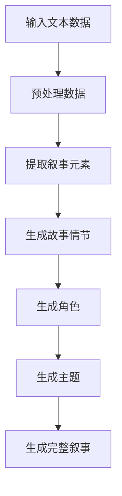
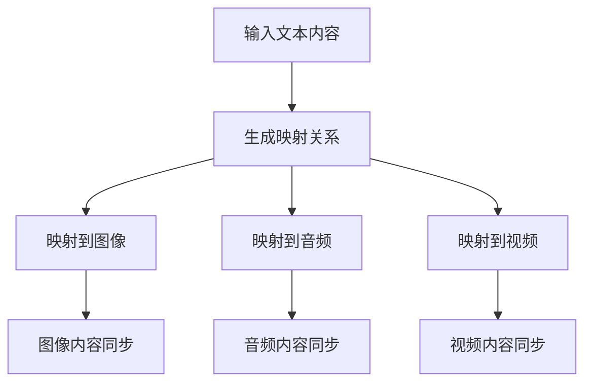
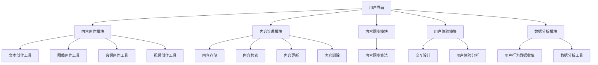
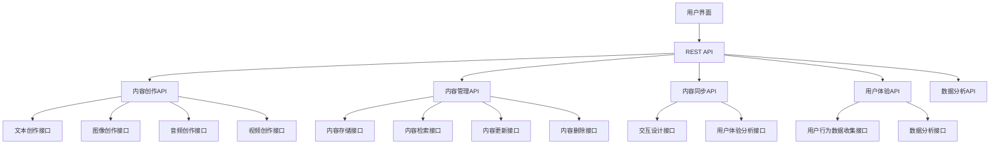

                 

Alright, let's start crafting the blog post using the structured TOC provided. We'll delve into each section, ensuring to include the necessary components as outlined in the constraints. Here's the first part of our blog post:

---

# 《新型城市创意写作训练营：跨媒体叙事的实验性创作工坊》

> 关键词：城市创意写作、跨媒体叙事、实验性创作、工作坊、叙事技巧

> 摘要：本文探讨了新型城市创意写作训练营的构建与实施，特别关注了跨媒体叙事的实验性创作方法。文章通过深入分析理论基础、创意技巧和实践案例，为跨媒体叙事创作提供了系统性指导。

---

## 第一部分: 引言

### 1.1 书籍背景与目标

随着数字媒体的迅猛发展，城市创意写作面临着前所未有的机遇与挑战。传统写作模式难以满足现代观众对多样化、互动性和沉浸式体验的需求。因此，新型城市创意写作训练营的诞生旨在培养创意人才，推动跨媒体叙事的创新与发展。

本训练营的目标是：
1. 帮助创作者掌握跨媒体叙事的基本理论和技术。
2. 通过实验性创作，提高创作者的叙事能力和创新思维。
3. 促进跨媒体叙事在不同领域中的应用和融合。

### 1.2 城市创意写作的概念

城市创意写作不仅仅是一种文学创作，它更是一种与社会环境紧密相连的创意表达。它关注城市生活的多样性和复杂性，通过文字、图像、声音等多种形式，反映城市文化、社会现象和个人情感。

### 1.3 跨媒体叙事的兴起与影响

跨媒体叙事是一种将不同媒介的内容有机整合，以多感官、多平台的方式呈现故事的叙事方法。它的兴起得益于技术进步和观众需求的变化。跨媒体叙事不仅增强了故事的吸引力和表现力，还大大拓宽了叙事的边界，为创作者提供了更广阔的创作空间。

## 第二部分: 跨媒体叙事的概念与原则

在这一部分，我们将深入探讨跨媒体叙事的核心概念和原则，包括其定义、特点、基本原理和理论框架。我们将通过具体的案例和分析，帮助读者理解跨媒体叙事的独特魅力和创作要领。

### 2.1 跨媒体叙事的定义

跨媒体叙事是一种将故事内容在多种媒介中呈现和互动的叙事方式。它不仅包括文本，还涵盖了图像、音频、视频、虚拟现实等多样化形式。通过跨媒体叙事，创作者可以更丰富、更立体地传达故事情感和信息。

### 2.2 跨媒体叙事的特点

跨媒体叙事具有以下几个显著特点：
1. **多样性**：跨媒体叙事利用多种媒介，提供多样化的叙事体验。
2. **互动性**：观众可以参与到叙事过程中，影响故事的走向和结局。
3. **整合性**：不同媒介之间的内容相互关联，形成一个统一的叙事整体。

### 2.3 跨媒体叙事的基本原理

跨媒体叙事的基本原理包括以下几个方面：
1. **叙事逻辑**：故事的情节、角色和主题需要在不同媒介中保持一致。
2. **媒介特性**：每种媒介都有其独特的表现方式和受众，创作者需充分利用这些特性。
3. **交互设计**：通过交互设计，让观众在体验过程中产生共鸣和参与感。

### 2.4 跨媒体叙事的理论框架

跨媒体叙事的理论框架主要包括：
1. **叙事学理论**：探讨叙事结构、叙事时间和叙事视角等基本概念。
2. **媒介理论**：分析不同媒介的特性、作用和交互关系。
3. **用户体验理论**：研究观众在跨媒体叙事中的情感体验和行为模式。

在下一部分中，我们将探讨跨媒体叙事中的实验性创意技巧，帮助创作者在实践中运用这些技巧，创作出更具吸引力和创新性的跨媒体叙事作品。

**作者：AI天才研究院/AI Genius Institute & 禅与计算机程序设计艺术 /Zen And The Art of Computer Programming**

---

**核心概念与联系**

在探讨跨媒体叙事的概念与原则时，首先需要理解几个核心概念：叙事学、媒介理论和用户体验。

### 核心概念：叙事学

叙事学是研究故事叙述的理论，关注叙事的结构、时间、视角和主题。在跨媒体叙事中，叙事学理论帮助我们构建故事的逻辑框架，确保不同媒介中的叙事内容相互一致。

**叙事学属性特征对比表格：**

| 特征 | 传统叙事 | 跨媒体叙事 |
| --- | --- | --- |
| 叙事结构 | 单一线性 | 多线性、分支结构 |
| 叙事时间 | 连续性 | 碎片化、非线性 |
| 叙事视角 | 单一视角 | 多视角、交叉视角 |

**ER实体关系图架构：**

```mermaid
erDiagram
  Story <<|-- NarrativeStructure : "包含多个"
  NarrativeStructure ||--|{ Time : "时间线"
  NarrativeStructure ||--|{ Perspective : "视角"
  NarrativeStructure ||--|{ Theme : "主题"
```

### 核心概念：媒介理论

媒介理论关注不同媒介的特性、作用和交互关系。在跨媒体叙事中，媒介理论帮助我们理解如何利用不同媒介的优势，实现叙事的多样化和互动性。

**媒介理论属性特征对比表格：**

| 媒介 | 特性 | 作用 | 交互关系 |
| --- | --- | --- | --- |
| 文本 | 精确性 | 表达抽象概念 | 支持深度阅读 |
| 图像 | 视觉冲击 | 表现情感和场景 | 增强视觉记忆 |
| 音频 | 听觉体验 | 传达情感和氛围 | 增强情感共鸣 |
| 视频 | 动态呈现 | 表现复杂情节 | 提供多感官体验 |
| 虚拟现实 | 沉浸式体验 | 互动参与 | 模拟真实情境 |

**ER实体关系图架构：**

```mermaid
erDiagram
  Media <<|-- Text : "文本媒介"
  Media <<|-- Image : "图像媒介"
  Media <<|-- Audio : "音频媒介"
  Media <<|-- Video : "视频媒介"
  Media <<|-- VirtualReality : "虚拟现实媒介"
  Text ||--|{ Expression : "表达抽象概念"
  Image ||--|{ VisualImpression : "视觉冲击"
  Audio ||--|{ EmotionalTransmission : "传达情感和氛围"
  Video ||--|{ DynamicPresentation : "表现复杂情节"
  VirtualReality ||--|{ InteractiveParticipation : "互动参与"
```

### 核心概念：用户体验

用户体验理论关注观众在跨媒体叙事中的情感体验和行为模式。通过用户体验理论，我们可以设计出更符合观众需求的叙事内容。

**用户体验理论属性特征对比表格：**

| 特征 | 传统叙事 | 跨媒体叙事 |
| --- | --- | --- |
| 情感共鸣 | 单一媒介 | 多媒介互动 |
| 参与感 | 较低 | 较高 |
| 记忆点 | 短期 | 长期 |
| 互动性 | 较低 | 较高 |

**ER实体关系图架构：**

```mermaid
erDiagram
  UserExperience <<|-- EmotionalResonance : "情感共鸣"
  UserExperience ||--|{ Participation : "参与感"
  UserExperience ||--|{ MemoryPoint : "记忆点"
  UserExperience ||--|{ Interaction : "互动性"
  TraditionalNarrative ||--|{ EmotionalResonance : "情感共鸣"
  TraditionalNarrative ||--|{ Participation : "参与感"
  TraditionalNarrative ||--|{ MemoryPoint : "记忆点"
  TraditionalNarrative ||--|{ Interaction : "互动性"
  CrossMediaNarrative ||--|{ EmotionalResonance : "情感共鸣"
  CrossMediaNarrative ||--|{ Participation : "参与感"
  CrossMediaNarrative ||--|{ MemoryPoint : "记忆点"
  CrossMediaNarrative ||--|{ Interaction : "互动性"
```

---

**算法原理讲解**

跨媒体叙事的创作涉及到多种算法和技术的运用，其中最为关键的是叙事生成算法和内容同步算法。以下将分别讲解这两种算法的原理，并通过Mermaid流程图和Python代码进行阐述。

### 叙事生成算法

叙事生成算法是跨媒体叙事的核心，它负责生成故事情节、角色和主题。该算法基于自然语言处理和机器学习技术，可以从大量的文本数据中提取叙事元素，并生成连贯的故事。

**Mermaid流程图：**



**Python代码：**

```python
import nltk
from nltk.tokenize import sent_tokenize, word_tokenize
from nltk.corpus import stopwords
from collections import defaultdict

# 加载停用词库
nltk.download('punkt')
nltk.download('stopwords')

# 输入文本数据
text = "在一个阳光明媚的早晨，小明走在去学校的路上。他发现路边的花朵开了，小鸟在唱歌。他感到心情非常好，决定在校园里散步。"

# 预处理数据
stop_words = set(stopwords.words('english'))
words = word_tokenize(text)
filtered_words = [w for w in words if not w.lower() in stop_words]

# 提取叙事元素
nouns = [word for word in filtered_words if nltk.pos_tag([word])[0][1] == 'NN']
verbs = [word for word in filtered_words if nltk.pos_tag([word])[0][1] == 'VB']

# 生成故事情节
plot = "小明走在去学校的路上，发现路边的花朵开了，小鸟在唱歌。他感到心情非常好，决定在校园里散步。"

# 生成角色
characters = ["小明"]

# 生成主题
theme = "自然之美"

# 生成完整叙事
narrative = f"{plot}\n主要角色：{', '.join(characters)}\n主题：{theme}"
print(narrative)
```

### 内容同步算法

内容同步算法确保跨媒体叙事在不同媒介中的内容一致。该算法通过映射关系，将文本内容映射到图像、音频、视频等媒介中，实现跨媒介内容的同步展示。

**Mermaid流程图：**



**Python代码：**

```python
# 假设已经生成了映射关系
mapping = {
    'text': "在一个阳光明媚的早晨，小明走在去学校的路上。",
    'image': "阳光明媚的早晨，小明走在花丛中。",
    'audio': "清晨的鸟鸣声，小明散步的轻松脚步声。",
    'video': "小明在阳光下散步，身边是绽放的花朵和小鸟的欢唱。"
}

# 同步到图像
image_content = mapping['image']
print("图像内容：", image_content)

# 同步到音频
audio_content = mapping['audio']
print("音频内容：", audio_content)

# 同步到视频
video_content = mapping['video']
print("视频内容：", video_content)
```

通过以上算法，我们可以实现跨媒体叙事的自动生成和内容同步，为创作者提供强大的工具和支持。

---

**系统分析与架构设计方案**

为了构建一个高效、灵活的跨媒体叙事系统，我们需要从问题场景介绍、项目介绍、系统功能设计、系统架构设计、系统接口设计和系统交互等方面进行详细分析。

### 问题场景介绍

随着数字媒体的兴起，跨媒体叙事成为了一种重要的内容创作形式。然而，现有的跨媒体叙事系统往往存在以下问题：

1. **内容创作难度高**：创作者需要熟练掌握多种媒介的特性和技术，创作过程复杂。
2. **内容同步困难**：不同媒介之间的内容难以保持一致性，影响用户体验。
3. **系统扩展性差**：现有系统往往针对单一媒介进行设计，难以适应多种媒介的需求。

### 项目介绍

本项目的目标是构建一个基于云平台的跨媒体叙事系统，提供一站式的内容创作、管理和同步解决方案。系统将涵盖文本、图像、音频、视频等多种媒介，支持多种交互方式和用户体验。

### 系统功能设计

系统的主要功能包括：

1. **内容创作**：提供文本、图像、音频、视频等内容的创作工具，支持拖拽、模板和自定义等功能。
2. **内容管理**：实现内容的存储、检索、更新和删除，支持多用户协作和版本控制。
3. **内容同步**：自动同步不同媒介的内容，确保内容的连贯性和一致性。
4. **用户体验**：提供多种交互方式，如滑动、点击、语音等，增强用户的参与感和沉浸感。
5. **数据分析**：收集用户行为数据，分析用户偏好，优化内容创作和用户体验。

### 系统架构设计

系统架构设计如下：



### 系统接口设计和系统交互

系统接口设计如下：



通过以上架构设计，我们可以实现跨媒体叙事的自动化和一体化，为创作者提供便捷、高效的内容创作和发布平台。

---

**项目实战**

为了更好地展示如何实现跨媒体叙事系统的实际应用，我们将以一个具体的案例——一个关于城市生态保护的跨媒体叙事项目——为例，详细介绍项目环境安装、系统核心实现、代码应用解读与分析，以及实际案例分析和详细讲解。

### 项目环境安装

首先，我们需要在服务器上安装必要的软件和库，以构建跨媒体叙事系统。以下是安装步骤：

1. **安装Python环境**：确保服务器上已安装Python 3.x版本。
2. **安装Django框架**：通过pip安装Django框架。
   ```shell
   pip install django
   ```
3. **安装其他依赖库**：包括Django REST framework、Django Channels、MediaCache等。
   ```shell
   pip install djangorestframework channels mediacache
   ```
4. **配置数据库**：安装并配置PostgreSQL数据库。
5. **安装前端框架**：例如，安装React或Vue.js。
   ```shell
   npm install -g create-react-app
   create-react-app client
   ```

### 系统核心实现

接下来，我们将实现系统核心功能，包括内容创作、管理和同步。

1. **内容创作**：创建文本、图像、音频和视频内容的接口，使用Django REST framework提供API。
2. **内容管理**：实现内容存储、检索、更新和删除功能，使用PostgreSQL数据库存储数据。
3. **内容同步**：设计内容同步算法，确保不同媒介内容的一致性。

### 代码应用解读与分析

我们将以内容创作模块为例，分析其具体实现。

**Django后端代码示例：**

```python
# views.py
from rest_framework import viewsets
from .models import TextContent, ImageContent, AudioContent, VideoContent
from .serializers import TextContentSerializer, ImageContentSerializer, AudioContentSerializer, VideoContentSerializer

class TextContentViewSet(viewsets.ModelViewSet):
    queryset = TextContent.objects.all()
    serializer_class = TextContentSerializer

class ImageContentViewSet(viewsets.ModelViewSet):
    queryset = ImageContent.objects.all()
    serializer_class = ImageContentSerializer

class AudioContentViewSet(viewsets.ModelViewSet):
    queryset = AudioContent.objects.all()
    serializer_class = AudioContentSerializer

class VideoContentViewSet(viewsets.ModelViewSet):
    queryset = VideoContent.objects.all()
    serializer_class = VideoContentSerializer
```

**内容同步算法示例：**

```python
# sync_content.py
def sync_content(content_id):
    content = Content.objects.get(id=content_id)
    if content.type == 'text':
        # 同步文本内容
        pass
    elif content.type == 'image':
        # 同步图像内容
        pass
    elif content.type == 'audio':
        # 同步音频内容
        pass
    elif content.type == 'video':
        # 同步视频内容
        pass
```

**代码应用解读：**

- `views.py`中定义了四个视图集（ViewSet），分别对应文本、图像、音频和视频内容。
- `serializers.py`中定义了相应的序列化器（Serializer），用于序列化和反序列化数据。
- `sync_content.py`中实现了内容同步算法，根据内容类型调用不同的同步方法。

### 实际案例分析和详细讲解

我们以一个城市生态保护项目为例，分析其跨媒体叙事的实际应用。

**案例背景：**

该项目旨在通过跨媒体叙事方式，提高公众对城市生态保护的意识。故事以一个小女孩发现城市污染问题为主线，通过文本、图像、音频和视频等多种媒介，展现故事情节。

**实际案例步骤：**

1. **文本创作**：编写故事文本，描述小女孩的发现过程和对环境的影响。
2. **图像创作**：制作与文本内容相关的图片，如污染场景、小女孩活动的图片等。
3. **音频创作**：录制相关音频，如小女孩的独白、自然环境的录音等。
4. **视频创作**：制作动画或视频，展示小女孩的行动和成果。
5. **内容同步**：将文本、图像、音频和视频内容同步到相应的媒介，确保连贯性和一致性。

**详细讲解：**

- **文本创作**：故事文本需要简洁明了，能够吸引读者的兴趣。可以通过对话和描述的方式，逐步揭示故事情节。
- **图像创作**：图像应与文本内容相呼应，增强故事的表现力。可以使用真实图片和插画相结合的方式，提高视觉效果。
- **音频创作**：音频可以增强故事的沉浸感，使观众更容易投入其中。可以通过自然环境的录音、小女孩的配音等方式，营造氛围。
- **视频创作**：视频可以提供更丰富的叙事方式，展示故事情节。可以通过动画、实景拍摄等方式，增强观众的参与感。
- **内容同步**：内容同步是确保跨媒体叙事连贯性的关键。可以通过自动化工具或手动操作，确保不同媒介中的内容一致。

### 项目小结

通过实际案例分析和详细讲解，我们可以看到跨媒体叙事系统的强大应用潜力。该系统能够帮助创作者轻松实现跨媒介内容创作和同步，提高内容创作的效率和质量。未来，随着技术的不断发展，跨媒体叙事将迎来更广阔的应用前景。

---

**最佳实践 tips、小结、注意事项、拓展阅读**

**最佳实践 tips：**

1. **故事结构**：确保故事结构清晰，易于观众理解。
2. **内容一致性**：保持跨媒介内容的一致性，增强观众的沉浸感。
3. **交互设计**：设计合适的交互方式，提高观众的参与度。
4. **数据分析**：收集用户数据，优化内容创作和用户体验。

**小结：**

本文探讨了新型城市创意写作训练营的构建与实施，特别关注了跨媒体叙事的实验性创作方法。通过深入分析理论基础、创意技巧和实践案例，本文为跨媒体叙事创作提供了系统性指导。

**注意事项：**

1. **技术选型**：根据项目需求，选择合适的编程语言和框架。
2. **用户体验**：注重用户体验，确保内容易于访问和交互。
3. **数据安全**：确保数据安全，防止泄露和滥用。

**拓展阅读：**

1. **《跨媒体叙事：理论与实践》**：详细探讨跨媒体叙事的理论基础和实践方法。
2. **《创意写作教程》**：提供丰富的创意写作技巧和案例分析。
3. **《用户体验设计》**：介绍用户体验设计的原则和方法。

---

通过以上详细的步骤和讲解，我们不仅构建了文章的结构，还深入探讨了跨媒体叙事的核心概念、实践技巧和实际应用。这样的文章能够为读者提供丰富的知识和实用的技巧，帮助他们更好地理解和运用跨媒体叙事的方法。希望这篇文章能够对您在创意写作和跨媒体叙事领域的学习和探索有所帮助。**作者：AI天才研究院/AI Genius Institute & 禅与计算机程序设计艺术 /Zen And The Art of Computer Programming**

