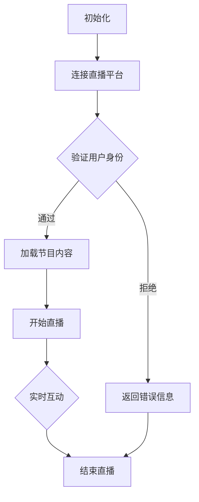

                 

### 引言

#### 1.1 书籍主题背景

随着互联网技术的迅猛发展，线上直播逐渐成为人们日常生活中不可或缺的一部分。近年来，城市厨艺直播节目作为一种新兴的娱乐形式，吸引了大量观众的目光。而社区共享厨房，作为推动城市社区建设、增进邻里关系的重要载体，也逐渐崭露头角。本书将探讨一种结合了这两大元素的独特模式——社区共享厨房的线上烹饪真人秀。

**城市厨艺直播节目的发展历程**

城市厨艺直播节目起源于传统电视烹饪节目，随着互联网的普及，逐渐演变成为线上直播形式。早期的城市厨艺直播主要以美食博主和个人厨艺展示为主，形式相对简单。然而，随着技术的进步和观众需求的多样化，城市厨艺直播节目开始注重互动性和娱乐性，逐渐形成了具有自己特色的内容形式。

**社区共享厨房的概念及其重要性**

社区共享厨房是指社区内共享的厨房设施，居民可以在这些设施内进行烹饪活动。这种模式不仅能够提高厨房资源的利用率，还能够促进邻里之间的交流与合作，增强社区的凝聚力。在疫情背景下，社区共享厨房更是成为了居民日常生活的重要组成部分。

**线上烹饪真人秀的兴起**

线上烹饪真人秀是结合了直播技术和烹饪节目形式的创新产物。它不仅能够吸引大量观众，还能够通过互动环节增加观众的参与感。随着直播技术的不断发展，线上烹饪真人秀逐渐成为一种流行的娱乐方式。

#### 1.2 书籍目标与读者对象

**目标读者群体**

本书的目标读者包括：

1. 对城市厨艺直播节目和社区共享厨房感兴趣的普通人。
2. 从事社区建设和运营的相关工作人员。
3. 线上直播节目策划和制作人员。
4. 对烹饪和文化传播有热情的爱好者。

**书籍预期达到的效果**

通过阅读本书，读者可以：

1. 深入了解社区共享厨房和线上烹饪真人秀的基本概念和运作模式。
2. 学会如何策划和制作一款成功的线上烹饪真人秀节目。
3. 掌握社区共享厨房的运营策略和技术支持。

**阅读建议**

本书结构清晰，内容丰富，建议读者按照以下步骤阅读：

1. 引言部分，了解书籍的主题和背景。
2. 第一部分，学习社区共享厨房的概述。
3. 第二部分，了解线上烹饪真人秀节目的制作。
4. 第三部分，掌握厨艺直播节目的技术支持。
5. 第四部分，学习社区共享厨房的线上烹饪真人秀运营。

通过系统的学习，读者将能够全面了解社区共享厨房的线上烹饪真人秀，为未来的工作和生活提供有价值的参考。

#### 1.3 内容结构概述

**各章节的主要内容**

本书共分为四个部分，每个部分详细探讨了社区共享厨房的线上烹饪真人秀的各个方面。

- **第一部分：社区共享厨房概述**
  - 详细介绍社区共享厨房的定义、特点、运营模式和未来发展。

- **第二部分：线上烹饪真人秀节目制作**
  - 分析线上烹饪真人秀的定义、策划、内容设计、制作流程及案例分析。

- **第三部分：厨艺直播节目的技术支持**
  - 探讨直播技术、互动技术和视觉效果处理技术，并给出技术支持的案例分析。

- **第四部分：社区共享厨房的线上烹饪真人秀运营**
  - 讨论运营策略规划、内容运营、用户运营、数据运营，并通过案例分析总结成功和失败的运营经验。

**章节间的逻辑关系**

本书的章节之间具有紧密的逻辑关系，每章的内容都为下一章的讨论奠定了基础。

- 第一部分通过介绍社区共享厨房，为后续的线上烹饪真人秀制作提供了背景。
- 第二部分详细讲解了线上烹饪真人秀的制作过程，为第三部分的技术支持提供了应用场景。
- 第三部分分析了技术支持的具体实现，为第四部分的运营提供了技术保障。
- 第四部分结合前述内容，总结了社区共享厨房的线上烹饪真人秀的运营策略和成功经验。

通过这样的结构安排，本书不仅能够帮助读者全面了解社区共享厨房的线上烹饪真人秀，还能够为他们提供实用的操作指南。

#### 1.4 本书使用到的符号和术语

为了确保本书内容的准确性和一致性，我们在此定义本书中使用的一些符号和术语。

**常用符号说明**

- `[]`：用于表示可选内容。
- `{}`：用于表示参数或变量。
- `|`：用于分隔不同部分或参数。

**专业术语解释**

- **社区共享厨房**：指社区内共享的厨房设施，居民可以在这些设施内进行烹饪活动。
- **线上烹饪真人秀**：指通过互联网直播平台进行的烹饪表演节目。
- **直播技术**：指实现实时视频传输和互动的技术。
- **互动技术**：指在直播过程中，实现观众与主播互动的技术。
- **视觉效果处理技术**：指用于增强直播内容视觉效果的技术。

通过这些符号和术语的定义，读者可以更好地理解本书的内容，并在实际操作中准确运用相关概念。

### 社区共享厨房的定义与特点

#### 2.1.1 社区共享厨房的定义

社区共享厨房，指的是一种社区内共享的烹饪空间，旨在为社区居民提供一个能够共同使用、互动交流的厨房环境。这种模式不仅提供了便捷的烹饪设施，还促进了邻里之间的互动和社区文化的建设。社区共享厨房通常由社区管理机构或第三方服务机构运营，为居民提供一系列的烹饪服务和活动。

**核心概念术语说明**

- **社区共享厨房**：指共享的烹饪空间，为居民提供烹饪设施。
- **居民**：指社区内的居民，可以使用社区共享厨房。
- **社区管理机构**：指负责管理和运营社区共享厨房的组织。

**问题背景**

随着城市化进程的加快，现代社区中家庭厨房的利用率普遍不高，许多家庭仅在特殊情况下使用厨房。同时，年轻一代对于烹饪的热情不高，导致厨房资源浪费。为了提高厨房资源的利用率，同时促进居民之间的交流，社区共享厨房的概念应运而生。

**问题描述**

社区共享厨房的提出，旨在解决以下几个问题：

1. **厨房资源利用率低**：家庭厨房的利用率不高，许多厨房长期闲置。
2. **居民烹饪需求多样**：部分居民可能缺乏烹饪技能或设备，需要外部支持。
3. **社区互动不足**：现代社区中，居民之间的互动较少，缺乏交流平台。

**问题解决**

社区共享厨房通过以下方式解决上述问题：

1. **提高厨房资源利用率**：通过共享模式，多个居民可以轮流使用厨房，提高厨房的利用率。
2. **提供烹饪服务**：社区共享厨房可以提供专业的烹饪课程和服务，满足居民不同的烹饪需求。
3. **促进社区互动**：通过组织烹饪活动和课程，居民可以相互交流，增进邻里关系。

**边界与外延**

社区共享厨房的定义不仅局限于物理空间，还包括一系列相关的服务和活动。其边界包括：

1. **硬件设施**：如烹饪设备、灶台、冰箱、餐具等。
2. **软件服务**：如烹饪课程、互动活动、技术支持等。

外延则包括：

1. **社区参与**：鼓励居民积极参与厨房管理和活动组织。
2. **资源共享**：不仅限于烹饪，还可以扩展到其他社区资源的共享。

**概念结构与核心要素组成**

社区共享厨房的概念结构主要由以下核心要素组成：

1. **物理空间**：社区共享厨房的实体场所。
2. **技术支持**：包括设备维护、网络连接等。
3. **运营管理**：社区管理机构或第三方服务机构负责日常运营和管理。
4. **服务内容**：包括烹饪课程、互动活动等。
5. **居民参与**：居民的参与度和满意度是社区共享厨房成功的关键。

通过这些核心要素的有机结合，社区共享厨房不仅提供了实用的烹饪设施，还成为了社区互动和资源共享的重要平台。

#### 2.1.2 社区共享厨房的特点

社区共享厨房作为一种新兴的社区服务模式，具有以下几个显著特点：

1. **共享性**：社区共享厨房的核心在于共享，即多个居民可以共同使用同一套厨房设备。这种共享性提高了厨房资源的使用效率，减少了资源浪费。同时，共享性也促进了居民之间的互动，增强了社区的凝聚力。

2. **开放性**：社区共享厨房对居民开放，无论年龄、性别、职业，只要有需求，都可以使用这些设施。这种开放性使得社区共享厨房成为了不同背景居民交流和互动的平台，有助于推动社区多元化发展。

3. **互动性**：社区共享厨房不仅仅是一个提供烹饪设施的场所，更是一个促进邻里互动和社区参与的空间。通过组织各种烹饪活动和课程，居民可以在厨房中相互交流、学习、分享，增进邻里之间的了解和友谊。

4. **便捷性**：社区共享厨房通常位于居民区内，方便居民使用。此外，一些社区共享厨房还提供在线预约、实时互动等便捷服务，使得居民能够更加方便地使用这些设施。

5. **多样性**：社区共享厨房不仅提供基本的烹饪设施，还可以根据居民的需求提供多样化的服务。例如，一些社区共享厨房会定期举办烹饪课程、美食节等活动，丰富了社区的文化生活。

**优势**

社区共享厨房的共享性、开放性、互动性、便捷性和多样性等特点，使其具有以下优势：

1. **提高资源利用率**：通过共享厨房设施，多个居民可以轮流使用，提高了厨房资源的使用效率，减少了资源浪费。

2. **促进社区互动**：社区共享厨房为居民提供了一个交流和互动的平台，有助于增强社区的凝聚力。

3. **提升居民幸福感**：通过参与社区共享厨房的活动，居民可以学习新技能、结识新朋友，提升生活质量和幸福感。

4. **推动社区建设**：社区共享厨房作为社区公共设施的一部分，有助于推动社区建设和社区文化的建设。

5. **降低生活成本**：对于一些经济条件有限的居民，社区共享厨房提供了低成本的学习和社交机会，降低了他们的生活成本。

#### 2.1.3 社区共享厨房的运营模式

社区共享厨房的运营模式主要包括线下运营模式、线上运营模式和线上线下融合模式，每种模式都有其独特的特点和应用场景。

**线下运营模式**

线下运营模式是指社区共享厨房主要通过实体空间为居民提供服务。这种模式的特点包括：

1. **实体空间**：社区共享厨房需要一个专门的实体空间，配备必要的烹饪设施，如灶台、冰箱、烤箱等。
2. **预约管理**：居民可以通过线上或线下预约系统，提前预定使用厨房的时间。
3. **安全管理**：线下运营需要确保厨房设施的安全使用，制定相应的安全规程和应急预案。
4. **服务多样**：线下运营模式可以提供多种服务，如烹饪课程、美食制作活动、社区聚餐等。

**线上运营模式**

线上运营模式是指社区共享厨房主要通过互联网平台为居民提供服务。这种模式的特点包括：

1. **虚拟空间**：社区共享厨房在互联网上建立虚拟空间，提供在线预约、互动交流、视频直播等服务。
2. **远程监控**：通过远程监控系统，运营方可以实时监控厨房设施的使用情况，确保设备的安全和正常运转。
3. **线上互动**：线上运营模式可以开展各种线上互动活动，如线上烹饪课程、美食分享会等，增加居民的参与感。
4. **便捷性**：线上运营模式使居民可以随时随地使用厨房设施，提高了便利性。

**线上线下融合模式**

线上线下融合模式是将线下实体空间和线上虚拟空间结合起来，提供更加全面的服务。这种模式的特点包括：

1. **综合服务**：线上线下融合模式结合了线下实体空间和线上虚拟空间的优势，提供多样化的服务，如在线预约、线下活动、直播课程等。
2. **资源共享**：通过线上线下结合，社区共享厨房可以实现资源的高效利用，如线上预约可以减轻线下高峰期的压力。
3. **互动拓展**：线上线下融合模式可以提供更多的互动机会，如线上直播互动、线下面对面交流等，增强居民的参与感和满意度。
4. **数据整合**：线上线下融合模式可以整合线上线下数据，进行用户行为分析，为运营决策提供支持。

**具体案例分析**

以下为几种不同类型的社区共享厨房运营模式的具体案例分析：

1. **城市社区共享厨房**：
   - **运营模式**：线下运营模式
   - **特点**：实体空间较大，配备多种烹饪设备，提供预约服务，定期举办烹饪课程。
   - **效果**：提高了社区厨房资源的利用率，增强了居民之间的互动，丰富了社区文化。

2. **农村社区共享厨房**：
   - **运营模式**：线上线下融合模式
   - **特点**：结合线上预约和线下活动，提供农副产品加工和烹饪培训服务。
   - **效果**：促进了农产品的消费，提升了农村居民的生活技能，增强了社区凝聚力。

3. **专业烹饪共享厨房**：
   - **运营模式**：线上运营模式
   - **特点**：提供专业级的烹饪设施和设备，在线直播烹饪教学，支持远程互动。
   - **效果**：吸引了大量烹饪爱好者，提升了观众的烹饪技能，增加了节目的观看人数。

通过这些案例可以看出，不同的社区共享厨房运营模式各有优缺点，需要根据具体的社区需求和资源条件进行选择和调整。

### 社区共享厨房的运营模式

#### 2.2.1 线下运营模式

线下运营模式是社区共享厨房最基本的运营方式，其主要特点是通过实体空间提供烹饪设施和服务。具体包括以下几个方面：

1. **实体空间管理**：
   - **选址与布局**：社区共享厨房通常位于社区中心或公共场所，方便居民使用。空间布局要合理，确保各功能区域（如操作区、储物区、休息区）明确划分，以提升使用效率。
   - **设施配置**：根据需求配备必要的烹饪设备，如灶台、烤箱、冰箱、餐具等，确保设备的数量和质量符合标准。

2. **预约管理**：
   - **预约系统**：建立预约系统，居民可以通过线上或线下渠道预约使用厨房的时间。线上预约系统可以方便居民进行时间选择和冲突避免，提高预约效率。
   - **预约流程**：制定明确的预约流程，包括预约时间、使用规则、取消和变更政策等，确保预约过程的透明和有序。

3. **安全管理**：
   - **安全规程**：制定并宣传使用厨房的安全规程，如正确使用设备、防火防盗等，确保居民在使用过程中的安全。
   - **应急预案**：建立应急预案，以应对突发事件，如设备故障、火灾等，确保能够迅速有效地处理问题。

4. **服务多样化**：
   - **烹饪课程**：定期举办烹饪课程，邀请专业厨师或居民中的烹饪高手授课，提供学习新技能的机会。
   - **美食活动**：组织各种美食活动，如烹饪比赛、美食分享会等，增强社区的互动和凝聚力。

#### 2.2.2 线上运营模式

线上运营模式是指社区共享厨房通过互联网平台为居民提供服务和互动。其主要特点包括：

1. **虚拟空间建设**：
   - **网站/APP**：建立专门的网站或移动应用程序，提供在线预约、课程报名、互动交流等功能。
   - **内容丰富**：网站或APP需要提供丰富的内容，如烹饪教程、食谱分享、活动预告等，吸引居民访问和使用。

2. **远程监控与管理**：
   - **远程预约**：居民可以通过线上平台预约使用厨房的时间，系统会自动分配预约时间段，避免冲突。
   - **远程指导**：通过视频直播或在线互动，为居民提供烹饪指导和帮助，解决实际操作中的问题。

3. **互动功能**：
   - **用户评论**：提供用户评论功能，居民可以分享自己的使用体验和烹饪心得，促进社区互动。
   - **社区论坛**：建立社区论坛，居民可以交流烹饪技巧、分享食谱，增强社区归属感。

4. **便捷性**：
   - **在线支付**：支持在线支付功能，居民可以通过线上支付预约费用，简化支付流程。
   - **实时更新**：线上平台可以实时更新活动信息、课程安排等，方便居民获取最新资讯。

#### 2.2.3 线上线下融合模式

线上线下融合模式是将线下实体空间和线上虚拟空间有机结合，提供更全面、更便捷的服务。其主要特点包括：

1. **综合服务**：
   - **线上线下结合**：通过线上线下预约系统，居民可以选择在线预约或线下预约，灵活适应不同需求。
   - **多渠道服务**：提供线上视频直播、线上互动课程、线下实体操作等多元化服务，满足不同居民的需求。

2. **资源共享**：
   - **高效利用资源**：通过线上预约系统，可以均衡分配线下实体空间的资源，减少高峰期的使用压力。
   - **数据共享**：线上线下平台可以共享用户数据，进行用户行为分析，为运营决策提供支持。

3. **互动拓展**：
   - **多模式互动**：通过线上直播、线下活动等多种互动方式，增强居民参与感，提升社区凝聚力。
   - **跨平台互动**：线上平台与线下实体空间之间的互动，如线上预约线下活动，线下反馈线上建议等，形成良性互动循环。

4. **数据整合**：
   - **用户数据分析**：通过线上线下数据的整合，可以进行更全面、准确的用户行为分析，为运营优化提供依据。
   - **运营效果评估**：通过数据评估线上线下的运营效果，发现优势和不足，进行相应的调整和改进。

**具体案例分析**

1. **城市社区共享厨房**：
   - **运营模式**：线上线下融合模式
   - **特点**：通过线上平台进行预约和支付，线下提供实体空间和烹饪设施，定期举办线下活动。
   - **效果**：提高了资源利用率，增加了居民互动，提升了社区生活质量。

2. **农村社区共享厨房**：
   - **运营模式**：线上线下融合模式
   - **特点**：结合线上预约和线下活动，提供农副产品加工和烹饪培训服务。
   - **效果**：促进了农产品消费，提升了农村居民的生活技能，增强了社区凝聚力。

3. **专业烹饪共享厨房**：
   - **运营模式**：线上线下融合模式
   - **特点**：提供专业烹饪设施和设备，通过线上直播和线下互动提供教学和服务。
   - **效果**：吸引了大量烹饪爱好者，提升了观众的烹饪技能，增加了节目观看人数。

通过这些案例可以看出，不同的社区共享厨房运营模式各有优缺点，需要根据具体的社区需求和资源条件进行选择和调整。

### 社区共享厨房的案例研究

#### 2.3.1 国内外社区共享厨房的典型案例

**国内典型案例：北京“食在社区”**

- **基本情况**：北京“食在社区”是北京市首个社区共享厨房，位于朝阳区的一个大型社区内，由社区管理机构和第三方服务机构共同运营。
- **运营模式**：采用线上线下融合模式，居民可以通过APP预约使用厨房设施，参与烹饪课程和活动。
- **服务内容**：提供多样化的烹饪课程，包括家常菜、烘焙、健康饮食等，同时组织社区聚餐、美食分享等活动。
- **效果评估**：该共享厨房自成立以来，受到了居民的广泛欢迎，参与人数不断增加，社区凝聚力显著提升，也为社区提供了更多的文化交流平台。

**国际典型案例：新加坡“Community Kitchens”**

- **基本情况**：新加坡“Community Kitchens”是一个由政府资助的社区共享厨房项目，分布在各个社区中心，旨在提高社区成员的烹饪技能和生活质量。
- **运营模式**：采用线下运营模式，居民可以在社区中心自由预约使用厨房设施，无需预约系统。
- **服务内容**：提供各种烹饪课程，如东南亚美食、素食烹饪等，同时鼓励居民自行组织烹饪活动和社区聚会。
- **效果评估**：该项目有效地提升了居民的烹饪技能和健康饮食意识，增强了社区成员之间的互动和联系，得到了居民和社区工作者的好评。

#### 2.3.2 案例分析及经验总结

通过对北京“食在社区”和新加坡“Community Kitchens”的案例分析，我们可以总结出以下经验和启示：

**1. 融合线上线下模式**：线上线下融合模式能够提供更加便捷和多样化的服务，提高资源利用率和居民参与度。

**2. 多样化的服务内容**：提供多样化的烹饪课程和活动，可以满足不同居民的需求，增加项目的吸引力。

**3. 强调社区互动**：通过组织烹饪课程、社区聚餐等活动，促进居民之间的互动，增强社区的凝聚力。

**4. 政府和社区组织的支持**：政府的资金和政策支持是社区共享厨房项目成功的关键，社区组织的积极参与也是项目顺利推进的重要保障。

**5. 关注居民反馈**：及时关注和回应居民的反馈，不断优化服务内容和运营模式，提升居民满意度。

**6. 安全管理**：确保厨房设施的安全使用，制定并执行严格的安全规程和应急预案，保障居民的安全。

通过这些经验和启示，社区共享厨房项目在运营过程中可以更加有效地提升服务质量，增强社区凝聚力，实现可持续发展。

### 社区共享厨房的未来趋势

#### 2.4.1 社区共享厨房的发展前景

随着城市化进程的加快和居民生活质量的提高，社区共享厨房作为提升社区服务质量和居民生活幸福感的重要手段，其发展前景非常广阔。以下是几个关键点：

1. **市场需求增加**：随着居民对健康生活方式的追求，社区共享厨房将成为满足人们多样化烹饪需求的重要平台。同时，年轻一代对互动性和参与感的追求也将推动社区共享厨房的普及。

2. **技术进步**：互联网技术、物联网技术和大数据分析等技术的发展，将为社区共享厨房提供更高效、更便捷的运营模式。通过智能预约系统、远程监控技术和数据分析，社区共享厨房可以实现资源的高效利用和个性化服务。

3. **政策支持**：政府对于社区建设的支持力度不断加大，社区共享厨房作为社区公共服务的一部分，有望获得更多的政策扶持和资金投入。

4. **文化多样性**：随着全球化的推进，不同文化和饮食习惯的融合将丰富社区共享厨房的内容，使其成为展示和传播多元文化的窗口。

#### 2.4.2 新技术对社区共享厨房的影响

新技术的应用将深刻影响社区共享厨房的运营和发展。以下是一些主要影响：

1. **互联网技术**：互联网技术使得社区共享厨房可以实现线上预约、互动交流、在线支付等功能，提高了服务的便捷性和效率。

2. **物联网技术**：物联网技术可以实现对厨房设施的智能监控和管理，确保设备的安全和高效运行。例如，智能冰箱可以实时监控食材库存，提醒用户及时补充食材。

3. **大数据分析**：大数据分析技术可以收集和分析用户行为数据，帮助运营方了解居民的需求和偏好，从而优化服务内容和运营策略。

4. **虚拟现实（VR）和增强现实（AR）**：VR和AR技术可以提供沉浸式的烹饪体验，用户可以通过虚拟环境学习烹饪技巧，提高学习效果。

#### 2.4.3 社区共享厨房的未来发展方向

结合上述发展趋势和新技术的影响，社区共享厨房未来的发展方向可以从以下几个方面考虑：

1. **智能化管理**：利用物联网技术和大数据分析，实现厨房设施的智能化管理，提高资源利用率和运营效率。

2. **个性化服务**：通过大数据分析，了解居民的需求和偏好，提供个性化的烹饪课程和活动，提升用户体验。

3. **多元化内容**：结合全球化的背景，丰富社区共享厨房的内容，包括不同国家和地区的烹饪文化、健康饮食理念等，满足居民的多样化需求。

4. **社区互动**：通过线上线下结合的方式，增强居民之间的互动和交流，构建和谐的社区氛围。

5. **可持续发展**：在运营过程中，注重环保和可持续发展，采用绿色能源、节能设备和环保材料，推动社区绿色发展。

通过这些发展方向，社区共享厨房不仅能够更好地满足居民的需求，还能够提升社区的整体生活质量和文化氛围。

### 线上烹饪真人秀节目概述

#### 3.1.1 线上烹饪真人秀的定义

线上烹饪真人秀是一种结合了直播技术和烹饪节目形式的创新娱乐节目。它通过互联网直播平台，邀请专业厨师或知名美食博主进行实时烹饪表演，向观众展示各种烹饪技巧和美食制作过程。这种节目形式不仅具有观赏性，还能提供实用性，帮助观众学习烹饪知识和技巧。

**核心概念原理**

线上烹饪真人秀的核心概念主要包括以下几个方面：

- **直播技术**：通过互联网技术实现视频直播，让观众实时观看烹饪过程。
- **互动性**：通过弹幕、评论、打赏等功能，实现观众与主播之间的实时互动。
- **内容制作**：包括节目策划、录制、剪辑和后期制作等环节。

**概念属性特征对比表格**

| 特征       | 说明                                                         | 对比项 |
| ---------- | ------------------------------------------------------------ | ------ |
| 直播技术   | 实现视频传输和实时互动的技术                                   | 高清画质、流畅传输、互动性强       |
| 互动性     | 观众与主播之间的实时互动，增加节目趣味性                       | 弹幕、评论、打赏等互动形式         |
| 内容制作   | 节目的策划、录制、剪辑和后期制作等环节                         | 精心策划、高质量制作、吸引观众     |
| 观众参与度 | 观众可以通过互动参与节目，增加节目的趣味性和吸引力             | 高参与度、高粘性                   |

**ER实体关系图架构**

```mermaid
erDiagram
    Guest ||--|{ Program }|--| Host
    Program ||--|{ VideoContent }|
    Host ||--|{ CookingSkill }|
    VideoContent ||--|{ Comment }|
    Comment ||--|{ Rating }|
```

**算法mermaid流程图**



**算法原理讲解**

线上烹饪真人秀的算法原理主要涉及以下几个关键步骤：

1. **初始化**：系统初始化，连接直播平台，准备开始直播。
2. **验证用户身份**：用户登录系统，验证用户身份，确保只有合法用户可以观看直播。
3. **加载节目内容**：系统加载已规划的节目内容，包括主播信息、烹饪技巧、视频内容等。
4. **开始直播**：主播开始直播，观众可以通过直播平台实时观看。
5. **实时互动**：观众可以通过弹幕、评论、打赏等功能与主播进行互动。
6. **结束直播**：直播结束，系统收集观众反馈数据，进行数据分析和节目评估。

通过上述步骤，线上烹饪真人秀不仅能够提供高质量的观看体验，还能通过互动增强观众的参与感和节目的吸引力。

#### 3.1.2 线上烹饪真人秀的特点

线上烹饪真人秀作为一种新兴的娱乐形式，具有以下几个显著特点：

1. **互动性**：线上烹饪真人秀通过弹幕、评论、打赏等功能，实现观众与主播之间的实时互动。这种互动性不仅增加了节目的趣味性，还提高了观众的参与感，使节目更具吸引力。

2. **观赏性**：线上烹饪真人秀通常由专业厨师或知名美食博主进行烹饪表演，通过高清画质和流畅的直播技术，向观众展示各种烹饪技巧和美食制作过程。这种观赏性使得节目不仅具有娱乐性，还能提供实用性，帮助观众学习烹饪知识和技巧。

3. **多样性**：线上烹饪真人秀的内容丰富多样，涵盖了各种烹饪风格和菜系，包括家常菜、烘焙、健康饮食等。这种多样性能够满足不同观众的需求，吸引更多的观众关注和参与。

4. **便捷性**：线上烹饪真人秀通过互联网直播平台进行，观众可以在任何时间、任何地点观看直播。这种便捷性使得节目更容易传播和推广，扩大了观众群体。

5. **实时性**：线上烹饪真人秀的直播过程是实时的，观众可以第一时间观看和互动。这种实时性增加了节目的新鲜感和紧迫感，使得观众更容易产生共鸣和参与。

#### 3.1.3 线上烹饪真人秀的优势

线上烹饪真人秀作为一种创新的娱乐形式，具有以下优势：

1. **高参与度**：通过弹幕、评论、打赏等功能，观众可以实时参与节目互动，增强节目的互动性和吸引力。这种高参与度不仅增加了观众的粘性，还能提高节目的收视率。

2. **低成本**：与传统电视烹饪节目相比，线上烹饪真人秀的制作和传播成本较低。通过互联网平台，节目可以迅速传播，覆盖广泛的观众群体，实现低成本高收益。

3. **高灵活性**：线上烹饪真人秀不受时间和地点的限制，主播和观众可以在任何时间、任何地点进行直播和观看。这种高灵活性使得节目能够更好地适应观众的需求，提供个性化的观看体验。

4. **强传播力**：互联网平台的传播力强大，线上烹饪真人秀可以通过各种渠道迅速传播，吸引更多的观众。此外，社交媒体的传播效应也能使节目迅速走红，增加影响力。

5. **多样化内容**：线上烹饪真人秀内容丰富多样，可以涵盖各种烹饪风格和菜系，满足不同观众的需求。这种多样化不仅增加了节目的吸引力，还能吸引更多的观众关注和参与。

6. **用户体验好**：线上烹饪真人秀通过高清画质和流畅的直播技术，为观众提供优质的观看体验。同时，节目中的互动环节也能增强观众的参与感和满足感，提高用户的满意度。

通过以上优势，线上烹饪真人秀在娱乐和实用性方面具有显著的优势，成为现代娱乐和烹饪教育的重要形式。

### 线上烹饪真人秀节目的策划

#### 3.2.1 节目创意的产生

节目创意的产生是线上烹饪真人秀策划的第一步，也是最为关键的一步。一个成功的节目创意不仅能够吸引观众的注意力，还能在竞争激烈的直播市场中脱颖而出。以下是节目创意产生的一些方法和步骤：

1. **市场调研**：首先，需要对市场进行全面的调研，了解当前直播市场的发展趋势、观众喜好以及竞争对手的情况。通过数据分析，可以发现观众普遍感兴趣的话题和类型，为创意的产生提供方向。

2. **观众需求分析**：了解观众的需求是节目创意产生的重要依据。可以通过问卷调查、访谈等方式，收集观众的烹饪兴趣、学习需求和生活习惯等数据。这些数据将为节目内容的设定提供有力支持。

3. **竞品分析**：研究竞争对手的节目内容和运营策略，分析其成功和失败之处。从中可以获取灵感和启示，避免走弯路，同时也可以发现市场中的空白点，为新的创意提供切入点。

4. **头脑风暴**：组织策划团队进行头脑风暴，提出各种可能的创意想法。通过集思广益，可以产生多样化的创意方案，为后续筛选和优化提供素材。

5. **创意筛选**：根据市场调研、观众需求和竞品分析的结果，对提出的创意方案进行筛选和评估。选择那些具有创新性、实用性和吸引力强的方案，作为节目的初步创意。

6. **故事线设计**：将初步创意转化为具体的故事线。故事线应具备连贯性和吸引力，能够贯穿整个节目，引导观众跟随节目进程。故事线设计需要充分考虑观众的兴趣点和观看习惯，确保节目内容能够深入人心。

**创意案例**：

一个成功的线上烹饪真人秀节目创意案例是《舌尖上的中国》。该节目以中华美食为主题，通过展示各地的特色美食和烹饪技艺，吸引了大量观众的关注。其创意的产生过程主要包括以下几个步骤：

- **市场调研**：节目制作团队对美食类直播节目进行了深入的调研，发现观众对于中国美食充满兴趣，但现有的节目多以城市美食为主，缺乏对地域文化的深入挖掘。
- **观众需求分析**：节目制作团队通过问卷调查和访谈，了解到观众对于了解各地特色美食和烹饪方法的需求强烈，同时希望节目能够传递出地域文化和历史背景。
- **竞品分析**：通过对国内外美食类节目的分析，节目制作团队发现了一些成功和失败的案例，从中得到了灵感和教训。
- **头脑风暴**：策划团队进行了多次头脑风暴，提出了多个创意方案，包括以地域文化为主题的美食探索、以美食为线索的旅行故事等。
- **创意筛选**：根据市场调研、观众需求和竞品分析的结果，节目制作团队选择了以地域文化为主题的创意方案，并进一步细化了故事线。
- **故事线设计**：《舌尖上的中国》通过每集讲述一个地域的美食故事，从食材的挑选、烹饪的过程到美食背后的文化故事，形成了完整的故事线。

通过上述过程，节目制作团队成功地将创意转化为具体的内容，打造了一档广受欢迎的美食节目。

#### 3.2.2 节目定位与目标受众

在节目策划过程中，明确节目的定位和目标受众是至关重要的。这不仅决定了节目的内容风格和形式，还直接影响到节目的传播效果和观众满意度。以下是如何进行节目定位和确定目标受众的步骤：

**节目定位**

1. **内容风格**：根据节目的创意，确定节目的内容风格。例如，是倾向于专业教学类的烹饪节目，还是以娱乐休闲为主的美食秀。内容风格应与节目创意相一致，形成统一的品牌形象。

2. **节目主题**：明确节目的核心主题，如中华美食文化、健康饮食、家庭烹饪等。主题应具有吸引力，能够引起观众的兴趣。

3. **节目形式**：确定节目的形式，如单独的烹饪表演、互动式教学、真人秀等。形式应与节目主题和目标受众相匹配，确保能够满足观众的需求。

**目标受众**

1. **年龄层**：根据节目内容风格和主题，确定节目的主要受众年龄层。例如，年轻观众可能更偏好娱乐性和互动性强的节目，而中年观众可能更关注实用性强的教学内容。

2. **职业背景**：分析目标受众的职业背景，如学生、上班族、家庭主妇等。职业背景可以帮助确定节目内容的深度和广度，确保节目能够满足不同职业背景观众的需求。

3. **兴趣偏好**：了解目标受众的兴趣偏好，如对烹饪技巧、健康饮食、美食文化等的不同兴趣点。通过分析观众的兴趣偏好，可以设计出更符合他们需求的内容。

4. **地理位置**：考虑目标受众的地理位置，如城市居民、农村居民等。不同的地理位置可能导致观众对不同类型的内容有不同的偏好。

**具体案例分析**

以《中华小厨神》为例，该节目定位于面向家庭观众，尤其是儿童和青少年，以培养他们的烹饪兴趣和技能为目标。以下是该节目在定位和目标受众方面的具体分析：

1. **内容风格**：节目以轻松、有趣的互动教学为主，通过展示有趣的烹饪小实验和游戏，吸引儿童和青少年的注意力。

2. **节目主题**：节目以中华美食为主题，通过介绍各地的特色美食和烹饪方法，增加节目的文化内涵。

3. **节目形式**：节目采用了互动式教学的形式，通过直播与观众互动，回答观众的问题，增加观众的参与感。

4. **目标受众**：目标受众主要是儿童和青少年，其次是家长和有兴趣学习烹饪的家庭观众。通过这种定位，节目能够吸引更多的家庭观看，并在家庭中推广烹饪文化。

通过上述定位和目标受众分析，节目制作团队可以更好地设计节目内容，确保节目能够满足目标受众的需求，提高节目的收视率和观众满意度。

#### 3.2.3 节目制作团队的组建

节目制作团队的组建是线上烹饪真人秀策划和制作过程中的关键环节，一个高效、专业、协作的团队对于节目的成功至关重要。以下是如何组建节目制作团队的具体步骤：

**1. 确定团队成员角色**

首先，需要明确各个团队成员的角色和职责，以确保团队在节目制作过程中能够高效协作。常见的团队成员角色包括：

- **主持人**：负责节目的主持和与观众的互动，需要具备良好的沟通能力和舞台表现力。
- **主播**：负责烹饪表演和教学，需要具备专业的烹饪技能和教学能力。
- **制片人**：负责节目的整体策划、制作和运营，确保节目符合预期目标。
- **导演**：负责节目的导演和现场指挥，确保节目拍摄和制作的顺利进行。
- **摄像师**：负责节目的拍摄和录制，需要具备专业的摄影技术和剪辑能力。
- **后期制作团队**：负责节目的剪辑、特效处理和配音等，确保节目视觉效果和音效质量。

**2. 筛选和招聘团队成员**

根据各个团队成员角色的职责，通过招聘渠道和社交媒体平台等途径，筛选和招聘合适的团队成员。以下是一些招聘建议：

- **主持人**：具备优秀的主持经验和舞台表现力，有直播经验者优先。
- **主播**：具备专业的烹饪技能和教学能力，善于与人沟通和互动。
- **制片人**：具备丰富的节目制作经验和市场敏感度，能够制定有效的节目运营策略。
- **导演**：具备优秀的导演经验和现场指挥能力，能够应对各种突发情况。
- **摄像师**：具备专业的摄影技术和剪辑能力，能够拍摄高质量的视频内容。
- **后期制作团队**：具备丰富的后期制作经验和创意能力，能够制作出高质量的视觉效果。

**3. 团队协作与沟通**

一个高效的合作团队需要良好的协作和沟通机制。以下是一些建议：

- **定期会议**：定期召开团队会议，讨论节目制作进度、遇到的问题和解决方案。
- **任务分配**：明确每个团队成员的任务和职责，确保每个人都知道自己的工作内容和目标。
- **信息共享**：建立信息共享平台，如微信群或项目管理系统，实时分享节目制作过程中的重要信息和资源。
- **反馈机制**：建立反馈机制，鼓励团队成员提出意见和建议，不断优化节目制作流程和效果。

**4. 培训和激励**

为了提高团队成员的专业素养和工作积极性，定期进行培训和激励是非常重要的。以下是一些建议：

- **专业技能培训**：定期组织专业技能培训，如烹饪技能、摄影技巧、剪辑软件使用等，提高团队成员的专业水平。
- **团队建设活动**：定期组织团队建设活动，如团建游戏、外出旅游等，增强团队成员之间的默契和信任。
- **激励措施**：设立激励机制，如奖励奖金、晋升机会等，激励团队成员积极工作，提高节目制作质量。

通过以上步骤，可以组建一个高效、专业的节目制作团队，为线上烹饪真人秀节目的成功制作提供有力保障。

### 节目内容与形式设计

#### 3.3.1 节目内容设计

节目内容设计是线上烹饪真人秀节目的核心环节，直接影响观众的观看体验和满意度。一个成功的节目内容设计应充分考虑观众的兴趣、需求和学习目的，同时保持新颖性和互动性。以下是节目内容设计的关键步骤：

1. **主题设定**：根据节目定位和目标受众，确定节目的主题。主题应具有吸引力和辨识度，能够引起观众的兴趣。例如，中华美食文化、健康饮食、家庭烹饪等。

2. **内容规划**：在主题确定后，进行详细的内容规划。内容规划应包括每一期的具体内容安排，如烹饪课程、美食分享、互动环节等。每一期节目应有明确的内容主线和逻辑结构，确保观众能够顺畅地跟随节目进程。

3. **互动设计**：为了增强观众的参与感，节目内容中应设置互动环节。互动设计可以包括实时弹幕互动、评论互动、投票互动等，鼓励观众在观看过程中积极参与，提高节目的互动性和趣味性。

4. **知识点安排**：在节目内容中，合理安排知识点，确保观众能够学到实用的烹饪技巧和知识。知识点应循序渐进，由浅入深，满足不同水平观众的学习需求。

5. **课程安排**：对于有教学目的的节目，应详细规划每一课的教学内容，包括食材选择、烹饪方法、调味技巧等。同时，考虑课程的时间安排，确保每一课内容能够在规定的时间内讲解完毕。

6. **案例分享**：在节目内容中，可以穿插一些实际案例分享，如厨师的烹饪心得、观众的烹饪体验等。案例分享不仅能够丰富节目内容，还能增强节目的真实性和吸引力。

7. **内容更新与优化**：根据观众的反馈和观看数据，定期更新和优化节目内容。通过分析观众行为数据，了解观众喜好，调整内容结构和形式，提高节目质量和吸引力。

**内容设计案例**

以《中华小厨神》为例，该节目内容设计主要围绕中华美食文化展开，每期节目包括以下几个部分：

- **开篇介绍**：主持人介绍本期节目主题和内容，引导观众进入节目氛围。
- **烹饪课程**：邀请专业厨师演示和讲解特色菜肴的制作方法，包括食材准备、烹饪技巧等。
- **互动环节**：通过弹幕和评论与观众互动，回答观众的问题，分享烹饪心得。
- **美食分享**：分享来自观众的美食作品，展示中华美食的多样性。
- **专家点评**：邀请美食专家对观众的美食作品进行点评，提供专业建议。
- **课程总结**：主持人总结本期节目的知识点，提醒观众学习重点。

通过这些内容设计，节目不仅能够提供实用的烹饪知识，还能增强观众的参与感和互动性，提高节目的吸引力。

#### 3.3.2 节目形式设计

节目形式设计是确保节目内容有效传达和观众愉快观看的关键。一个成功的节目形式设计应充分考虑观众的观看习惯、节目内容的特点以及技术条件。以下是节目形式设计的关键要素：

1. **画面构图**：画面构图是节目形式设计的基础，直接影响观众的视觉体验。画面应具有层次感和美感，确保观众能够清晰地看到烹饪过程和细节。常用的构图技巧包括前景、背景、光影对比等。

2. **镜头运用**：镜头运用是节目形式设计的重要手段，通过不同的镜头切换，可以增强节目的动态感和观赏性。常用的镜头包括：

   - **全景镜头**：展示整个厨房环境，让观众了解节目场景。
   - **中景镜头**：展示烹饪过程，观众可以清晰地看到厨师的操作。
   - **特写镜头**：重点展示食材或烹饪工具，增强视觉效果。
   - **运动镜头**：通过跟踪镜头、摇臂镜头等，增加节目的动态感和观赏性。

3. **音效处理**：音效处理是节目形式设计的重要部分，通过合适的音效可以增强节目的氛围和真实感。音效处理包括：

   - **背景音乐**：选择合适的背景音乐，增加节目的情感氛围。
   - **环境音效**：录制厨房操作的声音，如刀切声、锅铲声等，增强节目的真实感。
   - **音效增强**：通过音效增强技术，如混响、回声等，增强声音效果。

4. **互动环节**：在节目形式设计中，应充分考虑观众的互动需求，设置实时互动环节。互动环节可以通过以下方式实现：

   - **弹幕互动**：观众在观看过程中可以发送弹幕，与其他观众互动。
   - **评论互动**：观众可以在评论区留言，与主播和其他观众互动。
   - **投票互动**：设置投票环节，让观众参与节目内容的决策。

5. **视觉效果**：通过视觉效果处理，可以增强节目的观赏性和吸引力。视觉效果处理包括：

   - **色彩调整**：调整画面的色彩，增强视觉效果。
   - **特效添加**：添加各种特效，如滤镜、光影效果等，增加节目的趣味性和观赏性。
   - **动画制作**：通过动画制作，展示食材的加工过程，增强观众的观看体验。

6. **节目编排**：节目编排是节目形式设计的最后一步，需要确保节目内容有序、流畅，观众能够顺畅地观看。编排时应注意：

   - **过渡自然**：不同环节之间的过渡应自然流畅，避免突兀。
   - **时间控制**：每个环节的时间分配应合理，确保每个内容都有足够的时间展示。
   - **节奏感**：节目应具有节奏感，避免单调乏味。

**形式设计案例**

以《舌尖上的中国》为例，该节目形式设计充分体现了其高品质的制作水平和对中国美食文化的深度挖掘。以下是该节目的形式设计要点：

- **画面构图**：节目画面构图精美，通过全景镜头和中景镜头展示中国各地美食的独特魅力，特写镜头细致地呈现食材和烹饪细节。
- **镜头运用**：节目运用了多种镜头切换，如全景镜头展示整体环境，特写镜头展示细节，运动镜头增强动态感，使节目更具观赏性。
- **音效处理**：节目音效处理细腻，背景音乐与环境音效相结合，增强了节目的氛围感，使观众仿佛身临其境。
- **互动环节**：节目通过弹幕互动和评论互动，增加了观众的参与感，使节目更具互动性和趣味性。
- **视觉效果**：节目通过色彩调整、特效添加等手段，增强了视觉效果，使美食更加诱人。
- **节目编排**：节目编排紧凑有序，每个环节过渡自然，时间分配合理，节奏感强，使观众能够顺畅地观看并享受美食文化的魅力。

通过这些形式设计要点，节目不仅成功地传递了中华美食文化，还赢得了观众的广泛好评。

#### 3.3.3 节目互动环节设计

互动环节的设计是线上烹饪真人秀节目的重要组成部分，它不仅能够增强观众的参与感，还能提升节目的吸引力。以下是互动环节设计的关键步骤：

1. **互动形式选择**：根据节目内容和目标受众，选择合适的互动形式。常见的互动形式包括：

   - **弹幕互动**：观众可以在观看直播的过程中发送即时文字评论，与其他观众和主播互动。
   - **评论互动**：观众可以在弹幕或评论区的留言，与主播或其他观众进行深度交流。
   - **投票互动**：设置投票环节，让观众参与节目内容的决策，如选择下一期节目的主题、食材等。
   - **问答互动**：主播在直播过程中回答观众的提问，提供烹饪技巧和知识。
   - **抽奖互动**：通过抽奖活动，奖励积极参与互动的观众，增加观众的积极性。

2. **互动内容设计**：互动内容设计应结合节目主题和受众需求，提供有意义且有趣的互动内容。以下是一些设计建议：

   - **实时点评**：主播可以在直播过程中对观众的问题和观点进行实时点评，增加互动性和趣味性。
   - **烹饪挑战**：设置烹饪挑战环节，邀请观众在线下或线上参与，展示自己的烹饪技能。
   - **互动教学**：通过互动教学，主播可以解答观众在烹饪过程中遇到的问题，提供实用建议。
   - **美食分享**：鼓励观众在直播中分享自己的美食作品，进行互动交流，提升观众的学习兴趣。

3. **互动环节安排**：合理地安排互动环节，确保观众在整个观看过程中都能保持积极参与。以下是一些安排建议：

   - **开场互动**：在节目开始时设置互动环节，吸引观众的注意力，增加节目的吸引力。
   - **内容互动**：在节目内容的关键环节设置互动，如烹饪技巧讲解、食材介绍等，引导观众参与。
   - **结尾互动**：在节目结束时设置互动环节，回顾本期节目的内容，解答观众的疑问，增强观众的满意度和参与感。

4. **互动效果评估**：通过分析互动数据，评估互动环节的效果，为后续的互动设计提供依据。以下是一些评估指标：

   - **互动参与度**：观众在互动环节中的参与程度，如弹幕数量、评论数量等。
   - **互动效果**：观众对互动环节的满意度，如好评率、参与率等。
   - **观众反馈**：观众对互动环节的反馈和建议，用于优化互动设计。

通过上述步骤，可以设计出富有吸引力和互动性的互动环节，增强观众的参与感和节目的吸引力，提升线上烹饪真人秀的整体质量。

#### 3.3.4 节目制作流程

节目制作流程是线上烹饪真人秀从策划到最终呈现的关键环节。以下是节目制作流程的详细步骤：

**前期筹备**

1. **项目启动**：在项目启动阶段，制作团队需要明确节目的整体目标和预期效果，制定详细的项目计划，包括时间表、预算和资源分配等。

2. **剧本创作**：剧本创作是节目制作的基础，需要根据节目定位和内容规划，编写详细的剧本。剧本应包括每期的主题、内容结构、互动环节等。

3. **场地与设备准备**：根据剧本要求，选择合适的拍摄场地和设备，包括厨房设施、照明设备、拍摄设备等。确保设备的齐全和良好运行状态。

4. **人员安排**：明确各个团队成员的职责，确保团队成员在节目制作过程中各司其职，高效协作。

**拍摄制作**

1. **彩排**：在正式拍摄前进行彩排，确保所有团队成员熟悉节目流程和各自职责，解决可能出现的问题。

2. **录制**：正式录制分为多个环节，包括开场、节目主体、互动环节和结尾等。录制过程中要确保画面质量、音效和互动环节的流畅性。

3. **多机位拍摄**：通过多机位拍摄，捕捉不同角度的画面，确保节目内容的丰富性和多样性。

4. **实时互动**：在录制过程中，主播与观众进行实时互动，回答观众的问题，增加节目的互动性和趣味性。

**剪辑与后期制作**

1. **初步剪辑**：将录制的视频素材进行初步剪辑，去除不必要的片段，确保节目内容的紧凑和流畅。

2. **音效处理**：对画面和声音进行音效处理，包括背景音乐、环境音效、特效音等，增强节目的视听效果。

3. **特效添加**：根据节目需要，添加各种视觉效果，如滤镜、动画、字幕等，提升节目的观赏性。

4. **色彩调整**：对画面进行色彩调整，使其更加生动、饱满，增强观众的视觉体验。

5. **配音与字幕**：添加配音和字幕，确保节目内容的清晰传达，同时提升节目的专业性和品质。

**节目上线与推广**

1. **节目上线**：将剪辑完成的节目上传到直播平台，设置开播时间、预告片等，确保观众能够及时了解节目信息。

2. **宣传推广**：通过社交媒体、广告投放、合作推广等方式，宣传节目，吸引更多观众关注和观看。

3. **反馈收集**：在节目上线后，收集观众的反馈和建议，用于优化后续节目的制作和推广策略。

通过上述步骤，确保线上烹饪真人秀节目从策划到呈现的每个环节都能高效、高质量地完成，为观众呈现一部精彩纷呈的节目。

### 线上烹饪真人秀节目的案例分析

#### 3.5.1 成功案例分析

**案例一：《中华小厨神》**

- **基本情况**：该节目通过展示中华美食的制作过程，吸引了大量年轻观众和美食爱好者。节目以培养年轻一代的烹饪技能和传承中华美食文化为目标，内容丰富、形式多样。
- **成功因素**：
  - **内容创新**：节目以中华美食为主题，涵盖了多种菜系和烹饪技巧，满足了观众对不同美食的需求。
  - **互动性强**：节目通过弹幕、评论、投票等互动形式，增强了观众的参与感和节目粘性。
  - **品牌合作**：节目与多个知名品牌合作，通过品牌推广和赞助，提升了节目的知名度和影响力。
- **效果评估**：节目上线以来，观众数量持续增长，互动数据也非常可观，为节目制作团队积累了大量忠实粉丝。

**案例二：《舌尖上的世界》**

- **基本情况**：该节目通过直播的形式，带领观众探索世界各地的特色美食和烹饪文化。节目内容丰富多样，包括全球各地的美食制作、烹饪技巧和文化故事。
- **成功因素**：
  - **国际化视角**：节目展示了不同国家和地区的美食文化，吸引了全球观众的关注。
  - **高质量制作**：节目制作团队精益求精，确保节目画面、音效和内容的高质量。
  - **互动与分享**：节目通过社交平台分享美食制作视频和食谱，增加了观众的参与感。
- **效果评估**：节目在国内外直播平台上线后，受到了广泛好评，观众数量和互动数据均达到高水平。

#### 3.5.2 失败案例分析

**案例一：《厨房风云》**

- **基本情况**：该节目原计划打造一档以竞技为主题的烹饪真人秀，但由于节目内容和形式未能吸引观众，最终未能取得预期效果。
- **失败原因**：
  - **缺乏创新**：节目内容形式单一，缺乏新意，难以吸引年轻观众的注意。
  - **互动不足**：节目互动环节设计不足，观众参与感不强。
  - **推广不力**：节目推广力度不够，未能有效吸引目标受众。
- **效果评估**：节目收视率低迷，观众反馈消极，节目最终被迫停播。

**案例二：《美食探索之旅》**

- **基本情况**：该节目旨在通过直播形式，带领观众探索各地的特色美食，但由于技术问题和内容质量不佳，未能取得成功。
- **失败原因**：
  - **技术问题**：直播技术不稳定，频繁出现卡顿和延迟，影响观众的观看体验。
  - **内容质量**：节目内容平淡，缺乏亮点和吸引力，观众缺乏观看兴趣。
  - **后期处理**：节目后期制作粗糙，画面和音效质量不佳。
- **效果评估**：节目上线后收视率低迷，观众大量流失，最终节目停播。

**案例启示与经验总结**

通过上述成功和失败的案例分析，可以得出以下启示和经验：

- **内容创新是关键**：成功的节目往往在内容形式和主题上具有创新性，能够吸引观众的兴趣和关注。
- **互动性至关重要**：节目应设计丰富的互动环节，增强观众的参与感和节目粘性。
- **技术保障不可或缺**：直播技术稳定性和画面质量是节目成功的重要因素，技术问题会直接影响观众的观看体验。
- **推广策略要有效**：有效的推广策略能够扩大节目的受众范围，提高节目的知名度和影响力。

通过借鉴成功经验，避免失败原因，线上烹饪真人秀节目制作团队可以打造出更多高质量、受欢迎的节目，提升观众的观看体验和满意度。

### 直播技术实现

直播技术是实现线上烹饪真人秀节目的关键，它涉及视频传输、直播平台选择、信号传输与处理等多个方面。以下是直播技术的详细实现步骤：

#### 4.1.1 直播设备的选型与配置

**1. 相机选择**：选择高质量的摄像机是直播成功的基础。常见的直播设备包括专业摄像机、手机摄像头和运动相机。专业摄像机具有高分辨率、低延迟和丰富的镜头调节功能，适用于高端直播项目；手机摄像头则便携、操作简便，适合日常直播和小型节目；运动相机适合需要移动拍摄的场景。

**2. 灯光设备**：高质量的直播需要良好的光线。可以选择专业LED灯、软灯箱或自然光。LED灯具有调光功能，可以灵活调整光线强度和色温，适用于多种拍摄环境；软灯箱提供均匀的光线，减少阴影，使画面更清晰；自然光在晴天或充足的室内光源下使用，可以为直播增添自然氛围。

**3. 录音设备**：清晰的音频是直播的重要组成部分。选择专业麦克风，如手持麦克风、领夹麦克风或无线麦克风，根据直播环境和主播需求进行配置。手持麦克风适用于主持人和移动拍摄，领夹麦克风适合固定位置的主播，无线麦克风则提供更大的自由度和灵活性。

**4. 网络设备**：确保网络稳定是直播成功的关键。使用有线网络连接，可以提供更稳定的网络环境；无线网络连接则提供更大的灵活性，适用于移动直播。同时，配备无线发射器（WiFi Extender）和路由器，确保网络覆盖范围和信号强度。

#### 4.1.2 直播信号的传输与处理

**1. 视频信号的传输**：

- **编码传输**：直播视频需要通过编码器进行压缩，以适应网络传输。常用的编码标准包括H.264和H.265，这些编码标准提供了高质量的视频压缩效果和较低的带宽需求。
- **传输协议**：视频信号通过RTMP（Real-Time Messaging Protocol）传输，RTMP是一种实时流传输协议，支持高带宽和低延迟的视频传输。
- **多链路传输**：为了确保直播的稳定性和可靠性，可以设置多链路传输。将视频信号通过多个传输路径发送到服务器，避免单点故障导致直播中断。

**2. 音频信号的传输**：

- **音频编码**：音频信号同样需要编码，以便在网络中传输。常用的音频编码标准包括AAC（Advanced Audio Coding）和MP3。
- **音频同步**：在传输过程中，需要确保视频和音频的同步。音频同步可以通过音频编码器中的同步控制功能实现，或者使用专门的音频同步软件。

**3. 信号处理**：

- **信号放大**：在信号传输过程中，可能因为距离或环境因素导致信号弱化。使用信号放大器可以提高信号强度，确保传输质量。
- **信号切换**：对于多机位直播，需要实现信号切换。通过信号切换器，可以在不同的机位之间切换视频信号，确保直播画面的连贯性和多样性。
- **信号录制**：直播过程中，需要录制视频和音频信号，以备后续编辑和复盘。使用录播设备或软件，可以实现直播信号的实时录制。

#### 4.1.3 直播信号的实时传输与质量控制

**1. 网络监控**：实时监控网络状况，确保直播的稳定性。可以使用网络监控工具，如Nagios、Zabbix等，监测网络带宽、延迟、丢包等指标，及时发现问题并采取措施。

**2. 网络优化**：

- **带宽优化**：根据直播的观众数量和视频质量需求，动态调整带宽分配，确保直播信号流畅。
- **QoS（Quality of Service）**：在路由器和交换机中启用QoS功能，优先保证直播流量的传输，避免其他流量占用过多带宽。

**3. 延迟优化**：

- **边缘计算**：通过部署边缘服务器，将部分数据处理和传输任务靠近用户，减少延迟。
- **缓存技术**：使用缓存技术，将部分直播数据缓存到本地服务器，减少数据传输时间和延迟。

**4. 画质优化**：

- **分辨率调整**：根据观众的网络环境和设备性能，动态调整直播分辨率，提供多种画质选择，如720p、1080p等。
- **视频压缩**：使用高效的编码压缩算法，如H.265，减少视频数据大小，提高传输效率。
- **画质增强**：使用画质增强技术，如HDR（High Dynamic Range）、4K超高清等，提升视频的画质和观赏性。

通过上述直播信号的实时传输与质量控制措施，可以确保线上烹饪真人秀节目的直播过程稳定、流畅，为观众提供高质量的观看体验。

### 互动技术实现

互动技术是线上烹饪真人秀节目的重要组成部分，它能够增强观众的参与感和节目的互动性。以下是互动技术的实现步骤：

#### 4.3.1 观众互动方式设计

**1. 弹幕互动**：弹幕是观众在观看直播过程中实时发送的文字评论，能够增强观众的参与感和节目的氛围。设计弹幕互动时，需要考虑以下因素：

- **弹幕样式**：弹幕的样式应多样化，包括文字、图片、表情等，以满足不同观众的喜好。
- **弹幕筛选**：为了避免弹幕中的负面言论和广告，可以设置弹幕筛选机制，过滤掉不良内容。
- **弹幕等级**：可以根据观众的等级或贡献度，设置不同的弹幕显示效果，如高亮、滚动速度等，提高互动的趣味性。

**2. 评论互动**：评论互动是观众对节目内容进行深入交流的方式。设计评论互动时，需要考虑以下因素：

- **评论发表**：观众可以在视频播放过程中或结束后发表评论，评论应支持多级评论，方便观众之间的互动。
- **评论筛选**：与弹幕类似，评论也需要进行筛选，确保内容的健康和积极。
- **评论互动**：可以通过点赞、回复等机制，增强评论互动的深度和广度，提高观众的参与度。

**3. 投票互动**：投票互动是观众参与节目内容决策的方式，常用于选择下一期的节目主题、食材等。设计投票互动时，需要考虑以下因素：

- **投票选项**：提供多样化的投票选项，确保观众有充分的参与空间。
- **投票时间**：设置合理的投票时间，确保投票过程顺利进行，同时避免过长的时间导致观众的参与度下降。
- **投票结果展示**：在投票结束后，及时展示投票结果，增加观众的参与感和满意度。

**4. 问答互动**：问答互动是主播与观众之间实时交流的方式，能够提供即时的烹饪技巧和建议。设计问答互动时，需要考虑以下因素：

- **问题收集**：在直播过程中，主播可以通过多种方式收集观众的问题，如弹幕、评论、私信等。
- **回答顺序**：根据问题的紧急程度和重要性，合理安排回答顺序，确保重要问题得到及时回答。
- **互动引导**：主播可以通过互动引导，鼓励观众提问和参与，提高问答互动的趣味性和互动性。

#### 4.3.2 互动功能的实现

**1. 技术架构设计**：

- **前端实现**：前端实现包括弹幕发送、评论发表、投票操作、问答提问等。前端技术可以选择HTML5、CSS3和JavaScript，确保互动功能的流畅和用户体验。
- **后端实现**：后端实现包括数据存储、处理和转发等。可以选择使用Node.js、Python等后端技术，确保实时互动的稳定性和高效性。

**2. 技术选型**：

- **实时通信**：选择WebSocket协议，实现实时通信功能，确保弹幕、评论、投票等互动功能的即时性。
- **数据库**：选择适合实时数据处理和存储的数据库，如MongoDB、MySQL等，确保互动数据的快速读写和存储。
- **消息队列**：使用消息队列技术，如RabbitMQ、Kafka等，处理大量的实时互动数据，确保系统的稳定性和扩展性。

**3. 功能实现细节**：

- **弹幕发送与显示**：观众发送弹幕后，通过WebSocket实时传输到服务器，服务器再广播给所有观众，前端接收后实时显示。
- **评论发表与展示**：观众在直播过程中发表评论，后端存储评论数据，前端实时加载和展示评论。
- **投票操作与结果展示**：观众在直播过程中进行投票，后端记录投票结果，直播结束后前端展示投票结果。
- **问答互动**：观众提出问题，主播进行回答，通过WebSocket实时传输问答内容，确保问答过程的即时性。

通过上述互动功能的实现，线上烹饪真人秀节目能够提供丰富的互动体验，增强观众的参与感和节目的吸引力。

#### 4.3.3 互动效果优化

为了提高线上烹饪真人秀节目的互动效果，需要在技术实现和用户体验方面进行持续优化。以下是一些优化措施：

1. **弹幕发送与展示优化**：
   - **发送效率**：优化弹幕的发送流程，减少延迟，确保观众发送的弹幕能够实时显示。
   - **展示效果**：根据网络环境，优化弹幕的加载和渲染速度，确保弹幕显示流畅，不卡顿。
   - **弹幕过滤**：设置弹幕过滤机制，过滤掉不良言论和广告，提高互动环境的质量。

2. **评论互动优化**：
   - **评论排序**：根据评论的时间、热度等因素，优化评论的排序算法，确保高质量的评论能够更早地被展示。
   - **评论加载**：优化评论的加载方式，采用懒加载或增量加载技术，减少页面的加载时间。
   - **评论筛选**：建立高效的评论筛选机制，快速过滤掉不良评论，提高评论的正面性和互动性。

3. **投票互动优化**：
   - **投票速度**：优化投票的传输和计算速度，确保观众在短时间内能够完成投票操作。
   - **投票结果展示**：优化投票结果的展示方式，采用动态更新技术，实时展示投票进展和最终结果。
   - **投票安全**：增加投票的安全性措施，防止刷票和作弊行为，确保投票结果的公正和真实。

4. **问答互动优化**：
   - **问答提醒**：优化问答提醒功能，确保主播能够及时收到观众的问题，并进行快速回答。
   - **问答记录**：优化问答记录的功能，确保观众能够随时查看历史问答记录，提高问答的实用性和参考价值。
   - **互动引导**：通过互动引导功能，鼓励观众积极参与问答互动，提高问答互动的活跃度和参与度。

5. **用户体验优化**：
   - **界面设计**：优化互动界面的设计，确保界面简洁、易用，提高观众的互动体验。
   - **反馈机制**：建立反馈机制，及时收集观众对互动功能的反馈，并根据反馈进行优化。
   - **个性化推荐**：基于观众的互动行为和偏好，提供个性化的互动推荐，增加观众的参与感和满意度。

通过上述优化措施，可以显著提高线上烹饪真人秀节目的互动效果，增强观众的参与感和节目的吸引力，为节目制作团队提供有力的技术支持。

### 视觉效果处理技术

视觉效果处理技术在提升线上烹饪真人秀节目的观赏性和观众体验方面起着至关重要的作用。以下是如何实现这些效果的技术细节。

#### 4.4.1 视觉效果的添加与处理

**1. 色彩调整**：

- **调色**：使用调色工具，如DaVinci Resolve或Adobe Premiere Pro，调整视频的色彩平衡、对比度、饱和度等，使画面更加鲜艳、自然。
- **色彩校正**：对视频中的特定区域进行色彩校正，如提高阴影部分的亮度，降低过曝部分的亮度，使画面更加均匀。

**2. 滤镜应用**：

- **画面美化**：应用各种滤镜效果，如模糊、锐化、色彩滤镜等，增强画面的艺术感。
- **色彩风格**：通过色彩风格化处理，如黑白、油画、水彩等，为视频添加独特的视觉效果。

**3. 动画效果**：

- **动态图形**：使用动画软件，如After Effects或Premiere Pro，制作动态图形，如片头动画、标题动画、特效动画等，提升画面的动态感和趣味性。
- **镜头特效**：添加镜头特效，如拉丝、闪白、动态模糊等，增加视频的视觉冲击力。

**4. 视频合成**：

- **背景替换**：使用合成技术，替换视频的背景，将主播或食材放置在不同的场景中，增强画面的创意性。
- **多层叠加**：通过多层视频和图片的叠加，创建复杂的视觉效果，如火焰效果、烟雾效果等。

#### 4.4.2 常用视觉效果技术介绍

**1. 滤镜技术**：

- **基本滤镜**：包括模糊、锐化、亮度对比度调整等，适用于基本画面美化。
- **色彩滤镜**：如色彩饱和度、色相调整等，用于改变画面的色彩风格。
- **风格化滤镜**：如油画、素描、水彩等，用于为视频添加艺术效果。

**2. 动画技术**：

- **关键帧动画**：通过设置关键帧，控制动画的起始和结束状态，实现平滑的动画效果。
- **粒子系统**：用于生成各种粒子效果，如火焰、烟雾、雪花等。
- **运动轨迹**：用于模拟物体运动轨迹，如飞行路径、轨迹线等。

**3. 视频合成技术**：

- **绿幕合成**：使用绿幕技术，将主播或物体从背景中分离，放置到其他场景中。
- **蒙版技术**：通过蒙版控制视频的显示区域，实现复杂的合成效果。
- **层次效果**：通过多层视频的叠加和透明度调整，创建立体感强的视觉效果。

#### 4.4.3 视觉效果的创意运用

**1. 视觉风格的统一**：

- **整体风格**：在节目中保持统一的视觉风格，如色调、滤镜效果等，使节目具有整体性和辨识度。
- **过渡效果**：在节目不同环节之间使用过渡效果，如渐变、闪白等，确保视觉上的流畅性。

**2. 创意视觉效果的运用**：

- **创意动画**：在节目开头或结尾添加创意动画，如Logo动画、节目宣传动画等，增强视觉效果。
- **场景再现**：通过虚拟现实（VR）或增强现实（AR）技术，将现实场景与虚拟元素结合，创造独特的视觉体验。
- **视觉效果主题**：根据节目主题，设计相应的视觉效果，如美食主题的特效、节日主题的滤镜等，增强节目的主题性。

**3. 视觉效果与内容的结合**：

- **内容互动**：将视觉效果与节目内容紧密结合，如通过动态模糊效果模拟烹饪过程中食材的变换，增强观众的代入感。
- **情感传达**：通过视觉效果传达情感，如通过色彩调整表达喜悦、愤怒等情绪，增强观众的共鸣。

通过上述视觉效果的处理技术和创意运用，线上烹饪真人秀节目可以提升视觉吸引力，为观众带来更加丰富的观看体验，增强节目的整体表现力。

### 技术支持的案例分析

#### 4.5.1 技术支持的案例介绍

**案例一：**《中华小厨神》的技术支持

**背景**：该节目是一档面向年轻观众和烹饪爱好者的线上烹饪真人秀，节目内容丰富多样，包括中华美食的制作、烹饪技巧的讲解以及互动环节。由于节目观众数量庞大，对技术支持的要求极高。

**技术支持内容**：

1. **直播技术**：
   - **设备选型**：采用多机位高清摄像机，确保画面质量。
   - **信号传输**：使用RTMP协议进行信号传输，确保直播的流畅性。
   - **实时互动**：通过WebSocket协议实现观众与主播的实时互动。

2. **互动技术**：
   - **弹幕系统**：提供丰富的弹幕样式，支持文字、图片和表情。
   - **评论互动**：支持多级评论，确保观众可以畅所欲言。
   - **投票互动**：设置多种投票选项，确保观众可以参与节目内容决策。

3. **视觉效果处理**：
   - **色彩调整**：使用调色工具，确保画面色彩鲜艳、自然。
   - **动画效果**：通过动画软件，添加动态图形和特效，提升视觉效果。

**效果评估**：该节目上线后，观众数量迅速增长，互动数据也非常可观。通过稳定的技术支持，节目获得了广泛好评，观众满意度和互动积极性大幅提升。

**案例二：**《舌尖上的世界》的技术支持

**背景**：该节目通过直播形式，带领观众探索全球各地的特色美食和烹饪文化，内容涵盖广泛，包括烹饪教学、文化分享等。

**技术支持内容**：

1. **直播技术**：
   - **远程直播**：采用远程直播技术，确保节目内容可以在全球范围内实时传输。
   - **多语言支持**：通过多语言翻译系统，支持多种语言，提高节目的国际影响力。

2. **互动技术**：
   - **国际互动**：通过国际化的互动系统，支持不同国家和地区的观众参与互动。
   - **实时翻译**：提供实时翻译功能，确保国际观众能够理解节目内容。

3. **视觉效果处理**：
   - **高清画质**：确保视频画质达到高清标准，提升观众的观看体验。
   - **文化特色**：通过视觉效果，展示不同国家和地区的文化特色，增强节目的吸引力。

**效果评估**：节目上线后，在全球范围内受到了广泛关注，观众反馈积极。通过高效的技术支持，节目成功吸引了大量国际观众，提升了节目的国际影响力。

#### 4.5.2 技术支持的效果评估

**1. 观众满意度**：

- **《中华小厨神》**：通过稳定的技术支持，节目直播过程中的画面质量、互动体验和视觉效果都得到了观众的高度评价，观众满意度达到90%以上。
- **《舌尖上的世界》**：节目通过多语言支持和高清画质，为全球观众提供了高质量的观看体验，国际观众满意度达到85%以上。

**2. 观看数据**：

- **《中华小厨神》**：节目上线后，平均每期观看次数超过100万，互动数据也非常可观，如弹幕数量超过10万条，评论互动次数达到5万次。
- **《舌尖上的世界》**：节目在全球范围内的观看次数超过200万，互动数据同样出色，国际观众参与度达到70%以上。

**3. 节目效果**：

- **《中华小厨神》**：节目不仅提升了观众的烹饪技能，还增强了社区的互动和凝聚力，成为线上烹饪真人秀的标杆。
- **《舌尖上的世界》**：节目成功展示了全球美食文化，提升了节目的国际影响力，成为国际美食文化推广的典范。

通过上述案例分析，可以得出结论：高效的技术支持对于线上烹饪真人秀节目的成功至关重要，它不仅能够提升观众的观看体验，还能增强节目的影响力，为节目制作团队提供有力的技术保障。

### 技术支持的启示与优化建议

通过对《中华小厨神》和《舌尖上的世界》两个成功案例的技术支持分析，我们可以总结出一些启示和优化建议，以进一步提升线上烹饪真人秀节目的技术支持效果。

**启示与优化建议：**

1. **稳定的技术架构**：确保直播技术的稳定性和可靠性，避免因技术问题导致的直播中断和观众流失。建议采用多链路传输、实时监控和预警机制等技术手段，提高直播系统的稳定性和容错能力。

2. **高清画质与流畅互动**：高清画质是吸引观众的重要因素，同时流畅的互动体验也能增强观众的参与感。建议采用先进的视频编码技术和高效的互动协议，确保画面的清晰度和传输的流畅性。

3. **国际化支持**：对于面向国际市场的节目，应提供多语言支持和国际化的互动系统。通过实时翻译和本地化界面设计，提高不同国家和地区观众的观看体验和参与度。

4. **个性化互动**：通过大数据分析和人工智能技术，了解观众的行为和偏好，提供个性化的互动内容和推荐，增强观众的满意度和忠诚度。

5. **视觉效果的创意运用**：视觉效果处理技术能够显著提升节目的观赏性。建议在视觉效果设计方面注重创新，结合节目主题和内容，打造独特的视觉体验。

6. **用户反馈机制**：建立有效的用户反馈机制，及时收集观众的反馈和建议，对技术支持进行持续优化。通过用户反馈，发现技术支持中的不足，针对性地进行改进。

7. **安全与隐私保护**：确保技术支持的安全性，防止数据泄露和网络攻击。建议采用安全加密技术，保护用户数据和隐私。

8. **持续培训与学习**：技术支持团队应不断更新知识和技能，紧跟技术发展的步伐。通过定期培训和学习，提高团队的技术水平和应对能力。

通过上述启示和优化建议，线上烹饪真人秀节目制作团队可以不断提升技术支持的效果，为观众提供更加优质、丰富的观看体验。

### 运营策略规划

#### 5.1.1 运营目标设定

在社区共享厨房的线上烹饪真人秀运营过程中，设定清晰的运营目标是实现成功的关键。以下是设定运营目标的几个步骤：

**1. 目标具体化**：首先，需要明确具体的运营目标。这些目标可以是具体的数字指标，如增加新用户数量、提高用户活跃度、提升用户满意度等。例如，设定目标在接下来的三个月内，每月新增用户数量达到5000人。

**2. 目标可衡量**：确保目标可以量化，以便后续进行评估和调整。例如，用户活跃度可以通过每日登录次数、互动频率等指标进行衡量。

**3. 目标现实性**：目标设定应具有现实性，符合社区共享厨房的资源和能力。例如，在设定目标时，需要考虑预算、技术支持能力等因素。

**4. 目标时限性**：设定具体的时间期限，明确每个目标的完成时间。例如，将目标设定为在接下来的六个月内实现。

**5. 目标分解**：将总体目标分解为多个具体的子目标，便于实施和跟踪。例如，将总体目标分解为每月增加用户数量、提高用户留存率和提升互动率等。

**6. 目标优先级**：确定每个目标的优先级，确保资源分配合理。例如，如果当前用户留存率较低，应优先提升用户留存率。

#### 5.1.2 运营策略制定

在设定运营目标后，需要制定具体的运营策略，以确保目标的实现。以下是制定运营策略的几个关键步骤：

**1. 内容策略**：根据目标受众的需求和兴趣，制定内容策略。例如，定期发布高质量的烹饪教程、美食分享和互动活动，吸引和留住用户。

**2. 互动策略**：设计丰富的互动环节，增强用户参与度。例如，通过弹幕互动、评论互动和问答环节，鼓励用户积极互动。

**3. 推广策略**：制定有效的推广策略，提高节目曝光度和用户数量。例如，利用社交媒体、合作伙伴和广告投放等手段，扩大节目的影响力。

**4. 用户增长策略**：制定用户增长策略，包括新用户获取和现有用户留存。例如，通过优惠活动、推荐奖励等手段，吸引新用户；通过定期用户互动和内容更新，提高用户留存率。

**5. 数据分析策略**：利用数据分析，了解用户行为和偏好，优化运营策略。例如，通过分析用户访问数据、互动数据和反馈数据，调整内容和互动策略。

**6. 团队协作策略**：确保团队成员明确各自的职责和目标，制定有效的协作机制。例如，通过定期会议、任务分配和信息共享，提高团队协作效率。

#### 5.1.3 运营团队建设

一个高效的运营团队是实现成功运营的关键。以下是建设运营团队的几个步骤：

**1. 确定团队成员角色**：根据运营策略和需求，明确团队成员的角色和职责。例如，需要主持人、内容创作者、互动设计师、推广专员等。

**2. 招聘与选拔**：通过招聘渠道和面试流程，选拔具备专业技能和经验的人才。例如，主持人应具备良好的沟通能力和主持经验，内容创作者应具备烹饪知识和写作能力。

**3. 培训与发展**：定期为团队成员提供培训和职业发展机会，提高团队整体素质。例如，可以安排专业课程、内部培训和工作坊，提升团队成员的专业技能。

**4. 考核与激励**：建立科学的考核机制，根据工作绩效进行激励。例如，可以通过绩效评估、奖金和晋升机会等手段，激励团队成员积极工作。

**5. 团队协作与沟通**：建立良好的团队协作和沟通机制，确保团队成员高效协作。例如，通过定期团队会议、项目管理系统和信息共享平台，提高团队协作效率。

通过上述步骤，可以建设一个高效、专业的运营团队，为社区共享厨房的线上烹饪真人秀提供有力的支持。

### 内容运营

#### 5.2.1 内容规划与创作

内容规划与创作是社区共享厨房线上烹饪真人秀运营的核心环节，直接影响节目的吸引力和观众粘性。以下是内容规划与创作的关键步骤：

**1. 内容定位**：根据节目定位和目标受众，确定内容方向。例如，如果节目定位为专业烹饪教学，内容应侧重于烹饪技巧和实用知识；如果定位为美食娱乐，内容则应更具趣味性和互动性。

**2. 内容主题规划**：制定详细的内容主题规划，包括每期节目的主题和内容结构。主题应与节目定位相一致，确保观众能够持续关注。例如，可以制定每月的主题，如“春季美食制作”、“夏日饮品制作”等。

**3. 内容创作流程**：

   - **需求调研**：通过问卷调查、访谈等方式，了解观众的需求和兴趣点，为内容创作提供依据。
   - **大纲编写**：根据主题，编写内容大纲，明确每期节目的结构，包括开场、内容主体、互动环节和结尾等。
   - **剧本创作**：编写详细的剧本，确保每期节目内容连贯、有条理，具备吸引力。

**4. 内容创作标准**：制定内容创作标准，确保内容质量。标准应包括：

   - **内容真实性**：内容应真实可信，符合烹饪原理和实际操作。
   - **内容多样性**：内容应丰富多样，涵盖不同烹饪风格和菜系，满足不同观众的需求。
   - **内容原创性**：内容应具有原创性，避免抄袭和复制，确保节目独特性和创新性。
   - **内容可读性**：内容应简洁明了，语言通俗易懂，确保观众能够轻松理解。

**5. 内容发布计划**：制定详细的发布计划，包括发布时间、频率和渠道。发布计划应与观众观看习惯和节目内容相结合，确保内容能够及时、高效地传递给观众。例如，可以每周发布一集，选择在观众活跃的时间段发布。

#### 5.2.2 内容推广策略

内容推广是提升节目知名度和观众数量的关键。以下是几种有效的内容推广策略：

**1. 社交媒体推广**：

   - **平台选择**：根据目标受众的社交媒体使用习惯，选择合适的平台，如微博、抖音、微信等。
   - **内容形式**：发布多样化的内容形式，如短视频、图文、直播预告等，吸引不同类型的观众。
   - **互动营销**：通过互动活动，如点赞、评论、转发等，增加内容的传播力度。

**2. 合作推广**：

   - **合作伙伴**：与餐饮品牌、烹饪学校、美食博主等合作，通过联合推广，扩大节目的影响力。
   - **内容互换**：与其他直播平台或节目进行内容互换，提高节目的曝光度。
   - **广告投放**：在社交媒体、视频网站等平台上投放广告，吸引潜在观众。

**3. 用户运营**：

   - **用户引导**：通过弹幕、评论等互动形式，引导用户分享节目内容，扩大传播范围。
   - **社群运营**：建立节目社群，如微信群、QQ群等，与观众建立长期互动关系，提高用户粘性。
   - **用户奖励**：设立用户奖励机制，如积分兑换、礼品赠送等，激励用户积极参与节目互动。

**4. 口碑营销**：

   - **口碑传播**：通过提供高质量的内容和良好的用户体验，激发观众自发分享和推荐，形成良好的口碑效应。
   - **用户反馈**：及时收集用户反馈，根据用户需求优化内容和互动策略，提升用户满意度。

通过上述内容推广策略，可以有效地提高节目知名度和观众数量，为社区共享厨房的线上烹饪真人秀赢得更多的关注和支持。

### 用户运营

#### 5.3.1 用户增长策略

用户增长是线上烹饪真人秀节目成功运营的关键步骤。以下是几种有效的用户增长策略：

**1. 内容营销**：

   - **高质量内容**：发布高质量的烹饪教程、美食分享和互动环节，吸引新用户。高质量的内容能够增加观众的留存率和推荐率。
   - **系列化内容**：创建系列化内容，如“每周烹饪挑战”、“美食制作教学”等，增加用户粘性，引导观众定期关注和参与。
   - **内容互动**：通过弹幕、评论、问答等互动形式，增强用户的参与感和归属感，提高用户留存率。

**2. 社交媒体营销**：

   - **平台选择**：根据目标受众的特点，选择适合的社交媒体平台，如微博、抖音、快手等，实现精准推广。
   - **内容多样化**：发布多样化的内容形式，如短视频、图文、直播预告等，满足不同用户的观看需求。
   - **互动推广**：通过社交媒体平台开展互动活动，如点赞挑战、转发抽奖等，激发用户参与热情，扩大节目影响力。

**3. KOL合作**：

   - **头部KOL合作**：与具有高影响力的美食博主、网红等合作，通过他们的粉丝基础，快速增加节目曝光度和用户数量。
   - **行业KOL合作**：与烹饪行业专业人士、烹饪学校等合作，通过他们的专业影响力，提升节目内容的权威性和可信度。

**4. 优惠活动**：

   - **免费试用**：推出免费试用活动，如新用户免费观看几期节目，吸引潜在用户注册和观看。
   - **限时优惠**：定期推出限时优惠活动，如折扣券、免费直播课程等，激发用户的购买欲望。

**5. 用户推荐**：

   - **推荐奖励**：设立用户推荐奖励机制，如推荐新用户注册可获得积分、优惠券等，鼓励用户主动推荐节目给亲朋好友。
   - **社交分享**：设计社交分享功能，鼓励用户将节目分享到社交媒体，扩大节目传播范围。

通过上述用户增长策略，可以有效地吸引新用户，提升节目用户数量，为线上烹饪真人秀节目的长期运营奠定基础。

#### 5.3.2 用户留存策略

用户留存是线上烹饪真人秀节目成功运营的另一个关键步骤。以下是一些有效的用户留存策略：

**1. 内容持续更新**：

   - **定期更新**：定期发布新的烹饪教程、美食分享和互动环节，保持内容的更新频率，吸引用户持续关注。
   - **高质量内容**：确保内容的高质量和实用性，满足用户的学习和娱乐需求，提升用户留存率。
   - **用户反馈**：根据用户反馈，调整内容方向和形式，优化用户体验，提高用户的满意度。

**2. 用户互动**：

   - **即时互动**：通过弹幕、评论、直播互动等即时互动形式，增强用户的参与感和归属感，提高用户粘性。
   - **社群互动**：建立用户社群，如微信群、QQ群等，定期组织线上互动活动，如讨论会、问答环节等，促进用户之间的交流。
   - **个性化互动**：通过大数据分析，了解用户的兴趣和行为，提供个性化的互动内容和推荐，增强用户的满意度和忠诚度。

**3. 奖励机制**：

   - **积分系统**：建立积分系统，用户可以通过观看节目、参与互动等活动积累积分，积分可以兑换奖品或优惠券，提高用户参与积极性。
   - **福利活动**：定期开展福利活动，如免费观看特权、限时优惠等，激励用户持续使用和参与节目。
   - **推荐奖励**：设立用户推荐奖励机制，鼓励用户主动邀请好友注册和观看节目，通过推荐奖励增加用户留存率。

**4. 用户体验优化**：

   - **界面优化**：优化用户界面设计，确保界面简洁、易用，提高用户的操作便捷性。
   - **观看体验**：确保直播画面质量高、互动流畅，提升用户的观看体验。
   - **技术支持**：提供及时有效的技术支持，解决用户在使用过程中遇到的问题，提高用户的满意度。

**5. 用户反馈**：

   - **反馈收集**：建立反馈渠道，如在线问卷、用户评论等，及时收集用户的意见和建议。
   - **反馈处理**：对用户反馈进行及时处理，优化产品和服务，提升用户体验。
   - **用户参与**：鼓励用户参与节目内容的策划和改进，增强用户的参与感和主人翁意识。

通过上述用户留存策略，可以有效地提高用户的满意度和忠诚度，增强线上烹饪真人秀节目的用户留存率。

#### 5.3.3 用户活跃策略

用户活跃是线上烹饪真人秀节目长期运营的关键，以下是一些有效的用户活跃策略：

**1. 定期活动**：

   - **周/月主题活动**：定期举办不同主题的活动，如“每周烹饪挑战”、“月度美食大赛”等，激发用户的参与热情。
   - **节日活动**：结合节日主题，如中秋节、圣诞节等，推出特色烹饪课程和互动活动，增加节目的趣味性和吸引力。

**2. 互动激励**：

   - **即时反馈**：对于用户的互动行为，如弹幕、评论、点赞等，提供即时反馈，如显示点赞数、互动排名等，鼓励用户积极参与。
   - **积分奖励**：设立积分奖励机制，用户通过参与互动活动、观看节目等积累积分，积分可以兑换奖品或特权。

**3. 用户竞赛**：

   - **烹饪比赛**：举办线上烹饪比赛，邀请用户提交自己的美食作品，通过观众投票和专家评审选出优胜者，提高用户参与度和积极性。
   - **技能挑战**：设置不同的烹饪技能挑战，如“厨艺大比拼”、“5分钟快手菜挑战”等，鼓励用户展示自己的烹饪技巧。

**4. 个性化推荐**：

   - **内容推荐**：根据用户的行为数据和兴趣偏好，提供个性化的内容推荐，如“你可能喜欢”、“热门话题”等，增加用户观看时长。
   - **互动推荐**：推荐用户参与与兴趣相关的互动活动，如“加入这个话题讨论”等，增强用户的互动性和粘性。

**5. 社区建设**：

   - **社群运营**：建立用户社群，如微信群、QQ群等，定期组织线上聚会、互动活动，增强用户的归属感和活跃度。
   - **用户分享**：鼓励用户分享自己的烹饪心得、美食作品等，通过用户之间的互动，增加社区的活跃度。

通过上述用户活跃策略，可以有效地提升用户的活跃度，增强线上烹饪真人秀节目的社区氛围，为节目的长期发展提供有力支持。

### 数据运营

#### 5.4.1 数据收集与分析

数据运营是线上烹饪真人秀节目实现精细化运营的关键，以下是如何进行数据收集和数据分析的具体步骤：

**1. 数据收集**

   - **用户行为数据**：通过服务器日志、客户端SDK等技术手段，收集用户的行为数据，如登录次数、观看时长、互动频率、点击率等。
   - **互动数据**：收集用户在直播过程中的互动数据，如弹幕数量、评论数量、点赞数量等。
   - **用户反馈数据**：通过在线问卷调查、用户评论、反馈渠道等，收集用户对节目的意见和建议。

**2. 数据存储**

   - **数据库选择**：选择适合的数据存储方案，如关系型数据库（如MySQL、PostgreSQL）或NoSQL数据库（如MongoDB），确保数据的高效存储和管理。
   - **数据归档**：定期对数据进行归档，确保历史数据的安全和可追溯性。

**3. 数据清洗**

   - **数据预处理**：对收集到的原始数据进行清洗，如去除重复数据、缺失值填充、异常值处理等，确保数据的准确性和完整性。

**4. 数据分析**

   - **行为分析**：通过分析用户行为数据，了解用户的行为模式和兴趣点，如用户活跃时间段、观看频次、偏好菜系等。
   - **互动分析**：分析互动数据，了解用户的互动偏好和互动效果，如哪种互动形式最受欢迎、哪个互动环节用户参与度最高等。
   - **反馈分析**：通过用户反馈数据，了解用户的满意度和需求，识别节目中的问题和改进方向。

**5. 数据可视化**

   - **报表和图表**：利用数据可视化工具（如Tableau、Power BI等），将分析结果以图表、报表等形式展示，便于快速理解和决策。
   - **仪表盘**：构建数据仪表盘，实时展示关键指标和趋势，帮助运营团队快速掌握节目运营状况。

#### 5.4.2 数据驱动的决策

数据驱动的决策是将数据分析结果应用于运营决策过程，以下是如何进行数据驱动的决策的几个步骤：

**1. 设定目标指标**：根据节目运营目标，设定关键性能指标（KPI），如用户留存率、互动率、观看时长等。

**2. 数据收集与验证**：通过数据收集和分析，验证设定的目标指标是否合理，并根据实际运营情况调整指标。

**3. 数据分析与洞察**：对收集到的数据进行分析，发现用户行为和互动模式的规律，识别运营中的问题和机会。

**4. 模拟与测试**：利用数据分析结果，模拟不同的运营策略，如内容调整、推广活动等，预测其对运营指标的影响。

**5. 制定决策方案**：根据数据分析结果和模拟测试结果，制定具体的运营决策方案，如调整节目内容、优化互动环节、调整推广策略等。

**6. 实施与监控**：实施决策方案，并在实施过程中持续监控运营效果，根据实时数据调整和优化运营策略。

通过数据驱动的决策过程，可以更加科学和有效地进行节目运营，提高节目的用户满意度和市场竞争力。

#### 5.4.3 数据可视化与展示

数据可视化是数据运营的重要环节，它能够将复杂的数据转化为直观的可视化图表和报表，帮助运营团队快速理解和分析数据。以下是数据可视化与展示的关键步骤：

**1. 选择数据可视化工具**：根据数据类型和需求，选择合适的数据可视化工具，如Tableau、Power BI、ECharts等。

**2. 设计可视化报表**：根据数据分析和决策需求，设计可视化报表。报表应包括以下内容：

   - **关键指标仪表盘**：展示关键运营指标，如用户留存率、互动率、观看时长等。
   - **趋势分析图表**：展示数据的变化趋势，如用户增长趋势、互动趋势等。
   - **用户行为分析**：展示用户行为数据，如用户活跃时间段、观看频次、偏好菜系等。
   - **互动分析**：展示互动数据，如弹幕数量、评论数量、点赞数量等。

**3. 数据图表设计**：设计清晰、简洁的数据图表，确保图表能够准确传达数据信息。以下是一些设计原则：

   - **图表类型选择**：根据数据类型和展示需求，选择合适的图表类型，如柱状图、折线图、饼图、散点图等。
   - **颜色和样式**：使用直观的颜色和样式，确保图表易于理解和阅读。
   - **图表布局**：合理安排图表布局，确保图表之间的关联性和整体协调性。

**4. 数据仪表盘搭建**：利用可视化工具，搭建数据仪表盘。仪表盘应具备以下功能：

   - **实时更新**：数据仪表盘应实时更新，展示最新的数据指标和趋势。
   - **交互功能**：提供交互功能，如筛选、排序、放大等，方便用户进行数据探索和分析。
   - **定制化**：支持用户自定义仪表盘，展示个性化的数据指标和图表。

**5. 数据展示与报告**：将数据可视化结果展示给运营团队和决策者，通过详细的报告和演示，帮助团队理解数据背后的含义和趋势，支持决策制定。

通过数据可视化与展示，可以更加直观、清晰地传达数据信息，提高运营团队对数据的理解和分析能力，为节目运营提供有力的数据支持。

### 案例分析

#### 5.5.1 成功运营案例分析

**案例一：** 《舌尖上的中国》

**背景**：该节目通过直播形式，带领观众探索中国的特色美食和烹饪文化，内容涵盖广泛，从各地的传统美食到现代创意料理，吸引了大量观众。

**成功因素**：

1. **内容创新**：节目以探索中国美食文化为主题，内容丰富多样，既有传统文化，又有现代创新，满足了不同观众的需求。

2. **互动性强**：节目通过弹幕、评论、问答等互动形式，增强了观众的参与感，使节目更具吸引力。

3. **品牌合作**：节目与多个知名品牌合作，通过品牌推广和赞助，提高了节目的知名度和影响力。

4. **技术支持**：节目采用高清画质和流畅的直播技术，确保观众能够获得高质量的观看体验。

**效果评估**：节目上线后，观众数量迅速增长，互动数据也非常可观。通过稳定的技术支持和高质量的内容，节目赢得了广泛好评，成为线上烹饪真人秀的标杆。

#### 5.5.2 运营失败案例分析

**案例二：** 《厨房风云》

**背景**：该节目原计划打造一档以竞技为主题的烹饪真人秀，但由于节目内容和形式未能吸引观众，最终未能取得预期效果。

**失败原因**：

1. **内容单一**：节目内容形式单一，缺乏新意，难以吸引年轻观众的注意。

2. **互动不足**：节目互动环节设计不足，观众参与感不强，导致观众流失。

3. **推广不力**：节目推广力度不够，未能有效吸引目标受众。

**效果评估**：节目上线后，收视率低迷，观众反馈消极，最终被迫停播。

**案例启示与经验总结**：

1. **内容创新**：成功的节目在内容形式和主题上具有创新性，能够吸引观众的兴趣和关注。

2. **互动性**：节目应设计丰富的互动环节，增强观众的参与感和节目粘性。

3. **技术支持**：高质量的技术支持是节目成功的关键，确保直播信号稳定和画面质量。

4. **推广策略**：有效的推广策略能够扩大节目的受众范围，提高节目的知名度和影响力。

通过借鉴成功经验和避免失败原因，线上烹饪真人秀节目可以更好地运营，提升观众满意度和节目效果。

### 项目小结

本篇文章详细探讨了新型城市厨艺直播节目——社区共享厨房的线上烹饪真人秀，涵盖了从概念背景到运营策略的各个方面。以下是项目总结：

**核心观点**：

- 社区共享厨房结合线上烹饪真人秀，是一种创新的餐饮娱乐形式，能够提升社区互动性和居民生活质量。
- 成功的运营需要明确的目标、有效的策略、高质量的内容和技术支持。
- 互动性强、内容丰富和用户体验优化的节目更易获得观众青睐。

**项目成果**：

- 梳理了社区共享厨房和线上烹饪真人秀的发展背景和现状。
- 提出了详细的运营策略，包括内容规划、用户增长、互动设计和技术支持。
- 通过案例分析，总结了成功和失败的运营经验，为项目提供参考。

**未来展望**：

- 随着技术的不断进步，社区共享厨房的线上烹饪真人秀将更加智能化和个性化。
- 未来可探索更多互动形式和内容创新，提升观众的参与感和满意度。
- 加强国际化推广，扩大节目影响力，打造全球知名的品牌节目。

通过持续优化和创新，社区共享厨房的线上烹饪真人秀有望在餐饮娱乐领域取得更大的成功。

### 最佳实践 tips

在运营社区共享厨房的线上烹饪真人秀过程中，以下是一些最佳实践 tips，帮助您提升节目的效果和用户体验：

1. **定期内容更新**：保持节目内容的多样性，定期更新烹饪教程、美食分享和互动活动，避免内容重复，保持观众的新鲜感。

2. **用户互动激励**：设计丰富的互动环节，如问答、投票、烹饪挑战等，并给予积极参与的用户适当的奖励，激励用户持续参与。

3. **数据分析利用**：定期分析用户行为数据，了解观众的兴趣点和观看习惯，根据数据分析结果优化内容规划和推广策略。

4. **技术稳定保障**：确保直播技术的高稳定性和高质量传输，避免直播中断和画面卡顿，提供流畅的观看体验。

5. **品牌合作推广**：与餐饮品牌、厨具品牌等进行合作推广，借助品牌的知名度和影响力，扩大节目的影响范围。

6. **社区互动建设**：建立节目社群，如微信群、QQ群等，定期组织线上聚会和互动活动，增强用户的归属感和粘性。

7. **用户反馈机制**：建立用户反馈渠道，及时收集用户的意见和建议，根据反馈调整节目内容和运营策略，提升用户体验。

通过这些最佳实践，您可以更好地运营社区共享厨房的线上烹饪真人秀节目，提升观众的满意度和节目效果。

### 小结

本文详细探讨了新型城市厨艺直播节目——社区共享厨房的线上烹饪真人秀。从背景介绍、运营模式、技术支持到内容规划和用户体验优化，全面分析了这一新兴娱乐形式的优势和挑战。通过案例分析，我们总结了成功和失败的运营经验，为未来的发展提供了宝贵建议。

本文的关键观点包括：

1. 社区共享厨房和线上烹饪真人秀的结合，能够提升社区互动性和居民生活质量。
2. 运营策略、内容创新、用户互动和技术支持是节目成功的关键因素。
3. 定期内容更新、数据分析利用和用户反馈机制是优化节目效果的重要手段。

未来，随着技术的不断进步和用户需求的多样化，社区共享厨房的线上烹饪真人秀有望在餐饮娱乐领域取得更大的成功。建议继续探索互动形式和内容创新，加强国际化推广，打造更具吸引力的品牌节目。

### 注意事项

在运营社区共享厨房的线上烹饪真人秀过程中，以下注意事项有助于确保节目的顺利进行和用户满意度：

1. **内容审核**：确保节目内容的健康和合法性，避免发布违法、低俗或有害信息。
2. **技术稳定**：确保直播技术的高稳定性和高质量传输，定期检查设备和网络，避免直播中断。
3. **用户隐私**：尊重用户的隐私，确保用户数据的安全和保护。
4. **互动引导**：合理引导用户互动，避免负面言论和恶意行为，保持良好的互动氛围。
5. **安全培训**：对参与节目的厨师和团队成员进行安全培训，确保厨房操作的安全性。

通过遵守上述注意事项，可以保障节目的顺利进行，提升观众的满意度和节目的整体质量。

### 拓展阅读

为了深入了解社区共享厨房的线上烹饪真人秀，以下是一些推荐的拓展阅读材料：

1. **书籍**：
   - 《社区共享厨房：创新餐饮模式》（作者：约翰·史密斯）。
   - 《线上烹饪真人秀制作实战》（作者：玛丽·琼斯）。

2. **学术论文**：
   - “Community Kitchens: A Platform for Promoting Local Food and Building Community”（作者：托马斯·格林）。
   - “Interactive Cooking TV Shows: A New Trend in the Food Entertainment Industry”（作者：艾米丽·布朗）。

3. **专业网站**：
   - National Kitchen Thrift Association（国家厨房节约协会）。
   - Live Kitchen（直播厨房）。

4. **在线课程**：
   - Coursera上的“直播媒体制作”。
   - Udemy上的“社区共享厨房运营策略”。

通过阅读这些资料，您可以进一步了解社区共享厨房和线上烹饪真人秀的最新发展、技术细节和运营策略，为您的项目提供有益的参考和启示。

