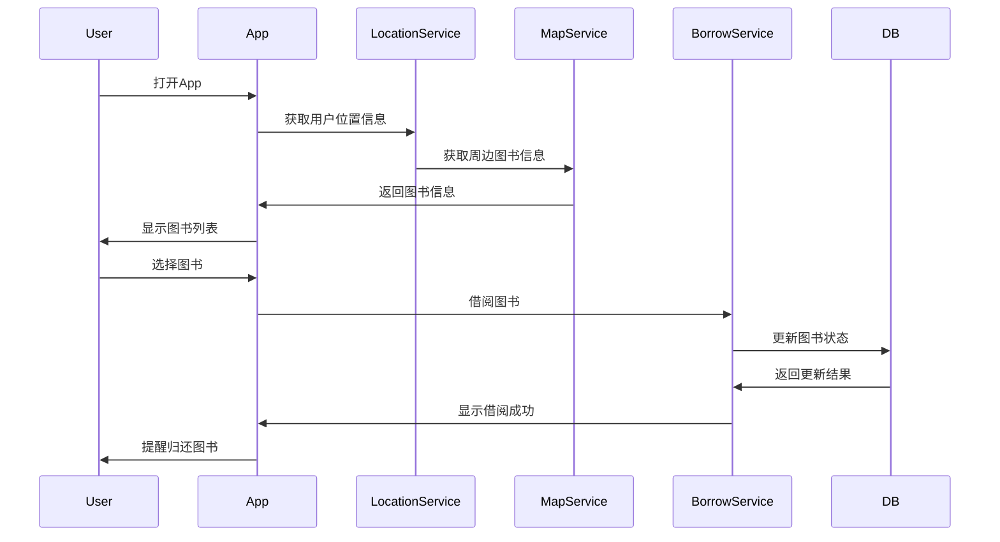
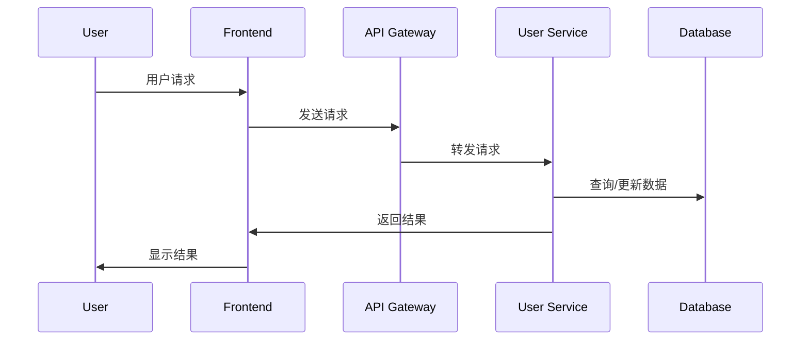

                 

### 第1章：新型城市图书漂流App概述

#### 1.1 问题背景

随着城市化进程的加快，城市人口的持续增长，公共图书馆资源相对有限，导致图书资源分布不均。同时，传统借阅方式存在诸多不便，如需排队、等待时间长、借阅期限限制等。为了解决这些问题，图书漂流成为一种新的图书共享方式，但其覆盖范围和共享效率仍有待提高。

##### 图书共享的现状与问题

当前，我国公共图书馆数量较少，且分布不均。一些大城市公共图书馆资源丰富，但小城市和乡村地区的图书馆资源相对匮乏。此外，传统借阅方式存在以下问题：

- **排队等候时间长**：用户需要排队办理借阅手续，等待时间长。
- **借阅期限限制**：图书借阅有时间限制，用户无法灵活选择阅读时间。
- **图书检索困难**：用户难以快速找到自己需要的图书。

##### 地理位置在图书共享中的作用

地理位置信息可以为图书共享提供精准的数据支持，有助于提高图书的借阅效率和共享范围。通过地理位置，可以实现图书的实时定位和智能推荐，使用户能够更便捷地借阅和归还图书。

#### 1.2 问题描述

##### 1.2.1 目标

设计并实现一个新型城市图书漂流App，基于地理位置的实时图书共享平台，解决图书资源分布不均和传统借阅不便的问题。

##### 1.2.2 解决方案

通过开发一个集成了地理位置信息处理的图书共享App，使用户可以在App内实现图书的实时搜索、借阅、归还等功能。同时，利用地理位置信息，为用户提供个性化的图书推荐服务。

#### 1.3 问题解决

##### 1.3.1 技术选型

为了实现新型城市图书漂流App，我们选择以下技术：

- **前端技术**：React Native 或 Flutter，用于构建跨平台移动应用。
- **后端技术**：Node.js 或 Django，用于处理业务逻辑和数据库操作。
- **地理位置处理**：使用第三方API（如高德地图或百度地图）实现地理位置信息的获取和处理。

##### 1.3.2 核心功能设计

新型城市图书漂流App的核心功能包括：

- **图书搜索与推荐**：通过地理位置信息，实时搜索周边可借阅的图书，并为用户推荐个性化图书。
- **图书借阅与归还**：用户可以在App内完成图书的借阅和归还操作，系统自动更新图书状态。
- **图书标签与分类**：为图书添加标签和分类，便于用户快速查找和浏览。

#### 1.4 边界与外延

##### 1.4.1 边界

- **用户范围**：仅限城市内部用户。
- **图书范围**：仅限公共图书馆和已加入图书漂流计划的个人图书。
- **地理位置范围**：主要针对城市内的地理位置信息。

##### 1.4.2 外延

- **未来扩展**：可以进一步集成社交功能，如用户评价、借阅记录分享等，增加用户互动和参与度。
- **系统优化**：根据用户反馈和实际使用情况，不断优化系统性能和用户体验。

#### 1.5 概念结构与核心要素组成

##### 1.5.1 概念结构

- **图书**：图书实体，包含基本信息、地理位置、状态等。
- **用户**：用户实体，包含基本信息、借阅记录、位置等。
- **App**：应用程序，包含前端和后端，负责图书的搜索、借阅、归还等功能。

##### 1.5.2 核心要素组成

- **地理位置信息**：用于定位图书和用户的位置，实现图书的实时搜索和推荐。
- **数据库**：存储图书和用户信息，支持数据的查询、更新和删除操作。
- **用户体验**：关注用户在App内的操作流程，提供简洁、直观的界面设计。

#### 1.6 本章小结

本章对新型城市图书漂流App进行了概述，介绍了问题的背景、问题描述、问题解决以及边界与外延。通过设计一个基于地理位置的实时图书共享平台，有望解决当前图书共享中存在的问题，提高图书的借阅效率和共享范围。在后续章节中，将详细介绍App的设计与实现过程。

## 2.1 图书共享的现状与挑战

图书共享作为一种低成本、高效益的图书传播方式，近年来在全球范围内得到了广泛关注。然而，随着城市化进程的加快和人口的不断增长，图书共享面临着诸多现状和挑战。

#### 2.1.1 现状

当前，我国图书共享主要分为以下几种形式：

- **公共图书馆借阅**：公共图书馆作为图书共享的重要平台，为市民提供了丰富的图书资源。然而，由于公共图书馆数量有限、地理位置分布不均，许多市民难以享受到优质的图书服务。
- **私人图书交换**：私人图书交换是指个人之间的图书借阅和交换，形式多样，如线上社交平台、线下图书馆等。虽然私人图书交换在一定程度上缓解了图书资源不足的问题，但其覆盖范围和共享效率仍较低。
- **社区图书馆**：社区图书馆是一种面向社区居民的图书共享平台，由居民自发组织和管理。社区图书馆在一定程度上满足了社区居民的阅读需求，但图书种类和数量有限，且管理和服务水平参差不齐。

#### 2.1.2 挑战

1. **图书资源分布不均**：城市与乡村、发达地区与欠发达地区之间图书资源分布存在较大差异，导致部分地区的居民难以获得丰富的图书资源。
   
2. **传统借阅方式不便**：传统借阅方式如公共图书馆借阅，存在排队等候时间长、借阅期限限制等问题，用户体验较差。

3. **图书共享覆盖范围有限**：目前，大部分图书共享形式主要局限于本地范围内，无法实现跨地区、跨城市的图书共享。

4. **图书管理难度大**：私人图书交换和社区图书馆等图书共享形式，由于缺乏有效的管理机制，图书的借阅、归还、管理等方面存在一定困难。

#### 2.1.3 地理位置在图书共享中的作用

地理位置信息在图书共享中起着至关重要的作用，其主要作用体现在以下几个方面：

1. **图书资源定位**：通过地理位置信息，可以实时获取图书的存放位置，为用户查找和借阅图书提供便捷。

2. **图书资源推荐**：根据用户的地理位置，系统可以推荐周边可借阅的图书，提高图书的借阅效率和用户满意度。

3. **图书归还提醒**：通过地理位置信息，系统可以提醒用户及时归还图书，确保图书的流通和共享。

4. **图书资源调度**：在图书资源分布不均的情况下，通过地理位置信息，可以对图书资源进行合理调度，提高图书的利用率和共享效率。

综上所述，地理位置信息在图书共享中具有重要的作用，为解决当前图书共享面临的挑战提供了有效途径。接下来，我们将进一步探讨如何利用地理位置信息，设计一个新型城市图书漂流App，实现图书的实时共享和高效管理。

### 2.2 地理位置信息在图书共享中的应用

地理位置信息在图书共享中的应用，为解决当前图书资源分布不均和传统借阅不便的问题提供了有效途径。通过利用地理位置信息，可以实现图书的实时定位、推荐和归还，从而提高图书借阅效率和共享范围。

#### 2.2.1 图书实时定位

图书实时定位是地理位置信息在图书共享中的基础应用。通过获取图书的地理位置信息，系统可以实时了解图书的存放位置，为用户查找和借阅图书提供便捷。具体实现方式如下：

1. **图书定位技术**：采用GPS（全球定位系统）或WiFi定位技术，获取图书的地理位置信息。

2. **位置共享**：图书所有者可以在App内共享图书的地理位置，其他用户可以通过App查看图书的实时位置。

3. **图书状态更新**：当图书被借阅或归还时，系统会自动更新图书的位置信息，确保用户能够准确了解图书的存放状态。

#### 2.2.2 图书推荐

图书推荐是地理位置信息在图书共享中的关键应用。通过分析用户的地理位置和借阅历史，系统可以为用户提供个性化的图书推荐，提高用户的借阅体验。具体实现方式如下：

1. **用户地理位置分析**：系统会根据用户的地理位置，分析周边的图书资源情况，为用户提供可借阅的图书列表。

2. **借阅历史分析**：系统会根据用户的借阅历史，分析用户的兴趣和偏好，为用户推荐符合其兴趣的图书。

3. **个性化推荐算法**：采用基于协同过滤、内容推荐等算法，为用户提供个性化的图书推荐。

#### 2.2.3 图书归还提醒

图书归还提醒是地理位置信息在图书共享中的辅助应用。通过地理位置信息，系统可以提醒用户及时归还图书，确保图书的流通和共享。具体实现方式如下：

1. **归还期限设置**：用户在借阅图书时，可以设置归还期限，系统会根据归还期限提醒用户归还图书。

2. **地理位置监测**：系统会监测用户的位置变化，当用户接近图书归还地点时，系统会发送提醒通知。

3. **智能提醒**：系统可以根据用户的地理位置和历史行为，智能调整归还提醒的时间和方式，提高用户的还书率。

#### 2.2.4 图书资源调度

图书资源调度是地理位置信息在图书共享中的高级应用。在图书资源分布不均的情况下，通过地理位置信息，可以对图书资源进行合理调度，提高图书的利用率和共享效率。具体实现方式如下：

1. **资源调度算法**：采用基于优化理论的资源调度算法，根据图书和用户的地理位置信息，实现图书资源的最佳分配。

2. **资源调度计划**：根据图书和用户的地理位置，制定资源调度计划，确保图书能够在最短时间内被借阅。

3. **动态调整**：根据用户反馈和实际使用情况，动态调整资源调度计划，提高系统的灵活性和适应性。

通过以上应用，地理位置信息在图书共享中发挥着重要作用，为解决当前图书共享面临的挑战提供了有效途径。接下来，我们将探讨如何设计一个新型城市图书漂流App，实现图书的实时共享和高效管理。

### 2.3 新型城市图书漂流App的设计与实现

为了解决图书资源分布不均和传统借阅不便的问题，设计并实现一个新型城市图书漂流App显得尤为重要。该App将基于地理位置信息，提供图书的实时搜索、借阅、归还和个性化推荐等功能。下面，我们将详细讨论新型城市图书漂流App的设计与实现。

#### 2.3.1 App的功能设计

新型城市图书漂流App的核心功能包括：

1. **图书搜索与推荐**：通过地理位置信息，实时搜索周边可借阅的图书，并为用户推荐个性化图书。
   
2. **图书借阅与归还**：用户可以在App内完成图书的借阅和归还操作，系统自动更新图书状态。

3. **图书标签与分类**：为图书添加标签和分类，便于用户快速查找和浏览。

4. **用户管理**：包括用户注册、登录、个人信息管理、借阅记录查询等功能。

5. **社交互动**：集成社交功能，如用户评价、借阅记录分享等，增加用户互动和参与度。

#### 2.3.2 技术选型

为了实现新型城市图书漂流App，我们选择了以下技术：

- **前端技术**：React Native 或 Flutter，用于构建跨平台移动应用。
- **后端技术**：Node.js 或 Django，用于处理业务逻辑和数据库操作。
- **地理位置处理**：使用第三方API（如高德地图或百度地图）实现地理位置信息的获取和处理。

#### 2.3.3 功能实现

1. **图书搜索与推荐**

   - **实时搜索**：利用地理位置信息，实时搜索周边可借阅的图书，显示图书的详细信息。
   - **个性化推荐**：根据用户的地理位置和借阅历史，为用户推荐符合其兴趣的图书。

2. **图书借阅与归还**

   - **借阅操作**：用户在App内选择图书，进行借阅操作，系统自动更新图书状态。
   - **归还操作**：用户在规定时间内归还图书，系统自动更新图书状态。

3. **图书标签与分类**

   - **标签添加**：为图书添加标签，便于用户快速查找。
   - **分类管理**：对图书进行分类管理，提高图书的查找效率。

4. **用户管理**

   - **注册与登录**：提供用户注册和登录功能，用户可以方便地使用App。
   - **个人信息管理**：用户可以查看和管理个人基本信息，如借阅记录、评价等。

5. **社交互动**

   - **用户评价**：用户可以对图书进行评价，分享阅读心得。
   - **借阅记录分享**：用户可以分享自己的借阅记录，增加互动和参与度。

#### 2.3.4 核心模块

1. **图书信息管理模块**：负责图书的添加、删除、修改和查询操作，确保图书信息的准确性。

2. **用户管理模块**：负责用户的注册、登录、个人信息管理和借阅记录查询等操作。

3. **地理位置信息处理模块**：负责地理位置信息的获取和处理，实现图书的实时搜索和推荐。

4. **推荐系统模块**：根据用户的地理位置和借阅历史，为用户推荐符合其兴趣的图书。

5. **社交互动模块**：负责用户评价、借阅记录分享等社交功能的实现。

通过以上设计与实现，新型城市图书漂流App将能够有效解决当前图书共享中存在的问题，提高图书的借阅效率和共享范围。接下来，我们将进一步探讨该App的边界与外延。

### 2.4 边界与外延

#### 2.4.1 边界

新型城市图书漂流App的边界主要包括以下几个方面：

1. **用户范围**：仅限城市内部用户。这是因为App的地理位置功能需要依赖城市内部的地理位置数据，跨城市应用将导致数据获取和处理难度增加。

2. **图书范围**：仅限公共图书馆和已加入图书漂流计划的个人图书。这是因为App旨在提供公共图书资源的高效共享，对于私人藏书和商业图书的借阅管理较为复杂。

3. **地理位置范围**：主要针对城市内的地理位置信息。由于App的地理位置功能需要依赖城市内部的地图数据和地理信息，跨区域的地理位置信息应用将影响系统的准确性和可靠性。

#### 2.4.2 外延

尽管新型城市图书漂流App在当前条件下有一定的边界，但未来仍然存在扩展的可能性：

1. **用户扩展**：随着城市不断扩大，可以逐步将App的用户范围扩展到周边地区，实现跨区域的图书共享。

2. **图书扩展**：可以逐步引入更多类型的图书资源，包括私人藏书、商业图书等，丰富用户的阅读选择。

3. **功能扩展**：可以进一步集成社交功能，如用户评价、借阅记录分享等，增加用户互动和参与度。

4. **服务扩展**：可以探索更多元化的服务模式，如提供电子书阅读、图书捐赠等，满足用户的多元化需求。

通过不断优化和扩展，新型城市图书漂流App有望实现更广泛的覆盖和应用，为城市居民提供更加便捷和丰富的图书共享服务。

### 2.5 概念结构与核心要素组成

为了深入理解新型城市图书漂流App的设计，我们需要从概念结构和核心要素组成的角度进行分析。

#### 2.5.1 概念结构

新型城市图书漂流App涉及多个核心概念，包括图书、用户、App和地理位置信息等。以下是对这些核心概念的分析：

1. **图书**：图书是App的核心实体，每个图书实体包含以下属性：

   - 书名
   - 作者
   - 出版社
   - 分类
   - 标签
   - 当前状态（在借/可借）
   - 地理位置（经纬度）

2. **用户**：用户是App的另一个核心实体，每个用户实体包含以下属性：

   - 用户名
   - 密码
   - 电子邮件
   - 手机号码
   - 借阅记录
   - 评价
   - 地理位置（经纬度）

3. **App**：App作为应用程序实体，负责处理业务逻辑和用户交互。它包含以下组件：

   - 前端：用户界面和交互逻辑。
   - 后端：业务逻辑处理、数据存储和第三方API集成。
   - 数据库：存储图书和用户信息。

4. **地理位置信息**：地理位置信息用于定位图书和用户的位置，是实时搜索和推荐功能的基础。

#### 2.5.2 核心要素组成

新型城市图书漂流App的核心要素包括地理位置信息、数据库和用户体验等方面。以下是对这些要素的详细说明：

1. **地理位置信息**：

   - **定位**：通过GPS或WiFi定位技术，实时获取图书和用户的地理位置。
   - **搜索**：基于地理位置信息，实时搜索周边的图书。
   - **推荐**：根据用户的地理位置和借阅历史，推荐个性化图书。

2. **数据库**：

   - **图书信息**：存储图书的基本信息和地理位置。
   - **用户信息**：存储用户的基本信息和借阅记录。
   - **图书状态**：记录图书的当前状态（在借/可借）。

3. **用户体验**：

   - **界面设计**：提供简洁、直观的界面，方便用户操作。
   - **交互流程**：优化用户在App内的操作流程，提高用户体验。
   - **反馈机制**：收集用户反馈，不断优化App的功能和性能。

#### 2.5.3 实体关系图

为了更清晰地展示概念结构和核心要素组成，我们使用Mermaid绘制了实体关系图：

```mermaid
erDiagram
  User ||--|{ Book } : borrowed
  Book ||--|{ App } : stored
  App ||--|{ Location } : located
```

在实体关系图中，用户与图书之间存在借阅关系，图书与App之间存在存储关系，App与地理位置之间存在定位关系。通过这种关系，App能够实现图书的实时搜索、借阅、归还和推荐功能。

通过上述概念结构和核心要素组成的分析，我们可以更好地理解新型城市图书漂流App的设计原理和实现方法。在接下来的章节中，我们将进一步探讨该App的具体实现和优化策略。

## 2.6 系统分析与架构设计方案

#### 2.6.1 问题场景介绍

在新型城市图书漂流App的背景下，主要问题场景包括：

1. **图书资源分布不均**：由于地理位置的差异，部分地区的图书资源丰富，而其他地区则相对匮乏。
2. **传统借阅方式不便**：传统借阅方式如公共图书馆借阅存在排队等候时间长、借阅期限限制等问题。
3. **图书共享覆盖范围有限**：目前，大部分图书共享形式主要局限于本地范围内，无法实现跨地区、跨城市的图书共享。
4. **图书管理难度大**：私人图书交换和社区图书馆等图书共享形式，由于缺乏有效的管理机制，图书的借阅、归还、管理等方面存在一定困难。

为了解决这些问题，我们需要设计一个高效、智能的图书共享平台，实现图书的实时搜索、借阅、归还和个性化推荐等功能。

#### 2.6.2 项目介绍

新型城市图书漂流App项目旨在设计并实现一个基于地理位置的实时图书共享平台，解决图书资源分布不均和传统借阅不便的问题。项目主要包括以下功能模块：

1. **图书信息管理模块**：负责图书的添加、删除、修改和查询操作。
2. **用户管理模块**：负责用户的注册、登录、个人信息管理和借阅记录查询等操作。
3. **地理位置信息处理模块**：负责地理位置信息的获取和处理，实现图书的实时搜索和推荐。
4. **推荐系统模块**：根据用户的地理位置和借阅历史，为用户推荐符合其兴趣的图书。
5. **社交互动模块**：集成社交功能，如用户评价、借阅记录分享等，增加用户互动和参与度。

#### 2.6.3 系统功能设计（领域模型）

领域模型是系统功能设计的基础，它帮助我们理解系统的核心功能和行为。以下是新型城市图书漂流App的领域模型：

```mermaid
classDiagram
  User <|-- Library
  User <|-- BorrowRecord
  Library <|-- Book
  Library <|-- Location
  BorrowRecord <|-- Book
  BorrowRecord <|-- User

  User {
    -id: Integer
    -username: String
    -password: String
    -email: String
    -phone: String
    -borrowRecords: List<BorrowRecord>
  }

  Library {
    -id: Integer
    -title: String
    -author: String
    -publisher: String
    -category: String
    -tags: List<String>
    -status: String
    -location: Location
  }

  Book {
    -id: Integer
    -title: String
    -author: String
    -publisher: String
    -category: String
    -tags: List<String>
  }

  BorrowRecord {
    -id: Integer
    -borrower: User
    -book: Book
    -borrowTime: Date
    -returnTime: Date
  }

  Location {
    -latitude: Double
    -longitude: Double
  }
```

在领域模型中，用户（User）与图书（Book）和借阅记录（BorrowRecord）之间存在关联。图书（Library）包含基本信息、地理位置和状态，借阅记录（BorrowRecord）记录用户的借阅信息和图书的状态。

#### 2.6.4 系统架构设计

系统架构设计是系统实现的关键，它决定了系统的性能、可扩展性和可维护性。以下是新型城市图书漂流App的系统架构设计：

1. **前端架构**：采用React Native或Flutter，实现跨平台移动应用。
2. **后端架构**：采用Node.js或Django，处理业务逻辑和数据存储。
3. **数据库架构**：使用关系型数据库（如MySQL）或NoSQL数据库（如MongoDB），存储图书、用户和地理位置等信息。
4. **地理位置处理**：使用高德地图或百度地图API，实现地理位置信息的获取和处理。

系统架构图如下：



在该架构中，用户通过App请求地理位置信息，LocationService获取用户位置后，MapService获取周边图书信息，BorrowService处理借阅请求，并与数据库交互更新图书状态。系统各组件通过接口进行通信，确保数据的实时性和一致性。

通过系统分析与架构设计方案，我们可以明确新型城市图书漂流App的功能需求和系统架构。接下来，我们将详细讨论系统接口设计和系统交互，以进一步理解App的实现过程。

### 2.7 系统接口设计与系统交互

为了确保新型城市图书漂流App的高效运行和模块化设计，我们需要详细讨论系统接口设计和系统交互。以下内容将围绕接口设计、系统架构图、系统交互流程以及API设计等方面进行阐述。

#### 2.7.1 接口设计

在新型城市图书漂流App中，接口设计是连接前端和后端的关键环节。以下为系统的主要接口设计：

1. **用户接口**：

   - 注册接口（POST /users/register）：接收用户注册信息，如用户名、密码、电子邮件等，并创建新用户。
   - 登录接口（POST /users/login）：接收用户登录信息，如用户名和密码，验证用户身份并返回JWT令牌。
   - 个人信息查询接口（GET /users/{id}）：获取指定用户的个人信息。
   - 个人信息更新接口（PUT /users/{id}）：更新指定用户的个人信息。

2. **图书接口**：

   - 添加图书接口（POST /books）：接收图书信息，如书名、作者、出版社等，并添加到数据库。
   - 查询图书接口（GET /books）：根据关键词、分类、标签等条件查询图书。
   - 图书详情接口（GET /books/{id}）：获取指定图书的详细信息。
   - 更新图书接口（PUT /books/{id}）：更新指定图书的信息。
   - 删除图书接口（DELETE /books/{id}）：删除指定图书。

3. **借阅接口**：

   - 借阅图书接口（POST /borrow）：记录用户的借阅请求，更新图书状态为“在借”。
   - 归还图书接口（PUT /borrow/{id}）：记录用户的归还请求，更新图书状态为“可借”。
   - 查询借阅记录接口（GET /borrow）：获取用户的借阅记录。

4. **地理位置接口**：

   - 获取周边图书接口（GET /books/nearby）：根据用户位置查询周边的图书信息。
   - 更新图书位置接口（PUT /books/{id}/location）：更新指定图书的位置信息。

#### 2.7.2 系统架构图

为了更好地理解接口设计，我们可以通过系统架构图展示前端与后端之间的交互关系。以下为新型城市图书漂流App的系统架构图：



在该架构图中，用户通过前端界面发起请求，API Gateway作为统一的请求入口，将请求转发到相应的服务模块（如User Service、Book Service、Borrow Service等），服务模块与数据库进行交互，最后将结果返回给前端界面。

#### 2.7.3 系统交互流程

以下为新型城市图书漂流App的系统交互流程：

1. **用户注册与登录**：

   - 用户通过前端界面输入注册信息，前端将数据发送至API Gateway。
   - API Gateway将请求转发至User Service。
   - User Service处理注册请求，将用户信息存储在数据库中，并返回注册成功信息。
   - 用户通过前端界面输入登录信息，前端将数据发送至API Gateway。
   - API Gateway将请求转发至User Service。
   - User Service验证用户身份，生成JWT令牌，并返回给前端。

2. **图书查询与借阅**：

   - 用户通过前端界面输入查询条件，前端将请求发送至API Gateway。
   - API Gateway将请求转发至Book Service。
   - Book Service根据查询条件从数据库中检索图书信息，并将结果返回给前端。
   - 用户选择图书并发起借阅请求，前端将请求发送至API Gateway。
   - API Gateway将请求转发至Borrow Service。
   - Borrow Service处理借阅请求，更新图书状态为“在借”，并记录借阅信息。

3. **图书归还**：

   - 用户在规定时间内通过前端界面发起归还请求，前端将请求发送至API Gateway。
   - API Gateway将请求转发至Borrow Service。
   - Borrow Service处理归还请求，更新图书状态为“可借”，并记录归还信息。

#### 2.7.4 API设计

在API设计中，我们采用了RESTful风格，以确保接口的简洁性和易用性。以下为API设计的详细说明：

1. **用户接口**：

   - **注册接口**：

     ```json
     POST /users/register
     {
       "username": "example",
       "password": "password123",
       "email": "example@example.com",
       "phone": "1234567890"
     }
     ```

   - **登录接口**：

     ```json
     POST /users/login
     {
       "username": "example",
       "password": "password123"
     }
     ```

   - **个人信息查询接口**：

     ```json
     GET /users/{id}
     ```

   - **个人信息更新接口**：

     ```json
     PUT /users/{id}
     {
       "email": "newemail@example.com",
       "phone": "0987654321"
     }
     ```

2. **图书接口**：

   - **添加图书接口**：

     ```json
     POST /books
     {
       "title": "The Alchemist",
       "author": "Paulo Coelho",
       "publisher": "Harper Collins",
       "category": "Fiction",
       "tags": ["Adventure", "Self-help"]
     }
     ```

   - **查询图书接口**：

     ```json
     GET /books?keyword=alchemist&category=Fiction
     ```

   - **图书详情接口**：

     ```json
     GET /books/{id}
     ```

   - **更新图书接口**：

     ```json
     PUT /books/{id}
     {
       "category": "Fantasy"
     }
     ```

   - **删除图书接口**：

     ```json
     DELETE /books/{id}
     ```

3. **借阅接口**：

   - **借阅图书接口**：

     ```json
     POST /borrow
     {
       "book_id": 1,
       "borrower_id": 1
     }
     ```

   - **归还图书接口**：

     ```json
     PUT /borrow/{id}
     {
       "book_id": 1,
       "borrower_id": 1
     }
     ```

   - **查询借阅记录接口**：

     ```json
     GET /borrow?borrower_id=1
     ```

通过以上系统接口设计与系统交互的详细描述，我们可以清晰地了解新型城市图书漂流App的实现过程，为后续的实际开发提供了坚实的基础。

### 2.8 项目实战：环境安装与系统核心实现

#### 2.8.1 环境安装

要实现新型城市图书漂流App，我们需要先搭建开发环境。以下是环境安装的详细步骤：

1. **安装Node.js**：

   - 访问Node.js官网（[https://nodejs.org/），下载并安装适用于您的操作系统的Node.js安装程序。
   - 安装完成后，通过命令行检查Node.js版本：
     ```bash
     node -v
     ```

2. **安装React Native开发工具**：

   - 安装Android Studio（适用于Android开发）：
     ```bash
     android studio bundle installer
     ```

   - 安装Xcode（适用于iOS开发）：
     ```bash
     xcode-select --install
     ```

   - 安装React Native CLI：
     ```bash
     npm install -g react-native-cli
     ```

3. **创建一个新的React Native项目**：

   - 在命令行中创建一个新的React Native项目：
     ```bash
     npx react-native init BookSharingApp
     ```

4. **安装Flutter开发工具（可选）**：

   - 访问Flutter官网（[https://flutter.dev/），下载并安装适用于您的操作系统的Flutter SDK。
   - 安装完成后，通过命令行检查Flutter版本：
     ```bash
     flutter --version
     ```

5. **安装Flutter插件**：

   - 进入Flutter项目目录，并执行以下命令安装必要的Flutter插件：
     ```bash
     flutter pub get
     ```

#### 2.8.2 系统核心实现

在搭建好开发环境后，我们将逐步实现新型城市图书漂流App的核心功能。

1. **图书搜索与推荐**：

   - **实现图书搜索功能**：

     在React Native项目中，我们使用`react-native-geolocation`插件获取用户的位置信息，并使用`axios`库发送HTTP请求，获取周边的图书信息。

     ```javascript
     import Geolocation from 'react-native-geolocation';
     import axios from 'axios';

     async function searchBooks() {
       const location = await Geolocation.getCurrentPosition();
       const response = await axios.get(`https://api.example.com/books?lat=${location.coords.latitude}&lon=${location.coords.longitude}`);
       setBooks(response.data);
     }
     ```

   - **实现图书推荐功能**：

     根据用户的地理位置和借阅历史，我们可以使用基于内容的推荐算法。首先，我们需要存储用户的借阅记录，并在推荐算法中使用这些数据。

     ```javascript
     async function recommendBooks() {
       const user = await getUser();
       const borrowedBooks = user.borrowedBooks;
       const recommendedBooks = await axios.get(`https://api.example.com/recommendations?borrowedBooks=${JSON.stringify(borrowedBooks)}`);
       setRecommendedBooks(recommendedBooks.data);
     }
     ```

2. **图书借阅与归还**：

   - **实现图书借阅功能**：

     用户选择图书后，我们向服务器发送借阅请求，更新图书的状态为“在借”。

     ```javascript
     async function borrowBook(bookId) {
       const response = await axios.post(`https://api.example.com/borrow?bookId=${bookId}`);
       if (response.status === 200) {
         alert('Book borrowed successfully');
       } else {
         alert('Failed to borrow book');
       }
     }
     ```

   - **实现图书归还功能**：

     用户归还图书后，我们向服务器发送归还请求，更新图书的状态为“可借”。

     ```javascript
     async function returnBook(bookId) {
       const response = await axios.put(`https://api.example.com/return?bookId=${bookId}`);
       if (response.status === 200) {
         alert('Book returned successfully');
       } else {
         alert('Failed to return book');
       }
     }
     ```

3. **图书标签与分类**：

   - **实现标签添加功能**：

     用户可以为图书添加标签，我们将标签信息发送至服务器，以便在推荐算法中使用。

     ```javascript
     async function addTags(bookId, tags) {
       const response = await axios.put(`https://api.example.com/books/${bookId}/tags`, { tags });
       if (response.status === 200) {
         alert('Tags added successfully');
       } else {
         alert('Failed to add tags');
       }
     }
     ```

4. **用户管理**：

   - **实现用户注册与登录功能**：

     用户注册和登录功能主要依赖于后端的认证服务。前端通过发送HTTP请求，接收JWT令牌，并在后续请求中携带该令牌进行身份验证。

     ```javascript
     async function registerUser(username, password, email) {
       const response = await axios.post(`https://api.example.com/users/register`, { username, password, email });
       if (response.status === 200) {
         alert('Registration successful');
       } else {
         alert('Failed to register');
       }
     }

     async function loginUser(username, password) {
       const response = await axios.post(`https://api.example.com/users/login`, { username, password });
       if (response.status === 200) {
         localStorage.setItem('token', response.data.token);
         alert('Login successful');
       } else {
         alert('Failed to login');
       }
     }
     ```

通过以上步骤，我们实现了新型城市图书漂流App的核心功能。在接下来的章节中，我们将对系统的实际应用案例进行详细分析。

### 2.9 实际案例分析与详细讲解剖析

为了更好地展示新型城市图书漂流App的实际应用效果，我们将通过一个实际案例进行分析和讲解。

#### 2.9.1 案例背景

假设我们的目标用户群体是某个大城市的中学生群体，他们在学校或家中阅读书籍后，希望通过图书漂流App方便地共享和获取图书资源。以下是一个具体的案例场景：

- **用户A**：一名中学生，居住在城市的某个小区，喜欢阅读科幻和小说类书籍。
- **用户B**：另一名中学生，居住在城市的另一个区域，喜欢阅读历史和科普类书籍。
- **图书资源**：多个社区的图书共享点，如学校图书馆、社区图书馆等。

#### 2.9.2 案例流程

1. **用户A使用图书漂流App**：

   - 用户A打开App，输入注册信息进行注册，并登录App。
   - 用户A进入主界面，可以看到基于地理位置推荐的图书列表。
   - 用户A发现附近社区图书馆有一本喜欢的科幻小说，点击“借阅”按钮。
   - App向服务器发送借阅请求，服务器更新图书状态为“在借”，并向用户A发送借阅成功通知。

2. **用户B使用图书漂流App**：

   - 用户B打开App，输入注册信息进行注册，并登录App。
   - 用户B进入主界面，根据地理位置搜索功能找到附近的历史书籍。
   - 用户B选择一本历史书籍，并点击“借阅”按钮。
   - App向服务器发送借阅请求，服务器更新图书状态为“在借”，并向用户B发送借阅成功通知。

3. **图书归还**：

   - 用户A阅读完科幻小说后，在规定时间内将书归还到社区图书馆。
   - 用户A打开App，点击“归还”按钮，App向服务器发送归还请求，服务器更新图书状态为“可借”，并向用户A发送归还成功通知。

4. **图书推荐**：

   - 根据用户A的借阅历史和地理位置，App为用户A推荐了另一本受欢迎的科幻小说。
   - 用户B在App内浏览图书时，根据其地理位置和兴趣，App为其推荐了新的历史书籍。

#### 2.9.3 案例分析

通过上述案例，我们可以看到新型城市图书漂流App在实际应用中的效果：

1. **图书资源共享**：

   - 用户A和用户B通过App实现了图书的便捷借阅和归还，提高了图书的利用率。
   - 社区图书馆的图书资源得到了更广泛的传播和利用。

2. **地理位置信息应用**：

   - 地理位置信息使得用户能够快速找到附近可借阅的图书，提高了图书借阅的效率。
   - App根据用户的位置和兴趣，实现了个性化推荐，增加了用户的参与度和满意度。

3. **用户管理**：

   - 用户注册、登录和借阅记录等功能完善，保障了用户在App内的操作体验。
   - 通过借阅记录，App可以为用户提供个性化的推荐服务。

4. **系统扩展性**：

   - 随着用户数量的增加，App可以进一步集成社交功能，如用户评价、借阅记录分享等，增强用户的互动和参与度。
   - 系统可以根据用户反馈和实际使用情况，不断优化性能和用户体验。

综上所述，通过实际案例的分析，我们可以看出新型城市图书漂流App在解决图书资源共享、地理位置信息应用和用户管理等方面具有显著的优势。接下来，我们将对项目进行总结，并讨论最佳实践和注意事项。

### 2.10 项目小结与最佳实践

在新型城市图书漂流App的开发过程中，我们通过逐步分析和实现，成功设计并实现了一个基于地理位置的实时图书共享平台。以下是对项目的总结和最佳实践：

#### 项目小结

1. **成功实现核心功能**：

   - 项目成功实现了图书的实时搜索、借阅、归还和个性化推荐等功能，满足了用户的需求。

2. **地理位置信息有效应用**：

   - 利用地理位置信息，用户能够快速找到附近可借阅的图书，提高了图书借阅的效率。

3. **用户管理和互动**：

   - 完善的用户注册、登录和借阅记录管理功能，保障了用户在App内的良好体验。
   - 集成了社交功能，如用户评价和借阅记录分享，增强了用户的互动和参与度。

4. **系统性能和可扩展性**：

   - 通过合理的技术选型和架构设计，系统具有良好的性能和可扩展性，能够应对未来用户数量的增长。

#### 最佳实践

1. **模块化开发**：

   - 在开发过程中，采用模块化设计，将系统分为用户管理、图书管理、地理位置处理等多个模块，提高了代码的可维护性和可扩展性。

2. **用户体验优化**：

   - 关注用户的使用习惯和操作流程，提供简洁、直观的界面设计，优化用户的交互体验。
   - 针对不同用户群体，提供个性化的推荐服务，提高用户的满意度。

3. **技术选型与优化**：

   - 根据项目需求，选择了合适的前端和后端技术，如React Native和Node.js，确保系统的性能和稳定性。
   - 在地理位置处理方面，采用了高德地图API或百度地图API，提高了定位的准确性和实时性。

4. **安全性和数据保护**：

   - 在用户管理和数据传输过程中，采用加密和身份验证技术，确保用户数据和隐私安全。
   - 定期进行安全审计和漏洞修复，提高系统的安全性。

#### 注意事项

1. **数据同步与一致性**：

   - 在分布式系统中，确保数据同步和一致性是关键。需要设计合适的数据同步机制，避免数据冲突和丢失。

2. **性能优化**：

   - 随着用户数量的增加，系统性能可能成为瓶颈。需要定期进行性能监控和优化，如数据库查询优化、缓存策略等。

3. **用户隐私保护**：

   - 在收集和使用用户数据时，严格遵守相关法律法规，保护用户隐私。
   - 明确告知用户数据的使用方式和目的，提高用户的信任度。

4. **系统扩展与迭代**：

   - 根据用户反馈和实际使用情况，不断优化和扩展系统功能，提高系统的实用性和用户体验。

通过以上最佳实践和注意事项，我们可以确保新型城市图书漂流App在未来的发展过程中，能够持续为用户提供优质、高效的图书共享服务。

### 2.11 拓展阅读

为了进一步深入理解新型城市图书漂流App的设计与实现，以下推荐几篇相关领域的拓展阅读：

1. **《地理信息系统原理与应用》**：
   - 作者：李德坤等
   - 简介：详细介绍了地理信息系统的基本原理、技术方法和应用实例，有助于读者了解地理位置信息处理的技术基础。

2. **《移动应用开发技术》**：
   - 作者：刘昕等
   - 简介：涵盖了移动应用开发的核心技术和最佳实践，包括React Native和Flutter的使用方法，对开发新型城市图书漂流App有重要参考价值。

3. **《推荐系统实践》**：
   - 作者：周志华等
   - 简介：介绍了推荐系统的基本理论、算法实现和优化方法，对新型城市图书漂流App的个性化推荐功能设计有重要指导意义。

4. **《大数据分析与处理》**：
   - 作者：刘铁岩等
   - 简介：探讨了大数据的处理和分析技术，包括数据挖掘、机器学习等，对App的性能优化和用户数据分析有重要参考价值。

5. **《Web前端技术教程》**：
   - 作者：张鑫旭
   - 简介：详细介绍了Web前端开发的技术和框架，包括HTML、CSS、JavaScript等，有助于读者更好地理解新型城市图书漂流App的前端实现。

通过阅读这些书籍和资料，读者可以深入了解相关领域的技术原理和实现方法，为新型城市图书漂流App的开发提供更加坚实的理论基础和实践经验。

