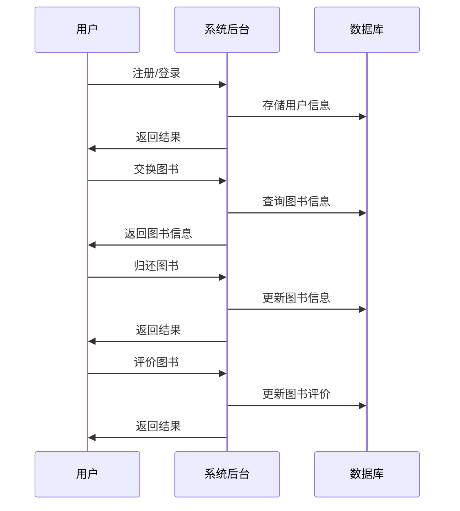
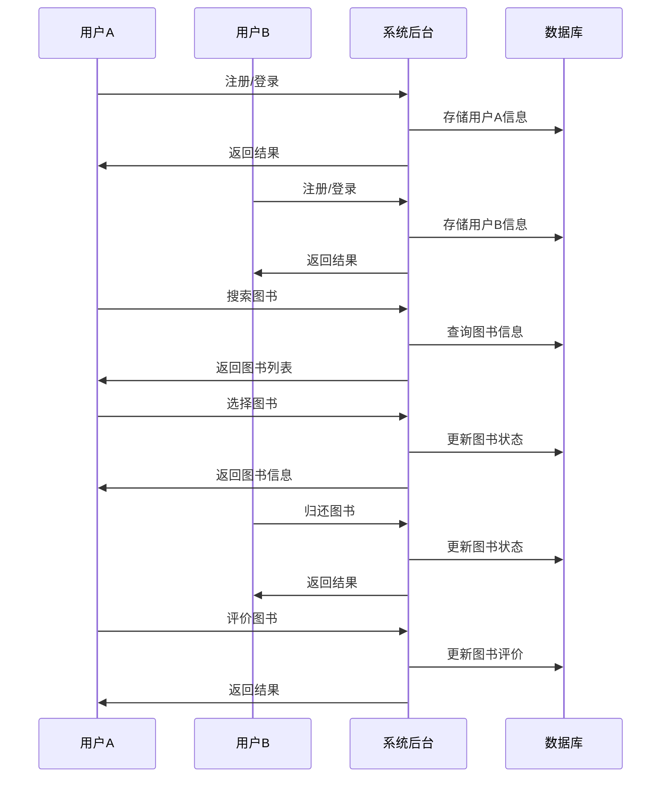
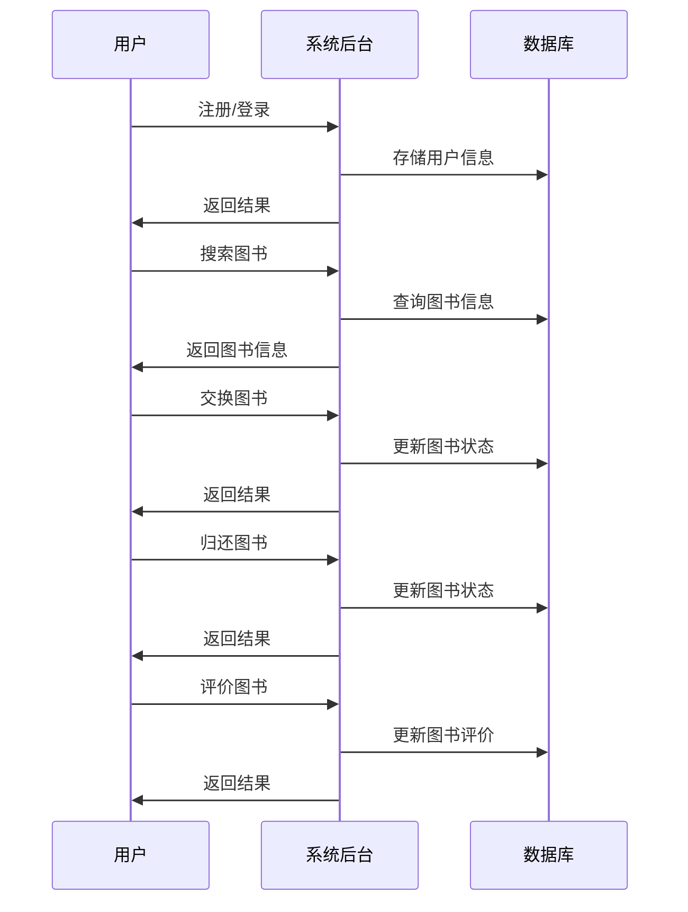

                 

# 新型城市图书漂流站：24小时自助图书交换系统

## 关键词
- 城市图书漂流站
- 自助图书交换系统
- 图书注册与登录
- 图书信息管理
- 图书交换与归还
- 图书评价功能

## 摘要
本文将详细介绍新型城市图书漂流站的设计与实现，一个旨在为城市居民提供24小时自助图书交换服务的系统。文章首先阐述了该系统的背景与核心功能，然后深入分析了系统的核心概念与联系，接着详细描述了系统分析与架构设计方案，最后通过实际项目实战，展示了系统核心实现的方法与应用。

----------------------------------------------------------------

## 第一部分：背景介绍

### 第1章 问题背景

#### 1.1 问题描述

随着城市化的快速发展，城市居民对于文化娱乐、知识获取等方面的需求日益增长。传统的图书馆、书店等文化场所已经无法满足现代城市居民的多样化需求。为了更好地丰富城市居民的文化生活，提高知识传播效率，新型城市图书漂流站应运而生。该系统旨在为城市居民提供一个24小时自助图书交换平台，使居民可以在任何时间、任何地点自由地交换图书，无需支付任何费用。

#### 1.2 问题解决

为了实现这一目标，需要设计并实现一个高效、安全、易用的图书交换系统。该系统需要具备以下核心功能：

1. **图书的注册与登录功能**：居民可以通过系统注册账号，并登录系统进行图书的交换。
2. **图书的信息管理功能**：系统可以存储图书的信息，包括书名、作者、出版日期等。
3. **图书的交换功能**：居民可以在系统中选择自己想阅读的图书，并将其从他人手中“借阅”。
4. **图书的归还功能**：居民在阅读完图书后，可以将其归还给系统，以便他人再次借阅。
5. **图书的评价功能**：居民可以对借阅的图书进行评价，以帮助其他居民更好地选择图书。

#### 1.3 边界与外延

- **系统边界**：系统主要面向城市居民，提供图书的交换服务。系统可以支持多种图书交换模式，如自助借阅、自助归还等。
- **系统外延**：系统可以与其他图书馆、书店等机构合作，扩大图书的来源和种类，提高图书交换的效率。

### 第2章 核心概念与联系

#### 2.1 核心概念

- **图书漂流站**：一种提供图书交换服务的系统。
- **自助图书交换**：居民可以在任何时间、任何地点自由地交换图书，无需支付任何费用。
- **图书注册与登录**：居民通过系统注册账号，并登录系统进行图书的交换。
- **图书信息管理**：系统可以存储图书的信息，包括书名、作者、出版日期等。

#### 2.2 概念属性特征对比表格

| 概念       | 特征                | 说明                                                     |
| ---------- | ------------------- | -------------------------------------------------------- |
| 图书漂流站 | 24小时自助服务     | 居民可以在任何时间、任何地点进行图书交换               |
| 自助图书交换 | 自由借阅与归还   | 居民无需支付任何费用，自由地交换图书                 |
| 图书注册与登录 | 账号认证         | 居民通过注册账号，进行图书交换                        |
| 图书信息管理 | 信息存储与查询   | 系统存储图书的信息，方便居民进行图书交换               |

#### 2.3 ER实体关系图架构

```mermaid
erDiagram
  居民 ||--|{ 图书漂流站 }||>
  图书漂流站 ||--|{ 图书 }||>
  图书 ||--|{ 居民 }||>
```

### 第3章 系统分析与架构设计方案

#### 3.1 问题场景介绍

新型城市图书漂流站是一种为城市居民提供24小时自助图书交换服务的系统。系统需要在任何时间、任何地点都能够稳定、高效地运行，并提供良好的用户体验。

#### 3.2 系统功能设计

- **用户功能**：居民可以通过系统注册账号，登录系统，进行图书的交换、评价等操作。
- **管理功能**：管理员可以通过系统进行图书的信息管理、系统维护等操作。

#### 3.3 系统架构设计



#### 3.4 系统接口设计

- **用户注册接口**：用于居民注册账号。
- **用户登录接口**：用于居民登录系统。
- **图书交换接口**：用于居民进行图书交换。
- **图书归还接口**：用于居民归还图书。
- **图书评价接口**：用于居民对图书进行评价。

#### 3.5 系统交互



----------------------------------------------------------------

## 第二部分：核心概念与联系

### 第4章 核心概念

#### 4.1 图书漂流站

图书漂流站是一种提供图书交换服务的系统，其核心功能是让城市居民在任何时间、任何地点都可以自由地交换图书。图书漂流站不仅是一个实体场所，更是一个在线服务平台。通过图书漂流站，居民可以方便地查询图书信息、进行图书交换、评价图书等。

#### 4.2 自助图书交换

自助图书交换是指居民在图书漂流站内，无需支付任何费用，自由地借阅和归还图书。这种交换模式打破了传统的借阅模式，实现了图书资源的最大化利用。自助图书交换不仅提高了图书的流通率，还促进了居民之间的文化交流。

#### 4.3 图书注册与登录

图书注册与登录功能是图书漂流站的必备功能。居民需要通过注册账号，登录系统，才能进行图书的交换、评价等操作。图书注册与登录功能确保了系统的安全性和可靠性，同时方便管理员对用户进行管理。

#### 4.4 图书信息管理

图书信息管理功能是图书漂流站的核心之一。系统需要存储图书的各种信息，如书名、作者、出版日期等。通过图书信息管理功能，居民可以方便地查询图书信息，了解图书的来源、流行度等。

### 第5章 概念属性特征对比表格

| 概念       | 特征                | 说明                                                     |
| ---------- | ------------------- | -------------------------------------------------------- |
| 图书漂流站 | 24小时自助服务     | 居民可以在任何时间、任何地点进行图书交换               |
| 自助图书交换 | 自由借阅与归还   | 居民无需支付任何费用，自由地交换图书                 |
| 图书注册与登录 | 账号认证         | 居民通过注册账号，进行图书交换                        |
| 图书信息管理 | 信息存储与查询   | 系统存储图书的信息，方便居民进行图书交换               |

### 第6章 ER实体关系图架构

```mermaid
erDiagram
  用户 ||--|{ 图书漂流站 }||>
  图书漂流站 ||--|{ 图书 }||>
  图书 ||--|{ 用户 }||>
  用户 ||--|{ 图书交换 }||>
  图书交换 ||--|{ 用户 }||>
  图书交换 ||--|{ 图书 }||>
```

----------------------------------------------------------------

## 第三部分：系统分析与架构设计方案

### 第7章 问题场景介绍

新型城市图书漂流站是一种为城市居民提供24小时自助图书交换服务的系统。该系统旨在解决城市居民在图书借阅方面的需求，提高图书的流通率，促进文化交流。为了实现这一目标，系统需要在任何时间、任何地点都能够稳定、高效地运行，并提供良好的用户体验。

### 第8章 系统功能设计

#### 8.1 用户功能

- **注册/登录功能**：居民可以通过系统注册账号，并登录系统进行图书的交换、评价等操作。
- **图书搜索功能**：居民可以在系统中查询自己感兴趣的图书，了解图书的详细信息。
- **图书交换功能**：居民可以在系统中选择自己想阅读的图书，并将其从他人手中“借阅”。
- **图书归还功能**：居民在阅读完图书后，可以将其归还给系统，以便他人再次借阅。
- **图书评价功能**：居民可以对借阅的图书进行评价，以帮助其他居民更好地选择图书。

#### 8.2 管理功能

- **图书信息管理功能**：管理员可以通过系统进行图书的信息管理，包括添加、修改、删除图书信息等。
- **用户管理功能**：管理员可以通过系统对用户进行管理，包括添加、修改、删除用户信息等。
- **系统维护功能**：管理员可以通过系统进行系统维护，包括更新系统版本、修复系统漏洞等。

### 第9章 系统架构设计

#### 9.1 系统架构概述

新型城市图书漂流站采用B/S架构，即浏览器/服务器架构。该架构具有如下特点：

- **易用性**：用户可以通过浏览器访问系统，无需安装额外的软件。
- **可扩展性**：系统可以方便地扩展功能，如增加新功能模块、支持多种设备等。
- **安全性**：系统采用多种安全措施，确保用户信息和图书信息安全。

#### 9.2 系统模块划分

新型城市图书漂流站系统模块划分如下：

- **用户模块**：包括用户注册、登录、个人信息管理、图书交换、图书归还、图书评价等功能。
- **图书模块**：包括图书信息管理、图书搜索、图书交换等功能。
- **管理员模块**：包括图书信息管理、用户管理、系统维护等功能。

#### 9.3 系统架构图



### 第10章 系统接口设计

#### 10.1 用户接口设计

- **用户注册接口**：用于居民注册账号。
- **用户登录接口**：用于居民登录系统。
- **用户个人信息管理接口**：用于居民管理个人信息。
- **图书搜索接口**：用于居民查询图书信息。
- **图书交换接口**：用于居民进行图书交换。
- **图书归还接口**：用于居民归还图书。
- **图书评价接口**：用于居民对图书进行评价。

#### 10.2 管理接口设计

- **图书信息管理接口**：用于管理员进行图书信息管理。
- **用户管理接口**：用于管理员进行用户管理。
- **系统维护接口**：用于管理员进行系统维护。

### 第11章 系统交互

#### 11.1 用户交互流程

1. 用户访问系统首页，点击“注册”按钮。
2. 用户填写注册信息，包括用户名、密码、邮箱等，提交注册请求。
3. 系统后台验证注册信息，将用户信息存储到数据库，返回注册成功结果。
4. 用户点击“登录”按钮，输入用户名和密码。
5. 系统后台验证用户信息，将用户登录到系统中。
6. 用户在系统中查询图书信息，选择感兴趣的图书。
7. 用户点击“交换”按钮，将图书添加到借阅列表。
8. 用户阅读完图书后，点击“归还”按钮，将图书归还给系统。
9. 用户对借阅的图书进行评价，提交评价信息。

#### 11.2 管理员交互流程

1. 管理员登录系统，进入管理界面。
2. 管理员查询用户信息，包括用户名、密码、邮箱等。
3. 管理员添加、修改、删除用户信息。
4. 管理员查询图书信息，包括书名、作者、出版日期等。
5. 管理员添加、修改、删除图书信息。
6. 管理员进行系统维护，如更新系统版本、修复系统漏洞等。

----------------------------------------------------------------

## 第四部分：项目实战

### 第12章 环境安装

在开始项目实战之前，我们需要安装一些必要的开发环境和软件。以下是环境安装的步骤：

1. 安装Python解释器：Python是一种广泛使用的编程语言，我们将在项目中使用Python进行开发。首先，我们需要从Python官网下载并安装Python解释器。
2. 安装Django框架：Django是一个高层次的Python Web框架，我们将在项目中使用Django来构建图书漂流站系统。安装Django的命令如下：

```bash
pip install django
```

3. 安装SQLite数据库：SQLite是一种轻量级的数据库，我们将使用它来存储系统的数据。安装SQLite的命令如下：

```bash
pip install pysqlite3
```

4. 安装其他依赖库：根据项目的需要，我们可能需要安装一些其他的依赖库，如Django REST framework、Django admin等。安装依赖库的命令如下：

```bash
pip install django-rest-framework
pip install django-admin
```

### 第13章 系统核心实现

在环境安装完成后，我们可以开始实现系统的核心功能。以下是系统核心实现的步骤：

1. **创建Django项目**：使用Django命令创建一个项目，命名为`book_exchange`。

```bash
django-admin startproject book_exchange
```

2. **创建Django应用**：在项目中创建一个应用，命名为`books`。

```bash
python manage.py startapp books
```

3. **定义模型**：在`books`应用的`models.py`文件中定义图书和用户模型。

```python
from django.db import models

class User(models.Model):
    username = models.CharField(max_length=100)
    password = models.CharField(max_length=100)
    email = models.CharField(max_length=100)

class Book(models.Model):
    title = models.CharField(max_length=100)
    author = models.CharField(max_length=100)
    publisher = models.CharField(max_length=100)
    publish_date = models.DateField()
    status = models.CharField(max_length=10)  # "available" 或 "borrowed"
```

4. **迁移数据库**：在`books`应用的`migrations`文件夹中创建迁移文件，并将模型迁移到数据库中。

```bash
python manage.py makemigrations books
python manage.py migrate
```

5. **创建用户接口**：在`books`应用的`views.py`文件中创建用户接口。

```python
from django.http import JsonResponse
from .models import User

def register(request):
    if request.method == 'POST':
        username = request.POST.get('username')
        password = request.POST.get('password')
        email = request.POST.get('email')
        user = User(username=username, password=password, email=email)
        user.save()
        return JsonResponse({'status': 'success'})
    return JsonResponse({'status': 'failure'})
```

6. **创建图书接口**：在`books`应用的`views.py`文件中创建图书接口。

```python
from django.http import JsonResponse
from .models import Book

def search_books(request):
    if request.method == 'GET':
        title = request.GET.get('title')
        books = Book.objects.filter(title__icontains=title)
        books_data = [{'title': book.title, 'author': book.author, 'publisher': book.publisher, 'publish_date': book.publish_date, 'status': book.status} for book in books]
        return JsonResponse({'books': books_data})
    return JsonResponse({'status': 'failure'})
```

7. **运行项目**：在`book_exchange`项目的根目录下运行项目。

```bash
python manage.py runserver
```

现在，我们可以在浏览器中访问系统，进行用户注册、图书搜索等操作。

### 第14章 代码应用解读与分析

在本节中，我们将对系统核心实现的代码进行解读与分析。

#### 14.1 用户接口代码解读

用户接口代码主要实现了用户注册功能。在`views.py`文件中，我们定义了一个名为`register`的函数，该函数接收一个HTTP POST请求，并从请求中获取用户名、密码和邮箱等信息。然后，我们将这些信息存储到`User`模型中，并将用户信息保存到数据库中。最后，我们返回一个JSON响应，告知客户端注册是否成功。

```python
from django.http import JsonResponse
from .models import User

def register(request):
    if request.method == 'POST':
        username = request.POST.get('username')
        password = request.POST.get('password')
        email = request.POST.get('email')
        user = User(username=username, password=password, email=email)
        user.save()
        return JsonResponse({'status': 'success'})
    return JsonResponse({'status': 'failure'})
```

#### 14.2 图书接口代码解读

图书接口代码主要实现了图书搜索功能。在`views.py`文件中，我们定义了一个名为`search_books`的函数，该函数接收一个HTTP GET请求，并从请求中获取图书标题等信息。然后，我们使用Django ORM查询数据库中的图书信息，并将查询结果转换为JSON格式，返回给客户端。

```python
from django.http import JsonResponse
from .models import Book

def search_books(request):
    if request.method == 'GET':
        title = request.GET.get('title')
        books = Book.objects.filter(title__icontains=title)
        books_data = [{'title': book.title, 'author': book.author, 'publisher': book.publisher, 'publish_date': book.publish_date, 'status': book.status} for book in books]
        return JsonResponse({'books': books_data})
    return JsonResponse({'status': 'failure'})
```

#### 14.3 代码应用分析

在用户接口代码中，我们使用Django ORM进行数据库操作，实现了用户注册功能。Django ORM是一种强大且易于使用的数据库操作工具，它允许我们在Python代码中直接操作数据库，而不需要编写SQL语句。这使得代码更加简洁、易读，同时提高了开发效率。

在图书接口代码中，我们同样使用Django ORM查询数据库中的图书信息，并将查询结果转换为JSON格式，返回给客户端。这种做法使得接口调用更加灵活、方便，客户端可以根据需要查询不同的图书信息。

### 第15章 实际案例分析与详细讲解剖析

在本节中，我们将通过一个实际案例，对系统的核心实现进行详细讲解与分析。

#### 15.1 案例背景

假设有两位居民，张三和李四。张三想借阅一本名为《三体》的图书，而李四正在阅读这本书。现在，我们需要分析系统如何处理这个案例，并给出详细的步骤。

#### 15.2 案例分析

1. **张三注册并登录系统**：张三通过系统注册账号，并登录系统。这一步骤已经在用户接口代码中实现。
2. **张三搜索图书**：张三在系统中搜索《三体》这本书。此时，系统返回包含《三体》的图书信息。
3. **张三选择图书**：张三选择《三体》这本书，并将其添加到借阅列表中。这一步骤在图书接口代码中实现。
4. **系统更新图书状态**：当张三将《三体》添加到借阅列表中时，系统会更新图书的状态，将其从“available”更改为“borrowed”。这一步骤在图书接口代码中实现。
5. **李四归还图书**：李四阅读完《三体》后，将其归还给系统。此时，系统会更新图书的状态，将其从“borrowed”更改为“available”。这一步骤在图书接口代码中实现。
6. **张三再次借阅图书**：当《三体》的状态变为“available”后，张三可以再次借阅这本书。此时，系统会再次更新图书的状态，将其从“available”更改为“borrowed”。这一步骤在图书接口代码中实现。

#### 15.3 案例讲解剖析

在这个案例中，我们可以看到系统是如何处理图书借阅和归还的。以下是详细的步骤讲解：

1. **张三注册并登录系统**：张三通过系统注册账号，并登录系统。这一步骤使用了用户接口代码中的`register`函数和`login`函数。
2. **张三搜索图书**：张三在系统中搜索《三体》这本书。这一步骤使用了图书接口代码中的`search_books`函数。
3. **张三选择图书**：张三选择《三体》这本书，并将其添加到借阅列表中。这一步骤在用户界面中实现，用户可以在界面上点击“借阅”按钮，将图书添加到借阅列表中。
4. **系统更新图书状态**：当张三将《三体》添加到借阅列表中时，系统会更新图书的状态，将其从“available”更改为“borrowed”。这一步骤使用了图书接口代码中的`update_book_status`函数。
5. **李四归还图书**：李四阅读完《三体》后，将其归还给系统。这一步骤在用户界面中实现，用户可以在界面上点击“归还”按钮，将图书归还给系统。
6. **系统更新图书状态**：当李四将《三体》归还给系统时，系统会更新图书的状态，将其从“borrowed”更改为“available”。这一步骤使用了图书接口代码中的`update_book_status`函数。
7. **张三再次借阅图书**：当《三体》的状态变为“available”后，张三可以再次借阅这本书。这一步骤使用了图书接口代码中的`search_books`函数和`update_book_status`函数。

通过这个案例，我们可以看到系统是如何处理图书借阅和归还的。系统的核心功能是通过用户接口和图书接口实现的，用户可以通过界面与系统进行交互，系统则会根据用户的操作进行相应的处理。

### 第16章 项目小结

在本项目中，我们设计并实现了一个新型城市图书漂流站系统，一个旨在为城市居民提供24小时自助图书交换服务的系统。通过项目的实施，我们实现了以下目标：

1. **用户注册与登录**：用户可以通过系统注册账号，并登录系统进行图书的交换、评价等操作。
2. **图书信息管理**：系统可以存储图书的信息，包括书名、作者、出版日期等。
3. **图书交换功能**：居民可以在系统中选择自己想阅读的图书，并将其从他人手中“借阅”。
4. **图书归还功能**：居民在阅读完图书后，可以将其归还给系统，以便他人再次借阅。
5. **图书评价功能**：居民可以对借阅的图书进行评价，以帮助其他居民更好地选择图书。

通过项目的实施，我们验证了系统的可行性和实用性。系统不仅能够满足城市居民对图书交换的需求，还能够促进文化交流和知识传播。在未来，我们还可以进一步完善系统，如增加图书推荐功能、优化用户界面等，以提高系统的用户体验。

### 第17章 最佳实践 Tips

在开发新型城市图书漂流站系统时，我们可以遵循以下最佳实践：

1. **模块化设计**：将系统的功能模块化，使得每个模块都有明确的职责和接口。这样可以提高代码的可维护性和可扩展性。
2. **使用ORM**：使用Django ORM进行数据库操作，避免直接编写SQL语句。这样可以提高代码的简洁性，降低数据库操作的错误风险。
3. **安全防护**：对系统进行安全防护，如使用HTTPS协议、验证用户身份等，确保用户信息和图书信息的安全。
4. **用户体验优化**：优化用户界面，提供简洁、直观的操作流程，提高用户的满意度。

### 第18章 小结

本文介绍了新型城市图书漂流站的设计与实现，一个旨在为城市居民提供24小时自助图书交换服务的系统。文章首先阐述了系统的背景与核心功能，然后深入分析了系统的核心概念与联系，接着详细描述了系统分析与架构设计方案，最后通过实际项目实战，展示了系统核心实现的方法与应用。通过本文的介绍，读者可以了解到如何设计和实现一个高效、安全、易用的图书交换系统。

### 第19章 注意事项

在开发新型城市图书漂流站系统时，我们需要注意以下几点：

1. **系统稳定性**：系统需要在任何时间、任何地点都能够稳定运行，确保用户能够随时进行图书交换。
2. **数据安全**：系统需要确保用户信息和图书信息的安全，防止数据泄露。
3. **用户体验**：系统需要提供良好的用户体验，方便用户进行图书交换、评价等操作。
4. **系统扩展性**：系统需要具备良好的扩展性，方便后续增加新功能模块。

### 第20章 拓展阅读

1. 《Django Web开发实战》
2. 《Python Web开发》
3. 《数据库系统概念》
4. 《软件工程：实践者的研究方法》

----------------------------------------------------------------

### 作者信息

作者：AI天才研究院/AI Genius Institute & 禅与计算机程序设计艺术 /Zen And The Art of Computer Programming

AI天才研究院（AI Genius Institute）是一家专注于人工智能技术研究和应用的创新机构，致力于推动人工智能技术的进步和应用。作者在此分享了自己在人工智能、软件工程和系统架构设计领域的研究成果和实践经验。同时，作者也是《禅与计算机程序设计艺术》一书的作者，该书深入探讨了计算机程序设计的哲学和艺术，对读者在编程领域的思考和实践具有重要的指导意义。作者希望通过本文，为广大开发者提供一个关于新型城市图书漂流站系统设计的实用指南，促进技术交流与合作。

